::: {.fasciculo-subtitle}
Facsímil 5 · Agentes y orquestación
:::

# Capítulo 05: Arquitecturas de agentes: de ReAct a sistemas multiagente

## El patrón importa más que la etiqueta

En los capítulos anteriores ya tenemos las piezas: estado, acción, observación, tools, memoria y handoff. Ahora aparece una pregunta muy de ingeniería: **¿cómo las organizo?**

Una arquitectura agentic no es un nombre bonito. Es una decisión sobre el bucle: quién planifica, quién ejecuta, quién verifica, dónde vive la memoria, cuándo se consulta una tool, cuándo se pide ayuda y cómo se mide la trayectoria.

El repositorio de Fareed Khan, *All Agentic Architectures*, es útil precisamente porque convierte esas ideas en notebooks ejecutables. La colección declara implementaciones prácticas de arquitecturas agentic con LangChain y LangGraph, y ordena los patrones desde los más básicos hasta sistemas multiagente, memoria avanzada, simulación y metacognición.^[Khan, F. (2026). *All Agentic Architectures*. Repositorio GitHub. https://github.com/FareedKhan-dev/all-agentic-architectures. Consultado el 10 de junio de 2026.] Lo usaremos como catálogo práctico, no como autoridad única: cada patrón hay que traducirlo a nuestro lenguaje de \(G, S, A, O, \pi, T, \Omega, B\).

Repositorio base de Fareed Khan: [https://github.com/FareedKhan-dev/all-agentic-architectures](https://github.com/FareedKhan-dev/all-agentic-architectures). En este capítulo se han revisado los notebooks `.ipynb` del repositorio para explicar qué demuestra cada arquitectura y qué habría que añadir para llevarla a un sistema real.

## La pregunta correcta

Antes de elegir una arquitectura, no preguntes “¿cuál es la más avanzada?”. Pregunta:

| Pregunta | Qué decide |
|---|---|
| ¿La tarea se puede resolver en una sola pasada? | Si basta con prompt o si hace falta reflexión. |
| ¿Necesita datos externos o cálculo exacto? | Si hace falta tool use. |
| ¿El siguiente paso depende de lo observado? | Si conviene ReAct o Plan-Execute-Verify. |
| ¿Hay varias habilidades claramente separables? | Si conviene multiagente, ensemble o meta-controlador. |
| ¿La tarea depende de memoria persistente? | Si necesitas memoria episódica, semántica o grafo. |
| ¿Actuar tiene coste alto? | Si necesitas dry-run, simulador o aprobación. |
| ¿La arquitectura debe mejorar con feedback? | Si necesitas self-improvement o evaluación sistemática. |

**Ejemplo de fórmula.** La forma formal de verlo es una función de selección:

$$
p^\* = \arg\max_{p \in P}
\left[
U(p, x)
- \lambda_c C(p)
- \lambda_l L(p)
- \lambda_v V(p)
\right]
$$

| Símbolo | Significado | Ejemplo |
|---|---|---|
| \(p\) | Patrón candidato. | ReAct, planning, ensemble, graph memory. |
| \(P\) | Conjunto de patrones disponibles. | Las 17 arquitecturas del catálogo. |
| \(x\) | Tarea concreta. | “Verifica estas fuentes y corrige citas APA”. |
| \(U(p, x)\) | Utilidad esperada del patrón para esa tarea. | ReAct sube si hay que consultar páginas. |
| \(C(p)\) | Coste operativo. | Llamadas a modelo, tools, base vectorial, grafo. |
| \(L(p)\) | Latencia. | Un ensemble tarda más que una llamada simple. |
| \(V(p)\) | Dificultad de verificación. | Más agentes implican más trazas y más comparación. |
| \(\lambda\) | Peso de cada penalización. | En producción suele subir \(\lambda_l\) y \(\lambda_v\). |

Esta fórmula no pretende automatizarlo todo. Sirve para no elegir arquitectura por entusiasmo. Una arquitectura más compleja solo compensa si aumenta utilidad más de lo que aumenta coste, latencia y dificultad de verificación.

## Árbol de decisión para elegir arquitectura

Este árbol se recorre varias veces. Una tarea real puede acabar en más de una hoja: por ejemplo, una revisión académica puede necesitar multiagente para separar roles, ReAct para consultar fuentes, PEV para comprobar resultados y dry-run para enseñar cambios antes de aplicarlos. La pregunta no es “qué nombre queda bonito”, sino **qué pieza cubre una necesidad que de verdad existe**.

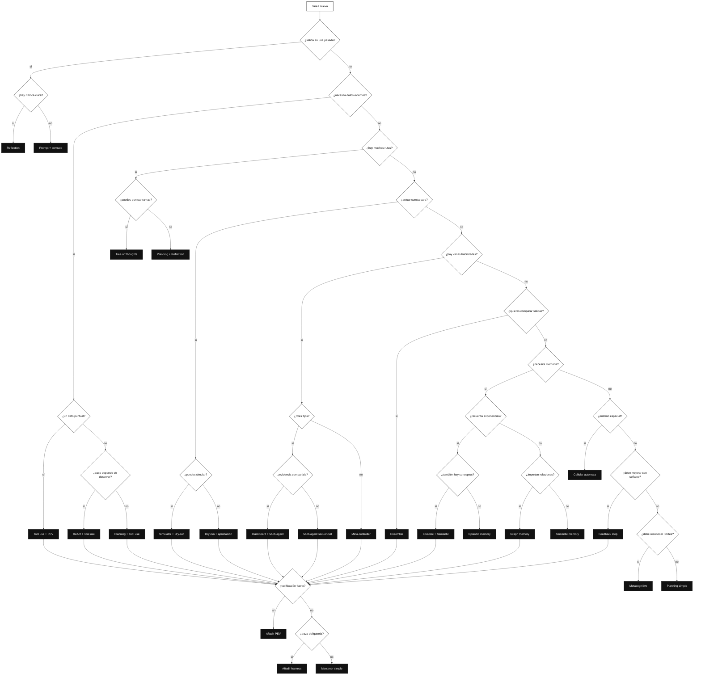

IA para gente curiosa / Facsímil 05 / Capítulo 05 / 686f6c61

La parte final del árbol es deliberada: aunque una rama ya te haya recomendado una arquitectura, todavía pregunta por verificación y traza. En sistemas con agentes no basta con elegir el patrón; hay que decidir cómo sabrás que funcionó.

| Si el árbol llega a... | Léelo así |
|---|---|
| **Reflection** | La tarea cabe en una salida, pero necesitas revisión explícita. |
| **Tool use + PEV** | Hay una consulta externa y debes validar el resultado. |
| **ReAct + Tool use** | El siguiente paso depende de lo que observes. |
| **Planning + Tool use** | Sabes los pasos antes de ejecutar, pero necesitas datos externos. |
| **Tree of Thoughts** | Hay varias rutas y puedes evaluar estados intermedios. |
| **Simulator + Dry-run** | Antes de actuar, puedes probar consecuencias. |
| **Blackboard + Multi-agent** | Varios especialistas necesitan escribir sobre la misma evidencia. |
| **Meta-controller** | No sabes de antemano qué especialista conviene. |
| **Ensemble** | Quieres comparar varias salidas antes de decidir. |
| **Episodic + Semantic** | Necesitas recordar experiencias y conceptos estables. |
| **Graph memory** | Las relaciones entre entidades son parte del problema. |
| **Cellular automata** | El comportamiento global sale de muchas reglas locales. |
| **Feedback loop** | La tarea se repite y quieres conservar señales de mejora. |
| **Metacognitive** | La calidad incluye saber cuándo responder, usar tool, pedir revisión o parar. |

## Mapa visual de arquitecturas agentic

<svg id="f5-c05-agentic-architectures" xmlns="http://www.w3.org/2000/svg" viewBox="0 0 1320 980" role="img" aria-label="Mapa de familias de arquitecturas agentic con patrones fundamentales, multiagente, memoria, fiabilidad y aprendizaje">
  <defs>
    <marker id="f5c05-arrow" viewBox="0 0 10 10" refX="9" refY="5" markerWidth="7" markerHeight="7" orient="auto-start-reverse">
      <path d="M 0 0 L 10 5 L 0 10 z" fill="#111111"/>
    </marker>
    <pattern id="f5c05-grid" width="18" height="18" patternUnits="userSpaceOnUse">
      <path d="M 18 0 L 0 0 0 18" fill="none" stroke="#EEEEEE" stroke-width="1"/>
    </pattern>
  </defs>

  <rect x="24" y="24" width="1272" height="932" rx="18" fill="#FFFFFF" stroke="#111111" stroke-width="2"/>
  <text x="660" y="64" text-anchor="middle" font-family="Arial, sans-serif" font-size="26" font-weight="700" fill="#111111">Mapa de arquitecturas agentic</text>
  <text x="660" y="92" text-anchor="middle" font-family="Arial, sans-serif" font-size="13" fill="#555555">La arquitectura decide cómo se reparten memoria, tools, planificación, verificación y coordinación.</text>
  <rect x="58" y="126" width="1204" height="744" rx="14" fill="url(#f5c05-grid)" stroke="#DDDDDD"/>

  <g font-family="Arial, sans-serif">
    <rect x="92" y="166" width="214" height="604" rx="14" fill="#FFFFFF" stroke="#111111" stroke-width="1.5"/>
    <text x="199" y="198" text-anchor="middle" font-size="15" font-weight="700">Fundacionales</text>
    <text x="199" y="220" text-anchor="middle" font-size="10" fill="#555555">mejoran un agente único</text>
    <rect x="118" y="248" width="162" height="56" rx="9" fill="#111111"/>
    <text x="199" y="273" text-anchor="middle" font-size="12" font-weight="700" fill="#FFFFFF">01 Reflection</text>
    <text x="199" y="290" text-anchor="middle" font-size="9" fill="#E8E8E8">generar · criticar · revisar</text>
    <rect x="118" y="324" width="162" height="56" rx="9" fill="#FFFFFF" stroke="#111111"/>
    <text x="199" y="349" text-anchor="middle" font-size="12" font-weight="700">02 Tool use</text>
    <text x="199" y="366" text-anchor="middle" font-size="9" fill="#555555">salir al mundo</text>
    <rect x="118" y="400" width="162" height="56" rx="9" fill="#FFFFFF" stroke="#111111"/>
    <text x="199" y="425" text-anchor="middle" font-size="12" font-weight="700">03 ReAct</text>
    <text x="199" y="442" text-anchor="middle" font-size="9" fill="#555555">razonar · actuar · observar</text>
    <rect x="118" y="476" width="162" height="56" rx="9" fill="#FFFFFF" stroke="#111111"/>
    <text x="199" y="501" text-anchor="middle" font-size="12" font-weight="700">04 Planning</text>
    <text x="199" y="518" text-anchor="middle" font-size="9" fill="#555555">plan antes de ejecutar</text>

    <rect x="334" y="166" width="214" height="604" rx="14" fill="#F8F8F8" stroke="#111111" stroke-width="1.5"/>
    <text x="441" y="198" text-anchor="middle" font-size="15" font-weight="700">Colaboración</text>
    <text x="441" y="220" text-anchor="middle" font-size="10" fill="#555555">divide responsabilidad</text>
    <rect x="360" y="248" width="162" height="56" rx="9" fill="#111111"/>
    <text x="441" y="273" text-anchor="middle" font-size="12" font-weight="700" fill="#FFFFFF">05 Multi-agent</text>
    <text x="441" y="290" text-anchor="middle" font-size="9" fill="#E8E8E8">especialistas</text>
    <rect x="360" y="324" width="162" height="56" rx="9" fill="#FFFFFF" stroke="#111111"/>
    <text x="441" y="349" text-anchor="middle" font-size="12" font-weight="700">07 Blackboard</text>
    <text x="441" y="366" text-anchor="middle" font-size="9" fill="#555555">memoria compartida</text>
    <rect x="360" y="400" width="162" height="56" rx="9" fill="#FFFFFF" stroke="#111111"/>
    <text x="441" y="425" text-anchor="middle" font-size="12" font-weight="700">11 Meta-control</text>
    <text x="441" y="442" text-anchor="middle" font-size="9" fill="#555555">router supervisor</text>
    <rect x="360" y="476" width="162" height="56" rx="9" fill="#FFFFFF" stroke="#111111"/>
    <text x="441" y="501" text-anchor="middle" font-size="12" font-weight="700">13 Ensemble</text>
    <text x="441" y="518" text-anchor="middle" font-size="9" fill="#555555">vistas paralelas</text>

    <rect x="576" y="166" width="214" height="604" rx="14" fill="#FFFFFF" stroke="#111111" stroke-width="1.5"/>
    <text x="683" y="198" text-anchor="middle" font-size="15" font-weight="700">Memoria y razonamiento</text>
    <text x="683" y="220" text-anchor="middle" font-size="10" fill="#555555">explora y recuerda</text>
    <rect x="602" y="248" width="162" height="56" rx="9" fill="#111111"/>
    <text x="683" y="273" text-anchor="middle" font-size="12" font-weight="700" fill="#FFFFFF">08 Dual memory</text>
    <text x="683" y="290" text-anchor="middle" font-size="9" fill="#E8E8E8">episódica · semántica</text>
    <rect x="602" y="324" width="162" height="56" rx="9" fill="#FFFFFF" stroke="#111111"/>
    <text x="683" y="349" text-anchor="middle" font-size="12" font-weight="700">09 ToT</text>
    <text x="683" y="366" text-anchor="middle" font-size="9" fill="#555555">ramas de pensamiento</text>
    <rect x="602" y="400" width="162" height="56" rx="9" fill="#FFFFFF" stroke="#111111"/>
    <text x="683" y="425" text-anchor="middle" font-size="12" font-weight="700">12 Graph memory</text>
    <text x="683" y="442" text-anchor="middle" font-size="9" fill="#555555">entidades y relaciones</text>

    <rect x="818" y="166" width="214" height="604" rx="14" fill="#F8F8F8" stroke="#111111" stroke-width="1.5"/>
    <text x="925" y="198" text-anchor="middle" font-size="15" font-weight="700">Fiabilidad</text>
    <text x="925" y="220" text-anchor="middle" font-size="10" fill="#555555">mide antes de soltar</text>
    <rect x="844" y="248" width="162" height="56" rx="9" fill="#111111"/>
    <text x="925" y="273" text-anchor="middle" font-size="12" font-weight="700" fill="#FFFFFF">06 PEV</text>
    <text x="925" y="290" text-anchor="middle" font-size="9" fill="#E8E8E8">plan · execute · verify</text>
    <rect x="844" y="324" width="162" height="56" rx="9" fill="#FFFFFF" stroke="#111111"/>
    <text x="925" y="349" text-anchor="middle" font-size="12" font-weight="700">10 Simulator</text>
    <text x="925" y="366" text-anchor="middle" font-size="9" fill="#555555">probar consecuencias</text>
    <rect x="844" y="400" width="162" height="56" rx="9" fill="#FFFFFF" stroke="#111111"/>
    <text x="925" y="425" text-anchor="middle" font-size="12" font-weight="700">14 Dry-run</text>
    <text x="925" y="442" text-anchor="middle" font-size="9" fill="#555555">simular antes de aplicar</text>
    <rect x="844" y="476" width="162" height="56" rx="9" fill="#FFFFFF" stroke="#111111"/>
    <text x="925" y="501" text-anchor="middle" font-size="12" font-weight="700">17 Metacognitive</text>
    <text x="925" y="518" text-anchor="middle" font-size="9" fill="#555555">saber cuándo parar</text>

    <rect x="1060" y="166" width="166" height="604" rx="14" fill="#FFFFFF" stroke="#111111" stroke-width="1.5"/>
    <text x="1143" y="198" text-anchor="middle" font-size="15" font-weight="700">Aprendizaje</text>
    <text x="1143" y="220" text-anchor="middle" font-size="10" fill="#555555">mejora y emergencia</text>
    <rect x="1082" y="248" width="122" height="56" rx="9" fill="#111111"/>
    <text x="1143" y="273" text-anchor="middle" font-size="12" font-weight="700" fill="#FFFFFF">15 Feedback</text>
    <text x="1143" y="290" text-anchor="middle" font-size="9" fill="#E8E8E8">guardar señales</text>
    <rect x="1082" y="324" width="122" height="56" rx="9" fill="#FFFFFF" stroke="#111111"/>
    <text x="1143" y="349" text-anchor="middle" font-size="12" font-weight="700">16 Cellular</text>
    <text x="1143" y="366" text-anchor="middle" font-size="9" fill="#555555">reglas locales</text>

    <path d="M280 428 H360" stroke="#111111" stroke-width="1.2" marker-end="url(#f5c05-arrow)"/>
    <path d="M522 428 H602" stroke="#111111" stroke-width="1.2" marker-end="url(#f5c05-arrow)"/>
    <path d="M764 428 H844" stroke="#111111" stroke-width="1.2" marker-end="url(#f5c05-arrow)"/>
    <path d="M1006 428 H1082" stroke="#111111" stroke-width="1.2" marker-end="url(#f5c05-arrow)"/>

    <rect x="116" y="808" width="1088" height="40" rx="10" fill="#FFFFFF" stroke="#111111" stroke-width="1.3"/>
    <text x="660" y="833" text-anchor="middle" font-size="12" fill="#555555">Elegir patrón = maximizar utilidad y restar coste, latencia y dificultad de verificación.</text>
  </g>

  <text opacity="0.55" x="1244" y="920" text-anchor="end" font-family="Arial, sans-serif" font-size="11" fill="#888888">IA para gente curiosa / Facsímil 05 / Capítulo 05 / 686f6c61</text>
</svg>

La figura no coloca los patrones en una escalera moral. No hay una arquitectura “mejor” en abstracto. Hay familias que resuelven problemas distintos: mejorar una respuesta, usar herramientas, coordinar especialistas, recordar, verificar, simular o aprender de señales.

## Arquitecturas agentic: las 17 del catálogo

El apartado se llama así a propósito: no estamos enumerando “técnicas sueltas”, sino **arquitecturas agentic**. Cada una toma las piezas del capítulo 02 y decide cómo se conectan. En todas hay que preguntar lo mismo: qué estado guarda, qué acciones permite, qué observaciones acepta, qué política decide y qué criterio de parada evita que el sistema siga por inercia.

El catálogo de Khan lista 17 notebooks principales y los presenta como un recorrido progresivo: patrones fundacionales, colaboración multiagente, memoria/razonamiento, fiabilidad y aprendizaje.^[Khan, F. (2026). *All Agentic Architectures*. Repositorio GitHub. https://github.com/FareedKhan-dev/all-agentic-architectures. Consultado el 10 de junio de 2026.] Aquí los explicamos con más lente de ingeniería.

Cada arquitectura incluye un Mermaid propio. No son adornos: son una forma rápida de ver qué entra, qué estado cambia, dónde se decide, qué se comprueba y cuándo termina el flujo.

### 01. Arquitectura Reflection

Reflection convierte una salida en un pequeño ciclo editorial: generar, criticar, revisar y volver a evaluar. No añade conocimiento nuevo por sí misma; añade una segunda mirada estructurada sobre lo ya producido. En código o escritura técnica, esto permite separar “crear” de “revisar”. El notebook `01_reflection.ipynb` lo presenta como el paso de un generador de una sola pasada a un agente que produce, evalúa y mejora antes de entregar.

El estado mínimo contiene la primera versión, una rúbrica, los hallazgos de la crítica y la versión corregida. La política decide si basta una revisión o si hace falta otra iteración. La métrica no debería ser “suena mejor”, sino defectos corregidos, tests que pasan, citas arregladas o errores eliminados.

Reflexion formaliza una idea cercana: agentes que usan feedback verbal para mejorar decisiones futuras.^[Shinn, N. et al. (2023). *Reflexion: Language Agents with Verbal Reinforcement Learning*. https://arxiv.org/abs/2303.11366] Self-Refine estudia el ciclo generar-feedback-refinar sin entrenamiento adicional.^[Madaan, A. et al. (2023). *Self-Refine: Iterative Refinement with Self-Feedback*. https://arxiv.org/abs/2303.17651] La trampa: si la crítica es vaga, solo produces una segunda respuesta igual de frágil pero más cara.

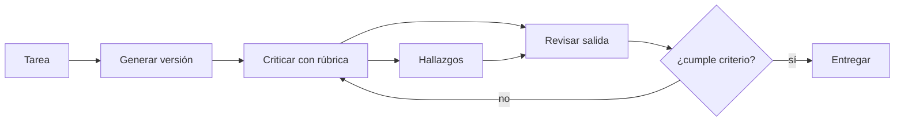

IA para gente curiosa / Facsímil 05 / Capítulo 05 / 686f6c61

### 02. Arquitectura Tool use

Tool use aparece cuando el modelo no debe inventar una respuesta desde memoria paramétrica, sino pedir ayuda a una función externa: buscar, calcular, consultar una base de datos, abrir una URL o validar un JSON. Aquí la arquitectura separa lenguaje natural de ejecución. El notebook `02_tool_use.ipynb` lo plantea como el puente entre el razonamiento del LLM y datos vivos: APIs, funciones y fuentes que no caben en los pesos del modelo.

El estado mínimo contiene la intención de la tarea, el catálogo de herramientas, el esquema de entrada de cada tool, permisos, timeouts y observaciones. La salida importante no es el texto final, sino el par `tool_call -> tool_result`: ahí se ve si el agente usó una capacidad real o solo la mencionó.

Toolformer mostró que los modelos pueden aprender cuándo llamar herramientas, pero en sistemas de ingeniería se declara un contrato explícito.^[Schick, T. et al. (2023). *Toolformer: Language Models Can Teach Themselves to Use Tools*. https://doi.org/10.48550/arXiv.2302.04761] Las APIs modernas de agentes siguen esa línea: tools con descripción, esquema y resultado verificable.^[Anthropic. (2026). *How to implement tool use*. https://docs.anthropic.com/en/docs/agents-and-tools/tool-use/implement-tool-use. Consultado el 10 de junio de 2026.] Cuidado: una tool sin validación es solo una nueva forma de meter ruido.

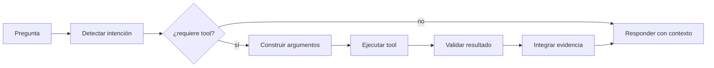

IA para gente curiosa / Facsímil 05 / Capítulo 05 / 686f6c61

### 03. Arquitectura ReAct

ReAct combina razonamiento y acción en un bucle: pensar el siguiente paso, ejecutar una tool, observar, actualizar y volver a decidir. Es la arquitectura que más claramente conecta con \(s_t, a_t, o_{t+1}, T\). El notebook `03_ReAct.ipynb` compara un agente de tool use de una sola llamada con un agente capaz de iterar `think -> act -> observe`.

Encaja cuando el siguiente paso depende de lo que se observa: investigar una librería, revisar una web, depurar un error, comparar fuentes. No encaja cuando el flujo está cerrado y siempre se ejecuta igual; ahí un workflow simple suele ser más barato y auditable.

El paper de ReAct mostró que intercalar razonamiento y acción ayuda en tareas que requieren información externa y decisiones sucesivas.^[Yao, S. et al. (2023). *ReAct: Synergizing Reasoning and Acting in Language Models*. *International Conference on Learning Representations*. https://arxiv.org/abs/2210.03629] El cuidado principal es la parada: si una observación no cambia el estado, repetir otra tool parecida rara vez mejora el sistema.

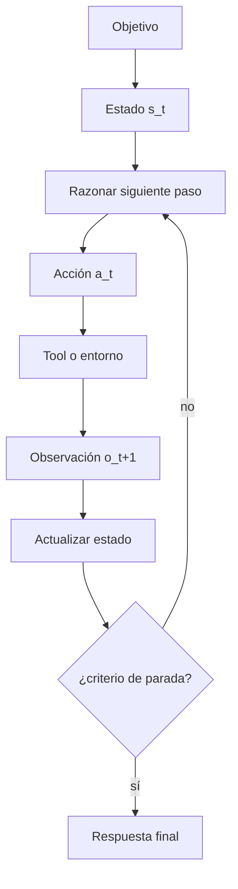

IA para gente curiosa / Facsímil 05 / Capítulo 05 / 686f6c61

### 04. Arquitectura Planning

Planning separa planificar de ejecutar. El agente crea una descomposición de la tarea antes de tocar herramientas o producir la respuesta final. Esto da estructura, permite revisar el plan y hace visible si la solución omitió pasos. El notebook `04_planning.ipynb` compara esta estrategia con ReAct: en vez de reaccionar paso a paso, crea una secuencia de subtareas antes de ejecutar.

El estado mínimo contiene objetivo, lista de subtareas, dependencias, estado de cada paso y evidencias asociadas. Si el plan no se actualiza al recibir observaciones, no es una arquitectura viva: es una lista decorativa.

La planificación automática tiene una tradición larga en IA clásica, desde lenguajes como PDDL hasta enfoques de planificación heurística.^[McDermott, D. et al. (1998). *PDDL: The Planning Domain Definition Language Version 1.2*. Technical Report CVC TR-98-003/DCS TR-1165.]^[Bonet, B. y Geffner, H. (2001). Planning as heuristic search. *Artificial Intelligence, 129*(1-2), 5-33.] En agentes con LLM, el plan es útil si se puede verificar y corregir, no si solo parece ordenado.

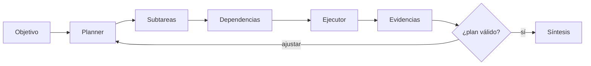

IA para gente curiosa / Facsímil 05 / Capítulo 05 / 686f6c61

### 05. Arquitectura Multi-Agent Systems

Multi-agent divide el trabajo entre especialistas: un agente investiga, otro escribe, otro verifica, otro sintetiza. Su valor no está en tener muchos nombres, sino en separar responsabilidades que tienen criterios de calidad distintos. El notebook `05_multi_agent.ipynb` usa un ejemplo de análisis de mercado con analistas especializados y un agente gestor que sintetiza.

El estado mínimo incluye roles, entradas, salidas esperadas, permisos de cada agente y un mecanismo de integración. Si todos los agentes pueden hacer lo mismo, no hay arquitectura; hay redundancia cara.

El ejemplo editorial del capítulo 02 encaja aquí: un agente RAE revisa lengua, otro APA revisa referencias y otro navegador comprueba fuentes. Cada uno produce observaciones distintas. La coordinación puede ser un workflow fijo o un agente coordinador, según si el orden depende de resultados intermedios.

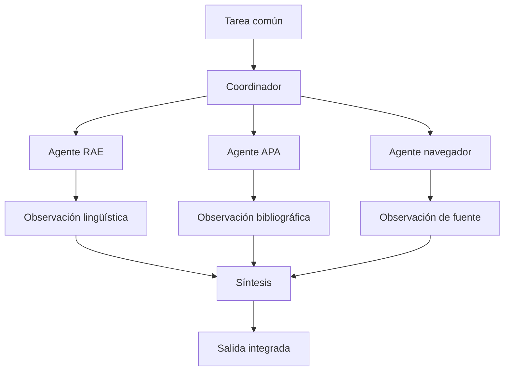

IA para gente curiosa / Facsímil 05 / Capítulo 05 / 686f6c61

### 06. Arquitectura PEV: Plan, Execute, Verify

PEV separa tres momentos: planificar, ejecutar y verificar. Parece obvio, pero cambia mucho el diseño: la verificación deja de ser una sensación final y se convierte en una fase con datos propios. El notebook `06_PEV.ipynb` lo muestra como un planificador-ejecutor al que se añade un verificador para detectar fallos de herramientas y activar recuperación.

El estado mínimo contiene plan, resultado de ejecución, verificador, errores detectados y acción correctiva. Sirve cuando las herramientas fallan, las fuentes pueden no respaldar una afirmación o el código puede pasar por estados intermedios incorrectos.

Anthropic recomienda desarrollar tests para aplicaciones con LLM, precisamente porque las respuestas deben medirse en escenarios concretos y no solo leerse a ojo.^[Anthropic. (2025). *Develop Tests for LLM Applications*. https://platform.claude.com/docs/en/build-with-claude/develop-tests.] La trampa de PEV es poner otro LLM como “verificador” sin rúbrica, tests ni evidencia externa.

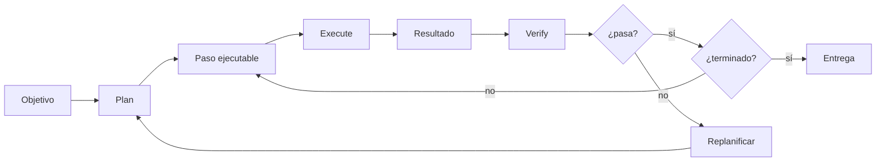

IA para gente curiosa / Facsímil 05 / Capítulo 05 / 686f6c61

### 07. Arquitectura Blackboard

Blackboard usa una memoria compartida donde varios especialistas escriben hallazgos parciales. El controlador observa el estado del tablero y decide qué especialista debe actuar después. El notebook `07_blackboard.ipynb` lo contrapone a un multiagente secuencial: en vez de pasar siempre por A, B y C, el controlador activa al especialista que el tablero necesita en ese momento.

Esta idea viene de sistemas clásicos de IA: el modelo blackboard se usaba para resolver problemas complejos mediante fuentes de conocimiento especializadas que colaboran sobre una estructura común.^[Nii, H. P. (1986). Blackboard systems: The blackboard model of problem solving and the evolution of blackboard architectures. *AI Magazine, 7*(2), 38-53.] En agentes modernos, el blackboard puede ser una tabla, un documento, una base vectorial, un grafo o un estado de LangGraph.

El estado mínimo necesita autor, fuente, timestamp, confianza, versión y relación con otras evidencias. Si el tablero no distingue “hecho”, “hipótesis” y “conclusión”, se vuelve una pared llena de notas imposibles de auditar.

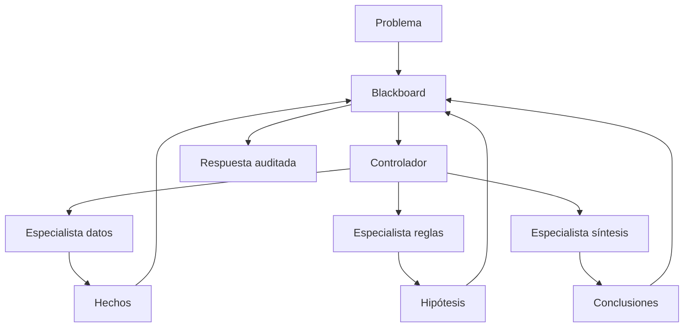

IA para gente curiosa / Facsímil 05 / Capítulo 05 / 686f6c61

### 08. Arquitectura Episodic + Semantic Memory

La memoria episódica guarda experiencias: qué pasó, cuándo, con quién, en qué tarea. La memoria semántica guarda conocimiento más estable: conceptos, preferencias, hechos, reglas, entidades. Combinarlas evita dos extremos: olvidar todo o recordar texto bruto sin estructura. El notebook `08_episodic_with_semantic.ipynb` usa una base vectorial para episodios y Neo4j para hechos y relaciones.

Un asistente de proyecto puede guardar episodios como “la última vez el build falló por KaTeX” y conocimiento semántico como “este libro exige Mermaid en cada capítulo”. La recuperación debe explicar por qué trae una memoria concreta.

Generative Agents popularizó una arquitectura con memoria, reflexión y planificación para simular comportamiento persistente de agentes en un entorno.^[Park, J. S. et al. (2023). *Generative Agents: Interactive Simulacra of Human Behavior*. https://arxiv.org/abs/2304.03442] La regla práctica: toda memoria debe tener fuente, fecha, caducidad y mecanismo de corrección.

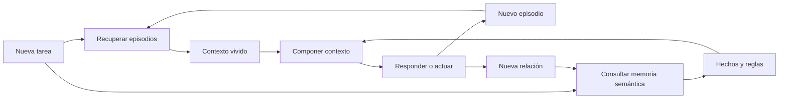

IA para gente curiosa / Facsímil 05 / Capítulo 05 / 686f6c61

### 09. Arquitectura Tree of Thoughts

Tree of Thoughts no sigue una sola cadena de razonamiento. Construye varias ramas, evalúa estados intermedios y poda caminos poco prometedores. Es búsqueda aplicada al razonamiento con LLM. El notebook `09_tree_of_thoughts.ipynb` usa el problema del lobo, la cabra y la col para mostrar por qué una trayectoria lineal puede quedar atrapada y una búsqueda por ramas puede recuperar el camino.

El estado mínimo contiene nodos, puntuación de cada rama, profundidad, criterio de expansión y criterio de poda. Encaja en puzzles lógicos, planificación con restricciones, demostraciones o decisiones donde una mala primera intuición arrastra toda la respuesta.

El paper de Tree of Thoughts propone deliberar mediante búsqueda sobre unidades de pensamiento, no solo generar una secuencia lineal.^[Yao, S. et al. (2023). *Tree of Thoughts: Deliberate Problem Solving with Large Language Models*. https://arxiv.org/abs/2305.10601] La factura aparece rápido: ancho de búsqueda por profundidad por coste de evaluación. Sin límites, es elegante y carísimo.

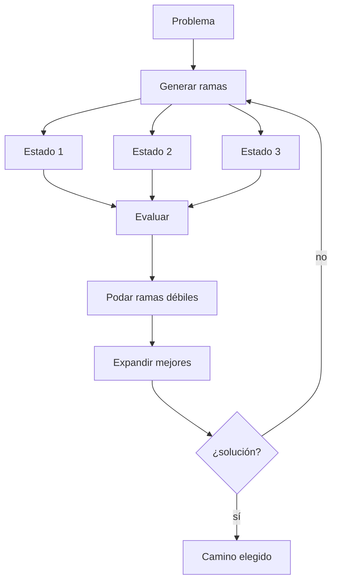

IA para gente curiosa / Facsímil 05 / Capítulo 05 / 686f6c61

### 10. Arquitectura Mental Loop o Simulator

Mental Loop introduce un simulador interno. Antes de actuar, el agente prueba una consecuencia en un modelo del entorno: “si hago esto, ¿qué pasaría?”. Puede ser un simulador real, una función determinista, una evaluación de impacto o una réplica controlada. El notebook `10_mental_loop.ipynb` usa un agente de trading que ensaya una estrategia en una copia del mercado antes de actuar.

El estado mínimo contiene acción propuesta, simulación, predicción, incertidumbre y decisión. Sirve cuando actuar tiene coste: cambiar una base de datos, modificar un archivo, ejecutar una orden, mover inventario o recomendar una decisión profesional.

La clave no es “imaginar” consecuencias, sino comparar predicción y resultado real en casos pequeños. Si el simulador no se calibra, tranquiliza sin proteger.

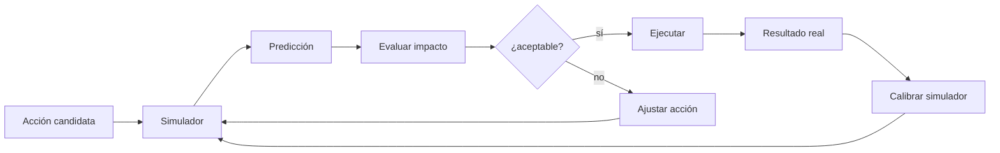

IA para gente curiosa / Facsímil 05 / Capítulo 05 / 686f6c61

### 11. Arquitectura Meta-Controller

Meta-controller es un router con criterio. Recibe una tarea, estima qué especialista o flujo conviene y delega. Es útil cuando hay muchas capacidades disponibles y elegir mal la primera acción ya encarece todo. El notebook `11_meta_controller.ipynb` usa tres especialistas: generalista, investigación y código; el controlador decide quién debe responder.

El estado mínimo contiene intención clasificada, capacidades disponibles, coste esperado, restricciones y resultado del especialista. El meta-controlador debería aprender de errores de enrutamiento: cuántas veces manda una consulta técnica al agente equivocado, cuánto tarda y qué calidad final obtiene.

OpenAI Agents SDK ofrece handoffs entre agentes, una forma práctica de representar esta delegación controlada.^[OpenAI. (2026). *Agents SDK*. https://developers.openai.com/api/docs/guides/agents. Consultado el 10 de junio de 2026.] La trampa es convertir el router en un “jefe” que opina de todo. Su trabajo principal es enrutar, medir y corregir routing.

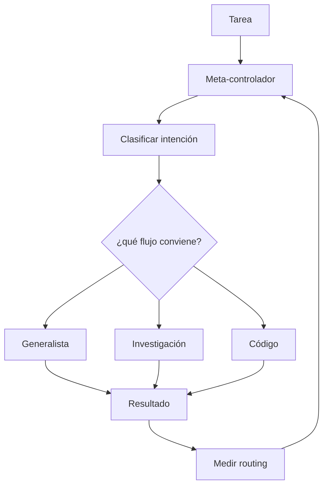

IA para gente curiosa / Facsímil 05 / Capítulo 05 / 686f6c61

### 12. Arquitectura Graph o World-Model Memory

Graph memory guarda entidades y relaciones: autor-publicó-paper, capítulo-cita-fuente, herramienta-produce-observación, concepto-depende-de-concepto. Esto permite preguntas multi-hop que una lista de chunks recuperados no resuelve bien. El notebook `12_graph.ipynb` construye un agente de inteligencia corporativa que extrae compañías, personas, productos y relaciones hacia un grafo consultable.

El estado mínimo contiene nodos, aristas, tipos, procedencia y reglas de actualización. Encaja cuando importa la estructura: ontologías, dependencias de software, investigación documental, mapas conceptuales o memoria de proyecto.

Los knowledge graphs se estudian como estructuras para representar entidades y relaciones consultables.^[Hogan, A. et al. (2021). Knowledge graphs. *ACM Computing Surveys, 54*(4). https://doi.org/10.1145/3447772] En agentes, el grafo no reemplaza RAG; lo complementa cuando las relaciones importan tanto como los documentos.

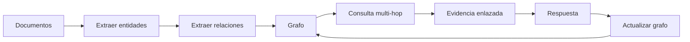

IA para gente curiosa / Facsímil 05 / Capítulo 05 / 686f6c61

### 13. Arquitectura Ensemble

Ensemble ejecuta varias perspectivas y agrega. Puede significar varios modelos, varios prompts, varios agentes especialistas o varias trayectorias de razonamiento. Es útil cuando el error de una sola trayectoria sería demasiado frágil. El notebook `13_ensemble.ipynb` usa un comité de inversión con perfiles distintos y un agregador que sintetiza consenso y discrepancias.

El estado mínimo contiene respuestas candidatas, criterios de comparación, discrepancias, agregación y decisión final. Agregar no es hacer media de frases ni votar por mayoría sin mirar evidencia.

Self-consistency mostró que muestrear varios razonamientos y agregar respuestas puede mejorar razonamiento sobre chain-of-thought.^[Wang, X. et al. (2023). *Self-Consistency Improves Chain of Thought Reasoning in Language Models*. *International Conference on Learning Representations*. https://arxiv.org/abs/2203.11171] En un agente editorial, por ejemplo, un ensemble puede comparar tres verificaciones de una cita, pero la síntesis debe explicar por qué acepta una.

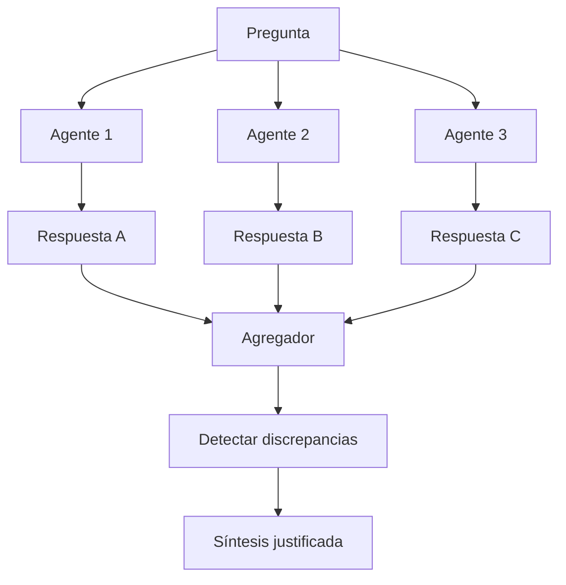

IA para gente curiosa / Facsímil 05 / Capítulo 05 / 686f6c61

### 14. Arquitectura Dry-Run Harness

Dry-run harness exige simular antes de aplicar. No basta con que el agente diga “haría esto”; debe mostrar diff, efecto esperado, coste, permisos y plan de reversión antes de tocar el entorno real. El notebook `14_dry_run.ipynb` usa un agente de redes sociales corporativas que primero ejecuta en modo `dry_run=True`, muestra la traza y solo después permite publicar.

El estado mínimo contiene acción propuesta, simulación, diff, comprobaciones, aprobación y resultado tras aplicar. Encaja muy bien con herramientas de código, operaciones, migraciones y flujos editoriales de publicación.

La documentación de tracing del Agents SDK es relevante porque un dry-run sin traza no se puede auditar después.^[OpenAI. (2026). *Agents SDK: Tracing*. https://openai.github.io/openai-agents-python/tracing/. Consultado el 10 de junio de 2026.] En producción, el dry-run debe ser legible por una persona y comparable contra el resultado real.

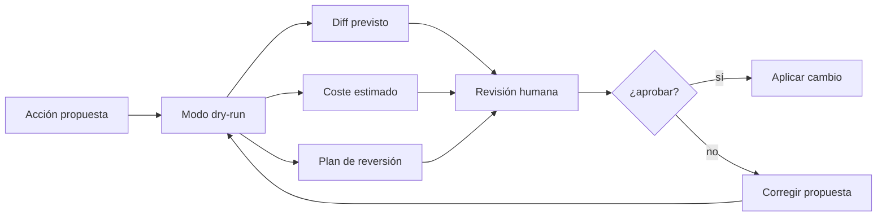

IA para gente curiosa / Facsímil 05 / Capítulo 05 / 686f6c61

### 15. Arquitectura RLHF / Self-Improvement

En el catálogo aparece como un bucle de feedback: una salida se revisa, se corrige y las mejores señales se guardan para mejorar futuras ejecuciones. No hay que confundirlo con entrenar un modelo desde cero; muchas veces es curar ejemplos, rúbricas y preferencias de aplicación. El notebook `15_RLHF.ipynb` lo aproxima con un agente redactor y un editor que puntúa, da feedback y fuerza revisión hasta alcanzar un umbral.

El estado mínimo contiene salida, feedback, revisión, puntuación y memoria de ejemplos aceptados. Sirve cuando la tarea es repetitiva y medible: soporte, revisión editorial, generación de informes, clasificación de tickets.

RLHF se popularizó en modelos instruidos como forma de aprender de preferencias humanas.^[Ouyang, L. et al. (2022). Training language models to follow instructions with human feedback. *Advances in Neural Information Processing Systems, 35*, 27730-27744. https://arxiv.org/abs/2203.02155] En una aplicación pequeña, el equivalente práctico suele ser más humilde: guardar buenas correcciones, no premiar salidas dudosas y medir si el sistema mejora en un conjunto fijo.

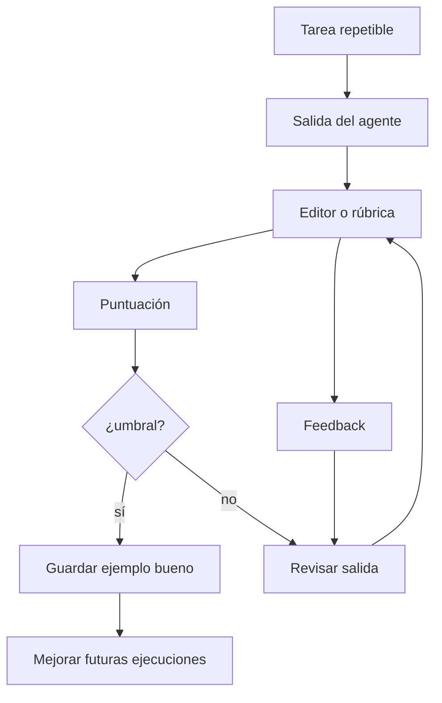

IA para gente curiosa / Facsímil 05 / Capítulo 05 / 686f6c61

### 16. Arquitectura Cellular Automata

Cellular Automata no es una arquitectura típica de chat. Modela muchos agentes simples con reglas locales. De esas reglas puede emerger comportamiento global: rutas, congestión, propagación, distribución de recursos. El notebook `16_cellular_automata.ipynb` usa una simulación de almacén donde las celdas de una rejilla propagan información para encontrar rutas.

El estado mínimo contiene una rejilla o grafo, celdas/agentes, vecindad, regla de actualización y métrica global. Encaja en simulación espacial, logística, planificación de rutas, ocupación de salas o fenómenos donde la interacción local importa.

Su lección para agentes LLM es conceptual: no siempre necesitas un agente muy inteligente. A veces necesitas muchos componentes simples, reglas claras y una buena visualización del estado global.

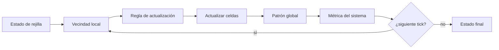

IA para gente curiosa / Facsímil 05 / Capítulo 05 / 686f6c61

### 17. Arquitectura Reflexive Metacognitive

Reflexive Metacognitive añade un modelo de las propias capacidades del sistema: qué sabe hacer, qué no sabe, qué herramienta necesita, cuándo debe pedir revisión y cuándo debe parar. Bien diseñada, no es modestia verbal; es control operativo. El notebook `17_reflexive_metacognitive.ipynb` lo demuestra con un asistente de triaje médico-informativo que primero consulta su self-model antes de responder, usar una tool o escalar.

El estado mínimo contiene capacidad requerida, confianza calibrada, evidencia disponible, acciones permitidas y salida posible: responder, usar tool, pedir ayuda o detenerse. Encaja en asesoramiento técnico, triaje profesional, revisión de fuentes o decisiones donde reconocer límites es parte de la calidad.

La diferencia con Reflection es importante. Reflection revisa una salida. Metacognición decide si el sistema está en condiciones de actuar. Si solo añade frases tipo “podría estar equivocado” sin cambiar la política, no aporta arquitectura.

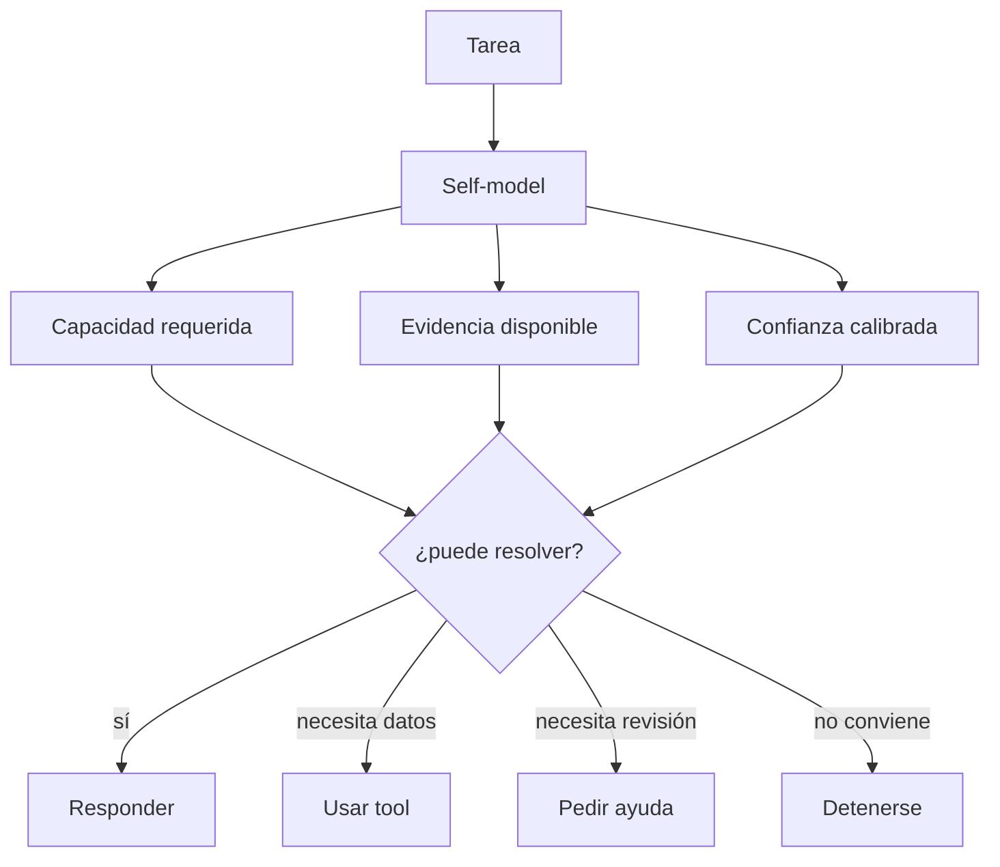

IA para gente curiosa / Facsímil 05 / Capítulo 05 / 686f6c61

Hay una línea clara con lo visto antes. Chain-of-thought mostró que pedir razonamiento intermedio puede mejorar tareas que requieren varios pasos.^[Wei, J. et al. (2022). Chain-of-thought prompting elicits reasoning in large language models. *Advances in Neural Information Processing Systems, 35*, 24824-24837. https://arxiv.org/abs/2201.11903] Self-consistency añadió una idea que conecta con ensemble: muestrear varios razonamientos y agregar la respuesta puede ser más robusto que confiar en una sola trayectoria.^[Wang, X. et al. (2023). *Self-Consistency Improves Chain of Thought Reasoning in Language Models*. *International Conference on Learning Representations*. https://arxiv.org/abs/2203.11171] ReAct formaliza la alternancia entre razonamiento y acción con observaciones de herramientas.^[Yao, S. et al. (2023). *ReAct: Synergizing Reasoning and Acting in Language Models*. *International Conference on Learning Representations*. https://arxiv.org/abs/2210.03629] Toolformer mostró que el uso de herramientas puede aprenderse como parte del comportamiento del modelo, aunque en ingeniería solemos envolverlo con schemas y validadores.^[Schick, T. et al. (2023). *Toolformer: Language Models Can Teach Themselves to Use Tools*. https://doi.org/10.48550/arXiv.2302.04761] Tree of Thoughts empuja la idea de explorar varios caminos de razonamiento antes de comprometerse con una respuesta.^[Yao, S. et al. (2023). *Tree of Thoughts: Deliberate Problem Solving with Large Language Models*. https://arxiv.org/abs/2305.10601]

## Notebooks y Colab

El repositorio está en GitHub y cada notebook se puede abrir en Colab con una URL directa. Esto es útil para clase: el alumno lee la explicación, ejecuta el patrón y luego lo traduce a su propio caso.

| # | Patrón | Notebook | Colab |
|---|---|---|---|
| 01 | Reflection | [01_reflection.ipynb](https://github.com/FareedKhan-dev/all-agentic-architectures/blob/main/01_reflection.ipynb) | [Abrir](https://colab.research.google.com/github/FareedKhan-dev/all-agentic-architectures/blob/main/01_reflection.ipynb) |
| 02 | Tool use | [02_tool_use.ipynb](https://github.com/FareedKhan-dev/all-agentic-architectures/blob/main/02_tool_use.ipynb) | [Abrir](https://colab.research.google.com/github/FareedKhan-dev/all-agentic-architectures/blob/main/02_tool_use.ipynb) |
| 03 | ReAct | [03_ReAct.ipynb](https://github.com/FareedKhan-dev/all-agentic-architectures/blob/main/03_ReAct.ipynb) | [Abrir](https://colab.research.google.com/github/FareedKhan-dev/all-agentic-architectures/blob/main/03_ReAct.ipynb) |
| 04 | Planning | [04_planning.ipynb](https://github.com/FareedKhan-dev/all-agentic-architectures/blob/main/04_planning.ipynb) | [Abrir](https://colab.research.google.com/github/FareedKhan-dev/all-agentic-architectures/blob/main/04_planning.ipynb) |
| 05 | Multi-agent | [05_multi_agent.ipynb](https://github.com/FareedKhan-dev/all-agentic-architectures/blob/main/05_multi_agent.ipynb) | [Abrir](https://colab.research.google.com/github/FareedKhan-dev/all-agentic-architectures/blob/main/05_multi_agent.ipynb) |
| 06 | PEV | [06_PEV.ipynb](https://github.com/FareedKhan-dev/all-agentic-architectures/blob/main/06_PEV.ipynb) | [Abrir](https://colab.research.google.com/github/FareedKhan-dev/all-agentic-architectures/blob/main/06_PEV.ipynb) |
| 07 | Blackboard | [07_blackboard.ipynb](https://github.com/FareedKhan-dev/all-agentic-architectures/blob/main/07_blackboard.ipynb) | [Abrir](https://colab.research.google.com/github/FareedKhan-dev/all-agentic-architectures/blob/main/07_blackboard.ipynb) |
| 08 | Episodic + Semantic Memory | [08_episodic_with_semantic.ipynb](https://github.com/FareedKhan-dev/all-agentic-architectures/blob/main/08_episodic_with_semantic.ipynb) | [Abrir](https://colab.research.google.com/github/FareedKhan-dev/all-agentic-architectures/blob/main/08_episodic_with_semantic.ipynb) |
| 09 | Tree of Thoughts | [09_tree_of_thoughts.ipynb](https://github.com/FareedKhan-dev/all-agentic-architectures/blob/main/09_tree_of_thoughts.ipynb) | [Abrir](https://colab.research.google.com/github/FareedKhan-dev/all-agentic-architectures/blob/main/09_tree_of_thoughts.ipynb) |
| 10 | Mental Loop | [10_mental_loop.ipynb](https://github.com/FareedKhan-dev/all-agentic-architectures/blob/main/10_mental_loop.ipynb) | [Abrir](https://colab.research.google.com/github/FareedKhan-dev/all-agentic-architectures/blob/main/10_mental_loop.ipynb) |
| 11 | Meta-controller | [11_meta_controller.ipynb](https://github.com/FareedKhan-dev/all-agentic-architectures/blob/main/11_meta_controller.ipynb) | [Abrir](https://colab.research.google.com/github/FareedKhan-dev/all-agentic-architectures/blob/main/11_meta_controller.ipynb) |
| 12 | Graph memory | [12_graph.ipynb](https://github.com/FareedKhan-dev/all-agentic-architectures/blob/main/12_graph.ipynb) | [Abrir](https://colab.research.google.com/github/FareedKhan-dev/all-agentic-architectures/blob/main/12_graph.ipynb) |
| 13 | Ensemble | [13_ensemble.ipynb](https://github.com/FareedKhan-dev/all-agentic-architectures/blob/main/13_ensemble.ipynb) | [Abrir](https://colab.research.google.com/github/FareedKhan-dev/all-agentic-architectures/blob/main/13_ensemble.ipynb) |
| 14 | Dry-run harness | [14_dry_run.ipynb](https://github.com/FareedKhan-dev/all-agentic-architectures/blob/main/14_dry_run.ipynb) | [Abrir](https://colab.research.google.com/github/FareedKhan-dev/all-agentic-architectures/blob/main/14_dry_run.ipynb) |
| 15 | Feedback loop | [15_RLHF.ipynb](https://github.com/FareedKhan-dev/all-agentic-architectures/blob/main/15_RLHF.ipynb) | [Abrir](https://colab.research.google.com/github/FareedKhan-dev/all-agentic-architectures/blob/main/15_RLHF.ipynb) |
| 16 | Cellular automata | [16_cellular_automata.ipynb](https://github.com/FareedKhan-dev/all-agentic-architectures/blob/main/16_cellular_automata.ipynb) | [Abrir](https://colab.research.google.com/github/FareedKhan-dev/all-agentic-architectures/blob/main/16_cellular_automata.ipynb) |
| 17 | Reflexive metacognitive | [17_reflexive_metacognitive.ipynb](https://github.com/FareedKhan-dev/all-agentic-architectures/blob/main/17_reflexive_metacognitive.ipynb) | [Abrir](https://colab.research.google.com/github/FareedKhan-dev/all-agentic-architectures/blob/main/17_reflexive_metacognitive.ipynb) |

Al abrir un Colab, fíjate en tres cosas antes de tocar código: qué estado se guarda, qué tools se declaran y qué métrica comprueba si el patrón funcionó. Si solo ves prompts largos y ninguna traza, todavía no tienes una arquitectura operable.

## Cómo elegir entre arquitecturas

La colección se puede leer como cinco familias:

| Familia | Arquitecturas | Decisión práctica |
|---|---|---|
| Patrones fundacionales | Reflection, Tool use, ReAct, Planning. | Úsalos cuando todavía puedes resolver con un agente único. |
| Colaboración | Multi-agent, Blackboard, Meta-controller, Ensemble. | Úsalos cuando hay responsabilidades separables. |
| Memoria y razonamiento | Episodic + Semantic, Tree of Thoughts, Graph memory. | Úsalos cuando el problema exige recordar o explorar caminos. |
| Fiabilidad | PEV, Simulator, Dry-run, Reflexive metacognitive. | Úsalos cuando actuar sin verificar sale caro. |
| Aprendizaje y emergencia | Feedback loop, Cellular automata. | Úsalos cuando necesitas adaptar comportamiento a partir de señales. |

Anthropic separa workflows y agents: los workflows siguen rutas predefinidas; los agents dejan que el modelo dirija dinámicamente el proceso y el uso de herramientas.^[Anthropic. (2024). *Building Effective Agents*. https://www.anthropic.com/engineering/building-effective-agents. Consultado el 10 de junio de 2026.] Esta distinción ayuda a ordenar la tabla. Planning puede ser workflow si el plan está cerrado. ReAct se acerca a agent cuando el siguiente paso depende de la observación. Multiagent puede ser workflow si los roles se ejecutan siempre igual. La arquitectura no la define el nombre: la define dónde está la decisión.

OpenAI Agents SDK ofrece una capa práctica para agentes con herramientas, handoffs, guardrails y trazas.^[OpenAI. (2026). *Agents SDK*. https://developers.openai.com/api/docs/guides/agents. Consultado el 10 de junio de 2026.] La documentación de tracing del SDK refuerza algo que aquí será constante: no evalúas solo la respuesta final, evalúas la trayectoria.^[OpenAI. (2026). *Agents SDK: Tracing*. https://openai.github.io/openai-agents-python/tracing/. Consultado el 10 de junio de 2026.] LangGraph, usado por el repositorio de Khan, encaja con estos patrones porque permite grafos con estado, ciclos y persistencia mediante checkpoints.^[LangChain. (2026). *LangGraph persistence*. https://docs.langchain.com/oss/python/langgraph/persistence. Consultado el 10 de junio de 2026.]

## Manos a la obra

**Práctica:** un decision record de arquitectura.

Kit ejecutable de este capítulo: `labs/f5/capitulo-practicas/`.

```bash
cd labs/f5/capitulo-practicas
python3 ops/run_f5_practices.py --chapter c05 --write --fail-on-invalid
```

Una práctica útil no es imprimir “usa ReAct” y seguir. Lo útil en un proyecto real es producir una ficha que cualquiera pueda revisar: **qué arquitectura propongo, por qué, qué piezas entran, qué límites tendrá, qué trazas guardará y con qué criterios aceptaré el resultado**.

El siguiente script no llama a ningún modelo. Eso es deliberado. Antes de meter OpenAI, Claude, LangGraph, un navegador o una base vectorial, obliga a diseñar el arnés que rodeará al agente. Si esta ficha no convence, el sistema todavía no está listo para gastar tokens.

```python
from dataclasses import dataclass, asdict
from datetime import datetime, timezone
import json
import uuid


@dataclass(frozen=True)
class Pattern:
    name: str
    covers: tuple[str, ...]
    cost: int
    latency: int
    verification_load: int
    why: str
    runbook_step: str


@dataclass(frozen=True)
class TaskCase:
    name: str
    goal: str
    needs: tuple[str, ...]
    max_steps: int
    max_tool_calls: int
    requires_approval: bool
    required_patterns: tuple[str, ...]
    acceptance: tuple[str, ...]


PATTERNS = [
    Pattern(
        name="Planning",
        covers=("decomposition", "audit_trail"),
        cost=2,
        latency=2,
        verification_load=2,
        why="convierte el objetivo en pasos revisables antes de ejecutar",
        runbook_step="Crear plan numerado con subtarea, entrada, salida esperada y dependencia.",
    ),
    Pattern(
        name="Tool use",
        covers=("external_data", "exact_check", "structured_output"),
        cost=2,
        latency=2,
        verification_load=3,
        why="consulta sistemas externos con contrato de entrada y salida",
        runbook_step="Declarar tools con schema, timeout, permisos y validador del resultado.",
    ),
    Pattern(
        name="ReAct",
        covers=("stepwise_observation", "external_data", "audit_trail"),
        cost=4,
        latency=4,
        verification_load=4,
        why="decide el siguiente paso a partir de cada observación",
        runbook_step="Ejecutar bucle pensar, actuar, observar y actualizar estado hasta parada.",
    ),
    Pattern(
        name="Multi-agent",
        covers=("roles", "specialized_review", "parallel_work"),
        cost=4,
        latency=3,
        verification_load=5,
        why="separa responsabilidades que tienen criterios de calidad distintos",
        runbook_step="Asignar rol, entrada, salida y límite de herramientas a cada agente.",
    ),
    Pattern(
        name="Meta-controller",
        covers=("routing", "roles", "cost_control"),
        cost=3,
        latency=2,
        verification_load=4,
        why="elige especialista o flujo sin obligar a pasar siempre por todos",
        runbook_step="Clasificar intención y enrutar solo al agente necesario.",
    ),
    Pattern(
        name="PEV",
        covers=("quality_gate", "recovery", "exact_check"),
        cost=3,
        latency=3,
        verification_load=2,
        why="separa plan, ejecución y verificación con recuperación explícita",
        runbook_step="Verificar cada salida contra criterios; si falla, corregir o replanificar.",
    ),
    Pattern(
        name="Dry-run harness",
        covers=("costly_action", "approval", "audit_trail"),
        cost=2,
        latency=2,
        verification_load=2,
        why="muestra efecto previsto antes de aplicar cambios",
        runbook_step="Generar diff, impacto esperado y plan de reversión antes de ejecutar.",
    ),
    Pattern(
        name="Reflection",
        covers=("specialized_review", "quality_gate"),
        cost=2,
        latency=2,
        verification_load=2,
        why="añade revisión crítica sobre una salida antes de entregarla",
        runbook_step="Revisar con rúbrica concreta y registrar defectos corregidos.",
    ),
]


def score(pattern, task):
    needs = set(task.needs)
    covered = needs.intersection(pattern.covers)
    missing = needs.difference(pattern.covers)

    utility = 18 * len(covered)
    penalty = 2 * pattern.cost + pattern.latency + pattern.verification_load
    missing_penalty = 3 * len(missing)

    return utility - penalty - missing_penalty


def select_patterns(task):
    by_name = {pattern.name: pattern for pattern in PATTERNS}
    selected = []
    selected_names = set()
    covered = set()
    required = set(task.needs)

    for pattern_name in task.required_patterns:
        pattern = by_name[pattern_name]
        selected.append(pattern)
        selected_names.add(pattern.name)
        covered.update(pattern.covers)

    ranked = sorted(
        PATTERNS,
        key=lambda pattern: score(pattern, task),
        reverse=True,
    )

    for pattern in ranked:
        if pattern.name in selected_names:
            continue

        gain = required.intersection(pattern.covers).difference(covered)
        if gain:
            selected.append(pattern)
            selected_names.add(pattern.name)
            covered.update(pattern.covers)

        if required.issubset(covered):
            break

    return selected, sorted(required.difference(covered))


def build_decision_record(task):
    selected, uncovered = select_patterns(task)
    run_id = f"adr-{uuid.uuid4().hex[:8]}"

    runbook = [
        {
            "order": index,
            "pattern": pattern.name,
            "step": pattern.runbook_step,
            "why": pattern.why,
        }
        for index, pattern in enumerate(selected, start=1)
    ]

    if task.requires_approval:
        runbook.append(
            {
                "order": len(runbook) + 1,
                "pattern": "Human approval",
                "step": "Revisar trazas, diff y criterios antes de publicar o modificar el sistema.",
                "why": "la tarea declara aprobación obligatoria",
            }
        )

    trace_contract = {
        "run_id": run_id,
        "timestamp": datetime.now(timezone.utc).isoformat(),
        "events_to_log": [
            "task.received",
            "architecture.selected",
            "tool.called",
            "tool.observed",
            "verification.completed",
            "dry_run.reviewed",
            "final.delivered",
        ],
        "limits": {
            "max_steps": task.max_steps,
            "max_tool_calls": task.max_tool_calls,
            "requires_approval": task.requires_approval,
        },
    }

    return {
        "task": asdict(task),
        "selected_architecture": [pattern.name for pattern in selected],
        "uncovered_needs": uncovered,
        "decision": [
            {
                "pattern": pattern.name,
                "score": score(pattern, task),
                "covers": list(pattern.covers),
                "cost": pattern.cost,
                "latency": pattern.latency,
                "verification_load": pattern.verification_load,
                "why": pattern.why,
            }
            for pattern in selected
        ],
        "runbook": runbook,
        "acceptance": list(task.acceptance),
        "trace_contract": trace_contract,
    }


case = TaskCase(
    name="Revisión académica con fuentes consultables",
    goal=(
        "Revisar un texto técnico: lengua, citas APA, coherencia con fuentes "
        "y propuesta de cambios antes de publicar."
    ),
    needs=(
        "roles",
        "external_data",
        "stepwise_observation",
        "structured_output",
        "quality_gate",
        "costly_action",
        "approval",
        "audit_trail",
    ),
    max_steps=9,
    max_tool_calls=12,
    requires_approval=True,
    required_patterns=(
        "Multi-agent",
        "Tool use",
        "ReAct",
        "PEV",
        "Dry-run harness",
    ),
    acceptance=(
        "Cada cita queda asociada a una URL o referencia revisable.",
        "La salida final separa cambios lingüísticos, APA y verificación de fuente.",
        "No se aplica ningún cambio sin diff previo.",
        "La traza permite reconstruir qué tool produjo cada observación.",
    ),
)


record = build_decision_record(case)
print(json.dumps(record, indent=2, ensure_ascii=False))
```

La salida es un **ADR pequeño**: *Architecture Decision Record*. No es documentación decorativa; es el contrato mínimo antes de construir. En el caso de revisión académica debería proponerte algo parecido a:

```text
selected_architecture:
- Multi-agent
- Tool use
- ReAct
- PEV
- Dry-run harness

runbook:
1. Asignar rol, entrada, salida y límite de herramientas a cada agente.
2. Declarar tools con schema, timeout, permisos y validador del resultado.
3. Ejecutar bucle pensar, actuar, observar y actualizar estado hasta parada.
4. Verificar cada salida contra criterios; si falla, corregir o replanificar.
5. Generar diff, impacto esperado y plan de reversión antes de ejecutar.
6. Revisar trazas, diff y criterios antes de publicar o modificar el sistema.
```

Lo importante es que este ejercicio deja varias preguntas difíciles encima de la mesa:

| Pregunta | Por qué importa |
|---|---|
| ¿Qué necesidad concreta cubre cada patrón? | Evita añadir arquitecturas por estética técnica. |
| ¿Qué eventos voy a trazar? | Sin eventos no puedes depurar trayectoria, solo leer la respuesta final. |
| ¿Qué límite de pasos y tools acepto? | ReAct y multiagente necesitan freno explícito. |
| ¿Qué criterio hace fallar una ejecución? | PEV necesita una rúbrica, no una opinión. |
| ¿Qué se revisa antes de aplicar cambios? | Dry-run solo vale si enseña diff, impacto y reversión. |

El siguiente paso natural sería conectar cada `runbook_step` con código real: un agente RAE, un agente APA, una tool de navegador, un validador JSON y un registro JSONL por ejecución. Esa implementación pertenece al capítulo de harness y trazas, pero la decisión arquitectónica ya queda hecha aquí.

## Cómo encaja todo

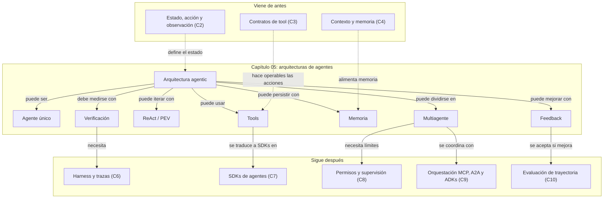

IA para gente curiosa / Facsímil 05 / Capítulo 05 / 686f6c61

## Vocabulario aprendido

| Término | Definición |
|---|---|
| **Arquitectura agentic** | Patrón que organiza estado, tools, memoria, verificación y parada. |
| **Reflection** | Generar, criticar y revisar antes de entregar. |
| **Tool use** | Delegar una parte del trabajo a una función externa. |
| **ReAct** | Intercalar razonamiento, acción y observación. |
| **Planning** | Descomponer la tarea antes de ejecutarla. |
| **PEV** | Planificar, ejecutar y verificar. |
| **Blackboard** | Espacio compartido donde varios agentes escriben evidencias. |
| **Meta-controlador** | Router que elige especialista o flujo. |
| **Ensemble** | Varios agentes producen salidas y un agregador sintetiza. |
| **Dry-run** | Simulación previa antes de aplicar un cambio. |

## Dónde solía tropezar yo

| Error | Por qué es un error | Antídoto |
|---|---|---|
| Elegir la arquitectura por moda | Un patrón complejo puede ocultar que bastaba una tool. | Empezar por la tarea y calcular coste, latencia y verificación. |
| Confundir multiagente con calidad | Más agentes pueden producir más ruido si no hay roles claros. | Definir responsabilidad, entrada y salida de cada especialista. |
| Usar memoria sin caducidad | La memoria vieja se vuelve una fuente falsa de certeza. | Guardar fuente, fecha, versión y criterio de recuperación. |
| Hacer ReAct sin parada | El bucle puede repetir observaciones sin aportar evidencia nueva. | Definir límite de pasos y criterio \(\Omega\). |
| Simular sin comprobar el simulador | Un dry-run malo tranquiliza sin proteger. | Comparar simulación con resultados reales en casos pequeños. |
| Copiar notebooks sin harness | El notebook enseña el patrón, pero no opera producción. | Añadir trazas, métricas, permisos, tests y rollback. |

## Antes de pasar página

- [ ] ¿Puedo recorrer el árbol de decisión y justificar por qué una hoja aplica o no aplica?
- [ ] ¿Puedo explicar qué problema resuelve cada una de las 17 arquitecturas?
- [ ] ¿Sé diferenciar Reflection, ReAct, Planning y PEV?
- [ ] ¿Sé cuándo usar un meta-controlador frente a un ensemble?
- [ ] ¿Entiendo por qué memoria episódica y semántica no son lo mismo?
- [ ] ¿Puedo justificar un dry-run con coste, evidencia y criterio de aprobación?
- [ ] ¿Sé abrir un notebook en Colab y localizar estado, tools y métrica?
- [ ] ¿Puedo traducir un patrón del notebook a \(G, S, A, O, \pi, T, \Omega, B\)?
- [ ] ¿Sé qué tendría que añadir para llevarlo a producción?

## En resumen

| Idea fuerza | Detalle |
|---|---|
| La arquitectura es una decisión de control. | Decide cómo se reparte el bucle entre plan, tools, memoria y verificación. |
| No hay patrón superior en abstracto. | Hay patrones más o menos adecuados para cada perfil de tarea. |
| Los notebooks son material de trabajo. | Úsalos para aprender el patrón, no para copiar producción sin harness. |
| La complejidad se paga. | Multiagente, memoria y simulación aumentan coste y trazabilidad necesaria. |
| El siguiente capítulo baja a operación. | Harness, límites, sensores y trazas convierten patrones en sistemas medibles. |

## Para saber más

Anthropic. (2024). *Building Effective Agents*. [Artículo técnico](https://www.anthropic.com/engineering/building-effective-agents).

Anthropic. (2025). *Develop Tests for LLM Applications*. [Documentación oficial](https://platform.claude.com/docs/en/build-with-claude/develop-tests).

Anthropic. (2026). *How to implement tool use*. [Documentación oficial](https://docs.anthropic.com/en/docs/agents-and-tools/tool-use/implement-tool-use).

Bonet, B. y Geffner, H. (2001). Planning as heuristic search. *Artificial Intelligence, 129*(1-2), 5-33.

Hogan, A., Blomqvist, E., Cochez, M., d'Amato, C., de Melo, G., Gutierrez, C., Kirrane, S., Gayo, J. E. L., Navigli, R., Neumaier, S., Ngomo, A. C. N., Polleres, A., Rashid, S. M., Rula, A., Schmelzeisen, L., Sequeda, J., Staab, S. y Zimmermann, A. (2021). Knowledge graphs. *ACM Computing Surveys, 54*(4). https://doi.org/10.1145/3447772

Khan, F. (2026). *All Agentic Architectures*. [Repositorio GitHub](https://github.com/FareedKhan-dev/all-agentic-architectures).

LangChain. (2026). *LangGraph persistence*. [Documentación oficial](https://docs.langchain.com/oss/python/langgraph/persistence).

Madaan, A., Tandon, N., Gupta, P., Hallinan, S., Gao, L., Wiegreffe, S., Alon, U., Dziri, N., Prabhumoye, S., Yang, Y., Welleck, S., Majumder, B. P., Gupta, S., Yazdanbakhsh, A. y Clark, P. (2023). *Self-Refine: Iterative Refinement with Self-Feedback*. https://arxiv.org/abs/2303.17651

McDermott, D., Ghallab, M., Howe, A., Knoblock, C., Ram, A., Veloso, M., Weld, D. y Wilkins, D. (1998). *PDDL: The Planning Domain Definition Language Version 1.2*. Technical Report CVC TR-98-003/DCS TR-1165.

Nii, H. P. (1986). Blackboard systems: The blackboard model of problem solving and the evolution of blackboard architectures. *AI Magazine, 7*(2), 38-53.

OpenAI. (2026). *Agents SDK*. [Documentación oficial](https://developers.openai.com/api/docs/guides/agents).

OpenAI. (2026). *Agents SDK: Tracing*. [Documentación oficial](https://openai.github.io/openai-agents-python/tracing/).

Ouyang, L., Wu, J., Jiang, X., Almeida, D., Wainwright, C. L., Mishkin, P., Zhang, C., Agarwal, S., Slama, K., Ray, A., Schulman, J., Hilton, J., Kelton, F., Miller, L., Simens, M., Askell, A., Welinder, P., Christiano, P., Leike, J. y Lowe, R. (2022). Training language models to follow instructions with human feedback. *Advances in Neural Information Processing Systems, 35*, 27730-27744. https://arxiv.org/abs/2203.02155

Park, J. S., O'Brien, J. C., Cai, C. J., Morris, M. R., Liang, P. y Bernstein, M. S. (2023). *Generative Agents: Interactive Simulacra of Human Behavior*. https://arxiv.org/abs/2304.03442

Schick, T., Dwivedi-Yu, J., Dessì, R., Raileanu, R., Lomeli, M., Zettlemoyer, L., Cancedda, N. y Scialom, T. (2023). *Toolformer: Language Models Can Teach Themselves to Use Tools*. https://doi.org/10.48550/arXiv.2302.04761

Shinn, N., Cassano, F., Labash, A., Gopinath, A., Narasimhan, K. y Yao, S. (2023). *Reflexion: Language Agents with Verbal Reinforcement Learning*. https://arxiv.org/abs/2303.11366

Wang, X., Wei, J., Schuurmans, D., Le, Q., Chi, E., Narang, S., Chowdhery, A. y Zhou, D. (2023). *Self-Consistency Improves Chain of Thought Reasoning in Language Models*. *International Conference on Learning Representations*. https://arxiv.org/abs/2203.11171

Wei, J., Wang, X., Schuurmans, D., Bosma, M., Ichter, B., Xia, F., Chi, E., Le, Q. y Zhou, D. (2022). Chain-of-thought prompting elicits reasoning in large language models. *Advances in Neural Information Processing Systems, 35*, 24824-24837. https://arxiv.org/abs/2201.11903

Yao, S., Yu, D., Zhao, J., Shafran, I., Griffiths, T. L., Cao, Y. y Narasimhan, K. (2023). *Tree of Thoughts: Deliberate Problem Solving with Large Language Models*. https://arxiv.org/abs/2305.10601

Yao, S., Zhao, J., Yu, D., Du, N., Shafran, I., Narasimhan, K. y Cao, Y. (2023). *ReAct: Synergizing Reasoning and Acting in Language Models*. *International Conference on Learning Representations*. https://arxiv.org/abs/2210.03629
