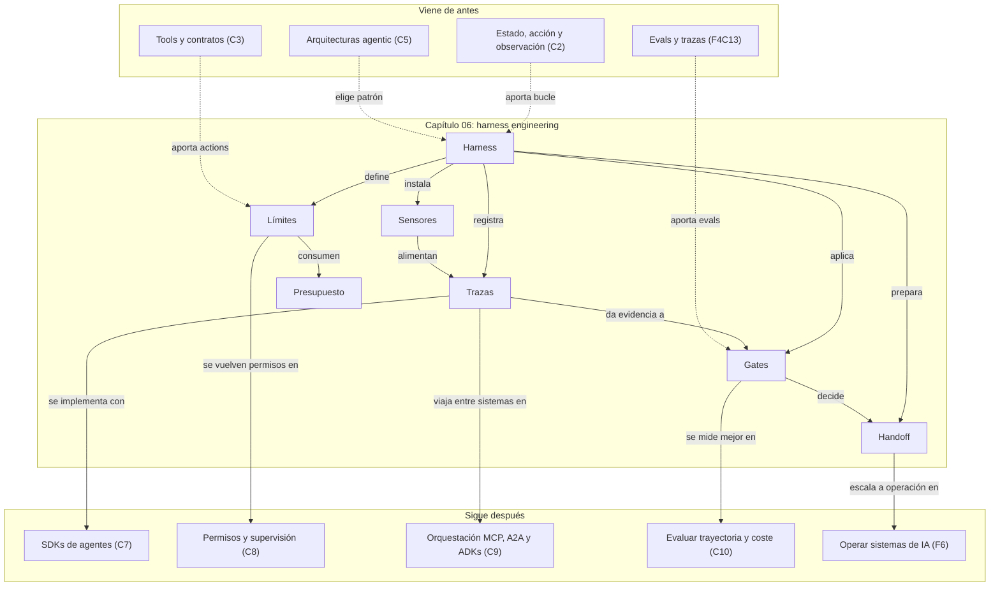

::: {.fasciculo-subtitle}
Facsímil 5 · Agentes y orquestación
:::

# Capítulo 06: Harness engineering: límites, sensores y trazas

## El arnés que convierte una demo en sistema

En el capítulo anterior elegimos arquitecturas: ReAct, PEV, multiagente, blackboard, dry-run, memoria, meta-controlador. Ahora toca una pregunta menos vistosa y mucho más profesional: **¿qué rodea a esa arquitectura para que no dependa de la buena suerte?**

Un agente puede sonar brillante durante una demo y ser imposible de depurar cuando falla. Puede tocar demasiados archivos, repetir una tool sin información nueva, gastar más de lo previsto, declarar que terminó sin haber probado nada o perder el hilo entre sesiones. El problema no siempre es el modelo. Muchas veces falta el arnés técnico: el conjunto de límites, sensores, trazas, gates y estado operativo que convierte una ejecución en algo revisable.

Martin Fowler usa la expresión *harness engineering* para hablar del entorno que permite usar agentes de código con más control: instrucciones, contexto del repositorio, pruebas, evidencia, límites y revisión.^[Fowler, M. (2025). *Harness Engineering for Coding Agent Users*. https://martinfowler.com/articles/harness-engineering.html. Consultado el 10 de junio de 2026.] Aquí ampliamos la idea a cualquier agente con tools: código, RAG, datos, navegador, documentos, soporte, operaciones o investigación.

## Qué no es un harness

Un harness no es un prompt más largo. Puedes escribir instrucciones excelentes y aun así no tener control sobre coste, permisos, estado, herramientas o verificación.

Tampoco es un dashboard al final. Ver una gráfica después de que algo salió mal ayuda, pero el harness empieza antes: decide qué acciones están permitidas, qué datos entran, qué presupuesto hay, qué debe registrarse y qué condición permite avanzar.

Y no es solo logging. Un log puede ser una pared de texto. Una traza útil tiene estructura: quién hizo qué, con qué entrada, en qué paso, cuánto tardó, cuánto costó, qué observó, qué cambió y por qué se detuvo.

## La definición útil

Para este libro, un harness es:

> El arnés técnico que envuelve a un agente para limitar lo que puede hacer, medir lo que ocurre, registrar evidencia y decidir si una ejecución puede avanzar.

Anthropic distingue entre workflows predefinidos y agents que deciden dinámicamente su proceso y uso de herramientas.^[Anthropic. (2024). *Building Effective Agents*. https://www.anthropic.com/engineering/building-effective-agents. Consultado el 10 de junio de 2026.] Cuanto más dinámica sea esa decisión, más necesario se vuelve el harness. Si el camino cambia durante la ejecución, necesitamos sensores para verlo y límites para acotarlo.

**Ejemplo de fórmula.** Formalmente podemos escribir:

$$
\mathcal{H} = (G, I, S, A, P, B, V, R, \tau)
$$

| Símbolo | Significado | Ejemplo concreto |
|---|---|---|
| \(\mathcal{H}\) | Harness completo. | Arnés de revisión académica con tools, trazas y gates. |
| \(G\) | Objetivo verificable. | “Revisar citas y proponer cambios antes de publicar”. |
| \(I\) | Instrucciones estables. | `AGENTS.md`, reglas editoriales, comandos permitidos. |
| \(S\) | Estado operativo. | Paso actual, evidencias, decisiones, bloqueos, coste. |
| \(A\) | Acciones disponibles. | Buscar referencia, validar APA, proponer diff, pedir revisión. |
| \(P\) | Políticas y permisos. | Qué tools puede usar, cuándo necesita aprobación. |
| \(B\) | Presupuesto operativo. | Pasos, tokens, tools, tiempo, coste, rutas tocables. |
| \(V\) | Verificadores y gates. | Tests, rúbricas, validadores JSON, revisión de diff. |
| \(R\) | Recuperación. | Retry, fallback, rollback, handoff, parada controlada. |
| \(\tau\) | Traza. | Eventos estructurados de toda la ejecución. |

**Ejemplo de fórmula.** El presupuesto no es una cifra decorativa. En cada paso queda:

$$
B_t =
(n_t, q_t, k_t, c_t, \Delta_t)
$$

| Símbolo | Significado | Ejemplo concreto |
|---|---|---|
| \(B_t\) | Presupuesto restante en el paso \(t\). | Lo que queda antes de decidir otra acción. |
| \(n_t\) | Pasos restantes. | 4 pasos. |
| \(q_t\) | Llamadas a tools restantes. | 2 consultas externas. |
| \(k_t\) | Tokens o contexto restante. | 18.000 tokens disponibles. |
| \(c_t\) | Coste máximo restante. | 0,42 EUR. |
| \(\Delta_t\) | Cambio máximo permitido. | 3 archivos, 120 líneas o solo lectura. |

**Ejemplo de fórmula.** Y un gate mínimo puede escribirse así:

$$
\operatorname{go}
=
O_\text{ok}
\land
T_\text{ok}
\land
C \le C_\text{max}
\land
P_\text{ok}
\land
R_\text{def}
$$

| Símbolo | Significado | Ejemplo concreto |
|---|---|---|
| \(O_\text{ok}\) | Resultado final válido. | La respuesta cumple el objetivo. |
| \(T_\text{ok}\) | Trayectoria válida. | Usó tools permitidas y dejó evidencia. |
| \(C\) | Coste real de ejecución. | Tokens, tools, tiempo y revisión. |
| \(C_\text{max}\) | Coste máximo aceptado. | 0,75 EUR por tarea. |
| \(P_\text{ok}\) | Permisos respetados. | No ejecutó acciones fuera de alcance. |
| \(R_\text{def}\) | Recuperación definida. | Hay rollback, retry o handoff. |

**Ejemplo de fórmula.** La métrica económica que decide producción no suele ser el precio por token, sino:

$$
C_\text{aceptada}
=
\frac{
\sum_i C_i
}{
N_\text{aceptadas}
}
$$

| Símbolo | Significado | Ejemplo concreto |
|---|---|---|
| \(C_\text{aceptada}\) | Coste por tarea que pasa el gate. | 1,40 EUR por revisión aceptada. |
| \(C_i\) | Coste de la ejecución \(i\). | Modelo, tools, infraestructura y revisión. |
| \(N_\text{aceptadas}\) | Ejecuciones que superan criterios. | 73 de 100 tareas. |

Si el sistema es barato por intento, pero solo acepta 20 de cada 100 ejecuciones, quizá no es barato. Solo estaba escondiendo coste en reintentos, revisión humana o correcciones posteriores.

## Fecha de corte de herramientas

**Fecha de corte:** 10 de junio de 2026.  
**Fuentes consultadas:** artículo de Martin Fowler sobre harness engineering, documentación de OpenAI Agents SDK Tracing, OpenTelemetry Tracing API, W3C Trace Context, documentación de pruebas de Anthropic y NIST AI RMF.

Lo estable es el mecanismo: estado operativo, límites, tools pequeñas, trazas estructuradas, evaluaciones repetibles, gates y handoff. Lo cambiante son SDKs, nombres de herramientas, formatos de traza, integraciones de observabilidad, precios y límites de cada proveedor.

## Las capas del harness

Un harness serio separa capas. Si todo vive en el prompt, no sabes qué cambiar cuando algo falla.

| Capa | Pregunta | Artefacto | Fallo típico si falta |
|---|---|---|---|
| Objetivo | ¿Qué resultado cuenta como terminado? | `goal`, `done_when`, criterios de aceptación. | El agente declara éxito con una respuesta bonita. |
| Instrucciones | ¿Cómo se trabaja aquí? | `AGENTS.md`, guía de repo, reglas editoriales. | Cada ejecución interpreta el proyecto de forma distinta. |
| Estado | ¿Qué sabemos ahora? | `run_state.json`, task board, decisiones. | Se repiten pasos o se pierden bloqueos. |
| Scope | ¿Qué puede tocar? | Rutas, dominios, tools, permisos, no-objetivos. | Cambios fuera de alcance o consultas innecesarias. |
| Sensores | ¿Qué señales vuelven del mundo? | Tests, logs, diffs, métricas, resultados de tools. | El agente actúa sin feedback verificable. |
| Presupuesto | ¿Cuánto puede gastar? | Máximo de pasos, tools, tokens, tiempo y coste. | Bucle largo, coste sorpresa o latencia inaceptable. |
| Gate | ¿Puede avanzar? | Rúbrica, tests, umbrales, revisión humana. | El constructor se aprueba a sí mismo. |
| Handoff | ¿Quién puede continuar? | Resumen estructurado, pendientes, evidencia, siguiente paso. | La siguiente sesión empieza desde cero. |

OpenAI Agents SDK documenta tracing para registrar ejecuciones de agentes y entender qué ocurrió entre modelo, tools y handoffs.^[OpenAI. (2026). *Agents SDK: Tracing*. https://openai.github.io/openai-agents-python/tracing/. Consultado el 10 de junio de 2026.] OpenTelemetry, por su parte, define trazas y spans como unidades observables de trabajo con atributos y contexto.^[OpenTelemetry. (2026). *Tracing API*. https://opentelemetry.io/docs/specs/otel/trace/api/. Consultado el 10 de junio de 2026.] El lenguaje cambia entre herramientas; la idea no: una ejecución se entiende por sus eventos.

## Anatomía visual de un harness de agentes

<svg id="f5-c06-agent-harness" xmlns="http://www.w3.org/2000/svg" viewBox="0 0 1500 1080" role="img" aria-label="Plano de ingeniería de un harness de agentes con control plane, execution plane, tool gateway, state store, observabilidad, trace grading, gates, checkpoints y handoff">
  <defs>
    <marker id="f5c06-arrow" viewBox="0 0 10 10" refX="9" refY="5" markerWidth="7" markerHeight="7" orient="auto-start-reverse">
      <path d="M 0 0 L 10 5 L 0 10 z" fill="#111111"/>
    </marker>
    <marker id="f5c06-arrow-soft" viewBox="0 0 10 10" refX="9" refY="5" markerWidth="6" markerHeight="6" orient="auto-start-reverse">
      <path d="M 0 0 L 10 5 L 0 10 z" fill="#666666"/>
    </marker>
    <pattern id="f5c06-grid" width="20" height="20" patternUnits="userSpaceOnUse">
      <path d="M 20 0 L 0 0 0 20" fill="none" stroke="#EEEEEE" stroke-width="1"/>
    </pattern>
    <pattern id="f5c06-diagonal" width="10" height="10" patternUnits="userSpaceOnUse" patternTransform="rotate(45)">
      <line x1="0" y1="0" x2="0" y2="10" stroke="#ECECEC" stroke-width="2"/>
    </pattern>
    <style>
      #f5-c06-agent-harness .frame { fill: #FFFFFF; stroke: #111111; stroke-width: 2; }
      #f5-c06-agent-harness .panel { fill: #FFFFFF; stroke: #111111; stroke-width: 1.5; }
      #f5-c06-agent-harness .panel-soft { fill: #F7F7F7; stroke: #111111; stroke-width: 1.35; }
      #f5-c06-agent-harness .dark { fill: #111111; stroke: #111111; stroke-width: 1.2; }
      #f5-c06-agent-harness .bus { fill: none; stroke: #111111; stroke-width: 3; }
      #f5-c06-agent-harness .wire { fill: none; stroke: #111111; stroke-width: 1.3; }
      #f5-c06-agent-harness .soft-wire { fill: none; stroke: #777777; stroke-width: 1.1; stroke-dasharray: 6 5; }
      #f5-c06-agent-harness .tiny { font-size: 10px; fill: #666666; }
      #f5-c06-agent-harness .small { font-size: 11px; fill: #555555; }
      #f5-c06-agent-harness .label { font-size: 12px; fill: #111111; font-weight: 700; }
      #f5-c06-agent-harness .title { font-size: 16px; fill: #111111; font-weight: 700; }
      #f5-c06-agent-harness .white { fill: #FFFFFF; }
    </style>
  </defs>

  <rect x="24" y="24" width="1452" height="1032" rx="16" class="frame"/>
  <rect x="54" y="118" width="1392" height="808" rx="12" fill="url(#f5c06-grid)" stroke="#DDDDDD"/>
  <text x="750" y="66" text-anchor="middle" font-family="Arial, sans-serif" font-size="27" font-weight="700" fill="#111111">Harness de agentes como plano de ingeniería</text>
  <text x="750" y="94" text-anchor="middle" font-family="Arial, sans-serif" font-size="13" fill="#555555">Separar control, ejecución, estado, tools, observabilidad y gates evita que todo dependa de una conversación larga.</text>

  <g font-family="Arial, sans-serif">
    <rect x="70" y="142" width="1356" height="214" rx="12" fill="#FAFAFA" stroke="#111111" stroke-width="1.4"/>
    <text x="92" y="168" class="title">CONTROL PLANE</text>
    <text x="92" y="188" class="tiny">todo lo que decide qué puede ocurrir antes de llamar al modelo o a una tool</text>

    <rect x="104" y="214" width="176" height="96" rx="8" class="panel"/>
    <text x="192" y="239" text-anchor="middle" class="label">Intake</text>
    <text x="192" y="262" text-anchor="middle" class="small">objetivo · tenant</text>
    <text x="192" y="281" text-anchor="middle" class="small">scope · canal</text>

    <rect x="320" y="194" width="198" height="136" rx="8" class="panel-soft"/>
    <text x="419" y="219" text-anchor="middle" class="label">Context pack</text>
    <text x="419" y="242" text-anchor="middle" class="small">AGENTS.md</text>
    <text x="419" y="261" text-anchor="middle" class="small">docs · ejemplos</text>
    <text x="419" y="280" text-anchor="middle" class="small">reglas versionadas</text>
    <line x1="344" y1="298" x2="494" y2="298" stroke="#D8D8D8"/>
    <text x="419" y="316" text-anchor="middle" class="tiny">feedforward</text>

    <rect x="558" y="194" width="224" height="136" rx="8" class="dark"/>
    <text x="670" y="219" text-anchor="middle" class="white" font-size="12" font-weight="700">Policy engine</text>
    <text x="670" y="243" text-anchor="middle" fill="#E8E8E8" font-size="11">allowlist · permisos</text>
    <text x="670" y="262" text-anchor="middle" fill="#E8E8E8" font-size="11">risk class · redacción</text>
    <text x="670" y="281" text-anchor="middle" fill="#E8E8E8" font-size="11">approval rules</text>
    <line x1="586" y1="298" x2="754" y2="298" stroke="#444444"/>
    <text x="670" y="316" text-anchor="middle" fill="#CFCFCF" font-size="10">decide capacidades</text>

    <rect x="822" y="194" width="208" height="136" rx="8" class="panel"/>
    <text x="926" y="219" text-anchor="middle" class="label">Budget ledger</text>
    <text x="926" y="242" text-anchor="middle" class="small">steps · tokens</text>
    <text x="926" y="261" text-anchor="middle" class="small">tools · coste</text>
    <text x="926" y="280" text-anchor="middle" class="small">latencia · diff</text>
    <line x1="848" y1="298" x2="1004" y2="298" stroke="#D8D8D8"/>
    <text x="926" y="316" text-anchor="middle" class="tiny">stop reasons</text>

    <rect x="1070" y="194" width="326" height="136" rx="8" class="panel-soft"/>
    <text x="1233" y="219" text-anchor="middle" class="label">Run contract</text>
    <text x="1140" y="246" text-anchor="middle" class="small">done_when</text>
    <text x="1233" y="246" text-anchor="middle" class="small">no_goals</text>
    <text x="1324" y="246" text-anchor="middle" class="small">rollback</text>
    <rect x="1100" y="268" width="266" height="34" rx="5" fill="#FFFFFF" stroke="#111111"/>
    <text x="1233" y="290" text-anchor="middle" class="tiny">contrato que el gate puede comprobar</text>

    <path d="M280 262 H312" class="wire" marker-end="url(#f5c06-arrow)"/>
    <path d="M518 262 H548" class="wire" marker-end="url(#f5c06-arrow)"/>
    <path d="M782 262 H812" class="wire" marker-end="url(#f5c06-arrow)"/>
    <path d="M1030 262 H1060" class="wire" marker-end="url(#f5c06-arrow)"/>

    <rect x="70" y="392" width="1356" height="278" rx="12" fill="#FFFFFF" stroke="#111111" stroke-width="1.4"/>
    <text x="92" y="418" class="title">EXECUTION PLANE</text>
    <text x="92" y="438" class="tiny">el agente actúa, pero cada paso atraviesa estado, gateway de tools y entorno acotado</text>

    <path d="M128 486 H1266" class="bus"/>
    <text x="128" y="474" class="tiny">decision bus: state + policy + budget + observation</text>

    <rect x="114" y="520" width="170" height="96" rx="8" class="panel-soft"/>
    <text x="199" y="545" text-anchor="middle" class="label">Planner</text>
    <text x="199" y="568" text-anchor="middle" class="small">subtarea</text>
    <text x="199" y="587" text-anchor="middle" class="small">precondiciones</text>

    <rect x="324" y="520" width="170" height="96" rx="8" class="dark"/>
    <text x="409" y="545" text-anchor="middle" class="white" font-size="12" font-weight="700">Model call</text>
    <text x="409" y="568" text-anchor="middle" fill="#E8E8E8" font-size="11">prompt pack</text>
    <text x="409" y="587" text-anchor="middle" fill="#E8E8E8" font-size="11">structured out</text>

    <rect x="534" y="520" width="190" height="96" rx="8" class="panel"/>
    <text x="629" y="545" text-anchor="middle" class="label">Tool gateway</text>
    <text x="629" y="568" text-anchor="middle" class="small">schema · timeout</text>
    <text x="629" y="587" text-anchor="middle" class="small">idempotency key</text>

    <rect x="764" y="520" width="190" height="96" rx="8" class="panel-soft"/>
    <text x="859" y="545" text-anchor="middle" class="label">Sandbox</text>
    <text x="859" y="568" text-anchor="middle" class="small">filesystem · red</text>
    <text x="859" y="587" text-anchor="middle" class="small">comandos · browser</text>

    <rect x="994" y="520" width="172" height="96" rx="8" class="panel"/>
    <text x="1080" y="545" text-anchor="middle" class="label">Sensors</text>
    <text x="1080" y="568" text-anchor="middle" class="small">tests · diff</text>
    <text x="1080" y="587" text-anchor="middle" class="small">logs · captura</text>

    <rect x="1206" y="520" width="174" height="96" rx="8" class="panel-soft"/>
    <text x="1293" y="545" text-anchor="middle" class="label">Observation</text>
    <text x="1293" y="568" text-anchor="middle" class="small">resultado</text>
    <text x="1293" y="587" text-anchor="middle" class="small">error · métrica</text>

    <path d="M284 568 H314" class="wire" marker-end="url(#f5c06-arrow)"/>
    <path d="M494 568 H524" class="wire" marker-end="url(#f5c06-arrow)"/>
    <path d="M724 568 H754" class="wire" marker-end="url(#f5c06-arrow)"/>
    <path d="M954 568 H984" class="wire" marker-end="url(#f5c06-arrow)"/>
    <path d="M1166 568 H1196" class="wire" marker-end="url(#f5c06-arrow)"/>
    <path d="M1294 520 C1294 466 197 466 197 520" class="soft-wire" marker-end="url(#f5c06-arrow-soft)"/>
    <text x="744" y="457" text-anchor="middle" class="tiny">si hay información nueva, actualiza estado y decide otro paso</text>

    <rect x="114" y="636" width="362" height="18" rx="4" fill="#111111"/>
    <text x="295" y="649" text-anchor="middle" fill="#FFFFFF" font-size="9" font-weight="700">MODEL BOUNDARY</text>
    <rect x="534" y="636" width="632" height="18" rx="4" fill="#FFFFFF" stroke="#111111"/>
    <text x="850" y="649" text-anchor="middle" fill="#111111" font-size="9" font-weight="700">SIDE EFFECT BOUNDARY</text>
    <rect x="1206" y="636" width="174" height="18" rx="4" fill="url(#f5c06-diagonal)" stroke="#111111"/>
    <text x="1293" y="649" text-anchor="middle" fill="#111111" font-size="9" font-weight="700">OBSERVATION</text>

    <rect x="70" y="706" width="1356" height="220" rx="12" fill="#F9F9F9" stroke="#111111" stroke-width="1.4"/>
    <text x="92" y="732" class="title">STATE, OBSERVABILITY AND RELEASE GATES</text>
    <text x="92" y="752" class="tiny">lo que permite reanudar, auditar, puntuar trazas y convertir fallos reales en evals</text>

    <rect x="104" y="780" width="210" height="104" rx="8" class="panel"/>
    <text x="209" y="805" text-anchor="middle" class="label">State store</text>
    <text x="209" y="828" text-anchor="middle" class="small">thread_id</text>
    <text x="209" y="847" text-anchor="middle" class="small">checkpoint</text>
    <text x="209" y="866" text-anchor="middle" class="small">replay cursor</text>

    <rect x="354" y="780" width="212" height="104" rx="8" class="panel-soft"/>
    <text x="460" y="805" text-anchor="middle" class="label">Trace pipeline</text>
    <text x="460" y="828" text-anchor="middle" class="small">span tree</text>
    <text x="460" y="847" text-anchor="middle" class="small">redacción</text>
    <text x="460" y="866" text-anchor="middle" class="small">export OTEL</text>

    <rect x="606" y="780" width="212" height="104" rx="8" class="dark"/>
    <text x="712" y="805" text-anchor="middle" class="white" font-size="12" font-weight="700">Trace grading</text>
    <text x="712" y="828" text-anchor="middle" fill="#E8E8E8" font-size="11">tool choice</text>
    <text x="712" y="847" text-anchor="middle" fill="#E8E8E8" font-size="11">trajectory</text>
    <text x="712" y="866" text-anchor="middle" fill="#E8E8E8" font-size="11">regressions</text>

    <rect x="858" y="780" width="212" height="104" rx="8" class="panel"/>
    <text x="964" y="805" text-anchor="middle" class="label">Release gate</text>
    <text x="964" y="828" text-anchor="middle" class="small">outcome ok</text>
    <text x="964" y="847" text-anchor="middle" class="small">budget ok</text>
    <text x="964" y="866" text-anchor="middle" class="small">rollback ready</text>

    <rect x="1110" y="780" width="246" height="104" rx="8" class="panel-soft"/>
    <text x="1233" y="805" text-anchor="middle" class="label">Artifact + handoff</text>
    <text x="1233" y="828" text-anchor="middle" class="small">respuesta · diff · PR</text>
    <text x="1233" y="847" text-anchor="middle" class="small">pendientes · owner</text>
    <text x="1233" y="866" text-anchor="middle" class="small">siguiente acción</text>

    <path d="M314 832 H344" class="wire" marker-end="url(#f5c06-arrow)"/>
    <path d="M566 832 H596" class="wire" marker-end="url(#f5c06-arrow)"/>
    <path d="M818 832 H848" class="wire" marker-end="url(#f5c06-arrow)"/>
    <path d="M1070 832 H1100" class="wire" marker-end="url(#f5c06-arrow)"/>

    <path d="M460 780 C460 724 1080 724 1080 616" class="soft-wire" marker-end="url(#f5c06-arrow-soft)"/>
    <path d="M209 780 C209 684 199 684 199 616" class="soft-wire" marker-end="url(#f5c06-arrow-soft)"/>
    <path d="M712 884 C712 940 418 940 418 330" class="soft-wire" marker-end="url(#f5c06-arrow-soft)"/>
    <text x="520" y="947" class="tiny">fallos reales -> evals -> reglas -> contexto</text>

    <rect x="182" y="956" width="1136" height="42" rx="8" fill="#111111"/>
    <text x="750" y="982" text-anchor="middle" font-size="12" font-weight="700" fill="#FFFFFF">Ingeniería del harness = estado durable + tools acotadas + observabilidad + gates que se pueden repetir.</text>
  </g>

  <text opacity="0.55" x="1416" y="1024" text-anchor="end" font-family="Arial, sans-serif" font-size="11" fill="#888888">IA para gente curiosa / Facsímil 05 / Capítulo 06 / 686f6c61</text>
</svg>

El diagrama muestra la idea central con una lectura más de ingeniería: el agente no es una caja en medio del sistema. Hay un plano de control antes de actuar, un plano de ejecución con fronteras explícitas, un store de estado para checkpoints y replay, un gateway para tools, una tubería de observabilidad y un gate que decide con evidencia.

## Sensores: cómo ve el sistema lo que hizo

En un agente, un sensor no tiene por qué ser físico. Un test fallido es un sensor. Un diff demasiado grande es un sensor. Un timeout, una captura de pantalla, un código de error, una cita encontrada, una métrica de latencia o una tool que devuelve `not_found` son sensores.

| Sensor | Qué mide | Ejemplo |
|---|---|---|
| Test | Comportamiento verificable. | `pytest tests/test_citas.py` pasa o falla. |
| Diff | Alcance del cambio. | 2 archivos, 48 líneas, ninguna ruta prohibida. |
| Tool result | Observación externa. | URL consultada, estado HTTP, campos devueltos. |
| Métrica | Coste, latencia, calidad o cobertura. | 7 pasos, 5 tool calls, 1,2 s p95. |
| Captura | Estado visual. | Página renderizada sin solapes. |
| Validador | Forma de salida. | JSON válido, schema completo, campos permitidos. |
| Revisión | Juicio estructurado. | Rúbrica con criterios y evidencia. |

Anthropic recomienda desarrollar tests para aplicaciones con LLM porque la calidad no puede depender de lectura manual ocasional.^[Anthropic. (2025). *Develop Tests for LLM Applications*. https://platform.claude.com/docs/en/build-with-claude/develop-tests. Consultado el 10 de junio de 2026.] En agentes, esa idea se amplía: no solo probamos la respuesta final; probamos la trayectoria.

## Límites que sí importan

Los límites buenos no están para molestar al agente. Están para hacer explícito el contrato de trabajo.

| Límite | Qué evita | Ejemplo operativo |
|---|---|---|
| Pasos máximos | Bucle sin progreso. | `max_steps = 8`. |
| Llamadas a tools | Consultas innecesarias. | `max_tool_calls = 5`. |
| Tiempo | Esperas inaceptables. | `timeout_s = 30`. |
| Coste | Sorpresas de factura. | `max_cost = 0.50`. |
| Tokens/contexto | Prompts enormes y ruido. | Resumir estado cada 6 pasos. |
| Rutas permitidas | Cambios fuera de alcance. | Solo `docs/` y `tests/`. |
| Modo de escritura | Cambios antes de revisar. | `dry_run` obligatorio. |
| Filas o resultados | Respuestas gigantes de tools. | `limit = 20`. |
| Red | Conexiones no necesarias. | Allowlist de dominios. |

El NIST AI RMF insiste en gestionar sistemas de IA mediante funciones de gobernanza, mapeo, medición y gestión.^[Tabassi, E. (2023). *Artificial Intelligence Risk Management Framework (AI RMF 1.0)*. NIST AI 100-1. https://doi.org/10.6028/NIST.AI.100-1] Traducido a ingeniería de agentes: no basta con que el sistema sea capaz; tiene que operar dentro de límites que alguien pueda explicar.

## Trazas: lo que hay que guardar y lo que no

Una traza útil no es el pensamiento privado del modelo copiado entero. Es una estructura de eventos.

| Evento | Campos mínimos | Por qué importa |
|---|---|---|
| `task.received` | `run_id`, objetivo, usuario/tenant, canal. | Sitúa la ejecución. |
| `architecture.selected` | patrón, motivo, versión de instrucciones. | Explica por qué se eligió el flujo. |
| `model.called` | proveedor, modelo, temperatura, tokens, prompt version. | Permite comparar cambios. |
| `tool.called` | tool, argumentos validados o redactados, permiso. | Audita acciones. |
| `tool.observed` | estado, latencia, tamaño, error, resultado resumido. | Convierte acción en observación. |
| `budget.updated` | pasos, tools, coste, tiempo restante. | Detecta deriva. |
| `gate.checked` | criterio, resultado, evidencia. | Explica el go/no-go. |
| `handoff.created` | estado final, pendientes, siguiente acción. | Permite continuar. |

W3C Trace Context define una forma estándar de propagar identificadores de traza entre sistemas distribuidos.^[W3C. (2021). *Trace Context Level 2*. https://www.w3.org/TR/trace-context-2/. Consultado el 10 de junio de 2026.] No necesitamos implementar todo el estándar en este capítulo, pero sí adoptar la disciplina: cada ejecución debe tener un identificador estable y cada paso debe poder conectarse con el anterior.

La deuda técnica de los sistemas de ML ya se estudió antes del boom de agentes: Sculley y colaboradores explicaron cómo modelos, datos, dependencias y cambios ocultos pueden acumular deuda difícil de ver.^[Sculley, D. et al. (2015). *Hidden Technical Debt in Machine Learning Systems*. Advances in Neural Information Processing Systems, 28. https://papers.nips.cc/paper_files/paper/2015/hash/86df7dcfd896fcaf2674f757a2463eba-Abstract.html] Amershi y colaboradores mostraron que construir software con aprendizaje automático introduce retos especiales de datos, evaluación, monitorización y operación.^[Amershi, S. et al. (2019). Software engineering for machine learning: A case study. *Proceedings of the 41st International Conference on Software Engineering: Software Engineering in Practice*, 291-300. https://doi.org/10.1109/ICSE-SEIP.2019.00042] Con agentes ocurre algo parecido, pero más visible: el sistema toma pasos, llama tools y deja efectos. Sin trazas, la deuda se vuelve conversación perdida.

## Un ejemplo concreto: revisión académica con tools

Imagina un agente que revisa un capítulo de este libro. La tarea no es “mejora el texto” en abstracto. Queremos:

| Pieza | Decisión de harness |
|---|---|
| Objetivo | Revisar citas, estilo y coherencia antes de publicar. |
| Scope | Solo el capítulo activo y `referencias.bib`. |
| Tools | `buscar_fuente`, `validar_apa`, `proponer_diff`, `ejecutar_build`. |
| Límites | 8 pasos, 6 tools, sin publicar, sin tocar otros facsímiles. |
| Sensores | Build, diff, enlaces, tabla de citas, ausencia de palabras prohibidas. |
| Gate | No avanza si falta fuente, si el diff toca rutas no permitidas o si el build falla. |
| Handoff | Qué se cambió, qué se verificó, qué queda pendiente. |

La diferencia con un prompt genérico es enorme. El modelo puede seguir siendo el mismo, pero el problema está encarrilado. Tiene menos espacio para improvisar y más señales para corregirse.

## Manos a la obra

**Práctica:** construir un mini harness reproducible.

Kit ejecutable de este capítulo: `labs/f5/capitulo-practicas/`.

```bash
cd labs/f5/capitulo-practicas
python3 ops/run_f5_practices.py --chapter c06 --write --fail-on-invalid
```

Vamos a construir un harness mínimo con Python estándar. No llama a ninguna API. Simula una revisión académica y enseña las piezas importantes: registro de eventos, validación de tools, presupuesto, gate final y salida trazable.

```python
from dataclasses import dataclass, field
from time import perf_counter
import hashlib
import json
import uuid


@dataclass
class Budget:
    max_steps: int = 8
    max_tool_calls: int = 6
    max_cost: float = 0.50
    steps: int = 0
    tool_calls: int = 0
    cost: float = 0.0

    def spend_step(self):
        self.steps += 1
        if self.steps > self.max_steps:
            raise RuntimeError("step budget exhausted")

    def spend_tool(self, tool_name, cost):
        self.tool_calls += 1
        self.cost += cost
        if self.tool_calls > self.max_tool_calls:
            raise RuntimeError(f"tool budget exhausted after {tool_name}")
        if self.cost > self.max_cost:
            raise RuntimeError(f"cost budget exhausted after {tool_name}")


@dataclass(frozen=True)
class ToolSpec:
    name: str
    required_args: tuple[str, ...]
    cost: float
    fn: callable


@dataclass
class Trace:
    run_id: str = field(default_factory=lambda: f"run-{uuid.uuid4().hex[:8]}")
    events: list[dict] = field(default_factory=list)

    def emit(self, event, **fields):
        safe_fields = {
            key: value
            for key, value in fields.items()
            if value is not None
        }
        self.events.append({"event": event, "run_id": self.run_id, **safe_fields})


def fingerprint(value):
    raw = json.dumps(value, sort_keys=True, ensure_ascii=False)
    return hashlib.sha256(raw.encode("utf-8")).hexdigest()[:12]


def buscar_fuente(query):
    catalog = {
        "OpenTelemetry tracing": "https://opentelemetry.io/docs/specs/otel/trace/api/",
        "NIST AI RMF": "https://doi.org/10.6028/NIST.AI.100-1",
        "Agents SDK tracing": "https://openai.github.io/openai-agents-python/tracing/",
    }
    return {"found": query in catalog, "url": catalog.get(query)}


def validar_apa(reference):
    has_year = "(" in reference and ")" in reference
    has_title = "." in reference
    return {"valid": has_year and has_title, "checks": {"year": has_year, "title": has_title}}


def proponer_diff(file, change):
    lines = change.count("\n") + 1
    return {"file": file, "lines_changed": lines, "diff_preview": change[:120]}


TOOLS = {
    "buscar_fuente": ToolSpec("buscar_fuente", ("query",), 0.05, buscar_fuente),
    "validar_apa": ToolSpec("validar_apa", ("reference",), 0.03, validar_apa),
    "proponer_diff": ToolSpec("proponer_diff", ("file", "change"), 0.02, proponer_diff),
}


def call_tool(name, args, budget, trace):
    if name not in TOOLS:
        raise ValueError(f"tool not allowed: {name}")

    spec = TOOLS[name]
    missing = [arg for arg in spec.required_args if arg not in args]
    if missing:
        raise ValueError(f"{name} missing args: {missing}")

    budget.spend_tool(name, spec.cost)
    start = perf_counter()
    result = spec.fn(**args)
    latency_ms = round((perf_counter() - start) * 1000, 3)

    trace.emit(
        "tool.observed",
        tool=name,
        args_hash=fingerprint(args),
        result=result,
        latency_ms=latency_ms,
        cost=spec.cost,
    )
    return result


def run_case(task):
    budget = Budget()
    trace = Trace()
    state = {"citations_checked": 0, "apa_valid": 0, "diffs": [], "missing_sources": []}

    trace.emit("task.received", task=task["name"], scope=task["scope"])
    trace.emit("architecture.selected", patterns=["Tool use", "PEV", "Dry-run harness"])

    for query in task["queries"]:
        budget.spend_step()
        trace.emit("step.started", step=budget.steps, intent="buscar fuente")
        result = call_tool("buscar_fuente", {"query": query}, budget, trace)
        state["citations_checked"] += 1
        if not result["found"]:
            state["missing_sources"].append(query)

    for reference in task["references"]:
        budget.spend_step()
        trace.emit("step.started", step=budget.steps, intent="validar APA")
        result = call_tool("validar_apa", {"reference": reference}, budget, trace)
        state["apa_valid"] += int(result["valid"])

    budget.spend_step()
    diff = call_tool(
        "proponer_diff",
        {
            "file": "fasciculo-05-agentes-orquestacion/06-harness-engineering-limites-sensores-trazas.md",
            "change": "Añadir tabla de trazas mínimas y gate final.",
        },
        budget,
        trace,
    )
    state["diffs"].append(diff)

    gate = {
        "enough_citations": state["citations_checked"] >= 3,
        "no_missing_sources": not state["missing_sources"],
        "apa_ok": state["apa_valid"] == len(task["references"]),
        "diff_small": sum(item["lines_changed"] for item in state["diffs"]) <= 20,
        "cost_ok": budget.cost <= budget.max_cost,
    }
    accepted = all(gate.values())
    trace.emit("gate.checked", gate=gate, accepted=accepted)
    trace.emit(
        "handoff.created",
        next_action="revisión humana si accepted=false; build y lectura visual si accepted=true",
        budget_used={"steps": budget.steps, "tool_calls": budget.tool_calls, "cost": round(budget.cost, 2)},
    )

    return {"accepted": accepted, "state": state, "gate": gate, "trace": trace.events}


task = {
    "name": "revisión académica con fuentes",
    "scope": ["capítulo 06", "referencias.bib"],
    "queries": ["OpenTelemetry tracing", "NIST AI RMF", "Agents SDK tracing"],
    "references": [
        "OpenTelemetry. (2026). Tracing API.",
        "Tabassi, E. (2023). Artificial Intelligence Risk Management Framework.",
    ],
}

result = run_case(task)
print(json.dumps(result, indent=2, ensure_ascii=False))
```

Qué deberías ver:

```text
"accepted": true
"tool_calls": 6
"event": "gate.checked"
"event": "handoff.created"
```

El valor de este ejercicio no está en la simulación. Está en la forma. Cuando sustituyas las funciones falsas por APIs reales, ya tendrás preguntas correctas: qué args validar, qué coste registrar, qué resultado resumir, qué gate aplicar y qué handoff dejar.

## Cómo encaja todo



IA para gente curiosa / Facsímil 05 / Capítulo 06 / 686f6c61

## Vocabulario aprendido

| Término | Definición |
|---|---|
| **Harness** | Arnés técnico que limita, observa, registra y verifica una ejecución. |
| **Sensor** | Señal que vuelve del sistema: test, diff, log, métrica, resultado de tool. |
| **Traza** | Registro estructurado de eventos de una ejecución. |
| **Span** | Unidad de trabajo dentro de una traza. |
| **Gate** | Regla que decide si una ejecución avanza, se corrige o se detiene. |
| **Presupuesto operativo** | Límite de pasos, coste, tokens, tools, tiempo y alcance. |
| **Coste por tarea aceptada** | Coste real dividido entre ejecuciones que pasan el gate. |
| **Handoff** | Estado resumido para que otra persona o sistema pueda continuar. |
| **Stop reason** | Motivo estructurado de parada: terminado, falta evidencia, falta permiso, presupuesto agotado. |

## Dónde solía tropezar yo

| Error | Por qué es un error | Antídoto |
|---|---|---|
| Confundir harness con prompt largo | El prompt no limita coste, permisos ni trazas. | Separar instrucciones, estado, tools, sensores y gates. |
| Guardar logs sin estructura | Luego nadie puede comparar ejecuciones. | Usar eventos con `run_id`, `tool`, latencia, coste y resultado. |
| Medir solo respuesta final | No sabes si el camino fue caro, frágil o fuera de alcance. | Evaluar outcome y trayectoria. |
| No poner límites de presupuesto | El agente puede gastar pasos y tools sin progreso. | Definir máximos y stop reasons. |
| Dejar que el constructor se apruebe solo | Una salida convincente no equivale a evidencia. | Separar builder, reviewer y gate. |
| No diseñar handoff | Cada sesión futura reconstruye la historia. | Guardar objetivo, decisiones, evidencia, riesgos y siguiente acción. |

## Antes de pasar página

- [ ] ¿Sé explicar qué añade un harness que no añade un prompt?
- [ ] ¿Puedo escribir \(\mathcal{H} = (G, I, S, A, P, B, V, R, \tau)\) y explicar cada pieza?
- [ ] ¿Sé distinguir sensor, traza, span y gate?
- [ ] ¿Sé definir límites de pasos, tools, coste, tiempo y alcance?
- [ ] ¿Sé qué eventos mínimos debería guardar una ejecución agentic?
- [ ] ¿Puedo explicar por qué coste por tarea aceptada importa más que precio por token?
- [ ] ¿Sé construir un gate que mire resultado y trayectoria?
- [ ] ¿Sé qué debe contener un handoff para que otra persona continúe?
- [ ] ¿He ejecutado el mini harness y leído la traza generada?

## En resumen

| Idea fuerza | Detalle |
|---|---|
| Un agente sin harness es difícil de operar. | Puede acertar una vez y ser imposible de depurar después. |
| Los límites son parte de la arquitectura. | Pasos, tools, coste, tiempo y alcance definen la autonomía real. |
| Los sensores convierten acciones en observaciones. | Tests, diffs, métricas y resultados de tools alimentan el estado. |
| Las trazas son memoria operativa. | Permiten explicar qué ocurrió, comparar versiones y corregir fallos. |
| El gate protege la salida. | No basta con responder: hay que pasar criterios de resultado, trayectoria y coste. |
| El handoff evita deuda de contexto. | Otra persona o agente debe poder continuar sin reconstruir toda la conversación. |

## Para saber más

Amershi, S., Begel, A., Bird, C., DeLine, R., Gall, H., Kamar, E., Nagappan, N., Nushi, B. y Zimmermann, T. (2019). Software engineering for machine learning: A case study. *Proceedings of the 41st International Conference on Software Engineering: Software Engineering in Practice*, 291-300. https://doi.org/10.1109/ICSE-SEIP.2019.00042

Anthropic. (2024). *Building Effective Agents*. https://www.anthropic.com/engineering/building-effective-agents

Anthropic. (2025). *Develop Tests for LLM Applications*. https://platform.claude.com/docs/en/build-with-claude/develop-tests

Baylor, D. et al. (2017). TFX: A TensorFlow-Based Production-Scale Machine Learning Platform. *Proceedings of the 23rd ACM SIGKDD International Conference on Knowledge Discovery and Data Mining*, 1387-1395. https://doi.org/10.1145/3097983.3098021

Fowler, M. (2025). *Harness Engineering for Coding Agent Users*. https://martinfowler.com/articles/harness-engineering.html

NIST. (2023). *Artificial Intelligence Risk Management Framework (AI RMF 1.0)*. https://doi.org/10.6028/NIST.AI.100-1

OpenAI. (2026). *Agents SDK: Tracing*. https://openai.github.io/openai-agents-python/tracing/

OpenTelemetry. (2026). *Tracing API*. https://opentelemetry.io/docs/specs/otel/trace/api/

OpenAI. (2026). *AGENTS.md*. https://github.com/openai/agents.md

Sculley, D. et al. (2015). *Hidden Technical Debt in Machine Learning Systems*. https://papers.nips.cc/paper_files/paper/2015/hash/86df7dcfd896fcaf2674f757a2463eba-Abstract.html

W3C. (2021). *Trace Context Level 2*. https://www.w3.org/TR/trace-context-2/
