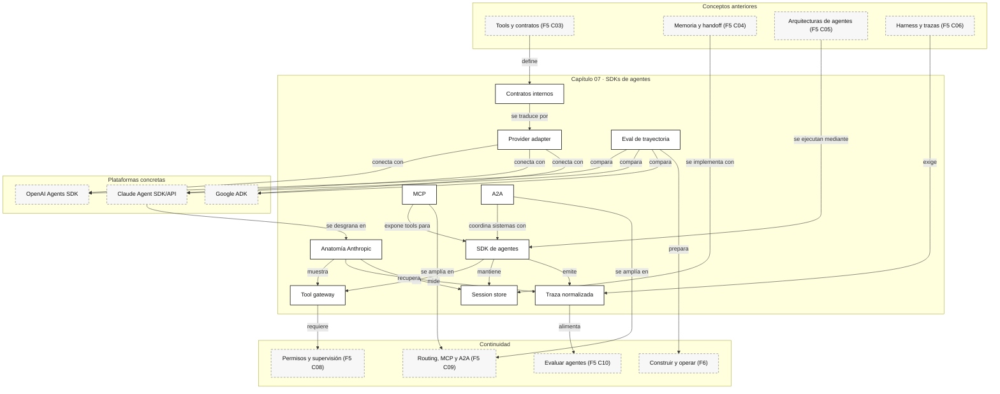

::: {.fasciculo-subtitle}
Facsímil 5 · Agentes y orquestación
:::

# Capítulo 07: SDKs de agentes: OpenAI, Anthropic, Google ADK y herramientas

## Cuando instalar un SDK parece arquitectura

Hay una tentación muy normal: ves un SDK de agentes, copias el ejemplo mínimo, consigues que el modelo llame una tool y sientes que ya tienes arquitectura. La demo funciona. El problema empieza cuando necesitas cambiar de modelo, añadir trazas, limitar tools, guardar sesiones, evaluar trayectorias, desplegar en otro entorno o explicar por qué el agente tomó una decisión.

El SDK es importante, pero no es el sistema entero. Un SDK te da una forma concreta de hablar con una plataforma. Tu producto necesita algo más estable: contratos internos, adaptadores, estado propio, evaluación, observabilidad, permisos, política de memoria y una forma de salir de un proveedor si mañana cambia el coste, la API o la capacidad.

En el [capítulo 03](/libro/fasciculo-05/#capitulo-03) vimos qué es una tool bien diseñada. En el [capítulo 04](/libro/fasciculo-05/#capitulo-04) vimos contexto, memoria y handoff. En el [capítulo 06](/libro/fasciculo-05/#capitulo-06) rodeamos el agente con harness, límites y trazas. Ahora conectamos esas piezas con SDKs reales: OpenAI Agents SDK, Claude Agent SDK/API, Google ADK y el ecosistema de herramientas.

## Qué no es elegir un SDK

Elegir un SDK no es elegir “el mejor modelo”. El modelo puede cambiar dentro del mismo SDK.

Tampoco es elegir “el proveedor para siempre”. Si acoplas tus tools, sesiones, errores y trazas al formato exacto de una plataforma, has tomado una decisión de arquitectura aunque nadie la haya escrito.

Y no es decidir que todo debe vivir dentro del SDK. Hay estado que debería vivir en tu base de datos, permisos que deberían vivir en tu sistema, métricas que deberían vivir en observabilidad y contratos de tools que deberían poder probarse sin llamar al modelo.

La pregunta profesional no es:

> “¿Qué SDK uso?”

La pregunta profesional es:

> “¿Qué parte de mi sistema quiero que resuelva el SDK, qué parte controlo yo y qué coste de cambio acepto?”

## La definición útil

Para este capítulo, un SDK de agentes es:

> Una capa de desarrollo que facilita ejecutar bucles agentic: preparar contexto, llamar al modelo, exponer tools, gestionar sesiones, hacer handoffs, emitir eventos, aplicar guardrails y devolver resultados al producto.

El SDK puede ser muy ligero, como una librería de cliente que llama una API de mensajes. O puede ser bastante opinado, como un runtime que ya trae agentes, runners, tools, handoffs, sesiones y trazas.

La distinción clave es esta:

| Nivel | Qué te da | Ejemplo |
|---|---|---|
| API de modelo | Endpoint para enviar mensajes, tools y recibir salida. | Anthropic Messages API, OpenAI Responses API. |
| SDK de cliente | Tipos, métodos, streaming, errores y autenticación. | `openai`, `anthropic`, `@anthropic-ai/sdk`. |
| SDK de agentes | Bucle agentic, tools, sesiones, handoffs, trazas. | OpenAI Agents SDK, Claude Agent SDK, Google ADK. |
| Framework de orquestación | Grafos, estados, workflows, persistencia, retries. | LangGraph, LlamaIndex Workflows, CrewAI. |
| Protocolo | Interoperabilidad entre tools o agentes. | MCP para tools/contexto, A2A para agentes. |

## La anatomía formal de una integración

**Ejemplo de fórmula.** Podemos representar una integración de SDK como una tupla:

$$
\mathcal{I}_{sdk} =
(P, M, A, T, S, K, H, G, E, \tau, \Omega)
$$

| Símbolo | Significado | Ejemplo concreto |
|---|---|---|
| \(\mathcal{I}_{sdk}\) | Integración completa con un SDK. | Agente de revisión académica conectado a OpenAI o Claude. |
| \(P\) | Proveedor o plataforma. | OpenAI, Anthropic, Google ADK. |
| \(M\) | Modelo o familia configurada. | Modelo fuerte para revisión, modelo barato para clasificación. |
| \(A\) | Agentes definidos. | Coordinador, revisor APA, verificador de fuentes. |
| \(T\) | Tools disponibles. | `validar_cita`, `buscar_fuente`, `normalizar_apa`. |
| \(S\) | Sesión y estado. | Historial, `run_state`, memoria, checkpoints. |
| \(K\) | Constructor de contexto. | Instrucciones, documentos, memoria y artefactos. |
| \(H\) | Handoffs o delegaciones. | Transferir de coordinador a especialista. |
| \(G\) | Guardrails o gates. | Validar JSON, limitar tools, exigir citas. |
| \(E\) | Evaluación. | Dataset de casos, métricas, trayectoria esperada. |
| \(\tau\) | Traza normalizada. | Eventos de modelo, tool, handoff, coste y latencia. |
| \(\Omega\) | Política operativa. | Timeouts, retries, presupuesto, permisos y fallback. |

Un SDK serio reduce código repetitivo, pero no elimina estas piezas. Si no las ves en el SDK, siguen existiendo en tu producto. Si no las diseñas, aparecen como comportamiento implícito.

**Ejemplo de fórmula.** La portabilidad mínima se puede estimar así:

$$
\operatorname{portabilidad} =
\frac{
N_{\text{contratos propios}}
}{
N_{\text{contratos propios}} + N_{\text{dependencias específicas}}
}
$$

| Símbolo | Significado | Ejemplo |
|---|---|---|
| \(N_{\text{contratos propios}}\) | Piezas que controlas tú. | Tool schemas internos, trazas propias, tests, estado. |
| \(N_{\text{dependencias específicas}}\) | Piezas atadas a un SDK concreto. | Handoff solo disponible en una librería, session store propietario. |
| \(\operatorname{portabilidad}\) | Aproximación del margen de cambio. | 0,70 indica que gran parte del sistema no depende del proveedor. |

No es una métrica científica absoluta. Sirve como disciplina: si todo depende del SDK, cambiar será caro.

## Fecha de corte del estado del arte

**Fecha de corte:** 10 de junio de 2026.  
**Fuentes consultadas ese día:** documentación oficial de OpenAI Agents SDK para Python y JavaScript; documentación oficial de Anthropic para Claude Agent SDK, Messages API, tool use y MCP connector; documentación oficial de Google ADK sobre agentes, tools, sesiones, memoria y evaluación; especificación pública de MCP; especificación A2A; papers sobre uso de herramientas por LLMs.

Lo estable es el patrón: agente, tools, sesiones, handoff, trazas, evaluación, permisos y adaptadores. Lo cambiante son nombres de paquetes, modelos por defecto, encabezados beta, compatibilidad de tools, límites, precios, módulos de memoria, conectores y capacidades hospedadas.

La revisión del 10 de junio confirma que conviene enseñar SDKs como **capas de runtime**, no como recetas cerradas. OpenAI mantiene una separación clara entre agente, runner, handoffs, guardrails y tracing. Anthropic ya presenta Claude Agent SDK como biblioteca Python/TypeScript sobre el arnés de Claude Code, con permisos, hooks, sesiones, subagentes y herramientas incluidas. Google ADK y A2A empujan la interoperabilidad entre agentes, mientras que LangGraph sigue siendo una referencia práctica para ejecución durable, interrupciones humanas y persistencia. La regla de ingeniería se mantiene: diseña tu contrato interno antes del SDK y trata cada proveedor como un adaptador observable.

## OpenAI Agents SDK: runtime opinado para agentes

OpenAI Agents SDK define `Agent` como el bloque principal: un LLM con instrucciones, tools y comportamiento opcional como handoffs, guardrails y salidas estructuradas.^[OpenAI. (2026). *Agents SDK: Agents*. https://openai.github.io/openai-agents-python/agents/. Consultado el 10 de junio de 2026.] La documentación oficial lo presenta como una forma de construir aplicaciones agentic en las que un modelo usa contexto, tools, handoffs, streaming y trazas.^[OpenAI. (2026). *Agents SDK*. https://developers.openai.com/api/docs/guides/agents. Consultado el 10 de junio de 2026.]

La idea importante: OpenAI te da una abstracción bastante completa. El `Runner` ejecuta el agente; las tools pueden ser funciones, tools hospedadas o agentes usados como tools; los handoffs permiten transferir una conversación a otro agente; las sesiones evitan reconstruir manualmente el historial; el tracing captura generaciones, tools, handoffs y guardrails.^[OpenAI. (2026). *Agents SDK: Tracing*. https://openai.github.io/openai-agents-python/tracing/. Consultado el 10 de junio de 2026.]

| Pieza en OpenAI Agents SDK | Qué significa para ingeniería |
|---|---|
| `Agent` | Unidad con instrucciones, modelo, tools, handoffs y configuración. |
| `Runner` / `run` | Runtime que ejecuta el bucle del agente. |
| Function tools | Funciones propias expuestas como tools con contrato. |
| Hosted tools | Tools gestionadas por OpenAI, como búsqueda, file search o code interpreter, según SDK y entorno.^[OpenAI. (2026). *Agents SDK JS: Tools*. https://openai.github.io/openai-agents-js/guides/tools. Consultado el 10 de junio de 2026.] |
| Agents as tools | Un agente especializado se expone como una tool del agente coordinador. |
| Handoffs | Un agente transfiere la conversación a otro especialista; el handoff aparece como tool para el modelo.^[OpenAI. (2026). *Agents SDK: Handoffs*. https://openai.github.io/openai-agents-python/handoffs/. Consultado el 10 de junio de 2026.] |
| Sessions | Memoria de conversación gestionada por una implementación de sesión.^[OpenAI. (2026). *Agents SDK JS: Sessions*. https://openai.github.io/openai-agents-js/guides/sessions/. Consultado el 10 de junio de 2026.] |
| MCP | Integración con servidores MCP, incluyendo nombres prefijados por servidor para evitar colisiones.^[OpenAI. (2026). *Agents SDK JS: Model Context Protocol*. https://openai.github.io/openai-agents-js/guides/mcp/. Consultado el 10 de junio de 2026.] |

Cuándo encaja bien:

| Encaja cuando... | Cuidado con... |
|---|---|
| Quieres un runtime de agente con trazas y handoffs ya pensados. | No ocultar reglas de negocio dentro de callbacks imposibles de probar. |
| Trabajas en Python o TypeScript y quieres moverte rápido. | No depender de una feature hospedada si necesitas portabilidad. |
| Necesitas usar tools de OpenAI y flujos con varios agentes. | Separar tool contract interno del decorador específico del SDK. |
| Quieres observar ejecuciones desde el principio. | Normalizar trazas si comparas con otros proveedores. |

## Anthropic: Messages API, Claude Agent SDK y Claude Code

Anthropic tiene dos niveles que conviene no mezclar. El primer nivel es la Messages API: una API de mensajes donde tú envías historial, system prompt, tools y recibes bloques de contenido. La documentación dice explícitamente que la Messages API es stateless: debes enviar el historial conversacional completo que quieras que el modelo vea.^[Anthropic. (2026). *Using the Messages API*. https://platform.claude.com/docs/en/build-with-claude/working-with-messages. Consultado el 10 de junio de 2026.]

El segundo nivel es el Claude Agent SDK. La documentación actual indica que el Claude Code SDK fue renombrado a Claude Agent SDK, disponible para TypeScript y Python, y construido sobre el arnés de agentes que impulsa Claude Code.^[Anthropic. (2026). *Claude Agent SDK overview*. https://code.claude.com/docs/en/agent-sdk/overview. Consultado el 10 de junio de 2026.] En la quickstart, el punto central es `query`: la entrada que crea el bucle agentic y devuelve un iterador asíncrono para observar mensajes mientras Claude trabaja.^[Anthropic. (2026). *Claude Agent SDK quickstart*. https://code.claude.com/docs/en/agent-sdk/quickstart. Consultado el 10 de junio de 2026.]

| Pieza Anthropic | Qué aporta | Cómo leerla |
|---|---|---|
| Messages API | Control bajo nivel de mensajes, tools y streaming. | Tú gestionas historial, estado, reintentos y ciclo de tools. |
| Tool use | Claude pide `tool_use`; tu aplicación ejecuta y devuelve `tool_result`.^[Anthropic. (2026). *How to implement tool use*. https://docs.anthropic.com/en/docs/agents-and-tools/tool-use/implement-tool-use. Consultado el 10 de junio de 2026.] | Muy transparente para entender el protocolo. |
| Claude Agent SDK | Runtime alto nivel para construir agentes con TypeScript o Python. | Útil si quieres reutilizar el arnés de Claude Code en tu producto. |
| Claude Code | Herramienta de desarrollo agentic con memoria, subagentes, hooks y MCP. | Buen ejemplo de harness real, aunque no todo aplica a cualquier producto. |
| MCP connector | Permite conectar servidores MCP remotos desde la Messages API; en la versión consultada usa beta header `mcp-client-2025-11-20` y soporta tools, con limitaciones claras.^[Anthropic. (2026). *MCP connector*. https://platform.claude.com/docs/en/agents-and-tools/mcp-connector. Consultado el 10 de junio de 2026.] | Muy útil para tools remotas, pero debes leer autenticación, retención y compatibilidad. |

Anthropic brilla cuando quieres ver el protocolo con claridad. La Messages API obliga a entender tool use, historial y control externo. El Claude Agent SDK te da un arnés más completo. Claude Code enseña patrones prácticos: `CLAUDE.md`, subagentes, hooks, skills, permisos de tools y configuración por proyecto.

Cuándo encaja bien:

| Encaja cuando... | Cuidado con... |
|---|---|
| Quieres control explícito de la conversación y de las tools. | La API de mensajes no guarda estado por ti. |
| Quieres construir agentes sobre el arnés de Claude Code. | El SDK de agente tiene supuestos fuertes sobre entorno y ejecución. |
| Trabajas con código, repositorios o workflows de desarrollo. | No confundas una herramienta de desarrollo con una arquitectura general de producto. |
| Quieres usar MCP remoto desde la API. | Verifica transporte, autenticación, retención y tools permitidas. |

## Anatomía del SDK de Anthropic

Cuando alguien dice “el SDK de Anthropic” puede estar hablando de tres cosas distintas. Conviene separarlas antes de decidir arquitectura:

| Superficie | Qué controlas tú | Qué resuelve Anthropic | Cuándo usarla |
|---|---|---|---|
| Messages API | Historial, tools, ciclo de ejecución, estado, streaming y validación. | El modelo, el protocolo de mensajes y los bloques `tool_use` / `tool_result`. | Cuando quieres un loop propio y máximo control. |
| SDK cliente | Tipos, cliente HTTP, autenticación, streaming y errores. | Acceso cómodo a la API desde Python, TypeScript u otro lenguaje soportado. | Cuando no necesitas arnés agentic completo. |
| Claude Agent SDK | Bucle agentic, interacción con Claude Code, tools, permisos, hooks, sesiones, coste y observabilidad. | Un runtime de agente ejecutado desde tu proceso, con eventos observables. | Cuando quieres construir sobre el arnés de Claude Code. |
| Claude Code | Proyecto local, `CLAUDE.md`, subagentes, comandos, skills, plugins, hooks y herramientas de desarrollo. | Un entorno agentic de trabajo sobre archivos, terminal y repositorios. | Cuando el dominio es ingeniería de software o workflows sobre workspace. |

La Messages API es stateless: si quieres que Claude vea conversación anterior, debes enviar el historial que toca.^[Anthropic. (2026). *Using the Messages API*. https://platform.claude.com/docs/en/build-with-claude/working-with-messages. Consultado el 10 de junio de 2026.] El Claude Agent SDK, en cambio, construye un agente sobre el arnés de Claude Code; la quickstart muestra `query()` como punto de entrada y devuelve mensajes de manera asíncrona mientras el agente trabaja.^[Anthropic. (2026). *Claude Agent SDK quickstart*. https://code.claude.com/docs/en/agent-sdk/quickstart. Consultado el 10 de junio de 2026.]

**Ejemplo de fórmula.** Podemos escribir su anatomía así:

$$
\mathcal{A}_{anthropic} =
(Q, O, C, L, T, P, H, S, R, \Omega)
$$

| Símbolo | Pieza | Qué significa en ingeniería |
|---|---|---|
| \(Q\) | `query` o `ClaudeSDKClient` | Entrada de trabajo y canal para recibir eventos. |
| \(O\) | Opciones | Modelo, directorio de trabajo, tools, presupuesto, permisos, MCP, hooks y sesiones. |
| \(C\) | Contexto | Prompt, historial, `CLAUDE.md`, subagentes, skills, documentos y estado del proyecto. |
| \(L\) | Loop agentic | Turnos de modelo, posibles tools, resultados de tools y salida final. |
| \(T\) | Tools | Built-in tools, tools MCP, tools propias y subagentes como capacidad especializada. |
| \(P\) | Permisos | Modos de permiso, allow/deny lists, callbacks y hooks antes de ejecutar tools. |
| \(H\) | Hooks | Puntos de intervención antes/después de tool, parada, subagente o notificación. |
| \(S\) | Sesión | Continuación, reanudación, checkpointing y estado conversacional. |
| \(R\) | Resultado | Mensajes, stream, `ResultMessage`, coste, duración, uso y razón de finalización. |
| \(\Omega\) | Operación | Logs, OpenTelemetry, métricas, fallback, límites y pruebas de regresión. |

### Anatomía visual

<svg id="f5-c07-anthropic-sdk-anatomy" xmlns="http://www.w3.org/2000/svg" viewBox="0 0 1900 1320" role="img" aria-label="Anatomía técnica del SDK de Anthropic con query, opciones, loop, permisos, hooks, tools, sesiones, observabilidad y resultado">
  <defs>
    <marker id="f5c07anth-arrow" viewBox="0 0 10 10" refX="9" refY="5" markerWidth="7" markerHeight="7" orient="auto-start-reverse">
      <path d="M 0 0 L 10 5 L 0 10 z" fill="#111111"/>
    </marker>
    <marker id="f5c07anth-soft-arrow" viewBox="0 0 10 10" refX="9" refY="5" markerWidth="6" markerHeight="6" orient="auto-start-reverse">
      <path d="M 0 0 L 10 5 L 0 10 z" fill="#666666"/>
    </marker>
    <pattern id="f5c07anth-grid" width="22" height="22" patternUnits="userSpaceOnUse">
      <path d="M 22 0 L 0 0 0 22" fill="none" stroke="#EEEEEE" stroke-width="1"/>
    </pattern>
    <style>
      #f5-c07-anthropic-sdk-anatomy .frame { fill: #FFFFFF; stroke: #111111; stroke-width: 2; }
      #f5-c07-anthropic-sdk-anatomy .lane { fill: #FFFFFF; stroke: #111111; stroke-width: 1.1; stroke-dasharray: 8 6; }
      #f5-c07-anthropic-sdk-anatomy .panel { fill: #FFFFFF; stroke: #111111; stroke-width: 1.45; }
      #f5-c07-anthropic-sdk-anatomy .soft { fill: #F7F7F7; stroke: #111111; stroke-width: 1.2; }
      #f5-c07-anthropic-sdk-anatomy .dark { fill: #111111; stroke: #111111; stroke-width: 1.2; }
      #f5-c07-anthropic-sdk-anatomy .wire { fill: none; stroke: #111111; stroke-width: 1.45; marker-end: url(#f5c07anth-arrow); }
      #f5-c07-anthropic-sdk-anatomy .softwire { fill: none; stroke: #666666; stroke-width: 1.05; stroke-dasharray: 6 5; marker-end: url(#f5c07anth-soft-arrow); }
      #f5-c07-anthropic-sdk-anatomy .returnwire { fill: none; stroke: #333333; stroke-width: 1.1; stroke-dasharray: 3 5; marker-end: url(#f5c07anth-arrow); }
      #f5-c07-anthropic-sdk-anatomy .title { font: 700 24px Arial, sans-serif; fill: #111111; }
      #f5-c07-anthropic-sdk-anatomy .subtitle { font: 700 19px Arial, sans-serif; fill: #111111; }
      #f5-c07-anthropic-sdk-anatomy .label { font: 700 16px Arial, sans-serif; fill: #111111; }
      #f5-c07-anthropic-sdk-anatomy .small { font: 15px Arial, sans-serif; fill: #555555; }
      #f5-c07-anthropic-sdk-anatomy .tiny { font: 13px Arial, sans-serif; fill: #666666; }
      #f5-c07-anthropic-sdk-anatomy text { font-family: Arial, sans-serif; }
    </style>
  </defs>

  <rect x="24" y="24" width="1852" height="1272" rx="18" class="frame"/>
  <text x="950" y="64" text-anchor="middle" font-size="38" font-weight="700" fill="#111111">Anatomía del SDK de Anthropic</text>
  <text x="950" y="98" text-anchor="middle" font-size="18" fill="#555555">Del prompt inicial al resultado observable: query, opciones, loop, permisos, hooks, tools, sesión, coste y trazas.</text>
  <rect x="58" y="124" width="1784" height="1074" rx="14" fill="url(#f5c07anth-grid)" stroke="#DDDDDD"/>

  <rect x="92" y="154" width="1716" height="246" rx="14" class="lane"/>
  <text x="122" y="184" class="label">ENTRADA Y CONFIGURACIÓN</text>

  <rect x="124" y="214" width="224" height="122" rx="13" class="panel"/>
  <text x="236" y="248" text-anchor="middle" class="title">Aplicación</text>
  <text x="236" y="276" text-anchor="middle" class="small">plugin, backend o CLI</text>
  <text x="236" y="296" text-anchor="middle" class="small">tarea del usuario</text>
  <text x="236" y="318" text-anchor="middle" class="tiny">define objetivo y contrato</text>

  <rect x="410" y="194" width="300" height="162" rx="13" class="soft"/>
  <text x="560" y="228" text-anchor="middle" class="title">`query()` / Client</text>
  <text x="560" y="256" text-anchor="middle" class="small">prompt o stream de mensajes</text>
  <text x="560" y="278" text-anchor="middle" class="small">iterador asíncrono</text>
  <text x="560" y="300" text-anchor="middle" class="small">o sesión conversacional</text>
  <text x="560" y="328" text-anchor="middle" class="tiny">punto de entrada del SDK</text>

  <rect x="772" y="174" width="518" height="202" rx="13" class="panel"/>
  <text x="1031" y="208" text-anchor="middle" class="title">Options</text>
  <rect x="804" y="236" width="132" height="46" rx="8" class="soft"/>
  <text x="870" y="264" text-anchor="middle" class="label">model</text>
  <rect x="954" y="236" width="132" height="46" rx="8" class="soft"/>
  <text x="1020" y="264" text-anchor="middle" class="label">max_turns</text>
  <rect x="1104" y="236" width="154" height="46" rx="8" class="soft"/>
  <text x="1181" y="264" text-anchor="middle" class="label">permission_mode</text>
  <rect x="804" y="306" width="132" height="46" rx="8" class="soft"/>
  <text x="870" y="334" text-anchor="middle" class="label">tools</text>
  <rect x="954" y="306" width="132" height="46" rx="8" class="soft"/>
  <text x="1020" y="334" text-anchor="middle" class="label">mcp_servers</text>
  <rect x="1104" y="306" width="154" height="46" rx="8" class="soft"/>
  <text x="1181" y="334" text-anchor="middle" class="label">hooks</text>

  <rect x="1352" y="194" width="344" height="162" rx="13" class="panel"/>
  <text x="1524" y="228" text-anchor="middle" class="title">Contexto inicial</text>
  <text x="1524" y="256" text-anchor="middle" class="small">system prompt, historial</text>
  <text x="1524" y="278" text-anchor="middle" class="small">`CLAUDE.md`, skills, docs</text>
  <text x="1524" y="300" text-anchor="middle" class="small">working directory</text>
  <text x="1524" y="328" text-anchor="middle" class="tiny">lo que verá el agente</text>

  <path d="M348 275 L410 275" class="wire"/>
  <path d="M710 275 L772 275" class="wire"/>
  <path d="M1290 275 L1352 275" class="wire"/>

  <rect x="92" y="448" width="1716" height="382" rx="14" class="lane"/>
  <text x="122" y="478" class="label">LOOP AGENTIC</text>

  <rect x="124" y="526" width="214" height="124" rx="13" class="dark"/>
  <text x="231" y="562" text-anchor="middle" font-size="20" font-weight="700" fill="#FFFFFF">Claude Agent SDK</text>
  <text x="231" y="592" text-anchor="middle" font-size="15" fill="#FFFFFF">proceso anfitrión</text>
  <text x="231" y="616" text-anchor="middle" font-size="15" fill="#FFFFFF">recibe eventos</text>

  <rect x="402" y="504" width="244" height="168" rx="13" class="soft"/>
  <text x="524" y="540" text-anchor="middle" class="title">Claude Code CLI</text>
  <text x="524" y="568" text-anchor="middle" class="small">proceso hijo</text>
  <text x="524" y="590" text-anchor="middle" class="small">conexión local</text>
  <text x="524" y="612" text-anchor="middle" class="small">ejecuta el arnés</text>
  <text x="524" y="642" text-anchor="middle" class="tiny">abstracción heredada de Claude Code</text>

  <rect x="718" y="492" width="404" height="214" rx="13" class="panel"/>
  <text x="920" y="528" text-anchor="middle" class="title">Bucle de mensajes</text>
  <rect x="752" y="560" width="150" height="42" rx="8" class="soft"/>
  <text x="827" y="586" text-anchor="middle" class="label">SystemMessage</text>
  <rect x="938" y="560" width="150" height="42" rx="8" class="soft"/>
  <text x="1013" y="586" text-anchor="middle" class="label">AssistantMessage</text>
  <rect x="752" y="632" width="150" height="42" rx="8" class="soft"/>
  <text x="827" y="658" text-anchor="middle" class="label">UserMessage</text>
  <rect x="938" y="632" width="150" height="42" rx="8" class="soft"/>
  <text x="1013" y="658" text-anchor="middle" class="label">ResultMessage</text>

  <rect x="1194" y="492" width="274" height="214" rx="13" class="soft"/>
  <text x="1331" y="528" text-anchor="middle" class="title">Modelo Claude</text>
  <text x="1331" y="558" text-anchor="middle" class="small">Messages API</text>
  <text x="1331" y="580" text-anchor="middle" class="small">streaming opcional</text>
  <text x="1331" y="602" text-anchor="middle" class="small">tool_use cuando toca</text>
  <text x="1331" y="632" text-anchor="middle" class="tiny">stateless en API base</text>

  <rect x="1538" y="492" width="214" height="214" rx="13" class="panel"/>
  <text x="1645" y="528" text-anchor="middle" class="title">Tools</text>
  <text x="1645" y="558" text-anchor="middle" class="small">built-in</text>
  <text x="1645" y="580" text-anchor="middle" class="small">MCP</text>
  <text x="1645" y="602" text-anchor="middle" class="small">subagentes</text>
  <text x="1645" y="624" text-anchor="middle" class="small">tools propias</text>
  <text x="1645" y="656" text-anchor="middle" class="tiny">siempre con contrato</text>

  <path d="M338 588 L402 588" class="wire"/>
  <path d="M646 588 L718 588" class="wire"/>
  <path d="M1122 588 L1194 588" class="wire"/>
  <path d="M1468 588 L1538 588" class="wire"/>
  <path d="M1645 706 C1570 774 1280 780 1013 674" class="returnwire"/>
  <path d="M1331 706 C1224 760 1030 748 920 706" class="returnwire"/>

  <rect x="92" y="878" width="1716" height="244" rx="14" class="lane"/>
  <text x="122" y="908" class="label">CONTROL, ESTADO Y OBSERVABILIDAD</text>

  <rect x="124" y="950" width="220" height="116" rx="12" class="panel"/>
  <text x="234" y="982" text-anchor="middle" class="subtitle">Permisos</text>
  <text x="234" y="1008" text-anchor="middle" class="small">allow / deny</text>
  <text x="234" y="1028" text-anchor="middle" class="small">permission callback</text>
  <text x="234" y="1048" text-anchor="middle" class="tiny">decide cada tool</text>

  <rect x="386" y="950" width="220" height="116" rx="12" class="soft"/>
  <text x="496" y="982" text-anchor="middle" class="subtitle">Hooks</text>
  <text x="496" y="1008" text-anchor="middle" class="small">PreToolUse</text>
  <text x="496" y="1028" text-anchor="middle" class="small">PostToolUse, Stop</text>
  <text x="496" y="1048" text-anchor="middle" class="tiny">intervención medible</text>

  <rect x="648" y="950" width="220" height="116" rx="12" class="panel"/>
  <text x="758" y="982" text-anchor="middle" class="subtitle">Sesión</text>
  <text x="758" y="1008" text-anchor="middle" class="small">resume / continue</text>
  <text x="758" y="1028" text-anchor="middle" class="small">checkpointing</text>
  <text x="758" y="1048" text-anchor="middle" class="tiny">recuperación de runs</text>

  <rect x="910" y="950" width="220" height="116" rx="12" class="soft"/>
  <text x="1020" y="982" text-anchor="middle" class="subtitle">Coste y uso</text>
  <text x="1020" y="1008" text-anchor="middle" class="small">tokens, duración</text>
  <text x="1020" y="1028" text-anchor="middle" class="small">max_budget_usd</text>
  <text x="1020" y="1048" text-anchor="middle" class="tiny">presupuesto por run</text>

  <rect x="1172" y="950" width="220" height="116" rx="12" class="panel"/>
  <text x="1282" y="982" text-anchor="middle" class="subtitle">Observabilidad</text>
  <text x="1282" y="1008" text-anchor="middle" class="small">OpenTelemetry</text>
  <text x="1282" y="1028" text-anchor="middle" class="small">logs y métricas</text>
  <text x="1282" y="1048" text-anchor="middle" class="tiny">traza exportable</text>

  <rect x="1434" y="950" width="220" height="116" rx="12" class="soft"/>
  <text x="1544" y="982" text-anchor="middle" class="subtitle">Resultado</text>
  <text x="1544" y="1008" text-anchor="middle" class="small">mensajes finales</text>
  <text x="1544" y="1028" text-anchor="middle" class="small">cost, usage, stop</text>
  <text x="1544" y="1048" text-anchor="middle" class="tiny">contrato de salida</text>

  <path d="M234 950 C296 838 420 748 524 672" class="softwire"/>
  <path d="M496 950 C540 836 598 742 758 672" class="softwire"/>
  <path d="M758 950 C800 838 864 760 920 706" class="softwire"/>
  <path d="M1020 950 C1068 836 1190 746 1331 706" class="softwire"/>
  <path d="M1282 950 C1240 820 1120 742 1013 674" class="softwire"/>
  <path d="M1544 950 C1500 830 1420 746 1331 706" class="softwire"/>

  <rect x="92" y="1162" width="1120" height="54" rx="12" class="panel"/>
  <text x="120" y="1186" class="label">Recibo recomendado</text>
  <text x="120" y="1210" class="small">session_id · model · options_hash · tools · permisos · hook_decisions · tool_results · cost_usd · duration_ms · usage · result_subtype · trace_id</text>
  <rect x="1336" y="1180" width="414" height="34" rx="17" fill="#111111"/>
  <text opacity="0.55" x="1543" y="1202" text-anchor="end" font-size="11" font-weight="700" fill="#888888">IA para gente curiosa / Facsímil 05 / Capítulo 07 / 686f6c61</text>
</svg>

La figura deja una idea importante: el Claude Agent SDK no es solo una llamada HTTP. Tu aplicación llama al SDK, el SDK configura una ejecución del arnés de Claude Code, ese arnés conversa con Claude, puede pedir tools, pasa por permisos y hooks, y al final devuelve mensajes, uso, coste, duración y estado de cierre. Si usas la Messages API directamente, muchas de esas cajas siguen existiendo, pero las implementas tú.

### El bucle paso a paso

El bucle del Agent SDK se entiende mejor si lo leemos como una secuencia observable:

| Paso | Qué ocurre | Qué deberías registrar |
|---|---|---|
| 1. Entrada | Tu app llama `query()` o abre un `ClaudeSDKClient` con prompt y opciones. | `run_id`, `session_id`, versión de agente y hash de opciones. |
| 2. Inicialización | El SDK prepara el proceso, el contexto, el directorio de trabajo y la configuración. | Directorio, modelo, tools permitidas, MCP, hooks y presupuesto. |
| 3. Mensaje inicial | Llega un `SystemMessage` con metadatos de sesión y estado inicial. | Session id real y metadatos devueltos por el runtime. |
| 4. Turno del modelo | Claude genera texto, decide seguir, o solicita una tool. | Tokens, latencia, bloques de contenido y motivo de parada si aplica. |
| 5. Decisión de tool | El runtime comprueba permisos, listas, callbacks y hooks. | Nombre de tool, input, decisión, motivo y quién la autorizó. |
| 6. Ejecución | Se ejecuta una tool built-in, MCP, propia o de subagente. | Resultado, error controlado, duración y efecto declarado. |
| 7. Resultado de tool | El output vuelve al loop como información para Claude. | Tamaño del resultado y si se recortó o resumió. |
| 8. Repetición | El loop continúa hasta salida final, límite, error o parada. | Número de turnos, tools usadas y coste acumulado. |
| 9. Resultado | Llega un `ResultMessage` con subtipo, coste, duración y uso. | Salida validada, `usage`, `total_cost_usd`, `duration_ms` y estado final. |

La documentación del Agent SDK describe mensajes como `SystemMessage`, `AssistantMessage`, `UserMessage` y `ResultMessage`, y también subtipos de resultado como éxito, error y límite de turnos.^[Anthropic. (2026). *Claude Agent SDK: Agent loop*. https://code.claude.com/docs/en/agent-sdk/agent-loop. Consultado el 10 de junio de 2026.]

### Permisos: la parte que no se debe improvisar

**Ejemplo de fórmula.** El SDK permite combinar `allowed_tools`, `disallowed_tools`, modos de permiso, callbacks y hooks. Eso parece una lista de opciones, pero en realidad es una política de ejecución. Podemos modelarla así:

$$
D(t, a, c) =
H_{pre}(t, a, c)
\rightarrow
Deny(t)
\rightarrow
Mode(t)
\rightarrow
Allow(t)
\rightarrow
Callback(t, a, c)
$$

| Pieza | Qué significa | Qué decidiría en un proyecto serio |
|---|---|---|
| \(t\) | Tool solicitada. | Nombre estable y versión de schema. |
| \(a\) | Argumentos. | Validación antes de ejecutar. |
| \(c\) | Contexto de ejecución. | Usuario, tenant, directorio, sesión y presupuesto. |
| \(H_{pre}\) | Hook antes de tool. | Puede bloquear, modificar o registrar la solicitud. |
| `Deny(t)` | Lista o regla que no permite una tool. | Siempre gana sobre una allowlist. |
| `Mode(t)` | Modo de permisos de la ejecución. | Modo lectura, aceptar ediciones, omitir permisos o modo plan. |
| `Allow(t)` | Tools explícitamente disponibles. | Útil, pero no suficiente como auditoría. |
| `Callback(t,a,c)` | Función propia de autorización. | Donde conectas reglas de negocio. |

La documentación oficial de permisos explica que hay varias capas: herramientas permitidas y no permitidas, modos de permiso y callbacks; también indica que las decisiones pueden integrarse con hooks previos a tool.^[Anthropic. (2026). *Claude Agent SDK: Permissions*. https://code.claude.com/docs/en/agent-sdk/permissions. Consultado el 10 de junio de 2026.] El matiz de ingeniería: una allowlist no sustituye a una política. La allowlist dice “esta tool existe para esta ejecución”; la política decide “esta llamada concreta, con estos argumentos, en este contexto, puede hacerse”.

### Hooks: instrumentación y control

Los hooks son puntos de intervención del arnés. Sirven para observar, validar, modificar contexto o detener una operación antes de que ocurra. En una integración profesional no los usaría para esconder lógica de dominio, sino para conectar el agente con el sistema operativo del producto:

| Hook o momento | Uso sano | Señal de mala arquitectura |
|---|---|---|
| Antes de tool | Validar argumentos, registrar intención, aplicar política. | Reescribir medio prompt porque no hay contrato claro. |
| Después de tool | Guardar resultado, medir latencia, normalizar errores. | Parsear salidas libres imposibles de testear. |
| Al parar | Emitir evento final, cerrar spans, persistir resumen. | Depender de logs manuales para saber qué pasó. |
| En subagente | Medir delegación y contexto entregado. | Delegar sin saber qué recibió el especialista. |

Anthropic documenta hooks para personalizar el comportamiento del agente en momentos como tool use, parada, notificaciones y subagentes.^[Anthropic. (2026). *Claude Agent SDK: Hooks*. https://code.claude.com/docs/en/agent-sdk/hooks. Consultado el 10 de junio de 2026.] Si el capítulo 06 hablaba de harness, aquí se ve aplicado: el hook es un punto de control.

### Mensajes, streaming y resultado

En Messages API, el streaming permite recibir eventos parciales: arranque de mensaje, bloques de contenido, deltas, parada de bloque y parada de mensaje.^[Anthropic. (2026). *Streaming Messages*. https://platform.claude.com/docs/en/build-with-claude/streaming. Consultado el 10 de junio de 2026.] En Agent SDK, el desarrollador ve mensajes de más alto nivel del loop. Esa diferencia importa:

| Si usas... | Lo que ves | Lo que te toca controlar |
|---|---|---|
| Messages API sin streaming | Respuesta completa al final. | Historial, tools, reintentos y estado. |
| Messages API con streaming | Eventos de texto y bloques parciales. | Render incremental, cancelación, errores parciales. |
| Claude Agent SDK con `query()` | Secuencia de mensajes del agente. | Consumir eventos, persistir trazas y validar resultado. |
| `ClaudeSDKClient` | Conversación más interactiva. | Ciclo de vida de sesión y envío de nuevas entradas. |

Una salida “correcta” no debería ser solo texto. Para un producto real pediría:

| Campo | Por qué |
|---|---|
| `result_subtype` | Distingue éxito, error o límite alcanzado. |
| `usage` | Permite comparar coste entre versiones. |
| `total_cost_usd` | Convierte tokens y tools en presupuesto entendible. |
| `duration_ms` | Ayuda a detectar latencia por modelo, tool o red. |
| `trace_id` | Une logs, spans y eventos del producto. |
| `final_schema_valid` | Separa “parece correcto” de “cumple contrato”. |

### Sesión, checkpointing y continuidad

La sesión responde a una pregunta: “¿cómo continúa una ejecución o conversación sin reconstruir todo a mano?”. El checkpointing responde a otra: “¿puedo guardar y reanudar desde un punto fiable?”. No son la misma cosa que memoria semántica.

| Concepto | Qué conserva | Riesgo si se confunde |
|---|---|---|
| Historial de conversación | Turnos y mensajes. | Creer que todo historial es conocimiento útil. |
| `session_id` | Identidad de una sesión. | Mezclar sesiones de usuarios o tareas distintas. |
| Checkpoint | Punto recuperable de una ejecución. | No poder depurar una run larga fallida. |
| Memoria externa | Hechos reutilizables entre sesiones. | Meter recuerdos irrelevantes en cada prompt. |
| `CLAUDE.md` | Instrucciones persistentes del proyecto. | Convertir normas locales en verdad universal. |

Anthropic documenta continuidad de sesión y checkpointing en el Agent SDK, útiles cuando una ejecución necesita reanudarse o conservar estado operacional.^[Anthropic. (2026). *Claude Agent SDK: Checkpointing*. https://code.claude.com/docs/en/agent-sdk/checkpointing. Consultado el 10 de junio de 2026.] La regla para nuestro libro: sesión es continuidad de trabajo; memoria es conocimiento recuperable; contexto es lo que entra en una llamada concreta.

### Coste y observabilidad

El Agent SDK expone coste y uso en los resultados, y documenta `max_budget_usd` como control de presupuesto por ejecución.^[Anthropic. (2026). *Claude Agent SDK: Cost tracking*. https://code.claude.com/docs/en/agent-sdk/cost-tracking. Consultado el 10 de junio de 2026.] También documenta observabilidad con OpenTelemetry para exportar métricas, logs y trazas.^[Anthropic. (2026). *Claude Agent SDK: Observability with OpenTelemetry*. https://code.claude.com/docs/en/agent-sdk/observability. Consultado el 10 de junio de 2026.]

Para un ingeniero, esto cambia la forma de evaluar:

| Métrica | Qué mide | Umbral útil |
|---|---|---|
| `turn_count` | Cuántas vueltas necesita el agente. | Si crece, quizá falta tool o prompt más claro. |
| `tool_call_count` | Cuántas herramientas usa. | Si se dispara, hay mala planificación o mala recuperación. |
| `permission_denied_count` | Cuántas acciones fueron rechazadas. | Si es alto, el agente no entiende límites. |
| `total_cost_usd` | Coste total de la run. | Debe mirarse por tarea aceptada, no por demo. |
| `duration_ms` | Tiempo real de la ejecución. | Separa latencia de modelo, tools y cola. |
| `schema_valid_rate` | Porcentaje de salidas válidas. | Si baja, falta contrato o reparación controlada. |
| `resume_success_rate` | Capacidad de recuperar sesiones/checkpoints. | Clave en runs largas. |

### Cómo lo integraría en nuestro contrato portable

| Contrato del libro | Anthropic lo resuelve con... | Qué dejaría fuera del SDK |
|---|---|---|
| `AgentSpec` | Prompt, opciones y configuración del agente. | Identidad del agente, versión y criterios de cierre. |
| `ToolSpec` | Tools de Messages API, tools del Agent SDK o MCP. | Schema canónico, efecto e idempotencia. |
| `PermissionPolicy` | `allowed_tools`, `disallowed_tools`, modo, callback y hooks. | Reglas de negocio y auditoría centralizada. |
| `SessionStore` | Session id, continuidad y checkpointing. | Propietario real del dato y reglas de borrado. |
| `TraceEvent` | Mensajes del loop, OTel, logs y resultado. | Formato común entre proveedores. |
| `EvalDataset` | Datos propios de evaluación. | Golden traces, métricas y umbrales de aceptación. |
| `CostEnvelope` | `max_budget_usd`, usage y coste. | Presupuesto por usuario, tenant o tarea. |

Lo que me gusta de Anthropic para enseñar ingeniería es que obliga a mirar el loop. La Messages API te muestra el protocolo desnudo. El Agent SDK te da un arnés más completo, pero sigue siendo observable si consumes mensajes, coste, permisos y hooks. La trampa sería lo de siempre: usarlo como caja negra y llamar arquitectura a una demo.

## Google ADK: framework de agentes, sesiones, memoria y evaluación

Google ADK se presenta como un kit de desarrollo para construir y desplegar agentes. Su documentación define un agente o `LlmAgent` como una unidad autocontenida que puede perseguir objetivos, interactuar con usuarios, usar tools y coordinarse con otros agentes.^[Google. (2026). *Agent Development Kit: Agents*. https://adk.dev/agents/. Consultado el 10 de junio de 2026.]

La documentación técnica destaca varias piezas relevantes: memoria para recordar información entre sesiones, evaluación integrada para crear datasets multi-turn y ejecutar evaluaciones localmente, y soporte amplio de LLMs mediante interfaces como `BaseLlm`, aunque esté optimizado para Gemini.^[Google. (2026). *Agent Development Kit: Technical overview*. https://adk.dev/get-started/about/. Consultado el 10 de junio de 2026.]

| Pieza Google ADK | Qué aporta | Cómo leerla |
|---|---|---|
| `Agent` / `LlmAgent` | Unidad de ejecución con modelo, instrucciones y tools. | Similar en idea a otros SDKs, con sabor Google/Gemini. |
| `Runner` | Ejecuta el agente con servicios de sesión y memoria. | Separa definición de agente y ejecución. |
| Session service | Historial, eventos y estado de una conversación. | Estado corto, no memoria permanente. |
| Memory service | Memoria a largo plazo; puede usarse con tools como `load_memory` o `PreloadMemoryTool`.^[Google. (2026). *Agent Development Kit: Memory*. https://adk.dev/sessions/memory/. Consultado el 10 de junio de 2026.] | Requiere decidir cuándo pasar sesiones a memoria. |
| Tools | Funciones, herramientas de Google Cloud, MCP Toolbox, conectores y herramientas de terceros.^[Google. (2026). *Agent Development Kit: Tools*. https://adk.dev/tools/. Consultado el 10 de junio de 2026.] | Muy orientado a ecosistema enterprise y Google Cloud. |
| Evaluation | Evalúa trayectoria y respuesta con datasets y criterios.^[Google. (2026). *Agent Development Kit: Why Evaluate Agents*. https://adk.dev/evaluate/. Consultado el 10 de junio de 2026.] | Valioso para no quedarse en demos. |
| A2A | Integración con Agent2Agent para comunicación entre agentes.^[Google. (2026). *ADK with Agent2Agent Protocol*. https://adk.dev/a2a/. Consultado el 10 de junio de 2026.] | Lo veremos con más detalle en el capítulo 09. |

Google ADK encaja especialmente bien si quieres un framework completo con agentes, servicios de sesión/memoria, evaluación y despliegue cercano al ecosistema Google. También es interesante para enseñar arquitectura porque fuerza a separar agente, runner, sesión, memoria y evaluación.

## MCP y A2A: no son lo mismo que un SDK

MCP y A2A aparecen mucho al hablar de SDKs, pero cumplen otra función.

MCP, Model Context Protocol, estandariza cómo una aplicación ofrece contexto y herramientas a modelos o agentes. Es una frontera de herramientas: servidores, tools, recursos, prompts, transportes y autorización.^[Model Context Protocol. (2026). *Specification*. https://modelcontextprotocol.io/specification. Consultado el 10 de junio de 2026.]

A2A, Agent2Agent Protocol, busca interoperabilidad entre sistemas agentic independientes. Es una frontera de agentes: descubrir capacidades, enviar tareas, mantener contexto de conversación y coordinar trabajo entre sistemas.^[Agent2Agent Protocol. (2026). *Specification*. https://google-a2a.github.io/A2A/specification/. Consultado el 10 de junio de 2026.]

| Tecnología | Frontera principal | Pregunta que responde |
|---|---|---|
| SDK de modelo | Aplicación ↔ modelo | ¿Cómo llamo al modelo? |
| SDK de agentes | Aplicación ↔ runtime agentic | ¿Cómo ejecuto bucles con tools, estado y trazas? |
| MCP | Agente ↔ tools/contexto | ¿Cómo expongo capacidades externas de forma estándar? |
| A2A | Agente ↔ agente | ¿Cómo conversa un agente con otro sistema agentic? |

Regla práctica: no uses MCP para sustituir diseño de tools; úsalo para empaquetar y exponer tools. No uses A2A para esconder falta de arquitectura interna; úsalo cuando realmente hay sistemas agentic independientes que deben coordinarse.

## Mercado y criterio de elección

Además de OpenAI, Anthropic y Google, existen LangGraph, LlamaIndex, CrewAI, AutoGen, Haystack, Semantic Kernel, Vercel AI SDK, OpenCode, Codex CLI, Claude Code, Cursor y otros entornos. La lista cambia rápido. El criterio no debería ser popularidad, sino ajuste al tipo de sistema.

| Necesitas... | Prioriza... | Pregunta incómoda |
|---|---|---|
| Runtime agentic completo con trazas | OpenAI Agents SDK, Google ADK, LangGraph. | ¿Puedo exportar o normalizar las trazas? |
| Protocolo claro de tool use | Anthropic Messages API, OpenAI Responses API. | ¿Dónde vive el estado entre turnos? |
| Agente de código con entorno de trabajo | Claude Code, Codex CLI, OpenCode, Cursor. | ¿Qué permisos y rutas puede tocar? |
| Integración enterprise con Google Cloud | Google ADK + Vertex/Google Cloud tools. | ¿Dependo de servicios concretos del cloud? |
| Tools reutilizables entre clientes | MCP. | ¿Tengo allowlist, auth y nombres únicos? |
| Agentes entre organizaciones o sistemas | A2A. | ¿Necesito interoperabilidad o solo una tool? |
| Máxima portabilidad | Adapter propio + contratos internos. | ¿Qué pierdo si no uso features nativas? |

La respuesta madura casi nunca es “todo abstracto” ni “todo nativo”. Lo normal es una mezcla:

1. Contrato interno propio para tools, trazas, sesiones y resultados.
2. Adapter fino por proveedor.
3. Uso consciente de features nativas cuando aportan mucho.
4. Evals que comparan comportamiento, no solo compilación.

## Qué le faltaba al capítulo

Antes de dibujar arquitectura, hay cuatro preguntas que un capítulo universitario sobre SDKs no debería esquivar:

| Falta habitual | Por qué importa | Qué deberíamos producir |
|---|---|---|
| Criterio de adopción | Un SDK puede acelerar o encerrar el diseño. | Matriz: API directa, SDK de agente, framework de grafos, MCP o A2A. |
| Contrato de ejecución | Una demo no describe retries, coste, estado ni salida. | `RunSpec` con presupuesto, límites, session id, trace id y esquema final. |
| Plano de control | El modelo no debe decidir credenciales, permisos, memoria y auditoría. | Tool gateway, policy engine, secretos, trazas, evals y fallback fuera del modelo. |
| Plan de migración | Cambiar de proveedor sin plan suele implicar reescribir producto. | Adaptadores finos y tests que comparan comportamiento entre proveedores. |

La decisión se puede convertir en una regla práctica:

| Si el sistema... | Empieza por... | No empieces por... |
|---|---|---|
| Solo necesita una respuesta estructurada y pocas tools. | API de modelo + loop propio pequeño. | Framework pesado de agentes. |
| Necesita handoffs, tools, sesiones y trazas desde el día uno. | SDK de agentes. | Cliente HTTP escrito a mano sin observabilidad. |
| Tiene workflows largos, ramas y estado persistente. | LangGraph, Google ADK, LlamaIndex Workflows o framework equivalente. | Un único agente con prompt gigante. |
| Quiere reutilizar tools entre clientes distintos. | MCP. | Copiar la misma tool en cada proveedor. |
| Necesita que sistemas agentic independientes cooperen. | A2A o protocolo equivalente. | Encadenar agentes como si fueran simples funciones. |
| Tiene exigencia fuerte de portabilidad. | Contrato interno + adapters. | Usar tipos del SDK como modelo de dominio. |

Otra forma de verlo: el SDK se elige después de saber qué parte quieres delegar. Si el SDK decide tu estado, tus tools, tus trazas y tu evaluación, ya no es una librería: es el esqueleto del producto.

## Arquitectura visual de una integración portable

<svg id="f5-c07-sdk-architecture" xmlns="http://www.w3.org/2000/svg" viewBox="0 0 1800 1260" role="img" aria-label="Arquitectura técnica para integrar SDKs de agentes con plano de datos, plano de control, adaptadores, providers, tools, trazas y evaluación">
  <defs>
    <marker id="f5c07-arrow" viewBox="0 0 10 10" refX="9" refY="5" markerWidth="7" markerHeight="7" orient="auto-start-reverse">
      <path d="M 0 0 L 10 5 L 0 10 z" fill="#111111"/>
    </marker>
    <marker id="f5c07-arrow-soft" viewBox="0 0 10 10" refX="9" refY="5" markerWidth="6" markerHeight="6" orient="auto-start-reverse">
      <path d="M 0 0 L 10 5 L 0 10 z" fill="#666666"/>
    </marker>
    <pattern id="f5c07-grid" width="20" height="20" patternUnits="userSpaceOnUse">
      <path d="M 20 0 L 0 0 0 20" fill="none" stroke="#EEEEEE" stroke-width="1"/>
    </pattern>
    <style>
      #f5-c07-sdk-architecture .frame { fill: #FFFFFF; stroke: #111111; stroke-width: 2; }
      #f5-c07-sdk-architecture .panel { fill: #FFFFFF; stroke: #111111; stroke-width: 1.45; }
      #f5-c07-sdk-architecture .soft { fill: #F7F7F7; stroke: #111111; stroke-width: 1.2; }
      #f5-c07-sdk-architecture .dark { fill: #111111; stroke: #111111; stroke-width: 1.2; }
      #f5-c07-sdk-architecture .lane { fill: #FFFFFF; stroke: #111111; stroke-width: 1.1; stroke-dasharray: 8 6; }
      #f5-c07-sdk-architecture .wire { fill: none; stroke: #111111; stroke-width: 1.45; marker-end: url(#f5c07-arrow); }
      #f5-c07-sdk-architecture .wire-soft { fill: none; stroke: #666666; stroke-width: 1.05; stroke-dasharray: 7 5; marker-end: url(#f5c07-arrow-soft); }
      #f5-c07-sdk-architecture .wire-back { fill: none; stroke: #333333; stroke-width: 1.15; stroke-dasharray: 3 5; marker-end: url(#f5c07-arrow); }
      #f5-c07-sdk-architecture .title { font: 700 18px Arial, sans-serif; fill: #111111; }
      #f5-c07-sdk-architecture .subtitle { font: 700 14px Arial, sans-serif; fill: #111111; }
      #f5-c07-sdk-architecture .label { font: 700 12px Arial, sans-serif; fill: #111111; }
      #f5-c07-sdk-architecture .small { font: 11px Arial, sans-serif; fill: #555555; }
      #f5-c07-sdk-architecture .tiny { font: 10px Arial, sans-serif; fill: #666666; }
      #f5-c07-sdk-architecture text { font-family: Arial, sans-serif; }
    </style>
  </defs>

  <rect x="24" y="24" width="1752" height="1212" rx="18" class="frame"/>
  <text x="900" y="64" text-anchor="middle" font-size="30" font-weight="700" fill="#111111">SDKs de agentes: arquitectura portable de producción</text>
  <text x="900" y="94" text-anchor="middle" font-size="13" fill="#555555">El producto conserva contratos, estado, trazas y evaluación; cada SDK se enchufa como adaptador medible.</text>
  <rect x="58" y="122" width="1684" height="1006" rx="14" fill="url(#f5c07-grid)" stroke="#DDDDDD"/>

  <rect x="88" y="150" width="1624" height="310" rx="14" class="lane"/>
  <text x="116" y="180" class="label">PLANO DE DATOS: una ejecución real</text>

  <rect x="118" y="218" width="246" height="178" rx="14" class="panel"/>
  <text x="241" y="254" text-anchor="middle" class="title">Producto</text>
  <text x="241" y="284" text-anchor="middle" class="small">usuario, UI o API</text>
  <text x="241" y="306" text-anchor="middle" class="small">objetivo verificable</text>
  <text x="241" y="328" text-anchor="middle" class="small">datos de entrada</text>
  <text x="241" y="362" text-anchor="middle" class="tiny">no contiene lógica del proveedor</text>

  <rect x="430" y="188" width="396" height="238" rx="14" class="soft"/>
  <text x="628" y="224" text-anchor="middle" class="title">Kernel agentic propio</text>
  <rect x="462" y="252" width="128" height="58" rx="9" class="panel"/>
  <text x="526" y="276" text-anchor="middle" class="label">AgentSpec</text>
  <text x="526" y="294" text-anchor="middle" class="tiny">rol y límites</text>
  <rect x="608" y="252" width="128" height="58" rx="9" class="panel"/>
  <text x="672" y="276" text-anchor="middle" class="label">RunSpec</text>
  <text x="672" y="294" text-anchor="middle" class="tiny">budget y estado</text>
  <rect x="462" y="334" width="128" height="58" rx="9" class="panel"/>
  <text x="526" y="358" text-anchor="middle" class="label">ToolSpec</text>
  <text x="526" y="376" text-anchor="middle" class="tiny">schema y efecto</text>
  <rect x="608" y="334" width="128" height="58" rx="9" class="panel"/>
  <text x="672" y="358" text-anchor="middle" class="label">OutputSpec</text>
  <text x="672" y="376" text-anchor="middle" class="tiny">JSON validable</text>
  <rect x="750" y="294" width="52" height="58" rx="9" class="dark"/>
  <text x="776" y="319" text-anchor="middle" font-size="10" font-weight="700" fill="#FFFFFF">flags</text>
  <text x="776" y="336" text-anchor="middle" font-size="10" font-weight="700" fill="#FFFFFF">caps</text>

  <rect x="894" y="188" width="306" height="238" rx="14" class="panel"/>
  <text x="1047" y="224" text-anchor="middle" class="title">ProviderAdapter</text>
  <text x="1047" y="248" text-anchor="middle" class="small">traduce, no decide dominio</text>
  <rect x="926" y="282" width="112" height="52" rx="9" class="soft"/>
  <text x="982" y="305" text-anchor="middle" class="label">OpenAI</text>
  <text x="982" y="322" text-anchor="middle" class="tiny">Agents SDK</text>
  <rect x="1058" y="282" width="112" height="52" rx="9" class="soft"/>
  <text x="1114" y="305" text-anchor="middle" class="label">Claude</text>
  <text x="1114" y="322" text-anchor="middle" class="tiny">Agent/API</text>
  <rect x="926" y="354" width="112" height="52" rx="9" class="soft"/>
  <text x="982" y="377" text-anchor="middle" class="label">Google</text>
  <text x="982" y="394" text-anchor="middle" class="tiny">ADK</text>
  <rect x="1058" y="354" width="112" height="52" rx="9" class="soft"/>
  <text x="1114" y="377" text-anchor="middle" class="label">Local</text>
  <text x="1114" y="394" text-anchor="middle" class="tiny">LangGraph</text>

  <rect x="1268" y="188" width="366" height="238" rx="14" class="soft"/>
  <text x="1451" y="224" text-anchor="middle" class="title">Runtime del proveedor</text>
  <rect x="1300" y="254" width="136" height="54" rx="9" class="panel"/>
  <text x="1368" y="278" text-anchor="middle" class="label">Modelo</text>
  <text x="1368" y="295" text-anchor="middle" class="tiny">tokens y salida</text>
  <rect x="1466" y="254" width="136" height="54" rx="9" class="panel"/>
  <text x="1534" y="278" text-anchor="middle" class="label">Handoff</text>
  <text x="1534" y="295" text-anchor="middle" class="tiny">delegación</text>
  <rect x="1300" y="340" width="136" height="54" rx="9" class="panel"/>
  <text x="1368" y="364" text-anchor="middle" class="label">Tools nativas</text>
  <text x="1368" y="381" text-anchor="middle" class="tiny">search, files, code</text>
  <rect x="1466" y="340" width="136" height="54" rx="9" class="panel"/>
  <text x="1534" y="364" text-anchor="middle" class="label">Streaming</text>
  <text x="1534" y="381" text-anchor="middle" class="tiny">eventos parciales</text>

  <path d="M364 307 L430 307" class="wire"/>
  <path d="M826 307 L894 307" class="wire"/>
  <path d="M1200 307 L1268 307" class="wire"/>
  <path d="M1451 426 C1451 482 1340 512 1216 536" class="wire-soft"/>

  <rect x="88" y="508" width="1624" height="420" rx="14" class="lane"/>
  <text x="116" y="538" class="label">PLANO DE CONTROL: lo que no conviene esconder dentro del SDK</text>

  <rect x="118" y="580" width="176" height="122" rx="12" class="panel"/>
  <text x="206" y="614" text-anchor="middle" class="subtitle">Identidad</text>
  <text x="206" y="640" text-anchor="middle" class="small">tenant, usuario</text>
  <text x="206" y="660" text-anchor="middle" class="small">secrets, scopes</text>
  <text x="206" y="682" text-anchor="middle" class="tiny">antes de cualquier tool</text>

  <rect x="326" y="580" width="176" height="122" rx="12" class="soft"/>
  <text x="414" y="614" text-anchor="middle" class="subtitle">Context builder</text>
  <text x="414" y="640" text-anchor="middle" class="small">instrucciones</text>
  <text x="414" y="660" text-anchor="middle" class="small">memoria, docs</text>
  <text x="414" y="682" text-anchor="middle" class="tiny">context manifest</text>

  <rect x="534" y="580" width="176" height="122" rx="12" class="panel"/>
  <text x="622" y="614" text-anchor="middle" class="subtitle">Tool gateway</text>
  <text x="622" y="640" text-anchor="middle" class="small">validar entrada</text>
  <text x="622" y="660" text-anchor="middle" class="small">aprobar efecto</text>
  <text x="622" y="682" text-anchor="middle" class="tiny">idempotency key</text>

  <rect x="742" y="580" width="176" height="122" rx="12" class="soft"/>
  <text x="830" y="614" text-anchor="middle" class="subtitle">Session store</text>
  <text x="830" y="640" text-anchor="middle" class="small">historial corto</text>
  <text x="830" y="660" text-anchor="middle" class="small">estado de run</text>
  <text x="830" y="682" text-anchor="middle" class="tiny">reanudación</text>

  <rect x="950" y="580" width="176" height="122" rx="12" class="panel"/>
  <text x="1038" y="614" text-anchor="middle" class="subtitle">Memory / RAG</text>
  <text x="1038" y="640" text-anchor="middle" class="small">recuerdos</text>
  <text x="1038" y="660" text-anchor="middle" class="small">evidencia viva</text>
  <text x="1038" y="682" text-anchor="middle" class="tiny">no es sesión</text>

  <rect x="1158" y="580" width="176" height="122" rx="12" class="soft"/>
  <text x="1246" y="614" text-anchor="middle" class="subtitle">Trace bus</text>
  <text x="1246" y="640" text-anchor="middle" class="small">spans comunes</text>
  <text x="1246" y="660" text-anchor="middle" class="small">latencia, tokens</text>
  <text x="1246" y="682" text-anchor="middle" class="tiny">exportable</text>

  <rect x="1366" y="580" width="176" height="122" rx="12" class="panel"/>
  <text x="1454" y="614" text-anchor="middle" class="subtitle">Eval gates</text>
  <text x="1454" y="640" text-anchor="middle" class="small">trayectoria</text>
  <text x="1454" y="660" text-anchor="middle" class="small">salida final</text>
  <text x="1454" y="682" text-anchor="middle" class="tiny">merge o rollback</text>

  <rect x="326" y="760" width="176" height="106" rx="12" class="panel"/>
  <text x="414" y="792" text-anchor="middle" class="subtitle">Policy engine</text>
  <text x="414" y="818" text-anchor="middle" class="small">timeouts</text>
  <text x="414" y="838" text-anchor="middle" class="small">límites y cuotas</text>

  <rect x="534" y="760" width="176" height="106" rx="12" class="soft"/>
  <text x="622" y="792" text-anchor="middle" class="subtitle">MCP servers</text>
  <text x="622" y="818" text-anchor="middle" class="small">tools externas</text>
  <text x="622" y="838" text-anchor="middle" class="small">recursos, prompts</text>

  <rect x="742" y="760" width="176" height="106" rx="12" class="panel"/>
  <text x="830" y="792" text-anchor="middle" class="subtitle">A2A</text>
  <text x="830" y="818" text-anchor="middle" class="small">agente a agente</text>
  <text x="830" y="838" text-anchor="middle" class="small">capacidades</text>

  <rect x="950" y="760" width="176" height="106" rx="12" class="soft"/>
  <text x="1038" y="792" text-anchor="middle" class="subtitle">Cost model</text>
  <text x="1038" y="818" text-anchor="middle" class="small">tokens, tools</text>
  <text x="1038" y="838" text-anchor="middle" class="small">latencia, retries</text>

  <rect x="1158" y="760" width="176" height="106" rx="12" class="panel"/>
  <text x="1246" y="792" text-anchor="middle" class="subtitle">Fallback</text>
  <text x="1246" y="818" text-anchor="middle" class="small">proveedor B</text>
  <text x="1246" y="838" text-anchor="middle" class="small">modo degradado</text>

  <path d="M206 580 C260 508 500 470 628 426" class="wire-soft"/>
  <path d="M414 580 C464 512 540 466 628 426" class="wire-soft"/>
  <path d="M622 580 C650 508 760 464 982 426" class="wire-soft"/>
  <path d="M830 580 C850 516 930 472 1047 426" class="wire-soft"/>
  <path d="M1038 580 C1060 514 1188 466 1368 426" class="wire-soft"/>
  <path d="M1246 580 C1224 520 1160 474 1047 426" class="wire-soft"/>
  <path d="M1454 580 C1458 506 1454 470 1451 426" class="wire-soft"/>

  <path d="M502 813 L534 813" class="wire"/>
  <path d="M710 813 L742 813" class="wire"/>
  <path d="M918 813 L950 813" class="wire"/>
  <path d="M1126 813 L1158 813" class="wire"/>
  <path d="M1246 760 C1252 730 1260 710 1246 702" class="wire-back"/>
  <path d="M1454 702 C1462 730 1404 770 1334 813" class="wire-back"/>

  <rect x="88" y="972" width="1624" height="104" rx="14" class="panel"/>
  <text x="116" y="1004" class="label">RECIBO DE UNA RUN</text>
  <text x="132" y="1034" class="small">run_id · user_id · agent_version · context_manifest · provider · model · tool_calls · approvals · trace_id · cost · latency · final_schema · eval_status</text>
  <text x="132" y="1058" class="tiny">Si este recibo no existe, no podrás explicar, depurar ni comparar la ejecución cuando cambie el SDK.</text>

  <rect x="1328" y="1164" width="390" height="34" rx="17" fill="#111111"/>
  <text opacity="0.55" x="1523" y="1186" text-anchor="end" font-size="11" font-weight="700" fill="#888888">IA para gente curiosa / Facsímil 05 / Capítulo 07 / 686f6c61</text>
</svg>

La arquitectura separa tres planos. El plano de datos es la ejecución visible: producto, contratos, adapter y runtime. El plano de control contiene lo que no debería quedar escondido dentro del SDK: identidad, contexto, tools, sesión, memoria, trazas, evaluación, coste y fallback. El recibo final de la run es la prueba de madurez: si no puedes reconstruir qué ocurrió, no puedes comparar proveedores ni depurar un cambio.

## Reglas de integración que pondría en un proyecto real

Estas reglas son deliberadamente concretas.

| Regla | Por qué importa | Señal de que lo haces bien |
|---|---|---|
| Define `AgentSpec` propio antes de instanciar el SDK. | Evita que tu arquitectura sea el ejemplo de la documentación. | Puedes imprimir un manifiesto de agente sin proveedor. |
| Define `ToolSpec` propio. | La tool pertenece a tu dominio, no al SDK. | Puedes ejecutar tests de tools sin modelo. |
| Usa capability flags. | Cada proveedor soporta piezas distintas. | `supports_handoffs`, `supports_mcp`, `supports_native_tracing`. |
| Guarda trazas normalizadas. | Comparar SDKs exige lenguaje común. | Todos emiten `model_call`, `tool_call`, `handoff`, `final_output`. |
| Separa sesión de memoria. | La sesión no siempre es recuerdo duradero. | Hay `session_store` y `memory_store` distintos. |
| Versiona instrucciones y schemas. | Los cambios de prompts y tools son cambios de software. | Cada run guarda `agent_version` y `tool_version`. |
| Haz retry solo con idempotencia. | Repetir una tool puede duplicar efectos. | Cada tool con efecto tiene `idempotency_key`. |
| No expongas tools genéricas. | Una tool demasiado amplia rompe el contrato. | Tools pequeñas, con precondiciones y salida limitada. |
| Evalúa trayectoria, no solo respuesta. | Un agente puede acertar mal. | El test mira steps, tools, coste y estado final. |
| Escribe plan de salida del proveedor. | Reduce dependencia accidental. | Sabes qué se perdería al migrar y cuánto costaría. |

## Parámetros que debes mapear entre SDKs

Aunque los nombres cambien, casi todos los sistemas agentic tienen estas piezas.

| Concepto | OpenAI | Anthropic | Google ADK | Contrato propio recomendado |
|---|---|---|---|---|
| Instrucciones | `instructions` del `Agent`. | System prompt, Agent SDK prompt o configuración. | `instruction` del agente. | `agent.instructions_version`. |
| Modelo | `model` o settings. | `model` en Messages/SDK. | `model` en `Agent`. | `model_profile`. |
| Tools | Function tools, hosted tools, MCP. | `tools`, MCP connector, Agent SDK tools. | Function tools, built-ins, MCP/Google tools. | `ToolSpec[]`. |
| Handoff | `handoffs`. | Subagentes/Agent SDK o routing propio. | Multi-agent/A2A/workflows. | `DelegationPolicy`. |
| Sesión | `Session` implementation. | Historial enviado o Agent SDK runtime. | `SessionService`. | `SessionStore`. |
| Memoria | Sessions, custom memory, external store. | `CLAUDE.md`, memory tools, store externo. | `MemoryService`. | `MemoryStore`. |
| Trazas | Tracing del Agents SDK. | Eventos SDK, logs, traces propios. | Evaluation/logging/Cloud observability. | `TraceEvent`. |
| Salida estructurada | Output types/schema. | Structured outputs o tool/result contract. | Schema/response contract. | `OutputSchema`. |
| Evaluación | Evals/trace grading/propias. | Tests/evals propias. | ADK evaluation. | `EvalDataset + rubric`. |
| MCP | SDK MCP integration. | MCP connector y helpers. | MCP tools / toolbox. | `ToolTransport`. |

Esta tabla es más importante que el tutorial de instalación. Si no sabes mapear estos conceptos, no estás integrando un SDK: estás pegando código.

## Ingeniería de producción: la run como contrato

**Ejemplo de fórmula.** Una integración agentic no debería empezar en `client.responses.create`, `query(...)` o `Runner.run(...)`. Debería empezar con una descripción completa de la ejecución:

$$
R =
(u, x, c, a, p, b, \tau, o, e)
$$

| Símbolo | Qué representa | Pregunta de ingeniería |
|---|---|---|
| \(u\) | Usuario, tenant o proceso que inicia la run. | ¿Con qué permisos actúa? |
| \(x\) | Entrada original. | ¿Se conserva sin mezclarla con memoria o sistema? |
| \(c\) | Context manifest. | ¿Qué instrucciones, documentos y recuerdos entraron? |
| \(a\) | Agente o grafo elegido. | ¿Qué versión exacta del agente se ejecutó? |
| \(p\) | Provider adapter. | ¿Qué SDK, modelo y parámetros concretos se usaron? |
| \(b\) | Presupuesto. | ¿Cuántos pasos, tokens, tools, coste y tiempo se permiten? |
| \(\tau\) | Traza. | ¿Puedo reconstruir cada llamada, tool y handoff? |
| \(o\) | Salida validada. | ¿Cumple el esquema o solo parece correcta? |
| \(e\) | Evaluación posterior. | ¿Pasó gates de trayectoria, calidad y coste? |

**Ejemplo de fórmula.** El coste tampoco es una etiqueta genérica. Para una run agentic, el coste operativo se parece más a:

$$
C_R =
C_{\text{input}} +
C_{\text{output}} +
\sum_i C_{\text{tool}_i} +
C_{\text{retries}} +
C_{\text{observabilidad}} +
C_{\text{latencia}}
$$

| Término | Qué mide | Ejemplo de decisión |
|---|---|---|
| \(C_{\text{input}}\) | Tokens de instrucciones, historial, RAG y memoria. | Compactar sesión o recortar contexto. |
| \(C_{\text{output}}\) | Tokens generados y razonamiento visible/no visible según proveedor. | Exigir salida corta y estructurada. |
| \(\sum_i C_{\text{tool}_i}\) | APIs, búsquedas, ejecución de código o consultas externas. | Cachear herramientas de lectura. |
| \(C_{\text{retries}}\) | Reintentos por timeout, JSON inválido o proveedor no disponible. | Reintentar solo operaciones idempotentes. |
| \(C_{\text{observabilidad}}\) | Trazas, logs, almacenamiento y redacción de datos sensibles. | Muestrear trazas en producción sin perder incidentes. |
| \(C_{\text{latencia}}\) | Tiempo de espera del usuario y ocupación de workers. | Streaming, colas o modo asíncrono. |

Y hay fallos que conviene diseñar antes de verlos en producción:

| Caso | Qué suele pasar | Diseño que lo evita |
|---|---|---|
| Streaming parcial | El usuario ve media respuesta y luego falla una tool. | Eventos tipados, estado `partial`, reanudación y mensaje final coherente. |
| JSON inválido | El modelo devuelve algo cercano al esquema, pero no parseable. | Validador estricto, reparación limitada y error observable. |
| Tool lenta | La ejecución agota timeout y el agente queda esperando. | Timeout por tool, fallback y respuesta con lo que sí se sabe. |
| Tool repetida | Un retry duplica una acción externa. | `idempotency_key`, efecto declarado y confirmación en tools de escritura. |
| Contexto excesivo | El modelo recibe demasiado ruido. | Context manifest, ranking, compaction y evaluación de recuperación. |
| Cambio del SDK | Un nombre, evento o tipo deja de encajar. | Adapter con tests de contrato y versionado de provider. |
| Diferencia entre proveedores | Un mismo prompt no produce la misma trayectoria. | Eval de trayectoria por proveedor, no solo golden answer final. |

La documentación actual de OpenAI Agents SDK ya separa agentes, tools, handoffs, guardrails, output types, lifecycle hooks y tracing; además el tracing captura generaciones, tools, handoffs, guardrails y spans propios.^[OpenAI. (2026). *Agents SDK: Agents*. https://openai.github.io/openai-agents-python/agents/. Consultado el 10 de junio de 2026.]^[OpenAI. (2026). *Agents SDK: Tracing*. https://openai.github.io/openai-agents-python/tracing/. Consultado el 10 de junio de 2026.] Anthropic distingue claramente la Messages API stateless, donde debes reenviar el historial que quieras que el modelo vea, del Claude Agent SDK, que ejecuta el bucle agentic en tu proceso y aporta tools, contexto y observabilidad propias de Claude Code.^[Anthropic. (2026). *Using the Messages API*. https://platform.claude.com/docs/en/build-with-claude/working-with-messages. Consultado el 10 de junio de 2026.]^[Anthropic. (2026). *Claude Agent SDK overview*. https://code.claude.com/docs/en/agent-sdk/overview. Consultado el 10 de junio de 2026.] Google ADK, por su parte, explicita agentes, tools, callbacks, sesiones, memoria, artefactos, runners, evaluación y despliegue; en evaluación distingue trayectoria y respuesta final.^[Google. (2026). *Agent Development Kit: Technical overview*. https://adk.dev/get-started/about/. Consultado el 10 de junio de 2026.]^[Google. (2026). *Agent Development Kit: Why Evaluate Agents*. https://adk.dev/evaluate/. Consultado el 10 de junio de 2026.]

La conclusión técnica es sencilla: si cada proveedor ya piensa en runtime, eventos y evaluación, nuestro libro no puede quedarse en “instala este SDK”. Debe enseñar a separar contrato, adapter y operación.

## Caso concreto: un plugin de revisión académica con tres agentes

Imaginemos un plugin sencillo para este libro. Queremos revisar un párrafo antes de publicarlo. El sistema tiene tres especialistas:

1. Un revisor de normas RAE: detecta problemas de ortografía, mayúsculas, tildes y estilo.
2. Un revisor APA: revisa si las citas y referencias siguen un formato consistente.
3. Un verificador de fuentes: abre URLs o documentos y comprueba si la afirmación citada está soportada.

El coordinador no debe “hacerlo todo”. Debe decidir qué especialista usar, reunir evidencias, devolver un informe y decir qué no puede verificar.

| Pieza | Contrato interno | En OpenAI | En Claude | En Google ADK |
|---|---|---|---|---|
| Coordinador | `agent: academic_reviewer` | `Agent` con agentes como tools o handoffs. | `query` con subagentes o loop de tools. | `LlmAgent` que coordina subagentes. |
| RAE | Tool/agent de revisión lingüística. | Agent as tool. | Subagent o tool `revisar_rae`. | `AgentTool` o subagente. |
| APA | Tool/agent de citas. | Agent as tool. | Subagent o tool `revisar_apa`. | `AgentTool` o subagente. |
| Verificador | Tool con navegador/búsqueda controlada. | Hosted/web tool o tool propia. | MCP connector, tool propia o Agent SDK. | Tool/MCP/Vertex Search según entorno. |
| Resultado | JSON con hallazgos, evidencia y acciones. | Output type/schema. | Structured output o contrato de tool. | Schema de salida. |
| Traza | Eventos por especialista. | Tracing nativo + normalización. | Eventos SDK/logs propios. | ADK evaluation/logging. |

La decisión fina:

| Si necesitas... | Diseña así |
|---|---|
| Que el especialista tome la conversación completa | Handoff. |
| Que el coordinador conserve control y solo pida una tarea acotada | Agent as tool. |
| Que el especialista use navegador o búsqueda | Tool con permisos explícitos y límites. |
| Que el resultado sea revisable | JSON con `claim`, `evidence_url`, `confidence`, `needs_human_review`. |
| Que se pueda migrar de SDK | Mantén `AgentSpec`, `ToolSpec` y `TraceEvent` propios. |

## Manos a la obra

**Práctica:** diseñar el contrato antes del SDK.

Kit ejecutable de este capítulo: `labs/f5/capitulo-practicas/`.

```bash
cd labs/f5/capitulo-practicas
python3 ops/run_f5_practices.py --chapter c07 --write --fail-on-invalid
```

El siguiente código no llama a OpenAI, Claude ni Google. Esa es precisamente la gracia: primero construimos un contrato portable y comprobamos que el diseño tiene tools, agentes, permisos, trazas y capacidades. Después lo llevamos al SDK elegido.

```python
from __future__ import annotations

from dataclasses import dataclass, field, asdict
from typing import Literal
import json


Effect = Literal["read", "prepare", "write"]


@dataclass(frozen=True)
class ToolSpec:
    name: str
    description: str
    effect: Effect
    input_schema: dict
    output_schema: dict
    requires_approval: bool = False


@dataclass(frozen=True)
class AgentSpec:
    name: str
    role: str
    tools: list[str]
    output_schema: dict
    max_steps: int


@dataclass(frozen=True)
class ProviderCapabilities:
    provider: str
    supports_handoffs: bool
    supports_agents_as_tools: bool
    supports_mcp: bool
    supports_sessions: bool
    supports_native_tracing: bool


@dataclass
class IntegrationManifest:
    app: str
    agents: list[AgentSpec]
    tools: list[ToolSpec]
    required_capabilities: dict[str, bool]
    trace_events: list[str] = field(default_factory=lambda: [
        "run_started",
        "model_call",
        "tool_call",
        "tool_result",
        "handoff",
        "final_output",
        "run_finished",
    ])


def validate_manifest(manifest: IntegrationManifest) -> list[str]:
    errors: list[str] = []
    tool_names = {tool.name for tool in manifest.tools}

    for agent in manifest.agents:
        if agent.max_steps < 1:
            errors.append(f"{agent.name}: max_steps debe ser >= 1")
        missing = sorted(set(agent.tools) - tool_names)
        if missing:
            errors.append(f"{agent.name}: tools no definidas: {missing}")

    for tool in manifest.tools:
        if tool.effect == "write" and not tool.requires_approval:
            errors.append(f"{tool.name}: una tool de escritura requiere aprobación")
        for field_name in ("type", "properties"):
            if field_name not in tool.input_schema:
                errors.append(f"{tool.name}: input_schema sin {field_name}")

    required = {"run_started", "tool_call", "tool_result", "final_output"}
    if not required.issubset(set(manifest.trace_events)):
        errors.append("faltan eventos mínimos de traza")

    return errors


def compatible_providers(
    manifest: IntegrationManifest,
    providers: list[ProviderCapabilities],
) -> list[str]:
    accepted = []
    for provider in providers:
        ok = True
        for capability, required in manifest.required_capabilities.items():
            if required and not getattr(provider, capability):
                ok = False
                break
        if ok:
            accepted.append(provider.provider)
    return accepted


finding_schema = {
    "type": "object",
    "properties": {
        "hallazgos": {"type": "array"},
        "evidencia": {"type": "array"},
        "requiere_revision": {"type": "boolean"},
    },
    "required": ["hallazgos", "evidencia", "requiere_revision"],
}

tools = [
    ToolSpec(
        name="revisar_rae",
        description="Revisa ortografía, tildes, mayúsculas y estilo editorial.",
        effect="read",
        input_schema={"type": "object", "properties": {"texto": {"type": "string"}}},
        output_schema=finding_schema,
    ),
    ToolSpec(
        name="revisar_apa",
        description="Comprueba citas y referencias en formato APA 7.",
        effect="read",
        input_schema={"type": "object", "properties": {"referencias": {"type": "array"}}},
        output_schema=finding_schema,
    ),
    ToolSpec(
        name="verificar_fuente",
        description="Comprueba si una URL o documento soporta una afirmación citada.",
        effect="read",
        input_schema={
            "type": "object",
            "properties": {
                "claim": {"type": "string"},
                "url": {"type": "string"},
            },
        },
        output_schema=finding_schema,
    ),
]

agents = [
    AgentSpec(
        name="coordinador_academico",
        role="Decide qué especialista usar y entrega un informe unificado.",
        tools=["revisar_rae", "revisar_apa", "verificar_fuente"],
        output_schema=finding_schema,
        max_steps=6,
    ),
    AgentSpec(
        name="revisor_rae",
        role="Detecta problemas lingüísticos y propone correcciones mínimas.",
        tools=["revisar_rae"],
        output_schema=finding_schema,
        max_steps=2,
    ),
    AgentSpec(
        name="revisor_apa",
        role="Revisa coherencia de citas y referencias.",
        tools=["revisar_apa", "verificar_fuente"],
        output_schema=finding_schema,
        max_steps=3,
    ),
]

manifest = IntegrationManifest(
    app="plugin_revision_academica",
    agents=agents,
    tools=tools,
    required_capabilities={
        "supports_handoffs": False,
        "supports_agents_as_tools": True,
        "supports_mcp": False,
        "supports_sessions": True,
        "supports_native_tracing": False,
    },
)

providers = [
    ProviderCapabilities("OpenAI Agents SDK", True, True, True, True, True),
    ProviderCapabilities("Claude Agent SDK", True, True, True, True, False),
    ProviderCapabilities("Google ADK", True, True, True, True, False),
    ProviderCapabilities("API de mensajes mínima", False, False, False, False, False),
]

errors = validate_manifest(manifest)
assert not errors, errors

print(json.dumps(asdict(manifest), indent=2, ensure_ascii=False))
print("compatibles:", ", ".join(compatible_providers(manifest, providers)))
print("tests_ok: contrato portable listo antes de elegir SDK")
```

Salida esperada, resumida:

```text
compatibles: OpenAI Agents SDK, Claude Agent SDK, Google ADK
tests_ok: contrato portable listo antes de elegir SDK
```

Este ejercicio evita un error habitual: empezar con `pip install` y descubrir tarde que no tenemos contrato propio. Si el manifiesto está claro, llevarlo a OpenAI, Claude o Google ADK es trabajo de adaptador.

## Cómo lo llevaría a cada SDK

La traducción conceptual sería:

| Contrato propio | OpenAI Agents SDK | Claude Agent SDK/API | Google ADK |
|---|---|---|---|
| `AgentSpec` | `Agent(...)` | `query(...)` con configuración, subagente o loop propio. | `Agent(...)` / `LlmAgent(...)`. |
| `ToolSpec` | `@function_tool`, hosted tool o MCP. | `tools` en Messages API, MCP connector o Agent SDK tools. | Function tools, built-ins, MCP toolbox. |
| `SessionStore` | `Session` implementation. | Historial propio o Agent SDK runtime. | `SessionService`. |
| `MemoryStore` | Store propio o sesión/custom. | `CLAUDE.md`, memory tool o store externo. | `MemoryService`. |
| `TraceEvent` | Tracing nativo + export. | Eventos SDK/logs propios. | Evaluation/logging + observabilidad propia. |
| `EvalDataset` | Evals/trace grading o harness propio. | Tests/evals propios. | ADK evaluation. |

El código de producción debería tener una carpeta parecida a esta:

```text
agent_app/
  contracts/
    agent_spec.py
    tool_spec.py
    trace_event.py
  tools/
    revisar_rae.py
    revisar_apa.py
    verificar_fuente.py
  adapters/
    openai_agents.py
    claude_agent.py
    google_adk.py
  evals/
    revision_academica.jsonl
    rubric.yaml
  observability/
    trace_exporter.py
  config/
    agents.yaml
```

La carpeta `contracts` es el centro. Los adaptadores son reemplazables. Si un adaptador crece demasiado, probablemente estás metiendo lógica de dominio dentro del proveedor.

## Lo que cada SDK esconde y lo que no deberías dejar que esconda

Un buen SDK te ahorra trabajo. También puede esconder decisiones importantes.

| Decisión | Puede esconderla el SDK | Debe quedar visible para ti |
|---|---|---|
| Cómo se forma el prompt final | Sí. | Context manifest o log de piezas incluidas. |
| Cuándo se llama una tool | Parcialmente. | Tool call, argumentos, permiso y resultado. |
| Cómo se guarda sesión | Sí. | Qué entra, qué se compacta y cómo se borra. |
| Cómo se hace handoff | Sí. | Qué historia recibe el especialista. |
| Cómo se trazan eventos | Sí. | Export normalizado y retención. |
| Cómo se reintenta | A veces. | Política de idempotencia y límite. |
| Cómo se calcula coste | A veces. | Coste por tarea aceptada. |
| Cómo se evalúa | A veces. | Dataset, métrica y umbral de cambio. |

La pregunta que me haría antes de desplegar:

> Si mañana el SDK actual deja de funcionar, ¿qué piezas de mi sistema puedo conservar intactas?

Si la respuesta es “casi ninguna”, el SDK no está integrado: está gobernando el diseño.

## Cómo encaja todo



## Vocabulario aprendido

| Término | Definición útil |
|---|---|
| SDK | Librería y convenciones para usar una plataforma desde código. |
| Runtime de agente | Capa que ejecuta el bucle entre modelo, tools, estado y resultado. |
| Adapter | Traducción entre tu contrato interno y el formato de un proveedor. |
| Capability flag | Marca que indica si un proveedor soporta una capacidad concreta. |
| Agent as tool | Patrón donde un agente especializado aparece como tool de otro agente. |
| Handoff | Transferencia de control a otro agente especialista. |
| Tool gateway | Capa que valida, autoriza, ejecuta y registra tools. |
| Session store | Almacén de historial o estado conversacional. |
| Memory store | Almacén de hechos, preferencias o recuerdos reutilizables. |
| Trace event | Evento observable de una ejecución agentic. |
| MCP | Protocolo para exponer herramientas y contexto a agentes. |
| A2A | Protocolo para comunicación entre sistemas agentic. |
| Vendor lock-in | Dependencia fuerte de una plataforma por acoplar contratos internos a ella. |
| Context manifest | Recibo de qué piezas entraron al contexto de una llamada. |
| RunSpec | Contrato de ejecución: entrada, agente, proveedor, presupuesto, estado y salida esperada. |
| Idempotency key | Identificador que permite repetir una operación sin duplicar su efecto. |
| Schema drift | Desalineación entre el esquema que esperas y lo que el SDK, modelo o tool devuelve tras cambios. |
| Eval gate | Prueba que decide si una versión puede avanzar porque cumple trayectoria, calidad y coste. |
| Eval de trayectoria | Evaluación que revisa pasos, tools, coste y resultado final. |
| Claude Agent SDK | Runtime de Anthropic construido sobre el arnés de Claude Code para ejecutar agentes desde código. |
| `query()` | Entrada simple al Agent SDK: manda una tarea y consume mensajes del agente. |
| Permission callback | Función propia que decide si una tool concreta puede ejecutarse en un contexto concreto. |
| Hook | Punto de intervención antes o después de ciertos eventos del agente. |
| Checkpoint | Punto recuperable de una ejecución para continuar o depurar una run larga. |

## Dónde solía tropezar yo

| Tropiezo | Por qué ocurre | Antídoto |
|---|---|---|
| Empezar por el tutorial | El ejemplo mínimo parece suficiente. | Escribir primero `AgentSpec`, `ToolSpec` y `TraceEvent`. |
| Meter lógica de negocio en el adapter | Es rápido al principio. | El adapter solo traduce; el dominio vive fuera. |
| Confundir sesión con memoria | El SDK guarda historial y parece memoria. | Separar `SessionStore` y `MemoryStore`. |
| No normalizar trazas | Cada proveedor registra distinto. | Definir eventos comunes antes de comparar. |
| Usar handoff para todo | Suena elegante delegar. | Usar handoff solo si el especialista debe tomar el control. |
| Dejar tools demasiado amplias | Es cómodo exponer una función genérica. | Tools pequeñas, efecto declarado y aprobación cuando toque. |
| Ignorar evaluación de trayectoria | Solo se mira la respuesta final. | Medir steps, tools, coste, estado y salida. |

## Antes de pasar página

Antes de pasar al capítulo 08, deberías poder responder:

| Pregunta | Si dudas, vuelve a... |
|---|---|
| ¿Qué diferencia hay entre API de modelo, SDK de cliente y SDK de agentes? | `La definición útil`. |
| ¿Qué piezas forman una integración de SDK completa? | `La anatomía formal de una integración`. |
| ¿Qué ofrece OpenAI Agents SDK que no es solo una llamada de modelo? | `OpenAI Agents SDK: runtime opinado para agentes`. |
| ¿Por qué Anthropic tiene dos niveles distintos: Messages API y Claude Agent SDK? | `Anthropic: Messages API, Claude Agent SDK y Claude Code`. |
| ¿Cómo se descompone una ejecución del SDK de Anthropic? | `Anatomía del SDK de Anthropic`. |
| ¿Qué diferencia hay entre permisos, hooks y tools permitidas? | `Permisos: la parte que no se debe improvisar`. |
| ¿Qué aporta Google ADK en sesiones, memoria y evaluación? | `Google ADK: framework de agentes, sesiones, memoria y evaluación`. |
| ¿Qué diferencia hay entre MCP y A2A? | `MCP y A2A: no son lo mismo que un SDK`. |
| ¿Cuándo usar API directa, SDK de agente, framework, MCP o A2A? | `Qué le faltaba al capítulo`. |
| ¿Qué debe llevar una run para ser depurable? | `Ingeniería de producción`. |
| ¿Por qué conviene diseñar contratos propios antes de elegir proveedor? | `Manos a la obra`. |
| ¿Qué debe quedar visible aunque el SDK lo automatice? | `Lo que cada SDK esconde y lo que no deberías dejar que esconda`. |

## Para saber más

- Agent2Agent Protocol. (2026). *Specification*. https://google-a2a.github.io/A2A/specification/
- Anthropic. (2026). *Claude Agent SDK overview*. https://code.claude.com/docs/en/agent-sdk/overview
- Anthropic. (2026). *Claude Agent SDK quickstart*. https://code.claude.com/docs/en/agent-sdk/quickstart
- Anthropic. (2026). *Claude Agent SDK: Agent loop*. https://code.claude.com/docs/en/agent-sdk/agent-loop
- Anthropic. (2026). *Claude Agent SDK: Checkpointing*. https://code.claude.com/docs/en/agent-sdk/checkpointing
- Anthropic. (2026). *Claude Agent SDK: Cost tracking*. https://code.claude.com/docs/en/agent-sdk/cost-tracking
- Anthropic. (2026). *Claude Agent SDK: Hooks*. https://code.claude.com/docs/en/agent-sdk/hooks
- Anthropic. (2026). *Claude Agent SDK: Observability with OpenTelemetry*. https://code.claude.com/docs/en/agent-sdk/observability
- Anthropic. (2026). *Claude Agent SDK: Permissions*. https://code.claude.com/docs/en/agent-sdk/permissions
- Anthropic. (2026). *How to implement tool use*. https://docs.anthropic.com/en/docs/agents-and-tools/tool-use/implement-tool-use
- Anthropic. (2026). *MCP connector*. https://platform.claude.com/docs/en/agents-and-tools/mcp-connector
- Anthropic. (2026). *Streaming Messages*. https://platform.claude.com/docs/en/build-with-claude/streaming
- Anthropic. (2026). *Using the Messages API*. https://platform.claude.com/docs/en/build-with-claude/working-with-messages
- Google. (2026). *ADK with Agent2Agent Protocol*. https://adk.dev/a2a/
- Google. (2026). *Agent Development Kit: Agents*. https://adk.dev/agents/
- Google. (2026). *Agent Development Kit: Memory*. https://adk.dev/sessions/memory/
- Google. (2026). *Agent Development Kit: Technical overview*. https://adk.dev/get-started/about/
- Google. (2026). *Agent Development Kit: Tools*. https://adk.dev/tools/
- Google. (2026). *Agent Development Kit: Why Evaluate Agents*. https://adk.dev/evaluate/
- Model Context Protocol. (2026). *Specification*. https://modelcontextprotocol.io/specification
- OpenAI. (2026). *Agents SDK*. https://developers.openai.com/api/docs/guides/agents
- OpenAI. (2026). *Agents SDK JS: Model Context Protocol*. https://openai.github.io/openai-agents-js/guides/mcp/
- OpenAI. (2026). *Agents SDK JS: Sessions*. https://openai.github.io/openai-agents-js/guides/sessions/
- OpenAI. (2026). *Agents SDK JS: Tools*. https://openai.github.io/openai-agents-js/guides/tools
- OpenAI. (2026). *Agents SDK: Agents*. https://openai.github.io/openai-agents-python/agents/
- OpenAI. (2026). *Agents SDK: Handoffs*. https://openai.github.io/openai-agents-python/handoffs/
- OpenAI. (2026). *Agents SDK: Tracing*. https://openai.github.io/openai-agents-python/tracing/
- Patil, S. G., Zhang, T., Wang, X., & Gonzalez, J. E. (2023). Gorilla: Large Language Model Connected with Massive APIs. arXiv. https://doi.org/10.48550/arXiv.2305.15334
- Qin, Y., Liang, S., Ye, Y., Zhu, K., Yan, L., Lu, Y., Lin, Y., Cong, X., Tang, X., Qian, B., Zhao, S., Hong, L., Tian, R., Xie, R., Zhou, J., Gerstein, M., Li, D., Liu, Z., & Sun, M. (2023). ToolLLM: Facilitating Large Language Models to Master 16000+ Real-World APIs. arXiv. https://doi.org/10.48550/arXiv.2307.16789
- Schick, T., Dwivedi-Yu, J., Dessì, R., Raileanu, R., Lomeli, M., Zettlemoyer, L., Cancedda, N., & Scialom, T. (2023). Toolformer: Language Models Can Teach Themselves to Use Tools. arXiv. https://doi.org/10.48550/arXiv.2302.04761

## En resumen

| Idea | Qué te llevas |
|---|---|
| El SDK no es la arquitectura completa. | El proveedor ejecuta una parte; tu producto debe controlar contratos, estado, tools, trazas y evaluación. |
| OpenAI, Anthropic y Google ADK resuelven capas distintas. | OpenAI ofrece un runtime opinado, Anthropic combina API transparente y Agent SDK, Google ADK integra agentes, memoria y evaluación. |
| La portabilidad se diseña antes de instalar paquetes. | `AgentSpec`, `ToolSpec`, `TraceEvent` y capability flags evitan que el SDK gobierne el dominio. |
| MCP y A2A son fronteras, no atajos conceptuales. | MCP expone tools y contexto; A2A coordina sistemas agentic. |
| La integración buena se mide. | Evalúa trayectoria, coste, tools, estado y salida, no solo que la demo responda. |
