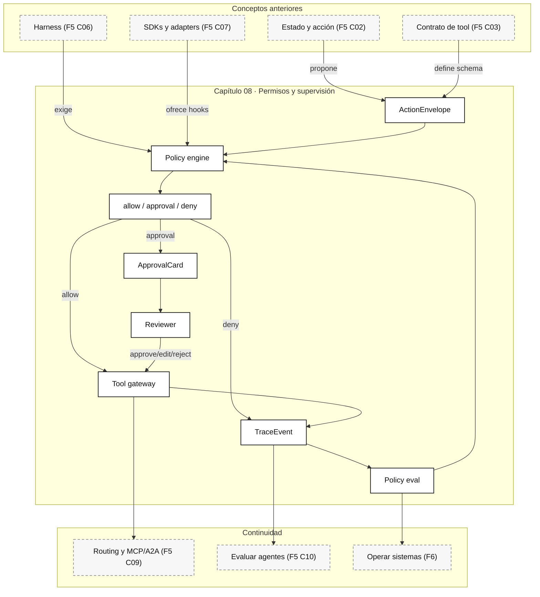

::: {.fasciculo-subtitle}
Facsímil 5 · Agentes y orquestación
:::

# Capítulo 08: Permisos, autonomía y supervisión humana

## Autonomía no significa carta blanca

En el [capítulo 01](/libro/fasciculo-05/#capitulo-01) dijimos que un agente no es “un prompt largo”, sino un sistema que puede observar, decidir y actuar. En el [capítulo 03](/libro/fasciculo-05/#capitulo-03) aprendimos que una tool no es una función cualquiera: tiene contrato, permisos, errores y efectos. En el [capítulo 06](/libro/fasciculo-05/#capitulo-06) pusimos harness alrededor del agente. Y en el [capítulo 07](/libro/fasciculo-05/#capitulo-07) vimos cómo los SDKs exponen permisos, hooks, trazas y aprobaciones.

Ahora toca una pieza que suele decidir si un sistema agentic es publicable: **quién puede hacer qué, cuándo, con qué evidencia y bajo qué revisión**.

Un agente no debería vivir entre dos extremos: “no puede hacer nada” o “puede hacerlo todo”. La autonomía útil se diseña por capas. Puede leer sin preguntar, proponer cambios, preparar una acción, pedir aprobación antes de ejecutarla, ejecutar automáticamente acciones pequeñas dentro de un margen y detenerse cuando algo sale del contrato.

## Qué no es supervisión humana

Supervisión humana no es poner un botón de “aceptar” al final de una pantalla. Si la persona no entiende qué va a ocurrir, qué datos se usaron, qué herramienta se ejecutará y cómo volver atrás si hace falta, no está supervisando: está firmando a ciegas.

Tampoco es revisar todas las acciones. Eso convierte el sistema en una cola lenta y enseña a la gente a pulsar “sí” sin leer. La revisión debe aparecer donde aporta juicio: acciones con efecto externo, coste alto, incertidumbre, impacto sobre otra persona, modificación persistente o falta de evidencia.

Y no es delegar responsabilidad al modelo. El modelo puede sugerir. La política decide. El harness ejecuta. La traza demuestra.

## La definición útil

Para este libro, un sistema de permisos agentic es:

> Una capa de decisión que evalúa cada acción propuesta por el agente y devuelve `allow`, `approval_required` o `deny`, dejando evidencia suficiente para explicar la decisión y reanudar la ejecución.

**Ejemplo de fórmula.** Podemos modelarlo así:

$$
D(a, s, u, r, e) \in \{\text{allow}, \text{approval}, \text{deny}\}
$$

| Símbolo | Significado | Ejemplo |
|---|---|---|
| \(D\) | Decisión de permiso. | Permitir, pedir aprobación o denegar. |
| \(a\) | Acción propuesta. | Enviar email, editar archivo, consultar CRM, crear ticket. |
| \(s\) | Estado de la ejecución. | Paso actual, coste, intentos, evidencia acumulada. |
| \(u\) | Usuario o actor responsable. | Alumno, profesor, operador, sistema nocturno. |
| \(r\) | Recurso afectado. | Documento, base de datos, repositorio, cliente, factura. |
| \(e\) | Entorno. | Desarrollo, preproducción, producción, demo, laboratorio. |

La decisión no depende solo de la tool. Depende de la tool **con argumentos concretos**. No es lo mismo `send_email(to="yo@example.com")` que `send_email(to="lista-completa@example.com")`. No es lo mismo editar una propuesta local que publicar un cambio persistente. El permiso real vive en el cruce entre acción, recurso, usuario, entorno y momento.

## Fecha de corte del estado del arte

**Fecha de corte:** 10 de junio de 2026.  
**Fuentes consultadas ese día:** documentación oficial de OpenAI Agents SDK sobre human-in-the-loop, guardrails y ejecución; documentación oficial de Anthropic sobre permisos y hooks del Claude Agent SDK; documentación oficial de Google ADK sobre callbacks y controles en herramientas; documentación oficial de LangGraph sobre interrupts y persistencia; NIST AI Risk Management Framework como marco general de gobierno y gestión de riesgo.

Lo estable es el patrón: permisos explícitos, aprobación estructurada, pausa/reanudación, trazas, gates, límites de alcance y revisión humana donde aporta criterio. Lo cambiante son nombres de parámetros, APIs de SDK, modos de permiso, conectores y detalles de producto.

## Niveles de autonomía

La autonomía se diseña mejor como una escala:

| Nivel | Nombre | Qué puede hacer | Ejemplo |
|---|---|---|---|
| A0 | Responder | Solo produce texto. | Explicar una política interna. |
| A1 | Leer | Puede consultar recursos permitidos. | Buscar una referencia en una carpeta autorizada. |
| A2 | Preparar | Puede crear una propuesta, no ejecutarla. | Redactar email o diff sin enviarlo. |
| A3 | Ejecutar con aprobación | Puede actuar tras revisión explícita. | Publicar una nota, enviar email, modificar registro. |
| A4 | Ejecutar dentro de margen | Puede actuar automáticamente si cumple umbrales. | Clasificar tickets de baja criticidad. |
| A5 | Operar con guardia | Puede ejecutar flujos largos, pero con límites, alertas y gates. | Monitorizar cola y escalar casos fuera de patrón. |

La escala no se asigna al agente entero. Se asigna a cada acción.

| Acción | Nivel razonable | Por qué |
|---|---|---|
| Leer documentación pública | A1 | No cambia estado. |
| Leer datos internos | A1 con scope | Requiere identidad, recurso y motivo. |
| Redactar respuesta | A2 | No hay efecto externo todavía. |
| Enviar respuesta a una persona | A3 o A4 | Depende del canal, contenido y confianza. |
| Modificar una base de datos | A3 | Persistente y difícil de corregir sin traza. |
| Cambiar configuración de producción | A3 con doble revisión | Alto impacto operacional. |
| Ejecutar una herramienta de coste alto | A3 | Afecta presupuesto. |

La regla práctica: **la autonomía sube cuando el efecto es reversible, barato, acotado y bien evaluado; baja cuando el efecto es persistente, amplio, caro o incierto**.

## Matriz de permisos

**Ejemplo de fórmula.** Un permiso serio no es una lista de herramientas. Es una matriz:

$$
P =
(actor, action, resource, scope, env, budget, evidence, expiry)
$$

| Campo | Pregunta | Ejemplo |
|---|---|---|
| `actor` | ¿Quién responde por la acción? | `profesor`, `sistema_soporte`, `alumno_lab`. |
| `action` | ¿Qué tipo de acción es? | `read`, `draft`, `write`, `send`, `delete`, `publish`. |
| `resource` | ¿Sobre qué recurso? | `tickets`, `notas`, `repo`, `crm`, `email`. |
| `scope` | ¿Con qué alcance? | Solo curso actual, solo carpeta del proyecto, solo cliente asignado. |
| `env` | ¿En qué entorno? | `dev`, `staging`, `prod`. |
| `budget` | ¿Con qué límite? | 3 tools, 0,20 EUR, 90 segundos, 2 ficheros. |
| `evidence` | ¿Qué debe demostrar antes? | Cita encontrada, test pasando, diff visible. |
| `expiry` | ¿Cuánto dura? | Esta run, 10 minutos, una sesión, una release. |

Un ejemplo de permiso mal diseñado:

```text
tool: send_email
permission: allowed
```

Un ejemplo más publicable:

```text
actor: soporte_nivel_1
action: send
resource: email
scope:
  recipients: ["usuario_actual"]
  templates: ["respuesta_estado_matricula", "peticion_documentacion"]
env: prod
budget:
  max_messages: 1
  max_tokens: 900
evidence:
  required_fields: ["ticket_id", "user_id", "reason", "draft"]
decision:
  if_template_known_and_no_personal_claim: allow
  else: approval_required
expiry: run
```

La diferencia es enorme: el segundo permiso se puede auditar, probar y explicar.

## Fórmula de riesgo operativo

**Ejemplo de fórmula.** No necesitamos una fórmula perfecta para tomar mejores decisiones. Necesitamos una que nos obligue a mirar variables correctas.

$$
\rho(a) =
w_E E(a) +
w_R R(a) +
w_C C(a) +
w_U U(a) +
w_N N(a) -
w_V V(a)
$$

| Término | Qué mide | Ejemplo |
|---|---|---|
| \(E(a)\) | Efecto externo. | Enviar, publicar, cobrar, modificar. |
| \(R(a)\) | Reversibilidad. | Se puede deshacer fácil o no. |
| \(C(a)\) | Coste. | Tokens, API externa, GPU, tiempo humano. |
| \(U(a)\) | Incertidumbre. | Falta evidencia o confianza. |
| \(N(a)\) | Novedad. | Acción poco probada o fuera de patrón. |
| \(V(a)\) | Verificación disponible. | Tests, schema, cita, diff, regla determinista. |
| \(w\) | Pesos del dominio. | No pesan igual en educación que en facturación. |

**Ejemplo de fórmula.** Y decidimos con umbrales:

$$
D(a)=
\begin{cases}
\text{allow} & \rho(a) < \theta_1 \\
\text{approval} & \theta_1 \le \rho(a) < \theta_2 \\
\text{deny} & \rho(a) \ge \theta_2
\end{cases}
$$

Esto no sustituye al criterio. Lo documenta. Si una acción queda en `approval`, la persona no revisa “todo el agente”; revisa una acción concreta con evidencia concreta.

## Lo que dicen los SDKs actuales

OpenAI Agents SDK documenta un flujo human-in-the-loop donde la ejecución puede pausar hasta que una persona aprueba o rechaza llamadas a tools; las interrupciones pueden aparecer en tools normales, MCP hospedado y agentes usados como tools.^[OpenAI. (2026). *Human-in-the-loop*. https://openai.github.io/openai-agents-python/human_in_the_loop/. Consultado el 10 de junio de 2026.] También distingue guardrails de entrada, salida y herramientas, y recomienda tool guardrails cuando hay managers, handoffs o especialistas delegados.^[OpenAI. (2026). *Guardrails*. https://openai.github.io/openai-agents-python/guardrails/. Consultado el 10 de junio de 2026.]

Anthropic Claude Agent SDK permite controlar tools mediante modos de permiso, allow/deny lists, callbacks y hooks; además, sus hooks permiten intervenir antes o después de tool use, parada, notificaciones o subagentes.^[Anthropic. (2026). *Claude Agent SDK: Permissions*. https://code.claude.com/docs/en/agent-sdk/permissions. Consultado el 10 de junio de 2026.]^[Anthropic. (2026). *Claude Agent SDK: Hooks*. https://code.claude.com/docs/en/agent-sdk/hooks. Consultado el 10 de junio de 2026.]

Google ADK coloca los callbacks como puntos de observación y control antes/después de agente, modelo y tools; los callbacks de tool permiten intervenir justo antes o después de que una herramienta se ejecute.^[Google. (2026). *Callbacks: Observe, Customize, and Control Agent Behavior*. https://adk.dev/callbacks/. Consultado el 10 de junio de 2026.] Su documentación de controles en agentes insiste en diseñar herramientas defensivamente y usar callbacks como capas de validación y control.^[Google. (2026). *Safety and Security for AI Agents*. https://adk.dev/safety/. Consultado el 10 de junio de 2026.]

LangGraph usa `interrupt()` para pausar una ejecución, guardar estado con checkpointer y reanudar con `Command`; esto es importante porque la aprobación humana no debería perder el estado de la ejecución.^[LangChain. (2026). *LangGraph interrupts*. https://docs.langchain.com/oss/python/langgraph/human-in-the-loop. Consultado el 10 de junio de 2026.]

La coincidencia entre ecosistemas es clara: las aprobaciones no son un modal decorativo. Son una primitiva de ejecución: pausar, mostrar evidencia, decidir, reanudar y dejar traza.

## Anatomía visual de permisos y supervisión

<svg id="f5-c08-permission-architecture" xmlns="http://www.w3.org/2000/svg" viewBox="0 0 1880 1280" role="img" aria-label="Arquitectura técnica de permisos, autonomía graduada y supervisión humana para agentes">
  <defs>
    <marker id="f5c08-arrow" viewBox="0 0 10 10" refX="9" refY="5" markerWidth="7" markerHeight="7" orient="auto-start-reverse">
      <path d="M 0 0 L 10 5 L 0 10 z" fill="#111111"/>
    </marker>
    <marker id="f5c08-soft-arrow" viewBox="0 0 10 10" refX="9" refY="5" markerWidth="6" markerHeight="6" orient="auto-start-reverse">
      <path d="M 0 0 L 10 5 L 0 10 z" fill="#666666"/>
    </marker>
    <pattern id="f5c08-grid" width="22" height="22" patternUnits="userSpaceOnUse">
      <path d="M 22 0 L 0 0 0 22" fill="none" stroke="#EEEEEE" stroke-width="1"/>
    </pattern>
    <style>
      #f5-c08-permission-architecture .frame { fill: #FFFFFF; stroke: #111111; stroke-width: 2; }
      #f5-c08-permission-architecture .lane { fill: #FFFFFF; stroke: #111111; stroke-width: 1.1; stroke-dasharray: 8 6; }
      #f5-c08-permission-architecture .panel { fill: #FFFFFF; stroke: #111111; stroke-width: 1.45; }
      #f5-c08-permission-architecture .soft { fill: #F7F7F7; stroke: #111111; stroke-width: 1.2; }
      #f5-c08-permission-architecture .dark { fill: #111111; stroke: #111111; stroke-width: 1.2; }
      #f5-c08-permission-architecture .wire { fill: none; stroke: #111111; stroke-width: 1.45; marker-end: url(#f5c08-arrow); }
      #f5-c08-permission-architecture .softwire { fill: none; stroke: #666666; stroke-width: 1.05; stroke-dasharray: 6 5; marker-end: url(#f5c08-soft-arrow); }
      #f5-c08-permission-architecture .returnwire { fill: none; stroke: #333333; stroke-width: 1.1; stroke-dasharray: 3 5; marker-end: url(#f5c08-arrow); }
      #f5-c08-permission-architecture .title { font: 700 24px Arial, sans-serif; fill: #111111; }
      #f5-c08-permission-architecture .subtitle { font: 700 19px Arial, sans-serif; fill: #111111; }
      #f5-c08-permission-architecture .label { font: 700 16px Arial, sans-serif; fill: #111111; }
      #f5-c08-permission-architecture .small { font: 15px Arial, sans-serif; fill: #555555; }
      #f5-c08-permission-architecture .tiny { font: 13px Arial, sans-serif; fill: #666666; }
      #f5-c08-permission-architecture text { font-family: Arial, sans-serif; }
    </style>
  </defs>

  <rect x="24" y="24" width="1832" height="1232" rx="18" class="frame"/>
  <text x="940" y="64" text-anchor="middle" font-size="38" font-weight="700" fill="#111111">Permisos: autonomía graduada por acción</text>
  <text x="940" y="98" text-anchor="middle" font-size="18" fill="#555555">El modelo propone, la política decide, el harness ejecuta, la traza demuestra y la persona revisa donde aporta criterio.</text>
  <rect x="58" y="126" width="1764" height="1036" rx="14" fill="url(#f5c08-grid)" stroke="#DDDDDD"/>

  <rect x="92" y="158" width="1710" height="270" rx="14" class="lane"/>
  <text x="122" y="190" class="label">PROPUESTA DE ACCIÓN</text>

  <rect x="126" y="224" width="218" height="124" rx="13" class="panel"/>
  <text x="235" y="258" text-anchor="middle" class="title">Agente</text>
  <text x="235" y="288" text-anchor="middle" class="small">observa estado</text>
  <text x="235" y="310" text-anchor="middle" class="small">propone acción</text>
  <text x="235" y="334" text-anchor="middle" class="tiny">no ejecuta aún</text>

  <rect x="410" y="204" width="336" height="164" rx="13" class="soft"/>
  <text x="578" y="238" text-anchor="middle" class="title">Action envelope</text>
  <text x="578" y="268" text-anchor="middle" class="small">tool + argumentos</text>
  <text x="578" y="290" text-anchor="middle" class="small">recurso + entorno</text>
  <text x="578" y="312" text-anchor="middle" class="small">coste + reversibilidad</text>
  <text x="578" y="340" text-anchor="middle" class="tiny">todo serializable</text>

  <rect x="812" y="184" width="404" height="204" rx="13" class="panel"/>
  <text x="1014" y="220" text-anchor="middle" class="title">Policy engine</text>
  <rect x="846" y="252" width="142" height="48" rx="8" class="soft"/>
  <text x="917" y="282" text-anchor="middle" class="label">actor</text>
  <rect x="1010" y="252" width="142" height="48" rx="8" class="soft"/>
  <text x="1081" y="282" text-anchor="middle" class="label">scope</text>
  <rect x="846" y="320" width="142" height="48" rx="8" class="soft"/>
  <text x="917" y="350" text-anchor="middle" class="label">budget</text>
  <rect x="1010" y="320" width="142" height="48" rx="8" class="soft"/>
  <text x="1081" y="350" text-anchor="middle" class="label">evidence</text>

  <rect x="1282" y="204" width="340" height="164" rx="13" class="dark"/>
  <text x="1452" y="244" text-anchor="middle" font-size="24" font-weight="700" fill="#FFFFFF">Decisión</text>
  <text x="1452" y="278" text-anchor="middle" font-size="16" fill="#FFFFFF">allow · approval · deny</text>
  <text x="1452" y="306" text-anchor="middle" font-size="15" fill="#FFFFFF">con motivo y trace_id</text>
  <text x="1452" y="334" text-anchor="middle" font-size="13" fill="#FFFFFF">nunca decisión muda</text>

  <path d="M344 286 L410 286" class="wire"/>
  <path d="M746 286 L812 286" class="wire"/>
  <path d="M1216 286 L1282 286" class="wire"/>

  <rect x="92" y="480" width="1710" height="360" rx="14" class="lane"/>
  <text x="122" y="512" class="label">RUTAS DE EJECUCIÓN</text>

  <rect x="128" y="568" width="242" height="134" rx="13" class="panel"/>
  <text x="249" y="604" text-anchor="middle" class="title">ALLOW</text>
  <text x="249" y="634" text-anchor="middle" class="small">ejecuta tool</text>
  <text x="249" y="656" text-anchor="middle" class="small">dentro de scope</text>
  <text x="249" y="682" text-anchor="middle" class="tiny">registra resultado</text>

  <rect x="452" y="536" width="324" height="198" rx="13" class="soft"/>
  <text x="614" y="574" text-anchor="middle" class="title">APPROVAL</text>
  <text x="614" y="604" text-anchor="middle" class="small">pausa ejecución</text>
  <text x="614" y="626" text-anchor="middle" class="small">muestra diff, coste, recurso</text>
  <text x="614" y="648" text-anchor="middle" class="small">persona decide</text>
  <rect x="508" y="674" width="88" height="38" rx="8" class="panel"/>
  <text x="552" y="698" text-anchor="middle" class="label">approve</text>
  <rect x="632" y="674" width="88" height="38" rx="8" class="panel"/>
  <text x="676" y="698" text-anchor="middle" class="label">edit</text>

  <rect x="858" y="568" width="242" height="134" rx="13" class="panel"/>
  <text x="979" y="604" text-anchor="middle" class="title">DENY</text>
  <text x="979" y="634" text-anchor="middle" class="small">no ejecuta</text>
  <text x="979" y="656" text-anchor="middle" class="small">devuelve motivo</text>
  <text x="979" y="682" text-anchor="middle" class="tiny">propone alternativa</text>

  <rect x="1182" y="536" width="344" height="198" rx="13" class="soft"/>
  <text x="1354" y="574" text-anchor="middle" class="title">Tool gateway</text>
  <text x="1354" y="604" text-anchor="middle" class="small">valida schema</text>
  <text x="1354" y="626" text-anchor="middle" class="small">aplica idempotencia</text>
  <text x="1354" y="648" text-anchor="middle" class="small">ejecuta o simula</text>
  <text x="1354" y="682" text-anchor="middle" class="tiny">sin saltarse política</text>

  <path d="M1452 368 C1452 454 250 480 249 568" class="softwire"/>
  <path d="M1452 368 C1310 456 658 456 614 536" class="softwire"/>
  <path d="M1452 368 C1310 454 1010 484 979 568" class="softwire"/>
  <path d="M370 635 L452 635" class="wire"/>
  <path d="M776 635 L858 635" class="wire"/>
  <path d="M1100 635 L1182 635" class="wire"/>

  <rect x="92" y="888" width="1710" height="210" rx="14" class="lane"/>
  <text x="122" y="920" class="label">SUPERVISIÓN Y TRAZA</text>

  <rect x="128" y="958" width="240" height="92" rx="12" class="panel"/>
  <text x="248" y="990" text-anchor="middle" class="subtitle">Approval card</text>
  <text x="248" y="1016" text-anchor="middle" class="small">qué cambia y por qué</text>
  <text x="248" y="1036" text-anchor="middle" class="tiny">sin texto ambiguo</text>

  <rect x="426" y="958" width="240" height="92" rx="12" class="soft"/>
  <text x="546" y="990" text-anchor="middle" class="subtitle">Reviewer</text>
  <text x="546" y="1016" text-anchor="middle" class="small">aprueba, edita o rechaza</text>
  <text x="546" y="1036" text-anchor="middle" class="tiny">decisión responsable</text>

  <rect x="724" y="958" width="240" height="92" rx="12" class="panel"/>
  <text x="844" y="990" text-anchor="middle" class="subtitle">RunState</text>
  <text x="844" y="1016" text-anchor="middle" class="small">pausa y reanuda</text>
  <text x="844" y="1036" text-anchor="middle" class="tiny">estado persistente</text>

  <rect x="1022" y="958" width="240" height="92" rx="12" class="soft"/>
  <text x="1142" y="990" text-anchor="middle" class="subtitle">Trace log</text>
  <text x="1142" y="1016" text-anchor="middle" class="small">decisión, motivo, coste</text>
  <text x="1142" y="1036" text-anchor="middle" class="tiny">auditable</text>

  <rect x="1320" y="958" width="240" height="92" rx="12" class="panel"/>
  <text x="1440" y="990" text-anchor="middle" class="subtitle">Eval gate</text>
  <text x="1440" y="1016" text-anchor="middle" class="small">mide policy y UX</text>
  <text x="1440" y="1036" text-anchor="middle" class="tiny">mejora la matriz</text>

  <path d="M614 734 C610 840 280 874 248 958" class="softwire"/>
  <path d="M248 1050 L426 1004" class="wire"/>
  <path d="M666 1004 L724 1004" class="wire"/>
  <path d="M964 1004 L1022 1004" class="wire"/>
  <path d="M1262 1004 L1320 1004" class="wire"/>
  <path d="M844 958 C842 850 1190 810 1354 734" class="returnwire"/>

  <rect x="94" y="1138" width="1120" height="54" rx="12" class="panel"/>
  <text x="122" y="1162" class="label">Recibo mínimo</text>
  <text x="122" y="1185" class="small">decision_id · actor · action · resource · scope · risk_score · evidence · reviewer · result · trace_id · expires_at</text>
  <rect x="1340" y="1154" width="402" height="34" rx="17" fill="#111111"/>
  <text opacity="0.55" x="1541" y="1176" text-anchor="end" font-size="11" font-weight="700" fill="#888888">IA para gente curiosa / Facsímil 05 / Capítulo 08 / 686f6c61</text>
</svg>

La figura separa propuesta, decisión, ejecución, revisión y traza. Esa separación es el corazón del capítulo. El agente no debería llamar una tool “porque sí”. Debe producir un sobre de acción. La política lo evalúa. Si la respuesta es `approval`, la ejecución se pausa y la persona recibe una tarjeta revisable. Después se reanuda con estado, no desde cero.

## Qué debe llevar una tarjeta de aprobación

Una aprobación humana útil no pregunta “¿permitir?”. Pregunta algo revisable:

| Campo | Por qué importa | Ejemplo |
|---|---|---|
| Acción | La persona debe saber qué se ejecutará. | `send_email`, `publish_page`, `update_record`. |
| Recurso | Qué elemento se verá afectado. | Ticket `T-1042`, archivo `capitulo-08.md`. |
| Cambio propuesto | Qué diferencia concreta habrá. | Diff, email final, campos modificados. |
| Motivo | Por qué el agente propone hacerlo. | “Falta documentación solicitada”. |
| Evidencia | Qué ha comprobado. | URL, test, cita, consulta, fuente. |
| Coste | Cuánto consume continuar. | Tokens, herramienta externa, tiempo. |
| Reversibilidad | Cómo se corrige si no era adecuado. | Rollback, edición manual, nueva versión. |
| Alternativas | Qué pasa si se rechaza. | Guardar propuesta, pedir más datos, escalar. |
| Expiración | Cuándo deja de valer la decisión. | Esta run, 10 minutos, versión actual. |

Si la tarjeta no contiene evidencia, el revisor se convierte en oráculo. Y las personas no son oráculos: necesitan contexto, comparación y consecuencias.

## Tarjeta de aprobación en Claude Agent SDK

En Anthropic, la tarjeta no debería generarla el modelo como texto libre. La tarjeta debería nacer en tu aplicación cuando el SDK llama a `can_use_tool`. La documentación actual explica que Claude pide entrada de usuario en dos casos: cuando necesita permiso para usar una tool y cuando llama a `AskUserQuestion`; ambos pasan por `canUseTool` / `can_use_tool`, y la ejecución queda pausada hasta que devuelves una respuesta.^[Anthropic. (2026). *Claude Agent SDK: Handle approvals and user input*. https://code.claude.com/docs/en/agent-sdk/user-input. Consultado el 10 de junio de 2026.]

El orden técnico importa:

```text
Claude pide tool
  -> hooks PreToolUse
  -> reglas deny
  -> permission_mode
  -> reglas allow
  -> can_use_tool
  -> allow / deny con mensaje
```

Por eso la tarjeta debe construirse con datos del runtime, no con una frase del modelo. Para un producto real, usaría esta forma:

```json
{
  "approval_id": "appr_01J...",
  "provider": "anthropic",
  "sdk": "claude-agent-sdk",
  "session_id": "session_...",
  "tool_name": "Write",
  "tool_input": {
    "file_path": "fasciculo-05-agentes-orquestacion/08-permisos-autonomia-supervision-humana.md"
  },
  "summary": "Claude quiere escribir cambios en el capítulo 08.",
  "why_review": "La tool modifica un archivo persistente.",
  "risk": {
    "effect": "write",
    "environment": "dev",
    "reversible": true,
    "score": 0.42
  },
  "evidence": [
    "Capítulo actual en revisión",
    "Cambio limitado al facsímil 05",
    "Build de Astro pendiente tras aprobar"
  ],
  "choices": [
    "approve_once",
    "approve_with_changes",
    "reject"
  ],
  "expires_at": "2026-06-10T10:45:00+02:00"
}
```

La UI visible podría mostrar algo así:

| Campo en pantalla | Ejemplo |
|---|---|
| Acción | `Write` sobre capítulo 08. |
| Motivo | Modifica un archivo persistente. |
| Alcance | Solo `fasciculo-05-agentes-orquestacion/08...md`. |
| Evidencia | El cambio viene de una petición explícita del autor. |
| Riesgo | Escritura reversible en entorno de desarrollo. |
| Opciones | Aprobar una vez, aprobar con cambios, rechazar. |

Y el código conceptual en Python quedaría así:

```python
import asyncio
import time
from dataclasses import dataclass, asdict

from claude_agent_sdk import ClaudeAgentOptions, ResultMessage, query
from claude_agent_sdk.types import (
    HookMatcher,
    PermissionResultAllow,
    PermissionResultDeny,
    ToolPermissionContext,
)


@dataclass
class ApprovalCard:
    approval_id: str
    provider: str
    sdk: str
    tool_name: str
    tool_input: dict
    summary: str
    why_review: str
    risk_score: float
    choices: list[str]
    expires_in_seconds: int


def summarize_tool(tool_name: str, input_data: dict) -> tuple[str, str, float]:
    if tool_name in {"Write", "Edit"}:
        path = input_data.get("file_path", "archivo sin ruta")
        return (
            f"Claude quiere modificar {path}.",
            "La tool cambia un recurso persistente.",
            0.42,
        )

    if tool_name == "Bash":
        command = input_data.get("command", "")
        return (
            f"Claude quiere ejecutar: {command}",
            "La tool ejecuta un comando del sistema.",
            0.58,
        )

    return (
        f"Claude quiere usar {tool_name}.",
        "La tool no está autoaprobada por la política actual.",
        0.35,
    )


async def ask_approval_ui(card: ApprovalCard) -> dict:
    """
    En producción esto sería tu UI: web, app interna, Slack, consola,
    cola de revisión o sistema de tickets.
    """
    print("\n=== APPROVAL CARD ===")
    print(card.summary)
    print("Motivo:", card.why_review)
    print("Riesgo:", card.risk_score)
    print("Input:", card.tool_input)
    print("Opciones:", ", ".join(card.choices))

    # Simulación para el libro: una UI real devolvería también input editado.
    return {"decision": "reject", "message": "Revisar manualmente antes de ejecutar."}


async def can_use_tool(
    tool_name: str,
    input_data: dict,
    context: ToolPermissionContext,
) -> PermissionResultAllow | PermissionResultDeny:
    summary, why_review, risk = summarize_tool(tool_name, input_data)

    card = ApprovalCard(
        approval_id=f"appr-{int(time.time())}",
        provider="anthropic",
        sdk="claude-agent-sdk",
        tool_name=tool_name,
        tool_input=input_data,
        summary=summary,
        why_review=why_review,
        risk_score=risk,
        choices=["approve_once", "approve_with_changes", "reject"],
        expires_in_seconds=600,
    )

    decision = await ask_approval_ui(card)

    if decision["decision"] == "approve_once":
        return PermissionResultAllow(updated_input=input_data)

    if decision["decision"] == "approve_with_changes":
        updated_input = {**input_data, **decision.get("updated_input", {})}
        return PermissionResultAllow(updated_input=updated_input)

    return PermissionResultDeny(message=decision["message"])


async def keep_stream_open(_input_data, _tool_use_id, _context):
    return {"continue_": True}


async def prompt_stream():
    yield {
        "type": "user",
        "message": {
            "role": "user",
            "content": "Propón una mejora concreta del capítulo 08 y prepara el cambio.",
        },
    }


async def main():
    async for message in query(
        prompt=prompt_stream(),
        options=ClaudeAgentOptions(
            permission_mode="default",
            can_use_tool=can_use_tool,
            hooks={"PreToolUse": [HookMatcher(matcher=None, hooks=[keep_stream_open])]},
        ),
    ):
        if isinstance(message, ResultMessage):
            print(message.subtype, message.result)


asyncio.run(main())
```

Hay tres detalles finos:

| Detalle | Por qué importa |
|---|---|
| `permission_mode="default"` | Si todo cae en `bypassPermissions`, no hay tarjeta útil: el SDK aprobará demasiadas cosas. |
| `can_use_tool` | Es el punto donde tu app puede construir la tarjeta y devolver `PermissionResultAllow` o `PermissionResultDeny`. |
| `updated_input` | Permite aprobar con cambios: por ejemplo, limitar ruta, cambiar comando o acotar destinatario. |
| Hook `PreToolUse` | En Python, la documentación indica que el flujo con `can_use_tool` requiere streaming y un hook que mantenga la sesión abierta. |

Si la persona tarda demasiado, no intentaría mantener siempre vivo el proceso. Guardaría `ApprovalCard`, `session_id`, `tool_name`, `input_data`, `trace_id` y estado de la run en una tabla propia, y reanudaría desde sesión/checkpoint cuando llegue la decisión. Eso convierte la aprobación en arquitectura, no en un `input("y/n")`.

### ApprovalCard como entidad persistente

La tarjeta no es solo una vista. Es una entidad de dominio. Si no la persistes, no puedes auditar, reanudar ni explicar decisiones.

El ciclo de vida mínimo sería:

```text
created
  -> pending
  -> approved | edited | rejected | expired | superseded
  -> resumed | closed
```

| Estado | Qué significa | Qué debe pasar |
|---|---|---|
| `created` | La policy detectó que hace falta revisión. | Crear registro con tool, input, sesión y trace id. |
| `pending` | La tarjeta espera decisión. | Mostrar UI, bloquear ejecución o devolver defer. |
| `approved` | La persona permite la acción original. | Revalidar expiración y ejecutar input original. |
| `edited` | La persona modifica argumentos. | Validar schema, scope y riesgo antes de ejecutar. |
| `rejected` | La persona no permite la acción. | Devolver `PermissionResultDeny` con motivo útil. |
| `expired` | La tarjeta caducó. | No ejecutar; pedir nueva decisión si sigue haciendo falta. |
| `superseded` | Otra tarjeta reemplaza esta. | Cerrar sin ejecutar para evitar decisiones antiguas. |
| `resumed` | La run continúa con decisión aplicada. | Registrar resultado de tool y estado final. |
| `closed` | Ya no queda nada pendiente. | Conservar recibo y métricas. |

Una tabla mínima podría ser:

| Campo | Tipo | Para qué sirve |
|---|---|---|
| `approval_id` | string | Identidad estable de la tarjeta. |
| `provider` | string | `anthropic`, `openai`, `google`, `local`. |
| `session_id` | string | Reanudar o correlacionar ejecución. |
| `trace_id` | string | Unir con logs y spans. |
| `tool_name` | string | Tool solicitada por el agente. |
| `tool_input_original` | JSON | Input que pidió Claude. |
| `tool_input_effective` | JSON | Input final tras posible edición. |
| `status` | enum | `pending`, `approved`, `edited`, `rejected`, etc. |
| `reviewer_id` | string | Quién tomó la decisión. |
| `decision_reason` | string | Motivo visible para auditoría. |
| `risk_score` | number | Score calculado en ese momento. |
| `expires_at` | timestamp | Evita ejecutar decisiones viejas. |
| `created_at` / `decided_at` | timestamp | Latencia de revisión. |

En SQL simplificado:

```sql
CREATE TABLE approval_cards (
  approval_id TEXT PRIMARY KEY,
  provider TEXT NOT NULL,
  session_id TEXT NOT NULL,
  trace_id TEXT NOT NULL,
  tool_name TEXT NOT NULL,
  tool_input_original JSON NOT NULL,
  tool_input_effective JSON,
  status TEXT NOT NULL,
  reviewer_id TEXT,
  decision_reason TEXT,
  risk_score REAL NOT NULL,
  expires_at TEXT NOT NULL,
  created_at TEXT NOT NULL,
  decided_at TEXT
);
```

La regla importante: **si `status` no está en `approved` o `edited`, no se ejecuta la tool**. Y si está en `edited`, se ejecuta `tool_input_effective`, no el input original.

### Aprobar con cambios

`PermissionResultAllow(updated_input=...)` es una pieza muy potente. Permite que la persona diga “sí, pero con este alcance”. Por ejemplo:

| Tool | Input original | Cambio humano | Validación obligatoria |
|---|---|---|---|
| `Bash` | `pytest && npm run build` | Ejecutar solo `npm run build`. | Comando permitido, cwd permitido, timeout. |
| `Write` | Ruta amplia. | Limitar a un archivo concreto. | Ruta dentro de workspace permitido. |
| `Edit` | Reemplazo grande. | Reducir diff. | Diff no toca secciones no aprobadas. |
| MCP tool | Query sin límite. | Añadir `limit=20`. | Schema y coste estimado. |
| `AskUserQuestion` | Opciones del modelo. | Respuesta libre. | Mapear respuesta a input aceptado. |

El flujo correcto no es:

```text
persona edita -> ejecutar
```

Es:

```text
input original
  -> edición humana
  -> validar schema
  -> validar scope
  -> recalcular riesgo si cambia el efecto
  -> ejecutar
  -> trazar input original e input efectivo
```

En pseudocódigo:

```python
def apply_human_edit(original_input: dict, patch: dict, tool_schema: dict, scope: dict) -> dict:
    effective_input = {**original_input, **patch}
    validate_schema(effective_input, tool_schema)
    validate_scope(effective_input, scope)
    return effective_input
```

Así, la aprobación humana no abre una puerta lateral. Sigue pasando por contrato.

### Variantes de tarjeta según tool

No todas las tools deben mostrar lo mismo:

| Tool | Qué debe mostrar la tarjeta | Qué decisión tiene sentido |
|---|---|---|
| `Read` | Ruta, límite, motivo, datos sensibles esperados. | Permitir una vez, limitar ruta, rechazar. |
| `Grep` / búsqueda | Patrón, carpeta, límite de resultados. | Limitar scope o permitir. |
| `Write` | Ruta, contenido nuevo, si crea o sobrescribe. | Aprobar, editar contenido, rechazar. |
| `Edit` | Diff exacto, líneas tocadas, resumen de cambio. | Aprobar diff, editar diff, rechazar. |
| `Bash` | Comando, `cwd`, timeout, variables, efecto esperado. | Ejecutar, cambiar comando, rechazar. |
| MCP tool | Servidor, tool remota, argumentos, coste y datos enviados. | Permitir, reducir payload, rechazar. |
| `AskUserQuestion` | Preguntas, opciones y respuesta esperada. | Responder, escribir opción propia, cancelar. |
| Subagente | Tarea, contexto entregado, tools disponibles. | Delegar, acotar contexto, rechazar. |

Si la tarjeta para `Bash` no muestra el comando completo, está incompleta. Si la tarjeta para `Edit` no muestra diff, está incompleta. Si la tarjeta MCP no muestra qué datos salen hacia el servidor, está incompleta.

### UI sobria de una ApprovalCard

<svg id="f5-c08-approval-card-ui" xmlns="http://www.w3.org/2000/svg" viewBox="0 0 1500 980" role="img" aria-label="Diseño visual sobrio de una tarjeta de aprobación para Claude Agent SDK">
  <defs>
    <style>
      #f5-c08-approval-card-ui .frame { fill: #FFFFFF; stroke: #111111; stroke-width: 2; }
      #f5-c08-approval-card-ui .panel { fill: #FFFFFF; stroke: #111111; stroke-width: 1.4; }
      #f5-c08-approval-card-ui .soft { fill: #F7F7F7; stroke: #111111; stroke-width: 1.1; }
      #f5-c08-approval-card-ui .dark { fill: #111111; stroke: #111111; stroke-width: 1.1; }
      #f5-c08-approval-card-ui .line { stroke: #111111; stroke-width: 1; }
      #f5-c08-approval-card-ui .muted-line { stroke: #CCCCCC; stroke-width: 1; }
      #f5-c08-approval-card-ui .title { font: 700 30px Arial, sans-serif; fill: #111111; }
      #f5-c08-approval-card-ui .h { font: 700 18px Arial, sans-serif; fill: #111111; }
      #f5-c08-approval-card-ui .label { font: 700 14px Arial, sans-serif; fill: #111111; }
      #f5-c08-approval-card-ui .body { font: 14px Arial, sans-serif; fill: #333333; }
      #f5-c08-approval-card-ui .tiny { font: 12px Arial, sans-serif; fill: #666666; }
      #f5-c08-approval-card-ui text { font-family: Arial, sans-serif; }
    </style>
  </defs>

  <rect x="24" y="24" width="1452" height="932" rx="18" class="frame"/>
  <text x="750" y="72" text-anchor="middle" class="title">ApprovalCard · Claude Agent SDK</text>
  <text x="750" y="102" text-anchor="middle" class="tiny">Una decisión revisable: tool, input, evidencia, riesgo, alcance, expiración y opciones.</text>

  <rect x="86" y="138" width="1328" height="730" rx="16" class="panel"/>

  <rect x="116" y="168" width="240" height="52" rx="10" class="dark"/>
  <text x="236" y="201" text-anchor="middle" font-size="17" font-weight="700" fill="#FFFFFF">PENDING APPROVAL</text>
  <text x="116" y="252" class="h">Claude quiere usar una tool</text>
  <text x="116" y="282" class="body">Tool: Write · SDK: claude-agent-sdk · Provider: anthropic</text>
  <text x="116" y="306" class="tiny">approval_id: appr_01J... · session_id: session_... · trace_id: trace_...</text>

  <line x1="116" y1="334" x2="1384" y2="334" class="line"/>

  <rect x="116" y="368" width="392" height="156" rx="12" class="soft"/>
  <text x="140" y="400" class="h">Acción</text>
  <text x="140" y="432" class="body">Modificar archivo del capítulo 08.</text>
  <text x="140" y="458" class="body">Ruta permitida:</text>
  <text x="140" y="484" class="tiny">fasciculo-05-agentes-orquestacion/08...</text>

  <rect x="554" y="368" width="392" height="156" rx="12" class="soft"/>
  <text x="578" y="400" class="h">Motivo y evidencia</text>
  <text x="578" y="432" class="body">La tool cambia un recurso persistente.</text>
  <text x="578" y="458" class="body">Evidencia: petición explícita del autor.</text>
  <text x="578" y="484" class="tiny">Build de Astro requerido tras aprobar.</text>

  <rect x="992" y="368" width="392" height="156" rx="12" class="soft"/>
  <text x="1016" y="400" class="h">Riesgo y expiración</text>
  <text x="1016" y="432" class="body">effect: write · env: dev · reversible: sí</text>
  <text x="1016" y="458" class="body">risk_score: 0.42</text>
  <text x="1016" y="484" class="tiny">Expira en 10 minutos.</text>

  <rect x="116" y="568" width="612" height="180" rx="12" class="panel"/>
  <text x="140" y="600" class="h">Input solicitado</text>
  <text x="140" y="632" class="tiny">{</text>
  <text x="164" y="658" class="tiny">"file_path": "fasciculo-05.../08-permisos...",</text>
  <text x="164" y="684" class="tiny">"content_delta": "Añadir ApprovalCard persistente"</text>
  <text x="140" y="710" class="tiny">}</text>

  <rect x="772" y="568" width="612" height="180" rx="12" class="panel"/>
  <text x="796" y="600" class="h">Si apruebas con cambios</text>
  <text x="796" y="632" class="body">1. Edita el input efectivo.</text>
  <text x="796" y="658" class="body">2. Valida schema y scope.</text>
  <text x="796" y="684" class="body">3. Ejecuta solo el input efectivo.</text>
  <text x="796" y="710" class="tiny">Se guardan input original e input efectivo.</text>

  <line x1="116" y1="784" x2="1384" y2="784" class="muted-line"/>

  <rect x="116" y="814" width="260" height="44" rx="22" class="dark"/>
  <text x="246" y="842" text-anchor="middle" font-size="15" font-weight="700" fill="#FFFFFF">Approve once</text>
  <rect x="420" y="814" width="300" height="44" rx="22" class="panel"/>
  <text x="570" y="842" text-anchor="middle" class="label">Approve with changes</text>
  <rect x="764" y="814" width="220" height="44" rx="22" class="panel"/>
  <text x="874" y="842" text-anchor="middle" class="label">Reject</text>
  <text x="1140" y="840" class="tiny">Nunca ejecutar sin registrar reviewer_id y decision_reason.</text>

  <rect x="1002" y="900" width="392" height="34" rx="17" fill="#111111"/>
  <text opacity="0.55" x="1198" y="922" text-anchor="end" font-size="11" font-weight="700" fill="#888888">IA para gente curiosa / Facsímil 05 / Capítulo 08 / 686f6c61</text>
</svg>

Esta figura no intenta ser un componente UI final. Es una especificación visual: si el producto no muestra al menos estas piezas, la persona no está decidiendo con suficiente contexto.

## Patrones de revisión

No toda supervisión tiene el mismo diseño.

| Patrón | Cómo funciona | Cuándo usarlo |
|---|---|---|
| Antes de tool | Pausa justo antes de ejecutar una herramienta. | Enviar, publicar, editar, coste alto. |
| Después de tool | Ejecuta lectura y revisa resultado antes de actuar. | RAG, búsqueda, análisis de documentos. |
| Revisión de diff | La persona revisa cambio exacto. | Código, documentos, configuraciones. |
| Revisión por muestreo | Solo algunas ejecuciones se revisan. | Acciones pequeñas con bajo impacto. |
| Doble revisión | Dos personas o dos roles aprueban. | Cambios de alto impacto. |
| Modo solo propuesta | El agente nunca ejecuta; solo prepara. | Aprendizaje, auditoría, entornos nuevos. |
| Break-glass | Excepción temporal y trazada. | Incidencia o bloqueo operativo real. |

Un error clásico es usar el mismo patrón para todo. Una tool de lectura no necesita la misma fricción que una tool de escritura. Una acción reversible no necesita el mismo proceso que una irreversible. Un entorno de laboratorio no necesita lo mismo que producción.

## Permisos en tools, no solo en prompts

Las instrucciones importan, pero no son frontera suficiente. La frontera fuerte vive en código, configuración y tool gateway.

| Capa | Qué puede hacer | Qué no debería hacer sola |
|---|---|---|
| Prompt | Explicar intención, estilo y normas. | Decidir permisos finales. |
| Tool schema | Acotar campos, tipos y valores. | Entender contexto completo. |
| Tool gateway | Validar, autorizar, ejecutar y registrar. | Inventar reglas sin política versionada. |
| Policy engine | Evaluar actor, recurso, scope y evidencia. | Ejecutar herramientas directamente. |
| UI de aprobación | Presentar acción y recoger decisión. | Ocultar argumentos o consecuencias. |
| Trazas | Demostrar qué ocurrió. | Corregir por sí solas una mala política. |

La policy no debe vivir como párrafo escondido en un prompt. Debe poder probarse con casos.

## Manos a la obra

**Práctica:** motor de permisos con cola de revisión.

Kit ejecutable de este capítulo: `labs/f5/capitulo-practicas/`.

```bash
cd labs/f5/capitulo-practicas
python3 ops/run_f5_practices.py --chapter c08 --write --fail-on-invalid
```

Vamos a construir una práctica que sí sirve: un motor pequeño que decide `allow`, `approval_required` o `deny`, genera tarjetas de aprobación y deja una traza. No llama a ningún proveedor. Eso es intencionado: antes de integrar OpenAI, Claude o Google ADK, tenemos que saber qué queremos permitir.

```python
from __future__ import annotations

from dataclasses import dataclass, asdict
from typing import Literal
import json
import time


Decision = Literal["allow", "approval_required", "deny"]
Effect = Literal["read", "draft", "write", "send", "publish"]
Environment = Literal["lab", "dev", "staging", "prod"]


@dataclass(frozen=True)
class ActionEnvelope:
    actor: str
    action: str
    effect: Effect
    resource: str
    environment: Environment
    reversible: bool
    cost_eur: float
    confidence: float
    evidence_count: int
    scope: dict
    payload_preview: str


@dataclass(frozen=True)
class PermissionDecision:
    decision: Decision
    reason: str
    risk_score: float
    approval_card: dict | None


def risk_score(action: ActionEnvelope) -> float:
    external_effect = {
        "read": 0.05,
        "draft": 0.15,
        "write": 0.55,
        "send": 0.70,
        "publish": 0.80,
    }[action.effect]

    environment_weight = {
        "lab": 0.05,
        "dev": 0.15,
        "staging": 0.35,
        "prod": 0.70,
    }[action.environment]

    reversibility = 0.05 if action.reversible else 0.45
    uncertainty = max(0.0, 1.0 - action.confidence)
    missing_evidence = 0.25 if action.evidence_count == 0 else 0.10 if action.evidence_count == 1 else 0.0
    cost = min(action.cost_eur / 2.0, 0.40)

    return round(
        0.30 * external_effect
        + 0.20 * environment_weight
        + 0.20 * reversibility
        + 0.15 * uncertainty
        + 0.10 * missing_evidence
        + 0.05 * cost,
        3,
    )


def build_approval_card(action: ActionEnvelope, score: float, reason: str) -> dict:
    return {
        "approval_id": f"appr-{int(time.time())}",
        "actor": action.actor,
        "action": action.action,
        "resource": action.resource,
        "environment": action.environment,
        "risk_score": score,
        "reason": reason,
        "payload_preview": action.payload_preview,
        "scope": action.scope,
        "choices": ["approve", "edit", "reject"],
        "expires_in_seconds": 600,
    }


def decide(action: ActionEnvelope) -> PermissionDecision:
    score = risk_score(action)

    if action.effect in {"send", "publish"} and action.evidence_count == 0:
        reason = "falta evidencia antes de una acción externa"
        return PermissionDecision("deny", reason, score, None)

    if action.environment == "prod" and action.effect in {"write", "send", "publish"}:
        reason = "acción persistente en producción"
        return PermissionDecision(
            "approval_required",
            reason,
            score,
            build_approval_card(action, score, reason),
        )

    if score < 0.25:
        return PermissionDecision("allow", "riesgo operativo bajo", score, None)

    if score < 0.62:
        reason = "requiere revisión por coste, incertidumbre o alcance"
        return PermissionDecision(
            "approval_required",
            reason,
            score,
            build_approval_card(action, score, reason),
        )

    return PermissionDecision("deny", "fuera del margen permitido", score, None)


def trace_event(name: str, action: ActionEnvelope, decision: PermissionDecision) -> dict:
    return {
        "event": name,
        "actor": action.actor,
        "action": action.action,
        "resource": action.resource,
        "decision": decision.decision,
        "reason": decision.reason,
        "risk_score": decision.risk_score,
        "ts": int(time.time()),
    }


cases = [
    ActionEnvelope(
        actor="alumno_lab",
        action="buscar_referencia",
        effect="read",
        resource="biblioteca_publica",
        environment="lab",
        reversible=True,
        cost_eur=0.01,
        confidence=0.90,
        evidence_count=1,
        scope={"domains": ["arxiv.org", "docs.python.org"]},
        payload_preview="Buscar paper citado en el capítulo.",
    ),
    ActionEnvelope(
        actor="editor",
        action="publicar_capitulo",
        effect="publish",
        resource="libro/fasciculo-05",
        environment="prod",
        reversible=True,
        cost_eur=0.04,
        confidence=0.82,
        evidence_count=3,
        scope={"path": "/libro/fasciculo-05"},
        payload_preview="Publicar capítulo 08 revisado.",
    ),
    ActionEnvelope(
        actor="soporte",
        action="enviar_email",
        effect="send",
        resource="email_usuario",
        environment="prod",
        reversible=False,
        cost_eur=0.02,
        confidence=0.51,
        evidence_count=0,
        scope={"recipient": "usuario_actual"},
        payload_preview="Enviar respuesta sin fuente comprobada.",
    ),
]

for action in cases:
    decision = decide(action)
    print(json.dumps(trace_event("permission.decision", action, decision), ensure_ascii=False))
    if decision.approval_card:
        print(json.dumps({"approval_card": decision.approval_card}, indent=2, ensure_ascii=False))
```

Salida esperada, resumida:

```text
{"event": "permission.decision", "action": "buscar_referencia", "decision": "allow", ...}
{"event": "permission.decision", "action": "publicar_capitulo", "decision": "approval_required", ...}
{"approval_card": {"choices": ["approve", "edit", "reject"], ...}}
{"event": "permission.decision", "action": "enviar_email", "decision": "deny", ...}
```

Lo importante no es el número exacto de `risk_score`; es que la decisión queda separada del modelo, versionable y comprobable. El modelo puede proponer `publicar_capitulo`, pero la política exige aprobación porque es producción. El modelo puede proponer `enviar_email`, pero se deniega si falta evidencia.

## Cómo lo llevaría a OpenAI, Claude, Google ADK y LangGraph

| Nuestro contrato | OpenAI Agents SDK | Claude Agent SDK | Google ADK | LangGraph |
|---|---|---|---|---|
| `ActionEnvelope` | Parámetros de tool + run context. | Tool input + context del SDK. | Tool input + `InvocationContext`. | Estado del grafo + tool args. |
| `decide()` | `needs_approval` o callback de aprobación. | Permission callback o `PreToolUse` hook. | `before_tool_callback`. | `interrupt()` antes de tool. |
| `approval_card` | Interruption pendiente en `RunState`. | Mensaje propio en UI o flujo de permisos. | Resultado override o pausa propia. | Payload de `interrupt`. |
| Reanudación | Aprobar/rechazar y continuar con estado. | Continuar sesión o cliente. | Continuar runner/estado propio. | `Command(resume=...)`. |
| Traza | Tracing del SDK + evento propio. | Mensajes, hooks, OTel. | Callbacks + logging. | Checkpointer + eventos del grafo. |

La arquitectura portable no consiste en que todos los SDKs tengan el mismo nombre para cada cosa. Consiste en que nuestro dominio sí lo tenga: `ActionEnvelope`, `PermissionDecision`, `ApprovalCard`, `RunState` y `TraceEvent`.

## Diseño de UX para revisión humana

La interfaz de aprobación debe reducir carga mental, no añadir teatro.

| Elemento visible | Buena práctica | Mala señal |
|---|---|---|
| Resumen de acción | Una frase concreta y verificable. | “El agente quiere continuar”. |
| Diff o payload | Mostrar el cambio exacto. | Ocultar argumentos técnicos. |
| Evidencia | Enlace, cita, test o consulta usada. | “Confía en mí”. |
| Botones | Aprobar, editar, rechazar. | Solo aceptar/cancelar. |
| Coste y alcance | Mostrar entorno, recurso y expiración. | Permiso indefinido. |
| Motivo de pausa | Explicar por qué pide revisión. | Pausas sin razón. |
| Resultado tras decidir | Confirmar qué pasó. | La pantalla desaparece sin traza. |

La persona no debería tener que leer toda la conversación. Debería revisar una unidad mínima: acción, evidencia, consecuencia y alternativa.

## Políticas que se prueban

Si una política de permisos no tiene tests, acabará siendo una colección de intuiciones.

| Test | Qué comprueba |
|---|---|
| Acción de lectura en laboratorio | Debe permitir. |
| Escritura en producción | Debe pedir aprobación. |
| Envío sin evidencia | Debe denegar. |
| Tool de coste alto | Debe pedir aprobación o frenar por presupuesto. |
| Reintento de acción persistente | Debe exigir idempotencia. |
| Permiso expirado | Debe volver a pedir decisión. |
| Usuario sin scope | Debe denegar aunque el modelo insista. |
| Payload editado por reviewer | Debe revalidarse antes de ejecutar. |

El último punto es fácil de olvidar: si la persona edita el payload, no se ejecuta automáticamente. Se vuelve a validar. La supervisión humana no sustituye al contrato; lo completa.

## Cómo encaja todo



## Vocabulario aprendido

| Término | Definición útil |
|---|---|
| Autonomía graduada | Capacidad de actuar por niveles, según acción, recurso, entorno y evidencia. |
| Policy engine | Componente que decide si una acción se permite, se revisa o se rechaza. |
| ActionEnvelope | Sobre estructurado que describe acción, recurso, argumentos, coste y alcance. |
| ApprovalCard | Tarjeta revisable que muestra acción pendiente, evidencia y opciones. |
| Input efectivo | Argumentos finales que realmente ejecuta la tool tras una posible edición humana. |
| Human-in-the-loop | Pausa de ejecución para que una persona decida o edite. |
| Scope | Alcance exacto donde un permiso vale. |
| Expiry | Caducidad de un permiso o aprobación. |
| Reviewer | Persona o rol que toma la decisión y deja motivo trazable. |
| Tool gateway | Capa que valida y ejecuta tools después de la decisión de permiso. |
| Trace id | Identificador que permite unir tarjeta, tool, logs y resultado. |
| Break-glass | Excepción temporal, limitada y trazada. |
| Reanudación | Continuar una ejecución pausada sin perder estado. |

## Dónde solía tropezar yo

| Tropiezo | Por qué ocurre | Antídoto |
|---|---|---|
| Pensar en permisos por tool | Parece natural: tool permitida o no. | Decidir por tool, argumentos, recurso, entorno y usuario. |
| Pedir aprobación para todo | Da sensación de control. | Revisar solo donde hay efecto, coste o incertidumbre. |
| Mostrar tarjetas pobres | La UI se diseña tarde. | Incluir acción, evidencia, diff, coste, alcance y alternativa. |
| No persistir la tarjeta | Parece suficiente mantener el proceso esperando. | Guardar estado, expiración, input original, input efectivo y trace id. |
| Aprobar con cambios sin validar | La edición humana da falsa sensación de seguridad. | Revalidar schema, scope y riesgo antes de ejecutar. |
| Confundir aprobación con ejecución | Una persona aprueba y ya se lanza todo. | Revalidar después de editar o aprobar. |
| Guardar solo texto de conversación | Parece suficiente para depurar. | Guardar `decision_id`, motivo, score, reviewer y trace id. |
| Usar prompt como frontera | Es rápido. | Mover permisos a policy engine y tool gateway. |
| No probar la política | Se confía en intuiciones. | Crear datasets de decisiones esperadas. |

## Antes de pasar página

Antes del capítulo 09, deberías poder responder:

| Pregunta | Si dudas, vuelve a... |
|---|---|
| ¿Por qué la autonomía debe asignarse por acción y no por agente entero? | `Niveles de autonomía`. |
| ¿Qué datos necesita una decisión de permiso? | `Matriz de permisos`. |
| ¿Cómo se calcula de forma aproximada el riesgo operativo? | `Fórmula de riesgo operativo`. |
| ¿Qué debe llevar una tarjeta de aprobación para no ser teatro? | `Qué debe llevar una tarjeta de aprobación`. |
| ¿Cómo sería esa tarjeta en Claude Agent SDK? | `Tarjeta de aprobación en Claude Agent SDK`. |
| ¿Qué estados necesita una ApprovalCard persistente? | `ApprovalCard como entidad persistente`. |
| ¿Qué cambia cuando apruebas con cambios? | `Aprobar con cambios`. |
| ¿Por qué una tarjeta de `Bash` no debe parecerse a una de `Read`? | `Variantes de tarjeta según tool`. |
| ¿Cómo se vería una tarjeta mínima y revisable? | `UI sobria de una ApprovalCard`. |
| ¿Dónde viven los permisos: prompt, tool, gateway o policy? | `Permisos en tools, no solo en prompts`. |
| ¿Cómo se implementa una cola de revisión mínima? | `Manos a la obra`. |
| ¿Cómo se traduce el patrón a OpenAI, Claude, Google ADK o LangGraph? | `Cómo lo llevaría a OpenAI, Claude, Google ADK y LangGraph`. |

## Para saber más

- Anthropic. (2026). *Claude Agent SDK: Hooks*. https://code.claude.com/docs/en/agent-sdk/hooks
- Anthropic. (2026). *Claude Agent SDK: Handle approvals and user input*. https://code.claude.com/docs/en/agent-sdk/user-input
- Anthropic. (2026). *Claude Agent SDK: Permissions*. https://code.claude.com/docs/en/agent-sdk/permissions
- Google. (2026). *Callbacks: Observe, Customize, and Control Agent Behavior*. https://adk.dev/callbacks/
- Google. (2026). *Safety and Security for AI Agents*. https://adk.dev/safety/
- LangChain. (2026). *LangGraph interrupts*. https://docs.langchain.com/oss/python/langgraph/human-in-the-loop
- NIST. (2023). *Artificial Intelligence Risk Management Framework*. https://www.nist.gov/itl/ai-risk-management-framework
- OpenAI. (2026). *Agents SDK: Guardrails*. https://openai.github.io/openai-agents-python/guardrails/
- OpenAI. (2026). *Agents SDK: Human-in-the-loop*. https://openai.github.io/openai-agents-python/human_in_the_loop/
- OpenAI. (2026). *Agents SDK: Running agents*. https://openai.github.io/openai-agents-python/running_agents/

## En resumen

| Idea | Qué te llevas |
|---|---|
| La autonomía se gradúa por acción. | Leer, redactar, enviar, publicar o modificar no tienen el mismo permiso. |
| La aprobación humana debe ser estructurada. | Una persona necesita acción, recurso, evidencia, coste, alcance y alternativa. |
| El prompt no es frontera suficiente. | Los permisos viven en policy engine, tool gateway, callbacks, hooks y trazas. |
| Pausar y reanudar es parte de la arquitectura. | HITL no es un modal: es estado persistente, decisión y continuación. |
| Las políticas se prueban. | Un agente publicable necesita datasets de decisiones, no solo buenas intenciones. |
