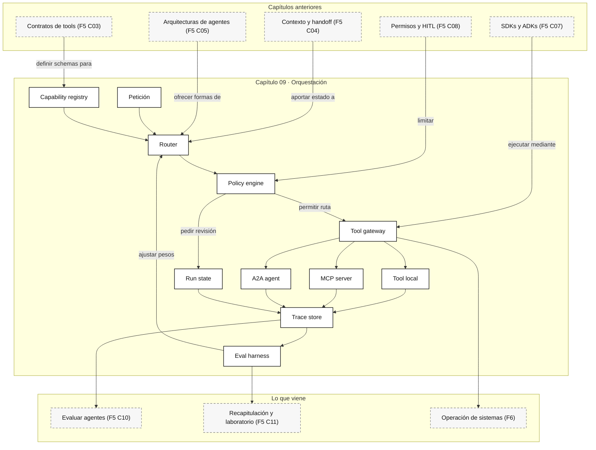

::: {.fasciculo-subtitle}
Facsímil 5 · Agentes y orquestación
:::

# Capítulo 09: Orquestación: routing, MCP, A2A y ADKs

## Cuando un agente deja de estar solo

Hasta ahora hemos construido piezas: qué es un agente, cómo usa tools, cómo conserva contexto, qué arquitecturas existen, qué SDKs hay y cómo se revisan acciones con impacto. Pero un sistema real rara vez vive con un solo agente y una sola herramienta.

En el [capítulo 03](/libro/fasciculo-05/#capitulo-03) definimos tools con contrato. En el [capítulo 04](/libro/fasciculo-05/#capitulo-04) vimos contexto, memoria y handoff. En el [capítulo 05](/libro/fasciculo-05/#capitulo-05) separamos arquitecturas de agentes. En el [capítulo 07](/libro/fasciculo-05/#capitulo-07) entramos en SDKs y ADKs. Y en el [capítulo 08](/libro/fasciculo-05/#capitulo-08) pusimos permisos alrededor de todo eso.

En cuanto aparece una aplicación seria, llegan preguntas nuevas: ¿uso una tool local o un servidor MCP?, ¿delego a otro agente?, ¿hago routing por coste, por latencia, por especialidad o por permisos?, ¿qué pasa si el primer proveedor falla?, ¿cómo sé qué agente sabe hacer qué?, ¿cómo evito que la lista de herramientas llene el contexto?, ¿dónde guardo la traza para comparar rutas?

Este capítulo va de esa capa: **orquestar**. Orquestar no es poner más agentes. Es decidir, con criterio verificable, qué pieza ejecuta cada parte del trabajo.

## Qué no es orquestar

Orquestar no es encadenar diez llamadas al modelo y esperar que el resultado parezca inteligente. Eso suele producir latencia, coste y poca trazabilidad.

Tampoco es esconder todas las decisiones dentro de un prompt del tipo “elige la mejor herramienta”. A veces el modelo debe elegir. Otras veces la decisión debe ser una regla de negocio, un routing por permisos, un gate de coste, un clasificador pequeño o una tabla de capacidades mantenida por ingeniería.

Y no es confundir protocolos. MCP no convierte una herramienta en un agente completo. A2A no sustituye un contrato de tool. Un ADK no elimina la necesidad de decidir qué estado guardas, qué permiso aplicas y qué métrica vas a mirar después.

## La definición útil

Para este libro, orquestación agentic es:

> La capa que convierte una intención en un plan de ejecución trazable: selecciona ruta, herramienta, agente, protocolo, modelo, permisos y estrategia de reintento antes de ejecutar.

**Ejemplo de fórmula.** Podemos escribirlo así:

$$
o(q, s, C, P, B) \rightarrow \langle ruta, contrato, permisos, traza \rangle
$$

| Símbolo | Significado | Ejemplo |
|---|---|---|
| \(o\) | Función de orquestación. | El componente que decide si usar una tool local, MCP, A2A o una cola humana. |
| \(q\) | Petición actual. | “Revisa esta cita y actualiza la bibliografía”. |
| \(s\) | Estado de la ejecución. | Usuario, sesión, historial, pasos previos, errores, coste acumulado. |
| \(C\) | Catálogo de capacidades. | Qué sabe hacer cada tool, agente o servicio. |
| \(P\) | Política de permisos. | Qué rutas puede usar este usuario en este entorno. |
| \(B\) | Presupuesto. | Latencia máxima, coste máximo, tokens, número de tools, retries. |
| \(\langle ruta, contrato, permisos, traza \rangle\) | Salida de orquestación. | “usar `mcp_biblioteca.search_paper`, con aprobación si escribe, registrar `trace_id`”. |

La definición parece formal, pero la idea es sencilla: antes de ejecutar, el sistema debe saber **por qué esa ruta y no otra**.

## Fecha de corte del estado del arte

**Fecha de corte:** 10 de junio de 2026.  
**Fuentes consultadas ese día:** especificación pública de MCP, documentación de OpenAI Agents SDK sobre MCP y handoffs, documentación de Anthropic sobre MCP connector, documentación de Google ADK sobre MCP tools, A2A, routing de agentes, routing de modelos y workflow agents, especificación A2A, y referencias clásicas de sistemas multiagente.

Lo estable es el patrón: separar capacidades, contratos, permisos, routing, ejecución y trazas. Lo cambiante son nombres de clases, transportes soportados, versiones beta, conectores hospedados, compatibilidad por proveedor y gobernanza de protocolos.

## De dónde viene esta idea

Los agentes no nacieron con los LLMs. Wooldridge y Jennings ya definían agentes por propiedades como autonomía, reactividad, proactividad y habilidad social: un agente no solo calcula; actúa en un entorno y se coordina con otros.^[Wooldridge, M., & Jennings, N. R. (1995). Intelligent agents: Theory and practice. *The Knowledge Engineering Review, 10*(2), 115-152. https://doi.org/10.1017/S0269888900008122. Consultado el 10 de junio de 2026.]

Jennings, Sycara y Wooldridge describieron el campo multiagente como una forma de repartir control, conocimiento y capacidad de acción entre entidades que cooperan para resolver tareas.^[Jennings, N. R., Sycara, K., & Wooldridge, M. (1998). A roadmap of agent research and development. *Autonomous Agents and Multi-Agent Systems, 1*(1), 7-38. https://doi.org/10.1023/A:1010090405266. Consultado el 10 de junio de 2026.] Y mucho antes de hablar de LLMs, Smith propuso Contract Net Protocol: un mecanismo donde un coordinador anuncia tareas, otros componentes proponen cómo resolverlas y se asigna el trabajo según criterios.^[Smith, R. G. (1980). The Contract Net Protocol: High-Level Communication and Control in a Distributed Problem Solver. *IEEE Transactions on Computers, C-29*(12), 1104-1113. https://doi.org/10.1109/TC.1980.1675516. Consultado el 10 de junio de 2026.]

No copiamos esos protocolos clásicos sin más. Pero nos sirven para una idea importante: **la delegación necesita contrato**. Si alguien va a recibir una tarea, debe declarar qué sabe hacer, qué necesita, qué devuelve, cuánto tarda, cuánto cuesta y cómo falla.

## Las tripas de la orquestación

Una arquitectura de orquestación publicable suele tener estas piezas:

| Pieza | Qué decide | Qué debería registrar |
|---|---|---|
| Router | Qué ruta intenta primero. | Señales usadas, alternativas descartadas y motivo. |
| Capability registry | Qué capacidades existen. | Versión, dueño, coste, latencia, permisos, contrato. |
| Tool gateway | Cómo se ejecutan tools. | Input validado, output, errores, duración, efecto. |
| MCP client | Cómo se conectan servidores MCP. | Servidor, tools listadas, auth, tool llamada, resultado. |
| A2A client | Cómo se invocan agentes externos. | AgentCard, Task, mensajes, artefactos, estado. |
| Policy engine | Qué se permite o revisa. | Decisión, scope, persona revisora si aplica. |
| Run state | Qué está pasando ahora. | Paso, ruta activa, retries, presupuesto restante. |
| Trace store | Qué ocurrió realmente. | Eventos, spans, costes, latencias, decisiones. |
| Eval harness | Qué ruta fue mejor. | Tasa de acierto, coste, latencia, reintentos, calidad. |

El router no debería ser un oráculo. Puede ser una función pequeña, una regla, un clasificador, un modelo barato, un grafo o una mezcla. Lo importante es que sus decisiones se puedan revisar.

## Fórmula práctica para elegir ruta

**Ejemplo de fórmula.** Una forma útil de pensar el routing es puntuar candidatos. No para convertirlo todo en una matemática falsa, sino para obligarnos a nombrar señales.

$$
R_i = \alpha S_i + \beta Q_i + \gamma A_i - \delta L_i - \epsilon C_i - \zeta K_i
$$

| Símbolo | Significado | Ejemplo |
|---|---|---|
| \(R_i\) | Puntuación de la ruta \(i\). | Ruta `mcp_biblioteca` obtiene 0,74. |
| \(S_i\) | Encaje semántico con la petición. | La ruta sabe buscar referencias: 0,90. |
| \(Q_i\) | Calidad esperada o histórica. | En evaluaciones acertó 84%: 0,84. |
| \(A_i\) | Disponibilidad actual. | Servicio sano: 1,00. |
| \(L_i\) | Latencia normalizada. | 1,8 s sobre máximo 5 s: 0,36. |
| \(C_i\) | Coste normalizado. | 0,03 euros sobre máximo 0,10: 0,30. |
| \(K_i\) | Riesgo operativo normalizado. | Escritura externa sin revisión: 0,70. |
| \(\alpha,\beta,\gamma,\delta,\epsilon,\zeta\) | Pesos de decisión. | Dar más peso a calidad que a coste en tareas críticas. |

Ejemplo numérico:

| Señal | Ruta local | Ruta MCP | Ruta A2A |
|---|---:|---:|---:|
| \(S_i\) | 0,40 | 0,92 | 0,80 |
| \(Q_i\) | 0,70 | 0,86 | 0,88 |
| \(A_i\) | 1,00 | 0,95 | 0,90 |
| \(L_i\) | 0,10 | 0,35 | 0,55 |
| \(C_i\) | 0,05 | 0,25 | 0,40 |
| \(K_i\) | 0,10 | 0,35 | 0,45 |

Con pesos \(\alpha=0{,}30\), \(\beta=0{,}25\), \(\gamma=0{,}15\), \(\delta=0{,}10\), \(\epsilon=0{,}10\), \(\zeta=0{,}10\):

| Ruta | Cálculo | Resultado |
|---|---|---:|
| Local | \(0{,}30·0{,}40 + 0{,}25·0{,}70 + 0{,}15·1 - 0{,}10·0{,}10 - 0{,}10·0{,}05 - 0{,}10·0{,}10\) | 0,42 |
| MCP | \(0{,}30·0{,}92 + 0{,}25·0{,}86 + 0{,}15·0{,}95 - 0{,}10·0{,}35 - 0{,}10·0{,}25 - 0{,}10·0{,}35\) | 0,54 |
| A2A | \(0{,}30·0{,}80 + 0{,}25·0{,}88 + 0{,}15·0{,}90 - 0{,}10·0{,}55 - 0{,}10·0{,}40 - 0{,}10·0{,}45\) | 0,46 |

La ruta MCP gana. Pero la decisión final todavía debe pasar por permisos. Si esa ruta escribe, publica o consulta datos sensibles, el score no basta.

## Routing: reglas, modelo o grafo

Hay tres familias de routing que conviene distinguir.

La primera es routing determinista. Si la petición contiene un pago, va al flujo de pagos. Si pide una cita bibliográfica, va al agente de referencias. Si modifica producción, pide revisión. Es simple, barato y fácil de auditar.

La segunda es routing por clasificación. Un clasificador ligero, que puede ser un modelo pequeño o una función entrenada, decide si la tarea es simple, compleja, técnica, legal, de datos, de escritura o de soporte. Google ADK documenta `RoutedAgent` para elegir un agente por invocación, con fallback si el agente seleccionado falla antes de emitir eventos.^[Google. (2026). *Agent Development Kit: Route Between Agents*. https://adk.dev/agents/routing/. Consultado el 10 de junio de 2026.] También documenta `RoutedLlm` para elegir entre modelos cuando solo cambia el modelo y no cambian instrucciones, tools o subagentes.^[Google. (2026). *Agent Development Kit: Route Between Models*. https://adk.dev/agents/models/routing/. Consultado el 10 de junio de 2026.]

La tercera es routing por workflow o grafo. Aquí no elegimos un único destino, sino un recorrido: primero recuperar contexto, luego resolver, después verificar, y finalmente decidir si publicar o pedir revisión. En ADK, los workflow agents ejecutan patrones secuenciales, paralelos o de bucle con lógica predefinida; la propia documentación indica que en ADK 2.0 los workflows de grafo y dinámicos ofrecen más control y flexibilidad que las plantillas rígidas.^[Google. (2026). *Agent Development Kit: Template Agent Workflows*. https://adk.dev/agents/workflow-agents/. Consultado el 10 de junio de 2026.]

| Tipo de routing | Buena elección cuando... | Riesgo si se usa mal |
|---|---|---|
| Regla explícita | La condición es clara y de negocio. | Crece como una lista imposible de mantener. |
| Clasificador | Hay muchas peticiones parecidas y categorías estables. | Clasifica con seguridad aparente pero sin evidencia. |
| LLM router | La intención es ambigua y necesita interpretación. | Puede ser caro, lento y difícil de explicar. |
| Grafo | Hay pasos obligatorios, gates y reintentos. | Se vuelve rígido si cada caso necesita excepción. |
| Handoff | Hay especialistas con contratos claros. | Se usa para tapar falta de diseño interno. |
| A2A | El destino es otro sistema agentic independiente. | Se añade protocolo cuando bastaba una tool. |

## MCP: tools y contexto como contrato externo

MCP, Model Context Protocol, estandariza cómo una aplicación con modelo se conecta a contexto, datos y herramientas. La especificación vigente consultada define hosts, clientes y servidores; usa JSON-RPC 2.0; y organiza capacidades como recursos, prompts y tools.^[Model Context Protocol. (2026). *Specification*. https://modelcontextprotocol.io/specification. Consultado el 10 de junio de 2026.]

La frase importante es esta: **MCP no es “un plugin universal”; es una frontera de capacidades**.

| Concepto MCP | Qué significa | Ejemplo entendible |
|---|---|---|
| Host | Aplicación que usa el modelo. | Un IDE, una app de chat, un panel interno. |
| Client | Conector dentro del host. | Pieza que habla con un servidor MCP. |
| Server | Servicio que expone capacidades. | Filesystem, base de datos, calendario, buscador. |
| Resource | Dato legible o contexto. | `file://capitulo.md`, esquema SQL, documento. |
| Prompt | Plantilla reutilizable. | “Resume esta incidencia con formato técnico”. |
| Tool | Función ejecutable. | `search_docs`, `read_file`, `create_ticket`. |
| Capability negotiation | Declaración de lo soportado. | El cliente sabe si hay tools, resources o prompts. |
| Consentimiento | Revisión de acceso o acción. | La persona autoriza leer una carpeta o llamar una tool. |

OpenAI Agents SDK para JavaScript documenta varias formas de usar MCP: tools MCP hospedadas por la Responses API, servidores Streamable HTTP y servidores por `stdio`; también menciona aspectos de ciclo de vida, cache de listado de tools, nombres prefijados por servidor y filtrado de tools.^[OpenAI. (2026). *Agents SDK: Model Context Protocol*. https://openai.github.io/openai-agents-js/guides/mcp/. Consultado el 10 de junio de 2026.]

Anthropic expone MCP desde la Messages API mediante `mcp_servers` y `mcp_toolset`; en la versión consultada requiere beta header `mcp-client-2025-11-20`, soporta tool calls, permite configuración por tool, allowlist, denylist, `defer_loading` y OAuth para servidores remotos.^[Anthropic. (2026). *MCP Connector*. https://platform.claude.com/docs/en/agents-and-tools/mcp-connector. Consultado el 10 de junio de 2026.]

Google ADK documenta `McpToolset` como mecanismo para integrar tools de servidores MCP: conecta, lista tools mediante `list_tools`, adapta schemas a tools del ADK, expone esas tools al `LlmAgent` y proxifica llamadas mediante `call_tool`; además permite filtrar tools.^[Google. (2026). *Agent Development Kit: MCP Tools*. https://adk.dev/tools-custom/mcp-tools/. Consultado el 10 de junio de 2026.]

El punto de ingeniería: si expones 80 tools MCP a un agente, no has “mejorado” el sistema. Has ampliado el espacio de decisión. Necesitas filtrado, nombres claros, permisos, cache de tool list, límites de coste y evaluación.

## A2A: cuando el destino también decide

A2A, Agent2Agent Protocol, no va de que un modelo llame una función. Va de que un sistema agentic hable con otro sistema agentic. Google ADK lo presenta como una forma de construir sistemas multiagente donde agentes distintos colaboran mediante A2A, exponiendo y consumiendo agentes remotos.^[Google. (2026). *ADK with Agent2Agent Protocol*. https://adk.dev/a2a/. Consultado el 10 de junio de 2026.]

La especificación A2A consultada organiza el protocolo alrededor de operaciones como enviar mensajes, enviar mensajes en streaming, obtener tareas, listar tareas, cancelar tareas, suscribirse a una tarea, gestionar notificaciones y obtener una AgentCard extendida.^[Agent2Agent Protocol. (2026). *Specification*. https://google-a2a.github.io/A2A/specification/. Consultado el 10 de junio de 2026.]

Los objetos clave son:

| Objeto A2A | Qué aporta | Por qué importa |
|---|---|---|
| `AgentCard` | Identidad, capacidades, skills, interfaces, seguridad y versión. | Permite descubrir qué puede hacer un agente antes de llamarlo. |
| `AgentSkill` | Capacidad concreta declarada por el agente. | Evita delegar tareas fuera de especialidad. |
| `Task` | Unidad durable de trabajo. | Permite seguimiento, estados, streaming y recuperación. |
| `Message` | Interacción entre cliente y agente. | Conserva turnos de comunicación. |
| `Part` | Fragmento multimodal o estructurado. | Permite texto, archivos, formularios u otros modos. |
| `Artifact` | Resultado producido. | Separa conversación de entregables. |
| `AgentCapabilities` | Streaming, notificaciones, extensiones. | Permite validar si una operación está soportada. |
| `SecurityScheme` | Requisitos de autenticación. | No todos los agentes son públicos ni equivalentes. |

La diferencia con MCP:

| Pregunta | MCP | A2A |
|---|---|---|
| ¿Qué conecta? | Un agente o host con herramientas y datos. | Un agente con otro agente o sistema agentic. |
| ¿Unidad principal? | Tool, resource, prompt. | AgentCard, task, message, artifact. |
| ¿Quién decide el trabajo interno? | El host o agente que llama la tool. | El agente remoto puede tener su propio bucle y estado. |
| ¿Cuándo usarlo? | Para exponer capacidades concretas. | Para delegar a un sistema con autonomía propia. |
| ¿Error típico? | Exponer demasiadas tools sin permisos. | Usarlo cuando bastaba una API o tool simple. |

Si llamas a `search_contracts(query)`, probablemente es MCP o tool normal. Si preguntas a un agente de compras “gestiona este proceso con tus pasos, estado y outputs”, eso se parece más a A2A.

## Handoffs, routing y A2A no son lo mismo

En OpenAI Agents SDK, un handoff permite que un agente delegue una tarea a otro agente especializado; se representa como una tool para el LLM, por ejemplo `transfer_to_refund_agent` si existe un agente de devoluciones.^[OpenAI. (2026). *Agents SDK: Handoffs*. https://openai.github.io/openai-agents-python/handoffs/. Consultado el 10 de junio de 2026.]

Eso no significa que todo handoff sea A2A. Un handoff dentro de un SDK puede ser interno: mismo proceso, mismo runtime, mismas trazas. A2A aparece cuando el destino es un sistema agentic independiente, con su propia AgentCard, su propio endpoint, sus propias capacidades y su propio ciclo de vida de tareas.

| Patrón | Quién controla | Unidad de trabajo | Caso típico |
|---|---|---|---|
| Tool local | Tu aplicación. | Función. | Validar JSON, consultar tabla, calcular score. |
| MCP server | Tu host y el servidor MCP. | Tool/resource/prompt. | Reutilizar herramientas entre clientes. |
| Handoff interno | SDK o framework. | Transferencia a especialista. | Agente de soporte deriva a agente técnico. |
| A2A | Dos sistemas agentic. | Task/mensaje/artefacto. | Tu agente consulta al agente de otra unidad. |
| Workflow graph | Motor de grafo. | Nodo/estado/transición. | Recuperar, resolver, verificar, publicar. |

## Árbol de decisión para elegir arquitectura

Cuando alguien pregunta “¿uso MCP, A2A, un handoff o una tool?”, yo intentaría que no respondiese desde la moda del momento. Respondería desde el efecto, el propietario, el estado y el contrato.

<svg id="f5-c09-routing-decision-tree" xmlns="http://www.w3.org/2000/svg" viewBox="0 0 1800 1320" role="img" aria-label="Árbol de decisión para elegir entre tool local, MCP, handoff, A2A, workflow graph y revisión humana">
  <defs>
    <style>
      #f5-c09-routing-decision-tree .frame { fill:#FFFFFF; stroke:#111111; stroke-width:2; }
      #f5-c09-routing-decision-tree .node { fill:#FFFFFF; stroke:#111111; stroke-width:1.4; }
      #f5-c09-routing-decision-tree .soft { fill:#F7F7F7; stroke:#111111; stroke-width:1.2; }
      #f5-c09-routing-decision-tree .dark { fill:#111111; stroke:#111111; stroke-width:1.2; }
      #f5-c09-routing-decision-tree .line { stroke:#111111; stroke-width:1.4; fill:none; marker-end:url(#f5c09dt-arrow); }
      #f5-c09-routing-decision-tree .dash { stroke:#777777; stroke-width:1.2; stroke-dasharray:6 6; fill:none; marker-end:url(#f5c09dt-arrow-soft); }
      #f5-c09-routing-decision-tree .title { font:700 30px Arial, sans-serif; fill:#111111; }
      #f5-c09-routing-decision-tree .h { font:700 16px Arial, sans-serif; fill:#111111; }
      #f5-c09-routing-decision-tree .body { font:13px Arial, sans-serif; fill:#333333; }
      #f5-c09-routing-decision-tree .tiny { font:11px Arial, sans-serif; fill:#666666; }
      #f5-c09-routing-decision-tree .white { font:700 14px Arial, sans-serif; fill:#FFFFFF; }
      #f5-c09-routing-decision-tree text { font-family:Arial, sans-serif; }
    </style>
    <marker id="f5c09dt-arrow" markerWidth="10" markerHeight="10" refX="8" refY="3" orient="auto" markerUnits="strokeWidth">
      <path d="M0,0 L0,6 L9,3 z" fill="#111111"/>
    </marker>
    <marker id="f5c09dt-arrow-soft" markerWidth="10" markerHeight="10" refX="8" refY="3" orient="auto" markerUnits="strokeWidth">
      <path d="M0,0 L0,6 L9,3 z" fill="#777777"/>
    </marker>
  </defs>

  <rect x="24" y="24" width="1752" height="1272" rx="20" class="frame"/>
  <text x="900" y="72" text-anchor="middle" class="title">Árbol de decisión: elegir ruta sin casarte con una sigla</text>
  <text x="900" y="102" text-anchor="middle" class="tiny">La pregunta no es “qué protocolo mola más”, sino quién controla el estado, qué efecto tendrá la acción y qué contrato necesitas.</text>

  <rect x="720" y="142" width="360" height="92" rx="14" class="dark"/>
  <text x="900" y="176" text-anchor="middle" class="white">Nueva petición</text>
  <text x="900" y="204" text-anchor="middle" font-size="12" fill="#FFFFFF">intención + estado + permisos + presupuesto</text>

  <rect x="690" y="292" width="420" height="104" rx="14" class="node"/>
  <text x="900" y="326" text-anchor="middle" class="h">¿Tiene efecto persistente o externo?</text>
  <text x="900" y="356" text-anchor="middle" class="body">publicar, enviar, escribir, cobrar, cambiar estado</text>
  <text x="900" y="378" text-anchor="middle" class="tiny">si dudas, trátalo como efecto persistente</text>

  <path d="M900 234 L900 292" class="line"/>

  <rect x="110" y="464" width="330" height="112" rx="14" class="soft"/>
  <text x="275" y="498" text-anchor="middle" class="h">Sí</text>
  <text x="275" y="528" text-anchor="middle" class="body">pasar por policy engine</text>
  <text x="275" y="552" text-anchor="middle" class="tiny">scope, entorno, revisión, idempotencia</text>

  <rect x="530" y="464" width="330" height="112" rx="14" class="soft"/>
  <text x="695" y="498" text-anchor="middle" class="h">No</text>
  <text x="695" y="528" text-anchor="middle" class="body">optimizar por claridad y coste</text>
  <text x="695" y="552" text-anchor="middle" class="tiny">leer, clasificar, calcular, proponer</text>

  <rect x="950" y="464" width="330" height="112" rx="14" class="soft"/>
  <text x="1115" y="498" text-anchor="middle" class="h">¿Hay pasos obligatorios?</text>
  <text x="1115" y="528" text-anchor="middle" class="body">recuperar, verificar, aprobar, ejecutar</text>
  <text x="1115" y="552" text-anchor="middle" class="tiny">orden conocido o gates fuertes</text>

  <rect x="1360" y="464" width="330" height="112" rx="14" class="soft"/>
  <text x="1525" y="498" text-anchor="middle" class="h">¿Otro sistema decide?</text>
  <text x="1525" y="528" text-anchor="middle" class="body">tiene estado, skills y ciclo propio</text>
  <text x="1525" y="552" text-anchor="middle" class="tiny">no es solo una función remota</text>

  <path d="M780 396 C620 430 410 438 275 464" class="line"/>
  <path d="M900 396 C840 430 760 442 695 464" class="line"/>
  <path d="M1018 396 C1060 430 1090 442 1115 464" class="line"/>
  <path d="M1108 350 C1320 388 1450 416 1525 464" class="line"/>

  <rect x="88" y="674" width="360" height="126" rx="14" class="node"/>
  <text x="268" y="710" text-anchor="middle" class="h">ApprovalCard + tool gateway</text>
  <text x="268" y="742" text-anchor="middle" class="body">si hay escritura, envío o publicación</text>
  <text x="268" y="766" text-anchor="middle" class="tiny">guardar input original, input efectivo y trace id</text>

  <rect x="520" y="674" width="360" height="126" rx="14" class="node"/>
  <text x="700" y="710" text-anchor="middle" class="h">Tool local</text>
  <text x="700" y="742" text-anchor="middle" class="body">si es capacidad interna y estable</text>
  <text x="700" y="766" text-anchor="middle" class="tiny">validar schema, permisos y salida tipada</text>

  <rect x="952" y="674" width="360" height="126" rx="14" class="node"/>
  <text x="1132" y="710" text-anchor="middle" class="h">Workflow graph</text>
  <text x="1132" y="742" text-anchor="middle" class="body">si el orden importa más que la libertad</text>
  <text x="1132" y="766" text-anchor="middle" class="tiny">estado, nodos, reintentos y gates</text>

  <rect x="1360" y="674" width="360" height="126" rx="14" class="node"/>
  <text x="1540" y="710" text-anchor="middle" class="h">A2A</text>
  <text x="1540" y="742" text-anchor="middle" class="body">si delegas a un agente independiente</text>
  <text x="1540" y="766" text-anchor="middle" class="tiny">AgentCard, Task, Message, Artifact</text>

  <path d="M275 576 L268 674" class="line"/>
  <path d="M695 576 L700 674" class="line"/>
  <path d="M1115 576 L1132 674" class="line"/>
  <path d="M1525 576 L1540 674" class="line"/>

  <rect x="302" y="890" width="360" height="126" rx="14" class="node"/>
  <text x="482" y="926" text-anchor="middle" class="h">MCP</text>
  <text x="482" y="958" text-anchor="middle" class="body">si quieres reutilizar tools o recursos</text>
  <text x="482" y="982" text-anchor="middle" class="tiny">tool filtering, auth, cache, nombres únicos</text>

  <rect x="736" y="890" width="360" height="126" rx="14" class="node"/>
  <text x="916" y="926" text-anchor="middle" class="h">Handoff interno</text>
  <text x="916" y="958" text-anchor="middle" class="body">si otro especialista vive en tu runtime</text>
  <text x="916" y="982" text-anchor="middle" class="tiny">mismo proceso, mismas trazas, mismo dominio</text>

  <rect x="1170" y="890" width="360" height="126" rx="14" class="node"/>
  <text x="1350" y="926" text-anchor="middle" class="h">Router híbrido</text>
  <text x="1350" y="958" text-anchor="middle" class="body">si conviven reglas, coste y modelos</text>
  <text x="1350" y="982" text-anchor="middle" class="tiny">guardar alternativas y motivos de descarte</text>

  <path d="M700 800 C650 842 560 852 482 890" class="dash"/>
  <path d="M1132 800 C1060 844 980 858 916 890" class="dash"/>
  <path d="M1540 800 C1494 850 1400 868 1350 890" class="dash"/>
  <path d="M268 800 C300 856 390 870 482 890" class="dash"/>

  <rect x="260" y="1112" width="1280" height="88" rx="14" class="dark"/>
  <text x="900" y="1146" text-anchor="middle" class="white">Regla final</text>
  <text x="900" y="1174" text-anchor="middle" font-size="13" fill="#FFFFFF">Si no puedes explicar ruta, contrato, propietario, permiso, coste, estado y traza, todavía no tienes orquestación.</text>

  <path d="M482 1016 C520 1070 610 1090 760 1112" class="line"/>
  <path d="M916 1016 L916 1112" class="line"/>
  <path d="M1350 1016 C1290 1072 1190 1090 1040 1112" class="line"/>

  <rect x="1222" y="1232" width="426" height="34" rx="17" fill="#111111"/>
  <text opacity="0.55" x="1435" y="1254" text-anchor="end" font-size="11" font-weight="700" fill="#888888">IA para gente curiosa / Facsímil 05 / Capítulo 09 / 686f6c61</text>
</svg>

El árbol obliga a distinguir cuatro preguntas: efecto, control, estado y reutilización. Si una capacidad es interna, estable y de bajo impacto, empieza por tool local. Si quieres reutilizar tools entre clientes, MCP. Si delegas a un especialista dentro del mismo runtime, handoff. Si el destino es un sistema agentic independiente, A2A. Si hay pasos obligatorios, grafo. Si hay efecto persistente, aprobación o policy antes de ejecutar.

## Anatomía visual de una orquestación publicable

<svg id="f5-c09-orchestration-architecture" xmlns="http://www.w3.org/2000/svg" viewBox="0 0 1800 1240" role="img" aria-label="Arquitectura técnica de orquestación con routing, MCP, A2A, ADKs, permisos y trazas">
  <defs>
    <style>
      #f5-c09-orchestration-architecture .frame { fill:#FFFFFF; stroke:#111111; stroke-width:2; }
      #f5-c09-orchestration-architecture .panel { fill:#FFFFFF; stroke:#111111; stroke-width:1.5; }
      #f5-c09-orchestration-architecture .soft { fill:#F7F7F7; stroke:#111111; stroke-width:1.1; }
      #f5-c09-orchestration-architecture .dark { fill:#111111; stroke:#111111; stroke-width:1.1; }
      #f5-c09-orchestration-architecture .line { stroke:#111111; stroke-width:1.5; fill:none; marker-end:url(#f5c09-arrow); }
      #f5-c09-orchestration-architecture .thin { stroke:#777777; stroke-width:1.1; fill:none; marker-end:url(#f5c09-arrow-soft); }
      #f5-c09-orchestration-architecture .dash { stroke:#777777; stroke-width:1.1; stroke-dasharray:6 6; fill:none; marker-end:url(#f5c09-arrow-soft); }
      #f5-c09-orchestration-architecture .title { font:700 30px Arial, sans-serif; fill:#111111; }
      #f5-c09-orchestration-architecture .h { font:700 17px Arial, sans-serif; fill:#111111; }
      #f5-c09-orchestration-architecture .body { font:13px Arial, sans-serif; fill:#333333; }
      #f5-c09-orchestration-architecture .tiny { font:11px Arial, sans-serif; fill:#666666; }
      #f5-c09-orchestration-architecture .white { font:700 14px Arial, sans-serif; fill:#FFFFFF; }
      #f5-c09-orchestration-architecture text { font-family:Arial, sans-serif; }
    </style>
    <marker id="f5c09-arrow" markerWidth="10" markerHeight="10" refX="8" refY="3" orient="auto" markerUnits="strokeWidth">
      <path d="M0,0 L0,6 L9,3 z" fill="#111111"/>
    </marker>
    <marker id="f5c09-arrow-soft" markerWidth="10" markerHeight="10" refX="8" refY="3" orient="auto" markerUnits="strokeWidth">
      <path d="M0,0 L0,6 L9,3 z" fill="#777777"/>
    </marker>
  </defs>

  <rect x="24" y="24" width="1752" height="1192" rx="20" class="frame"/>
  <text x="900" y="72" text-anchor="middle" class="title">Orquestación agentic: routing, MCP, A2A y ADKs</text>
  <text x="900" y="102" text-anchor="middle" class="tiny">La ruta no la decide una palabra bonita: la decide un contrato con capacidades, permisos, costes, latencias y trazas.</text>

  <rect x="78" y="150" width="300" height="170" rx="14" class="soft"/>
  <text x="228" y="184" text-anchor="middle" class="h">Petición</text>
  <text x="100" y="218" class="body">intención del usuario</text>
  <text x="100" y="244" class="body">contexto activo</text>
  <text x="100" y="270" class="body">estado de sesión</text>
  <text x="100" y="296" class="tiny">q, s, presupuesto inicial</text>

  <rect x="448" y="132" width="406" height="212" rx="14" class="panel"/>
  <text x="651" y="166" text-anchor="middle" class="h">Router</text>
  <text x="476" y="202" class="body">reglas explícitas</text>
  <text x="476" y="228" class="body">clasificador de intención</text>
  <text x="476" y="254" class="body">score coste / latencia / calidad</text>
  <text x="476" y="280" class="body">fallback antes de emitir eventos</text>
  <rect x="650" y="214" width="172" height="70" rx="10" class="soft"/>
  <text x="736" y="242" text-anchor="middle" class="body">RouteDecision</text>
  <text x="736" y="264" text-anchor="middle" class="tiny">ruta + motivo + alternativas</text>

  <rect x="934" y="132" width="350" height="212" rx="14" class="panel"/>
  <text x="1109" y="166" text-anchor="middle" class="h">Capability registry</text>
  <text x="960" y="202" class="body">skills declaradas</text>
  <text x="960" y="228" class="body">contratos de entrada/salida</text>
  <text x="960" y="254" class="body">latencia p50 / p95</text>
  <text x="960" y="280" class="body">coste, versión, owner</text>
  <text x="960" y="306" class="tiny">no se delega a ciegas</text>

  <rect x="1354" y="150" width="300" height="170" rx="14" class="soft"/>
  <text x="1504" y="184" text-anchor="middle" class="h">Policy engine</text>
  <text x="1378" y="218" class="body">scope del usuario</text>
  <text x="1378" y="244" class="body">entorno y efecto</text>
  <text x="1378" y="270" class="body">approval si hace falta</text>
  <text x="1378" y="296" class="tiny">allow / review / deny</text>

  <path d="M378 235 L448 235" class="line"/>
  <path d="M854 214 L934 214" class="thin"/>
  <path d="M1284 235 L1354 235" class="thin"/>
  <path d="M1354 282 C1220 378 902 382 760 344" class="dash"/>

  <rect x="92" y="438" width="340" height="214" rx="14" class="panel"/>
  <rect x="118" y="464" width="288" height="40" rx="10" class="dark"/>
  <text x="262" y="490" text-anchor="middle" class="white">Ruta local</text>
  <text x="124" y="532" class="body">tools propias</text>
  <text x="124" y="558" class="body">base de datos interna</text>
  <text x="124" y="584" class="body">validadores y calculadoras</text>
  <text x="124" y="610" class="tiny">más control, menos interoperabilidad</text>

  <rect x="522" y="438" width="340" height="214" rx="14" class="panel"/>
  <rect x="548" y="464" width="288" height="40" rx="10" class="dark"/>
  <text x="692" y="490" text-anchor="middle" class="white">Ruta MCP</text>
  <text x="554" y="532" class="body">servidores con tools</text>
  <text x="554" y="558" class="body">resources y prompts</text>
  <text x="554" y="584" class="body">auth, tool filter, cache</text>
  <text x="554" y="610" class="tiny">ideal para capacidades reutilizables</text>

  <rect x="952" y="438" width="340" height="214" rx="14" class="panel"/>
  <rect x="978" y="464" width="288" height="40" rx="10" class="dark"/>
  <text x="1122" y="490" text-anchor="middle" class="white">Ruta A2A</text>
  <text x="984" y="532" class="body">AgentCard</text>
  <text x="984" y="558" class="body">Task, Message, Artifact</text>
  <text x="984" y="584" class="body">streaming, push, auth</text>
  <text x="984" y="610" class="tiny">cuando el destino también decide</text>

  <rect x="1382" y="438" width="340" height="214" rx="14" class="panel"/>
  <rect x="1408" y="464" width="288" height="40" rx="10" class="dark"/>
  <text x="1552" y="490" text-anchor="middle" class="white">Ruta humana</text>
  <text x="1414" y="532" class="body">ApprovalCard</text>
  <text x="1414" y="558" class="body">edición de input</text>
  <text x="1414" y="584" class="body">rechazo o reanudación</text>
  <text x="1414" y="610" class="tiny">si hay efecto persistente</text>

  <path d="M650 344 C540 388 310 404 262 438" class="line"/>
  <path d="M660 344 C672 392 686 410 692 438" class="line"/>
  <path d="M730 344 C850 388 1074 404 1122 438" class="line"/>
  <path d="M780 344 C1020 380 1460 396 1552 438" class="line"/>

  <rect x="132" y="760" width="1536" height="190" rx="16" class="soft"/>
  <text x="900" y="794" text-anchor="middle" class="h">Tool gateway y ejecución</text>
  <rect x="180" y="832" width="240" height="76" rx="12" class="panel"/>
  <text x="300" y="862" text-anchor="middle" class="body">schema validation</text>
  <text x="300" y="884" text-anchor="middle" class="tiny">entrada canónica</text>
  <rect x="500" y="832" width="240" height="76" rx="12" class="panel"/>
  <text x="620" y="862" text-anchor="middle" class="body">auth y scope</text>
  <text x="620" y="884" text-anchor="middle" class="tiny">mínimo privilegio</text>
  <rect x="820" y="832" width="240" height="76" rx="12" class="panel"/>
  <text x="940" y="862" text-anchor="middle" class="body">timeouts y retries</text>
  <text x="940" y="884" text-anchor="middle" class="tiny">sin bucles infinitos</text>
  <rect x="1140" y="832" width="240" height="76" rx="12" class="panel"/>
  <text x="1260" y="862" text-anchor="middle" class="body">idempotencia</text>
  <text x="1260" y="884" text-anchor="middle" class="tiny">clave de operación</text>
  <rect x="1460" y="832" width="160" height="76" rx="12" class="panel"/>
  <text x="1540" y="862" text-anchor="middle" class="body">resultado</text>
  <text x="1540" y="884" text-anchor="middle" class="tiny">output tipado</text>

  <path d="M262 652 C314 716 266 728 300 832" class="thin"/>
  <path d="M692 652 C680 716 620 742 620 832" class="thin"/>
  <path d="M1122 652 C1118 722 1000 740 940 832" class="thin"/>
  <path d="M1552 652 C1512 716 1514 740 1540 832" class="thin"/>

  <rect x="132" y="1024" width="396" height="104" rx="14" class="panel"/>
  <text x="330" y="1058" text-anchor="middle" class="h">Run state</text>
  <text x="330" y="1086" text-anchor="middle" class="body">ruta activa, presupuesto, retries</text>
  <text x="330" y="1110" text-anchor="middle" class="tiny">permite reanudar</text>

  <rect x="702" y="1024" width="396" height="104" rx="14" class="panel"/>
  <text x="900" y="1058" text-anchor="middle" class="h">Trace store</text>
  <text x="900" y="1086" text-anchor="middle" class="body">route_decision, tool_call, a2a_task</text>
  <text x="900" y="1110" text-anchor="middle" class="tiny">explica qué ocurrió</text>

  <rect x="1272" y="1024" width="396" height="104" rx="14" class="panel"/>
  <text x="1470" y="1058" text-anchor="middle" class="h">Eval harness</text>
  <text x="1470" y="1086" text-anchor="middle" class="body">calidad, coste, latencia, fallos</text>
  <text x="1470" y="1110" text-anchor="middle" class="tiny">mejora el routing</text>

  <path d="M300 908 C300 960 320 984 330 1024" class="thin"/>
  <path d="M940 908 C910 958 902 984 900 1024" class="line"/>
  <path d="M1540 908 C1500 960 1476 984 1470 1024" class="thin"/>
  <path d="M1470 1024 C1450 940 1320 740 1284 652" class="dash"/>
  <path d="M900 1024 C890 940 740 722 692 652" class="dash"/>

  <rect x="1256" y="1160" width="426" height="34" rx="17" fill="#111111"/>
  <text opacity="0.55" x="1469" y="1182" text-anchor="end" font-size="11" font-weight="700" fill="#888888">IA para gente curiosa / Facsímil 05 / Capítulo 09 / 686f6c61</text>
</svg>

El diagrama separa algo que en demos suele estar mezclado: el router decide, el registry describe, la policy permite o detiene, el gateway ejecuta y la traza demuestra. MCP y A2A son rutas posibles, no sustitutos de esa arquitectura.

## Contratos mínimos: qué viaja realmente

Si alguien solo entiende MCP y A2A como nombres, todavía no puede diseñar bien. Hay que bajar al contrato: qué identificador se envía, qué schema existe, qué estado vuelve, qué permisos intervienen y qué se guarda en la traza.

Los ejemplos siguientes son didácticos. No sustituyen la especificación ni el SDK concreto, pero muestran la forma mental que necesitas para trabajar: capacidades declaradas, argumentos tipados, resultados separados de la conversación y decisiones trazables.

### MCP: una tool expuesta por un servidor

Un servidor MCP puede exponer una tool como `search_docs`. Lo importante no es el nombre; es el contrato de entrada y salida. Una tool sin schema obliga al modelo a adivinar.

```json
{
  "server_id": "mcp.biblioteca",
  "transport": "streamable_http",
  "tool": {
    "name": "search_docs",
    "description": "Busca documentos normativos y devuelve fragmentos citables.",
    "inputSchema": {
      "type": "object",
      "additionalProperties": false,
      "required": ["query", "limit"],
      "properties": {
        "query": {
          "type": "string",
          "minLength": 4,
          "description": "Pregunta o término de búsqueda."
        },
        "limit": {
          "type": "integer",
          "minimum": 1,
          "maximum": 20,
          "description": "Número máximo de resultados."
        },
        "source_filter": {
          "type": "array",
          "items": { "type": "string" },
          "description": "Colecciones permitidas para esta búsqueda."
        }
      }
    }
  }
}
```

Una llamada a esa tool debería dejar algo así en la traza:

```json
{
  "event": "mcp.tool_call",
  "trace_id": "trace-2026-06-10-r1",
  "server_id": "mcp.biblioteca",
  "tool_name": "search_docs",
  "arguments": {
    "query": "normativa permanencia universidad",
    "limit": 5,
    "source_filter": ["normativa_publica"]
  },
  "policy": {
    "decision": "allow",
    "scope": ["read_public"],
    "tool_filter_version": "2026-06-10"
  },
  "result_shape": {
    "documents": "list",
    "citations": "list",
    "elapsed_ms": "number"
  }
}
```

El detalle útil: `tool_filter_version` también se guarda. Si mañana la tool deja de aparecer o cambia de schema, puedes saber con qué catálogo se tomó la decisión.

### A2A: AgentCard como expediente de un agente

En A2A no solo quieres saber “hay un agente”. Quieres saber qué skills declara, qué endpoint usa, si soporta streaming, qué seguridad exige y qué versión estás invocando.

```json
{
  "name": "Agente de becas",
  "description": "Gestiona revisión inicial de expedientes de becas.",
  "url": "https://becas.example.edu/a2a",
  "version": "1.3.0",
  "capabilities": {
    "streaming": true,
    "pushNotifications": true
  },
  "defaultInputModes": ["text", "application/json"],
  "defaultOutputModes": ["text", "application/json"],
  "skills": [
    {
      "id": "review_scholarship_case",
      "name": "Revisar expediente de beca",
      "description": "Comprueba requisitos, documentación y próximos pasos.",
      "tags": ["becas", "expediente", "revision"],
      "examples": [
        "Revisa el expediente B-1042 con la documentación adjunta."
      ]
    }
  ],
  "securitySchemes": {
    "oauth2": {
      "type": "oauth2",
      "flows": {
        "clientCredentials": {
          "tokenUrl": "https://auth.example.edu/token",
          "scopes": {
            "becas.review": "Permite solicitar revisión de expedientes."
          }
        }
      }
    }
  }
}
```

La `AgentCard` no es marketing. Es parte del contrato operativo. Si no declara capabilities, skills, seguridad y versión, el router está delegando con los ojos cerrados.

### A2A: Task como unidad durable de trabajo

Cuando delegas por A2A, no quieres solo un texto de vuelta. Quieres una tarea con estado y artefactos. Eso permite consultar progreso, retomar, cancelar o guardar resultados.

```json
{
  "jsonrpc": "2.0",
  "id": "req-2026-06-10-001",
  "method": "message/send",
  "params": {
    "message": {
      "role": "user",
      "parts": [
        {
          "kind": "text",
          "text": "Revisa el expediente B-1042 y devuelve un informe con requisitos cumplidos, dudas y siguiente paso."
        },
        {
          "kind": "data",
          "data": {
            "case_id": "B-1042",
            "student_scope": "scoped-token-abc",
            "requested_artifact": "decision_report"
          }
        }
      ]
    },
    "metadata": {
      "trace_id": "trace-2026-06-10-r2",
      "caller": "agente-orquestador",
      "budget": {
        "max_latency_ms": 5000,
        "max_cost_eur": 0.10
      }
    }
  }
}
```

Y un resultado razonable debería separar estado, mensaje y artefacto:

```json
{
  "task": {
    "id": "task-becas-7781",
    "status": {
      "state": "completed",
      "message": {
        "role": "agent",
        "parts": [
          {
            "kind": "text",
            "text": "Expediente revisado. Falta justificante de residencia."
          }
        ]
      }
    },
    "artifacts": [
      {
        "artifactId": "decision-report-7781",
        "name": "Informe de revisión",
        "parts": [
          {
            "kind": "data",
            "data": {
              "case_id": "B-1042",
              "requirements_ok": ["matricula_activa", "renta_declarada"],
              "missing": ["residencia"],
              "next_step": "Solicitar justificante de residencia antes de continuar."
            }
          }
        ]
      }
    ]
  }
}
```

La separación importa. El mensaje sirve para conversar. El artefacto sirve para operar. Si mezclas ambos, luego no sabes qué parte debe leer una persona y qué parte puede consumir un sistema.

## Fallos de producción que conviene ensayar

La orquestación falla de formas bastante previsibles. Lo sensato es probarlas antes de publicar.

| Fallo | Señal visible | Cómo lo diseñaría |
|---|---|---|
| Tool list desactualizada | El agente intenta llamar una tool que ya no existe. | Cache con versión, invalidación explícita y test de catálogo. |
| Colisión de nombres | Dos servidores exponen `search` y el modelo elige mal. | Prefijos por servidor y nombres semánticos: `biblioteca.search_docs`. |
| Schema drift | La tool acepta otros campos o deja de aceptar uno. | Contract tests y validación `additionalProperties: false`. |
| Permiso heredado de más | Una ruta puede acceder a datos que no necesita. | Scope por tool, usuario, entorno y operación. |
| Fallback peligroso | Al fallar una ruta, el sistema prueba otra con más impacto. | Fallback solo hacia rutas de igual o menor efecto. |
| Timeout ambiguo | No sabes si la acción se ejecutó o no. | Idempotency key y consulta de estado antes de reintentar. |
| Task parcial en A2A | La tarea queda `working` o `input-required`. | Guardar task id, estado y próximo paso; no inventar final. |
| Coste creciente | Cada ruta añade llamadas de modelo y tool. | Presupuesto por run, cortes por p95 y trazas de coste. |
| Artefacto perdido | El agente responde, pero no queda entregable usable. | Separar `message` de `artifact` y validar artifact schema. |
| Ruta no explicable | El resultado es bueno, pero nadie sabe por qué se eligió. | Registrar top candidatos, score, señales y motivo final. |

Una prueba sencilla: fuerza cada fallo en entorno de desarrollo. Quita una tool del catálogo. Cambia un schema. Devuelve un timeout. Haz que A2A responda con tarea en progreso. Si el sistema no sabe parar, reintentar o pedir revisión con claridad, todavía no está listo.

## Caso para entenderlo: una universidad con sistemas distintos

Imagina una universidad con tres necesidades:

1. Un alumno pregunta por una norma de matrícula.
2. Secretaría necesita consultar expedientes.
3. Un departamento externo tiene su propio agente para becas.

La solución torpe sería dar al agente principal todas las herramientas posibles: calendario, expedientes, normativa, becas, correo, editor, base de datos, CRM y formularios. La solución profesional separa rutas.

| Petición | Ruta probable | Motivo |
|---|---|---|
| “¿Qué dice la normativa sobre permanencia?” | MCP documental o RAG interno. | Es consulta de conocimiento cambiante. |
| “Comprueba si tengo pago pendiente” | Tool interna con permisos. | Afecta datos personales y necesita scope. |
| “Inicia revisión de beca externa” | A2A con agente de becas. | Otro sistema mantiene estado y proceso propio. |
| “Redacta respuesta al alumno” | Tool local o agente interno. | Es una propuesta textual sin efecto externo. |
| “Envía la respuesta oficial” | ApprovalCard antes de tool. | Hay efecto comunicativo y registro institucional. |

El mismo usuario puede pasar por varias rutas en una sola tarea. La orquestación no elige “el agente ganador”. Elige el recorrido verificable.

## Arquitecturas de orquestación

No existe una única arquitectura correcta. Sí existen patrones reconocibles.

| Arquitectura | Cómo funciona | Cuándo encaja |
|---|---|---|
| Router central | Un componente decide cada destino. | Productos con pocas rutas críticas y reglas claras. |
| Supervisor y especialistas | Un agente supervisor delega a agentes especializados. | Tareas ambiguas donde el modelo puede elegir especialistas. |
| Grafo de workflow | Nodos y transiciones controlan el recorrido. | Procesos con pasos obligatorios, gates y reintentos. |
| Tool gateway con MCP | Tools internas y externas se exponen por contratos. | Muchas capacidades reutilizables entre clientes. |
| A2A federado | Sistemas agentic independientes coordinan tareas. | Varias unidades, proveedores o dominios con autonomía propia. |
| Router híbrido | Reglas, clasificador, coste, permisos y fallback. | Sistemas en producción con variedad de casos. |

Mi recomendación práctica: empezar con router explícito y registry pequeño. Añadir MCP cuando la herramienta deba reutilizarse fuera de un solo agente. Añadir A2A cuando el destino tenga ciclo de vida propio. Añadir grafo cuando hay pasos que no deben quedar a improvisación del modelo.

## Decisiones de ingeniería que no se ven en la demo

Una demo puede vivir sin estas piezas. Un sistema serio, no.

| Decisión | Pregunta que debes responder |
|---|---|
| Versionado de capacidades | ¿Qué pasa si `search_docs` cambia su schema mañana? |
| Nombres únicos | ¿Qué ocurre si dos servidores MCP exponen `search`? |
| Tool filtering | ¿Expones todo el servidor o solo tres tools? |
| Cache de tool list | ¿Listas tools en cada run y pagas latencia siempre? |
| Presupuesto | ¿Quién corta una ruta que consume demasiado? |
| Idempotencia | ¿Qué pasa si se reintenta una acción con efecto persistente? |
| Fallback | ¿Cuándo intentas otra ruta y cuándo paras? |
| Estado parcial | ¿Qué haces si A2A devuelve una task en progreso? |
| Artefactos | ¿Dónde guardas archivos, diffs o resultados largos? |
| Trazas | ¿Puedes reconstruir por qué se eligió una ruta? |
| Evaluación | ¿Qué métrica demuestra que el router mejora? |

La orquestación es, sobre todo, disciplina de interfaces.

## Manos a la obra

**Práctica:** construir un router interoperable.

Kit ejecutable de este capítulo: `labs/f5/capitulo-practicas/`.

```bash
cd labs/f5/capitulo-practicas
python3 ops/run_f5_practices.py --chapter c09 --write --fail-on-invalid
```

Vamos a construir un router mínimo, ejecutable sin dependencias externas. No llama a OpenAI, Anthropic ni Google. Esa es la gracia: antes de usar un SDK, tenemos que diseñar nuestro contrato interno.

El ejemplo modela cuatro rutas: tool local, servidor MCP, agente A2A y revisión humana. Para cada petición calcula un score, aplica permisos, elige ruta y deja traza.

```python
from __future__ import annotations

from dataclasses import dataclass, asdict
from typing import Literal
import json
import time


RouteKind = Literal["local_tool", "mcp_tool", "a2a_agent", "human_review"]
Effect = Literal["read", "draft", "write", "send", "publish"]


@dataclass(frozen=True)
class Request:
    request_id: str
    text: str
    required_tags: set[str]
    effect: Effect
    environment: str
    max_latency_ms: int
    max_cost_eur: float
    user_scope: set[str]


@dataclass(frozen=True)
class Capability:
    route_id: str
    kind: RouteKind
    tags: set[str]
    owner: str
    input_contract: str
    output_contract: str
    p95_latency_ms: int
    cost_eur: float
    quality: float
    availability: float
    required_scope: set[str]
    effect: Effect
    version: str


@dataclass(frozen=True)
class RouteDecision:
    request_id: str
    decision: Literal["run", "review", "stop"]
    selected_route: str | None
    selected_kind: RouteKind | None
    score: float | None
    reason: str
    alternatives: list[dict]
    trace_id: str


def normalize(value: float, maximum: float) -> float:
    if maximum <= 0:
        return 1.0
    return min(value / maximum, 1.0)


def overlap_score(required: set[str], offered: set[str]) -> float:
    if not required:
        return 0.5
    return len(required & offered) / len(required)


def effect_risk(effect: Effect) -> float:
    return {
        "read": 0.05,
        "draft": 0.15,
        "write": 0.45,
        "send": 0.65,
        "publish": 0.80,
    }[effect]


def effect_rank(effect: Effect) -> int:
    return {
        "read": 1,
        "draft": 2,
        "write": 3,
        "send": 4,
        "publish": 5,
    }[effect]


def score_route(request: Request, capability: Capability) -> tuple[float, list[str]]:
    reasons: list[str] = []

    semantic = overlap_score(request.required_tags, capability.tags)
    if semantic < 0.50:
        reasons.append("poco encaje semántico")

    if effect_rank(capability.effect) < effect_rank(request.effect):
        reasons.append("efecto insuficiente")

    latency_penalty = normalize(capability.p95_latency_ms, request.max_latency_ms)
    cost_penalty = normalize(capability.cost_eur, request.max_cost_eur)
    risk_penalty = effect_risk(capability.effect)

    missing_scope = capability.required_scope - request.user_scope
    if missing_scope:
        reasons.append(f"faltan permisos: {sorted(missing_scope)}")

    score = (
        0.32 * semantic
        + 0.25 * capability.quality
        + 0.16 * capability.availability
        - 0.10 * latency_penalty
        - 0.08 * cost_penalty
        - 0.09 * risk_penalty
    )

    if capability.p95_latency_ms > request.max_latency_ms:
        reasons.append("supera latencia p95")
    if capability.cost_eur > request.max_cost_eur:
        reasons.append("supera coste permitido")

    return round(score, 3), reasons


def permission_gate(request: Request, capability: Capability, reasons: list[str]) -> Literal["run", "review", "stop"]:
    if "efecto insuficiente" in reasons:
        return "stop"
    if capability.required_scope - request.user_scope:
        return "stop"
    if "supera coste permitido" in reasons:
        return "stop"
    if request.environment == "prod" and request.effect in {"write", "send", "publish"}:
        return "review"
    if capability.kind == "a2a_agent" and request.effect in {"send", "publish"}:
        return "review"
    return "run"


def route_request(request: Request, capabilities: list[Capability]) -> RouteDecision:
    trace_id = f"trace-{int(time.time())}-{request.request_id}"
    ranked: list[dict] = []

    for capability in capabilities:
        score, reasons = score_route(request, capability)
        gate = permission_gate(request, capability, reasons)
        ranked.append(
            {
                "route_id": capability.route_id,
                "kind": capability.kind,
                "score": score,
                "gate": gate,
                "reasons": reasons or ["candidato válido"],
            }
        )

    ranked.sort(key=lambda item: item["score"], reverse=True)

    for item in ranked:
        if item["gate"] == "run":
            return RouteDecision(
                request_id=request.request_id,
                decision="run",
                selected_route=item["route_id"],
                selected_kind=item["kind"],
                score=item["score"],
                reason="mejor ruta ejecutable dentro de permisos y presupuesto",
                alternatives=ranked[:3],
                trace_id=trace_id,
            )
        if item["gate"] == "review":
            return RouteDecision(
                request_id=request.request_id,
                decision="review",
                selected_route=item["route_id"],
                selected_kind=item["kind"],
                score=item["score"],
                reason="mejor ruta, pero requiere aprobación por efecto o entorno",
                alternatives=ranked[:3],
                trace_id=trace_id,
            )

    return RouteDecision(
        request_id=request.request_id,
        decision="stop",
        selected_route=None,
        selected_kind=None,
        score=None,
        reason="ninguna ruta cumple permisos, coste y contrato",
        alternatives=ranked[:3],
        trace_id=trace_id,
    )


capabilities = [
    Capability(
        route_id="local.normativa_cache",
        kind="local_tool",
        tags={"normativa", "lectura", "universidad"},
        owner="equipo-libro",
        input_contract="query:string",
        output_contract="citas:list",
        p95_latency_ms=120,
        cost_eur=0.001,
        quality=0.62,
        availability=1.00,
        required_scope={"read_public"},
        effect="read",
        version="1.0.0",
    ),
    Capability(
        route_id="mcp.biblioteca.search_docs",
        kind="mcp_tool",
        tags={"normativa", "referencias", "biblioteca", "lectura"},
        owner="biblioteca",
        input_contract="query:string, limit:int",
        output_contract="documents:list",
        p95_latency_ms=850,
        cost_eur=0.015,
        quality=0.88,
        availability=0.96,
        required_scope={"read_public"},
        effect="read",
        version="2026-06-10",
    ),
    Capability(
        route_id="a2a.becas.review_case",
        kind="a2a_agent",
        tags={"becas", "expediente", "revision", "workflow"},
        owner="unidad-becas",
        input_contract="task:object",
        output_contract="artifact:decision_report",
        p95_latency_ms=2500,
        cost_eur=0.060,
        quality=0.91,
        availability=0.90,
        required_scope={"read_student", "delegate_becas"},
        effect="write",
        version="1.0.0",
    ),
    Capability(
        route_id="human.editorial_approval",
        kind="human_review",
        tags={"publicar", "enviar", "revision", "aprobacion"},
        owner="editor",
        input_contract="approval_card:object",
        output_contract="approved|edited|rejected",
        p95_latency_ms=300000,
        cost_eur=0.0,
        quality=0.99,
        availability=0.70,
        required_scope={"editor"},
        effect="publish",
        version="1.0.0",
    ),
]

requests = [
    Request(
        request_id="r1",
        text="Busca la normativa de permanencia y cita la fuente.",
        required_tags={"normativa", "referencias"},
        effect="read",
        environment="dev",
        max_latency_ms=3000,
        max_cost_eur=0.05,
        user_scope={"read_public"},
    ),
    Request(
        request_id="r2",
        text="Pide al sistema de becas que revise este expediente.",
        required_tags={"becas", "expediente", "workflow"},
        effect="write",
        environment="prod",
        max_latency_ms=5000,
        max_cost_eur=0.10,
        user_scope={"read_public", "read_student", "delegate_becas"},
    ),
    Request(
        request_id="r3",
        text="Publica el resultado final en el portal.",
        required_tags={"publicar", "revision"},
        effect="publish",
        environment="prod",
        max_latency_ms=600000,
        max_cost_eur=0.02,
        user_scope={"read_public"},
    ),
]

for request in requests:
    decision = route_request(request, capabilities)
    print(json.dumps(asdict(decision), ensure_ascii=False, indent=2))
```

Salida esperada, resumida:

```text
r1 -> run    -> mcp.biblioteca.search_docs
r2 -> review -> a2a.becas.review_case
r3 -> stop   -> ninguna ruta cumple permisos, coste y contrato
```

Fíjate en el tercer caso. El sistema no intenta publicar porque la ruta humana exige scope de editor y el usuario no lo tiene. Esto es lo que queremos: el router no solo elige capacidades; también respeta permisos.

## Cómo encaja todo



## Vocabulario aprendido

| Término | Definición útil |
|---|---|
| Orquestación | Capa que decide ruta, agente, tool, permisos y estrategia de ejecución. |
| Router | Componente que selecciona una ruta usando señales observables. |
| Capability registry | Catálogo de capacidades con contrato, coste, latencia, versión y owner. |
| MCP | Protocolo para conectar hosts con herramientas, recursos y prompts. |
| MCP server | Servicio que expone capacidades mediante MCP. |
| Resource | Dato o contexto que un servidor MCP puede ofrecer. |
| Tool filtering | Exponer solo un subconjunto de tools a un agente. |
| Tool list | Lista de tools disponibles para un cliente o agente en un momento concreto. |
| Schema drift | Cambio de contrato que rompe supuestos de entrada o salida. |
| A2A | Protocolo para coordinar sistemas agentic independientes. |
| AgentCard | Manifiesto que describe identidad, capacidades, skills, interfaces y seguridad. |
| Task | Unidad de trabajo durable en A2A. |
| Artifact | Resultado producido por una tarea, separado de los mensajes. |
| Handoff | Transferencia de una tarea a otro agente, normalmente dentro de un runtime. |
| Fallback | Ruta alternativa cuando la primera falla antes de producir resultado útil. |
| Idempotencia | Propiedad que permite repetir una operación sin duplicar efectos. |
| RouteDecision | Recibo estructurado con ruta elegida, motivo, score y alternativas. |

## Dónde solía tropezar yo

| Tropiezo | Por qué ocurre | Antídoto |
|---|---|---|
| Llamar orquestación a cualquier cadena | Varias llamadas parecen arquitectura. | Exigir router, contrato, estado, permisos y traza. |
| Usar MCP para todo | Es cómodo exponer tools estándar. | Usar MCP cuando haya reutilización real y controlar tool filtering. |
| Usar A2A demasiado pronto | Suena moderno delegar a otro agente. | Usarlo solo si el destino tiene autonomía, estado y capacidades propias. |
| Dejar que el modelo elija siempre | Reduce código al principio. | Separar reglas de negocio, policy, routing y decisión del modelo. |
| No registrar alternativas | Solo guardas la ruta ganadora. | Guardar top candidatos y motivos de descarte. |
| Ignorar latencia de descubrimiento | Listar tools parece gratis. | Cachear tool list, versionar capacidades y medir p95. |
| Mezclar output conversacional y artefactos | Todo termina como texto. | Separar mensaje, task, artifact, diff, archivo y traza. |
| No ensayar fallos | La demo solo prueba el camino feliz. | Simular tool ausente, schema drift, timeout y task parcial. |
| Permitir fallback hacia más impacto | Parece una forma de “resolver como sea”. | Fallback solo hacia rutas de igual o menor efecto operativo. |

## Antes de pasar página

Antes del capítulo 10, deberías poder responder:

| Pregunta | Si dudas, vuelve a... |
|---|---|
| ¿Qué diferencia hay entre orquestar y encadenar llamadas? | `Qué no es orquestar`. |
| ¿Qué entra y qué sale de una función de orquestación? | `La definición útil`. |
| ¿Por qué el routing debe registrar alternativas descartadas? | `Las tripas de la orquestación`. |
| ¿Cómo se puntúa una ruta sin fingir precisión absoluta? | `Fórmula práctica para elegir ruta`. |
| ¿Cuándo usarías regla, clasificador, LLM router o grafo? | `Routing: reglas, modelo o grafo`. |
| ¿Qué problema resuelve MCP y qué no resuelve? | `MCP: tools y contexto como contrato externo`. |
| ¿Qué cambia cuando usas A2A en lugar de una tool? | `A2A: cuando el destino también decide`. |
| ¿Por qué un handoff interno no siempre es A2A? | `Handoffs, routing y A2A no son lo mismo`. |
| ¿Qué árbol usarías para elegir entre tool local, MCP, handoff, A2A o workflow? | `Árbol de decisión para elegir arquitectura`. |
| ¿Qué aspecto mínimo tienen una tool MCP, una AgentCard y una Task A2A? | `Contratos mínimos: qué viaja realmente`. |
| ¿Qué fallos deberías ensayar antes de publicar? | `Fallos de producción que conviene ensayar`. |
| ¿Qué decisiones de ingeniería hacen publicable la orquestación? | `Decisiones de ingeniería que no se ven en la demo`. |
| ¿Cómo implementarías un router mínimo sin casarte con proveedor? | `Manos a la obra`. |

## Para saber más

- Agent2Agent Protocol. (2026). *Specification*. https://google-a2a.github.io/A2A/specification/
- Anthropic. (2026). *MCP Connector*. https://platform.claude.com/docs/en/agents-and-tools/mcp-connector
- Google. (2026). *ADK with Agent2Agent Protocol*. https://adk.dev/a2a/
- Google. (2026). *Agent Development Kit: MCP Tools*. https://adk.dev/tools-custom/mcp-tools/
- Google. (2026). *Agent Development Kit: Route Between Agents*. https://adk.dev/agents/routing/
- Google. (2026). *Agent Development Kit: Route Between Models*. https://adk.dev/agents/models/routing/
- Google. (2026). *Agent Development Kit: Template Agent Workflows*. https://adk.dev/agents/workflow-agents/
- Jennings, N. R., Sycara, K., & Wooldridge, M. (1998). *A roadmap of agent research and development*. https://doi.org/10.1023/A:1010090405266
- Model Context Protocol. (2026). *Specification*. https://modelcontextprotocol.io/specification
- OpenAI. (2026). *Agents SDK: Handoffs*. https://openai.github.io/openai-agents-python/handoffs/
- OpenAI. (2026). *Agents SDK: Model Context Protocol*. https://openai.github.io/openai-agents-js/guides/mcp/
- Smith, R. G. (1980). *The Contract Net Protocol*. https://doi.org/10.1109/TC.1980.1675516
- Wooldridge, M., & Jennings, N. R. (1995). *Intelligent agents: Theory and practice*. https://doi.org/10.1017/S0269888900008122

## En resumen

| Idea | Qué te llevas |
|---|---|
| Orquestar es decidir rutas con contrato. | No basta con encadenar agentes: hay que registrar por qué se eligió cada ruta. |
| MCP y A2A resuelven problemas distintos. | MCP conecta tools y contexto; A2A coordina sistemas agentic independientes. |
| El router necesita señales, no intuición. | Encaje, calidad, disponibilidad, latencia, coste, riesgo y permisos deben verse en la decisión. |
| Los ADKs ayudan, pero no sustituyen arquitectura. | Puedes usar OpenAI, Claude, Google ADK o LangGraph, pero tu dominio debe mantener contratos propios. |
| La evaluación del capítulo 10 empieza aquí. | Sin trazas y alternativas descartadas no podremos medir si la orquestación funciona mejor. |
