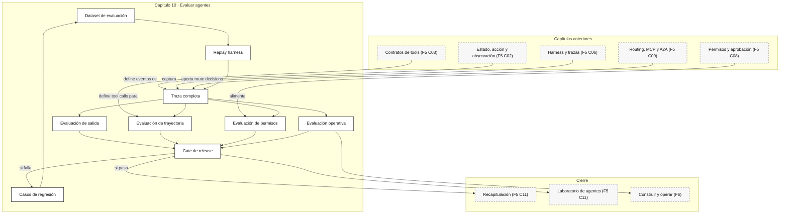

::: {.fasciculo-subtitle}
Facsímil 5 · Agentes y orquestación
:::

# Capítulo 10: Evaluar agentes: trayectoria, coste y gates

## Un agente puede acertar por el camino equivocado

En una aplicación clásica, muchas veces basta con comprobar la salida: esta función recibe `x` y devuelve `y`. En un agente, eso se queda corto. Un agente puede dar una respuesta final aceptable después de usar la tool equivocada, consultar demasiadas fuentes, saltarse una aprobación, repetir un paso, gastar demasiado o llegar a una conclusión que no puede reconstruirse.

En el [capítulo 06](/libro/fasciculo-05/#capitulo-06) pusimos harness, límites, sensores y trazas. En el [capítulo 08](/libro/fasciculo-05/#capitulo-08) diseñamos permisos y aprobación humana. En el [capítulo 09](/libro/fasciculo-05/#capitulo-09) construimos routing entre tool local, MCP, A2A y workflows. Ahora toca una pregunta incómoda y necesaria: **¿cómo sabemos que todo eso funciona mejor, y no solo que parece funcionar?**

La evaluación de agentes tiene que mirar tres cosas a la vez: el resultado final, la trayectoria y el coste operativo. Si falta una, podemos engañarnos. Para ingeniería del software, además, hay una cuarta capa: **el cambio**. Una evaluación seria no solo responde “¿funciona esta demo?”, sino “¿puedo cambiar el prompt, el modelo, el router, una tool o el dataset y saber si he mejorado o he roto algo?”.

## Qué le pediría a una clase de ingeniería del software

Si este capítulo se convirtiera en práctica universitaria, no lo plantearía como “mide si responde bien”. Lo plantearía como un sistema evaluable, versionado y desplegable.

| Competencia | Pregunta de ingeniería | Evidencia que debería producir el alumno |
|---|---|---|
| Requisitos observables | ¿Qué significa “bien” sin depender de una opinión suelta? | Rúbrica, criterios de aceptación y casos con `why_it_exists`. |
| Diseño de pruebas | ¿Qué capas se prueban por separado y cuáles integradas? | Tests de schema, tool contract, trayectoria, escenario y gate. |
| Trazabilidad | ¿Puedes reconstruir por qué el agente decidió algo? | `trace_id`, spans, eventos, argumentos, resultados y versiones. |
| Reproducibilidad | ¿Otra persona puede repetir la evaluación? | Dataset versionado, modelo fijado, prompt versionado, seed si aplica y fixtures. |
| Control de regresiones | ¿Lo que corregiste ayer queda protegido mañana? | Caso nuevo en el dataset y comparación `baseline` contra `candidate`. |
| Estadística mínima | ¿La mejora es señal o ruido? | Tamaño de muestra, intervalo, repetición de runs y tolerancia de cambio. |
| Operación | ¿Qué ocurre si esto llega a producción? | Coste por tarea aceptada, p95 de latencia, rate limits y alertas. |
| Integración continua | ¿Dónde se bloquea un cambio? | Gate de PR, gate nocturno, gate de prepublicación y canary. |

Lo importante para el alumno: un agente no se evalúa como una función pura, pero tampoco como una caja negra. Se evalúa como **software no determinista con efectos, dependencias externas y trazas**.

## Qué no es evaluar un agente

Evaluar un agente no es leer diez conversaciones bonitas. Eso sirve para intuición inicial, pero no para publicar ni comparar versiones.

Tampoco es pedirle a otro modelo “ponle nota” sin definir criterios. Un evaluador puede ayudar, pero necesita rúbrica, ejemplos, calibración y casos donde sepamos la respuesta. Si no, cambiaremos una caja negra por otra.

Y no es medir solo exactitud. Un sistema que acierta un 90% pero cuesta el triple, tarda 40 segundos, exige revisión manual constante o falla justo en tareas críticas no está listo para un producto serio.

## La definición útil

Para este libro, evaluar un agente es:

> Ejecutar tareas representativas, capturar la traza completa, puntuar resultado y trayectoria, aplicar gates de coste y permisos, y comparar versiones con criterios repetibles.

**Ejemplo de fórmula.** Podemos modelar una ejecución como:

$$
r = (x, y, \tau, c, l, g)
$$

| Símbolo | Significado | Ejemplo |
|---|---|---|
| \(r\) | Run o ejecución evaluada. | Una petición de alumno resuelta por el agente. |
| \(x\) | Entrada del caso. | “Comprueba una cita y genera referencia APA”. |
| \(y\) | Salida final. | Respuesta, informe, diff, JSON o artefacto. |
| \(\tau\) | Trayectoria. | Secuencia de modelo, tool, observación, decisión y parada. |
| \(c\) | Coste. | Euros, tokens, llamadas a tools, revisión humana. |
| \(l\) | Latencia. | Tiempo total y p95 por paso. |
| \(g\) | Gates aplicados. | `quality_gate`, `budget_gate`, `policy_gate`. |

**Ejemplo de fórmula.** Y una puntuación útil podría escribirse así:

$$
S(r) = w_y S_y + w_\tau S_\tau + w_p S_p + w_o S_o - \lambda C_n - \mu L_n
$$

| Símbolo | Significado | Ejemplo |
|---|---|---|
| \(S(r)\) | Puntuación total de la ejecución. | 0,82 sobre 1. |
| \(S_y\) | Calidad de salida final. | Respuesta correcta y bien citada. |
| \(S_\tau\) | Calidad de trayectoria. | Usó tools esperadas, orden razonable y argumentos correctos. |
| \(S_p\) | Cumplimiento de permisos y gates. | Pidió revisión antes de publicar. |
| \(S_o\) | Salud operativa. | Sin retries innecesarios ni loops. |
| \(C_n\) | Coste normalizado. | Coste real dividido por coste máximo. |
| \(L_n\) | Latencia normalizada. | Latencia real dividida por latencia máxima. |
| \(w_y,w_\tau,w_p,w_o\) | Pesos de calidad. | En soporte quizá pesa más \(S_y\); en operaciones pesa más \(S_p\). |
| \(\lambda,\mu\) | Penalizaciones. | Penalizar coste y latencia. |

La fórmula no pretende esconder juicio humano. Pretende hacerlo explícito. Si tu producto valora trazabilidad, dale peso a \(S_\tau\). Si el coste manda, sube \(\lambda\). Si el riesgo operativo manda, ningún score debería saltarse \(S_p\).

## Fecha de corte del estado del arte

**Fecha de corte:** 10 de junio de 2026.  
**Fuentes consultadas ese día:** documentación oficial de OpenAI sobre agent evals, trace grading y tracing del Agents SDK; documentación oficial de Google ADK sobre evaluación de agentes; documentación de LangChain/LangSmith sobre Agent Evals y evaluación de trayectorias; documentación de OpenTelemetry sobre trazas; documentación de Phoenix y Promptfoo sobre evals de agentes y agentes de código; benchmarks académicos como AgentBench, SWE-bench y ToolBench; referencias de ingeniería de ML sobre evaluación y deuda técnica.

Lo estable es el método: dataset, replay, traza, métricas, gates, comparación de versiones y análisis de regresiones. Lo cambiante son productos, nombres de métricas, dashboards, APIs de eval, modelos evaluadores, precios y benchmarks de moda.

## Qué mirar: salida, trayectoria y operación

Google ADK lo formula de forma clara: en agentes no basta con evaluar la respuesta final; también hay que evaluar la trayectoria, es decir, la secuencia de pasos y tools usadas antes de responder.^[Google. (2026). *Agent Development Kit: Why Evaluate Agents*. https://adk.dev/evaluate/. Consultado el 10 de junio de 2026.] La misma idea aparece en OpenAI: las trazas permiten evaluar llamadas de modelo, tool calls, guardrails y handoffs, y trace grading puntúa esas trazas con criterios estructurados.^[OpenAI. (2026). *Evaluate agent workflows*. https://developers.openai.com/api/docs/guides/agent-evals. Consultado el 10 de junio de 2026.]^[OpenAI. (2026). *Trace grading*. https://developers.openai.com/api/docs/guides/trace-grading. Consultado el 10 de junio de 2026.]

Podemos organizarlo así:

| Capa | Pregunta | Métrica típica |
|---|---|---|
| Salida final | ¿Respondió lo correcto? | `answer_score`, `json_valid`, `citation_match`, `artifact_valid`. |
| Trayectoria | ¿Llegó por un camino aceptable? | `tool_order_score`, `arg_match`, `extra_tools`, `missing_steps`. |
| Permisos | ¿Pidió revisión cuando tocaba? | `policy_gate_pass`, `approval_required_match`. |
| Coste | ¿Compensa económicamente? | `cost_per_run`, `cost_per_accepted_task`, `token_budget_pass`. |
| Latencia | ¿Es usable? | `p50`, `p95`, `timeout_rate`. |
| Robustez | ¿Se recupera de fallos esperables? | `retry_success`, `fallback_correct`, `partial_task_handled`. |
| Trazabilidad | ¿Podemos explicar qué pasó? | `trace_completeness`, `missing_span_rate`. |

Si solo evalúas salida final, no verás que el agente usó cuatro tools cuando bastaba una. Si solo evalúas coste, no verás que dejó una cita falsa. Si solo evalúas trayectoria, no verás que el texto final no ayuda a nadie.

## Pirámide de pruebas para agentes

La forma más útil de pensar esto para ingeniería del software es una pirámide, pero no exactamente la pirámide clásica de unit tests. En agentes hay pruebas de contrato, de trayectoria y de operación.

| Capa | Qué prueba | Ejemplo | Frecuencia |
|---|---|---|---|
| Unit | Funciones puras del harness. | Normalizar una URL, calcular coste, validar JSON. | En cada cambio. |
| Contract | Que una tool respeta schema, permisos y errores esperados. | `search_source(query: str)` devuelve documentos con `url`, `title`, `snippet`. | En cada PR. |
| Component | Una pieza del agente aislada. | Router elige `biblioteca` y no `publicacion` en modo lectura. | En cada PR. |
| Trajectory | Secuencia de pasos contra una referencia o rúbrica. | Buscar fuente antes de validar APA. | En PR y nightly. |
| Scenario | Caso completo multi-turn con tools y estado. | Alumno aporta cita incompleta, agente pregunta, busca, valida y responde. | Nightly o prepublicación. |
| Regression | Fallos ya corregidos convertidos en casos permanentes. | La versión anterior omitía `validate_apa`. | Siempre. |
| Shadow | Tráfico real copiado a una versión candidata sin afectar al usuario. | Comparar `agent-v2` y `agent-v3` con el mismo input. | Antes de publicar. |
| Online sampled eval | Muestra de producción revisada automáticamente y, si hace falta, por personas. | 2% de runs con trazas puntuadas. | Continuo. |

OpenAI recomienda empezar por trazas cuando aún estás depurando comportamiento y pasar a datasets/eval runs cuando necesitas repetibilidad.^[OpenAI. (2026). *Evaluate agent workflows*. https://developers.openai.com/api/docs/guides/agent-evals. Consultado el 10 de junio de 2026.] Promptfoo lo aterriza muy bien para agentes de código: un agente no transforma `X` en `Y` una sola vez, decide, actúa, observa y repite; por eso hay que evaluar sistema, no solo modelo.^[Promptfoo. (2026). *Evaluate Coding Agents*. https://www.promptfoo.dev/docs/guides/evaluate-coding-agents/. Consultado el 10 de junio de 2026.]

## El problema del oráculo

En testing clásico, a veces sabemos exactamente la salida esperada. En agentes, muchas veces no. Dos respuestas pueden ser correctas con redacciones distintas; dos trayectorias pueden ser aceptables con orden diferente; una tool puede devolver datos equivalentes con otro ranking. A eso lo llamamos problema del oráculo: no siempre existe una respuesta única y fácil de comparar.

| Tipo de oráculo | Cuándo sirve | Riesgo si lo usas mal |
|---|---|---|
| Exact match | JSON, IDs, cálculos, rutas, permisos. | Castiga respuestas válidas con formato distinto. |
| Schema/property check | Salida estructurada, artefactos, contratos. | Puede pasar contenido pobre si el schema es débil. |
| Golden reference | Casos donde hay respuesta conocida. | Se queda corto para problemas abiertos. |
| Rúbrica humana | Calidad, utilidad, explicación, criterio profesional. | Cara y menos escalable. |
| LLM-as-judge | Escalar revisión cualitativa con criterios. | Necesita calibración, ejemplos y control de sesgo. |
| Pairwise | Comparar `baseline` contra `candidate`. | No dice si ambos son malos. |
| Metamorphic testing | Propiedades que deben mantenerse al cambiar el input. | Requiere pensar invariantes útiles. |

Ejemplo de metamorphic testing: si pido “cita en APA” y luego “cita en APA en castellano”, el idioma puede cambiar, pero la URL, el año y el autor no deberían desaparecer. No busco una frase idéntica; busco una propiedad que debe conservarse.

## El dataset: pequeño, vivo y con intención

Un dataset de evaluación de agentes no empieza siendo enorme. Empieza siendo representativo.

| Tipo de caso | Qué cubre | Ejemplo |
|---|---|---|
| Golden set | Casos que siempre deben pasar. | Buscar fuente, citar, validar y responder. |
| Regresión | Fallos ya observados. | Antes omitía revisar permisos al publicar. |
| Casos límite | Entradas raras pero posibles. | Tool devuelve respuesta vacía o incompleta. |
| Casos de coste | Peticiones que podrían disparar pasos. | Consulta amplia que invita a llamar varias tools. |
| Casos de permisos | Acciones con scope distinto. | Alumno puede leer, editor puede publicar. |
| Casos multi-turn | Conversaciones con información gradual. | Usuario aporta datos en dos turnos. |
| Casos de recuperación | Error recuperable de tool o timeout. | Primera ruta falla y debe usar fallback válido. |

Cada caso debería guardar:

```json
{
  "case_id": "f5c10-001",
  "input": "Comprueba esta cita y genera referencia APA.",
  "expected": {
    "final_must_contain": ["autor", "año", "URL"],
    "required_tools": ["search_source", "validate_apa"],
    "forbidden_tools": ["publish_page"],
    "max_cost_eur": 0.05,
    "max_latency_ms": 5000,
    "policy": "read_only"
  },
  "tags": ["referencias", "tool-use", "read-only"],
  "why_it_exists": "Evita publicar una cita sin fuente comprobada."
}
```

El campo `why_it_exists` es más importante de lo que parece. Cuando el dataset crece, ayuda a no borrar casos “raros” que en realidad protegen aprendizaje del equipo.

En una asignatura o proyecto profesional, el dataset debería vivir como código. No basta con una hoja suelta llamada `evals_final_v3.xlsx`.

```yaml
suite_id: f5-agentes-referencias
dataset_version: 2026-06-10.1
owner: equipo-ia
baseline_agent: agent-v2
candidate_agent: agent-v3
default_budget:
  max_cost_eur: 0.08
  max_latency_ms: 6000
cases:
  - case_id: f5c10-001
    tags: [referencias, tool-use, read-only]
    input_file: cases/f5c10-001/input.md
    expected_file: cases/f5c10-001/expected.json
    rubric_file: rubrics/reference_check.yaml
    min_scores:
      final: 0.85
      trajectory: 0.90
      trace: 0.95
    run:
      repeat: 3
      temperature: 0
      sandbox: read_only
```

Esto permite revisar cambios como cualquier otro cambio de software: diff, PR, revisión, historial y rollback. Si el dataset no se versiona, una mejora puede ser solo que hemos cambiado el examen.

## Trazas: el material que se evalúa

OpenAI Agents SDK representa una traza como una operación completa de workflow, compuesta por spans; esos spans pueden envolver agentes, generaciones, function tools, guardrails y handoffs.^[OpenAI. (2026). *Agents SDK: Tracing*. https://openai.github.io/openai-agents-python/tracing/. Consultado el 10 de junio de 2026.] OpenTelemetry describe las trazas como el camino de una petición por una aplicación, formado por spans con nombre, tiempos, atributos, eventos, estado y relaciones padre-hijo.^[OpenTelemetry. (2026). *Traces*. https://opentelemetry.io/docs/concepts/signals/traces/. Consultado el 10 de junio de 2026.]

Para evaluar agentes, una traza mínima debería contener:

| Evento | Campos mínimos |
|---|---|
| `run.started` | `case_id`, `agent_version`, `model`, `prompt_version`, `dataset_version`. |
| `route.decision` | Ruta elegida, alternativas, motivo, score. |
| `model.call` | Modelo, tokens, latencia, input_hash, output_hash. |
| `tool.call` | Tool, argumentos, schema_version, efecto, timeout. |
| `tool.result` | Estado, resumen, bytes, filas, error recuperable si aplica. |
| `approval.request` | Acción, recurso, scope, score de riesgo. |
| `approval.result` | Decisión, input efectivo, persona o rol revisor. |
| `gate.result` | Gate, umbral, valor medido, pass/fail. |
| `run.completed` | Salida final, coste total, latencia total, estado final. |

No hace falta guardar todo el texto en claro si hay datos sensibles. Puedes guardar hashes, resúmenes, IDs y muestras controladas. Pero si la traza no permite reconstruir la decisión, la evaluación será decorativa.

Para que un alumno de ingeniería lo implemente bien, conviene pensar en términos de OpenTelemetry:

| Campo | Qué aporta | Error típico |
|---|---|---|
| `trace_id` | Une toda la ejecución. | Generar uno distinto por cada tool y perder la historia completa. |
| `span_id` | Identifica una operación concreta. | Mezclar llamada de modelo, tool y gate en un mismo evento enorme. |
| `parent_span_id` | Reconstruye jerarquía. | No saber qué tool nació de qué decisión. |
| `name` | Nombra la operación. | Usar nombres genéricos como `call` o `step`. |
| `start_time`, `end_time` | Calcula latencia por tramo. | Medir solo latencia total. |
| `attributes` | Guarda versión, modelo, tool, coste, tokens, policy, dataset. | Esconder datos críticos dentro de texto libre. |
| `events` | Marca momentos dentro del span. | No distinguir “se pidió aprobación” de “se aprobó”. |
| `status` | Resultado de la operación. | No separar error recuperado de final correcto. |
| `links` | Relaciona trazas asíncronas. | Perder trabajos en cola o handoffs entre agentes. |

OpenTelemetry recalca que los spans comparten `trace_id`, que `parent_id` permite construir jerarquía, que los exporters envían trazas a un backend y que la propagación de contexto permite correlacionar spans generados en servicios distintos.^[OpenTelemetry. (2026). *Traces*. https://opentelemetry.io/docs/concepts/signals/traces/. Consultado el 10 de junio de 2026.] En agentes esto es oro: si un router llama a un subagente y ese subagente llama a MCP, la evaluación debe poder seguir el hilo.

## Métricas de trayectoria

Una trayectoria no es “buena” solo porque termine. Hay que mirar pasos y argumentos.

| Métrica | Qué mide | Cuándo usarla |
|---|---|---|
| `tool_sequence_match` | Si las tools aparecen en el orden esperado. | Flujos con orden obligatorio. |
| `tool_set_match` | Si se usaron las tools esperadas, sin importar orden. | Recuperación de varias fuentes. |
| `required_tool_recall` | Proporción de tools obligatorias usadas. | Evitar omisiones críticas. |
| `extra_tool_rate` | Tools no esperadas por caso. | Controlar coste y ruido. |
| `argument_match` | Coincidencia de argumentos relevantes. | APIs, búsquedas, acciones con scope. |
| `observation_use` | Si la respuesta final usa observaciones reales. | RAG, navegador, bases de datos. |
| `stop_quality` | Si paró por condición correcta. | Evitar loops o cierres prematuros. |

LangChain documenta evaluadores de trayectoria con modos como `strict`, `unordered`, `subset` y `superset`, además de evaluación con evaluador cuando la trayectoria correcta no es única.^[LangChain. (2026). *Agent Evals*. https://docs.langchain.com/oss/python/langchain/test/evals. Consultado el 10 de junio de 2026.] La idea práctica es muy buena: no todos los casos necesitan el mismo tipo de comparación.

| Modo | Qué exige | Ejemplo |
|---|---|---|
| `strict` | Mismo orden y mismas tools. | `lookup_policy` antes de `create_ticket`. |
| `unordered` | Mismas tools, orden libre. | Buscar normativa y calendario. |
| `subset` | No llamar tools fuera de la referencia. | Caso de solo lectura. |
| `superset` | Al menos llamar las tools obligatorias. | Puede consultar fuente extra si no publica. |
| Rúbrica | Evaluación cualitativa con criterios. | “La trayectoria usa evidencia antes de concluir”. |

## Evaluar argumentos, no solo nombres de tools

Un error muy común: “ha llamado a la tool correcta, entonces bien”. No necesariamente. La tool correcta con argumentos malos puede ser peor que no llamarla.

| Caso | Llamada aparente | Qué hay que evaluar |
|---|---|---|
| Búsqueda | `search_source(query="paper")` | Query demasiado genérica, fecha, idioma, dominio, número de resultados. |
| RAG | `retrieve(k=20)` | `k`, filtro, namespace, score mínimo, diversidad, documento usado en la respuesta. |
| Base de datos | `sql_query("SELECT *")` | Proyección, filtros, límites, coste, permisos, explain plan. |
| Código | `run_tests(command="npm test")` | Directorio, timeout, salida, cobertura del test ejecutado. |
| Escritura | `create_ticket(...)` | Campos obligatorios, idempotencia, recurso, owner y efecto persistente. |

Para agentes, un contrato de tool debería tener cuatro capas:

| Capa | Qué declara |
|---|---|
| Schema | Tipos, campos obligatorios, enums y límites. |
| Semántica | Qué significa cada campo y qué invariantes debe respetar. |
| Efecto | Si lee, escribe, ejecuta, llama red, modifica estado o requiere aprobación. |
| Observabilidad | Qué span, atributos y eventos debe emitir. |

Esto conecta directamente con el [capítulo 03](/libro/fasciculo-05/#capitulo-03): function calling no es solo “pasar JSON”. Es diseñar contratos que luego se puedan evaluar.

## Calibrar evaluadores y rúbricas

Un evaluador automático puede ayudar, pero no debería entrar en producción sin control. Phoenix documenta evaluadores con salida estructurada mediante tool calling: el evaluador no devuelve texto libre, sino una etiqueta y una explicación parseables.^[Arize Phoenix. (2026). *LLM Evals*. https://arize.com/docs/phoenix/evaluation/llm-evals. Consultado el 10 de junio de 2026.] Esa idea es muy importante: si el evaluador también improvisa formato, la evaluación se vuelve frágil.

| Control | Cómo se hace | Qué evita |
|---|---|---|
| Calibration set | 30-100 ejemplos puntuados por personas. | Evaluador demasiado generoso o demasiado duro. |
| Rubric anchors | Ejemplos de 0, 0.5 y 1 para cada criterio. | Escalas ambiguas. |
| Agreement | Comparar evaluador contra criterio humano. | Confiar en un evaluador que no replica el estándar. |
| Explanation required | Pedir motivo breve y estructurado. | Scores sin diagnóstico. |
| Blind comparison | Ocultar qué versión es baseline o candidate. | Preferencias por nombre de modelo o versión. |
| Drift check | Repetir calibración al cambiar evaluador o modelo. | Que el evaluador cambie sin que nos demos cuenta. |

No todos los criterios necesitan evaluador. Si puedes validar con parser, test, schema, diff o cálculo, hazlo. El evaluador queda para lo semántico: utilidad, coherencia, suficiencia de evidencia o claridad.

## Gates: pasar o no pasar

Un gate es una condición de paso. En agentes, conviene tener gates antes de publicar cambios, antes de activar una versión y durante ejecución.

**Ejemplo de fórmula.** Podemos escribir un gate de release así:

$$
G =
\mathbf{1}[S_y \ge \theta_y]\cdot
\mathbf{1}[S_\tau \ge \theta_\tau]\cdot
\mathbf{1}[C \le C_{\max}]\cdot
\mathbf{1}[L_{95} \le L_{\max}]\cdot
\mathbf{1}[P = 1]
$$

| Símbolo | Significado | Ejemplo |
|---|---|---|
| \(G\) | Resultado del gate. | 1 pasa, 0 no pasa. |
| \(S_y\) | Score de salida final. | Al menos 0,85. |
| \(S_\tau\) | Score de trayectoria. | Al menos 0,90 en tools obligatorias. |
| \(C\) | Coste medio o p95. | Menor o igual a 0,08 EUR por run. |
| \(L_{95}\) | Latencia p95. | Menor o igual a 8 segundos. |
| \(P\) | Cumplimiento de permisos. | 1 si no hubo violación de policy. |
| \(\theta_y,\theta_\tau\) | Umbrales mínimos. | Decididos por el producto. |

Si cualquier factor vale 0, el gate no pasa. Esto parece duro, pero es sano: no queremos compensar una violación de permisos con una respuesta bonita.

## Coste por tarea aceptada

**Ejemplo de fórmula.** El coste más honesto no es coste por llamada. Es coste por tarea que realmente aceptarías.

$$
CPA = \frac{\sum_{i=1}^{N} c_i + h_i}{\sum_{i=1}^{N} \mathbf{1}[G_i = 1]}
$$

| Símbolo | Significado | Ejemplo |
|---|---|---|
| \(CPA\) | Coste por tarea aceptada. | 0,19 EUR por caso que pasa. |
| \(N\) | Número de ejecuciones. | 200 runs. |
| \(c_i\) | Coste técnico de la ejecución \(i\). | Modelo, tools, infraestructura. |
| \(h_i\) | Coste de revisión humana o corrección. | Minutos convertidos a euros. |
| \(G_i\) | Gate de la ejecución \(i\). | 1 si pasa, 0 si no. |

Un agente barato que falla mucho puede salir caro. Si 100 ejecuciones cuestan 5 EUR pero solo 20 pasan, el coste por aceptada es 0,25 EUR. Si otro sistema cuesta 8 EUR y pasan 80, el coste por aceptada baja a 0,10 EUR.

## Incertidumbre: no confundas mejora con ruido

Los agentes son sistemas no deterministas. Aunque fijes temperatura, cambian dependencias, tools, latencia, documentos recuperados y, a veces, pequeñas decisiones internas. Por eso una suite de evaluación necesita repetición e intervalo, no solo un porcentaje bonito.

La tasa de paso básica es:

$$
\hat{p} = \frac{k}{n}
$$

| Símbolo | Significado |
|---|---|
| \(k\) | Runs que pasan el gate. |
| \(n\) | Runs totales. |
| \(\hat{p}\) | Estimación de tasa de paso. |

Pero \(\hat{p}=0{,}90\) no significa lo mismo con 10 casos que con 1.000. Para una estimación más honesta se puede usar un intervalo de Wilson:

$$
IC =
\frac{\hat{p}+\frac{z^2}{2n} \pm z\sqrt{\frac{\hat{p}(1-\hat{p})}{n}+\frac{z^2}{4n^2}}}
{1+\frac{z^2}{n}}
$$

No hace falta memorizar la fórmula. La idea práctica es esta: si la versión nueva pasa 19 de 20 y la antigua 18 de 20, quizá no has descubierto una mejora; quizá solo has visto variación. Si la nueva pasa 860 de 1.000 y la antigua 780 de 1.000, ya tienes más señal.

**Ejemplo de fórmula.** Para comparar versiones, escribe el gate como diferencia:

$$
\Delta S = S_{candidate} - S_{baseline}
$$

Y decide tolerancias:

| Gate de comparación | Ejemplo |
|---|---|
| Calidad | \(\Delta S_y \ge -0{,}01\): no acepto perder más de 1 punto. |
| Trayectoria | \(\Delta S_\tau \ge 0\): no acepto empeorar tool use. |
| Coste | \(\Delta C_{p95} \le 0{,}02\): no acepto subir más de 2 céntimos en p95. |
| Latencia | \(\Delta L_{p95} \le 500ms\): no acepto medio segundo extra sin mejora. |
| Estabilidad | `flake_rate <= 0.03`: no acepto más de 3% de casos inestables. |

Esto enseña una lección clave: evaluar agentes se parece más a hacer ingeniería experimental que a corregir un examen de opción única.

## Benchmarks y por qué no bastan

Los benchmarks públicos son útiles para orientarse, pero no sustituyen tu dataset. AgentBench evalúa LLMs como agentes en varios entornos interactivos y muestra que actuar en entornos largos exige razonamiento, decisión y seguimiento de instrucciones más allá de responder texto.^[Liu, X. et al. (2024). *AgentBench: Evaluating LLMs as Agents*. International Conference on Learning Representations. https://doi.org/10.48550/arXiv.2308.03688. Consultado el 10 de junio de 2026.] ToolLLM/ToolBench se centra en uso de APIs reales y construcción de datos para evaluar llamadas a herramientas.^[Qin, Y. et al. (2023). *ToolLLM: Facilitating Large Language Models to Master 16000+ Real-World APIs*. https://doi.org/10.48550/arXiv.2307.16789. Consultado el 10 de junio de 2026.] SWE-bench convirtió issues reales de GitHub en tareas de edición de repositorios, mostrando que resolver trabajo de software real exige entender contexto largo, modificar varios archivos y pasar tests.^[Jimenez, C. E. et al. (2024). *SWE-bench: Can Language Models Resolve Real-World GitHub Issues?*. International Conference on Learning Representations. https://proceedings.iclr.cc/paper_files/paper/2024/hash/edac78c3e300629acfe6cbe9ca88fb84-Abstract-Conference.html. Consultado el 10 de junio de 2026.]

La lección: usa benchmarks para comparar familias de modelos o enfoques, pero decide con tu tráfico, tus tools, tus permisos y tus costes.

| Benchmark | Qué enseña | Qué no decide por ti |
|---|---|---|
| AgentBench | Agentes en entornos interactivos. | Tu policy, coste y UX. |
| ToolBench | Uso de APIs y selección de tools. | Tus schemas, permisos y datos. |
| SWE-bench | Trabajo de código con repos reales. | Tu producto si no es software engineering. |
| Evals propias | Tu flujo, tus rutas y tus gates. | Comparación global con el mercado. |

## Herramientas que conviene conocer

No hay una única herramienta definitiva. Para un alumno, lo valioso es entender qué pieza del sistema cubre cada una.

| Herramienta o enfoque | Qué aporta | Qué no sustituye |
|---|---|---|
| OpenAI Evals y trace grading | Datasets, graders, runs y evaluación de trazas de workflows. | Tu diseño de casos y rúbricas. |
| Google ADK Evaluate | Tests de sesión, trayectoria, tool use y respuesta final en agentes ADK. | Observabilidad general si tu sistema vive fuera de ADK. |
| LangChain/LangSmith evals | Comparación de trayectorias, datasets y seguimiento de runs. | Decisiones de producto sobre coste y riesgo. |
| Phoenix | Trazas, evaluación con salidas estructuradas y análisis de comportamiento. | Versionado completo del dataset si no lo diseñas. |
| Promptfoo | Evals configurables, assertions y casos para agentes de código. | Arquitectura de permisos del agente. |
| OpenTelemetry | Modelo estándar de trazas, spans, exporters y propagación de contexto. | Rúbricas semánticas o criterios de negocio. |
| `pytest` + scripts propios | Control total, CI sencillo y aprendizaje profundo. | Dashboards y colaboración si el equipo crece. |

Mi recomendación didáctica: empezar con scripts propios para entender las piezas, luego conectar una herramienta de trazas/evals cuando el volumen haga incómodo revisar a mano.

## Anatomía visual de una suite de evaluación

<svg id="f5-c10-agent-eval-suite" xmlns="http://www.w3.org/2000/svg" viewBox="0 0 1900 1400" role="img" aria-label="Suite avanzada de evaluación de agentes como pipeline de ingeniería del software">
  <defs>
    <style>
      #f5-c10-agent-eval-suite .frame { fill:#FFFFFF; stroke:#111111; stroke-width:2; }
      #f5-c10-agent-eval-suite .lane { fill:#FAFAFA; stroke:#111111; stroke-width:1.1; }
      #f5-c10-agent-eval-suite .panel { fill:#FFFFFF; stroke:#111111; stroke-width:1.5; }
      #f5-c10-agent-eval-suite .soft { fill:#F2F2F2; stroke:#111111; stroke-width:1.1; }
      #f5-c10-agent-eval-suite .dark { fill:#111111; stroke:#111111; stroke-width:1.1; }
      #f5-c10-agent-eval-suite .blackline { stroke:#111111; stroke-width:1.8; fill:none; marker-end:url(#f5c10-arrow); }
      #f5-c10-agent-eval-suite .thin { stroke:#111111; stroke-width:1.1; fill:none; marker-end:url(#f5c10-arrow); }
      #f5-c10-agent-eval-suite .dash { stroke:#666666; stroke-width:1.1; stroke-dasharray:7 6; fill:none; marker-end:url(#f5c10-arrow-soft); }
      #f5-c10-agent-eval-suite .noarrow { stroke:#999999; stroke-width:1; stroke-dasharray:4 5; fill:none; }
      #f5-c10-agent-eval-suite .title { font:700 31px Arial, sans-serif; fill:#111111; }
      #f5-c10-agent-eval-suite .subtitle { font:12px Arial, sans-serif; fill:#555555; }
      #f5-c10-agent-eval-suite .laneTitle { font:700 13px Arial, sans-serif; fill:#111111; letter-spacing:.4px; }
      #f5-c10-agent-eval-suite .h { font:700 16px Arial, sans-serif; fill:#111111; }
      #f5-c10-agent-eval-suite .body { font:13px Arial, sans-serif; fill:#222222; }
      #f5-c10-agent-eval-suite .tiny { font:11px Arial, sans-serif; fill:#666666; }
      #f5-c10-agent-eval-suite .code { font:12px "SFMono-Regular", Consolas, monospace; fill:#222222; }
      #f5-c10-agent-eval-suite .white { font:700 13px Arial, sans-serif; fill:#FFFFFF; }
      #f5-c10-agent-eval-suite .whiteTiny { font:11px Arial, sans-serif; fill:#FFFFFF; }
      #f5-c10-agent-eval-suite text { font-family:Arial, sans-serif; }
    </style>
    <marker id="f5c10-arrow" markerWidth="10" markerHeight="10" refX="8" refY="3" orient="auto" markerUnits="strokeWidth">
      <path d="M0,0 L0,6 L9,3 z" fill="#111111"/>
    </marker>
    <marker id="f5c10-arrow-soft" markerWidth="10" markerHeight="10" refX="8" refY="3" orient="auto" markerUnits="strokeWidth">
      <path d="M0,0 L0,6 L9,3 z" fill="#777777"/>
    </marker>
  </defs>

  <rect x="24" y="24" width="1852" height="1352" rx="20" class="frame"/>
  <text x="950" y="72" text-anchor="middle" class="title">Suite de evaluación de agentes como sistema de software</text>
  <text x="950" y="102" text-anchor="middle" class="subtitle">No se mide solo la respuesta: se versiona el experimento, se reproduce la ejecución, se captura traza, se puntúa y se decide con gates.</text>

  <rect x="60" y="138" width="1780" height="178" rx="16" class="lane"/>
  <text x="90" y="166" class="laneTitle">1 · ARTEFACTOS VERSIONADOS</text>
  <rect x="92" y="192" width="220" height="82" rx="10" class="panel"/>
  <text x="202" y="222" text-anchor="middle" class="h">Dataset</text>
  <text x="112" y="248" class="code">dataset_version</text>
  <text x="112" y="268" class="code">case_id + tags</text>
  <rect x="352" y="192" width="220" height="82" rx="10" class="panel"/>
  <text x="462" y="222" text-anchor="middle" class="h">Prompt</text>
  <text x="372" y="248" class="code">prompt_hash</text>
  <text x="372" y="268" class="code">system + tools</text>
  <rect x="612" y="192" width="220" height="82" rx="10" class="panel"/>
  <text x="722" y="222" text-anchor="middle" class="h">Modelo</text>
  <text x="632" y="248" class="code">model_id</text>
  <text x="632" y="268" class="code">params + seed</text>
  <rect x="872" y="192" width="220" height="82" rx="10" class="panel"/>
  <text x="982" y="222" text-anchor="middle" class="h">Tools</text>
  <text x="892" y="248" class="code">schemas</text>
  <text x="892" y="268" class="code">timeouts + effects</text>
  <rect x="1132" y="192" width="220" height="82" rx="10" class="panel"/>
  <text x="1242" y="222" text-anchor="middle" class="h">Policy</text>
  <text x="1152" y="248" class="code">scope</text>
  <text x="1152" y="268" class="code">approval rules</text>
  <rect x="1392" y="192" width="220" height="82" rx="10" class="panel"/>
  <text x="1502" y="222" text-anchor="middle" class="h">Baseline</text>
  <text x="1412" y="248" class="code">agent-v2</text>
  <text x="1412" y="268" class="code">candidate agent-v3</text>

  <rect x="60" y="348" width="1780" height="228" rx="16" class="lane"/>
  <text x="90" y="376" class="laneTitle">2 · REPLAY CONTROLADO Y AGENTE BAJO PRUEBA</text>
  <rect x="92" y="410" width="300" height="112" rx="12" class="dark"/>
  <text x="242" y="442" text-anchor="middle" class="white">Replay harness</text>
  <text x="116" y="472" class="whiteTiny">misma entrada · fixtures · reloj fijo</text>
  <text x="116" y="496" class="whiteTiny">mocks · presupuestos · repeat N</text>
  <rect x="472" y="410" width="300" height="112" rx="12" class="panel"/>
  <text x="622" y="442" text-anchor="middle" class="h">Sandbox</text>
  <text x="500" y="472" class="body">FS aislado · red controlada</text>
  <text x="500" y="496" class="body">credenciales ficticias · límites</text>
  <rect x="852" y="388" width="382" height="154" rx="14" class="panel"/>
  <text x="1043" y="420" text-anchor="middle" class="h">Agente bajo prueba</text>
  <rect x="884" y="446" width="142" height="44" rx="8" class="soft"/>
  <text x="955" y="474" text-anchor="middle" class="body">planner</text>
  <rect x="1058" y="446" width="142" height="44" rx="8" class="soft"/>
  <text x="1129" y="474" text-anchor="middle" class="body">router</text>
  <rect x="884" y="504" width="142" height="44" rx="8" class="soft"/>
  <text x="955" y="532" text-anchor="middle" class="body">modelo</text>
  <rect x="1058" y="504" width="142" height="44" rx="8" class="soft"/>
  <text x="1129" y="532" text-anchor="middle" class="body">tools</text>
  <rect x="1314" y="410" width="300" height="112" rx="12" class="panel"/>
  <text x="1464" y="442" text-anchor="middle" class="h">Efectos observables</text>
  <text x="1342" y="472" class="body">salida final · artefacto</text>
  <text x="1342" y="496" class="body">tool calls · aprobaciones</text>
  <path d="M392 466 L472 466" class="blackline"/>
  <path d="M772 466 L852 466" class="blackline"/>
  <path d="M1234 466 L1314 466" class="blackline"/>

  <rect x="60" y="608" width="1780" height="234" rx="16" class="lane"/>
  <text x="90" y="636" class="laneTitle">3 · TRAZAS Y CONTRATO DE OBSERVABILIDAD</text>
  <rect x="92" y="672" width="330" height="116" rx="12" class="panel"/>
  <text x="257" y="704" text-anchor="middle" class="h">Trace envelope</text>
  <text x="118" y="734" class="code">trace_id · dataset_version</text>
  <text x="118" y="756" class="code">agent_version · model_id</text>
  <rect x="482" y="650" width="330" height="160" rx="12" class="panel"/>
  <text x="647" y="682" text-anchor="middle" class="h">Spans jerárquicos</text>
  <text x="508" y="714" class="code">span_id · parent_span_id</text>
  <text x="508" y="736" class="code">model.call · tool.call</text>
  <text x="508" y="758" class="code">approval.request · gate.result</text>
  <text x="508" y="780" class="code">status · attributes · events</text>
  <rect x="872" y="650" width="330" height="160" rx="12" class="panel"/>
  <text x="1037" y="682" text-anchor="middle" class="h">Trace store</text>
  <text x="898" y="714" class="body">backend OTel o proveedor</text>
  <text x="898" y="738" class="body">sampling · retention · privacy</text>
  <text x="898" y="762" class="body">hashes para datos sensibles</text>
  <text x="898" y="786" class="tiny">material para grader y depuración</text>
  <rect x="1262" y="672" width="330" height="116" rx="12" class="dark"/>
  <text x="1427" y="704" text-anchor="middle" class="white">Replayable evidence</text>
  <text x="1290" y="734" class="whiteTiny">mismo caso · misma versión · misma traza</text>
  <text x="1290" y="758" class="whiteTiny">comparar baseline contra candidate</text>
  <path d="M422 730 L482 730" class="blackline"/>
  <path d="M812 730 L872 730" class="blackline"/>
  <path d="M1202 730 L1262 730" class="blackline"/>
  <path d="M1464 522 C1464 570 1440 628 1427 672" class="dash"/>

  <rect x="60" y="874" width="1780" height="268" rx="16" class="lane"/>
  <text x="90" y="902" class="laneTitle">4 · EVALUADORES: SALIDA, TRAYECTORIA, CONTRATOS Y OPERACIÓN</text>
  <rect x="92" y="936" width="246" height="150" rx="12" class="panel"/>
  <rect x="112" y="958" width="206" height="34" rx="8" class="dark"/>
  <text x="215" y="980" text-anchor="middle" class="white">Final output</text>
  <text x="116" y="1018" class="body">exact · schema · rubric</text>
  <text x="116" y="1042" class="body">citations · artifact tests</text>
  <text x="116" y="1066" class="code">S_y</text>
  <rect x="388" y="936" width="246" height="150" rx="12" class="panel"/>
  <rect x="408" y="958" width="206" height="34" rx="8" class="dark"/>
  <text x="511" y="980" text-anchor="middle" class="white">Trajectory</text>
  <text x="412" y="1018" class="body">strict · subset · superset</text>
  <text x="412" y="1042" class="body">orden · argumentos · retries</text>
  <text x="412" y="1066" class="code">S_tau</text>
  <rect x="684" y="936" width="246" height="150" rx="12" class="panel"/>
  <rect x="704" y="958" width="206" height="34" rx="8" class="dark"/>
  <text x="807" y="980" text-anchor="middle" class="white">Contracts</text>
  <text x="708" y="1018" class="body">tool schema · policy</text>
  <text x="708" y="1042" class="body">idempotencia · efectos</text>
  <text x="708" y="1066" class="code">S_p</text>
  <rect x="980" y="936" width="246" height="150" rx="12" class="panel"/>
  <rect x="1000" y="958" width="206" height="34" rx="8" class="dark"/>
  <text x="1103" y="980" text-anchor="middle" class="white">Ops</text>
  <text x="1004" y="1018" class="body">coste · tokens · p95</text>
  <text x="1004" y="1042" class="body">timeouts · flake rate</text>
  <text x="1004" y="1066" class="code">C_n · L_n · S_o</text>
  <rect x="1276" y="936" width="246" height="150" rx="12" class="panel"/>
  <rect x="1296" y="958" width="206" height="34" rx="8" class="dark"/>
  <text x="1399" y="980" text-anchor="middle" class="white">Judge check</text>
  <text x="1300" y="1018" class="body">calibración · anchors</text>
  <text x="1300" y="1042" class="body">agreement · explicación</text>
  <text x="1300" y="1066" class="code">rubric_score</text>
  <rect x="1560" y="936" width="210" height="150" rx="12" class="soft"/>
  <text x="1665" y="972" text-anchor="middle" class="h">Scores</text>
  <text x="1584" y="1004" class="code">S = wS - cost</text>
  <text x="1584" y="1028" class="code">CPA = cost/pass</text>
  <text x="1584" y="1052" class="code">Delta vs baseline</text>
  <path d="M1427 788 C1300 882 362 880 215 936" class="dash"/>
  <path d="M1427 788 C1318 878 626 884 511 936" class="dash"/>
  <path d="M1427 788 C1350 876 900 888 807 936" class="dash"/>
  <path d="M1427 788 C1400 878 1160 888 1103 936" class="dash"/>
  <path d="M1427 788 C1434 872 1410 902 1399 936" class="dash"/>
  <path d="M338 1010 L388 1010" class="thin"/>
  <path d="M634 1010 L684 1010" class="thin"/>
  <path d="M930 1010 L980 1010" class="thin"/>
  <path d="M1226 1010 L1276 1010" class="thin"/>
  <path d="M1522 1010 L1560 1010" class="thin"/>

  <rect x="60" y="1174" width="1780" height="128" rx="16" class="lane"/>
  <text x="90" y="1202" class="laneTitle">5 · GATES DE CI/CD Y DECISIÓN OPERATIVA</text>
  <rect x="108" y="1230" width="260" height="44" rx="9" class="dark"/>
  <text x="238" y="1258" text-anchor="middle" class="white">PR gate</text>
  <rect x="428" y="1230" width="260" height="44" rx="9" class="dark"/>
  <text x="558" y="1258" text-anchor="middle" class="white">Nightly suite</text>
  <rect x="748" y="1230" width="260" height="44" rx="9" class="dark"/>
  <text x="878" y="1258" text-anchor="middle" class="white">Prepublicación</text>
  <rect x="1068" y="1230" width="260" height="44" rx="9" class="dark"/>
  <text x="1198" y="1258" text-anchor="middle" class="white">Canary</text>
  <rect x="1388" y="1230" width="260" height="44" rx="9" class="dark"/>
  <text x="1518" y="1258" text-anchor="middle" class="white">Online sampled eval</text>
  <path d="M368 1252 L428 1252" class="blackline"/>
  <path d="M688 1252 L748 1252" class="blackline"/>
  <path d="M1008 1252 L1068 1252" class="blackline"/>
  <path d="M1328 1252 L1388 1252" class="blackline"/>
  <path d="M1665 1086 C1668 1130 1600 1188 1518 1230" class="dash"/>
  <path d="M1665 1086 C1500 1154 752 1150 558 1230" class="dash"/>

  <rect x="392" y="1324" width="930" height="38" rx="19" class="dark"/>
  <text x="857" y="1348" text-anchor="middle" class="white">Publicar solo si pasan calidad, trayectoria, contratos, coste, latencia, trazabilidad e incertidumbre.</text>
  <path d="M1518 1274 C1360 1318 1060 1324 857 1324" class="blackline"/>
  <path d="M238 1274 C332 1320 602 1324 857 1324" class="blackline"/>

  <path d="M857 1324 C650 1270 430 1260 202 274" class="noarrow"/>
  <text x="182" y="342" class="tiny">feedback: todo fallo importante vuelve al dataset</text>

  <rect x="1378" y="1334" width="438" height="28" rx="14" fill="#111111"/>
  <text opacity="0.55" x="1597" y="1353" text-anchor="end" font-size="10.5" font-weight="700" fill="#888888">IA para gente curiosa / Facsímil 05 / Capítulo 10 / 686f6c61</text>
</svg>

La figura ya no enseña una cadena bonita, sino una arquitectura: artefactos versionados, replay aislado, agente bajo prueba, trazas, evaluadores separados, estadística, gates y bucle de regresión. Si mezclamos todo en una nota única, no sabremos si falló la respuesta, la tool, el permiso, el coste, la ruta, la observabilidad o la comparación contra baseline.

## Cómo diseñaría gates por entorno

No todos los gates viven en el mismo sitio. Un gate de PR debe ser rápido; uno nocturno puede ser más caro; uno de canary mira tráfico real; uno de runtime protege la ejecución concreta.

| Momento | Entrada | Gate | Umbral típico | Qué bloquea |
|---|---|---|---|---|
| Desarrollo | Unit y contract tests. | `contract_gate`. | 100% schemas y tools críticas. | Cambios que rompen contratos. |
| Pull request | Golden set corto. | `pr_eval_gate`. | Sin regresiones P0/P1. | Prompts o routers que rompen casos básicos. |
| Nightly | Suite completa repetida. | `stability_gate`. | `flake_rate <= 3%`. | Versiones inestables o dependientes del azar. |
| Prepublicación | Baseline contra candidate. | `release_gate`. | Mejora o empate dentro de tolerancia. | Versiones más caras, lentas o peores. |
| Canary | Muestra pequeña de tráfico real. | `canary_gate`. | p95, coste y fallos dentro de SLO. | Despliegue amplio si sube el fallo. |
| Runtime | Cada ejecución. | `policy_budget_gate`. | Scope y presupuesto válidos. | Acciones fuera de permiso o presupuesto. |
| Revisión humana | Acciones persistentes. | `approval_gate`. | Decisión explícita y trazable. | Efectos persistentes sin revisión. |

La cultura sana no es “bloquear por bloquear”. Es saber qué evidencia falta para avanzar. En un equipo maduro, cada gate tiene dueño, umbral, razón, caducidad y plan de actuación cuando falla.

## Manos a la obra

**Práctica:** evaluar trazas de agentes.

Kit ejecutable de este capítulo: `labs/f5/capitulo-practicas/`.

```bash
cd labs/f5/capitulo-practicas
python3 ops/run_f5_practices.py --chapter c10 --write --fail-on-invalid
```

Vamos a construir un evaluador pequeño, sin dependencias externas. El objetivo no es competir con OpenAI Evals, ADK, LangSmith o Phoenix. Es entender la mecánica: caso esperado, run real, métricas de salida, trayectoria, permisos, coste, latencia y gate final.

Para que esto sea útil de verdad en ingeniería, el evaluador debería generar un artefacto que pueda leer una CI: JSON estable, exit code, diff contra baseline y lista de casos que pasan a regresión.

```python
from __future__ import annotations

from dataclasses import dataclass, asdict
from typing import Literal
import json


EventType = Literal[
    "route.decision",
    "model.call",
    "tool.call",
    "tool.result",
    "approval.request",
    "approval.result",
    "gate.result",
    "run.completed",
]


@dataclass(frozen=True)
class Event:
    type: EventType
    name: str
    data: dict


@dataclass(frozen=True)
class EvalCase:
    case_id: str
    input_text: str
    final_must_contain: list[str]
    required_tools: list[str]
    forbidden_tools: list[str]
    required_approval: bool
    max_cost_eur: float
    max_latency_ms: int
    min_final_score: float = 0.80
    min_trajectory_score: float = 0.90


@dataclass(frozen=True)
class AgentRun:
    case_id: str
    agent_version: str
    final_output: str
    events: list[Event]
    total_cost_eur: float
    latency_ms: int


def tool_calls(run: AgentRun) -> list[Event]:
    return [event for event in run.events if event.type == "tool.call"]


def tool_names(run: AgentRun) -> list[str]:
    return [event.name for event in tool_calls(run)]


def ordered_subsequence_score(expected: list[str], actual: list[str]) -> float:
    if not expected:
        return 1.0

    cursor = 0
    matched = 0
    for tool in actual:
        if cursor < len(expected) and tool == expected[cursor]:
            cursor += 1
            matched += 1
    return matched / len(expected)


def final_answer_score(case: EvalCase, run: AgentRun) -> float:
    output = run.final_output.lower()
    hits = sum(1 for fragment in case.final_must_contain if fragment.lower() in output)
    return hits / max(len(case.final_must_contain), 1)


def trajectory_score(case: EvalCase, run: AgentRun) -> tuple[float, list[str]]:
    actual = tool_names(run)
    notes: list[str] = []

    required_score = ordered_subsequence_score(case.required_tools, actual)
    extra_forbidden = sorted(set(actual) & set(case.forbidden_tools))
    if extra_forbidden:
        notes.append(f"tools no permitidas: {extra_forbidden}")

    missing = [tool for tool in case.required_tools if tool not in actual]
    if missing:
        notes.append(f"faltan tools: {missing}")

    extra_penalty = min(
        len([tool for tool in actual if tool not in case.required_tools]) * 0.10,
        0.30,
    )
    forbidden_penalty = 0.50 if extra_forbidden else 0.0
    score = max(0.0, required_score - extra_penalty - forbidden_penalty)
    return round(score, 3), notes


def approval_score(case: EvalCase, run: AgentRun) -> tuple[float, list[str]]:
    requested = any(event.type == "approval.request" for event in run.events)
    resolved = any(event.type == "approval.result" for event in run.events)

    if case.required_approval and not requested:
        return 0.0, ["faltó approval.request"]
    if case.required_approval and requested and not resolved:
        return 0.5, ["approval sin resolución"]
    if not case.required_approval and requested:
        return 0.8, ["pidió aprobación innecesaria"]
    return 1.0, []


def trace_completeness(run: AgentRun) -> tuple[float, list[str]]:
    required = {"route.decision", "run.completed"}
    present = {event.type for event in run.events}

    notes: list[str] = []
    for missing in sorted(required - present):
        notes.append(f"falta evento {missing}")

    for call in tool_calls(run):
        has_result = any(
            event.type == "tool.result" and event.name == call.name
            for event in run.events
        )
        if not has_result:
            notes.append(f"tool sin resultado: {call.name}")

    if not notes:
        return 1.0, []
    return max(0.0, 1.0 - 0.20 * len(notes)), notes


def evaluate(case: EvalCase, run: AgentRun) -> dict:
    final_score = final_answer_score(case, run)
    traj_score, traj_notes = trajectory_score(case, run)
    approval, approval_notes = approval_score(case, run)
    trace_score, trace_notes = trace_completeness(run)

    cost_pass = run.total_cost_eur <= case.max_cost_eur
    latency_pass = run.latency_ms <= case.max_latency_ms
    final_pass = final_score >= case.min_final_score
    trajectory_pass = traj_score >= case.min_trajectory_score
    approval_pass = approval == 1.0
    trace_pass = trace_score >= 0.95

    gate_pass = all([
        final_pass,
        trajectory_pass,
        approval_pass,
        trace_pass,
        cost_pass,
        latency_pass,
    ])

    return {
        "case_id": case.case_id,
        "agent_version": run.agent_version,
        "scores": {
            "final": round(final_score, 3),
            "trajectory": traj_score,
            "approval": approval,
            "trace": round(trace_score, 3),
        },
        "budget": {
            "cost_eur": run.total_cost_eur,
            "cost_pass": cost_pass,
            "latency_ms": run.latency_ms,
            "latency_pass": latency_pass,
        },
        "gate_pass": gate_pass,
        "notes": traj_notes + approval_notes + trace_notes,
        "actual_tools": tool_names(run),
    }


case = EvalCase(
    case_id="f5c10-001",
    input_text="Comprueba una cita, valida formato APA y prepara respuesta.",
    final_must_contain=["autor", "año", "url"],
    required_tools=["search_source", "validate_apa"],
    forbidden_tools=["publish_page"],
    required_approval=False,
    max_cost_eur=0.08,
    max_latency_ms=6000,
)

good_run = AgentRun(
    case_id="f5c10-001",
    agent_version="agent-v2",
    final_output="Referencia revisada: incluye autor, año y URL verificada.",
    total_cost_eur=0.041,
    latency_ms=4200,
    events=[
        Event("route.decision", "reference_flow", {"route": "mcp.biblioteca"}),
        Event("tool.call", "search_source", {"query": "paper citado"}),
        Event("tool.result", "search_source", {"documents": 2}),
        Event("tool.call", "validate_apa", {"style": "APA7"}),
        Event("tool.result", "validate_apa", {"valid": True}),
        Event("run.completed", "final", {"status": "ok"}),
    ],
)

bad_run = AgentRun(
    case_id="f5c10-001",
    agent_version="agent-v3",
    final_output="La referencia parece correcta.",
    total_cost_eur=0.132,
    latency_ms=9100,
    events=[
        Event("route.decision", "reference_flow", {"route": "freeform"}),
        Event("tool.call", "search_source", {"query": "paper citado"}),
        Event("tool.result", "search_source", {"documents": 1}),
        Event("tool.call", "publish_page", {"path": "/libro/fasciculo-05"}),
        Event("run.completed", "final", {"status": "ok"}),
    ],
)

for run in [good_run, bad_run]:
    print(json.dumps(evaluate(case, run), indent=2, ensure_ascii=False))
```

Salida esperada, resumida:

```text
agent-v2 -> gate_pass: true
agent-v3 -> gate_pass: false
  notas: faltan tools, tools no permitidas, coste y latencia fuera de presupuesto
```

Fíjate en algo importante: `agent-v3` podría sonar aceptable si solo leemos la frase final. Pero falla al mirar trayectoria, tool no permitida, coste y latencia. Esa es la diferencia entre revisar una respuesta y evaluar un agente.

En una entrega universitaria yo pediría que este script evolucionara a:

| Entrega | Qué debe demostrar |
|---|---|
| `eval_cases/*.json` | Casos versionados con `why_it_exists`, tags y umbrales. |
| `traces/*.jsonl` | Una línea por evento o span, con `trace_id` y `parent_span_id`. |
| `run_eval.py` | Ejecuta baseline y candidate con el mismo dataset. |
| `report.json` | Scores, gates, CPA, p95, casos inestables y regresiones. |
| `pytest` | La CI falla si aparece una regresión P0/P1. |
| `README.md` | Explica qué mide la suite y qué no mide. |

La nota no debería premiar solo que el agente “conteste”. Debería premiar que el alumno pueda explicar qué se midió, por qué, con qué límites y qué decisión tomaría con esos datos.

## Cómo encaja todo



## Vocabulario aprendido

| Término | Definición útil |
|---|---|
| Run | Ejecución concreta de un caso por una versión de agente. |
| Trace grading | Evaluación estructurada de una traza completa. |
| Golden set | Casos pequeños y estables que protegen lo esencial. |
| Regresión | Algo que antes pasaba y ahora falla. |
| Trajectory match | Comparación entre pasos reales y pasos esperados. |
| Rúbrica | Lista de criterios observables para puntuar una respuesta o trayectoria. |
| Gate | Condición que permite o detiene una versión, acción o ejecución. |
| Coste por tarea aceptada | Coste total dividido por runs que pasan criterios. |
| p95 | Percentil 95: valor que deja por debajo al 95% de ejecuciones. |
| Replay harness | Sistema que reproduce casos con versiones controladas. |
| Dataset version | Identificador del conjunto de casos usado en una evaluación. |
| Trace completeness | Grado en que la traza contiene los eventos necesarios para explicar la run. |
| Oracle problem | Dificultad de saber cuál es la salida correcta cuando hay varias respuestas válidas. |
| Flake rate | Proporción de casos que pasan unas veces y fallan otras sin cambio de código. |
| Baseline | Versión de referencia contra la que comparas una candidata. |
| Candidate | Versión nueva que quieres aceptar o descartar. |
| Calibration set | Casos puntuados por personas para comprobar si un evaluador automático se comporta bien. |
| Metamorphic testing | Pruebas basadas en propiedades que deben mantenerse al transformar la entrada. |

## Dónde solía tropezar yo

| Tropiezo | Por qué ocurre | Antídoto |
|---|---|---|
| Evaluar solo la respuesta final | Es lo más rápido de leer. | Puntuar salida, trayectoria, permisos, coste y latencia. |
| No guardar dataset versionado | Los casos cambian y ya no comparas lo mismo. | Versionar dataset, prompt, modelo, tools y policy. |
| Convertir el evaluador en verdad absoluta | Una nota generada parece objetiva. | Usar rúbrica, calibración y casos con respuesta conocida. |
| Ignorar coste humano | El modelo parece barato pero exige mucha corrección. | Medir coste por tarea aceptada, incluyendo revisión. |
| No mirar argumentos de tools | La tool correcta puede llamarse con parámetros malos. | Evaluar tool, orden y argumentos relevantes. |
| Usar un benchmark como decisión final | Da sensación de rigor externo. | Combinar benchmark público con eval propia del producto. |
| No meter fallos corregidos en regresión | Se repiten problemas viejos. | Cada fallo importante crea un caso nuevo. |
| No repetir runs | Una ejecución aislada parece concluyente. | Medir `repeat`, `flake_rate` e intervalos. |
| No separar contrato de semántica | El JSON válido parece suficiente. | Validar schema, significado, efectos y observabilidad. |
| No definir baseline | La versión nueva se evalúa en el vacío. | Comparar siempre contra una referencia estable. |

## Antes de pasar página

Antes del cierre del facsímil, deberías poder responder:

| Pregunta | Si dudas, vuelve a... |
|---|---|
| ¿Por qué un agente puede acertar por el camino equivocado? | `Un agente puede acertar por el camino equivocado`. |
| ¿Qué contiene una run evaluable? | `La definición útil`. |
| ¿Qué diferencia hay entre salida final, trayectoria y operación? | `Qué mirar: salida, trayectoria y operación`. |
| ¿Cómo se parece una suite de agentes a una suite de ingeniería del software? | `Pirámide de pruebas para agentes`. |
| ¿Qué haces cuando no hay una salida única esperada? | `El problema del oráculo`. |
| ¿Qué casos debería tener un dataset inicial? | `El dataset: pequeño, vivo y con intención`. |
| ¿Qué eventos mínimos necesita una traza? | `Trazas: el material que se evalúa`. |
| ¿Qué métricas usarías para evaluar tool calls? | `Métricas de trayectoria`. |
| ¿Por qué hay que mirar argumentos de tools? | `Evaluar argumentos, no solo nombres de tools`. |
| ¿Cómo controlas que un evaluador automático no sea una caja negra nueva? | `Calibrar evaluadores y rúbricas`. |
| ¿Por qué un gate no debería compensar permisos con buena respuesta? | `Gates: pasar o no pasar`. |
| ¿Cómo calculas coste por tarea aceptada? | `Coste por tarea aceptada`. |
| ¿Cómo evitas confundir una mejora real con variación? | `Incertidumbre: no confundas mejora con ruido`. |
| ¿Qué aportan benchmarks como AgentBench o SWE-bench? | `Benchmarks y por qué no bastan`. |
| ¿Qué herramienta usarías según la pieza que quieras evaluar? | `Herramientas que conviene conocer`. |
| ¿Cómo construirías un evaluador mínimo sin depender de proveedor? | `Manos a la obra`. |

## Para saber más

- Amershi, S. et al. (2019). *Software Engineering for Machine Learning: A Case Study*. https://doi.org/10.1109/ICSE-SEIP.2019.00042
- Arize Phoenix. (2026). *LLM Evals*. https://arize.com/docs/phoenix/evaluation/llm-evals
- Baylor, D. et al. (2017). *TFX: A TensorFlow-Based Production-Scale Machine Learning Platform*. https://doi.org/10.1145/3097983.3098021
- Google. (2026). *Agent Development Kit: Why Evaluate Agents*. https://adk.dev/evaluate/
- Jimenez, C. E. et al. (2024). *SWE-bench: Can Language Models Resolve Real-World GitHub Issues?*. https://proceedings.iclr.cc/paper_files/paper/2024/hash/edac78c3e300629acfe6cbe9ca88fb84-Abstract-Conference.html
- LangChain. (2026). *Agent Evals*. https://docs.langchain.com/oss/python/langchain/test/evals
- Liu, X. et al. (2024). *AgentBench: Evaluating LLMs as Agents*. https://doi.org/10.48550/arXiv.2308.03688
- OpenAI. (2026). *Agents SDK: Tracing*. https://openai.github.io/openai-agents-python/tracing/
- OpenAI. (2026). *Evaluate agent workflows*. https://developers.openai.com/api/docs/guides/agent-evals
- OpenAI. (2026). *Trace grading*. https://developers.openai.com/api/docs/guides/trace-grading
- OpenTelemetry. (2026). *Traces*. https://opentelemetry.io/docs/concepts/signals/traces/
- Promptfoo. (2026). *Evaluate Coding Agents*. https://www.promptfoo.dev/docs/guides/evaluate-coding-agents/
- Qin, Y. et al. (2023). *ToolLLM: Facilitating Large Language Models to Master 16000+ Real-World APIs*. https://doi.org/10.48550/arXiv.2307.16789

## En resumen

| Idea | Qué te llevas |
|---|---|
| Un agente se evalúa por más que su respuesta. | Hay que mirar salida final, trayectoria, permisos, coste, latencia y trazabilidad. |
| Una suite de evaluación es software. | Dataset, prompt, modelo, tools, policy y baseline deben estar versionados. |
| Las trazas son el material de evaluación. | Sin eventos estructurados no puedes saber dónde falló ni comparar versiones. |
| Los gates convierten métricas en decisión. | Una versión pasa solo si cumple calidad, trayectoria, coste y policy. |
| El oráculo no siempre es exacto. | Combina exact match, schemas, propiedades, rúbricas, evaluadores calibrados y revisión humana. |
| El coste real se mide por tarea aceptada. | Un sistema barato por llamada puede salir caro si falla mucho o exige corrección. |
| La estadística importa. | Repite runs, mide inestabilidad y compara candidate contra baseline con tolerancias. |
| Cada fallo importante alimenta el dataset. | La evaluación mejora cuando las regresiones se convierten en casos permanentes. |
