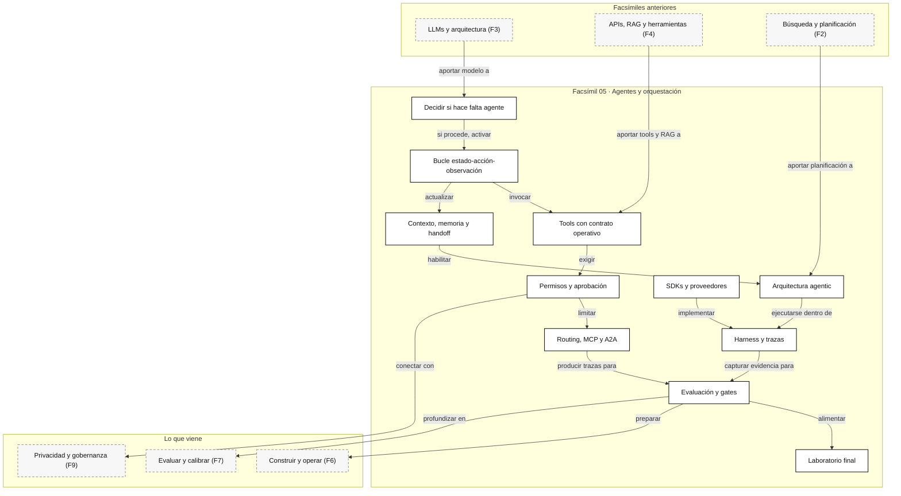

::: {.fasciculo-subtitle}
Facsímil 5 · Agentes y orquestación
:::

# Capítulo 11: Lo que deberías saber: agentes y orquestación

## Cerrar el facsímil sin cerrar la pregunta

Este facsímil empezó con una duda práctica: ¿cuándo merece la pena llamar agente a un sistema y cuándo basta con un prompt, una función o una interfaz más clara?

La respuesta no era una etiqueta. Era una arquitectura. Un agente útil no es “un modelo con herramientas”. Es un sistema que mantiene estado, decide acciones, observa resultados, respeta permisos, registra trazas, puede pedir revisión, se integra con otros sistemas y se evalúa con casos repetibles.

Si has entendido el facsímil, deberías poder mirar una demo de agente y preguntar: qué estado conserva, qué tools puede llamar, qué efecto tienen, qué permisos gobiernan esas acciones, cómo se recupera si algo falla, qué traza deja, qué coste tiene y qué gate decide si una versión avanza.

## Fecha de corte y alcance

**Fecha de corte:** 10 de junio de 2026.  
**Alcance:** este cierre resume conceptos estables del facsímil: agente como bucle estado-acción-observación, tools como contratos, memoria como sistema separado del prompt, harness, permisos, SDKs, MCP, A2A, routing y evaluación de trayectorias.

Los nombres de SDKs, modelos, APIs, precios y protocolos se moverán. Lo que queremos conservar es más estable: un agente es software con decisiones observables. Por tanto, se diseña, se versiona, se prueba, se mide y se opera.

## La frase que resume el facsímil

**Ejemplo de fórmula.** La forma más compacta de decirlo sería:

$$
A = M + S + T + P + H + O + E
$$

| Símbolo | Significado | Ejemplo |
|---|---|---|
| \(A\) | Agente operable. | Asistente que revisa una cita, consulta fuente, valida APA y pide aprobación si publica. |
| \(M\) | Modelo. | LLM que interpreta instrucciones y genera decisiones. |
| \(S\) | Estado. | Conversación, memoria, plan, tareas pendientes, contexto compacto. |
| \(T\) | Tools. | Buscar fuente, validar formato, crear ticket, leer base de datos. |
| \(P\) | Permisos. | Qué puede leer, escribir, ejecutar o pedir a una persona. |
| \(H\) | Harness. | Entorno que limita, ejecuta, observa y captura trazas. |
| \(O\) | Orquestación. | Routing, handoffs, MCP, A2A, workflows y subagentes. |
| \(E\) | Evaluación. | Dataset, trayectorias, coste, latencia, gates y regresiones. |

La fórmula no pretende ser matemática profunda. Sirve como recordatorio: si falta una pieza, la palabra “agente” puede estar escondiendo una demo frágil.

## Lo que ya no deberías confundir

| Confusión | Forma precisa de decirlo |
|---|---|
| “Un agente es un LLM que responde”. | Un agente observa, decide, actúa, registra y vuelve a decidir. |
| “Memoria es meter más contexto”. | Memoria implica qué se guarda, cuándo, dónde, con qué permisos y cómo se recupera. |
| “Una tool es una función cualquiera”. | Una tool tiene schema, semántica, efecto, permisos, errores y observabilidad. |
| “El SDK es la arquitectura”. | El SDK implementa patrones; la arquitectura la decides tú. |
| “Si pasa la demo, funciona”. | Funciona si pasa casos, trazas, coste, permisos, latencia y regresiones. |
| “Orquestar es llamar muchos agentes”. | Orquestar es decidir ruta, contrato, handoff, responsabilidad y evaluación. |

Wooldridge y Jennings definían los agentes como sistemas situados en un entorno, capaces de actuar de forma autónoma para cumplir objetivos.^[Wooldridge, M. y Jennings, N. R. (1995). *Intelligent Agents: Theory and Practice*. The Knowledge Engineering Review, 10(2), 115-152. https://doi.org/10.1017/S0269888900008122. Consultado el 10 de junio de 2026.] Ese vocabulario clásico sigue siendo útil, pero ahora lo aterrizamos en modelos, tools, trazas y sistemas distribuidos.

## Lo que faltaría si lo revisa un ingeniero informático

Para una persona de ingeniería informática, el facsímil no debería cerrar con “ya sé qué es un agente”. Debería cerrar con una lista de condiciones para llevarlo a un sistema mantenible. Un agente productivo se parece menos a una conversación y más a un servicio distribuido que llama otros servicios, mantiene estado, falla parcialmente, consume presupuesto y deja evidencia.

| Tema que añadiría al cierre | Pregunta que debe responder | Por qué importa |
|---|---|---|
| Máquina de estados | ¿En qué estados puede estar una run y qué transiciones son válidas? | Evita flujos implícitos imposibles de depurar. |
| Idempotencia | ¿Qué pasa si llega dos veces la misma petición? | Evita duplicar tickets, publicaciones, cobros o acciones persistentes. |
| Semántica de reintentos | ¿Qué errores se reintentan, cuántas veces y con qué espera? | Un retry mal diseñado multiplica coste y efectos. |
| Timeouts y cancelación | ¿Cuándo se aborta una tool o una run completa? | Sin límites, el sistema se atasca y consume recursos. |
| Colas y backpressure | ¿Qué ocurre si llegan más tareas de las que podemos atender? | Protege latencia y evita saturar tools externas. |
| Versionado de contratos | ¿Qué versión de prompt, tool, schema, policy y dataset produjo esta salida? | Sin versión no hay rollback ni comparación honesta. |
| Consistencia del estado | ¿Qué se guarda antes y después de cada acción? | Evita que una traza diga una cosa y la base de datos otra. |
| Observabilidad estándar | ¿Hay `trace_id`, `span_id`, atributos, eventos y propagación de contexto? | Permite seguir una run aunque atraviese varios servicios. |
| SLO y presupuesto | ¿Cuál es el p95 aceptable, coste máximo y tasa de fallo tolerable? | Sin objetivos no hay operación, solo impresiones. |
| CI/CD de agentes | ¿Qué evals bloquean un PR, una nightly o una publicación? | Convierte “parece mejor” en decisión revisable. |

OpenTelemetry define APIs para crear spans y trazas, y W3C Trace Context estandariza cómo propagar contexto entre servicios.^[OpenTelemetry. (2026). *Tracing API*. https://opentelemetry.io/docs/specs/otel/trace/api/. Consultado el 10 de junio de 2026.]^[W3C. (2021). *Trace Context*. https://www.w3.org/TR/trace-context/. Consultado el 10 de junio de 2026.] En un agente, esto significa que una decisión del router, una llamada al modelo, una tool MCP, una cola de revisión y un gate de evaluación pueden formar parte de la misma historia técnica.

El versionado semántico ayuda a distinguir cambios compatibles de cambios que rompen contrato.^[Preston-Werner, T. (2026). *Semantic Versioning 2.0.0*. https://semver.org/. Consultado el 10 de junio de 2026.] En agentes, no solo versionamos librerías: versionamos prompts, tools, policies, datasets, modelos y formatos de traza.

La ingeniería de ML ya avisaba de una deuda técnica específica: sistemas con modelos pueden esconder dependencias, configuraciones, datos y comportamiento de difícil mantenimiento.^[Sculley, D. et al. (2015). *Hidden Technical Debt in Machine Learning Systems*. Advances in Neural Information Processing Systems. https://papers.nips.cc/paper/5656-hidden-technical-debt-in-machine-learning-systems. Consultado el 10 de junio de 2026.] Amershi y colaboradores muestran que desarrollar sistemas de ML exige prácticas de ingeniería distintas a las de software clásico, especialmente por datos, experimentación y evaluación continua.^[Amershi, S. et al. (2019). *Software Engineering for Machine Learning: A Case Study*. International Conference on Software Engineering: Software Engineering in Practice, 291-300. https://doi.org/10.1109/ICSE-SEIP.2019.00042. Consultado el 10 de junio de 2026.] TFX es un buen ejemplo histórico de plataforma pensada para producción: no basta entrenar o ejecutar; hay que validar datos, modelos y despliegues.^[Baylor, D. et al. (2017). *TFX: A TensorFlow-Based Production-Scale Machine Learning Platform*. Proceedings of KDD, 1387-1395. https://doi.org/10.1145/3097983.3098021. Consultado el 10 de junio de 2026.]

## Recapitulación activa por capítulos

Esta tabla no es un índice. Es una prueba rápida de criterio. Si no puedes explicar la columna derecha, vuelve al capítulo correspondiente.

| Capítulo | Qué deberías poder defender | Pregunta de control |
|---|---|---|
| [01](/libro/fasciculo-05/#capitulo-01) | Elegir entre prompt, workflow y agente. | ¿Hay bucle, estado, tools y objetivo o solo una respuesta? |
| [02](/libro/fasciculo-05/#capitulo-02) | Describir estado, acción, observación y política. | ¿Qué cambia después de cada paso? |
| [03](/libro/fasciculo-05/#capitulo-03) | Diseñar tools con contratos operativos. | ¿Qué argumentos, errores, efectos y permisos tiene la tool? |
| [04](/libro/fasciculo-05/#capitulo-04) | Separar contexto, memoria, compaction y handoff. | ¿Qué se guarda y qué se vuelve a pasar al modelo? |
| [05](/libro/fasciculo-05/#capitulo-05) | Elegir arquitectura agentic según tarea. | ¿ReAct, planificador, workflow, multiagente o grafo? |
| [06](/libro/fasciculo-05/#capitulo-06) | Construir harness con límites, sensores y trazas. | ¿Cómo se observa y reproduce una ejecución? |
| [07](/libro/fasciculo-05/#capitulo-07) | Integrar SDKs sin delegar el diseño. | ¿Qué es portable y qué es específico del proveedor? |
| [08](/libro/fasciculo-05/#capitulo-08) | Diseñar permisos y revisión humana. | ¿Qué acciones requieren aprobación y por qué? |
| [09](/libro/fasciculo-05/#capitulo-09) | Orquestar routing, MCP, A2A y workflows. | ¿Quién decide, quién actúa y qué contrato viaja? |
| [10](/libro/fasciculo-05/#capitulo-10) | Evaluar trayectoria, coste y gates. | ¿Cómo sabes que la versión nueva mejora de verdad? |

ReAct popularizó el patrón de intercalar razonamiento y acciones observables con tools, en vez de producir una respuesta de una sola vez.^[Yao, S. et al. (2023). *ReAct: Synergizing Reasoning and Acting in Language Models*. International Conference on Learning Representations. https://arxiv.org/abs/2210.03629. Consultado el 10 de junio de 2026.] ToolLLM mostró la importancia de enseñar y evaluar uso de APIs reales en modelos de lenguaje.^[Qin, Y. et al. (2023). *ToolLLM: Facilitating Large Language Models to Master 16000+ Real-World APIs*. https://doi.org/10.48550/arXiv.2307.16789. Consultado el 10 de junio de 2026.]

## Mapa visual del facsímil

<svg id="f5-c11-mapa-agentes-orquestacion" xmlns="http://www.w3.org/2000/svg" viewBox="0 0 1900 1420" role="img" aria-label="Arquitectura de ingeniería para un sistema de agentes operable">
  <defs>
    <marker id="f5c11-arrow" markerWidth="10" markerHeight="10" refX="8" refY="3" orient="auto" markerUnits="strokeWidth">
      <path d="M0,0 L0,6 L9,3 z" fill="#111111"/>
    </marker>
    <style>
      #f5-c11-mapa-agentes-orquestacion .frame { fill:#FFFFFF; stroke:#111111; stroke-width:2; }
      #f5-c11-mapa-agentes-orquestacion .lane { fill:#FAFAFA; stroke:#111111; stroke-width:1.1; }
      #f5-c11-mapa-agentes-orquestacion .panel { fill:#FFFFFF; stroke:#111111; stroke-width:1.4; }
      #f5-c11-mapa-agentes-orquestacion .soft { fill:#F2F2F2; stroke:#111111; stroke-width:1.1; }
      #f5-c11-mapa-agentes-orquestacion .dark { fill:#111111; stroke:#111111; stroke-width:1.2; }
      #f5-c11-mapa-agentes-orquestacion .line { stroke:#111111; stroke-width:1.5; fill:none; marker-end:url(#f5c11-arrow); }
      #f5-c11-mapa-agentes-orquestacion .dash { stroke:#666666; stroke-width:1.1; stroke-dasharray:7 6; fill:none; marker-end:url(#f5c11-arrow); }
      #f5-c11-mapa-agentes-orquestacion .title { font:700 31px Arial, sans-serif; fill:#111111; }
      #f5-c11-mapa-agentes-orquestacion .laneTitle { font:700 13px Arial, sans-serif; fill:#111111; }
      #f5-c11-mapa-agentes-orquestacion .h { font:700 15px Arial, sans-serif; fill:#111111; }
      #f5-c11-mapa-agentes-orquestacion .body { font:12.5px Arial, sans-serif; fill:#222222; }
      #f5-c11-mapa-agentes-orquestacion .tiny { font:10.5px Arial, sans-serif; fill:#666666; }
      #f5-c11-mapa-agentes-orquestacion .code { font:11.5px "SFMono-Regular", Consolas, monospace; fill:#222222; }
      #f5-c11-mapa-agentes-orquestacion .white { font:700 13px Arial, sans-serif; fill:#FFFFFF; }
      #f5-c11-mapa-agentes-orquestacion .whiteBody { font:12px Arial, sans-serif; fill:#FFFFFF; }
      #f5-c11-mapa-agentes-orquestacion text { font-family:Arial, sans-serif; }
    </style>
  </defs>

  <rect x="24" y="24" width="1852" height="1372" rx="20" class="frame"/>
  <text x="950" y="72" text-anchor="middle" class="title">Sistema de agentes visto por ingeniería informática</text>
  <text x="950" y="104" text-anchor="middle" class="tiny">Un agente publicable se diseña como servicio: contratos, estado, colas, permisos, trazas, evaluación y operación.</text>

  <rect x="70" y="142" width="1760" height="140" rx="16" class="lane"/>
  <text x="96" y="170" class="laneTitle">1 · CONTRATO DE PRODUCTO Y ARQUITECTURA</text>
  <rect x="104" y="194" width="250" height="60" rx="10" class="panel"/>
  <text x="229" y="220" text-anchor="middle" class="h">Requisitos</text>
  <text x="124" y="244" class="tiny">tarea · usuario · efecto</text>
  <rect x="414" y="194" width="250" height="60" rx="10" class="panel"/>
  <text x="539" y="220" text-anchor="middle" class="h">ADR</text>
  <text x="434" y="244" class="tiny">por qué agente y no workflow</text>
  <rect x="724" y="194" width="250" height="60" rx="10" class="panel"/>
  <text x="849" y="220" text-anchor="middle" class="h">SLO</text>
  <text x="744" y="244" class="tiny">p95 · coste · tasa de fallo</text>
  <rect x="1034" y="194" width="250" height="60" rx="10" class="panel"/>
  <text x="1159" y="220" text-anchor="middle" class="h">Contratos</text>
  <text x="1054" y="244" class="tiny">schema · SemVer · policy</text>
  <rect x="1344" y="194" width="250" height="60" rx="10" class="panel"/>
  <text x="1469" y="220" text-anchor="middle" class="h">Dataset de aceptación</text>
  <text x="1364" y="244" class="tiny">golden · regresión · trazas</text>
  <path d="M354 224 L414 224" class="line"/>
  <path d="M664 224 L724 224" class="line"/>
  <path d="M974 224 L1034 224" class="line"/>
  <path d="M1284 224 L1344 224" class="line"/>

  <rect x="70" y="326" width="1760" height="454" rx="16" class="lane"/>
  <text x="96" y="354" class="laneTitle">2 · RUNTIME AGENTIC COMO MÁQUINA DE ESTADOS</text>

  <rect x="104" y="404" width="260" height="96" rx="12" class="panel"/>
  <text x="234" y="434" text-anchor="middle" class="h">API boundary</text>
  <text x="126" y="462" class="code">request_id</text>
  <text x="126" y="484" class="code">idempotency_key</text>

  <rect x="104" y="562" width="260" height="96" rx="12" class="panel"/>
  <text x="234" y="592" text-anchor="middle" class="h">Ingress queue</text>
  <text x="126" y="620" class="body">prioridad · backpressure</text>
  <text x="126" y="642" class="tiny">rate limit y cancelación</text>

  <rect x="444" y="404" width="310" height="254" rx="14" class="dark"/>
  <text x="599" y="438" text-anchor="middle" class="white">Run state machine</text>
  <text x="474" y="470" class="whiteBody">CREATED → PLANNING</text>
  <text x="474" y="494" class="whiteBody">→ TOOL_CALLING</text>
  <text x="474" y="518" class="whiteBody">→ WAITING_APPROVAL</text>
  <text x="474" y="542" class="whiteBody">→ COMPLETED</text>
  <text x="474" y="566" class="whiteBody">→ FAILED / CANCELLED</text>
  <text x="474" y="604" class="whiteBody">estado persistido</text>
  <text x="474" y="628" class="whiteBody">transiciones válidas</text>

  <rect x="834" y="384" width="280" height="94" rx="12" class="panel"/>
  <text x="974" y="414" text-anchor="middle" class="h">Planner / Router</text>
  <text x="856" y="442" class="body">workflow · ReAct · grafo</text>
  <text x="856" y="464" class="tiny">elige ruta y presupuesto</text>

  <rect x="834" y="520" width="280" height="94" rx="12" class="panel"/>
  <text x="974" y="550" text-anchor="middle" class="h">Policy engine</text>
  <text x="856" y="578" class="body">scope · permisos · aprobación</text>
  <text x="856" y="600" class="tiny">gate antes del efecto</text>

  <rect x="1194" y="384" width="280" height="94" rx="12" class="panel"/>
  <text x="1334" y="414" text-anchor="middle" class="h">Memory / context</text>
  <text x="1216" y="442" class="body">working · episodic · semantic</text>
  <text x="1216" y="464" class="tiny">compaction y recuperación</text>

  <rect x="1194" y="520" width="280" height="94" rx="12" class="panel"/>
  <text x="1334" y="550" text-anchor="middle" class="h">Tool dispatcher</text>
  <text x="1216" y="578" class="body">timeouts · retries · circuit</text>
  <text x="1216" y="600" class="tiny">adaptadores y contratos</text>

  <rect x="1542" y="384" width="240" height="230" rx="14" class="soft"/>
  <text x="1662" y="418" text-anchor="middle" class="h">Sistemas externos</text>
  <text x="1570" y="452" class="body">MCP tools</text>
  <text x="1570" y="478" class="body">A2A agents</text>
  <text x="1570" y="504" class="body">DB / SQL</text>
  <text x="1570" y="530" class="body">RAG / vector store</text>
  <text x="1570" y="556" class="body">tickets / docs</text>
  <text x="1570" y="584" class="tiny">todo efecto debe trazarse</text>

  <rect x="834" y="660" width="640" height="76" rx="12" class="soft"/>
  <text x="1154" y="690" text-anchor="middle" class="h">Output contract</text>
  <text x="864" y="718" class="body">respuesta estructurada · artefacto · decisión · next_state · trace_id · coste</text>

  <path d="M234 500 L234 562" class="line"/>
  <path d="M364 452 L444 452" class="line"/>
  <path d="M364 610 L444 590" class="line"/>
  <path d="M754 470 L834 431" class="line"/>
  <path d="M754 560 L834 567" class="line"/>
  <path d="M1114 431 L1194 431" class="line"/>
  <path d="M1114 567 L1194 567" class="line"/>
  <path d="M1474 567 L1542 505" class="line"/>
  <path d="M974 614 C990 640 1070 650 1154 660" class="dash"/>
  <path d="M1334 614 C1310 642 1240 652 1154 660" class="dash"/>

  <rect x="70" y="824" width="1760" height="246" rx="16" class="lane"/>
  <text x="96" y="852" class="laneTitle">3 · OBSERVABILIDAD Y EVALUACIÓN</text>
  <rect x="104" y="892" width="286" height="116" rx="12" class="panel"/>
  <text x="247" y="924" text-anchor="middle" class="h">Trace context</text>
  <text x="126" y="954" class="code">trace_id · span_id</text>
  <text x="126" y="976" class="code">parent_span_id</text>
  <text x="126" y="998" class="tiny">propagado entre servicios</text>

  <rect x="454" y="892" width="286" height="116" rx="12" class="panel"/>
  <text x="597" y="924" text-anchor="middle" class="h">Telemetry store</text>
  <text x="476" y="954" class="body">logs · metrics · traces</text>
  <text x="476" y="976" class="body">coste · tokens · latencia</text>
  <text x="476" y="998" class="tiny">retención y muestreo</text>

  <rect x="804" y="892" width="286" height="116" rx="12" class="panel"/>
  <text x="947" y="924" text-anchor="middle" class="h">Eval runner</text>
  <text x="826" y="954" class="body">baseline vs candidate</text>
  <text x="826" y="976" class="body">trayectoria y contrato</text>
  <text x="826" y="998" class="tiny">repeat y flake rate</text>

  <rect x="1154" y="892" width="286" height="116" rx="12" class="panel"/>
  <text x="1297" y="924" text-anchor="middle" class="h">Release gates</text>
  <text x="1176" y="954" class="body">quality · policy · budget</text>
  <text x="1176" y="976" class="body">latencia · trazabilidad</text>
  <text x="1176" y="998" class="tiny">PR · nightly · canary</text>

  <rect x="1504" y="892" width="286" height="116" rx="12" class="panel"/>
  <text x="1647" y="924" text-anchor="middle" class="h">Regression loop</text>
  <text x="1526" y="954" class="body">fallo → caso nuevo</text>
  <text x="1526" y="976" class="body">dataset versionado</text>
  <text x="1526" y="998" class="tiny">rollback si empeora</text>

  <path d="M247 1008 L454 950" class="line"/>
  <path d="M740 950 L804 950" class="line"/>
  <path d="M1090 950 L1154 950" class="line"/>
  <path d="M1440 950 L1504 950" class="line"/>
  <path d="M1154 736 C1120 780 700 820 247 892" class="dash"/>
  <path d="M1662 614 C1668 746 1660 818 1647 892" class="dash"/>

  <rect x="70" y="1114" width="1760" height="178" rx="16" class="lane"/>
  <text x="96" y="1142" class="laneTitle">4 · OPERACIÓN Y GOBIERNO DEL CAMBIO</text>
  <rect x="160" y="1180" width="270" height="72" rx="12" class="dark"/>
  <text x="295" y="1208" text-anchor="middle" class="white">CI/CD</text>
  <text x="190" y="1234" class="whiteBody">tests · evals · gates</text>
  <rect x="510" y="1180" width="270" height="72" rx="12" class="dark"/>
  <text x="645" y="1208" text-anchor="middle" class="white">Runtime SLO</text>
  <text x="540" y="1234" class="whiteBody">p95 · coste · errores</text>
  <rect x="860" y="1180" width="270" height="72" rx="12" class="dark"/>
  <text x="995" y="1208" text-anchor="middle" class="white">Config registry</text>
  <text x="890" y="1234" class="whiteBody">prompt · model · policy</text>
  <rect x="1210" y="1180" width="270" height="72" rx="12" class="dark"/>
  <text x="1345" y="1208" text-anchor="middle" class="white">Audit log</text>
  <text x="1240" y="1234" class="whiteBody">quién · qué · cuándo</text>
  <path d="M1297 1008 C1150 1110 510 1116 295 1180" class="dash"/>
  <path d="M1297 1008 C1260 1080 1280 1134 1345 1180" class="dash"/>
  <path d="M947 1008 C950 1082 976 1136 995 1180" class="dash"/>

  <rect x="426" y="1330" width="796" height="38" rx="19" class="dark"/>
  <text x="824" y="1354" text-anchor="middle" class="white">Criterio final: si no puedes reproducirlo, limitarlo, observarlo y evaluarlo, todavía no es ingeniería.</text>
  <rect x="1282" y="1336" width="448" height="28" rx="14" fill="#111111"/>
  <text opacity="0.55" x="1506" y="1355" text-anchor="end" font-size="10.5" font-weight="700" fill="#888888">IA para gente curiosa / Facsímil 05 / Capítulo 11 / 686f6c61</text>
</svg>

## La decisión técnica: de tarea a arquitectura

Cuando alguien pide “un agente”, la respuesta profesional no es sí o no. Es ordenar la decisión.

| Pregunta | Si la respuesta es sí | Si la respuesta es no |
|---|---|---|
| ¿La tarea requiere varios pasos? | Puede tener sentido un workflow o agente. | Empieza por prompt, función o interfaz. |
| ¿Hay tools con efectos reales? | Diseña contrato, permiso y traza. | No vendas autonomía que no existe. |
| ¿El sistema necesita recordar algo? | Separa memoria, contexto y almacenamiento. | No metas historial infinito en prompt. |
| ¿Hay varias rutas posibles? | Añade routing explícito y métrica de ruta. | Mantén camino simple y evaluable. |
| ¿Puede afectar a datos o personas? | Añade approval y gate de runtime. | Aun así registra la decisión. |
| ¿Puedes evaluar la trayectoria? | Versiona dataset y traces. | Todavía estás en fase exploratoria. |

Smith ya describió el Contract Net Protocol como coordinación distribuida entre participantes que anuncian tareas, reciben propuestas y asignan trabajo.^[Smith, R. G. (1980). *The Contract Net Protocol: High-Level Communication and Control in a Distributed Problem Solver*. IEEE Transactions on Computers, C-29(12), 1104-1113. https://doi.org/10.1109/TC.1980.1675516. Consultado el 10 de junio de 2026.] La idea resuena con sistemas modernos: incluso cuando usamos LLMs, coordinar trabajo exige contratos y responsabilidad.

Jennings, Sycara y Wooldridge insistían en que la investigación de agentes no iba solo de piezas aisladas, sino de coordinación, interacción, entornos y metodologías de desarrollo.^[Jennings, N. R., Sycara, K. y Wooldridge, M. (1998). *A Roadmap of Agent Research and Development*. Autonomous Agents and Multi-Agent Systems, 1(1), 7-38. https://doi.org/10.1023/A:1010090405266. Consultado el 10 de junio de 2026.] Esa advertencia encaja perfectamente con este facsímil: si un agente moderno no deja claro cómo coordina, cómo observa y cómo se evalúa, todavía no está bien diseñado.

## Cómo encaja todo



El mapa ya no resume capítulos: muestra una arquitectura de sistema. La parte superior obliga a justificar requisitos, ADR, SLO, contratos y dataset de aceptación. La zona central modela el agente como runtime con estado, cola, idempotencia, router, policy engine, memoria, dispatcher y sistemas externos. La parte inferior aterriza lo que un equipo de ingeniería necesita para operar: trazas, métricas, evals, gates, CI/CD, configuración versionada y auditoría.

## Vocabulario aprendido

| Término | Definición útil |
|---|---|
| Agente operable | Sistema agentic que se puede limitar, observar, reproducir y evaluar. |
| Tool contract | Descripción verificable de argumentos, semántica, efecto, errores y permisos. |
| Harness | Entorno que ejecuta el agente con límites, sensores, trazas y fixtures. |
| Handoff | Paso explícito de contexto y responsabilidad entre componentes o agentes. |
| MCP | Protocolo para exponer tools y contexto a modelos o agentes mediante contrato externo. |
| A2A | Patrón/protocolo para que un agente o sistema delegue trabajo en otro que también decide. |
| Approval gate | Punto donde una persona debe revisar una acción antes de que tenga efecto. |
| Trace grading | Evaluación estructurada de una traza, no solo de una respuesta final. |
| Baseline | Versión de referencia contra la que comparas una candidata. |
| Regresión | Empeoramiento de un comportamiento que antes funcionaba. |
| Idempotencia | Propiedad por la que repetir una petición no duplica el efecto. |
| Backpressure | Mecanismo para frenar entrada cuando el sistema no puede procesar más sin degradarse. |
| SLO | Objetivo operativo medible, como p95 de latencia o coste máximo por run aceptada. |
| ADR | Registro breve de una decisión de arquitectura y sus razones. |
| Trace context | Información propagada para correlacionar spans de una misma ejecución. |

El Model Context Protocol define una forma estándar de conectar aplicaciones de IA con tools y datos externos.^[Model Context Protocol. (2026). *Specification*. https://modelcontextprotocol.io/specification. Consultado el 10 de junio de 2026.] A2A, por su parte, se orienta a comunicación entre agentes o sistemas agentic con tareas, mensajes y artefactos.^[Google. (2026). *Agent2Agent Protocol Specification*. https://a2a-protocol.org/latest/specification/. Consultado el 10 de junio de 2026.]

La evaluación completa cierra el círculo. OpenAI Agents SDK organiza las ejecuciones en trazas y spans que permiten inspeccionar llamadas de modelo, tools, guardrails y handoffs.^[OpenAI. (2026). *Agents SDK: Tracing*. https://openai.github.io/openai-agents-python/tracing/. Consultado el 10 de junio de 2026.] Google ADK separa evaluación de trayectoria/tool use y respuesta final.^[Google. (2026). *Agent Development Kit: Evaluation*. https://google.github.io/adk-docs/evaluate/. Consultado el 10 de junio de 2026.] Promptfoo plantea los agentes de código como sistemas que deciden, actúan, observan y repiten, por lo que recomienda assertions de ruta, coste, latencia, permisos y repetición.^[Promptfoo. (2026). *Evaluate Coding Agents*. https://www.promptfoo.dev/docs/guides/evaluate-coding-agents/. Consultado el 10 de junio de 2026.] AgentBench refuerza la misma idea desde benchmark académico: evaluar agentes exige entornos interactivos y no solo preguntas de texto.^[Liu, X. et al. (2024). *AgentBench: Evaluating LLMs as Agents*. International Conference on Learning Representations. https://doi.org/10.48550/arXiv.2308.03688. Consultado el 10 de junio de 2026.]

## Dónde solía tropezar yo

| Tropiezo | Por qué pasa | Antídoto |
|---|---|---|
| Llamar agente a cualquier chat | La palabra suena avanzada y vende bien. | Preguntar por estado, tools, acciones, observaciones y evaluación. |
| Diseñar tools sin pensar efectos | El schema parece suficiente. | Añadir semántica, permisos, idempotencia, errores y traza. |
| Guardar memoria sin política | Parece útil recordarlo todo. | Definir qué se guarda, por cuánto tiempo, quién lo ve y cómo se borra. |
| Elegir SDK antes de diseñar arquitectura | El proveedor da una sensación de camino hecho. | Escribir primero el contrato de run, tools, permisos y evaluación. |
| Añadir subagentes demasiado pronto | Multiplica rutas y fallos antes de medir. | Empezar con workflow simple y subir complejidad solo si hay evidencia. |
| Evaluar solo la respuesta final | Es lo que se ve en pantalla. | Medir trayectoria, coste, latencia, permisos y trazas. |
| No cerrar el bucle de regresiones | El mismo fallo vuelve con otro nombre. | Cada fallo importante crea caso permanente en el dataset. |
| No modelar estados | El agente parece flexible, pero nadie sabe dónde puede quedarse atascado. | Dibujar estados, transiciones válidas y salidas de error. |
| Olvidar idempotencia | Un reintento puede duplicar una acción persistente. | Usar `idempotency_key` y registrar efectos antes de repetir. |
| No definir SLO | Todo parece aceptable hasta que hay usuarios reales. | Fijar p95, coste, tasa de fallo y presupuesto por ruta. |

## Antes de pasar página

Responde estas preguntas sin mirar el texto. Si alguna se te escapa, vuelve al capítulo indicado.

| Pregunta | Vuelve a |
|---|---|
| ¿Cuándo basta un prompt y cuándo aparece un agente? | [Capítulo 01](/libro/fasciculo-05/#capitulo-01). |
| ¿Puedes explicar estado, acción, observación y política con un ejemplo? | [Capítulo 02](/libro/fasciculo-05/#capitulo-02). |
| ¿Qué debe contener una tool para ser operable? | [Capítulo 03](/libro/fasciculo-05/#capitulo-03). |
| ¿Qué diferencia hay entre contexto, memoria, compaction y handoff? | [Capítulo 04](/libro/fasciculo-05/#capitulo-04). |
| ¿Qué arquitectura agentic elegirías para una tarea multi-paso y por qué? | [Capítulo 05](/libro/fasciculo-05/#capitulo-05). |
| ¿Cómo harías reproducible una ejecución? | [Capítulo 06](/libro/fasciculo-05/#capitulo-06). |
| ¿Qué no deberías delegar al SDK? | [Capítulo 07](/libro/fasciculo-05/#capitulo-07). |
| ¿Qué acciones requieren aprobación humana? | [Capítulo 08](/libro/fasciculo-05/#capitulo-08). |
| ¿Cuándo usarías MCP, A2A o un workflow local? | [Capítulo 09](/libro/fasciculo-05/#capitulo-09). |
| ¿Cómo decidirías si una versión nueva puede publicarse? | [Capítulo 10](/libro/fasciculo-05/#capitulo-10). |
| ¿Puedes dibujar la máquina de estados de una run? | `Lo que faltaría si lo revisa un ingeniero informático`. |
| ¿Qué harías para que una petición repetida no duplique efectos? | `Lo que faltaría si lo revisa un ingeniero informático`. |
| ¿Qué SLO usarías para operar el agente? | `Lo que faltaría si lo revisa un ingeniero informático`. |

## En resumen

| Idea fuerza | Qué te llevas |
|---|---|
| Un agente es arquitectura, no etiqueta. | Debe tener bucle, estado, acciones, observaciones y control. |
| Las tools son contratos, no simples funciones. | Importan argumentos, errores, efectos, permisos y trazas. |
| La memoria exige gobierno. | Guardar contexto sin política puede empeorar calidad, privacidad y coste. |
| La orquestación reparte responsabilidad. | Routing, MCP, A2A y handoffs deben decir quién decide y qué viaja. |
| La autonomía se gradúa. | No todo debe ejecutarse sin aprobación ni todo necesita revisión manual. |
| La evaluación mira trayectoria. | Una respuesta final buena no basta si el camino fue caro, opaco o fuera de contrato. |
| La ingeniería aparece en los bordes. | Idempotencia, colas, timeouts, SLO, versionado y trazas separan producto de demo. |
| El laboratorio convierte criterio en práctica. | Construir, medir y justificar es la forma de comprobar que entendimos. |

## Para saber más

Google. (2026). *Agent Development Kit: Evaluate*. https://google.github.io/adk-docs/evaluate/

Google. (2026). *Agent2Agent Protocol Specification*. https://a2a-protocol.org/latest/specification/

Amershi, S. et al. (2019). *Software Engineering for Machine Learning: A Case Study*. *International Conference on Software Engineering: Software Engineering in Practice*, 291-300. https://doi.org/10.1109/ICSE-SEIP.2019.00042

Baylor, D. et al. (2017). *TFX: A TensorFlow-Based Production-Scale Machine Learning Platform*. *Proceedings of KDD*, 1387-1395. https://doi.org/10.1145/3097983.3098021

Jennings, N. R., Sycara, K. y Wooldridge, M. (1998). *A Roadmap of Agent Research and Development*. *Autonomous Agents and Multi-Agent Systems*, 1(1), 7-38. https://doi.org/10.1023/A:1010090405266

Liu, X. et al. (2024). *AgentBench: Evaluating LLMs as Agents*. *International Conference on Learning Representations*. https://doi.org/10.48550/arXiv.2308.03688

Model Context Protocol. (2026). *Specification*. https://modelcontextprotocol.io/specification

OpenAI. (2026). *Agents SDK: Tracing*. https://openai.github.io/openai-agents-python/tracing/

OpenTelemetry. (2026). *Tracing API*. https://opentelemetry.io/docs/specs/otel/trace/api/

Promptfoo. (2026). *Evaluate Coding Agents*. https://www.promptfoo.dev/docs/guides/evaluate-coding-agents/

Preston-Werner, T. (2026). *Semantic Versioning 2.0.0*. https://semver.org/

Qin, Y. et al. (2023). *ToolLLM: Facilitating Large Language Models to Master 16000+ Real-World APIs*. https://doi.org/10.48550/arXiv.2307.16789

Sculley, D. et al. (2015). *Hidden Technical Debt in Machine Learning Systems*. *Advances in Neural Information Processing Systems*. https://papers.nips.cc/paper/5656-hidden-technical-debt-in-machine-learning-systems

Smith, R. G. (1980). *The Contract Net Protocol: High-Level Communication and Control in a Distributed Problem Solver*. *IEEE Transactions on Computers*, C-29(12), 1104-1113. https://doi.org/10.1109/TC.1980.1675516

W3C. (2021). *Trace Context*. https://www.w3.org/TR/trace-context/

Wooldridge, M. y Jennings, N. R. (1995). *Intelligent Agents: Theory and Practice*. *The Knowledge Engineering Review*, 10(2), 115-152. https://doi.org/10.1017/S0269888900008122

Yao, S. et al. (2023). *ReAct: Synergizing Reasoning and Acting in Language Models*. *International Conference on Learning Representations*. https://arxiv.org/abs/2210.03629

## Laboratorio

Un laboratorio, dentro de este libro, es un espacio de práctica guiada. Aquí no buscamos una respuesta bonita. Buscamos construir algo pequeño que se pueda ejecutar, medir, explicar, corregir y defender.

En este laboratorio vamos a tocar los temas centrales del facsímil:

- Del capítulo 01 al 03: decidir si hace falta agente y diseñar tools con contrato.
- Del capítulo 04 al 06: gestionar estado, límites y trazas.
- Del capítulo 07 al 09: pensar en SDKs, permisos, routing, MCP y A2A sin depender de una marca.
- Del capítulo 10: evaluar trayectoria, coste, latencia y gates.

Los dos retos incluyen solución completa. No se trata de esconder la respuesta: se trata de enseñar cómo piensa alguien que quiere llevar una idea desde “parece que funciona” hasta “puedo explicarlo y medirlo”.

El kit real del laboratorio está en:

```text
labs/f5/laboratorio-agentes/
```

El texto del capítulo explica las piezas. El kit las convierte en entrega ejecutable: runtime con idempotencia, ledger de efectos, trazas, evaluación de routing, gate de CI y checker.

### Reto 1: construir un runtime mínimo con estado e idempotencia

#### Contexto

Una escuela quiere un agente que reciba solicitudes internas. Algunas solo consultan información; otras preparan cambios con efecto persistente, como abrir un ticket de soporte o proponer una actualización de una guía. El problema no es que el modelo “entienda” la frase. El problema de ingeniería es otro: ¿qué ocurre si la petición llega dos veces, si una tool tarda demasiado, si hay que pedir aprobación o si queremos reconstruir lo ocurrido?

Este reto no busca un agente inteligente. Busca un runtime pequeño con piezas que un ingeniero informático reconocería: estado, clave de idempotencia, policy gate, tool dispatcher, traza y registro de efectos.

#### Objetivo

Construir un ejecutor mínimo que:

| Pieza | Qué debe hacer | Capítulo que sostiene la decisión |
|---|---|---|
| Máquina de estados | Controlar transiciones de una run. | Capítulo 02: estado, acción y observación. |
| Idempotencia | Evitar duplicar efectos si se repite una petición. | Capítulo 06: harness y límites. |
| Policy gate | Pedir aprobación antes de una acción persistente. | Capítulo 08: permisos y revisión humana. |
| Tool dispatcher | Llamar tools con contrato y registrar resultado. | Capítulo 03: tools. |
| Traza | Dejar evidencia reproducible. | Capítulo 10: evaluación de trayectoria. |

#### Enunciado

1. Define una petición con `request_id`, `idempotency_key`, texto y si tiene aprobación.
2. Modela estados: `CREATED`, `PLANNING`, `WAITING_APPROVAL`, `TOOL_CALLING`, `COMPLETED`, `DUPLICATE`.
3. Si la petición ya se procesó con la misma clave, no repitas la tool persistente.
4. Si falta aprobación para una acción persistente, detén la run en `WAITING_APPROVAL`.
5. Registra trazas con `trace_id`, spans y atributos.

En el kit se ejecuta así:

```bash
cd labs/f5/laboratorio-agentes
python3 ops/run_agent_runtime.py --write
python3 -m json.tool output/effect_ledger.json
cat output/runtime_decision.md
```

La salida esperada contiene una run completada, una petición duplicada que no repite efecto, una run detenida por aprobación pendiente y consultas de lectura con trazas reconstruibles.

#### Resolución paso a paso

**Ejemplo de fórmula.** Primero definimos la transición de estado:

$$
s_{t+1} = \delta(s_t, e_t, p_t)
$$

| Símbolo | Significado | Ejemplo |
|---|---|---|
| \(s_t\) | Estado actual de la run. | `PLANNING`. |
| \(e_t\) | Evento observado. | `approval.present` o `tool.completed`. |
| \(p_t\) | Política activa. | “crear ticket requiere aprobación”. |
| \(\delta\) | Función de transición. | Pasa de `PLANNING` a `WAITING_APPROVAL`. |
| \(s_{t+1}\) | Estado siguiente. | `TOOL_CALLING` si hay aprobación. |

**Ejemplo de fórmula.** Después fijamos la propiedad de idempotencia:

$$
\operatorname{effects}(\operatorname{idempotency\_key}) \le 1
$$

La clave puede repetirse por un refresco de navegador, una pérdida de conexión o un retry de cliente. El sistema no debe crear dos tickets por el mismo trabajo lógico.

#### Solución

```python
from dataclasses import dataclass, asdict
import json
import time
import uuid


RUN_STORE = {}
EFFECT_LEDGER = {}


@dataclass(frozen=True)
class Request:
    request_id: str
    idempotency_key: str
    user_text: str
    approval_granted: bool


def now_ms() -> int:
    return int(time.time() * 1000)


def new_trace() -> dict:
    return {"trace_id": str(uuid.uuid4()), "spans": []}


def span(trace: dict, name: str, **attrs) -> None:
    trace["spans"].append({"name": name, "timestamp_ms": now_ms(), "attrs": attrs})


def route_request(text: str) -> dict:
    lower = text.lower()
    if "ticket" in lower or "incidencia" in lower:
        return {"route": "support_ticket", "effect": "persistent_write"}
    return {"route": "read_only_answer", "effect": "read"}


def create_ticket(text: str, idempotency_key: str) -> dict:
    if idempotency_key in EFFECT_LEDGER:
        return {"created": False, "ticket_id": EFFECT_LEDGER[idempotency_key], "reason": "already_created"}
    ticket_id = "TCK-" + str(len(EFFECT_LEDGER) + 1).zfill(4)
    EFFECT_LEDGER[idempotency_key] = ticket_id
    return {"created": True, "ticket_id": ticket_id, "reason": "new_effect"}


def answer_read_only(text: str) -> dict:
    return {"answer": "consulta atendida sin efecto persistente", "source": "fixture"}


def run_agent(request: Request) -> dict:
    if request.idempotency_key in RUN_STORE:
        original = RUN_STORE[request.idempotency_key]
        duplicate_trace = new_trace()
        span(
            duplicate_trace,
            "run.duplicate",
            original_run_id=original["run_id"],
            idempotency_key=request.idempotency_key,
        )
        return {
            "state": "DUPLICATE",
            "run_id": original["run_id"],
            "decision": "no se repite el efecto",
            "trace": duplicate_trace,
        }

    run_id = str(uuid.uuid4())
    trace = new_trace()
    state = "CREATED"
    span(trace, "run.started", run_id=run_id, request_id=request.request_id)

    state = "PLANNING"
    plan = route_request(request.user_text)
    span(trace, "route.decision", state=state, **plan)

    if plan["effect"] == "persistent_write" and not request.approval_granted:
        state = "WAITING_APPROVAL"
        span(trace, "approval.required", state=state, reason="persistent_write")
        result = {
            "run_id": run_id,
            "state": state,
            "decision": "esperando aprobación",
            "route": plan["route"],
            "effect": None,
            "trace": trace,
        }
        RUN_STORE[request.idempotency_key] = result
        return result

    state = "TOOL_CALLING"
    tool_name = "create_ticket" if plan["effect"] == "persistent_write" else "answer_read_only"
    span(trace, "tool.call", state=state, tool=tool_name)
    if tool_name == "create_ticket":
        effect = create_ticket(request.user_text, request.idempotency_key)
    else:
        effect = answer_read_only(request.user_text)
    span(trace, "tool.result", state=state, **effect)

    state = "COMPLETED"
    span(trace, "run.completed", state=state)
    result = {
        "run_id": run_id,
        "state": state,
        "decision": "completado",
        "route": plan["route"],
        "effect": effect,
        "trace": trace,
    }
    RUN_STORE[request.idempotency_key] = result
    return result


first = Request(
    request_id="req-001",
    idempotency_key="user-42:create-ticket:access-2026-06-10",
    user_text="Crear ticket: no puedo entrar en mi cuenta.",
    approval_granted=True,
)

second = Request(
    request_id="req-002",
    idempotency_key="user-42:create-ticket:access-2026-06-10",
    user_text="Crear ticket: no puedo entrar en mi cuenta.",
    approval_granted=True,
)

print(json.dumps(run_agent(first), indent=2, ensure_ascii=False))
print(json.dumps(run_agent(second), indent=2, ensure_ascii=False))
print("effect_ledger:", EFFECT_LEDGER)
```

#### Resultado esperado

La primera ejecución crea `TCK-0001` y termina en `COMPLETED`. La segunda usa la misma `idempotency_key`, por tanto termina como `DUPLICATE` y no crea otro ticket. El `effect_ledger` debe contener un solo efecto.

#### Por qué funciona

Funciona porque separa decisión, permiso, tool y efecto. La clave de idempotencia protege la frontera más delicada: repetir una petición no debe duplicar acciones persistentes. La traza deja claro si el sistema planificó, pidió aprobación, llamó una tool o detectó duplicado.

#### Cómo explicarlo a otra persona

Un agente no puede comportarse como una función que improvisa cada vez. Si hace cosas fuera del chat, necesita memoria de ejecución: “esta petición ya produjo este efecto, no lo repitas”.

#### Variaciones

- Haz que una petición sin aprobación termine en `WAITING_APPROVAL`.
- Añade un timeout simulado para `create_ticket`.
- Añade una cola de prioridad y procesa primero las solicitudes de lectura.
- Añade un `dead_letter_queue` para runs que fallan tres veces.

### Reto 2: diseñar una suite de evaluación para un agente con routing

#### Contexto

Ahora ya no revisamos una única publicación. Queremos un agente que reciba peticiones de una escuela y decida ruta:

| Ruta | Cuándo usarla |
|---|---|
| `reference_flow` | Revisar fuente, cita o bibliografía. |
| `support_flow` | Clasificar una incidencia de acceso o matrícula. |
| `data_flow` | Consultar datos estructurados. |
| `human_review` | Pedir revisión cuando la acción tenga efecto persistente. |

El equipo tiene dos versiones: `agent-v1` y `agent-v2`. La nueva parece más capaz, pero llama más tools y cuesta más. Necesitamos decidir si avanza.

#### Objetivo

Diseñar una evaluación de trayectorias con:

- Casos versionados.
- Ruta esperada.
- Tools requeridas.
- Tools no permitidas.
- Coste máximo.
- Latencia máxima.
- Gate final.

Esto junta los capítulos 05, 06, 08, 09 y 10: arquitectura, harness, permisos, orquestación y evaluación.

#### Enunciado

1. Define dos casos de evaluación.
2. Define dos runs candidatas.
3. Evalúa ruta, tools, coste, latencia y aprobación.
4. Decide si `agent-v2` puede sustituir a `agent-v1`.
5. Escribe qué caso añadirías al dataset si falla.

En el kit se ejecuta así:

```bash
cd labs/f5/laboratorio-agentes
python3 ops/evaluate_agent_routes.py --write
python3 -m json.tool output/ci_agent_gate.json
cat output/agent_eval_decision.md
```

Para practicar una regresión:

```bash
python3 ops/evaluate_agent_routes.py \
  --runs data/agent_runs_regression.json \
  --output-dir output/regression \
  --write
python3 -m json.tool output/regression/ci_agent_gate.json
```

La referencia publica porque ruta, tools, aprobación, coste, latencia y trazas pasan. La regresión bloquea porque usa rutas equivocadas, tools no permitidas y acciones sin aprobación donde no toca.

#### Resolución paso a paso

Primero separamos salida de trayectoria. En agentes, una versión puede responder bien, pero usar la ruta equivocada o saltarse una revisión. Después añadimos coste y latencia, porque una mejora que duplica presupuesto quizá no es mejora.

**Ejemplo de fórmula.** La función de decisión será:

$$
G =
\mathbf{1}[\text{ruta correcta}]
\cdot
\mathbf{1}[\text{tools correctas}]
\cdot
\mathbf{1}[\text{permisos correctos}]
\cdot
\mathbf{1}[C \le C_{\max}]
\cdot
\mathbf{1}[L \le L_{\max}]
$$

Cada factor debe pasar. Si uno falla, el caso no avanza.

#### Solución

```python
from dataclasses import dataclass
import json


@dataclass(frozen=True)
class EvalCase:
    case_id: str
    input_text: str
    expected_route: str
    required_tools: list[str]
    forbidden_tools: list[str]
    requires_approval: bool
    max_cost: float
    max_latency_ms: int


@dataclass(frozen=True)
class Run:
    case_id: str
    agent_version: str
    route: str
    tools: list[str]
    approval_requested: bool
    cost: float
    latency_ms: int
    final_contains: str


CASES = [
    EvalCase(
        case_id="r01",
        input_text="Comprueba esta referencia y dime si puede citarse.",
        expected_route="reference_flow",
        required_tools=["search_source", "validate_apa"],
        forbidden_tools=["publish_page"],
        requires_approval=False,
        max_cost=0.08,
        max_latency_ms=6000,
    ),
    EvalCase(
        case_id="r02",
        input_text="Publica esta corrección en la guía del curso.",
        expected_route="human_review",
        required_tools=["diff_preview", "approval_request"],
        forbidden_tools=["publish_page"],
        requires_approval=True,
        max_cost=0.10,
        max_latency_ms=8000,
    ),
]

RUNS = [
    Run(
        case_id="r01",
        agent_version="agent-v1",
        route="reference_flow",
        tools=["search_source", "validate_apa"],
        approval_requested=False,
        cost=0.04,
        latency_ms=4200,
        final_contains="referencia verificada",
    ),
    Run(
        case_id="r02",
        agent_version="agent-v1",
        route="human_review",
        tools=["diff_preview", "approval_request"],
        approval_requested=True,
        cost=0.07,
        latency_ms=5100,
        final_contains="pendiente de aprobación",
    ),
    Run(
        case_id="r01",
        agent_version="agent-v2",
        route="reference_flow",
        tools=["search_source", "validate_apa", "summarize_source"],
        approval_requested=False,
        cost=0.09,
        latency_ms=7200,
        final_contains="referencia verificada",
    ),
    Run(
        case_id="r02",
        agent_version="agent-v2",
        route="support_flow",
        tools=["diff_preview", "publish_page"],
        approval_requested=False,
        cost=0.06,
        latency_ms=4800,
        final_contains="publicado",
    ),
]


def evaluate(case: EvalCase, run: Run) -> dict:
    required_present = all(tool in run.tools for tool in case.required_tools)
    forbidden_used = sorted(set(run.tools) & set(case.forbidden_tools))
    route_pass = run.route == case.expected_route
    tools_pass = required_present and not forbidden_used
    approval_pass = run.approval_requested == case.requires_approval
    cost_pass = run.cost <= case.max_cost
    latency_pass = run.latency_ms <= case.max_latency_ms

    gate_pass = all([route_pass, tools_pass, approval_pass, cost_pass, latency_pass])
    notes = []
    if not route_pass:
        notes.append(f"ruta esperada {case.expected_route}, obtenida {run.route}")
    if not required_present:
        notes.append("faltan tools requeridas")
    if forbidden_used:
        notes.append(f"tools no permitidas: {forbidden_used}")
    if not approval_pass:
        notes.append("aprobación incorrecta para el tipo de acción")
    if not cost_pass:
        notes.append("coste fuera de umbral")
    if not latency_pass:
        notes.append("latencia fuera de umbral")

    return {
        "case_id": case.case_id,
        "agent_version": run.agent_version,
        "gate_pass": gate_pass,
        "checks": {
            "route": route_pass,
            "tools": tools_pass,
            "approval": approval_pass,
            "cost": cost_pass,
            "latency": latency_pass,
        },
        "notes": notes,
    }


def summarize(results: list[dict]) -> dict:
    by_version = {}
    for result in results:
        by_version.setdefault(result["agent_version"], []).append(result)
    return {
        version: {
            "passed": sum(item["gate_pass"] for item in items),
            "total": len(items),
            "failed_cases": [item["case_id"] for item in items if not item["gate_pass"]],
        }
        for version, items in sorted(by_version.items())
    }


case_by_id = {case.case_id: case for case in CASES}
results = [evaluate(case_by_id[run.case_id], run) for run in RUNS]

print(json.dumps(results, indent=2, ensure_ascii=False))
print(json.dumps(summarize(results), indent=2, ensure_ascii=False))
```

#### Resultado esperado

`agent-v1` pasa los dos casos. `agent-v2` falla el primero por coste y latencia, y falla el segundo por ruta, tool no permitida y falta de aprobación. La conclusión no es “v2 es peor siempre”. La conclusión correcta es:

> `agent-v2` no puede sustituir a `agent-v1` todavía. Necesita corregir policy, routing y presupuesto antes de otra comparación.

#### Por qué funciona

Funciona porque impide que una versión más llamativa avance solo por parecer más capaz. La evaluación separa ruta, tools, permisos, coste y latencia. Además convierte cada fallo en aprendizaje: el caso `r02` debería quedar como regresión permanente, porque protege una acción con efecto persistente.

#### Cómo explicarlo a otra persona

No estamos comparando cuál agente “suena mejor”. Estamos comprobando si toma la ruta adecuada, usa las tools permitidas, pide revisión cuando toca y cabe en presupuesto.

#### Variaciones

- Añade `repeat=3` y calcula cuántas veces cambia la decisión.
- Añade un caso `data_flow` con una consulta SQL simulada.
- Añade un gate de `trace_complete` que exija eventos `route`, `tool.call`, `tool.result`, `gate` y `run.completed`.

#### Validar la entrega

La solución de referencia se valida con:

```bash
cd labs/f5/laboratorio-agentes
python3 ops/check_student_submission.py --submission-dir solutions/reference --write
```

Para una entrega propia:

```bash
python3 ops/check_student_submission.py --submission-dir solutions/mi-equipo --write --fail-on-missing
```

La referencia obtiene `70/70`. La carpeta esperada es:

```text
agent-release/
  runtime_report.json
  runtime_trace.jsonl
  effect_ledger.json
  runtime_decision.md
  agent_eval_report.json
  ci_agent_gate.json
  agent_eval_decision.md
```

La entrega buena demuestra dos cosas: que el runtime no duplica efectos y que la evaluación de trayectorias no se queda en mirar la respuesta final.

#### Cierre del laboratorio

Si has hecho los dos retos, ya tienes la forma mental del facsímil: un agente no se defiende con una demo, sino con contratos, permisos, trazas, evaluación y una decisión que otra persona pueda revisar.
