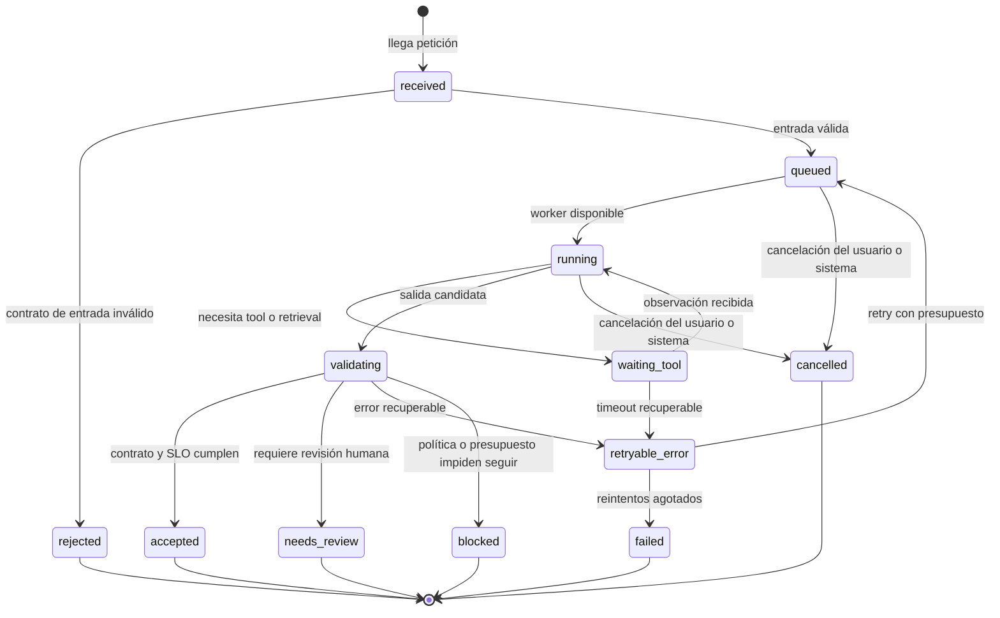
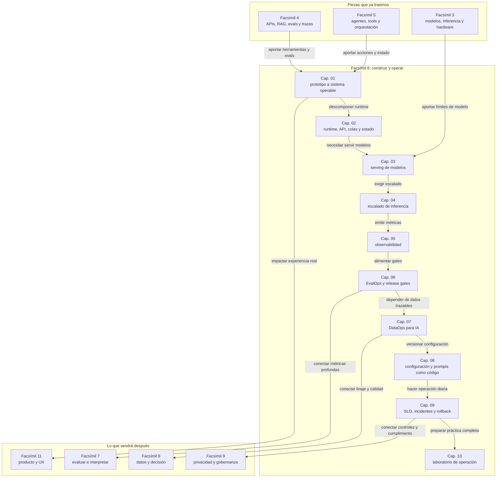

::: {.fasciculo-subtitle}
Facsímil 6 · Construir y operar
:::

# Capítulo 01: De prototipo a sistema operable

## Qué deberías poder hacer al terminar

En una asignatura de ingeniería, este capítulo no debería evaluarse preguntando “¿qué es LLMOps?”. Eso sería demasiado fácil y demasiado poco útil. Lo que importa es si puedes transformar una capacidad de IA en un sistema revisable.

Al terminar, deberías poder hacer estas cinco cosas:

| Resultado de aprendizaje | Evidencia de que lo sabes hacer |
|---|---|
| Distinguir demo, prototipo y sistema operable. | Explicas qué falta para pasar de una respuesta bonita a una capacidad mantenible. |
| Diseñar un manifest mínimo. | Nombras versiones de modelo, prompt, política, dataset, runtime y owner. |
| Modelar una run como máquina de estados. | Dices en qué estado está, qué transiciones son válidas y qué eventos la mueven. |
| Definir SLI, SLO y presupuesto de error. | Conviertes “que vaya bien” en números: calidad, latencia, coste y errores. |
| Escribir un release gate. | Bloqueas una versión que mejora una métrica pero rompe contrato, latencia, coste o rollback. |

Este encuadre cambia el tono del facsímil: no basta con entender los nombres. Hay que saber diseñar la evidencia.

## La pregunta que abre este facsímil

Hasta ahora hemos aprendido a reconocer piezas: modelos, APIs, RAG, embeddings, herramientas, agentes, memoria, permisos, trazas y evaluaciones. Eso ya es mucho. Pero todavía falta una pregunta incómoda: **¿qué hace que todo eso pueda vivir fuera de una demo?**

Una demo puede responder bien tres veces delante de una persona paciente. Un sistema operable debe responder muchas veces, con usuarios distintos, datos cambiantes, coste medido, versiones controladas, límites claros, trazas revisables y una forma de volver atrás si una mejora aparente empeora el conjunto.

Este facsímil va de ese salto. No vamos a tratar producción como “subir algo a un servidor”. La vamos a tratar como una disciplina: construir sistemas de IA que puedan observarse, evaluarse, mantenerse, auditarse y mejorar sin que cada cambio sea una apuesta.

## Qué no significa construir y operar

Construir y operar no significa envolver un prompt en una API y ponerle una URL bonita. Eso puede ser el primer envoltorio, pero no resuelve las preguntas importantes: qué versión contestó, qué contexto recibió, cuánto costó, qué ocurrió si falló, qué datos se guardaron, qué usuario quedó afectado y cómo sabemos si la versión nueva es mejor.

Tampoco significa montar una plataforma enorme desde el primer día. Un equipo pequeño puede operar bien con pocos artefactos: un manifest, un dataset de evaluación, trazas mínimas, configuración versionada, un gate de release y una decisión escrita. El problema no es empezar pequeño. El problema es empezar sin forma de medir ni revertir.

Y no significa que todo sea automático. Operar bien incluye decidir qué no debe automatizarse todavía, qué requiere revisión humana, qué se ejecuta en modo lectura, qué se prueba en sombra y qué se detiene cuando falta evidencia.

## Qué sí significa operar un sistema de IA

Un sistema de IA está operado cuando podemos responder preguntas técnicas sin reconstruir la historia a mano:

| Pregunta | Respuesta que debería existir |
|---|---|
| ¿Qué versión contestó? | Modelo, prompt, herramienta, política, dataset y código versionados. |
| ¿Qué vio el modelo? | Contexto, documentos recuperados, mensajes relevantes y filtros aplicados. |
| ¿Qué hizo el sistema? | Llamadas a modelo, tools, validadores, colas, gates y salidas. |
| ¿Cuánto costó? | Tokens, tiempo, llamadas externas, coste total y coste por tarea aceptada. |
| ¿Cómo falló? | Error clasificado, traza con spans, estado final y causa probable. |
| ¿Cómo se corrige? | Cambio propuesto, eval de regresión, canary, rollback y owner. |

Sculley y colaboradores llamaron la atención sobre una deuda técnica propia de los sistemas de aprendizaje automático: datos, configuraciones, dependencias y comportamiento pueden entrelazarse hasta hacer difícil entender qué cambió realmente.^[Sculley, D. et al. (2015). *Hidden Technical Debt in Machine Learning Systems*. Advances in Neural Information Processing Systems, 28. https://papers.nips.cc/paper_files/paper/2015/hash/86df7dcfd896fcaf2674f757a2463eba-Abstract.html. Consultado el 27 de mayo de 2026.] Amershi y su equipo mostraron que construir sistemas de ML exige prácticas específicas de ingeniería porque el comportamiento no depende solo del código: también depende de datos, experimentos, métricas, pipelines y evaluación continua.^[Amershi, S. et al. (2019). *Software Engineering for Machine Learning: A Case Study*. International Conference on Software Engineering: Software Engineering in Practice, 291-300. https://doi.org/10.1109/ICSE-SEIP.2019.00042. Consultado el 27 de mayo de 2026.]

En sistemas con LLMs añadimos otra capa: prompts, contexto, herramientas, proveedores, modelos cambiantes, costes por token, respuestas variables y decisiones de producto. Por eso necesitamos una forma de pensar más parecida a ingeniería de sistemas que a “probar prompts”.

## Requisitos antes de hablar de arquitectura

Una costumbre sana en ingeniería es no dibujar arquitectura antes de saber qué problema debe aguantar. En IA esto se olvida con facilidad porque el modelo produce algo visible muy pronto. Pero una respuesta visible no equivale a requisitos entendidos.

Para un sistema de IA, separaría los requisitos en tres grupos:

| Tipo de requisito | Pregunta | Ejemplo en un asistente de soporte |
|---|---|---|
| Funcional | ¿Qué debe hacer el sistema? | Responder dudas de matrícula con citas o abrir revisión si falta evidencia. |
| No funcional | ¿Con qué calidad operativa debe hacerlo? | p95 menor de 2,5 s, coste menor de 0,04 euros por respuesta aceptada, salida JSON válida. |
| De cambio | ¿Cómo se modifica sin perder control? | Prompt, modelo, retrieval y política versionados con eval previa y rollback probado. |

En software clásico solemos distinguir requisitos funcionales y no funcionales. En IA añadiría siempre los requisitos de cambio, porque el sistema vive de ajustes: cambia el prompt, cambia el modelo, cambia el corpus, cambia el proveedor, cambia la política de abstención y cambia la evaluación. Si no modelas el cambio, el sistema parece estable hasta que alguien pregunta qué versión produjo una respuesta concreta.

Un requisito bien escrito no dice “que responda bien”. Dice algo como:

> Para preguntas cubiertas por normativa vigente, el asistente debe devolver una respuesta con al menos una cita recuperable, schema válido, p95 menor de 2,5 s y coste por tarea aceptada menor de 0,04 euros. Si no hay evidencia suficiente, debe abstenerse y proponer siguiente paso.

Esta frase ya contiene producto, datos, calidad, latencia, coste, contrato y fallback. Es mucho más aburrida que una demo, y por eso mismo es más útil.

## La fórmula mínima de operación

**Ejemplo de fórmula.** Una forma simple de recordar el salto es esta:

$$
S_{op} = C_p + R_t + O_b + E_v + G_r + V_c
$$

| Símbolo | Significado | Ejemplo |
|---|---|---|
| \(S_{op}\) | Sistema operable. | Asistente interno que responde dudas de normativa con citas y control de coste. |
| \(C_p\) | Control plane. | Registro de modelo, prompt, flags, políticas y límites. |
| \(R_t\) | Runtime. | API, cola, llamada al modelo, tools, timeouts y reintentos. |
| \(O_b\) | Observabilidad. | Trazas, métricas, logs, coste y errores por ejecución. |
| \(E_v\) | Evaluación. | Dataset de regresión, métricas y revisión de casos difíciles. |
| \(G_r\) | Gates de release. | Reglas para pasar de local a sombra, canary y producción. |
| \(V_c\) | Versionado y cambio. | SemVer, manifest, rollback, owner y decisión escrita.^[Preston-Werner, T. (2026). *Semantic Versioning 2.0.0*. https://semver.org/. Consultado el 27 de mayo de 2026.] |

La fórmula no pretende medir físicamente el sistema. Sirve para algo más útil: comprobar qué pieza falta. Si tienes runtime sin observabilidad, no puedes depurar. Si tienes eval sin versionado, no puedes comparar. Si tienes control plane sin rollback, puedes cambiar rápido, pero no volver con calma.

**Ejemplo de fórmula.** También necesitamos una fórmula de decisión:

$$
release\_ok =
calidad\_ok \land latencia\_ok \land coste\_ok \land contrato\_ok \land rollback\_ok
$$

| Término | Qué comprueba | Ejemplo |
|---|---|---|
| \(calidad\_ok\) | La salida cumple la rúbrica o métrica mínima. | Al menos 44 de 50 casos pasan la eval privada. |
| \(latencia\_ok\) | La respuesta cabe en el tiempo acordado. | p95 menor o igual a 2,5 segundos. |
| \(coste\_ok\) | El coste por tarea aceptada está dentro del presupuesto. | Menos de 0,04 euros por caso válido. |
| \(contrato\_ok\) | La salida respeta schema, citas, permisos y abstención. | JSON válido con fuente verificable o respuesta de no evidencia. |
| \(rollback\_ok\) | Existe forma probada de volver a la versión anterior. | Feature flag que restaura `prompt_v12` y `model_a`. |

Esta segunda fórmula sí debe convertirse en código, aunque el código empiece siendo pequeño.

## SLI, SLO y presupuesto de error

Estas tres siglas vienen del mundo de la fiabilidad de servicios. Conviene traducirlas despacio porque, si solo damos el acrónimo, parecen burocracia. En realidad son una forma muy práctica de convertir “que vaya bien” en números que el equipo pueda discutir.

| Sigla | Nombre completo | Traducción útil | Pregunta que responde |
|---|---|---|---|
| SLI | *Service Level Indicator* | Indicador de nivel de servicio. | ¿Qué estamos midiendo realmente? |
| SLO | *Service Level Objective* | Objetivo de nivel de servicio. | ¿Qué valor consideramos aceptable? |
| Presupuesto de error | *Error budget* | Margen de fallo permitido. | ¿Cuánto podemos fallar antes de frenar cambios? |

El orden importa:

1. Primero defines el **SLI**, porque sin indicador no sabes qué medir.
2. Después defines el **SLO**, porque necesitas decidir qué valor mínimo aceptas.
3. Por último calculas el **presupuesto de error**, porque quieres saber cuánto margen tienes antes de investigar, pausar cambios o volver a una versión anterior.

Un SLO no es una frase de marketing. Es un objetivo interno medible. Para escribirlo necesitamos primero un SLI, que es el indicador que medimos.

Ejemplo en lenguaje llano:

| Concepto | Versión humana | Versión medible |
|---|---|---|
| SLI | “De todas las runs, ¿cuántas salen aceptables?” | `runs_aceptadas / runs_totales` |
| SLO | “Queremos que casi todas salgan aceptables.” | `SLI_calidad >= 0.97` |
| Presupuesto de error | “Aceptamos un margen pequeño antes de parar.” | `1 - 0.97 = 0.03` |

Por ejemplo:

$$
SLI_{calidad} = \frac{runs\_aceptadas}{runs\_totales}
$$

| Símbolo | Significado | Ejemplo |
|---|---|---|
| \(SLI_{calidad}\) | Proporción de ejecuciones aceptadas. | 9.650 de 10.000 runs pasan calidad y contrato. |
| \(runs\_aceptadas\) | Runs que cumplen rúbrica, contrato y límites. | 9.650 |
| \(runs\_totales\) | Runs evaluadas en una ventana temporal. | 10.000 |

Si el SLO de calidad es 97%, entonces:

$$
presupuesto\_de\_error = 1 - SLO
$$

| Término | Significado | Ejemplo |
|---|---|---|
| \(SLO\) | Objetivo que prometemos internamente. | 0,97 |
| \(1 - SLO\) | Margen de error tolerado. | 0,03 |
| Presupuesto en 10.000 runs | Runs que pueden fallar antes de parar cambios. | 300 |

Esto no significa que 300 fallos “den igual”. Significa que el equipo decide de antemano cuánto margen tiene antes de congelar cambios, investigar o volver a una versión anterior. Sin presupuesto de error, cada fallo parece una anécdota o una crisis. Con presupuesto de error, las conversaciones se vuelven operativas.

En una ventana de 10.000 runs, el cálculo sería:

| Paso | Cálculo | Resultado |
|---|---:|---:|
| Objetivo | \(SLO = 0,97\) | 97% de runs aceptables |
| Margen | \(1 - 0,97\) | 0,03 |
| Presupuesto | \(10.000 \times 0,03\) | 300 runs no aceptadas |

Ese presupuesto se gasta. Si en dos días ya llevas 250 runs no aceptadas, quizá no conviene desplegar un prompt nuevo aunque la demo parezca mejor. Si en toda la semana llevas 20, tienes más margen para experimentar. Esa es la gracia: el presupuesto de error conecta calidad, operación y velocidad de cambio.

Para sistemas de IA suelo definir varios SLI a la vez:

| SLI | Fórmula o medición | Qué captura |
|---|---|---|
| Calidad aceptada | `runs_aceptadas / runs_totales` | Si la salida cumple rúbrica, contrato y evidencia. |
| Latencia p95 | Percentil 95 de duración total. | Si la cola de usuarios reales espera demasiado. |
| Coste por tarea aceptada | `coste_total / runs_aceptadas` | Si el sistema es sostenible, incluyendo reintentos. |
| Abstención correcta | `abstenciones_correctas / casos_sin_evidencia` | Si el sistema sabe no responder cuando falta base. |
| Error de contrato | `salidas_invalidas / runs_totales` | Si el JSON, las citas o el formato rompen integraciones. |

El punto docente es importante: una eval offline mide comportamiento con casos preparados; un SLO mide operación en una ventana concreta. Los dos se necesitan. La eval evita publicar una mala versión. El SLO detecta que el mundo cambió después.

## Fecha de corte y alcance

**Fecha de corte:** 27 de mayo de 2026.  
**Fuentes consultadas en este facsímil hasta este punto:** prácticas de ingeniería de ML, TFX, OpenTelemetry, W3C Trace Context, Harness Engineering, AGENTS.md, vocabulario normativo de RFC 2119/RFC 8174 y versionado semántico.

Lo estable es el método: versionar artefactos, ejecutar evals, observar runs, controlar coste, diseñar límites, introducir cambios gradualmente y preparar rollback. Lo cambiante son productos concretos, nombres de runtimes, modelos, precios, dashboards y SDKs.

Baylor y colaboradores describieron TFX como una plataforma de producción donde no basta entrenar: hay que validar datos, validar modelos, servirlos y monitorizarlos dentro de un pipeline.^[Baylor, D. et al. (2017). *TFX: A TensorFlow-Based Production-Scale Machine Learning Platform*. Proceedings of the 23rd ACM SIGKDD International Conference on Knowledge Discovery and Data Mining, 1387-1395. https://doi.org/10.1145/3097983.3098021. Consultado el 27 de mayo de 2026.] Esa idea se mantiene aunque trabajemos con LLMs y no con un clasificador clásico: la capacidad del modelo es solo una pieza de un sistema mayor.

## El contrato operativo de una run

Aquí “contrato” no significa contrato legal. Significa **acuerdo técnico explícito**: qué entra, qué sale, qué estados existen, qué errores son posibles y qué garantías mínimas ofrece el sistema. Es la diferencia entre “esto suele responder así” y “esto debe cumplir estas condiciones para considerarse válido”.

Un contrato en software funciona como una promesa verificable entre partes:

| Parte | Qué promete | Qué puede comprobarse |
|---|---|---|
| Quien llama | Enviar datos con una forma válida. | Campos obligatorios, tipos, tamaño y permisos. |
| El sistema | Procesar bajo reglas conocidas. | Estado, límites, trazas, presupuesto y errores tipados. |
| Quien consume la salida | Recibir algo estable. | Schema de respuesta, campos esperados y significado de cada estado. |

Ejemplo sencillo: si una API promete devolver siempre `answer`, `sources`, `confidence` y `needs_review`, eso es parte del contrato. Si a veces devuelve texto libre, a veces JSON y a veces un campo llamado `respuesta`, no hay contrato estable; hay una costumbre frágil.

En una run de IA el contrato es todavía más importante porque el modelo puede generar salidas variables. El contrato no elimina toda incertidumbre, pero pone una frontera: si la salida no cumple estructura, citas, límites o política, no se entrega como resultado válido.

Llamaremos *run* a una ejecución completa: llega una petición, el sistema decide ruta, llama modelos o herramientas, valida salida y termina con respuesta, abstención, error recuperable o revisión humana.

Para que una run sea operable, no basta con guardar el texto final. Debe dejar un contrato mínimo:

| Campo | Qué guarda | Por qué importa |
|---|---|---|
| `run_id` | Identificador único de la ejecución. | Permite buscar la historia completa. |
| `trace_id` | Identificador de traza que viaja entre servicios. | Une API, cola, modelo, tool y validadores. |
| `provider_request_id` | Identificador devuelto por el proveedor, si existe. | Permite cruzar tu traza con soporte o dashboard externo. |
| `input_hash` | Huella de la entrada, no necesariamente el texto completo. | Permite deduplicar sin exponer datos de más. |
| `model_version` | Modelo o proveedor usado. | Explica diferencias de comportamiento. |
| `prompt_version` | Plantilla e instrucciones usadas. | Permite rollback de prompts. |
| `context_manifest` | Documentos, memoria o retrieval inyectado. | Explica qué evidencia vio el modelo. |
| `policy_version` | Reglas de permisos, abstención y límites. | Evita decisiones invisibles. |
| `budget` | Tokens, coste, pasos, tiempo y reintentos permitidos. | Evita que una tarea pequeña se coma el sistema. |
| `output_contract` | Schema, citas, formato y validadores. | Hace comprobable la salida. |
| `decision` | `accepted`, `needs_review`, `retryable_error` o `blocked`. | Convierte texto en estado operativo. |

OpenTelemetry define trazas como conjuntos de spans que representan unidades de trabajo, y su API permite crear spans, añadir atributos y propagar contexto.^[OpenTelemetry. (2026). *Tracing API*. https://opentelemetry.io/docs/specs/otel/trace/api/. Consultado el 27 de mayo de 2026.] W3C Trace Context estandariza cómo llevar identificadores de traza entre servicios mediante cabeceras como `traceparent`.^[World Wide Web Consortium. (2021). *Trace Context Level 2*. https://www.w3.org/TR/trace-context-2/. Consultado el 27 de mayo de 2026.] En castellano llano: si una petición atraviesa tres servicios, no quieres tres historias separadas. Quieres una sola historia con capítulos.

## La run como máquina de estados

Si una run no tiene estados explícitos, acaba teniendo estados implícitos escondidos en logs, excepciones, mensajes de cola y flags sueltos. Eso dificulta depurar y enseñar el sistema. Para ingeniería, una run debe poder dibujarse.



La tabla de transiciones obliga a hablar con precisión:

| Estado | Qué significa | Evento que lo mueve | Dato que debería quedar |
|---|---|---|---|
| `received` | La API recibió una petición. | Validación de entrada. | `run_id`, `input_hash`, usuario o tenant. |
| `queued` | La tarea espera ejecución. | Worker disponible o cancelación. | Tiempo en cola y prioridad. |
| `running` | El sistema está decidiendo o generando. | Tool, salida candidata o error. | Modelo, prompt, presupuesto consumido. |
| `waiting_tool` | Hay una dependencia externa pendiente. | Respuesta, timeout o error recuperable. | Tool, argumentos, timeout, intento. |
| `validating` | Hay salida candidata pendiente de contrato. | Validación pasa, falla o exige revisión. | Schema, citas, coste, latencia, rúbrica. |
| `accepted` | La salida puede entregarse. | Fin. | Output, versión, métricas finales. |
| `needs_review` | Una persona debe revisar. | Fin de la parte automática. | Motivo y datos mínimos para revisar. |
| `retryable_error` | Puede intentarse otra vez con cuidado. | Retry o fallo definitivo. | Tipo de error, contador, espera. |
| `blocked` | No debe continuar por política o presupuesto. | Fin. | Regla que bloqueó y siguiente paso. |

El detalle clave es que cada transición tiene causa. No basta con saber que terminó mal; queremos saber si terminó mal por entrada inválida, timeout, presupuesto agotado, contrato roto, falta de evidencia o revisión pendiente.

## Taxonomía de fallos que sí ayuda a depurar

Cuando todo se llama “fallo del modelo”, nadie aprende. Una taxonomía útil separa dónde se rompió el sistema:

| Tipo de fallo | Síntoma visible | Causa probable | Primera pregunta de depuración |
|---|---|---|---|
| Entrada inválida | La API rechaza antes de llamar al modelo. | Falta campo, tipo incorrecto o tamaño excesivo. | ¿El contrato de entrada está documentado y validado? |
| Retrieval insuficiente | Respuesta se abstiene o cita poco. | No hay documentos, chunking malo o filtro demasiado estrecho. | ¿El documento esperado aparece en top-k? |
| Contexto contaminado | La respuesta mezcla asuntos no relevantes. | Se inyectó demasiado contexto o memoria imprecisa. | ¿Qué fragmentos vio exactamente el modelo? |
| Salida fuera de contrato | JSON inválido, campos extra o cita ausente. | Schema débil, prompt ambiguo o postproceso incompleto. | ¿El validador bloquea antes de entregar? |
| Latencia excesiva | p95 o p99 se disparan. | Cola, proveedor lento, contexto largo o tool pesada. | ¿Dónde está el span más largo? |
| Coste excesivo | Buena calidad pero factura alta. | Reintentos, modelo caro, top-k alto o salida larga. | ¿Cuál es el coste por tarea aceptada? |
| Estado incoherente | La traza dice una cosa y la base de datos otra. | Escrituras parciales o falta de idempotencia. | ¿Qué se guarda antes y después de cada efecto? |
| Cambio no trazable | No sabemos qué versión falló. | Modelo, prompt o política sin manifest. | ¿Existe manifest por run? |

Esta tabla es una herramienta docente. Obliga a dejar de hablar de “la IA falla” y empezar a localizar subsistemas: entrada, retrieval, contexto, modelo, contrato, runtime, estado, coste o cambio.

## Dónde mirar si el error viene del proveedor

Cuando el sistema usa OpenAI, Anthropic, Gemini, Bedrock u otro proveedor, el primer impulso suele ser abrir la página de estado y esperar una respuesta tranquilizadora. Está bien mirarla, pero no basta. Una página de estado te dice si hay un problema visible a nivel de servicio; tu traza te dice si **tu** petición falló por entrada inválida, cuota, permisos, timeout, límite de tamaño, modelo no disponible, región, credenciales o contrato de salida.

**Ejemplo de fórmula.** La regla práctica es esta:

$$
diagnostico = traza\_local + error\_proveedor + dashboard\_proveedor + estado\_servicio
$$

| Pieza | Qué aporta | Qué no aporta |
|---|---|---|
| Traza local | Qué ruta tomó tu sistema, qué prompt/modelo/contexto usó y cuánto tardó. | No demuestra por sí sola que el proveedor tenga una incidencia general. |
| Error del proveedor | Código HTTP, tipo de error, mensaje y límites aplicados. | No explica tu lógica de negocio ni tus validadores. |
| Dashboard del proveedor | Uso, facturación, límites, proyecto, claves o cuota según plataforma. | No sustituye tus logs ni tus evals. |
| Estado del servicio | Incidencias o mantenimiento publicados. | Puede ser agregado, tardar en reflejar casos concretos o no distinguir tu modelo exacto. |

La tabla operativa sería esta:

| Si usas... | Guarda siempre en tu traza | Dónde mirar en el proveedor | Cómo interpretarlo |
|---|---|---|---|
| OpenAI API | `x-request-id`, `X-Client-Request-Id` si lo envías, modelo, endpoint, HTTP status, `x-ratelimit-*`, `openai-processing-ms`, tokens y timestamp UTC. | [Error codes](https://developers.openai.com/api/docs/guides/error-codes), [API reference: debugging requests](https://developers.openai.com/api/reference/overview#debugging-requests), [API Dashboard](https://platform.openai.com/) y [status.openai.com](https://status.openai.com/). | Si ves 400, revisa payload y schema. Si ves 401/403, credenciales, organización, proyecto o permisos. Si ves 429, mira límites y ritmo. Si ves 5xx, reintenta con backoff y cruza con estado del servicio. OpenAI recomienda registrar request IDs para depuración.^[OpenAI. (2026). *API reference: debugging requests*. https://developers.openai.com/api/reference/overview#debugging-requests. Consultado el 27 de mayo de 2026.] |
| Anthropic / Claude API | `request-id`, `request_id` del cuerpo si aparece, `error.type`, `error.message`, modelo, `anthropic-version`, status, tokens y timestamp UTC. | [Claude API errors](https://platform.claude.com/docs/en/api/errors), [Claude Console](https://console.anthropic.com/) y [status.claude.com](https://status.claude.com/). | `invalid_request_error` apunta a formato o contenido; `authentication_error` a clave; `permission_error` a permisos; `request_too_large` a tamaño; `rate_limit_error` a límite; `timeout_error`, `api_error` u `overloaded_error` suelen exigir retry controlado y consulta de estado. Anthropic documenta que cada respuesta incluye un identificador de petición útil para soporte.^[Anthropic. (2026). *Errors*. https://platform.claude.com/docs/en/api/errors. Consultado el 27 de mayo de 2026.] |
| Gemini API | HTTP code, `status` como `INVALID_ARGUMENT`, `RESOURCE_EXHAUSTED` o `UNAVAILABLE`, mensaje, modelo, proyecto, región si aplica, cuota y timestamp UTC. | [Gemini API troubleshooting](https://ai.google.dev/gemini-api/docs/troubleshooting), [AI Studio status](https://aistudio.google.com/status) y consola del proyecto si usas Google Cloud. | `INVALID_ARGUMENT` suele ser petición mal formada; `RESOURCE_EXHAUSTED` suele apuntar a cuota o ritmo; `UNAVAILABLE` o 5xx requieren retry y comprobación de estado. La guía oficial separa problemas del backend de la API y de los SDKs cliente.^[Google. (2026). *Gemini API troubleshooting guide*. https://ai.google.dev/gemini-api/docs/troubleshooting. Consultado el 27 de mayo de 2026.] |
| Amazon Bedrock | `x-amzn-requestid`, región, `modelId`, `InvokeModel` o endpoint usado, excepción AWS, status HTTP, cuenta/rol y timestamp UTC. | [Bedrock API error troubleshooting](https://docs.aws.amazon.com/bedrock/latest/userguide/troubleshooting-api-error-codes.html), CloudWatch/CloudTrail si lo tienes activado y [AWS Health Dashboard](https://health.aws.amazon.com/health/status). | `AccessDeniedException` apunta a IAM; `ValidationException` a entrada; `ThrottlingException` o `ServiceQuotaExceededException` a cuota; `ModelTimeoutException` a tiempo de proceso; `ServiceUnavailableException` a disponibilidad. En Bedrock, la región y los permisos importan tanto como el modelo.^[Amazon Web Services. (2026). *Troubleshooting Amazon Bedrock API Error Codes*. https://docs.aws.amazon.com/bedrock/latest/userguide/troubleshooting-api-error-codes.html. Consultado el 27 de mayo de 2026.] |
| Proveedor agregado o router propio | ID interno, proveedor final, modelo final, ruta elegida, error original si se conserva, retry, fallback y coste. | Dashboard del agregador, página de estado del proveedor final y tus trazas. | Si el router oculta el error original, estás ciego. Exige conservar `upstream_provider`, `upstream_model`, `upstream_status` y `upstream_request_id` cuando exista. |
| Modelo local con Ollama, vLLM, SGLang o similar | ID de run, modelo exacto, quant, tamaño de contexto, uso de KV cache, GPU/CPU, cola, memoria y logs del runtime. | Logs del proceso, métricas del servidor, dashboard propio y pruebas sintéticas. | Aquí no hay “estado del proveedor” que te salve. Si falla, mira memoria, colas, timeouts, modelo cargado, formato de pesos y presión de concurrencia. |

OpenAI documenta códigos de error como autenticación, permisos, límites, cuota y errores internos, y recomienda consultar la página de estado si aparece un error interno persistente.^[OpenAI. (2026). *Error codes*. https://developers.openai.com/api/docs/guides/error-codes. Consultado el 27 de mayo de 2026.] Su página de estado separa componentes como APIs y muestra disponibilidad agregada, con la advertencia de que la disponibilidad de un cliente concreto puede variar por tier, modelo y funcionalidad.^[OpenAI. (2026). *OpenAI Status*. https://status.openai.com/. Consultado el 27 de mayo de 2026.] Claude mantiene una página de estado separada por componentes como Claude API, Console y Claude Code.^[Anthropic. (2026). *Claude Status*. https://status.claude.com/. Consultado el 27 de mayo de 2026.] AWS documenta que el AWS Health Dashboard permite revisar el estado de servicios de AWS desde una página pública de salud.^[Amazon Web Services. (2026). *AWS Health Dashboard: Service health*. https://docs.aws.amazon.com/health/latest/ug/aws-health-dashboard-status.html. Consultado el 27 de mayo de 2026.]

Lo que yo exigiría a cualquier equipo es un pequeño “paquete de depuración” por error:

```text
run_id: run_20260527_00142
trace_id: 4bf92f3577b34da6a3ce929d0e0e4736
provider: openai
provider_request_id: req_...
model: modelo_fijado_por_manifest
endpoint: /responses
http_status: 429
provider_error_type: rate_limit
timestamp_utc: 2026-05-27T14:12:08Z
latency_ms: 1830
tokens_in: 1840
tokens_out: 0
retry_count: 2
decision: retryable_error
payload_hash: sha256:...
```

Y una regla de higiene: al pedir ayuda al proveedor, comparte IDs, timestamps, modelo, endpoint, código de error y cabeceras relevantes. No pegues datos sensibles ni prompts completos si no hace falta. Tu sistema debe poder reproducir el contexto técnico sin exponer más información de la necesaria.

## Anatomía visual de un sistema operable

<svg id="f6-c01-sistema-operable" xmlns="http://www.w3.org/2000/svg" viewBox="0 0 1900 1360" role="img" aria-label="Arquitectura de un sistema de IA operable desde control plane hasta observabilidad y rollback">
  <defs>
    <marker id="f6c01-arrow" markerWidth="10" markerHeight="10" refX="8" refY="3" orient="auto" markerUnits="strokeWidth">
      <path d="M0,0 L0,6 L9,3 z" fill="#111111"/>
    </marker>
    <marker id="f6c01-arrow-soft" markerWidth="10" markerHeight="10" refX="8" refY="3" orient="auto" markerUnits="strokeWidth">
      <path d="M0,0 L0,6 L9,3 z" fill="#555555"/>
    </marker>
    <style>
      #f6-c01-sistema-operable text { font-family: Arial, sans-serif; }
      #f6-c01-sistema-operable .frame { fill:#FFFFFF; stroke:#111111; stroke-width:2; }
      #f6-c01-sistema-operable .lane { fill:#FAFAFA; stroke:#111111; stroke-width:1.2; }
      #f6-c01-sistema-operable .panel { fill:#FFFFFF; stroke:#111111; stroke-width:1.6; }
      #f6-c01-sistema-operable .soft { fill:#F3F3F3; stroke:#111111; stroke-width:1.2; }
      #f6-c01-sistema-operable .dark { fill:#111111; stroke:#111111; stroke-width:1.2; }
      #f6-c01-sistema-operable .line { fill:none; stroke:#111111; stroke-width:1.8; marker-end:url(#f6c01-arrow); }
      #f6-c01-sistema-operable .thin { fill:none; stroke:#222222; stroke-width:1.2; marker-end:url(#f6c01-arrow); }
      #f6-c01-sistema-operable .dash { fill:none; stroke:#666666; stroke-width:1.2; stroke-dasharray:8 7; marker-end:url(#f6c01-arrow-soft); }
      #f6-c01-sistema-operable .title { font-size:31px; font-weight:700; fill:#111111; }
      #f6-c01-sistema-operable .subtitle { font-size:13px; fill:#555555; }
      #f6-c01-sistema-operable .laneTitle { font-size:13px; font-weight:700; fill:#111111; letter-spacing:.3px; }
      #f6-c01-sistema-operable .h { font-size:16px; font-weight:700; fill:#111111; }
      #f6-c01-sistema-operable .body { font-size:13px; fill:#222222; }
      #f6-c01-sistema-operable .tiny { font-size:11px; fill:#666666; }
      #f6-c01-sistema-operable .code { font-size:12px; fill:#222222; font-family: SFMono-Regular, Consolas, monospace; }
      #f6-c01-sistema-operable .white { font-size:13px; font-weight:700; fill:#FFFFFF; }
      #f6-c01-sistema-operable .whiteTiny { font-size:11px; fill:#FFFFFF; }
    </style>
  </defs>

  <rect x="24" y="24" width="1852" height="1312" rx="18" class="frame"/>
  <text x="950" y="70" text-anchor="middle" class="title">De prototipo a sistema operable</text>
  <text x="950" y="96" text-anchor="middle" class="subtitle">La respuesta del modelo es solo una salida: operación significa controlar entrada, versiones, runtime, evaluación, observabilidad y cambio.</text>

  <rect x="70" y="135" width="1760" height="170" rx="16" class="lane"/>
  <text x="95" y="165" class="laneTitle">CONTROL PLANE: LO QUE PUEDE CAMBIAR SIN TOCAR EL RUNTIME</text>
  <rect x="100" y="190" width="230" height="78" rx="12" class="panel"/>
  <text x="215" y="221" text-anchor="middle" class="h">Modelo</text>
  <text x="215" y="245" text-anchor="middle" class="tiny">proveedor · versión · contexto</text>
  <rect x="365" y="190" width="230" height="78" rx="12" class="panel"/>
  <text x="480" y="221" text-anchor="middle" class="h">Prompt</text>
  <text x="480" y="245" text-anchor="middle" class="tiny">template · ejemplos · reglas</text>
  <rect x="630" y="190" width="230" height="78" rx="12" class="panel"/>
  <text x="745" y="221" text-anchor="middle" class="h">Política</text>
  <text x="745" y="245" text-anchor="middle" class="tiny">permisos · abstención · límites</text>
  <rect x="895" y="190" width="230" height="78" rx="12" class="panel"/>
  <text x="1010" y="221" text-anchor="middle" class="h">Dataset eval</text>
  <text x="1010" y="245" text-anchor="middle" class="tiny">casos · rúbrica · slices</text>
  <rect x="1160" y="190" width="230" height="78" rx="12" class="panel"/>
  <text x="1275" y="221" text-anchor="middle" class="h">Flags</text>
  <text x="1275" y="245" text-anchor="middle" class="tiny">canary · fallback · rollout</text>
  <rect x="1425" y="190" width="230" height="78" rx="12" class="panel"/>
  <text x="1540" y="221" text-anchor="middle" class="h">Manifest</text>
  <text x="1540" y="245" text-anchor="middle" class="tiny">hashes · owner · fecha</text>

  <rect x="70" y="355" width="1760" height="445" rx="16" class="lane"/>
  <text x="95" y="385" class="laneTitle">RUNTIME: CÓMO SE EJECUTA UNA PETICIÓN REAL</text>

  <rect x="100" y="430" width="210" height="112" rx="14" class="dark"/>
  <text x="205" y="466" text-anchor="middle" class="white">Entrada</text>
  <text x="205" y="492" text-anchor="middle" class="whiteTiny">usuario · API · job</text>
  <text x="205" y="517" text-anchor="middle" class="whiteTiny">idempotency_key</text>

  <rect x="365" y="430" width="210" height="112" rx="14" class="panel"/>
  <text x="470" y="462" text-anchor="middle" class="h">Router</text>
  <text x="470" y="488" text-anchor="middle" class="tiny">clasifica tarea</text>
  <text x="470" y="512" text-anchor="middle" class="tiny">elige ruta y budget</text>

  <rect x="630" y="405" width="250" height="165" rx="14" class="panel"/>
  <text x="755" y="438" text-anchor="middle" class="h">Cola y estado</text>
  <text x="755" y="466" text-anchor="middle" class="tiny">RUNNING · WAITING</text>
  <text x="755" y="488" text-anchor="middle" class="tiny">RETRYABLE · DONE</text>
  <line x1="675" y1="515" x2="835" y2="515" stroke="#111111" stroke-width="1"/>
  <text x="755" y="542" text-anchor="middle" class="code">run_state.json</text>

  <rect x="935" y="430" width="210" height="112" rx="14" class="panel"/>
  <text x="1040" y="462" text-anchor="middle" class="h">Orquestador</text>
  <text x="1040" y="488" text-anchor="middle" class="tiny">modelo · RAG · tool</text>
  <text x="1040" y="512" text-anchor="middle" class="tiny">reintentos · timeout</text>

  <rect x="1200" y="405" width="250" height="165" rx="14" class="panel"/>
  <text x="1325" y="438" text-anchor="middle" class="h">Validadores</text>
  <text x="1325" y="466" text-anchor="middle" class="tiny">schema · citas · policy</text>
  <text x="1325" y="488" text-anchor="middle" class="tiny">coste · latencia · salida</text>
  <line x1="1245" y1="515" x2="1405" y2="515" stroke="#111111" stroke-width="1"/>
  <text x="1325" y="542" text-anchor="middle" class="code">contract_ok?</text>

  <rect x="1505" y="430" width="210" height="112" rx="14" class="dark"/>
  <text x="1610" y="466" text-anchor="middle" class="white">Decisión</text>
  <text x="1610" y="492" text-anchor="middle" class="whiteTiny">aceptar · revisar</text>
  <text x="1610" y="517" text-anchor="middle" class="whiteTiny">reintentar · bloquear</text>

  <path d="M310 486 L365 486" class="line"/>
  <path d="M575 486 L630 486" class="line"/>
  <path d="M880 486 L935 486" class="line"/>
  <path d="M1145 486 L1200 486" class="line"/>
  <path d="M1450 486 L1505 486" class="line"/>

  <rect x="365" y="635" width="455" height="105" rx="14" class="soft"/>
  <text x="592" y="666" text-anchor="middle" class="h">Dependencias externas</text>
  <text x="592" y="693" text-anchor="middle" class="tiny">proveedor LLM · vector DB · base de datos · storage · servicios internos</text>
  <text x="592" y="718" text-anchor="middle" class="tiny">cada llamada debe tener timeout, error tipado y presupuesto</text>

  <rect x="975" y="635" width="455" height="105" rx="14" class="soft"/>
  <text x="1202" y="666" text-anchor="middle" class="h">Salida contractual</text>
  <text x="1202" y="693" text-anchor="middle" class="tiny">JSON, cita, texto, diff, ticket, informe o abstención</text>
  <text x="1202" y="718" text-anchor="middle" class="tiny">lo que se entrega debe ser verificable por otro sistema</text>

  <path d="M1040 542 C1040 610 790 600 735 635" class="dash"/>
  <path d="M1325 570 C1325 610 1240 612 1202 635" class="dash"/>

  <rect x="70" y="850" width="1760" height="255" rx="16" class="lane"/>
  <text x="95" y="880" class="laneTitle">OBSERVABILIDAD Y EVALOPS: CÓMO SABEMOS QUÉ PASÓ Y SI MEJORA</text>

  <rect x="105" y="930" width="260" height="112" rx="14" class="panel"/>
  <text x="235" y="964" text-anchor="middle" class="h">Trace</text>
  <text x="235" y="990" text-anchor="middle" class="tiny">trace_id · spans · eventos</text>
  <text x="235" y="1014" text-anchor="middle" class="tiny">modelo, tool, validador</text>

  <rect x="410" y="930" width="260" height="112" rx="14" class="panel"/>
  <text x="540" y="964" text-anchor="middle" class="h">Métricas</text>
  <text x="540" y="990" text-anchor="middle" class="tiny">p95 · errores · tokens</text>
  <text x="540" y="1014" text-anchor="middle" class="tiny">coste por tarea aceptada</text>

  <rect x="715" y="930" width="260" height="112" rx="14" class="panel"/>
  <text x="845" y="964" text-anchor="middle" class="h">Evals</text>
  <text x="845" y="990" text-anchor="middle" class="tiny">offline · sombra · canary</text>
  <text x="845" y="1014" text-anchor="middle" class="tiny">slices y regresiones</text>

  <rect x="1020" y="930" width="260" height="112" rx="14" class="panel"/>
  <text x="1150" y="964" text-anchor="middle" class="h">Release gate</text>
  <text x="1150" y="990" text-anchor="middle" class="tiny">calidad · latencia · coste</text>
  <text x="1150" y="1014" text-anchor="middle" class="tiny">contrato · rollback</text>

  <rect x="1325" y="930" width="260" height="112" rx="14" class="panel"/>
  <text x="1455" y="964" text-anchor="middle" class="h">Decisión escrita</text>
  <text x="1455" y="990" text-anchor="middle" class="tiny">promover · pausar</text>
  <text x="1455" y="1014" text-anchor="middle" class="tiny">volver · simplificar</text>

  <path d="M365 986 L410 986" class="thin"/>
  <path d="M670 986 L715 986" class="thin"/>
  <path d="M975 986 L1020 986" class="thin"/>
  <path d="M1280 986 L1325 986" class="thin"/>
  <path d="M1610 542 C1700 700 1690 930 1585 986" class="dash"/>
  <path d="M1455 930 C1470 760 1470 370 1275 268" class="dash"/>

  <rect x="70" y="1160" width="1760" height="118" rx="16" class="lane"/>
  <text x="95" y="1190" class="laneTitle">REGLA DEL FASCÍCULO</text>
  <text x="120" y="1230" class="body">No publiques una capacidad de IA si no puedes decir qué versión respondió, qué contexto vio, qué contrato debía cumplir, cuánto costó, cómo se midió y cómo volverías a una versión anterior.</text>
  <text x="1710" y="1262" text-anchor="end" class="micro" fill="#888888" opacity="0.45">IA para gente curiosa / Facsímil 06 / Capítulo 01 / 686f6c61</text>
</svg>

Este diagrama tiene una intención: separar piezas que suelen mezclarse. El control plane decide qué configuración existe. El runtime ejecuta una petición. La observabilidad permite reconstruirla. EvalOps decide si un cambio merece avanzar. Rollback evita que una versión mala se convierta en una semana de improvisación.

## Cómo se ve en un proyecto real

Imagina un asistente interno para soporte universitario. Responde preguntas sobre matrícula, plazos, convalidaciones y documentación. En el facsímil 4 podríamos haberlo montado como RAG: buscar documentos, generar respuesta con citas y abstenerse si no hay evidencia. En el facsímil 5 podríamos haber añadido una tool para abrir un ticket o pedir revisión. Aquí preguntamos otra cosa: **¿cómo se opera cada lunes?**

El equipo necesita decidir:

| Decisión | Pregunta concreta | Mala señal | Buena señal |
|---|---|---|---|
| Versión | ¿Qué cambió hoy? | “Hemos tocado el prompt un poco”. | `prompt:v1.8.2`, `retriever:v3`, `policy:v4`. |
| Calidad | ¿Qué casos cubre la eval? | Solo preguntas fáciles. | Casos frecuentes, ambiguos, sin evidencia y con documentos contradictorios. |
| Latencia | ¿Qué espera el usuario? | Media rápida, p99 invisible. | p50, p95, p99 y tasa de timeout por ruta. |
| Coste | ¿Cuánto cuesta resolver una tarea válida? | Precio por token sin reintentos. | Coste por respuesta aceptada, incluyendo retrieval, tools y revisión. |
| Fallback | ¿Qué pasa si no hay evidencia? | Inventar una respuesta amable. | Abstención con siguiente paso y trazabilidad. |
| Cambio | ¿Cómo se despliega? | Todo el tráfico al nuevo prompt. | Sombra, canary, gate, owner y rollback. |

El patrón se repite en banca, salud, educación, SaaS, soporte, legal, programación o administración pública: operar IA es convertir capacidad variable en comportamiento medible.

## Pipeline CI/CD para sistemas de IA

En software clásico, CI/CD suele significar tests, build y despliegue. En IA añadimos artefactos que también cambian comportamiento: prompt, modelo, política, dataset, retrieval, tool schema y configuración de runtime.

El pipeline mínimo que pediría en clase sería este:

```mermaid
flowchart LR
    PR["Cambio propuesto<br/>prompt, modelo, policy, retrieval o tool"]
    STATIC["Checks estáticos<br/>schema, formato, referencias, secretos"]
    OFFLINE["Eval offline<br/>dataset fijo y slices"]
    SHADOW["Shadow run<br/>tráfico copiado sin afectar usuario"]
    CANARY["Canary<br/>porcentaje pequeño"]
    GATE["Release gate<br/>calidad, p95, coste, contrato, rollback"]
    PROD["Promote<br/>subir tráfico"]
    ROLLBACK["Rollback<br/>volver por flag"]

    PR --> STATIC
    STATIC --> OFFLINE
    OFFLINE --> SHADOW
    SHADOW --> CANARY
    CANARY --> GATE
    GATE -->|"pasa"| PROD
    GATE -->|"no pasa"| ROLLBACK
    PROD -->|"SLO se degrada"| ROLLBACK
```



Lo importante no es que todos los equipos tengan esta cadena completa el primer día. Lo importante es saber qué parte falta. Si no hay eval offline, el canary se convierte en experimento con usuarios. Si no hay shadow run, descubres diferencias cuando ya afectan. Si no hay rollback, cada despliegue es una promesa de que todo irá bien.

| Fase | Qué prueba | Qué no prueba |
|---|---|---|
| Checks estáticos | Que el cambio está bien formado. | Que responde bien. |
| Eval offline | Que no rompe casos conocidos. | Que aguanta tráfico real. |
| Shadow run | Que se comporta con entradas reales sin impactar. | Que los usuarios aceptan la salida. |
| Canary | Que una fracción pequeña aguanta coste, latencia y calidad. | Que todas las colas y segmentos están cubiertos. |
| Promote | Que el cambio merece subir tráfico. | Que ya no hay que vigilarlo. |
| Rollback | Que podemos volver atrás. | Que entendimos la causa raíz. |

## Lo que un ingeniero informático debería exigir

Si este capítulo se convirtiera en una práctica de ingeniería del software, pediría estos artefactos:

| Artefacto | Qué contiene | Cómo se revisa |
|---|---|---|
| `manifest.yaml` | Versiones de modelo, prompt, política, dataset y runtime. | Diff revisable en PR. |
| `eval_dataset.jsonl` | Casos de entrada, expected, rúbrica y segmento. | Cobertura por tipo de caso. |
| `run_trace.jsonl` | Eventos de ejecución con `trace_id`, tiempos y atributos. | Permite reconstruir fallos. |
| `release_gate.py` | Código que decide si una versión pasa. | Tests unitarios y umbrales claros. |
| `rollback.md` | Cómo volver a la versión anterior. | Probado antes del lanzamiento. |
| `decision.md` | Por qué se promueve, pausa o simplifica. | Firmado por owner técnico o de producto. |

El formato AGENTS.md propone instrucciones de proyecto para agentes de código: comandos, estructura, convenciones y reglas específicas del repositorio.^[OpenAI. (2026). *AGENTS.md*. https://github.com/openai/agents.md. Consultado el 27 de mayo de 2026.] Fowler lo formula desde otra esquina con *harness engineering*: el entorno alrededor del agente importa tanto como el modelo, porque aporta instrucciones, contexto, herramientas, verificación y límites.^[Fowler, M. (2025). *Harness Engineering for Coding Agent Users*. https://martinfowler.com/articles/harness-engineering.html. Consultado el 27 de mayo de 2026.]

La idea que nos llevamos al facsímil 6 es esta: **la ingeniería no empieza cuando el modelo falla; empieza antes, diseñando cómo sabremos que falla**.

## Manos a la obra

**Práctica:** montar un kit operativo con AGENTS.md.

Kit ejecutable de este capítulo: `labs/f6/capitulo-practicas/`.

```bash
cd labs/f6/capitulo-practicas
python3 ops/run_f6_practices.py --chapter c01 --write --fail-on-invalid
```

En esta práctica el entregable no es otro texto bonito sobre agentes. Es un kit pequeño que puedes colocar en un repositorio real y usar en una revisión técnica. La idea es que cualquier persona del equipo, y también cualquier agente de código, entienda qué puede tocar, cómo se valida, qué evidencia debe dejar y cuándo debe parar.

La estructura mínima sería esta:

```text
AGENTS.md
ops/ai/should.md
ops/ai/manifest.yaml
ops/ai/release_gate.py
ops/ai/decision.md
```

`AGENTS.md` vive en la raíz del repositorio. No sustituye la documentación del producto, ni la arquitectura completa, ni las políticas de la organización. Su función es más concreta: convertir las reglas operativas del repo en instrucciones visibles, revisables y accionables. Si cambia después de un incidente o de una práctica, debe pasar por revisión igual que el código.

Un `AGENTS.md` útil para este capítulo podría empezar así:

```markdown
# AGENTS.md

## Misión del repositorio

Este repositorio contiene un asistente RAG para soporte interno. El sistema debe responder con fuentes, respetar el contrato JSON de salida, registrar cada ejecución con trazas y permitir rollback por configuración.

## Mapa rápido

- `src/app/`: API pública y controladores.
- `src/rag/`: recuperación, reranking y armado de contexto.
- `src/policies/`: validadores de formato, coste, permisos y seguridad de datos.
- `evals/`: dataset de evaluación, rúbricas y resultados versionados.
- `ops/ai/`: comportamiento esperado, manifest, release gate, decisiones y plantillas de observabilidad.

## Comandos obligatorios antes de proponer un cambio

- `python ops/ai/release_gate.py`
- `pytest tests/rag tests/policies`
- `npm run lint`

Si un comando no existe en una copia local del proyecto, documenta el motivo en `ops/ai/decision.md` y no inventes una señal equivalente.

## Artefactos que siempre se versionan juntos

- Modelo o proveedor.
- Prompt del sistema.
- Plantilla de mensajes.
- Especificación de comportamiento (`ops/ai/should.md`).
- Política de herramientas.
- Dataset de evaluación.
- Umbrales de release.
- Contrato de salida.

Un cambio en cualquiera de esos artefactos puede cambiar el comportamiento del sistema aunque el código de aplicación no cambie.

## Evidencia mínima por ejecución

Cada run debe guardar:

- `run_id`
- `trace_id`
- `span_id` por paso relevante
- modelo y versión
- hash del prompt
- hash del dataset de evaluación
- proveedor y `provider_request_id` si existe
- latencia total y latencia por paso
- tokens de entrada y salida
- coste estimado
- decisión final del gate

## Paquete de depuración de proveedor

Cuando falle una llamada externa, registra este bloque en la traza o en el informe:

- `run_id`
- `trace_id`
- `provider`
- `provider_request_id`
- endpoint
- modelo
- región si aplica
- estado HTTP
- tipo de error normalizado
- mensaje reducido
- timestamp UTC
- reintentos realizados
- decisión tomada: reintentar, degradar, pausar o volver

No guardes claves, documentos completos ni datos personales sin necesidad técnica y base legal.

## Definition of Done

Un cambio de IA está terminado solo si:

- el manifest identifica versiones y owner
- `ops/ai/should.md` describe comportamientos medibles
- el release gate pasa
- hay traza de una ejecución representativa
- el contrato de salida se valida automáticamente
- existe plan de rollback
- `decision.md` explica por qué se promueve, se pausa o se vuelve

## Cuándo detenerse y pedir revisión

- Cambia el proveedor, modelo base o endpoint.
- Cambia un requisito marcado como DEBE en `ops/ai/should.md`.
- Sube el coste por tarea aceptada.
- Empeora p95 o tasa de timeouts.
- Aparecen errores de contrato.
- El cambio necesita datos nuevos o permisos nuevos.
- El sistema actúa sobre información con impacto académico, legal, sanitario o económico.
```

Entre `AGENTS.md` y el manifest vamos a poner una pieza que suele faltar: `ops/ai/should.md`. Si `AGENTS.md` dice cómo se trabaja en el repositorio, `SHOULD.md` dice cómo debería comportarse el sistema. No es una convención universal como `README.md`; es una convención útil para este libro y para equipos que quieren convertir expectativas difusas en criterios revisables.

El nombre está inspirado en el lenguaje de requisitos de las especificaciones técnicas: `MUST`, `SHOULD`, `MAY` y sus negaciones. RFC 2119 definió ese vocabulario para indicar niveles de obligación.^[Bradner, S. (1997). *Key words for use in RFCs to Indicate Requirement Levels*. RFC 2119. https://www.rfc-editor.org/rfc/rfc2119. Consultado el 27 de mayo de 2026.] RFC 8174 aclaró su uso cuando esas palabras aparecen en mayúsculas.^[Leiba, B. (2017). *Ambiguity of Uppercase vs Lowercase in RFC 2119 Key Words*. RFC 8174. https://www.rfc-editor.org/rfc/rfc8174. Consultado el 27 de mayo de 2026.] Aquí lo traducimos a castellano de trabajo:

| Palabra | En castellano de proyecto | Qué implica |
|---|---|---|
| `MUST` | DEBE | Si no se cumple, la versión no puede avanzar. |
| `MUST NOT` | NO DEBE | Si aparece, se bloquea la versión o se vuelve atrás. |
| `SHOULD` | DEBERÍA | Es el comportamiento esperado; puede no cumplirse solo con motivo documentado. |
| `MAY` | PUEDE | Es una capacidad permitida, no obligatoria. |

La gracia de `SHOULD.md` es que obliga a escribir comportamiento observable. “Responder bien” no sirve. “Responder con `answer`, `sources`, `confidence` y `needs_review`” sí sirve. “Usar fuentes” es flojo. “Toda afirmación sobre una política interna DEBE enlazar al menos un `source_id` y un `chunk_id` recuperado” ya se puede evaluar.

Un `ops/ai/should.md` bastante completo para esta práctica podría ser:

```markdown
# SHOULD.md

## Para qué existe

Este archivo describe el comportamiento esperado del asistente RAG de soporte interno. No explica cómo contribuir al repositorio; eso vive en `AGENTS.md`. No fija una release concreta; eso vive en `manifest.yaml`. No decide si una versión pasa; eso vive en `release_gate.py` y `decision.md`.

`SHOULD.md` responde a otra pregunta: si este sistema funciona bien, ¿qué deberíamos observar?

## Alcance

El asistente ayuda a responder preguntas sobre políticas internas, procedimientos de soporte y documentación operativa indexada en el corpus autorizado.

Quedan fuera de alcance:

- decisiones que requieran aprobación humana
- interpretación legal definitiva
- cálculo de nóminas, sanciones o cambios administrativos
- respuestas sin documentación recuperada cuando la pregunta depende de una política interna
- acciones en sistemas externos sin confirmación explícita y registro de la run

## Lenguaje de requisitos

- DEBE: requisito obligatorio. Si no se cumple, la versión no pasa el gate.
- NO DEBE: comportamiento que bloquea la versión.
- DEBERÍA: comportamiento esperado. Si no se cumple, hay que explicar por qué.
- PUEDE: comportamiento permitido, pero no exigido para aprobar.

## Contrato de salida

Toda respuesta final DEBE ajustarse a este contrato lógico:

| Campo | Tipo | Obligatorio | Significado |
|---|---|---:|---|
| `answer` | string | Sí | Respuesta breve, útil y en castellano claro. |
| `sources` | array | Sí | Lista de fuentes usadas con `source_id`, `chunk_id` y título legible. |
| `confidence` | number | Sí | Valor entre 0 y 1 que resume confianza operativa, no verdad absoluta. |
| `needs_review` | boolean | Sí | Indica si una persona debe revisar antes de actuar. |
| `reason` | string | Sí | Motivo de la decisión cuando `needs_review=true` o `confidence < 0.75`. |
| `next_step` | string | Sí | Siguiente paso recomendado para la persona usuaria. |

El sistema NO DEBE devolver campos extra si el contrato del endpoint no los admite.

## Comportamiento que DEBE cumplir

1. Debe responder solo con apoyo del corpus cuando la pregunta sea sobre políticas internas.
2. Debe incluir al menos una fuente cuando afirme una regla, excepción, plazo, requisito o procedimiento.
3. Debe marcar `needs_review=true` si las fuentes se contradicen, faltan datos o la consecuencia afecta a una decisión académica, legal, sanitaria o económica.
4. Debe registrar `run_id`, `trace_id`, modelo, prompt, dataset, proveedor, latencia, tokens, coste estimado y decisión final.
5. Debe respetar el contrato JSON definido en `support-answer.schema.json`.
6. Debe mantener p95 por debajo de 2500 ms en evaluación y canary.
7. Debe mantener el coste por tarea aceptada por debajo de 0.04 EUR.
8. Debe permitir volver a la release anterior con una bandera de configuración.

## Comportamiento que NO DEBE aparecer

1. No debe inventar fuentes.
2. No debe presentar como hecho una respuesta que no esté sostenida por recuperación o herramienta válida.
3. No debe ocultar incertidumbre cuando las fuentes sean insuficientes.
4. No debe guardar claves, documentos completos ni datos personales si no son necesarios para depurar.
5. No debe repetir una llamada externa indefinidamente: todo reintento debe tener límite.
6. No debe mezclar resultados de dos versiones sin registrar qué versión produjo cada salida.

## Comportamiento que DEBERÍA cumplir

1. Debería pedir una aclaración si la pregunta no contiene el dato mínimo para responder.
2. Debería preferir la fuente más reciente cuando dos documentos válidos traten el mismo procedimiento.
3. Debería explicar el motivo de la respuesta en lenguaje breve, no con jerga interna del sistema.
4. Debería separar respuesta, fuente y siguiente paso.
5. Debería degradar con elegancia si falla una herramienta no esencial.
6. Debería registrar el segmento del caso: matrícula, pagos, becas, documentación, soporte técnico u otro.

## Comportamiento que PUEDE cumplir

1. Puede sugerir documentos relacionados si son relevantes.
2. Puede devolver una pregunta de seguimiento cuando no haya información suficiente.
3. Puede usar una herramienta externa si el manifest la permite y la run queda trazada.
4. Puede enviar el caso a revisión humana si la confianza operativa es baja.

## Ejemplos de comportamiento esperado

| Entrada | Comportamiento esperado | Por qué |
|---|---|---|
| “¿Cuándo acaba el plazo de matrícula?” | Responder con fecha, fuente y `source_id`. | Es una regla temporal; necesita fuente. |
| “Mi pago no aparece, ¿qué hago?” | Pedir identificador o recomendar canal de revisión; `needs_review=true` si falta dato. | Puede depender de estado administrativo real. |
| “Resume la política de becas” | Resumir solo documentos recuperados y listar fuentes. | El corpus manda sobre memoria del modelo. |
| “Cambia mi expediente” | No ejecutar acción; indicar siguiente paso autorizado. | El sistema informa, no modifica registros. |
| “No encuentro un documento” | Pedir nombre aproximado, curso o área; no inventar ruta. | Falta contexto para recuperar bien. |

## Rúbrica de calidad por respuesta

| Dimensión | 0 puntos | 1 punto | 2 puntos |
|---|---|---|---|
| Corrección | Contradice las fuentes. | Es parcialmente correcta. | Coincide con las fuentes relevantes. |
| Fundamentación | No cita fuentes. | Cita fuentes poco precisas. | Cita `source_id` y `chunk_id` adecuados. |
| Utilidad | No da siguiente paso. | Da un paso genérico. | Da un siguiente paso concreto y seguro. |
| Contrato | Rompe JSON o campos. | Cumple con avisos menores. | Cumple contrato sin errores. |
| Operación | No deja trazas. | Deja trazas incompletas. | Deja trazas suficientes para depurar. |

Una respuesta se considera aceptada si obtiene al menos 8 de 10 puntos, no rompe contrato y no incumple ningún DEBE.

## Cómo se convierte esto en evaluación

Cada requisito importante debe tener una prueba asociada:

| Requisito | Eval sugerida | Señal del gate |
|---|---|---|
| Fuentes obligatorias en políticas internas | `eval_sources_required` | `contract_errors == 0` y `source_coverage >= 0.98` |
| Incertidumbre explícita | `eval_uncertainty` | `needs_review_recall >= 0.90` |
| No inventar rutas ni documentos | `eval_no_fake_sources` | `fake_source_rate == 0` |
| Latencia p95 | `eval_latency` | `p95_latency_ms <= 2500` |
| Coste por tarea aceptada | `eval_cost` | `cost_per_accepted_eur <= 0.04` |

Si un requisito no puede evaluarse todavía, debe aparecer como deuda explícita en `decision.md`.

## Relación con el resto del kit

- `AGENTS.md` indica cómo trabajar en el repo.
- `SHOULD.md` indica cómo debe comportarse el sistema.
- `manifest.yaml` fija qué versión concreta intenta cumplir ese comportamiento.
- `release_gate.py` comprueba señales mínimas.
- `decision.md` documenta qué hacemos con la evidencia.

Si cambia `SHOULD.md`, cambia el contrato de comportamiento del sistema. Por tanto, también deben revisarse evals, manifest y gate.
```

El siguiente archivo fija la versión que vamos a evaluar. Este manifest no es decoración: es la pieza que permite reconstruir qué sistema estaba vivo cuando una salida fue aceptada.

```yaml
system: support-rag
release: support-rag@1.8.0
owner:
  technical: equipo-plataforma-ia
  product: soporte-interno
model:
  provider: openai
  endpoint: /responses
  name: modelo_fijado_por_el_equipo
  version: 2026-05-27
prompt:
  id: support-system-prompt
  version: 1.8.0
  sha256: 7f0a9d0c4a1b
behavior:
  spec: ops/ai/should.md
  version: 1.0.0
  sha256: 59c3b16c8d2f
retrieval:
  corpus: soporte-politicas
  corpus_version: 2026-05-20
  embedding_model: embedding-model@2026-05
  top_k: 8
  reranker: reranker@2.1
contract:
  output_schema: support-answer.schema.json
  max_contract_errors: 0
eval:
  dataset: evals/support_regression.jsonl
  dataset_sha256: b14c21a0ee32
  min_quality: 0.86
  max_quality_drop: 0.02
  max_p95_latency_ms: 2500
  max_cost_per_accepted_eur: 0.04
rollback:
  strategy: feature_flag
  flag: support_assistant_version
  previous_release: support-rag@1.7.4
observability:
  trace_standard: w3c-trace-context
  required_ids:
    - run_id
    - trace_id
    - provider_request_id
```

Y ahora sí: el gate ejecutable. Guarda esto como `ops/ai/release_gate.py`. No depende de ningún proveedor ni de ninguna librería externa, porque la primera versión de una práctica operativa debe poder correr en cualquier máquina.

```python
from dataclasses import dataclass
from statistics import mean


@dataclass(frozen=True)
class EvalRun:
    name: str
    model_version: str
    prompt_version: str
    policy_version: str
    quality_scores: list[float]
    latencies_ms: list[int]
    costs_eur: list[float]
    contract_errors: int
    rollback_plan: str | None


GATE = {
    "min_quality": 0.86,
    "max_quality_drop": 0.02,
    "max_p95_latency_ms": 2500,
    "max_cost_per_accepted_eur": 0.04,
    "max_contract_errors": 0,
}


def percentile(values, p):
    values = sorted(values)
    index = round((len(values) - 1) * p)
    return values[index]


def cost_per_accepted(run: EvalRun, min_case_score=0.80):
    accepted = sum(score >= min_case_score for score in run.quality_scores)
    if accepted == 0:
        return float("inf")
    return sum(run.costs_eur) / accepted


def summarize(run: EvalRun):
    return {
        "name": run.name,
        "model": run.model_version,
        "prompt": run.prompt_version,
        "policy": run.policy_version,
        "quality": round(mean(run.quality_scores), 3),
        "p95_latency_ms": percentile(run.latencies_ms, 0.95),
        "cost_per_accepted_eur": round(cost_per_accepted(run), 4),
        "contract_errors": run.contract_errors,
        "rollback_ready": bool(run.rollback_plan),
    }


def evaluate_gate(baseline: EvalRun, candidate: EvalRun):
    base = summarize(baseline)
    cand = summarize(candidate)

    checks = {
        "quality_min": cand["quality"] >= GATE["min_quality"],
        "quality_drop": cand["quality"] >= base["quality"] - GATE["max_quality_drop"],
        "latency_p95": cand["p95_latency_ms"] <= GATE["max_p95_latency_ms"],
        "cost": cand["cost_per_accepted_eur"] <= GATE["max_cost_per_accepted_eur"],
        "contract": cand["contract_errors"] <= GATE["max_contract_errors"],
        "rollback": cand["rollback_ready"],
    }

    decision = "PROMOTE" if all(checks.values()) else "DO_NOT_PROMOTE"

    trace = [
        {"span": "load_manifest", "attrs": {"candidate": candidate.name}},
        {"span": "compare_quality", "attrs": {"baseline": base["quality"], "candidate": cand["quality"]}},
        {"span": "check_latency", "attrs": {"p95_ms": cand["p95_latency_ms"]}},
        {"span": "check_cost", "attrs": {"eur": cand["cost_per_accepted_eur"]}},
        {"span": "check_contract", "attrs": {"errors": cand["contract_errors"]}},
        {"span": "decision", "attrs": {"result": decision, "failed": [k for k, ok in checks.items() if not ok]}},
    ]

    return {"baseline": base, "candidate": cand, "checks": checks, "decision": decision, "trace": trace}


baseline = EvalRun(
    name="baseline",
    model_version="model-a@2026-05-10",
    prompt_version="support-rag@1.7.4",
    policy_version="policy@3.1.0",
    quality_scores=[0.89, 0.91, 0.85, 0.88, 0.90, 0.87, 0.92],
    latencies_ms=[1200, 1350, 1410, 1490, 1600, 1710, 1850],
    costs_eur=[0.018, 0.020, 0.022, 0.019, 0.021, 0.020, 0.023],
    contract_errors=0,
    rollback_plan="feature flag support_assistant=baseline",
)

candidate_good = EvalRun(
    name="candidate_good",
    model_version="model-b@2026-05-27",
    prompt_version="support-rag@1.8.0",
    policy_version="policy@3.1.0",
    quality_scores=[0.91, 0.92, 0.88, 0.90, 0.91, 0.89, 0.93],
    latencies_ms=[1450, 1520, 1680, 1900, 2100, 2320, 2480],
    costs_eur=[0.021, 0.025, 0.027, 0.026, 0.024, 0.028, 0.030],
    contract_errors=0,
    rollback_plan="feature flag support_assistant=baseline",
)

candidate_bad = EvalRun(
    name="candidate_bad",
    model_version="model-c@2026-05-27",
    prompt_version="support-rag@1.9.0",
    policy_version="policy@3.1.0",
    quality_scores=[0.92, 0.91, 0.90, 0.92, 0.93, 0.89, 0.91],
    latencies_ms=[2100, 2600, 3100, 3400, 3700, 4200, 5100],
    costs_eur=[0.041, 0.046, 0.052, 0.049, 0.050, 0.055, 0.060],
    contract_errors=1,
    rollback_plan=None,
)

for candidate in [candidate_good, candidate_bad]:
    result = evaluate_gate(baseline, candidate)
    print("\n==", candidate.name, "==")
    print(result["candidate"])
    print(result["checks"])
    print(result["decision"])
    print(result["trace"][-1])
```

Salida esperada:

```text
== candidate_good ==
{'name': 'candidate_good', 'model': 'model-b@2026-05-27', 'prompt': 'support-rag@1.8.0', 'policy': 'policy@3.1.0', 'quality': 0.906, 'p95_latency_ms': 2480, 'cost_per_accepted_eur': 0.0259, 'contract_errors': 0, 'rollback_ready': True}
{'quality_min': True, 'quality_drop': True, 'latency_p95': True, 'cost': True, 'contract': True, 'rollback': True}
PROMOTE
{'span': 'decision', 'attrs': {'result': 'PROMOTE', 'failed': []}}

== candidate_bad ==
{'name': 'candidate_bad', 'model': 'model-c@2026-05-27', 'prompt': 'support-rag@1.9.0', 'policy': 'policy@3.1.0', 'quality': 0.911, 'p95_latency_ms': 5100, 'cost_per_accepted_eur': 0.0504, 'contract_errors': 1, 'rollback_ready': False}
{'quality_min': True, 'quality_drop': True, 'latency_p95': False, 'cost': False, 'contract': False, 'rollback': False}
DO_NOT_PROMOTE
{'span': 'decision', 'attrs': {'result': 'DO_NOT_PROMOTE', 'failed': ['latency_p95', 'cost', 'contract', 'rollback']}}
```

Por último, redacta `ops/ai/decision.md` como una decisión técnica completa. Este archivo debe poder leerse dentro de dos meses y responder a una pregunta sencilla: por qué esta versión se puso en marcha o por qué se paró.

```markdown
# Decisión de release: support-rag@1.8.0

## Resumen ejecutivo

Se promueve `candidate_good` a canary porque mejora la calidad media frente a `baseline`, mantiene la latencia p95 dentro del SLO, conserva el coste por tarea aceptada bajo presupuesto, no produce errores de contrato y tiene vuelta por feature flag.

La decisión no significa que el sistema sea perfecto. Significa que, con la evidencia disponible, merece exponerse a una fracción pequeña de tráfico real con observabilidad reforzada.

## Alcance del cambio

| Pieza | Antes | Después | Por qué importa |
|---|---|---|---|
| Release | `support-rag@1.7.4` | `support-rag@1.8.0` | Identifica la versión que se puede activar o desactivar. |
| Modelo | `model-a@2026-05-10` | `model-b@2026-05-27` | Cambia la distribución de respuestas, latencia y coste. |
| Prompt | `support-rag@1.7.4` | `support-rag@1.8.0` | Ajusta formato, criterio de respuesta y uso de fuentes. |
| Comportamiento esperado | `should.md@1.0.0` | `should.md@1.0.0` | No cambia; el candidato debe cumplir el mismo contrato de comportamiento. |
| Política | `policy@3.1.0` | `policy@3.1.0` | No cambia; reduce el número de variables en la comparación. |
| Dataset de eval | `evals/support_regression.jsonl` | Igual, hash `b14c21a0ee32` | Permite comparar baseline y candidato con el mismo conjunto. |
| Rollback | `support_assistant_version=baseline` | Igual | Permite volver sin redesplegar código. |

## Evidencia

El gate `ops/ai/release_gate.py` devuelve `PROMOTE`.

| Métrica | Baseline | Candidato | Umbral | Decisión |
|---|---:|---:|---:|---|
| Calidad media | 0.889 | 0.906 | `>= 0.86` | Pasa |
| Caída máxima permitida | referencia | +0.017 | `>= baseline - 0.02` | Pasa |
| Latencia p95 | 1850 ms | 2480 ms | `<= 2500 ms` | Pasa, cerca del límite |
| Coste por tarea aceptada | 0.0204 EUR | 0.0259 EUR | `<= 0.04 EUR` | Pasa |
| Errores de contrato | 0 | 0 | `<= 0` | Pasa |
| Vuelta preparada | Sí | Sí | Obligatoria | Pasa |

La traza de evaluación debe incluir `run_id`, `trace_id`, versión de modelo, versión de prompt, versión de `should.md`, versión de política, hash del dataset, latencia, coste, resultado de contrato y decisión final del gate.

## Lectura técnica

El candidato mejora calidad media sin romper contrato, pero se acerca al límite de latencia p95. Eso impide promoverlo directamente al 100%. La decisión correcta no es “publicar y olvidarse”, sino activar canary pequeño, vigilar latencia por segmento y conservar la versión anterior preparada.

La política no cambia. Esto es importante: si hubiéramos cambiado modelo, prompt y política a la vez, cualquier mejora o regresión sería más difícil de atribuir. Aquí la comparación es más limpia porque el cambio se concentra en modelo y prompt.

## Qué no demuestra esta evaluación

- No demuestra que todos los documentos del corpus estén bien indexados.
- No demuestra que el sistema aguante tráfico de hora punta.
- No demuestra que la calidad se mantenga en segmentos no representados en `support_regression.jsonl`.
- No demuestra que el coste mensual vaya a quedar dentro de presupuesto si sube el volumen.
- No demuestra que el proveedor mantenga la misma latencia durante toda la semana.

Por eso la decisión es canary con vigilancia, no promoción completa.

## Plan de despliegue

1. Activar `support_assistant_version=support-rag@1.8.0` para el 5% del tráfico.
2. Mantener el 95% en `support-rag@1.7.4`.
3. Comparar durante 24 horas: calidad aceptada, p95, p99, coste por tarea aceptada, errores de contrato, timeouts y tasa de revisión humana.
4. Subir al 25% solo si p95 queda por debajo de 2500 ms y no aparecen errores de contrato.
5. Promover al 100% solo con decisión nueva en este mismo archivo o en una entrada posterior.

## Plan de vuelta

Volver inmediatamente a `support-rag@1.7.4` si ocurre cualquiera de estas condiciones:

- p95 supera 2500 ms durante dos ventanas consecutivas de 15 minutos.
- p99 supera 5000 ms en cualquier ventana de 15 minutos.
- aparece al menos un error de contrato.
- el coste por tarea aceptada supera 0.04 EUR.
- aumenta la tasa de revisión humana respecto al baseline.
- faltan `trace_id` o `provider_request_id` en más del 1% de las runs.

La vuelta se hace cambiando `support_assistant_version` a `support-rag@1.7.4`. Después se conservan trazas, manifest, resultados del gate y muestra de entradas afectadas. La revisión posterior debe separar cuatro posibles causas: proveedor, modelo, prompt y retrieval.

## Seguimiento

| Responsable | Tarea | Cuándo |
|---|---|---|
| Owner técnico | Revisar métricas de canary y trazas lentas. | Primeras 24 horas. |
| Producto | Revisar salidas marcadas para revisión humana. | Primeras 24 horas. |
| Plataforma | Comprobar coste, timeouts y errores de proveedor. | Cada 4 horas durante canary. |
| Equipo de datos | Revisar si el dataset de eval cubre los casos que fallaron. | Tras el cierre del canary. |

## Decisión final

Estado: `PROMOTE_TO_CANARY`.

No se promueve al 100% todavía. La siguiente decisión deberá adjuntar resultados reales de canary, no solo eval offline.
```

La práctica enseña algo muy importante: el gate no pregunta si “nos gusta” la respuesta. Pregunta si una versión mejora o mantiene las dimensiones que importan. `candidate_bad` tiene más calidad media que el baseline, pero no debe publicarse: tarda demasiado, cuesta demasiado, rompe contrato y no trae rollback. Esto es ingeniería: no optimizar una métrica mientras el sistema se degrada alrededor.

## Cómo corregiría esta práctica

Si esto fuera una entrega universitaria, no pondría toda la nota en que el código ejecute. Lo corregiría así:

| Criterio | Peso | Qué espero ver |
|---|---:|---|
| `AGENTS.md` operativo | 15% | Instrucciones de repo concretas: mapa, comandos, evidencia, límites y Definition of Done. |
| `SHOULD.md` verificable | 20% | Comportamientos DEBE, NO DEBE, DEBERÍA y PUEDE convertidos en señales evaluables. |
| Manifest y versionado | 15% | Modelo, prompt, comportamiento esperado, política, dataset, runtime, owner y rollback identificados. |
| Gate y eval | 25% | Condiciones ejecutables que bloquean calidad, latencia, coste, contrato y rollback. |
| Trazas y depuración | 15% | `trace_id`, spans, estados de run y paquete mínimo para depurar proveedor. |
| Decisión técnica | 10% | `decision.md` explica promover, pausar, volver o simplificar con evidencia. |

La rúbrica no busca burocracia. Busca que el alumno aprenda a entregar evidencia. En sistemas de IA, “lo probé y parece que va bien” no debería aprobar una práctica de ingeniería.

## Cómo encaja todo



El mapa muestra que este facsímil no es un apéndice técnico. Es el puente entre entender piezas y poder sostenerlas en uso real.

## Vocabulario aprendido

| Término | Definición |
|---|---|
| `AGENTS.md` | Archivo de instrucciones operativas del repositorio para agentes y personas: mapa, comandos, evidencias, límites y Definition of Done. |
| `SHOULD.md` | Especificación de comportamiento esperado: qué debe hacer el sistema, qué no debe hacer y cómo se evalúa. |
| `MUST / SHOULD / MAY` | Vocabulario de requisitos para separar obligaciones, expectativas y capacidades opcionales. |
| Manifest operativo | Documento versionado que fija qué modelo, prompt, política, dataset, contrato, runtime y rollback forman una release concreta. |
| Sistema operable | Sistema que se puede desplegar, observar, evaluar, limitar y revertir con evidencia. |
| Control plane | Capa de configuración y gobierno: modelos, prompts, políticas, flags, datasets y límites. |
| Runtime | Capa que ejecuta peticiones reales con modelo, herramientas, colas, timeouts y validadores. |
| Run | Ejecución completa de una petición, desde entrada hasta decisión final. |
| Span | Unidad observable dentro de una traza: llamada al modelo, retrieval, tool, validador o gate. |
| SLI | *Service Level Indicator*: indicador medido, como calidad aceptada, p95, coste por tarea aceptada o error de contrato. |
| SLO | *Service Level Objective*: objetivo medible que fija qué nivel mínimo queremos sostener para un SLI. |
| Presupuesto de error | *Error budget*: margen de fallo que permite un SLO antes de frenar cambios o investigar degradaciones. |
| Máquina de estados | Lista de estados y transiciones válidas para una ejecución. |
| Release gate | Regla que decide si un cambio avanza, se pausa o vuelve atrás. |
| Canary | Exposición gradual de una versión nueva a una parte pequeña del tráfico. |
| Shadow run | Ejecución en paralelo que no afecta al usuario, usada para comparar. |
| Coste por tarea aceptada | Coste real por salida válida, incluyendo reintentos, herramientas y revisión. |
| Rollback | Vuelta preparada a una versión anterior. |

## Dónde solía tropezar yo

| Tropiezo | Por qué es un problema | Antídoto |
|---|---|---|
| Creer que producción empieza al desplegar | Llegas tarde a trazas, evals, límites y rollback. | Diseñar manifest, eval y gate antes del primer rollout. |
| Medir solo calidad media | Oculta latencia, coste, errores de contrato y segmentos débiles. | Mirar calidad por slice, p95, coste por tarea aceptada y errores tipados. |
| Versionar solo el código | El comportamiento cambia también por modelo, prompt, política, dataset y retrieval. | Versionar todos los artefactos que cambian una salida. |
| No tener estado operativo | Nadie sabe si una run está ejecutando, esperando, reintentando o cerrada. | Modelar estados y transiciones explícitas. |
| Confundir logs con observabilidad | Guardar texto no basta para reconstruir causalidad. | Usar trazas con IDs, spans, atributos y tiempos. |
| Aprobar por una sola métrica | Una versión puede mejorar calidad media y romper latencia, coste o contrato. | Exigir gates multidimensionales y presupuesto de error. |

## Antes de pasar página

- [ ] ¿Puedes explicar la diferencia entre demo, prototipo y sistema operable?
- [ ] ¿Puedes enumerar qué piezas componen el control plane de un sistema de IA?
- [ ] ¿Puedes decir qué debería guardar una run mínima?
- [ ] ¿Puedes justificar por qué el coste por tarea aceptada es más útil que el precio por token?
- [ ] ¿Puedes convertir un criterio de release en condiciones ejecutables?
- [ ] ¿Puedes escribir un `AGENTS.md` que indique comandos, evidencia mínima, límites y Definition of Done?
- [ ] ¿Puedes escribir un `SHOULD.md` que separe comportamiento obligatorio, esperado y opcional?
- [ ] ¿Puedes convertir un DEBE de `SHOULD.md` en una señal de evaluación dentro del gate?
- [ ] ¿Puedes leer un `manifest.yaml` y reconstruir qué modelo, prompt, dataset y contrato se evaluaron?
- [ ] ¿Puedes explicar por qué una mejora de calidad puede no merecer despliegue si rompe latencia, coste, contrato o rollback?
- [ ] ¿Puedes dibujar la máquina de estados de una run y decir qué evento mueve cada transición?
- [ ] ¿Puedes distinguir SLI, SLO y presupuesto de error con un ejemplo numérico?
- [ ] ¿Puedes clasificar un fallo como entrada, retrieval, contexto, contrato, latencia, coste, estado o cambio?

## Para saber más

- Amershi, S., Begel, A., Bird, C., DeLine, R., Gall, H., Kamar, E., Nagappan, N., Nushi, B. y Zimmermann, T. (2019). *Software Engineering for Machine Learning: A Case Study*. International Conference on Software Engineering: Software Engineering in Practice, 291-300. https://doi.org/10.1109/ICSE-SEIP.2019.00042
- Amazon Web Services. (2026). *AWS Health Dashboard: Service health*. https://docs.aws.amazon.com/health/latest/ug/aws-health-dashboard-status.html
- Amazon Web Services. (2026). *Troubleshooting Amazon Bedrock API Error Codes*. https://docs.aws.amazon.com/bedrock/latest/userguide/troubleshooting-api-error-codes.html
- Anthropic. (2026). *Claude Status*. https://status.claude.com/
- Anthropic. (2026). *Errors*. https://platform.claude.com/docs/en/api/errors
- Baylor, D., Breck, E., Cheng, H.-T., Fiedel, N., Foo, C. Y., Haque, Z., Haykal, S., Ispir, M., Jain, V., Koc, L., Koo, C. Y., Lew, L., Mewald, C., Modi, A. N., Polyzotis, N., Ramesh, S., Roy, S., Whang, S. E., Wicke, M., Wilkiewicz, J., Zhang, X. y Zinkevich, M. (2017). *TFX: A TensorFlow-Based Production-Scale Machine Learning Platform*. Proceedings of the 23rd ACM SIGKDD International Conference on Knowledge Discovery and Data Mining, 1387-1395. https://doi.org/10.1145/3097983.3098021
- Bradner, S. (1997). *Key words for use in RFCs to Indicate Requirement Levels*. RFC 2119. https://www.rfc-editor.org/rfc/rfc2119
- Fowler, M. (2025). *Harness Engineering for Coding Agent Users*. https://martinfowler.com/articles/harness-engineering.html
- Google. (2026). *Gemini API troubleshooting guide*. https://ai.google.dev/gemini-api/docs/troubleshooting
- Leiba, B. (2017). *Ambiguity of Uppercase vs Lowercase in RFC 2119 Key Words*. RFC 8174. https://www.rfc-editor.org/rfc/rfc8174
- OpenAI. (2026). *AGENTS.md*. https://github.com/openai/agents.md
- OpenAI. (2026). *API reference: debugging requests*. https://developers.openai.com/api/reference/overview#debugging-requests
- OpenAI. (2026). *Error codes*. https://developers.openai.com/api/docs/guides/error-codes
- OpenAI. (2026). *OpenAI Status*. https://status.openai.com/
- OpenTelemetry. (2026). *Tracing API*. https://opentelemetry.io/docs/specs/otel/trace/api/
- Preston-Werner, T. (2026). *Semantic Versioning 2.0.0*. https://semver.org/
- Sculley, D., Holt, G., Golovin, D., Davydov, E., Phillips, T., Ebner, D., Chaudhary, V., Young, M., Crespo, J.-F. y Dennison, D. (2015). *Hidden Technical Debt in Machine Learning Systems*. Advances in Neural Information Processing Systems, 28. https://papers.nips.cc/paper_files/paper/2015/hash/86df7dcfd896fcaf2674f757a2463eba-Abstract.html
- World Wide Web Consortium. (2021). *Trace Context Level 2*. https://www.w3.org/TR/trace-context-2/

## En resumen

| Idea | Qué debes llevarte |
|---|---|
| Una demo no es un sistema. | Un sistema operable deja versiones, trazas, métricas, contratos, gates y rollback. |
| La IA añade artefactos al cambio. | No basta versionar código: también cambian modelo, prompt, contexto, política, dataset y runtime. |
| Operar es medir decisiones. | Calidad, latencia, coste, contrato y rollback deben convertirse en criterios ejecutables. |
| Ingeniería es modelar fallos. | Estados, transiciones, SLI, SLO, taxonomía de fallos y presupuesto de error hacen el sistema depurable. |
| El facsímil empieza aquí. | A partir de ahora bajaremos pieza a pieza: runtime, serving, escalado, observabilidad, EvalOps, DataOps y operación diaria. |
