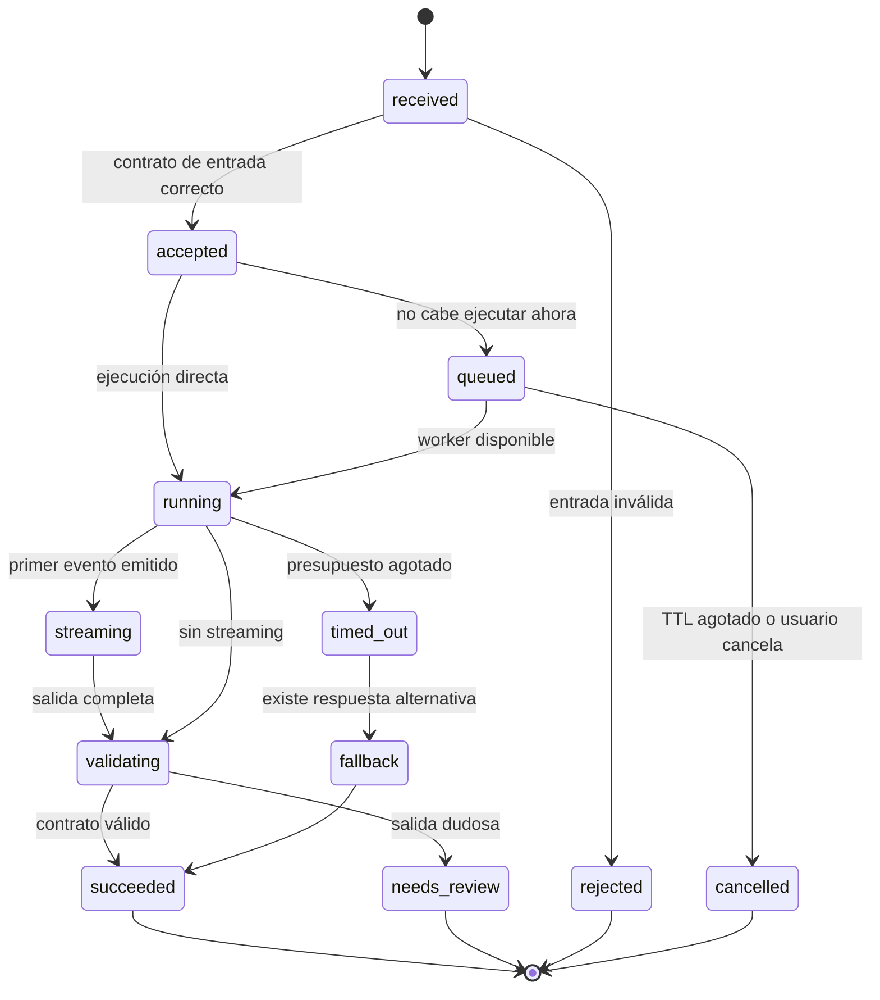
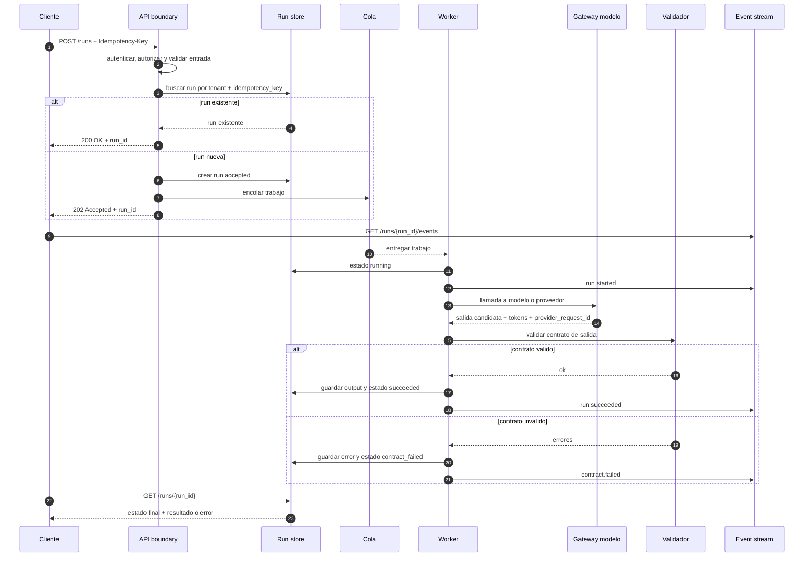
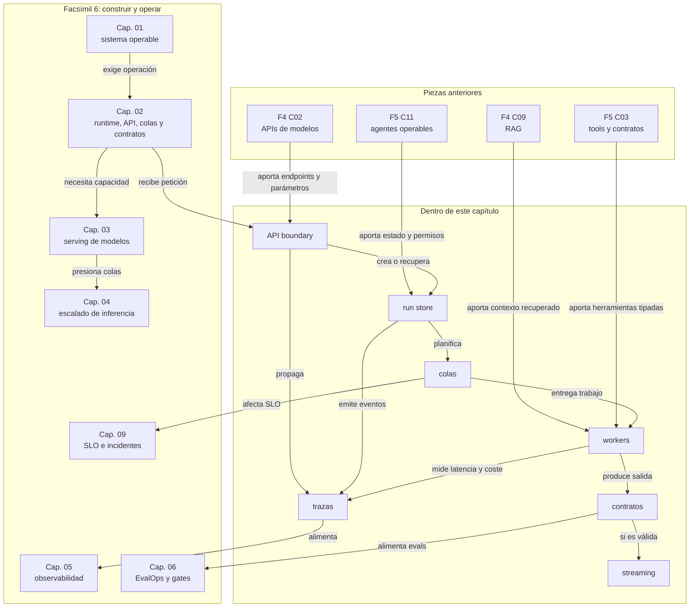

::: {.fasciculo-subtitle}
Facsímil 6 · Construir y operar
:::

# Capítulo 02: Arquitectura de runtime: API, colas, estado y contratos

## Qué deberías poder hacer al terminar

En el capítulo anterior construimos el marco: manifest, `AGENTS.md`, `SHOULD.md`, gates, trazas y decisiones. Ahora bajamos un nivel. Si alguien llama a tu sistema de IA, ¿qué ocurre exactamente desde que entra la petición hasta que sale la respuesta?

Al terminar, deberías poder hacer esto:

| Resultado de aprendizaje | Evidencia de que lo sabes hacer |
|---|---|
| Diseñar la entrada de una API de IA. | Separas usuario, tarea, payload, permisos, idempotencia y presupuesto. |
| Modelar una petición como una run. | Distingues `run_id`, `request_id`, `trace_id`, estado, spans y resultado. |
| Explicar por qué una cola cambia la arquitectura. | Calculas presión de cola, tiempo de espera y capacidad mínima. |
| Diseñar contratos de entrada y salida. | Usas esquemas, validadores, errores tipados y versión de contrato. |
| Definir timeouts y streaming. | Repartes presupuesto de latencia entre fases y decides qué se entrega progresivamente. |

La idea central es sencilla pero potente: **un runtime de IA no es una llamada al modelo; es una máquina de coordinación**.

## La petición que parece simple

Imagina un botón en una aplicación universitaria: “resumir expediente y proponer siguiente paso”. Desde la interfaz parece una acción limpia: pulsas, espera unos segundos y aparece una respuesta. Pero por debajo ocurren muchas cosas.

El sistema debe comprobar quién llama, qué permiso tiene, qué versión del asistente está activa, si esa petición ya llegó antes, qué documentos necesita recuperar, qué modelo debe usar, cuánto tiempo queda, qué salida será válida, qué hacer si el proveedor tarda demasiado y qué traza dejar para poder depurar.

Por eso este capítulo no empieza en el modelo. Empieza en el borde del sistema: la API. En ingeniería, los bordes importan porque ahí se convierten intenciones humanas en contratos técnicos.

## Qué no es el runtime

Un runtime no es “el SDK del proveedor”. El SDK ayuda a llamar a un modelo, pero no decide por sí solo cómo versionas prompts, cómo deduplicas peticiones, cómo gestionas una cola, cómo validas una respuesta o cómo haces rollback.

Tampoco es solo “el servidor”. Puedes tener un servidor HTTP y seguir sin runtime operativo: si no hay estado de run, si no hay contrato, si no hay trazas y si no sabes qué hacer cuando una dependencia va lenta, tienes una puerta de entrada, no un sistema.

La diferencia práctica es esta:

| Confusión | Qué falta |
|---|---|
| Endpoint HTTP | Falta estado, idempotencia, validación, trazas y política de errores. |
| SDK del modelo | Falta coordinación con retrieval, tools, colas, contratos y presupuesto. |
| Script que llama a una API | Falta operación: retries, timeouts, owners, métricas y rollback. |
| Worker suelto | Falta control de entrada, orden, prioridad, cancelación y deduplicación. |

## Qué sí es un runtime de IA

Un runtime de IA es la capa que ejecuta peticiones reales bajo reglas operativas. Recibe una intención, la convierte en una run, coordina pasos, conserva estado, llama a dependencias, valida salida y deja evidencia.

La API HTTP sigue siendo importante. RFC 9110 define la semántica de HTTP: métodos, estado, representación y comportamiento esperado de las peticiones.^[Fielding, R. T., Nottingham, M. y Reschke, J. (2022). *HTTP Semantics*. RFC 9110. https://datatracker.ietf.org/doc/html/rfc9110. Consultado el 27 de mayo de 2026.] Pero una API de IA añade dimensiones que un CRUD clásico no siempre tenía tan visibles:

| Dimensión | Pregunta que responde |
|---|---|
| Identidad | ¿Quién pide esto y con qué permisos? |
| Idempotencia | ¿Qué pasa si el cliente repite la petición? |
| Contexto | ¿Qué documentos, memoria o estado entran en la run? |
| Presupuesto | ¿Cuánto tiempo, coste y tokens puede gastar? |
| Contrato | ¿Qué forma debe tener la salida para ser aceptada? |
| Observabilidad | ¿Cómo reconstruimos lo ocurrido? |
| Degradación | ¿Qué hacemos si una dependencia no responde a tiempo? |

Fecha de corte: 27 de mayo de 2026. Fuentes consultadas ese día: documentación oficial de OpenAI Responses API, streaming y salidas estructuradas; documentación de Anthropic Messages API y streaming; JSON Schema Draft 2020-12; OpenTelemetry Tracing API y convenciones GenAI; W3C Trace Context. Lo estable es la arquitectura: API, estado, colas, contratos, timeouts y trazas. Lo cambiante son endpoints concretos, eventos de streaming, nombres de modelos, SDKs y límites de proveedor.

## El mecanismo por dentro

Una petición robusta suele pasar por estas fases:

1. **Entrada:** llega una petición HTTP con usuario, payload, clave de idempotencia y presupuesto.
2. **Normalización:** el sistema valida formato, permisos, tamaño y campos obligatorios.
3. **Creación de run:** se asignan `run_id`, `trace_id`, versión de manifest y estado inicial.
4. **Planificación:** se decide si la petición va directa, a cola, a worker especializado o a revisión.
5. **Ejecución:** retrieval, herramientas, llamada al modelo, streaming y validación.
6. **Cierre:** se guarda resultado, métricas, coste, contrato, estado final y decisión.

La latencia total se puede leer como suma de fases:

\[
T_{\text{total}} =
T_{\text{entrada}} +
T_{\text{cola}} +
T_{\text{retrieval}} +
T_{\text{tools}} +
T_{\text{modelo}} +
T_{\text{validación}} +
T_{\text{salida}}
\]

| Símbolo | Significado | Ejemplo |
|---|---|---|
| \(T_{\text{entrada}}\) | Tiempo de autenticación, parseo y validación inicial. | 80 ms |
| \(T_{\text{cola}}\) | Tiempo esperando a que un worker pueda ejecutar. | 600 ms |
| \(T_{\text{retrieval}}\) | Tiempo de buscar y preparar contexto. | 350 ms |
| \(T_{\text{tools}}\) | Tiempo consumido por herramientas externas. | 500 ms |
| \(T_{\text{modelo}}\) | Tiempo de prefill, generación y respuesta del modelo. | 1800 ms |
| \(T_{\text{validación}}\) | Tiempo de comprobar contrato y reglas. | 90 ms |
| \(T_{\text{salida}}\) | Tiempo de serializar, emitir eventos o guardar resultado. | 50 ms |

Con esos números:

\[
T_{\text{total}} = 80 + 600 + 350 + 500 + 1800 + 90 + 50 = 3470 \text{ ms}
\]

Si tu SLO (*Service Level Objective*, objetivo de nivel de servicio) era `respuesta final <= 3000 ms`, el problema no se arregla diciendo “el modelo es lento”. Tienes que mirar la descomposición. En este ejemplo, cola y modelo suman 2400 ms. Si además retrieval o tools se mueven un poco, el SLO cae.

Las colas tienen una ley muy útil para razonar. La ley de Little dice:

\[
L = \lambda W
\]

| Símbolo | Significado | Ejemplo |
|---|---|---|
| \(L\) | Número medio de trabajos dentro del sistema o de una cola. | 24 runs |
| \(\lambda\) | Tasa media de llegada de trabajos. | 6 runs/s |
| \(W\) | Tiempo medio que un trabajo pasa dentro del sistema. | 4 s |

La lectura sería:

\[
24 = 6 \times 4
\]

Little demostró esta relación para sistemas de colas bajo condiciones generales.^[Little, J. D. C. (1961). *A Proof for the Queuing Formula: L = λW*. Operations Research, 9(3), 383-387. https://doi.org/10.1287/opre.9.3.383.] Para nosotros la intuición es suficiente: si llegan más runs por segundo y cada una tarda más, la cola crece. Si la cola crece, sube \(T_{\text{cola}}\). Si sube \(T_{\text{cola}}\), el usuario siente que “la IA va lenta”, aunque el modelo no haya cambiado.

También necesitamos repartir presupuesto de tiempo:

\[
B_{\text{SLO}} \geq B_{\text{cola}} + B_{\text{retrieval}} + B_{\text{tools}} + B_{\text{modelo}} + B_{\text{validación}} + M
\]

| Símbolo | Significado | Ejemplo |
|---|---|---|
| \(B_{\text{SLO}}\) | Presupuesto total de latencia. | 3000 ms |
| \(B_{\text{cola}}\) | Máximo tolerable de espera en cola. | 400 ms |
| \(B_{\text{retrieval}}\) | Máximo para recuperar contexto. | 300 ms |
| \(B_{\text{tools}}\) | Máximo para herramientas externas. | 500 ms |
| \(B_{\text{modelo}}\) | Máximo para modelo. | 1500 ms |
| \(B_{\text{validación}}\) | Máximo para validadores. | 100 ms |
| \(M\) | Margen para red, serialización y variabilidad. | 200 ms |

Aquí:

\[
3000 \geq 400 + 300 + 500 + 1500 + 100 + 200
\]

La igualdad no es el objetivo. El objetivo es detectar que si `tools` tarda 900 ms, no puedes fingir que todo sigue dentro de presupuesto.

## Anatomía visual de un runtime

<svg id="f6-c02-runtime-api-colas" xmlns="http://www.w3.org/2000/svg" viewBox="0 0 1900 1380" role="img" aria-label="Arquitectura de runtime de IA con API, colas, estado, contratos, workers y observabilidad">
  <defs>
    <style>
      #f6-c02-runtime-api-colas{background:#fff;color:#111;font-family:Inter, ui-sans-serif, system-ui, -apple-system, BlinkMacSystemFont, "Segoe UI", sans-serif}
      #f6-c02-runtime-api-colas .title{font-size:42px;font-weight:800;letter-spacing:0}
      #f6-c02-runtime-api-colas .subtitle{font-size:18px;fill:#444}
      #f6-c02-runtime-api-colas .section{font-size:16px;font-weight:800;fill:#111}
      #f6-c02-runtime-api-colas .h{font-size:20px;font-weight:800;fill:#111}
      #f6-c02-runtime-api-colas .hwhite{font-size:20px;font-weight:800;fill:#fff}
      #f6-c02-runtime-api-colas .txt{font-size:15px;fill:#222}
      #f6-c02-runtime-api-colas .tiny{font-size:12px;fill:#555}
      #f6-c02-runtime-api-colas .box{fill:#fff;stroke:#111;stroke-width:2}
      #f6-c02-runtime-api-colas .soft{fill:#f5f5f5;stroke:#111;stroke-width:1.8}
      #f6-c02-runtime-api-colas .dark{fill:#111;stroke:#111;stroke-width:2}
      #f6-c02-runtime-api-colas .line{stroke:#111;stroke-width:2.2;fill:none}
      #f6-c02-runtime-api-colas .thin{stroke:#555;stroke-width:1.4;fill:none}
      #f6-c02-runtime-api-colas .dash{stroke:#555;stroke-width:1.6;fill:none;stroke-dasharray:8 7}
      #f6-c02-runtime-api-colas .chip{fill:#fff;stroke:#333;stroke-width:1.4}
    </style>
    <marker id="f6c02-arrow" viewBox="0 0 10 10" refX="9" refY="5" markerWidth="8" markerHeight="8" orient="auto-start-reverse">
      <path d="M 0 0 L 10 5 L 0 10 z" fill="#111"/>
    </marker>
  </defs>

  <rect x="54" y="48" width="1792" height="1284" rx="28" fill="#fff" stroke="#111" stroke-width="2.2"/>
  <text x="950" y="106" text-anchor="middle" class="title">Runtime de IA: una petición convertida en run operable</text>
  <text x="950" y="140" text-anchor="middle" class="subtitle">API, idempotencia, estado, colas, workers, contratos, streaming y trazas en una misma arquitectura.</text>

  <rect x="92" y="198" width="310" height="230" rx="18" class="soft"/>
  <text x="247" y="238" text-anchor="middle" class="h">Cliente / producto</text>
  <rect x="128" y="270" width="238" height="42" rx="10" class="chip"/>
  <text x="247" y="297" text-anchor="middle" class="txt">request_id</text>
  <rect x="128" y="326" width="238" height="42" rx="10" class="chip"/>
  <text x="247" y="353" text-anchor="middle" class="txt">idempotency_key</text>
  <rect x="128" y="382" width="238" height="28" rx="8" class="chip"/>
  <text x="247" y="401" text-anchor="middle" class="tiny">payload + presupuesto + usuario</text>

  <rect x="470" y="182" width="370" height="270" rx="18" class="box"/>
  <rect x="470" y="182" width="370" height="54" rx="18" class="dark"/>
  <text x="655" y="217" text-anchor="middle" class="hwhite">API boundary</text>
  <text x="510" y="274" class="txt">1. autenticar identidad</text>
  <text x="510" y="306" class="txt">2. validar contrato de entrada</text>
  <text x="510" y="338" class="txt">3. aplicar límites de tamaño</text>
  <text x="510" y="370" class="txt">4. resolver manifest activo</text>
  <text x="510" y="402" class="txt">5. crear o recuperar run</text>

  <rect x="916" y="182" width="320" height="270" rx="18" class="soft"/>
  <text x="1076" y="220" text-anchor="middle" class="h">Run store</text>
  <text x="950" y="268" class="txt">run_id</text>
  <text x="950" y="302" class="txt">trace_id</text>
  <text x="950" y="336" class="txt">estado actual</text>
  <text x="950" y="370" class="txt">manifest + prompt</text>
  <text x="950" y="404" class="txt">resultado + errores tipados</text>

  <rect x="1310" y="182" width="430" height="270" rx="18" class="box"/>
  <text x="1525" y="220" text-anchor="middle" class="h">Máquina de estados</text>
  <rect x="1352" y="260" width="134" height="42" rx="10" class="chip"/>
  <text x="1419" y="286" text-anchor="middle" class="tiny">accepted</text>
  <rect x="1514" y="260" width="134" height="42" rx="10" class="chip"/>
  <text x="1581" y="286" text-anchor="middle" class="tiny">queued</text>
  <rect x="1676" y="260" width="134" height="42" rx="10" class="chip"/>
  <text x="1743" y="286" text-anchor="middle" class="tiny">running</text>
  <rect x="1432" y="342" width="134" height="42" rx="10" class="chip"/>
  <text x="1499" y="368" text-anchor="middle" class="tiny">streaming</text>
  <rect x="1594" y="342" width="134" height="42" rx="10" class="chip"/>
  <text x="1661" y="368" text-anchor="middle" class="tiny">validated</text>
  <rect x="1514" y="404" width="134" height="34" rx="9" class="dark"/>
  <text x="1581" y="426" text-anchor="middle" class="tiny" fill="#fff">closed</text>

  <path d="M402 315 L470 315" class="line" marker-end="url(#f6c02-arrow)"/>
  <path d="M840 315 L916 315" class="line" marker-end="url(#f6c02-arrow)"/>
  <path d="M1236 315 L1310 315" class="line" marker-end="url(#f6c02-arrow)"/>

  <rect x="92" y="552" width="390" height="242" rx="18" class="box"/>
  <text x="287" y="592" text-anchor="middle" class="h">Router y scheduler</text>
  <text x="128" y="640" class="txt">prioridad por tipo de tarea</text>
  <text x="128" y="674" class="txt">presupuesto de latencia y tokens</text>
  <text x="128" y="708" class="txt">modo síncrono, background o cola</text>
  <text x="128" y="742" class="txt">política de cancelación</text>

  <rect x="560" y="552" width="520" height="242" rx="18" class="soft"/>
  <text x="820" y="592" text-anchor="middle" class="h">Colas</text>
  <rect x="606" y="636" width="120" height="42" rx="10" class="chip"/><text x="666" y="663" text-anchor="middle" class="tiny">fast</text>
  <rect x="750" y="636" width="120" height="42" rx="10" class="chip"/><text x="810" y="663" text-anchor="middle" class="tiny">rag</text>
  <rect x="894" y="636" width="120" height="42" rx="10" class="chip"/><text x="954" y="663" text-anchor="middle" class="tiny">tools</text>
  <rect x="606" y="708" width="408" height="42" rx="10" class="chip"/>
  <text x="810" y="735" text-anchor="middle" class="tiny">dedupe · prioridad · backpressure · TTL</text>

  <rect x="1158" y="552" width="582" height="242" rx="18" class="box"/>
  <text x="1449" y="592" text-anchor="middle" class="h">Workers de ejecución</text>
  <rect x="1204" y="638" width="144" height="44" rx="10" class="chip"/><text x="1276" y="665" text-anchor="middle" class="tiny">retrieval</text>
  <rect x="1374" y="638" width="144" height="44" rx="10" class="chip"/><text x="1446" y="665" text-anchor="middle" class="tiny">tools</text>
  <rect x="1544" y="638" width="144" height="44" rx="10" class="chip"/><text x="1616" y="665" text-anchor="middle" class="tiny">model call</text>
  <rect x="1286" y="714" width="330" height="42" rx="10" class="chip"/>
  <text x="1451" y="741" text-anchor="middle" class="tiny">timeouts · retries limitados · streaming</text>

  <path d="M287 428 L287 552" class="line" marker-end="url(#f6c02-arrow)"/>
  <path d="M482 673 L560 673" class="line" marker-end="url(#f6c02-arrow)"/>
  <path d="M1080 673 L1158 673" class="line" marker-end="url(#f6c02-arrow)"/>
  <path d="M1525 452 L1525 552" class="dash" marker-end="url(#f6c02-arrow)"/>

  <rect x="92" y="914" width="438" height="252" rx="18" class="soft"/>
  <text x="311" y="954" text-anchor="middle" class="h">Contratos</text>
  <text x="130" y="1008" class="txt">entrada: schema + permisos</text>
  <text x="130" y="1042" class="txt">salida: JSON + campos obligatorios</text>
  <text x="130" y="1076" class="txt">errores: tipo, causa y acción</text>
  <text x="130" y="1110" class="txt">versionado: contract@major.minor</text>

  <rect x="620" y="914" width="470" height="252" rx="18" class="box"/>
  <text x="855" y="954" text-anchor="middle" class="h">Gateway de modelo</text>
  <text x="660" y="1008" class="txt">proveedor o modelo local</text>
  <text x="660" y="1042" class="txt">stream events normalizados</text>
  <text x="660" y="1076" class="txt">uso de tokens y coste</text>
  <text x="660" y="1110" class="txt">provider_request_id</text>

  <rect x="1180" y="914" width="560" height="252" rx="18" class="soft"/>
  <text x="1460" y="954" text-anchor="middle" class="h">Observabilidad</text>
  <text x="1220" y="1008" class="txt">trace_id propagado</text>
  <text x="1220" y="1042" class="txt">spans por fase</text>
  <text x="1220" y="1076" class="txt">TTFT, final latency, coste</text>
  <text x="1220" y="1110" class="txt">eventos de estado y decisión</text>

  <path d="M1449 794 L855 914" class="line" marker-end="url(#f6c02-arrow)"/>
  <path d="M855 914 L530 1040" class="line" marker-end="url(#f6c02-arrow)"/>
  <path d="M1090 1040 L1180 1040" class="line" marker-end="url(#f6c02-arrow)"/>
  <path d="M1460 914 C1460 842 1640 842 1640 794" class="dash" marker-end="url(#f6c02-arrow)"/>

  <rect x="100" y="1238" width="1740" height="54" rx="14" class="dark"/>
  <text x="970" y="1272" text-anchor="middle" class="hwhite">La arquitectura buena no promete que nada falle; promete que cada fase tiene contrato, estado, límite y evidencia.</text>
  <text x="1818" y="1330" text-anchor="end" class="micro" fill="#888888" opacity="0.45">IA para gente curiosa / Facsímil 06 / Capítulo 02 / 686f6c61</text>
</svg>

El diagrama no pretende imponer una única arquitectura. Pretende darte una checklist mental. Si una petición no tiene `run_id`, no puedes seguirla. Si no tiene idempotencia, una repetición puede duplicar trabajo. Si no hay cola, los picos llegan directos al modelo. Si no hay contrato de salida, el frontend y los sistemas aguas abajo quedan expuestos a respuestas imprevisibles.

## API de entrada: más que un prompt

Una API de IA debería recibir algo más estructurado que `{ "prompt": "..." }`. Ese formato sirve para un tutorial. En un sistema real, la entrada debería distinguir intención, usuario, tarea, permisos, presupuesto y contrato esperado.

Un ejemplo mínimo:

```json
{
  "request_id": "req_20260527_0001",
  "idempotency_key": "user42:support-summary:expediente-983:v1",
  "tenant_id": "universidad-demo",
  "actor": {
    "user_id": "user42",
    "role": "orientador"
  },
  "task": {
    "type": "support_summary",
    "input": {
      "case_id": "expediente-983",
      "question": "Resume la situación y propone siguiente paso."
    }
  },
  "budget": {
    "max_latency_ms": 3000,
    "max_input_tokens": 8000,
    "max_output_tokens": 700,
    "max_cost_eur": 0.03
  },
  "response_contract": "support-answer@1.2.0",
  "stream": true
}
```

Para no depender mentalmente de un único proveedor, conviene mirar cómo aparecen estas piezas en varias documentaciones:

| Pieza | Fuente consultada | Qué nos interesa para el runtime |
|---|---|---|
| Creación de respuestas | OpenAI Responses API.^[OpenAI. (2026). *Create a model response*. https://developers.openai.com/api/reference/resources/responses/methods/create. Consultado el 27 de mayo de 2026.] | Entrada, modelo, herramientas, instrucciones y respuesta como recurso. |
| Streaming | OpenAI streaming.^[OpenAI. (2026). *Streaming API responses*. https://developers.openai.com/api/docs/guides/streaming-responses. Consultado el 27 de mayo de 2026.] | Eventos progresivos y experiencia de usuario. |
| Salida estructurada | OpenAI structured outputs.^[OpenAI. (2026). *Structured model outputs*. https://developers.openai.com/api/docs/guides/structured-outputs. Consultado el 27 de mayo de 2026.] | Contrato de salida validable. |
| Mensajes | Anthropic Messages API.^[Anthropic. (2026). *Messages API*. https://platform.claude.com/docs/en/api/messages. Consultado el 27 de mayo de 2026.] | Conversación stateless o multi-turn en formato de mensajes. |
| Streaming de mensajes | Anthropic streaming.^[Anthropic. (2026). *Streaming Messages*. https://platform.claude.com/docs/en/api/streaming. Consultado el 27 de mayo de 2026.] | Secuencia de eventos y tratamiento de bloques de contenido. |

El punto de ingeniería no es memorizar el endpoint de hoy. Es diseñar una capa interna que pueda hablar con varios proveedores sin que el resto del producto dependa de cada detalle.

## Identidad, permisos y tenant

La API boundary no solo valida JSON. También decide **quién** puede hacer **qué** sobre **qué run**. En sistemas de IA esto importa porque una run puede contener documentos recuperados, eventos internos, costes, decisiones y salidas que no deberían ser visibles para cualquiera.

Tres preguntas mínimas:

| Pregunta | Qué comprueba | Ejemplo |
|---|---|---|
| Autenticación | ¿Quién eres? | Token de sesión, API key, OAuth, certificado interno. |
| Autorización | ¿Qué puedes hacer? | Crear runs, cancelar, leer eventos, ver fuentes, reintentar. |
| Tenancy | ¿De qué organización o espacio eres? | `tenant_id = universidad-demo`. |

Una regla práctica: cada operación sobre `/runs/{run_id}` debe comprobar que el actor pertenece al tenant correcto y tiene permiso para esa acción. No basta con que conozca el `run_id`. Un identificador no es una autorización.

| Operación | Permiso mínimo | Riesgo si se olvida |
|---|---|---|
| `POST /runs` | Crear run en ese tenant. | Ejecutar tareas fuera de contexto. |
| `GET /runs/{run_id}` | Leer run propia o del equipo autorizado. | Exponer documentos, coste o decisión. |
| `GET /runs/{run_id}/events` | Leer eventos de esa run. | Filtrar trazas internas o fuentes. |
| `POST /runs/{run_id}/cancel` | Cancelar runs propias o administradas. | Parar trabajo de otra persona. |
| `POST /runs/{run_id}/retry` | Reintentar bajo presupuesto y permiso. | Duplicar coste o saltarse revisión. |

En el run store, `tenant_id` y `actor_id` no son metadatos decorativos. Son parte de la frontera de seguridad y de auditoría. Si una traza no conserva tenant y actor, luego no sabes quién hizo qué ni qué podía ver.

## Patrones de respuesta de una API de IA

En una API clásica, muchas veces esperas que una petición entre y salga con un `200 OK`. En IA eso no siempre es lo mejor. Algunas tareas son cortas y pueden responder en la misma conexión. Otras requieren cola, streaming, revisión o ejecución en segundo plano. Diseñar bien el runtime empieza por elegir el patrón de respuesta adecuado.

| Patrón | Respuesta inicial | Cuándo encaja | Qué debe quedar guardado |
|---|---|---|---|
| Síncrono | `200 OK` con resultado final. | Tareas rápidas, baratas y de bajo impacto. | `run_id`, contrato validado, coste y traza. |
| Aceptado y polling | `202 Accepted` con `run_id`. | Tareas lentas o con cola. | Estado de run, endpoint de consulta y TTL. |
| Streaming | `200 OK` con eventos SSE o stream equivalente. | Experiencia interactiva o progreso visible. | Eventos emitidos, primer evento, cierre y errores. |
| Background job | `202 Accepted` y trabajo en cola. | Procesos largos que no necesitan conexión abierta. | Cola, prioridad, owner, reintentos y resultado. |
| Webhook | `202 Accepted` y callback posterior. | Integraciones entre sistemas. | URL registrada, firma, intentos y confirmación de entrega. |
| Híbrido | Progreso por streaming y resultado persistido. | Tareas con UX viva y necesidad de auditoría. | Stream, run final y contrato validado. |

El patrón no es solo una decisión de backend. Afecta al usuario. Un `202 Accepted` honesto dice: “he recibido tu trabajo, aquí tienes un identificador, vuelve a consultar”. Un streaming honesto dice: “estoy trabajando y estos son eventos de progreso”. Un `200 OK` forzado en una tarea lenta suele terminar en timeouts, pantallas congeladas o reintentos del cliente que duplican coste.

Una API de runtime publicable podría tener esta forma:

| Endpoint | Método | Propósito | Respuesta normal |
|---|---|---|---|
| `/runs` | `POST` | Crear una run o recuperar una existente por idempotencia. | `201 Created` o `200 OK` si era replay. |
| `/runs/{run_id}` | `GET` | Consultar estado, resultado y metadatos. | `200 OK`. |
| `/runs/{run_id}/events` | `GET` | Leer eventos de progreso por streaming. | `200 OK` con `text/event-stream`. |
| `/runs/{run_id}/cancel` | `POST` | Pedir cancelación cooperativa. | `202 Accepted`. |
| `/runs/{run_id}/retry` | `POST` | Reintentar una run cerrada con error recuperable. | `202 Accepted`. |
| `/runs/{run_id}/decision` | `GET` | Ver por qué se cerró, se pausó o se envió a revisión. | `200 OK`. |

HTTP ya nos da códigos útiles, pero hay que usarlos con intención:

| Código | Uso razonable en runtime de IA |
|---|---|
| `200 OK` | Resultado disponible o replay idempotente ya resuelto. |
| `201 Created` | Run creada y aceptada. |
| `202 Accepted` | Run aceptada, pero todavía no terminada. |
| `400 Bad Request` | Payload inválido. |
| `401/403` | Identidad ausente o permiso insuficiente. |
| `404 Not Found` | `run_id` inexistente o no visible para ese actor. |
| `409 Conflict` | La run no admite esa transición de estado. |
| `422 Unprocessable Content` | Entrada bien formada, pero no cumple contrato semántico. |
| `429 Too Many Requests` | Límite por usuario, tenant o presupuesto. |
| `503 Service Unavailable` | Sistema saturado o dependencia crítica no disponible. |

El cliente no debería tener que adivinar. Cada error debería incluir `error_code`, `message`, `run_id` si existe, `trace_id` si existe, `retryable`, `retry_after_ms` cuando aplique y una acción recomendada.

## Estado: la run como fuente de verdad

Una run es una ejecución completa. No es lo mismo que una request HTTP, porque una request puede terminar rápido diciendo “aceptado” mientras la run sigue en background. Tampoco es lo mismo que una llamada al modelo, porque una run puede incluir retrieval, herramientas, validación, streaming, reintentos y cierre.

| Identificador | Qué identifica | Quién lo usa |
|---|---|---|
| `request_id` | La petición recibida por tu API. | Cliente, gateway y logs HTTP. |
| `idempotency_key` | La intención repetible que no debe duplicarse. | API boundary y run store. |
| `run_id` | La ejecución de negocio que queremos seguir. | Producto, soporte, evals y operación. |
| `trace_id` | La traza distribuida de todos los spans. | Observabilidad. |
| `provider_request_id` | La llamada concreta a un proveedor/modelo. | Depuración con proveedor o runtime. |

Una máquina de estados mínima podría ser:



Cada transición debería guardar evento, timestamp y motivo. No basta con saber que una run terminó mal. Hay que saber si fue rechazada por contrato, cancelada por TTL, parada por timeout, enviada a revisión o cerrada correctamente.

## Persistencia mínima del run store

El run store no tiene por qué ser sofisticado al principio, pero sí debe guardar lo suficiente para reconstruir una ejecución. Si solo guardas el texto final, pierdes la historia. Si guardas todo sin criterio, creas una base de datos difícil de proteger y consultar.

Un modelo mínimo podría tener cuatro tablas o colecciones:

| Tabla | Qué guarda | Campos mínimos |
|---|---|---|
| `runs` | La entidad principal de ejecución. | `run_id`, `tenant_id`, `actor_id`, `state`, `manifest_version`, `created_at`, `updated_at`. |
| `run_events` | Cambios de estado y eventos importantes. | `run_id`, `event_name`, `state`, `timestamp`, `attrs_json`. |
| `run_outputs` | Resultado final o salida candidata. | `run_id`, `contract_version`, `output_json`, `validated`, `created_at`. |
| `run_errors` | Fallos normalizados. | `run_id`, `error_code`, `retryable`, `provider_request_id`, `message`, `created_at`. |

Y una tabla opcional cuando hay streaming:

| Tabla | Qué guarda | Cuándo merece la pena |
|---|---|---|
| `run_stream_events` | Eventos enviados al cliente, con orden. | Si necesitas reanudar stream, auditar UX o depurar cortes de conexión. |

Hay una decisión delicada: qué guardar de la entrada y la salida. En muchos sistemas no conviene guardar prompts completos o documentos enteros. Puede bastar con hashes, IDs de documentos, metadatos mínimos y una política clara de retención. Operar no significa guardar todo; significa guardar lo necesario para explicar y mejorar el sistema sin acumular datos de más.

## Cancelar, reanudar y expirar

El ciclo de vida de una run se complica cuando el usuario cierra la pestaña, recarga, cancela o pierde conexión. Un runtime serio no debería depender de que la conexión HTTP sobreviva hasta el final.

| Situación | Qué debería hacer el runtime |
|---|---|
| El usuario recarga la página. | Recuperar por `run_id` o `idempotency_key`; no crear otra run. |
| Se corta el streaming. | Mantener la run viva y permitir reconectar a `/runs/{run_id}/events`. |
| El usuario cancela. | Marcar `cancelling`, avisar a workers y cerrar como `cancelled` si no hay fase irreversible. |
| La run espera demasiado en cola. | Cerrar como `expired` si supera TTL. |
| El worker se cae. | Reencolar si la fase es recuperable y no supera máximo de intentos. |
| El contrato falla. | Cerrar como `contract_failed` y no mostrar resultado final. |

Para reanudación hace falta distinguir dos cosas:

| Pieza | Qué resuelve |
|---|---|
| `run_id` | Permite consultar una ejecución ya creada. |
| `resume_token` | Permite reconectar a un stream desde un punto conocido si el protocolo lo soporta. |
| `last_event_id` | Permite saber qué eventos ya vio el cliente. |
| `result_url` | Permite recuperar resultado final aunque el stream se perdiera. |

La cancelación también debe ser honesta. Cancelar una run que todavía está en cola es fácil. Cancelar una llamada al modelo ya enviada puede depender del proveedor o del runtime. Cancelar una acción externa que ya se ejecutó quizá no sea posible. Por eso una buena API no promete “cancelado” demasiado pronto; primero marca `cancelling`, luego confirma `cancelled` o explica que la fase ya no era cancelable.

## Colas: cuando el tráfico deja de ser educado

La cola aparece cuando no quieres que todas las peticiones entren al runtime al mismo tiempo. En IA esto es especialmente importante porque cada petición puede tener coste muy distinto. Una FAQ corta y un análisis con 80.000 tokens no consumen lo mismo.

Las colas sirven para:

| Problema | Cómo ayuda la cola |
|---|---|
| Picos de tráfico | Absorbe entradas y permite ejecutar a ritmo controlado. |
| Tareas lentas | Separa respuesta inmediata de trabajo en background. |
| Prioridades | Permite colas por tipo: rápido, RAG largo, herramientas, revisión. |
| Coste | Evita disparar llamadas caras sin control. |
| Backpressure | Permite decir “no acepto más” antes de romper SLO. |

Pero una cola también puede esconder problemas. Si nadie mira longitud, edad máxima y tiempo de espera, la cola se convierte en una sala de espera infinita. Una buena cola tiene TTL, prioridad, límites y métricas.

Una cola profesional suele añadir estas piezas:

| Pieza | Qué resuelve | Señal que deberías medir |
|---|---|---|
| Prioridad | No todas las tareas tienen la misma urgencia. | Tiempo de espera por prioridad. |
| Fairness por tenant | Un cliente grande no debería ocupar toda la capacidad. | Cuota usada por tenant. |
| Backoff | Reintentar demasiado rápido empeora la saturación. | Intentos, retraso y causa. |
| Dead-letter queue | Los trabajos que fallan siempre no bloquean la cola principal. | Entradas en DLQ y motivo. |
| TTL | Una tarea demasiado vieja quizá ya no sirve. | Edad máxima en cola. |
| Dedupe | Dos trabajos equivalentes no deberían gastar dos veces. | Replays por idempotencia. |
| Backpressure | El sistema avisa antes de romperse. | `429`, `503`, cola llena y rechazos. |

Un patrón típico de reintento es backoff exponencial con jitter:

\[
d_n = \min(d_{\max}, d_0 \cdot 2^n) + \epsilon
\]

| Símbolo | Significado | Ejemplo |
|---|---|---|
| \(d_n\) | Espera antes del intento \(n\). | 4000 ms |
| \(d_0\) | Espera inicial. | 500 ms |
| \(n\) | Número de intento, empezando en 0. | 3 |
| \(d_{\max}\) | Límite máximo de espera. | 10.000 ms |
| \(\epsilon\) | Pequeña variación aleatoria para evitar sincronización. | 120 ms |

Sin jitter, muchos workers pueden reintentar a la vez y crear otro pico artificial. Con jitter, los reintentos se reparten un poco mejor. La idea importante: reintentar no es gratis. Cada reintento consume cola, coste, tokens y atención operativa.

## Semántica de entrega: at-most-once y at-least-once

Cuando una cola entrega trabajos a workers, aparece una pregunta clásica: ¿qué garantiza la entrega? Hay tres vocabularios que conviene conocer:

| Semántica | Qué significa | Problema práctico |
|---|---|---|
| At-most-once | Como máximo se procesa una vez. | Puedes perder trabajos si el worker cae. |
| At-least-once | Se procesa una o más veces hasta confirmar. | Puede duplicarse trabajo. |
| Exactly-once | Parece que se procesa exactamente una vez. | Es difícil y suele depender de transacciones e idempotencia. |

En sistemas reales, muchas colas se diseñan alrededor de **at-least-once**: prefieren repetir antes que perder. Eso obliga a que los workers sean idempotentes. Si el mismo trabajo llega dos veces, no debería crear dos resultados incompatibles, gastar sin control o ejecutar dos acciones equivalentes.

La idempotencia se consigue combinando:

| Técnica | Qué evita |
|---|---|
| `idempotency_key` | Duplicar una intención del cliente. |
| `run_id` estable | Mezclar dos ejecuciones distintas. |
| Bloqueo por estado | Ejecutar una transición no válida. |
| Resultado persistido | Reutilizar salida ya validada. |
| Dedupe de cola | No encolar el mismo trabajo varias veces. |

La lección es incómoda pero útil: no diseñes el worker suponiendo que cada mensaje llega una sola vez. Diseña como si pudiera repetirse.

## Circuit breakers y bulkheads

Un runtime de IA depende de piezas lentas o variables: proveedor de modelo, vector DB, herramientas internas, base de datos, cola y red. Si una dependencia se degrada, no quieres que arrastre todo el sistema.

Dos patrones ayudan:

| Patrón | Traducción | Uso en runtime de IA |
|---|---|---|
| Circuit breaker | Cortacircuitos. | Si una dependencia falla demasiado, se deja de llamar durante un tiempo y se degrada. |
| Bulkhead | Compartimento estanco. | Separar recursos para que una cola o dependencia no consuma toda la capacidad. |

Ejemplo: si la herramienta de facturación está lenta, el runtime puede marcar casos como `needs_review`, responder con estado claro o usar una ruta sin herramienta. Lo que no debería hacer es llenar todos los workers esperando esa herramienta hasta que también fallen las preguntas sencillas.

| Dependencia lenta | Circuit breaker | Bulkhead |
|---|---|---|
| Vector DB | Reducir `top_k` o responder con revisión si no hay contexto. | Cola separada para RAG. |
| Tool interna | No llamar durante una ventana corta si acumula errores. | Workers separados para tools. |
| Proveedor de modelo | Cambiar a modelo alternativo o pausar runs nuevas. | Presupuesto por proveedor/modelo. |

No hace falta implementar todos estos patrones el primer día. Sí hace falta saber dónde irían. Si el runtime no tiene sitio para degradar, solo le queda fallar.

## Contratos: entrada, salida y error

Antes de hablar de JSON Schema conviene parar un momento. En este capítulo, un contrato no es un documento legal ni una promesa vaga. Es una **interfaz verificable**. Dice qué forma debe tener una entrada, qué forma tendrá una salida, qué errores pueden aparecer y qué significan los estados del sistema.

Un contrato técnico sirve para que dos piezas puedan trabajar juntas sin conocerse por dentro:

| Contrato | Pregunta que responde | Ejemplo |
|---|---|---|
| Entrada | ¿Qué debe enviar el cliente para que aceptemos la petición? | `request_id`, `idempotency_key`, `task`, `budget`. |
| Salida | ¿Qué puede esperar quien consume la respuesta? | `answer`, `sources`, `confidence`, `needs_review`. |
| Error | ¿Cómo se informa un fallo de forma accionable? | `error_code`, `retryable`, `trace_id`, `retry_after_ms`. |
| Estado | ¿Qué fases puede atravesar una run? | `queued`, `running`, `succeeded`, `cancelled`. |

La palabra clave es “verificable”. Si dices “el modelo responderá bien”, no hay contrato. Si dices “la respuesta debe ser JSON válido, sin campos extra, con al menos una fuente y `confidence` entre 0 y 1”, ya puedes validarlo antes de mostrarlo.

JSON Schema permite describir restricciones estructurales sobre documentos JSON: tipos, campos obligatorios, valores permitidos, mínimos, máximos y otras condiciones.^[JSON Schema. (2020). *JSON Schema Validation: A Vocabulary for Structural Validation of JSON*. https://json-schema.org/draft/2020-12/json-schema-validation. Consultado el 27 de mayo de 2026.] En IA, un esquema no garantiza que el contenido sea correcto, pero sí elimina una clase entera de errores: respuestas que no se pueden parsear, campos que faltan, tipos incorrectos o claves inesperadas.

Ejemplo de contrato de salida:

```json
{
  "$schema": "https://json-schema.org/draft/2020-12/schema",
  "$id": "support-answer@1.2.0",
  "type": "object",
  "additionalProperties": false,
  "required": ["answer", "sources", "confidence", "needs_review", "next_step"],
  "properties": {
    "answer": { "type": "string", "minLength": 1 },
    "sources": {
      "type": "array",
      "minItems": 1,
      "items": {
        "type": "object",
        "required": ["source_id", "chunk_id", "title"],
        "additionalProperties": false,
        "properties": {
          "source_id": { "type": "string" },
          "chunk_id": { "type": "string" },
          "title": { "type": "string" }
        }
      }
    },
    "confidence": { "type": "number", "minimum": 0, "maximum": 1 },
    "needs_review": { "type": "boolean" },
    "next_step": { "type": "string", "minLength": 1 }
  }
}
```

El contrato de error también importa:

| Código interno | Significado | Qué debería hacer el cliente |
|---|---|---|
| `input_invalid` | La entrada no cumple contrato. | Corregir payload. |
| `idempotency_replay` | Ya existe una run para esa intención. | Recuperar run existente. |
| `queue_full` | El sistema no acepta más trabajo ahora. | Reintentar después o degradar. |
| `budget_exceeded` | Tokens, coste o tiempo superan presupuesto. | Reducir tarea o pedir confirmación. |
| `contract_failed` | La salida no cumple esquema. | No mostrar como resultado final. |
| `provider_unavailable` | Dependencia externa no responde bien. | Usar fallback o avisar con estado claro. |

Un error útil no humilla al usuario ni esconde la causa técnica. Dice qué ocurrió, qué se puede hacer y qué identificador permite depurarlo.

OpenAPI permite describir una API HTTP: rutas, métodos, parámetros, esquemas, respuestas y seguridad.^[OpenAPI Initiative. (2025). *OpenAPI Specification*. https://spec.openapis.org/oas/latest.html. Consultado el 27 de mayo de 2026.] En un sistema de IA, OpenAPI no sustituye a `SHOULD.md`; lo traduce al borde técnico. `SHOULD.md` dice cómo debe comportarse el sistema. OpenAPI dice cómo se llama, qué acepta y qué devuelve.

Un fragmento mínimo sería:

```yaml
openapi: 3.1.0
info:
  title: Support RAG Runtime API
  version: 1.2.0
paths:
  /runs:
    post:
      summary: Crear o recuperar una run por idempotencia
      operationId: createRun
      parameters:
        - name: Idempotency-Key
          in: header
          required: true
          schema:
            type: string
      requestBody:
        required: true
        content:
          application/json:
            schema:
              $ref: "#/components/schemas/CreateRunRequest"
      responses:
        "201":
          description: Run creada
          content:
            application/json:
              schema:
                $ref: "#/components/schemas/Run"
        "200":
          description: Run existente recuperada por idempotencia
          content:
            application/json:
              schema:
                $ref: "#/components/schemas/Run"
        "429":
          description: Límite de entrada superado
          headers:
            Retry-After:
              schema:
                type: integer
components:
  schemas:
    CreateRunRequest:
      type: object
      required: [task, budget, response_contract]
      additionalProperties: false
      properties:
        task:
          type: object
        budget:
          type: object
        response_contract:
          type: string
    Run:
      type: object
      required: [run_id, state, trace_id]
      properties:
        run_id:
          type: string
        state:
          enum: [accepted, queued, running, streaming, succeeded, cancelled, expired, contract_failed, timed_out]
        trace_id:
          type: string
```

Este YAML no es “documentación bonita”. Sirve para generar clientes, validar compatibilidad, revisar cambios en PR y detectar si una nueva versión rompe consumidores.

## Versionar contratos sin romper clientes

Un contrato no es estático. Cambia cuando el producto aprende. El problema no es cambiarlo; el problema es no saber si el cambio rompe a quien lo consume.

Una regla conservadora:

| Cambio | ¿Compatible? | Por qué |
|---|---|---|
| Añadir campo opcional | Normalmente sí. | Los clientes antiguos pueden ignorarlo. |
| Añadir campo obligatorio | No. | Los clientes antiguos no lo envían o no lo esperan. |
| Cambiar tipo de un campo | No. | Rompe validadores y clientes generados. |
| Eliminar campo | No. | Alguien puede depender de él. |
| Cambiar significado de un estado | No. | Aunque el nombre sea igual, la semántica cambia. |
| Añadir nuevo estado final | Depende. | Los clientes deben saber qué hacer con estados desconocidos. |
| Endurecer validación | Puede romper. | Entradas antes aceptadas pasan a fallar. |

Por eso conviene versionar contratos como `support-answer@1.2.0` y escribir una política:

| Versión | Cuándo subir |
|---|---|
| Patch | Aclaraciones, ejemplos, descripciones, errores tipográficos. |
| Minor | Campos opcionales o estados no finales que no rompen clientes preparados. |
| Major | Cambios obligatorios, tipos distintos, estados finales nuevos o semántica incompatible. |

Un buen cliente de runtime también debe ser robusto ante estados desconocidos: si recibe un estado que no entiende, no debería tratarlo como éxito. Mejor mostrar “estado no reconocido”, conservar `run_id` y pedir actualización del contrato.

## Streaming: experiencia y operación a la vez

Streaming no significa solo “que se vea escribir”. En un runtime operable, streaming puede emitir eventos de estado:

```text
run.accepted
run.queued
run.started
retrieval.completed
model.output_text.delta
model.completed
contract.validated
run.succeeded
```

Esto mejora la experiencia, pero también la operación. Si el usuario ve “buscando documentos” y luego “redactando respuesta”, entiende que el sistema está trabajando. Si soporte ve los mismos eventos en la traza, puede localizar dónde se quedó una run.

El streaming obliga a una decisión de producto: ¿qué puedes mostrar antes de validar? Para respuestas de bajo impacto, quizá puedes mostrar texto parcial. Para salidas que deben cumplir JSON estricto, quizá conviene transmitir eventos de progreso y no enseñar el resultado hasta validar contrato.

Polling, SSE, WebSocket y webhook resuelven problemas distintos:

| Opción | Dirección | Cuándo elegirla | Coste mental |
|---|---|---|---|
| Polling | Cliente pregunta cada cierto tiempo. | Simplicidad y tareas no interactivas. | Fácil, pero puede ser ineficiente. |
| SSE | Servidor envía eventos al cliente. | Progreso unidireccional y streaming de texto. | Simple para navegador y HTTP. |
| WebSocket | Comunicación bidireccional. | Interacción viva, cancelación inmediata o colaboración. | Más complejo de operar. |
| Webhook | Servidor llama a otro sistema. | Integraciones sistema-sistema. | Exige firma, reintentos y entrega verificable. |

Para muchos productos de IA, SSE es suficiente: el cliente crea una run, abre `/runs/{run_id}/events` y recibe eventos. WebSocket tiene sentido cuando el cliente también debe enviar señales frecuentes durante la ejecución. Webhook encaja cuando no hay usuario mirando la pantalla y otro sistema debe recibir el resultado.

## Observabilidad del runtime

OpenTelemetry define una API de trazas para representar operaciones como spans conectados.^[OpenTelemetry. (2026). *Tracing API*. https://opentelemetry.io/docs/specs/otel/trace/api/. Consultado el 27 de mayo de 2026.] Además, sus convenciones semánticas para GenAI están en desarrollo y cubren señales propias de sistemas generativos como operaciones de modelo, agentes y herramientas.^[OpenTelemetry. (2026). *Semantic conventions for generative AI systems*. https://opentelemetry.io/docs/specs/semconv/gen-ai/. Consultado el 27 de mayo de 2026.] W3C Trace Context estandariza cómo propagar contexto de traza entre servicios.^[World Wide Web Consortium. (2021). *Trace Context Level 2*. https://www.w3.org/TR/trace-context-2/. Consultado el 27 de mayo de 2026.]

Una traza de runtime debería tener, como mínimo:

| Span | Atributos útiles |
|---|---|
| `api.receive` | `request_id`, `tenant_id`, endpoint, tamaño de payload. |
| `input.validate` | contrato, versión, resultado, errores. |
| `run.create` | `run_id`, `trace_id`, manifest, idempotency key. |
| `queue.wait` | cola, prioridad, edad, posición aproximada. |
| `retrieval.search` | corpus, versión, `top_k`, latencia, documentos usados. |
| `tool.call` | nombre de herramienta, timeout, resultado, coste si aplica. |
| `model.call` | proveedor, modelo, tokens, latencia, request id del proveedor. |
| `output.validate` | schema, versión, errores de contrato. |
| `run.close` | estado final, coste total, decisión y duración. |

Sin estos spans, depurar se convierte en mirar logs sueltos y construir una historia a mano.

## En el día a día

Un equipo suele empezar con una función como `answer(question)`. Después llega la realidad: hay usuarios, permisos, documentos, colas, coste, límites y errores. El salto profesional consiste en convertir esa función en un servicio con contrato.

En un proyecto real, el runtime suele tener estas piezas:

| Pieza | Decisión de ingeniería |
|---|---|
| API gateway | Qué endpoints existen y cómo autentican. |
| Run store | Dónde guardamos estado y resultados. |
| Queue broker | Qué va síncrono y qué va a background. |
| Workers | Qué tareas ejecuta cada tipo de worker. |
| Model gateway | Cómo normalizamos proveedores y modelos locales. |
| Contract validator | Qué salidas pasan o se bloquean. |
| Event stream | Qué eventos ve el cliente y qué eventos quedan internos. |
| Observability pipeline | Qué trazas, métricas y logs se conservan. |

No hay una única implementación correcta. Puedes hacerlo con FastAPI y Redis, con Node y una cola gestionada, con serverless y colas cloud, o con un backend monolítico bien diseñado. Lo que no cambia es la responsabilidad: entrada clara, estado explícito, colas medibles, contratos validados y trazas.

## Por qué debería importarte

Si el runtime está mal diseñado, los errores parecen inexplicables. El usuario dice “se quedó pensando”. Producto dice “a veces no responde”. Ingeniería mira un log y ve una llamada al modelo. Nadie sabe si el problema fue cola, retrieval, proveedor, contrato, timeout o frontend.

Una arquitectura de runtime buena reduce esa ambigüedad. No evita todos los problemas, pero convierte cada problema en una pregunta investigable:

| Síntoma | Pregunta técnica |
|---|---|
| Tarda en empezar | ¿TTFT alto, cola larga o retrieval lento? |
| Responde incompleto | ¿Timeout, streaming cortado o contrato rechazado? |
| Duplica trabajo | ¿Falta idempotencia o dedupe de cola? |
| Coste inesperado | ¿Reintentos, contexto largo o routing incorrecto? |
| No se puede depurar | ¿Falta `trace_id`, spans o estado final? |

## Manos a la obra

**Práctica:** contrato de runtime ejecutable.

Kit ejecutable de este capítulo: `labs/f6/capitulo-practicas/`.

```bash
cd labs/f6/capitulo-practicas
python3 ops/run_f6_practices.py --chapter c02 --write --fail-on-invalid
```

Vamos a construir una mini pieza operativa: un runtime que acepta peticiones, aplica idempotencia, crea runs, simula cola, valida contrato de salida y deja eventos. No pretende llamar a un modelo real. Pretende que entiendas la forma del sistema.

Guárdalo como `ops/ai/runtime_contract.py`. La práctica representa cuatro endpoints conceptuales:

| Endpoint conceptual | Función que lo simula |
|---|---|
| `POST /runs` | `submit()` |
| `GET /runs/{run_id}` | `get_run()` |
| `POST /runs/{run_id}/cancel` | `cancel()` |
| worker interno | `process_next()` |

```python
from dataclasses import dataclass, field
from time import time
from uuid import uuid4


REQUIRED_OUTPUT_FIELDS = {
    "answer": str,
    "sources": list,
    "confidence": float,
    "needs_review": bool,
    "next_step": str,
}

FINAL_STATES = {"succeeded", "rejected", "contract_failed", "timed_out"}
CANCELABLE_STATES = {"accepted", "queued"}


@dataclass
class Run:
    run_id: str
    request_id: str
    idempotency_key: str
    state: str
    created_at: float
    trace_id: str
    events: list[dict] = field(default_factory=list)
    result: dict | None = None


class Runtime:
    def __init__(self, max_queue_size=3):
        self.max_queue_size = max_queue_size
        self.runs_by_key: dict[str, Run] = {}
        self.queue: list[str] = []

    def get_run(self, run_id: str) -> Run | None:
        return next((run for run in self.runs_by_key.values() if run.run_id == run_id), None)

    def submit(self, request: dict) -> Run:
        self._validate_input(request)
        key = request["idempotency_key"]

        if key in self.runs_by_key:
            run = self.runs_by_key[key]
            self._event(run, "idempotency.replay", {"state": run.state})
            return run

        if len(self.queue) >= self.max_queue_size:
            run = self._new_run(request, state="rejected")
            self._event(run, "run.rejected", {"reason": "queue_full"})
            return run

        run = self._new_run(request, state="accepted")
        self.runs_by_key[key] = run
        self._event(run, "run.accepted", {"contract": request["response_contract"]})

        run.state = "queued"
        self.queue.append(run.run_id)
        self._event(run, "run.queued", {"queue_depth": len(self.queue)})
        return run

    def cancel(self, run_id: str) -> Run:
        run = self.get_run(run_id)
        if run is None:
            raise ValueError("run not found")

        if run.state not in CANCELABLE_STATES:
            self._event(run, "run.cancel_rejected", {"state": run.state})
            return run

        run.state = "cancelled"
        self.queue = [queued_id for queued_id in self.queue if queued_id != run_id]
        self._event(run, "run.cancelled", {"reason": "user_request"})
        return run

    def process_next(self, output: dict, latency_ms: int, max_latency_ms: int) -> Run | None:
        if not self.queue:
            return None

        run_id = self.queue.pop(0)
        run = next(run for run in self.runs_by_key.values() if run.run_id == run_id)
        run.state = "running"
        self._event(run, "run.started", {"queue_depth": len(self.queue)})

        if latency_ms > max_latency_ms:
            run.state = "timed_out"
            self._event(run, "run.timed_out", {"latency_ms": latency_ms, "budget_ms": max_latency_ms})
            return run

        errors = validate_output(output)
        if errors:
            run.state = "contract_failed"
            self._event(run, "contract.failed", {"errors": errors})
            return run

        run.state = "succeeded"
        run.result = output
        self._event(run, "contract.validated", {"schema": "support-answer@1.2.0"})
        self._event(run, "run.succeeded", {"latency_ms": latency_ms})
        return run

    def _new_run(self, request: dict, state: str) -> Run:
        return Run(
            run_id="run_" + uuid4().hex[:10],
            request_id=request["request_id"],
            idempotency_key=request["idempotency_key"],
            state=state,
            created_at=time(),
            trace_id="trace_" + uuid4().hex[:12],
        )

    def _event(self, run: Run, name: str, attrs: dict) -> None:
        run.events.append({"event": name, "state": run.state, "attrs": attrs})

    def _validate_input(self, request: dict) -> None:
        required = {"request_id", "idempotency_key", "task", "budget", "response_contract"}
        missing = sorted(required - set(request))
        if missing:
            raise ValueError(f"missing input fields: {missing}")


def validate_output(output: dict) -> list[str]:
    errors = []

    for field_name, field_type in REQUIRED_OUTPUT_FIELDS.items():
        if field_name not in output:
            errors.append(f"missing field: {field_name}")
            continue
        if not isinstance(output[field_name], field_type):
            errors.append(f"{field_name} must be {field_type.__name__}")

    extra = sorted(set(output) - set(REQUIRED_OUTPUT_FIELDS))
    for field_name in extra:
        errors.append(f"unexpected field: {field_name}")

    if "confidence" in output and not 0 <= output["confidence"] <= 1:
        errors.append("confidence must be between 0 and 1")

    if "sources" in output and len(output["sources"]) == 0:
        errors.append("sources must not be empty")

    return errors


request = {
    "request_id": "req_001",
    "idempotency_key": "user42:support-summary:expediente-983:v1",
    "task": {"type": "support_summary"},
    "budget": {"max_latency_ms": 3000},
    "response_contract": "support-answer@1.2.0",
}

valid_output = {
    "answer": "El expediente necesita revisión de pago antes de cerrar la matrícula.",
    "sources": [{"source_id": "policy_2026", "chunk_id": "c14", "title": "Política de matrícula"}],
    "confidence": 0.86,
    "needs_review": True,
    "next_step": "Revisar pago pendiente y adjuntar justificante si procede.",
}

invalid_output = {
    "answer": "Todo está correcto.",
    "sources": [],
    "confidence": 1.2,
    "needs_review": False,
    "next_step": "Cerrar caso.",
    "extra": "campo no contratado",
}

runtime = Runtime(max_queue_size=3)

first = runtime.submit(request)
duplicate = runtime.submit(request)
processed = runtime.process_next(valid_output, latency_ms=1800, max_latency_ms=3000)

second_request = {**request, "request_id": "req_002", "idempotency_key": "user42:support-summary:expediente-984:v1"}
second = runtime.submit(second_request)
bad = runtime.process_next(invalid_output, latency_ms=900, max_latency_ms=3000)

third_request = {**request, "request_id": "req_003", "idempotency_key": "user42:support-summary:expediente-985:v1"}
third = runtime.submit(third_request)
cancelled = runtime.cancel(third.run_id)

for run in [first, duplicate, processed, second, bad, third, cancelled]:
    print(run.run_id, run.request_id, run.state)
    print(run.events[-2:])
```

Salida esperada:

```text
run_... req_001 succeeded
[{'event': 'contract.validated', ...}, {'event': 'run.succeeded', ...}]
run_... req_001 succeeded
[{'event': 'contract.validated', ...}, {'event': 'run.succeeded', ...}]
run_... req_001 succeeded
[{'event': 'contract.validated', ...}, {'event': 'run.succeeded', ...}]
run_... req_002 contract_failed
[{'event': 'run.started', ...}, {'event': 'contract.failed', ...}]
run_... req_002 contract_failed
[{'event': 'run.started', ...}, {'event': 'contract.failed', ...}]
run_... req_003 cancelled
[{'event': 'run.queued', ...}, {'event': 'run.cancelled', ...}]
run_... req_003 cancelled
[{'event': 'run.queued', ...}, {'event': 'run.cancelled', ...}]
```

Lo que debes mirar no son los identificadores exactos, porque se generan al ejecutar. Mira tres ideas:

1. La petición duplicada no crea otra run: recupera la misma intención.
2. La salida válida avanza a `succeeded`.
3. La salida inválida no llega a producto: se queda en `contract_failed`.
4. Una run en cola puede cancelarse sin ejecutar el worker.

Esto es pequeño, pero ya tiene forma profesional: entrada, idempotencia, estado, cola, cancelación, contrato y eventos.

## Cómo encaja todo

Antes del mapa conceptual, conviene ver el flujo temporal. Este diagrama no muestra todas las ramas, pero sí la ruta típica de una run que entra, espera, ejecuta, valida y emite eventos:



Lo importante está en los puntos de control: la API no acepta cualquier cosa, el run store evita duplicados, la cola desacopla entrada y ejecución, el worker actualiza estado, el modelo queda detrás de un gateway y el validador decide si la salida puede llegar al producto.



La conexión importante es esta: el runtime no es una pieza aislada. Es donde se encuentran las APIs del facsímil 4, los agentes del facsímil 5 y la operación que estamos construyendo ahora.

## Vocabulario aprendido

| Término | Definición |
|---|---|
| API boundary | Borde donde una petición externa se convierte en una petición interna validada. |
| Autenticación | Comprobación de identidad: quién llama al sistema. |
| Autorización | Comprobación de permiso: qué puede hacer esa identidad. |
| Tenant | Organización, cliente o espacio lógico al que pertenece una run. |
| Idempotency key | Clave que identifica una intención repetible para evitar duplicados. |
| Run store | Almacén donde vive el estado de cada ejecución. |
| At-most-once | Semántica de entrega donde un trabajo se procesa como máximo una vez, con riesgo de pérdida. |
| At-least-once | Semántica donde un trabajo puede procesarse más de una vez, por lo que exige idempotencia. |
| Queue depth | Número de trabajos esperando en una cola. |
| Backpressure | Mecanismo para frenar entrada cuando el sistema no puede absorber más trabajo. |
| Dead-letter queue | Cola separada donde se envían trabajos que fallan repetidamente para no bloquear la cola principal. |
| Backoff | Espera creciente entre reintentos para no saturar una dependencia. |
| Fairness por tenant | Reparto de capacidad para que un tenant no consuma todo el runtime. |
| Circuit breaker | Patrón que deja de llamar temporalmente a una dependencia cuando acumula fallos. |
| Bulkhead | Separación de recursos para que una parte lenta no arrastre a todo el sistema. |
| Polling | Patrón donde el cliente consulta periódicamente el estado de una run. |
| SSE | Server-Sent Events: canal HTTP donde el servidor envía eventos unidireccionales al cliente. |
| WebSocket | Canal persistente bidireccional entre cliente y servidor. |
| Webhook | Callback HTTP que recibe el resultado o cambio de estado cuando termina una run. |
| OpenAPI | Especificación que describe rutas, métodos, esquemas, respuestas y seguridad de una API HTTP. |
| Worker | Proceso que toma un trabajo y ejecuta una fase. |
| Timeout budget | Presupuesto de tiempo repartido entre fases. |
| Contract validator | Componente que acepta o rechaza una entrada o salida según esquema. |
| TTFT | Tiempo hasta recibir el primer token o primer evento útil. |
| Trace context | Contexto que permite conectar spans entre servicios. |
| Goodput | Trabajo correcto dentro de SLO por unidad de tiempo. |

## Dónde solía tropezar yo

| Tropiezo | Por qué es un problema | Antídoto |
|---|---|---|
| Empezar por el proveedor | El sistema queda acoplado a un SDK concreto. | Diseñar primero contrato interno y gateway. |
| No usar idempotencia | Un retry del cliente puede duplicar trabajo y coste. | Exigir `idempotency_key` en tareas relevantes. |
| Ver la cola como detalle invisible | La cola puede comerse todo el SLO sin que el modelo sea lento. | Medir profundidad, edad máxima y tiempo de espera. |
| No diseñar cancelación | El usuario cree que paró algo, pero el sistema sigue gastando. | Separar `cancelling`, `cancelled` y fases no cancelables. |
| Reintentar sin backoff | Los reintentos crean otro pico de carga. | Backoff con jitter, límite de intentos y DLQ. |
| Mostrar streaming sin validar | El usuario puede ver contenido que luego el contrato rechaza. | Separar eventos de progreso de resultado final validado. |
| Guardar logs sin estado | Hay texto, pero no reconstrucción causal. | Guardar `run_id`, estado, eventos y `trace_id`. |
| Tratar el contrato como formato | El contrato no solo parsea; decide qué puede entrar y salir. | Versionar entrada, salida y errores. |

## Antes de pasar página

- [ ] ¿Puedes explicar por qué una request HTTP no es lo mismo que una run?
- [ ] ¿Puedes diseñar una entrada con `request_id`, `idempotency_key`, presupuesto y contrato?
- [ ] ¿Puedes explicar qué validan autenticación, autorización y tenancy?
- [ ] ¿Puedes elegir entre `200 OK`, `202 Accepted`, polling, streaming, background job y webhook?
- [ ] ¿Puedes diseñar endpoints mínimos para crear, consultar, cancelar y seguir eventos de una run?
- [ ] ¿Puedes proponer una persistencia mínima con `runs`, `run_events`, `run_outputs` y `run_errors`?
- [ ] ¿Puedes calcular \(T_{\text{total}}\) sumando fases de runtime?
- [ ] ¿Puedes usar \(L = \lambda W\) para explicar por qué crece una cola?
- [ ] ¿Puedes distinguir at-most-once y at-least-once, y justificar por qué el worker debe ser idempotente?
- [ ] ¿Puedes explicar para qué sirven TTL, dead-letter queue, backoff y fairness por tenant?
- [ ] ¿Puedes explicar cuándo usar circuit breaker o bulkhead?
- [ ] ¿Puedes decir qué spans mínimos debería tener una traza de runtime?
- [ ] ¿Puedes distinguir contrato de entrada, contrato de salida y contrato de error?
- [ ] ¿Puedes decir qué cambios de contrato son compatibles y cuáles rompen clientes?
- [ ] ¿Puedes explicar qué aporta OpenAPI además de JSON Schema?
- [ ] ¿Puedes decidir cuándo usar streaming de progreso y cuándo esperar a validar salida?
- [ ] ¿Puedes explicar qué haría el sistema si se repite una petición con la misma clave de idempotencia?
- [ ] ¿Puedes convertir un fallo de contrato en una respuesta operativa útil para cliente y soporte?

## Para saber más

- Anthropic. (2026). *Messages API*. https://platform.claude.com/docs/en/api/messages
- Anthropic. (2026). *Streaming Messages*. https://platform.claude.com/docs/en/api/streaming
- Fielding, R. T., Nottingham, M. y Reschke, J. (2022). *HTTP Semantics*. RFC 9110. https://datatracker.ietf.org/doc/html/rfc9110
- Hohpe, G. y Woolf, B. (2003). *Enterprise Integration Patterns: Designing, Building, and Deploying Messaging Solutions*. Addison-Wesley.
- JSON Schema. (2020). *JSON Schema Validation: A Vocabulary for Structural Validation of JSON*. https://json-schema.org/draft/2020-12/json-schema-validation
- Kleppmann, M. (2017). *Designing Data-Intensive Applications*. O'Reilly Media.
- Little, J. D. C. (1961). *A Proof for the Queuing Formula: L = λW*. Operations Research, 9(3), 383-387. https://doi.org/10.1287/opre.9.3.383
- OpenAI. (2026). *Create a model response*. https://developers.openai.com/api/reference/resources/responses/methods/create
- OpenAI. (2026). *Streaming API responses*. https://developers.openai.com/api/docs/guides/streaming-responses
- OpenAI. (2026). *Structured model outputs*. https://developers.openai.com/api/docs/guides/structured-outputs
- OpenAPI Initiative. (2025). *OpenAPI Specification*. https://spec.openapis.org/oas/latest.html
- OpenTelemetry. (2026). *Semantic conventions for generative AI systems*. https://opentelemetry.io/docs/specs/semconv/gen-ai/
- OpenTelemetry. (2026). *Tracing API*. https://opentelemetry.io/docs/specs/otel/trace/api/
- World Wide Web Consortium. (2021). *Trace Context Level 2*. https://www.w3.org/TR/trace-context-2/

## En resumen

| Idea | Qué debes llevarte |
|---|---|
| El runtime coordina, no solo llama al modelo. | Una petición real necesita API, estado, colas, contratos, workers, streaming y trazas. |
| El patrón de API cambia la experiencia. | No es igual `200 OK` que `202 Accepted`, polling, streaming, webhook o background job. |
| La cola forma parte del producto. | Si no mides espera, profundidad y TTL, la latencia aparece como misterio. |
| Los contratos protegen el sistema. | Entrada, salida y error deben estar versionados y validados. |
| La run es la unidad operativa. | `run_id`, `trace_id`, estado y eventos permiten reconstruir qué pasó. |
| La arquitectura prepara los siguientes capítulos. | Serving, escalado, observabilidad y EvalOps dependen de este runtime. |
