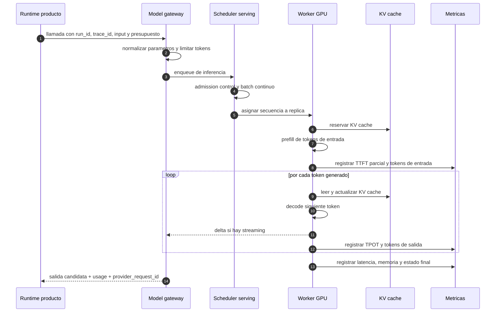
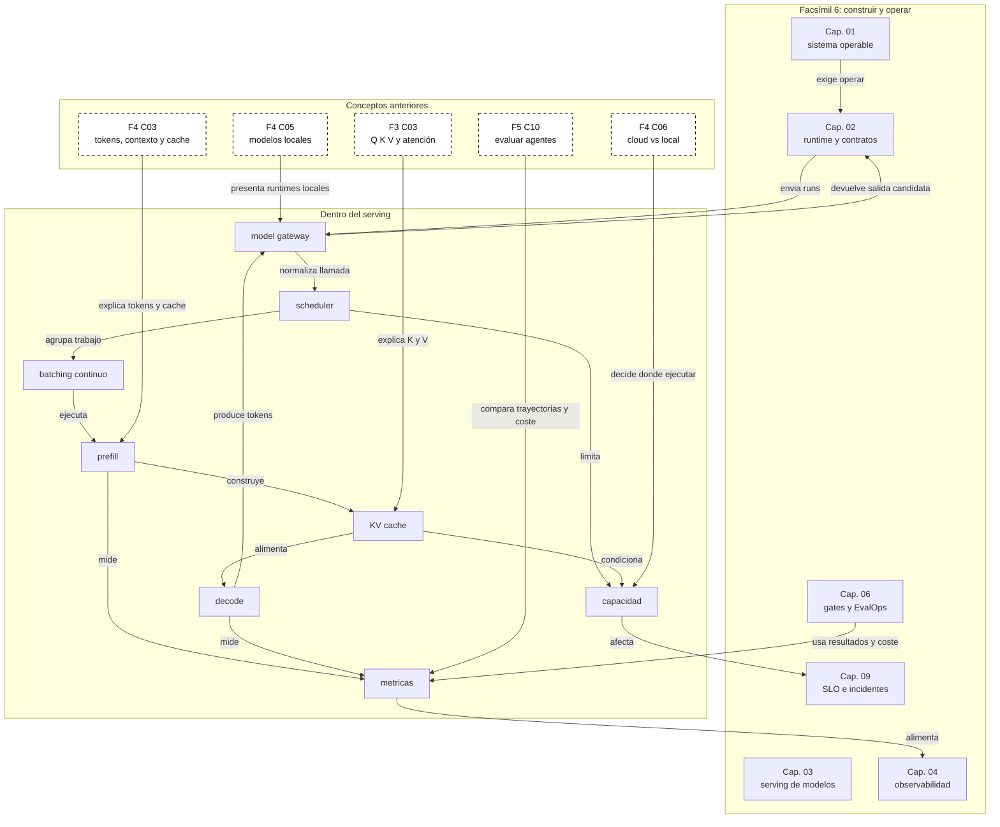

::: {.fasciculo-subtitle}
Facsímil 6 · Construir y operar
:::

# Capítulo 03: Serving de modelos: workers, batching y capacidad

## Qué deberías poder hacer al terminar

En el capítulo anterior diseñamos la entrada de una run: API, estado, cola, contrato, streaming y trazas. Ahora miramos la pieza que suele decidir si el sistema aguanta o se rompe: el **serving de modelos**.

Serving significa mantener modelos disponibles para responder peticiones reales. No es “tener un modelo descargado”. Es cargarlo, reservar memoria, aceptar tráfico, agrupar peticiones, repartir trabajo entre workers, medir latencia, controlar colas, limitar coste y decidir cuándo escalar.

Al terminar, deberías poder hacer esto:

| Resultado de aprendizaje | Evidencia de que lo sabes hacer |
|---|---|
| Separar runtime de producto y runtime de modelo. | Distingues API boundary, cola de runs, scheduler, engine de inferencia y workers. |
| Explicar prefill, decode y KV cache. | Puedes decir qué fase consume contexto, qué fase genera tokens y por qué crece la memoria. |
| Estimar memoria de un modelo servido. | Calculas pesos, KV cache, batch, contexto y margen operativo. |
| Leer métricas de serving. | Distingues TTFT, TPOT, throughput, cola, tokens de entrada, tokens de salida y goodput. |
| Dimensionar capacidad inicial. | Puedes justificar réplicas, concurrencia, cola máxima y señal de escalado. |
| Elegir entre proveedor cloud, runtime propio y modo híbrido. | Relacionas control, latencia, coste, privacidad, complejidad y mantenimiento. |

La idea central: **el modelo no “vive” en tu API; vive en una máquina de inferencia con memoria, scheduler, colas internas y límites físicos**.

## La demo que iba perfecta en mi portátil

Una demo suele empezar así: hacemos una llamada al modelo, esperamos unos segundos y la respuesta aparece. Si la demo la usa una persona, todo parece razonable. Si la usan cincuenta a la vez, aparece otra realidad: algunas peticiones esperan, otras tardan en empezar, unas consumen mucho contexto, otras generan muchas palabras y la GPU ya no trabaja como una calculadora aislada, sino como una estación compartida.

Ese cambio de escala altera la conversación. Ya no preguntamos solo “¿qué modelo responde mejor?”. Preguntamos “¿cuántas runs por minuto podemos atender?”, “¿cuánto tarda el primer token?”, “¿cuánta memoria se come el contexto?”, “¿qué ocurre si entran muchas peticiones largas?” y “¿qué medimos para saber si debemos escalar?”.

Por eso este capítulo se coloca justo después de API y colas. La cola puede aceptar trabajo, pero alguien tiene que ejecutarlo. Ese alguien no es una abstracción: es el sistema de serving.

## Qué no es servir un modelo

Servir un modelo no es ejecutar un notebook. Un notebook ayuda a explorar, pero no resuelve concurrencia, colas, memoria, métricas, límites por usuario, reinicios ni despliegue.

Tampoco es simplemente exponer un endpoint compatible con OpenAI. La compatibilidad de API puede ser comodísima, pero no te dice si el runtime soporta tu modelo, si gestiona bien KV cache, si hace batching continuo, si el streaming respeta tu contrato o si la latencia en p95 entra en tu SLO.

Y tampoco es “usar GPU” sin más. La GPU puede estar cargada y aun así ofrecer mal servicio: quizá está llena de peticiones largas, quizá la KV cache fragmenta memoria, quizá el batch está mal configurado, quizá faltan réplicas, quizá el cuello está en cola o quizá el modelo está generando demasiados tokens.

| Confusión | Lo que falta |
|---|---|
| “Tengo el modelo descargado” | Falta runtime, memoria reservada, endpoint, scheduler y métricas. |
| “Responde en local” | Falta concurrencia, contratos, colas, observabilidad y operación. |
| “La GPU está al 95%” | Falta saber si produce tokens útiles dentro de SLO. |
| “Es compatible con OpenAI” | Falta verificar streaming, errores, tools, JSON, límites y parámetros soportados. |
| “Añado otra réplica y ya está” | Falta comprobar cuello real: cola, memoria, red, CPU, disco o modelo. |

## Qué sí es el serving de modelos

El serving de modelos es la capa que convierte capacidad de cómputo en inferencias disponibles para usuarios o sistemas. Mantiene el modelo cargado, decide qué peticiones entran juntas, ejecuta prefill y decode, conserva KV cache, emite tokens, expone métricas y devuelve resultados bajo un contrato.

Fecha de corte: 27 de mayo de 2026. Fuentes consultadas ese día: documentación estable de vLLM, servidor OpenAI-compatible de vLLM, documentación de SGLang, documentación de NVIDIA TensorRT-LLM, documentación y métricas de Hugging Face Text Generation Inference, MLPerf Inference, Kubernetes HPA, Prometheus y OpenTelemetry GenAI. Lo estable es el mecanismo: prefill, decode, KV cache, batching, colas, paralelismo, métricas y capacidad. Lo cambiante son versiones, flags, modelos soportados, aceleradores disponibles, límites de proveedor y nombres exactos de métricas.

Los runtimes modernos de inferencia no son envoltorios triviales. vLLM se presenta como una librería de inferencia y serving con servidor compatible con OpenAI, streaming, paralelismos y soporte de muchas arquitecturas.^[vLLM Project. (2026). *vLLM Documentation*. https://docs.vllm.ai/en/stable/. Consultado el 27 de mayo de 2026. vLLM. (2026). *OpenAI-Compatible Server*. https://docs.vllm.ai/en/latest/serving/openai_compatible_server/. Consultado el 27 de mayo de 2026.] SGLang se describe como framework de serving de alto rendimiento para modelos de lenguaje y multimodales, con foco en baja latencia, alto throughput, RadixAttention, prefix caching y paralelismo multi-GPU.^[SGLang. (2026). *Welcome to SGLang*. https://docs.sglang.io/index.html. Consultado el 27 de mayo de 2026.] NVIDIA TensorRT-LLM ofrece APIs y runtimes para ejecutar engines optimizados en GPUs NVIDIA, con documentación sobre arquitectura, runtimes, cuantización y soporte de despliegue.^[NVIDIA. (2026). *TensorRT-LLM Documentation*. https://docs.nvidia.com/tensorrt-llm/. Consultado el 27 de mayo de 2026.] Hugging Face TGI documenta serving, streaming por SSE, tensor parallelism, Prometheus/OpenTelemetry, continuous batching y métricas exportadas.^[Hugging Face. (2026). *Text Generation Inference*. https://huggingface.co/docs/text-generation-inference/en/index. Consultado el 27 de mayo de 2026. Hugging Face. (2026). *Text Generation Inference: Metrics*. https://huggingface.co/docs/text-generation-inference/reference/metrics. Consultado el 27 de mayo de 2026.]

No hace falta memorizar todos esos nombres. Sí hace falta entender qué problema resuelven: **servir tokens de forma concurrente sin desperdiciar memoria ni perder control operativo**.

## El mecanismo por dentro: de la run al token

Una run que llega desde nuestra API no entra directamente al modelo. Normalmente pasa por varias capas:

1. **Gateway de modelo:** traduce el contrato interno al formato del runtime o proveedor.
2. **Scheduler:** decide cuándo entra la petición en ejecución.
3. **Prefill:** procesa tokens de entrada y crea la KV cache inicial.
4. **Decode:** genera tokens de salida de forma iterativa.
5. **Streaming:** entrega deltas o eventos si el producto lo permite.
6. **Métricas:** mide latencia, tokens, cola, memoria, errores y resultado.
7. **Cierre:** devuelve salida al runtime de producto para validación y persistencia.

La división entre prefill y decode es fundamental.

| Fase | Qué hace | Qué suele doler |
|---|---|---|
| Prefill | Lee todos los tokens de entrada y calcula las representaciones iniciales. | Contextos largos, documentos grandes, prompts con mucho historial. |
| Decode | Genera tokens de salida uno a uno, reutilizando KV cache. | Salidas largas, muchos usuarios concurrentes, baja velocidad por token. |
| KV cache | Guarda claves y valores de atención para no recalcular todo el contexto. | Memoria de GPU, fragmentación, límites de batch y contexto. |

En el [facsímil 3, capítulo 03](/libro/fasciculo-03/#capitulo-03) vimos Q, K y V como piezas de atención. En el [facsímil 4, capítulo 03](/libro/fasciculo-04/#capitulo-03) vimos tokens, contexto y caché. Aquí juntamos ambas ideas desde operación: cada token de contexto puede dejar rastro en memoria, y cada token generado necesita usar esa memoria una y otra vez.

La latencia de una petición de generación se puede aproximar así:

\[
T_{\text{run}} =
T_{\text{cola\_producto}} +
T_{\text{gateway}} +
T_{\text{cola\_serving}} +
T_{\text{prefill}} +
N_{\text{out}} \cdot T_{\text{decode/token}} +
T_{\text{validación}}
\]

| Símbolo | Significado | Ejemplo |
|---|---|---|
| \(T_{\text{cola\_producto}}\) | Espera en la cola de runs del producto. | 350 ms |
| \(T_{\text{gateway}}\) | Traducción, autenticación interna y envío al runtime de modelo. | 60 ms |
| \(T_{\text{cola\_serving}}\) | Espera dentro del engine de inferencia. | 240 ms |
| \(T_{\text{prefill}}\) | Procesamiento de tokens de entrada. | 520 ms |
| \(N_{\text{out}}\) | Número de tokens generados. | 180 tokens |
| \(T_{\text{decode/token}}\) | Tiempo medio por token generado. | 18 ms/token |
| \(T_{\text{validación}}\) | Validación de contrato y cierre. | 90 ms |

Con esos números:

\[
T_{\text{run}} = 350 + 60 + 240 + 520 + 180 \cdot 18 + 90 = 4500 \text{ ms}
\]

Esto explica algo que se ve mucho en producto: dos peticiones al mismo modelo no tardan lo mismo. Una pregunta corta con salida breve puede volar. Un informe con diez documentos y salida larga puede multiplicar prefill, KV cache y decode.

## Anatomía visual de un servicio de inferencia

<svg id="f6-c03-serving-modelos" xmlns="http://www.w3.org/2000/svg" viewBox="0 0 1920 1380" role="img" aria-label="Arquitectura de serving de modelos con gateway, scheduler, workers, GPU, prefill, decode, KV cache, batching, métricas y autoscaling">
  <defs>
    <style>
      #f6-c03-serving-modelos{background:#fff;color:#111;font-family:Inter,ui-sans-serif,system-ui,-apple-system,BlinkMacSystemFont,"Segoe UI",sans-serif}
      #f6-c03-serving-modelos .title{font-size:42px;font-weight:800;letter-spacing:0;fill:#111}
      #f6-c03-serving-modelos .subtitle{font-size:18px;fill:#444}
      #f6-c03-serving-modelos .h{font-size:20px;font-weight:800;fill:#111}
      #f6-c03-serving-modelos .hwhite{font-size:20px;font-weight:800;fill:#fff}
      #f6-c03-serving-modelos .label{font-size:14px;font-weight:800;fill:#111}
      #f6-c03-serving-modelos .txt{font-size:14px;fill:#222}
      #f6-c03-serving-modelos .tiny{font-size:11px;fill:#555}
      #f6-c03-serving-modelos .micro{font-size:10px;fill:#666}
      #f6-c03-serving-modelos .frame{fill:#fff;stroke:#111;stroke-width:2.2}
      #f6-c03-serving-modelos .panel{fill:#fff;stroke:#111;stroke-width:1.8}
      #f6-c03-serving-modelos .soft{fill:#f6f6f6;stroke:#111;stroke-width:1.5}
      #f6-c03-serving-modelos .dark{fill:#111;stroke:#111;stroke-width:1.5}
      #f6-c03-serving-modelos .chip{fill:#fff;stroke:#333;stroke-width:1.2}
      #f6-c03-serving-modelos .line{stroke:#111;stroke-width:2;fill:none}
      #f6-c03-serving-modelos .thin{stroke:#555;stroke-width:1.2;fill:none}
      #f6-c03-serving-modelos .dash{stroke:#555;stroke-width:1.4;fill:none;stroke-dasharray:8 6}
      #f6-c03-serving-modelos .metric{fill:#f2f2f2;stroke:#333;stroke-width:1.1}
    </style>
    <marker id="f6c03-arrow" viewBox="0 0 10 10" refX="9" refY="5" markerWidth="8" markerHeight="8" orient="auto-start-reverse">
      <path d="M 0 0 L 10 5 L 0 10 z" fill="#111"/>
    </marker>
    <pattern id="f6c03-grid" width="22" height="22" patternUnits="userSpaceOnUse">
      <path d="M 22 0 L 0 0 0 22" fill="none" stroke="#e7e7e7" stroke-width="1"/>
    </pattern>
  </defs>

  <rect x="54" y="48" width="1812" height="1284" rx="28" class="frame"/>
  <text x="960" y="106" text-anchor="middle" class="title">Serving de modelos: convertir GPU en servicio operable</text>
  <text x="960" y="140" text-anchor="middle" class="subtitle">La run no entra a un modelo suelto: pasa por gateway, scheduler, batch, prefill, decode, KV cache, métricas y escalado.</text>

  <rect x="94" y="190" width="332" height="250" rx="18" class="soft"/>
  <text x="260" y="230" text-anchor="middle" class="h">Runtime de producto</text>
  <rect x="128" y="268" width="264" height="38" rx="9" class="chip"/>
  <text x="260" y="292" text-anchor="middle" class="tiny">run_id · trace_id · contrato</text>
  <rect x="128" y="326" width="264" height="38" rx="9" class="chip"/>
  <text x="260" y="350" text-anchor="middle" class="tiny">cola de runs · prioridad · TTL</text>
  <rect x="128" y="384" width="264" height="34" rx="9" class="chip"/>
  <text x="260" y="406" text-anchor="middle" class="tiny">presupuesto de tokens y latencia</text>

  <rect x="498" y="190" width="320" height="250" rx="18" class="panel"/>
  <rect x="498" y="190" width="320" height="54" rx="18" class="dark"/>
  <text x="658" y="224" text-anchor="middle" class="hwhite">Model gateway</text>
  <text x="536" y="284" class="txt">normaliza proveedor</text>
  <text x="536" y="318" class="txt">aplica parámetros</text>
  <text x="536" y="352" class="txt">limita tokens</text>
  <text x="536" y="386" class="txt">propaga trace_id</text>

  <rect x="890" y="190" width="430" height="250" rx="18" class="soft"/>
  <text x="1105" y="230" text-anchor="middle" class="h">Scheduler de inferencia</text>
  <rect x="930" y="272" width="150" height="40" rx="9" class="chip"/>
  <text x="1005" y="298" text-anchor="middle" class="tiny">admission</text>
  <rect x="1100" y="272" width="180" height="40" rx="9" class="chip"/>
  <text x="1190" y="298" text-anchor="middle" class="tiny">batch continuo</text>
  <rect x="930" y="336" width="150" height="40" rx="9" class="chip"/>
  <text x="1005" y="362" text-anchor="middle" class="tiny">prioridad</text>
  <rect x="1100" y="336" width="180" height="40" rx="9" class="chip"/>
  <text x="1190" y="362" text-anchor="middle" class="tiny">límites de memoria</text>
  <text x="1105" y="412" text-anchor="middle" class="tiny">decide qué entra, qué espera y qué se corta por presupuesto</text>

  <rect x="1392" y="190" width="378" height="250" rx="18" class="panel"/>
  <text x="1581" y="230" text-anchor="middle" class="h">Réplicas / workers</text>
  <rect x="1430" y="274" width="86" height="86" rx="14" class="chip"/>
  <text x="1473" y="306" text-anchor="middle" class="label">W1</text>
  <text x="1473" y="334" text-anchor="middle" class="micro">GPU</text>
  <rect x="1540" y="274" width="86" height="86" rx="14" class="chip"/>
  <text x="1583" y="306" text-anchor="middle" class="label">W2</text>
  <text x="1583" y="334" text-anchor="middle" class="micro">GPU</text>
  <rect x="1650" y="274" width="86" height="86" rx="14" class="chip"/>
  <text x="1693" y="306" text-anchor="middle" class="label">W3</text>
  <text x="1693" y="334" text-anchor="middle" class="micro">GPU</text>
  <text x="1581" y="408" text-anchor="middle" class="tiny">réplicas con modelo cargado y health checks</text>

  <path d="M426 315 L498 315" class="line" marker-end="url(#f6c03-arrow)"/>
  <path d="M818 315 L890 315" class="line" marker-end="url(#f6c03-arrow)"/>
  <path d="M1320 315 L1392 315" class="line" marker-end="url(#f6c03-arrow)"/>

  <rect x="94" y="540" width="530" height="336" rx="20" class="panel"/>
  <text x="359" y="582" text-anchor="middle" class="h">Dentro de una réplica</text>
  <rect x="132" y="626" width="184" height="74" rx="12" class="dark"/>
  <text x="224" y="656" text-anchor="middle" class="hwhite">Prefill</text>
  <text x="224" y="682" text-anchor="middle" class="tiny" fill="#fff">lee entrada completa</text>
  <rect x="374" y="626" width="184" height="74" rx="12" class="dark"/>
  <text x="466" y="656" text-anchor="middle" class="hwhite">Decode</text>
  <text x="466" y="682" text-anchor="middle" class="tiny" fill="#fff">genera token a token</text>
  <rect x="132" y="744" width="426" height="82" rx="12" class="soft"/>
  <text x="345" y="774" text-anchor="middle" class="label">KV cache</text>
  <text x="345" y="802" text-anchor="middle" class="tiny">memoria por capas · contexto · batch · dtype</text>
  <path d="M316 663 L374 663" class="line" marker-end="url(#f6c03-arrow)"/>
  <path d="M466 700 C466 728 446 728 446 744" class="thin" marker-end="url(#f6c03-arrow)"/>
  <path d="M224 700 C224 728 244 728 244 744" class="thin" marker-end="url(#f6c03-arrow)"/>

  <rect x="694" y="540" width="520" height="336" rx="20" class="soft"/>
  <text x="954" y="582" text-anchor="middle" class="h">Batching continuo</text>
  <rect x="738" y="638" width="104" height="44" rx="10" class="chip"/><text x="790" y="665" text-anchor="middle" class="tiny">A decode</text>
  <rect x="858" y="638" width="104" height="44" rx="10" class="chip"/><text x="910" y="665" text-anchor="middle" class="tiny">B prefill</text>
  <rect x="978" y="638" width="104" height="44" rx="10" class="chip"/><text x="1030" y="665" text-anchor="middle" class="tiny">C decode</text>
  <rect x="1098" y="638" width="74" height="44" rx="10" class="chip"/><text x="1135" y="665" text-anchor="middle" class="tiny">D</text>
  <line x1="738" y1="720" x2="1172" y2="720" class="thin"/>
  <rect x="738" y="702" width="72" height="36" rx="8" class="dark"/><text x="774" y="725" text-anchor="middle" class="micro" fill="#fff">slot</text>
  <rect x="822" y="702" width="72" height="36" rx="8" class="chip"/><text x="858" y="725" text-anchor="middle" class="micro">slot</text>
  <rect x="906" y="702" width="72" height="36" rx="8" class="dark"/><text x="942" y="725" text-anchor="middle" class="micro" fill="#fff">slot</text>
  <rect x="990" y="702" width="72" height="36" rx="8" class="chip"/><text x="1026" y="725" text-anchor="middle" class="micro">slot</text>
  <rect x="1074" y="702" width="72" height="36" rx="8" class="chip"/><text x="1110" y="725" text-anchor="middle" class="micro">slot</text>
  <text x="954" y="792" text-anchor="middle" class="tiny">nuevas peticiones entran mientras otras terminan</text>
  <text x="954" y="822" text-anchor="middle" class="tiny">mejora utilización, pero compite por memoria y latencia</text>

  <rect x="1284" y="540" width="486" height="336" rx="20" class="panel"/>
  <text x="1527" y="582" text-anchor="middle" class="h">Capacidad y límites</text>
  <rect x="1326" y="626" width="176" height="64" rx="12" class="metric"/>
  <text x="1414" y="654" text-anchor="middle" class="label">VRAM</text>
  <text x="1414" y="674" text-anchor="middle" class="micro">pesos + KV + margen</text>
  <rect x="1554" y="626" width="176" height="64" rx="12" class="metric"/>
  <text x="1642" y="654" text-anchor="middle" class="label">TTFT</text>
  <text x="1642" y="674" text-anchor="middle" class="micro">cola + prefill</text>
  <rect x="1326" y="724" width="176" height="64" rx="12" class="metric"/>
  <text x="1414" y="752" text-anchor="middle" class="label">TPOT</text>
  <text x="1414" y="772" text-anchor="middle" class="micro">decode por token</text>
  <rect x="1554" y="724" width="176" height="64" rx="12" class="metric"/>
  <text x="1642" y="752" text-anchor="middle" class="label">Goodput</text>
  <text x="1642" y="772" text-anchor="middle" class="micro">salidas útiles en SLO</text>
  <text x="1527" y="834" text-anchor="middle" class="tiny">escalar por CPU rara vez basta: mira cola, memoria, tokens y p95</text>

  <path d="M1581 440 C1581 500 359 486 359 540" class="dash" marker-end="url(#f6c03-arrow)"/>
  <path d="M624 708 L694 708" class="line" marker-end="url(#f6c03-arrow)"/>
  <path d="M1214 708 L1284 708" class="line" marker-end="url(#f6c03-arrow)"/>

  <rect x="94" y="982" width="420" height="216" rx="18" class="soft"/>
  <text x="304" y="1022" text-anchor="middle" class="h">Observabilidad</text>
  <text x="132" y="1074" class="txt">tokens entrada/salida</text>
  <text x="132" y="1106" class="txt">queue duration</text>
  <text x="132" y="1138" class="txt">TTFT · TPOT · p95 · p99</text>
  <text x="132" y="1170" class="txt">GPU memory · batch size</text>

  <rect x="602" y="982" width="434" height="216" rx="18" class="panel"/>
  <text x="819" y="1022" text-anchor="middle" class="h">Autoscaling</text>
  <text x="640" y="1074" class="txt">cola por réplica</text>
  <text x="640" y="1106" class="txt">edad máxima en cola</text>
  <text x="640" y="1138" class="txt">memoria disponible</text>
  <text x="640" y="1170" class="txt">goodput dentro de SLO</text>

  <rect x="1124" y="982" width="646" height="216" rx="18" class="soft"/>
  <text x="1447" y="1022" text-anchor="middle" class="h">Decisión de operación</text>
  <text x="1164" y="1074" class="txt">si sube TTFT: mirar cola, prefill y admisión</text>
  <text x="1164" y="1106" class="txt">si sube TPOT: mirar decode, batch y kernel</text>
  <text x="1164" y="1138" class="txt">si baja goodput: recortar tokens, escalar o degradar</text>
  <text x="1164" y="1170" class="txt">si sube memoria: limitar contexto, batch o paralelizar</text>

  <path d="M1527 876 C1527 934 304 928 304 982" class="dash" marker-end="url(#f6c03-arrow)"/>
  <path d="M514 1090 L602 1090" class="line" marker-end="url(#f6c03-arrow)"/>
  <path d="M1036 1090 L1124 1090" class="line" marker-end="url(#f6c03-arrow)"/>

  <rect x="98" y="1244" width="1764" height="54" rx="14" class="dark"/>
  <text x="980" y="1278" text-anchor="middle" class="hwhite">Servir bien no es llenar la GPU: es entregar tokens correctos, a tiempo, con memoria controlada y señales que expliquen cada decisión.</text>
  <text x="1818" y="1322" text-anchor="end" class="micro" fill="#888888" opacity="0.45">IA para gente curiosa / Facsímil 06 / Capítulo 03 / 686f6c61</text>
</svg>

La figura muestra una separación que conviene respetar: el runtime de producto sabe de runs, contratos, permisos y trazas. El runtime de modelo sabe de batch, memoria, tokens y kernels. Si mezclamos ambas responsabilidades, acabamos con un sistema difícil de depurar: producto habla de usuarios y estados; inferencia habla de tokens, colas internas y GPU.

## Memoria: el límite que aparece antes de que lo esperes

En serving, la memoria no la ocupan solo los pesos del modelo. Hay al menos cuatro bolsas:

| Bolsa de memoria | Qué contiene | De qué depende |
|---|---|---|
| Pesos | Parámetros del modelo cargados en GPU o CPU. | Número de parámetros y precisión. |
| KV cache | Claves y valores de atención por token activo. | Capas, cabezas KV, dimensión, contexto, batch y dtype. |
| Activaciones y buffers | Tensores temporales del runtime. | Kernels, batch, backend, paralelismo y optimizaciones. |
| Overhead operativo | Fragmentación, allocator, runtime, CUDA, servidor, margen. | Implementación y configuración. |

Una fórmula útil, aunque aproximada:

\[
M_{\text{total}} \approx
M_{\text{pesos}} +
M_{\text{KV}} +
M_{\text{buffers}} +
M_{\text{margen}}
\]

| Símbolo | Significado | Ejemplo |
|---|---|---|
| \(M_{\text{pesos}}\) | Memoria ocupada por pesos del modelo. | 14 GiB |
| \(M_{\text{KV}}\) | Memoria de KV cache para secuencias activas. | 16 GiB |
| \(M_{\text{buffers}}\) | Memoria temporal de kernels, logits, activaciones y runtime. | 3 GiB |
| \(M_{\text{margen}}\) | Margen para fragmentación y variabilidad. | 5 GiB |

Con esos valores:

\[
M_{\text{total}} \approx 14 + 16 + 3 + 5 = 38 \text{ GiB}
\]

En una GPU de 40 GiB, eso parece caber. En operación, “parece” no basta. Una petición más larga, un batch mayor, un modelo con más capas o un runtime que reserve buffers distintos puede llevarte al límite. Por eso capacidad no se calcula con una media bonita, sino con escenarios.

Para pesos:

\[
M_{\text{pesos}} =
\frac{P \cdot b}{S}
\]

| Símbolo | Significado | Ejemplo |
|---|---|---|
| \(P\) | Número de parámetros. | 7.000 millones |
| \(b\) | Bytes por parámetro. | 2 bytes en BF16/FP16 |
| \(S\) | Número de shards si hay tensor parallel. | 1 |

Ejemplo:

\[
M_{\text{pesos}} =
\frac{7.000.000.000 \cdot 2}{1}
\approx 14 \text{ GB}
\]

Si el modelo se reparte en dos GPUs con tensor parallel, cada GPU no carga necesariamente “la mitad exacta de todo”, porque hay buffers y comunicación, pero la intuición de pesos por shard ayuda:

\[
M_{\text{pesos\_por\_GPU}} \approx \frac{14}{2} = 7 \text{ GB}
\]

La KV cache se puede aproximar así:

\[
M_{\text{KV}} =
2 \cdot L_{\text{capas}} \cdot H_{\text{KV}} \cdot D_{\text{head}} \cdot B_{\text{dtype}} \cdot T_{\text{activos}}
\]

| Símbolo | Significado | Ejemplo |
|---|---|---|
| \(2\) | Guardamos K y V. | 2 tensores |
| \(L_{\text{capas}}\) | Número de capas Transformer. | 32 |
| \(H_{\text{KV}}\) | Número de cabezas KV. | 8 |
| \(D_{\text{head}}\) | Dimensión de cada cabeza. | 128 |
| \(B_{\text{dtype}}\) | Bytes por valor. | 2 bytes |
| \(T_{\text{activos}}\) | Tokens activos en el batch: entrada + salida generada. | 16 secuencias x 8192 tokens |

Con batch 16 y 8192 tokens activos por secuencia:

\[
T_{\text{activos}} = 16 \cdot 8192 = 131.072
\]

\[
M_{\text{KV}} =
2 \cdot 32 \cdot 8 \cdot 128 \cdot 2 \cdot 131.072
= 17.179.869.184 \text{ bytes}
\approx 16 \text{ GiB}
\]

Esta cuenta no pretende sustituir al profiler. Pretende darte criterio. Si duplicas contexto, sube KV. Si duplicas batch, sube KV. Si usas más capas o más cabezas KV, sube KV. Si reduces precisión de KV, puede bajar memoria, pero debes medir calidad y estabilidad.

El paper de PagedAttention nace precisamente de este problema: la KV cache de cada request es grande, crece y decrece dinámicamente, y una gestión ineficiente desperdicia memoria por fragmentación o duplicación. Sus autores comparan la idea con paginación de memoria de sistemas operativos y reportan mejoras de throughput al construir vLLM sobre ese enfoque.^[Kwon, W., Li, Z., Zhuang, S., Sheng, Y., Zheng, L., Yu, C. H., Gonzalez, J. E., Zhang, H. y Stoica, I. (2023). *Efficient Memory Management for Large Language Model Serving with PagedAttention*. Proceedings of the ACM Symposium on Operating Systems Principles. https://doi.org/10.48550/arXiv.2309.06180.]

## Batching: no todas las peticiones avanzan al mismo ritmo

En un servidor web clásico, hacer batch puede sonar extraño: cada petición es independiente. En inferencia de LLMs, agrupar peticiones puede mejorar muchísimo el uso de GPU, pero tiene matices.

El batch estático agrupa peticiones y las ejecuta juntas. El problema es que las generaciones no terminan a la vez. Si una petición necesita 40 tokens y otra 800, la corta puede quedar esperando a que la larga termine, o el runtime desperdicia huecos.

El batching continuo intenta resolverlo: en cada paso de generación, el scheduler recompone el conjunto de secuencias activas. Cuando una termina, entra otra. Hugging Face TGI documenta continuous batching como una optimización para aumentar throughput, junto con streaming, tensor parallelism y métricas de producción.^[Hugging Face. (2026). *Text Generation Inference*. https://huggingface.co/docs/text-generation-inference/en/index. Consultado el 27 de mayo de 2026.]

La intuición:

| Enfoque | Ventaja | Coste |
|---|---|---|
| Sin batching | Simple y fácil de razonar. | GPU infrautilizada con tráfico concurrente. |
| Batch fijo | Mejor uso de GPU. | Esperas por secuencias largas y lotes mal equilibrados. |
| Batching continuo | Mejor ocupación con peticiones variables. | Scheduler más complejo y presión sobre KV cache. |
| Prefix caching | Reutiliza prefijos compartidos. | Requiere detectar y gestionar prefijos con cuidado. |
| Chunked prefill | Trocea entradas largas para no bloquear decode. | Añade complejidad de planificación. |

Una métrica clave aquí es la diferencia entre **throughput bruto** y **goodput**:

\[
\text{throughput} =
\frac{\text{tokens generados}}{\text{segundos}}
\]

\[
\text{goodput} =
\frac{\text{tokens de respuestas válidas dentro de SLO}}{\text{segundos}}
\]

| Métrica | Qué cuenta | Qué puede ocultar |
|---|---|---|
| Throughput | Tokens por segundo, sin mirar si llegaron a tiempo. | Puede ser alto con usuarios esperando demasiado. |
| Goodput | Tokens útiles dentro del objetivo de servicio. | Exige definir qué significa “útil” y qué SLO aplica. |
| TTFT | Tiempo hasta primer token. | Puede ser bueno aunque el final tarde demasiado. |
| TPOT | Tiempo por token durante decode. | No incluye espera en cola ni validación final. |
| p95/p99 | Cola de latencias altas. | La media puede parecer bien mientras p99 duele. |

Dean y Barroso explicaron en *The Tail at Scale* que, en sistemas grandes, la cola de latencias altas importa mucho porque muchas operaciones dependen de varias piezas y basta una pieza lenta para que la experiencia final se degrade.^[Dean, J. y Barroso, L. A. (2013). *The Tail at Scale*. Communications of the ACM, 56(2), 74-80. https://doi.org/10.1145/2408776.2408794.] En IA esto se nota enseguida: el usuario no vive la media, vive su petición.

## Workers: una réplica no es solo un proceso

Un worker de serving suele ser una réplica con modelo cargado y capacidad asignada. Puede vivir en una GPU completa, en varias GPUs, en CPU para modelos pequeños, en una partición de acelerador o detrás de un proveedor cloud.

Lo importante es que cada worker tiene un contrato operativo:

| Propiedad | Pregunta concreta |
|---|---|
| Modelo servido | ¿Qué `model_id`, versión, cuantización y plantilla de chat carga? |
| Capacidad | ¿Cuántas secuencias concurrentes acepta sin romper SLO? |
| Memoria | ¿Cuánta VRAM queda libre en escenarios largos? |
| Contexto máximo | ¿Qué límite real de entrada y salida se permite en producto? |
| Parámetros admitidos | ¿Acepta JSON, tools, logprobs, reasoning, imágenes o solo texto? |
| Health check | ¿Cómo sabemos que está vivo y realmente puede generar? |
| Warmup | ¿Se calienta el modelo antes de aceptar tráfico? |
| Drenaje | ¿Cómo deja de aceptar runs antes de reiniciar? |

El warmup merece una línea propia. Una réplica puede responder al health check HTTP y aun así estar fría: modelo no cargado, kernels no inicializados o primera petición más lenta. Por eso muchos equipos separan:

| Check | Qué comprueba |
|---|---|
| Liveness | El proceso no está colgado. |
| Readiness | Puede aceptar tráfico. |
| Model readiness | El modelo está cargado, inicializado y con memoria suficiente. |
| Synthetic generation | Puede generar una respuesta pequeña y medir latencia básica. |

El drenaje también importa. Si matas una réplica con muchas secuencias activas, puedes cortar streams o perder trabajo. Un shutdown correcto suele marcar la réplica como no lista, deja de recibir nuevas peticiones, termina las activas dentro de un límite y luego se apaga.

## Runtime propio, proveedor cloud o mezcla

No todo sistema necesita servir modelos propios. A veces usar una API cloud es lo correcto. Otras veces necesitas modelos locales, runtimes propios o una mezcla.

| Opción | Qué controlas | Qué delegas | Cuándo encaja |
|---|---|---|---|
| API de proveedor | Prompt, parámetros, contrato de producto, evals y routing. | Modelo, GPU, scheduling interno y capacidad base. | Producto que prioriza velocidad de integración y operación simple. |
| Runtime propio | Modelo, versión, cuantización, hardware, scheduler y datos. | Nada esencial de inferencia, salvo cloud si alquilas GPU. | Necesitas control de pesos, coste, latencia, región o investigación aplicada. |
| OpenAI-compatible local | Contrato parecido a APIs conocidas. | Depende del runtime concreto. | Quieres cambiar proveedor por runtime propio con menos fricción. |
| Híbrido | Rutas cloud y rutas propias según tarea. | Parte de la complejidad se reparte. | Quieres fallback, coste controlado o separación por sensibilidad/tamaño. |
| Batch offline | Ejecución diferida, no interactiva. | Experiencia en tiempo real. | Grandes volúmenes sin presión de latencia interactiva. |

MLPerf Inference sirve como referencia de benchmarking de inferencia en datacenter, con resultados comparables bajo reglas específicas.^[MLCommons. (2026). *MLPerf Inference: Datacenter Benchmark*. https://mlcommons.org/benchmarks/inference-datacenter/. Consultado el 27 de mayo de 2026.] No sustituye tus pruebas, pero recuerda algo sano: medir inferencia exige protocolo. Si comparas runtimes con prompts distintos, batch distinto, contexto distinto y SLO distinto, no estás comparando.

## Dimensionar capacidad con números

Capacidad empieza con una pregunta concreta: ¿qué carga queremos soportar y con qué objetivo?

Ejemplo:

| Variable de carga | Valor |
|---|---:|
| Llegadas medias | 2 runs/s |
| Pico esperado | 8 runs/s durante 5 minutos |
| Tokens de entrada p50 | 1.200 |
| Tokens de entrada p95 | 8.000 |
| Tokens de salida p50 | 180 |
| Tokens de salida p95 | 700 |
| SLO interactivo | p95 menor o igual a 6 s |
| Error budget mensual | 2% de runs fuera de SLO |

Con la ley de Little, que ya usamos en el capítulo anterior:

\[
L = \lambda W
\]

Si llegan \(\lambda = 8\) runs/s en pico y queremos que el tiempo medio dentro del sistema sea \(W = 4\) s:

\[
L = 8 \cdot 4 = 32 \text{ runs concurrentes}
\]

Pero eso no significa “necesito 32 GPUs”. Significa que el sistema completo tendrá unas 32 runs en curso: algunas en cola, algunas en prefill, algunas en decode, algunas validando. Ahora hay que saber cuántas puede sostener cada réplica sin romper memoria ni p95.

Una aproximación inicial de réplicas:

\[
R =
\left\lceil
\frac{\lambda_{\text{pico}} \cdot T_{\text{serving,p95}}}
C_{\text{réplica}} \cdot U_{\text{objetivo}}}
\right\rceil
\]

| Símbolo | Significado | Ejemplo |
|---|---|---|
| \(R\) | Réplicas necesarias. | ? |
| \(\lambda_{\text{pico}}\) | Llegadas pico. | 8 runs/s |
| \(T_{\text{serving,p95}}\) | Tiempo de serving p95 por run. | 4 s |
| \(C_{\text{réplica}}\) | Concurrencia útil por réplica. | 10 runs |
| \(U_{\text{objetivo}}\) | Utilización objetivo, dejando margen. | 0,70 |

\[
R =
\left\lceil
\frac{8 \cdot 4}{10 \cdot 0,70}
\right\rceil
=
\left\lceil
4,57
\right\rceil
= 5
\]

Esta fórmula no te da la verdad. Te da una hipótesis para probar. Después haces load test con distribución realista de tokens y miras p50, p95, p99, memoria y coste.

## Señales de autoscaling

Kubernetes HPA ajusta réplicas a partir de métricas observadas, como CPU, memoria o métricas personalizadas.^[Kubernetes. (2026). *Horizontal Pod Autoscaling*. https://kubernetes.io/docs/concepts/workloads/autoscaling/horizontal-pod-autoscale/. Consultado el 27 de mayo de 2026.] Para IA, CPU no suele bastar. Puedes tener CPU tranquila y GPU saturada, KV cache llena o cola creciendo.

Prometheus recomienda buenas prácticas de nombres y etiquetas para métricas, con prefijos de aplicación y unidades coherentes.^[Prometheus. (2026). *Metric and label naming*. https://prometheus.io/docs/practices/naming/. Consultado el 27 de mayo de 2026.] Esto parece burocracia hasta que tienes que escribir una alerta a las tres de la mañana. Una métrica mal nombrada se convierte en confusión.

Señales útiles para escalar serving:

| Señal | Qué indica | Decisión posible |
|---|---|---|
| `serving_queue_depth` | Hay más peticiones esperando. | Añadir réplica o aplicar backpressure. |
| `serving_queue_oldest_seconds` | La petición más vieja espera demasiado. | Priorizar, escalar o rechazar entrada nueva. |
| `gpu_memory_available_bytes` | Queda poco margen de KV cache. | Bajar batch, limitar contexto o añadir GPU. |
| `ttft_seconds_p95` | Primer token llega tarde. | Revisar cola, prefill, contexto y admisión. |
| `tpot_seconds_p95` | Cada token tarda demasiado. | Revisar decode, batch, kernels y modelo. |
| `tokens_per_second` | Producción bruta. | Mirar junto a goodput, no sola. |
| `goodput_runs_per_second` | Runs válidas dentro de SLO. | Escalar si cae durante tráfico normal. |
| `contract_failure_ratio` | Salidas rechazadas por contrato. | No se arregla con más GPU; mirar prompt, modelo o schema. |

TGI expone métricas como tamaño de batch, duración de decode, duración de inferencia, tamaño de cola, duración total, tokens generados, longitud de entrada, tiempo medio por token y duración de cola.^[Hugging Face. (2026). *Text Generation Inference: Metrics*. https://huggingface.co/docs/text-generation-inference/reference/metrics. Consultado el 27 de mayo de 2026.] Aunque uses otro runtime, esa lista es pedagógica: te enseña qué mirar.

OpenTelemetry también trabaja convenciones semánticas para sistemas GenAI, de modo que proveedores, modelos, operaciones, tokens y atributos de inferencia puedan observarse con nombres compartidos.^[OpenTelemetry. (2026). *Semantic Conventions for Generative AI Systems*. https://opentelemetry.io/docs/specs/semconv/gen-ai/. Consultado el 27 de mayo de 2026.] No todo estará cerrado para siempre, pero la dirección es clara: si no etiquetas bien la inferencia, luego no puedes compararla.

## En el día a día

En un equipo real, este capítulo aparece cuando alguien dice “el modelo tarda” y nadie sabe qué significa “tarda”. Puede tardar en entrar al serving, tardar en prefill, tardar en generar, tardar en validar o tardar en llegar al cliente.

Una conversación seria separa síntomas:

| Síntoma | Pregunta de ingeniería |
|---|---|
| Primer token lento | ¿Cola interna, prefill largo, modelo frío o scheduler saturado? |
| Tokens salen despacio | ¿Decode lento, batch demasiado grande, kernel, cuantización o modelo grande? |
| Memoria al límite | ¿KV cache, contexto, batch, pesos, buffers o fragmentación? |
| GPU alta pero usuarios esperando | ¿Throughput bruto alto, pero goodput bajo? |
| Funciona con 1 usuario y falla con 50 | ¿No se probó distribución realista de concurrencia y tokens? |
| Escalado no mejora | ¿El cuello no era réplica de serving, sino cola, base de datos, red o contrato? |

El trabajo del ingeniero no es adivinar. Es diseñar el sistema para que la respuesta esté en las métricas.

## Por qué debería importarte

Porque muchas decisiones caras se esconden en serving. Un modelo pequeño bien servido puede dar mejor experiencia que un modelo grande mal configurado. Un contexto gigantesco puede disparar KV cache y empeorar p95. Una cola sin backpressure puede aceptar trabajo que nunca cumplirá SLO. Un autoscaler basado solo en CPU puede reaccionar tarde o mirar la señal equivocada.

Y porque este capítulo conecta directamente con presupuesto. En IA, coste no es solo “precio por token”. También es GPU alquilada, memoria desaprovechada, réplicas calientes, reintentos, colas largas, salidas descartadas por contrato y tiempo de ingeniería depurando sin señales.

## Manos a la obra

**Práctica:** un calculador de capacidad inicial.

Kit ejecutable de este capítulo: `labs/f6/capitulo-practicas/`.

```bash
cd labs/f6/capitulo-practicas
python3 ops/run_f6_practices.py --chapter c03 --write --fail-on-invalid
```

Vamos a construir un pequeño calculador que no pretende acertar al milímetro. Pretende obligarte a escribir tus supuestos: parámetros, precisión, capas, KV heads, contexto, batch, latencia, llegada pico y utilización objetivo.

Guárdalo como `ops/ai/serving_capacity.py`:

```python
from dataclasses import dataclass
from math import ceil


BYTES_IN_GIB = 1024**3


@dataclass(frozen=True)
class ModelShape:
    name: str
    parameters_billion: float
    bytes_per_weight: float
    layers: int
    kv_heads: int
    head_dim: int
    bytes_per_kv_value: float


@dataclass(frozen=True)
class Workload:
    peak_runs_per_second: float
    serving_latency_p95_seconds: float
    useful_concurrency_per_replica: int
    target_utilization: float
    active_sequences: int
    active_tokens_per_sequence: int
    buffer_gib: float
    margin_gib: float


def weights_gib(model: ModelShape, tensor_parallel_shards: int = 1) -> float:
    total_bytes = model.parameters_billion * 1_000_000_000 * model.bytes_per_weight
    return total_bytes / tensor_parallel_shards / BYTES_IN_GIB


def kv_cache_gib(model: ModelShape, workload: Workload) -> float:
    active_tokens = workload.active_sequences * workload.active_tokens_per_sequence
    total_bytes = (
        2
        * model.layers
        * model.kv_heads
        * model.head_dim
        * model.bytes_per_kv_value
        * active_tokens
    )
    return total_bytes / BYTES_IN_GIB


def total_memory_gib(model: ModelShape, workload: Workload, tensor_parallel_shards: int = 1) -> float:
    return (
        weights_gib(model, tensor_parallel_shards)
        + kv_cache_gib(model, workload)
        + workload.buffer_gib
        + workload.margin_gib
    )


def needed_replicas(workload: Workload) -> int:
    numerator = workload.peak_runs_per_second * workload.serving_latency_p95_seconds
    denominator = workload.useful_concurrency_per_replica * workload.target_utilization
    return ceil(numerator / denominator)


def queue_warning(workload: Workload, replicas: int) -> str:
    useful_capacity = replicas * workload.useful_concurrency_per_replica * workload.target_utilization
    required = workload.peak_runs_per_second * workload.serving_latency_p95_seconds
    if useful_capacity < required:
        return "insuficiente: la cola crecera en pico"
    if useful_capacity < required * 1.25:
        return "ajustado: deja poco margen para p95 y reintentos"
    return "razonable para una primera prueba de carga"


model = ModelShape(
    name="demo-7b-bf16",
    parameters_billion=7.0,
    bytes_per_weight=2.0,
    layers=32,
    kv_heads=8,
    head_dim=128,
    bytes_per_kv_value=2.0,
)

workload = Workload(
    peak_runs_per_second=8.0,
    serving_latency_p95_seconds=4.0,
    useful_concurrency_per_replica=10,
    target_utilization=0.70,
    active_sequences=16,
    active_tokens_per_sequence=8192,
    buffer_gib=3.0,
    margin_gib=5.0,
)

replicas = needed_replicas(workload)

print("modelo:", model.name)
print("pesos GiB:", round(weights_gib(model), 2))
print("KV cache GiB:", round(kv_cache_gib(model, workload), 2))
print("memoria total GiB:", round(total_memory_gib(model, workload), 2))
print("replicas iniciales:", replicas)
print("lectura de cola:", queue_warning(workload, replicas))
```

Salida esperada:

```text
modelo: demo-7b-bf16
pesos GiB: 13.04
KV cache GiB: 16.0
memoria total GiB: 37.04
replicas iniciales: 5
lectura de cola: ajustado: deja poco margen para p95 y reintentos
```

Este código enseña varias cosas:

| Línea mental | Qué te obliga a decidir |
|---|---|
| `parameters_billion` y `bytes_per_weight` | Tamaño de pesos y precisión. |
| `layers`, `kv_heads`, `head_dim` | Forma interna que condiciona KV cache. |
| `active_sequences` y `active_tokens_per_sequence` | Batch y contexto real, no el máximo teórico de la ficha. |
| `buffer_gib` y `margin_gib` | Espacio para runtime, fragmentación y variabilidad. |
| `peak_runs_per_second` y p95 | Carga de producto, no solo benchmark de modelo. |
| `target_utilization` | Margen operativo para no ir siempre al límite. |

Variaciones útiles:

1. Cambia `active_tokens_per_sequence` de 8192 a 32768 y mira la KV cache.
2. Cambia `bytes_per_weight` a 0.5 para simular pesos en 4 bits, pero deja la KV cache en 2 bytes.
3. Sube `peak_runs_per_second` a 20 y mira cuántas réplicas aparecen.
4. Baja `target_utilization` a 0.55 y observa el coste de ir con más margen.

La práctica importante no es “este número es exacto”. La práctica importante es no desplegar a ciegas.

## Cómo encaja todo

Primero veamos el flujo temporal de una run que llega al serving:



Ahora el mapa conceptual del capítulo:



La relación más importante es esta: el capítulo 2 decide qué entra y con qué contrato; el capítulo 3 decide si hay capacidad real para ejecutarlo; el capítulo 4 nos dará señales para no operar a oscuras.

## Vocabulario aprendido

| Término | Definición |
|---|---|
| Serving | Capa que mantiene modelos cargados y atiende inferencias con límites de memoria, latencia y capacidad. |
| Engine de inferencia | Motor que ejecuta el modelo, gestiona memoria, kernels, batch y generación. |
| Scheduler | Componente que decide qué peticiones entran en ejecución y cuándo. |
| Prefill | Fase que procesa tokens de entrada antes de generar. |
| Decode | Fase que genera tokens de salida paso a paso. |
| KV cache | Memoria que guarda claves y valores de atención para reutilizar contexto durante generación. |
| Batching continuo | Planificación que recompone el batch mientras unas secuencias terminan y otras entran. |
| Prefix caching | Reutilización de KV cache cuando varias peticiones comparten prefijo. |
| Chunked prefill | Técnica que divide entradas largas para que no bloqueen completamente otras generaciones. |
| TTFT | Tiempo hasta el primer token o primer evento útil. |
| TPOT | Tiempo por token generado durante decode. |
| Throughput | Trabajo completado por unidad de tiempo. |
| Goodput | Trabajo correcto y dentro de SLO por unidad de tiempo. |
| Tensor parallel | Reparto de operaciones o pesos de una capa entre varias GPUs. |
| Pipeline parallel | Reparto de capas entre dispositivos, con comunicación entre etapas. |
| Data parallel | Réplicas completas del modelo atienden tráfico distinto. |
| Model readiness | Señal de que el modelo está cargado y puede generar, no solo de que el proceso vive. |
| Warmup | Ejecución inicial para cargar pesos, inicializar kernels y reducir primera latencia. |
| Drenaje | Proceso de dejar de aceptar nuevas peticiones antes de apagar una réplica. |
| Autoscaling | Ajuste automático de réplicas a partir de métricas observadas. |

## Dónde solía tropezar yo

| Tropiezo | Por qué es un problema | Antídoto |
|---|---|---|
| Medir solo tokens por segundo | Puedes producir mucho y aun así llegar tarde. | Medir goodput, TTFT, TPOT y p95/p99. |
| Confundir contexto máximo con contexto recomendable | El máximo puede caber, pero destruir coste y latencia. | Diseñar límites por caso de uso y medir KV cache. |
| Escalar por CPU | El cuello puede estar en GPU, KV cache, cola o scheduler. | Escalar con métricas de serving y cola. |
| Olvidar el warmup | La primera petición puede parecer un fallo de latencia. | Separar liveness, readiness y model readiness. |
| Poner batch muy alto | Mejora throughput bruto, pero puede empeorar TTFT o memoria. | Probar batch con distribución realista y SLO. |
| No distinguir prefill de decode | No sabes si duele la entrada larga o la salida larga. | Medir ambas fases por separado. |
| Comparar runtimes sin protocolo | Cada prueba cambia prompt, tokens, batch o hardware. | Escribir un benchmark reproducible antes de decidir. |
| Tratar la GPU como infinita | KV cache y buffers aparecen antes que el entusiasmo. | Calcular memoria con margen y probar p95. |

## Antes de pasar página

- [ ] ¿Puedes explicar por qué servir un modelo no es lo mismo que tenerlo descargado?
- [ ] ¿Puedes dibujar el camino runtime de producto -> gateway -> scheduler -> worker -> KV cache -> salida?
- [ ] ¿Puedes explicar prefill y decode con tus palabras?
- [ ] ¿Puedes decir por qué la KV cache crece con batch y contexto?
- [ ] ¿Puedes estimar memoria de pesos con parámetros y bytes por peso?
- [ ] ¿Puedes estimar memoria de KV cache con capas, cabezas KV, dimensión y tokens activos?
- [ ] ¿Puedes distinguir throughput y goodput?
- [ ] ¿Puedes explicar TTFT y TPOT sin mezclarlos?
- [ ] ¿Puedes justificar por qué p95 y p99 importan más que una media cómoda?
- [ ] ¿Puedes decir cuándo el batching continuo ayuda y cuándo puede complicar memoria o latencia?
- [ ] ¿Puedes definir qué debería comprobar un health check de modelo?
- [ ] ¿Puedes proponer señales de autoscaling mejores que CPU para inferencia?
- [ ] ¿Puedes explicar por qué un contrato fallido no se arregla añadiendo GPU?
- [ ] ¿Puedes usar el calculador de capacidad y cambiar supuestos para ver el impacto?
- [ ] ¿Puedes decidir cuándo usar API cloud, runtime propio o arquitectura híbrida?

## Para saber más

- Dean, J. y Barroso, L. A. (2013). *The Tail at Scale*. Communications of the ACM, 56(2), 74-80. https://doi.org/10.1145/2408776.2408794
- Hugging Face. (2026). *Text Generation Inference*. https://huggingface.co/docs/text-generation-inference/en/index
- Hugging Face. (2026). *Text Generation Inference: Metrics*. https://huggingface.co/docs/text-generation-inference/reference/metrics
- Kubernetes. (2026). *Horizontal Pod Autoscaling*. https://kubernetes.io/docs/concepts/workloads/autoscaling/horizontal-pod-autoscale/
- Kwon, W., Li, Z., Zhuang, S., Sheng, Y., Zheng, L., Yu, C. H., Gonzalez, J. E., Zhang, H. y Stoica, I. (2023). *Efficient Memory Management for Large Language Model Serving with PagedAttention*. Proceedings of the ACM Symposium on Operating Systems Principles. https://doi.org/10.48550/arXiv.2309.06180
- Little, J. D. C. (1961). *A Proof for the Queuing Formula: L = λW*. Operations Research, 9(3), 383-387. https://doi.org/10.1287/opre.9.3.383
- MLCommons. (2026). *MLPerf Inference: Datacenter Benchmark*. https://mlcommons.org/benchmarks/inference-datacenter/
- NVIDIA. (2026). *TensorRT-LLM Documentation*. https://docs.nvidia.com/tensorrt-llm/
- OpenTelemetry. (2026). *Semantic Conventions for Generative AI Systems*. https://opentelemetry.io/docs/specs/semconv/gen-ai/
- Prometheus. (2026). *Metric and label naming*. https://prometheus.io/docs/practices/naming/
- SGLang. (2026). *Welcome to SGLang*. https://docs.sglang.io/index.html
- vLLM Project. (2026). *vLLM Documentation*. https://docs.vllm.ai/en/stable/
- vLLM. (2026). *OpenAI-Compatible Server*. https://docs.vllm.ai/en/latest/serving/openai_compatible_server/

## En resumen

| Idea | Qué debes llevarte |
|---|---|
| Serving es una capa operativa, no un endpoint bonito. | Mantiene modelos cargados, agenda peticiones, gestiona memoria, genera tokens y emite señales. |
| Prefill y decode explican latencias distintas. | Entrada larga duele en prefill; salida larga duele en decode. |
| La KV cache convierte contexto y batch en memoria real. | Más tokens activos pueden limitar concurrencia antes que los pesos del modelo. |
| Batching mejora throughput, pero no es gratis. | Puede subir utilización y también presión de memoria o TTFT. |
| Capacidad se dimensiona con supuestos escritos. | Llegadas, p95, concurrencia útil, memoria, margen y goodput deben quedar explícitos. |
| Escalar exige mirar la señal correcta. | CPU sola no basta para inferencia; hacen falta cola, TTFT, TPOT, memoria, tokens y SLO. |
