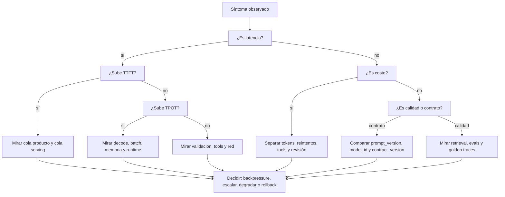
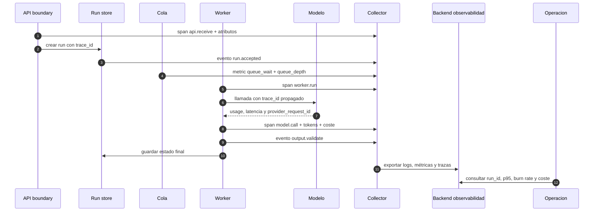
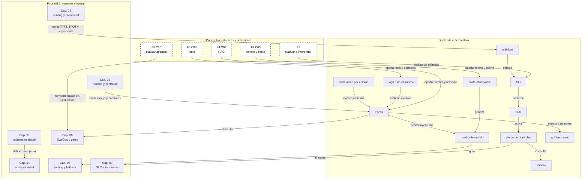

::: {.fasciculo-subtitle}
Facsímil 6 · Construir y operar
:::

# Capítulo 04: Observabilidad: logs, métricas, trazas y costes

## Qué deberías poder hacer al terminar

En el capítulo 02 aprendimos a convertir una petición en una run. En el capítulo 03 vimos que el modelo se sirve dentro de un sistema con scheduler, KV cache, workers y límites de capacidad. Ahora toca una pregunta más incómoda: cuando algo va lento, caro, incorrecto o raro, **¿cómo lo sabemos sin adivinar?**

Observabilidad no es “tener muchos logs”. Tampoco es abrir un dashboard enorme y esperar que una gráfica confiese. Observabilidad es diseñar el sistema para que cada run deje señales suficientes, estructuradas y útiles.

Al terminar, deberías poder hacer esto:

| Resultado de aprendizaje | Evidencia de que lo sabes hacer |
|---|---|
| Separar logs, métricas y trazas. | Sabes cuándo usar un evento, una serie agregada o una historia completa de ejecución. |
| Diseñar una traza de una run de IA. | Incluyes `trace_id`, spans, atributos, eventos, versiones, tokens, costes y estado final. |
| Definir SLIs y SLOs específicos de IA. | Mides latencia, coste, salida válida, contrato, recuperación, tools y serving. |
| Evitar métricas imposibles de mantener. | Controlas cardinalidad, etiquetas, nombres y retención. |
| Diseñar alertas accionables. | Alertas por síntomas de usuario, burn rate y señales que alguien pueda corregir. |
| Calcular coste por run aceptada. | No te quedas en precio por token; conectas coste con calidad y contrato. |

La idea central: **si una run no deja una historia reconstruible, no existe operativamente**.

## El problema que venimos a resolver

Imagina que un usuario dice: “ayer el asistente tardó mucho y al final me dio una respuesta que no servía”. Sin observabilidad, el equipo abre logs sueltos, busca por hora aproximada, mira si hubo error del proveedor, revisa alguna métrica de CPU y acaba con una hipótesis floja.

Con observabilidad bien diseñada, la pregunta cambia. Buscamos el `run_id`, abrimos la traza y vemos: cola de producto 800 ms, cola de serving 1200 ms, prefill largo por contexto de 38.000 tokens, dos reintentos de retrieval, salida rechazada una vez por contrato, coste final 0,18 EUR y estado `succeeded_with_review`.

La diferencia no es estética. La primera escena obliga a investigar a oscuras. La segunda permite razonar.

## Qué no es observabilidad

Observabilidad no es acumular todo “por si acaso”. Guardar prompts completos, documentos, salidas y dumps internos sin criterio crea coste, riesgo de privacidad, ruido y deuda.

Tampoco es una lista interminable de métricas. Si nadie sabe qué significa una serie, quién la mantiene, qué umbral importa o qué acción provoca, esa métrica es decoración operativa.

Y no es alertar por cada anomalía. El libro de SRE de Google insiste en que monitorizar debe ayudar a entender qué está roto y por qué, pero las alertas que interrumpen a personas deben ser simples, accionables y con poco ruido.^[Ewaschuk, R. (2016). *Monitoring Distributed Systems*. En B. Beyer, C. Jones, J. Petoff y N. R. Murphy (eds.), *Site Reliability Engineering*. https://sre.google/sre-book/monitoring-distributed-systems/. Consultado el 27 de mayo de 2026.]

| Confusión | Por qué falla | Mejor enfoque |
|---|---|---|
| Guardar todos los prompts completos | Aumenta coste, sensibilidad y ruido. | Guardar IDs, hashes, tamaños, versiones y muestras controladas. |
| Medir solo latencia media | Oculta p95, p99 y usuarios que esperan demasiado. | Usar histogramas, percentiles y SLO. |
| Alertar por causa interna | Puede sonar grave sin afectar al usuario. | Alertar por síntoma medible y accionable. |
| Mirar solo logs | Pierdes agregación y causalidad entre servicios. | Combinar logs, métricas y trazas. |
| Mirar solo coste por token | Ignora reintentos, fallos de contrato y revisión. | Medir coste por run aceptada. |

## Qué sí es observabilidad en IA

Observabilidad es la capacidad de contestar preguntas de ingeniería con señales del sistema. En IA generativa, esas preguntas tienen una forma propia:

| Pregunta | Señal necesaria |
|---|---|
| ¿Qué versión respondió? | `model_id`, `prompt_version`, `manifest_version`, `contract_version`. |
| ¿Qué vio el modelo? | IDs de documentos, chunks, tamaños, hashes y política de retención. |
| ¿Cuánto costó? | Tokens de entrada, tokens de salida, precio aplicado, reintentos y proveedor. |
| ¿Dónde se fue la latencia? | Spans de cola, retrieval, tools, prefill, decode, validación y salida. |
| ¿La respuesta era válida? | Estado de contrato, evaluadores, revisión y motivo de rechazo. |
| ¿Se saturó el serving? | Cola interna, TTFT, TPOT, memoria, batch y goodput. |
| ¿Qué debería hacer soporte? | `run_id`, estado final, error tipado, resumen de decisión y siguiente acción. |

Fecha de corte: 27 de mayo de 2026. Fuentes consultadas ese día: Google SRE Book, Google SRE Workbook, OpenTelemetry traces, logs, metrics y convenciones semánticas GenAI, Prometheus metric naming, W3C Trace Context y documentación oficial de Grafana, Langfuse, LangSmith, Phoenix, Helicone, Braintrust, OpenInference, OpenLLMetry y Datadog LLM Observability. Lo estable es la arquitectura: logs, métricas, trazas, SLIs, SLOs, cardinalidad, sampling, alertas y coste. Lo cambiante son nombres exactos de atributos, SDKs, backends de observabilidad, productos comerciales y convenciones GenAI en evolución.

OpenTelemetry describe trazas como una forma de entender el camino de una petición a través de una aplicación, compuestas por spans relacionados.^[OpenTelemetry. (2026). *Traces*. https://opentelemetry.io/docs/concepts/signals/traces/. Consultado el 27 de mayo de 2026.] También define APIs para crear spans, asociarlos al contexto activo y registrar atributos, eventos y estado.^[OpenTelemetry. (2026). *Tracing API*. https://opentelemetry.io/docs/specs/otel/trace/api/. Consultado el 27 de mayo de 2026.] Sus convenciones semánticas para GenAI incorporan atributos sobre sistemas generativos, operaciones, modelos y uso de tokens.^[OpenTelemetry. (2026). *Semantic Conventions for Generative AI Systems*. https://opentelemetry.io/docs/specs/semconv/gen-ai/. Consultado el 27 de mayo de 2026.]

## Las tres señales principales

Los tres nombres clásicos son logs, métricas y trazas. No compiten: responden a preguntas distintas.

| Señal | Pregunta que responde | Ejemplo en una run de IA |
|---|---|---|
| Log | ¿Qué evento ocurrió? | `contract.failed` con campo ausente y versión de schema. |
| Métrica | ¿Cuánto ocurre en el tiempo? | `ai_run_latency_seconds_bucket` por ruta y estado. |
| Traza | ¿Qué camino siguió esta run concreta? | `api.receive -> queue.wait -> retrieval.search -> model.call -> output.validate`. |

OpenTelemetry trata logs como registros con cuerpo, severidad, timestamp, atributos y contexto de traza cuando existe.^[OpenTelemetry. (2026). *Logs*. https://opentelemetry.io/docs/concepts/signals/logs/. Consultado el 27 de mayo de 2026.] Las métricas, en cambio, representan medidas agregables en el tiempo: contadores, histogramas, gauges y otros instrumentos.^[OpenTelemetry. (2026). *Metrics*. https://opentelemetry.io/docs/concepts/signals/metrics/. Consultado el 27 de mayo de 2026.]

Una forma de pensarlo:

| Si preguntas... | Usa principalmente... | Porque... |
|---|---|---|
| “¿Qué ocurrió en esta run?” | Traza | Necesitas causalidad y orden. |
| “¿Cuántas runs fallan por contrato?” | Métrica | Necesitas agregación temporal. |
| “¿Qué campo faltaba en esta salida?” | Log o evento de span | Necesitas detalle puntual. |
| “¿Se degradó el p95 tras desplegar?” | Métrica + traza de muestra | Necesitas tendencia y ejemplos. |
| “¿Qué documento se recuperó?” | Traza con atributos controlados | Necesitas contexto sin guardar contenido completo. |

## La traza de una run de IA

Una traza debería parecerse a una historia técnica. No una novela, no un volcado masivo. Una historia con capítulos claros.

```text
trace_id = trace_8f21...
run_id   = run_20260527_0042

api.receive
  input.validate
  run.create
queue.wait
retrieval.search
  retrieval.rerank
tool.call
model.call
  model.prefill
  model.decode
output.validate
run.close
```

Cada span debe tener atributos. La regla: guarda lo necesario para depurar, evaluar y auditar sin conservar más contenido del necesario.

| Span | Atributos útiles | Qué no conviene meter sin política |
|---|---|---|
| `api.receive` | `tenant_id`, `route`, `request_bytes`, `idempotency_replay`. | Payload completo. |
| `input.validate` | `contract_version`, `valid`, `error_count`. | Datos sensibles de entrada. |
| `retrieval.search` | `index_version`, `top_k`, `query_tokens`, `source_ids`. | Texto completo de documentos. |
| `tool.call` | `tool_name`, `timeout_ms`, `result_state`, `retry_count`. | Secretos, credenciales o respuestas extensas. |
| `model.call` | `provider`, `model_id`, `input_tokens`, `output_tokens`, `ttft_ms`, `tpot_ms`. | Prompt completo por defecto. |
| `output.validate` | `contract_version`, `valid`, `missing_fields`, `extra_fields`. | Salida completa si contiene datos sensibles. |
| `run.close` | `final_state`, `latency_ms`, `cost_eur`, `accepted`, `review_required`. | Comentarios internos sin estructura. |

El contexto de traza permite que varios servicios compartan la misma historia. W3C Trace Context estandariza cabeceras como `traceparent` para propagar identificadores de traza entre servicios.^[World Wide Web Consortium. (2021). *Trace Context Level 2*. https://www.w3.org/TR/trace-context-2/. Consultado el 27 de mayo de 2026.] En nuestro runtime, eso significa que la API, la cola, el worker y el gateway de modelo no deberían inventar historias separadas.

## Anatomía visual de observabilidad para IA

<svg id="f6-c04-observabilidad-ia" xmlns="http://www.w3.org/2000/svg" viewBox="0 0 1920 1400" role="img" aria-label="Arquitectura de observabilidad para runs de IA con logs, métricas, trazas, coste, SLO, alertas y depuración">
  <defs>
    <style>
      #f6-c04-observabilidad-ia{background:#fff;color:#111;font-family:Inter,ui-sans-serif,system-ui,-apple-system,BlinkMacSystemFont,"Segoe UI",sans-serif}
      #f6-c04-observabilidad-ia .title{font-size:42px;font-weight:800;fill:#111}
      #f6-c04-observabilidad-ia .subtitle{font-size:18px;fill:#444}
      #f6-c04-observabilidad-ia .h{font-size:20px;font-weight:800;fill:#111}
      #f6-c04-observabilidad-ia .hwhite{font-size:20px;font-weight:800;fill:#fff}
      #f6-c04-observabilidad-ia .txt{font-size:14px;fill:#222}
      #f6-c04-observabilidad-ia .tiny{font-size:11px;fill:#555}
      #f6-c04-observabilidad-ia .micro{font-size:10px;fill:#666}
      #f6-c04-observabilidad-ia .frame{fill:#fff;stroke:#111;stroke-width:2.2}
      #f6-c04-observabilidad-ia .panel{fill:#fff;stroke:#111;stroke-width:1.7}
      #f6-c04-observabilidad-ia .soft{fill:#f6f6f6;stroke:#111;stroke-width:1.4}
      #f6-c04-observabilidad-ia .dark{fill:#111;stroke:#111;stroke-width:1.5}
      #f6-c04-observabilidad-ia .chip{fill:#fff;stroke:#333;stroke-width:1.2}
      #f6-c04-observabilidad-ia .metric{fill:#f2f2f2;stroke:#333;stroke-width:1.1}
      #f6-c04-observabilidad-ia .line{stroke:#111;stroke-width:2;fill:none}
      #f6-c04-observabilidad-ia .dash{stroke:#555;stroke-width:1.4;fill:none;stroke-dasharray:8 6}
      #f6-c04-observabilidad-ia .thin{stroke:#555;stroke-width:1.2;fill:none}
    </style>
    <marker id="f6c04-arrow" viewBox="0 0 10 10" refX="9" refY="5" markerWidth="8" markerHeight="8" orient="auto-start-reverse">
      <path d="M 0 0 L 10 5 L 0 10 z" fill="#111"/>
    </marker>
  </defs>

  <rect x="54" y="48" width="1812" height="1298" rx="28" class="frame"/>
  <text x="960" y="106" text-anchor="middle" class="title">Observabilidad de IA: de run opaca a historia depurable</text>
  <text x="960" y="140" text-anchor="middle" class="subtitle">Cada petición emite logs, métricas y trazas para explicar latencia, coste, calidad, contrato y capacidad.</text>

  <rect x="96" y="200" width="360" height="238" rx="18" class="soft"/>
  <text x="276" y="240" text-anchor="middle" class="h">Run de producto</text>
  <rect x="132" y="282" width="288" height="36" rx="9" class="chip"/>
  <text x="276" y="305" text-anchor="middle" class="tiny">run_id · trace_id · tenant</text>
  <rect x="132" y="336" width="288" height="36" rx="9" class="chip"/>
  <text x="276" y="359" text-anchor="middle" class="tiny">prompt_version · model_id</text>
  <rect x="132" y="390" width="288" height="28" rx="8" class="chip"/>
  <text x="276" y="409" text-anchor="middle" class="micro">contrato · presupuesto · estado final</text>

  <rect x="544" y="200" width="360" height="238" rx="18" class="panel"/>
  <rect x="544" y="200" width="360" height="54" rx="18" class="dark"/>
  <text x="724" y="234" text-anchor="middle" class="hwhite">Instrumentación</text>
  <text x="584" y="294" class="txt">crear spans por fase</text>
  <text x="584" y="328" class="txt">emitir eventos estructurados</text>
  <text x="584" y="362" class="txt">medir histogramas y contadores</text>
  <text x="584" y="396" class="txt">redactar o resumir contenido</text>

  <rect x="992" y="200" width="360" height="238" rx="18" class="soft"/>
  <text x="1172" y="240" text-anchor="middle" class="h">Collector / pipeline</text>
  <rect x="1034" y="286" width="276" height="36" rx="9" class="chip"/>
  <text x="1172" y="309" text-anchor="middle" class="tiny">sampling · redacción · batch</text>
  <rect x="1034" y="340" width="276" height="36" rx="9" class="chip"/>
  <text x="1172" y="363" text-anchor="middle" class="tiny">export a métricas, logs y trazas</text>
  <rect x="1034" y="394" width="276" height="28" rx="8" class="chip"/>
  <text x="1172" y="413" text-anchor="middle" class="micro">retención · coste · control de cardinalidad</text>

  <rect x="1440" y="200" width="330" height="238" rx="18" class="panel"/>
  <text x="1605" y="240" text-anchor="middle" class="h">Backends</text>
  <rect x="1474" y="284" width="84" height="72" rx="12" class="metric"/>
  <text x="1516" y="315" text-anchor="middle" class="tiny">logs</text>
  <text x="1516" y="337" text-anchor="middle" class="micro">eventos</text>
  <rect x="1584" y="284" width="84" height="72" rx="12" class="metric"/>
  <text x="1626" y="315" text-anchor="middle" class="tiny">métricas</text>
  <text x="1626" y="337" text-anchor="middle" class="micro">series</text>
  <rect x="1694" y="284" width="84" height="72" rx="12" class="metric"/>
  <text x="1736" y="315" text-anchor="middle" class="tiny">trazas</text>
  <text x="1736" y="337" text-anchor="middle" class="micro">spans</text>
  <text x="1605" y="408" text-anchor="middle" class="tiny">consulta por run_id, trace_id, modelo, versión y estado</text>

  <path d="M456 319 L544 319" class="line" marker-end="url(#f6c04-arrow)"/>
  <path d="M904 319 L992 319" class="line" marker-end="url(#f6c04-arrow)"/>
  <path d="M1352 319 L1440 319" class="line" marker-end="url(#f6c04-arrow)"/>

  <rect x="96" y="540" width="510" height="278" rx="18" class="panel"/>
  <text x="351" y="580" text-anchor="middle" class="h">Traza de una run</text>
  <rect x="134" y="626" width="142" height="38" rx="9" class="dark"/><text x="205" y="650" text-anchor="middle" class="micro" fill="#fff">api.receive</text>
  <rect x="314" y="626" width="142" height="38" rx="9" class="chip"/><text x="385" y="650" text-anchor="middle" class="micro">queue.wait</text>
  <rect x="134" y="694" width="142" height="38" rx="9" class="chip"/><text x="205" y="718" text-anchor="middle" class="micro">retrieval</text>
  <rect x="314" y="694" width="142" height="38" rx="9" class="dark"/><text x="385" y="718" text-anchor="middle" class="micro" fill="#fff">model.call</text>
  <rect x="224" y="762" width="142" height="38" rx="9" class="chip"/><text x="295" y="786" text-anchor="middle" class="micro">validate</text>
  <path d="M276 645 L314 645" class="thin" marker-end="url(#f6c04-arrow)"/>
  <path d="M385 664 C385 686 205 672 205 694" class="thin" marker-end="url(#f6c04-arrow)"/>
  <path d="M276 713 L314 713" class="thin" marker-end="url(#f6c04-arrow)"/>
  <path d="M385 732 C385 754 295 740 295 762" class="thin" marker-end="url(#f6c04-arrow)"/>

  <rect x="704" y="540" width="520" height="278" rx="18" class="soft"/>
  <text x="964" y="580" text-anchor="middle" class="h">Cuadro de mando mínimo</text>
  <rect x="742" y="626" width="190" height="58" rx="11" class="metric"/>
  <text x="837" y="652" text-anchor="middle" class="tiny">latencia</text>
  <text x="837" y="672" text-anchor="middle" class="micro">TTFT · p95 · p99</text>
  <rect x="996" y="626" width="190" height="58" rx="11" class="metric"/>
  <text x="1091" y="652" text-anchor="middle" class="tiny">calidad</text>
  <text x="1091" y="672" text-anchor="middle" class="micro">contrato · eval · revisión</text>
  <rect x="742" y="724" width="190" height="58" rx="11" class="metric"/>
  <text x="837" y="750" text-anchor="middle" class="tiny">coste</text>
  <text x="837" y="770" text-anchor="middle" class="micro">tokens · EUR/run aceptada</text>
  <rect x="996" y="724" width="190" height="58" rx="11" class="metric"/>
  <text x="1091" y="750" text-anchor="middle" class="tiny">saturación</text>
  <text x="1091" y="770" text-anchor="middle" class="micro">cola · memoria · batch</text>

  <rect x="1322" y="540" width="448" height="278" rx="18" class="panel"/>
  <text x="1546" y="580" text-anchor="middle" class="h">Alertas y SLO</text>
  <text x="1360" y="636" class="txt">síntomas: usuario afectado</text>
  <text x="1360" y="674" class="txt">burn rate: presupuesto consumido</text>
  <text x="1360" y="712" class="txt">acción: owner y runbook</text>
  <text x="1360" y="750" class="txt">silencio: si no hay acción, no alerta</text>
  <rect x="1360" y="778" width="372" height="24" rx="7" class="dark"/>
  <text x="1546" y="795" text-anchor="middle" class="micro" fill="#fff">alertar menos, diagnosticar mejor</text>

  <path d="M1605 438 C1605 504 351 490 351 540" class="dash" marker-end="url(#f6c04-arrow)"/>
  <path d="M606 679 L704 679" class="line" marker-end="url(#f6c04-arrow)"/>
  <path d="M1224 679 L1322 679" class="line" marker-end="url(#f6c04-arrow)"/>

  <rect x="96" y="928" width="520" height="248" rx="18" class="soft"/>
  <text x="356" y="968" text-anchor="middle" class="h">Coste observable</text>
  <text x="136" y="1026" class="txt">coste por llamada</text>
  <text x="136" y="1060" class="txt">coste por run aceptada</text>
  <text x="136" y="1094" class="txt">coste por tenant, tarea y versión</text>
  <text x="136" y="1128" class="txt">coste de reintentos y salidas descartadas</text>

  <rect x="704" y="928" width="520" height="248" rx="18" class="panel"/>
  <text x="964" y="968" text-anchor="middle" class="h">Higiene de datos</text>
  <text x="744" y="1026" class="txt">hashes e IDs antes que contenido bruto</text>
  <text x="744" y="1060" class="txt">redacción antes de exportar</text>
  <text x="744" y="1094" class="txt">sampling con criterio de depuración</text>
  <text x="744" y="1128" class="txt">retención diferente para logs, métricas y trazas</text>

  <rect x="1322" y="928" width="448" height="248" rx="18" class="soft"/>
  <text x="1546" y="968" text-anchor="middle" class="h">Decisión operativa</text>
  <text x="1360" y="1026" class="txt">degradar ruta</text>
  <text x="1360" y="1060" class="txt">hacer rollback</text>
  <text x="1360" y="1094" class="txt">subir capacidad</text>
  <text x="1360" y="1128" class="txt">bloquear release con gate</text>

  <path d="M1546 818 C1546 884 356 874 356 928" class="dash" marker-end="url(#f6c04-arrow)"/>
  <path d="M616 1052 L704 1052" class="line" marker-end="url(#f6c04-arrow)"/>
  <path d="M1224 1052 L1322 1052" class="line" marker-end="url(#f6c04-arrow)"/>

  <rect x="98" y="1252" width="1764" height="54" rx="14" class="dark"/>
  <text x="980" y="1286" text-anchor="middle" class="hwhite">La observabilidad buena convierte una queja vaga en una ruta de diagnóstico: qué pasó, dónde, cuánto costó y qué hacemos ahora.</text>
  <text x="1818" y="1330" text-anchor="end" class="micro" fill="#888888" opacity="0.45">IA para gente curiosa / Facsímil 06 / Capítulo 04 / 686f6c61</text>
</svg>

El SVG tiene muchas cajas porque la observabilidad también es arquitectura. No basta con “emitir algo”. Hay que decidir qué se instrumenta, cómo se transporta, dónde se guarda, cuánto tiempo vive, qué se muestra y qué acción provoca.

## SLIs y SLOs para sistemas de IA

Ya vimos que un SLI es un indicador medible y un SLO es un objetivo interno sobre ese indicador. Aquí lo aplicamos a IA.

Las cuatro señales doradas de SRE son latencia, tráfico, errores y saturación.^[Ewaschuk, 2016.] En IA conviene mantenerlas y añadir dos dimensiones: calidad operativa y coste.

| Señal | SLI posible | SLO posible |
|---|---|---|
| Latencia | Porcentaje de runs con p95 menor o igual a 6 s. | 95% de runs interactivas terminan en 6 s o menos. |
| Tráfico | Runs por minuto por tarea, tenant y ruta. | El sistema soporta pico esperado sin rechazos indebidos. |
| Errores | Runs con estado final no aceptado. | Menos del 2% terminan en `timed_out`, `contract_failed` o `provider_unavailable`. |
| Saturación | Edad máxima en cola y memoria disponible. | Cola p95 menor o igual a 1 s y margen de memoria mayor al 15%. |
| Calidad | Salidas aceptadas por contrato y eval. | 98% de respuestas publicadas pasan contrato y evaluación automática mínima. |
| Coste | Coste por run aceptada. | p95 de coste por run aceptada menor o igual a 0,08 EUR. |

La fórmula del SLI de éxito operativo puede ser:

\[
SLI_{\text{aceptadas}} =
\frac{N_{\text{runs aceptadas}}}{N_{\text{runs totales}}}
\]

| Símbolo | Significado | Ejemplo |
|---|---|---|
| \(N_{\text{runs aceptadas}}\) | Runs que terminaron con salida válida, dentro de contrato y sin revisión bloqueante. | 9.700 |
| \(N_{\text{runs totales}}\) | Runs evaluables en la ventana. | 10.000 |
| \(SLI_{\text{aceptadas}}\) | Proporción de runs aceptadas. | 0,97 |

\[
SLI_{\text{aceptadas}} = \frac{9700}{10000} = 0,97
\]

Si el SLO era 98%, estamos por debajo. No hace falta dramatizar: hace falta mirar la traza agregada y saber qué grupo pesa más.

Para coste:

\[
C_{\text{aceptada}} =
\frac{C_{\text{tokens}} + C_{\text{serving}} + C_{\text{tools}} + C_{\text{revisión}}}{N_{\text{runs aceptadas}}}
\]

| Símbolo | Significado | Ejemplo |
|---|---|---|
| \(C_{\text{tokens}}\) | Coste de tokens de modelos o proveedor. | 120 EUR |
| \(C_{\text{serving}}\) | Coste de GPUs o runtime propio. | 80 EUR |
| \(C_{\text{tools}}\) | Coste de herramientas externas. | 20 EUR |
| \(C_{\text{revisión}}\) | Coste estimado de revisión humana o soporte. | 30 EUR |
| \(N_{\text{runs aceptadas}}\) | Runs aceptadas en la ventana. | 5.000 |

\[
C_{\text{aceptada}} =
\frac{120 + 80 + 20 + 30}{5000}
= 0,05 \text{ EUR}
\]

Esto cambia el debate. Un modelo más caro por token puede ser más barato por run aceptada si reduce reintentos, revisiones y salidas descartadas.

## Burn rate: gastar el presupuesto de error

El SRE Workbook explica cómo convertir SLOs en alertas mirando el consumo del presupuesto de error, no solo un umbral aislado.^[Wilkinson, J. (2018). *Alerting on SLOs*. En B. Beyer, N. R. Murphy, D. Rensin, K. Kawahara y S. Thorne (eds.), *The Site Reliability Workbook*. https://sre.google/workbook/alerting-on-slos/. Consultado el 27 de mayo de 2026.]

Si tu SLO es 99%, tu presupuesto de error es 1%. Si en una ventana concreta fallan 5% de runs, consumes presupuesto cinco veces más rápido que lo permitido.

\[
\text{burn rate} =
\frac{\text{error rate observado}}{\text{error rate permitido}}
\]

| Símbolo | Significado | Ejemplo |
|---|---|---|
| Error rate observado | Proporción real de runs fuera de SLO en una ventana. | 5% |
| Error rate permitido | Proporción permitida por el SLO. | 1% |
| Burn rate | Veces que consumes el presupuesto. | 5x |

\[
\text{burn rate} = \frac{0,05}{0,01} = 5
\]

En IA, el “error” no tiene que ser solo HTTP 500. Puede ser:

| Error operativo | Cómo se detecta |
|---|---|
| Timeout | Estado final `timed_out`. |
| Contrato fallido | Estado `contract_failed`. |
| Coste fuera de presupuesto | `cost_eur > budget.max_cost_eur`. |
| Latencia fuera de SLO | `latency_ms > slo.max_latency_ms`. |
| Salida no aceptada | Eval mínima o revisión bloqueante. |
| Ruta degradada sin aviso | Fallback no comunicado o no trazado. |

Aquí aparece una diferencia importante: no todo error técnico afecta igual al usuario, y no toda respuesta HTTP exitosa es éxito de producto. Una run puede devolver `200 OK` y estar fuera de SLO porque costó demasiado, tardó demasiado o falló contrato semántico.

## Métricas sin volverse loco con la cardinalidad

Prometheus recomienda nombres claros, unidades consistentes y etiquetas que mantengan significado estable.^[Prometheus. (2026). *Metric and label naming*. https://prometheus.io/docs/practices/naming/. Consultado el 27 de mayo de 2026.] En IA, la tentación de etiquetar todo es enorme: `run_id`, `user_id`, `prompt`, `document_id`, `tool_args`, `model_id`, `tenant_id`, `cost_eur`...

No lo hagas así. Una métrica con demasiadas combinaciones de etiquetas se vuelve cara, lenta e inmanejable.

| Etiqueta | ¿Buena para métrica? | Mejor uso |
|---|---:|---|
| `route` | Sí | Métrica. |
| `model_family` | Sí | Métrica. |
| `final_state` | Sí | Métrica. |
| `tenant_tier` | A veces | Métrica si hay pocos valores. |
| `run_id` | No | Traza o log. |
| `user_id` | No | Traza con política de acceso, o hash. |
| `prompt_text` | No | No en métrica; contenido controlado aparte. |
| `document_id` | No si hay muchos | Traza, log o agregación por corpus. |
| `cost_eur` | No como etiqueta | Valor numérico o atributo de span. |

Nombres razonables:

```text
ai_run_total
ai_run_latency_seconds_bucket
ai_run_cost_eur_bucket
ai_model_input_tokens_total
ai_model_output_tokens_total
ai_contract_failure_total
ai_serving_queue_seconds_bucket
ai_tool_call_total
ai_retrieval_documents_total
```

Cada métrica debería poder contestar algo. Si no sabes qué decisión habilita, todavía no es una buena métrica.

## Logs: detalle sin ruido

Un log útil en IA debería ser estructurado. No:

```text
algo falló llamando al modelo
```

Mejor:

```json
{
  "event": "model.call.completed",
  "timestamp": "2026-05-27T18:30:00Z",
  "run_id": "run_42",
  "trace_id": "trace_abc",
  "span_id": "span_model",
  "provider": "local-vllm",
  "model_id": "qwen3-8b-instruct",
  "input_tokens": 4200,
  "output_tokens": 380,
  "latency_ms": 3100,
  "cost_eur": 0.021,
  "status": "ok"
}
```

El log debe ayudar a reconstruir un evento. No debe convertirse en un contenedor donde metemos todo lo que no supimos modelar.

Una regla práctica:

| Guarda en log | Guarda en traza | Guarda en métrica |
|---|---|---|
| Evento concreto y explicación breve. | Causalidad completa de la run. | Agregado temporal. |
| Error tipado y atributos. | Duración por fase. | Contadores, histogramas y gauges. |
| Decisión tomada. | Relación padre-hijo entre pasos. | SLO, p95, p99, burn rate. |

## Costes observables

El coste en IA tiene varias capas:

| Coste | Ejemplo | Señal |
|---|---|---|
| Tokens | Entrada y salida de modelo. | `input_tokens`, `output_tokens`, precio aplicado. |
| Serving | GPU propia, memoria y réplicas. | Coste por hora, utilización y goodput. |
| Herramientas | APIs externas, búsquedas, OCR, bases de datos. | `tool_name`, `tool_cost_eur`. |
| Reintentos | Llamadas repetidas por timeout o contrato. | `retry_count`, coste acumulado. |
| Revisión | Tiempo humano o soporte. | `review_required`, coste estimado. |
| Almacenamiento | Logs, trazas, métricas, datasets. | Retención y volumen exportado. |

El coste por token es solo una pieza. El coste por run aceptada te dice si la arquitectura sirve.

Comparación sencilla:

| Sistema | Coste total | Runs totales | Runs aceptadas | Coste por aceptada |
|---|---:|---:|---:|---:|
| A | 100 EUR | 10.000 | 5.000 | 0,020 EUR |
| B | 160 EUR | 10.000 | 9.500 | 0,017 EUR |

El sistema B parece más caro hasta que miras aceptadas. En producto, pagar menos por respuestas que luego se descartan no es ahorro; es trabajo inútil bien facturado.

## Sampling y retención

No puedes guardar todo con el mismo detalle para siempre. Debes decidir qué se conserva, cuánto tiempo y con qué nivel.

| Señal | Retención típica | Regla razonable |
|---|---|---|
| Métricas agregadas | Semanas o meses. | Largas para tendencias y capacidad. |
| Trazas completas | Menos tiempo. | Más detalle para fallos, canary y muestras. |
| Logs de eventos | Variable. | Retener eventos operativos, no contenido sensible sin motivo. |
| Prompts/salidas completas | Muy controlado. | Solo con consentimiento, redacción, muestreo o entorno de evaluación. |
| Datasets de eval | Versionado largo. | Sirven para comparar cambios. |

Sampling no significa “tirar cosas al azar sin pensar”. Puedes muestrear:

| Estrategia | Cuándo usarla |
|---|---|
| 100% de errores | Para investigar fallos de contrato, timeouts y rutas nuevas. |
| 100% de canary | Mientras una versión nueva está en prueba. |
| 1-5% de éxitos | Para tener muestra sana sin coste excesivo. |
| Tail sampling | Guardar trazas lentas o caras tras ver el resultado. |
| Muestreo por tenant/tarea | Asegurar cobertura de segmentos importantes. |

La cola de latencias altas importa mucho. Dean y Barroso explican que los percentiles altos pueden dominar la experiencia de usuario cuando una operación depende de varias piezas.^[Dean, J. y Barroso, L. A. (2013). *The Tail at Scale*. Communications of the ACM, 56(2), 74-80. https://doi.org/10.1145/2408776.2408794.] Por eso no basta con muestrear “runs normales”. También necesitamos mirar las lentas, caras y rechazadas.

## De métricas a decisiones

Un dashboard bueno no enseña todo. Enseña lo que decide.

| Panel | Pregunta | Decisión |
|---|---|---|
| Salud de run | ¿Cuántas terminan bien, mal o con revisión? | Parar release, degradar ruta o investigar contrato. |
| Latencia | ¿Dónde se va el tiempo? | Ajustar cola, serving, contexto o tools. |
| Coste | ¿Qué tarea/modelo/tenant dispara gasto? | Cambiar routing, budgets o límites. |
| Calidad | ¿Baja la aceptación por versión? | Rollback o gate de despliegue. |
| Serving | ¿Está saturado el modelo? | Escalar, limitar batch/contexto o cambiar runtime. |
| Retrieval | ¿Se recupera demasiado o mal? | Ajustar índice, `top_k`, reranker o corpus. |

La ley de Little vuelve a aparecer:

\[
L = \lambda W
\]

Si ves que sube \(W\), el tiempo de espera, y la llegada \(\lambda\) no baja, entonces \(L\), trabajo acumulado, crece. En observabilidad eso se traduce en una alerta por cola vieja, no solo por CPU alta.^[Little, J. D. C. (1961). *A Proof for the Queuing Formula: L = λW*. Operations Research, 9(3), 383-387. https://doi.org/10.1287/opre.9.3.383.]

## Correlacionar por versión

En sistemas de IA, muchas averías no aparecen como “se cayó el servidor”. Aparecen como “desde esta mañana responde peor”, “ahora cuesta más”, “este tipo de casos ya no pasa contrato” o “el RAG recupera fuentes menos útiles”. Para investigar eso, cada señal debe poder conectarse con la versión que la produjo.

No basta con tener `run_id`. Necesitamos que métricas, trazas y logs incluyan las versiones que cambian el comportamiento.

| Versión | Dónde debería aparecer | Qué pregunta permite responder |
|---|---|---|
| `model_id` | Span `model.call`, métrica de coste y dashboard. | ¿El cambio viene del modelo? |
| `prompt_version` | Run, traza, logs de validación y evals. | ¿El prompt nuevo rompió formato o criterio? |
| `contract_version` | Entrada, salida, error y validador. | ¿Cambió el schema o falló la salida? |
| `retrieval_index_version` | Span `retrieval.search`. | ¿El índice nuevo recupera peor? |
| `embedding_model_id` | Retrieval y métricas de cobertura. | ¿Cambió el espacio vectorial? |
| `tool_version` | Span `tool.call`. | ¿La tool cambió comportamiento o respuesta? |
| `runtime_version` | Serving y worker. | ¿El runtime nuevo alteró latencia o streaming? |
| `release_id` | Toda la run. | ¿Qué despliegue estaba activo? |

La regla de ingeniería es simple: **si una pieza puede cambiar el resultado, debe estar versionada en la traza**. Si no, el postmortem se convierte en arqueología.

## Dashboard mínimo que sí usaría

Un dashboard mínimo no intenta enseñar todas las series. Intenta guiar una investigación en menos de dos minutos. Primero enseña síntomas; después permite bajar a causas.

Yo lo diseñaría con seis paneles:

| Panel | Métricas principales | Filtro obligatorio | Pregunta que responde |
|---|---|---|---|
| Salud de runs | `ai_run_total`, ratio de aceptadas, estados finales. | `task`, `route`, `release_id`. | ¿El sistema está entregando resultados aceptables? |
| Latencia por fase | p50/p95/p99 de API, cola, retrieval, model, validación. | `task`, `model_id`, `queue`. | ¿Dónde se va el tiempo? |
| Coste | coste por run, coste por aceptada, tokens, reintentos. | `tenant_tier`, `task`, `model_id`. | ¿Qué está encareciendo el sistema? |
| Contratos y evals | `contract_failed`, score mínimo, revisión requerida. | `contract_version`, `prompt_version`. | ¿La salida sirve o solo “responde”? |
| Serving | TTFT, TPOT, cola de serving, memoria, batch, goodput. | `model_id`, `runtime_version`. | ¿El cuello está en inferencia? |
| Retrieval y tools | top_k, chunks usados, tool duration, tool error, permisos. | `index_version`, `tool_name`. | ¿El contexto o una herramienta explica el problema? |

El dashboard no reemplaza la traza. Te dice dónde mirar. La traza te cuenta la historia de una run concreta.

## Alertas concretas, no ruido

Una alerta buena tiene cinco partes: síntoma, umbral, ventana, owner y acción. Si falta la acción, probablemente no debería interrumpir a nadie.

Algunas reglas razonables para empezar:

| Alerta | Condición | Primera acción |
|---|---|---|
| Burn rate alto | `burn_rate_15m > 4` y al menos 30 runs evaluables. | Abrir dashboard de salud, filtrar por `release_id` y `task`. |
| Contratos fallando | `contract_failed_ratio_15m > 0.03`. | Comparar `prompt_version`, `contract_version` y ejemplos de trazas. |
| Coste fuera de presupuesto | `cost_per_accepted_p95_30m > budget`. | Ver tokens, reintentos, routing y tareas dominantes. |
| Cola vieja | `queue_oldest_seconds > queue_slo_seconds`. | Mirar llegadas, workers sanos, backpressure y serving. |
| TTFT alto | `ttft_p95_15m > ttft_slo`. | Revisar cola de serving, prefill, contexto y warmup. |
| TPOT alto | `tpot_p95_15m > tpot_slo`. | Revisar decode, batch, memoria y runtime. |
| Trazas incompletas | `trace_missing_ratio_1h > 0.01`. | Revisar propagación de `trace_id` y collector. |
| Reintentos altos | `retry_per_run_p95 > 1`. | Localizar dependencia lenta y política de backoff. |

Ejemplo expresado como pseudorregla:

```text
alert: AIHighBurnRate
if: burn_rate_15m > 4 and ai_run_total_15m >= 30
for: 10m
owner: ai-runtime
action: revisar /dashboards/ai-runs filtrando release_id, task y final_state
```

Lo importante no es copiar esta sintaxis. Lo importante es que la alerta ya trae una hipótesis de trabajo.

## Runbook operativo

Una alerta sin runbook deja al equipo improvisando. Un runbook no debe ser una enciclopedia; debe decir qué mirar primero, qué acción tomar y cuándo escalar la investigación.

Para este capítulo, un runbook mínimo podría ser:

| Síntoma | Señal | Primera comprobación | Acción inmediata | Acción de fondo |
|---|---|---|---|---|
| Suben los timeouts | `timed_out_ratio` y p95 de latencia. | ¿Cola, retrieval, model o tool? | Reducir entrada nueva, activar ruta degradada o ampliar workers. | Ajustar SLO, capacidad y límites por tarea. |
| Fallan contratos | `contract_failed_ratio`. | ¿Cambió prompt, modelo o contrato? | Rollback de `prompt_version` o bloquear release. | Añadir casos al dataset de eval. |
| Sube coste por aceptada | `cost_per_accepted_p95`. | ¿Tokens, reintentos, modelo o revisión? | Limitar salida, routing a modelo menor o pedir confirmación. | Rediseñar budgets y eval de coste. |
| Sube TTFT | `ttft_p95`. | ¿Prefill largo o cola de serving? | Limitar contexto, bajar batch o calentar réplica. | Separar rutas largas de interactivas. |
| Sube TPOT | `tpot_p95`. | ¿Decode lento, memoria o runtime? | Reducir salida máxima o mover tráfico. | Revisar runtime, cuantización y hardware. |
| Faltan trazas | `trace_missing_ratio`. | ¿Se perdió `traceparent` en cola o worker? | Elevar sampling de errores y revisar collector. | Test de propagación en CI. |
| Retrieval flojo | baja cobertura o baja aceptación en RAG. | ¿Cambió índice, embedding o corpus? | Volver a índice anterior o bajar confianza. | Eval específica de retrieval. |

Fíjate en el patrón: el runbook separa acción inmediata de acción de fondo. La inmediata protege el servicio. La de fondo evita repetir el problema.

## Árbol de diagnóstico

Un árbol ayuda a que dos personas distintas investiguen de forma parecida. No sustituye criterio, pero evita saltar directamente al modelo.



La frase que me repetiría un ingeniero: **no empieces por cambiar el prompt si la traza dice que el problema vive en cola, coste o contrato**.

## Golden traces

Igual que usamos datasets de evaluación, podemos guardar trazas representativas. Una golden trace no es “una traza bonita”; es una ejecución esperada que sirve como patrón.

Ejemplos:

| Golden trace | Qué representa | Qué debería permanecer estable |
|---|---|---|
| `support_summary_small` | Pregunta corta con un documento. | 1 retrieval, 1 model call, contrato válido, coste bajo. |
| `rag_long_context` | Consulta con varios documentos largos. | Retrieval trazado, prefill visible, coste dentro de presupuesto. |
| `tool_required` | Run que necesita una tool concreta. | Tool llamada una vez, permiso correcto, salida validada. |
| `contract_failure` | Salida intencionalmente inválida. | El validador bloquea y no se publica. |
| `fallback_route` | Ruta degradada cuando el modelo principal no cumple. | Estado y motivo de fallback visibles. |

Estas trazas sirven para dos cosas: enseñar a nuevos miembros cómo se ve una run sana, y detectar regresiones de observabilidad. Si actualizas el runtime y la golden trace ya no tiene `model_id` o `contract_version`, has perdido una señal crítica aunque la respuesta final parezca correcta.

## Observabilidad específica de RAG y tools

RAG y tools son las dos zonas donde más se suele perder información útil. El modelo responde al final, pero la causa del problema puede estar antes.

Para RAG, yo exigiría:

| Señal | Por qué importa |
|---|---|
| `retrieval_index_version` | Permite saber qué índice respondió. |
| `embedding_model_id` | Cambia el espacio semántico de búsqueda. |
| `query_tokens` | Una query enorme puede explicar coste y ruido. |
| `top_k` y `reranker_version` | Cambian cobertura y precisión. |
| `source_ids` y `chunk_ids` | Permiten reconstruir evidencia sin guardar texto completo. |
| `retrieval_latency_ms` | Separa lentitud de búsqueda de lentitud de modelo. |
| `empty_retrieval` | Detecta respuestas sin contexto real. |

Para tools:

| Señal | Por qué importa |
|---|---|
| `tool_name` y `tool_version` | Una tool puede cambiar aunque el modelo no cambie. |
| `permission_scope` | Permite revisar si la acción estaba permitida. |
| `args_schema_version` | Los argumentos también tienen contrato. |
| `duration_ms` | Separa tools lentas de modelo lento. |
| `result_state` | Distingue éxito, timeout, cancelación o respuesta parcial. |
| `retry_count` | Explica coste y latencia. |
| `result_summary` | Resume sin guardar toda la salida. |

La regla: si RAG o tools influyen en la respuesta, deben aparecer en la traza. Si no aparecen, el modelo cargará con culpas que quizá no son suyas.

## Coste de observar

Observar también cuesta. Cuesta almacenamiento, ingestión, consultas, retención, mantenimiento y atención humana. La observabilidad mal diseñada puede volverse otro sistema que nadie entiende.

Costes típicos:

| Coste | Cómo aparece | Control |
|---|---|---|
| Ingesta | Demasiados logs o spans por token. | Agregar eventos, muestrear y evitar contenido repetido. |
| Cardinalidad | Etiquetas con `run_id`, `user_id` o IDs infinitos. | Mover IDs a trazas/logs, no a métricas. |
| Retención | Guardar trazas completas demasiado tiempo. | Retención por tipo de señal y criticidad. |
| Consulta | Dashboards lentos o caros. | Paneles mínimos y agregaciones previas. |
| Privacidad | Contenido sensible en sistemas de observabilidad. | Redacción, hashes, permisos y export control. |
| Atención | Alertas sin acción. | Owner, runbook y criterio de silencio. |

Una buena pregunta antes de añadir señal es: “¿Quién la usará, para qué decisión, durante cuánto tiempo y con qué nivel de acceso?”. Si no sabemos responder, quizá la señal todavía no está madura.

## Herramientas que se usan para observar sistemas de IA

Una herramienta de observabilidad no sustituye al contrato de instrumentación. Si tu run no emite `run_id`, `trace_id`, `model_id`, `prompt_version`, `contract_version`, tokens, coste y estado final, ninguna plataforma lo va a adivinar de forma fiable. Lo que sí hace una buena herramienta es recoger esas señales, conservarlas, cruzarlas y convertirlas en consultas, alertas y evaluaciones.

Yo lo separaría en tres capas: estándar de instrumentación, backend de observabilidad general y capa específica de IA.

### Estándar e instrumentación

| Herramienta | Qué resuelve | Pros | Contras |
|---|---|---|---|
| [OpenTelemetry](https://opentelemetry.io/docs/) | APIs, SDKs, Collector, protocolo OTLP, trazas, métricas, logs y convenciones semánticas. | Evita acoplar el código a un único proveedor; propaga contexto entre API, cola, worker, retrieval y modelo; tiene convenciones para sistemas generativos. | No es “un dashboard”; hay que elegir backend, diseñar atributos y vigilar volumen. La auto-instrumentación no entiende del todo tu dominio. |
| [OpenInference](https://arize-ai.github.io/openinference/) | Convenciones e instrumentación pensadas para IA sobre la idea de OpenTelemetry. | Útil para trazas de LLM, RAG, embeddings y agentes; ayuda a que distintas herramientas entiendan atributos parecidos. | Si tu arquitectura tiene contratos propios, tendrás que mapear campos y completar atributos manualmente. |
| [Traceloop / OpenLLMetry](https://www.traceloop.com/docs/openllmetry) | Auto-instrumentación para frameworks y proveedores de LLM exportando a OpenTelemetry. | Acelera el primer paso: ves llamadas a modelos, prompts, latencias y coste sin escribir todos los spans a mano. | Puede quedarse corta en decisiones de producto: permisos, estado final, versión de contrato o aceptación real suelen requerir spans propios. |

La decisión práctica: usa OpenTelemetry como idioma común siempre que puedas. Después decide si quieres que Langfuse, Phoenix, Grafana, Datadog u otra plataforma lea ese idioma.

### Backends generales de métricas, logs y trazas

| Herramienta | Qué resuelve | Pros | Contras |
|---|---|---|---|
| [Prometheus](https://prometheus.io/docs/practices/naming/) | Métricas de series temporales y consultas PromQL. | Muy bueno para SLIs, SLOs, alertas, histogramas, colas, workers y capacidad. Encaja bien con `ai_run_latency_seconds` o `ai_contract_failure_total`. | No es una base de trazas. Si metes `run_id`, `user_id` o IDs infinitos como labels, rompes cardinalidad y coste. |
| [Grafana](https://grafana.com/docs/) | Visualización y cuadros de mando sobre varias fuentes. | Permite construir un dashboard operativo con latencia, coste, errores de contrato, cola, tokens y burn rate. | No corrige una mala instrumentación. Si nombres y etiquetas son pobres, el panel solo lo hace más visible. |
| [Grafana Tempo](https://grafana.com/docs/tempo/latest/) | Backend de trazas distribuido. | Útil para reconstruir una run completa por `trace_id`, saltando de API a worker, retrieval, modelo y validador. | Requiere muestreo, retención y atributos bien pensados. Guardar todo al 100% puede salir caro. |
| [Grafana Loki](https://grafana.com/docs/loki/latest/) | Logs indexados por etiquetas. | Bueno para logs estructurados cuando quieres correlacionar eventos con una traza sin indexar todo el contenido. | Si conviertes cada campo en etiqueta, vuelve el problema de cardinalidad. Hay que separar labels estables de contenido consultable. |
| [Grafana Mimir](https://grafana.com/docs/mimir/latest/) | Almacenamiento escalable de métricas compatible con Prometheus. | Útil cuando Prometheus local se queda pequeño o necesitas retención y consulta de métricas a mayor escala. | Añade operación y coste. Para proyectos pequeños puede ser demasiado pronto. |
| [Datadog LLM Observability](https://docs.datadoghq.com/llm_observability/) | APM gestionado con vistas específicas para flujos LLM. | Interesa si la empresa ya usa Datadog: une infraestructura, servicios, trazas LLM, costes y errores en una misma plataforma. | Coste y dependencia de proveedor. Las decisiones de dominio siguen siendo tuyas: contrato, aceptación, versionado y datasets. |

No hay una herramienta “correcta” universal. Hay una pila que encaja con tu tamaño, tus restricciones y tu forma de operar. Para un equipo pequeño, Prometheus + Grafana + OpenTelemetry puede ser suficiente. Para un equipo con producto en producción, un APM gestionado puede ahorrar mucho trabajo operativo. Para un curso o laboratorio, Phoenix o Langfuse dan mucha visibilidad sin montar una plataforma enorme.

### Herramientas específicas de LLM, RAG y agentes

| Herramienta | Qué resuelve | Pros | Contras |
|---|---|---|---|
| [Langfuse](https://langfuse.com/docs) | Trazas LLM, prompts, sesiones, evaluaciones, datasets y coste. | Muy útil para ver conversaciones, versiones de prompt, llamadas a modelo, scoring y regresiones de producto. Tiene opción cloud y open source. | Hay que cuidar qué contenido se envía. Si ya tienes OpenTelemetry, decide qué vive en Langfuse y qué vive en el backend general. |
| [LangSmith](https://docs.langchain.com/langsmith/home) | Trazas, datasets, experimentos y evaluación de aplicaciones LLM, especialmente en LangChain/LangGraph. | Fuerte para depurar cadenas, agentes, RAG y comparar ejecuciones con datasets. | Si no usas LangChain, puede seguir sirviendo, pero su ergonomía brilla más dentro de ese ecosistema. |
| [Arize Phoenix](https://arize.com/docs/phoenix) | Observabilidad open source para LLM, RAG, embeddings, datasets y evaluaciones. | Muy buena para enseñanza y equipos que quieren ver trazas, spans y evals de RAG sin empezar con una plataforma cerrada. | Requiere despliegue, gobierno de datos y disciplina de versionado igual que cualquier herramienta. |
| [Helicone](https://docs.helicone.ai/) | Proxy y observabilidad para llamadas a APIs LLM. | Fácil para empezar: centraliza coste, latencia, usuario, proveedor y logs de llamadas sin tocar demasiado el código. | Al ir por proxy, hay que revisar privacidad, disponibilidad, región y qué ocurre si ese proxy cae. No sustituye trazas internas de cola, retrieval o validador. |
| [Braintrust](https://www.braintrust.dev/docs) | Evals, experimentos, logging, datasets y comparación de prompts/modelos. | Muy útil cuando el cuello de botella es medir calidad y comparar cambios, no solo ver latencia. | No reemplaza Prometheus, Grafana u OpenTelemetry para operar infraestructura, colas y workers. |

Estas herramientas suelen ser más cercanas al trabajo de IA: muestran prompt, respuesta, spans de RAG, scoring, datasets y versiones de experimento. Eso no las convierte en reemplazo del SRE clásico. En una arquitectura seria conviven: una herramienta LLM para entender calidad y una pila general para operar servicio.

### Cómo elegir sin perderse

| Situación | Elección razonable | Por qué |
|---|---|---|
| Estás aprendiendo o montando un prototipo serio. | OpenTelemetry en código + Phoenix o Langfuse. | Ves trazas de IA pronto y aprendes el contrato sin casarte con una sola plataforma. |
| Ya tienes plataforma SRE en la empresa. | OpenTelemetry hacia Datadog, Grafana, Honeycomb o similar + herramienta de evals. | Aprovechas alertas, dashboards y permisos existentes, y añades evaluación LLM donde aporta. |
| Tu problema principal es coste de API. | Helicone o trazas propias con coste por `run_id` y `tenant_tier`. | Necesitas saber quién gasta, en qué tarea, con qué modelo y con qué resultado. |
| Tu problema principal es calidad. | Braintrust, LangSmith, Phoenix o Langfuse con datasets versionados. | Necesitas comparar prompts, modelos, RAG y contratos con casos repetibles. |
| Tu problema principal es latencia. | OpenTelemetry + backend de trazas + métricas de TTFT, TPOT, cola y batch. | La causa puede estar en prefill, decode, cola, retrieval o red, no solo en el modelo. |
| Tu problema principal es privacidad. | Instrumentación propia con hashes/IDs + backend controlado + muestreo estricto. | Conviene enviar solo metadatos, resúmenes y muestras autorizadas. |

Mi regla para ingeniería sería esta: primero define **qué decisión quieres poder tomar**. Después eliges herramienta. Si empiezas por la herramienta, acabas midiendo lo que la interfaz trae por defecto, no lo que tu sistema necesita.

### Lo que ninguna herramienta arregla por ti

| Deuda | Por qué sigue siendo tuya |
|---|---|
| No tener `run_id` estable. | No podrás unir API, cola, modelo, tools y cierre de producto. |
| No versionar modelo, prompt, contrato e índice. | No podrás explicar regresiones después de un cambio. |
| No separar métrica, log y traza. | Acabarás metiendo IDs infinitos en métricas o texto sensible en logs. |
| No definir SLO. | Tendrás datos, pero no criterio operativo. |
| No tener runbook. | La alerta llegará, pero nadie sabrá qué hacer primero. |
| No tener datasets ni golden traces. | Verás síntomas, pero no podrás comparar cambios de forma repetible. |
| No acordar retención y permisos. | La observabilidad se convierte en otro lugar donde hay datos que nadie gobierna. |

## En el día a día

En un proyecto real, la observabilidad empieza en el diseño del contrato, no al final. Si la API no tiene `run_id`, no podrás correlacionar. Si el worker no propaga `trace_id`, tendrás dos historias. Si la llamada al modelo no guarda `model_id`, no sabrás qué versión falló. Si no guardas `contract_version`, no sabrás si falló el modelo o cambió el schema.

Una checklist mínima para producción:

| Capa | Debe emitir |
|---|---|
| API | `request_id`, `run_id`, `trace_id`, tenant, ruta, contrato, tamaño. |
| Cola | tiempo de espera, prioridad, TTL, reintentos, descarte. |
| Retrieval | índice, versión, top_k, documentos, latencia, cobertura. |
| Tools | nombre, argumentos resumidos, permisos, duración, salida resumida, error tipado. |
| Modelo | proveedor, modelo, tokens, TTFT, TPOT, coste, estado. |
| Validador | schema, versión, campos ausentes, campos extra, resultado. |
| Cierre | estado final, aceptada/no aceptada, coste total, latencia total, owner. |
| Herramientas | OpenTelemetry, backend de métricas/trazas/logs y, si aporta valor, herramienta específica para LLM/RAG/evals. |

## Por qué debería importarte

Porque sin observabilidad todo se convierte en opinión. Producto cree que el modelo falla. Ingeniería cree que la cola está saturada. Soporte cree que el usuario escribió mal. Finanzas cree que el proveedor subió coste. Nadie tiene una historia compartida.

Con observabilidad, las conversaciones se vuelven verificables: “el 70% de las runs caras vienen de `task=legal_summary` con contexto p95 de 42.000 tokens”, “la versión `prompt@1.8` duplicó `contract_failed`”, “el p99 subió por cola de serving, no por retrieval”, “el coste por aceptada bajó aunque subió el coste por llamada”.

## Manos a la obra

**Práctica:** contrato de telemetría ejecutable.

Kit ejecutable de este capítulo: `labs/f6/capitulo-practicas/`.

```bash
cd labs/f6/capitulo-practicas
python3 ops/run_f6_practices.py --chapter c04 --write --fail-on-invalid
```

Vamos a construir una herramienta pequeña que simula runs de IA y calcula señales operativas. La idea no es reemplazar OpenTelemetry ni Prometheus, sino entender el contrato mínimo que luego llevarías a esas herramientas.

Antes del script, escribe un contrato de instrumentación. Este archivo no ejecuta nada, pero obliga al equipo a acordar qué spans son obligatorios, qué atributos se permiten, qué métricas se exportan y qué campos no deben salir a observabilidad.

Guárdalo como `ops/ai/observability.yaml`:

```yaml
version: observability@1.0.0
owner: ai-runtime

trace:
  required_context:
    - run_id
    - trace_id
    - tenant_tier
    - task
    - release_id
  required_spans:
    - api.receive
    - input.validate
    - queue.wait
    - retrieval.search
    - model.call
    - output.validate
    - run.close
  required_versions:
    - model_id
    - prompt_version
    - contract_version
    - retrieval_index_version
    - runtime_version

metrics:
  counters:
    - ai_run_total
    - ai_contract_failure_total
    - ai_tool_call_total
  histograms:
    - ai_run_latency_seconds
    - ai_run_cost_eur
    - ai_serving_queue_seconds
    - ai_model_ttft_seconds
    - ai_model_tpot_seconds
  gauges:
    - ai_serving_queue_depth
    - ai_gpu_memory_available_bytes

allowed_metric_labels:
  - task
  - route
  - final_state
  - model_family
  - tenant_tier
  - release_id

forbidden_metric_labels:
  - run_id
  - user_id
  - prompt_text
  - document_id
  - tool_args

logs:
  required_fields:
    - event
    - timestamp
    - run_id
    - trace_id
    - severity
  content_policy:
    prompt_text: hash_only
    retrieved_chunks: ids_only
    tool_result: summary_only
    user_identifier: salted_hash

sampling:
  keep_all:
    - final_state: contract_failed
    - final_state: timed_out
    - release_phase: canary
  keep_fraction:
    succeeded: 0.03
  tail_sampling:
    keep_if_latency_ms_gt: 6000
    keep_if_cost_eur_gt: 0.08

slos:
  interactive_runs:
    success_ratio: 0.98
    latency_p95_ms: 6000
    cost_p95_eur: 0.08

alerts:
  - name: AIHighBurnRate
    condition: burn_rate_15m > 4 and ai_run_total_15m >= 30
    owner: ai-runtime
    runbook: runbooks/ai/high-burn-rate.md
  - name: AIContractFailures
    condition: contract_failed_ratio_15m > 0.03
    owner: ai-runtime
    runbook: runbooks/ai/contract-failures.md
```

Después añade el script. Guárdalo como `ops/ai/observability_contract.py`:

```python
from dataclasses import dataclass, field
from statistics import quantiles
from time import time


@dataclass
class Span:
    name: str
    start_ms: int
    end_ms: int
    attrs: dict

    @property
    def duration_ms(self) -> int:
        return self.end_ms - self.start_ms


@dataclass
class RunTelemetry:
    run_id: str
    trace_id: str
    task: str
    model_id: str
    prompt_version: str
    contract_version: str
    final_state: str
    accepted: bool
    input_tokens: int
    output_tokens: int
    cost_eur: float
    spans: list[Span] = field(default_factory=list)
    events: list[dict] = field(default_factory=list)

    @property
    def latency_ms(self) -> int:
        return max(span.end_ms for span in self.spans) - min(span.start_ms for span in self.spans)


def percentile(values: list[float], pct: int) -> float:
    if not values:
        return 0.0
    if len(values) == 1:
        return values[0]
    cuts = quantiles(values, n=100, method="inclusive")
    return cuts[pct - 1]


def summarize(runs: list[RunTelemetry], slo_latency_ms: int, slo_cost_eur: float, slo_success_ratio: float) -> dict:
    total = len(runs)
    accepted = [run for run in runs if run.accepted]
    rejected = [run for run in runs if not run.accepted]
    latencies = [run.latency_ms for run in runs]
    costs = [run.cost_eur for run in runs]
    outside_slo = [
        run for run in runs
        if (not run.accepted) or run.latency_ms > slo_latency_ms or run.cost_eur > slo_cost_eur
    ]

    success_ratio = len(accepted) / total if total else 0.0
    error_rate = len(outside_slo) / total if total else 0.0
    allowed_error_rate = 1 - slo_success_ratio
    burn_rate = error_rate / allowed_error_rate if allowed_error_rate > 0 else float("inf")
    cost_per_accepted = sum(costs) / len(accepted) if accepted else float("inf")

    return {
        "total_runs": total,
        "accepted_runs": len(accepted),
        "rejected_runs": len(rejected),
        "success_ratio": round(success_ratio, 4),
        "latency_p95_ms": round(percentile(latencies, 95), 2),
        "cost_p95_eur": round(percentile(costs, 95), 4),
        "cost_per_accepted_eur": round(cost_per_accepted, 4),
        "outside_slo": len(outside_slo),
        "burn_rate": round(burn_rate, 2),
        "page_candidate": burn_rate >= 4 and len(outside_slo) >= 3,
    }


def trace_report(run: RunTelemetry) -> list[str]:
    lines = [
        f"run={run.run_id} trace={run.trace_id} state={run.final_state}",
        f"model={run.model_id} prompt={run.prompt_version} contract={run.contract_version}",
        f"latency_ms={run.latency_ms} cost_eur={run.cost_eur:.4f} accepted={run.accepted}",
    ]
    for span in run.spans:
        lines.append(f"- {span.name}: {span.duration_ms} ms {span.attrs}")
    for event in run.events:
        lines.append(f"* event {event['name']}: {event['attrs']}")
    return lines


runs = [
    RunTelemetry(
        run_id="run_001",
        trace_id="trace_a",
        task="support_summary",
        model_id="local-qwen3-8b",
        prompt_version="prompt@1.4",
        contract_version="support-answer@1.2",
        final_state="succeeded",
        accepted=True,
        input_tokens=3400,
        output_tokens=260,
        cost_eur=0.031,
        spans=[
            Span("api.receive", 0, 30, {"route": "/runs"}),
            Span("queue.wait", 30, 180, {"queue": "interactive"}),
            Span("retrieval.search", 180, 420, {"top_k": 6, "index_version": "idx@7"}),
            Span("model.call", 420, 2400, {"ttft_ms": 610, "tpot_ms": 18}),
            Span("output.validate", 2400, 2480, {"valid": True}),
        ],
    ),
    RunTelemetry(
        run_id="run_002",
        trace_id="trace_b",
        task="support_summary",
        model_id="local-qwen3-8b",
        prompt_version="prompt@1.4",
        contract_version="support-answer@1.2",
        final_state="contract_failed",
        accepted=False,
        input_tokens=3900,
        output_tokens=310,
        cost_eur=0.036,
        spans=[
            Span("api.receive", 0, 35, {"route": "/runs"}),
            Span("queue.wait", 35, 260, {"queue": "interactive"}),
            Span("retrieval.search", 260, 590, {"top_k": 8, "index_version": "idx@7"}),
            Span("model.call", 590, 3100, {"ttft_ms": 900, "tpot_ms": 22}),
            Span("output.validate", 3100, 3200, {"valid": False}),
        ],
        events=[
            {"name": "contract.failed", "attrs": {"missing_fields": ["sources"], "extra_fields": []}},
        ],
    ),
    RunTelemetry(
        run_id="run_003",
        trace_id="trace_c",
        task="legal_summary",
        model_id="frontier-cloud",
        prompt_version="prompt@2.1",
        contract_version="legal-answer@1.0",
        final_state="succeeded",
        accepted=True,
        input_tokens=22000,
        output_tokens=720,
        cost_eur=0.184,
        spans=[
            Span("api.receive", 0, 40, {"route": "/runs"}),
            Span("queue.wait", 40, 840, {"queue": "long_context"}),
            Span("retrieval.search", 840, 1340, {"top_k": 12, "index_version": "idx@7"}),
            Span("model.call", 1340, 7850, {"ttft_ms": 2100, "tpot_ms": 34}),
            Span("output.validate", 7850, 8020, {"valid": True}),
        ],
    ),
    RunTelemetry(
        run_id="run_004",
        trace_id="trace_d",
        task="support_summary",
        model_id="local-qwen3-8b",
        prompt_version="prompt@1.5",
        contract_version="support-answer@1.2",
        final_state="timed_out",
        accepted=False,
        input_tokens=5000,
        output_tokens=120,
        cost_eur=0.044,
        spans=[
            Span("api.receive", 0, 35, {"route": "/runs"}),
            Span("queue.wait", 35, 1900, {"queue": "interactive"}),
            Span("model.call", 1900, 6200, {"ttft_ms": 2600, "tpot_ms": 40}),
        ],
        events=[
            {"name": "run.timed_out", "attrs": {"budget_ms": 5000}},
        ],
    ),
]

summary = summarize(
    runs,
    slo_latency_ms=6000,
    slo_cost_eur=0.08,
    slo_success_ratio=0.98,
)

print("resumen:", summary)
print()
print("traza de ejemplo:")
for line in trace_report(runs[1]):
    print(line)
```

Salida esperada:

```text
resumen: {'total_runs': 4, 'accepted_runs': 2, 'rejected_runs': 2, 'success_ratio': 0.5, 'latency_p95_ms': 7747.0, 'cost_p95_eur': 0.163, 'cost_per_accepted_eur': 0.1475, 'outside_slo': 3, 'burn_rate': 37.5, 'page_candidate': True}

traza de ejemplo:
run=run_002 trace=trace_b state=contract_failed
model=local-qwen3-8b prompt=prompt@1.4 contract=support-answer@1.2
latency_ms=3200 cost_eur=0.0360 accepted=False
- api.receive: 35 ms {'route': '/runs'}
- queue.wait: 225 ms {'queue': 'interactive'}
- retrieval.search: 330 ms {'top_k': 8, 'index_version': 'idx@7'}
- model.call: 2510 ms {'ttft_ms': 900, 'tpot_ms': 22}
- output.validate: 100 ms {'valid': False}
* event contract.failed: {'missing_fields': ['sources'], 'extra_fields': []}
```

La práctica enseña algo que muchos dashboards esconden: el sistema puede tener solo cuatro runs y aun así mostrar tres problemas distintos. Una falla contrato, otra se pasa de coste y latencia, otra agota tiempo. La observabilidad buena no aplana todo en “error”; conserva la forma del problema.

## Cómo encaja todo

Primero, el flujo de telemetría de una run:



Y el mapa conceptual:



La observabilidad es el puente entre construir y mejorar. Sin señales, un cambio de prompt, modelo, índice o runtime se evalúa por sensaciones. Con señales, se evalúa por calidad, coste, latencia y trazabilidad.

## Vocabulario aprendido

| Término | Definición |
|---|---|
| Observabilidad | Capacidad de entender el estado interno de un sistema a partir de señales emitidas. |
| Log | Evento estructurado que registra algo ocurrido. |
| Métrica | Medida numérica agregable en el tiempo. |
| Traza | Historia completa de una petición o run, formada por spans. |
| Span | Unidad de trabajo dentro de una traza. |
| Atributo | Dato clave-valor que describe un span, log o métrica. |
| Evento de span | Marca puntual dentro de un span, como `contract.failed`. |
| Trace context | Información que permite propagar una traza entre servicios. |
| Cardinalidad | Número de combinaciones posibles de etiquetas en una métrica. |
| Histograma | Métrica que agrupa observaciones por rangos para calcular percentiles. |
| SLI | Indicador medible del comportamiento de un servicio. |
| SLO | Objetivo interno medible basado en un SLI. |
| Error budget | Margen permitido de incumplimiento del SLO. |
| Burn rate | Velocidad a la que se consume el presupuesto de error. |
| Sampling | Selección parcial de señales para controlar coste y volumen. |
| Retención | Tiempo durante el que se conserva una señal. |
| Coste por run aceptada | Coste total dividido entre runs que realmente sirven para producto. |
| Correlación por versión | Capacidad de filtrar señales por modelo, prompt, contrato, índice, runtime y release. |
| Runbook | Guía operativa que indica qué mirar y qué hacer cuando aparece un síntoma. |
| Golden trace | Traza representativa y versionada que enseña cómo debería verse una run sana o controlada. |
| Tail sampling | Muestreo que decide conservar una traza después de ver que fue lenta, cara o fallida. |
| Coste de observabilidad | Coste de ingesta, almacenamiento, consulta, retención y atención humana asociado a observar el sistema. |
| OpenTelemetry | Estándar abierto para instrumentar y exportar logs, métricas y trazas. |
| Prometheus | Sistema de métricas de series temporales muy usado para SLIs, SLOs y alertas. |
| Grafana | Plataforma de visualización para dashboards y exploración de señales. |
| APM | Application Performance Monitoring: herramientas para observar servicios, latencia, errores, dependencias y recursos. |
| Observabilidad LLM | Capa de herramientas centrada en prompts, respuestas, coste, trazas de RAG, agentes, datasets y evaluaciones. |

## Dónde solía tropezar yo

| Tropiezo | Por qué es un problema | Antídoto |
|---|---|---|
| Guardar demasiado contenido | Complica privacidad, coste y lectura. | Guardar IDs, hashes, tamaños, versiones y muestras controladas. |
| Medir solo la media | La media oculta la cola de usuarios que peor lo pasan. | Usar histogramas, p95, p99 y trazas lentas. |
| Meter `run_id` como etiqueta de métrica | Explota la cardinalidad y encarece el sistema. | `run_id` vive en trazas y logs, no en series agregadas. |
| Alertar por todo | El equipo deja de confiar en las alertas. | Alertar solo por síntomas accionables y SLO burn rate. |
| No propagar `trace_id` | Cada servicio cuenta una historia distinta. | Propagar contexto desde API hasta worker y modelo. |
| Separar coste de calidad | Parece barato lo que luego se descarta. | Medir coste por run aceptada. |
| No versionar prompts y contratos | No sabes qué cambio rompió qué. | Emitir `prompt_version`, `model_id` y `contract_version`. |
| Pensar que observabilidad se añade al final | Luego no existen los puntos de instrumentación. | Diseñar señales junto al contrato de runtime. |

## Antes de pasar página

- [ ] ¿Puedes explicar con tus palabras la diferencia entre log, métrica y traza?
- [ ] ¿Puedes diseñar una traza mínima para una run de IA?
- [ ] ¿Puedes decir qué atributos debe tener `model.call`?
- [ ] ¿Puedes explicar por qué `run_id` no debería ser etiqueta de métrica?
- [ ] ¿Puedes definir un SLI de salida aceptada?
- [ ] ¿Puedes calcular burn rate si el SLO es 99% y el error observado es 5%?
- [ ] ¿Puedes explicar por qué HTTP 200 no siempre significa éxito de producto?
- [ ] ¿Puedes diseñar una métrica de coste por run aceptada?
- [ ] ¿Puedes decidir qué señales guardarías al 100% y cuáles muestrearías?
- [ ] ¿Puedes nombrar una alerta accionable y una alerta que eliminarías?
- [ ] ¿Puedes explicar por qué p95/p99 importan en IA interactiva?
- [ ] ¿Puedes conectar observabilidad con EvalOps y gates?
- [ ] ¿Puedes decir qué versiones debe emitir una run para investigar una regresión?
- [ ] ¿Puedes diseñar un dashboard mínimo de seis paneles sin llenarlo de ruido?
- [ ] ¿Puedes escribir una alerta con condición, owner y runbook?
- [ ] ¿Puedes seguir el árbol de diagnóstico para separar TTFT, TPOT, contrato, coste y retrieval?
- [ ] ¿Puedes explicar para qué sirve una golden trace?
- [ ] ¿Puedes decir qué señales de RAG y tools no deberían faltar?
- [ ] ¿Puedes justificar qué campos prohibirías como etiquetas de métricas?
- [ ] ¿Puedes elegir entre OpenTelemetry, Prometheus/Grafana y una herramienta LLM específica según el problema?
- [ ] ¿Puedes explicar por qué una herramienta no reemplaza `run_id`, versionado, SLO y runbook?
- [ ] ¿Puedes comparar instrumentación por SDK, auto-instrumentación y proxy?

## Para saber más

- Dean, J. y Barroso, L. A. (2013). *The Tail at Scale*. Communications of the ACM, 56(2), 74-80. https://doi.org/10.1145/2408776.2408794
- Ewaschuk, R. (2016). *Monitoring Distributed Systems*. En B. Beyer, C. Jones, J. Petoff y N. R. Murphy (eds.), *Site Reliability Engineering*. https://sre.google/sre-book/monitoring-distributed-systems/
- Little, J. D. C. (1961). *A Proof for the Queuing Formula: L = λW*. Operations Research, 9(3), 383-387. https://doi.org/10.1287/opre.9.3.383
- OpenTelemetry. (2026). *Logs*. https://opentelemetry.io/docs/concepts/signals/logs/
- OpenTelemetry. (2026). *Metrics*. https://opentelemetry.io/docs/concepts/signals/metrics/
- OpenTelemetry. (2026). *Semantic Conventions for Generative AI Systems*. https://opentelemetry.io/docs/specs/semconv/gen-ai/
- OpenTelemetry. (2026). *Traces*. https://opentelemetry.io/docs/concepts/signals/traces/
- OpenTelemetry. (2026). *Tracing API*. https://opentelemetry.io/docs/specs/otel/trace/api/
- Arize. (2026). *Phoenix*. https://arize.com/docs/phoenix
- Arize. (2026). *OpenInference*. https://arize-ai.github.io/openinference/
- Braintrust. (2026). *Documentation*. https://www.braintrust.dev/docs
- Datadog. (2026). *LLM Observability*. https://docs.datadoghq.com/llm_observability/
- Grafana Labs. (2026). *Grafana documentation*. https://grafana.com/docs/
- Grafana Labs. (2026). *Grafana Loki documentation*. https://grafana.com/docs/loki/latest/
- Grafana Labs. (2026). *Grafana Mimir documentation*. https://grafana.com/docs/mimir/latest/
- Grafana Labs. (2026). *Grafana Tempo documentation*. https://grafana.com/docs/tempo/latest/
- Helicone. (2026). *Documentation*. https://docs.helicone.ai/
- LangChain. (2026). *LangSmith documentation*. https://docs.langchain.com/langsmith/home
- Langfuse. (2026). *Documentation*. https://langfuse.com/docs
- Traceloop. (2026). *OpenLLMetry documentation*. https://www.traceloop.com/docs/openllmetry
- Prometheus. (2026). *Metric and label naming*. https://prometheus.io/docs/practices/naming/
- Wilkinson, J. (2018). *Alerting on SLOs*. En B. Beyer, N. R. Murphy, D. Rensin, K. Kawahara y S. Thorne (eds.), *The Site Reliability Workbook*. https://sre.google/workbook/alerting-on-slos/
- World Wide Web Consortium. (2021). *Trace Context Level 2*. https://www.w3.org/TR/trace-context-2/

## En resumen

| Idea | Qué debes llevarte |
|---|---|
| Observabilidad es reconstrucción, no acumulación. | Debes poder explicar una run concreta sin guardar contenido de más. |
| Logs, métricas y trazas cumplen trabajos distintos. | Logs explican eventos, métricas agregan comportamiento y trazas muestran causalidad. |
| En IA el éxito no es solo HTTP 200. | Hay que medir contrato, latencia, coste, calidad, revisión y estado final. |
| La cardinalidad se diseña. | Algunas cosas van en métricas; otras en trazas o logs. |
| Coste y calidad deben leerse juntos. | El coste útil es coste por run aceptada, no solo precio por token. |
| Las alertas deben ser accionables. | Un buen SLO y burn rate ayudan a alertar menos y mejor. |
| Las versiones son parte de la señal. | Sin `model_id`, `prompt_version`, `contract_version` e índice no sabes qué cambio explicar. |
| El runbook convierte una alerta en trabajo. | Una alerta útil trae owner, primera comprobación y acción inmediata. |
| RAG y tools deben dejar huella. | Si influyen en la respuesta, deben aparecer en la traza con versión, duración y resultado resumido. |
| Las herramientas amplifican una buena instrumentación. | OpenTelemetry, Grafana, Langfuse, Phoenix o Datadog ayudan, pero no inventan contratos, versiones ni SLOs. |
