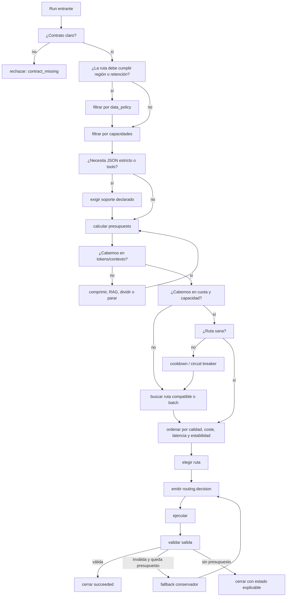
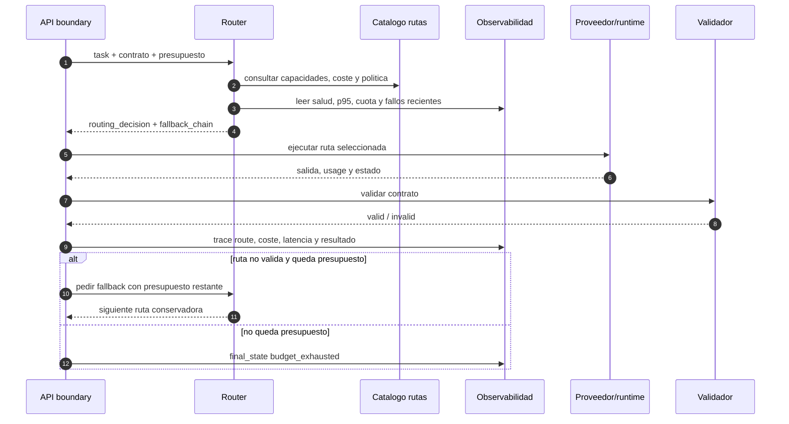
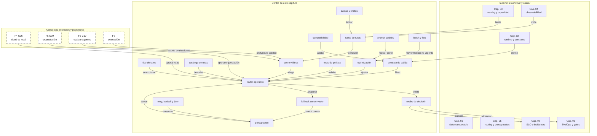

::: {.fasciculo-subtitle}
Facsímil 6 · Construir y operar
:::

# Capítulo 05: Routing, fallback y presupuestos por tarea

## Qué deberías poder hacer al terminar

En el capítulo 02 convertimos una petición en una run con estado y contrato. En el capítulo 03 vimos que servir modelos significa convivir con memoria, colas, prefill, decode y capacidad real. En el capítulo 04 aprendimos a observar una run para reconstruir qué ocurrió.

Ahora toca decidir **por dónde debe ir cada run antes de ejecutarla**.

No todas las tareas merecen el mismo modelo, la misma latencia, el mismo coste ni la misma estrategia de recuperación. Una pregunta corta de soporte no debería consumir el mismo presupuesto que un análisis legal largo. Una extracción JSON estricta no debería ir por una ruta que no soporta salida estructurada. Una tarea interactiva no debería quedarse esperando detrás de un lote nocturno. Y una dependencia lenta no debería provocar diez reintentos que empeoran el sistema.

Al terminar, deberías poder hacer esto:

| Resultado de aprendizaje | Evidencia de que lo sabes hacer |
|---|---|
| Diseñar un router operativo. | Separas reglas, señales, catálogo de rutas, presupuesto y trazabilidad. |
| Definir presupuestos por tarea. | Pones límites de latencia, coste, tokens, retries y salida esperada. |
| Explicar fallback sin vender atajos. | Distingues degradar, reintentar, cambiar proveedor, cambiar modelo o parar con estado claro. |
| Calcular coste esperado de una ruta. | Tienes en cuenta entrada, salida, probabilidad de reintento y aceptación final. |
| Evitar tormentas de reintentos. | Usas timeout, backoff, jitter, circuit breaker y límites de concurrencia. |
| Instrumentar la decisión. | Registras ruta elegida, alternativas descartadas, motivo y presupuesto consumido. |

La idea central: **un sistema serio no llama al modelo “a ver qué pasa”; decide una ruta bajo contrato, presupuesto y señales observables**.

## La petición que parece igual pero no lo es

Imagina dos usuarios escribiendo “resume este documento”. La frase parece la misma, pero las condiciones no lo son.

En el primer caso, el documento son cinco párrafos de una política interna y el usuario quiere una respuesta rápida. En el segundo, el documento son setenta páginas, la respuesta debe citar fuentes, el contrato exige JSON, el coste máximo es bajo y la tarea no es interactiva. Si mandamos ambas por la misma ruta, estamos fingiendo que el sistema no entiende su propio trabajo.

El router es la pieza que evita esa ficción. Mira la tarea, el contrato, el presupuesto, la salud de las rutas, la capacidad disponible, la sensibilidad de los datos, el histórico de calidad y decide: local o cloud, modelo pequeño o grande, streaming o batch, RAG o no RAG, salida breve o larga, fallback permitido o no.

## Qué no es routing

Routing no es “si falla A, prueba B”. Eso es solo una parte pequeña, y a veces peligrosa, de la historia.

Tampoco es elegir siempre el modelo más potente. El modelo más potente puede ser demasiado caro, lento, innecesario o incompatible con el contrato de salida. En operación, “mejor” no significa “más grande”; significa **suficiente para esta tarea bajo estas restricciones**.

Y tampoco es esconder la decisión dentro de un prompt: “elige tú el mejor modelo”. Algunas decisiones pueden usar un clasificador o un modelo auxiliar, pero la política operativa no debería quedar enterrada en texto. Si cambia el presupuesto, si sube la cola, si una ruta no soporta JSON o si el usuario pertenece a un tenant con región obligatoria, eso debe vivir en una capa explícita.

| Confusión | Qué falta |
|---|---|
| “Router es fallback” | Falta selección inicial, política, coste, capacidad y trazabilidad. |
| “Uso siempre el modelo grande” | Falta distinguir calidad suficiente de exceso de coste. |
| “Reintento hasta que salga” | Falta presupuesto, backoff, límite y motivo de parada. |
| “Si el proveedor va lento, pruebo otro” | Falta saber si el segundo cumple contrato, datos, región y parámetros. |
| “La ruta la decide el prompt” | Falta una política auditable y versionada. |

## Qué sí es un router operativo

**Ejemplo de fórmula.** Un router operativo es una función de decisión:

$$
\rho(t, c, b, h, o) \rightarrow r
$$

| Símbolo | Significado | Ejemplo |
|---|---|---|
| \(\rho\) | Función de routing. | Código, política o servicio que elige ruta. |
| \(t\) | Tipo de tarea. | `support_summary`, `legal_rag`, `json_extract`, `batch_labeling`. |
| \(c\) | Contrato de salida y capacidades requeridas. | JSON estricto, tools, visión, RAG, región, streaming. |
| \(b\) | Presupuesto disponible. | 5 segundos, 0,08 EUR, 8000 tokens, 1 retry. |
| \(h\) | Señales de salud y capacidad. | p95, cola, tasa de timeouts, coste p95, proveedor disponible. |
| \(o\) | Observabilidad histórica y evaluación. | aceptación, calidad por ruta, fallos de contrato, golden traces. |
| \(r\) | Ruta elegida. | `local_qwen_fast`, `cloud_frontier_json`, `rag_batch_worker`. |

La función puede ser simple o compleja. En un producto pequeño puede ser una tabla YAML con reglas. En un producto grande puede ser un servicio con feature flags, estadísticas por tenant, circuit breakers, evaluaciones offline, rutas canary y aprendizaje sobre resultados. Lo importante no es que sea sofisticado: es que sea **explícito**.

## Fecha de corte del estado del arte

**Fecha de corte:** 28 de mayo de 2026.  
**Fuentes consultadas:** Google SRE sobre sobrecarga y monitorización, AWS Builders Library sobre timeouts, retries, backoff y jitter, OpenRouter Provider Routing, Prompt Caching y Latency and Performance, LiteLLM Router, OpenAI Rate Limits, Latency Optimization, Prompt Caching, Batch API y Flex Processing, Anthropic Rate Limits, Prompt Caching y Cache Diagnostics, Prometheus Metric Naming y OpenTelemetry Semantic Conventions for Generative AI Systems.

Lo estable es el patrón de ingeniería: presupuestos, colas, retries limitados, backoff, jitter, degradación controlada, health signals, circuit breakers, observabilidad y SLOs. Lo cambiante son modelos disponibles, proveedores, precios, límites de cuota, parámetros soportados y sintaxis concreta de routers comerciales.

Google SRE describe la sobrecarga como un problema que exige decidir qué trabajo aceptar, retrasar o rechazar para proteger el servicio.^[Beyer, B., Jones, C., Petoff, J. y Murphy, N. R. (eds.). (2016). *Handling Overload*. En *Site Reliability Engineering*. https://sre.google/sre-book/handling-overload/. Consultado el 27 de mayo de 2026.] AWS insiste en que timeouts, retries, backoff y jitter deben diseñarse juntos; reintentar sin control puede amplificar el problema que intentas resolver.^[Amazon Web Services. (2026). *Timeouts, retries, and backoff with jitter*. AWS Builders Library. https://aws.amazon.com/builders-library/timeouts-retries-and-backoff-with-jitter/. Consultado el 27 de mayo de 2026.]

En herramientas de IA, OpenRouter documenta selección de proveedor por precio, latencia, throughput, fallbacks, requisitos de parámetros y políticas de datos.^[OpenRouter. (2026). *Provider routing*. https://openrouter.ai/docs/guides/routing/provider-selection. Consultado el 27 de mayo de 2026.] LiteLLM documenta un router para balanceo, fallbacks, retries, cooldowns y selección entre despliegues.^[LiteLLM. (2026). *Router - Load Balancing*. https://docs.litellm.ai/docs/routing. Consultado el 27 de mayo de 2026.] OpenAI y Anthropic documentan límites de tasa y cuota que obligan a tratar capacidad y presupuesto como parte de la integración, no como detalle posterior.^[OpenAI. (2026). *Rate limits*. https://developers.openai.com/api/docs/guides/rate-limits. Consultado el 27 de mayo de 2026.]^[Anthropic. (2026). *Rate limits*. https://platform.claude.com/docs/en/api/rate-limits. Consultado el 27 de mayo de 2026.]

## La política de ruta por dentro

Un router maduro no decide con una sola señal. Combina restricciones duras y preferencias.

Primero filtra lo que no cumple:

| Restricción dura | Pregunta | Ejemplo |
|---|---|---|
| Contrato | ¿La ruta soporta lo que pide la salida? | JSON estricto, tool calling, visión, streaming. |
| Presupuesto | ¿Cabe en coste, tiempo y tokens? | `max_cost_eur <= 0.08`, `max_latency_ms <= 6000`. |
| Datos | ¿La ruta cumple región, retención y política interna? | Local, UE, no almacenar contenido, solo IDs. |
| Capacidad | ¿La ruta puede aceptar trabajo ahora? | Cola, cuota, workers, rate limit, cooldown. |
| Compatibilidad | ¿Soporta los parámetros necesarios? | `temperature`, `response_format`, `max_output_tokens`. |

Después ordena lo que sí cumple:

| Preferencia | Qué optimiza | Cuándo domina |
|---|---|---|
| Menor latencia | Tiempo hasta respuesta útil. | Chat interactivo, copilotos, soporte. |
| Menor coste | Coste por run aceptada. | Clasificación masiva, tareas de bajo margen. |
| Mayor calidad | Precisión, razonamiento, formato, evaluación. | Tareas complejas, legales, técnicas o de decisión. |
| Mayor estabilidad | Menos variación p95/p99. | Productos con SLO estricto. |
| Menor exposición de datos | Menos salida de datos del entorno controlado. | Documentos internos o datos sensibles. |

**Ejemplo de fórmula.** Podemos escribir una puntuación simple:

$$
S(r) =
w_q Q(r)
- w_c C(r)
- w_l L(r)
- w_e E(r)
- w_s \sigma(r)
$$

| Símbolo | Significado | Ejemplo |
|---|---|---|
| \(S(r)\) | Puntuación de la ruta \(r\). | 0,71 para `local_fast`; 0,83 para `cloud_json`. |
| \(Q(r)\) | Calidad esperada normalizada. | 0,92 si pasa evals de extracción. |
| \(C(r)\) | Coste esperado normalizado. | 0,30 si cuesta poco, 0,90 si es caro. |
| \(L(r)\) | Latencia esperada normalizada. | p95 de 2,5 s frente a un límite de 6 s. |
| \(E(r)\) | Penalización por exposición de datos o restricciones. | 0 si todo queda local; 0,6 si sale a cloud sin necesidad. |
| \(\sigma(r)\) | Variabilidad o cola de cola larga. | Penaliza rutas con p99 malo aunque p50 parezca bien. |
| \(w_q, w_c, w_l, w_e, w_s\) | Pesos de decisión. | En soporte pesa latencia; en extracción pesa contrato. |

Esto no obliga a convertir el router en una fórmula rígida. La fórmula sirve para una idea: una ruta no se elige solo porque “responde bien”, sino porque equilibra calidad, coste, latencia, política y estabilidad.

## Catálogo de rutas: la tabla que sostiene al router

Un router sin catálogo acaba siendo un `if` enorme. Al principio parece suficiente, pero pronto nadie sabe qué rutas existen, qué contrato soportan, qué coste tienen, qué dueño las mantiene o qué limitación ocultan.

El catálogo de rutas es un artefacto versionado. Puede vivir en YAML, base de datos, configuración de plataforma o servicio interno, pero debe responder preguntas concretas:

| Pregunta | Campo del catálogo |
|---|---|
| ¿Qué ruta puedo usar para esta tarea? | `allowed_tasks`, `capabilities`, `contracts`. |
| ¿Qué ruta no debo usar con estos datos? | `data_policy`, `region`, `retention`. |
| ¿Cuánto cuesta antes de ejecutarla? | `price.input_1k`, `price.output_1k`, `tool_costs`. |
| ¿Qué SLO suele cumplir? | `latency.p50`, `latency.p95`, `ttft.p95`, `tpot.p95`. |
| ¿Qué límites tiene ahora mismo? | `rpm`, `tpm`, `concurrency`, `context_window`. |
| ¿Quién responde si se rompe? | `owner`, `runbook`, `dashboard`. |
| ¿Cómo se degrada? | `fallbacks`, `degraded_mode`, `stop_state`. |

Una versión mínima:

```yaml
version: route-catalog@2026-05-27
owner: ai-runtime

routes:
  local_fast:
    provider: local
    model: qwen3-8b-instruct
    runtime: vllm
    owner: ai-platform
    allowed_tasks: [fast_triage, support_fast_answer]
    capabilities: [text, json]
    contracts: [triage_v2, short_answer_v1]
    context_window: 32768
    data_policy:
      region: local
      retention: none
      content_logging: ids_only
    price:
      input_1k_eur: 0.0002
      output_1k_eur: 0.0006
    observed:
      latency_p95_ms: 1800
      timeout_ratio_5m: 0.02
      contract_failure_ratio_24h: 0.012
    limits:
      max_concurrency: 24
      max_output_tokens: 700
    fallback:
      chain: [support_brief_static]
      stop_state: capacity_unavailable

  rag_medium_json:
    provider: cloud
    model: medium-json-2026-05
    owner: ai-runtime
    allowed_tasks: [support_summary, policy_qa]
    capabilities: [text, json, rag, citations]
    contracts: [answer_with_sources_v3]
    context_window: 131072
    data_policy:
      region: eu
      retention: none
      content_logging: hash_and_ids
    price:
      input_1k_eur: 0.002
      output_1k_eur: 0.006
    observed:
      latency_p95_ms: 4200
      timeout_ratio_5m: 0.05
      contract_failure_ratio_24h: 0.018
    limits:
      rpm: 600
      tpm: 1200000
      max_output_tokens: 1200
    fallback:
      chain: [rag_small_brief, batch_review]
      stop_state: no_route_under_budget
```

El catálogo también evita una trampa frecuente: pensar que “modelo” y “ruta” son lo mismo. Una ruta incluye modelo, proveedor, runtime, región, parámetros permitidos, contrato, límites, observabilidad, owner y fallback. Dos rutas pueden usar el mismo modelo y comportarse distinto porque cambian proveedor, cuantización, template, latencia, región o versión del gateway.

## Presupuesto por tarea

**Ejemplo de fórmula.** Un presupuesto de tarea es un contrato operativo. No dice “usa poco”. Dice cuánto se puede gastar, esperar y reintentar.

$$
B_t = \langle T_{max}, C_{max}, I_{max}, O_{max}, R_{max}, A_{max} \rangle
$$

| Símbolo | Significado | Ejemplo |
|---|---|---|
| \(B_t\) | Presupuesto para la tarea \(t\). | Presupuesto de `support_summary`. |
| \(T_{max}\) | Latencia máxima. | 6000 ms. |
| \(C_{max}\) | Coste máximo. | 0,08 EUR. |
| \(I_{max}\) | Tokens máximos de entrada. | 12.000 tokens. |
| \(O_{max}\) | Tokens máximos de salida. | 600 tokens. |
| \(R_{max}\) | Reintentos máximos. | 1 retry. |
| \(A_{max}\) | Acciones o llamadas externas máximas. | 2 tools, 1 retrieval, 0 escrituras. |

Ejemplo de presupuestos:

| Tarea | Latencia | Coste | Tokens | Reintentos | Ruta preferida |
|---|---:|---:|---:|---:|---|
| `support_fast_answer` | 2500 ms | 0,02 EUR | 4000 entrada / 300 salida | 0 | modelo pequeño o caché. |
| `support_summary` | 6000 ms | 0,08 EUR | 12000 entrada / 600 salida | 1 | RAG + modelo medio. |
| `legal_rag_review` | 30000 ms | 0,60 EUR | 60000 entrada / 2000 salida | 1 | modelo fuerte + citas + revisión. |
| `batch_labeling` | 120000 ms | 0,01 EUR por item | 2000 entrada / 50 salida | 2 | lote barato, sin streaming. |
| `json_extract_strict` | 8000 ms | 0,05 EUR | 8000 entrada / 800 salida | 1 | ruta con salida estructurada fiable. |

La clave está en el adjetivo “por tarea”. Un presupuesto global tipo “máximo 20.000 tokens” no dice casi nada. La operación necesita saber si esos tokens pertenecen a una conversación interactiva, a un lote, a una extracción o a un resumen con citas.

## Cuotas y rate limits: capacidad externa también es arquitectura

Cuando usas proveedores externos, la capacidad no depende solo de tu código. También depende de cuotas de peticiones, tokens, concurrencia, región, tier, modelo y organización. OpenAI y Anthropic documentan límites de tasa que pueden expresarse en peticiones, tokens u otros contadores según producto, modelo o plan.^[OpenAI, 2026, *Rate limits*.]^[Anthropic, 2026, *Rate limits*.]

Para un router, esos límites no son un error inesperado: son una entrada de decisión.

**Ejemplo de fórmula.** Una estimación sencilla:

$$
\lambda_t \cdot E[I_t + O_t] \le TPM_{ruta} \cdot \alpha
$$

| Símbolo | Significado | Ejemplo |
|---|---|---|
| \(\lambda_t\) | Runs por minuto de la tarea \(t\). | 120 resúmenes por minuto. |
| \(E[I_t + O_t]\) | Tokens esperados por run. | 7500 entrada + 500 salida. |
| \(TPM_{ruta}\) | Tokens por minuto permitidos en la ruta. | 1.200.000 TPM. |
| \(\alpha\) | Margen operativo que no queremos superar. | 0,75 para dejar colchón. |

Si \(120 \cdot 8000 = 960000\) tokens por minuto y la ruta tiene 1.200.000 TPM, parece caber. Pero con \(\alpha = 0,75\), el límite operativo sería 900.000 TPM. El router debería empezar a derivar parte del tráfico, pasar una clase a batch o bajar tokens de entrada.

Lo mismo para peticiones por minuto:

$$
\lambda_t \le RPM_{ruta} \cdot \alpha
$$

| Símbolo | Significado | Ejemplo |
|---|---|---|
| \(RPM_{ruta}\) | Peticiones por minuto permitidas. | 600 RPM. |
| \(\lambda_t\) | Llegada esperada. | 520 RPM. |
| \(\alpha\) | Margen de seguridad. | 0,80. |

Con \(\alpha=0,80\), 600 RPM se convierten en 480 RPM operativos. Si llegan 520, no conviene esperar al error de cuota; conviene actuar antes.

| Señal | Acción razonable del router |
|---|---|
| `quota_remaining_tpm` baja rápido. | Reducir contexto, cambiar ruta o mandar tareas no urgentes a batch. |
| `rpm_utilization` supera margen. | Activar backpressure o repartir entre rutas compatibles. |
| `retry_after_ms` cabe en presupuesto. | Esperar con backoff y jitter. |
| `retry_after_ms` no cabe. | Cambiar ruta o cerrar con estado claro. |
| `context_window` insuficiente. | Comprimir, hacer RAG, dividir tarea o rechazar con explicación. |

El punto de ingeniería: no esperes a que el proveedor te diga “no puedo”. Tu router debería saber antes si la ruta está cerca del límite.

## Coste esperado y coste útil

El coste visible de una llamada no es el coste de producto. Si una ruta falla contrato, requiere reintento o produce una respuesta que se descarta, ha consumido dinero sin producir utilidad.

**Ejemplo de fórmula.** Una aproximación:

$$
E[C_{run}] =
C_{in} + C_{out} + p_{retry}(C_{in}^{retry} + C_{out}^{retry}) + C_{tool} + C_{retrieval}
$$

| Símbolo | Significado | Ejemplo |
|---|---|---|
| \(E[C_{run}]\) | Coste esperado de una run. | 0,047 EUR. |
| \(C_{in}\) | Coste de tokens de entrada. | 10.000 tokens de contexto. |
| \(C_{out}\) | Coste de tokens de salida. | 500 tokens generados. |
| \(p_{retry}\) | Probabilidad de necesitar reintento. | 0,08. |
| \(C_{in}^{retry}, C_{out}^{retry}\) | Coste de un intento adicional. | Puede ser menor si recortamos contexto. |
| \(C_{tool}\) | Coste de tools o servicios externos. | Búsqueda, OCR, base vectorial, API externa. |
| \(C_{retrieval}\) | Coste de recuperación y reranking. | Embeddings, vector DB, reranker. |

**Ejemplo de fórmula.** Y el coste útil:

$$
C_{util} = \frac{\sum C_{run}}{N_{aceptadas}}
$$

| Símbolo | Significado | Ejemplo |
|---|---|---|
| \(C_{util}\) | Coste por run aceptada. | 0,11 EUR por respuesta útil. |
| \(\sum C_{run}\) | Coste total de runs intentadas. | 11 EUR. |
| \(N_{aceptadas}\) | Runs que pasan contrato y sirven al usuario. | 100. |

Esta fórmula es incómoda porque revela rutas “baratas” que salen caras. Un modelo pequeño puede costar poco por token, pero si falla más el contrato, reintenta más o exige revisión, el coste útil puede subir.

## Tipos de routing que sí aparecen en producción

No hay un único tipo de router. Hay familias.

| Tipo | Cómo decide | Sirve cuando | Cuidado |
|---|---|---|---|
| Reglas estáticas | `task == X -> ruta Y`. | Producto pequeño, compliance claro, pocas tareas. | Se queda rígido si crece el catálogo. |
| Routing por contrato | Filtra por soporte de JSON, tools, visión, región o streaming. | La salida tiene requisitos fuertes. | Hay que mantener capacidades por ruta. |
| Routing por coste | Ordena por coste estimado bajo una calidad mínima. | Tareas masivas o de bajo margen. | Barato no equivale a aceptable. |
| Routing por latencia | Prefiere p95/p99 menor o cola más corta. | Experiencia interactiva. | Puede elegir rutas más caras. |
| Routing por calidad | Usa evals, golden traces y resultados históricos. | Tareas donde el error cuesta más que la latencia. | Necesita datasets vivos y versionados. |
| Routing por salud | Evita rutas con timeouts, cuota agotada o cola alta. | Operación real con proveedores y runtimes cambiantes. | Sin observabilidad, se convierte en intuición. |
| Routing híbrido | Combina reglas, score, salud, coste y contrato. | Sistemas de IA en producción. | Requiere trazabilidad y ownership. |

Lo importante: un router puede empezar simple y evolucionar. Lo peligroso es empezar opaco.

## Compatibilidad real entre proveedores

Una API compatible no garantiza comportamiento compatible. Dos rutas pueden aceptar un cuerpo parecido y aun así diferir en lo que importa.

OpenRouter documenta opciones para exigir proveedores que soporten parámetros concretos y para filtrar por políticas de datos, proveedores, cuantización, precio, latencia o throughput.^[OpenRouter, 2026, *Provider routing*.] Esa idea es general: antes de fallback o routing cruzado, hay que comprobar compatibilidad.

| Superficie | Qué comparar | Por qué importa |
|---|---|---|
| Salida estructurada | JSON mode, schema estricto, tool calling, validación. | Una ruta puede “intentar JSON” y otra garantizar contrato. |
| Streaming | Formato de eventos, fin de stream, errores parciales. | El cliente puede depender de eventos concretos. |
| Tools | Schema, tool choice, llamadas paralelas, argumentos. | Cambia cómo el modelo decide usar herramientas. |
| Contexto | Ventana, tokenizador, coste de entrada, compaction. | El mismo texto no ocupa igual ni cabe igual. |
| Parámetros | `temperature`, `top_p`, `seed`, `max_tokens`, razonamiento. | El nombre puede existir, pero su efecto no ser idéntico. |
| Seguridad y datos | Región, retención, logging, entrenamiento con datos. | No todas las rutas sirven para todos los tenants. |
| Errores | Códigos, `retry_after`, timeouts, cuota. | El gateway debe normalizar estados para el router. |
| Precios | Input, output, caché, tools, razonamiento, lote. | El coste esperado necesita la factura completa. |
| Versionado | Alias flotante o versión fija. | Un alias puede cambiar comportamiento sin cambiar tu código. |

Por eso el catálogo debería distinguir `supports_json_schema=true` de `usually_returns_json=true`. Lo primero es una capacidad. Lo segundo es una esperanza.

Un ejemplo de matriz de compatibilidad:

| Ruta | Capacidades declaradas | Entorno | Fallback permitido |
|---|---|---|---|
| `local_fast` | JSON estricto, streaming, sin tools. Contexto 32768. | Local. | Sí, a respuesta breve. |
| `rag_medium_json` | JSON estricto, tools, streaming, RAG y citas. Contexto 131072. | UE. | Sí, a `rag_small_brief`. |
| `frontier_review` | JSON estricto, tools, streaming y contexto largo. | Proveedor. | Solo si presupuesto lo permite. |
| `batch_cheap` | JSON estricto, sin streaming, sin tools. Contexto 32768. | Proveedor. | No interactivo. |

La matriz no es burocracia. Es lo que impide que un fallback rompa el contrato.

## Fallback no significa “hacer cualquier cosa”

Fallback es una ruta alternativa con contrato. No es una excusa para devolver algo distinto sin avisar.

Hay varios tipos:

| Tipo de fallback | Qué cambia | Ejemplo |
|---|---|---|
| Mismo modelo, otro proveedor | Cambia endpoint o región. | Mismo modelo servido por otro proveedor compatible. |
| Otro modelo equivalente | Cambia modelo manteniendo contrato. | Modelo B que soporta JSON y calidad mínima. |
| Modelo menor | Reduce coste o latencia. | Respuesta breve, menos contexto, menos razonamiento. |
| Ruta local | Evita dependencia externa. | Modelo local para resumen simple cuando cloud no conviene. |
| Ruta batch | Cambia expectativa temporal. | “Lo dejamos procesando y avisamos cuando esté”. |
| Respuesta parcial | Devuelve lo seguro y marca lo pendiente. | “Puedo resumir, pero no validar citas ahora”. |
| Parada explícita | No ejecuta más. | `budget_exhausted`, `contract_not_supported`, `capacity_unavailable`. |

La regla de oro: **fallback debe ser igual o más conservador que la ruta principal**. Si la ruta principal no puede ejecutar una acción con el contrato correcto, el fallback no debería inventar más capacidad. Debe reducir alcance, pedir confirmación, pasar a batch o cerrar con estado comprensible.

## Reintentos, backoff y jitter

Un retry solo tiene sentido si el problema puede desaparecer al volver a intentar. Un error de contrato no se arregla repitiendo igual. Una cuota agotada no se arregla enviando más rápido. Una salida inválida quizá se arregla con un retry si cambiamos instrucción, temperatura o modelo, pero hay que presupuestarlo.

Política mínima:

| Caso | Retry | Motivo |
|---|---|---|
| Timeout de red puntual | Sí, con backoff y límite. | Puede ser transitorio. |
| Rate limit | Sí, si `retry_after` cabe en presupuesto. | Si no cabe, cambiar ruta o parar. |
| JSON inválido | Una vez, con reparación o ruta más fiable. | Repetir igual suele repetir el fallo. |
| Presupuesto agotado | No. | Ya no hay margen operativo. |
| Contrato no soportado | No. | La ruta era incorrecta. |
| Error de permisos | No. | No es un problema temporal. |

Backoff exponencial simple:

$$
delay_i = \min(D_{max}, D_0 \cdot 2^i) + U(0, J)
$$

| Símbolo | Significado | Ejemplo |
|---|---|---|
| \(delay_i\) | Espera antes del retry \(i\). | 400 ms, 850 ms, 1700 ms. |
| \(D_0\) | Espera inicial. | 250 ms. |
| \(D_{max}\) | Espera máxima. | 3000 ms. |
| \(i\) | Número de retry. | 0, 1, 2. |
| \(U(0, J)\) | Ruido aleatorio entre 0 y \(J\). | Jitter de 0 a 150 ms. |

El jitter parece un detalle menor, pero evita que muchos clientes despierten a la vez y vuelvan a presionar la misma dependencia. En sistemas con IA, donde cada intento puede ser caro, el retry debe gastar presupuesto explícito.

## Circuit breaker, cooldown y load shedding

Cuando una ruta empieza a fallar o a degradarse, el router no debería seguir probándola con todo el tráfico. Necesita memoria operativa.

| Mecanismo | Qué hace | Señal típica |
|---|---|---|
| Circuit breaker | Cierra temporalmente una ruta con demasiados fallos recientes. | `timeout_ratio_1m > 0.25`. |
| Cooldown | Espera antes de volver a probar la ruta. | 30 segundos, 2 minutos, 10 minutos. |
| Probe | Envía pocas runs de prueba antes de reabrir. | 1% del tráfico o tarea sintética. |
| Load shedding | Rechaza o retrasa trabajo para proteger el sistema. | Cola superior a umbral o SLO quemándose. |
| Backpressure | Indica al cliente o cola que reduzca entrada. | `retry_after`, cola batch, límite por tenant. |

Esto conecta con Little:

$$
L = \lambda W
$$

| Símbolo | Significado | Ejemplo |
|---|---|---|
| \(L\) | Trabajo medio dentro del sistema. | 240 runs esperando o ejecutándose. |
| \(\lambda\) | Tasa de llegada. | 40 runs por minuto. |
| \(W\) | Tiempo medio en el sistema. | 6 minutos. |

Little no es una receta universal; es una alarma conceptual. Si la llegada sube y la capacidad no sube, el tiempo de espera crece. Un router que acepta todo “porque quizá sale” puede destruir el SLO. Dean y Barroso explicaron en *The Tail at Scale* que la cola larga de latencia importa porque el usuario vive los peores percentiles, no la media.^[Dean, J. y Barroso, L. A. (2013). The Tail at Scale. *Communications of the ACM, 56*(2), 74-80. https://doi.org/10.1145/2408776.2408794. Consultado el 27 de mayo de 2026.] Little formuló la relación clásica entre trabajo en sistema, llegada y espera.^[Little, J. D. C. (1961). A Proof for the Queuing Formula: L = λW. *Operations Research, 9*(3), 383-387. https://doi.org/10.1287/opre.9.3.383.]

## Árbol de decisión para elegir ruta

El árbol no sustituye al router, pero ayuda a revisar si la política tiene sentido. Léelo de arriba abajo:



Fíjate en dos ramas: primero contrato, después presupuesto. Si el contrato falta, no hay router inteligente; hay adivinanza. Si el presupuesto no cabe, no hay “un intento más”; hay deuda operativa.

## Anatomía visual de un router de IA

<svg id="f6-c05-routing-fallback" xmlns="http://www.w3.org/2000/svg" viewBox="0 0 1920 1420" role="img" aria-label="Arquitectura operativa de routing, fallback y presupuestos por tarea en sistemas de IA">
  <defs>
    <style>
      #f6-c05-routing-fallback{background:#fff;color:#111;font-family:Inter,ui-sans-serif,system-ui,-apple-system,BlinkMacSystemFont,"Segoe UI",sans-serif}
      #f6-c05-routing-fallback .title{font-size:42px;font-weight:800;fill:#111}
      #f6-c05-routing-fallback .subtitle{font-size:18px;fill:#444}
      #f6-c05-routing-fallback .h{font-size:19px;font-weight:800;fill:#111}
      #f6-c05-routing-fallback .hw{font-size:19px;font-weight:800;fill:#fff}
      #f6-c05-routing-fallback .txt{font-size:13px;fill:#222}
      #f6-c05-routing-fallback .tiny{font-size:11px;fill:#555}
      #f6-c05-routing-fallback .micro{font-size:9.5px;fill:#666}
      #f6-c05-routing-fallback .frame{fill:#fff;stroke:#111;stroke-width:2.2}
      #f6-c05-routing-fallback .panel{fill:#fff;stroke:#111;stroke-width:1.6}
      #f6-c05-routing-fallback .soft{fill:#f6f6f6;stroke:#111;stroke-width:1.4}
      #f6-c05-routing-fallback .dark{fill:#111;stroke:#111;stroke-width:1.4}
      #f6-c05-routing-fallback .chip{fill:#fff;stroke:#333;stroke-width:1.1}
      #f6-c05-routing-fallback .route{fill:#fff;stroke:#111;stroke-width:1.4}
      #f6-c05-routing-fallback .route2{fill:#f3f3f3;stroke:#111;stroke-width:1.4}
      #f6-c05-routing-fallback .line{stroke:#111;stroke-width:2;fill:none}
      #f6-c05-routing-fallback .thin{stroke:#555;stroke-width:1.2;fill:none}
      #f6-c05-routing-fallback .dash{stroke:#555;stroke-width:1.3;fill:none;stroke-dasharray:8 6}
    </style>
    <marker id="f6c05-arrow" viewBox="0 0 10 10" refX="9" refY="5" markerWidth="8" markerHeight="8" orient="auto-start-reverse">
      <path d="M 0 0 L 10 5 L 0 10 z" fill="#111"/>
    </marker>
  </defs>

  <rect x="54" y="46" width="1812" height="1328" rx="28" class="frame"/>
  <text x="960" y="104" text-anchor="middle" class="title">Router operativo: elegir ruta sin perder contrato ni presupuesto</text>
  <text x="960" y="138" text-anchor="middle" class="subtitle">La decisión combina tarea, contrato, coste, latencia, capacidad, salud, datos y evaluación histórica.</text>

  <rect x="100" y="210" width="310" height="230" rx="18" class="soft"/>
  <text x="255" y="250" text-anchor="middle" class="h">Run entrante</text>
  <rect x="132" y="286" width="246" height="30" rx="8" class="chip"/>
  <text x="255" y="306" text-anchor="middle" class="tiny">task · tenant · priority</text>
  <rect x="132" y="330" width="246" height="30" rx="8" class="chip"/>
  <text x="255" y="350" text-anchor="middle" class="tiny">response_contract</text>
  <rect x="132" y="374" width="246" height="30" rx="8" class="chip"/>
  <text x="255" y="394" text-anchor="middle" class="tiny">budget · region · data policy</text>

  <rect x="500" y="190" width="410" height="270" rx="18" class="panel"/>
  <rect x="500" y="190" width="410" height="54" rx="18" class="dark"/>
  <text x="705" y="224" text-anchor="middle" class="hw">Plano de decisión</text>
  <text x="540" y="286" class="txt">1. filtrar rutas incompatibles</text>
  <text x="540" y="318" class="txt">2. estimar coste, latencia y tokens</text>
  <text x="540" y="350" class="txt">3. leer salud: cuota, cola, p95, cooldown</text>
  <text x="540" y="382" class="txt">4. ordenar por score y política</text>
  <text x="540" y="414" class="txt">5. emitir routing_decision trazable</text>

  <rect x="1000" y="176" width="360" height="300" rx="18" class="soft"/>
  <text x="1180" y="216" text-anchor="middle" class="h">Señales que entran</text>
  <rect x="1034" y="254" width="132" height="54" rx="10" class="chip"/>
  <text x="1100" y="276" text-anchor="middle" class="tiny">evals</text>
  <text x="1100" y="294" text-anchor="middle" class="micro">quality_score</text>
  <rect x="1194" y="254" width="132" height="54" rx="10" class="chip"/>
  <text x="1260" y="276" text-anchor="middle" class="tiny">SLO</text>
  <text x="1260" y="294" text-anchor="middle" class="micro">p95 · burn</text>
  <rect x="1034" y="326" width="132" height="54" rx="10" class="chip"/>
  <text x="1100" y="348" text-anchor="middle" class="tiny">coste</text>
  <text x="1100" y="366" text-anchor="middle" class="micro">EUR/run</text>
  <rect x="1194" y="326" width="132" height="54" rx="10" class="chip"/>
  <text x="1260" y="348" text-anchor="middle" class="tiny">capacidad</text>
  <text x="1260" y="366" text-anchor="middle" class="micro">quota · queue</text>
  <rect x="1034" y="398" width="292" height="40" rx="10" class="chip"/>
  <text x="1180" y="423" text-anchor="middle" class="tiny">OpenTelemetry · Prometheus · golden traces</text>

  <rect x="1460" y="190" width="300" height="270" rx="18" class="panel"/>
  <text x="1610" y="228" text-anchor="middle" class="h">Salida de decisión</text>
  <rect x="1492" y="266" width="236" height="32" rx="8" class="chip"/>
  <text x="1610" y="287" text-anchor="middle" class="tiny">route_id</text>
  <rect x="1492" y="312" width="236" height="32" rx="8" class="chip"/>
  <text x="1610" y="333" text-anchor="middle" class="tiny">fallback_chain</text>
  <rect x="1492" y="358" width="236" height="32" rx="8" class="chip"/>
  <text x="1610" y="379" text-anchor="middle" class="tiny">remaining_budget</text>
  <rect x="1492" y="404" width="236" height="32" rx="8" class="chip"/>
  <text x="1610" y="425" text-anchor="middle" class="tiny">reason_code · alternatives</text>

  <path d="M410 325 C450 325 458 325 500 325" class="line" marker-end="url(#f6c05-arrow)"/>
  <path d="M910 325 C950 325 960 325 1000 325" class="line" marker-end="url(#f6c05-arrow)"/>
  <path d="M1360 325 C1400 325 1410 325 1460 325" class="line" marker-end="url(#f6c05-arrow)"/>

  <rect x="100" y="550" width="1720" height="360" rx="22" class="panel"/>
  <text x="960" y="596" text-anchor="middle" class="h">Rutas candidatas: no todas cumplen lo mismo</text>

  <rect x="140" y="642" width="250" height="210" rx="16" class="route"/>
  <text x="265" y="676" text-anchor="middle" class="h">local_fast</text>
  <text x="166" y="716" class="txt">latencia baja</text>
  <text x="166" y="744" class="txt">coste controlado</text>
  <text x="166" y="772" class="txt">contexto menor</text>
  <text x="166" y="800" class="txt">sin tools complejas</text>
  <text x="166" y="828" class="tiny">fallback: respuesta breve</text>

  <rect x="438" y="642" width="250" height="210" rx="16" class="route2"/>
  <text x="563" y="676" text-anchor="middle" class="h">cloud_json</text>
  <text x="464" y="716" class="txt">JSON estricto</text>
  <text x="464" y="744" class="txt">mejor formato</text>
  <text x="464" y="772" class="txt">coste medio</text>
  <text x="464" y="800" class="txt">cuota variable</text>
  <text x="464" y="828" class="tiny">fallback: reparar schema</text>

  <rect x="736" y="642" width="250" height="210" rx="16" class="route"/>
  <text x="861" y="676" text-anchor="middle" class="h">rag_strong</text>
  <text x="762" y="716" class="txt">recupera fuentes</text>
  <text x="762" y="744" class="txt">citas y evidencia</text>
  <text x="762" y="772" class="txt">prefill largo</text>
  <text x="762" y="800" class="txt">latencia mayor</text>
  <text x="762" y="828" class="tiny">fallback: batch o parcial</text>

  <rect x="1034" y="642" width="250" height="210" rx="16" class="route2"/>
  <text x="1159" y="676" text-anchor="middle" class="h">batch_cheap</text>
  <text x="1060" y="716" class="txt">throughput alto</text>
  <text x="1060" y="744" class="txt">sin streaming</text>
  <text x="1060" y="772" class="txt">cola separada</text>
  <text x="1060" y="800" class="txt">coste mínimo</text>
  <text x="1060" y="828" class="tiny">fallback: esperar o dividir</text>

  <rect x="1332" y="642" width="250" height="210" rx="16" class="route"/>
  <text x="1457" y="676" text-anchor="middle" class="h">frontier_review</text>
  <text x="1358" y="716" class="txt">calidad alta</text>
  <text x="1358" y="744" class="txt">coste alto</text>
  <text x="1358" y="772" class="txt">razonamiento largo</text>
  <text x="1358" y="800" class="txt">solo si compensa</text>
  <text x="1358" y="828" class="tiny">fallback: pedir confirmación</text>

  <path d="M1582 748 C1650 748 1674 748 1740 748" class="dash" marker-end="url(#f6c05-arrow)"/>
  <rect x="1608" y="690" width="176" height="120" rx="14" class="soft"/>
  <text x="1696" y="724" text-anchor="middle" class="h">Parada</text>
  <text x="1696" y="754" text-anchor="middle" class="tiny">budget_exhausted</text>
  <text x="1696" y="776" text-anchor="middle" class="tiny">contract_not_supported</text>

  <rect x="100" y="980" width="520" height="248" rx="18" class="soft"/>
  <text x="360" y="1022" text-anchor="middle" class="h">Presupuesto vivo</text>
  <text x="138" y="1062" class="txt">latency_remaining_ms</text>
  <rect x="338" y="1048" width="220" height="20" rx="10" fill="#fff" stroke="#111" stroke-width="1"/>
  <rect x="338" y="1048" width="142" height="20" rx="10" fill="#111"/>
  <text x="138" y="1100" class="txt">cost_remaining_eur</text>
  <rect x="338" y="1086" width="220" height="20" rx="10" fill="#fff" stroke="#111" stroke-width="1"/>
  <rect x="338" y="1086" width="88" height="20" rx="10" fill="#111"/>
  <text x="138" y="1138" class="txt">retry_remaining</text>
  <rect x="338" y="1124" width="220" height="20" rx="10" fill="#fff" stroke="#111" stroke-width="1"/>
  <rect x="338" y="1124" width="55" height="20" rx="10" fill="#111"/>
  <text x="138" y="1180" class="tiny">cada intento consume margen y actualiza la traza</text>

  <rect x="700" y="980" width="520" height="248" rx="18" class="panel"/>
  <rect x="700" y="980" width="520" height="50" rx="18" class="dark"/>
  <text x="960" y="1012" text-anchor="middle" class="hw">Retry controlado</text>
  <text x="738" y="1066" class="txt">timeout por fase, no solo global</text>
  <text x="738" y="1098" class="txt">backoff exponencial + jitter</text>
  <text x="738" y="1130" class="txt">circuit breaker si falla demasiado</text>
  <text x="738" y="1162" class="txt">cooldown antes de volver a probar</text>
  <text x="738" y="1194" class="txt">estado final si no cabe en presupuesto</text>

  <rect x="1300" y="980" width="520" height="248" rx="18" class="soft"/>
  <text x="1560" y="1022" text-anchor="middle" class="h">Observabilidad obligatoria</text>
  <rect x="1338" y="1060" width="206" height="42" rx="10" class="chip"/>
  <text x="1441" y="1086" text-anchor="middle" class="tiny">routing.reason</text>
  <rect x="1576" y="1060" width="206" height="42" rx="10" class="chip"/>
  <text x="1679" y="1086" text-anchor="middle" class="tiny">alternatives</text>
  <rect x="1338" y="1120" width="206" height="42" rx="10" class="chip"/>
  <text x="1441" y="1146" text-anchor="middle" class="tiny">fallback_used</text>
  <rect x="1576" y="1120" width="206" height="42" rx="10" class="chip"/>
  <text x="1679" y="1146" text-anchor="middle" class="tiny">budget_spent</text>
  <text x="1560" y="1198" text-anchor="middle" class="tiny">sin estas señales no hay aprendizaje operativo</text>

  <path d="M620 1104 C650 1104 670 1104 700 1104" class="line" marker-end="url(#f6c05-arrow)"/>
  <path d="M1220 1104 C1250 1104 1270 1104 1300 1104" class="line" marker-end="url(#f6c05-arrow)"/>

  <text x="1818" y="1348" text-anchor="end" class="micro" fill="#888888" opacity="0.45">IA para gente curiosa / Facsímil 06 / Capítulo 05 / 686f6c61</text>
</svg>

El dibujo enseña la idea importante: el router no es una bifurcación simple. Es una frontera operativa. Antes de gastar tokens decide si una ruta cumple contrato, si cabe en presupuesto, si está sana y qué alternativa existe si algo no encaja.

## Cómo se ve en producción

Una decisión de routing debería quedar registrada como dato estructurado. Algo así:

```json
{
  "event": "routing.decision",
  "run_id": "run_20260527_0512",
  "task": "support_summary",
  "selected_route": "rag_medium_json",
  "reason": "meets_contract_under_budget",
  "budget": {
    "max_latency_ms": 6000,
    "max_cost_eur": 0.08,
    "max_retries": 1
  },
  "estimated": {
    "latency_p95_ms": 4200,
    "cost_eur": 0.041,
    "input_tokens": 7200,
    "output_tokens": 480
  },
  "alternatives": [
    {
      "route": "local_fast",
      "rejected_because": "does_not_support_required_citations"
    },
    {
      "route": "frontier_review",
      "rejected_because": "cost_above_task_budget"
    }
  ],
  "fallback_chain": ["rag_medium_json", "rag_small_brief", "batch_review"]
}
```

Esto no está para decorar logs. Sirve para responder preguntas:

| Pregunta | Campo que la responde |
|---|---|
| ¿Por qué no usamos el modelo local? | `alternatives.rejected_because`. |
| ¿Por qué subió el coste? | `estimated.cost_eur`, ruta seleccionada, tokens y retries. |
| ¿Cuántas veces se activa fallback? | `fallback_chain`, `fallback_used`, `final_state`. |
| ¿Qué ruta incumple p95? | `selected_route` + métricas de latencia. |
| ¿Qué contrato expulsa rutas? | `response_contract` y `does_not_support_*`. |

Prometheus recomienda nombres de métricas y labels que permitan entender unidades y agregación sin crear cardinalidad inútil.^[Prometheus. (2026). *Metric and label naming*. https://prometheus.io/docs/practices/naming/. Consultado el 27 de mayo de 2026.] OpenTelemetry mantiene convenciones semánticas para sistemas generativos, incluyendo atributos de modelo, operación y uso de tokens.^[OpenTelemetry. (2026). *Semantic Conventions for Generative AI Systems*. https://opentelemetry.io/docs/specs/semconv/gen-ai/. Consultado el 27 de mayo de 2026.] En nuestro router, eso se traduce en no inventar métricas imposibles de mantener: `ai_route_decision_total{task,route,reason}`, sí; `ai_route_decision_total{run_id}`, no.

## Herramientas y piezas que se suelen usar

Hay tres caminos frecuentes.

| Camino | Qué usas | Pros | Contras |
|---|---|---|---|
| Router propio | Código interno, YAML, feature flags, métricas y gateway. | Control total sobre contratos, coste, datos y trazas. | Hay que mantener catálogo, salud, cuotas y fallbacks. |
| Router de proveedor/agregador | OpenRouter, gateway cloud o proveedor con múltiples endpoints. | Reduce integración con muchos proveedores; aporta routing por precio, latencia o proveedor. | No sustituye tu política de producto ni tus presupuestos internos. |
| Router de librería | LiteLLM Router u otra capa compatible. | Acelera balanceo, retries y fallbacks entre despliegues. | Debes revisar semántica de parámetros, errores, streaming, tools y observabilidad. |

Mi recomendación para ingeniería: aunque uses un router externo, conserva un **router lógico propio**. Ese router lógico decide tarea, contrato, presupuesto y política. Luego puede delegar la ejecución a OpenRouter, LiteLLM, un proveedor cloud o un runtime local. Si toda la decisión vive fuera de tu sistema, pierdes criterio de producto.

## Optimizar el router: qué palancas existen

Optimizar no significa “usar siempre lo más barato”. Tampoco significa “usar siempre lo más rápido”. Optimizar significa mejorar una métrica bajo restricciones: coste por run aceptada, p95 de latencia, TTFT, tasa de contrato válido, tasa de fallback, cuota restante, calidad evaluada o experiencia percibida por el usuario.

La primera regla es elegir el objetivo:

| Objetivo | Optimización correcta | Optimización peligrosa |
|---|---|---|
| Bajar latencia interactiva | Reducir salida, usar modelo menor suficiente, streaming, caché de prefijo, ruta con p95 estable. | Recortar contexto sin medir calidad. |
| Bajar coste | Batch, flex, prompt caching, modelo menor, menos tokens, menos retries, cachear respuestas deterministas. | Cambiar a ruta barata que sube fallo de contrato. |
| Mejorar throughput | Colas por clase, batch, rutas con más TPS, bajar saturación, repartir por cuota. | Aumentar concurrencia hasta disparar p99. |
| Mejorar estabilidad | Circuit breaker, cooldown, margen de cuota, rutas canary, percentiles p90/p99. | Mirar solo p50 o media. |
| Mantener calidad | Evals por tarea, golden traces, matriz de compatibilidad, fallback conservador. | Cambiar modelo sin dataset de comparación. |

OpenAI resume la optimización de latencia en principios bastante prácticos: procesar tokens más rápido, generar menos tokens, usar menos tokens de entrada, hacer menos peticiones, paralelizar, reducir la espera percibida y no usar un LLM cuando una técnica clásica basta.^[OpenAI. (2026). *Latency optimization*. https://developers.openai.com/api/docs/guides/latency-optimization. Consultado el 28 de mayo de 2026.] Para un router, eso se traduce en política.

| Palanca | Qué cambia | Señal que debe mejorar | Riesgo |
|---|---|---|---|
| Modelo menor suficiente | Ruta más rápida y barata. | TTFT, TPOT, coste. | Baja calidad si no hay evals. |
| Menos salida | `max_output_tokens`, contrato más compacto, respuesta breve. | Latencia de decode y coste de salida. | Respuesta incompleta. |
| Menos entrada | RAG más selectivo, limpiar HTML, resumir historial, deduplicar contexto. | Coste de entrada y prefill. | Perder evidencia necesaria. |
| Prefijo estable | Instrucciones, ejemplos y tools al principio; datos variables al final. | Cache hit rate, TTFT, coste de entrada. | Cache miss silencioso si cambian timestamps o tool order. |
| Menos llamadas | Unir pasos secuenciales en una respuesta estructurada. | Latencia total y coste de red. | Prompt demasiado complejo. |
| Paralelizar | Ejecutar pasos independientes a la vez. | Latencia de pared. | Más coste si luego cancelas trabajo. |
| Streaming | Primer token antes, usuario espera menos. | TTFT y experiencia percibida. | No reduce coste por sí mismo. |
| Batch | Llevar tareas no urgentes a procesamiento asíncrono. | Coste y cuota síncrona disponible. | No sirve para interacción inmediata. |
| Flex o baja prioridad | Menor coste a cambio de más espera o disponibilidad variable. | Coste por run no urgente. | Más timeouts o `resource_unavailable`. |
| Response cache | Reutilizar respuesta exacta si entrada y contrato son repetibles. | Latencia y coste casi cero en hits. | Solo sirve si la respuesta puede repetirse. |

**Ejemplo de fórmula.** Podemos expresar una run optimizada así:

$$
T_{run} \approx T_{queue} + \frac{I_{uncached}}{R_{prefill}} + \frac{O}{R_{decode}} + T_{tools} + T_{network}
$$

| Símbolo | Significado | Ejemplo |
|---|---|---|
| \(T_{run}\) | Latencia total aproximada. | 4200 ms. |
| \(T_{queue}\) | Espera en cola o proveedor. | 300 ms. |
| \(I_{uncached}\) | Tokens de entrada que realmente se procesan. | 1200 dinámicos + 0 cacheados. |
| \(R_{prefill}\) | Velocidad de procesamiento de entrada. | tokens/s en prefill. |
| \(O\) | Tokens de salida generados. | 480 tokens. |
| \(R_{decode}\) | Velocidad de generación. | tokens/s en decode. |
| \(T_{tools}\) | Tiempo de tools, RAG, validación o reranking. | 650 ms. |
| \(T_{network}\) | Red, gateway y serialización. | 120 ms. |

La fórmula explica por qué reducir salida suele notarse más que recortar un poco de entrada en chats normales: el decode produce tokens de uno en uno. Pero en documentos largos, RAG grande o tools repetidas, el prefill, el caché y la recuperación sí pueden dominar.

Para coste con caché:

$$
C_{in} =
I_{fresh}P_{in}
+ I_{cache\_write}P_{write}
+ I_{cache\_read}P_{read}
$$

| Símbolo | Significado | Ejemplo |
|---|---|---|
| \(I_{fresh}\) | Tokens nuevos no cacheados. | pregunta del usuario y chunks dinámicos. |
| \(P_{in}\) | Precio normal de entrada. | precio por 1M tokens. |
| \(I_{cache\_write}\) | Tokens que se escriben en caché. | system prompt largo o tools. |
| \(P_{write}\) | Precio de escritura de caché. | puede ser mayor que entrada normal. |
| \(I_{cache\_read}\) | Tokens leídos desde caché. | prefijo estable reutilizado. |
| \(P_{read}\) | Precio de lectura de caché. | normalmente menor que entrada normal. |

La conclusión: cachear compensa cuando hay prefijos largos y repetidos. No compensa si cada prompt empieza distinto.

## Qué indican los proveedores y servicios

Los proveedores no dicen todos lo mismo, pero sus recomendaciones convergen en algo: **medir tokens, prefijos, latencia, cuota y modalidad de trabajo**.

| Proveedor o servicio | Qué ofrece o recomienda | Uso en routing y métrica clave |
|---|---|---|
| OpenAI | Latency optimization, prompt caching automático, Batch API, Flex Processing y modelos pequeños para alto volumen. | Interactivo con streaming y caché; batch/flex para evals o enriquecimiento. Mira TTFT, tokens cacheados, output tokens, coste por aceptada y finalización batch. |
| Anthropic | Prompt caching automático o explícito, TTL de 5 minutos o 1 hora, cache diagnostics para misses. | Separar prefijo estable, tools e historial. Mira `cache_read_input_tokens`, `cache_creation_input_tokens`, TTFT y divergencia de prefijo. |
| OpenRouter | Routing por precio, throughput o latencia; percentiles recientes; `max_price`; filtros por parámetros; sticky routing y response caching. | Elegir proveedor por p90/p99, precio máximo o soporte de JSON/tools. Mira p50/p90/p99, throughput, proveedor elegido, cache hit y fallbacks. |
| LiteLLM | Load balancing entre despliegues, cooldowns, fallbacks, timeouts, retries, estrategias por peso, rate-limit aware, latencia o coste. | Gateway interno para unificar proveedores manteniendo política propia encima. Mira RPM/TPM por despliegue, cooldowns, retries y latencia añadida. |
| Runtime propio | vLLM, SGLang, TGI u otro serving controlado por el equipo. | Ruta local para datos sensibles, coste predecible o baja latencia si tienes capacidad. Mira TTFT, TPOT, memoria GPU, cola, KV cache y goodput. |

OpenAI documenta que prompt caching funciona automáticamente en modelos recientes, que los hits dependen de prefijos exactos y que colocar contenido estático al principio ayuda a reducir latencia y coste.^[OpenAI. (2026). *Prompt caching*. https://developers.openai.com/api/docs/guides/prompt-caching. Consultado el 28 de mayo de 2026.] También documenta Batch API para trabajos asíncronos con menor coste, límites separados y ventana de finalización de 24 horas; eso lo convierte en una ruta distinta, no en una optimización invisible.^[OpenAI. (2026). *Batch API*. https://developers.openai.com/api/docs/guides/batch. Consultado el 28 de mayo de 2026.] Flex processing baja coste a cambio de más lentitud y posible falta temporal de recursos, así que debe vivir en rutas no urgentes y con timeouts acordes.^[OpenAI. (2026). *Flex processing*. https://developers.openai.com/api/docs/guides/flex-processing. Consultado el 28 de mayo de 2026.]

Anthropic documenta prompt caching con caché automático o breakpoints explícitos, lectura de caché a menor coste y buenas prácticas como cachear contenido estable al principio del prompt.^[Anthropic. (2026). *Prompt caching*. https://platform.claude.com/docs/en/build-with-claude/prompt-caching. Consultado el 28 de mayo de 2026.] También ofrece cache diagnostics para diagnosticar misses por divergencias de modelo, system prompt, tools o historial.^[Anthropic. (2026). *Cache diagnostics*. https://platform.claude.com/docs/en/build-with-claude/cache-diagnostics. Consultado el 28 de mayo de 2026.] Esto es oro para ingeniería: si la métrica de caché cae, no quieres discutir; quieres saber qué byte cambió.

OpenRouter documenta routing por precio, throughput o latencia, preferencias por percentiles y filtros como `max_price` o soporte de parámetros.^[OpenRouter, 2026, *Provider routing*.] También documenta prompt caching con sticky routing para mantener caliente el mismo proveedor cuando la caché aporta ahorro.^[OpenRouter. (2026). *Prompt Caching*. https://openrouter.ai/docs/features/prompt-caching. Consultado el 28 de mayo de 2026.] En su guía de latencia describe el overhead del gateway, cache warming, checks de saldo y fallback como factores operativos.^[OpenRouter. (2026). *Latency and Performance*. https://openrouter.ai/docs/guides/best-practices/latency-and-performance. Consultado el 28 de mayo de 2026.]

LiteLLM documenta load balancing, cooldowns, fallbacks, timeouts, retries y estrategias como weighted pick, rate-limit aware, latency-based, least-busy y lowest-cost routing; además advierte que estrategias con tracking de uso pueden añadir latencia por Redis.^[LiteLLM, 2026, *Router - Load Balancing*.] Esa advertencia es importante: una optimización puede introducir su propio coste.

## Orden práctico para optimizar sin romper calidad

Si yo tuviera que optimizar un router de producción, no empezaría tocando pesos a ciegas. Seguiría este orden:

| Paso | Qué haces | Por qué |
|---|---|---|
| 1. Baseline | Mides p50/p95/p99, TTFT, TPOT, tokens, coste, contrato y aceptación por ruta. | Sin línea base no sabes si mejoras. |
| 2. Separar clases | Distingues interactivo, batch, largo, RAG, tools y revisión. | Cada clase optimiza otra cosa. |
| 3. Reducir salida | Ajustas contrato, longitud, schema y `max_output_tokens`. | Suele tocar latencia y coste de forma directa. |
| 4. Estabilizar prefijos | Mueves instrucciones, ejemplos y tools estables al principio. | Mejora cache hit y reduce prefill repetido. |
| 5. Podar entrada | Limpias HTML, deduplicas chunks, mejoras RAG y compaction. | Evita pagar contexto que no aporta. |
| 6. Elegir modelo suficiente | Cambias a modelo menor solo si pasa evals. | Latencia y coste bajan sin convertirlo en lotería. |
| 7. Usar rutas asíncronas | Batch o flex para lo que no exige respuesta inmediata. | Libera cuota interactiva y baja coste. |
| 8. Optimizar proveedor | Ordenas por p90/p99, throughput, precio máximo y soporte de contrato. | Aprovechas señales vivas del mercado. |
| 9. Probar política | Shadow routing, golden traces, canary y rollback. | Evita que una mejora media rompa casos críticos. |

El criterio final no es “ha bajado la factura”. Es:

$$
\Delta C_{util} < 0
\quad \land \quad
\Delta L_{p95} \le 0
\quad \land \quad
\Delta Q \ge -\epsilon
\quad \land \quad
\Delta F_{contract} \le \tau
$$

| Símbolo | Significado | Ejemplo |
|---|---|---|
| \(\Delta C_{util}\) | Cambio en coste por run aceptada. | Queremos que baje. |
| \(\Delta L_{p95}\) | Cambio de latencia p95. | No debería empeorar en rutas interactivas. |
| \(\Delta Q\) | Cambio de calidad evaluada. | Permitimos caída mínima \(\epsilon\) si el producto lo acepta. |
| \(\Delta F_{contract}\) | Cambio en fallos de contrato. | No puede superar el umbral \(\tau\). |
| \(\epsilon, \tau\) | Tolerancias explícitas. | `quality_drop <= 0.01`, `contract_fail_delta <= 0.002`. |

Esa fórmula evita una trampa muy común: declarar victoria porque el coste baja mientras la calidad cae o el contrato falla más.

## Patrones que ayudan a no romper el sistema

| Patrón | Decisión concreta |
|---|---|
| Cola por clase de tarea | Separar interactivo, batch, largo, RAG y revisión. |
| Presupuesto decreciente | Cada fase resta tiempo, coste y retries disponibles. |
| Fallback hacia menos alcance | Si no cabe la respuesta completa, entregar resumen breve o pasar a batch. |
| Circuit breaker por ruta | Si una ruta degrada, dejar de enviarle casi todo el tráfico. |
| Canary de rutas | Probar una ruta nueva con poco tráfico y comparar contra golden traces. |
| Shadow routing | Calcular qué habría elegido una política nueva sin ejecutar la ruta. |
| Holdout de evaluación | No optimizar el router solo con los mismos casos que usas para ajustarlo. |
| Idempotencia | Si reintentas, que no dupliques efectos externos. |

El último punto importa mucho. Reintentar una lectura es una cosa. Reintentar una acción con efecto en sistemas externos es otra. Si una tool escribe, cobra, publica, borra o modifica estado, el retry debe pasar por idempotency keys, confirmación o estado explícito.

## Cómo probar una política de routing

Una política de routing también se testea. No basta con mirar una demo.

| Prueba | Qué comprueba | Ejemplo |
|---|---|---|
| Unit test de restricciones | Una ruta incompatible nunca se elige. | Si pide citas, `local_fast` queda descartada. |
| Test de presupuesto | Coste, tokens y latencia bloquean rutas caras. | `frontier_review` no entra en `fast_triage`. |
| Test de salud | Cooldown y timeout ratio cambian decisión. | Si `rag_medium_json` degrada, pasa a batch o ruta breve. |
| Golden traces | La decisión esperada se mantiene en casos clave. | `support_summary` elige `rag_medium_json` con razón conocida. |
| Shadow routing | Política nueva calcula decisión sin ejecutar. | Comparas `policy@1.7` contra `policy@1.8`. |
| Canary | Política nueva recibe poco tráfico real. | 5% de `support_summary` durante una hora. |
| Test de coste útil | No mejora solo precio por llamada. | Baja coste por token, pero sube fallo de contrato: no se acepta. |

Los tests deberían producir un informe. Algo así:

```text
policy: router@1.8.0
cases: 120
changed_decisions: 14
expected_changes: 12
unexpected_changes: 2
cost_per_accepted_delta: -8.4%
contract_failure_delta: +0.3%
latency_p95_delta_ms: -410
decision: canary, not full rollout
```

Ese informe se parece más a ingeniería de software que a “probemos el prompt nuevo”. Y esa es la idea: el router es código de producción.

## Manos a la obra

**Práctica:** una política de routing ejecutable.

Kit ejecutable de este capítulo: `labs/f6/capitulo-practicas/`.

```bash
cd labs/f6/capitulo-practicas
python3 ops/run_f6_practices.py --chapter c05 --write --fail-on-invalid
```

Vamos a construir un router mínimo, pero útil. No llama a ningún proveedor. Simula rutas con capacidades, costes, latencias, salud y calidad. La gracia está en que toma una decisión explicable.

Primero, crea una política en YAML como `ops/ai/routing_policy.yaml`. Esta versión está resumida para el capítulo, pero conserva las piezas importantes:

```yaml
version: router@1.8.0
default_margin:
  quota_alpha: 0.75
  max_timeout_ratio_5m: 0.20

tasks:
  support_summary:
    required: [text, json, rag, citations]
    budget:
      max_latency_ms: 6000
      max_cost_eur: 0.08
      max_input_tokens: 12000
      max_output_tokens: 700
      max_retries: 1
    weights:
      quality: 0.55
      latency: 0.20
      cost: 0.15
      queue: 0.05
      health: 0.05

routes:
  rag_medium_json:
    capabilities: [text, json, rag, citations]
    owner: ai-runtime
    fallback_chain: [rag_small_brief, batch_review]
    stop_state: no_route_under_budget
```

Después implementa un evaluador pequeño. Guárdalo como `ops/ai/routing_policy.py`:

```python
from dataclasses import dataclass


@dataclass(frozen=True)
class Budget:
    max_latency_ms: int
    max_cost_eur: float
    max_input_tokens: int
    max_output_tokens: int
    max_retries: int


@dataclass(frozen=True)
class Task:
    name: str
    input_tokens: int
    required: set[str]
    budget: Budget
    weights: dict[str, float]


@dataclass(frozen=True)
class Route:
    route_id: str
    capabilities: set[str]
    latency_p95_ms: int
    cost_per_1k_input: float
    cost_per_1k_output: float
    expected_output_tokens: int
    quality_score: float
    timeout_ratio_5m: float
    queue_depth: int
    cooldown: bool = False


def estimate_cost(task: Task, route: Route) -> float:
    input_cost = (task.input_tokens / 1000) * route.cost_per_1k_input
    output_tokens = min(task.budget.max_output_tokens, route.expected_output_tokens)
    output_cost = (output_tokens / 1000) * route.cost_per_1k_output
    retry_margin = 1 + min(task.budget.max_retries, 1) * route.timeout_ratio_5m
    return (input_cost + output_cost) * retry_margin


def reject_reasons(task: Task, route: Route) -> list[str]:
    reasons = []

    missing = sorted(task.required - route.capabilities)
    if missing:
        reasons.append("missing_capabilities:" + ",".join(missing))

    if task.input_tokens > task.budget.max_input_tokens:
        reasons.append("input_tokens_above_budget")

    if route.expected_output_tokens > task.budget.max_output_tokens:
        reasons.append("output_tokens_above_budget")

    if route.latency_p95_ms > task.budget.max_latency_ms:
        reasons.append("latency_above_budget")

    if estimate_cost(task, route) > task.budget.max_cost_eur:
        reasons.append("cost_above_budget")

    if route.cooldown:
        reasons.append("route_in_cooldown")

    if route.timeout_ratio_5m > 0.20:
        reasons.append("route_unhealthy")

    return reasons


def score(task: Task, route: Route) -> float:
    cost = estimate_cost(task, route)
    latency_norm = route.latency_p95_ms / task.budget.max_latency_ms
    cost_norm = cost / task.budget.max_cost_eur
    queue_norm = min(route.queue_depth / 100, 1.0)
    timeout_norm = min(route.timeout_ratio_5m / 0.20, 1.0)

    return (
        task.weights.get("quality", 0.0) * route.quality_score
        - task.weights.get("latency", 0.0) * latency_norm
        - task.weights.get("cost", 0.0) * cost_norm
        - task.weights.get("queue", 0.0) * queue_norm
        - task.weights.get("health", 0.0) * timeout_norm
    )


def route_task(task: Task, routes: list[Route]) -> dict:
    evaluated = []
    for route in routes:
        reasons = reject_reasons(task, route)
        evaluated.append(
            {
                "route": route.route_id,
                "cost": round(estimate_cost(task, route), 4),
                "latency_p95_ms": route.latency_p95_ms,
                "quality": route.quality_score,
                "score": None if reasons else round(score(task, route), 4),
                "rejected_because": reasons,
            }
        )

    candidates = [item for item in evaluated if not item["rejected_because"]]
    if not candidates:
        return {
            "task": task.name,
            "selected_route": None,
            "final_state": "no_route_under_budget",
            "evaluated": evaluated,
        }

    selected = max(candidates, key=lambda item: item["score"])
    fallbacks = [
        item["route"]
        for item in sorted(candidates, key=lambda item: item["score"], reverse=True)
        if item["route"] != selected["route"]
    ]

    return {
        "task": task.name,
        "selected_route": selected["route"],
        "final_state": "route_selected",
        "reason": "highest_score_after_hard_constraints",
        "estimated_cost": selected["cost"],
        "estimated_latency_p95_ms": selected["latency_p95_ms"],
        "fallback_chain": [selected["route"], *fallbacks],
        "evaluated": evaluated,
    }


routes = [
    Route(
        route_id="local_fast",
        capabilities={"text", "json"},
        latency_p95_ms=1800,
        cost_per_1k_input=0.0002,
        cost_per_1k_output=0.0006,
        expected_output_tokens=260,
        quality_score=0.74,
        timeout_ratio_5m=0.02,
        queue_depth=18,
    ),
    Route(
        route_id="rag_medium_json",
        capabilities={"text", "json", "rag", "citations"},
        latency_p95_ms=4200,
        cost_per_1k_input=0.002,
        cost_per_1k_output=0.006,
        expected_output_tokens=520,
        quality_score=0.88,
        timeout_ratio_5m=0.05,
        queue_depth=31,
    ),
    Route(
        route_id="frontier_review",
        capabilities={"text", "json", "rag", "citations", "long_context"},
        latency_p95_ms=11500,
        cost_per_1k_input=0.006,
        cost_per_1k_output=0.018,
        expected_output_tokens=1200,
        quality_score=0.95,
        timeout_ratio_5m=0.03,
        queue_depth=12,
    ),
    Route(
        route_id="batch_cheap",
        capabilities={"text", "json", "batch"},
        latency_p95_ms=45000,
        cost_per_1k_input=0.0001,
        cost_per_1k_output=0.0003,
        expected_output_tokens=120,
        quality_score=0.68,
        timeout_ratio_5m=0.01,
        queue_depth=80,
    ),
]

tasks = [
    Task(
        name="support_summary",
        input_tokens=7200,
        required={"text", "json", "rag", "citations"},
        budget=Budget(6000, 0.08, 12000, 700, 1),
        weights={"quality": 0.55, "latency": 0.20, "cost": 0.15, "queue": 0.05, "health": 0.05},
    ),
    Task(
        name="fast_triage",
        input_tokens=1800,
        required={"text", "json"},
        budget=Budget(2500, 0.02, 4000, 300, 0),
        weights={"quality": 0.35, "latency": 0.35, "cost": 0.20, "queue": 0.05, "health": 0.05},
    ),
    Task(
        name="legal_rag_review",
        input_tokens=42000,
        required={"text", "json", "rag", "citations", "long_context"},
        budget=Budget(30000, 0.60, 60000, 2200, 1),
        weights={"quality": 0.70, "latency": 0.10, "cost": 0.10, "queue": 0.03, "health": 0.07},
    ),
]

for task in tasks:
    decision = route_task(task, routes)
    print(decision)

expected = {
    "support_summary": "rag_medium_json",
    "fast_triage": "local_fast",
    "legal_rag_review": "frontier_review",
}

for task in tasks:
    decision = route_task(task, routes)
    assert decision["selected_route"] == expected[task.name], decision

degraded_routes = [
    route if route.route_id != "rag_medium_json"
    else Route(**{**route.__dict__, "timeout_ratio_5m": 0.35})
    for route in routes
]

degraded = route_task(tasks[0], degraded_routes)
assert degraded["selected_route"] != "rag_medium_json"
print("policy_tests: ok")
```

Salida esperada:

```text
{'task': 'support_summary', 'selected_route': 'rag_medium_json', 'final_state': 'route_selected', ...}
{'task': 'fast_triage', 'selected_route': 'local_fast', 'final_state': 'route_selected', ...}
{'task': 'legal_rag_review', 'selected_route': 'frontier_review', 'final_state': 'route_selected', ...}
policy_tests: ok
```

Lo importante no es el número exacto de `score`; lo importante es el recibo de decisión. Cada ruta descartada trae motivo. Cada ruta elegida trae presupuesto estimado. Si mañana una ruta entra en cooldown, el mismo script permite ver cómo cambia la decisión.

## Cómo encaja todo

Primero, el ciclo operativo de una run con routing:



Y el mapa conceptual del capítulo:



Routing es donde se juntan tres mundos: producto, infraestructura y evaluación. Producto define qué necesita la tarea. Infraestructura dice qué capacidad existe. Evaluación dice qué ruta funciona de verdad.

## Vocabulario aprendido

| Término | Definición |
|---|---|
| Router | Componente que selecciona una ruta de ejecución. |
| Ruta | Combinación de modelo, proveedor, runtime, contrato, cola y política. |
| Catálogo de rutas | Registro versionado de rutas, capacidades, costes, límites, owner y fallback. |
| Fallback | Ruta alternativa usada cuando la principal no cumple o no conviene. |
| Presupuesto de tarea | Límite de coste, latencia, tokens, retries y acciones para una tarea concreta. |
| Cuota | Capacidad asignada por proveedor o runtime, medida en tokens, peticiones o concurrencia. |
| Rate limit | Límite operativo de uso por unidad de tiempo. |
| Matriz de compatibilidad | Tabla que compara qué rutas soportan contrato, tools, streaming, región y parámetros. |
| Retry | Nuevo intento controlado de una operación. |
| Backoff | Espera creciente entre retries. |
| Jitter | Aleatoriedad añadida al backoff para evitar reintentos sincronizados. |
| Circuit breaker | Mecanismo que deja de enviar tráfico a una ruta temporalmente degradada. |
| Cooldown | Periodo de espera antes de volver a probar una ruta. |
| Load shedding | Rechazar o retrasar trabajo para proteger el servicio. |
| Backpressure | Señal para que clientes o colas reduzcan entrada. |
| Coste útil | Coste por run aceptada, no solo coste por llamada. |
| Prompt caching | Reutilización de un prefijo estable del prompt para reducir latencia y coste de entrada. |
| Cache hit | Petición que encuentra en caché el prefijo esperado. |
| Batch | Procesamiento asíncrono de muchas peticiones que no necesitan respuesta inmediata. |
| Flex processing | Ruta de menor coste y menor prioridad, aceptando más espera o disponibilidad variable. |
| Sticky routing | Mantener una conversación o prefijo en el mismo proveedor para aumentar hits de caché. |
| Shadow routing | Evaluar qué ruta elegiría una política nueva sin ejecutarla. |
| Canary | Desplegar una ruta o política a una fracción pequeña del tráfico. |
| Golden trace | Traza representativa que sirve como referencia para comparar decisiones de routing. |

## Dónde solía tropezar yo

| Tropiezo | Por qué es un problema | Antídoto |
|---|---|---|
| Fallback como improvisación | Cambia comportamiento sin contrato y confunde al usuario. | Definir cadena de fallback por tarea y estado final si no cabe. |
| Reintentar todo | Aumenta coste y presión justo cuando una ruta está mal. | Retry solo para errores recuperables, con backoff, jitter y presupuesto. |
| Optimizar precio por llamada | Puede subir el coste útil si fallan más respuestas. | Medir coste por run aceptada y fallo de contrato por ruta. |
| No registrar alternativas descartadas | Luego nadie sabe por qué el router eligió una ruta. | Emitir `routing.decision` con `reason` y `alternatives`. |
| Tratar todas las tareas igual | Una tarea batch y una interactiva no tienen el mismo SLO. | Presupuesto por tarea y colas separadas. |
| Delegar toda la política en un agregador | Pierdes criterio de producto y trazabilidad interna. | Mantener router lógico propio aunque uses herramientas externas. |
| No probar la política | Cambia producción sin saber qué casos se mueven. | Unit tests, golden traces, shadow routing y canary. |
| Optimizar una métrica aislada | Baja coste o latencia, pero sube fallo de contrato o baja calidad. | Optimizar con coste útil, p95, calidad y contrato a la vez. |
| Romper el prefijo cacheable | Un timestamp o cambio de orden en tools puede destruir el cache hit. | Mantener prefijos estables y medir `cache_read_input_tokens`. |

## Antes de pasar página

- [ ] ¿Puedes explicar por qué routing no es solo fallback?
- [ ] ¿Puedes definir un presupuesto de tarea con latencia, coste, tokens y retries?
- [ ] ¿Puedes decidir cuándo un retry tiene sentido y cuándo no?
- [ ] ¿Puedes explicar backoff y jitter sin fórmulas opacas?
- [ ] ¿Puedes distinguir coste por llamada de coste por run aceptada?
- [ ] ¿Puedes diseñar una cadena de fallback conservadora para una tarea concreta?
- [ ] ¿Puedes decir qué campos debería tener un evento `routing.decision`?
- [ ] ¿Puedes explicar por qué `run_id` no debería ser label de una métrica de routing?
- [ ] ¿Puedes conectar router con observabilidad, SLO y EvalOps?
- [ ] ¿Puedes justificar cuándo usar router propio, OpenRouter, LiteLLM o una mezcla?
- [ ] ¿Puedes diseñar un catálogo de rutas con capacidades, límites, owner y fallback?
- [ ] ¿Puedes calcular si una tarea cabe en una cuota TPM/RPM con margen?
- [ ] ¿Puedes explicar por qué una API compatible no garantiza comportamiento compatible?
- [ ] ¿Puedes proponer tests para una política nueva antes de desplegarla?
- [ ] ¿Puedes ordenar palancas de optimización sin tocar primero el modelo?
- [ ] ¿Puedes explicar cuándo usar prompt caching, batch, flex, streaming o response cache?
- [ ] ¿Puedes definir una condición de éxito que incluya coste, p95, calidad y contrato?

## Para saber más

- Amazon Web Services. (2026). *Timeouts, retries, and backoff with jitter*. AWS Builders Library. https://aws.amazon.com/builders-library/timeouts-retries-and-backoff-with-jitter/
- Anthropic. (2026). *Cache diagnostics*. https://platform.claude.com/docs/en/build-with-claude/cache-diagnostics
- Anthropic. (2026). *Prompt caching*. https://platform.claude.com/docs/en/build-with-claude/prompt-caching
- Anthropic. (2026). *Rate limits*. https://platform.claude.com/docs/en/api/rate-limits
- Beyer, B., Jones, C., Petoff, J. y Murphy, N. R. (eds.). (2016). *Handling Overload*. En *Site Reliability Engineering*. https://sre.google/sre-book/handling-overload/
- Dean, J. y Barroso, L. A. (2013). *The Tail at Scale*. Communications of the ACM, 56(2), 74-80. https://doi.org/10.1145/2408776.2408794
- Ewaschuk, R. (2016). *Monitoring Distributed Systems*. En B. Beyer, C. Jones, J. Petoff y N. R. Murphy (eds.), *Site Reliability Engineering*. https://sre.google/sre-book/monitoring-distributed-systems/
- LiteLLM. (2026). *Router - Load Balancing*. https://docs.litellm.ai/docs/routing
- Little, J. D. C. (1961). *A Proof for the Queuing Formula: L = λW*. Operations Research, 9(3), 383-387. https://doi.org/10.1287/opre.9.3.383
- OpenAI. (2026). *Batch API*. https://developers.openai.com/api/docs/guides/batch
- OpenAI. (2026). *Flex processing*. https://developers.openai.com/api/docs/guides/flex-processing
- OpenAI. (2026). *Latency optimization*. https://developers.openai.com/api/docs/guides/latency-optimization
- OpenAI. (2026). *Prompt caching*. https://developers.openai.com/api/docs/guides/prompt-caching
- OpenAI. (2026). *Rate limits*. https://developers.openai.com/api/docs/guides/rate-limits
- OpenRouter. (2026). *Latency and Performance*. https://openrouter.ai/docs/guides/best-practices/latency-and-performance
- OpenRouter. (2026). *Prompt Caching*. https://openrouter.ai/docs/features/prompt-caching
- OpenRouter. (2026). *Provider routing*. https://openrouter.ai/docs/guides/routing/provider-selection
- OpenTelemetry. (2026). *Semantic Conventions for Generative AI Systems*. https://opentelemetry.io/docs/specs/semconv/gen-ai/
- Prometheus. (2026). *Metric and label naming*. https://prometheus.io/docs/practices/naming/

## En resumen

| Idea | Qué debes llevarte |
|---|---|
| Routing es una decisión operativa. | Combina tarea, contrato, presupuesto, salud, evaluación y trazabilidad. |
| El catálogo de rutas es el suelo del router. | Sin capacidades, owner, límites, región y fallback versionados, la decisión se vuelve opaca. |
| Fallback debe conservar contrato. | Una ruta alternativa no puede inventar permisos, formato o alcance. |
| El presupuesto vive durante la run. | Cada retry, tool, token y espera consume margen. |
| Las cuotas externas también son arquitectura. | RPM, TPM, concurrencia y región deben entrar antes de ejecutar. |
| Optimizar requiere elegir métrica objetivo. | Prompt caching, batch, flex, streaming, menor salida o modelo suficiente sirven para problemas distintos. |
| Reintentar mal empeora el sistema. | Timeout, backoff, jitter y circuit breaker protegen a usuarios y dependencias. |
| El coste útil manda más que el precio por token. | Una ruta barata puede salir cara si falla contrato o requiere revisión. |
| La decisión debe quedar explicada. | `routing.decision` permite aprender, depurar y mejorar la política. |
| Una política de routing se prueba como software. | Unit tests, shadow routing, canary y golden traces evitan cambios a ciegas. |
