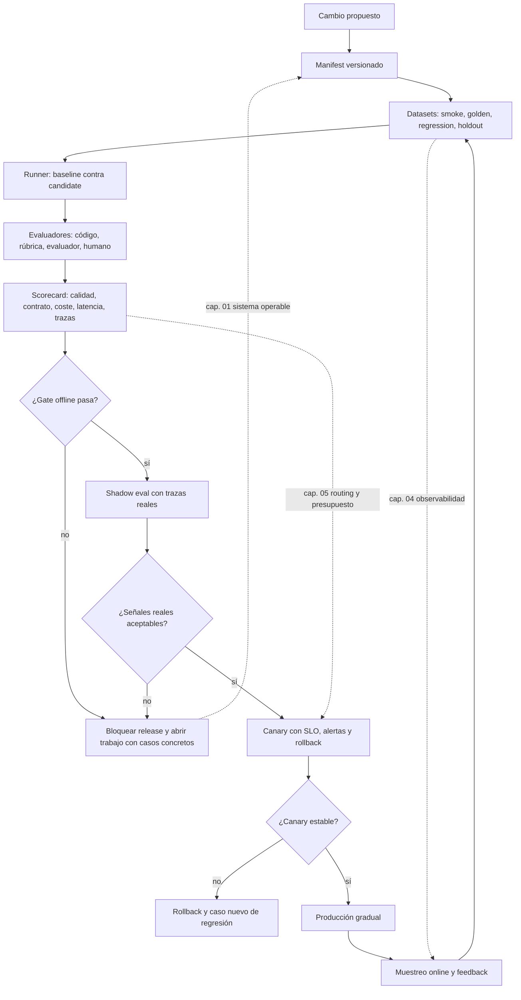

::: {.fasciculo-subtitle}
Facsímil 6 · Construir y operar
:::

# Capítulo 06: EvalOps y gates de release

## Qué deberías poder hacer al terminar

En el capítulo 04 aprendimos a observar una run. En el capítulo 05 construimos un router que decide ruta, presupuesto y fallback. Ahora falta una pieza incómoda: **cómo impedimos que un cambio llegue a producción solo porque en una demo parecía funcionar**.

Un sistema de IA cambia por muchos sitios: prompt, modelo, proveedor, parámetros, RAG, router, tool, contrato de salida, dataset, evaluador, runtime, política de coste o límite de latencia. Cada cambio puede mejorar una métrica y romper otra. EvalOps es la forma disciplinada de convertir esa incertidumbre en un proceso de ingeniería.

Al terminar, deberías poder hacer esto:

| Resultado de aprendizaje | Evidencia de que lo sabes hacer |
|---|---|
| Diseñar un pipeline EvalOps. | Separas dataset, runner, evaluadores, scorecard, gate, canary y feedback. |
| Elegir qué evaluar según el cambio. | No evalúas igual un prompt, un router, un RAG, una tool o un runtime. |
| Versionar evidencia. | Guardas `dataset_id`, `prompt_version`, `model_id`, `route_catalog_version`, `eval_policy_version` y `trace_schema_version`. |
| Comparar baseline contra candidate. | Miras calidad, coste, latencia, contrato, trazas y regresiones. |
| Definir gates discutibles. | Los umbrales están escritos, tienen dueño, tolerancia y motivo. |
| Evitar autoengaño estadístico. | Repites casos inestables, separas holdout y usas intervalos cuando la muestra es pequeña. |
| Conectar evals con producción. | Las trazas que fallan vuelven al dataset y alimentan nuevas pruebas. |

La idea central: **una release de IA no debería pasar por intuición; debería pasar por evidencia versionada**.

## El cambio pequeño que no era pequeño

Imagina una pull request que dice: “mejoro el prompt para que el asistente sea más claro”. Parece inocente. Se revisa el texto, se prueba con tres preguntas y todo parece más amable.

Pero al desplegarlo aparecen efectos laterales: algunas respuestas son más largas, sube el coste medio, una salida JSON empieza a traer un campo extra, la latencia p95 empeora porque el prompt metió más contexto, y el router deriva más tareas al modelo caro porque el clasificador entiende peor la intención.

La conclusión no es “no cambies prompts”. La conclusión es más profesional: un cambio de IA tiene superficie operativa. Si no lo medimos antes, lo descubrimos después con usuarios, coste y soporte.

EvalOps pone una pregunta delante de cada cambio:

> ¿Qué evidencia mínima necesito para decir que esta versión puede avanzar?

## Qué no es EvalOps

EvalOps no es abrir un notebook, mirar diez ejemplos y escribir “parece mejor”. Eso puede servir para exploración, pero no para release.

Tampoco es delegar toda la decisión en un modelo evaluador. Un evaluador puede ayudar, igual que una métrica puede ayudar, pero los criterios deben estar escritos. Si la rúbrica cambia sin versión, si el evaluador cambia sin control o si nadie revisa casos frontera, el número resultante solo da una sensación cómoda.

Y no es tener una tabla enorme de benchmarks públicos para decorar una presentación. Un benchmark externo puede orientar, pero tu producto vive con tus usuarios, tus documentos, tus contratos, tus tools, tus costes y tus límites de latencia. La evaluación útil combina referencias externas con datos propios.

| Confusión | Qué falta |
|---|---|
| “Lo he probado y va bien” | Dataset, repetición, comparación y trazas. |
| “El evaluador dice 8,7” | Rúbrica, calibración, ejemplos de referencia y auditoría de errores. |
| “El benchmark sube” | Casos propios, contrato de salida, coste y latencia real. |
| “Solo cambié el prompt” | Ver si cambian tokens, formato, abstención, tools, ruta y estilo. |
| “Si falla, hacemos rollback” | Saber qué métrica lo detecta, cuánto tarda y qué versión restaurar. |

## Qué sí es EvalOps

EvalOps es el ciclo que convierte una versión candidata en una decisión operativa.

**Ejemplo de fórmula.** Podemos representarlo como:

$$
E = (D, R, J, M, G, S)
$$

| Símbolo | Significado | Ejemplo |
|---|---|---|
| \(D\) | Datasets de evaluación. | Golden, regresión, holdout, shadow y muestra de producción. |
| \(R\) | Runner reproducible. | Ejecuta baseline y candidate con las mismas entradas. |
| \(J\) | Evaluadores. | Código, reglas, LLM-as-judge, revisión humana, métricas RAG o métricas de tool. |
| \(M\) | Métricas. | Calidad, groundedness, JSON válido, coste, p95, tokens, trazas completas. |
| \(G\) | Gates. | Condiciones para pasar a staging, canary o producción. |
| \(S\) | Scorecard. | Documento o artefacto firmado con versiones, resultados y decisión. |

Lo importante: EvalOps no vive al final. Empieza cuando se define el cambio. Si no sabemos qué dataset protege una conducta, qué métrica mide el éxito o qué gate puede bloquear, estamos cambiando software sin contrato de calidad.

## Fecha de corte del estado del arte

**Fecha de corte:** 28 de mayo de 2026.  
**Fuentes consultadas:** documentación oficial de OpenAI sobre evals, graders, agent evals y trace grading; documentación de Google ADK sobre evaluación de agentes; LangSmith Evaluation; Arize Phoenix Evaluation; Ragas metrics; Braintrust Evaluation; Promptfoo; OpenTelemetry; Google SRE Workbook; y trabajos clásicos de ingeniería de ML como TFX y *Software Engineering for Machine Learning*.

Lo estable es el método: datasets versionados, experimentos comparables, evaluadores con criterios explícitos, trazas, gates, CI/CD, monitorización online y feedback desde producción. Lo cambiante son productos, APIs, paneles, nombres de métricas, modelos evaluadores, precios, límites de proveedor y benchmarks de moda.

OpenAI documenta la creación y ejecución de evals mediante API y dashboard, con graders y datasets para probar criterios concretos.^[OpenAI. (2026). *Working with evals*. https://developers.openai.com/api/docs/guides/evals. Consultado el 28 de mayo de 2026.] Google ADK insiste en evaluar tanto respuesta final como trayectoria de un agente, porque los modelos introducen variabilidad y las aserciones deterministas no siempre bastan.^[Google. (2026). *Why Evaluate Agents*. https://adk.dev/evaluate/. Consultado el 28 de mayo de 2026.] LangSmith separa evaluación offline, antes de publicar, y online, sobre interacciones reales muestreadas.^[LangChain. (2026). *LangSmith Evaluation*. https://docs.langchain.com/langsmith/evaluation. Consultado el 28 de mayo de 2026.]

Phoenix organiza evals como señales de calidad que pueden adjuntarse a trazas y datasets, con evaluadores por código, modelos y revisión humana.^[Arize Phoenix. (2026). *Evaluation concepts*. https://arize.com/docs/phoenix/evaluation/concepts-evals/evaluation. Consultado el 28 de mayo de 2026.] Braintrust presenta un ciclo de evaluación que pasa por playgrounds, experimentos, CI/CD, scoring en producción y realimentación hacia datasets.^[Braintrust. (2026). *Evaluate systematically*. https://www.braintrust.dev/docs/evaluate. Consultado el 28 de mayo de 2026.] Promptfoo, por su parte, ofrece un enfoque declarativo y de CI para comparar prompts, modelos y pipelines RAG.^[Promptfoo. (2026). *Intro*. https://www.promptfoo.dev/docs/intro/. Consultado el 28 de mayo de 2026.]

## Qué evaluar según lo que cambias

Un error habitual es tener una única evaluación para todo. No funciona. Cada cambio toca una parte distinta del sistema.

| Cambio | Qué puede romper | Evaluación mínima |
|---|---|---|
| Prompt | Formato, tono, longitud, abstención, uso de tools y coste. | Golden set, contrato de salida, tokens, casos de regresión y revisión de trazas. |
| Modelo | Calidad, latencia, coste, soporte de parámetros, contexto y estabilidad. | Comparación baseline/candidate, p95, coste por tarea aceptada, repetición de casos dudosos. |
| Parámetros | Variabilidad, creatividad, longitud y cumplimiento de schema. | Repeticiones por caso, flake rate, schema pass rate y distribución de longitud. |
| RAG | Relevancia de chunks, groundedness, citas, cobertura y ruido. | Context precision, context recall, faithfulness, citas válidas y evaluación por documento. |
| Router | Rutas elegidas, coste, latencia, capacidad y degradación. | Shadow routing, matriz de tareas, presupuesto, p95 por ruta y diff de decisiones. |
| Tool | Argumentos, permisos, errores tipados, idempotencia y compensación. | Contract tests, trazas de tool, validación de argumentos y casos de error controlado. |
| Contrato JSON | Campos obligatorios, tipos, enums, extras y compatibilidad. | Validación determinista, fixtures, migración de schema y ejemplos negativos. |
| Runtime | Timeouts, batching, retries, colas, memoria y throughput. | Carga sintética, p95/p99, tasa de timeouts, goodput y comparación de trazas. |
| Evaluador | Cambia la regla con la que medimos. | Eval del evaluador, acuerdo humano, ejemplos calibrados y versionado de rúbrica. |

La regla sencilla: **si no sabes qué eval corresponde a un cambio, todavía no entiendes bien su superficie de riesgo técnico**.

## CI/CD real: dónde vive EvalOps

Para ingeniería informática, EvalOps no puede quedarse en una carpeta de experimentos. Tiene que entrar en el flujo normal de cambio: pull request, revisión, integración continua, release candidate, canary y producción.

GitHub Actions define workflows como procesos automatizados configurados en YAML y compuestos por jobs.^[GitHub. (2026). *Workflow syntax for GitHub Actions*. https://docs.github.com/en/actions/reference/workflows-and-actions/workflow-syntax. Consultado el 28 de mayo de 2026.] GitLab CI/CD también usa un archivo YAML para declarar jobs, etapas y reglas de ejecución.^[GitLab. (2026). *CI/CD YAML syntax reference*. https://docs.gitlab.com/ci/yaml/. Consultado el 28 de mayo de 2026.] La idea no depende de la plataforma: el gate de IA debe producir un estado automático, artefactos revisables y una decisión clara.

| Momento | Job | Qué ejecuta | Qué artefacto deja |
|---|---|---|---|
| Pull request | `evalops-smoke` | Schema, smoke set, contratos de tool y regresiones críticas. | `smoke_report.json`, logs y diff de métricas. |
| Pull request con cambio de IA | `evalops-pr` | Golden reducido, comparación baseline/candidate, coste estimado. | Comentario en PR y scorecard parcial. |
| Nightly | `evalops-nightly` | Golden completo, repeticiones, tags lentos y métricas por segmento. | Serie histórica, dataset failures y traces de muestra. |
| Release candidate | `evalops-release` | Regression completo, holdout autorizado, scorecard firmada. | `release_scorecard.json` y decisión. |
| Canary | `evalops-online` | SLIs online, sampling, burn rate, coste p95 y feedback. | Dashboard, alerta y casos nuevos para dataset. |

Un ejemplo mínimo en GitHub Actions:

```yaml
name: evalops

on:
  pull_request:
    paths:
      - "prompts/**"
      - "ops/ai/**"
      - "rag/**"
      - "tools/**"
  schedule:
    - cron: "17 2 * * *"
  workflow_dispatch:

jobs:
  smoke:
    runs-on: ubuntu-latest
    timeout-minutes: 10
    steps:
      - uses: actions/checkout@v4
      - uses: actions/setup-python@v5
        with:
          python-version: "3.12"
      - name: Install
        run: pip install -r requirements-dev.txt
      - name: Run smoke evals
        run: python ops/ai/evalops_release_gate.py --dataset evals/smoke.jsonl
      - name: Upload scorecard
        uses: actions/upload-artifact@v4
        with:
          name: evalops-scorecard
          path: output/evalops_scorecard.json

  release-gate:
    if: github.event_name == 'workflow_dispatch'
    needs: smoke
    runs-on: ubuntu-latest
    timeout-minutes: 60
    steps:
      - uses: actions/checkout@v4
      - name: Run release gate
        run: python ops/ai/evalops_release_gate.py --dataset evals/release.jsonl --strict
```

Qué debe importarte del YAML:

| Pieza | Por qué importa |
|---|---|
| `paths` | Evita gastar evaluaciones cuando el cambio no toca IA. |
| `timeout-minutes` | Un gate que se queda colgado también rompe el flujo de ingeniería. |
| `upload-artifact` | La decisión debe dejar evidencia descargable. |
| `workflow_dispatch` | Permite ejecutar una release candidate manual y trazable. |
| `needs` | Obliga a ordenar smoke antes de release gate. |

El patrón equivalente en GitLab cambia la sintaxis, pero no la arquitectura:

```yaml
stages:
  - test
  - eval
  - release

evalops_smoke:
  stage: eval
  image: python:3.12
  rules:
    - changes:
        - prompts/**/*
        - ops/ai/**/*
        - rag/**/*
        - tools/**/*
  script:
    - pip install -r requirements-dev.txt
    - python ops/ai/evalops_release_gate.py --dataset evals/smoke.jsonl
  artifacts:
    when: always
    paths:
      - output/evalops_scorecard.json
```

La pregunta de examen no debería ser “¿sabes escribir YAML?”. Debería ser: **¿qué job bloquea qué decisión y qué evidencia deja para revisarla?**

## Contrato JSONL de un caso de evaluación

Un dataset de EvalOps necesita un formato aburrido, versionable y fácil de revisar en Git. JSONL encaja bien porque cada línea es un caso independiente.

Ejemplo formateado para leer. En el archivo `eval_cases.jsonl`, cada objeto iría en una sola línea:

```json
{
  "case_id": "support-json-001",
  "task": "support_triage",
  "input": {
    "message": "No puedo acceder a mi matrícula y ya pagué."
  },
  "expected": {
    "categoria": "matricula",
    "prioridad": "alta",
    "must_include": ["comprobar pago", "revisar expediente"]
  },
  "tags": ["json", "soporte", "alta_criticidad"],
  "rubric": {
    "quality_min": 0.85,
    "contract_required": true,
    "citation_required": false
  },
  "why_it_exists": "Protege clasificación urgente con salida estructurada.",
  "source": "manual",
  "source_trace_id": null,
  "owner": "ai-platform",
  "sensitivity": "low",
  "created_at": "2026-05-28"
}
{
  "case_id": "rag-policy-014",
  "task": "policy_qa",
  "input": {
    "question": "¿Puedo entregar fuera de plazo si tengo justificante?"
  },
  "expected": {
    "source_ids": ["policy-academic-2026#late-delivery"],
    "answer_must_be_grounded": true
  },
  "tags": ["rag", "policy", "citas"],
  "rubric": {
    "faithfulness_min": 0.90,
    "context_recall_min": 0.80,
    "abstain_if_missing": true
  },
  "why_it_exists": "Evita responder normativa sin fuente recuperada.",
  "source": "production_sample",
  "source_trace_id": "trace_20260527_7781",
  "owner": "academic-platform",
  "sensitivity": "medium",
  "created_at": "2026-05-28"
}
```

Campos mínimos:

| Campo | Tipo | Regla |
|---|---|---|
| `case_id` | string | Estable, único y no reutilizable. |
| `task` | string | Debe mapear a una política de routing y gate. |
| `input` | objeto | Entrada reproducible, sin datos innecesarios. |
| `expected` | objeto | Puede ser salida exacta, propiedades, fuentes o condiciones. |
| `tags` | array | Permite análisis por contrato, idioma, ruta, dificultad o criticidad. |
| `rubric` | objeto | Umbrales por caso cuando no basta una regla global. |
| `why_it_exists` | string | Razón pedagógica u operativa del caso. |
| `source` | string | `manual`, `production_sample`, `incident`, `benchmark`, `synthetic`. |
| `source_trace_id` | string o null | Conecta producción con evaluación sin copiar toda la traza. |
| `owner` | string | Equipo responsable de cambiar o retirar el caso. |
| `sensitivity` | string | `low`, `medium`, `high`; decide retención y permisos. |

Un buen dataset no solo pregunta “qué debe contestar”. También pregunta “qué propiedad de ingeniería protege este caso”.

## Los datasets no son una carpeta de ejemplos

Un dataset de evaluación es un contrato de aprendizaje. Cada caso debería explicar por qué existe.

| Campo | Qué guarda | Por qué importa |
|---|---|---|
| `case_id` | Identificador estable. | Permite seguir el caso durante meses. |
| `input` | Entrada que se ejecuta. | Debe ser realista y reproducible. |
| `expected` | Salida, propiedades o fuente esperada. | No siempre es una frase exacta; puede ser una rúbrica. |
| `tags` | Tema, dificultad, ruta, cliente, idioma, contrato. | Permite ver dónde mejora o empeora. |
| `why_it_exists` | Motivo del caso. | Evita acumular ejemplos sin intención. |
| `source` | Manual, producción, incidencia, laboratorio, benchmark. | Da contexto y trazabilidad. |
| `sensitivity` | Qué puede guardarse y quién puede verlo. | Protege datos y limita muestras. |
| `owner` | Persona o equipo responsable. | Alguien debe decidir si el caso cambia. |
| `created_from_trace_id` | Traza de origen, si viene de producción. | Cierra el bucle entre operación y evaluación. |

No todos los datasets cumplen el mismo papel:

| Dataset | Tamaño típico | Uso | Cuidado |
|---|---:|---|---|
| Smoke | 5-20 casos | Detectar roturas obvias en segundos. | No sirve para afirmar calidad. |
| Golden | 50-300 casos | Proteger comportamientos esenciales. | Si lo ajustas demasiado, deja de generalizar. |
| Regression | Crece con el producto | Evitar que vuelvan fallos corregidos. | Debe etiquetar motivo y versión que lo arregló. |
| Holdout | Reservado | Medir sin haber optimizado contra esos casos. | No debe mirarse a cada iteración pequeña. |
| Shadow | Muestra real | Ver qué pasaría con una candidata. | Necesita anonimización, muestreo y coste controlado. |
| Canary | Tráfico limitado | Confirmar señales reales antes de extender. | Requiere rollback y SLOs claros. |

Ragas lista métricas específicas para RAG como context precision, context recall, response relevancy, faithfulness, tool call accuracy y métricas tradicionales como exact match o ROUGE.^[Ragas. (2026). *List of available metrics*. https://docs.ragas.io/en/stable/concepts/metrics/available_metrics/. Consultado el 28 de mayo de 2026.] Eso no significa que haya que usarlas todas. Significa que cada dataset debe decir qué propiedad mide.

## Evaluadores como software

Un evaluador no es una autoridad mística. Es software. Y si es software, se versiona, se prueba, se observa y se puede equivocar.

Tipos de evaluadores:

| Tipo | Cuándo usarlo | Ejemplo | Riesgo |
|---|---|---|---|
| Determinista | El contrato es objetivo. | JSON válido, enum permitido, campo obligatorio, regex, SQL ejecuta. | No mide calidad semántica. |
| Heurístico | Hay reglas baratas aproximadas. | Longitud máxima, presencia de cita, número de tools, coste. | Puede incentivar trucos superficiales. |
| Métrica clásica | Hay referencia textual o ranking. | Exact match, F1, ROUGE, Hit@k, MRR. | No siempre captura utilidad real. |
| LLM-as-judge | La calidad exige criterio lingüístico. | Correctitud, groundedness, tono, completitud. | Depende de rúbrica, modelo, temperatura y calibración. |
| Revisión humana | La decisión tiene impacto alto o ambigüedad real. | Casos límite, cambios de rúbrica, muestras de canary. | Coste y variabilidad entre personas. |

Qué debe tener un evaluador serio:

| Propiedad | Qué significa |
|---|---|
| `evaluator_version` | Si cambia la rúbrica, cambia la versión. |
| `input_schema` | Qué campos necesita para puntuar. |
| `output_schema` | Qué devuelve: `score`, `label`, `explanation`, `confidence`, `evidence`. |
| `calibration_set` | Casos donde ya sabemos qué debería decidir. |
| `known_failures` | Casos donde el evaluador suele confundirse. |
| `cost_budget` | Coste máximo por lote de evaluación. |
| `owner` | Persona o equipo que responde por la regla. |

Un patrón útil es probar al evaluador antes de usarlo para aprobar releases:

```python
CALIBRATION = [
    {
        "case_id": "judge-cal-001",
        "input": "Respuesta con cita correcta y fuente recuperada.",
        "expected_label": "pass",
    },
    {
        "case_id": "judge-cal-002",
        "input": "Respuesta segura pero sin fuente recuperada.",
        "expected_label": "fail",
    },
]

def test_evaluator_calibration(evaluator):
    labels = [evaluator(item["input"]).label for item in CALIBRATION]
    expected = [item["expected_label"] for item in CALIBRATION]
    assert labels == expected
```

La pregunta de ingeniería: si el evaluador cambia de opinión, ¿es porque la candidata mejoró, porque el evaluador cambió o porque el caso era ambiguo? Si no puedes separar esas tres cosas, tu gate tiene ruido.

## La comparación baseline contra candidate

Una release seria no pregunta “¿la candidata es buena?”. Pregunta:

> ¿La candidata es suficientemente buena, no empeora lo importante y mejora lo que prometía mejorar?

**Ejemplo de fórmula.** Podemos escribir un gate de forma compacta:

$$
G(v_c)=
\mathbb{1}[
Q_c \ge Q_{min}
\land
Q_c \ge Q_b - \delta_q
\land
L_{95,c} \le L_{95,max}
\land
C_c \le C_{max}
\land
K_c \ge K_{min}
]
$$

| Símbolo | Significado | Ejemplo |
|---|---|---|
| \(G(v_c)\) | Gate aplicado a la versión candidata. | 1 si pasa, 0 si no pasa. |
| \(Q_c\) | Calidad de la candidata. | 0,91 de media ponderada. |
| \(Q_b\) | Calidad del baseline. | 0,89 de la versión estable. |
| \(Q_{min}\) | Calidad mínima absoluta. | Nunca publicar por debajo de 0,85. |
| \(\delta_q\) | Tolerancia de caída aceptable. | Permitir hasta 0,01 si gana mucho en coste. |
| \(L_{95,c}\) | Latencia p95 de la candidata. | 3200 ms. |
| \(L_{95,max}\) | Límite p95 permitido. | 4500 ms. |
| \(C_c\) | Coste medio o p95 por tarea aceptada. | 0,021 EUR. |
| \(C_{max}\) | Presupuesto máximo. | 0,030 EUR. |
| \(K_c\) | Cumplimiento de contrato. | 99,4% JSON válido. |
| \(K_{min}\) | Cumplimiento mínimo. | 99,0%. |

La fórmula no reemplaza criterio. Lo fuerza a aparecer. Si decides aceptar una caída de calidad a cambio de menor coste, escríbelo. Si un contrato JSON no puede caer nunca por debajo de 99,5%, escríbelo. Si el gate cambia, versiona el cambio.

## Estadística mínima para no engañarnos

En IA hay ruido. Una misma configuración puede producir respuestas distintas. Un evaluador puede variar. Un proveedor puede tener latencia distinta según hora. Una muestra pequeña puede parecer una mejora enorme por azar.

El primer indicador de inestabilidad es el flake rate:

$$
F = \frac{N_{inestable}}{N_{repetido}}
$$

| Símbolo | Significado |
|---|---|
| \(F\) | Proporción de casos que cambian de resultado al repetir. |
| \(N_{inestable}\) | Casos cuyo veredicto no fue consistente. |
| \(N_{repetido}\) | Casos repetidos bajo la misma configuración. |

Si `F` sube, no basta con mirar la media. Hay que repetir, separar por tags y entender qué se mueve.

Para proporciones pequeñas, por ejemplo “pasa contrato” o “acierta caso”, conviene mirar un intervalo. Una opción práctica es el límite inferior de Wilson:

$$
W_{low} =
\frac{\hat{p} + \frac{z^2}{2n} - z\sqrt{\frac{\hat{p}(1-\hat{p})}{n}+\frac{z^2}{4n^2}}}
{1+\frac{z^2}{n}}
$$

| Símbolo | Significado |
|---|---|
| \(\hat{p}\) | Proporción observada de éxitos. |
| \(n\) | Número de casos evaluados. |
| \(z\) | Valor de confianza; 1,96 se usa a menudo para 95%. |
| \(W_{low}\) | Límite inferior conservador. |

Ejemplo: 19 aciertos de 20 parecen un 95%. Pero con pocos casos, el límite inferior de Wilson es bastante más bajo. Eso nos recuerda que una muestra pequeña no da el mismo nivel de confianza que 950 aciertos de 1000.

## Comparación pareada: misma entrada, dos versiones

En sistemas de IA, comparar medias agregadas puede engañar. Si la candidata mejora casos fáciles y empeora casos críticos, la media quizá sube y aun así el producto empeora.

La comparación pareada ejecuta cada caso contra baseline y candidate:

$$
\Delta_i = S_c(x_i) - S_b(x_i)
$$

| Símbolo | Significado |
|---|---|
| \(x_i\) | Caso evaluado. |
| \(S_b(x_i)\) | Score del baseline en ese caso. |
| \(S_c(x_i)\) | Score de la candidata en ese caso. |
| \(\Delta_i\) | Diferencia caso a caso. |

Después clasificamos cada caso:

| Resultado pareado | Regla típica | Qué indica |
|---|---|---|
| Win | \(\Delta_i > \epsilon\) | La candidata mejora de forma apreciable. |
| Tie | \(|\Delta_i| \le \epsilon\) | No hay diferencia útil. |
| Loss | \(\Delta_i < -\epsilon\) | La candidata empeora. |
| Contract loss | Baseline cumple contrato y candidate no. | Debe pesar más que una pérdida pequeña de estilo. |

Scorecard pareada:

| Métrica | Valor | Cómo leerla |
|---|---:|---|
| `wins` | 42 | Casos donde candidate mejora. |
| `ties` | 118 | Casos equivalentes. |
| `losses` | 17 | Casos donde candidate empeora. |
| `critical_losses` | 3 | Casos que no deberían empeorar sin revisión. |
| `contract_losses` | 1 | Puede bloquear aunque la media mejore. |

Si quieres una prueba estadística sencilla para etiquetas binarias, McNemar suele aparecer cuando los mismos casos se evalúan con dos clasificadores y solo importan los desacuerdos. Para un libro como este, basta con que el alumno entienda la intuición: **los casos donde ambos aciertan o ambos fallan no distinguen versiones; la decisión vive en los desacuerdos**.

Para scores continuos, una alternativa práctica es bootstrap sobre \(\Delta_i\): remuestrear deltas, calcular la media muchas veces y mirar si el intervalo cae claramente por encima de cero. No hace falta convertir esto en ceremonia, pero sí evitar frases como “subió 0,7 puntos” sin mirar variabilidad, tags y criticidad.

## Matriz de criticidad por tarea

No todas las tareas merecen el mismo gate. Una recomendación interna reversible no necesita el mismo nivel que una extracción usada para facturación o una acción que modifica un sistema.

| Criticidad | Señal | Gate mínimo |
|---|---|---|
| Baja | Respuesta informativa, reversible, sin contrato fuerte. | Smoke, calidad mínima, coste y latencia. |
| Media | Soporte, resumen, clasificación o RAG con fuente. | Golden, regression, contrato, groundedness, coste p95 y revisión de pérdidas. |
| Alta | Salida que alimenta procesos, usuarios o datos importantes. | Holdout, comparación pareada, contrato estricto, revisión humana de pérdidas críticas y canary. |
| Muy alta | Acción externa, cambio de estado o decisión sensible. | Aprobación explícita, trazas completas, doble gate, rollback probado y muestreo online. |

Variables para decidir criticidad:

| Variable | Pregunta |
|---|---|
| Reversibilidad | ¿Se puede deshacer sin daño operativo? |
| Dependencia downstream | ¿Otra parte del sistema confía en esta salida? |
| Contrato | ¿Hay schema, tipo, enum o cita obligatoria? |
| Exposición de datos | ¿La run toca datos internos, personales o documentos sensibles? |
| Coste de error | ¿Qué pasa si una respuesta incorrecta se acepta? |
| Frecuencia | ¿Ocurre una vez al mes o miles de veces al día? |
| Supervisión | ¿Hay revisión humana antes de ejecutar la consecuencia? |

Una política simple:

```yaml
criticality_policy:
  support_summary:
    level: medium
    required_gates: [smoke, golden, regression, cost_p95]
  billing_extraction:
    level: high
    required_gates: [schema, paired_eval, holdout, human_review_losses]
  external_action:
    level: very_high
    required_gates: [schema, trace_complete, approval, canary, rollback_drill]
```

El buen diseño no consiste en poner todos los gates a todo. Consiste en que el nivel de prueba acompañe al impacto.

## Anatomía visual de un pipeline EvalOps

<svg id="f6-c06-evalops-gates" xmlns="http://www.w3.org/2000/svg" viewBox="0 0 1760 1220" role="img" aria-label="Pipeline EvalOps con cambio, datasets, runners, evaluadores, scorecard, gates, canary, producción y feedback">
  <defs>
    <style>
      #f6-c06-evalops-gates{background:#fff;color:#111;font-family:Inter,ui-sans-serif,system-ui,-apple-system,BlinkMacSystemFont,"Segoe UI",sans-serif}
      #f6-c06-evalops-gates .title{font-size:38px;font-weight:800;fill:#111}
      #f6-c06-evalops-gates .subtitle{font-size:17px;fill:#444}
      #f6-c06-evalops-gates .h{font-size:18px;font-weight:800;fill:#111}
      #f6-c06-evalops-gates .hw{font-size:18px;font-weight:800;fill:#fff}
      #f6-c06-evalops-gates .txt{font-size:13px;fill:#222}
      #f6-c06-evalops-gates .tiny{font-size:11px;fill:#555}
      #f6-c06-evalops-gates .micro{font-size:10px;fill:#666}
      #f6-c06-evalops-gates .frame{fill:#fff;stroke:#111;stroke-width:2}
      #f6-c06-evalops-gates .panel{fill:#fff;stroke:#111;stroke-width:1.5}
      #f6-c06-evalops-gates .soft{fill:#f6f6f6;stroke:#111;stroke-width:1.2}
      #f6-c06-evalops-gates .dark{fill:#111;stroke:#111;stroke-width:1.3}
      #f6-c06-evalops-gates .metric{fill:#fff;stroke:#444;stroke-width:1.1}
      #f6-c06-evalops-gates .line{stroke:#111;stroke-width:2;fill:none}
      #f6-c06-evalops-gates .dash{stroke:#555;stroke-width:1.5;fill:none;stroke-dasharray:8 7}
      #f6-c06-evalops-gates .thin{stroke:#555;stroke-width:1.1;fill:none}
    </style>
    <marker id="f6c06-arrow" viewBox="0 0 10 10" refX="9" refY="5" markerWidth="8" markerHeight="8" orient="auto-start-reverse">
      <path d="M 0 0 L 10 5 L 0 10 z" fill="#111"/>
    </marker>
  </defs>

  <rect x="42" y="36" width="1676" height="1148" rx="24" class="frame"/>
  <text x="880" y="92" text-anchor="middle" class="title">EvalOps: publicar una versión con evidencia, no con intuición</text>
  <text x="880" y="124" text-anchor="middle" class="subtitle">El cambio se ejecuta contra datasets versionados, genera trazas, se puntúa, pasa gates y vuelve a producción solo si deja una scorecard aceptable.</text>

  <rect x="92" y="178" width="220" height="118" rx="14" class="dark"/>
  <text x="202" y="210" text-anchor="middle" class="hw">Cambio propuesto</text>
  <text x="202" y="236" text-anchor="middle" class="tiny" fill="#eee">prompt · modelo · RAG</text>
  <text x="202" y="256" text-anchor="middle" class="tiny" fill="#eee">router · tool · runtime</text>
  <text x="202" y="276" text-anchor="middle" class="tiny" fill="#eee">contrato · evaluador</text>

  <rect x="382" y="158" width="310" height="158" rx="16" class="panel"/>
  <text x="537" y="190" text-anchor="middle" class="h">Manifest de release</text>
  <text x="537" y="218" text-anchor="middle" class="txt">versiones que hacen repetible la prueba</text>
  <rect x="414" y="238" width="246" height="26" rx="7" class="metric"/>
  <text x="537" y="256" text-anchor="middle" class="tiny">model_id · prompt_version · dataset_id</text>
  <rect x="414" y="272" width="246" height="26" rx="7" class="metric"/>
  <text x="537" y="290" text-anchor="middle" class="tiny">route_catalog · eval_policy · schema</text>

  <rect x="762" y="158" width="308" height="158" rx="16" class="panel"/>
  <text x="916" y="190" text-anchor="middle" class="h">Datasets</text>
  <text x="916" y="218" text-anchor="middle" class="txt">cada caso sabe por qué existe</text>
  <rect x="792" y="238" width="96" height="34" rx="8" class="soft"/>
  <text x="840" y="260" text-anchor="middle" class="tiny">golden</text>
  <rect x="898" y="238" width="96" height="34" rx="8" class="soft"/>
  <text x="946" y="260" text-anchor="middle" class="tiny">regresión</text>
  <rect x="1004" y="238" width="46" height="34" rx="8" class="soft"/>
  <text x="1027" y="260" text-anchor="middle" class="tiny">hold</text>
  <rect x="792" y="280" width="124" height="24" rx="6" class="metric"/>
  <text x="854" y="296" text-anchor="middle" class="micro">tags por tarea</text>
  <rect x="926" y="280" width="124" height="24" rx="6" class="metric"/>
  <text x="988" y="296" text-anchor="middle" class="micro">why_it_exists</text>

  <rect x="1140" y="158" width="528" height="158" rx="16" class="panel"/>
  <text x="1404" y="190" text-anchor="middle" class="h">Runners comparables</text>
  <text x="1404" y="218" text-anchor="middle" class="txt">baseline y candidate reciben los mismos casos con trazas separadas</text>
  <rect x="1174" y="244" width="218" height="46" rx="10" class="dark"/>
  <text x="1283" y="272" text-anchor="middle" class="hw">baseline estable</text>
  <rect x="1418" y="244" width="218" height="46" rx="10" class="dark"/>
  <text x="1527" y="272" text-anchor="middle" class="hw">candidate nueva</text>
  <line x1="1392" y1="267" x2="1418" y2="267" class="line" marker-end="url(#f6c06-arrow)"/>

  <line x1="312" y1="237" x2="382" y2="237" class="line" marker-end="url(#f6c06-arrow)"/>
  <line x1="692" y1="237" x2="762" y2="237" class="line" marker-end="url(#f6c06-arrow)"/>
  <line x1="1070" y1="237" x2="1140" y2="237" class="line" marker-end="url(#f6c06-arrow)"/>

  <rect x="94" y="380" width="710" height="242" rx="18" class="panel"/>
  <text x="449" y="414" text-anchor="middle" class="h">Evaluadores por capa</text>
  <text x="449" y="442" text-anchor="middle" class="txt">mezcla de reglas deterministas, rúbricas, modelos evaluadores y revisión humana</text>
  <rect x="132" y="476" width="146" height="52" rx="10" class="soft"/>
  <text x="205" y="497" text-anchor="middle" class="tiny">contrato</text>
  <text x="205" y="514" text-anchor="middle" class="micro">schema · enums</text>
  <rect x="304" y="476" width="146" height="52" rx="10" class="soft"/>
  <text x="377" y="497" text-anchor="middle" class="tiny">calidad</text>
  <text x="377" y="514" text-anchor="middle" class="micro">rúbrica · evaluador</text>
  <rect x="476" y="476" width="146" height="52" rx="10" class="soft"/>
  <text x="549" y="497" text-anchor="middle" class="tiny">RAG</text>
  <text x="549" y="514" text-anchor="middle" class="micro">recall · faithfulness</text>
  <rect x="648" y="476" width="118" height="52" rx="10" class="soft"/>
  <text x="707" y="497" text-anchor="middle" class="tiny">tools</text>
  <text x="707" y="514" text-anchor="middle" class="micro">args · orden</text>
  <rect x="132" y="548" width="146" height="44" rx="10" class="metric"/>
  <text x="205" y="575" text-anchor="middle" class="tiny">coste por aceptada</text>
  <rect x="304" y="548" width="146" height="44" rx="10" class="metric"/>
  <text x="377" y="575" text-anchor="middle" class="tiny">p95 · timeout</text>
  <rect x="476" y="548" width="146" height="44" rx="10" class="metric"/>
  <text x="549" y="575" text-anchor="middle" class="tiny">flake rate</text>
  <rect x="648" y="548" width="118" height="44" rx="10" class="metric"/>
  <text x="707" y="575" text-anchor="middle" class="tiny">traza completa</text>

  <rect x="870" y="380" width="798" height="242" rx="18" class="panel"/>
  <text x="1269" y="414" text-anchor="middle" class="h">Scorecard de release</text>
  <text x="1269" y="442" text-anchor="middle" class="txt">una tabla única para revisar calidad, coste, latencia, contrato y evidencia</text>
  <line x1="918" y1="474" x2="1620" y2="474" class="thin"/>
  <text x="934" y="462" class="tiny">métrica</text>
  <text x="1110" y="462" class="tiny">baseline</text>
  <text x="1250" y="462" class="tiny">candidate</text>
  <text x="1390" y="462" class="tiny">gate</text>
  <text x="1518" y="462" class="tiny">decisión</text>
  <text x="934" y="502" class="txt">calidad ponderada</text>
  <text x="1110" y="502" class="txt">0,89</text>
  <text x="1250" y="502" class="txt">0,91</text>
  <text x="1390" y="502" class="txt">≥ 0,88</text>
  <text x="1518" y="502" class="txt">pasa</text>
  <text x="934" y="532" class="txt">JSON válido</text>
  <text x="1110" y="532" class="txt">99,6%</text>
  <text x="1250" y="532" class="txt">99,2%</text>
  <text x="1390" y="532" class="txt">≥ 99%</text>
  <text x="1518" y="532" class="txt">pasa</text>
  <text x="934" y="562" class="txt">p95 latencia</text>
  <text x="1110" y="562" class="txt">2,9 s</text>
  <text x="1250" y="562" class="txt">3,8 s</text>
  <text x="1390" y="562" class="txt">≤ 4,0 s</text>
  <text x="1518" y="562" class="txt">pasa</text>
  <text x="934" y="592" class="txt">coste p95</text>
  <text x="1110" y="592" class="txt">0,028 €</text>
  <text x="1250" y="592" class="txt">0,031 €</text>
  <text x="1390" y="592" class="txt">≤ 0,030 €</text>
  <text x="1518" y="592" class="txt">bloquea</text>

  <line x1="449" y1="622" x2="449" y2="690" class="line" marker-end="url(#f6c06-arrow)"/>
  <line x1="1269" y1="622" x2="1269" y2="690" class="line" marker-end="url(#f6c06-arrow)"/>

  <rect x="94" y="690" width="346" height="178" rx="18" class="panel"/>
  <text x="267" y="724" text-anchor="middle" class="h">Gate offline</text>
  <text x="267" y="752" text-anchor="middle" class="txt">bloquea rápido si no cumple mínimos</text>
  <rect x="134" y="778" width="266" height="26" rx="7" class="metric"/>
  <text x="267" y="796" text-anchor="middle" class="tiny">calidad · contrato · coste · latencia</text>
  <rect x="134" y="814" width="266" height="26" rx="7" class="metric"/>
  <text x="267" y="832" text-anchor="middle" class="tiny">si falla: ticket con trazas y tags</text>

  <rect x="504" y="690" width="346" height="178" rx="18" class="panel"/>
  <text x="677" y="724" text-anchor="middle" class="h">Shadow eval</text>
  <text x="677" y="752" text-anchor="middle" class="txt">la candidata mira realidad sin responder</text>
  <rect x="544" y="778" width="266" height="26" rx="7" class="metric"/>
  <text x="677" y="796" text-anchor="middle" class="tiny">trazas reales · coste limitado</text>
  <rect x="544" y="814" width="266" height="26" rx="7" class="metric"/>
  <text x="677" y="832" text-anchor="middle" class="tiny">diff de ruta y de salida</text>

  <rect x="914" y="690" width="346" height="178" rx="18" class="panel"/>
  <text x="1087" y="724" text-anchor="middle" class="h">Canary</text>
  <text x="1087" y="752" text-anchor="middle" class="txt">porcentaje pequeño con rollback listo</text>
  <rect x="954" y="778" width="266" height="26" rx="7" class="metric"/>
  <text x="1087" y="796" text-anchor="middle" class="tiny">SLO · burn rate · coste p95</text>
  <rect x="954" y="814" width="266" height="26" rx="7" class="metric"/>
  <text x="1087" y="832" text-anchor="middle" class="tiny">alerta accionable y dueño</text>

  <rect x="1324" y="690" width="344" height="178" rx="18" class="dark"/>
  <text x="1496" y="724" text-anchor="middle" class="hw">Producción</text>
  <text x="1496" y="752" text-anchor="middle" class="tiny" fill="#eee">monitorización online y muestreo</text>
  <rect x="1364" y="778" width="264" height="26" rx="7" fill="#fff" stroke="#fff"/>
  <text x="1496" y="796" text-anchor="middle" class="tiny">feedback a datasets</text>
  <rect x="1364" y="814" width="264" height="26" rx="7" fill="#fff" stroke="#fff"/>
  <text x="1496" y="832" text-anchor="middle" class="tiny">rollback si el SLO cae</text>

  <line x1="440" y1="779" x2="504" y2="779" class="line" marker-end="url(#f6c06-arrow)"/>
  <line x1="850" y1="779" x2="914" y2="779" class="line" marker-end="url(#f6c06-arrow)"/>
  <line x1="1260" y1="779" x2="1324" y2="779" class="line" marker-end="url(#f6c06-arrow)"/>

  <path d="M1496 868 C1496 1030, 267 1030, 267 868" class="dash" marker-end="url(#f6c06-arrow)"/>
  <text x="880" y="1018" text-anchor="middle" class="txt">Las trazas problemáticas vuelven al golden, regression o shadow set con `why_it_exists`.</text>

  <rect x="154" y="1070" width="1452" height="56" rx="14" class="soft"/>
  <text x="880" y="1092" text-anchor="middle" class="tiny">Marca de agua editorial</text>
  <text x="1660" y="1164" text-anchor="end" class="micro" fill="#888888" opacity="0.45">IA para gente curiosa / Facsímil 06 / Capítulo 06 / 686f6c61</text>
</svg>

## Gates por entorno

No todos los gates tienen el mismo coste. Un gate de pull request debe ser rápido. Un gate nocturno puede tardar más. Un gate de prepublicación puede ejecutar datasets grandes. Un gate de canary ya mira señales reales.

| Entorno | Objetivo | Qué ejecuta | Tiempo razonable |
|---|---|---|---:|
| PR | Detectar roturas evidentes. | Smoke, schema, tests de tool, casos de regresión críticos. | Segundos o pocos minutos. |
| Nightly | Ver tendencias. | Golden completo, repetición de casos inestables, comparación de costes. | Minutos u horas. |
| Prepublicación | Decidir si se avanza. | Golden, regression, holdout controlado, scorecard y revisión. | Lo que permita el proceso. |
| Shadow | Comparar con realidad sin afectar respuesta. | Muestra real, diff de rutas, costes estimados y trazas. | Horas o días. |
| Canary | Confirmar en uso limitado. | SLIs online, alertas, feedback y rollback preparado. | Depende del tráfico. |

La clave es que cada entorno responda una pregunta distinta:

| Pregunta | Entorno |
|---|---|
| ¿Rompimos algo obvio? | PR. |
| ¿La tendencia va bien? | Nightly. |
| ¿Podemos aprobar la candidata? | Prepublicación. |
| ¿Qué habría pasado con tráfico real? | Shadow. |
| ¿Qué pasa con un porcentaje pequeño de usuarios? | Canary. |

## Herramientas: qué aporta cada una

Las herramientas no sustituyen el criterio, pero evitan que tengas que construirlo todo desde cero.

| Herramienta | Qué aporta | Cuándo encaja |
|---|---|---|
| OpenAI Evals y Graders | Datasets, criterios, graders y ejecución de evals integradas con modelos OpenAI. | Cuando tu ciclo de mejora vive cerca de OpenAI y necesitas graders versionables. |
| Google ADK Evaluate | Evaluación de respuesta final y trayectoria de agentes con test files y evalsets. | Cuando construyes agentes con ADK y quieres evaluar tools y pasos intermedios. |
| LangSmith Evaluation | Datasets, experimentos, comparación offline, evaluadores online y feedback loop. | Cuando quieres unir trazas, datasets y experimentos en productos LangChain o LangGraph. |
| Phoenix Evals | Evals sobre trazas, datasets, RAG, tool use, evaluadores por código, modelo o revisión. | Cuando quieres observabilidad y evaluación con fuerte integración OpenTelemetry. |
| Braintrust | Experimentos, scorers, CI/CD, online scoring y datasets a partir de producción. | Cuando el equipo quiere un workflow completo de evaluación y release. |
| Ragas | Métricas de RAG, tool use, SQL, comparación semántica y generación de testsets. | Cuando el problema principal es retrieval, grounding o aplicaciones RAG. |
| Promptfoo | Configuración declarativa, matriz de prompts/modelos, CLI, CI y métricas. | Cuando quieres pruebas rápidas y reproducibles desde repositorio. |
| `pytest` + scripts propios | Control total, barato y cercano al código. | Cuando el contrato es determinista o el equipo necesita empezar sin plataforma. |

Una recomendación práctica: empieza con `pytest` y datasets pequeños si aún no tienes disciplina. Cuando el equipo empiece a comparar muchas variantes, guardar trazas, revisar casos y automatizar releases, una plataforma de evals deja de ser lujo y se vuelve infraestructura.

## Coste de evaluar

Evaluar también consume dinero, tiempo y capacidad. Ignorarlo lleva a dos extremos malos: no evaluar casi nada porque “sale caro”, o evaluar todo con el modelo más potente hasta que el coste hace que el equipo apague el sistema.

**Ejemplo de fórmula.** El coste de un lote puede aproximarse así:

$$
C_{eval} =
\sum_{i=1}^{n}
(C_{run,i} + C_{judge,i} + C_{tools,i})
$$

| Símbolo | Significado |
|---|---|
| \(C_{eval}\) | Coste total del lote de evaluación. |
| \(C_{run,i}\) | Coste de ejecutar el sistema en el caso \(i\). |
| \(C_{judge,i}\) | Coste de evaluadores con modelo o revisión. |
| \(C_{tools,i}\) | Coste de búsquedas, bases de datos, runtimes o servicios externos. |

Palancas de optimización:

| Palanca | Qué ahorra | Cuidado |
|---|---|---|
| Smoke set pequeño | Tiempo en PR. | No sustituye golden completo. |
| Caché de outputs | Repetir evaluaciones sin recalcular todo. | Invalida si cambia modelo, prompt, datos o tool. |
| Evaluadores deterministas primero | Llamadas a modelos evaluadores. | No captura calidad semántica. |
| Muestreo por tags | Ejecutar más donde hubo cambios. | Puede dejar zonas sin cobertura. |
| Batch nocturno | Coste y saturación diurna. | Los fallos llegan más tarde. |
| Paralelismo limitado | Tiempo de ejecución. | Puede topar con rate limits o colas. |
| Evaluador pequeño calibrado | Coste de evaluación. | Debe compararse contra revisión o evaluador más fuerte. |

Una política útil:

```yaml
eval_budget:
  pull_request:
    max_cost_eur: 2
    max_runtime_minutes: 10
    datasets: [smoke, critical_regression]
  nightly:
    max_cost_eur: 40
    max_runtime_minutes: 120
    datasets: [golden, regression]
  release_candidate:
    max_cost_eur: 120
    max_runtime_minutes: 240
    datasets: [golden, regression, approved_holdout]
```

La frase importante: **si el coste de evaluar no está presupuestado, el equipo acabará evaluando menos de lo que cree**.

## Privacidad y datasets de evaluación

Los mejores casos suelen venir de producción. También son los que más cuidado exigen. No necesitamos copiar todo lo que vio el usuario para aprender del fallo.

Una traza puede convertirse en caso de evaluación de varias formas:

| Técnica | Qué guarda | Cuándo sirve |
|---|---|---|
| ID de documento | `source_ids`, versión de índice y hash. | Cuando el contenido está en un repositorio controlado. |
| Resumen técnico | Propiedad del fallo, no texto completo. | Cuando basta con reproducir el patrón. |
| Redacción mínima | Entrada reducida que conserva el comportamiento. | Cuando se puede quitar información sensible. |
| Caso sintético derivado | Caso nuevo creado a partir del fallo. | Cuando la traza real no debe entrar al dataset. |
| Retención corta | Guardar muestra solo para diagnóstico. | Cuando hay que revisar rápido y borrar después. |

Campos recomendables:

| Campo | Para qué sirve |
|---|---|
| `sensitivity` | Decide quién puede ver el caso. |
| `retention_days` | Evita datasets eternos con datos innecesarios. |
| `redaction_status` | `raw`, `redacted`, `synthetic`, `metadata_only`. |
| `allowed_runners` | Define si puede ejecutarse local, cloud o solo entorno interno. |
| `review_required` | Obliga a revisión antes de entrar en golden o holdout. |

La regla práctica: el dataset debe conservar **la propiedad que queremos probar**, no necesariamente el contenido original.

## Scorecard: el documento que autoriza avanzar

La scorecard es el artefacto que impide discutir de memoria. Puede ser JSON, Markdown, una tabla en la plataforma o un registro en CI. Debe responder:

| Campo | Pregunta que responde |
|---|---|
| `candidate_version` | ¿Qué estamos intentando publicar? |
| `baseline_version` | ¿Contra qué se compara? |
| `change_summary` | ¿Qué cambió y por qué? |
| `datasets` | ¿Con qué casos se midió? |
| `evaluators` | ¿Quién o qué puntuó? |
| `metrics` | ¿Qué números importan? |
| `gates` | ¿Qué umbrales decidían? |
| `exceptions` | ¿Qué aceptamos manualmente y con qué motivo? |
| `owner` | ¿Quién firma la decisión? |
| `rollback_plan` | ¿Cómo se revierte si empeora online? |

Una scorecard útil no intenta demostrar que todo es perfecto. Intenta dejar una decisión auditada:

```yaml
release_scorecard:
  candidate_version: assistant-runtime@2026.05.28-rc2
  baseline_version: assistant-runtime@2026.05.20
  datasets:
    - golden_support_es@v14
    - regression_json_contract@v8
    - rag_policy_holdout@v3
  gates:
    quality_weighted_min: 0.88
    json_valid_min: 0.99
    p95_latency_ms_max: 4500
    p95_cost_eur_max: 0.030
  decision: promote_to_canary
  owner: ai-platform
  rollback: restore assistant-runtime@2026.05.20 and route_catalog@v31
```

## Runbook cuando falla un gate

Un gate que solo dice “fail” no ayuda. Debe abrir un camino de trabajo.

| Fase | Acción | Dueño |
|---|---|---|
| 1. Clasificar | Identificar si falló contrato, calidad, coste, latencia, trazas, RAG, tool o evaluador. | Guardia de release o responsable de plataforma. |
| 2. Aislar | Separar casos por tags, ruta, modelo, proveedor, prompt y versión de dataset. | Equipo que propuso el cambio. |
| 3. Reproducir | Ejecutar baseline y candidate sobre casos fallidos con trazas completas. | Ingeniería. |
| 4. Decidir | Parar, corregir, aceptar excepción limitada o reducir alcance. | Owner del producto y owner técnico. |
| 5. Registrar | Añadir caso de regresión si el fallo era real. | Quien corrige. |
| 6. Reintentar | Lanzar de nuevo el gate con nueva versión. | CI/CD. |
| 7. Vigilar | Si llegó a canary, mirar SLO, coste y feedback. | Operación. |

Plantilla de incidencia de gate:

```yaml
evalops_gate_failure:
  release_candidate: assistant-runtime@2026.05.28-rc2
  failed_gate: cost_p95_ok
  first_detected_in: evalops-release
  affected_tags: [rag, policy]
  baseline_version: assistant-runtime@2026.05.20
  candidate_version: assistant-runtime@2026.05.28-rc2
  evidence:
    scorecard: output/evalops_scorecard.json
    traces: output/failing_traces/
    cases: [rag-policy-014, rag-policy-027]
  decision: reduce_context_top_k_and_retry
  regression_cases_to_add: [rag-policy-027]
  owner: ai-platform
```

Una excepción también debe escribirse. A veces una candidata pierde en un caso poco importante pero arregla un problema mayor. Puede aceptarse, pero con alcance, fecha y dueño:

```yaml
gate_exception:
  case_id: support-style-044
  reason: "La candidata usa un tono más breve; producto lo acepta para esta release."
  expires_at: "2026-06-15"
  owner: product-ai
  required_follow_up: "Revisar rúbrica de concisión en golden set."
```

Si una excepción no caduca, no es una excepción: es una nueva política sin admitir.

## Manos a la obra

**Práctica:** un gate de release ejecutable.

Kit ejecutable de este capítulo: `labs/f6/capitulo-practicas/`.

```bash
cd labs/f6/capitulo-practicas
python3 ops/run_f6_practices.py --chapter c06 --write --fail-on-invalid
```

Este ejemplo no llama a ningún proveedor. Eso es intencionado. Queremos practicar la parte que muchas veces falta: comparar baseline y candidate, calcular métricas, aplicar gates y producir una decisión en JSON.

Guárdalo como `ops/ai/evalops_release_gate.py` dentro de un proyecto real y ejecútalo en CI. Después podrás cambiar la parte de datos por resultados de OpenAI Evals, LangSmith, Phoenix, Braintrust, Promptfoo, Ragas o tu propio runner.

```python
from __future__ import annotations

import json
import math
from dataclasses import dataclass, asdict
from statistics import mean
from typing import Iterable


@dataclass(frozen=True)
class EvalResult:
    case_id: str
    tags: tuple[str, ...]
    quality: float
    contract_ok: bool
    latency_ms: int
    cost_eur: float
    trace_complete: bool
    accepted: bool


@dataclass(frozen=True)
class GatePolicy:
    min_quality: float
    max_quality_drop: float
    min_contract_rate: float
    min_trace_rate: float
    max_p95_latency_ms: int
    max_p95_cost_eur: float
    min_wilson_contract_low: float


BASELINE = [
    EvalResult("c001", ("json", "support"), 0.91, True, 2300, 0.018, True, True),
    EvalResult("c002", ("rag", "policy"), 0.88, True, 3100, 0.022, True, True),
    EvalResult("c003", ("tool", "billing"), 0.86, True, 2800, 0.019, True, True),
    EvalResult("c004", ("json", "edge"), 0.84, True, 2600, 0.020, True, True),
    EvalResult("c005", ("rag", "policy"), 0.87, True, 3600, 0.024, True, True),
]

CANDIDATE = [
    EvalResult("c001", ("json", "support"), 0.93, True, 2500, 0.019, True, True),
    EvalResult("c002", ("rag", "policy"), 0.90, True, 3400, 0.023, True, True),
    EvalResult("c003", ("tool", "billing"), 0.89, True, 3000, 0.020, True, True),
    EvalResult("c004", ("json", "edge"), 0.85, True, 2700, 0.021, True, True),
    EvalResult("c005", ("rag", "policy"), 0.89, False, 4300, 0.031, True, False),
]

POLICY = GatePolicy(
    min_quality=0.88,
    max_quality_drop=0.01,
    min_contract_rate=0.99,
    min_trace_rate=0.99,
    max_p95_latency_ms=4500,
    max_p95_cost_eur=0.030,
    min_wilson_contract_low=0.80,
)


def p95(values: Iterable[float]) -> float:
    ordered = sorted(values)
    if not ordered:
        raise ValueError("p95 necesita al menos un valor")
    index = math.ceil(0.95 * len(ordered)) - 1
    return ordered[index]


def wilson_lower_bound(successes: int, total: int, z: float = 1.96) -> float:
    if total == 0:
        return 0.0
    p_hat = successes / total
    denominator = 1 + (z * z / total)
    center = p_hat + (z * z / (2 * total))
    spread = z * math.sqrt((p_hat * (1 - p_hat) / total) + (z * z / (4 * total * total)))
    return (center - spread) / denominator


def summarize(results: list[EvalResult]) -> dict[str, float]:
    total = len(results)
    contract_ok = sum(item.contract_ok for item in results)
    trace_ok = sum(item.trace_complete for item in results)
    accepted = [item for item in results if item.accepted]

    return {
        "cases": total,
        "quality_mean": round(mean(item.quality for item in results), 4),
        "contract_rate": round(contract_ok / total, 4),
        "contract_wilson_low": round(wilson_lower_bound(contract_ok, total), 4),
        "trace_rate": round(trace_ok / total, 4),
        "latency_p95_ms": round(p95(item.latency_ms for item in results), 2),
        "cost_p95_eur": round(p95(item.cost_eur for item in results), 4),
        "accepted_rate": round(len(accepted) / total, 4),
    }


def tag_regressions(
    baseline: list[EvalResult],
    candidate: list[EvalResult],
    min_delta: float = -0.02,
) -> list[dict[str, object]]:
    by_id = {item.case_id: item for item in baseline}
    regressions = []
    for new in candidate:
        old = by_id[new.case_id]
        delta = new.quality - old.quality
        if delta < min_delta or old.contract_ok and not new.contract_ok:
            regressions.append(
                {
                    "case_id": new.case_id,
                    "tags": list(new.tags),
                    "quality_delta": round(delta, 4),
                    "contract_went_from_ok_to_fail": old.contract_ok and not new.contract_ok,
                }
            )
    return regressions


def evaluate_release(
    baseline: list[EvalResult],
    candidate: list[EvalResult],
    policy: GatePolicy,
) -> dict[str, object]:
    base = summarize(baseline)
    cand = summarize(candidate)
    quality_delta = cand["quality_mean"] - base["quality_mean"]

    checks = {
        "quality_above_min": cand["quality_mean"] >= policy.min_quality,
        "quality_not_regressed": quality_delta >= -policy.max_quality_drop,
        "contract_rate_ok": cand["contract_rate"] >= policy.min_contract_rate,
        "contract_wilson_low_ok": cand["contract_wilson_low"] >= policy.min_wilson_contract_low,
        "trace_rate_ok": cand["trace_rate"] >= policy.min_trace_rate,
        "latency_p95_ok": cand["latency_p95_ms"] <= policy.max_p95_latency_ms,
        "cost_p95_ok": cand["cost_p95_eur"] <= policy.max_p95_cost_eur,
    }

    blocking = [name for name, passed in checks.items() if not passed]
    regressions = tag_regressions(baseline, candidate)

    if blocking:
        decision = "do_not_promote"
    elif regressions:
        decision = "manual_review_before_canary"
    else:
        decision = "promote_to_canary"

    return {
        "baseline": base,
        "candidate": cand,
        "quality_delta": round(quality_delta, 4),
        "checks": checks,
        "blocking_checks": blocking,
        "case_regressions": regressions,
        "decision": decision,
        "policy": asdict(policy),
    }


if __name__ == "__main__":
    report = evaluate_release(BASELINE, CANDIDATE, POLICY)
    print(json.dumps(report, ensure_ascii=False, indent=2))
```

Qué deberías mirar en la salida:

| Campo | Cómo interpretarlo |
|---|---|
| `quality_delta` | Si sube poco pero empeora coste o contrato, no basta para publicar. |
| `contract_wilson_low` | Con pocos casos, una tasa aparente alta puede no dar confianza suficiente. |
| `blocking_checks` | Lista concreta de gates que no pasan. Debe crear trabajo accionable. |
| `case_regressions` | Casos concretos que deben volver al dataset de regresión si se corrigen. |
| `decision` | Decisión de proceso, no “verdad universal”: parar, revisar o canary. |

El ejemplo tiene una candidata que mejora calidad media, pero falla contrato en un caso y supera el coste p95 permitido. Esa es la lección: **una release puede parecer mejor en una dimensión y no estar lista para avanzar**.

## Kit operativo: tu primera implementación en 90 minutos

Si este capítulo se queda en “me parece razonable”, no hemos terminado. El objetivo es que puedas montar una primera versión de EvalOps en un repositorio real, aunque sea pequeña, y defenderla ante otra persona.

No vamos a construir una plataforma completa. Vamos a dejar cuatro artefactos:

| Artefacto | Ruta sugerida | Para qué sirve |
|---|---|---|
| Dataset mínimo | `evals/smoke.jsonl` | Casos pequeños que protegen lo esencial en cada PR. |
| Gate ejecutable | `ops/ai/evalops_release_gate.py` | Script que compara baseline/candidate y decide. |
| Workflow CI | `.github/workflows/evalops.yml` | Automatización que ejecuta el gate y guarda evidencia. |
| Scorecard | `output/evalops_scorecard.json` | Resultado revisable por el equipo o por el alumno. |

La estructura de carpetas:

```text
mi-proyecto/
  evals/
    smoke.jsonl
    README.md
  ops/
    ai/
      evalops_release_gate.py
  output/
    .gitkeep
  .github/
    workflows/
      evalops.yml
```

Paso 1. Crea `evals/smoke.jsonl` con tres casos. En un proyecto real deberían venir de tareas importantes, no de ocurrencias sueltas:

```json
{"case_id":"smoke-json-001","task":"support_triage","input":{"message":"No puedo acceder a mi matrícula."},"expected":{"contract_ok":true,"min_quality":0.85},"tags":["json","support"],"why_it_exists":"Comprueba que la clasificación básica no rompe el contrato.","owner":"ai-platform"}
{"case_id":"smoke-rag-001","task":"policy_qa","input":{"question":"¿Dónde consulto la política de entregas?"},"expected":{"contract_ok":true,"min_quality":0.80},"tags":["rag","policy"],"why_it_exists":"Comprueba que las respuestas con política conservan fuente o criterio de abstención.","owner":"ai-platform"}
{"case_id":"smoke-cost-001","task":"short_answer","input":{"message":"Resume este aviso en dos líneas."},"expected":{"contract_ok":true,"min_quality":0.75},"tags":["cost","latency"],"why_it_exists":"Comprueba que una tarea simple no se va a una ruta cara sin motivo.","owner":"ai-platform"}
```

Paso 2. Copia el script de `Manos a la obra` en `ops/ai/evalops_release_gate.py`. En esta primera versión los resultados están simulados dentro del script. Eso es aceptable para aprender la mecánica: primero entendemos gate, scorecard y decisión; luego conectamos el runner real.

Paso 3. Añade una salida a archivo. Al final del script, cambia el bloque principal por esto:

```python
if __name__ == "__main__":
    report = evaluate_release(BASELINE, CANDIDATE, POLICY)
    print(json.dumps(report, ensure_ascii=False, indent=2))

    from pathlib import Path

    output_dir = Path("output")
    output_dir.mkdir(exist_ok=True)
    (output_dir / "evalops_scorecard.json").write_text(
        json.dumps(report, ensure_ascii=False, indent=2),
        encoding="utf-8",
    )

    if report["decision"] == "do_not_promote":
        raise SystemExit(1)
```

Paso 4. Ejecútalo:

```bash
python ops/ai/evalops_release_gate.py
```

Salida esperada:

```text
"decision": "do_not_promote"
"blocking_checks": [
  "contract_rate_ok",
  "contract_wilson_low_ok",
  "cost_p95_ok"
]
```

Que el comando falle con exit code 1 es correcto en esta práctica. El gate ha hecho su trabajo: la candidata mejora calidad media, pero no debería avanzar porque rompe contrato y coste.

Paso 5. Automatízalo en `.github/workflows/evalops.yml`:

```yaml
name: evalops

on:
  pull_request:
    paths:
      - "evals/**"
      - "ops/ai/**"
      - "prompts/**"
  workflow_dispatch:

jobs:
  smoke:
    runs-on: ubuntu-latest
    timeout-minutes: 10
    steps:
      - uses: actions/checkout@v4
      - uses: actions/setup-python@v5
        with:
          python-version: "3.12"
      - name: Run EvalOps smoke gate
        run: python ops/ai/evalops_release_gate.py
      - name: Upload scorecard
        if: always()
        uses: actions/upload-artifact@v4
        with:
          name: evalops-scorecard
          path: output/evalops_scorecard.json
```

Paso 6. Cambia la candidata para que pase. Por ejemplo, corrige el último caso simulado:

```python
EvalResult("c005", ("rag", "policy"), 0.89, True, 3900, 0.026, True, True)
```

Vuelve a ejecutar. Ahora la decisión esperada debería ser:

```text
"decision": "promote_to_canary"
```

Qué has construido:

| Pieza | Resultado |
|---|---|
| Dataset | Un smoke set pequeño con intención documentada. |
| Runner | Un script que calcula métricas y aplica gates. |
| Scorecard | Un JSON que explica por qué pasa o no pasa. |
| CI/CD | Un workflow que convierte la evaluación en estado de PR. |
| Criterio | Una forma de decir “no avanza” aunque la media mejore. |

Cómo adaptarlo a tu proyecto:

| Si tu proyecto tiene... | Cambia esto |
|---|---|
| RAG | Añade `source_ids`, `context_recall`, `faithfulness` y casos sin fuente. |
| Tools | Añade `tool_name`, argumentos esperados y resultado de contrato. |
| Salida JSON | Valida con JSON Schema antes de puntuar calidad. |
| Modelos cloud | Registra `provider`, `model_id`, tokens y coste real. |
| Modelos locales | Registra runtime, cuantización, VRAM, TTFT y TPOT. |
| Varios tenants | Separa métricas por tenant o criticidad. |

Entregable si esto fuera una práctica universitaria:

| Archivo | Qué se evalúa |
|---|---|
| `evals/smoke.jsonl` | Casos con `why_it_exists`, tags y propietario. |
| `ops/ai/evalops_release_gate.py` | Código ejecutable, claro y sin dependencias innecesarias. |
| `.github/workflows/evalops.yml` | Integración con CI y artefacto de scorecard. |
| `output/evalops_scorecard.json` | Decisión, checks, bloqueos y métricas. |
| `decision.md` | Explicación breve: qué falló, qué cambiarías y si publicarías o no. |

Una plantilla mínima para `decision.md`:

```markdown
# Decisión de EvalOps

## Resumen

La candidata [pasa/no pasa] el gate porque...

## Evidencia

- Calidad media:
- Contrato:
- Coste p95:
- Latencia p95:
- Casos que empeoran:

## Decisión

[No promover / revisar manualmente / promover a canary]

## Siguiente cambio

El próximo cambio técnico será...
```

Lo importante no es que este kit sea perfecto. Lo importante es que ya tiene la forma profesional: datos, ejecución, evidencia, decisión y adaptación.

## Cómo encaja todo



## Relación con otros capítulos

EvalOps se apoya en piezas que ya hemos construido:

| Capítulo | Qué aporta a EvalOps |
|---|---|
| [F6 · Capítulo 01](/libro/fasciculo-06/#capitulo-01) | La idea de pasar de prototipo a sistema operable con contratos y evidencia. |
| [F6 · Capítulo 02](/libro/fasciculo-06/#capitulo-02) | Run, estado, contrato operativo, colas e idempotencia. |
| [F6 · Capítulo 04](/libro/fasciculo-06/#capitulo-04) | Logs, métricas, trazas, SLI, SLO y presupuesto de error. |
| [F6 · Capítulo 05](/libro/fasciculo-06/#capitulo-05) | Router, fallback, coste, latencia y presupuesto por tarea. |
| [F5 · Capítulo 10](/libro/fasciculo-05/#capitulo-10) | Evaluación de agentes por trayectoria, tools, permisos y coste. |
| [F4 · Capítulo 10](/libro/fasciculo-04/#capitulo-10) | Evaluación de RAG: retrieval, groundedness, abstención y citas. |
| [F4 · Capítulo 13](/libro/fasciculo-04/#capitulo-13) | Laboratorio mínimo con notebooks, evals y trazas. |

La diferencia es de nivel. En el facsímil 4 evaluamos una técnica concreta. En el facsímil 5 evaluamos agentes. Aquí evaluamos **el proceso de publicar cambios**.

## Para entenderlo

Piensa en tres situaciones:

| Situación | Qué haría alguien improvisando | Qué hace EvalOps |
|---|---|
| Cambias el modelo por uno más barato. | Mira cinco respuestas y publica. | Compara calidad, p95, coste, contrato, rutas y tags críticos. |
| El RAG trae más documentos. | Celebra que “hay más contexto”. | Mide recall, precision, ruido, coste, latencia y groundedness. |
| El router manda más tareas a local. | Mira que baja la factura. | Verifica que las tareas locales siguen pasando golden y que el fallback cubre límites. |

El punto no es desconfiar de cada mejora. El punto es que la mejora pueda defenderse con datos.

## Vocabulario aprendido

| Término | Qué significa aquí | Cómo lo usarías en un proyecto |
|---|---|---|
| EvalOps | Disciplina de evaluación versionada antes, durante y después de publicar cambios de IA. | Convertir cambios de prompt, modelo, RAG o tool en gates revisables. |
| Baseline | Versión estable contra la que se compara la candidata. | No decir “mejora” sin declarar qué versión estás superando. |
| Candidate | Versión nueva que quiere avanzar. | Llevar `model_id`, prompt, índice, contrato y ruta en el manifest. |
| Golden set | Casos importantes y revisados que protegen comportamiento esperado. | Evaluar regresiones de tareas críticas antes de canary. |
| Holdout | Casos reservados para evitar ajustar todo al mismo dataset. | Detectar si has optimizado contra tus propios ejemplos. |
| Scorecard | Documento o JSON con métricas, gates, fallos y decisión. | Adjuntarlo al PR o a la release para que otra persona pueda auditar. |
| Gate | Regla que bloquea, permite revisar o permite avanzar. | Traducir calidad, contrato, coste, latencia y trazas en una decisión. |
| Regresión | Caso que antes pasaba y ahora falla, o señal que empeora fuera de umbral. | Añadirlo al dataset para que el mismo fallo no vuelva silenciosamente. |
| Shadow eval | Evaluación con trazas o entradas reales sin exponer la salida candidata. | Medir comportamiento real antes de canary. |
| Canary | Exposición controlada de la candidata a una parte del tráfico. | Subir porcentaje solo si pasan SLO, contrato y coste. |

## Dónde solía tropezar yo

Durante mucho tiempo confundía “tener evals” con “estar evaluando bien”. Tenía un dataset, corría un script y miraba un score. Sonaba serio, pero faltaban cosas.

Me tropezaba en cinco sitios:

| Tropiezo | Qué aprendí a mirar |
|---|---|
| Optimizar contra el golden set. | Si ajustas siempre contra los mismos casos, necesitas holdout. |
| Celebrar la media. | Una media puede esconder una caída fuerte en un tag crítico. |
| No versionar evaluadores. | Si cambia la rúbrica, cambió la regla del juego. |
| Ignorar coste y latencia. | Una respuesta un poco mejor puede no compensar si duplica p95 o factura. |
| No devolver producción al dataset. | Los casos reales que fallan son oro para la siguiente evaluación. |

La frase que me sirve: **una eval sin decisión operativa es solo una medición; una eval con gate, dueño y feedback empieza a ser ingeniería**.

## Antes de pasar página

Comprueba que puedes responder sin mirar:

1. ¿Qué diferencia hay entre smoke, golden, regression, holdout, shadow y canary?
2. ¿Por qué cambiar un prompt puede exigir medir coste, latencia y contrato, no solo calidad?
3. ¿Qué significa comparar baseline contra candidate?
4. ¿Por qué un modelo evaluador necesita rúbrica, calibración y versión?
5. ¿Qué debería contener una scorecard de release?
6. ¿Por qué un gate de PR no debe ejecutar lo mismo que un gate de prepublicación?
7. ¿Cómo vuelve una traza de producción al dataset de evaluación?

## En resumen

EvalOps es la práctica de convertir cambios de IA en decisiones de ingeniería. No pregunta si una respuesta parece bonita; pregunta si una versión candidata mejora o mantiene lo importante bajo contrato, presupuesto, trazas y umbrales explícitos.

El patrón completo es: manifest, datasets, runner, evaluadores, scorecard, gate offline, shadow, canary, producción y feedback. Cuando ese ciclo existe, cambiar prompts, modelos, rutas o tools deja de ser una apuesta y empieza a ser una operación defendible.

## Para saber más

- OpenAI. *Working with evals*. https://developers.openai.com/api/docs/guides/evals
- Google ADK. *Why Evaluate Agents*. https://adk.dev/evaluate/
- LangSmith. *Evaluation*. https://docs.langchain.com/langsmith/evaluation
- Arize Phoenix. *Evaluation concepts*. https://arize.com/docs/phoenix/evaluation/concepts-evals/evaluation
- Braintrust. *Evaluate systematically*. https://www.braintrust.dev/docs/evaluate
- Ragas. *List of available metrics*. https://docs.ragas.io/en/stable/concepts/metrics/available_metrics/
- Promptfoo. *Intro*. https://www.promptfoo.dev/docs/intro/
