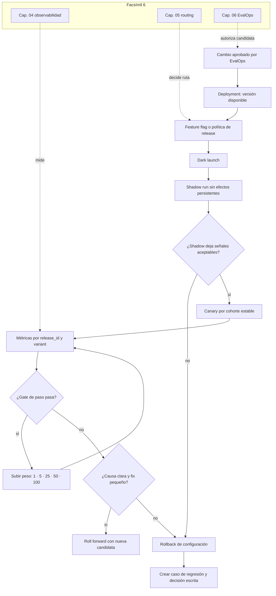

::: {.fasciculo-subtitle}
Facsímil 6 · Construir y operar
:::

# Capítulo 07: Cambios progresivos: shadow, canary y rollback

## Qué deberías poder hacer al terminar

En el capítulo 06 dejamos una idea clara: una versión candidata no debería llegar a producción solo porque parece mejor. Debe pasar por evidencia: dataset, evaluadores, scorecard y gates. Ahora toca la siguiente pregunta: **si el gate pasa, cómo la exponemos sin apostar todo el sistema a la primera tirada**.

Los sistemas de IA tienen una superficie de cambio más amplia que muchas aplicaciones clásicas. Puedes cambiar código, prompt, modelo, cuantización, runtime, catálogo de rutas, índice RAG, política de abstención, contrato JSON, tool schema, coste máximo o umbral de fallback. Muchos de esos cambios no se ven como una nueva pantalla, pero cambian lo que el sistema responde.

Al terminar, deberías poder hacer esto:

| Resultado de aprendizaje | Evidencia de que lo sabes hacer |
|---|---|
| Separar deployment de release. | Puedes desplegar una versión sin exponerla todavía. |
| Diseñar shadow run. | Copias entradas reales sin producir efectos persistentes ni duplicar acciones. |
| Diseñar canary. | Repartes tráfico de forma estable, medible y reversible. |
| Definir criterios de avance. | Cada porcentaje tiene métricas, mínimos, duración y dueño. |
| Preparar rollback. | Sabes volver por flag, configuración, ruta, prompt o versión. |
| Elegir estrategia. | Distingues rolling, blue/green, dark launch, percentage rollout, guarded rollout y canary. |
| Construir un controlador mínimo. | Simulas asignación por cohorte y decisión de avanzar, pausar o volver. |

La idea central: **un cambio serio no se “lanza”; se expone progresivamente, se mide por segmentos y conserva una salida de vuelta**.

## La release que no debería ser un salto al vacío

Imagina que el asistente de soporte usa `prompt_v12`, `model_a`, `rag_index_2026_05` y `router_policy_31`. El capítulo 06 nos ayudó a decidir que una candidata, `prompt_v13` con `router_policy_32`, pasa el gate offline. Mejora respuestas largas y reduce llamadas caras. Bien.

Pero producción no es el dataset. En producción hay usuarios con preguntas raras, tenants con documentos distintos, momentos de carga, límites de proveedor, colas, documentos recién subidos y prompts que combinan mal con ciertos casos. Si pasamos de 0% a 100%, cualquier sorpresa cae sobre todo el mundo.

Un rollout progresivo cambia la pregunta:

> ¿Qué porcentaje pequeño, durante cuánto tiempo y con qué métricas nos permite aprender sin comprometer todo el sistema?

## Deployment no es release

En conversaciones de equipo se mezclan mucho estas dos palabras. Conviene separarlas:

| Concepto | Qué cambia | Ejemplo |
|---|---|---|
| Deployment | El código o configuración queda disponible. | Desplegamos `prompt_v13` y `router_policy_32` en producción, pero desactivados. |
| Release | La capacidad se expone a tráfico real. | El 5% de `support_summary` usa `prompt_v13`. |

OpenFeature describe los feature flags como decisiones evaluadas en runtime que permiten alterar el comportamiento sin desplegar código nuevo.^[OpenFeature. (2026). *Introduction*. https://openfeature.dev/docs/reference/intro/. Consultado el 28 de mayo de 2026.] Esa separación es la base de muchos cambios progresivos: el código puede estar desplegado y la release puede seguir controlada por una bandera, una regla de targeting o una política del router.

Kubernetes, por su parte, ofrece Deployments para gestionar Pods y ReplicaSets y actualizar el estado deseado de una carga de trabajo.^[Kubernetes. (2026). *Deployments*. https://kubernetes.io/docs/concepts/workloads/controllers/deployment/. Consultado el 28 de mayo de 2026.] Eso resuelve una parte: cómo llegan contenedores nuevos. Pero una release de IA también puede depender de configuración viva: qué modelo se usa, qué prompt está activo, qué índice RAG se consulta y qué porcentaje de tráfico entra en la variante.

## Qué no es un canary

Canary no es “subir al 10% y esperar”. Tampoco es una excusa para saltarse EvalOps. Si una candidata no pasó eval offline, canary no la convierte en segura; solo desplaza el experimento a producción.

Canary tampoco debería ser aleatorio en cada petición. Si el mismo usuario o tenant cae a veces en baseline y a veces en candidate, será difícil comparar, depurar y explicar diferencias. Para muchas tareas conviene asignación estable por cohorte: usuario, tenant, tarea, conversación o documento.

Y rollback no es “ya veremos cómo volvemos”. Rollback debe estar probado antes de exponer tráfico. En IA, volver puede significar restaurar un prompt, bajar un porcentaje, cambiar ruta, recuperar un índice, volver al contrato anterior o desactivar una tool.

| Confusión | Qué falta |
|---|---|
| “Canary es probar en producción” | Falta gate offline, porcentaje, métricas, duración y rollback. |
| “Deployment y release son lo mismo” | Falta flag, targeting o política que se pueda cambiar sin redesplegar. |
| “Si falla, hacemos rollback” | Falta saber qué revertir, cuánto tarda y qué datos deja la versión candidata. |
| “Shadow es ejecutar dos veces y comparar” | Falta evitar efectos persistentes, duplicar coste sin límite o llamar tools de escritura. |
| “Subimos por usuarios al azar” | Falta cohortes estables y segmentación por tarea, tenant o criticidad. |

## Qué sí es progressive delivery en IA

Progressive delivery es una forma de publicar cambios reduciendo el radio de impacto. En IA generativa, el cambio puede estar en muchas capas:

| Capa | Cambio progresivo posible |
|---|---|
| Prompt | Activar `prompt_v13` por porcentaje, tarea o tenant. |
| Modelo | Comparar `model_a` y `model_b` con rutas separadas. |
| RAG | Probar un índice nuevo en shadow antes de usarlo como fuente. |
| Router | Ejecutar `router_policy_32` en modo decisión sombra. |
| Tool | Activar una tool primero en modo dry-run o solo lectura. |
| Contrato | Aceptar nuevo schema solo en consumidores preparados. |
| Runtime | Mover porcentaje a un serving nuevo con límites de capacidad. |

**Ejemplo de fórmula.** Podemos resumir una release progresiva como:

$$
R = (v_b, v_c, W, M, G, B)
$$

| Símbolo | Significado | Ejemplo |
|---|---|---|
| \(v_b\) | Versión baseline. | `support-rag@1.8.0`. |
| \(v_c\) | Versión candidata. | `support-rag@1.9.0-rc1`. |
| \(W\) | Secuencia de pesos de tráfico. | 0%, shadow, 1%, 5%, 25%, 50%, 100%. |
| \(M\) | Métricas observadas por paso. | p95, coste, contrato, aceptación, fallback, calidad online. |
| \(G\) | Gates de avance. | Condiciones para pasar de un peso al siguiente. |
| \(B\) | Plan de rollback. | Flag, configuración previa, ruta anterior e índice anterior. |

Argo Rollouts define canary como una estrategia donde una versión nueva recibe un porcentaje pequeño del tráfico de producción, con pasos como `setWeight` y `pause` para controlar el avance.^[Argo Project. (2026). *Canary Deployment Strategy*. https://argoproj.github.io/argo-rollouts/features/canary/. Consultado el 28 de mayo de 2026.] LaunchDarkly separa opciones como percentage rollouts, progressive rollouts, guarded rollouts y experiments según si se quiere asignar porcentaje fijo, aumentar tráfico con el tiempo, vigilar métricas o comparar variantes.^[LaunchDarkly. (2026). *Releasing features with LaunchDarkly*. https://launchdarkly.com/docs/home/releases/releasing. Consultado el 28 de mayo de 2026.] Google Cloud Deploy describe canary como un despliegue progresivo que divide tráfico entre una versión ya desplegada y una nueva antes de llegar al despliegue completo.^[Google Cloud. (2026). *Use a canary deployment strategy*. https://cloud.google.com/deploy/docs/deployment-strategies/canary. Consultado el 28 de mayo de 2026.]

## Estrategias de cambio progresivo

No existe una única estrategia buena. Hay familias, y cada una protege algo distinto.

| Estrategia | Qué hace | Sirve cuando | Cuidado |
|---|---|---|---|
| Rolling update | Sustituye instancias gradualmente. | Cambio de código con compatibilidad clara. | No controla comportamiento por usuario o tarea. |
| Blue/green | Mantiene dos entornos y conmuta tráfico. | Necesitas vuelta rápida a entorno anterior. | Duplica infraestructura y no mide bien por segmentos. |
| Dark launch | Despliega sin exponer al usuario. | Quieres probar wiring, dependencias y observabilidad. | No prueba aceptación real. |
| Shadow run | Ejecuta candidate en paralelo sin afectar salida. | Quieres comparar con entradas reales. | Debe evitar efectos persistentes y coste ilimitado. |
| Percentage rollout | Envía un porcentaje fijo a candidate. | Quieres muestra controlada. | Sin métricas puede ser solo azar administrado. |
| Progressive rollout | Sube porcentaje por pasos. | Quieres aprender antes de ampliar. | Cada paso necesita criterio de avance. |
| Guarded rollout | Sube tráfico vigilando métricas. | Quieres detener si empeoran señales. | Depende de métricas fiables y umbrales claros. |
| Canary por cohorte | Expone tenant, tarea o segmento específico. | Quieres controlar impacto por dominio. | Puede sesgar resultados si la cohorte no representa bien. |

En IA, muchas veces combinamos varias. Por ejemplo:

1. Dark launch de `model_b` en el runtime.
2. Shadow run con entradas reales de `support_summary`.
3. Canary al 1% por cohorte estable.
4. Progressive rollout 5%, 25%, 50%.
5. Guarded rollout con rollback automático si contrato, p95 o coste empeoran.

## Matriz de elección de estrategia

La pregunta práctica no es “qué patrón está de moda”. La pregunta buena es: **qué necesito aprender sin exponer más superficie de la necesaria**. Esta matriz sirve para elegir.

| Cambio | Riesgo principal | Estrategia preferente | Por qué |
|---|---|---|---|
| Prompt de respuesta libre | Calidad, tono, longitud y coste. | Shadow y canary por tarea. | Puedes comparar salidas y después exponer solo una tarea. |
| Prompt con JSON estricto | Fallo de contrato. | Shadow con validador y canary pequeño. | El contrato debe romperse antes de llegar al usuario. |
| Modelo nuevo | Latencia, coste, calidad y límites de proveedor. | Shadow, canary por cohorte y fallback. | La misma entrada puede comportarse distinto en tokens, rutas y coste. |
| Índice RAG nuevo | Recuperación peor o fuentes incorrectas. | Shadow de retrieval y canary por tenant. | La salida puede parecer correcta aunque la fuente haya cambiado. |
| Tool de lectura | Latencia, permisos y formato de argumentos. | Dark launch, dry-run y canary por tarea. | Conviene probar wiring y trazas antes de exponer. |
| Tool de escritura | Efectos persistentes. | No usar shadow real con escritura; empezar con modo aprobación o dry-run. | La versión candidata no debe duplicar acciones. |
| Runtime de inferencia | Saturación, colas y p95. | Blue/green o canary de tráfico. | Aquí importa tanto la arquitectura como el modelo. |
| Schema de salida | Compatibilidad con consumidores. | Expand-contract. | Los consumidores antiguos y nuevos deben convivir durante la migración. |

Un alumno debería poder justificar su elección así: “uso shadow porque necesito comparar entradas reales sin cambiar salida; uso canary por tenant porque el índice RAG depende de documentos; uso rollback por flag porque el cambio está en prompt y ruta, no en código”.

## Compatibilidad: dos versiones conviven

Una release progresiva no solo reparte tráfico. Durante un rato conviven dos mundos: baseline y candidate. Esa convivencia exige compatibilidad.

| Superficie | Qué puede romper | Regla de compatibilidad |
|---|---|---|
| JSON de respuesta | Consumidores esperan campos antiguos. | Añadir campos antes de quitar campos. |
| Tool schema | El modelo manda argumentos nuevos. | Versionar schema y aceptar ambos durante la transición. |
| Índice RAG | Citas apuntan a documentos con IDs distintos. | Mantener alias o mapa de documentos. |
| Prompt template | Cambia el formato esperado por evaluadores. | Versionar plantilla y scorecard. |
| Modelo | Cambia tokenizer, límites o tool calling. | Registrar `model_id`, `tokenizer_id` y límites por release. |
| Base de datos | Candidate escribe datos que baseline no entiende. | Usar migración expand-contract. |

La regla expand-contract es sencilla:

1. Expandir: añadir lo nuevo sin retirar lo antiguo.
2. Migrar: mover tráfico y consumidores progresivamente.
3. Contraer: quitar lo antiguo cuando ya no se usa y hay evidencia.

Checklist mínimo antes de canary:

| Pregunta | Respuesta esperada |
|---|---|
| ¿Baseline puede leer lo que candidate escribe? | Sí, o candidate no escribe todavía. |
| ¿Candidate puede leer datos antiguos? | Sí. |
| ¿El contrato JSON tiene versión? | Sí, `schema_version` o equivalente. |
| ¿Los dashboards separan baseline y candidate? | Sí, por `variant` y `release_id`. |
| ¿El rollback sabe qué hacer con datos nuevos? | Sí, ignorar, transformar o bloquear. |

## Asignación estable por cohorte

Para repartir tráfico no basta con llamar a `random()`. Necesitamos estabilidad. Si una conversación está en candidate, debe seguir en candidate mientras dure la prueba. Si un tenant entra en baseline, no debería saltar de variante por cada request.

Una forma común es usar hash determinista:

$$
b(c, f) = \frac{H(c \Vert f) \bmod 10000}{100}
$$

$$
variant(c) =
\begin{cases}
candidate & \text{si } b(c, f) < w \\
baseline & \text{si } b(c, f) \ge w
\end{cases}
$$

| Símbolo | Significado | Ejemplo |
|---|---|---|
| \(c\) | Clave de cohorte. | `tenant_42`, `user_91`, `conversation_abc`. |
| \(f\) | Nombre de la bandera o release. | `support_rag_v19`. |
| \(H\) | Función hash estable. | SHA-256, MurmurHash, xxHash. |
| \(b(c,f)\) | Bucket entre 0 y 100. | 3,71. |
| \(w\) | Peso de tráfico para candidate. | 5%. |

Si \(w=5\) y el bucket es 3,71, ese contexto entra en candidate. Si mañana subimos a 25%, entrarán contextos nuevos, pero quienes ya estaban en candidate seguirán ahí. Esa propiedad hace que el rollout sea más depurable.

## Qué medir en cada paso

El canary de una app clásica suele mirar errores HTTP, latencia, CPU y quizá conversión. En IA necesitamos más señales:

| Señal | Qué pregunta responde |
|---|---|
| `contract_fail_rate` | ¿La salida sigue cumpliendo schema, tipos y campos? |
| `quality_proxy` | ¿La calidad online o muestreada no cae? |
| `acceptance_rate` | ¿La salida se acepta, se usa o evita revisión? |
| `fallback_rate` | ¿El sistema cae más en rutas alternativas? |
| `cost_p95_eur` | ¿El coste por run aceptada se mantiene? |
| `latency_p95_ms` | ¿La experiencia interactiva sigue dentro del SLO? |
| `timeout_rate` | ¿Suben timeouts o cortes de generación? |
| `route_mix_delta` | ¿El router deriva demasiado a rutas caras o lentas? |
| `trace_completeness` | ¿La versión candidata deja trazas suficientes? |
| `manual_review_rate` | ¿Aumenta la necesidad de revisión? |

Estas señales no deberían vivir en un informe manual. Deben salir de métricas y trazas filtrables por `release_id`, `variant`, `rollout_step`, `task` y `tenant`. OpenTelemetry define las trazas como una forma de seguir el camino de una petición mediante spans relacionados.^[OpenTelemetry. (2026). *Traces*. https://opentelemetry.io/docs/concepts/signals/traces/. Consultado el 27 de mayo de 2026.] Sus convenciones para GenAI añaden atributos propios de sistemas generativos.^[OpenTelemetry. (2026). *Semantic Conventions for Generative AI Systems*. https://opentelemetry.io/docs/specs/semconv/gen-ai/. Consultado el 27 de mayo de 2026.]

Para alertar durante canary, no basta con “parece que sube algo”. El SRE Workbook de Google recomienda razonar con SLOs y presupuesto de error.^[Wilkinson, J. (2018). *Alerting on SLOs*. En B. Beyer, N. R. Murphy, D. Rensin, K. Kawahara y S. Thorne (eds.), *The Site Reliability Workbook*. https://sre.google/workbook/alerting-on-slos/. Consultado el 27 de mayo de 2026.] El libro de SRE también recuerda que proteger un servicio bajo carga implica decidir qué trabajo aceptar, retrasar o rechazar.^[Beyer, B., Jones, C., Petoff, J. y Murphy, N. R. (2016). *Handling Overload*. En *Site Reliability Engineering*. https://sre.google/sre-book/handling-overload/. Consultado el 27 de mayo de 2026.]

## Consultas observables reales

Decir “mide latencia y coste” es insuficiente. Un equipo necesita consultas reproducibles. Prometheus define PromQL como un lenguaje funcional para seleccionar y agregar series temporales en tiempo real.^[Prometheus. (2026). *Querying Basics*. https://prometheus.io/docs/prometheus/latest/querying/basics/. Consultado el 28 de mayo de 2026.] Con etiquetas como `release_id`, `variant`, `task` y `tenant_tier`, puedes preguntar cosas útiles.

Tasa de fallos de contrato por variante:

```promql
sum(rate(ai_contract_fail_total{release_id="support-rag@1.9.0-rc1"}[10m])) by (variant)
/
sum(rate(ai_run_total{release_id="support-rag@1.9.0-rc1"}[10m])) by (variant)
```

Latencia p95 de candidate:

```promql
histogram_quantile(
  0.95,
  sum(rate(ai_run_latency_seconds_bucket{
    release_id="support-rag@1.9.0-rc1",
    variant="candidate"
  }[10m])) by (le, task)
)
```

Coste p95 por tarea:

```promql
histogram_quantile(
  0.95,
  sum(rate(ai_run_cost_eur_bucket{
    release_id="support-rag@1.9.0-rc1"
  }[30m])) by (le, task, variant)
)
```

Ratio de fallback:

```promql
sum(rate(ai_fallback_total{release_id="support-rag@1.9.0-rc1"}[15m])) by (variant)
/
sum(rate(ai_run_total{release_id="support-rag@1.9.0-rc1"}[15m])) by (variant)
```

Si además guardas eventos analíticos en una tabla, la pregunta de negocio se puede revisar con SQL:

```sql
select
  variant,
  task,
  count(*) as runs,
  avg(case when accepted_by_user then 1 else 0 end) as acceptance_rate,
  avg(cost_eur) as avg_cost_eur,
  percentile_cont(0.95) within group (order by latency_ms) as latency_p95_ms
from ai_release_runs
where release_id = 'support-rag@1.9.0-rc1'
  and created_at >= now() - interval '2 hours'
group by variant, task
order by task, variant;
```

La señal importante para un ingeniero: no basta con instrumentar. Hay que diseñar nombres, etiquetas y cardinalidad para que las consultas salgan limpias cuando la release esté viva.

**Ejemplo de fórmula.** Un gate de avance por paso puede escribirse así:

$$
A_s =
\mathbb{1}[
K_s \le K_{max}
\land L_{95,s} \le L_{max}
\land C_{95,s} \le C_{max}
\land Q_s \ge Q_{min}
\land T_s \ge T_{min}
]
$$

| Símbolo | Significado |
|---|---|
| \(A_s\) | Decisión de avanzar en el paso \(s\). |
| \(K_s\) | Tasa de fallos de contrato en el paso. |
| \(K_{max}\) | Máximo tolerado de fallos de contrato. |
| \(L_{95,s}\) | Latencia p95 observada. |
| \(L_{max}\) | Límite p95 del SLO. |
| \(C_{95,s}\) | Coste p95 por run aceptada. |
| \(C_{max}\) | Presupuesto máximo permitido. |
| \(Q_s\) | Calidad online, evaluación muestreada o proxy aceptado. |
| \(Q_{min}\) | Calidad mínima para avanzar. |
| \(T_s\) | Proporción de trazas completas. |
| \(T_{min}\) | Mínimo de trazabilidad aceptable. |

Si \(A_s = 1\), se puede avanzar al siguiente porcentaje. Si \(A_s = 0\), no se avanza. Dependiendo del motivo, se pausa, se baja porcentaje o se vuelve a baseline.

## Anatomía visual de un rollout progresivo de IA

<svg id="f6-c07-progressive-delivery" xmlns="http://www.w3.org/2000/svg" viewBox="0 0 1840 1260" role="img" aria-label="Arquitectura de progressive delivery para un sistema de IA con flags, router, shadow, canary, métricas y rollback">
  <defs>
    <style>
      #f6-c07-progressive-delivery{background:#fff;color:#111;font-family:Inter,ui-sans-serif,system-ui,-apple-system,BlinkMacSystemFont,"Segoe UI",sans-serif}
      #f6-c07-progressive-delivery .title{font-size:38px;font-weight:800;fill:#111}
      #f6-c07-progressive-delivery .subtitle{font-size:17px;fill:#444}
      #f6-c07-progressive-delivery .h{font-size:18px;font-weight:800;fill:#111}
      #f6-c07-progressive-delivery .hw{font-size:18px;font-weight:800;fill:#fff}
      #f6-c07-progressive-delivery .txt{font-size:13px;fill:#222}
      #f6-c07-progressive-delivery .tiny{font-size:11px;fill:#555}
      #f6-c07-progressive-delivery .micro{font-size:10px;fill:#666}
      #f6-c07-progressive-delivery .frame{fill:#fff;stroke:#111;stroke-width:2}
      #f6-c07-progressive-delivery .panel{fill:#fff;stroke:#111;stroke-width:1.5}
      #f6-c07-progressive-delivery .soft{fill:#f6f6f6;stroke:#111;stroke-width:1.2}
      #f6-c07-progressive-delivery .dark{fill:#111;stroke:#111;stroke-width:1.3}
      #f6-c07-progressive-delivery .metric{fill:#fff;stroke:#444;stroke-width:1.1}
      #f6-c07-progressive-delivery .line{stroke:#111;stroke-width:2;fill:none}
      #f6-c07-progressive-delivery .dash{stroke:#555;stroke-width:1.5;fill:none;stroke-dasharray:8 7}
      #f6-c07-progressive-delivery .thin{stroke:#555;stroke-width:1.1;fill:none}
    </style>
    <marker id="f6c07-arrow" viewBox="0 0 10 10" refX="9" refY="5" markerWidth="8" markerHeight="8" orient="auto-start-reverse">
      <path d="M 0 0 L 10 5 L 0 10 z" fill="#111"/>
    </marker>
  </defs>

  <rect x="42" y="36" width="1756" height="1188" rx="24" class="frame"/>
  <text x="920" y="92" text-anchor="middle" class="title">Progressive delivery para IA: exponer, medir y volver sin improvisar</text>
  <text x="920" y="124" text-anchor="middle" class="subtitle">El deployment deja la versión disponible; la release decide quién la recibe, con gates, cohortes y rollback preparado.</text>

  <rect x="84" y="174" width="240" height="118" rx="14" class="dark"/>
  <text x="204" y="206" text-anchor="middle" class="hw">Cambio aprobado</text>
  <text x="204" y="234" text-anchor="middle" class="tiny" fill="#eee">scorecard del cap. 06</text>
  <text x="204" y="254" text-anchor="middle" class="tiny" fill="#eee">candidate versionada</text>
  <text x="204" y="274" text-anchor="middle" class="tiny" fill="#eee">rollback descrito</text>

  <rect x="388" y="154" width="300" height="158" rx="16" class="panel"/>
  <text x="538" y="188" text-anchor="middle" class="h">Control plane</text>
  <text x="538" y="216" text-anchor="middle" class="txt">flags, targeting, pesos y pasos</text>
  <rect x="424" y="240" width="228" height="26" rx="7" class="metric"/>
  <text x="538" y="258" text-anchor="middle" class="tiny">baseline · candidate · weight</text>
  <rect x="424" y="274" width="228" height="26" rx="7" class="metric"/>
  <text x="538" y="292" text-anchor="middle" class="tiny">cohorte · tenant · tarea</text>

  <rect x="752" y="154" width="326" height="158" rx="16" class="panel"/>
  <text x="915" y="188" text-anchor="middle" class="h">Router de runtime</text>
  <text x="915" y="216" text-anchor="middle" class="txt">decide variante y registra evidencia</text>
  <rect x="788" y="240" width="116" height="34" rx="8" class="soft"/>
  <text x="846" y="262" text-anchor="middle" class="tiny">bucket</text>
  <rect x="916" y="240" width="126" height="34" rx="8" class="soft"/>
  <text x="979" y="262" text-anchor="middle" class="tiny">variant</text>
  <rect x="834" y="282" width="162" height="22" rx="6" class="metric"/>
  <text x="915" y="297" text-anchor="middle" class="micro">release_id en cada traza</text>

  <rect x="1142" y="154" width="284" height="158" rx="16" class="panel"/>
  <text x="1284" y="188" text-anchor="middle" class="h">Baseline</text>
  <text x="1284" y="216" text-anchor="middle" class="txt">versión estable</text>
  <rect x="1180" y="244" width="208" height="36" rx="9" class="dark"/>
  <text x="1284" y="267" text-anchor="middle" class="hw">prompt_v12 · model_a</text>

  <rect x="1488" y="154" width="268" height="158" rx="16" class="panel"/>
  <text x="1622" y="188" text-anchor="middle" class="h">Candidate</text>
  <text x="1622" y="216" text-anchor="middle" class="txt">versión nueva</text>
  <rect x="1522" y="244" width="200" height="36" rx="9" class="dark"/>
  <text x="1622" y="267" text-anchor="middle" class="hw">prompt_v13 · model_b</text>

  <line x1="324" y1="233" x2="388" y2="233" class="line" marker-end="url(#f6c07-arrow)"/>
  <line x1="688" y1="233" x2="752" y2="233" class="line" marker-end="url(#f6c07-arrow)"/>
  <line x1="1078" y1="233" x2="1142" y2="233" class="line" marker-end="url(#f6c07-arrow)"/>
  <line x1="1078" y1="274" x2="1488" y2="274" class="dash" marker-end="url(#f6c07-arrow)"/>

  <rect x="96" y="382" width="502" height="216" rx="18" class="panel"/>
  <text x="347" y="416" text-anchor="middle" class="h">Shadow run</text>
  <text x="347" y="444" text-anchor="middle" class="txt">candidate procesa entradas reales sin afectar la salida</text>
  <rect x="134" y="478" width="128" height="46" rx="10" class="soft"/>
  <text x="198" y="506" text-anchor="middle" class="tiny">sin escritura</text>
  <rect x="282" y="478" width="128" height="46" rx="10" class="soft"/>
  <text x="346" y="506" text-anchor="middle" class="tiny">coste limitado</text>
  <rect x="430" y="478" width="128" height="46" rx="10" class="soft"/>
  <text x="494" y="506" text-anchor="middle" class="tiny">diff trazable</text>
  <rect x="166" y="544" width="362" height="26" rx="7" class="metric"/>
  <text x="347" y="562" text-anchor="middle" class="tiny">compara salida, ruta, tokens, coste y contrato</text>

  <rect x="670" y="382" width="502" height="216" rx="18" class="panel"/>
  <text x="921" y="416" text-anchor="middle" class="h">Canary por pasos</text>
  <text x="921" y="444" text-anchor="middle" class="txt">sube tráfico si cada tramo deja señales aceptables</text>
  <rect x="708" y="478" width="80" height="46" rx="10" class="dark"/>
  <text x="748" y="506" text-anchor="middle" class="hw">1%</text>
  <rect x="808" y="478" width="80" height="46" rx="10" class="dark"/>
  <text x="848" y="506" text-anchor="middle" class="hw">5%</text>
  <rect x="908" y="478" width="80" height="46" rx="10" class="dark"/>
  <text x="948" y="506" text-anchor="middle" class="hw">25%</text>
  <rect x="1008" y="478" width="80" height="46" rx="10" class="dark"/>
  <text x="1048" y="506" text-anchor="middle" class="hw">50%</text>
  <rect x="770" y="544" width="302" height="26" rx="7" class="metric"/>
  <text x="921" y="562" text-anchor="middle" class="tiny">pause · medir · decidir · avanzar</text>

  <rect x="1244" y="382" width="502" height="216" rx="18" class="panel"/>
  <text x="1495" y="416" text-anchor="middle" class="h">Guarded rollout</text>
  <text x="1495" y="444" text-anchor="middle" class="txt">métricas deciden si se avanza, pausa o vuelve</text>
  <rect x="1282" y="478" width="126" height="46" rx="10" class="soft"/>
  <text x="1345" y="506" text-anchor="middle" class="tiny">contrato</text>
  <rect x="1428" y="478" width="126" height="46" rx="10" class="soft"/>
  <text x="1491" y="506" text-anchor="middle" class="tiny">p95</text>
  <rect x="1574" y="478" width="126" height="46" rx="10" class="soft"/>
  <text x="1637" y="506" text-anchor="middle" class="tiny">coste</text>
  <rect x="1320" y="544" width="350" height="26" rx="7" class="metric"/>
  <text x="1495" y="562" text-anchor="middle" class="tiny">SLO · traces · feedback · error budget</text>

  <rect x="96" y="672" width="520" height="258" rx="18" class="panel"/>
  <text x="356" y="706" text-anchor="middle" class="h">Observabilidad por release</text>
  <text x="356" y="734" text-anchor="middle" class="txt">cada run lleva atributos para filtrar y comparar</text>
  <line x1="146" y1="770" x2="566" y2="770" class="thin"/>
  <text x="160" y="758" class="tiny">atributo</text>
  <text x="356" y="758" class="tiny">ejemplo</text>
  <text x="160" y="798" class="txt">release_id</text>
  <text x="356" y="798" class="txt">support-rag@1.9.0-rc1</text>
  <text x="160" y="828" class="txt">variant</text>
  <text x="356" y="828" class="txt">baseline · candidate</text>
  <text x="160" y="858" class="txt">rollout_step</text>
  <text x="356" y="858" class="txt">5%</text>
  <text x="160" y="888" class="txt">cohort_key</text>
  <text x="356" y="888" class="txt">tenant · task · conversation</text>

  <rect x="660" y="672" width="520" height="258" rx="18" class="panel"/>
  <text x="920" y="706" text-anchor="middle" class="h">Decisión por paso</text>
  <text x="920" y="734" text-anchor="middle" class="txt">el porcentaje no sube si alguna señal bloquea</text>
  <rect x="710" y="772" width="140" height="46" rx="10" class="soft"/>
  <text x="780" y="800" text-anchor="middle" class="tiny">advance</text>
  <rect x="870" y="772" width="140" height="46" rx="10" class="soft"/>
  <text x="940" y="800" text-anchor="middle" class="tiny">pause</text>
  <rect x="1030" y="772" width="100" height="46" rx="10" class="dark"/>
  <text x="1080" y="800" text-anchor="middle" class="hw">rollback</text>
  <rect x="758" y="846" width="324" height="26" rx="7" class="metric"/>
  <text x="920" y="864" text-anchor="middle" class="tiny">decisión escrita en `rollout_decision.json`</text>

  <rect x="1224" y="672" width="522" height="258" rx="18" class="dark"/>
  <text x="1485" y="706" text-anchor="middle" class="hw">Rollback preparado</text>
  <text x="1485" y="734" text-anchor="middle" class="tiny" fill="#eee">volver por flag, config, ruta o índice</text>
  <rect x="1278" y="772" width="174" height="42" rx="9" fill="#fff" stroke="#fff"/>
  <text x="1365" y="798" text-anchor="middle" class="tiny">candidate_weight=0</text>
  <rect x="1472" y="772" width="174" height="42" rx="9" fill="#fff" stroke="#fff"/>
  <text x="1559" y="798" text-anchor="middle" class="tiny">route_catalog=v31</text>
  <rect x="1330" y="840" width="310" height="28" rx="7" fill="#fff" stroke="#fff"/>
  <text x="1485" y="859" text-anchor="middle" class="tiny">prompt_v12 · index anterior · tool off</text>

  <path d="M1495 598 C1495 638, 1485 638, 1485 672" class="line" marker-end="url(#f6c07-arrow)"/>
  <path d="M920 598 C920 638, 920 638, 920 672" class="line" marker-end="url(#f6c07-arrow)"/>
  <path d="M347 598 C347 638, 356 638, 356 672" class="line" marker-end="url(#f6c07-arrow)"/>
  <path d="M1224 802 C1188 802, 1188 802, 1180 802" class="line" marker-end="url(#f6c07-arrow)"/>
  <path d="M1224 876 C1010 1018, 410 1018, 204 292" class="dash" marker-end="url(#f6c07-arrow)"/>

  <rect x="194" y="1022" width="1452" height="58" rx="14" class="soft"/>
  <text x="920" y="1045" text-anchor="middle" class="tiny">Marca de agua editorial</text>
  <text x="1740" y="1208" text-anchor="end" class="micro" fill="#888888" opacity="0.45">IA para gente curiosa / Facsímil 06 / Capítulo 07 / 686f6c61</text>
</svg>

## Shadow run sin efectos persistentes

Shadow run significa que la candidata recibe entradas reales, pero su salida no se entrega al usuario. Esto permite comparar sin cambiar la experiencia principal. En IA hay que diseñarlo con cuidado.

Reglas para shadow:

| Regla | Motivo |
|---|---|
| No ejecutar tools con escritura. | Evita duplicar tickets, correos, pagos, publicaciones o cambios de estado. |
| Usar dry-run cuando exista. | Permite validar argumentos sin tocar sistemas externos. |
| Marcar cada traza como `shadow=true`. | Facilita filtrar métricas y coste. |
| Limitar coste por día. | Shadow puede duplicar llamadas de modelo. |
| No mezclar salida sombra con feedback de usuario. | El usuario no vio esa salida; no puede aceptarla ni rechazarla. |
| Comparar por caso pareado. | La misma entrada debe tener baseline y candidate. |

La salida sombra sí sirve para medir:

| Comparación | Qué puede revelar |
|---|---|
| Respuesta final | Candidate responde más largo, más corto, más caro o menos grounded. |
| Contrato | Candidate rompe JSON o cambia campos. |
| Routing | Candidate elige rutas más caras o lentas. |
| Tools | Candidate intenta una tool que baseline no necesitaba. |
| Tokens | Candidate consume más contexto o salida. |
| Latencia | Candidate empeora prefill, decode o validación. |

Shadow no prueba aceptación real. Prueba compatibilidad con realidad. Es una fase de ingeniería, no una encuesta.

## Canary para IA: qué segmentos elegir

El 1% global puede sonar prudente, pero no siempre enseña lo correcto. Si tu producto tiene tareas muy distintas, el canary debe segmentarse.

| Segmento | Cuándo usarlo | Ejemplo |
|---|---|---|
| Por tarea | Cada tarea tiene riesgo y coste distintos. | `support_summary`, `policy_qa`, `json_extract`. |
| Por tenant | Los documentos o normas cambian por cliente. | 3 tenants internos antes de externos. |
| Por idioma | La calidad puede variar mucho. | Español primero si el dataset está mejor cubierto. |
| Por canal | No es igual chat interactivo que batch. | Canary en batch antes que en chat. |
| Por contrato | JSON estricto merece gates más duros. | Activar solo en respuestas no estructuradas al principio. |
| Por criticidad | Tareas de bajo impacto primero. | Resumen interno antes que acción externa. |

Un buen canary no busca la muestra más cómoda. Busca la muestra más informativa sin ampliar demasiado el impacto.

## Tamaño mínimo de muestra y duración

Una release progresiva necesita suficientes observaciones para no decidir por ruido. El número exacto depende de la varianza, la criticidad y el volumen, pero conviene declarar mínimos antes de empezar.

| Factor | Qué cambia |
|---|---|
| Tráfico bajo | Necesitas más tiempo para llegar a un mínimo útil. |
| Salida muy variable | Necesitas más casos o segmentar por tarea. |
| Tarea crítica | Necesitas gates más estrictos y porcentaje más pequeño. |
| Coste alto | Shadow y canary deben tener presupuesto diario. |
| Contrato estricto | Un fallo puede pesar más que una media de calidad. |
| Tenants heterogéneos | El 1% global puede no representar a nadie. |

Una pauta razonable para empezar:

| Paso | Mínimo orientativo | Duración mínima | Qué miraría antes de avanzar |
|---|---:|---:|---|
| Shadow | 100-300 runs pareadas. | 1 ciclo de carga real. | Diffs, contrato, coste y rutas. |
| Canary 1% | 200-500 runs. | 30-120 min según tráfico. | Contrato, p95, fallback y trazas. |
| Canary 5% | 500-1500 runs. | 1-4 h. | Segmentos por tarea y tenant. |
| Canary 25% | 1000-5000 runs. | Medio día o 1 ciclo de uso. | Presupuesto de error y coste p95. |
| Canary 50% | Depende del negocio. | 1 ciclo relevante. | Comparación estable y sin regresiones nuevas. |

Esto no sustituye estadística formal. Es una forma de no fingir precisión: si solo tienes 12 runs, una tasa del 0% no significa “cero problemas”; significa “no hemos mirado bastante”.

## Rollback no siempre es volver código atrás

En IA, rollback tiene varias capas. A veces no necesitas revertir todo el deployment. Basta con cambiar una bandera o restaurar una configuración.

| Capa | Cómo vuelves |
|---|---|
| Prompt | `prompt_version=prompt_v12`. |
| Modelo | `model_id=model_a` o ruta anterior. |
| RAG | `index_version=rag_index_2026_05`. |
| Router | `route_catalog=route_catalog@31`. |
| Tool | `tool_enabled=false` o `mode=read_only`. |
| Contrato | `response_schema=schema_v4`. |
| Runtime | Enviar tráfico al pool anterior. |
| Código | Revertir deployment o cambiar imagen. |

La decisión entre rollback y roll forward depende de la causa:

| Situación | Mejor opción |
|---|---|
| Cambio de prompt rompe contrato. | Rollback de prompt o schema gate. |
| Nuevo índice RAG trae documentos incorrectos. | Rollback de índice. |
| Runtime nuevo tiene p95 malo. | Volver al pool anterior. |
| Falla una condición menor y hay fix claro. | Roll forward con parche y canary nuevo. |
| No sabemos la causa. | Bajar a baseline, preservar trazas y analizar. |

La frase importante: **rollback no es castigo; es una capacidad de diseño**.

## Kill switch: parar sin reunión

Un kill switch es una decisión operativa preparada para detener una capacidad sin desplegar código. En IA generativa puede apagar una tool, bajar una variante a 0%, forzar modelo baseline o cambiar a modo solo lectura.

| Campo | Para qué sirve |
|---|---|
| `enabled` | Permite cortar una capacidad completa. |
| `candidate_weight` | Baja exposición sin tocar deployment. |
| `read_only` | Mantiene lectura y bloquea escritura. |
| `fallback_model` | Fuerza proveedor o modelo estable. |
| `max_cost_eur_per_run` | Corta rutas caras antes de agotar presupuesto. |
| `reason` | Deja trazabilidad de la decisión. |
| `expires_at` | Evita que un apagado temporal se quede olvidado. |

Plantilla mínima:

```yaml
release_id: support-rag@1.9.0-rc1
controls:
  enabled: true
  candidate_weight: 5
  read_only: false
  fallback_model: model_a
  max_cost_eur_per_run: 0.04
  kill_switch:
    enabled: false
    reason: null
    owner: ai-platform
    expires_at: null
```

Ensayo obligatorio antes del canary:

1. Activar `kill_switch.enabled=true` en staging.
2. Comprobar que todo tráfico va a baseline.
3. Comprobar que no se ejecutan tools de escritura.
4. Ver en trazas `kill_switch=true`.
5. Volver a activar candidate y verificar que el sistema recupera el comportamiento esperado.

## Lifecycle de flags: limpiar también es operar

Los flags son útiles, pero también crean deuda si se quedan para siempre. LaunchDarkly documenta un ciclo de vida de flags con estados como live, ready for code removal, ready to archive, archived, deprecated y deleted, y recomienda planificar la retirada durante la creación del flag.^[LaunchDarkly. (2026). *Reducing Technical Debt from Feature Flags*. https://launchdarkly.com/docs/guides/flags/technical-debt. Consultado el 28 de mayo de 2026.]

Un flag de IA debería nacer con metadatos:

| Metadato | Ejemplo | Motivo |
|---|---|---|
| `owner` | `ai-platform` | Alguien responde por la bandera. |
| `created_at` | `2026-05-28` | Permite detectar flags antiguos. |
| `expected_removal` | `2026-06-15` | La retirada se planifica desde el inicio. |
| `permanent` | `false` | Distingue rollout temporal de interruptor permanente. |
| `release_id` | `support-rag@1.9.0-rc1` | Une flag, trazas, scorecard y decisión. |
| `cleanup_issue` | `OPS-1842` | La limpieza entra en el backlog real. |

Estados recomendados:

| Estado | Qué significa | Acción |
|---|---|---|
| `planned` | Está definido, pero no se evalúa todavía. | Revisar contrato y rollback. |
| `shadow` | Candidate se ejecuta sin salida visible. | Medir coste y compatibilidad. |
| `canary` | Candidate recibe parte del tráfico. | Vigilar gates. |
| `launched` | Candidate ya es comportamiento por defecto. | Abrir tarea de retirada si era temporal. |
| `cleanup` | El flag ya no decide nada útil. | Quitar código muerto y archivar. |
| `permanent_control` | Se conserva como interruptor. | Documentar quién puede cambiarlo. |

La disciplina no termina cuando el rollout llega al 100%. Termina cuando el código, los dashboards y la documentación dejan de arrastrar caminos que nadie usa.

## Manos a la obra

**Práctica:** controlador de rollout progresivo.

Kit ejecutable de este capítulo: `labs/f6/capitulo-practicas/`.

```bash
cd labs/f6/capitulo-practicas
python3 ops/run_f6_practices.py --chapter c07 --write --fail-on-invalid
```

Vamos a construir un controlador mínimo que decide si un rollout avanza, se pausa o vuelve al baseline. No llama a Kubernetes, LaunchDarkly ni Argo. Eso vendría después. Primero queremos dominar la lógica.

Guárdalo como `ops/ai/progressive_rollout.py`.

```python
from __future__ import annotations

import hashlib
import json
from dataclasses import asdict, dataclass


@dataclass(frozen=True)
class RolloutStep:
    name: str
    candidate_weight: int
    min_runs: int
    max_contract_fail_rate: float
    max_latency_p95_ms: int
    max_cost_p95_eur: float
    min_quality_score: float
    min_trace_rate: float


@dataclass(frozen=True)
class Observation:
    step: str
    runs: int
    contract_fail_rate: float
    latency_p95_ms: int
    cost_p95_eur: float
    quality_score: float
    trace_rate: float


STEPS = [
    RolloutStep("shadow", 0, 100, 0.010, 4500, 0.035, 0.86, 0.99),
    RolloutStep("canary-1", 1, 200, 0.008, 4500, 0.035, 0.87, 0.99),
    RolloutStep("canary-5", 5, 500, 0.006, 4300, 0.033, 0.88, 0.99),
    RolloutStep("canary-25", 25, 1000, 0.004, 4200, 0.031, 0.88, 0.995),
    RolloutStep("canary-50", 50, 2000, 0.003, 4000, 0.030, 0.89, 0.995),
]

OBSERVATIONS = [
    Observation("shadow", 160, 0.000, 3100, 0.024, 0.90, 1.000),
    Observation("canary-1", 240, 0.004, 3200, 0.025, 0.90, 0.996),
    Observation("canary-5", 620, 0.005, 3500, 0.027, 0.895, 0.995),
    Observation("canary-25", 1120, 0.009, 4100, 0.036, 0.892, 0.997),
]


def bucket(flag_key: str, cohort_key: str) -> float:
    digest = hashlib.sha256(f"{flag_key}:{cohort_key}".encode("utf-8")).hexdigest()
    return (int(digest[:8], 16) % 10000) / 100


def variant_for(flag_key: str, cohort_key: str, candidate_weight: int) -> str:
    return "candidate" if bucket(flag_key, cohort_key) < candidate_weight else "baseline"


def evaluate(step: RolloutStep, obs: Observation) -> dict[str, object]:
    checks = {
        "enough_runs": obs.runs >= step.min_runs,
        "contract_ok": obs.contract_fail_rate <= step.max_contract_fail_rate,
        "latency_ok": obs.latency_p95_ms <= step.max_latency_p95_ms,
        "cost_ok": obs.cost_p95_eur <= step.max_cost_p95_eur,
        "quality_ok": obs.quality_score >= step.min_quality_score,
        "trace_ok": obs.trace_rate >= step.min_trace_rate,
    }
    failed = [name for name, ok in checks.items() if not ok]

    if failed and ("contract_ok" in failed or "cost_ok" in failed):
        decision = "rollback_to_baseline"
    elif failed:
        decision = "pause_and_collect_more_evidence"
    else:
        decision = "advance_to_next_step"

    return {
        "step": asdict(step),
        "observation": asdict(obs),
        "checks": checks,
        "failed_checks": failed,
        "decision": decision,
    }


def simulate_assignments(candidate_weight: int, contexts: int = 1000) -> dict[str, int]:
    counts = {"baseline": 0, "candidate": 0}
    for i in range(contexts):
        tenant = f"tenant_{i:04d}"
        counts[variant_for("support_rag_v19", tenant, candidate_weight)] += 1
    return counts


def run_rollout() -> dict[str, object]:
    by_step = {obs.step: obs for obs in OBSERVATIONS}
    decisions = []

    for step in STEPS:
        obs = by_step.get(step.name)
        if obs is None:
            decisions.append({"step": step.name, "decision": "waiting_for_observations"})
            break

        report = evaluate(step, obs)
        report["assignment_sample"] = simulate_assignments(step.candidate_weight)
        decisions.append(report)

        if report["decision"] != "advance_to_next_step":
            break

    return {
        "release_id": "support-rag@1.9.0-rc1",
        "baseline": "support-rag@1.8.0",
        "flag_key": "support_rag_v19",
        "decisions": decisions,
        "final_decision": decisions[-1]["decision"],
    }


if __name__ == "__main__":
    print(json.dumps(run_rollout(), ensure_ascii=False, indent=2))
```

Ejecuta:

```bash
python ops/ai/progressive_rollout.py
```

Salida esperada resumida:

```text
"step": "canary-25"
"failed_checks": [
  "contract_ok",
  "cost_ok"
]
"decision": "rollback_to_baseline"
"final_decision": "rollback_to_baseline"
```

Qué enseña este script:

| Pieza | Aprendizaje |
|---|---|
| `bucket()` | Repartir tráfico de forma estable por cohorte. |
| `candidate_weight` | Subir exposición sin cambiar código. |
| `RolloutStep` | Declarar límites por tramo. |
| `Observation` | Separar política de señales medidas. |
| `evaluate()` | Convertir métricas en decisión operativa. |
| `simulate_assignments()` | Comprobar que el reparto se aproxima al porcentaje esperado. |

El caso está diseñado para algo muy real: `shadow`, 1% y 5% pasan; al 25% aparecen fallos de contrato y coste p95. La decisión profesional no es “sigamos un poco más”. Es volver a baseline, conservar trazas y abrir trabajo con casos concretos.

## Qué te llevas para poner en práctica

Este capítulo debería dejarte algo más que una idea bonita. Al terminarlo, el alumno puede construir un paquete mínimo de release progresiva para cualquier sistema de IA: un chatbot interno, un RAG de soporte, un extractor JSON, un agente con tools o un servicio de inferencia propio.

| Artefacto | Para qué sirve en un proyecto real | Qué debería contener |
|---|---|---|
| `rollout_plan.json` | Declarar la release antes de tocar tráfico. | Baseline, candidate, flag, cohorte, pasos, gates y rollback. |
| `progressive_rollout.py` | Simular y automatizar la decisión. | Reparto estable, métricas de entrada y decisión de avanzar, pausar o volver. |
| Consultas PromQL/SQL | Mirar producción con preguntas concretas. | Contrato, p95, coste, fallback, aceptación y trazas por variante. |
| `rollback.md` | Volver sin improvisar. | Pasos exactos para restaurar prompt, modelo, índice, ruta y porcentaje. |
| `kill_switch.yaml` | Cortar una capacidad desde configuración. | `enabled`, `candidate_weight`, `read_only`, fallback y owner. |
| `decision.md` | Dejar rastro técnico de la decisión. | Paso evaluado, evidencia, decisión y caso de regresión creado. |
| `post-release-review.md` | Convertir la release en aprendizaje. | Métricas finales, segmentos afectados, limpieza y cambios al dataset. |

Práctica recomendada para clase o trabajo individual:

1. Elige un cambio concreto: prompt nuevo, modelo nuevo, índice RAG nuevo o tool nueva.
2. Escribe baseline y candidate con nombres versionados.
3. Decide la cohorte: `tenant_id`, `user_id`, `conversation_id` o `task`.
4. Define pasos: shadow, 1%, 5%, 25%, 50%.
5. Escribe tres gates mínimos: contrato, latencia p95 y coste p95.
6. Añade una consulta observable por cada gate.
7. Ejecuta el script con una observación que pase y otra que obligue a volver.
8. Escribe `decision.md` como si fueras a enseñárselo a tu equipo.

El resultado práctico no es “saber qué es canary”. Es poder abrir un repositorio y dejar preparada una release que alguien pueda revisar, ejecutar y revertir.

## Kit operativo: una release progresiva en un repo real

Para que esto salga del libro, crea estos archivos:

```text
mi-proyecto/
  ops/
    ai/
      progressive_rollout.py
      rollout_plan.json
      kill_switch.yaml
      rollback.md
      post-release-review.md
  output/
    rollout_decision.json
  .github/
    workflows/
      progressive-release.yml
```

`ops/ai/rollout_plan.json`:

```json
{
  "release_id": "support-rag@1.9.0-rc1",
  "baseline": "support-rag@1.8.0",
  "candidate": "support-rag@1.9.0-rc1",
  "flag_key": "support_rag_v19",
  "cohort_key": "tenant_id",
  "steps": ["shadow", "canary-1", "canary-5", "canary-25", "canary-50"],
  "rollback": {
    "candidate_weight": 0,
    "prompt_version": "prompt_v12",
    "route_catalog": "route_catalog@31",
    "rag_index": "rag_index_2026_05"
  }
}
```

Una versión más completa como manifiesto de release:

```yaml
release_id: support-rag@1.9.0-rc1
owner: ai-platform
created_at: "2026-05-28"
baseline:
  app_version: support-rag@1.8.0
  prompt_version: prompt_v12
  model_id: model_a
  rag_index: rag_index_2026_05
candidate:
  app_version: support-rag@1.9.0-rc1
  prompt_version: prompt_v13
  model_id: model_b
  rag_index: rag_index_2026_06
cohort:
  key: tenant_id
  hash: sha256
  salt: support_rag_v19
steps:
  - name: shadow
    weight: 0
    min_runs: 300
    min_duration: 2h
  - name: canary-1
    weight: 1
    min_runs: 500
    min_duration: 2h
  - name: canary-5
    weight: 5
    min_runs: 1500
    min_duration: 4h
gates:
  contract_fail_rate_max: 0.006
  latency_p95_ms_max: 4300
  cost_p95_eur_max: 0.033
  quality_score_min: 0.88
  trace_rate_min: 0.99
controls:
  kill_switch:
    enabled: false
    owner: ai-platform
  read_only_tools: true
rollback:
  candidate_weight: 0
  prompt_version: prompt_v12
  model_id: model_a
  route_catalog: route_catalog@31
  rag_index: rag_index_2026_05
cleanup:
  expected_flag_removal: "2026-06-15"
  cleanup_issue: OPS-1842
```

`ops/ai/rollback.md`:

```markdown
# Rollback de support-rag@1.9.0-rc1

## Cuándo se ejecuta

- Fallo de contrato por encima del umbral.
- Coste p95 por encima del presupuesto.
- Latencia p95 fuera de SLO.
- Trazas incompletas que impiden depurar.

## Cómo se vuelve

1. Poner `candidate_weight=0`.
2. Restaurar `prompt_version=prompt_v12`.
3. Restaurar `route_catalog=route_catalog@31`.
4. Restaurar `rag_index=rag_index_2026_05`.
5. Verificar que `release_id` nuevo aparece en trazas.
6. Crear casos de regresión con las trazas fallidas.
```

Workflow mínimo:

```yaml
name: progressive-release

on:
  workflow_dispatch:

jobs:
  decide-rollout:
    runs-on: ubuntu-latest
    steps:
      - uses: actions/checkout@v4
      - uses: actions/setup-python@v5
        with:
          python-version: "3.12"
      - name: Decide rollout step
        run: python ops/ai/progressive_rollout.py > output/rollout_decision.json
      - name: Upload rollout decision
        uses: actions/upload-artifact@v4
        with:
          name: rollout-decision
          path: output/rollout_decision.json
```

Qué debería entregar un alumno:

| Entregable | Qué revisaría |
|---|---|
| `progressive_rollout.py` | Asignación estable, gates y decisión clara. |
| `rollout_plan.json` | Baseline, candidate, pasos, cohorte y rollback. |
| `rollback.md` | Procedimiento concreto, no deseo genérico. |
| `rollout_decision.json` | Evidencia de avance, pausa o vuelta. |
| `decision.md` | Explicación: por qué ese paso avanza o no. |

Plantilla de `decision.md`:

```markdown
# Decisión de rollout

## Estado

La release [avanza / se pausa / vuelve a baseline].

## Paso evaluado

- Release:
- Peso candidato:
- Runs observadas:
- Cohorte:

## Señales

- Contrato:
- Latencia p95:
- Coste p95:
- Calidad:
- Trazas:

## Decisión técnica

Explica por qué se toma esta decisión y qué cambio se hará ahora.

## Caso de regresión nuevo

Si se vuelve o pausa por fallo real, describe qué caso entra en `evals/regression.jsonl`.
```

Cómo adaptarlo:

| Proyecto | Adaptación |
|---|---|
| API de modelos | El flag elige proveedor/modelo/prompt. |
| RAG | El flag elige índice, chunker, reranker o `top_k`. |
| Agente | El flag activa tool, handoff o política de permisos. |
| Serving local | El flag cambia pool, cuantización o runtime. |
| Producto multi-tenant | La cohorte debería ser tenant, no request. |

## Post-release review

Cuando una release llega al 100%, todavía queda trabajo de ingeniería. La revisión posterior evita que el equipo pierda aprendizaje.

| Pregunta | Evidencia que debería existir |
|---|---|
| ¿Qué cambió realmente? | Diff de prompt, modelo, índice, schema, rutas y config. |
| ¿Qué aprendimos en shadow? | Diffs representativos y regresiones nuevas. |
| ¿Qué segmentos sufrieron más? | Métricas por tarea, tenant, idioma o canal. |
| ¿Qué gate fue más útil? | Señal que habría detectado el problema antes. |
| ¿Qué alerta sobró? | Ruido que no cambió decisiones. |
| ¿Qué queda por limpiar? | Flags, dashboards, rutas antiguas, prompts y docs. |
| ¿Qué entra al dataset? | Casos reales convertidos en evaluación de regresión. |

Plantilla corta:

```markdown
# Post-release review

## Release

- Release:
- Fecha:
- Owner:
- Baseline:
- Candidate:

## Decisión final

La release terminó como [100% / rollback / roll forward / pausa].

## Evidencia

- Runs totales:
- Segmentos revisados:
- Métrica que más pesó:
- Incidencias detectadas:

## Aprendizaje técnico

Qué cambiaríamos en el próximo rollout.

## Acciones

- [ ] Añadir casos a evals.
- [ ] Retirar flag temporal.
- [ ] Actualizar runbook.
- [ ] Ajustar alerta o dashboard.
```

## Cómo encaja todo



## Relación con otros capítulos

Este capítulo no sustituye a EvalOps. Lo continúa.

| Capítulo | Qué aporta aquí |
|---|---|
| [F6 · Capítulo 01](/libro/fasciculo-06/#capitulo-01) | Manifest, versión, release gate y rollback como idea de sistema operable. |
| [F6 · Capítulo 04](/libro/fasciculo-06/#capitulo-04) | SLIs, SLOs, métricas, trazas y alertas para decidir. |
| [F6 · Capítulo 05](/libro/fasciculo-06/#capitulo-05) | Router, rutas, presupuestos, shadow routing y canary de políticas. |
| [F6 · Capítulo 06](/libro/fasciculo-06/#capitulo-06) | Datasets, gates y scorecard antes de exponer tráfico. |
| [F5 · Capítulo 08](/libro/fasciculo-05/#capitulo-08) | Revisión humana y permisos cuando una acción requiere aprobación. |

La cadena completa queda así: EvalOps decide que la candidata merece exposición; progressive delivery decide cómo se expone; observabilidad decide si sigue avanzando; rollback conserva una salida de vuelta.

## Para entenderlo

Tres escenas sencillas:

| Situación | Mala decisión | Decisión progresiva |
|---|---|---|
| Nuevo prompt más claro | 100% de tráfico el lunes. | Shadow, 1%, revisar contrato y subir si p95/coste aguantan. |
| Nuevo índice RAG | Sustituir índice antiguo. | Candidate usa índice nuevo en shadow y compara fuentes recuperadas. |
| Nuevo modelo barato | Cambiar proveedor por defecto. | Canary por tareas de baja criticidad, midiendo calidad y fallbacks. |

No es miedo al cambio. Es respeto por la operación.

## Vocabulario aprendido

| Término | Definición operativa | Error típico |
|---|---|---|
| Deployment | La versión está instalada o disponible. | Creer que ya está expuesta al usuario. |
| Release | La versión está recibiendo tráfico o afectando decisiones. | Publicarla al 100% sin gates intermedios. |
| Dark launch | La versión se despliega sin uso visible. | Confundir disponibilidad con validación. |
| Shadow run | La candidata procesa entradas reales sin producir efectos persistentes. | Dejar que duplique emails, tickets o escrituras. |
| Canary | Exposición pequeña y medible a una cohorte estable. | Usar tráfico aleatorio por request y mezclar señales. |
| Cohorte estable | Grupo asignado por hash de tenant, usuario, conversación o tarea. | Cambiar variante en cada llamada y romper comparaciones. |
| Kill switch | Control para apagar una capacidad sin redesplegar. | Tener que tocar código durante una incidencia. |
| Rollback | Vuelta a una versión conocida y verificada. | Pensar que solo es revertir código, olvidando prompt, índice o ruta. |
| Roll forward | Nueva candidata que corrige el problema sin volver atrás. | Usarlo sin evidencia suficiente porque “parece pequeño”. |
| Blast radius | Porción de usuarios, tenants o tareas expuesta al cambio. | Medir solo porcentaje global y no criticidad. |

## Dónde solía tropezar yo

Me costó entender que canary no es una fase decorativa. Si no hay métricas, cohortes, gates y rollback, solo has cambiado el tamaño del salto.

| Tropiezo | Antídoto |
|---|---|
| Confundir deployment y release. | Preguntar: ¿la versión está disponible o expuesta? |
| Usar `random()` por request. | Asignar por hash estable de cohorte. |
| Hacer shadow con tools de escritura. | Dry-run, solo lectura o bloqueo explícito. |
| Mirar solo errores técnicos. | Añadir contrato, coste, calidad, fallback y trazas. |
| No probar rollback. | Ensayar vuelta antes de subir tráfico. |

La frase que me habría ahorrado muchos sustos: **un rollout no es una escalera automática; es una serie de decisiones con evidencia**.

## Antes de pasar página

Comprueba que puedes responder:

1. ¿Cuál es la diferencia entre deployment y release?
2. ¿Por qué un feature flag ayuda a publicar cambios de IA?
3. ¿Qué debe evitar un shadow run para no duplicar efectos persistentes?
4. ¿Por qué conviene asignar canary por cohorte estable?
5. ¿Qué señales mirarías en un canary de RAG?
6. ¿Qué capas puede tocar un rollback en IA además del código?
7. ¿Qué archivo entregarías para demostrar que el rollback está preparado?

## En resumen

| Idea | Para llevarte |
|---|---|
| Deployment y release no son lo mismo. | Puedes tener una versión desplegada pero no expuesta. |
| Shadow reduce incertidumbre. | Compara con entradas reales sin afectar la salida visible. |
| Canary debe tener gates. | Cada porcentaje necesita métricas, duración, dueño y criterio de avance. |
| Rollback es diseño. | Volver por flag, prompt, modelo, índice o ruta debe estar probado antes. |

## Para saber más

- Argo Project. *Canary Deployment Strategy*. https://argoproj.github.io/argo-rollouts/features/canary/
- Google Cloud. *Use a canary deployment strategy*. https://cloud.google.com/deploy/docs/deployment-strategies/canary
- Kubernetes. *Deployments*. https://kubernetes.io/docs/concepts/workloads/controllers/deployment/
- LaunchDarkly. *Reducing Technical Debt from Feature Flags*. https://launchdarkly.com/docs/guides/flags/technical-debt
- LaunchDarkly. *Releasing features with LaunchDarkly*. https://launchdarkly.com/docs/home/releases/releasing
- OpenTelemetry. *Semantic Conventions for Generative AI Systems*. https://opentelemetry.io/docs/specs/semconv/gen-ai/
- OpenTelemetry. *Traces*. https://opentelemetry.io/docs/concepts/signals/traces/
- OpenFeature. *Introduction*. https://openfeature.dev/docs/reference/intro/
- Prometheus. *Querying Basics*. https://prometheus.io/docs/prometheus/latest/querying/basics/
- Wilkinson, J. *Alerting on SLOs*. https://sre.google/workbook/alerting-on-slos/
