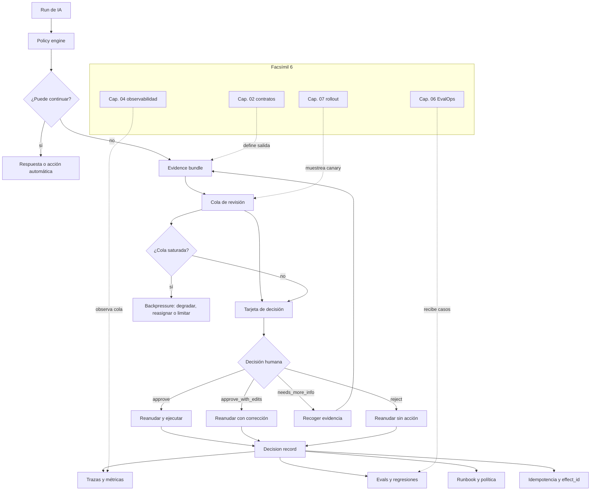

::: {.fasciculo-subtitle}
Facsímil 6 · Construir y operar
:::

# Capítulo 08: Handoffs operativos y revisión humana

## Qué deberías poder hacer al terminar

En el capítulo 07 aprendimos a exponer cambios poco a poco. Ahora aparece una situación igual de importante: **qué ocurre cuando una run no debería seguir sola**.

Un sistema de IA real no vive solo en el modelo. Vive en colas, tickets, contratos, herramientas, permisos, revisiones, trazas y decisiones. A veces el sistema puede responder. A veces debe abstenerse. A veces debe preparar una acción, pero no ejecutarla. Y a veces debe entregar el caso a una persona con todo lo necesario para decidir sin reconstruir la historia desde cero.

Al terminar, deberías poder hacer esto:

| Resultado de aprendizaje | Evidencia de que lo sabes hacer |
|---|---|
| Diseñar un handoff operativo. | Sabes qué campos mínimos debe entregar una run al pausarse. |
| Decidir cuándo pedir revisión. | Usas reglas por confianza, efecto, coste, contrato, evidencia y permisos. |
| Construir una cola de revisión. | Priorizas casos por impacto, antigüedad, SLA y falta de evidencia. |
| Diseñar una tarjeta de decisión. | La persona ve entrada, propuesta, fuentes, trazas, coste y acciones disponibles. |
| Reanudar una run. | Sabes continuar con `approve`, `reject` o `needs_more_info` sin perder estado. |
| Medir la cola. | Defines SLI, SLO, backlog, aging, tasa de acuerdo y coste humano. |
| Convertir revisión en aprendizaje. | Los casos revisados vuelven a evals, prompts, contratos y runbooks. |

La idea central: **pedir revisión no es fracasar; fracasar es pedirla sin contexto, sin prioridad y sin reanudación clara**.

## Cuando el sistema no debe seguir solo

Imagina un asistente interno que prepara respuestas para soporte universitario. La mayoría de preguntas son sencillas: horarios, plazos, enlaces, estado de una solicitud. Pero un día llega un caso con documentos incompletos, una norma que ha cambiado, un dato que contradice el expediente y una respuesta propuesta que podría cerrar el ticket.

El sistema puede tener una respuesta plausible. Eso no basta. La pregunta operativa es otra:

> ¿Tenemos evidencia suficiente para que esta acción siga automáticamente, o debemos entregar el caso a revisión?

Un handoff operativo evita dos extremos malos. El primero: automatizar de más y descubrir tarde que faltaba una condición. El segundo: mandar todo a revisión y convertir el sistema en una bandeja de espera. La ingeniería está en diseñar el punto medio.

## Qué no es revisión humana

Revisión humana no es añadir un botón de “aprobar” al final de una pantalla. Si la persona no ve el motivo, los datos usados, la salida propuesta, las fuentes, los límites y el efecto de cada botón, está firmando a oscuras.

Tampoco es revisar todo. Si cada respuesta trivial pide intervención, la cola crece, el tiempo de respuesta empeora y la revisión pierde valor. La persona debe entrar donde aporta criterio: falta evidencia, hay efecto persistente, la confianza no alcanza el umbral, el contrato falla, el coste se sale del presupuesto o la acción afecta a un recurso sensible.

Y no es “que lo decida soporte” como cajón de sastre. Una cola sin SLO, prioridad, dueño y estado es deuda operativa. El sistema debe explicar qué necesita y qué pasará después de la decisión.

| Confusión | Qué falta |
|---|---|
| “Lo revisa una persona y ya está” | Falta evidencia estructurada, estado y reanudación. |
| “Todo lo dudoso va a revisión” | Falta priorización y criterios de entrada. |
| “La persona corrige a mano” | Falta convertir la corrección en dataset, regla o cambio de contrato. |
| “Aprobar es pulsar sí” | Falta mostrar efecto, alcance y alternativa. |
| “La cola es una bandeja” | Falta SLI, SLO, aging, backlog y dueño. |

## Qué sí es un handoff operativo

Un handoff operativo es una pausa con contrato. La run entrega un paquete de evidencia, queda en un estado recuperable y espera una decisión explícita.

**Ejemplo de fórmula.** Podemos representarlo así:

$$
H = (x, y, a, e, r, q, t, s)
$$

| Símbolo | Significado | Ejemplo |
|---|---|---|
| \(x\) | Entrada original. | Pregunta del usuario y documentos consultados. |
| \(y\) | Salida propuesta. | Respuesta, JSON, diff o acción preparada. |
| \(a\) | Acción pendiente. | Enviar, publicar, actualizar, derivar, cerrar ticket. |
| \(e\) | Evidencia disponible. | Fuentes, trazas, validaciones, métricas, contrato. |
| \(r\) | Razón de revisión. | Baja confianza, efecto persistente, falta de fuente, coste alto. |
| \(q\) | Cola o persona responsable. | `soporte_n2`, `legal_ops`, `ai_platform`. |
| \(t\) | Tiempo objetivo de resolución. | 30 minutos, 4 horas, 1 día laboral. |
| \(s\) | Estado serializable de la run. | `run_state`, `trace_id`, `resume_token`. |

El sistema no debería decir solo “necesita revisión”. Debería decir: “necesita revisión por estas razones, con esta evidencia, antes de este tiempo, y estas son las decisiones posibles”.

## Fecha de corte del estado del arte

**Fecha de corte:** 28 de mayo de 2026.  
**Fuentes consultadas:** documentación oficial de OpenAI Agents SDK sobre human-in-the-loop y handoffs; documentación de Anthropic Claude Agent SDK sobre permisos, hooks y aprobaciones; documentación de Google ADK sobre callbacks y controles para agentes; LangGraph interrupts; OpenTelemetry Traces; NIST AI RMF; y trabajos académicos sobre ingeniería de ML, model cards y datasheets.

OpenAI Agents SDK describe un flujo donde una herramienta puede marcarse como pendiente de aprobación, la ejecución se pausa con interrupciones, el estado de la run se serializa y después se reanuda con aprobación o rechazo.^[OpenAI. (2026). *Agents SDK: Human-in-the-loop*. https://openai.github.io/openai-agents-python/human_in_the_loop/. Consultado el 28 de mayo de 2026.] También documenta handoffs como mecanismo para transferir control entre agentes especializados.^[OpenAI. (2026). *Agents SDK: Handoffs*. https://openai.github.io/openai-agents-python/handoffs/. Consultado el 28 de mayo de 2026.]

Anthropic documenta permisos, reglas de allow/deny, modos de permiso, hooks y callbacks de aprobación para controlar cuándo una herramienta se ejecuta, se bloquea o pide una decisión.^[Anthropic. (2026). *Claude Agent SDK: Permissions*. https://code.claude.com/docs/en/agent-sdk/permissions. Consultado el 28 de mayo de 2026.]^[Anthropic. (2026). *Claude Agent SDK: Hooks*. https://code.claude.com/docs/en/agent-sdk/hooks. Consultado el 28 de mayo de 2026.]^[Anthropic. (2026). *Claude Agent SDK: Handle Approvals and User Input*. https://code.claude.com/docs/en/agent-sdk/user-input. Consultado el 28 de mayo de 2026.]

Google ADK presenta callbacks para observar, personalizar y controlar el comportamiento de agentes, y recomienda tratar los agentes como sistemas con controles explícitos, evaluación y límites.^[Google. (2026). *Callbacks: Observe, Customize, and Control Agent Behavior*. https://adk.dev/callbacks/. Consultado el 28 de mayo de 2026.]^[Google. (2026). *Safety and Security for AI Agents*. https://adk.dev/safety/. Consultado el 28 de mayo de 2026.] LangGraph usa interrupts para pausar grafos, pedir decisión humana y reanudar desde un checkpoint.^[LangChain. (2026). *LangGraph Interrupts*. https://docs.langchain.com/oss/python/langgraph/human-in-the-loop. Consultado el 28 de mayo de 2026.]

Lo estable no es una API concreta. Lo estable es el patrón: detectar, pausar, empaquetar evidencia, decidir, reanudar, registrar y aprender.

## Cuándo disparar revisión

Un buen sistema no pregunta a una persona por vergüenza. Pregunta porque una regla dice que ahí la revisión tiene valor.

| Disparador | Señal concreta | Decisión típica |
|---|---|---|
| Baja confianza | `confidence < 0.72`. | Revisar antes de responder. |
| Contrato roto | JSON inválido, campo obligatorio ausente, enum inesperado. | Bloquear y pedir corrección. |
| Falta de evidencia | No hay fuente, cita o documento suficiente. | Pedir más información. |
| Fuentes en tensión | Dos documentos sostienen respuestas distintas. | Revisar con expediente completo. |
| Efecto persistente | Enviar, publicar, cerrar, modificar o borrar. | Aprobar antes de ejecutar. |
| Coste alto | La ruta supera presupuesto por tarea. | Revisar si merece usar ruta cara. |
| Permiso insuficiente | La tool requiere scope que la run no tiene. | Derivar a persona responsable. |
| Cola saturada | El sistema entraría en demora no aceptable. | Responder con estado claro o degradar. |
| Canary | Candidate toca casos nuevos. | Muestrear revisión para aprender. |
| Usuario lo pide | La persona quiere contacto humano. | Crear handoff explícito. |

La regla práctica: cada disparador debe tener una salida concreta. Si una condición solo dice “mirar”, no es una política; es una nota suelta.

## Fórmula sencilla de decisión

**Ejemplo de fórmula.** Podemos decidir revisión comparando el coste esperado de automatizar contra el coste de revisar:

$$
R(x) =
\begin{cases}
\text{review} & \text{si } p_f(x) \cdot C_f(x) > C_h(x) + C_d(x) \\
\text{auto} & \text{si } p_f(x) \cdot C_f(x) \le C_h(x) + C_d(x)
\end{cases}
$$

| Símbolo | Significado | Ejemplo |
|---|---|---|
| \(R(x)\) | Decisión para el caso \(x\). | `review` o `auto`. |
| \(p_f(x)\) | Probabilidad estimada de fallo relevante. | 0,18. |
| \(C_f(x)\) | Coste si el sistema se equivoca. | 80 EUR equivalentes o impacto operativo alto. |
| \(C_h(x)\) | Coste de revisión humana. | 6 minutos de una persona. |
| \(C_d(x)\) | Coste de demora. | Retraso sobre SLA o experiencia. |

Ejemplo numérico:

| Variable | Valor |
|---|---:|
| \(p_f(x)\) | 0,18 |
| \(C_f(x)\) | 80 |
| \(C_h(x)\) | 6 |
| \(C_d(x)\) | 3 |

Calculamos:

$$
p_f(x) \cdot C_f(x) = 0{,}18 \cdot 80 = 14{,}4
$$

$$
C_h(x) + C_d(x) = 6 + 3 = 9
$$

Como \(14{,}4 > 9\), revisamos. No porque “dé miedo”, sino porque el coste esperado de seguir automáticamente supera el coste de parar y decidir mejor.

Esta fórmula no sustituye criterio profesional. Lo hace discutible. Si alguien quiere cambiar el umbral, tiene que hablar de probabilidades, costes, demoras y evidencia.

## Anatomía visual de un handoff operativo

<svg id="f6-c08-operational-handoff" xmlns="http://www.w3.org/2000/svg" viewBox="0 0 1840 1320" role="img" aria-label="Arquitectura de un handoff operativo con policy engine, evidence bundle, cola de revisión, decisión, reanudación, observabilidad y aprendizaje">
  <defs>
    <style>
      #f6-c08-operational-handoff{background:#fff;color:#111;font-family:Inter,ui-sans-serif,system-ui,-apple-system,BlinkMacSystemFont,"Segoe UI",sans-serif}
      #f6-c08-operational-handoff .title{font-size:38px;font-weight:800;fill:#111}
      #f6-c08-operational-handoff .subtitle{font-size:17px;fill:#444}
      #f6-c08-operational-handoff .h{font-size:18px;font-weight:800;fill:#111}
      #f6-c08-operational-handoff .hw{font-size:18px;font-weight:800;fill:#fff}
      #f6-c08-operational-handoff .txt{font-size:13px;fill:#222}
      #f6-c08-operational-handoff .tiny{font-size:11px;fill:#555}
      #f6-c08-operational-handoff .micro{font-size:10px;fill:#666}
      #f6-c08-operational-handoff .frame{fill:#fff;stroke:#111;stroke-width:2}
      #f6-c08-operational-handoff .panel{fill:#fff;stroke:#111;stroke-width:1.5}
      #f6-c08-operational-handoff .soft{fill:#f6f6f6;stroke:#111;stroke-width:1.2}
      #f6-c08-operational-handoff .dark{fill:#111;stroke:#111;stroke-width:1.3}
      #f6-c08-operational-handoff .metric{fill:#fff;stroke:#444;stroke-width:1.1}
      #f6-c08-operational-handoff .line{stroke:#111;stroke-width:2;fill:none}
      #f6-c08-operational-handoff .dash{stroke:#555;stroke-width:1.5;fill:none;stroke-dasharray:8 7}
      #f6-c08-operational-handoff .thin{stroke:#555;stroke-width:1.1;fill:none}
    </style>
    <marker id="f6c08-arrow" viewBox="0 0 10 10" refX="9" refY="5" markerWidth="8" markerHeight="8" orient="auto-start-reverse">
      <path d="M 0 0 L 10 5 L 0 10 z" fill="#111"/>
    </marker>
  </defs>

  <rect x="42" y="36" width="1756" height="1248" rx="24" class="frame"/>
  <text x="920" y="92" text-anchor="middle" class="title">Handoff operativo: pausar con evidencia, decidir y reanudar</text>
  <text x="920" y="124" text-anchor="middle" class="subtitle">La revisión humana funciona cuando la run entrega estado, motivo, evidencia, opciones y trazabilidad.</text>

  <rect x="86" y="174" width="270" height="148" rx="16" class="dark"/>
  <text x="221" y="208" text-anchor="middle" class="hw">Run de IA</text>
  <text x="221" y="238" text-anchor="middle" class="tiny" fill="#eee">input · contexto · tools</text>
  <text x="221" y="260" text-anchor="middle" class="tiny" fill="#eee">salida propuesta</text>
  <text x="221" y="282" text-anchor="middle" class="tiny" fill="#eee">trace_id · run_state</text>

  <rect x="430" y="154" width="320" height="188" rx="16" class="panel"/>
  <text x="590" y="188" text-anchor="middle" class="h">Policy engine</text>
  <text x="590" y="216" text-anchor="middle" class="txt">decide auto · review · stop</text>
  <rect x="466" y="244" width="102" height="34" rx="8" class="soft"/>
  <text x="517" y="266" text-anchor="middle" class="tiny">contrato</text>
  <rect x="578" y="244" width="102" height="34" rx="8" class="soft"/>
  <text x="629" y="266" text-anchor="middle" class="tiny">confianza</text>
  <rect x="522" y="290" width="138" height="28" rx="7" class="metric"/>
  <text x="591" y="309" text-anchor="middle" class="tiny">coste · permisos · SLA</text>

  <rect x="824" y="154" width="326" height="188" rx="16" class="panel"/>
  <text x="987" y="188" text-anchor="middle" class="h">Evidence bundle</text>
  <text x="987" y="216" text-anchor="middle" class="txt">lo mínimo para decidir sin reconstruir</text>
  <rect x="860" y="246" width="116" height="32" rx="8" class="soft"/>
  <text x="918" y="267" text-anchor="middle" class="tiny">entrada</text>
  <rect x="994" y="246" width="116" height="32" rx="8" class="soft"/>
  <text x="1052" y="267" text-anchor="middle" class="tiny">propuesta</text>
  <rect x="860" y="290" width="116" height="32" rx="8" class="soft"/>
  <text x="918" y="311" text-anchor="middle" class="tiny">fuentes</text>
  <rect x="994" y="290" width="116" height="32" rx="8" class="soft"/>
  <text x="1052" y="311" text-anchor="middle" class="tiny">traza</text>

  <rect x="1228" y="154" width="250" height="188" rx="16" class="panel"/>
  <text x="1353" y="188" text-anchor="middle" class="h">Cola de revisión</text>
  <text x="1353" y="216" text-anchor="middle" class="txt">prioridad, SLA y dueño</text>
  <rect x="1264" y="248" width="178" height="28" rx="7" class="metric"/>
  <text x="1353" y="267" text-anchor="middle" class="tiny">impacto · edad · evidencia</text>
  <rect x="1264" y="290" width="178" height="28" rx="7" class="metric"/>
  <text x="1353" y="309" text-anchor="middle" class="tiny">owner · deadline</text>

  <rect x="1542" y="154" width="216" height="188" rx="16" class="dark"/>
  <text x="1650" y="188" text-anchor="middle" class="hw">Persona revisora</text>
  <text x="1650" y="218" text-anchor="middle" class="tiny" fill="#eee">aprueba</text>
  <text x="1650" y="240" text-anchor="middle" class="tiny" fill="#eee">rechaza</text>
  <text x="1650" y="262" text-anchor="middle" class="tiny" fill="#eee">pide datos</text>
  <text x="1650" y="284" text-anchor="middle" class="tiny" fill="#eee">reasigna</text>

  <line x1="356" y1="248" x2="430" y2="248" class="line" marker-end="url(#f6c08-arrow)"/>
  <line x1="750" y1="248" x2="824" y2="248" class="line" marker-end="url(#f6c08-arrow)"/>
  <line x1="1150" y1="248" x2="1228" y2="248" class="line" marker-end="url(#f6c08-arrow)"/>
  <line x1="1478" y1="248" x2="1542" y2="248" class="line" marker-end="url(#f6c08-arrow)"/>

  <rect x="94" y="430" width="390" height="258" rx="18" class="panel"/>
  <text x="289" y="464" text-anchor="middle" class="h">Disparadores</text>
  <text x="289" y="492" text-anchor="middle" class="txt">motivos explícitos para no seguir solo</text>
  <rect x="130" y="526" width="136" height="38" rx="9" class="soft"/>
  <text x="198" y="550" text-anchor="middle" class="tiny">contrato roto</text>
  <rect x="284" y="526" width="162" height="38" rx="9" class="soft"/>
  <text x="365" y="550" text-anchor="middle" class="tiny">falta evidencia</text>
  <rect x="130" y="580" width="136" height="38" rx="9" class="soft"/>
  <text x="198" y="604" text-anchor="middle" class="tiny">coste alto</text>
  <rect x="284" y="580" width="162" height="38" rx="9" class="soft"/>
  <text x="365" y="604" text-anchor="middle" class="tiny">efecto persistente</text>
  <rect x="152" y="638" width="274" height="28" rx="7" class="metric"/>
  <text x="289" y="657" text-anchor="middle" class="tiny">cada disparador produce una acción</text>

  <rect x="544" y="430" width="390" height="258" rx="18" class="panel"/>
  <text x="739" y="464" text-anchor="middle" class="h">Tarjeta de decisión</text>
  <text x="739" y="492" text-anchor="middle" class="txt">la interfaz no oculta el efecto</text>
  <line x1="592" y1="526" x2="886" y2="526" class="thin"/>
  <text x="606" y="552" class="txt">acción propuesta</text>
  <text x="606" y="582" class="txt">fuentes usadas</text>
  <text x="606" y="612" class="txt">coste y SLA</text>
  <text x="606" y="642" class="txt">botones permitidos</text>
  <text x="808" y="552" class="tiny">send_email</text>
  <text x="808" y="582" class="tiny">doc_14 · trace_7</text>
  <text x="808" y="612" class="tiny">0,018 EUR · 30 min</text>
  <text x="808" y="642" class="tiny">approve · reject · info</text>

  <rect x="994" y="430" width="390" height="258" rx="18" class="panel"/>
  <text x="1189" y="464" text-anchor="middle" class="h">Decision record</text>
  <text x="1189" y="492" text-anchor="middle" class="txt">decisión firmada y reutilizable</text>
  <rect x="1038" y="530" width="302" height="28" rx="7" class="metric"/>
  <text x="1189" y="549" text-anchor="middle" class="tiny">decision · reviewer · reason</text>
  <rect x="1038" y="578" width="302" height="28" rx="7" class="metric"/>
  <text x="1189" y="597" text-anchor="middle" class="tiny">accepted_output · rejected_args</text>
  <rect x="1038" y="626" width="302" height="28" rx="7" class="metric"/>
  <text x="1189" y="645" text-anchor="middle" class="tiny">dataset_candidate · runbook_link</text>

  <rect x="1444" y="430" width="300" height="258" rx="18" class="panel"/>
  <text x="1594" y="464" text-anchor="middle" class="h">Reanudación</text>
  <text x="1594" y="492" text-anchor="middle" class="txt">la run continúa con estado</text>
  <rect x="1484" y="532" width="220" height="36" rx="9" class="dark"/>
  <text x="1594" y="555" text-anchor="middle" class="hw">approve</text>
  <rect x="1484" y="584" width="220" height="36" rx="9" class="soft"/>
  <text x="1594" y="607" text-anchor="middle" class="tiny">reject</text>
  <rect x="1484" y="636" width="220" height="36" rx="9" class="soft"/>
  <text x="1594" y="659" text-anchor="middle" class="tiny">needs_more_info</text>

  <line x1="484" y1="562" x2="544" y2="562" class="line" marker-end="url(#f6c08-arrow)"/>
  <line x1="934" y1="562" x2="994" y2="562" class="line" marker-end="url(#f6c08-arrow)"/>
  <line x1="1384" y1="562" x2="1444" y2="562" class="line" marker-end="url(#f6c08-arrow)"/>
  <path d="M1594 688 C1594 760, 1090 760, 920 760" class="line" marker-end="url(#f6c08-arrow)"/>

  <rect x="112" y="794" width="486" height="244" rx="18" class="panel"/>
  <text x="355" y="828" text-anchor="middle" class="h">Observabilidad</text>
  <text x="355" y="856" text-anchor="middle" class="txt">la cola también tiene SLIs y SLOs</text>
  <line x1="160" y1="892" x2="548" y2="892" class="thin"/>
  <text x="172" y="922" class="txt">review_wait_p95</text>
  <text x="172" y="952" class="txt">backlog_size</text>
  <text x="172" y="982" class="txt">agreement_rate</text>
  <text x="382" y="922" class="txt">tiempo de espera</text>
  <text x="382" y="952" class="txt">casos pendientes</text>
  <text x="382" y="982" class="txt">consistencia</text>

  <rect x="676" y="794" width="486" height="244" rx="18" class="panel"/>
  <text x="919" y="828" text-anchor="middle" class="h">Aprendizaje</text>
  <text x="919" y="856" text-anchor="middle" class="txt">cada revisión alimenta el sistema</text>
  <rect x="724" y="904" width="154" height="42" rx="9" class="soft"/>
  <text x="801" y="930" text-anchor="middle" class="tiny">eval regression</text>
  <rect x="890" y="904" width="154" height="42" rx="9" class="soft"/>
  <text x="967" y="930" text-anchor="middle" class="tiny">prompt patch</text>
  <rect x="806" y="962" width="156" height="42" rx="9" class="dark"/>
  <text x="884" y="988" text-anchor="middle" class="hw">runbook</text>

  <rect x="1240" y="794" width="486" height="244" rx="18" class="panel"/>
  <text x="1483" y="828" text-anchor="middle" class="h">Gobierno operativo</text>
  <text x="1483" y="856" text-anchor="middle" class="txt">quién decide y cómo se audita</text>
  <rect x="1288" y="904" width="170" height="42" rx="9" class="soft"/>
  <text x="1373" y="930" text-anchor="middle" class="tiny">owner</text>
  <rect x="1470" y="904" width="170" height="42" rx="9" class="soft"/>
  <text x="1555" y="930" text-anchor="middle" class="tiny">scope</text>
  <rect x="1378" y="962" width="170" height="42" rx="9" class="soft"/>
  <text x="1463" y="988" text-anchor="middle" class="tiny">auditoría</text>

  <path d="M355 794 C355 740, 987 730, 987 342" class="dash" marker-end="url(#f6c08-arrow)"/>
  <path d="M919 794 C919 746, 1189 736, 1189 688" class="dash" marker-end="url(#f6c08-arrow)"/>
  <path d="M1483 794 C1483 746, 1353 736, 1353 342" class="dash" marker-end="url(#f6c08-arrow)"/>

  <rect x="194" y="1110" width="1452" height="58" rx="14" class="soft"/>
  <text x="920" y="1133" text-anchor="middle" class="tiny">Marca de agua editorial</text>
  <text x="1740" y="1268" text-anchor="end" class="micro" fill="#888888" opacity="0.45">IA para gente curiosa / Facsímil 06 / Capítulo 08 / 686f6c61</text>
</svg>

## El contrato mínimo del handoff

Un handoff serio debería poder serializarse. Si no puede guardarse, moverse de cola, auditarse y reanudarse, dependerá demasiado de la memoria de una persona.

Un contrato útil contiene:

| Campo | Motivo | Ejemplo |
|---|---|---|
| `request_id` | Identifica la revisión. | `rev_20260528_001`. |
| `run_id` | Une revisión con ejecución. | `run_7f31`. |
| `trace_id` | Permite abrir la traza completa. | `trace_abc`. |
| `task` | Agrupa métricas por caso de uso. | `support_reply`. |
| `proposed_action` | Dice qué se quiere hacer. | `send_email`. |
| `effect` | Describe impacto técnico. | `external_message`, `db_update`, `none`. |
| `reason_codes` | Explica por qué se revisa. | `low_confidence`, `missing_source`. |
| `evidence` | Resume pruebas disponibles. | Fuentes, validaciones, diffs, score. |
| `missing_evidence` | Dice qué falta. | `policy_doc`, `user_confirmation`. |
| `options` | Limita decisiones posibles. | `approve`, `reject`, `needs_more_info`. |
| `deadline_at` | Hace visible el SLO. | `2026-05-28T15:30:00Z`. |
| `resume_token` | Permite continuar la run. | Token opaco o estado serializado. |

Ejemplo:

```json
{
  "request_id": "rev_20260528_001",
  "run_id": "run_7f31",
  "trace_id": "trace_abc",
  "task": "support_reply",
  "proposed_action": "send_email",
  "effect": "external_message",
  "confidence": 0.68,
  "cost_eur": 0.018,
  "reason_codes": ["low_confidence", "missing_source"],
  "evidence": {
    "draft": "Hemos revisado tu solicitud...",
    "sources": ["doc_matricula_2026"],
    "schema_valid": true,
    "policy_version": "handoff_policy@3"
  },
  "missing_evidence": ["expediente_actualizado"],
  "options": ["approve", "reject", "needs_more_info"],
  "deadline_at": "2026-05-28T15:30:00Z",
  "resume_token": "resume_run_7f31_step_12"
}
```

La persona no recibe “un caso raro”. Recibe un objeto de trabajo.

## Máquina de estados del handoff

Para ingeniería, un handoff no debería ser un booleano `needs_review=true`. Debe tener una máquina de estados. Si no la tiene, aparecen dudas en producción: ¿se puede aprobar dos veces?, ¿qué pasa si caduca?, ¿quién puede reasignar?, ¿qué ocurre si la run ya se reanudó?

Una máquina mínima:

| Estado | Qué significa | Transiciones válidas |
|---|---|---|
| `running` | La run sigue trabajando. | `needs_review`, `completed`, `failed`. |
| `needs_review` | La política exige revisión. | `queued`, `cancelled`. |
| `queued` | El caso está en cola con prioridad y deadline. | `assigned`, `expired`, `cancelled`. |
| `assigned` | Una persona o equipo lo tiene asignado. | `in_review`, `reassigned`, `expired`. |
| `in_review` | La tarjeta está abierta o en edición. | `approved`, `approved_with_edits`, `rejected`, `needs_more_info`. |
| `needs_more_info` | Falta evidencia concreta. | `queued`, `cancelled`. |
| `approved` | La acción puede ejecutarse como venía. | `resuming`. |
| `approved_with_edits` | La acción puede continuar con cambios humanos. | `resuming`. |
| `rejected` | La acción no debe ejecutarse. | `resuming`. |
| `resuming` | Un worker está aplicando la decisión. | `closed`, `resume_failed`. |
| `resume_failed` | La decisión existe, pero reanudar falló. | `resuming`, `closed_manual`. |
| `expired` | Se incumplió el tiempo objetivo sin decisión. | `reassigned`, `cancelled`, `fallback_response`. |
| `closed` | El caso terminó con traza y decision record. | Estado terminal. |

Reglas que conviene escribir:

| Regla | Por qué importa |
|---|---|
| Una revisión cerrada no se modifica; se crea una revisión nueva. | Conserva auditoría y evita reescribir historia. |
| `approved` no ejecuta directamente; pasa por `resuming`. | Permite idempotencia y control de efectos. |
| `expired` no decide por sí solo. | La caducidad activa una política: reasignar, degradar o responder con estado claro. |
| `needs_more_info` debe nombrar qué falta. | Evita que la run vuelva a la cola sin mejora. |
| Cada transición emite un evento. | La cola se puede auditar y medir. |

## Modelo de datos persistente

El contrato JSON sirve para transportar el caso. En producción hace falta persistencia. Un modelo relacional mínimo podría ser:

```sql
create table handoff_requests (
  request_id text primary key,
  run_id text not null,
  trace_id text not null,
  task text not null,
  queue_name text not null,
  state text not null,
  proposed_action text not null,
  effect text not null,
  confidence numeric not null,
  cost_eur numeric not null,
  reason_codes jsonb not null,
  evidence jsonb not null,
  missing_evidence jsonb not null,
  resume_token text not null,
  idempotency_key text not null unique,
  created_at timestamptz not null,
  deadline_at timestamptz not null,
  updated_at timestamptz not null
);

create table review_decisions (
  decision_id text primary key,
  request_id text not null references handoff_requests(request_id),
  decision_version integer not null,
  reviewer text not null,
  decision text not null,
  reason text not null,
  edited_output text,
  created_at timestamptz not null,
  unique (request_id, decision_version)
);

create table review_events (
  event_id text primary key,
  request_id text not null references handoff_requests(request_id),
  event_type text not null,
  actor text not null,
  payload jsonb not null,
  created_at timestamptz not null
);

create table review_assignments (
  assignment_id text primary key,
  request_id text not null references handoff_requests(request_id),
  queue_name text not null,
  assignee text,
  assigned_at timestamptz not null,
  released_at timestamptz
);
```

Consultas que un equipo debería poder hacer:

```sql
select state, count(*) as n
from handoff_requests
where created_at >= now() - interval '24 hours'
group by state
order by n desc;
```

```sql
select
  queue_name,
  percentile_cont(0.95) within group (order by extract(epoch from updated_at - created_at) / 60) as age_p95_minutes,
  avg(case when now() > deadline_at and state not in ('closed', 'cancelled') then 1 else 0 end) as active_breach_rate
from handoff_requests
where created_at >= now() - interval '7 days'
group by queue_name;
```

La base de datos no es burocracia. Es lo que permite reanudar después de un crash, medir la cola, auditar decisiones y aprender de patrones repetidos.

## Idempotencia: aprobar dos veces no debe ejecutar dos veces

El punto más delicado para un ingeniero de IA no es pedir revisión. Es aplicar la decisión sin duplicar efectos.

Ejemplo de fallo realista:

1. Una persona aprueba `send_email`.
2. El worker ejecuta la tool.
3. El proceso cae antes de marcar `closed`.
4. El sistema reintenta.
5. Si no hay idempotencia, envía dos correos.

Campos que evitan ese problema:

| Campo | Qué protege |
|---|---|
| `idempotency_key` | La misma acción aprobada no se ejecuta dos veces. |
| `effect_id` | Identifica el efecto externo creado: email, ticket, cambio, publicación. |
| `decision_version` | Evita aplicar una decisión antigua tras una corrección. |
| `resume_token` | Reanuda el punto correcto de la run. |
| `state_version` | Bloquea carreras entre workers. |
| `executed_at` | Marca cuándo se produjo el efecto. |

Patrón recomendado:

```text
1. Leer request y decisión dentro de una transacción.
2. Comprobar `state=resuming` y `decision_version` vigente.
3. Reservar `idempotency_key`.
4. Ejecutar tool con esa clave.
5. Guardar `effect_id`.
6. Marcar `closed`.
7. Emitir evento `handoff.closed`.
```

Si la tool externa soporta claves de idempotencia, úsala. Si no, crea tu propia tabla de efectos y no ejecutes dos veces la misma combinación `(request_id, decision_version, proposed_action)`.

## Colas, SLI y SLO de revisión

Una cola de revisión también se opera. Si no la medimos, solo veremos su dolor cuando alguien se queje.

| SLI | Qué mide | Ejemplo |
|---|---|---|
| `review_wait_p95` | Tiempo p95 hasta primera decisión. | 38 minutos. |
| `backlog_size` | Casos pendientes por cola. | 71 casos. |
| `deadline_breach_rate` | Proporción fuera de SLO. | 4,2%. |
| `needs_more_info_rate` | Casos que llegaron con evidencia insuficiente. | 19%. |
| `approval_rate` | Porcentaje aprobado. | 63%. |
| `reversal_rate` | Decisiones corregidas después. | 1,1%. |
| `review_cost_per_case` | Coste humano estimado por revisión. | 3,40 EUR. |
| `agreement_rate` | Consistencia entre revisores en muestra doble. | 0,86. |

Un SLO posible:

$$
SLO_{review} = P(T_{decision} \le 30\text{ min}) \ge 0{,}95
$$

| Símbolo | Significado | Ejemplo |
|---|---|---|
| \(T_{decision}\) | Tiempo desde que se crea la revisión hasta primera decisión. | 18 minutos. |
| \(30\text{ min}\) | Objetivo máximo para la cola. | Media hora. |
| \(0{,}95\) | Proporción mínima dentro del objetivo. | 95 de cada 100 casos. |

El presupuesto de revisión no es infinito. Si la cola crece, tienes tres palancas:

| Palanca | Qué cambia | Cuidado |
|---|---|---|
| Mejorar evidencia | Menos `needs_more_info`. | Exige tocar prompts, retrieval o contrato. |
| Ajustar umbrales | Menos casos llegan a cola. | Puede aumentar automatización en casos discutibles. |
| Cambiar capacidad | Más personas o turnos. | Cuesta dinero y puede variar criterio. |

## Backpressure: qué hacer si la cola se satura

Una cola saturada no es solo un problema de soporte. Cambia el comportamiento del sistema de IA. Si el sistema sigue metiendo casos en revisión cuando nadie puede atenderlos, acumula deuda, incumple expectativas y oculta el fallo real.

Política de saturación:

| Señal | Umbral ejemplo | Acción |
|---|---:|---|
| `backlog_size` | Más de 200 casos. | Bajar automatización que genera revisiones dudosas. |
| `review_wait_p95` | Más de 45 min. | Reasignar cola o ampliar capacidad temporal. |
| `deadline_breach_rate` | Más de 5%. | Responder con estado claro en vez de prometer resolución inmediata. |
| `needs_more_info_rate` | Más de 25%. | Mejorar bundle antes de crear revisión. |
| `agreement_rate` | Menos de 0,75. | Pausar decisiones automáticas basadas en esa rúbrica. |

Estrategias de degradación:

| Estrategia | Qué hace | Cuándo usarla |
|---|---|---|
| `queue_only_critical` | Solo entran casos de alto impacto. | Backlog alto y poco personal. |
| `auto_reject_low_evidence` | No crea revisión si falta evidencia básica. | Muchos casos llegan vacíos. |
| `fallback_response` | Informa que el caso queda pendiente. | La respuesta inmediata sería engañosa. |
| `batch_review` | Agrupa casos parecidos. | Muchos casos con mismo motivo. |
| `threshold_raise` | Exige más confianza para actuar solo o más evidencia para revisar. | Canary o incidente operativo. |
| `route_to_specialist` | Cambia cola según tema. | La cola general bloquea casos especializados. |

La regla: **si la cola está llena, el sistema debe cambiar de comportamiento**. No basta con quejarse del backlog.

## La tarjeta de decisión

La persona revisora no debería tener que buscar en diez sistemas. La tarjeta debe responder rápido a siete preguntas:

| Pregunta | Lo que debe ver |
|---|---|
| ¿Qué quiere hacer el sistema? | Acción concreta y efecto. |
| ¿Por qué llegó a revisión? | Motivos codificados y explicación corta. |
| ¿Qué información usó? | Fuentes, documentos, campos y trazas. |
| ¿Qué falta? | Evidencia ausente o dato que debe comprobarse. |
| ¿Qué pasa si apruebo? | Acción exacta y recurso afectado. |
| ¿Qué pasa si rechazo? | Mensaje a la run y siguiente estado. |
| ¿Qué debo dejar escrito? | Motivo, corrección, caso de regresión o enlace a runbook. |

Botones sanos:

| Botón | Qué hace |
|---|---|
| `approve` | Reanuda la run y ejecuta la acción propuesta. |
| `approve_with_edits` | Reanuda con una salida corregida por la persona. |
| `reject` | No ejecuta la acción y devuelve motivo al sistema. |
| `needs_more_info` | Pide datos concretos y deja la run pausada. |
| `reassign` | Cambia cola o persona responsable. |

Botones peligrosos por diseño:

| Botón | Por qué lo evitaría |
|---|---|
| `ok` | No dice qué ocurre. |
| `continuar` | Oculta si ejecuta, responde o solo guarda. |
| `resolver` | Mezcla decisión, ejecución y cierre. |
| `saltar` | No deja claro si rechaza, pospone o ignora. |

## Datos visibles, datos ocultos y privacidad

La tarjeta de revisión debe mostrar lo suficiente para decidir, pero no todo lo que el sistema sabe. Minimizar datos también es ingeniería.

| Tipo de dato | Mostrar por defecto | Motivo |
|---|---|---|
| Acción propuesta | Sí. | Sin esto no hay decisión. |
| Efecto técnico | Sí. | La persona debe saber qué cambia. |
| Fuentes usadas | Sí, si tiene permiso. | Permite comprobar evidencia. |
| Datos personales completos | No. | Mostrar solo campos necesarios o redactados. |
| Prompt completo | Normalmente no. | Puede contener instrucciones internas o datos no necesarios. |
| Traza completa | No en tarjeta; sí enlazada. | La tarjeta debe ser legible y la auditoría completa debe existir. |
| Coste y latencia | Sí. | Afecta decisión operativa. |
| Identidad de otras personas | Solo si es necesario. | Reduce exposición innecesaria. |

Campos recomendados:

```text
visible_to_reviewer:
  - proposed_action
  - effect
  - draft
  - sources
  - missing_evidence
  - reason_codes
  - cost_eur
  - deadline_at
redacted_by_default:
  - raw_prompt
  - full_trace_payload
  - credentials
  - unrelated_personal_data
  - provider_internal_metadata
```

Una revisión útil no necesita enseñar todo. Necesita enseñar lo necesario, con enlaces auditables para quien tenga permiso.

## RACI operativo: quién puede decidir qué

La revisión humana se vuelve frágil cuando cualquiera puede aprobar cualquier cosa. Un RACI ayuda a separar responsabilidad.

| Caso | Responsible | Accountable | Consulted | Informed |
|---|---|---|---|---|
| Respuesta de soporte común | Soporte nivel 1 | Responsable de soporte | Producto | Usuario final |
| Caso con norma ambigua | Soporte nivel 2 | Responsable académico | Legal o coordinación | Usuario final |
| Cambio de configuración IA | Plataforma IA | Lead técnico | Producto y soporte | Equipo |
| Tool con efecto externo | Equipo dueño del sistema | Owner del proceso | Plataforma IA | Auditoría |
| Incumplimiento de SLO | Guardia operativa | Responsable de operación | Soporte | Producto |

Traducción práctica:

| Rol | Puede aprobar | No debería aprobar |
|---|---|---|
| Soporte nivel 1 | Respuestas con fuente y efecto bajo. | Cambios persistentes o casos ambiguos. |
| Soporte nivel 2 | Casos con expediente, excepción o criterio. | Cambios de infraestructura. |
| Plataforma IA | Reanudación técnica, rutas, políticas y gates. | Interpretaciones de negocio sin owner. |
| Producto | Cambios de experiencia y criterio funcional. | Ejecución técnica sin evidencia. |
| Guardia operativa | Acciones para proteger SLO y cola. | Decisiones de contenido especializado. |

## Handoffs en SDKs y runtimes

La forma concreta cambia según la herramienta, pero el patrón se repite.

| Ecosistema | Mecanismo relevante | Cómo lo traduciría a operación |
|---|---|---|
| OpenAI Agents SDK | Tools con aprobación, interrupciones, `RunState` serializable y reanudación. | Guardar pending approvals como cola y reanudar desde estado versionado. |
| OpenAI Agents SDK | Handoffs entre agentes. | Separar especialización de revisión: no todo handoff es humano. |
| Claude Agent SDK | Permisos, allow/deny, modos y `canUseTool`. | Declarar qué se permite, qué se bloquea y qué pide decisión en runtime. |
| Claude Agent SDK | Hooks. | Interceptar tool calls para añadir política propia, logs y gates. |
| Google ADK | Callbacks. | Insertar controles antes/después de agente, modelo o tool. |
| LangGraph | Interrupts y checkpoints. | Pausar grafo, guardar estado y reanudar con decisión. |
| OpenTelemetry | Trazas y spans. | Unir revisión, run, tool, coste y decisión en una historia consultable. |

OpenTelemetry define las trazas como una forma de seguir el camino de una petición mediante spans relacionados.^[OpenTelemetry. (2026). *Traces*. https://opentelemetry.io/docs/concepts/signals/traces/. Consultado el 27 de mayo de 2026.] En un handoff, la traza debería permitir responder: qué agente iba actuando, qué tool se propuso, qué política bloqueó, quién decidió y cómo se reanudó.

## Calidad de la revisión

La revisión humana también se evalúa. Una persona puede tener prisa, interpretar una rúbrica de forma distinta o aprobar casos porque la interfaz no explica bien el efecto.

| Control | Qué detecta | Cómo se aplica |
|---|---|---|
| Doble revisión muestral | Inconsistencia entre personas. | 5% de casos van a dos revisores. |
| Rúbrica versionada | Cambios de criterio. | `review_rubric@4`. |
| Casos calibrados | Deriva del equipo. | Casos fijos con respuesta esperada. |
| Revisión de reversals | Decisiones corregidas después. | Analizar por motivo y persona. |
| Tiempo por decisión | Decisiones demasiado rápidas o lentas. | Mirar distribución, no solo media. |
| Feedback al sistema | Mismo motivo aparece muchas veces. | Abrir trabajo de prompt, RAG o contrato. |

El acuerdo simple se calcula así:

$$
A = \frac{N_{same}}{N_{double}}
$$

| Símbolo | Significado | Ejemplo |
|---|---|---|
| \(A\) | Tasa de acuerdo simple. | 0,86. |
| \(N_{same}\) | Casos donde dos revisores tomaron la misma decisión. | 86. |
| \(N_{double}\) | Casos revisados por dos personas. | 100. |

No es una métrica perfecta, pero ayuda a detectar si la cola está midiendo el criterio del sistema o el humor del día.

Los trabajos sobre model cards y datasheets enseñan una idea que aquí encaja muy bien: documentar estructura, límites, datos, supuestos y uso previsto reduce ambigüedad operativa.^[Mitchell, M. et al. (2019). *Model Cards for Model Reporting*. Proceedings of the Conference on Fairness, Accountability, and Transparency, 220-229. https://doi.org/10.1145/3287560.3287596]^[Gebru, T. et al. (2021). *Datasheets for Datasets*. *Communications of the ACM*, 64(12), 86-92. https://doi.org/10.1145/3458723] En revisión humana ocurre lo mismo: si la tarjeta no dice qué se está decidiendo, cada persona rellena huecos con su interpretación.

## Qué te llevas para poner en práctica

Al terminar este capítulo, el lector debería poder montar una cola mínima de revisión para un sistema de IA.

| Artefacto | Para qué sirve en un proyecto real | Qué debería contener |
|---|---|---|
| `handoff_request.schema.json` | Contrato de entrada a la cola. | IDs, acción, efecto, evidencia, motivos, deadline y opciones. |
| `handoff_policy.yaml` | Reglas de revisión. | Umbrales de confianza, coste, efectos y evidencia obligatoria. |
| `handoff_queue.py` | Simulador operativo. | Prioridad, decisión, SLA y mensaje de reanudación. |
| `handoff_state_machine.md` | Estados y transiciones. | Qué estados existen, quién los cambia y qué eventos emiten. |
| `handoff_tables.sql` | Persistencia mínima. | Requests, decisiones, eventos y asignaciones. |
| `review_decision.md` | Registro humano. | Decisión, motivo, cambios y caso de regresión. |
| `review_dashboard.sql` | Consultas de cola. | Backlog, aging, breaches y tasa de aprobación. |
| `privacy_review.yaml` | Minimización de datos. | Campos visibles, redactados y enlazados. |
| `raci_handoff.md` | Ownership operativo. | Quién puede aprobar cada tipo de caso. |
| `runbook_handoff.md` | Procedimiento del equipo. | Quién revisa, cuándo, cómo escalar y cómo cerrar. |

Práctica recomendada:

1. Define dos acciones: una que pueda seguir sola y otra que requiera revisión.
2. Escribe tres motivos de revisión con códigos estables.
3. Diseña el contrato JSON.
4. Ejecuta el script de cola con casos de ejemplo.
5. Genera una decisión `approve`, una `reject` y una `needs_more_info`.
6. Añade una clave de idempotencia para que una aprobación no duplique efectos.
7. Define qué ocurre si la cola supera el SLO.
8. Convierte al menos un caso revisado en entrada de regresión.

El resultado práctico no es “tenemos humanos en el bucle”. Es poder demostrar qué entra, por qué entra, quién decide, cuánto tarda y cómo se reanuda.

## Reto de capítulo: una cola de revisión en 45 minutos

Este es el ejercicio que me gustaría que alguien pudiera llevarse del capítulo y hacer de verdad. No es leer el concepto: es montar una mini cola reproducible.

**Escenario:** tienes un asistente de soporte que prepara respuestas. Algunas pueden guardarse como nota interna; otras quieren enviar un mensaje externo. Tu trabajo es decidir qué sigue solo, qué va a revisión y qué decisión deja preparada la reanudación.

Archivos que vas a crear:

```text
mi-proyecto/
  ops/
    ai/
      handoff_queue.py
  data/
    handoff_examples.jsonl
  output/
    handoff_queue_result.json
```

Datos de entrada en `data/handoff_examples.jsonl`:

```jsonl
{"request_id":"rev_001","run_id":"run_7f31","trace_id":"trace_abc","task":"support_reply","proposed_action":"send_email","effect":"external_message","confidence":0.68,"cost_eur":0.018,"created_at":"2026-05-28T13:45:00+00:00","sla_minutes":30,"evidence":{"draft":"Tu solicitud queda pendiente de revisar el expediente actualizado.","sources":["doc_matricula_2026"],"schema_valid":true,"contract_version":"support_reply_schema@4"},"missing_evidence":["expediente_actualizado"],"resume_token":"resume_run_7f31_step_12"}
{"request_id":"rev_002","run_id":"run_8a20","trace_id":"trace_def","task":"ticket_summary","proposed_action":"save_summary","effect":"internal_note","confidence":0.91,"cost_eur":0.006,"created_at":"2026-05-28T14:05:00+00:00","sla_minutes":240,"evidence":{"draft":"Resumen interno del caso con próximos pasos.","sources":["ticket_991"],"schema_valid":true,"contract_version":"summary_schema@2"},"missing_evidence":[],"resume_token":"resume_run_8a20_step_05"}
{"request_id":"rev_003","run_id":"run_9c10","trace_id":"trace_xyz","task":"policy_answer","proposed_action":"answer_user","effect":"external_message","confidence":0.74,"cost_eur":0.041,"created_at":"2026-05-28T13:20:00+00:00","sla_minutes":60,"evidence":{"draft":"Según la política vigente, el plazo ordinario termina el viernes.","sources":[],"schema_valid":true,"contract_version":"policy_answer_schema@7"},"missing_evidence":["fuente_normativa"],"resume_token":"resume_run_9c10_step_09"}
```

Comandos:

```bash
mkdir -p ops/ai data output
python ops/ai/handoff_queue.py --write
cat output/handoff_queue_result.json
```

Qué debería ocurrir:

| Caso | Resultado esperado | Por qué |
|---|---|---|
| `rev_001` | Entra en cola. | Baja confianza, efecto externo y falta expediente. |
| `rev_002` | Sigue automáticamente. | Es nota interna, tiene evidencia y supera umbrales. |
| `rev_003` | Entra primero en cola. | Efecto externo, coste alto y falta fuente normativa. |

La entrega mínima del alumno:

1. Captura o salida de `handoff_queue_result.json`.
2. Una decisión escrita para `rev_003`.
3. Una frase explicando por qué `rev_002` no necesita revisión.
4. Una modificación de la política: subir o bajar `min_confidence` y justificar el efecto.
5. Un caso nuevo añadido al JSONL que pruebe `contract_failed`.

## Manos a la obra

**Práctica:** construir una cola mínima.

Kit ejecutable de este capítulo: `labs/f6/capitulo-practicas/`.

```bash
cd labs/f6/capitulo-practicas
python3 ops/run_f6_practices.py --chapter c08 --write --fail-on-invalid
```

Guarda este script como `ops/ai/handoff_queue.py`. No necesita dependencias externas.

```python
from __future__ import annotations

import json
import sys
from dataclasses import asdict, dataclass
from datetime import datetime, timedelta, timezone
from enum import Enum
from pathlib import Path


class Decision(str, Enum):
    APPROVE = "approve"
    APPROVE_WITH_EDITS = "approve_with_edits"
    REJECT = "reject"
    NEEDS_MORE_INFO = "needs_more_info"


@dataclass(frozen=True)
class HandoffRequest:
    request_id: str
    run_id: str
    trace_id: str
    task: str
    proposed_action: str
    effect: str
    confidence: float
    cost_eur: float
    created_at: str
    sla_minutes: int
    evidence: dict[str, object]
    missing_evidence: list[str]
    resume_token: str


@dataclass(frozen=True)
class ReviewDecision:
    request_id: str
    reviewer: str
    decision: Decision
    reason: str
    edited_output: str | None = None


REQUESTS = [
    HandoffRequest(
        request_id="rev_001",
        run_id="run_7f31",
        trace_id="trace_abc",
        task="support_reply",
        proposed_action="send_email",
        effect="external_message",
        confidence=0.68,
        cost_eur=0.018,
        created_at="2026-05-28T13:45:00+00:00",
        sla_minutes=30,
        evidence={
            "draft": "Tu solicitud queda pendiente de revisar el expediente actualizado.",
            "sources": ["doc_matricula_2026"],
            "schema_valid": True,
            "contract_version": "support_reply_schema@4",
        },
        missing_evidence=["expediente_actualizado"],
        resume_token="resume_run_7f31_step_12",
    ),
    HandoffRequest(
        request_id="rev_002",
        run_id="run_8a20",
        trace_id="trace_def",
        task="ticket_summary",
        proposed_action="save_summary",
        effect="internal_note",
        confidence=0.91,
        cost_eur=0.006,
        created_at="2026-05-28T14:05:00+00:00",
        sla_minutes=240,
        evidence={
            "draft": "Resumen interno del caso con próximos pasos.",
            "sources": ["ticket_991"],
            "schema_valid": True,
            "contract_version": "summary_schema@2",
        },
        missing_evidence=[],
        resume_token="resume_run_8a20_step_05",
    ),
    HandoffRequest(
        request_id="rev_003",
        run_id="run_9c10",
        trace_id="trace_xyz",
        task="policy_answer",
        proposed_action="answer_user",
        effect="external_message",
        confidence=0.74,
        cost_eur=0.041,
        created_at="2026-05-28T13:20:00+00:00",
        sla_minutes=60,
        evidence={
            "draft": "Según la política vigente, el plazo ordinario termina el viernes.",
            "sources": [],
            "schema_valid": True,
            "contract_version": "policy_answer_schema@7",
        },
        missing_evidence=["fuente_normativa"],
        resume_token="resume_run_9c10_step_09",
    ),
]


POLICY = {
    "min_confidence": 0.78,
    "max_cost_eur": 0.03,
    "review_effects": {"external_message", "db_update", "publish"},
    "required_evidence_keys": {"draft", "sources", "schema_valid", "contract_version"},
}


def request_from_dict(data: dict[str, object]) -> HandoffRequest:
    return HandoffRequest(
        request_id=str(data["request_id"]),
        run_id=str(data["run_id"]),
        trace_id=str(data["trace_id"]),
        task=str(data["task"]),
        proposed_action=str(data["proposed_action"]),
        effect=str(data["effect"]),
        confidence=float(data["confidence"]),
        cost_eur=float(data["cost_eur"]),
        created_at=str(data["created_at"]),
        sla_minutes=int(data["sla_minutes"]),
        evidence=dict(data["evidence"]),
        missing_evidence=list(data["missing_evidence"]),
        resume_token=str(data["resume_token"]),
    )


def load_requests(path: Path = Path("data/handoff_examples.jsonl")) -> list[HandoffRequest]:
    if not path.exists():
        return REQUESTS

    requests: list[HandoffRequest] = []
    for line_number, line in enumerate(path.read_text(encoding="utf-8").splitlines(), start=1):
        if not line.strip():
            continue
        try:
            requests.append(request_from_dict(json.loads(line)))
        except (KeyError, TypeError, ValueError, json.JSONDecodeError) as exc:
            raise ValueError(f"línea {line_number} inválida en {path}") from exc

    return requests


def parse_time(value: str) -> datetime:
    return datetime.fromisoformat(value)


def review_reasons(req: HandoffRequest) -> list[str]:
    reasons: list[str] = []

    if req.confidence < POLICY["min_confidence"]:
        reasons.append("low_confidence")
    if req.cost_eur > POLICY["max_cost_eur"]:
        reasons.append("cost_over_budget")
    if req.effect in POLICY["review_effects"]:
        reasons.append("effect_requires_review")
    if req.missing_evidence:
        reasons.append("missing_evidence")
    if not set(POLICY["required_evidence_keys"]).issubset(req.evidence):
        reasons.append("incomplete_bundle")
    if req.evidence.get("schema_valid") is not True:
        reasons.append("contract_failed")

    return reasons


def priority_score(req: HandoffRequest, now: datetime) -> float:
    created = parse_time(req.created_at)
    deadline = created + timedelta(minutes=req.sla_minutes)
    age_minutes = max(0.0, (now - created).total_seconds() / 60)
    remaining_minutes = max(1.0, (deadline - now).total_seconds() / 60)
    reasons = review_reasons(req)

    effect_weight = {
        "external_message": 4.0,
        "db_update": 5.0,
        "publish": 5.0,
        "internal_note": 1.0,
        "none": 0.0,
    }.get(req.effect, 2.0)

    return (
        effect_weight
        + len(reasons) * 1.5
        + len(req.missing_evidence) * 0.8
        + min(age_minutes / max(req.sla_minutes, 1), 2.0)
        + 1.0 / remaining_minutes
    )


def should_auto_continue(req: HandoffRequest) -> bool:
    return not review_reasons(req)


def build_review_card(req: HandoffRequest, now: datetime) -> dict[str, object]:
    created = parse_time(req.created_at)
    deadline = created + timedelta(minutes=req.sla_minutes)
    return {
        "request_id": req.request_id,
        "run_id": req.run_id,
        "trace_id": req.trace_id,
        "task": req.task,
        "proposed_action": req.proposed_action,
        "effect": req.effect,
        "confidence": req.confidence,
        "cost_eur": req.cost_eur,
        "reasons": review_reasons(req),
        "missing_evidence": req.missing_evidence,
        "deadline_at": deadline.isoformat(),
        "minutes_to_deadline": round((deadline - now).total_seconds() / 60, 1),
        "priority_score": round(priority_score(req, now), 3),
        "options": [decision.value for decision in Decision],
        "evidence": req.evidence,
    }


def apply_decision(req: HandoffRequest, decision: ReviewDecision) -> dict[str, object]:
    if decision.decision == Decision.APPROVE:
        next_state = "resume_and_execute"
    elif decision.decision == Decision.APPROVE_WITH_EDITS:
        next_state = "resume_with_edited_output"
    elif decision.decision == Decision.NEEDS_MORE_INFO:
        next_state = "keep_paused_and_collect_evidence"
    else:
        next_state = "resume_without_action"

    return {
        "request_id": req.request_id,
        "resume_token": req.resume_token,
        "decision": decision.decision.value,
        "reviewer": decision.reviewer,
        "reason": decision.reason,
        "edited_output": decision.edited_output,
        "next_state": next_state,
        "trace_event": "handoff.review_decided",
    }


def write_result(result: dict[str, object], path: Path = Path("output/handoff_queue_result.json")) -> None:
    path.parent.mkdir(parents=True, exist_ok=True)
    path.write_text(json.dumps(result, ensure_ascii=False, indent=2), encoding="utf-8")


def main(argv: list[str] | None = None) -> None:
    argv = argv or sys.argv[1:]
    now = datetime(2026, 5, 28, 14, 15, tzinfo=timezone.utc)
    requests = load_requests()
    cards = [build_review_card(req, now) for req in requests if not should_auto_continue(req)]
    cards.sort(key=lambda card: card["priority_score"], reverse=True)

    decision = ReviewDecision(
        request_id=cards[0]["request_id"],
        reviewer="soporte_n2",
        decision=Decision.NEEDS_MORE_INFO,
        reason="Falta fuente normativa o expediente actualizado antes de responder.",
    )

    selected = next(req for req in requests if req.request_id == decision.request_id)
    result = {
        "queue_size": len(cards),
        "auto_continue": [req.request_id for req in requests if should_auto_continue(req)],
        "next_card": cards[0],
        "review_result": apply_decision(selected, decision),
    }
    if "--write" in argv:
        write_result(result)
    print(json.dumps(result, ensure_ascii=False, indent=2))


if __name__ == "__main__":
    main()
```

Ejecuta:

```bash
python ops/ai/handoff_queue.py
```

Salida esperada resumida:

```text
"queue_size": 2
"auto_continue": [
  "rev_002"
]
"request_id": "rev_003"
"decision": "needs_more_info"
"next_state": "keep_paused_and_collect_evidence"
```

Qué enseña:

| Pieza | Aprendizaje |
|---|---|
| `HandoffRequest` | El handoff es un contrato, no una conversación suelta. |
| `review_reasons()` | Cada revisión nace de motivos codificados. |
| `priority_score()` | La cola se ordena por impacto, antigüedad, SLA y evidencia. |
| `build_review_card()` | La interfaz debería salir de datos estructurados. |
| `apply_decision()` | Aprobar, rechazar o pedir datos cambia el estado de reanudación. |

## Kit operativo: llevarlo a un repo

Estructura mínima:

```text
mi-proyecto/
  ops/
    ai/
      handoff_queue.py
      handoff_policy.yaml
      handoff_request.schema.json
      handoff_state_machine.md
      handoff_tables.sql
      privacy_review.yaml
      raci_handoff.md
      review_decision.md
      review_dashboard.sql
      runbook_handoff.md
  data/
    handoff_examples.jsonl
  output/
    handoff_queue_result.json
```

`ops/ai/handoff_policy.yaml`:

```yaml
policy_id: handoff_policy@3
min_confidence: 0.78
max_cost_eur: 0.03
review_effects:
  - external_message
  - db_update
  - publish
required_evidence_keys:
  - draft
  - sources
  - schema_valid
  - contract_version
queues:
  support_n2:
    slo_minutes: 30
    owner: soporte
  ai_platform:
    slo_minutes: 120
    owner: plataforma-ia
decisions:
  - approve
  - approve_with_edits
  - reject
  - needs_more_info
backpressure:
  backlog_size_warn: 120
  backlog_size_critical: 200
  review_wait_p95_minutes_warn: 45
  deadline_breach_rate_max: 0.05
  saturation_mode: queue_only_critical
idempotency:
  key_template: "{request_id}:{decision_version}:{proposed_action}"
  require_effect_id: true
```

`ops/ai/privacy_review.yaml`:

```yaml
visible_to_reviewer:
  - request_id
  - task
  - proposed_action
  - effect
  - draft
  - sources
  - reason_codes
  - missing_evidence
  - confidence
  - cost_eur
  - deadline_at
linked_with_permission:
  - trace_id
  - run_id
  - full_evidence
redacted_by_default:
  - raw_prompt
  - provider_payload
  - credentials
  - unrelated_personal_data
retention:
  review_record_days: 180
  raw_payload_days: 30
```

`ops/ai/review_dashboard.sql`:

```sql
select
  queue_name,
  count(*) as backlog_size,
  percentile_cont(0.95) within group (
    order by extract(epoch from first_decision_at - created_at) / 60
  ) as review_wait_p95_minutes,
  avg(case when first_decision_at > deadline_at then 1 else 0 end) as deadline_breach_rate,
  avg(case when decision = 'needs_more_info' then 1 else 0 end) as needs_more_info_rate
from ai_handoff_reviews
where created_at >= now() - interval '7 days'
group by queue_name
order by backlog_size desc;
```

Plantilla de `ops/ai/review_decision.md`:

```markdown
# Decisión de revisión

## Identificación

- Request:
- Run:
- Trace:
- Tarea:
- Persona revisora:

## Decisión

- [ ] approve
- [ ] approve_with_edits
- [ ] reject
- [ ] needs_more_info

## Motivo

Explica la razón técnica de la decisión.

## Evidencia usada

- Fuentes:
- Trazas:
- Validaciones:
- Datos que faltaban:

## Reanudación

Qué debe hacer la run después de esta decisión.

## Aprendizaje

- [ ] Añadir a evals/regression.jsonl
- [ ] Ajustar prompt
- [ ] Ajustar política de handoff
- [ ] Ajustar contrato de salida
- [ ] Actualizar runbook
```

Qué entregaría un alumno:

| Entregable | Criterio de aceptación |
|---|---|
| Script ejecutado | Produce cola, caso automático y caso pendiente. |
| Política YAML | Explica umbrales, efectos y colas. |
| Tarjeta JSON | Permite decidir sin mirar conversación completa. |
| SQL de dashboard | Calcula backlog, p95 y breaches. |
| Decisión escrita | Justifica qué ocurre al reanudar. |
| Caso de regresión | Convierte una revisión real en evaluación futura. |
| Máquina de estados | Impide transiciones ambiguas y dobles ejecuciones. |
| Modelo de datos | Permite auditar, consultar y recuperar después de fallos. |
| Política de privacidad | Muestra lo necesario sin exponer payloads completos. |
| Plan de backpressure | Define qué hace el sistema cuando la cola se satura. |

## Cómo encaja todo



## Relación con otros capítulos

| Capítulo | Qué aporta aquí |
|---|---|
| [F5 · Capítulo 08](/libro/fasciculo-05/#capitulo-08) | Permisos, autonomía y aprobación de tools. |
| [F6 · Capítulo 02](/libro/fasciculo-06/#capitulo-02) | Estados `needs_review`, contratos de API y respuesta estructurada. |
| [F6 · Capítulo 04](/libro/fasciculo-06/#capitulo-04) | Trazas, métricas, SLIs y SLOs. |
| [F6 · Capítulo 06](/libro/fasciculo-06/#capitulo-06) | Casos revisados que vuelven a datasets y gates. |
| [F6 · Capítulo 07](/libro/fasciculo-06/#capitulo-07) | Canary y revisión muestreada antes de ampliar exposición. |

Amershi y colaboradores mostraron que los sistemas de ML en producción traen retos propios de datos, operación, monitorización y evolución.^[Amershi, S. et al. (2019). *Software Engineering for Machine Learning: A Case Study*. Proceedings of the 41st International Conference on Software Engineering: Software Engineering in Practice, 291-300. https://doi.org/10.1109/ICSE-SEIP.2019.00042] El NIST AI RMF organiza la gestión de sistemas de IA alrededor de gobernar, mapear, medir y gestionar.^[Tabassi, E. (2023). *Artificial Intelligence Risk Management Framework (AI RMF 1.0)*. NIST AI 100-1. https://doi.org/10.6028/NIST.AI.100-1] Un handoff operativo es una forma concreta de llevar esas ideas al día a día: no basta con confiar en el sistema; hay que diseñar cómo se detiene, cómo pide criterio y cómo aprende.

## Para entenderlo

Tres situaciones concretas:

| Situación | Mala salida | Handoff operativo |
|---|---|---|
| Respuesta de soporte sin fuente. | “Creo que el plazo es el viernes”. | Pausa, pide fuente normativa y deja `needs_more_info`. |
| Tool quiere cerrar un ticket. | Cierra porque el resumen parece correcto. | Crea tarjeta con acción, evidencia, efecto y botón `approve`. |
| Canary de prompt nuevo. | Se mira el promedio y se sube al 50%. | Muestrea revisiones de casos nuevos y añade regresiones. |

La diferencia no está en “meter una persona”. Está en que la persona entre justo donde el sistema necesita criterio, y salga dejando datos que mejoran el siguiente ciclo.

## Vocabulario aprendido

| Término | Definición breve |
|---|---|
| Handoff operativo | Pausa estructurada de una run para que otra persona o sistema pueda decidir. |
| Evidence bundle | Paquete de entrada, propuesta, fuentes, trazas, motivos y estado. |
| Approval request | Solicitud concreta de aprobación sobre una acción. |
| Review queue | Cola priorizada de casos pendientes de decisión. |
| Decision record | Registro de qué se decidió, quién lo hizo y por qué. |
| Resume token | Identificador o estado que permite reanudar una run. |
| SLO de revisión | Objetivo medible de tiempo o calidad de la cola. |
| Agreement rate | Proporción de decisiones iguales entre revisores en muestra doble. |

## Dónde solía tropezar yo

Me costó entender que revisión humana no es una red de seguridad automática. Si llega tarde, sin contexto o sin criterio, solo traslada el problema a otra persona.

| Tropiezo | Antídoto |
|---|---|
| Mandar demasiadas cosas a revisión. | Codificar motivos y medir tasa por motivo. |
| Mandar casos sin evidencia suficiente. | Exigir `evidence` y `missing_evidence`. |
| No medir la cola. | Crear SLI/SLO de espera, backlog y breaches. |
| No reanudar bien. | Guardar `resume_token`, decisión y siguiente estado. |
| No aprender de revisiones. | Convertir casos en evals, reglas y runbooks. |

La frase que me habría ahorrado muchas vueltas: **un handoff no es un mensaje; es un contrato de continuidad**.

## Antes de pasar página

Comprueba que puedes responder:

1. ¿Qué diferencia hay entre revisión humana y handoff operativo?
2. ¿Qué campos mínimos debe incluir un `evidence_bundle`?
3. ¿Cuándo pedirías revisión por efecto persistente?
4. ¿Qué SLI usarías para medir una cola de revisión?
5. ¿Por qué `approve` y `approve_with_edits` no deberían ser el mismo botón?
6. ¿Cómo se reanuda una run después de una decisión?
7. ¿Qué caso revisado añadirías a un dataset de regresión?

## En resumen

| Idea | Para llevarte |
|---|---|
| Revisar no es improvisar. | La revisión debe tener contrato, evidencia, SLA y reanudación. |
| La cola se opera. | Backlog, p95, breaches, acuerdo y coste humano son métricas del sistema. |
| La interfaz decide calidad. | Si la tarjeta no muestra efecto y evidencia, la persona decide a ciegas. |
| Cada revisión debe enseñar algo. | Los casos vuelven a evals, prompts, políticas y runbooks. |

## Para saber más

- Amershi, S. et al. *Software Engineering for Machine Learning: A Case Study*. https://doi.org/10.1109/ICSE-SEIP.2019.00042
- Anthropic. *Claude Agent SDK: Handle Approvals and User Input*. https://code.claude.com/docs/en/agent-sdk/user-input
- Anthropic. *Claude Agent SDK: Hooks*. https://code.claude.com/docs/en/agent-sdk/hooks
- Anthropic. *Claude Agent SDK: Permissions*. https://code.claude.com/docs/en/agent-sdk/permissions
- Gebru, T. et al. *Datasheets for Datasets*. https://doi.org/10.1145/3458723
- Google. *Callbacks: Observe, Customize, and Control Agent Behavior*. https://adk.dev/callbacks/
- Google. *Safety and Security for AI Agents*. https://adk.dev/safety/
- LangChain. *LangGraph Interrupts*. https://docs.langchain.com/oss/python/langgraph/human-in-the-loop
- Mitchell, M. et al. *Model Cards for Model Reporting*. https://doi.org/10.1145/3287560.3287596
- OpenAI. *Agents SDK: Handoffs*. https://openai.github.io/openai-agents-python/handoffs/
- OpenAI. *Agents SDK: Human-in-the-loop*. https://openai.github.io/openai-agents-python/human_in_the_loop/
- OpenTelemetry. *Traces*. https://opentelemetry.io/docs/concepts/signals/traces/
- Tabassi, E. *Artificial Intelligence Risk Management Framework (AI RMF 1.0)*. https://doi.org/10.6028/NIST.AI.100-1
