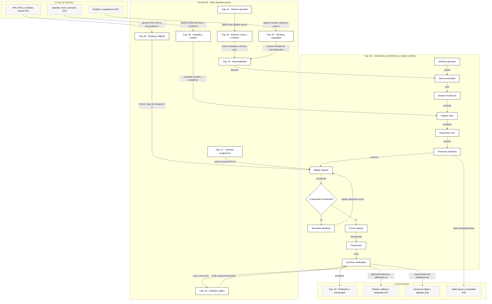

::: {.fasciculo-subtitle}
Facsímil 6 · Construir y operar
:::

# Capítulo 09: Incidencias, postmortems y mejora continua

## Qué deberías poder hacer al terminar

En el capítulo 08 diseñamos cómo pausar una run y pedir revisión. Ahora subimos un nivel: **qué ocurre cuando el sistema completo entra en una situación operativa que exige coordinación**.

Una incidencia de IA no siempre es “la API está caída”. Puede ser más sutil: sube el coste por run aceptada, el contrato JSON falla, el RAG cita documentos que no corresponden, el router manda demasiado tráfico al modelo caro, una cola de revisión se atasca, un canary degrada la calidad en un segmento o una tool empieza a devolver errores tipados.

Al terminar, deberías poder hacer esto:

| Resultado de aprendizaje | Evidencia de que lo sabes hacer |
|---|---|
| Declarar una incidencia de IA. | Separas síntoma, impacto, severidad, servicio afectado y owner. |
| Priorizar respuesta. | Clasificas por usuarios, tareas, coste, contrato, SLO y reversibilidad. |
| Coordinar roles. | Distingues comandante, operaciones, comunicación, especialistas y documentación. |
| Mitigar sin perder evidencia. | Proteges el servicio y conservas trazas, eventos y decisiones. |
| Calcular tiempos operativos. | Mides detección, reconocimiento, mitigación y recuperación. |
| Escribir un postmortem útil. | Incluyes impacto, línea temporal, causas contribuyentes y acciones verificables. |
| Convertir aprendizaje en trabajo. | Creas casos de regresión, runbooks, alertas, cambios de política y gates. |

La idea central: **una incidencia no termina cuando vuelve la gráfica; termina cuando el sistema aprende algo verificable**.

## Cuando producción te enseña lo que faltaba

Imagina que un asistente de soporte llevaba dos semanas estable. De pronto, el coste p95 sube, la latencia se dispara y soporte empieza a recibir tickets de respuestas que tardan demasiado. Nadie cambió código de aplicación, pero sí se publicó un índice RAG nuevo y se abrió un canary de prompt.

Hay varias tentaciones: mirar logs al azar, culpar al modelo, revertir todo, escribir en el chat “lo estoy mirando” y esperar que alguien encuentre la causa. Eso no es operar. Operar es declarar el evento, acotar impacto, asignar roles, mitigar, preservar evidencia y dejar un registro que permita aprender.

La pregunta no es “quién lo rompió”. La pregunta útil es:

> ¿Qué señales vimos, qué decisiones tomamos, qué mitigó el impacto y qué cambio evitará que vuelva igual?

## Qué no es gestionar una incidencia

Gestionar una incidencia no es correr más rápido que el dashboard. La velocidad sin coordinación suele crear cambios simultáneos, mensajes contradictorios y pérdida de evidencia.

Tampoco es buscar una causa única al final. En sistemas de IA, una incidencia suele tener causas contribuyentes: un cambio de datos, un umbral demasiado permisivo, un fallback que no estaba probado, una alerta tardía, un runbook incompleto o un canary que no segmentaba lo suficiente.

Y un postmortem no es un documento ceremonial. Si no produce acciones verificables, casos de regresión, alertas mejores o runbooks más claros, solo archiva una historia.

| Confusión | Qué falta |
|---|---|
| “La incidencia termina cuando baja la alerta” | Falta confirmar recuperación, cerrar comunicación y capturar aprendizaje. |
| “Postmortem es resumen” | Falta impacto, línea temporal, causas contribuyentes y acciones con dueño. |
| “Revertimos y listo” | Falta saber qué señal detectó tarde y qué dataset debe aprender. |
| “El modelo falló” | Falta distinguir modelo, prompt, RAG, router, runtime, contrato y proveedor. |
| “Ya sabemos lo que pasó” | Falta evidencia reproducible: trazas, métricas, eventos y decisiones. |

## Qué sí es una incidencia de IA

Para este libro, una incidencia de IA es:

> Un evento operativo que degrada una propiedad importante del sistema: disponibilidad, latencia, coste, calidad, contrato, trazabilidad, permisos o confianza del flujo.

**Ejemplo de fórmula.** Podemos modelarla como:

$$
I = (S, P, T, E, M, D, A)
$$

| Símbolo | Significado | Ejemplo |
|---|---|---|
| \(S\) | Servicio o capacidad afectada. | `support_rag`, `tool_gateway`, `review_queue`. |
| \(P\) | Población afectada. | 18% de tenants, canal chat, tarea `policy_answer`. |
| \(T\) | Ventana temporal. | 13:40-14:35 UTC. |
| \(E\) | Evidencia observada. | Métricas, logs, trazas, tickets, decision records. |
| \(M\) | Mitigaciones aplicadas. | Rollback, fallback, bajar canary, desactivar tool. |
| \(D\) | Decisiones tomadas. | Quién decidió, cuándo y por qué. |
| \(A\) | Acciones de mejora. | Evals, alertas, runbooks, cambios de política. |

Si falta \(D\), no sabremos por qué se actuó. Si falta \(E\), discutiremos recuerdos. Si falta \(A\), la incidencia puede repetirse con otro nombre.

## Fecha de corte del estado del arte

**Fecha de corte:** 28 de mayo de 2026.  
**Fuentes consultadas:** capítulos de Google SRE sobre monitorización, respuesta de emergencia, gestión de incidencias, postmortems, alerting on SLOs y sobrecarga; OpenTelemetry sobre trazas, logs, métricas y convenciones GenAI; NIST AI RMF; y trabajos de ingeniería de ML.

El libro de SRE de Google recomienda que las alertas que interrumpen a personas sean simples, accionables y orientadas a síntomas relevantes para usuarios.^[Ewaschuk, R. (2016). *Monitoring Distributed Systems*. En B. Beyer, C. Jones, J. Petoff y N. R. Murphy (eds.), *Site Reliability Engineering*. https://sre.google/sre-book/monitoring-distributed-systems/. Consultado el 27 de mayo de 2026.] El SRE Workbook explica cómo alertar sobre SLOs usando consumo de presupuesto de error, no solo umbrales aislados.^[Wilkinson, J. (2018). *Alerting on SLOs*. En B. Beyer, N. R. Murphy, D. Rensin, K. Kawahara y S. Thorne (eds.), *The Site Reliability Workbook*. https://sre.google/workbook/alerting-on-slos/. Consultado el 27 de mayo de 2026.]

Google SRE también insiste en preparar la respuesta a emergencias antes de necesitarlas, practicarla y pedir ayuda cuando la situación supera a una persona.^[Baye, C. A. (2016). *Emergency Response*. En *Site Reliability Engineering*. https://sre.google/sre-book/emergency-response/. Consultado el 28 de mayo de 2026.] En gestión de incidencias, separa roles como comando, trabajo operativo, comunicación y planificación para evitar cambios descoordinados.^[Stribblehill, A. (2016). *Managing Incidents*. En *Site Reliability Engineering*. https://sre.google/sre-book/managing-incidents/. Consultado el 28 de mayo de 2026.]

Sobre postmortems, Google SRE los define como registros escritos de impacto, acciones tomadas, causas contribuyentes y seguimiento para evitar recurrencia, con una cultura centrada en aprender y mejorar sistemas.^[Lunney, J. y Lueder, S. (2016). *Postmortem Culture: Learning from Failure*. En *Site Reliability Engineering*. https://sre.google/sre-book/postmortem-culture/. Consultado el 28 de mayo de 2026.] Lo estable es el método: declarar, coordinar, mitigar, documentar, aprender y verificar. Lo cambiante son herramientas concretas de guardia, chat, tickets, dashboards y proveedores.

## Severidad: no todo merece el mismo ruido

La severidad debe estar definida antes de la incidencia. Si se decide en caliente, cada persona trae su propio umbral.

| Severidad | Impacto | Ejemplo en IA | Respuesta |
|---|---|---|---|
| SEV1 | Servicio principal no cumple función crítica o hay impacto amplio. | El asistente no responde o rompe contrato en producción para muchas tareas. | Comando formal, mitigación inmediata, comunicación periódica. |
| SEV2 | Degradación importante, acotada o con workaround. | p95 fuera de SLO en una tarea clave; coste p95 se duplica. | Equipo operativo, owner, update regular, postmortem si supera umbral. |
| SEV3 | Problema limitado, sin impacto amplio. | Una ruta RAG falla en un tenant o canal. | Ticket prioritario, runbook, revisión posterior. |
| SEV4 | Anomalía o mejora preventiva. | Alerta de tendencia, flake rate subiendo, cola creciendo. | Trabajo planificado antes de que escale. |

Para IA conviene clasificar por más dimensiones que “está caído”:

| Dimensión | Pregunta |
|---|---|
| Disponibilidad | ¿El usuario puede completar la tarea? |
| Latencia | ¿La experiencia sigue dentro del SLO? |
| Contrato | ¿La salida sigue siendo parseable y compatible? |
| Calidad | ¿Aumentan rechazos, revisiones o quejas verificables? |
| Coste | ¿Se consume presupuesto de forma anómala? |
| Trazabilidad | ¿Podemos reconstruir lo ocurrido? |
| Reversibilidad | ¿Podemos volver a estado conocido sin pérdida? |
| Alcance | ¿Cuántos tenants, tareas, idiomas o canales afecta? |

## Fórmulas operativas que sí usaría

El primer grupo mide tiempos:

$$
MTTA = \frac{1}{n}\sum_{i=1}^{n}(t^{ack}_i - t^{detect}_i)
$$

$$
MTTR = \frac{1}{n}\sum_{i=1}^{n}(t^{recover}_i - t^{start}_i)
$$

| Símbolo | Significado | Ejemplo |
|---|---|---|
| \(MTTA\) | Tiempo medio hasta reconocer la incidencia. | 7 minutos. |
| \(MTTR\) | Tiempo medio hasta recuperar. | 42 minutos. |
| \(t^{detect}_i\) | Momento en que el sistema detecta el evento. | 13:43 UTC. |
| \(t^{ack}_i\) | Momento en que una persona o proceso lo reconoce. | 13:48 UTC. |
| \(t^{start}_i\) | Inicio de la incidencia. | 13:40 UTC. |
| \(t^{recover}_i\) | Recuperación confirmada. | 14:22 UTC. |
| \(n\) | Número de incidencias medidas. | 12. |

**Ejemplo de fórmula.** El segundo grupo prioriza:

$$
P = 4U + 3C + 2L + 2K + R
$$

| Símbolo | Significado | Ejemplo |
|---|---|---|
| \(P\) | Puntuación de prioridad. | 23. |
| \(U\) | Alcance de usuarios o tenants afectados, de 0 a 5. | 3. |
| \(C\) | Criticidad de la tarea, de 0 a 5. | 4. |
| \(L\) | Degradación de latencia o disponibilidad, de 0 a 5. | 2. |
| \(K\) | Degradación de contrato/calidad, de 0 a 5. | 3. |
| \(R\) | Penalización por baja reversibilidad, de 0 a 5. | 1. |

Ejemplo:

$$
P = 4\cdot3 + 3\cdot4 + 2\cdot2 + 2\cdot3 + 1 = 35
$$

Con \(P=35\), probablemente no estamos ante un ticket normal. Necesitamos coordinación, mitigación y seguimiento.

También conviene recordar que las colas obedecen matemáticas. La ley de Little relaciona trabajos en sistema, tasa de llegada y tiempo medio.^[Little, J. D. C. (1961). A proof for the queuing formula: L = λW. *Operations Research*, 9(3), 383-387. https://doi.org/10.1287/opre.9.3.383] Si la cola de revisión o de serving crece, no basta con “esperar un poco”: o baja llegada, o sube capacidad, o aumenta tiempo de espera.

## Tipos de incidencia propios de IA

| Tipo | Síntoma | Primeras comprobaciones |
|---|---|---|
| Contrato | JSON inválido, campos extra, enum incorrecto. | `contract_version`, salida raw, validador, cambio de prompt/modelo. |
| Calidad | Más rechazos, revisiones o casos corregidos. | Muestras, judge calibrado, feedback, canary, dataset afectado. |
| RAG | Fuentes pobres, citas ausentes, documentos obsoletos. | `index_version`, retrieval trace, `top_k`, reranker, fechas de documento. |
| Routing | Ruta cara o lenta sube de golpe. | `route_catalog`, distribución de tareas, fallback, proveedor. |
| Coste | Coste p95 o total diario sube. | Tokens, reintentos, contexto, modelo, cache hit rate. |
| Serving | Saturación de workers, cola, KV cache, timeouts. | Goodput, queue depth, GPU/CPU, batch size, p95/p99. |
| Handoff | Cola de revisión crece o caduca. | Backlog, `needs_more_info_rate`, owners, SLO de cola. |
| Trazabilidad | No se puede reconstruir la run. | `trace_id`, spans, sampling, logs, atributos obligatorios. |

Dean y Barroso mostraron que la cola de la latencia importa especialmente en sistemas a gran escala: una parte pequeña de operaciones lentas puede dominar la experiencia.^[Dean, J. y Barroso, L. A. (2013). The Tail at Scale. *Communications of the ACM*, 56(2), 74-80. https://doi.org/10.1145/2408776.2408794] En IA esto se agrava por contexto largo, herramientas, colas de serving, reintentos y validación.

## Taxonomía por capa: dónde mirar primero

Un ingeniero de IA necesita separar capas. Si todo se llama “fallo del modelo”, el postmortem no produce buenas acciones.

| Capa | Qué puede degradarse | Señales | Mitigación típica |
|---|---|---|---|
| Producto | Usuario no completa tarea. | Tickets, abandono, baja aceptación. | Respuesta de estado, handoff, rollback de experiencia. |
| Contrato | Consumidor no parsea salida. | `contract_fail_rate`, errores de schema. | Schema anterior, validador estricto, prompt rollback. |
| Prompt | Cambia formato, tono, abstención o longitud. | Tokens, longitud, fallos de JSON, quejas. | Prompt anterior, límite de salida, eval de regresión. |
| Modelo | Latencia, coste, calidad o tool calling cambian. | `model_id`, p95, coste, flake rate. | Cambiar ruta, bajar esfuerzo, fallback de modelo. |
| RAG | Recuperación trae ruido o documentos obsoletos. | `index_version`, chunks, citas, recall manual. | Índice anterior, bajar `top_k`, desactivar reranker. |
| Router | Demasiado tráfico va a ruta cara/lenta. | `route_mix`, fallback, coste por tarea. | Catálogo anterior, override por tarea. |
| Tool gateway | Args inválidos, permisos o errores externos. | `tool_error_rate`, args, scope, retries. | Modo lectura, bloquear tool, handoff. |
| Serving | Saturación, colas, timeouts, memoria. | queue depth, p95/p99, goodput, GPU/CPU. | Rate limit, autoscaling, reducir contexto. |
| Observabilidad | Faltan trazas o atributos. | `trace_completeness`, sampling, logs. | Subir sampling temporal, añadir atributos obligatorios. |

Checklist de primera hora:

1. ¿Qué cambió en las últimas 24 horas: prompt, modelo, índice, router, proveedor, política, código o tráfico?
2. ¿El síntoma aparece por `task`, `tenant`, `model_id`, `prompt_version`, `index_version` o `release_id`?
3. ¿La mitigación más reversible está clara?
4. ¿Tenemos suficiente evidencia antes de borrar o sobrescribir estado?
5. ¿Qué caso concreto debería entrar en regresión?

## Queries reales durante la incidencia

Las incidencias se operan mejor con preguntas concretas. Ejemplos con PromQL:

```promql
histogram_quantile(
  0.95,
  sum(rate(ai_run_latency_seconds_bucket{task="support_reply"}[10m])) by (le, release_id, variant)
)
```

```promql
sum(rate(ai_contract_fail_total{task="support_reply"}[10m])) by (release_id, variant)
/
sum(rate(ai_run_total{task="support_reply"}[10m])) by (release_id, variant)
```

```promql
histogram_quantile(
  0.95,
  sum(rate(ai_run_cost_eur_bucket{task="support_reply"}[30m])) by (le, model_id, route_id)
)
```

```promql
sum(rate(ai_tool_error_total{tool_name="crm_lookup"}[10m])) by (error_type, release_id)
```

Y con SQL para eventos de producto:

```sql
select
  task,
  release_id,
  variant,
  count(*) as runs,
  avg(case when contract_valid then 0 else 1 end) as contract_fail_rate,
  avg(case when accepted_by_user then 1 else 0 end) as acceptance_rate,
  percentile_cont(0.95) within group (order by latency_ms) as latency_p95_ms
from ai_run_events
where created_at >= now() - interval '2 hours'
group by task, release_id, variant
order by contract_fail_rate desc, latency_p95_ms desc;
```

Estas consultas deberían vivir en el runbook. Si las inventas durante la incidencia, perderás minutos y quizá harás preguntas distintas cada vez.

## Replay: reproducir antes de prometer causa

Una incidencia de IA no queda entendida hasta que podemos reproducir al menos una parte. No siempre se puede reproducir todo, pero sí guardar un paquete mínimo.

| Pieza | Qué guardar | Por qué |
|---|---|---|
| Entrada | Prompt de usuario o payload redactado. | Permite repetir el caso. |
| Contexto | IDs de chunks, documentos, versiones y hashes. | RAG cambia con el tiempo. |
| Configuración | Modelo, parámetros, prompt, router, tools. | Sin versiones no hay comparación. |
| Salida | Respuesta raw, salida validada y errores. | Permite medir contrato y calidad. |
| Traza | `trace_id`, spans y eventos. | Reconstruye latencia, retries y tools. |
| Decisión | Mitigación, rollback o handoff aplicado. | Explica por qué terminó así. |

Plantilla `replay_case.json`:

```json
{
  "case_id": "inc_support_rag_2026_05_28_case_001",
  "source": "incident",
  "task": "support_reply",
  "release_id": "support-rag@1.9.0-rc1",
  "input_hash": "sha256:...",
  "prompt_version": "prompt_v13",
  "model_id": "model_b",
  "route_catalog": "route_catalog@32",
  "rag_index": "rag_index_2026_06",
  "expected": {
    "contract_valid": true,
    "must_cite_source": true,
    "max_latency_ms": 4200
  },
  "observed": {
    "contract_valid": false,
    "latency_ms": 6200,
    "missing_source": true
  }
}
```

Este archivo es el puente entre postmortem y EvalOps. Si no hay replay, el aprendizaje se queda en memoria oral.

## Anatomía visual de una incidencia de IA

<svg id="f6-c09-ai-incident" xmlns="http://www.w3.org/2000/svg" viewBox="0 0 1840 1320" role="img" aria-label="Arquitectura operativa de una incidencia de IA con detección, comando, mitigación, evidencia, postmortem y aprendizaje">
  <defs>
    <style>
      #f6-c09-ai-incident{background:#fff;color:#111;font-family:Inter,ui-sans-serif,system-ui,-apple-system,BlinkMacSystemFont,"Segoe UI",sans-serif}
      #f6-c09-ai-incident .title{font-size:38px;font-weight:800;fill:#111}
      #f6-c09-ai-incident .subtitle{font-size:17px;fill:#444}
      #f6-c09-ai-incident .h{font-size:18px;font-weight:800;fill:#111}
      #f6-c09-ai-incident .hw{font-size:18px;font-weight:800;fill:#fff}
      #f6-c09-ai-incident .txt{font-size:13px;fill:#222}
      #f6-c09-ai-incident .tiny{font-size:11px;fill:#555}
      #f6-c09-ai-incident .micro{font-size:10px;fill:#666}
      #f6-c09-ai-incident .frame{fill:#fff;stroke:#111;stroke-width:2}
      #f6-c09-ai-incident .panel{fill:#fff;stroke:#111;stroke-width:1.5}
      #f6-c09-ai-incident .soft{fill:#f6f6f6;stroke:#111;stroke-width:1.2}
      #f6-c09-ai-incident .dark{fill:#111;stroke:#111;stroke-width:1.3}
      #f6-c09-ai-incident .metric{fill:#fff;stroke:#444;stroke-width:1.1}
      #f6-c09-ai-incident .line{stroke:#111;stroke-width:2;fill:none}
      #f6-c09-ai-incident .dash{stroke:#555;stroke-width:1.5;fill:none;stroke-dasharray:8 7}
      #f6-c09-ai-incident .thin{stroke:#555;stroke-width:1.1;fill:none}
    </style>
    <marker id="f6c09-arrow" viewBox="0 0 10 10" refX="9" refY="5" markerWidth="8" markerHeight="8" orient="auto-start-reverse">
      <path d="M 0 0 L 10 5 L 0 10 z" fill="#111"/>
    </marker>
  </defs>

  <rect x="42" y="36" width="1756" height="1248" rx="24" class="frame"/>
  <text x="920" y="92" text-anchor="middle" class="title">Incidencia de IA: detectar, coordinar, mitigar y aprender</text>
  <text x="920" y="124" text-anchor="middle" class="subtitle">Una incidencia útilmente operada deja menos impacto ahora y más resiliencia después.</text>

  <rect x="86" y="174" width="270" height="156" rx="16" class="dark"/>
  <text x="221" y="208" text-anchor="middle" class="hw">Síntoma</text>
  <text x="221" y="238" text-anchor="middle" class="tiny" fill="#eee">SLO · contrato · coste</text>
  <text x="221" y="260" text-anchor="middle" class="tiny" fill="#eee">calidad · cola · trazas</text>
  <text x="221" y="282" text-anchor="middle" class="tiny" fill="#eee">tickets · feedback</text>

  <rect x="420" y="154" width="300" height="196" rx="16" class="panel"/>
  <text x="570" y="188" text-anchor="middle" class="h">Detección</text>
  <text x="570" y="216" text-anchor="middle" class="txt">alerta accionable y severidad</text>
  <rect x="456" y="246" width="228" height="28" rx="7" class="metric"/>
  <text x="570" y="265" text-anchor="middle" class="tiny">burn rate · p95 · fallos contrato</text>
  <rect x="456" y="290" width="228" height="28" rx="7" class="metric"/>
  <text x="570" y="309" text-anchor="middle" class="tiny">scope · tenant · task · release_id</text>

  <rect x="786" y="154" width="300" height="196" rx="16" class="panel"/>
  <text x="936" y="188" text-anchor="middle" class="h">Comando</text>
  <text x="936" y="216" text-anchor="middle" class="txt">roles claros y documento vivo</text>
  <rect x="822" y="246" width="104" height="34" rx="8" class="soft"/>
  <text x="874" y="268" text-anchor="middle" class="tiny">IC</text>
  <rect x="944" y="246" width="104" height="34" rx="8" class="soft"/>
  <text x="996" y="268" text-anchor="middle" class="tiny">Ops</text>
  <rect x="822" y="292" width="104" height="34" rx="8" class="soft"/>
  <text x="874" y="314" text-anchor="middle" class="tiny">Comms</text>
  <rect x="944" y="292" width="104" height="34" rx="8" class="soft"/>
  <text x="996" y="314" text-anchor="middle" class="tiny">Plan</text>

  <rect x="1152" y="154" width="300" height="196" rx="16" class="panel"/>
  <text x="1302" y="188" text-anchor="middle" class="h">Mitigación</text>
  <text x="1302" y="216" text-anchor="middle" class="txt">reducir impacto sin borrar huellas</text>
  <rect x="1188" y="246" width="228" height="28" rx="7" class="metric"/>
  <text x="1302" y="265" text-anchor="middle" class="tiny">rollback · fallback · bajar canary</text>
  <rect x="1188" y="290" width="228" height="28" rx="7" class="metric"/>
  <text x="1302" y="309" text-anchor="middle" class="tiny">rate limit · read-only · queue mode</text>

  <rect x="1518" y="174" width="240" height="156" rx="16" class="dark"/>
  <text x="1638" y="208" text-anchor="middle" class="hw">Recuperación</text>
  <text x="1638" y="238" text-anchor="middle" class="tiny" fill="#eee">SLO normal</text>
  <text x="1638" y="260" text-anchor="middle" class="tiny" fill="#eee">contrato estable</text>
  <text x="1638" y="282" text-anchor="middle" class="tiny" fill="#eee">coste controlado</text>

  <line x1="356" y1="252" x2="420" y2="252" class="line" marker-end="url(#f6c09-arrow)"/>
  <line x1="720" y1="252" x2="786" y2="252" class="line" marker-end="url(#f6c09-arrow)"/>
  <line x1="1086" y1="252" x2="1152" y2="252" class="line" marker-end="url(#f6c09-arrow)"/>
  <line x1="1452" y1="252" x2="1518" y2="252" class="line" marker-end="url(#f6c09-arrow)"/>

  <rect x="92" y="430" width="398" height="250" rx="18" class="panel"/>
  <text x="291" y="464" text-anchor="middle" class="h">Evidencia preservada</text>
  <text x="291" y="492" text-anchor="middle" class="txt">lo necesario para reconstruir</text>
  <line x1="138" y1="528" x2="444" y2="528" class="thin"/>
  <text x="150" y="556" class="txt">trace_id · run_id</text>
  <text x="150" y="586" class="txt">release_id · model_id</text>
  <text x="150" y="616" class="txt">prompt · router · index</text>
  <text x="150" y="646" class="txt">decisiones · mitigaciones</text>

  <rect x="548" y="430" width="398" height="250" rx="18" class="panel"/>
  <text x="747" y="464" text-anchor="middle" class="h">Comunicación</text>
  <text x="747" y="492" text-anchor="middle" class="txt">estado claro sin saturar al equipo</text>
  <rect x="592" y="538" width="310" height="32" rx="8" class="soft"/>
  <text x="747" y="559" text-anchor="middle" class="tiny">impacto · mitigación · siguiente update</text>
  <rect x="592" y="590" width="310" height="32" rx="8" class="soft"/>
  <text x="747" y="611" text-anchor="middle" class="tiny">qué sabemos · qué no sabemos</text>
  <rect x="592" y="642" width="310" height="26" rx="7" class="metric"/>
  <text x="747" y="660" text-anchor="middle" class="tiny">un canal, un documento, un owner</text>

  <rect x="1004" y="430" width="398" height="250" rx="18" class="panel"/>
  <text x="1203" y="464" text-anchor="middle" class="h">Postmortem</text>
  <text x="1203" y="492" text-anchor="middle" class="txt">aprendizaje verificable</text>
  <rect x="1048" y="538" width="136" height="40" rx="9" class="soft"/>
  <text x="1116" y="563" text-anchor="middle" class="tiny">impacto</text>
  <rect x="1220" y="538" width="136" height="40" rx="9" class="soft"/>
  <text x="1288" y="563" text-anchor="middle" class="tiny">timeline</text>
  <rect x="1048" y="600" width="136" height="40" rx="9" class="soft"/>
  <text x="1116" y="625" text-anchor="middle" class="tiny">causas</text>
  <rect x="1220" y="600" width="136" height="40" rx="9" class="soft"/>
  <text x="1288" y="625" text-anchor="middle" class="tiny">acciones</text>

  <rect x="1460" y="430" width="296" height="250" rx="18" class="panel"/>
  <text x="1608" y="464" text-anchor="middle" class="h">Mejora continua</text>
  <text x="1608" y="492" text-anchor="middle" class="txt">la incidencia alimenta el sistema</text>
  <rect x="1498" y="538" width="220" height="32" rx="8" class="soft"/>
  <text x="1608" y="559" text-anchor="middle" class="tiny">regression cases</text>
  <rect x="1498" y="590" width="220" height="32" rx="8" class="soft"/>
  <text x="1608" y="611" text-anchor="middle" class="tiny">alertas · runbooks</text>
  <rect x="1498" y="642" width="220" height="26" rx="7" class="metric"/>
  <text x="1608" y="660" text-anchor="middle" class="tiny">gates y canary policy</text>

  <line x1="490" y1="555" x2="548" y2="555" class="line" marker-end="url(#f6c09-arrow)"/>
  <line x1="946" y1="555" x2="1004" y2="555" class="line" marker-end="url(#f6c09-arrow)"/>
  <line x1="1402" y1="555" x2="1460" y2="555" class="line" marker-end="url(#f6c09-arrow)"/>

  <rect x="112" y="766" width="486" height="242" rx="18" class="panel"/>
  <text x="355" y="800" text-anchor="middle" class="h">Roles</text>
  <text x="355" y="828" text-anchor="middle" class="txt">nadie improvisa el organigrama</text>
  <text x="170" y="876" class="txt">IC: estado global y decisiones</text>
  <text x="170" y="910" class="txt">Ops: cambios del sistema</text>
  <text x="170" y="944" class="txt">Comms: updates y stakeholders</text>
  <text x="170" y="978" class="txt">Plan: acciones y seguimiento</text>

  <rect x="676" y="766" width="486" height="242" rx="18" class="panel"/>
  <text x="919" y="800" text-anchor="middle" class="h">Preguntas de ingeniería</text>
  <text x="919" y="828" text-anchor="middle" class="txt">el modelo es solo una pieza</text>
  <rect x="724" y="880" width="154" height="42" rx="9" class="soft"/>
  <text x="801" y="906" text-anchor="middle" class="tiny">¿qué cambió?</text>
  <rect x="890" y="880" width="154" height="42" rx="9" class="soft"/>
  <text x="967" y="906" text-anchor="middle" class="tiny">¿qué mitigó?</text>
  <rect x="806" y="944" width="156" height="42" rx="9" class="dark"/>
  <text x="884" y="970" text-anchor="middle" class="hw">¿qué aprende?</text>

  <rect x="1240" y="766" width="486" height="242" rx="18" class="panel"/>
  <text x="1483" y="800" text-anchor="middle" class="h">Artefactos</text>
  <text x="1483" y="828" text-anchor="middle" class="txt">todo deja una pieza reutilizable</text>
  <rect x="1288" y="880" width="170" height="42" rx="9" class="soft"/>
  <text x="1373" y="906" text-anchor="middle" class="tiny">postmortem.md</text>
  <rect x="1470" y="880" width="170" height="42" rx="9" class="soft"/>
  <text x="1555" y="906" text-anchor="middle" class="tiny">runbook.md</text>
  <rect x="1378" y="944" width="170" height="42" rx="9" class="soft"/>
  <text x="1463" y="970" text-anchor="middle" class="tiny">evals.jsonl</text>

  <path d="M1608 680 C1608 720, 1483 720, 1483 766" class="dash" marker-end="url(#f6c09-arrow)"/>
  <path d="M1203 680 C1203 720, 919 720, 919 766" class="dash" marker-end="url(#f6c09-arrow)"/>
  <path d="M747 680 C747 720, 355 720, 355 766" class="dash" marker-end="url(#f6c09-arrow)"/>

  <rect x="194" y="1110" width="1452" height="58" rx="14" class="soft"/>
  <text x="920" y="1133" text-anchor="middle" class="tiny">Marca de agua editorial</text>
  <text x="1740" y="1268" text-anchor="end" class="micro" fill="#888888" opacity="0.45">IA para gente curiosa / Facsímil 06 / Capítulo 09 / 686f6c61</text>
</svg>

## Roles: separar trabajo para pensar mejor

Durante una incidencia, mezclar todos los roles crea ruido. Google SRE describe roles como comando, trabajo operativo, comunicación y planificación.^[Stribblehill, 2016.] En IA los adaptaría así:

| Rol | Responsabilidad | No debería hacer |
|---|---|---|
| Comando de incidencia | Mantener estado global, severidad, decisiones y prioridades. | Tocar todos los mandos técnicos a la vez. |
| Operaciones | Ejecutar mitigaciones: rollback, fallback, rate limit, desactivar ruta. | Comunicar estimaciones no validadas. |
| Especialista IA | Analizar prompt, modelo, RAG, evals, router o tool. | Cambiar producción sin coordinar. |
| Comunicación | Explicar impacto, mitigación y próximo update. | Especular causas antes de evidencia. |
| Planificación | Registrar acciones, owners, follow-ups y postmortem. | Perderse en debugging de bajo nivel. |

La regla de oro: **una persona coordina, pocas personas cambian producción, todas las decisiones quedan escritas**.

## Mitigación: proteger primero, explicar después

La mitigación reduce impacto. No siempre corrige la causa profunda. Está bien. Durante una incidencia, primero evitamos que el daño operativo crezca.

| Síntoma | Mitigación inmediata | Evidencia a preservar |
|---|---|---|
| Contrato JSON falla. | Volver a prompt/schema anterior o activar validador estricto. | Salidas raw, `schema_version`, modelo, prompt. |
| Coste sube. | Bajar `max_tokens`, cambiar ruta, activar cache, pausar canary. | Tokens, route mix, provider, retries. |
| Latencia p95 sube. | Fallback a ruta ligera, limitar contexto, bajar batch, rate limit. | Queue depth, spans, p95 por fase. |
| RAG trae fuentes pobres. | Volver a índice anterior o bajar `top_k`. | Queries, chunks, index_version, reranker. |
| Cola de revisión caduca. | `queue_only_critical`, reasignar, respuesta de estado. | Backlog, owners, `needs_more_info_rate`. |
| Tool externa falla. | Modo solo lectura, fallback sin tool, abrir handoff. | Tool args, error tipado, trace_id. |

El libro de SRE sobre sobrecarga recuerda que un sistema debe decidir qué trabajo aceptar, retrasar o rechazar para protegerse.^[Beyer, B., Jones, C., Petoff, J. y Murphy, N. R. (2016). *Handling Overload*. En *Site Reliability Engineering*. https://sre.google/sre-book/handling-overload/. Consultado el 27 de mayo de 2026.] En IA esto incluye rechazar generación cara, pausar rutas, pedir revisión o responder con estado claro.

## Rollback, roll forward o contención

No toda incidencia pide la misma respuesta. Para un ingeniero de IA, la decisión importante es elegir la acción menos destructiva que reduzca impacto.

| Situación | Acción preferente | Motivo |
|---|---|---|
| Prompt nuevo rompe contrato. | Rollback de prompt. | Cambio reversible y localizado. |
| Índice RAG nuevo trae fuentes malas. | Rollback de índice o shadow de retrieval. | No hace falta tocar todo el servicio. |
| Modelo nuevo degrada p95. | Cambiar ruta o bajar porcentaje. | Mantienes producto mientras analizas. |
| Tool externa falla. | Contención: modo lectura o fallback sin tool. | Evitas efectos parciales. |
| Coste sube por contexto largo. | Límite de contexto, cache o ruta barata. | Reduce sangrado mientras investigas. |
| Causa no entendida y alcance crece. | Contención amplia y preservar evidencia. | Prioriza impacto y trazabilidad. |
| Fix pequeño probado. | Roll forward con canary nuevo. | Evita volver a estado antiguo si el parche es más seguro. |

Regla práctica:

```text
si el cambio causante es conocido y reversible -> rollback específico
si el causante es desconocido y el impacto crece -> contención
si el fix es pequeño, probado y observable -> roll forward controlado
```

La peor respuesta suele ser cambiar tres cosas a la vez y perder la capacidad de saber cuál ayudó.

## Guardia operativa y handoff de turno

Una incidencia puede durar más que una persona. El cambio de turno también necesita contrato.

`oncall_handoff.md` debería incluir:

```markdown
# Handoff de guardia

## Estado actual

- Incidencia:
- Severidad:
- Servicio:
- Comando:
- Último update:
- Próximo update:

## Qué sabemos

- Síntomas confirmados:
- Cambios recientes:
- Mitigaciones aplicadas:
- Estado de SLO:

## Qué no sabemos todavía

- Hipótesis abiertas:
- Evidencia pendiente:

## No tocar sin coordinar

- Rutas:
- Índices:
- Prompts:
- Proveedores:

## Siguiente acción recomendada

Paso concreto para los próximos 15-30 minutos.
```

Esto parece pequeño, pero evita uno de los fallos más caros: que el turno nuevo repita investigación o revierta una mitigación que estaba funcionando.

## Qué te llevas para poner en práctica

El alumno debería salir con un kit mínimo de incidencia para IA:

| Artefacto | Para qué sirve | Qué contiene |
|---|---|---|
| `incident_events.jsonl` | Entrada reproducible. | Alertas, mitigaciones, cambios, recuperación y evidencias. |
| `incident_review.py` | Análisis ejecutable. | Severidad, timeline, MTTA, MTTR, mitigaciones y acciones. |
| `severity_matrix.yaml` | Criterio previo. | SEV1-SEV4 por disponibilidad, contrato, coste, calidad y alcance. |
| `incident_state.md` | Documento vivo. | Estado actual, owner, impacto, acciones y próximo update. |
| `postmortem.md` | Cierre de aprendizaje. | Impacto, línea temporal, causas contribuyentes y acciones. |
| `action_items.csv` | Seguimiento. | Acción, owner, fecha, verificación y estado. |
| `regression_cases.jsonl` | Vuelta a EvalOps. | Casos derivados de la incidencia. |
| `replay_case.json` | Reproducción mínima. | Entrada redactada, versiones, esperado y observado. |
| `oncall_handoff.md` | Cambio de turno. | Estado, hipótesis, mitigaciones y siguiente paso. |
| `incident_queries.promql` | Consultas listas. | Latencia, contrato, coste y errores por release. |

## Qué capítulos necesitas tener frescos

La práctica es usable al terminar este capítulo, pero no aparece de la nada. Cada pieza viene de algo trabajado antes:

| Parte de la práctica | Capítulo conectado | Qué recupera |
|---|---|---|
| `incident_events.jsonl` con eventos trazables. | [F6 · Capítulo 04](/libro/fasciculo-06/#capitulo-04) | Logs, métricas, trazas, `run_id`, `trace_id`, SLI y SLO. |
| Mitigaciones como bajar canary o volver índice. | [F6 · Capítulo 07](/libro/fasciculo-06/#capitulo-07) | Rollback, canary, kill switch y release progresiva. |
| Casos que vuelven a `regression_cases.jsonl`. | [F6 · Capítulo 06](/libro/fasciculo-06/#capitulo-06) | EvalOps, regresiones, gates y scorecard. |
| Handoff de guardia y revisión humana. | [F6 · Capítulo 08](/libro/fasciculo-06/#capitulo-08) | Colas, decisiones, evidence bundle y reanudación. |
| Routing, fallback y contención. | [F6 · Capítulo 05](/libro/fasciculo-06/#capitulo-05) | Rutas, presupuestos, fallback y control de coste. |

Si alguien termina el capítulo 09 sin dominar todo lo anterior, aún puede ejecutar el script. Pero para defender la decisión técnica —por qué SEV2, por qué rollback de índice, por qué crear regresión— necesita volver a esas piezas.

## Reto de capítulo: analizar una incidencia de IA

**Escenario:** un canary de prompt y un índice RAG nuevo coinciden con subida de latencia, coste y fallos de contrato. Tu tarea es reconstruir la incidencia desde eventos, calcular tiempos, proponer severidad y generar acciones.

Archivos:

```text
mi-proyecto/
  ops/
    ai/
      incident_review.py
  data/
    incident_events.jsonl
  output/
    incident_report.json
```

Datos de entrada en `data/incident_events.jsonl`:

```jsonl
{"ts":"2026-05-28T13:40:00+00:00","type":"change","message":"canary prompt_v13 sube al 25%","release_id":"support-rag@1.9.0-rc1","task":"support_reply","impact":0}
{"ts":"2026-05-28T13:43:00+00:00","type":"alert","message":"latency_p95_ms supera SLO","metric":"latency_p95_ms","value":6200,"threshold":4200,"task":"support_reply","impact":3}
{"ts":"2026-05-28T13:47:00+00:00","type":"alert","message":"contract_fail_rate supera umbral","metric":"contract_fail_rate","value":0.031,"threshold":0.006,"task":"support_reply","impact":4}
{"ts":"2026-05-28T13:49:00+00:00","type":"ack","message":"incidencia reconocida por ai-platform","actor":"ai-platform-oncall","impact":0}
{"ts":"2026-05-28T13:54:00+00:00","type":"mitigation","message":"candidate_weight baja de 25 a 5","action":"reduce_canary","impact":0}
{"ts":"2026-05-28T14:02:00+00:00","type":"mitigation","message":"rag_index vuelve a rag_index_2026_05","action":"rollback_index","impact":0}
{"ts":"2026-05-28T14:18:00+00:00","type":"recovery","message":"latency y contrato vuelven a SLO","metric":"all","value":1,"threshold":1,"impact":0}
{"ts":"2026-05-28T14:25:00+00:00","type":"followup","message":"crear regresión con salida JSON rota y chunk obsoleto","owner":"evalops","impact":0}
```

Comandos:

```bash
mkdir -p ops/ai data output
python ops/ai/incident_review.py --write
cat output/incident_report.json
```

Salida esperada:

| Campo | Valor esperado |
|---|---|
| `severity` | `SEV2` |
| `mtta_minutes` | 6 |
| `mttr_minutes` | 38 |
| `primary_symptoms` | Latencia p95 y fallos de contrato. |
| `mitigations` | Bajar canary y volver índice RAG. |
| `postmortem_required` | `true` |

Entrega mínima:

1. `incident_report.json`.
2. Una propuesta de `postmortem.md`.
3. Dos acciones correctivas con owner y verificación.
4. Un caso nuevo para `regression_cases.jsonl`.
5. Una frase que explique qué señal debería haber alertado antes.
6. Un `replay_case.json` con versiones de prompt, modelo, router e índice.
7. Una decisión escrita: rollback, roll forward o contención, con motivo.

Comprobación de que la práctica está bien hecha:

| Comprobación | Resultado esperado |
|---|---|
| Ejecuta sin dependencias externas. | Solo necesita Python estándar. |
| Lee `data/incident_events.jsonl`. | Si existe, usa esos eventos; si no existe, usa los eventos de ejemplo. |
| Escribe salida con `--write`. | Crea `output/incident_report.json`. |
| Calcula tiempos. | `mtta_minutes = 6` y `mttr_minutes = 38`. |
| Propone severidad. | `severity = SEV2`. |
| Conecta con EvalOps. | Genera acciones recomendadas y pide caso de regresión. |
| Es defendible en clase/equipo. | El alumno puede explicar síntoma, mitigación, replay y acción correctiva. |

## Manos a la obra

**Práctica:** construir el analizador.

Kit ejecutable de este capítulo: `labs/f6/capitulo-practicas/`.

```bash
cd labs/f6/capitulo-practicas
python3 ops/run_f6_practices.py --chapter c09 --write --fail-on-invalid
```

Guarda este script como `ops/ai/incident_review.py`.

```python
from __future__ import annotations

import json
import sys
from dataclasses import dataclass
from datetime import datetime, timezone
from pathlib import Path


DEFAULT_EVENTS = [
    {"ts": "2026-05-28T13:40:00+00:00", "type": "change", "message": "canary prompt_v13 sube al 25%", "release_id": "support-rag@1.9.0-rc1", "task": "support_reply", "impact": 0},
    {"ts": "2026-05-28T13:43:00+00:00", "type": "alert", "message": "latency_p95_ms supera SLO", "metric": "latency_p95_ms", "value": 6200, "threshold": 4200, "task": "support_reply", "impact": 3},
    {"ts": "2026-05-28T13:47:00+00:00", "type": "alert", "message": "contract_fail_rate supera umbral", "metric": "contract_fail_rate", "value": 0.031, "threshold": 0.006, "task": "support_reply", "impact": 4},
    {"ts": "2026-05-28T13:49:00+00:00", "type": "ack", "message": "incidencia reconocida por ai-platform", "actor": "ai-platform-oncall", "impact": 0},
    {"ts": "2026-05-28T13:54:00+00:00", "type": "mitigation", "message": "candidate_weight baja de 25 a 5", "action": "reduce_canary", "impact": 0},
    {"ts": "2026-05-28T14:02:00+00:00", "type": "mitigation", "message": "rag_index vuelve a rag_index_2026_05", "action": "rollback_index", "impact": 0},
    {"ts": "2026-05-28T14:18:00+00:00", "type": "recovery", "message": "latency y contrato vuelven a SLO", "metric": "all", "value": 1, "threshold": 1, "impact": 0},
    {"ts": "2026-05-28T14:25:00+00:00", "type": "followup", "message": "crear regresión con salida JSON rota y chunk obsoleto", "owner": "evalops", "impact": 0},
]


@dataclass(frozen=True)
class IncidentEvent:
    ts: datetime
    type: str
    message: str
    impact: int
    data: dict[str, object]


def parse_ts(value: str) -> datetime:
    return datetime.fromisoformat(value).astimezone(timezone.utc)


def event_from_dict(raw: dict[str, object]) -> IncidentEvent:
    return IncidentEvent(
        ts=parse_ts(str(raw["ts"])),
        type=str(raw["type"]),
        message=str(raw["message"]),
        impact=int(raw.get("impact", 0)),
        data={k: v for k, v in raw.items() if k not in {"ts", "type", "message", "impact"}},
    )


def load_events(path: Path = Path("data/incident_events.jsonl")) -> list[IncidentEvent]:
    if not path.exists():
        return [event_from_dict(item) for item in DEFAULT_EVENTS]

    events: list[IncidentEvent] = []
    for line_number, line in enumerate(path.read_text(encoding="utf-8").splitlines(), start=1):
        if not line.strip():
            continue
        try:
            events.append(event_from_dict(json.loads(line)))
        except (KeyError, TypeError, ValueError, json.JSONDecodeError) as exc:
            raise ValueError(f"línea {line_number} inválida en {path}") from exc
    return sorted(events, key=lambda event: event.ts)


def minutes_between(start: datetime, end: datetime) -> int:
    return int((end - start).total_seconds() // 60)


def classify_severity(events: list[IncidentEvent]) -> str:
    max_impact = max((event.impact for event in events), default=0)
    symptoms = {event.data.get("metric") for event in events if event.type == "alert"}
    duration = incident_duration_minutes(events)
    contract_failed = "contract_fail_rate" in symptoms
    latency_failed = "latency_p95_ms" in symptoms

    if max_impact >= 5 or duration >= 120:
        return "SEV1"
    if max_impact >= 4 or (contract_failed and latency_failed):
        return "SEV2"
    if max_impact >= 2:
        return "SEV3"
    return "SEV4"


def first_event(events: list[IncidentEvent], event_type: str) -> IncidentEvent | None:
    return next((event for event in events if event.type == event_type), None)


def incident_duration_minutes(events: list[IncidentEvent]) -> int:
    start = first_event(events, "change") or first_event(events, "alert") or events[0]
    recovery = first_event(events, "recovery") or events[-1]
    return minutes_between(start.ts, recovery.ts)


def build_report(events: list[IncidentEvent]) -> dict[str, object]:
    first_alert = first_event(events, "alert")
    first_ack = first_event(events, "ack")
    first_change = first_event(events, "change") or first_alert or events[0]
    recovery = first_event(events, "recovery") or events[-1]
    alerts = [event for event in events if event.type == "alert"]
    mitigations = [event for event in events if event.type == "mitigation"]
    followups = [event for event in events if event.type == "followup"]

    mtta = minutes_between(first_alert.ts, first_ack.ts) if first_alert and first_ack else None
    mttr = minutes_between(first_change.ts, recovery.ts)
    severity = classify_severity(events)

    return {
        "incident_id": "inc_support_rag_2026_05_28",
        "severity": severity,
        "postmortem_required": severity in {"SEV1", "SEV2"},
        "started_at": first_change.ts.isoformat(),
        "recovered_at": recovery.ts.isoformat(),
        "mtta_minutes": mtta,
        "mttr_minutes": mttr,
        "primary_symptoms": [event.message for event in alerts],
        "mitigations": [event.message for event in mitigations],
        "followups": [event.message for event in followups],
        "timeline": [
            {
                "ts": event.ts.isoformat(),
                "type": event.type,
                "message": event.message,
                "data": event.data,
            }
            for event in events
        ],
        "recommended_actions": [
            "añadir caso de regresión para salida JSON rota",
            "probar canary de índice RAG con shadow antes de subir al 25%",
            "crear alerta combinada de contrato y latencia por release_id",
            "actualizar runbook de rollback de índice",
        ],
    }


def write_report(report: dict[str, object], path: Path = Path("output/incident_report.json")) -> None:
    path.parent.mkdir(parents=True, exist_ok=True)
    path.write_text(json.dumps(report, ensure_ascii=False, indent=2), encoding="utf-8")


def main(argv: list[str] | None = None) -> None:
    argv = argv or sys.argv[1:]
    events = load_events()
    report = build_report(events)
    if "--write" in argv:
        write_report(report)
    print(json.dumps(report, ensure_ascii=False, indent=2))


if __name__ == "__main__":
    main()
```

## Kit operativo: llevarlo a un repo

Estructura:

```text
mi-proyecto/
  ops/
    ai/
      incident_review.py
      severity_matrix.yaml
      incident_state.md
      postmortem.md
      action_items.csv
      incident_dashboard.sql
      incident_queries.promql
      oncall_handoff.md
      replay_case.json
  data/
    incident_events.jsonl
  evals/
    regression_cases.jsonl
  output/
    incident_report.json
```

`ops/ai/severity_matrix.yaml`:

```yaml
sev1:
  description: capacidad principal indisponible o contrato roto de forma amplia
  response: comando formal, updates cada 15 minutos, mitigación inmediata
sev2:
  description: degradación importante en tarea clave o coste/latencia fuera de SLO
  response: owner operativo, updates cada 30 minutos, postmortem si supera umbral
sev3:
  description: impacto limitado con workaround claro
  response: ticket prioritario, runbook, revisión posterior
sev4:
  description: tendencia o anomalía preventiva
  response: trabajo planificado
```

`ops/ai/incident_state.md`:

```markdown
# Estado de incidencia

## Resumen

- ID:
- Severidad:
- Comando:
- Servicio:
- Inicio:
- Próximo update:

## Impacto

Qué usuarios, tareas, tenants o canales están afectados.

## Hipótesis actuales

Qué creemos y con qué evidencia.

## Mitigaciones aplicadas

- Hora:
- Acción:
- Resultado:

## Decisiones

- Hora:
- Persona:
- Decisión:
- Motivo:

## Evidencia preservada

- Dashboards:
- Trazas:
- Logs:
- Runs:
- Releases:
```

`ops/ai/action_items.csv`:

```csv
action_id,description,owner,due_date,verification,status
AI-001,Añadir regresión de JSON roto,evalops,2026-06-03,caso en evals/regression_cases.jsonl,open
AI-002,Crear alerta combinada contrato+latencia,ai-platform,2026-06-05,alerta con runbook,open
AI-003,Actualizar rollback de índice,ai-platform,2026-06-04,runbook probado en staging,open
```

`ops/ai/incident_dashboard.sql`:

```sql
select
  incident_id,
  severity,
  extract(epoch from acknowledged_at - detected_at) / 60 as mtta_minutes,
  extract(epoch from recovered_at - started_at) / 60 as mttr_minutes,
  postmortem_required
from ai_incidents
where started_at >= now() - interval '30 days'
order by started_at desc;
```

`ops/ai/incident_queries.promql`:

```promql
# Latencia p95 por release y variante
histogram_quantile(
  0.95,
  sum(rate(ai_run_latency_seconds_bucket{task="support_reply"}[10m])) by (le, release_id, variant)
)

# Fallos de contrato por release y variante
sum(rate(ai_contract_fail_total{task="support_reply"}[10m])) by (release_id, variant)
/
sum(rate(ai_run_total{task="support_reply"}[10m])) by (release_id, variant)

# Coste p95 por modelo y ruta
histogram_quantile(
  0.95,
  sum(rate(ai_run_cost_eur_bucket{task="support_reply"}[30m])) by (le, model_id, route_id)
)
```

`ops/ai/replay_case.json`:

```json
{
  "case_id": "inc_support_rag_2026_05_28_case_001",
  "source": "incident",
  "task": "support_reply",
  "release_id": "support-rag@1.9.0-rc1",
  "prompt_version": "prompt_v13",
  "model_id": "model_b",
  "route_catalog": "route_catalog@32",
  "rag_index": "rag_index_2026_06",
  "expected": {
    "contract_valid": true,
    "must_cite_source": true,
    "max_latency_ms": 4200
  },
  "observed": {
    "contract_valid": false,
    "latency_ms": 6200,
    "missing_source": true
  }
}
```

Qué entregaría un alumno:

| Entregable | Criterio de aceptación |
|---|---|
| `incident_report.json` | Calcula severidad, MTTA, MTTR, síntomas y mitigaciones. |
| `incident_state.md` | Permite coordinar mientras la incidencia está viva. |
| `postmortem.md` | Explica impacto, línea temporal y causas contribuyentes sin buscar culpables. |
| `action_items.csv` | Cada acción tiene owner, fecha y verificación. |
| `regression_cases.jsonl` | La incidencia vuelve a EvalOps. |
| `severity_matrix.yaml` | La severidad no se improvisa durante la incidencia. |
| `replay_case.json` | Permite reproducir una parte del problema con versiones. |
| `incident_queries.promql` | Evita inventar consultas durante la incidencia. |
| `oncall_handoff.md` | Otro turno puede continuar sin reconstruirlo todo. |

## Postmortem: plantilla mínima

Un postmortem útil responde a preguntas concretas:

| Sección | Qué debe contener |
|---|---|
| Resumen | Qué ocurrió en tres o cuatro líneas. |
| Impacto | Usuarios, tareas, tiempo, coste, SLO y alcance. |
| Línea temporal | Eventos ordenados, con hora y fuente. |
| Detección | Qué alerta funcionó y cuál llegó tarde. |
| Mitigación | Qué redujo impacto y cuánto tardó. |
| Causas contribuyentes | Factores técnicos y de proceso que hicieron posible la incidencia. |
| Qué fue bien | Señales, runbooks o decisiones que ayudaron. |
| Qué fue difícil | Huecos de observabilidad, coordinación o tooling. |
| Acciones | Cambios con owner, fecha y verificación. |
| Casos de regresión | Qué entra en evals para que no se repita igual. |

Acciones malas:

| Acción | Por qué no sirve |
|---|---|
| “Mejorar monitorización” | No dice qué señal, umbral, owner o runbook. |
| “Revisar prompts” | No produce cambio verificable. |
| “Tener más cuidado” | No modifica sistema ni proceso. |

Acciones buenas:

| Acción | Verificación |
|---|---|
| Añadir alerta `contract_fail_rate` por `release_id` y `task`. | Alerta probada en staging con runbook. |
| Crear regresión con salida JSON rota de la incidencia. | Caso en `evals/regression_cases.jsonl` y CI lo ejecuta. |
| Cambiar política de canary de índice RAG. | No sube al 25% sin shadow de retrieval. |

## Cómo encaja todo



Este mapa no intenta repetir toda la incidencia paso a paso. Su función es enseñar dónde vive el capítulo 09 dentro del libro: nace de observabilidad, routing, EvalOps, cambios progresivos y handoffs; convierte una degradación en evidencia y acciones; y deja preparado el capítulo 10, donde esas acciones se vuelven runbooks, continuidad y laboratorio de operación.

## Relación con otros capítulos

| Capítulo | Qué aporta aquí |
|---|---|
| [F6 · Capítulo 04](/libro/fasciculo-06/#capitulo-04) | Señales, SLI, SLO, alertas y runbooks. |
| [F6 · Capítulo 05](/libro/fasciculo-06/#capitulo-05) | Fallback, presupuestos, rate limits y degradación controlada. |
| [F6 · Capítulo 06](/libro/fasciculo-06/#capitulo-06) | Casos de incidencia que vuelven a datasets y gates. |
| [F6 · Capítulo 07](/libro/fasciculo-06/#capitulo-07) | Rollback, kill switch y post-release review. |
| [F6 · Capítulo 08](/libro/fasciculo-06/#capitulo-08) | Handoffs, colas, SLO de revisión y decisiones humanas. |

Amershi y colaboradores mostraron que los sistemas de ML en producción requieren procesos de ingeniería alrededor de datos, evaluación, monitorización y operación.^[Amershi, S. et al. (2019). *Software Engineering for Machine Learning: A Case Study*. Proceedings of the 41st International Conference on Software Engineering: Software Engineering in Practice, 291-300. https://doi.org/10.1109/ICSE-SEIP.2019.00042] El NIST AI RMF organiza el trabajo alrededor de gobernar, mapear, medir y gestionar sistemas de IA.^[Tabassi, E. (2023). *Artificial Intelligence Risk Management Framework (AI RMF 1.0)*. NIST AI 100-1. https://doi.org/10.6028/NIST.AI.100-1] Una incidencia bien cerrada toca los cuatro verbos: alguien gobierna, el equipo mapea impacto, mide señales y gestiona cambios.

## Para entenderlo

Tres escenas:

| Situación | Respuesta débil | Respuesta operativa |
|---|---|---|
| Sube latencia p95 tras canary. | “Estamos mirando logs”. | SEV2, bajar canary, guardar trazas y abrir postmortem. |
| RAG cita documentos obsoletos. | Cambiar el índice sin dejar rastro. | Rollback de índice, conservar queries y crear regresión. |
| Cola de revisión caduca. | Pedir paciencia a soporte. | Activar backpressure y revisar política de handoff. |

La madurez no está en no tener incidencias. Está en que cada una reduzca la próxima.

## Vocabulario aprendido

| Término | Definición breve |
|---|---|
| Incidencia | Evento que degrada una propiedad operativa relevante. |
| Severidad | Clasificación por impacto, alcance, duración y urgencia. |
| MTTA | Tiempo hasta reconocer una incidencia. |
| MTTR | Tiempo hasta recuperar el servicio o capacidad. |
| Comando de incidencia | Rol que mantiene estado global y coordina respuesta. |
| Mitigación | Acción para reducir impacto antes de corregir causa profunda. |
| Postmortem | Documento de aprendizaje y acciones verificables. |
| Acción correctiva | Trabajo con owner y verificación que reduce recurrencia o impacto. |

## Dónde solía tropezar yo

Me costó aceptar que una incidencia bien operada puede parecer lenta al principio: parar, nombrar roles y escribir estado parece burocracia. Luego descubres que evita cambios cruzados, duplicidad de mensajes y pérdida de evidencia.

| Tropiezo | Antídoto |
|---|---|
| Investigar sin declarar. | Si afecta SLO o requiere otro equipo, declara pronto. |
| Cambiar varias cosas a la vez. | Una mitigación, un owner, un registro. |
| Cerrar al recuperar. | Cerrar solo cuando hay postmortem o decisión de no hacerlo. |
| Acciones vagas. | Cada acción con owner, fecha y verificación. |
| No alimentar EvalOps. | Cada incidencia debe crear o revisar casos de regresión. |

La frase útil: **la recuperación devuelve el servicio; el postmortem mejora el sistema**.

## Antes de pasar página

Comprueba que puedes responder:

1. ¿Qué diferencia hay entre alerta, incidencia y postmortem?
2. ¿Qué dimensiones usarías para severidad en un sistema de IA?
3. ¿Qué roles separarías durante una incidencia?
4. ¿Por qué mitigar no siempre corrige la causa profunda?
5. ¿Qué datos necesitas para calcular MTTA y MTTR?
6. ¿Qué acción correctiva considerarías verificable?
7. ¿Cómo convertirías una incidencia en un caso de EvalOps?

## En resumen

| Idea | Para llevarte |
|---|---|
| Una incidencia de IA puede ser calidad, contrato, coste, latencia o trazabilidad. | No mires solo caídas de servicio. |
| La respuesta necesita roles. | Comando, operaciones, comunicación y planificación reducen caos. |
| Mitigar protege, postmortem aprende. | Las dos cosas son necesarias y distintas. |
| Una acción sin verificación no cambia el sistema. | Owner, fecha, prueba y enlace al caso de regresión. |

## Para saber más

- Amershi, S. et al. *Software Engineering for Machine Learning: A Case Study*. https://doi.org/10.1109/ICSE-SEIP.2019.00042
- Baye, C. A. *Emergency Response*. https://sre.google/sre-book/emergency-response/
- Beyer, B. et al. *Handling Overload*. https://sre.google/sre-book/handling-overload/
- Dean, J. y Barroso, L. A. *The Tail at Scale*. https://doi.org/10.1145/2408776.2408794
- Ewaschuk, R. *Monitoring Distributed Systems*. https://sre.google/sre-book/monitoring-distributed-systems/
- Little, J. D. C. *A Proof for the Queuing Formula: L = λW*. https://doi.org/10.1287/opre.9.3.383
- Lunney, J. y Lueder, S. *Postmortem Culture: Learning from Failure*. https://sre.google/sre-book/postmortem-culture/
- OpenTelemetry. *Logs*. https://opentelemetry.io/docs/concepts/signals/logs/
- OpenTelemetry. *Metrics*. https://opentelemetry.io/docs/concepts/signals/metrics/
- OpenTelemetry. *Traces*. https://opentelemetry.io/docs/concepts/signals/traces/
- Stribblehill, A. *Managing Incidents*. https://sre.google/sre-book/managing-incidents/
- Wilkinson, J. *Alerting on SLOs*. https://sre.google/workbook/alerting-on-slos/
