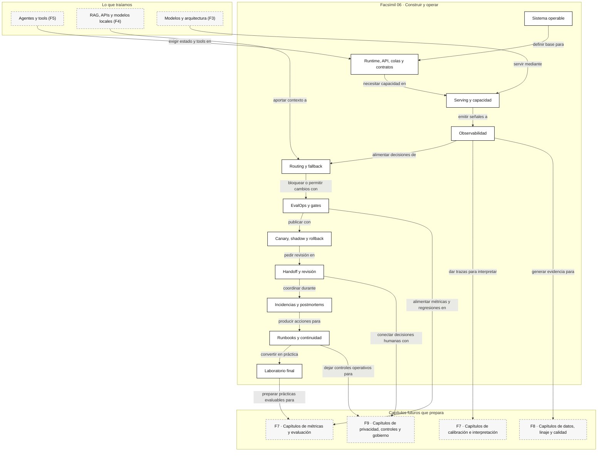

::: {.fasciculo-subtitle}
Facsímil 6 · Construir y operar
:::

# Capítulo 10: Runbooks, continuidad y laboratorio de operación

## Qué deberías poder hacer al terminar

Este capítulo cierra el facsímil 6. Ya hemos hablado de prototipos que pasan a sistemas, runtime, colas, serving, observabilidad, routing, EvalOps, cambios progresivos, revisión humana e incidencias. Ahora falta la pieza que separa un equipo que “sabe mucho” de un equipo que puede operar bajo presión: **runbooks, continuidad y práctica reproducible**.

Al terminar, deberías poder hacer esto:

| Resultado de aprendizaje | Evidencia de que lo sabes hacer |
|---|---|
| Escribir un runbook operable. | Incluyes señales, consultas, decisión, comando, rollback, verificación y criterio de salida. |
| Definir continuidad. | Separas RTO, RPO, modo degradado, recuperación y pérdida aceptable de estado. |
| Revisar readiness. | Compruebas si SLO, observabilidad, EvalOps, rollback, handoff e incidencia están listos. |
| Diseñar un ensayo operativo. | Practicas una degradación controlada sin improvisar datos ni decisiones. |
| Crear un kit reutilizable. | Dejas archivos, comandos, salidas esperadas y criterios de aceptación. |
| Cerrar el facsímil con práctica real. | Resuelves dos retos que juntan todo lo visto en construcción y operación. |

La idea central: **un sistema de IA no está listo cuando responde; está listo cuando alguien puede recuperarlo, explicarlo, medirlo y mejorarlo**.

## El cierre que convierte capítulos en operación

Imagina que mañana publicas un asistente RAG para soporte. Tiene tests, trazas, canary y un panel de coste. Parece suficiente. Pero llega una mañana mala: el proveedor principal degrada latencia, el índice nuevo trae documentos equivocados, la cola de revisión crece y una release candidata empezó a circular por una parte del tráfico.

La pregunta no es “¿quién sabe de esto?”. La pregunta operativa es:

> ¿Dónde está escrito qué mirar, qué cambiar, quién decide, cómo se vuelve a estado conocido y cómo sabemos que hemos recuperado?

Esa respuesta vive en runbooks. No como documento muerto, sino como contrato práctico entre ingeniería, producto, soporte y operación.

## Qué no es un runbook

Un runbook no es una colección de notas sueltas. Tampoco es un tutorial para leer tranquilamente. Y desde luego no es una página que diga “mirar dashboard” o “reiniciar servicio” sin explicar cuándo, por qué y cómo comprobar el resultado.

Un runbook pobre suele tener tres síntomas:

| Síntoma | Qué ocurre en producción |
|---|---|
| Dice qué hacer, pero no cuándo. | Dos personas ejecutan acciones distintas ante el mismo síntoma. |
| Tiene comandos sin verificación. | Nadie sabe si el cambio arregló algo o solo cambió la gráfica. |
| No versiona contexto. | No se sabe qué modelo, prompt, índice, router o contrato estaba activo. |
| No define dueño. | La decisión se queda flotando en un canal. |
| No tiene criterio de salida. | La operación parece cerrada antes de recuperar SLO, contrato y evidencia. |

Un runbook útil no quita pensamiento. Quita ruido. Deja espacio mental para lo difícil: interpretar señales, elegir mitigación y aprender.

## Qué sí es un runbook operativo

Para este libro, un runbook operativo es:

> Un procedimiento versionado que convierte una situación reconocible en señales, decisiones, acciones, verificación y aprendizaje.

**Ejemplo de fórmula.** Podemos representarlo así:

$$
RB = (S, Q, D, A, V, E, C)
$$

| Símbolo | Significado | Ejemplo |
|---|---|---|
| \(S\) | Señales de entrada. | Latencia p95, fallos de contrato, coste p95, cola, feedback. |
| \(Q\) | Consultas preparadas. | PromQL, SQL, enlace a trazas, panel de canary. |
| \(D\) | Decisión que debe tomarse. | Rollback, fallback, modo degradado, pausa de canary. |
| \(A\) | Acciones concretas. | Comando, cambio de flag, ruta alternativa, handoff. |
| \(V\) | Verificación. | SLO recuperado, contrato válido, coste normal, traza completa. |
| \(E\) | Evidencia que se preserva. | `trace_id`, `release_id`, `model_id`, `prompt_version`, `index_version`. |
| \(C\) | Criterio de cierre. | Condiciones para dar por recuperada la capacidad. |

Si falta \(Q\), la persona buscará a mano. Si falta \(V\), ejecutará sin saber si ayudó. Si falta \(C\), cerrará por cansancio, no por evidencia.

## Fecha de corte del estado del arte

**Fecha de corte:** 28 de mayo de 2026.  
**Fuentes consultadas:** capítulos de Google SRE sobre monitorización, respuesta de emergencia, gestión de incidencias, postmortems y sobrecarga; SRE Workbook sobre alerting basado en SLOs; AWS Builders Library sobre timeouts, retries y backoff; OpenTelemetry sobre trazas, logs y métricas; NIST AI RMF; y trabajos de ingeniería de ML.

Google SRE insiste en que las alertas que interrumpen a personas deben ser accionables, relevantes para el usuario y fáciles de interpretar.^[Ewaschuk, R. (2016). *Monitoring Distributed Systems*. En B. Beyer, C. Jones, J. Petoff y N. R. Murphy (eds.), *Site Reliability Engineering*. https://sre.google/sre-book/monitoring-distributed-systems/. Consultado el 27 de mayo de 2026.] El SRE Workbook recomienda alertar usando consumo de presupuesto de error para conectar síntomas con SLOs, en vez de reaccionar a umbrales aislados.^[Wilkinson, J. (2018). *Alerting on SLOs*. En B. Beyer, N. R. Murphy, D. Rensin, K. Kawahara y S. Thorne (eds.), *The Site Reliability Workbook*. https://sre.google/workbook/alerting-on-slos/. Consultado el 27 de mayo de 2026.]

La preparación también forma parte del sistema. Google SRE trata la respuesta de emergencia como una habilidad que se entrena antes de necesitarla.^[Baye, C. A. (2016). *Emergency Response*. En *Site Reliability Engineering*. https://sre.google/sre-book/emergency-response/. Consultado el 28 de mayo de 2026.] En gestión de incidencias separa roles para coordinar decisiones, trabajo operativo, comunicación y planificación.^[Stribblehill, A. (2016). *Managing Incidents*. En *Site Reliability Engineering*. https://sre.google/sre-book/managing-incidents/. Consultado el 28 de mayo de 2026.] Después, los postmortems deben convertir lo ocurrido en acciones verificables y aprendizaje del sistema.^[Lunney, J. y Lueder, S. (2016). *Postmortem Culture: Learning from Failure*. En *Site Reliability Engineering*. https://sre.google/sre-book/postmortem-culture/. Consultado el 28 de mayo de 2026.]

Lo estable no es la herramienta concreta de guardia, CI, dashboard o proveedor. Lo estable es el circuito: observar, decidir, actuar, verificar, documentar, practicar y mejorar.

## Continuidad: RTO, RPO y modo degradado

Continuidad no significa que nada falle. Significa que el sistema tiene caminos pensados para seguir prestando lo esencial cuando una parte se degrada.

Dos siglas son importantes:

| Sigla | Qué mide | Ejemplo en IA |
|---|---|---|
| RTO | Tiempo objetivo para recuperar una capacidad. | “El asistente de soporte debe volver a responder en menos de 30 minutos”. |
| RPO | Pérdida máxima aceptable de estado o datos medida como tiempo. | “Podemos perder como máximo 10 minutos de cola o memoria operativa”. |

Si \(t_{recuperacion}\) es el tiempo real hasta recuperar y \(RTO\) el objetivo:

$$
t_{recuperacion} \le RTO
$$

| Símbolo | Significado | Ejemplo |
|---|---|---|
| \(t_{recuperacion}\) | Minutos desde inicio hasta capacidad recuperada. | 24 minutos. |
| \(RTO\) | Máximo aceptable acordado. | 30 minutos. |

Si el sistema recibe \(\lambda\) trabajos por minuto y queda degradado \(W\) minutos, el backlog esperado se aproxima como:

$$
L = \lambda W
$$

| Símbolo | Significado | Ejemplo |
|---|---|---|
| \(L\) | Trabajos acumulados. | 180 solicitudes. |
| \(\lambda\) | Llegadas por minuto. | 6 solicitudes/minuto. |
| \(W\) | Minutos degradado. | 30 minutos. |

Esta es una forma directa de usar la ley de Little para operación.^[Little, J. D. C. (1961). A proof for the queuing formula: L = λW. *Operations Research*, 9(3), 383-387. https://doi.org/10.1287/opre.9.3.383] Si la cola crece, no basta con desear que baje: o reducimos entrada, o subimos capacidad, o aceptamos más espera.

## Runbooks por capas

Un sistema de IA se opera por capas. El runbook debe ayudar a distinguirlas:

| Capa | Pregunta | Señales | Acción típica |
|---|---|---|---|
| Producto | ¿El usuario completa la tarea? | Conversión, aceptación, tickets, abandono. | Modo degradado, estado claro, revisión. |
| Contrato | ¿La salida sigue siendo compatible? | JSON inválido, campos ausentes, enum fuera de catálogo. | Schema anterior, validador estricto, rollback de prompt. |
| Modelo | ¿Cambió calidad, latencia o coste? | `model_id`, p95, coste, flake rate, errores. | Cambiar ruta, reducir esfuerzo, fallback. |
| RAG | ¿El contexto recuperado sirve? | `index_version`, chunks, citas, recall manual. | Volver índice, bajar `top_k`, pausar reranker. |
| Runtime | ¿El sistema procesa bien? | Queue depth, timeouts, goodput, workers. | Rate limit, escalar, reducir contexto. |
| Handoff | ¿La revisión avanza? | Backlog, aging, SLA, owner. | Priorizar, reasignar, limitar entrada. |
| EvalOps | ¿La release es defendible? | Scorecard, regresiones, canary, gates. | Bloquear, revertir, añadir caso. |
| Observabilidad | ¿Podemos reconstruir? | Trazas, logs, métricas, atributos. | Subir sampling, añadir atributos obligatorios. |

OpenTelemetry separa señales como trazas, logs y métricas para reconstruir comportamiento desde ángulos distintos.^[OpenTelemetry. (2026). *Traces*. https://opentelemetry.io/docs/concepts/signals/traces/. Consultado el 27 de mayo de 2026.]^[OpenTelemetry. (2026). *Logs*. https://opentelemetry.io/docs/concepts/signals/logs/. Consultado el 27 de mayo de 2026.]^[OpenTelemetry. (2026). *Metrics*. https://opentelemetry.io/docs/concepts/signals/metrics/. Consultado el 27 de mayo de 2026.] En IA, esas señales deben llevar atributos como `task`, `model_id`, `prompt_version`, `route_id`, `release_id`, `trace_id` e `index_version`.

## Readiness: la pregunta antes de publicar

Una revisión de readiness responde una pregunta incómoda:

> Si esto falla hoy a las 03:17, ¿tenemos lo necesario para entenderlo, limitarlo y recuperarlo?

**Ejemplo de fórmula.** Podemos convertir esa pregunta en una puntuación:

$$
R = \frac{\sum_{i=1}^{n} w_i c_i}{\sum_{i=1}^{n} w_i}
$$

| Símbolo | Significado | Ejemplo |
|---|---|---|
| \(R\) | Puntuación de readiness entre 0 y 1. | 0,84. |
| \(w_i\) | Peso de la comprobación \(i\). | 2 para rollback, 1 para documentación auxiliar. |
| \(c_i\) | Resultado de la comprobación: 1 si pasa, 0 si falta. | `trace_id` presente: 1. |
| \(n\) | Número de comprobaciones. | 26. |

Una puntuación alta no garantiza que nada vaya mal. Indica algo más modesto y más útil: que el sistema tiene piezas para operar con método.

| Banda | Decisión |
|---|---|
| \(R \ge 0{,}90\) | Listo para operar con seguimiento normal. |
| \(0{,}75 \le R < 0{,}90\) | Puede avanzar con condiciones escritas. |
| \(R < 0{,}75\) | No publicaría sin corregir huecos. |

El NIST AI RMF propone gestionar riesgos de IA mediante funciones como gobernar, mapear, medir y gestionar.^[Tabassi, E. (2023). *Artificial Intelligence Risk Management Framework (AI RMF 1.0)*. National Institute of Standards and Technology, NIST AI 100-1. https://doi.org/10.6028/NIST.AI.100-1.] En este capítulo lo llevamos a ingeniería: no basta reconocer riesgos; hay que convertirlos en checks, runbooks, gates y evidencias.

## Anatomía visual del cierre operativo

<svg id="f6-c10-operational-readiness" xmlns="http://www.w3.org/2000/svg" viewBox="0 0 1840 1320" role="img" aria-label="Arquitectura de readiness operativo para un sistema de IA con runbooks, continuidad, evidencias, recuperación y laboratorio">
  <defs>
    <style>
      #f6-c10-operational-readiness{background:#fff;color:#111;font-family:Inter,ui-sans-serif,system-ui,-apple-system,BlinkMacSystemFont,"Segoe UI",sans-serif}
      #f6-c10-operational-readiness .title{font-size:38px;font-weight:800;fill:#111}
      #f6-c10-operational-readiness .subtitle{font-size:17px;fill:#444}
      #f6-c10-operational-readiness .h{font-size:18px;font-weight:800;fill:#111}
      #f6-c10-operational-readiness .hw{font-size:18px;font-weight:800;fill:#fff}
      #f6-c10-operational-readiness .txt{font-size:13px;fill:#222}
      #f6-c10-operational-readiness .tiny{font-size:11px;fill:#555}
      #f6-c10-operational-readiness .micro{font-size:10px;fill:#666}
      #f6-c10-operational-readiness .frame{fill:#fff;stroke:#111;stroke-width:2}
      #f6-c10-operational-readiness .panel{fill:#fff;stroke:#111;stroke-width:1.5}
      #f6-c10-operational-readiness .soft{fill:#f6f6f6;stroke:#111;stroke-width:1.2}
      #f6-c10-operational-readiness .dark{fill:#111;stroke:#111;stroke-width:1.3}
      #f6-c10-operational-readiness .line{stroke:#111;stroke-width:2;fill:none}
      #f6-c10-operational-readiness .dash{stroke:#555;stroke-width:1.5;fill:none;stroke-dasharray:8 7}
      #f6-c10-operational-readiness .thin{stroke:#555;stroke-width:1.1;fill:none}
    </style>
    <marker id="f6c10-arrow" viewBox="0 0 10 10" refX="9" refY="5" markerWidth="8" markerHeight="8" orient="auto-start-reverse">
      <path d="M 0 0 L 10 5 L 0 10 z" fill="#111"/>
    </marker>
  </defs>

  <rect x="42" y="36" width="1756" height="1248" rx="24" class="frame"/>
  <text x="920" y="92" text-anchor="middle" class="title">Readiness operativo de un sistema de IA</text>
  <text x="920" y="124" text-anchor="middle" class="subtitle">No preguntamos si responde: preguntamos si se puede operar, recuperar y defender.</text>

  <rect x="92" y="176" width="300" height="170" rx="16" class="dark"/>
  <text x="242" y="212" text-anchor="middle" class="hw">Servicio IA</text>
  <text x="242" y="242" text-anchor="middle" class="tiny" fill="#eee">prompt · modelo · RAG</text>
  <text x="242" y="266" text-anchor="middle" class="tiny" fill="#eee">router · tools · runtime</text>
  <text x="242" y="290" text-anchor="middle" class="tiny" fill="#eee">colas · handoff · evals</text>

  <rect x="466" y="154" width="392" height="214" rx="18" class="panel"/>
  <text x="662" y="190" text-anchor="middle" class="h">Readiness review</text>
  <text x="662" y="218" text-anchor="middle" class="txt">checklist ponderada antes de operar</text>
  <rect x="510" y="250" width="132" height="36" rx="8" class="soft"/>
  <text x="576" y="273" text-anchor="middle" class="tiny">SLO</text>
  <rect x="686" y="250" width="132" height="36" rx="8" class="soft"/>
  <text x="752" y="273" text-anchor="middle" class="tiny">trazas</text>
  <rect x="510" y="304" width="132" height="36" rx="8" class="soft"/>
  <text x="576" y="327" text-anchor="middle" class="tiny">rollback</text>
  <rect x="686" y="304" width="132" height="36" rx="8" class="soft"/>
  <text x="752" y="327" text-anchor="middle" class="tiny">EvalOps</text>

  <rect x="932" y="154" width="392" height="214" rx="18" class="panel"/>
  <text x="1128" y="190" text-anchor="middle" class="h">Runbooks</text>
  <text x="1128" y="218" text-anchor="middle" class="txt">procedimientos que ejecutan decisiones</text>
  <text x="986" y="258" class="txt">1 · síntoma y severidad</text>
  <text x="986" y="288" class="txt">2 · consulta preparada</text>
  <text x="986" y="318" class="txt">3 · acción reversible</text>
  <text x="986" y="348" class="txt">4 · verificación y cierre</text>

  <rect x="1398" y="176" width="300" height="170" rx="16" class="dark"/>
  <text x="1548" y="212" text-anchor="middle" class="hw">Continuidad</text>
  <text x="1548" y="242" text-anchor="middle" class="tiny" fill="#eee">RTO · RPO</text>
  <text x="1548" y="266" text-anchor="middle" class="tiny" fill="#eee">fallback · modo degradado</text>
  <text x="1548" y="290" text-anchor="middle" class="tiny" fill="#eee">recuperación verificada</text>

  <line x1="392" y1="260" x2="466" y2="260" class="line" marker-end="url(#f6c10-arrow)"/>
  <line x1="858" y1="260" x2="932" y2="260" class="line" marker-end="url(#f6c10-arrow)"/>
  <line x1="1324" y1="260" x2="1398" y2="260" class="line" marker-end="url(#f6c10-arrow)"/>

  <rect x="92" y="450" width="390" height="250" rx="18" class="panel"/>
  <text x="287" y="486" text-anchor="middle" class="h">Señales mínimas</text>
  <line x1="132" y1="518" x2="442" y2="518" class="thin"/>
  <text x="136" y="552" class="txt">latency_p95 · contract_fail_rate</text>
  <text x="136" y="584" class="txt">cost_p95 · queue_age · burn_rate</text>
  <text x="136" y="616" class="txt">trace_completeness · route_mix</text>
  <text x="136" y="648" class="txt">review_backlog · eval_regressions</text>

  <rect x="538" y="450" width="390" height="250" rx="18" class="panel"/>
  <text x="733" y="486" text-anchor="middle" class="h">Evidencia versionada</text>
  <line x1="578" y1="518" x2="888" y2="518" class="thin"/>
  <text x="582" y="552" class="txt">release_id · model_id</text>
  <text x="582" y="584" class="txt">prompt_version · index_version</text>
  <text x="582" y="616" class="txt">route_catalog · policy_version</text>
  <text x="582" y="648" class="txt">scorecard · postmortem · replay</text>

  <rect x="984" y="450" width="390" height="250" rx="18" class="panel"/>
  <text x="1179" y="486" text-anchor="middle" class="h">Acciones preparadas</text>
  <line x1="1024" y1="518" x2="1334" y2="518" class="thin"/>
  <text x="1028" y="552" class="txt">rollback de prompt, modelo o índice</text>
  <text x="1028" y="584" class="txt">fallback de proveedor o ruta local</text>
  <text x="1028" y="616" class="txt">rate limit · queue only critical</text>
  <text x="1028" y="648" class="txt">handoff · comunicación · seguimiento</text>

  <rect x="1430" y="450" width="300" height="250" rx="18" class="panel"/>
  <text x="1580" y="486" text-anchor="middle" class="h">Criterios</text>
  <line x1="1470" y1="518" x2="1690" y2="518" class="thin"/>
  <text x="1474" y="552" class="txt">entrada</text>
  <text x="1474" y="584" class="txt">salida</text>
  <text x="1474" y="616" class="txt">escalado</text>
  <text x="1474" y="648" class="txt">aprendizaje</text>

  <line x1="482" y1="575" x2="538" y2="575" class="line" marker-end="url(#f6c10-arrow)"/>
  <line x1="928" y1="575" x2="984" y2="575" class="line" marker-end="url(#f6c10-arrow)"/>
  <line x1="1374" y1="575" x2="1430" y2="575" class="line" marker-end="url(#f6c10-arrow)"/>

  <rect x="132" y="790" width="460" height="220" rx="18" class="soft"/>
  <text x="362" y="826" text-anchor="middle" class="h">Ensayo operativo</text>
  <text x="180" y="868" class="txt">se simula degradación controlada</text>
  <text x="180" y="900" class="txt">se mide tiempo de decisión</text>
  <text x="180" y="932" class="txt">se verifica rollback y fallback</text>
  <text x="180" y="964" class="txt">se actualiza runbook y dataset</text>

  <rect x="690" y="790" width="460" height="220" rx="18" class="soft"/>
  <text x="920" y="826" text-anchor="middle" class="h">Laboratorio</text>
  <text x="738" y="868" class="txt">reto 1: readiness de un servicio</text>
  <text x="738" y="900" class="txt">reto 2: continuidad con varias capas</text>
  <text x="738" y="932" class="txt">respuesta paso a paso</text>
  <text x="738" y="964" class="txt">entregable defendible</text>

  <rect x="1248" y="790" width="460" height="220" rx="18" class="soft"/>
  <text x="1478" y="826" text-anchor="middle" class="h">Mejora continua</text>
  <text x="1296" y="868" class="txt">acción con owner y fecha</text>
  <text x="1296" y="900" class="txt">caso nuevo de regresión</text>
  <text x="1296" y="932" class="txt">scorecard actualizada</text>
  <text x="1296" y="964" class="txt">nuevo ensayo programado</text>

  <path d="M1128 368 C1128 394, 733 410, 733 450" class="dash" marker-end="url(#f6c10-arrow)"/>
  <path d="M1548 346 C1548 396, 1580 410, 1580 450" class="dash" marker-end="url(#f6c10-arrow)"/>
  <path d="M287 700 C280 744, 330 760, 362 790" class="dash" marker-end="url(#f6c10-arrow)"/>
  <path d="M920 700 C920 744, 920 760, 920 790" class="dash" marker-end="url(#f6c10-arrow)"/>
  <path d="M1580 700 C1580 744, 1510 760, 1478 790" class="dash" marker-end="url(#f6c10-arrow)"/>

  <rect x="204" y="1118" width="1432" height="62" rx="16" class="dark"/>
  <text x="920" y="1144" text-anchor="middle" class="hw">Criterio final</text>
  <text x="920" y="1168" text-anchor="middle" class="tiny" fill="#eee">si no puedes practicar la recuperación, todavía no has terminado de construir el sistema.</text>
  <text x="1690" y="1248" text-anchor="end" class="micro" fill="#888888" opacity="0.45">IA para gente curiosa / Facsímil 06 / Capítulo 10 / 686f6c61</text>
</svg>

## Ensayos operativos: practicar antes de necesitarlo

Un ensayo operativo es una prueba controlada. No buscamos “romper cosas”; buscamos comprobar si el equipo sabe operar una situación concreta.

Ejemplos de ensayos útiles:

| Ensayo | Qué se practica | Criterio de éxito |
|---|---|---|
| Proveedor lento | Fallback, routing, timeouts y comunicación. | p95 vuelve a SLO y coste no se dispara. |
| Índice RAG equivocado | Rollback de índice y replay. | Recuperas fuentes correctas y generas regresión. |
| Fallo de contrato JSON | Validador, schema anterior y gate. | La salida vuelve a ser parseable. |
| Cola de revisión llena | Priorización, modo degradado y SLA. | Casos críticos no caducan. |
| Canary con peor calidad | Gate online y rollback. | Se corta candidate sin afectar todo el tráfico. |
| Trazas incompletas | Sampling temporal y atributos obligatorios. | Puedes reconstruir runs relevantes. |

La AWS Builders Library recomienda tratar timeouts, retries y backoff como diseño explícito porque los reintentos pueden amplificar carga si se usan sin cuidado.^[Amazon Web Services. (2026). *Timeouts, Retries, and Backoff with Jitter*. AWS Builders Library. https://aws.amazon.com/builders-library/timeouts-retries-and-backoff-with-jitter/. Consultado el 27 de mayo de 2026.] En IA esto se nota enseguida: un retry sobre una ruta cara, una tool lenta o un contexto largo puede convertir una degradación pequeña en coste y cola.

## Qué te llevas para poner en práctica

Este capítulo deja un kit que un alumno puede llevar a un repositorio real:

| Archivo | Para qué sirve |
|---|---|
| `ops/ai/readiness_manifest.json` | Describe SLO, observabilidad, rollback, EvalOps, incidencia, continuidad y handoff. |
| `ops/ai/operational_readiness.py` | Verifica si el servicio tiene piezas mínimas para operar. |
| `ops/ai/runbook_ai_service.md` | Procedimiento para síntomas habituales. |
| `ops/ai/continuity_drill.md` | Guion de ensayo operativo. |
| `ops/ai/slo_policy.yaml` | SLI, SLO, presupuesto y criterios de alerta. |
| `ops/ai/rollback_plan.md` | Cómo volver a una versión conocida. |
| `ops/ai/oncall_handoff.md` | Cómo transferir guardia o responsabilidad. |
| `evals/regression_cases.jsonl` | Casos que protegen aprendizajes. |
| `.github/workflows/ai-readiness.yml` | Gate automático que bloquea si el servicio no está listo. |
| `output/operational_readiness.json` | Resultado verificable del check. |

La ingeniería de ML no termina en entrenar o invocar modelos. Amershi y colaboradores muestran que los sistemas de ML obligan a coordinar datos, código, configuración, evaluación y operación de forma continua.^[Amershi, S. et al. (2019). *Software Engineering for Machine Learning: A Case Study*. *International Conference on Software Engineering: Software Engineering in Practice*, 291-300. https://doi.org/10.1109/ICSE-SEIP.2019.00042.] Este kit existe para eso: que el conocimiento del facsímil se convierta en archivos.

## Reto de capítulo: comprobar readiness

**Escenario:** vas a publicar `support-rag@2.0.0`. Antes de avanzar, debes comprobar si el servicio tiene los mínimos para operar una incidencia o una degradación.

Estructura:

```text
mi-proyecto/
  ops/
    ai/
      operational_readiness.py
      readiness_manifest.json
  output/
    operational_readiness.json
```

Comandos:

```bash
mkdir -p ops/ai output
python ops/ai/operational_readiness.py --write
cat output/operational_readiness.json
```

Salida esperada con el manifiesto completo:

```json
{
  "service": "support-rag",
  "release": "support-rag@2.0.0",
  "score": 1.0,
  "gate": "ready",
  "passed_weight": 39,
  "total_weight": 39,
  "section_scores": {
    "identity": 1.0,
    "slo": 1.0,
    "observability": 1.0,
    "rollback": 1.0,
    "evalops": 1.0,
    "incident": 1.0,
    "continuity": 1.0,
    "handoff": 1.0
  },
  "missing": [],
  "next_actions": [
    "programar un ensayo operativo mensual",
    "ejecutar el gate de release antes del siguiente canary",
    "revisar runbook tras la próxima incidencia cerrada"
  ]
}
```

## Manos a la obra

**Práctica:** construir el verificador.

Laboratorio ejecutable de este capítulo: `labs/f6/laboratorio-operacion/`.

```bash
cd labs/f6/laboratorio-operacion
python3 ops/operational_readiness.py \
  --manifest contracts/readiness_manifest_complete.json \
  --output output/complete/operational_readiness.json \
  --decision-output output/complete/readiness_decision.md \
  --write
```

Guarda este script como `ops/ai/operational_readiness.py`.

```python
from __future__ import annotations

import argparse
import json
import sys
from pathlib import Path
from typing import Any, Callable


DEFAULT_MANIFEST: dict[str, Any] = {
    "service": "support-rag",
    "release": "support-rag@2.0.0",
    "owner": "ai-platform",
    "slo": {
        "latency_p95_ms": 4200,
        "availability": 0.995,
        "contract_fail_rate_max": 0.006,
        "cost_p95_eur": 0.025
    },
    "observability": {
        "required_attributes": [
            "trace_id",
            "run_id",
            "task",
            "model_id",
            "prompt_version",
            "route_id",
            "release_id",
            "index_version"
        ],
        "dashboards": ["runtime", "quality", "cost"],
        "alerts": ["slo_burn_rate", "contract_fail_rate", "queue_age"]
    },
    "rollback": {
        "last_known_good": "support-rag@1.9.3",
        "rollback_command": "make rollback SERVICE=support-rag VERSION=support-rag@1.9.3",
        "tested_at": "2026-05-28T09:00:00Z"
    },
    "evalops": {
        "datasets": ["golden", "regression", "incident"],
        "release_gate": "ops/ai/release_gate.py",
        "min_quality_delta": -0.01
    },
    "incident": {
        "runbook": "ops/ai/runbook_ai_service.md",
        "severity_matrix": "ops/ai/severity_matrix.yaml",
        "oncall": "ai-platform-oncall"
    },
    "continuity": {
        "rto_minutes": 30,
        "rpo_minutes": 10,
        "fallback_routes": ["provider_b", "local_small_model"],
        "manual_mode": "review_queue_only"
    },
    "handoff": {
        "queues": ["support_n2", "ai_platform"],
        "approval_card": "ops/ai/approval_card.json"
    }
}


def get_path(document: dict[str, Any], dotted_path: str) -> Any:
    current: Any = document
    for part in dotted_path.split("."):
        if not isinstance(current, dict) or part not in current:
            return None
        current = current[part]
    return current


def is_positive_number(value: Any) -> bool:
    return isinstance(value, (int, float)) and value > 0


def has_items(*items: str) -> Callable[[Any], bool]:
    expected = set(items)

    def check(value: Any) -> bool:
        return isinstance(value, list) and expected.issubset(set(value))

    return check


def has_at_least(count: int) -> Callable[[Any], bool]:
    def check(value: Any) -> bool:
        return isinstance(value, list) and len(value) >= count

    return check


def non_empty(value: Any) -> bool:
    return bool(value)


def max_number(limit: float) -> Callable[[Any], bool]:
    def check(value: Any) -> bool:
        return is_positive_number(value) and value <= limit

    return check


CHECKS: list[dict[str, Any]] = [
    {"path": "service", "weight": 1, "label": "nombre del servicio", "check": non_empty},
    {"path": "release", "weight": 1, "label": "release versionada", "check": non_empty},
    {"path": "owner", "weight": 1, "label": "owner operativo", "check": non_empty},
    {"path": "slo.latency_p95_ms", "weight": 2, "label": "SLO de latencia p95", "check": is_positive_number},
    {"path": "slo.availability", "weight": 2, "label": "SLO de disponibilidad", "check": is_positive_number},
    {"path": "slo.contract_fail_rate_max", "weight": 2, "label": "SLO de contrato", "check": is_positive_number},
    {"path": "slo.cost_p95_eur", "weight": 1, "label": "presupuesto de coste p95", "check": is_positive_number},
    {
        "path": "observability.required_attributes",
        "weight": 3,
        "label": "atributos de traza obligatorios",
        "check": has_items("trace_id", "run_id", "model_id", "prompt_version", "release_id")
    },
    {"path": "observability.dashboards", "weight": 1, "label": "dashboards mínimos", "check": has_at_least(2)},
    {"path": "observability.alerts", "weight": 2, "label": "alertas accionables", "check": has_at_least(3)},
    {"path": "rollback.last_known_good", "weight": 2, "label": "última versión buena", "check": non_empty},
    {"path": "rollback.rollback_command", "weight": 2, "label": "comando de rollback", "check": non_empty},
    {"path": "rollback.tested_at", "weight": 1, "label": "rollback probado", "check": non_empty},
    {"path": "evalops.datasets", "weight": 3, "label": "datasets golden/regression/incident", "check": has_items("golden", "regression", "incident")},
    {"path": "evalops.release_gate", "weight": 2, "label": "gate de release", "check": non_empty},
    {"path": "incident.runbook", "weight": 2, "label": "runbook de incidencia", "check": non_empty},
    {"path": "incident.severity_matrix", "weight": 1, "label": "matriz de severidad", "check": non_empty},
    {"path": "incident.oncall", "weight": 1, "label": "guardia u owner de respuesta", "check": non_empty},
    {"path": "continuity.rto_minutes", "weight": 2, "label": "RTO definido", "check": max_number(60)},
    {"path": "continuity.rpo_minutes", "weight": 2, "label": "RPO definido", "check": max_number(15)},
    {"path": "continuity.fallback_routes", "weight": 2, "label": "rutas de fallback", "check": has_at_least(1)},
    {"path": "continuity.manual_mode", "weight": 1, "label": "modo manual o degradado", "check": non_empty},
    {"path": "handoff.queues", "weight": 1, "label": "colas de revisión", "check": has_at_least(1)},
    {"path": "handoff.approval_card", "weight": 1, "label": "tarjeta de aprobación", "check": non_empty}
]


def load_manifest(path: Path) -> dict[str, Any]:
    if not path.exists():
        return DEFAULT_MANIFEST
    return json.loads(path.read_text(encoding="utf-8"))


def evaluate(manifest: dict[str, Any]) -> dict[str, Any]:
    missing: list[dict[str, Any]] = []
    passed_weight = 0
    total_weight = 0
    sections: dict[str, dict[str, int]] = {}

    for item in CHECKS:
        value = get_path(manifest, item["path"])
        weight = int(item["weight"])
        first_key = str(item["path"]).split(".")[0]
        section = "identity" if first_key in {"service", "release", "owner"} else first_key
        sections.setdefault(section, {"passed_weight": 0, "total_weight": 0})
        sections[section]["total_weight"] += weight
        total_weight += weight
        if item["check"](value):
            passed_weight += weight
            sections[section]["passed_weight"] += weight
        else:
            missing.append({
                "path": item["path"],
                "label": item["label"],
                "weight": weight
            })

    score = round(passed_weight / total_weight, 4) if total_weight else 0.0
    if score >= 0.90:
        gate = "ready"
    elif score >= 0.75:
        gate = "ready_with_conditions"
    else:
        gate = "not_ready"

    section_scores = {
        section: round(values["passed_weight"] / values["total_weight"], 4)
        for section, values in sections.items()
        if values["total_weight"] > 0
    }

    next_actions = [f"corregir: {item['label']} ({item['path']})" for item in missing[:5]]
    if not next_actions:
        next_actions = [
            "programar un ensayo operativo mensual",
            "ejecutar el gate de release antes del siguiente canary",
            "revisar runbook tras la próxima incidencia cerrada"
        ]

    return {
        "service": manifest.get("service"),
        "release": manifest.get("release"),
        "score": score,
        "gate": gate,
        "passed_weight": passed_weight,
        "total_weight": total_weight,
        "section_scores": section_scores,
        "missing": missing,
        "next_actions": next_actions
    }


def write_report(report: dict[str, Any], path: Path) -> None:
    path.parent.mkdir(parents=True, exist_ok=True)
    path.write_text(json.dumps(report, ensure_ascii=False, indent=2), encoding="utf-8")


def main() -> None:
    parser = argparse.ArgumentParser()
    parser.add_argument("--manifest", default="ops/ai/readiness_manifest.json")
    parser.add_argument("--write", action="store_true")
    parser.add_argument("--output", default="output/operational_readiness.json")
    parser.add_argument("--strict", action="store_true", help="sale con código 2 si el servicio no está listo")
    args = parser.parse_args()

    manifest = load_manifest(Path(args.manifest))
    report = evaluate(manifest)
    if args.write:
        write_report(report, Path(args.output))
    print(json.dumps(report, ensure_ascii=False, indent=2))
    if args.strict and report["gate"] != "ready":
        sys.exit(2)


if __name__ == "__main__":
    main()
```

## Kit operativo: archivos mínimos

`ops/ai/readiness_manifest.json`:

```json
{
  "service": "support-rag",
  "release": "support-rag@2.0.0",
  "owner": "ai-platform",
  "slo": {
    "latency_p95_ms": 4200,
    "availability": 0.995,
    "contract_fail_rate_max": 0.006,
    "cost_p95_eur": 0.025
  },
  "observability": {
    "required_attributes": [
      "trace_id",
      "run_id",
      "task",
      "model_id",
      "prompt_version",
      "route_id",
      "release_id",
      "index_version"
    ],
    "dashboards": ["runtime", "quality", "cost"],
    "alerts": ["slo_burn_rate", "contract_fail_rate", "queue_age"]
  },
  "rollback": {
    "last_known_good": "support-rag@1.9.3",
    "rollback_command": "make rollback SERVICE=support-rag VERSION=support-rag@1.9.3",
    "tested_at": "2026-05-28T09:00:00Z"
  },
  "evalops": {
    "datasets": ["golden", "regression", "incident"],
    "release_gate": "ops/ai/release_gate.py",
    "min_quality_delta": -0.01
  },
  "incident": {
    "runbook": "ops/ai/runbook_ai_service.md",
    "severity_matrix": "ops/ai/severity_matrix.yaml",
    "oncall": "ai-platform-oncall"
  },
  "continuity": {
    "rto_minutes": 30,
    "rpo_minutes": 10,
    "fallback_routes": ["provider_b", "local_small_model"],
    "manual_mode": "review_queue_only"
  },
  "handoff": {
    "queues": ["support_n2", "ai_platform"],
    "approval_card": "ops/ai/approval_card.json"
  }
}
```

`ops/ai/runbook_ai_service.md`:

```markdown
# Runbook: support-rag

## Entrada

- Síntoma:
- Severidad:
- Servicio:
- Release:
- Trace o dashboard:

## Consultas preparadas

- Latencia p95 por release.
- Fallo de contrato por release y variante.
- Coste p95 por modelo y ruta.
- Cola de revisión por edad y prioridad.
- Trazas con `model_id`, `prompt_version`, `index_version` y `route_id`.

## Decisión

| Síntoma | Acción |
|---|---|
| JSON inválido | volver schema/prompt anterior |
| Latencia p95 fuera de SLO | cambiar ruta, reducir contexto o limitar entrada |
| Índice con fuentes pobres | volver índice anterior |
| Cola de revisión saturada | modo degradado y prioridad crítica |
| Coste p95 fuera de presupuesto | ruta barata, cache o límite de tokens |

## Verificación

- SLO recuperado durante 30 minutos.
- Contrato válido por encima del umbral.
- Coste p95 bajo presupuesto.
- Trazas completas para runs muestreadas.
- Acción correctiva creada si procede.

## Criterio de cierre

La operación se cierra cuando el servicio vuelve a SLO, la evidencia queda preservada y hay owner para las acciones pendientes.
```

`ops/ai/continuity_drill.md`:

```markdown
# Ensayo operativo: degradación de soporte RAG

## Objetivo

Practicar recuperación ante latencia alta, índice RAG incorrecto y cola de revisión creciendo.

## Duración

45 minutos.

## Roles

- Coordinación:
- Operación:
- Observabilidad:
- EvalOps:
- Comunicación:

## Inyección controlada

1. Subir latencia artificial en ruta `provider_a`.
2. Cambiar `index_version` a un índice candidato.
3. Aumentar backlog de revisión con 20 casos no críticos.

## Decisiones esperadas

1. Fallback a `provider_b`.
2. Rollback de índice si las citas caen.
3. Modo `review_queue_only` para casos no críticos.
4. Caso nuevo en `evals/regression_cases.jsonl`.

## Evidencia

- Dashboard de latencia.
- Traces de tres runs.
- Scorecard de EvalOps.
- Registro de decisiones.

## Cierre

El ensayo termina cuando se recupera SLO, se documentan huecos y se abren acciones con owner.
```

Qué entregaría un alumno:

| Entregable | Criterio de aceptación |
|---|---|
| `readiness_manifest.json` | Describe servicio, owner, SLO, observabilidad, rollback, EvalOps, incidencia y continuidad. |
| `operational_readiness.py` | Ejecuta sin dependencias externas y produce una decisión. |
| `operational_readiness.json` | Incluye score, gate, faltantes y siguientes acciones. |
| `runbook_ai_service.md` | Permite operar síntomas concretos sin inventar el procedimiento. |
| `continuity_drill.md` | Practica una degradación con roles, señales y cierre. |
| `evals/regression_cases.jsonl` | Añade al menos un caso nacido de una incidencia o ensayo. |

Para que esto sea práctica de ingeniería y no solo documentación, el check debe poder vivir en CI. GitHub Actions define workflows declarativos con jobs y pasos ejecutables.^[GitHub. (2026). *Workflow Syntax for GitHub Actions*. https://docs.github.com/en/actions/reference/workflows-and-actions/workflow-syntax. Consultado el 28 de mayo de 2026.] Un ejemplo mínimo:

```yaml
name: ai-readiness

on:
  pull_request:
    paths:
      - "ops/ai/**"
      - "prompts/**"
      - "rag/**"
      - "evals/**"
  workflow_dispatch:

jobs:
  readiness:
    runs-on: ubuntu-latest
    timeout-minutes: 5
    steps:
      - uses: actions/checkout@v4
      - uses: actions/setup-python@v5
        with:
          python-version: "3.12"
      - name: Check operational readiness
        run: |
          python ops/ai/operational_readiness.py \
            --manifest ops/ai/readiness_manifest.json \
            --write \
            --strict
      - name: Show readiness report
        if: always()
        run: cat output/operational_readiness.json
```

El detalle importante es `--strict`: si el servicio queda en `not_ready` o `ready_with_conditions`, el job sale con código distinto de cero. Eso obliga a decidir en la pull request si se corrige el hueco, se documenta una excepción temporal o se retrasa la publicación.

## Qué faltaría si lo revisa un equipo de ingeniería

La primera versión del capítulo ya tenía runbooks, continuidad, script y laboratorio. Para subirlo de nivel, añadiría estas piezas, porque son las que un equipo técnico suele echar de menos cuando intenta llevarlo a un repo real:

| Pieza | Qué añade | Cómo se comprueba |
|---|---|---|
| Gate en CI | El readiness deja de ser lectura y se convierte en control de cambio. | Una PR falla si falta rollback, SLO, trazas o continuidad. |
| Score por área | No basta saber “82%”; hay que saber si falla observabilidad, EvalOps o handoff. | `section_scores` en `operational_readiness.json`. |
| Matriz de dependencias | Explica qué ocurre si cae proveedor, índice, cola, tool o base de datos. | Tabla con dependencia, modo degradado, RTO, RPO y owner. |
| Ensayo con reloj | Mide cuánto tarda el equipo en decidir y recuperar. | Timeline con minuto de detección, decisión, mitigación y verificación. |
| Restauración de estado | No solo rollback de código: también cola, memoria, índice y configuración. | Prueba de restauración con `last_known_good` y datos mínimos. |
| Evidencia de cierre | Evita cerrar por sensación. | SLO recuperado, trazas completas, regresión creada y acción con owner. |
| Rúbrica evaluable | Hace que el laboratorio sirva para universidad o revisión interna. | Puntos por artefactos, ejecución, criterio técnico y explicación. |

Una matriz de dependencias mínima:

| Dependencia | Si se degrada | Modo degradado | RTO | RPO | Owner |
|---|---|---|---:|---:|---|
| Proveedor principal | Latencia o errores suben. | Ruta `provider_b` o modelo local pequeño. | 30 min | 0 min | `ai-platform`. |
| Índice RAG | Citas pobres o documentos antiguos. | Volver `last_good_index`. | 20 min | 10 min | `rag-team`. |
| Cola de revisión | Aging p95 supera SLO. | Solo casos críticos y respuesta de estado. | 45 min | 0 min | `support-ops`. |
| Configuración de router | Mezcla de rutas se desvía. | Catálogo anterior y límite por tarea. | 15 min | 0 min | `ai-platform`. |
| Dataset de regresión | Gate pierde cobertura. | Bloquear release hasta recuperar casos críticos. | 1 día | 0 casos críticos | `evalops`. |

La práctica queda mejor cuando el lector no solo “pasa un script”, sino que puede defender qué dependencia se degradó, qué modo reducido usó, qué perdió como máximo y qué evidencia deja.

## Cómo encaja todo



El mapa resume el motivo de este capítulo: runbooks y continuidad no son una sección administrativa. Son el punto donde todos los capítulos anteriores se convierten en práctica operable. Como los facsímiles 7, 8 y 9 todavía están planificados, no inventamos títulos cerrados de capítulos; dejamos nodos de capítulo futuro por tema, para que la relación quede clara sin fingir una estructura que aún puede cambiar.

## Vocabulario aprendido

| Término | Definición útil |
|---|---|
| Runbook | Procedimiento operativo versionado para diagnosticar, decidir, actuar y verificar. |
| Readiness review | Comprobación previa que dice si un servicio está listo para ser operado. |
| RTO | Tiempo objetivo máximo para recuperar una capacidad. |
| RPO | Pérdida máxima aceptable de datos o estado medida como tiempo. |
| Modo degradado | Servicio reducido que conserva lo esencial mientras se recupera lo completo. |
| Ensayo operativo | Prueba controlada para practicar recuperación, roles, señales y decisiones. |
| Criterio de entrada | Señal que indica cuándo activar un runbook. |
| Criterio de salida | Condición verificable para cerrar una operación. |
| Paquete de evidencias | Trazas, métricas, logs, versiones y decisiones que reconstruyen lo ocurrido. |
| Last known good | Última versión conocida que funcionaba de forma aceptable. |
| Gate | Regla verificable que deja avanzar o bloquea un cambio. |
| Acción correctiva | Cambio con owner y verificación que reduce repetición de un problema. |

## Dónde solía tropezar yo

| Tropiezo | Por qué pasa | Antídoto |
|---|---|---|
| Escribir runbooks como notas | Parece suficiente cuando todo va bien. | Convertir cada nota en señal, decisión, acción y verificación. |
| No practicar recuperación | El equipo confía en que sabrá hacerlo. | Programar ensayos operativos con datos y roles. |
| Mezclar RTO con deseo | Se promete recuperar rápido sin capacidad real. | Medir cola, tiempo de decisión y comandos disponibles. |
| Olvidar RPO | Se piensa solo en servicio, no en estado perdido. | Definir qué memoria, cola o evento se puede reconstruir. |
| No conectar postmortem con EvalOps | El aprendizaje queda en un documento. | Cada incidencia relevante crea un caso de regresión o un gate. |
| Hacer checklist sin pesos | Todo parece igual de importante. | Ponderar rollback, trazas, SLO y continuidad más que detalles secundarios. |

## Antes de pasar página

Responde estas preguntas antes de cerrar el facsímil:

| Pregunta | Vuelve a |
|---|---|
| ¿Puedes explicar qué diferencia hay entre runbook, postmortem y checklist? | `Qué sí es un runbook operativo`. |
| ¿Tu servicio tiene RTO y RPO escritos? | `Continuidad: RTO, RPO y modo degradado`. |
| ¿Sabes qué ruta usar si el proveedor principal degrada latencia? | [Capítulo 05](/libro/fasciculo-06/#capitulo-05). |
| ¿Tienes consultas preparadas para latencia, contrato, coste y cola? | [Capítulo 04](/libro/fasciculo-06/#capitulo-04). |
| ¿Puedes volver a una versión conocida sin tocar tres cosas a la vez? | [Capítulo 07](/libro/fasciculo-06/#capitulo-07). |
| ¿Una incidencia crea casos nuevos de regresión? | [Capítulo 06](/libro/fasciculo-06/#capitulo-06). |
| ¿Tu cola de revisión tiene SLO y modo degradado? | [Capítulo 08](/libro/fasciculo-06/#capitulo-08). |
| ¿Tu postmortem deja acciones con owner y verificación? | [Capítulo 09](/libro/fasciculo-06/#capitulo-09). |
| ¿Puedes ejecutar el verificador de readiness y explicar el resultado? | `Manos a la obra`. |

## En resumen

| Idea fuerza | Qué te llevas |
|---|---|
| Operar es diseñar recuperación. | No basta con publicar; hay que saber volver, limitar y explicar. |
| El runbook debe ser ejecutable mentalmente. | Señal, consulta, decisión, acción, verificación y cierre. |
| Continuidad tiene números. | RTO, RPO, cola, capacidad y modo degradado. |
| Readiness es evidencia, no optimismo. | SLO, trazas, rollback, EvalOps, handoff e incidencia deben existir. |
| La práctica importa. | Ensayar antes reduce improvisación cuando aparece una incidencia real. |
| El laboratorio cierra el facsímil. | Dos retos obligan a construir, justificar y adaptar lo aprendido. |

## Laboratorio

Un laboratorio, dentro de este libro, es un espacio de práctica guiada. Aquí juntamos el facsímil completo: sistema operable, runtime, observabilidad, routing, EvalOps, canary, rollback, handoff, incidencias y continuidad.

La intención no es que memorices nombres. La intención es que puedas llevarte un kit a un proyecto real y defenderlo ante alguien de ingeniería: qué has creado, cómo lo ejecutas, qué salida esperas, qué cambiarías en tu contexto y qué entregarías como evidencia.

Los dos retos incluyen resolución. El primero es más guiado y acotado: preparar un readiness review de un servicio de IA. El segundo junta varias capas: continuidad, degradación, fallback, EvalOps y postmortem.

Antes de empezar, fijamos una rúbrica. Esto ayuda a que el laboratorio sea útil para alumnado de ingeniería, pero también para un equipo que revisa una PR:

| Criterio | Peso | Qué se mira |
|---|---:|---|
| Artefactos | 25% | Manifiesto, runbook, script, informe, regresión y plan de continuidad existen y son coherentes. |
| Ejecución | 20% | Los comandos se pueden ejecutar y producen salida verificable. |
| Criterio operativo | 25% | La decisión distingue SLO, RTO, RPO, rollback, fallback, cola, evidencia y owner. |
| Trazabilidad | 15% | Quedan versiones, `trace_id`, `release_id`, `model_id`, `prompt_version` e `index_version` donde toca. |
| Explicación | 15% | La persona puede defender por qué publica, bloquea o publica con condiciones. |

El entregable no es “un texto bonito”. El entregable es un pequeño paquete de ingeniería:

```text
operacion-release/
  output/operational_readiness.json
  output/readiness_decision.md
  output/continuity_report.json
  output/ci_continuity_gate.json
  output/continuity_decision.md
  output/postmortem.md
  output/regression_case.json
```

El kit real está en:

```text
labs/f6/laboratorio-operacion/
```

Ahí tienes manifiestos, eventos, scripts, salidas esperadas y checker de entrega.

### Reto 1: preparar readiness de un asistente RAG

#### Contexto

Trabajas con `support-rag`, un asistente que responde dudas internas usando documentos de soporte. El equipo quiere publicar `support-rag@2.0.0`, pero antes debes comprobar si puede operarse fuera de la demo.

#### Objetivo

Crear un manifiesto de readiness, ejecutar el verificador y justificar si publicarías, publicarías con condiciones o bloquearías.

#### Temas del facsímil

| Tema | Dónde lo vimos |
|---|---|
| Servicio operable | Capítulo 01. |
| Runtime y contratos | Capítulo 02. |
| Serving y capacidad | Capítulo 03. |
| Observabilidad | Capítulo 04. |
| Routing y fallback | Capítulo 05. |
| EvalOps | Capítulo 06. |
| Rollback | Capítulo 07. |
| Handoff | Capítulo 08. |
| Incidencias | Capítulo 09. |
| Runbooks y continuidad | Capítulo 10. |

#### Enunciado

Tienes este manifiesto incompleto:

```json
{
  "service": "support-rag",
  "release": "support-rag@2.0.0",
  "owner": "ai-platform",
  "slo": {
    "latency_p95_ms": 4200,
    "availability": 0.995,
    "contract_fail_rate_max": 0.006
  },
  "observability": {
    "required_attributes": ["trace_id", "run_id", "task", "model_id"],
    "dashboards": ["runtime"],
    "alerts": ["slo_burn_rate"]
  },
  "rollback": {
    "last_known_good": "support-rag@1.9.3"
  },
  "evalops": {
    "datasets": ["golden"],
    "release_gate": "ops/ai/release_gate.py"
  },
  "incident": {
    "runbook": "ops/ai/runbook_ai_service.md",
    "oncall": "ai-platform-oncall"
  },
  "continuity": {
    "rto_minutes": 30
  },
  "handoff": {
    "queues": ["support_n2"]
  }
}
```

Debes:

1. Ejecutar el verificador contra el manifiesto.
2. Leer los faltantes.
3. Completar el manifiesto.
4. Volver a ejecutar.
5. Escribir una decisión técnica.

#### Resolución paso a paso

Primero, ejecutamos:

```bash
cd labs/f6/laboratorio-operacion
python3 ops/operational_readiness.py --write
```

El resultado parcial tendrá una puerta como `not_ready` o `ready_with_conditions`, porque faltan piezas con peso alto:

| Hueco | Por qué importa |
|---|---|
| `slo.cost_p95_eur` | Sin presupuesto por run, el sistema puede cumplir calidad y arruinar coste. |
| Atributos de traza incompletos | Sin `prompt_version` y `release_id` no hay reconstrucción fiable. |
| Solo una alerta | No cubre contrato, cola ni degradación por release. |
| Rollback sin comando probado | Saber la versión buena no basta. |
| Dataset solo `golden` | Faltan regresiones e incidencias reales. |
| Sin matriz de severidad | La respuesta se decide tarde. |
| Sin RPO ni fallback | Continuidad incompleta. |
| Sin tarjeta de aprobación | Handoff poco operativo. |

Después completamos el manifiesto con los campos del kit operativo. La salida debería acercarse a:

```bash
python3 ops/operational_readiness.py \
  --manifest contracts/readiness_manifest_complete.json \
  --output output/complete/operational_readiness.json \
  --decision-output output/complete/readiness_decision.md \
  --write
```

```json
{
  "service": "support-rag",
  "release": "support-rag@2.0.0",
  "score": 1.0,
  "gate": "ready",
  "passed_weight": 45,
  "total_weight": 45,
  "next_actions": []
}
```

#### Respuesta o solución

Mi decisión sería:

> Publicaría `support-rag@2.0.0` solo si el manifiesto completo pasa `ready`, el rollback se ha probado el mismo día o en la ventana acordada, y el gate de release ya comparó baseline contra candidate. Si el score queda entre 0,75 y 0,90, permitiría canary pequeño con condiciones escritas, no producción completa.

#### Por qué funciona

El reto obliga a conectar piezas que suelen vivir separadas: SLO, trazas, rollback, EvalOps, incidencia, continuidad y handoff. El score no sustituye criterio, pero hace explícito qué falta. Eso permite discutir ingeniería, no sensaciones.

#### Cómo explicarlo a otra persona

“Antes de publicar, no pregunto si el asistente responde bien en tres ejemplos. Pregunto si puedo observarlo, volver atrás, cambiar ruta, gestionar una cola, medir coste, recuperar estado y aprender de una incidencia. Si algo de eso falta, lo escribimos antes de abrir tráfico.”

#### Variaciones

- Cambia `rto_minutes` de 30 a 90 y explica si sigue siendo aceptable.
- Elimina `regression` de los datasets y decide si dejarías pasar una release.
- Añade un proveedor local como fallback y escribe qué latencia aceptarías.

### Reto 2: ejecutar una continuidad con tres degradaciones

#### Contexto

Tu equipo mantiene un asistente de soporte con RAG. Durante una mañana aparecen tres problemas a la vez: el proveedor principal tarda más, un índice candidato recupera documentos pobres y la cola de revisión empieza a crecer.

#### Objetivo

Diseñar la respuesta operativa: qué runbook activas, qué mitigación ejecutas primero, qué evidencia preservas, qué caso entra en EvalOps y qué entregas al cerrar.

#### Datos base

```jsonl
{"ts":"2026-05-28T09:00:00Z","type":"change","message":"canary support-rag@2.0.0 al 20%","release_id":"support-rag@2.0.0","index_version":"rag_index_2026_06"}
{"ts":"2026-05-28T09:08:00Z","type":"metric","metric":"latency_p95_ms","value":6900,"slo":4200,"route_id":"provider_a"}
{"ts":"2026-05-28T09:12:00Z","type":"metric","metric":"citation_acceptance_rate","value":0.71,"slo":0.90,"index_version":"rag_index_2026_06"}
{"ts":"2026-05-28T09:15:00Z","type":"metric","metric":"review_queue_age_p95_minutes","value":52,"slo":30,"queue":"support_n2"}
{"ts":"2026-05-28T09:18:00Z","type":"trace","trace_id":"tr_001","model_id":"model_b","prompt_version":"prompt_v14","route_id":"provider_a","index_version":"rag_index_2026_06"}
```

#### Resolución paso a paso

En el kit, el drill se ejecuta así:

```bash
cd labs/f6/laboratorio-operacion
python3 ops/run_continuity_drill.py --write
python3 -m json.tool output/ci_continuity_gate.json
cat output/continuity_decision.md
```

La primera ejecución queda en `degraded_controlled`: no está recuperado, pero sí deja trazas completas y propone mitigaciones. Después puedes ejecutar la variante recuperada:

```bash
python3 ops/run_continuity_drill.py \
  --events data/continuity_events_recovered.jsonl \
  --output-dir output/recovered \
  --write
python3 -m json.tool output/recovered/ci_continuity_gate.json
```

Paso 1: declarar situación.

| Campo | Valor |
|---|---|
| Servicio | `support-rag`. |
| Release | `support-rag@2.0.0`. |
| Síntomas | Latencia p95 fuera de SLO, baja aceptación de citas, cola de revisión envejecida. |
| Severidad inicial | SEV2 si afecta tarea clave y no hay recuperación inmediata. |

Paso 2: elegir orden de mitigación.

| Orden | Acción | Motivo |
|---:|---|---|
| 1 | Bajar canary de 20% a 5%. | Reduce exposición sin tocar todo el servicio. |
| 2 | Fallback de `provider_a` a `provider_b` para tarea crítica. | Reduce latencia de ruta concreta. |
| 3 | Volver `rag_index_2026_06` a `rag_index_2026_05`. | Las citas son señal directa de RAG pobre. |
| 4 | Activar `review_queue_only` para casos no críticos. | Protege cola humana. |

Paso 3: preservar evidencia.

| Evidencia | Por qué |
|---|---|
| `trace_id=tr_001` | Reconstruye modelo, prompt, ruta e índice. |
| Métricas por release y ruta | Separa candidate de baseline. |
| Muestra de respuestas con citas | Permite crear regresión RAG. |
| Decisiones y horas | Evita depender de memoria oral. |
| Scorecard del canary | Alimenta EvalOps. |

Paso 4: verificar recuperación.

| SLI | Criterio |
|---|---|
| `latency_p95_ms` | < 4200 durante 30 minutos. |
| `citation_acceptance_rate` | ≥ 0,90 en muestra revisada. |
| `review_queue_age_p95_minutes` | < 30 o tendencia clara a recuperar. |
| `contract_fail_rate` | Bajo umbral definido. |
| Trazas | Atributos completos en runs muestreadas. |

Paso 5: convertir aprendizaje en trabajo.

```json
{
  "case_id": "reg_support_rag_citation_2026_05_28",
  "source": "continuity_drill",
  "task": "support_reply",
  "input": "Pregunta sobre política interna que requiere citar documento vigente",
  "expected": {
    "must_cite_current_document": true,
    "min_citation_acceptance_rate": 0.9,
    "max_latency_ms": 4200
  },
  "metadata": {
    "bad_index_version": "rag_index_2026_06",
    "last_good_index_version": "rag_index_2026_05",
    "release_id": "support-rag@2.0.0"
  }
}
```

#### Respuesta o solución

El cierre técnico que entregaría:

| Entregable | Contenido |
|---|---|
| `operational_readiness.json` | Score y faltantes si los hay. |
| `incident_state.md` | Estado, síntomas, decisiones, owners y siguiente update. |
| `rollback_plan.md` | Bajar canary, cambiar ruta y volver índice. |
| `evals/regression_cases.jsonl` | Caso de cita vigente y latencia máxima. |
| `postmortem.md` | Impacto, línea temporal, causas contribuyentes y acciones. |
| `runbook_ai_service.md` | Nuevo apartado para degradación simultánea ruta/RAG/cola. |

Acciones correctivas:

| Acción | Owner | Verificación |
|---|---|---|
| Añadir alerta combinada `latency_p95_ms + citation_acceptance_rate`. | `ai-platform`. | Alerta con runbook enlazado. |
| Probar índice RAG candidato en shadow antes de canary. | `rag-team`. | Scorecard con muestra revisada. |
| Crear prioridad de cola para casos críticos cuando `queue_age_p95` supera SLO. | `support-ops`. | Ensayo operativo repetido. |

#### Validar la entrega

La solución de referencia se valida con:

```bash
cd labs/f6/laboratorio-operacion
python3 ops/check_student_submission.py --submission-dir solutions/reference --write
```

Para una entrega propia:

```bash
python3 ops/check_student_submission.py --submission-dir solutions/mi-equipo --write --fail-on-missing
```

La referencia obtiene `70/70`. El checker no premia que todo sea optimista: premia que haya manifiesto completo, decisión de readiness, continuidad con trazas, gate, postmortem y caso de regresión.

#### Por qué funciona

No intenta resolver todo con una sola palanca. Separa capas: release/canary, proveedor/ruta, RAG/índice y cola/handoff. Esa separación mantiene reversibilidad. Además, convierte lo ocurrido en regresión, no solo en una conversación de cierre.

#### Cómo explicarlo a otra persona

“Cuando varias cosas van mal, no cambio todo a la vez. Bajo exposición, cambio la ruta lenta, vuelvo el índice conocido, protejo la cola y guardo evidencia. Después convierto el caso en evaluación para que la próxima release lo tenga que pasar.”

#### Variaciones

- Cambia el síntoma de latencia por coste p95 y decide si el orden de mitigación cambia.
- Supón que no existe `provider_b`; diseña un modo local reducido.
- Añade un caso donde el contrato JSON falla al mismo tiempo que la cola crece.

### Cierre del laboratorio

Si has completado los dos retos, ya no tienes solo una lectura del facsímil. Tienes un pequeño sistema operativo para IA: manifiesto, verificador, runbook, continuidad, decisiones, regresiones y cierre.

La pregunta final no es “¿funciona mi IA?”. La pregunta profesional es:

> ¿Puedo demostrar cómo la opero cuando deja de comportarse como esperaba?

## Para saber más

Amazon Web Services. (2026). *Timeouts, Retries, and Backoff with Jitter*. AWS Builders Library. https://aws.amazon.com/builders-library/timeouts-retries-and-backoff-with-jitter/

Amershi, S. et al. (2019). *Software Engineering for Machine Learning: A Case Study*. *International Conference on Software Engineering: Software Engineering in Practice*, 291-300. https://doi.org/10.1109/ICSE-SEIP.2019.00042

Baye, C. A. (2016). *Emergency Response*. En *Site Reliability Engineering*. https://sre.google/sre-book/emergency-response/

Dean, J. y Barroso, L. A. (2013). *The Tail at Scale*. *Communications of the ACM*, 56(2), 74-80. https://doi.org/10.1145/2408776.2408794

Ewaschuk, R. (2016). *Monitoring Distributed Systems*. En *Site Reliability Engineering*. https://sre.google/sre-book/monitoring-distributed-systems/

GitHub. (2026). *Workflow Syntax for GitHub Actions*. https://docs.github.com/en/actions/reference/workflows-and-actions/workflow-syntax

Little, J. D. C. (1961). A proof for the queuing formula: L = λW. *Operations Research*, 9(3), 383-387. https://doi.org/10.1287/opre.9.3.383

Lunney, J. y Lueder, S. (2016). *Postmortem Culture: Learning from Failure*. En *Site Reliability Engineering*. https://sre.google/sre-book/postmortem-culture/

OpenTelemetry. (2026). *Logs*. https://opentelemetry.io/docs/concepts/signals/logs/

OpenTelemetry. (2026). *Metrics*. https://opentelemetry.io/docs/concepts/signals/metrics/

OpenTelemetry. (2026). *Traces*. https://opentelemetry.io/docs/concepts/signals/traces/

Stribblehill, A. (2016). *Managing Incidents*. En *Site Reliability Engineering*. https://sre.google/sre-book/managing-incidents/

Tabassi, E. (2023). *Artificial Intelligence Risk Management Framework (AI RMF 1.0)*. National Institute of Standards and Technology, NIST AI 100-1. https://doi.org/10.6028/NIST.AI.100-1

Wilkinson, J. (2018). *Alerting on SLOs*. En *The Site Reliability Workbook*. https://sre.google/workbook/alerting-on-slos/
