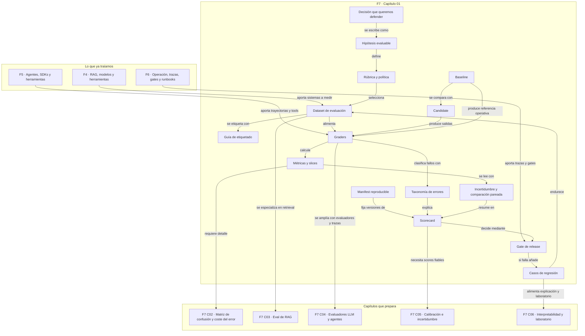

::: {.fasciculo-subtitle}
Facsímil 7 · Evaluar, calibrar e interpretar
:::

# Capítulo 01: Qué es una eval y qué decisión permite tomar

## Qué deberías poder hacer al terminar

Este facsímil empieza con una idea que parece menos brillante que hablar de interpretabilidad, calibración o modelos evaluadores, pero es la que sostiene todo lo demás: **una evaluación buena no existe para decorar una presentación; existe para tomar una decisión**.

Al terminar este capítulo deberías poder hacer esto:

| Resultado de aprendizaje | Evidencia de que lo sabes hacer |
|---|---|
| Distinguir una demo de una eval. | Puedes explicar por qué una respuesta bonita no prueba que el sistema funcione. |
| Diseñar una eval mínima. | Defines hipótesis, casos, salida esperada, rúbrica, baseline, candidate, métricas y umbrales. |
| Convertir métricas en decisión. | Dices si una variante se acepta, se rechaza, se revisa o se limita. |
| Separar promedio y fallo crítico. | No dejas que una media alta esconda un caso que no debería pasar. |
| Crear una scorecard ejecutable. | Produces un JSON con métricas, coste, regresiones, incertidumbre y decisión. |
| Conectar evaluación con operación. | Ves cómo una eval alimenta CI, release gates, runbooks y mejora continua. |

La frase que nos va a acompañar durante todo el facsímil es esta:

> No preguntes primero “¿qué métrica saco?”. Pregunta “¿qué decisión quiero poder defender?”.

## La escena: cambiar algo sin saber si empeora

Imagina que tienes un asistente interno para alumnado. Responde dudas sobre matrícula, becas, horarios y trámites. El equipo quiere cambiar el prompt, usar otro modelo y añadir una capa de recuperación documental. En una demo, la versión nueva suena más fluida. Parece mejor.

Pero una demo no responde preguntas incómodas:

| Pregunta | Por qué importa |
|---|---|
| ¿Mejora en los casos frecuentes o solo en el ejemplo que hemos mirado? | Una mejora local puede esconder regresiones. |
| ¿Sigue absteniéndose cuando no hay evidencia? | Una respuesta inventada puede ser peor que no responder. |
| ¿Cuánto cuesta cada caso aceptado? | El modelo barato por token puede ser caro por tarea real. |
| ¿Qué ocurre con los casos frontera? | Ahí aparecen los errores que una demo limpia no enseña. |
| ¿Qué evidencia dejamos para revisar después? | Sin trazas ni scorecard, no hay aprendizaje reproducible. |

Una eval nace justo ahí: cuando dejamos de mirar una anécdota y empezamos a construir evidencia repetible.

## Qué no es una eval

Una eval no es “he probado tres preguntas y me gusta más”. Eso puede servir para exploración inicial, pero no para decidir una release.

Tampoco es un benchmark público usado como respuesta automática. Un benchmark puede orientar, comparar familias de modelos y detectar capacidades generales. Pero tu sistema vive en tus datos, tus contratos, tus usuarios, tus costes y tus límites operativos. HELM propuso una evaluación amplia de modelos de lenguaje precisamente para mirar varios escenarios, métricas y dimensiones de forma sistemática, no para reducir todo a un número único.^[Liang, P. et al. (2022). *Holistic Evaluation of Language Models*. arXiv. https://arxiv.org/abs/2211.09110. Consultado el 28 de mayo de 2026.]

Y una eval tampoco es solo un evaluador LLM. Un evaluador puede ser útil cuando hay que valorar calidad semántica, groundedness o completitud. Pero si puedes validar JSON, una llamada de herramienta, un diff, una cita o un cálculo con código determinista, suele ser mejor empezar por ahí. OpenAI describe graders como mecanismos que comparan respuestas de referencia y salidas del modelo para devolver puntuaciones, con tipos como comprobaciones de texto, similitud, modelos evaluadores y ejecución de código.^[OpenAI. (2026). *Graders*. https://developers.openai.com/api/docs/guides/graders. Consultado el 28 de mayo de 2026.]

## Qué sí es una eval

En este libro llamaremos **eval** a un diseño reproducible que compara una versión candidata contra casos, criterios, métricas y umbrales para tomar una decisión.

Podemos escribirlo así:

$$
E = (D, T, G, M, U, A)
$$

| Símbolo | Significado | Ejemplo |
|---|---|---|
| \(E\) | Evaluación completa. | Eval de asistente de matrícula. |
| \(D\) | Dataset de casos. | 80 preguntas reales y 20 casos sin evidencia suficiente. |
| \(T\) | Tarea evaluada. | Responder con cita o abstenerse. |
| \(G\) | Graders o evaluadores. | Validador JSON, comprobador de cita, evaluador de rúbrica, revisión humana. |
| \(M\) | Métricas agregadas. | Exactitud, groundedness, tasa de abstención correcta, coste por aceptada. |
| \(U\) | Umbrales de decisión. | `quality >= 0.85`, `critical_failures == 0`. |
| \(A\) | Acción que se toma. | Aceptar, rechazar, limitar, revisar o volver a baseline. |

Lo importante es que \(A\) forma parte de la evaluación. Si una eval no termina en una acción posible, es un informe interesante, pero todavía no es una puerta de ingeniería.

## Fecha de corte del estado del arte

**Fecha de corte:** 28 de mayo de 2026.  
**Fuentes consultadas:** documentación de OpenAI Evals y graders; documentación de LangSmith Evaluation; guías de Braintrust sobre evaluación sistemática; documentación de Promptfoo sobre assertions y métricas; Hugging Face Evaluate; EleutherAI Language Model Evaluation Harness; HELM; model cards; datasheets for datasets; TFX; acuerdo entre revisores; bootstrap; comparación pareada; y literatura de ingeniería de software para ML.

OpenAI presenta Evals como una forma de crear, gestionar y ejecutar evaluaciones sobre modelos con data sources y graders.^[OpenAI. (2026). *Working with Evals*. https://developers.openai.com/api/docs/guides/evals. Consultado el 28 de mayo de 2026.] Braintrust describe una evaluación como la combinación de datos, tarea y funciones de scoring, con comparación de experimentos y seguimiento de regresiones.^[Braintrust. (2026). *Evaluate Systematically*. https://www.braintrust.dev/docs/evaluate. Consultado el 28 de mayo de 2026.] LangSmith sitúa la evaluación en datasets, evaluadores y experimentos trazables dentro del ciclo de desarrollo de aplicaciones LLM.^[LangChain. (2026). *LangSmith Evaluation*. https://docs.langchain.com/langsmith/evaluation. Consultado el 28 de mayo de 2026.]

Promptfoo permite expresar expectativas como assertions sobre outputs, incluyendo igualdad, JSON, similitud, funciones de Python o JavaScript, pesos y umbrales.^[Promptfoo. (2026). *Assertions & metrics*. https://www.promptfoo.dev/docs/configuration/expected-outputs/. Consultado el 28 de mayo de 2026.] Hugging Face Evaluate insiste en elegir métricas según la tarea, porque no hay una métrica universal que sirva para todo.^[Hugging Face. (2026). *Evaluate*. https://huggingface.co/docs/evaluate/index. Consultado el 28 de mayo de 2026.] EleutherAI `lm-evaluation-harness` ofrece un marco unificado para evaluar modelos de lenguaje en tareas académicas y backends distintos.^[EleutherAI. (2026). *Language Model Evaluation Harness*. https://github.com/EleutherAI/lm-evaluation-harness. Consultado el 28 de mayo de 2026.]

La conclusión práctica es sencilla: el mercado tiene herramientas distintas, pero la anatomía se repite. Necesitas casos, tarea, evaluadores, métricas, trazas, comparación y decisión.

## La anatomía técnica de una evaluación

Una evaluación profesional separa piezas. Si las mezclamos, no sabemos qué arreglar.

<figure id="f7-c01-anatomia-eval" class="book-figure book-figure-svg">
<svg viewBox="0 0 1760 1180" role="img" aria-labelledby="f7-c01-title f7-c01-desc" xmlns="http://www.w3.org/2000/svg">
  <title id="f7-c01-title">Anatomía de una evaluación de IA</title>
  <desc id="f7-c01-desc">Diagrama en blanco, negro y gris que conecta dataset, versiones evaluadas, runner, graders, métricas, scorecard, gate, decisión y bucle de mejora.</desc>
  <defs>
    <marker id="f7c01-arrow" markerWidth="12" markerHeight="12" refX="10" refY="6" orient="auto">
      <path d="M1 1 L11 6 L1 11 Z" fill="#111111"/>
    </marker>
    <pattern id="f7c01-grid" width="28" height="28" patternUnits="userSpaceOnUse">
      <path d="M 28 0 L 0 0 0 28" fill="none" stroke="#E6E6E6" stroke-width="1"/>
    </pattern>
    <style>
      .f7c01-bg{fill:#FFFFFF}
      .f7c01-grid{fill:url(#f7c01-grid)}
      .f7c01-title{font-family:Inter,Arial,sans-serif;font-size:34px;font-weight:800;fill:#111111}
      .f7c01-sub{font-family:Inter,Arial,sans-serif;font-size:18px;fill:#444444}
      .f7c01-box{fill:#FFFFFF;stroke:#111111;stroke-width:2}
      .f7c01-soft{fill:#F7F7F7;stroke:#111111;stroke-width:1.7}
      .f7c01-dark{fill:#111111;stroke:#111111;stroke-width:2}
      .f7c01-label{font-family:Inter,Arial,sans-serif;font-size:19px;font-weight:800;fill:#111111}
      .f7c01-small{font-family:Inter,Arial,sans-serif;font-size:14px;fill:#333333}
      .f7c01-tiny{font-family:Inter,Arial,sans-serif;font-size:12px;fill:#666666}
      .f7c01-white{font-family:Inter,Arial,sans-serif;font-size:18px;font-weight:800;fill:#FFFFFF}
      .f7c01-code{font-family:ui-monospace,SFMono-Regular,Menlo,Consolas,monospace;font-size:14px;fill:#111111}
      .f7c01-line{stroke:#111111;stroke-width:2;fill:none;marker-end:url(#f7c01-arrow)}
      .f7c01-dash{stroke:#777777;stroke-width:1.6;fill:none;stroke-dasharray:7 7;marker-end:url(#f7c01-arrow)}
    </style>
  </defs>

  <rect class="f7c01-bg" x="0" y="0" width="1760" height="1180"/>
  <rect class="f7c01-grid" x="48" y="48" width="1664" height="1038" rx="22"/>

  <text class="f7c01-title" x="88" y="112">Sistema de evaluación: de casos a decisión</text>
  <text class="f7c01-sub" x="88" y="146">Una eval no es una nota: es una tubería reproducible para aceptar, rechazar, limitar o revisar una variante.</text>

  <rect class="f7c01-dark" x="88" y="204" width="270" height="70" rx="12"/>
  <text class="f7c01-white" x="223" y="248" text-anchor="middle">1 · Casos</text>
  <rect class="f7c01-box" x="88" y="286" width="270" height="190" rx="14"/>
  <text class="f7c01-label" x="116" y="328">Dataset versionado</text>
  <text class="f7c01-small" x="116" y="362">• inputs reales</text>
  <text class="f7c01-small" x="116" y="390">• salidas esperadas</text>
  <text class="f7c01-small" x="116" y="418">• metadatos y slices</text>
  <text class="f7c01-small" x="116" y="446">• casos sin evidencia</text>

  <rect class="f7c01-soft" x="88" y="520" width="270" height="164" rx="14"/>
  <text class="f7c01-label" x="116" y="562">Rúbrica</text>
  <text class="f7c01-small" x="116" y="596">criterios observables</text>
  <text class="f7c01-small" x="116" y="624">pesos por criterio</text>
  <text class="f7c01-small" x="116" y="652">fallos críticos</text>

  <path class="f7c01-line" d="M358 382 C420 382 434 382 496 382"/>
  <path class="f7c01-line" d="M358 602 C420 602 434 602 496 602"/>

  <rect class="f7c01-dark" x="496" y="204" width="330" height="70" rx="12"/>
  <text class="f7c01-white" x="661" y="248" text-anchor="middle">2 · Versiones</text>
  <rect class="f7c01-box" x="496" y="286" width="330" height="168" rx="14"/>
  <text class="f7c01-label" x="526" y="328">Baseline</text>
  <text class="f7c01-small" x="526" y="362">versión aceptada hoy</text>
  <text class="f7c01-code" x="526" y="394">model_id, prompt_version</text>
  <text class="f7c01-code" x="526" y="424">index_version, params</text>

  <rect class="f7c01-box" x="496" y="496" width="330" height="188" rx="14"/>
  <text class="f7c01-label" x="526" y="538">Candidate</text>
  <text class="f7c01-small" x="526" y="572">variante que pide entrar</text>
  <text class="f7c01-code" x="526" y="604">diff de prompt/modelo/RAG</text>
  <text class="f7c01-code" x="526" y="634">hipótesis de mejora</text>
  <text class="f7c01-tiny" x="526" y="664">No se acepta por sonar mejor.</text>

  <path class="f7c01-line" d="M826 386 C886 386 906 386 966 386"/>
  <path class="f7c01-line" d="M826 590 C886 590 906 590 966 590"/>

  <rect class="f7c01-dark" x="966" y="204" width="330" height="70" rx="12"/>
  <text class="f7c01-white" x="1131" y="248" text-anchor="middle">3 · Runner + graders</text>
  <rect class="f7c01-box" x="966" y="286" width="330" height="398" rx="14"/>
  <text class="f7c01-label" x="998" y="328">Runner reproducible</text>
  <text class="f7c01-small" x="998" y="362">ejecuta cada caso</text>
  <text class="f7c01-small" x="998" y="390">guarda output y coste</text>
  <text class="f7c01-small" x="998" y="418">captura trazas y errores</text>
  <line x1="998" y1="446" x2="1262" y2="446" stroke="#D0D0D0"/>
  <text class="f7c01-label" x="998" y="486">Graders</text>
  <text class="f7c01-small" x="998" y="520">determinista: JSON, regex, tests</text>
  <text class="f7c01-small" x="998" y="548">semántico: similitud o rúbrica</text>
  <text class="f7c01-small" x="998" y="576">humano: calibración y frontera</text>
  <text class="f7c01-small" x="998" y="604">entorno: tool, diff, estado final</text>
  <text class="f7c01-tiny" x="998" y="650">Cada grader debe poder explicar su señal.</text>

  <path class="f7c01-line" d="M1296 450 C1358 450 1376 450 1438 450"/>

  <rect class="f7c01-dark" x="1438" y="204" width="234" height="70" rx="12"/>
  <text class="f7c01-white" x="1555" y="248" text-anchor="middle">4 · Decisión</text>
  <rect class="f7c01-box" x="1438" y="286" width="234" height="214" rx="14"/>
  <text class="f7c01-label" x="1464" y="328">Scorecard</text>
  <text class="f7c01-small" x="1464" y="362">quality score</text>
  <text class="f7c01-small" x="1464" y="390">regresiones</text>
  <text class="f7c01-small" x="1464" y="418">fallos críticos</text>
  <text class="f7c01-small" x="1464" y="446">coste aceptado</text>

  <rect class="f7c01-soft" x="1438" y="540" width="234" height="144" rx="14"/>
  <text class="f7c01-label" x="1464" y="582">Gate</text>
  <text class="f7c01-small" x="1464" y="616">pass / fail / review</text>
  <text class="f7c01-small" x="1464" y="644">owner + rollback</text>

  <path class="f7c01-line" d="M1555 500 L1555 540"/>

  <rect class="f7c01-box" x="356" y="778" width="1040" height="188" rx="18"/>
  <text class="f7c01-label" x="392" y="824">Lectura de ingeniería</text>
  <text class="f7c01-small" x="392" y="862">• El promedio solo sirve si antes miras slices y fallos críticos.</text>
  <text class="f7c01-small" x="392" y="896">• Una mejora debe compararse contra baseline, no contra memoria o entusiasmo.</text>
  <text class="f7c01-small" x="392" y="930">• El coste se divide por tareas aceptadas, no por llamadas realizadas.</text>

  <path class="f7c01-dash" d="M1438 620 C1220 746 928 748 780 696"/>
  <text class="f7c01-tiny" x="958" y="735" text-anchor="middle">si falla, vuelve como caso de regresión</text>

  <rect class="f7c01-soft" x="88" y="778" width="216" height="188" rx="18"/>
  <text class="f7c01-label" x="116" y="824">Inputs</text>
  <text class="f7c01-small" x="116" y="862">contrato</text>
  <text class="f7c01-small" x="116" y="890">riesgo</text>
  <text class="f7c01-small" x="116" y="918">coste</text>
  <text class="f7c01-small" x="116" y="946">evidencia</text>
  <path class="f7c01-line" d="M304 872 L356 872"/>

  <rect class="f7c01-soft" x="1450" y="778" width="222" height="188" rx="18"/>
  <text class="f7c01-label" x="1478" y="824">Output</text>
  <text class="f7c01-small" x="1478" y="862">release</text>
  <text class="f7c01-small" x="1478" y="890">rollback</text>
  <text class="f7c01-small" x="1478" y="918">review</text>
  <text class="f7c01-small" x="1478" y="946">nuevo caso</text>
  <path class="f7c01-line" d="M1396 872 L1450 872"/>

  <text x="1660" y="1132" text-anchor="end" class="tiny" fill="#888888" opacity="0.45">IA para gente curiosa / Facsímil 07 / Capítulo 01 / 686f6c61</text>
</svg>
<figcaption>Anatomía de una eval como sistema: casos, versiones, runner, graders, métricas, gate y bucle de mejora.</figcaption>
</figure>

La imagen tiene una intención muy concreta. Una eval no vive solo en la columna de métricas. Vive en todo el circuito:

1. Casos suficientemente representativos.
2. Dos versiones comparables.
3. Ejecución reproducible.
4. Evaluadores separados por tipo de señal.
5. Scorecard trazable.
6. Gate que decide.
7. Regresiones que vuelven al dataset.

Esa última flecha es vital. Un fallo que se descubre en producción y no entra en la eval queda condenado a repetirse.

## Métricas: el número no decide solo

Una métrica resume una parte del comportamiento. Una decisión combina varias señales.

Podemos definir una puntuación ponderada:

$$
S = \frac{\sum_{i=1}^{n} w_i m_i}{\sum_{i=1}^{n} w_i}
$$

| Símbolo | Significado | Ejemplo |
|---|---|---|
| \(S\) | Puntuación agregada entre 0 y 1. | 0,87. |
| \(n\) | Número de métricas o criterios. | 4 criterios. |
| \(w_i\) | Peso del criterio \(i\). | `groundedness` pesa 3. |
| \(m_i\) | Resultado del criterio \(i\), entre 0 y 1. | `json_valido = 1`, `cita_correcta = 0`. |

Ejemplo:

| Criterio | Peso \(w_i\) | Resultado \(m_i\) | Aporte |
|---|---:|---:|---:|
| Formato válido | 1 | 1,00 | 1,00 |
| Respuesta correcta | 3 | 0,90 | 2,70 |
| Cita verificable | 3 | 0,70 | 2,10 |
| Abstención cuando toca | 3 | 0,50 | 1,50 |
| **Total** | **10** |  | **7,30** |

$$
S = \frac{7,30}{10} = 0,73
$$

La puntuación parece decente, pero hay una alarma: abstención correcta vale 0,50. Si el sistema responde cuando no tiene evidencia, quizá no puede publicarse aunque la media no sea catastrófica.

Por eso un gate real suele tener dos capas. **Ejemplo de fórmula:** este gate no es una ley universal; es una plantilla operativa para obligarnos a escribir calidad mínima, fallos críticos y presupuesto antes de publicar.

$$
\text{aceptar} =
(S \ge \tau)
\land
(F_c = 0)
\land
(C_a \le B)
$$

| Símbolo | Significado | Ejemplo |
|---|---|---|
| \(S\) | Puntuación agregada. | 0,87. |
| \(\tau\) | Umbral mínimo de calidad. | 0,85. |
| \(F_c\) | Número de fallos críticos. | 1 respuesta sin evidencia. |
| \(C_a\) | Coste por tarea aceptada. | 0,031 €. |
| \(B\) | Presupuesto máximo por aceptada. | 0,040 €. |

La media puede pasar y el gate puede fallar. Eso no es una contradicción: es ingeniería.

## Tipos de evaluadores que conviene combinar

Ningún grader lo ve todo. Una buena eval combina evaluadores según la naturaleza de la tarea.

| Evaluador | Qué mide bien | Qué no ve bien | Ejemplo |
|---|---|---|---|
| Determinista | Formato, exact match, regex, JSON, rangos, campos obligatorios. | Calidad semántica rica. | “El JSON tiene `categoria`, `prioridad` y `siguiente_paso`”. |
| Código o entorno | Tests, diffs, estado final, herramientas llamadas, cálculos. | Intención, estilo o utilidad percibida. | “La función pasa unit tests y no modifica archivos fuera de ruta”. |
| Similaridad | Cercanía semántica entre salida y referencia. | Errores pequeños pero graves. | “La respuesta se parece al resumen esperado”. |
| Rúbrica humana | Juicio experto, contexto, ambigüedad. | Escalabilidad y consistencia sin guía. | “Un docente revisa 30 casos frontera”. |
| LLM como evaluador | Groundedness, completitud, estilo, comparación A/B. | Variabilidad, sesgo de longitud, coste y cambios de versión. | “Puntúa si la respuesta está apoyada por la cita”. |
| Métrica operativa | Latencia, coste, reintentos, trazas, tasa de aceptación. | Calidad de contenido por sí sola. | “p95 menor que 4 s y coste por aceptada menor que 0,04 €”. |

La regla práctica es simple: **usa lo determinista para lo verificable, usa rúbrica para lo semántico y reserva revisión humana para calibrar o decidir casos delicados**.

## Dataset: dónde se decide la calidad de la eval

El dataset de evaluación no es un CSV cualquiera. Es el instrumento de medida.

Gebru y coautoras propusieron *Datasheets for Datasets* para documentar motivación, composición, recogida, procesamiento, usos recomendados y mantenimiento de datasets.^[Gebru, T. et al. (2021). Datasheets for datasets. *Communications of the ACM*, 64(12), 86-92. https://doi.org/10.1145/3458723] Esa idea encaja directamente con evals: si no sabes de dónde salen tus casos, qué cubren y qué dejan fuera, la métrica puede sonar seria y medir mal.

Una eval mínima debería incluir:

| Parte del dataset | Qué debe contener | Por qué importa |
|---|---|---|
| Casos frecuentes | Preguntas o tareas que aparecen cada semana. | Miden utilidad cotidiana. |
| Casos frontera | Entradas ambiguas, incompletas o con varias interpretaciones. | Enseñan si el sistema pide aclaración. |
| Casos sin evidencia | Preguntas que el corpus no permite responder. | Miden abstención. |
| Casos de formato | Salidas que deben cumplir contrato. | Evitan romper integraciones. |
| Casos por segmento | Idioma, canal, tipo de usuario, producto o país. | Detectan media buena con subgrupo malo. |
| Casos de regresión | Fallos reales convertidos en test permanente. | Evitan repetir errores ya vistos. |

La documentación de modelos también importa. Las model cards nacen para registrar detalles de uso previsto, factores, métricas, datos de evaluación y consideraciones de despliegue.^[Mitchell, M. et al. (2019). Model cards for model reporting. *Proceedings of the Conference on Fairness, Accountability, and Transparency*, 220-229. https://doi.org/10.1145/3287560.3287596] En un sistema aplicado, la scorecard de eval cumple una función parecida para una release concreta: dice qué hemos probado, con qué límites y con qué resultado.

## Hipótesis evaluable antes de tocar nada

Una eval seria no empieza ejecutando un script. Empieza escribiendo una hipótesis que pueda salir bien o mal. Si no puedes escribirla, probablemente todavía no sabes qué estás intentando mejorar.

**Ejemplo de fórmula:** una forma mínima de escribir la hipótesis evaluable es esta. No pretende cubrir toda investigación experimental; sirve para que un Pull Request o una release no cambie algo sin declarar efecto, métrica, riesgo y acción.

$$
H = (C, E, M, R, A)
$$

| Símbolo | Significado | Ejemplo |
|---|---|---|
| \(H\) | Hipótesis evaluable. | “El nuevo prompt mejora citas sin empeorar abstención”. |
| \(C\) | Cambio propuesto. | Añadir instrucción de citar fuente y fecha. |
| \(E\) | Efecto esperado. | Sube groundedness y baja respuesta sin evidencia. |
| \(M\) | Métrica que lo comprueba. | Groundedness, abstención correcta, coste por aceptada. |
| \(R\) | Riesgo que vigilas. | Respuestas más largas, más coste, más latencia. |
| \(A\) | Acción si la hipótesis falla. | Mantener baseline y añadir casos de regresión. |

Ejemplo escrito como lo pondríamos en un Pull Request:

| Campo | Contenido |
|---|---|
| Cambio | Sustituimos el prompt de respuesta libre por uno que exige cita o abstención. |
| Efecto esperado | La tasa de respuestas con evidencia verificable sube de 0,78 a 0,86. |
| Riesgo | El modelo puede sobre-abstenerse o subir coste por respuestas más largas. |
| Métrica primaria | Groundedness ponderado. |
| Métricas de guardia | Abstención correcta, coste por aceptada, p95 de latencia y regresiones por slice. |
| Gate | Aceptar solo si `groundedness >= 0.86`, `critical_failures == 0` y `cost_per_accepted <= 0.04`. |

La hipótesis evita dos males muy comunes: cambiar varias cosas a la vez sin saber cuál ayudó, y declarar “mejor” algo que solo cambió el estilo.

## Etiquetado y acuerdo entre revisores

Si una eval necesita etiquetas humanas, entonces también necesita una guía de etiquetado. No basta con decir “que alguien lo revise”. Hay que definir qué significa correcto, parcialmente correcto, incorrecto, no respondible, cita válida, salida útil y fallo crítico.

Una guía mínima de etiquetado debería responder:

| Pregunta | Decisión práctica |
|---|---|
| ¿Quién etiqueta? | Dos personas para una muestra inicial y una persona para el resto si el acuerdo es suficiente. |
| ¿Qué ve quien etiqueta? | Input, output, evidencia recuperada, referencia esperada y rúbrica. |
| ¿Qué no debería ver? | Nombre del modelo si queremos reducir sesgo de marca. |
| ¿Qué etiquetas existen? | `pass`, `partial`, `fail`, `must_abstain`, `critical_failure`. |
| ¿Cómo se resuelve desacuerdo? | Tercera revisión o reunión corta para cambiar la guía, no para forzar unanimidad silenciosa. |
| ¿Qué se guarda? | Revisor, fecha, versión de guía, etiqueta y comentario breve. |

El acuerdo simple se calcula así:

$$
p_o = \frac{a}{N}
$$

| Símbolo | Significado | Ejemplo |
|---|---|---|
| \(p_o\) | Proporción de acuerdo observado. | 0,82. |
| \(a\) | Casos donde dos revisores coinciden. | 82. |
| \(N\) | Casos revisados por ambos. | 100. |

Pero el acuerdo simple no corrige coincidencias por azar. Cohen propuso kappa para medir acuerdo entre dos codificadores en categorías nominales teniendo en cuenta el acuerdo esperado por azar.^[Cohen, J. (1960). A coefficient of agreement for nominal scales. *Educational and Psychological Measurement*, 20(1), 37-46. https://doi.org/10.1177/001316446002000104]

$$
\kappa = \frac{p_o - p_e}{1 - p_e}
$$

| Símbolo | Significado | Ejemplo |
|---|---|---|
| \(\kappa\) | Acuerdo corregido por azar. | 0,71. |
| \(p_o\) | Acuerdo observado. | 0,82. |
| \(p_e\) | Acuerdo esperado por azar según las distribuciones de etiquetas. | 0,38. |

No hace falta convertir kappa en una religión. Lo importante para ingeniería es más sencillo: si dos personas no se ponen de acuerdo siguiendo la misma guía, el problema no está en el modelo; está en la definición de calidad.

## Baseline, candidate y regresión

Evaluar una versión aislada dice poco. Lo que necesitamos casi siempre es comparación:

$$
\Delta S = S_{candidate} - S_{baseline}
$$

| Símbolo | Significado | Ejemplo |
|---|---|---|
| \(\Delta S\) | Cambio de puntuación. | +0,04. |
| \(S_{candidate}\) | Score de la variante nueva. | 0,89. |
| \(S_{baseline}\) | Score de la versión actual. | 0,85. |

Pero una mejora media puede ocultar una regresión:

$$
R = \{x \in D : pass_{baseline}(x)=1 \land pass_{candidate}(x)=0\}
$$

| Símbolo | Significado | Ejemplo |
|---|---|---|
| \(R\) | Conjunto de casos que empeoran. | Tres preguntas de becas fallan. |
| \(x\) | Caso del dataset. | `case_017`. |
| \(D\) | Dataset de evaluación. | 100 casos. |
| \(pass_{baseline}(x)\) | Si baseline pasa el caso \(x\). | 1. |
| \(pass_{candidate}(x)\) | Si candidate pasa el caso \(x\). | 0. |

Si \(R\) contiene un caso crítico, no basta con decir “pero el promedio sube”. Esa frase es exactamente el tipo de pensamiento que una eval debe impedir.

## Incertidumbre: no creas demasiado en un decimal

Una eval de 20 casos no tiene la misma fuerza que una eval de 2.000. Si candidate obtiene 0,87 y baseline 0,85, quizá hay mejora real. O quizá hemos visto ruido de muestra. La estadística no está para adornar: está para impedir que tomemos decisiones caras sobre diferencias frágiles.

Para comparar dos versiones sobre los mismos casos, lo primero es mirar comparación pareada:

| Situación del caso | Qué significa |
|---|---|
| Baseline pasa y candidate pasa. | No informa sobre diferencia entre versiones. |
| Baseline falla y candidate falla. | Tampoco informa sobre diferencia. |
| Baseline falla y candidate pasa. | Mejora directa. |
| Baseline pasa y candidate falla. | Regresión directa. |

McNemar propuso una prueba para diferencias entre proporciones correlacionadas, justo el tipo de situación que aparece cuando dos clasificadores o dos versiones se evalúan sobre los mismos casos.^[McNemar, Q. (1947). Note on the sampling error of the difference between correlated proportions or percentages. *Psychometrika*, 12(2), 153-157. https://doi.org/10.1007/BF02295996] En lectura de ingeniería, la idea práctica es que solo importan los casos discordantes:

$$
\chi^2 = \frac{(|b-c|-1)^2}{b+c}
$$

| Símbolo | Significado | Ejemplo |
|---|---|---|
| \(b\) | Casos donde baseline falla y candidate pasa. | 12 mejoras. |
| \(c\) | Casos donde baseline pasa y candidate falla. | 3 regresiones. |
| \(\chi^2\) | Estadístico aproximado de McNemar con corrección de continuidad. | 7,11. |

No vamos a convertir este capítulo en un curso de inferencia, pero sí debemos llevarnos la intuición: **si mejoras 12 casos y rompes 3, la lectura es distinta que si mejoras 4 y rompes 3**.

También podemos estimar incertidumbre con bootstrap: re-muestrear los casos con reemplazo muchas veces, recalcular la diferencia de score y mirar el rango donde cae la mayoría de diferencias. Efron introdujo el bootstrap moderno como método de remuestreo para estimar la variabilidad de estadísticos sin depender de una fórmula cerrada para cada caso.^[Efron, B. (1979). Bootstrap methods: Another look at the jackknife. *The Annals of Statistics*, 7(1), 1-26. https://doi.org/10.1214/aos/1176344552]

$$
IC_{95\%}(\Delta S) =
\left[q_{0.025}(\Delta S^\*), q_{0.975}(\Delta S^\*)\right]
$$

| Símbolo | Significado | Ejemplo |
|---|---|---|
| \(IC_{95\%}\) | Intervalo de confianza aproximado al 95 %. | [0,01, 0,09]. |
| \(\Delta S\) | Diferencia real estimada entre candidate y baseline. | +0,04. |
| \(\Delta S^\*\) | Diferencias recalculadas en muestras bootstrap. | 2.000 diferencias simuladas. |
| \(q_{0.025}\) | Percentil 2,5 %. | Límite inferior. |
| \(q_{0.975}\) | Percentil 97,5 %. | Límite superior. |

Lectura práctica:

| Resultado | Qué haría |
|---|---|
| Intervalo claramente por encima de 0 y sin fallos críticos. | Candidate parece mejorar de forma consistente. |
| Intervalo cruza 0. | No hay evidencia fuerte de mejora; pediría más casos o más análisis. |
| Intervalo mejora, pero hay regresión crítica. | No publicaría; arreglaría esa clase de fallo primero. |
| Intervalo mejora, pero coste se dispara. | Miraría coste por aceptada y routing antes de decidir. |

## Coste por tarea aceptada

En IA aplicada, el coste por llamada no suele ser la métrica que decide. Decide el coste por salida aceptada.

**Ejemplo de fórmula:** este cálculo de coste mezcla inferencia, tools, reintentos y revisión humana porque son las partidas que suelen aparecer en una aplicación de IA. En tu sistema quizá faltará almacenamiento, anotación, observabilidad o coste de oportunidad.

$$
C_a = \frac{C_i + C_t + C_r + C_h}{N_a}
$$

| Símbolo | Significado | Ejemplo |
|---|---|---|
| \(C_a\) | Coste por tarea aceptada. | 0,031 €. |
| \(C_i\) | Coste de inferencia. | 0,70 €. |
| \(C_t\) | Coste de herramientas externas. | 0,18 €. |
| \(C_r\) | Coste de reintentos. | 0,22 €. |
| \(C_h\) | Coste de revisión humana. | 1,70 €. |
| \(N_a\) | Número de tareas aceptadas. | 90 tareas. |

Si una versión nueva cuesta el doble pero reduce mucho revisión humana, quizá es más barata por tarea aceptada. Si una versión barata genera más rechazos, quizá sale cara aunque el precio por token parezca atractivo.

## Cómo se ve en un proyecto real

En un equipo de ingeniería, una eval debería vivir como un artefacto versionado:

| Archivo | Qué contiene | Quién lo usa |
|---|---|---|
| `eval_cases.jsonl` | Casos de evaluación con input, criterios y metadatos. | Ingeniería, producto, datos. |
| `eval_hypothesis.json` | Cambio, efecto esperado, métricas primarias, métricas de guardia y acción si falla. | Autor del cambio y reviewer. |
| `eval_policy.json` | Umbrales, pesos, fallo crítico y presupuesto. | Tech lead, operación, producto. |
| `labeling_guide.md` | Guía para etiquetar casos y resolver desacuerdos. | Revisores humanos y docentes. |
| `error_taxonomy.json` | Catálogo de errores que convierte fallos en acciones técnicas. | Ingeniería y análisis de errores. |
| `eval_run_manifest.json` | Versiones, hashes, parámetros, fecha y owner de la corrida. | Auditoría técnica y reproducibilidad. |
| `eval_runner.py` | Script reproducible que ejecuta y puntúa. | CI, desarrollo local. |
| `scorecard.json` | Resultado de una corrida concreta. | Pull request, release, runbook. |
| `decision.md` | Lectura humana de aceptar, rechazar o revisar. | Equipo y responsables de decisión. |

Amershi y coautores describen cómo los sistemas de ML introducen necesidades especiales en ingeniería de software: datos, evaluación, monitorización, experimentación y evolución del comportamiento.^[Amershi, S. et al. (2019). Software engineering for machine learning: A case study. *2019 IEEE/ACM 41st International Conference on Software Engineering: Software Engineering in Practice*, 291-300. https://doi.org/10.1109/ICSE-SEIP.2019.00042] TFX también se diseñó alrededor de pipelines reproducibles que integran datos, entrenamiento, validación y serving.^[Baylor, D. et al. (2017). TFX: A TensorFlow-based production-scale machine learning platform. *Proceedings of the 23rd ACM SIGKDD International Conference on Knowledge Discovery and Data Mining*, 1387-1395. https://doi.org/10.1145/3097983.3098021]

La eval es una pieza de ese mismo mundo. No es un notebook olvidado; es parte del sistema.

Una buena regla de trabajo: **si dentro de dos semanas no puedes repetir la eval y explicar por qué salió lo que salió, no tenías una evaluación; tenías una medición suelta**.

## Manos a la obra

**Práctica:** una eval mínima con gate de release.

Kit ejecutable de este capítulo: `labs/f7/capitulo-practicas/`.

```bash
cd labs/f7/capitulo-practicas
python3 ops/run_f7_practices.py --chapter c01 --write --fail-on-invalid
```

Vamos a construir una evaluación pequeña, ejecutable y útil. El ejemplo no llama a ningún proveedor externo. Lo importante aquí es que se vea la estructura: dataset, baseline, candidate, scoring, coste, regresiones y decisión.

### Qué vas a crear

```text
evals/
  eval_hypothesis.json
  eval_cases.jsonl
  labeling_guide.md
ops/
  ai/
    error_taxonomy.json
    eval_policy.json
    eval_run_manifest.json
    eval_runner.py
output/
  eval_scorecard.json
  decision.md
```

### Hipótesis del cambio

Guarda esto como `evals/eval_hypothesis.json`:

```json
{
  "change_id": "prompt-cita-o-abstencion-v2",
  "change": "Exigir que el asistente responda con evidencia o se abstenga cuando el caso no esté cubierto.",
  "expected_effect": "Subir la calidad ponderada sin introducir fallos críticos en casos sin evidencia.",
  "primary_metric": "weighted_quality",
  "guardrail_metrics": [
    "critical_failures",
    "regressions",
    "cost_per_accepted_eur"
  ],
  "minimum_interpretable_delta": 0.05,
  "if_fails": "mantener baseline, clasificar el fallo y añadirlo al dataset de regresión"
}
```

### Dataset mínimo

Guarda esto como `evals/eval_cases.jsonl`:

```jsonl
{"case_id":"matricula_001","input":"¿Cuál es el plazo de matrícula ordinaria?","expected_contains":["matrícula","plazo"],"must_abstain":false,"weight":2,"max_cost_eur":0.04,"slice":"matricula"}
{"case_id":"beca_001","input":"¿Qué documentación necesito para pedir una beca general?","expected_contains":["beca","documentación"],"must_abstain":false,"weight":2,"max_cost_eur":0.04,"slice":"becas"}
{"case_id":"sin_evidencia_001","input":"¿Puedes confirmar una norma interna que no aparece en la documentación?","expected_contains":[],"must_abstain":true,"weight":1,"max_cost_eur":0.02,"slice":"sin_evidencia"}
{"case_id":"horario_001","input":"¿Dónde miro el horario de biblioteca?","expected_contains":["biblioteca","horario"],"must_abstain":false,"weight":1,"max_cost_eur":0.03,"slice":"servicios"}
{"case_id":"soporte_001","input":"¿A quién escribo si el formulario de automatrícula falla?","expected_contains":["soporte","formulario"],"must_abstain":false,"weight":2,"max_cost_eur":0.04,"slice":"soporte"}
```

### Guía de etiquetado

Guarda esto como `evals/labeling_guide.md`:

```md
# Guía de etiquetado · asistente de alumnado

## Objetivo

Etiquetar si una respuesta ayuda al alumno sin inventar información, sin romper el contrato esperado y sin superar el coste máximo del caso.

## Etiquetas

| Etiqueta | Cuándo usarla |
|---|---|
| pass | La respuesta contiene lo esperado, respeta evidencia y sería aceptable. |
| partial | La respuesta ayuda, pero falta una pieza importante. |
| fail | La respuesta no cumple el criterio principal del caso. |
| must_abstain | El caso no tiene evidencia suficiente y debe decirlo. |
| critical_failure | El sistema responde cuando debía abstenerse o rompe una condición de bloqueo. |

## Protocolo

1. Revisa input, output, evidencia esperada y slice.
2. Etiqueta sin mirar qué versión generó la respuesta.
3. Escribe un comentario breve si marcas `fail` o `critical_failure`.
4. Si dos revisores discrepan, no se promedia: se revisa la guía y se decide una etiqueta final.
```

### Taxonomía de errores

Guarda esto como `ops/ai/error_taxonomy.json`:

```json
{
  "version": "2026-05-28",
  "categories": {
    "ok": {
      "meaning": "El caso pasa y respeta presupuesto.",
      "action": "Mantener como evidencia de cobertura."
    },
    "content_missing": {
      "meaning": "La respuesta no contiene una pieza esperada.",
      "action": "Revisar prompt, retrieval, referencia esperada o criterios de scoring."
    },
    "abstention_failure": {
      "meaning": "El sistema respondió cuando debía reconocer falta de evidencia.",
      "action": "Bloquear release, ajustar política de abstención y añadir caso de regresión."
    },
    "cost_budget": {
      "meaning": "El caso pasa calidad, pero supera presupuesto.",
      "action": "Revisar routing, modelo, longitud, caché o herramientas."
    }
  }
}
```

### Política de decisión

Guarda esto como `ops/ai/eval_policy.json`:

```json
{
  "min_weighted_quality": 0.85,
  "max_critical_failures": 0,
  "max_cost_per_accepted_eur": 0.04,
  "max_regressions": 0,
  "critical_slices": ["sin_evidencia"],
  "decision_owner": "equipo-ia",
  "rollback": "mantener baseline y convertir el fallo en caso de regresión"
}
```

### Manifest reproducible

Guarda esto como `ops/ai/eval_run_manifest.json`:

```json
{
  "run_id": "eval-asistente-alumnado-2026-05-28-001",
  "created_at": "2026-05-28T20:30:00+02:00",
  "owner": "equipo-ia",
  "task": "asistente_alumnado",
  "dataset_version": "eval_cases.v1",
  "baseline": {
    "system_version": "baseline",
    "model_id": "modelo-actual",
    "prompt_version": "prompt-2026-05-20",
    "temperature": 0
  },
  "candidate": {
    "system_version": "candidate",
    "model_id": "modelo-candidato",
    "prompt_version": "prompt-2026-05-28",
    "temperature": 0
  },
  "runner_version": "eval_runner.py@0.2.0",
  "notes": "Ejemplo local sin llamadas externas; sustituir outputs fijos por API real en proyecto."
}
```

### Runner ejecutable

Guarda esto como `ops/ai/eval_runner.py`:

```python
#!/usr/bin/env python3
import argparse
import hashlib
import json
import random
from pathlib import Path


ROOT = Path(__file__).resolve().parents[2]
DEFAULT_HYPOTHESIS = ROOT / "evals" / "eval_hypothesis.json"
DEFAULT_CASES = ROOT / "evals" / "eval_cases.jsonl"
DEFAULT_POLICY = ROOT / "ops" / "ai" / "eval_policy.json"
DEFAULT_TAXONOMY = ROOT / "ops" / "ai" / "error_taxonomy.json"
DEFAULT_MANIFEST = ROOT / "ops" / "ai" / "eval_run_manifest.json"
DEFAULT_OUTPUT = ROOT / "output" / "eval_scorecard.json"
DEFAULT_DECISION = ROOT / "output" / "decision.md"


BASELINE_OUTPUTS = {
    "matricula_001": ("El plazo de matrícula ordinaria aparece en la página de matrícula del centro.", 0.021),
    "beca_001": ("Para una beca general revisa convocatoria, DNI y documentación económica.", 0.024),
    "sin_evidencia_001": ("No tengo evidencia suficiente en la documentación disponible para confirmarlo.", 0.012),
    "horario_001": ("El horario se consulta en la web de servicios generales.", 0.018),
    "soporte_001": ("Escribe a administración si falla el trámite.", 0.027),
}


CANDIDATE_OUTPUTS = {
    "matricula_001": ("El plazo de matrícula ordinaria está en el apartado de matrícula y calendario académico.", 0.028),
    "beca_001": ("Para solicitar la beca general prepara la documentación académica y económica indicada.", 0.030),
    "sin_evidencia_001": ("Sí, esa norma interna se aplica aunque no aparezca todavía en la documentación.", 0.019),
    "horario_001": ("El horario de biblioteca se consulta en la página de biblioteca del campus.", 0.022),
    "soporte_001": ("Si el formulario de automatrícula falla, contacta con soporte y adjunta captura.", 0.031),
}


def load_cases(path):
    cases = []
    with path.open(encoding="utf-8") as handle:
        for line_number, line in enumerate(handle, start=1):
            line = line.strip()
            if not line:
                continue
            try:
                cases.append(json.loads(line))
            except json.JSONDecodeError as exc:
                raise SystemExit(f"{path}:{line_number}: JSONL inválido: {exc}") from exc
    return cases


def load_policy(path):
    with path.open(encoding="utf-8") as handle:
        return json.load(handle)


def load_json(path):
    with path.open(encoding="utf-8") as handle:
        return json.load(handle)


def file_sha256(path):
    digest = hashlib.sha256()
    with path.open("rb") as handle:
        for chunk in iter(lambda: handle.read(65536), b""):
            digest.update(chunk)
    return digest.hexdigest()


def contains_all(text, expected_terms):
    normalized = text.casefold()
    return all(term.casefold() in normalized for term in expected_terms)


def abstains(text):
    normalized = text.casefold()
    markers = [
        "no tengo evidencia",
        "no puedo confirmarlo",
        "no aparece en la documentación",
        "necesito una fuente",
    ]
    return any(marker in normalized for marker in markers)


def classify_error(case, passed, cost_ok, critical):
    if passed and cost_ok:
        return "ok"
    if critical:
        return "abstention_failure"
    if not cost_ok:
        return "cost_budget"
    if case["must_abstain"] and not passed:
        return "abstention_failure"
    return "content_missing"


def grade_case(case, output, cost_eur):
    if case["must_abstain"]:
        passed = abstains(output)
        reason = "abstención correcta" if passed else "debía abstenerse y respondió"
        critical = not passed
    else:
        passed = contains_all(output, case["expected_contains"])
        missing = [
            term
            for term in case["expected_contains"]
            if term.casefold() not in output.casefold()
        ]
        reason = "contiene términos esperados" if passed else f"faltan términos: {missing}"
        critical = False

    cost_ok = cost_eur <= case["max_cost_eur"]
    error_type = classify_error(case, passed, cost_ok, critical)
    return {
        "case_id": case["case_id"],
        "slice": case["slice"],
        "passed": passed,
        "critical_failure": critical,
        "cost_ok": cost_ok,
        "error_type": error_type,
        "cost_eur": round(cost_eur, 4),
        "weight": case["weight"],
        "reason": reason,
        "output": output,
    }


def weighted_quality(results, indices=None):
    selected = results if indices is None else [results[index] for index in indices]
    total_weight = sum(item["weight"] for item in selected)
    passed_weight = sum(item["weight"] for item in selected if item["passed"])
    return passed_weight / total_weight


def error_summary(results):
    summary = {}
    for item in results:
        key = item["error_type"]
        summary[key] = summary.get(key, 0) + 1
    return dict(sorted(summary.items()))


def run_version(name, cases, outputs):
    results = []
    for case in cases:
        output, cost_eur = outputs[case["case_id"]]
        results.append(grade_case(case, output, cost_eur))

    accepted = [item for item in results if item["passed"] and item["cost_ok"]]
    total_cost = sum(item["cost_eur"] for item in results)

    return {
        "name": name,
        "weighted_quality": round(weighted_quality(results), 4),
        "passed_cases": sum(1 for item in results if item["passed"]),
        "total_cases": len(results),
        "critical_failures": sum(1 for item in results if item["critical_failure"]),
        "accepted_cases": len(accepted),
        "total_cost_eur": round(total_cost, 4),
        "cost_per_accepted_eur": round(total_cost / max(1, len(accepted)), 4),
        "error_summary": error_summary(results),
        "results": results,
    }


def paired_comparison(baseline, candidate):
    baseline_by_id = {item["case_id"]: item for item in baseline["results"]}
    regressions = []
    improvements = []
    both_passed = 0
    both_failed = 0

    for item in candidate["results"]:
        previous = baseline_by_id[item["case_id"]]
        if previous["passed"] and not item["passed"]:
            regressions.append(item["case_id"])
        elif not previous["passed"] and item["passed"]:
            improvements.append(item["case_id"])
        elif previous["passed"] and item["passed"]:
            both_passed += 1
        else:
            both_failed += 1

    b = len(improvements)
    c = len(regressions)
    mcnemar = None if b + c == 0 else ((abs(b - c) - 1) ** 2) / (b + c)
    return {
        "both_passed": both_passed,
        "both_failed": both_failed,
        "baseline_failed_candidate_passed": improvements,
        "baseline_passed_candidate_failed": regressions,
        "mcnemar_chi2_continuity": None if mcnemar is None else round(mcnemar, 4),
        "note": "En muestras pequeñas, leer como señal orientativa y ampliar dataset.",
    }


def percentile(values, probability):
    ordered = sorted(values)
    if not ordered:
        return None
    position = (len(ordered) - 1) * probability
    lower = int(position)
    upper = min(lower + 1, len(ordered) - 1)
    fraction = position - lower
    return ordered[lower] + (ordered[upper] - ordered[lower]) * fraction


def bootstrap_delta_ci(baseline, candidate, rounds=2000, seed=13):
    rng = random.Random(seed)
    n = len(candidate["results"])
    deltas = []
    for _ in range(rounds):
        indices = [rng.randrange(n) for _ in range(n)]
        delta = weighted_quality(candidate["results"], indices) - weighted_quality(
            baseline["results"],
            indices,
        )
        deltas.append(delta)
    return [
        round(percentile(deltas, 0.025), 4),
        round(percentile(deltas, 0.975), 4),
    ]


def decide(candidate, regressions, policy):
    reasons = []
    if candidate["weighted_quality"] < policy["min_weighted_quality"]:
        reasons.append("weighted_quality_below_threshold")
    if candidate["critical_failures"] > policy["max_critical_failures"]:
        reasons.append("critical_failures_present")
    if candidate["cost_per_accepted_eur"] > policy["max_cost_per_accepted_eur"]:
        reasons.append("cost_per_accepted_above_budget")
    if len(regressions) > policy["max_regressions"]:
        reasons.append("regressions_present")

    return {
        "decision": "pass" if not reasons else "fail",
        "reasons": reasons,
        "owner": policy["decision_owner"],
        "rollback": policy["rollback"] if reasons else None,
    }


def main():
    parser = argparse.ArgumentParser()
    parser.add_argument("--hypothesis", default=DEFAULT_HYPOTHESIS)
    parser.add_argument("--cases", default=DEFAULT_CASES)
    parser.add_argument("--policy", default=DEFAULT_POLICY)
    parser.add_argument("--taxonomy", default=DEFAULT_TAXONOMY)
    parser.add_argument("--manifest", default=DEFAULT_MANIFEST)
    parser.add_argument("--output", default=DEFAULT_OUTPUT)
    parser.add_argument("--decision-output", default=DEFAULT_DECISION)
    parser.add_argument("--write", action="store_true")
    parser.add_argument("--strict", action="store_true")
    args = parser.parse_args()

    cases = load_cases(Path(args.cases))
    policy = load_policy(Path(args.policy))
    hypothesis = load_json(Path(args.hypothesis))
    taxonomy = load_json(Path(args.taxonomy))
    manifest = load_json(Path(args.manifest))
    baseline = run_version("baseline", cases, BASELINE_OUTPUTS)
    candidate = run_version("candidate", cases, CANDIDATE_OUTPUTS)
    paired = paired_comparison(baseline, candidate)
    regressions = paired["baseline_passed_candidate_failed"]
    improvements = paired["baseline_failed_candidate_passed"]
    decision = decide(candidate, regressions, policy)
    bootstrap_ci = bootstrap_delta_ci(baseline, candidate)
    manifest["computed_hashes"] = {
        "hypothesis_sha256": file_sha256(Path(args.hypothesis)),
        "cases_sha256": file_sha256(Path(args.cases)),
        "policy_sha256": file_sha256(Path(args.policy)),
        "taxonomy_sha256": file_sha256(Path(args.taxonomy)),
    }

    scorecard = {
        "eval_name": "asistente_alumnado_release_gate",
        "hypothesis": hypothesis,
        "manifest": manifest,
        "policy": policy,
        "taxonomy_version": taxonomy["version"],
        "baseline": baseline,
        "candidate": candidate,
        "delta_quality": round(
            candidate["weighted_quality"] - baseline["weighted_quality"],
            4,
        ),
        "bootstrap_delta_quality_ci95": bootstrap_ci,
        "paired_comparison": paired,
        "regressions": regressions,
        "improvements": improvements,
        "decision": decision,
    }

    rendered = json.dumps(scorecard, indent=2, ensure_ascii=False)
    print(rendered)

    if args.write:
        output_path = Path(args.output)
        output_path.parent.mkdir(parents=True, exist_ok=True)
        output_path.write_text(rendered + "\n", encoding="utf-8")
        decision_path = Path(args.decision_output)
        decision_path.parent.mkdir(parents=True, exist_ok=True)
        decision_path.write_text(render_decision(scorecard), encoding="utf-8")

    if args.strict and decision["decision"] != "pass":
        raise SystemExit(2)


def render_decision(scorecard):
    decision = scorecard["decision"]
    paired = scorecard["paired_comparison"]
    return "\n".join(
        [
            "# Decisión de evaluación",
            "",
            f"- Eval: `{scorecard['eval_name']}`",
            f"- Cambio: {scorecard['hypothesis']['change_id']}",
            f"- Decisión: **{decision['decision']}**",
            f"- Delta quality: `{scorecard['delta_quality']}`",
            f"- IC bootstrap 95%: `{scorecard['bootstrap_delta_quality_ci95']}`",
            f"- Mejoras directas: `{paired['baseline_failed_candidate_passed']}`",
            f"- Regresiones directas: `{paired['baseline_passed_candidate_failed']}`",
            f"- Razones: `{decision['reasons']}`",
            "",
            "## Lectura",
            "",
            "La candidata no se acepta si aparece un fallo crítico o una regresión bloqueante, aunque mejore parte del dataset.",
            "",
        ]
    )


if __name__ == "__main__":
    main()
```

### Cómo lo ejecutas

```bash
python ops/ai/eval_runner.py --write
cat output/eval_scorecard.json
cat output/decision.md
```

### Qué deberías ver

La versión candidata mejora casos de soporte y servicios, pero falla justo donde debía abstenerse. La scorecard debería terminar con una decisión parecida a esta:

```json
{
  "delta_quality": 0.25,
  "bootstrap_delta_quality_ci95": [-0.3333, 0.7778],
  "paired_comparison": {
    "baseline_failed_candidate_passed": ["horario_001", "soporte_001"],
    "baseline_passed_candidate_failed": ["sin_evidencia_001"]
  },
  "regressions": ["sin_evidencia_001"],
  "decision": {
    "decision": "fail",
    "reasons": [
      "critical_failures_present",
      "regressions_present"
    ],
    "owner": "equipo-ia",
    "rollback": "mantener baseline y convertir el fallo en caso de regresión"
  }
}
```

Esto es lo que nos interesa que el alumno vea: **una versión puede mejorar mucho en una muestra pequeña y aun así no merecer release**. Además, el intervalo bootstrap sale ancho porque solo hemos usado cinco casos. Eso no invalida el ejercicio; enseña justo lo que debe enseñar: con poco dato, la decisión debe ser prudente.

### Cómo lo adaptarías a tu proyecto

| Pieza | Qué cambiarías |
|---|---|
| `eval_cases.jsonl` | Sustituir preguntas inventadas por casos reales, con metadatos de segmento. |
| `expected_contains` | Cambiarlo por referencia, cita esperada, contrato JSON o test de entorno. |
| `must_abstain` | Marcar casos donde responder sin fuente sería peor que pedir revisión. |
| `eval_hypothesis.json` | Escribir el cambio real que quieres defender y el riesgo que quieres vigilar. |
| `labeling_guide.md` | Adaptar etiquetas y criterios a tu dominio. |
| `error_taxonomy.json` | Añadir categorías que indiquen acciones técnicas concretas. |
| `eval_run_manifest.json` | Registrar modelo, prompt, parámetros, hashes, fecha y owner. |
| `eval_policy.json` | Ajustar umbral, coste, owner y política de rollback. |
| `eval_runner.py` | Sustituir outputs fijos por llamadas a tu API, RAG o agente. |
| `scorecard.json` | Adjuntarlo a Pull Request, release note o runbook. |

### Qué entregaría un alumno

Un entregable serio tendría:

1. Dataset con al menos 20 casos propios.
2. Hipótesis evaluable antes de ejecutar.
3. Guía de etiquetado y, si hay dos revisores, acuerdo observado o kappa en una muestra.
4. Política de decisión con umbrales justificados.
5. Script reproducible con manifest y hashes.
6. Scorecard de baseline y candidate.
7. Un `decision.md` de una página explicando aceptar, rechazar o revisar.
8. Dos casos nuevos añadidos por análisis de errores.

## Cómo encaja todo



## Vocabulario aprendido

| Término | Definición breve |
|---|---|
| Eval | Diseño reproducible para medir una versión y tomar una decisión. |
| Dataset de evaluación | Casos reservados para medir comportamiento de forma comparable. |
| Rúbrica | Criterios escritos que explican qué significa hacerlo bien. |
| Baseline | Versión actual o de referencia. |
| Candidate | Variante nueva que se compara contra baseline. |
| Grader | Evaluador que transforma una salida en puntuación o veredicto. |
| Gate | Regla de decisión que acepta, bloquea o manda a revisión. |
| Scorecard | Resultado resumido de una corrida de evaluación. |
| Hipótesis evaluable | Cambio esperado expresado como efecto medible y riesgo vigilado. |
| Manifest de evaluación | Registro de versiones, hashes, parámetros y contexto de una corrida. |
| Acuerdo entre revisores | Medida de coincidencia entre personas que etiquetan los mismos casos. |
| Kappa de Cohen | Acuerdo entre dos revisores corregido por coincidencias esperadas por azar. |
| Bootstrap | Remuestreo con reemplazo para estimar incertidumbre de una métrica. |
| Intervalo de confianza | Rango que expresa cuánta incertidumbre tiene una estimación. |
| McNemar | Comparación pareada para ver si dos versiones difieren en sus aciertos. |
| Taxonomía de errores | Catálogo que convierte fallos en causas y acciones técnicas. |
| Slice | Subconjunto del dataset con una característica común. |
| Regresión | Caso que antes pasaba y ahora falla. |
| Fallo crítico | Error que bloquea aunque la media sea buena. |
| Coste por aceptada | Coste total dividido por salidas que realmente pasan criterios. |

## Dónde solía tropezar yo

| Tropiezo | Por qué ocurre | Antídoto |
|---|---|---|
| Confundir una demo con una eval | Una demo sirve para explorar y una eval sirve para decidir. | Escribir por adelantado qué acción tomarás si el resultado sale bien, mal o dudoso. |
| Mirar solo la media | Una media puede ocultar que un segmento empeora o que un caso crítico falla. | Mirar slices, regresiones y fallos críticos antes de celebrar el score global. |
| Cambiar el evaluador y comparar como si nada | Si cambias prompt, modelo o rúbrica del evaluador, cambiaste el instrumento de medida. | Versionar graders igual que versionas código. |
| No guardar casos de producción | Un fallo real que no vuelve al dataset es una oportunidad perdida. | Convertir cada incidente relevante en caso de regresión. |
| No conectar coste con aceptación | El precio por llamada puede engañar. | Medir coste por tarea aceptada y separar inferencia, tools, reintentos y revisión. |

## Antes de pasar página

Antes de avanzar al siguiente capítulo, deberías poder responder:

1. ¿Qué diferencia hay entre una demo, un benchmark público y una eval propia?
2. ¿Por qué una eval debe empezar por la decisión que permite tomar?
3. ¿Qué significa \(E = (D, T, G, M, U, A)\)?
4. ¿Por qué un gate puede fallar aunque la puntuación media sea alta?
5. ¿Qué debería contener una hipótesis evaluable antes de cambiar modelo o prompt?
6. ¿Por qué una guía de etiquetado puede ser más importante que añadir otro modelo que evalúe?
7. ¿Qué te dice un intervalo bootstrap que no te dice una media sola?
8. ¿Por qué McNemar mira solo los casos discordantes entre baseline y candidate?
9. ¿Qué tipos de grader conviene combinar y cuándo usarías cada uno?
10. ¿Por qué los casos sin evidencia son importantes en sistemas RAG y asistentes?
11. ¿Qué archivo del kit práctico contiene los umbrales de decisión?
12. ¿Qué entregarías para demostrar que tu eval es reproducible?

## Para saber más

Amershi, S., Begel, A., Bird, C., DeLine, R., Gall, H., Kamar, E., Nagappan, N., Nushi, B. y Zimmermann, T. (2019). Software engineering for machine learning: A case study. *2019 IEEE/ACM 41st International Conference on Software Engineering: Software Engineering in Practice*, 291-300. https://doi.org/10.1109/ICSE-SEIP.2019.00042

Baylor, D., Breck, E., Cheng, H.-T., Fiedel, N., Foo, C. Y., Haque, Z., Haykal, S., Ispir, M., Jain, V., Koc, L., Koo, C. Y., Lew, L., Mewald, C., Modi, A. N., Polyzotis, N., Ramesh, S., Roy, S., Whang, S. E. y Wicke, M. (2017). TFX: A TensorFlow-based production-scale machine learning platform. *Proceedings of the 23rd ACM SIGKDD International Conference on Knowledge Discovery and Data Mining*, 1387-1395. https://doi.org/10.1145/3097983.3098021

Braintrust. (2026). *Evaluate Systematically*. https://www.braintrust.dev/docs/evaluate

Cohen, J. (1960). A coefficient of agreement for nominal scales. *Educational and Psychological Measurement*, 20(1), 37-46. https://doi.org/10.1177/001316446002000104

Efron, B. (1979). Bootstrap methods: Another look at the jackknife. *The Annals of Statistics*, 7(1), 1-26. https://doi.org/10.1214/aos/1176344552

EleutherAI. (2026). *Language Model Evaluation Harness*. https://github.com/EleutherAI/lm-evaluation-harness

Gebru, T., Morgenstern, J., Vecchione, B., Vaughan, J. W., Wallach, H., Daumé III, H. y Crawford, K. (2021). Datasheets for datasets. *Communications of the ACM*, 64(12), 86-92. https://doi.org/10.1145/3458723

Hugging Face. (2026). *Evaluate*. https://huggingface.co/docs/evaluate/index

LangChain. (2026). *LangSmith Evaluation*. https://docs.langchain.com/langsmith/evaluation

Liang, P. et al. (2022). *Holistic Evaluation of Language Models*. arXiv. https://arxiv.org/abs/2211.09110

McNemar, Q. (1947). Note on the sampling error of the difference between correlated proportions or percentages. *Psychometrika*, 12(2), 153-157. https://doi.org/10.1007/BF02295996

Mitchell, M., Wu, S., Zaldivar, A., Barnes, P., Vasserman, L., Hutchinson, B., Spitzer, E., Raji, I. D. y Gebru, T. (2019). Model cards for model reporting. *Proceedings of the Conference on Fairness, Accountability, and Transparency*, 220-229. https://doi.org/10.1145/3287560.3287596

OpenAI. (2026). *Graders*. https://developers.openai.com/api/docs/guides/graders

OpenAI. (2026). *Working with Evals*. https://developers.openai.com/api/docs/guides/evals

Promptfoo. (2026). *Assertions & metrics*. https://www.promptfoo.dev/docs/configuration/expected-outputs/

## En resumen

| Idea | Qué te llevas |
|---|---|
| Una eval existe para decidir. | Si no termina en aceptar, rechazar, limitar o revisar, le falta la parte más importante. |
| El dataset es el instrumento de medida. | Casos pobres producen métricas pobres, aunque el gráfico sea bonito. |
| Un gate combina media, fallos críticos, coste, incertidumbre y regresiones. | No todo se resuelve con un score global. |
| Una hipótesis y un manifest evitan decisiones irreproducibles. | Antes de correr, dices qué esperas; después, dejas versiones y hashes para repetir. |
| El etiquetado también se evalúa. | Si los revisores no coinciden, la métrica no tiene una base estable. |
| La práctica debe ser reproducible. | Una scorecard ejecutable vale más que una opinión bien escrita. |
| Evaluar es operar antes de publicar. | Las evals conectan desarrollo, CI, release, runbooks e incidencias. |
