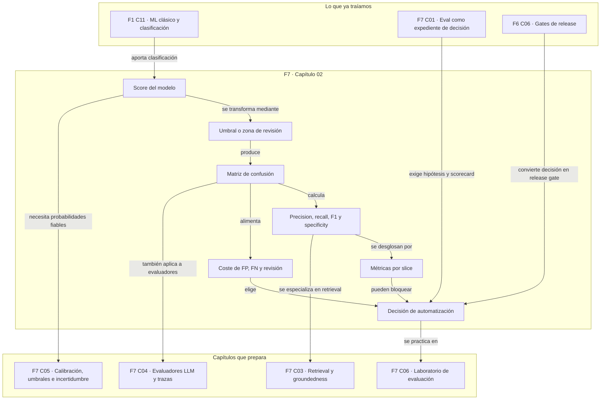

::: {.fasciculo-subtitle}
Facsímil 7 · Evaluar, calibrar e interpretar
:::

# Capítulo 02: Métricas clásicas: matriz de confusión y coste del error

## Qué deberías poder hacer al terminar

En el capítulo anterior construimos una eval como expediente: hipótesis, casos, graders, scorecard y decisión. Ahora bajamos a las métricas clásicas de clasificación. No porque sean antiguas, sino porque siguen siendo la primera herramienta seria para responder una pregunta básica:

> Cuando mi sistema decide, ¿qué tipo de aciertos y errores está produciendo?

Al terminar este capítulo deberías poder hacer esto:

| Resultado de aprendizaje | Evidencia de que lo sabes hacer |
|---|---|
| Leer una matriz de confusión. | Distingues verdaderos positivos, falsos positivos, verdaderos negativos y falsos negativos. |
| Calcular métricas básicas. | Obtienes accuracy, precision, recall, specificity, F1, F-beta y balanced accuracy. |
| Elegir métrica según decisión. | No optimizas accuracy si el error importante vive en una clase minoritaria. |
| Traducir métricas a coste. | Asignas coste a FP, FN y revisión antes de elegir umbral. |
| Comparar umbrales. | Escaneas umbrales y eliges por coste, cobertura y restricciones. |
| Construir una práctica real. | Produces un script que genera matriz, métricas, umbral recomendado y decisión escrita. |

La idea central: **una métrica no es una medalla; es una forma comprimida de hablar de consecuencias**.

## El problema: una accuracy alta puede ser una mala noticia

Imagina un clasificador que decide si un ticket de soporte debe tratarse como urgente. De cada 100 tickets, solo 10 son realmente urgentes. Un sistema perezoso podría decir “ninguno es urgente” y acertar 90 veces.

Eso le da 90 % de accuracy.

Y aun así sería un desastre operativo, porque no detecta ni un ticket urgente.

Esta es la razón por la que las métricas clásicas no son un trámite. Si el problema está desbalanceado, si los errores cuestan distinto o si existe revisión humana, una cifra global puede ocultar justo lo que necesitas ver.

## Qué no debes hacer con estas métricas

No debes tratar `accuracy` como sinónimo de calidad. Sirve cuando las clases están razonablemente equilibradas y los errores cuestan parecido. En muchos sistemas de IA aplicada no se cumplen esas dos condiciones.

No debes elegir umbral `0.5` por costumbre. Un score de 0,5 no significa necesariamente “mitad de riesgo real”, y aunque lo significara, quizá el coste de perder un positivo sea cinco, diez o cien veces mayor que el coste de revisar un caso de más.

No debes elegir F1 porque suena técnico. F1 resume precision y recall, pero no sabe nada de dinero, tiempo humano, capacidad de revisión, impacto en usuario ni criticidad del dominio.

Tampoco debes comparar AUC, F1 o cualquier métrica agregada sin mirar slices. Una media global puede mejorar mientras empeora un idioma, una región, una categoría o una clase poco frecuente.

## Qué sí es una matriz de confusión

Una matriz de confusión cruza dos cosas:

1. Lo que era verdad.
2. Lo que el sistema decidió.

Para clasificación binaria:

|  | Predice positivo | Predice negativo |
|---|---:|---:|
| Real positivo | TP | FN |
| Real negativo | FP | TN |

En nuestro ejemplo:

| Símbolo | Significado | Ejemplo |
|---|---|---|
| TP | Verdadero positivo. | Ticket urgente marcado como urgente. |
| FP | Falso positivo. | Ticket normal marcado como urgente. |
| FN | Falso negativo. | Ticket urgente marcado como normal. |
| TN | Verdadero negativo. | Ticket normal marcado como normal. |

La matriz obliga a hacer una pregunta adulta: **¿qué error duele más?**

## Fecha de corte del estado del arte

**Fecha de corte:** 28 de mayo de 2026.  
**Fuentes consultadas:** documentación de scikit-learn sobre métricas de clasificación, matriz de confusión y `classification_report`; trabajos clásicos sobre ROC; relación entre curvas precision-recall y ROC; uso de precision-recall en datasets desbalanceados; crítica a AUC como medida universal; y métricas de precision, recall, F-measure e indicadores relacionados.

scikit-learn documenta métricas como accuracy, balanced accuracy, precision, recall, F-measure, ROC AUC, matriz de confusión y reportes de clasificación, con APIs de referencia para calcularlas de forma reproducible.^[scikit-learn. (2026). *Classification Metrics*. https://scikit-learn.org/stable/modules/model_evaluation.html#classification-metrics. Consultado el 28 de mayo de 2026.] La función `confusion_matrix` cuenta observaciones reales frente a predichas por clase.^[scikit-learn. (2026). *confusion_matrix*. https://scikit-learn.org/stable/modules/generated/sklearn.metrics.confusion_matrix.html. Consultado el 28 de mayo de 2026.] `classification_report` resume precision, recall, F1 y soporte por clase.^[scikit-learn. (2026). *classification_report*. https://scikit-learn.org/stable/modules/generated/sklearn.metrics.classification_report.html. Consultado el 28 de mayo de 2026.]

Fawcett presentó ROC como una herramienta para visualizar el trade-off entre tasa de verdaderos positivos y tasa de falsos positivos en clasificadores.^[Fawcett, T. (2006). An introduction to ROC analysis. *Pattern Recognition Letters*, 27(8), 861-874. https://doi.org/10.1016/j.patrec.2005.10.010] Davis y Goadrich explicaron la relación entre ROC y precision-recall, y por qué ambas vistas no son intercambiables sin más.^[Davis, J. y Goadrich, M. (2006). The relationship between precision-recall and ROC curves. *Proceedings of the 23rd International Conference on Machine Learning*, 233-240. https://doi.org/10.1145/1143844.1143874] Saito y Rehmsmeier mostraron que, en datasets desbalanceados, la curva precision-recall suele ser más informativa que ROC para evaluar clasificadores binarios.^[Saito, T. y Rehmsmeier, M. (2015). The precision-recall plot is more informative than the ROC plot when evaluating binary classifiers on imbalanced datasets. *PLOS ONE*, 10(3), e0118432. https://doi.org/10.1371/journal.pone.0118432]

La parte estable es matemática. La parte que cambia por proyecto es el coste del error, la capacidad de revisión, el umbral y la decisión que queremos automatizar.

## La anatomía de la decisión

<figure id="f7-c02-matriz-coste-umbral" class="book-figure book-figure-svg">
<svg viewBox="0 0 1760 1240" role="img" aria-labelledby="f7-c02-title f7-c02-desc" xmlns="http://www.w3.org/2000/svg">
  <title id="f7-c02-title">De scores a matriz de confusión y coste operativo</title>
  <desc id="f7-c02-desc">Diagrama en blanco, negro y gris que muestra cómo un score se convierte en decisión mediante umbrales, produce una matriz de confusión, se traduce a coste y alimenta una política de revisión.</desc>
  <defs>
    <marker id="f7c02-arrow" markerWidth="12" markerHeight="12" refX="10" refY="6" orient="auto">
      <path d="M1 1 L11 6 L1 11 Z" fill="#111111"/>
    </marker>
    <pattern id="f7c02-grid" width="30" height="30" patternUnits="userSpaceOnUse">
      <path d="M 30 0 L 0 0 0 30" fill="none" stroke="#E7E7E7" stroke-width="1"/>
    </pattern>
    <style>
      .f7c02-bg{fill:#FFFFFF}
      .f7c02-grid{fill:url(#f7c02-grid)}
      .f7c02-title{font-family:Inter,Arial,sans-serif;font-size:34px;font-weight:800;fill:#111111}
      .f7c02-sub{font-family:Inter,Arial,sans-serif;font-size:18px;fill:#444444}
      .f7c02-box{fill:#FFFFFF;stroke:#111111;stroke-width:2}
      .f7c02-soft{fill:#F7F7F7;stroke:#111111;stroke-width:1.7}
      .f7c02-dark{fill:#111111;stroke:#111111;stroke-width:2}
      .f7c02-label{font-family:Inter,Arial,sans-serif;font-size:19px;font-weight:800;fill:#111111}
      .f7c02-small{font-family:Inter,Arial,sans-serif;font-size:14px;fill:#333333}
      .f7c02-tiny{font-family:Inter,Arial,sans-serif;font-size:12px;fill:#666666}
      .f7c02-white{font-family:Inter,Arial,sans-serif;font-size:18px;font-weight:800;fill:#FFFFFF}
      .f7c02-code{font-family:ui-monospace,SFMono-Regular,Menlo,Consolas,monospace;font-size:14px;fill:#111111}
      .f7c02-line{stroke:#111111;stroke-width:2;fill:none;marker-end:url(#f7c02-arrow)}
      .f7c02-axis{stroke:#111111;stroke-width:1.8;fill:none}
      .f7c02-dash{stroke:#777777;stroke-width:1.6;stroke-dasharray:7 7;fill:none;marker-end:url(#f7c02-arrow)}
      .f7c02-bar{fill:#111111}
      .f7c02-bar2{fill:#DADADA;stroke:#111111;stroke-width:1}
    </style>
  </defs>

  <rect class="f7c02-bg" x="0" y="0" width="1760" height="1240"/>
  <rect class="f7c02-grid" x="52" y="48" width="1656" height="1090" rx="22"/>

  <text class="f7c02-title" x="92" y="112">Métricas clásicas como circuito de decisión</text>
  <text class="f7c02-sub" x="92" y="146">Score, umbrales, matriz, coste y revisión forman una sola política operativa.</text>

  <rect class="f7c02-dark" x="92" y="204" width="314" height="64" rx="12"/>
  <text class="f7c02-white" x="249" y="245" text-anchor="middle">1 · Scores del modelo</text>
  <rect class="f7c02-box" x="92" y="292" width="314" height="250" rx="14"/>
  <text class="f7c02-label" x="122" y="332">Distribución de scores</text>
  <line class="f7c02-axis" x1="132" y1="482" x2="366" y2="482"/>
  <line class="f7c02-axis" x1="132" y1="482" x2="132" y2="370"/>
  <rect class="f7c02-bar2" x="150" y="430" width="20" height="52"/>
  <rect class="f7c02-bar2" x="176" y="410" width="20" height="72"/>
  <rect class="f7c02-bar2" x="202" y="392" width="20" height="90"/>
  <rect class="f7c02-bar2" x="228" y="420" width="20" height="62"/>
  <rect class="f7c02-bar" x="254" y="398" width="20" height="84"/>
  <rect class="f7c02-bar" x="280" y="378" width="20" height="104"/>
  <rect class="f7c02-bar" x="306" y="350" width="20" height="132"/>
  <rect class="f7c02-bar" x="332" y="388" width="20" height="94"/>
  <line x1="246" y1="358" x2="246" y2="500" stroke="#111111" stroke-width="2" stroke-dasharray="5 5"/>
  <line x1="306" y1="346" x2="306" y2="500" stroke="#111111" stroke-width="2"/>
  <text class="f7c02-tiny" x="246" y="520" text-anchor="middle">t bajo</text>
  <text class="f7c02-tiny" x="306" y="520" text-anchor="middle">t alto</text>
  <text class="f7c02-small" x="122" y="374">negativos y positivos se mezclan</text>

  <path class="f7c02-line" d="M406 418 C466 418 486 418 546 418"/>

  <rect class="f7c02-dark" x="546" y="204" width="342" height="64" rx="12"/>
  <text class="f7c02-white" x="717" y="245" text-anchor="middle">2 · Política de umbrales</text>
  <rect class="f7c02-box" x="546" y="292" width="342" height="250" rx="14"/>
  <text class="f7c02-label" x="576" y="332">Tres salidas, no dos</text>
  <rect class="f7c02-soft" x="582" y="366" width="270" height="42" rx="8"/>
  <text class="f7c02-small" x="717" y="393" text-anchor="middle">score ≤ t bajo → normal</text>
  <rect class="f7c02-box" x="582" y="424" width="270" height="42" rx="8"/>
  <text class="f7c02-small" x="717" y="451" text-anchor="middle">zona gris → revisar</text>
  <rect class="f7c02-dark" x="582" y="482" width="270" height="42" rx="8"/>
  <text class="f7c02-white" x="717" y="509" text-anchor="middle">score ≥ t alto → urgente</text>
  <text class="f7c02-tiny" x="576" y="552">La revisión es una decisión, no un fracaso.</text>

  <path class="f7c02-line" d="M888 418 C948 418 970 418 1030 418"/>

  <rect class="f7c02-dark" x="1030" y="204" width="342" height="64" rx="12"/>
  <text class="f7c02-white" x="1201" y="245" text-anchor="middle">3 · Matriz de confusión</text>
  <rect class="f7c02-box" x="1030" y="292" width="342" height="250" rx="14"/>
  <text class="f7c02-label" x="1060" y="332">Solo decisiones automáticas</text>
  <rect class="f7c02-soft" x="1060" y="360" width="128" height="58" rx="8"/>
  <text class="f7c02-label" x="1124" y="392" text-anchor="middle">TP</text>
  <text class="f7c02-tiny" x="1124" y="410" text-anchor="middle">positivo detectado</text>
  <rect class="f7c02-box" x="1208" y="360" width="128" height="58" rx="8"/>
  <text class="f7c02-label" x="1272" y="392" text-anchor="middle">FN</text>
  <text class="f7c02-tiny" x="1272" y="410" text-anchor="middle">positivo perdido</text>
  <rect class="f7c02-box" x="1060" y="438" width="128" height="58" rx="8"/>
  <text class="f7c02-label" x="1124" y="470" text-anchor="middle">FP</text>
  <text class="f7c02-tiny" x="1124" y="488" text-anchor="middle">alarma extra</text>
  <rect class="f7c02-soft" x="1208" y="438" width="128" height="58" rx="8"/>
  <text class="f7c02-label" x="1272" y="470" text-anchor="middle">TN</text>
  <text class="f7c02-tiny" x="1272" y="488" text-anchor="middle">normal correcto</text>
  <text class="f7c02-tiny" x="1060" y="530">Los casos revisados se cuentan aparte.</text>

  <path class="f7c02-line" d="M1372 418 C1426 418 1442 418 1496 418"/>

  <rect class="f7c02-dark" x="1496" y="204" width="174" height="64" rx="12"/>
  <text class="f7c02-white" x="1583" y="245" text-anchor="middle">4 · Coste</text>
  <rect class="f7c02-box" x="1496" y="292" width="174" height="250" rx="14"/>
  <text class="f7c02-code" x="1518" y="338">C = FP·cFP</text>
  <text class="f7c02-code" x="1518" y="366">  + FN·cFN</text>
  <text class="f7c02-code" x="1518" y="394">  + REV·cR</text>
  <line x1="1518" y1="420" x2="1648" y2="420" stroke="#D0D0D0"/>
  <text class="f7c02-small" x="1518" y="456">elige umbral</text>
  <text class="f7c02-small" x="1518" y="482">por coste y</text>
  <text class="f7c02-small" x="1518" y="508">capacidad</text>

  <rect class="f7c02-box" x="92" y="672" width="450" height="250" rx="16"/>
  <text class="f7c02-label" x="124" y="718">Métricas de lectura</text>
  <text class="f7c02-code" x="124" y="758">precision = TP / (TP + FP)</text>
  <text class="f7c02-code" x="124" y="792">recall    = TP / (TP + FN)</text>
  <text class="f7c02-code" x="124" y="826">F1        = 2PR / (P + R)</text>
  <text class="f7c02-code" x="124" y="860">specificity = TN / (TN + FP)</text>
  <text class="f7c02-tiny" x="124" y="900">La métrica correcta depende del coste del error.</text>

  <rect class="f7c02-box" x="640" y="672" width="470" height="250" rx="16"/>
  <text class="f7c02-label" x="672" y="718">Lectura por slices</text>
  <text class="f7c02-small" x="672" y="758">• clase positiva rara</text>
  <text class="f7c02-small" x="672" y="792">• canal, idioma o producto</text>
  <text class="f7c02-small" x="672" y="826">• tramo de score cerca del umbral</text>
  <text class="f7c02-small" x="672" y="860">• capacidad real de revisión</text>
  <text class="f7c02-tiny" x="672" y="900">Si un slice crítico cae, el promedio no salva la release.</text>

  <rect class="f7c02-box" x="1208" y="672" width="462" height="250" rx="16"/>
  <text class="f7c02-label" x="1240" y="718">Salida profesional</text>
  <text class="f7c02-small" x="1240" y="758">1. matriz por umbral</text>
  <text class="f7c02-small" x="1240" y="792">2. coste total y revisión</text>
  <text class="f7c02-small" x="1240" y="826">3. decisión escrita</text>
  <text class="f7c02-small" x="1240" y="860">4. siguiente acción técnica</text>
  <text class="f7c02-tiny" x="1240" y="900">No basta con “F1 sube”: hay que decir qué cambia.</text>

  <path class="f7c02-dash" d="M1583 542 C1500 622 1350 632 1220 604 C920 536 600 560 390 640"/>
  <text class="f7c02-tiny" x="982" y="612" text-anchor="middle">el coste devuelve presión sobre el umbral</text>

  <text x="1660" y="1188" text-anchor="end" class="tiny" fill="#888888" opacity="0.45">IA para gente curiosa / Facsímil 07 / Capítulo 02 / 686f6c61</text>
</svg>
<figcaption>Una métrica clásica solo tiene sentido dentro de una política: scores, umbrales, matriz, coste, revisión y decisión.</figcaption>
</figure>

## Las métricas básicas, con símbolos claros

Partimos de:

$$
N = TP + FP + FN + TN
$$

| Símbolo | Significado | Ejemplo |
|---|---|---|
| \(N\) | Número total de casos evaluados. | 100 tickets. |
| \(TP\) | Positivos reales predichos como positivos. | 18 urgentes detectados. |
| \(FP\) | Negativos reales predichos como positivos. | 7 normales marcados urgentes. |
| \(FN\) | Positivos reales predichos como negativos. | 4 urgentes perdidos. |
| \(TN\) | Negativos reales predichos como negativos. | 71 normales bien clasificados. |

La **accuracy** mide proporción total de aciertos:

$$
accuracy = \frac{TP + TN}{N}
$$

| Símbolo | Significado | Ejemplo |
|---|---|---|
| \(accuracy\) | Aciertos totales sobre casos totales. | \((18+71)/100=0,89\). |
| \(TP + TN\) | Decisiones correctas. | 89. |
| \(N\) | Total de casos. | 100. |

La **precision** responde: de lo que marqué como positivo, ¿cuánto lo era de verdad?

$$
precision = \frac{TP}{TP + FP}
$$

| Símbolo | Significado | Ejemplo |
|---|---|---|
| \(precision\) | Pureza de las predicciones positivas. | \(18/(18+7)=0,72\). |
| \(TP\) | Positivos correctos. | 18. |
| \(FP\) | Positivos que no lo eran. | 7. |

El **recall** responde: de los positivos reales, ¿cuántos encontré?

$$
recall = \frac{TP}{TP + FN}
$$

| Símbolo | Significado | Ejemplo |
|---|---|---|
| \(recall\) | Cobertura de positivos reales. | \(18/(18+4)=0,82\). |
| \(TP\) | Positivos encontrados. | 18. |
| \(FN\) | Positivos perdidos. | 4. |

La **specificity** responde: de los negativos reales, ¿cuántos dejé como negativos?

$$
specificity = \frac{TN}{TN + FP}
$$

| Símbolo | Significado | Ejemplo |
|---|---|---|
| \(specificity\) | Cobertura de negativos reales. | \(71/(71+7)=0,91\). |
| \(TN\) | Negativos correctos. | 71. |
| \(FP\) | Negativos marcados como positivos. | 7. |

F1 resume precision y recall con media armónica:

$$
F1 = \frac{2 \cdot precision \cdot recall}{precision + recall}
$$

| Símbolo | Significado | Ejemplo |
|---|---|---|
| \(F1\) | Equilibrio entre precision y recall. | \(2·0,72·0,82/(0,72+0,82)=0,77\). |
| \(precision\) | Pureza de positivos predichos. | 0,72. |
| \(recall\) | Cobertura de positivos reales. | 0,82. |

F-beta permite dar más peso a recall o a precision:

$$
F_{\beta} =
\frac{(1+\beta^2)\cdot precision \cdot recall}
{\beta^2\cdot precision + recall}
$$

| Símbolo | Significado | Ejemplo |
|---|---|---|
| \(F_{\beta}\) | F-score con peso ajustable. | \(F_2\) prioriza recall. |
| \(\beta\) | Peso relativo de recall frente a precision. | \(\beta=2\). |
| \(precision\) | Pureza de positivos predichos. | 0,72. |
| \(recall\) | Cobertura de positivos reales. | 0,82. |

Powers revisa precision, recall, F-measure y medidas relacionadas como informedness, markedness y correlación, útiles para no reducir la evaluación a una sola cifra sin contexto.^[Powers, D. M. W. (2011). Evaluation: From Precision, Recall and F-Measure to ROC, Informedness, Markedness and Correlation. *Journal of Machine Learning Technologies*, 2(1), 37-63.]

## Accuracy, balanced accuracy y clases desbalanceadas

Cuando hay muchas más clases negativas que positivas, `accuracy` puede ser muy complaciente.

Una alternativa sencilla es balanced accuracy:

$$
balanced\ accuracy =
\frac{recall + specificity}{2}
$$

| Símbolo | Significado | Ejemplo |
|---|---|---|
| \(balanced\ accuracy\) | Media entre cobertura positiva y negativa. | \((0,82+0,91)/2=0,865\). |
| \(recall\) | Tasa de positivos encontrados. | 0,82. |
| \(specificity\) | Tasa de negativos bien descartados. | 0,91. |

Balanced accuracy evita que una clase mayoritaria tape la lectura de la minoritaria, pero sigue sin saber cuánto cuesta cada error.

## El coste del error

Ahora viene la parte que nos baja a tierra. Si \(c_{FP}\) es el coste de un falso positivo y \(c_{FN}\) el coste de un falso negativo:

$$
C = c_{FP}\cdot FP + c_{FN}\cdot FN
$$

| Símbolo | Significado | Ejemplo |
|---|---|---|
| \(C\) | Coste total de errores automáticos. | 62 unidades. |
| \(c_{FP}\) | Coste por falso positivo. | 2. |
| \(FP\) | Número de falsos positivos. | 7. |
| \(c_{FN}\) | Coste por falso negativo. | 12. |
| \(FN\) | Número de falsos negativos. | 4. |

Con esos números:

$$
C = 2\cdot7 + 12\cdot4 = 14 + 48 = 62
$$

Si añadir revisión humana cuesta \(c_R\) por caso revisado:

$$
C_{operativo} =
c_{FP}\cdot FP
+ c_{FN}\cdot FN
+ c_R\cdot REV
$$

| Símbolo | Significado | Ejemplo |
|---|---|---|
| \(C_{operativo}\) | Coste total incluyendo revisión. | 41 unidades. |
| \(REV\) | Casos enviados a revisión. | 18. |
| \(c_R\) | Coste por revisar un caso. | 1,5. |

Esta fórmula cambia la conversación. Ya no discutimos “me gusta más este modelo”. Discutimos si preferimos automatizar más, revisar más o aceptar cierto tipo de error.

Hand criticó el uso acrítico de AUC como medida universal porque implica supuestos sobre costes y distribuciones que no siempre coinciden con el problema real.^[Hand, D. J. (2009). Measuring classifier performance: A coherent alternative to the area under the ROC curve. *Machine Learning*, 77(1), 103-123. https://doi.org/10.1007/s10994-009-5119-5] Esa es una lección importante: una métrica agregada siempre lleva escondida una filosofía de decisión.

## Umbrales: mover la frontera cambia el sistema

Un clasificador suele devolver un score. El umbral convierte ese score en acción.

$$
\hat{y} =
\begin{cases}
1 & \text{si } s \ge t \\
0 & \text{si } s < t
\end{cases}
$$

| Símbolo | Significado | Ejemplo |
|---|---|---|
| \(\hat{y}\) | Clase predicha. | 1 = urgente. |
| \(s\) | Score del modelo. | 0,73. |
| \(t\) | Umbral de decisión. | 0,70. |

Si subes \(t\), normalmente sube precision y baja recall: marcas menos casos como positivos. Si bajas \(t\), normalmente sube recall y baja precision: detectas más positivos, pero generas más falsos positivos.

En sistemas reales, muchas veces usamos dos umbrales:

$$
decision(s) =
\begin{cases}
normal & \text{si } s \le t_{bajo} \\
revisar & \text{si } t_{bajo} < s < t_{alto} \\
urgente & \text{si } s \ge t_{alto}
\end{cases}
$$

| Símbolo | Significado | Ejemplo |
|---|---|---|
| \(t_{bajo}\) | Umbral por debajo del cual automatizamos negativo. | 0,45. |
| \(t_{alto}\) | Umbral por encima del cual automatizamos positivo. | 0,80. |
| \(revisar\) | Zona gris que no automatizamos. | Tickets entre 0,45 y 0,80. |

La zona gris es una herramienta de ingeniería. Reduce errores automáticos a cambio de más trabajo de revisión.

## ROC, PR y qué mirar primero

ROC compara tasa de verdaderos positivos contra tasa de falsos positivos mientras movemos el umbral:

$$
TPR = \frac{TP}{TP + FN}
$$

$$
FPR = \frac{FP}{FP + TN}
$$

| Símbolo | Significado | Ejemplo |
|---|---|---|
| \(TPR\) | True Positive Rate; lo mismo que recall. | 0,82. |
| \(FPR\) | False Positive Rate. | \(7/(7+71)=0,09\). |

Precision-recall mira precision contra recall. En clases muy desbalanceadas, PR suele enseñar mejor si los positivos predichos están llenos de ruido. Por eso Saito y Rehmsmeier recomiendan mirar precision-recall en datasets desbalanceados.^[Saito y Rehmsmeier, 2015.]

Lectura práctica:

| Situación | Métrica o curva que miraría primero |
|---|---|
| Clases equilibradas y costes parecidos. | Accuracy, matriz, F1 y ROC. |
| Positivo raro y caro de perder. | Recall, PR curve, F-beta con \(\beta>1\), coste de FN. |
| Positivo marcado genera trabajo humano. | Precision, coste de FP, tasa de revisión. |
| Decisión con score usado como probabilidad. | Calibración, Brier/log loss y umbrales; lo veremos en el capítulo 05. |
| Sistema con slices críticos. | Métricas por slice antes que media global. |

## Cómo se ve en un proyecto real

Supón que un equipo quiere automatizar priorización de tickets. No necesita solo “un modelo que clasifique”. Necesita una política:

| Pregunta | Decisión concreta |
|---|---|
| ¿Qué clase positiva importa? | `urgente`. |
| ¿Qué coste tiene perder un urgente? | Alto: afecta tiempos de respuesta y continuidad. |
| ¿Qué coste tiene marcar normal como urgente? | Medio: consume revisión y altera prioridad. |
| ¿Cuántos casos puede revisar el equipo? | Por ejemplo, 25 % del volumen diario. |
| ¿Qué umbral acepta producto? | El que minimice coste respetando capacidad y recall mínimo. |
| ¿Qué pasa si el volumen cambia? | Se monitoriza base rate, matriz por día y cola de revisión. |

El capítulo 01 nos enseñó a crear el expediente. Este capítulo añade el motor numérico para defenderlo.

## Manos a la obra

**Práctica:** elegir umbral por coste y revisión.

Kit ejecutable de este capítulo: `labs/f7/capitulo-practicas/`.

```bash
cd labs/f7/capitulo-practicas
python3 ops/run_f7_practices.py --chapter c02 --write --fail-on-invalid
```

Vamos a construir un mini evaluador de umbrales con dos salidas automáticas y una zona de revisión. No usa librerías externas. La práctica deja tres artefactos:

```text
evals/
  classification_cases.jsonl
ops/
  ai/
    threshold_policy.json
    threshold_eval.py
output/
  threshold_scorecard.json
  threshold_decision.md
```

### Casos de evaluación

Guarda esto como `evals/classification_cases.jsonl`:

```jsonl
{"case_id":"ticket_001","score":0.93,"label":1,"slice":"pagos","text":"Cargo duplicado y servicio bloqueado"}
{"case_id":"ticket_002","score":0.86,"label":1,"slice":"acceso","text":"No puedo entrar al sistema principal"}
{"case_id":"ticket_003","score":0.79,"label":0,"slice":"consulta","text":"Pregunta sobre horario de atención"}
{"case_id":"ticket_004","score":0.72,"label":1,"slice":"acceso","text":"Cuenta de equipo sin acceso antes de entrega"}
{"case_id":"ticket_005","score":0.64,"label":0,"slice":"consulta","text":"Consulta general sobre documentación"}
{"case_id":"ticket_006","score":0.56,"label":1,"slice":"pagos","text":"Pago confirmado pero cuenta sigue limitada"}
{"case_id":"ticket_007","score":0.48,"label":0,"slice":"consulta","text":"Cambio de datos de contacto"}
{"case_id":"ticket_008","score":0.43,"label":0,"slice":"soporte","text":"Solicitud de copia de factura"}
{"case_id":"ticket_009","score":0.37,"label":1,"slice":"acceso","text":"Acceso intermitente en periodo de cierre"}
{"case_id":"ticket_010","score":0.30,"label":0,"slice":"consulta","text":"Pregunta sobre plazos futuros"}
{"case_id":"ticket_011","score":0.24,"label":0,"slice":"soporte","text":"Duda sobre plantilla de correo"}
{"case_id":"ticket_012","score":0.11,"label":0,"slice":"consulta","text":"Saludo y pregunta no operativa"}
```

### Política de coste

Guarda esto como `ops/ai/threshold_policy.json`:

```json
{
  "positive_label": "urgente",
  "negative_label": "normal",
  "cost_false_positive": 2.0,
  "cost_false_negative": 12.0,
  "cost_review": 1.5,
  "max_review_rate": 0.35,
  "min_operational_recall": 0.9,
  "threshold_grid": [0.2, 0.3, 0.4, 0.5, 0.6, 0.7, 0.8, 0.9],
  "decision_owner": "equipo-ia",
  "if_no_policy_passes": "mantener revisión manual y ampliar dataset"
}
```

### Evaluador ejecutable

Guarda esto como `ops/ai/threshold_eval.py`:

```python
#!/usr/bin/env python3
import argparse
import json
from pathlib import Path


ROOT = Path(__file__).resolve().parents[2]
DEFAULT_CASES = ROOT / "evals" / "classification_cases.jsonl"
DEFAULT_POLICY = ROOT / "ops" / "ai" / "threshold_policy.json"
DEFAULT_OUTPUT = ROOT / "output" / "threshold_scorecard.json"
DEFAULT_DECISION = ROOT / "output" / "threshold_decision.md"


def load_jsonl(path):
    rows = []
    with path.open(encoding="utf-8") as handle:
        for line_number, line in enumerate(handle, start=1):
            line = line.strip()
            if not line:
                continue
            try:
                rows.append(json.loads(line))
            except json.JSONDecodeError as exc:
                raise SystemExit(f"{path}:{line_number}: JSONL inválido: {exc}") from exc
    return rows


def load_json(path):
    with path.open(encoding="utf-8") as handle:
        return json.load(handle)


def safe_div(num, den):
    return 0.0 if den == 0 else num / den


def decide(score, low, high):
    if score <= low:
        return "normal"
    if score >= high:
        return "urgente"
    return "review"


def evaluate_policy(cases, policy, low, high):
    counts = {
        "tp": 0,
        "fp": 0,
        "fn": 0,
        "tn": 0,
        "review_positive": 0,
        "review_negative": 0,
    }
    slice_counts = {}
    decisions = []

    for row in cases:
        label = int(row["label"])
        action = decide(float(row["score"]), low, high)
        slice_name = row["slice"]
        slice_counts.setdefault(
            slice_name,
            {"tp": 0, "fp": 0, "fn": 0, "tn": 0, "review": 0, "total": 0},
        )
        slice_counts[slice_name]["total"] += 1

        if action == "review":
            key = "review_positive" if label == 1 else "review_negative"
            counts[key] += 1
            slice_counts[slice_name]["review"] += 1
        elif action == "urgente" and label == 1:
            counts["tp"] += 1
            slice_counts[slice_name]["tp"] += 1
        elif action == "urgente" and label == 0:
            counts["fp"] += 1
            slice_counts[slice_name]["fp"] += 1
        elif action == "normal" and label == 1:
            counts["fn"] += 1
            slice_counts[slice_name]["fn"] += 1
        elif action == "normal" and label == 0:
            counts["tn"] += 1
            slice_counts[slice_name]["tn"] += 1

        decisions.append(
            {
                "case_id": row["case_id"],
                "score": row["score"],
                "label": label,
                "slice": slice_name,
                "action": action,
            }
        )

    tp = counts["tp"]
    fp = counts["fp"]
    fn = counts["fn"]
    tn = counts["tn"]
    review = counts["review_positive"] + counts["review_negative"]
    total = len(cases)
    positives = tp + fn + counts["review_positive"]
    negatives = tn + fp + counts["review_negative"]

    precision = safe_div(tp, tp + fp)
    recall_auto = safe_div(tp, tp + fn)
    operational_recall = safe_div(tp + counts["review_positive"], positives)
    specificity = safe_div(tn, tn + fp)
    f1 = safe_div(2 * precision * recall_auto, precision + recall_auto)
    balanced_accuracy = (recall_auto + specificity) / 2
    review_rate = safe_div(review, total)
    automation_rate = safe_div(total - review, total)
    cost = (
        policy["cost_false_positive"] * fp
        + policy["cost_false_negative"] * fn
        + policy["cost_review"] * review
    )

    passes_constraints = (
        review_rate <= policy["max_review_rate"]
        and operational_recall >= policy["min_operational_recall"]
    )

    return {
        "threshold_low": low,
        "threshold_high": high,
        "counts": counts,
        "metrics": {
            "precision_auto_urgent": round(precision, 4),
            "recall_auto_urgent": round(recall_auto, 4),
            "operational_recall": round(operational_recall, 4),
            "specificity_auto_normal": round(specificity, 4),
            "f1_auto_urgent": round(f1, 4),
            "balanced_accuracy_auto": round(balanced_accuracy, 4),
            "review_rate": round(review_rate, 4),
            "automation_rate": round(automation_rate, 4),
            "cost": round(cost, 4),
            "positives": positives,
            "negatives": negatives,
        },
        "slice_counts": slice_counts,
        "passes_constraints": passes_constraints,
        "decisions": decisions,
    }


def scan(cases, policy):
    grid = policy["threshold_grid"]
    candidates = []
    for low in grid:
        for high in grid:
            if low >= high:
                continue
            candidates.append(evaluate_policy(cases, policy, low, high))

    feasible = [item for item in candidates if item["passes_constraints"]]
    pool = feasible if feasible else candidates
    best = sorted(
        pool,
        key=lambda item: (
            item["metrics"]["cost"],
            -item["metrics"]["operational_recall"],
            item["metrics"]["review_rate"],
        ),
    )[0]
    return candidates, feasible, best


def render_decision(scorecard):
    best = scorecard["recommended_policy"]
    metrics = best["metrics"]
    return "\n".join(
        [
            "# Decisión de umbral",
            "",
            f"- Umbral bajo: `{best['threshold_low']}`",
            f"- Umbral alto: `{best['threshold_high']}`",
            f"- Coste: `{metrics['cost']}`",
            f"- Recall operativo: `{metrics['operational_recall']}`",
            f"- Tasa de revisión: `{metrics['review_rate']}`",
            f"- Tasa de automatización: `{metrics['automation_rate']}`",
            f"- ¿Cumple restricciones?: `{best['passes_constraints']}`",
            "",
            "## Lectura",
            "",
            "La política recomendada no maximiza una métrica aislada. Minimiza coste respetando recall operativo y capacidad de revisión.",
            "",
        ]
    )


def main():
    parser = argparse.ArgumentParser()
    parser.add_argument("--cases", default=DEFAULT_CASES)
    parser.add_argument("--policy", default=DEFAULT_POLICY)
    parser.add_argument("--output", default=DEFAULT_OUTPUT)
    parser.add_argument("--decision-output", default=DEFAULT_DECISION)
    parser.add_argument("--write", action="store_true")
    args = parser.parse_args()

    cases = load_jsonl(Path(args.cases))
    policy = load_json(Path(args.policy))
    candidates, feasible, best = scan(cases, policy)
    scorecard = {
        "eval_name": "threshold_cost_policy_eval",
        "policy": policy,
        "cases": len(cases),
        "evaluated_policies": len(candidates),
        "feasible_policies": len(feasible),
        "recommended_policy": best,
    }

    rendered = json.dumps(scorecard, indent=2, ensure_ascii=False)
    print(rendered)

    if args.write:
        output_path = Path(args.output)
        output_path.parent.mkdir(parents=True, exist_ok=True)
        output_path.write_text(rendered + "\n", encoding="utf-8")
        decision_path = Path(args.decision_output)
        decision_path.parent.mkdir(parents=True, exist_ok=True)
        decision_path.write_text(render_decision(scorecard), encoding="utf-8")


if __name__ == "__main__":
    main()
```

### Cómo lo ejecutas

```bash
python ops/ai/threshold_eval.py --write
cat output/threshold_scorecard.json
cat output/threshold_decision.md
```

### Qué deberías ver

El script escanea pares de umbrales. Cada par produce una matriz de decisiones automáticas, una tasa de revisión, un coste y un veredicto sobre restricciones. En esta muestra, deberías ver una política recomendada parecida a:

```json
{
  "threshold_low": 0.3,
  "threshold_high": 0.5,
  "counts": {
    "tp": 4,
    "fp": 2,
    "fn": 0,
    "tn": 3,
    "review_positive": 1,
    "review_negative": 2
  },
  "metrics": {
    "precision_auto_urgent": 0.6667,
    "operational_recall": 1.0,
    "review_rate": 0.25,
    "cost": 8.5
  },
  "passes_constraints": true
}
```

La recomendación no es “porque F1 sale más alto”, sino porque minimiza coste respetando recall operativo y capacidad de revisión. Si en tu proyecto ninguna política cumple restricciones, esa también es una salida válida: “no automatices todavía; necesitas más datos, cambiar la política de revisión o aceptar otro equilibrio”.

### Cómo lo adaptarías a tu proyecto

| Pieza | Qué cambiarías |
|---|---|
| `score` | Score real de tu modelo, clasificador, router o regla. |
| `label` | Etiqueta revisada: 1 si debía actuar, 0 si no. |
| `slice` | Producto, canal, idioma, tipo de cliente, prioridad o región. |
| `cost_false_positive` | Coste real de actuar cuando no tocaba. |
| `cost_false_negative` | Coste real de no actuar cuando sí tocaba. |
| `cost_review` | Minutos, euros o capacidad consumida por revisar. |
| `max_review_rate` | Capacidad máxima de revisión del equipo. |
| `min_operational_recall` | Mínimo de positivos que deben quedar cubiertos por acción o revisión. |

### Qué entregaría un alumno

1. Dataset de al menos 30 casos con score, label y slice.
2. Política de costes justificada en una tabla.
3. Script que escanee umbrales.
4. Scorecard con política recomendada.
5. Matriz de confusión para la política elegida.
6. Decisión escrita: automatizar, revisar zona gris o no publicar.
7. Análisis de dos slices donde el promedio pueda ocultar problemas.

## Cómo encaja todo



## Vocabulario aprendido

| Término | Definición breve |
|---|---|
| Matriz de confusión | Tabla que cruza realidad y predicción por tipos de acierto y error. |
| TP | Positivo real que el sistema marca como positivo. |
| FP | Negativo real que el sistema marca como positivo. |
| FN | Positivo real que el sistema marca como negativo. |
| TN | Negativo real que el sistema marca como negativo. |
| Accuracy | Aciertos totales entre casos totales. |
| Precision | Proporción de positivos predichos que eran positivos reales. |
| Recall | Proporción de positivos reales que el sistema detecta. |
| Specificity | Proporción de negativos reales que el sistema deja como negativos. |
| F1 | Media armónica entre precision y recall. |
| F-beta | Variante de F1 que da más peso a recall o precision. |
| Balanced accuracy | Media entre recall y specificity. |
| Umbral | Corte que convierte score en acción. |
| Zona gris | Rango de score que se manda a revisión. |
| Coste operativo | Coste combinado de errores automáticos y revisión. |
| Slice | Subgrupo donde miramos métricas separadas. |

## Dónde solía tropezar yo

| Tropiezo | Por qué ocurre | Antídoto |
|---|---|---|
| Celebrar accuracy sin mirar la clase positiva | Si el positivo es raro, accuracy puede ser alta aunque el sistema no encuentre lo importante. | Empezar por matriz de confusión, recall y coste del FN. |
| Creer que F1 elige por mí | F1 no conoce capacidad de revisión, coste operativo ni daño de cada error. | Usar F1 como resumen, no como jefe. |
| Mover el umbral en test | Si eliges umbral mirando el test final, contaminas la estimación. | Separar validación para elegir umbral y test para estimar rendimiento final. |
| No contar la revisión como salida | Enviar a revisión consume tiempo y cambia el coste. | Medir `review_rate` y coste de revisión. |
| No mirar slices | Una política puede funcionar globalmente y fallar en un segmento pequeño. | Reportar matriz y métricas por slice antes de publicar. |

## Antes de pasar página

Antes de avanzar al siguiente capítulo, deberías poder responder:

1. ¿Por qué accuracy puede ser engañosa en clases desbalanceadas?
2. ¿Qué diferencia hay entre FP y FN en un sistema de tickets urgentes?
3. ¿Qué pregunta responde precision?
4. ¿Qué pregunta responde recall?
5. ¿Por qué F1 no sustituye una matriz de costes?
6. ¿Qué cambia cuando usamos dos umbrales y zona de revisión?
7. ¿Por qué PR curve suele ser más útil que ROC cuando el positivo es raro?
8. ¿Qué significa elegir umbral por coste operativo?
9. ¿Qué archivos produce la práctica del capítulo?
10. ¿Qué entregarías para defender una política de automatización?

## Para saber más

Davis, J. y Goadrich, M. (2006). The relationship between precision-recall and ROC curves. *Proceedings of the 23rd International Conference on Machine Learning*, 233-240. https://doi.org/10.1145/1143844.1143874

Efron, B. (1979). Bootstrap methods: Another look at the jackknife. *The Annals of Statistics*, 7(1), 1-26. https://doi.org/10.1214/aos/1176344552

Fawcett, T. (2006). An introduction to ROC analysis. *Pattern Recognition Letters*, 27(8), 861-874. https://doi.org/10.1016/j.patrec.2005.10.010

Hand, D. J. (2009). Measuring classifier performance: A coherent alternative to the area under the ROC curve. *Machine Learning*, 77(1), 103-123. https://doi.org/10.1007/s10994-009-5119-5

McNemar, Q. (1947). Note on the sampling error of the difference between correlated proportions or percentages. *Psychometrika*, 12(2), 153-157. https://doi.org/10.1007/BF02295996

Powers, D. M. W. (2011). Evaluation: From Precision, Recall and F-Measure to ROC, Informedness, Markedness and Correlation. *Journal of Machine Learning Technologies*, 2(1), 37-63.

Saito, T. y Rehmsmeier, M. (2015). The precision-recall plot is more informative than the ROC plot when evaluating binary classifiers on imbalanced datasets. *PLOS ONE*, 10(3), e0118432. https://doi.org/10.1371/journal.pone.0118432

scikit-learn. (2026). *Classification Metrics*. https://scikit-learn.org/stable/modules/model_evaluation.html#classification-metrics

scikit-learn. (2026). *classification_report*. https://scikit-learn.org/stable/modules/generated/sklearn.metrics.classification_report.html

scikit-learn. (2026). *confusion_matrix*. https://scikit-learn.org/stable/modules/generated/sklearn.metrics.confusion_matrix.html

## En resumen

| Idea | Qué te llevas |
|---|---|
| La matriz de confusión es la contabilidad básica de la clasificación. | Sin ella, no sabes qué tipo de error estás cometiendo. |
| Precision y recall responden preguntas distintas. | Precision mide ruido en positivos predichos; recall mide positivos reales encontrados. |
| F1 resume, pero no decide. | Si FP y FN cuestan distinto, necesitas coste operativo. |
| El umbral es una decisión de producto e ingeniería. | Moverlo cambia automatización, revisión, errores y coste. |
| La zona gris es útil. | Revisar casos ambiguos puede ser mejor que forzar automatización. |
| Los slices importan. | Una métrica global puede esconder el fallo que más te importa. |
