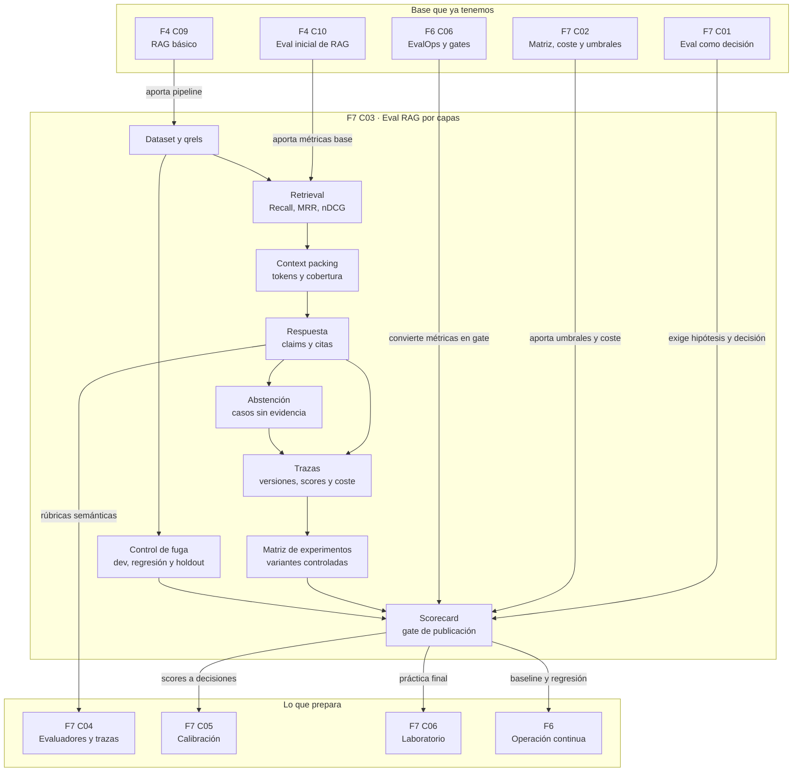

::: {.fasciculo-subtitle}
Facsímil 7 · Evaluar, calibrar e interpretar
:::

# Capítulo 03: Evaluar RAG: retrieval, groundedness y abstención

## Qué deberías poder hacer al terminar

En el [facsímil 4, capítulo 09](/libro/fasciculo-04/#capitulo-09) construimos un RAG básico. En el [capítulo 10](/libro/fasciculo-04/#capitulo-10) ya vimos que no basta con mirar la respuesta final: hay que medir recuperación, contexto, respuesta, citas y abstención. Ahora lo llevamos al nivel de una evaluación defendible.

Al terminar este capítulo deberías poder hacer esto:

| Resultado de aprendizaje | Evidencia de que lo sabes hacer |
|---|---|
| Separar la evaluación por capas. | Distingues si falló corpus, chunking, retrieval, reranking, contexto, respuesta, cita o abstención. |
| Construir qrels útiles. | Relacionas preguntas con chunks esperados y relevancia graduada. |
| Calcular métricas de retrieval. | Obtienes precision@k, recall@k, hit@k, MRR y nDCG@k. |
| Medir groundedness con evidencia. | Separas afirmaciones y compruebas si cada una tiene soporte. |
| Evaluar abstención. | Incluyes preguntas no respondibles y mides si el sistema sabe no contestar. |
| Diseñar un gate de RAG. | Bloqueas una versión si empeora recall, citas, groundedness, abstención, coste o latencia. |
| Entregar una práctica reutilizable. | Produces dataset, política, script, scorecard y decisión escrita. |

La idea central: **en RAG no evaluamos una respuesta; evaluamos una cadena de custodia de la evidencia**.

## El problema: una respuesta bonita puede estar mal evaluada

Un RAG puede dar una respuesta que suena razonable y aun así estar roto por dentro.

Puede haber recuperado documentos irrelevantes, pero acertar por conocimiento interno del modelo. Puede haber recuperado la fuente correcta, pero no meterla en el contexto final. Puede usar la fuente buena y citar otra. Puede contestar una pregunta que el corpus no permite responder. Puede acertar en una demo y fallar en un slice pequeño: normativa antigua, idioma, producto, cliente o formato de documento.

Por eso una eval de RAG debe contestar varias preguntas, no una:

| Pregunta | Capa que mide | Qué te dice |
|---|---|---|
| ¿Existe la evidencia en el corpus? | Corpus | Si el problema es documental, no del modelo. |
| ¿El chunk conserva la unidad de sentido? | Chunking | Si el fragmento recuperable basta para justificar una respuesta. |
| ¿El retrieval trae la evidencia esperada? | Retrieval | Si embeddings, búsqueda híbrida y filtros funcionan. |
| ¿El reranker sube lo importante? | Ranking | Si mejora el orden o solo añade coste. |
| ¿El contexto final contiene lo necesario? | Context packing | Si el prompt recibe evidencia o ruido. |
| ¿La respuesta se apoya en ese contexto? | Groundedness | Si las afirmaciones están sostenidas. |
| ¿Las citas sostienen lo que dicen sostener? | Citas | Si la trazabilidad es real. |
| ¿Se abstiene cuando toca? | Abstención | Si evita responder sin base documental. |
| ¿Cuánto cuesta y tarda? | Operación | Si la mejora compensa en producción. |

Si mezclas todo en una única nota de “calidad”, no sabes qué cambiar. Y si no sabes qué cambiar, la evaluación deja de ser ingeniería y se convierte en opinión.

## Fecha de corte del estado del arte

**Fecha de corte:** 31 de mayo de 2026.  
**Fuentes consultadas:** trabajos sobre RAG, benchmarks de retrieval, métricas de ranking y documentación de herramientas actuales de evaluación de RAG.

Lewis et al. formularon RAG como combinación de recuperación y generación para tareas intensivas en conocimiento.^[Lewis, P. et al. (2020). *Retrieval-Augmented Generation for Knowledge-Intensive NLP Tasks*. NeurIPS.] BEIR y MTEB ayudaron a ordenar la evaluación de retrieval y embeddings en múltiples tareas y dominios.^[Thakur, N. et al. (2021). *BEIR: A Heterogeneous Benchmark for Zero-shot Evaluation of Information Retrieval Models*. arXiv:2104.08663. Muennighoff, N. et al. (2023). *MTEB: Massive Text Embedding Benchmark*. arXiv:2210.07316.]

RAGAS propuso evaluar aplicaciones RAG separando recuperación, relevancia, fidelidad y respuesta.^[Es, S., James, J., Espinosa-Anke, L. y Schockaert, S. (2023). *RAGAS: Automated Evaluation of Retrieval Augmented Generation*. arXiv:2309.15217.] La documentación de Ragas mantiene métricas como context precision, context recall, faithfulness y response relevancy.^[Ragas. (2026). *List of available metrics*. https://docs.ragas.io/en/stable/concepts/metrics/available_metrics/. Consultado el 31 de mayo de 2026.] TruLens populariza la tríada de relevancia de contexto, groundedness y relevancia de respuesta.^[TruLens. (2026). *RAG Triad*. https://www.trulens.org/getting_started/core_concepts/rag_triad/. Consultado el 31 de mayo de 2026.] LangSmith, LlamaIndex y Phoenix aportan datasets, experimentos, trazas, evaluadores y comparación entre versiones.^[LangChain. (2026). *Evaluate a RAG application*. https://docs.langchain.com/langsmith/evaluate-rag-tutorial. LlamaIndex. (2026). *Evaluation modules*. https://developers.llamaindex.ai/python/framework/module_guides/evaluating/modules/. Arize Phoenix. (2026). *Evaluate RAG*. https://arize.com/docs/phoenix/cookbook/evaluation/evaluate-rag. Consultado el 31 de mayo de 2026.]

La parte que conviene conservar aunque cambien las herramientas es esta: **dataset versionado, qrels, trazas, métricas por capa, scorecard y decisión**.

## Anatomía de una eval de RAG

<figure id="f7-c03-rag-eval-stack" class="book-figure book-figure-svg">
<svg viewBox="0 0 1760 1220" role="img" aria-labelledby="f7-c03-title f7-c03-desc" xmlns="http://www.w3.org/2000/svg">
  <title id="f7-c03-title">Anatomía de una evaluación RAG por capas</title>
  <desc id="f7-c03-desc">Diagrama en blanco, negro y gris que muestra una consulta RAG pasando por corpus, chunks, retrieval, reranking, contexto, respuesta, citas y abstención, con métricas asociadas a cada capa.</desc>
  <defs>
    <marker id="f7c03-arrow" markerWidth="12" markerHeight="12" refX="10" refY="6" orient="auto">
      <path d="M1 1 L11 6 L1 11 Z" fill="#111111"/>
    </marker>
    <pattern id="f7c03-grid" width="32" height="32" patternUnits="userSpaceOnUse">
      <path d="M 32 0 L 0 0 0 32" fill="none" stroke="#ECECEC" stroke-width="1"/>
    </pattern>
    <style>
      .f7c03-bg{fill:#FFFFFF}
      .f7c03-grid{fill:url(#f7c03-grid)}
      .f7c03-title{font-family:Inter,Arial,sans-serif;font-size:34px;font-weight:800;fill:#111111}
      .f7c03-sub{font-family:Inter,Arial,sans-serif;font-size:18px;fill:#444444}
      .f7c03-box{fill:#FFFFFF;stroke:#111111;stroke-width:2}
      .f7c03-soft{fill:#F7F7F7;stroke:#111111;stroke-width:1.6}
      .f7c03-dark{fill:#111111;stroke:#111111;stroke-width:2}
      .f7c03-label{font-family:Inter,Arial,sans-serif;font-size:18px;font-weight:800;fill:#111111}
      .f7c03-small{font-family:Inter,Arial,sans-serif;font-size:13.5px;fill:#333333}
      .f7c03-tiny{font-family:Inter,Arial,sans-serif;font-size:11.5px;fill:#666666}
      .f7c03-white{font-family:Inter,Arial,sans-serif;font-size:16px;font-weight:800;fill:#FFFFFF}
      .f7c03-code{font-family:ui-monospace,SFMono-Regular,Menlo,Consolas,monospace;font-size:12.5px;fill:#111111}
      .f7c03-line{stroke:#111111;stroke-width:2;fill:none;marker-end:url(#f7c03-arrow)}
      .f7c03-dash{stroke:#777777;stroke-width:1.6;stroke-dasharray:7 7;fill:none;marker-end:url(#f7c03-arrow)}
      .f7c03-thin{stroke:#333333;stroke-width:1.3;fill:none}
    </style>
  </defs>

  <rect class="f7c03-bg" x="0" y="0" width="1760" height="1220"/>
  <rect class="f7c03-grid" x="52" y="46" width="1656" height="1084" rx="24"/>

  <text class="f7c03-title" x="92" y="112">Evaluar RAG es seguir la evidencia, capa a capa</text>
  <text class="f7c03-sub" x="92" y="146">Cada métrica responde una pregunta distinta; juntarlas sin traza oculta el diagnóstico.</text>

  <rect class="f7c03-dark" x="92" y="204" width="260" height="58" rx="12"/>
  <text class="f7c03-white" x="222" y="240" text-anchor="middle">Entrada de eval</text>
  <rect class="f7c03-box" x="92" y="286" width="260" height="262" rx="16"/>
  <text class="f7c03-label" x="122" y="328">Caso versionado</text>
  <text class="f7c03-code" x="122" y="362">question_id</text>
  <text class="f7c03-code" x="122" y="390">question</text>
  <text class="f7c03-code" x="122" y="418">answerable</text>
  <text class="f7c03-code" x="122" y="446">gold_chunks</text>
  <text class="f7c03-code" x="122" y="474">slice</text>
  <text class="f7c03-tiny" x="122" y="514">Sin dataset estable no hay comparación.</text>

  <path class="f7c03-line" d="M352 418 C404 418 422 418 474 418"/>

  <rect class="f7c03-dark" x="474" y="204" width="260" height="58" rx="12"/>
  <text class="f7c03-white" x="604" y="240" text-anchor="middle">Corpus y chunks</text>
  <rect class="f7c03-box" x="474" y="286" width="260" height="262" rx="16"/>
  <text class="f7c03-label" x="504" y="328">Evidencia disponible</text>
  <rect class="f7c03-soft" x="504" y="354" width="200" height="38" rx="8"/>
  <text class="f7c03-small" x="604" y="379" text-anchor="middle">documento vigente</text>
  <rect class="f7c03-soft" x="504" y="410" width="200" height="38" rx="8"/>
  <text class="f7c03-small" x="604" y="435" text-anchor="middle">chunk con sentido</text>
  <rect class="f7c03-soft" x="504" y="466" width="200" height="38" rx="8"/>
  <text class="f7c03-small" x="604" y="491" text-anchor="middle">metadata y hash</text>
  <text class="f7c03-tiny" x="504" y="530">Métrica: cobertura documental.</text>

  <path class="f7c03-line" d="M734 418 C786 418 804 418 856 418"/>

  <rect class="f7c03-dark" x="856" y="204" width="260" height="58" rx="12"/>
  <text class="f7c03-white" x="986" y="240" text-anchor="middle">Retrieval y ranking</text>
  <rect class="f7c03-box" x="856" y="286" width="260" height="262" rx="16"/>
  <text class="f7c03-label" x="886" y="328">Top-k recuperado</text>
  <text class="f7c03-code" x="886" y="362">Recall@k</text>
  <text class="f7c03-code" x="886" y="390">Precision@k</text>
  <text class="f7c03-code" x="886" y="418">Hit@k</text>
  <text class="f7c03-code" x="886" y="446">MRR</text>
  <text class="f7c03-code" x="886" y="474">nDCG@k</text>
  <text class="f7c03-tiny" x="886" y="514">Primero medir sin llamar al LLM.</text>

  <path class="f7c03-line" d="M1116 418 C1168 418 1186 418 1238 418"/>

  <rect class="f7c03-dark" x="1238" y="204" width="260" height="58" rx="12"/>
  <text class="f7c03-white" x="1368" y="240" text-anchor="middle">Contexto al modelo</text>
  <rect class="f7c03-box" x="1238" y="286" width="260" height="262" rx="16"/>
  <text class="f7c03-label" x="1268" y="328">Context packing</text>
  <text class="f7c03-small" x="1268" y="364">orden, deduplicación</text>
  <text class="f7c03-small" x="1268" y="394">ventana de tokens</text>
  <text class="f7c03-small" x="1268" y="424">filtros y prioridad</text>
  <line class="f7c03-thin" x1="1268" y1="454" x2="1468" y2="454"/>
  <text class="f7c03-code" x="1268" y="486">context_tokens</text>
  <text class="f7c03-code" x="1268" y="514">context_recall</text>

  <path class="f7c03-line" d="M1368 548 C1368 604 1368 620 1368 676"/>

  <rect class="f7c03-dark" x="1238" y="676" width="260" height="58" rx="12"/>
  <text class="f7c03-white" x="1368" y="712" text-anchor="middle">Respuesta y citas</text>
  <rect class="f7c03-box" x="1238" y="758" width="260" height="260" rx="16"/>
  <text class="f7c03-label" x="1268" y="800">Contrato de salida</text>
  <text class="f7c03-code" x="1268" y="834">answer.text</text>
  <text class="f7c03-code" x="1268" y="862">answer.citations</text>
  <text class="f7c03-code" x="1268" y="890">answer.claims[]</text>
  <text class="f7c03-code" x="1268" y="918">answer.abstained</text>
  <line class="f7c03-thin" x1="1268" y1="944" x2="1468" y2="944"/>
  <text class="f7c03-code" x="1268" y="974">groundedness</text>
  <text class="f7c03-code" x="1268" y="1000">citation_recall</text>

  <path class="f7c03-line" d="M1238 888 C1168 888 1144 888 1074 888"/>

  <rect class="f7c03-dark" x="814" y="676" width="260" height="58" rx="12"/>
  <text class="f7c03-white" x="944" y="712" text-anchor="middle">Abstención</text>
  <rect class="f7c03-box" x="814" y="758" width="260" height="260" rx="16"/>
  <text class="f7c03-label" x="844" y="800">Preguntas sin evidencia</text>
  <text class="f7c03-small" x="844" y="840">¿responde?</text>
  <text class="f7c03-small" x="844" y="870">¿pide aclaración?</text>
  <text class="f7c03-small" x="844" y="900">¿declara límite?</text>
  <line class="f7c03-thin" x1="844" y1="930" x2="1044" y2="930"/>
  <text class="f7c03-code" x="844" y="962">no_answer_acc</text>
  <text class="f7c03-code" x="844" y="990">critical_failures</text>

  <path class="f7c03-line" d="M814 888 C742 888 718 888 646 888"/>

  <rect class="f7c03-dark" x="386" y="676" width="260" height="58" rx="12"/>
  <text class="f7c03-white" x="516" y="712" text-anchor="middle">Gate de publicación</text>
  <rect class="f7c03-box" x="386" y="758" width="260" height="260" rx="16"/>
  <text class="f7c03-label" x="416" y="800">Scorecard</text>
  <text class="f7c03-code" x="416" y="834">recall_at_k ≥ 0.85</text>
  <text class="f7c03-code" x="416" y="862">grounded ≥ 0.90</text>
  <text class="f7c03-code" x="416" y="890">citations ≥ 0.90</text>
  <text class="f7c03-code" x="416" y="918">no_answer ≥ 0.95</text>
  <text class="f7c03-code" x="416" y="946">p95_ms ≤ límite</text>
  <line class="f7c03-thin" x1="416" y1="970" x2="616" y2="970"/>
  <text class="f7c03-small" x="416" y="1000">publicar, corregir o parar</text>

  <path class="f7c03-dash" d="M986 548 C986 604 944 620 944 676"/>
  <path class="f7c03-dash" d="M604 548 C604 612 516 622 516 676"/>
  <text x="1660" y="1168" text-anchor="end" class="tiny" fill="#888888" opacity="0.45">IA para gente curiosa / Facsímil 07 / Capítulo 03 / 686f6c61</text>
</svg>
<figcaption>Una evaluación RAG útil no mira solo la respuesta. Sigue la evidencia desde el dataset hasta el gate de publicación.</figcaption>
</figure>

## Qué medimos antes de llamar al modelo

La primera tentación es evaluar la respuesta final. Parece natural: al usuario le importa la respuesta. Pero para ingeniería es demasiado tarde. Si la evidencia no llega al contexto, el generador no puede resolverlo de forma fiable. Por eso el primer bloque de evaluación se hace solo con ranking.

Definimos:

| Símbolo | Significado | Ejemplo |
|---|---|---|
| \(q\) | Pregunta evaluada. | “¿Cuándo se abre la ampliación de matrícula?” |
| \(G_q\) | Chunks relevantes esperados para \(q\). | `{normativa#plazos, normativa#pagos}` |
| \(R_k(q)\) | Lista de los \(k\) primeros chunks recuperados. | Top 3 devuelto por el retriever. |
| \(rel_i\) | Relevancia graduada del resultado en posición \(i\). | 0, 1, 2 o 3. |
| \(rank_q\) | Posición de la primera evidencia válida. | 1 si aparece arriba del todo. |

Con eso podemos medir:

$$
\operatorname{Precision@k}(q)=
\frac{|R_k(q) \cap G_q|}{k}
$$

$$
\operatorname{Recall@k}(q)=
\frac{|R_k(q) \cap G_q|}{|G_q|}
$$

$$
\operatorname{Hit@k}(q)=
\begin{cases}
1 & \text{si } R_k(q) \cap G_q \neq \emptyset \\
0 & \text{si } R_k(q) \cap G_q = \emptyset
\end{cases}
$$

$$
\operatorname{RR}(q)=
\frac{1}{rank_q}
$$

$$
\operatorname{MRR}=
\frac{1}{|Q|}
\sum_{q \in Q}
\operatorname{RR}(q)
$$

Y cuando la relevancia no es binaria:

$$
\operatorname{DCG@k}(q)=
\sum_{i=1}^{k}
\frac{2^{rel_i}-1}{\log_2(i+1)}
$$

$$
\operatorname{nDCG@k}(q)=
\frac{\operatorname{DCG@k}(q)}{\operatorname{IDCG@k}(q)}
$$

| Métrica | Qué detecta | Qué no detecta |
|---|---|---|
| Precision@k | Ruido en los primeros resultados. | Si falta una segunda fuente necesaria. |
| Recall@k | Cobertura de evidencia esperada. | Si la evidencia aparece demasiado abajo. |
| Hit@k | Si aparece al menos una fuente útil. | Si la respuesta necesita varias fuentes. |
| MRR | Si lo primero útil aparece pronto. | Si el resto del contexto está lleno de ruido. |
| nDCG@k | Orden con relevancia graduada. | Si la respuesta final cita bien. |

nDCG es especialmente útil cuando un chunk de relevancia 3 debe pesar más que uno de relevancia 1. Järvelin y Kekäläinen formalizaron la evaluación basada en ganancia acumulada para rankings de información, y esa idea sigue viva en retrieval moderno.^[Järvelin, K. y Kekäläinen, J. (2002). Cumulated gain-based evaluation of IR techniques. *ACM Transactions on Information Systems*, 20(4), 422-446. https://doi.org/10.1145/582415.582418]

## Qrels: la parte poco vistosa que sostiene todo

Un qrel no es un detalle administrativo. Es la forma de decirle a la evaluación qué evidencia debería encontrar. Si los qrels están mal hechos, la métrica puede premiar un sistema peor.

Un qrel mínimo:

| Campo | Qué guarda | Por qué importa |
|---|---|---|
| `case_id` | Identificador estable. | Permite comparar versiones. |
| `question` | Pregunta evaluada. | Debe parecerse a uso real. |
| `answerable` | Si el corpus permite responder. | Activa métricas de abstención. |
| `gold_chunks` | Chunks esperados y relevancia. | Permite recall, MRR y nDCG. |
| `slice` | Segmento de análisis. | Evita que la media esconda fallos. |
| `why_it_exists` | Motivo de incluir el caso. | Evita datasets decorativos. |

La relevancia graduada suele bastar con cuatro niveles:

| Valor | Lectura práctica | Ejemplo |
|---:|---|---|
| 0 | No aporta evidencia. | Documento parecido pero de otro curso. |
| 1 | Relacionado, insuficiente. | FAQ general sin la condición clave. |
| 2 | Útil para parte de la respuesta. | Fragmento con el plazo, pero no con excepciones. |
| 3 | Evidencia central. | Fragmento que sostiene la afirmación principal. |

Para un sistema de producción, los qrels deberían revisarse como código: diff, propietario, fecha, motivo y trazabilidad a la fuente.

## Groundedness: medir afirmaciones, no sensaciones

Groundedness no significa que una respuesta “suene bien”. Significa que sus afirmaciones importantes están sostenidas por el contexto recuperado.

Un método práctico:

1. Divide la respuesta en afirmaciones verificables.
2. Para cada afirmación, apunta qué chunk la sostiene.
3. Marca como no soportada cualquier afirmación que no pueda defenderse con el contexto.
4. Calcula proporciones.

$$
\operatorname{groundedness} =
\frac{\#\text{afirmaciones soportadas}}
{\#\text{afirmaciones totales}}
$$

Para las citas:

$$
\operatorname{citation\_precision} =
\frac{\#\text{citas que sostienen lo citado}}
{\#\text{citas usadas}}
$$

$$
\operatorname{citation\_recall} =
\frac{\#\text{evidencias esperadas citadas}}
{\#\text{evidencias esperadas}}
$$

La diferencia importa:

| Situación | Groundedness | Citation recall | Diagnóstico |
|---|---:|---:|---|
| Respuesta correcta con cita incompleta. | Alta | Baja | Falta trazabilidad. |
| Cita correcta, afirmación extra sin soporte. | Media | Alta | El generador añade contenido fuera del contexto. |
| Retrieval trae poco y la respuesta acierta de memoria. | Baja o incierta | Baja | No puedes defender la cadena documental. |
| Se abstiene cuando no hay evidencia. | No aplica | No aplica | Buena política si el caso era no respondible. |

En el capítulo siguiente veremos evaluadores LLM y rúbricas. Aquí conviene quedarse con una regla: si puedes verificar una cita o una afirmación con código y datos estructurados, empieza por ahí. Usa evaluador cuando necesites criterio semántico, pero conserva la traza que permite auditar la decisión.

## Abstención: la métrica que protege la confianza

Un RAG serio no solo responde. También sabe decir que no tiene evidencia suficiente.

Hay tres casos distintos:

| Caso | Qué debería pasar | Qué mides |
|---|---|---|
| Pregunta respondible y evidencia recuperada. | Responder con citas. | Groundedness, citas, calidad y coste. |
| Pregunta respondible pero evidencia no recuperada. | Abstenerse o pedir más contexto. | Recall, abstención prudente y diagnóstico. |
| Pregunta no respondible por el corpus. | Abstenerse con explicación breve. | No-answer accuracy y fallos críticos. |

Para preguntas no respondibles:

$$
\operatorname{no\_answer\_accuracy} =
\frac{\#\text{abstenciones correctas}}
{\#\text{casos no respondibles}}
$$

Y si quieres una métrica operativa más estricta:

$$
\operatorname{critical\_failure\_rate} =
\frac{\#\text{respuestas sin evidencia en casos no respondibles}}
{\#\text{casos no respondibles}}
$$

En muchos productos, una única respuesta sin evidencia en un caso sensible puede bloquear la publicación. No por dramatismo: porque demuestra que la política de salida no está controlada.

## Qué optimizar y en qué orden

Cuando un RAG falla, no cambies todo a la vez. Diagnostica por capas:

| Síntoma | Qué mirar primero | Cambio razonable |
|---|---|---|
| Recall@k bajo. | Corpus, filtros, embeddings, búsqueda híbrida, query rewriting. | Mejorar qrels, chunking, índice o estrategia de búsqueda. |
| Recall alto, nDCG bajo. | Orden de resultados. | Añadir reranker, RRF o señales de metadata. |
| Retrieval correcto, groundedness baja. | Prompt, contrato de citas, claims y contexto final. | Exigir respuesta con soporte y validar afirmaciones. |
| Citas presentes pero débiles. | Asociación claim-cita. | Citas por afirmación, no bibliografía decorativa. |
| Buena calidad, coste alto. | Top-k, reranker, tamaño de chunks, cache, modelo. | Reducir contexto, cachear retrieval o usar ruta escalonada. |
| Responde sin evidencia. | Casos no respondibles, umbral y contrato de abstención. | Endurecer política y añadir regresiones. |
| Funciona en media, falla en un grupo. | Slices. | Métricas por idioma, producto, fuente, fecha o perfil. |

Un orden práctico:

1. Evalúa retrieval con qrels y sin LLM.
2. Evalúa contexto final: qué entra realmente al prompt.
3. Evalúa respuesta con contexto fijo.
4. Evalúa sistema completo con trazas.
5. Añade coste, latencia y slices.
6. Convierte los umbrales en gate.

## La matriz de experimentos de un RAG

Un RAG profesional no mejora por intuición. Mejora comparando variantes controladas. La palabra importante es **controladas**: si cambias embeddings, chunking, reranker, prompt y modelo a la vez, quizá suba la métrica, pero no sabrás qué pieza produjo la mejora.

Una matriz mínima de experimentos:

| Variante | Qué cambia | Qué queda fijo | Métricas que miras |
|---|---|---|---|
| `bm25_base` | Búsqueda léxica. | Corpus, chunks, prompt, modelo. | Recall@k, nDCG, latencia. |
| `dense_base` | Embedding denso. | Corpus, chunks, top-k, prompt, modelo. | Recall@k, MRR, coste de índice. |
| `hybrid_rrf` | Fusión BM25 + vector. | Corpus, chunks, prompt, modelo. | Recall@k, precision@k, nDCG. |
| `hybrid_rerank` | Añade reranker. | Corpus, chunks, generador. | nDCG, groundedness, latencia p95. |
| `chunk_300` | Chunks más pequeños. | Índice, prompt, modelo. | Recall@k, citation recall, tokens. |
| `chunk_900` | Chunks más grandes. | Índice, prompt, modelo. | Groundedness, ruido, coste. |
| `topk_8` | Más contexto. | Retriever, chunks, prompt, modelo. | Recall, precisión de contexto, tokens. |
| `strict_abstain` | Umbral más exigente. | Retriever, corpus, respuesta. | No-answer accuracy, cobertura, satisfacción. |

Para ingenieros de IA, una tabla de resultados debería incluir al menos:

| Campo | Por qué importa |
|---|---|
| `variant_id` | Permite reproducir el experimento. |
| `corpus_version` | Si cambia el corpus, cambia el problema. |
| `chunker_version` | El tamaño y solapamiento alteran recall y groundedness. |
| `embedding_model` | Cambia geometría, dimensión, coste y compatibilidad del índice. |
| `retriever_config` | Incluye top-k, filtros, híbrido, RRF o expansión de consulta. |
| `reranker_model` | Puede subir nDCG, pero añadir latencia. |
| `prompt_version` | Afecta citas, abstención y formato. |
| `generator_model` | Cambia coste, contexto, groundedness y estilo. |
| `index_version` | Evita comparar una versión contra un índice reconstruido sin querer. |
| `eval_dataset_version` | Evita que la métrica cambie porque cambió el examen. |

La comparación debe mirar deltas:

$$
\Delta m =
m_{\text{variante}} - m_{\text{baseline}}
$$

Y no basta con que una métrica suba. Una variante puede dominar a otra si mejora o iguala calidad y coste:

$$
A \succ B
\iff
Q_A \ge Q_B
\land
L_A \le L_B
\land
C_A \le C_B
\land
\text{alguna desigualdad es estricta}
$$

| Símbolo | Significado |
|---|---|
| \(Q\) | Calidad agregada: retrieval, groundedness, citas y abstención. |
| \(L\) | Latencia, normalmente p50 y p95. |
| \(C\) | Coste por respuesta aceptada. |
| \(A \succ B\) | La variante A domina a B en la comparación. |

Si una variante mejora `Recall@3` de 0,72 a 0,82, pero duplica tokens, sube p95 de 900 ms a 2600 ms y baja no-answer accuracy, no puedes declararla ganadora sin discutir la restricción operativa. Esto enlaza directamente con el [facsímil 06, capítulo 02](/libro/fasciculo-06/#capitulo-02): calidad sin SLO no basta.

## Trazas de depuración: lo que debe guardar una run de RAG

Una evaluación sin traza solo dice “falló”. Una evaluación con traza te dice dónde mirar.

Una traza útil debería guardar:

```json
{
  "run_id": "rag-run-2026-05-31-00042",
  "case_id": "rag_002",
  "timestamp": "2026-05-31T16:20:00Z",
  "pipeline_version": "rag-pipeline-v0.7.3",
  "policy_version": "rag-policy-v0.3.0",
  "corpus_version": "normativa-campus-2026-05-30",
  "index_version": "hnsw-openai-emb-3-large-2026-05-30",
  "chunker": {
    "version": "chunker-v2",
    "target_tokens": 520,
    "overlap_tokens": 80,
    "metadata_fields": ["source", "section", "course", "valid_from"]
  },
  "retriever": {
    "type": "hybrid_rrf",
    "top_k_sparse": 20,
    "top_k_dense": 20,
    "top_k_final": 5,
    "filters": {"course": "2026", "document_status": "vigente"},
    "query_rewrite": true
  },
  "reranker": {
    "model": "reranker-v1",
    "top_k_in": 20,
    "top_k_out": 5
  },
  "retrieved_chunks": [
    {
      "rank": 1,
      "chunk_id": "normativa-2026#plazos-ampliacion",
      "score_dense": 0.88,
      "score_sparse": 12.4,
      "score_rerank": 0.91,
      "tokens": 170
    }
  ],
  "context": {
    "chunks_sent": ["normativa-2026#plazos-ampliacion"],
    "tokens_sent": 170,
    "truncated_chunks": [],
    "deduplicated_chunks": []
  },
  "answer": {
    "abstained": false,
    "citations": ["normativa-2026#plazos-ampliacion"],
    "claims_count": 2,
    "output_tokens": 78
  },
  "latency_ms": {
    "retrieval": 42,
    "rerank": 118,
    "generation": 920,
    "total": 1115
  },
  "estimated_cost": {
    "embedding": 0.0,
    "rerank": 0.0002,
    "generation": 0.0038,
    "total": 0.004
  }
}
```

Fíjate en una cosa: la traza no guarda solo texto. Guarda versiones, filtros, scores, tokens, latencia y coste. Eso permite responder preguntas de ingeniería:

| Pregunta | Campo que la responde |
|---|---|
| ¿Cambiamos el índice sin darnos cuenta? | `index_version` |
| ¿El filtro de curso estaba activo? | `retriever.filters` |
| ¿El reranker empeoró algo? | `score_rerank`, ranking antes/después |
| ¿El contexto se recortó? | `truncated_chunks` |
| ¿La respuesta se encareció por salida larga? | `answer.output_tokens` |
| ¿El fallo viene de generación o retrieval? | `retrieved_chunks`, `context`, `answer` |

## Fuga de evaluación: cuando el examen se contamina

Un dataset de evaluación puede contaminarse. No hace falta mala intención. Basta con usar los mismos casos para ajustar prompts, retocar chunks, cambiar filtros y declarar después que la métrica ha mejorado.

Hay tres conjuntos que conviene separar:

| Conjunto | Uso correcto | Qué no deberías hacer |
|---|---|---|
| `dev` | Ajustar prompts, top-k, chunking y umbrales. | Presentarlo como resultado final. |
| `regression` | Vigilar errores conocidos que no deben volver. | Usarlo como único dataset de calidad. |
| `holdout` | Estimar rendimiento antes de publicar. | Mirarlo cada vez que retocas el sistema. |

Si el dataset es pequeño, una mejora de 2 puntos puede ser ruido. Por eso, cuando compares variantes, mira:

| Técnica | Para qué sirve |
|---|---|
| Bootstrap pareado | Estimar intervalo de confianza de la diferencia de métricas. |
| McNemar | Comparar dos sistemas en aciertos/errores pareados de clasificación. |
| Slices | Saber si la mejora global esconde una pérdida local. |
| Repetición con semilla fija | Reducir variación cuando el generador no es determinista. |
| Holdout bloqueado | Evitar optimizar contra el examen final. |

No hace falta convertir cada capítulo en estadística avanzada, pero sí debes salir con una idea firme: **una mejora sin diseño experimental puede ser solo una coincidencia bien presentada**.

## Offline, shadow y producción

La eval offline sirve para comparar versiones con control. Pero un RAG vive con documentos que cambian, usuarios que preguntan distinto y sistemas que fallan de formas raras. Por eso hay tres niveles:

| Nivel | Qué mide | Cuándo usarlo |
|---|---|---|
| Offline | Dataset fijo, qrels, trazas simuladas o reales guardadas. | Antes de publicar. |
| Shadow | Ejecutas la nueva versión en paralelo, sin responder al usuario. | Antes de mover tráfico. |
| Producción | Métricas reales, feedback, coste, latencia, errores y drift. | Después de publicar. |

Métricas que conviene monitorizar en producción:

| Métrica | Señal de alerta |
|---|---|
| `no_result_rate` | El retriever no encuentra candidatos suficientes. |
| `abstention_rate` | Sube o baja mucho sin cambio esperado. |
| `citation_missing_rate` | Respuestas sin cita cuando la política la exige. |
| `context_tokens_p95` | El contexto crece y sube coste/latencia. |
| `retrieval_latency_p95` | Índice, filtros o red empiezan a degradarse. |
| `index_freshness_lag` | Hay documentos nuevos que tardan en indexarse. |
| `source_distribution_shift` | Cambia de qué fuentes salen las respuestas. |
| `accepted_answer_rate` | Baja la proporción de respuestas que pasan validación. |

En RAG, el drift no viene solo del modelo. Puede venir del corpus, del parser, del índice, de los filtros, del patrón de preguntas o de una política documental nueva. Por eso las trazas importan tanto.

## Fórmula de decisión para publicar

La scorecard no debería decir “parece mejor”. Debería decir si una versión pasa restricciones explícitas.

**Ejemplo de fórmula:** una política sencilla de publicación podría ser esta. No es una métrica académica cerrada; es una forma de convertir retrieval, groundedness, citas, abstención, fallos críticos y latencia en una decisión reproducible.

$$
\operatorname{pass} =
\mathbb{1}[
R@k \ge \tau_R
\land
G \ge \tau_G
\land
C_R \ge \tau_C
\land
A \ge \tau_A
\land
F_c = 0
\land
T \le \tau_T
]
$$

| Símbolo | Significado |
|---|---|
| \(R@k\) | Recall@k medio en casos respondibles. |
| \(G\) | Groundedness media. |
| \(C_R\) | Citation recall medio. |
| \(A\) | No-answer accuracy. |
| \(F_c\) | Fallos críticos. |
| \(T\) | Tokens o latencia media/p95, según la política. |
| \(\tau\) | Umbral mínimo o máximo definido antes de evaluar. |

Esto conecta con el [capítulo 01](/libro/fasciculo-07/#capitulo-01): una eval existe para tomar una decisión. Y conecta con el [facsímil 06, capítulo 06](/libro/fasciculo-06/#capitulo-06): si la scorecard no se convierte en gate, se queda en informe.

## Para entenderlo con un caso

Imagina un asistente de normativa académica. La pregunta es:

> “¿Puedo ampliar matrícula si tengo un pago pendiente?”

La respuesta correcta necesita dos evidencias:

1. El plazo de ampliación.
2. La regla sobre pagos pendientes.

Si el RAG recupera solo el plazo, `Hit@3` puede ser 1, pero `Recall@3` será 0,5. Si responde “sí, puedes” citando solo el plazo, la respuesta suena útil pero no está completa. Si además no menciona la condición de pago, la cita no sostiene toda la conclusión.

La evaluación bien hecha no dice solo “respuesta incorrecta”. Dice:

| Capa | Resultado |
|---|---|
| Retrieval | Recuperó una de dos evidencias. |
| Contexto | El prompt no recibió la regla de pagos. |
| Groundedness | Una afirmación queda sin soporte. |
| Citas | La cita no cubre la condición completa. |
| Decisión | No publicar sin corregir retrieval o context packing. |

Ese diagnóstico sí permite trabajar.

## Manos a la obra

**Práctica:** un scorecard de RAG que puedas adaptar.

Kit ejecutable de este capítulo: `labs/f7/capitulo-practicas/`.

```bash
cd labs/f7/capitulo-practicas
python3 ops/run_f7_practices.py --chapter c03 --write --fail-on-invalid
```

Vamos a construir una práctica pequeña, pero con forma de proyecto real. La idea no es montar una base vectorial aquí; eso ya lo hicimos en el facsímil 4. La idea es evaluar una traza de RAG como lo harías después de ejecutar tu sistema.

### Estructura de archivos

```text
evals/rag_eval_cases.json
ops/ai/rag_eval_policy.json
ops/ai/rag_eval.py
output/rag_scorecard.json
output/rag_decision.md
```

### Dataset de evaluación

```json
[
  {
    "case_id": "rag_001",
    "slice": "matricula",
    "question": "¿Cuándo se abre la ampliación de matrícula?",
    "answerable": true,
    "gold_chunks": {
      "normativa-2026#plazos-ampliacion": 3
    },
    "retrieved": [
      {"chunk_id": "normativa-2026#plazos-ampliacion", "score": 0.91, "tokens": 170},
      {"chunk_id": "faq-campus#matricula-general", "score": 0.62, "tokens": 140},
      {"chunk_id": "normativa-2025#plazos-ampliacion", "score": 0.50, "tokens": 160}
    ],
    "answer": {
      "abstained": false,
      "citations": ["normativa-2026#plazos-ampliacion"],
      "claims": [
        {"text": "La ampliación se abre el 3 de febrero de 2026.", "supporting_chunks": ["normativa-2026#plazos-ampliacion"]}
      ],
      "output_tokens": 44
    }
  },
  {
    "case_id": "rag_002",
    "slice": "matricula",
    "question": "¿Puedo ampliar matrícula si tengo un pago pendiente?",
    "answerable": true,
    "gold_chunks": {
      "normativa-2026#plazos-ampliacion": 2,
      "normativa-2026#pagos-pendientes": 3
    },
    "retrieved": [
      {"chunk_id": "normativa-2026#plazos-ampliacion", "score": 0.88, "tokens": 170},
      {"chunk_id": "faq-campus#tasas", "score": 0.73, "tokens": 120},
      {"chunk_id": "normativa-2026#becas", "score": 0.65, "tokens": 180}
    ],
    "answer": {
      "abstained": false,
      "citations": ["normativa-2026#plazos-ampliacion"],
      "claims": [
        {"text": "Puedes ampliar dentro del plazo ordinario.", "supporting_chunks": ["normativa-2026#plazos-ampliacion"]},
        {"text": "El pago pendiente no afecta a la ampliación.", "supporting_chunks": []}
      ],
      "output_tokens": 78
    }
  },
  {
    "case_id": "rag_003",
    "slice": "becas",
    "question": "¿Qué documento acredita la renta familiar?",
    "answerable": true,
    "gold_chunks": {
      "becas-2026#acreditacion-renta": 3
    },
    "retrieved": [
      {"chunk_id": "becas-2026#calendario", "score": 0.69, "tokens": 150},
      {"chunk_id": "faq-campus#certificados", "score": 0.66, "tokens": 110},
      {"chunk_id": "becas-2025#acreditacion-renta", "score": 0.61, "tokens": 160},
      {"chunk_id": "becas-2026#acreditacion-renta", "score": 0.58, "tokens": 190}
    ],
    "answer": {
      "abstained": true,
      "citations": [],
      "claims": [],
      "output_tokens": 31
    }
  },
  {
    "case_id": "rag_004",
    "slice": "servicios",
    "question": "¿Cuál es el horario de cafetería en agosto?",
    "answerable": false,
    "gold_chunks": {},
    "retrieved": [
      {"chunk_id": "servicios#cafeteria-general", "score": 0.54, "tokens": 100},
      {"chunk_id": "campus#horarios-edificios", "score": 0.47, "tokens": 160},
      {"chunk_id": "faq-campus#vida-universitaria", "score": 0.41, "tokens": 140}
    ],
    "answer": {
      "abstained": true,
      "citations": [],
      "claims": [],
      "output_tokens": 29
    }
  },
  {
    "case_id": "rag_005",
    "slice": "servicios",
    "question": "¿Puedo reservar aparcamiento para visitantes?",
    "answerable": false,
    "gold_chunks": {},
    "retrieved": [
      {"chunk_id": "campus#mapa-parking", "score": 0.57, "tokens": 130},
      {"chunk_id": "faq-campus#visitas", "score": 0.52, "tokens": 120},
      {"chunk_id": "normativa-2026#movilidad", "score": 0.44, "tokens": 160}
    ],
    "answer": {
      "abstained": false,
      "citations": ["campus#mapa-parking"],
      "claims": [
        {"text": "Puedes reservar aparcamiento para visitantes desde el portal del campus.", "supporting_chunks": []}
      ],
      "output_tokens": 52
    }
  }
]
```

### Política de evaluación

```json
{
  "k": 3,
  "min_recall_at_k": 0.75,
  "min_ndcg_at_k": 0.70,
  "min_groundedness": 0.85,
  "min_citation_recall": 0.75,
  "min_no_answer_accuracy": 0.90,
  "max_critical_failures": 0,
  "max_avg_context_tokens": 520
}
```

### Evaluador

```python
import argparse
import json
import math
from pathlib import Path


def load_json(path):
    return json.loads(Path(path).read_text(encoding="utf-8"))


def safe_div(num, den):
    return round(num / den, 4) if den else 0.0


def mean(values):
    return round(sum(values) / len(values), 4) if values else 0.0


def top_k(case, k):
    return case.get("retrieved", [])[:k]


def relevant_ids(case):
    return set(case.get("gold_chunks", {}).keys())


def precision_at_k(case, k):
    retrieved = [item["chunk_id"] for item in top_k(case, k)]
    gold = relevant_ids(case)
    return safe_div(len(set(retrieved) & gold), k)


def recall_at_k(case, k):
    retrieved = [item["chunk_id"] for item in top_k(case, k)]
    gold = relevant_ids(case)
    return safe_div(len(set(retrieved) & gold), len(gold))


def hit_at_k(case, k):
    retrieved = [item["chunk_id"] for item in top_k(case, k)]
    return 1.0 if set(retrieved) & relevant_ids(case) else 0.0


def reciprocal_rank(case):
    gold = relevant_ids(case)
    for index, item in enumerate(case.get("retrieved", []), start=1):
        if item["chunk_id"] in gold:
            return round(1 / index, 4)
    return 0.0


def dcg(relevances):
    total = 0.0
    for index, relevance in enumerate(relevances, start=1):
        total += (2 ** relevance - 1) / math.log2(index + 1)
    return total


def ndcg_at_k(case, k):
    gold = case.get("gold_chunks", {})
    retrieved_rels = [gold.get(item["chunk_id"], 0) for item in top_k(case, k)]
    ideal_rels = sorted(gold.values(), reverse=True)[:k]
    ideal = dcg(ideal_rels)
    return round(dcg(retrieved_rels) / ideal, 4) if ideal else 0.0


def context_tokens(case, k):
    return sum(item.get("tokens", 0) for item in top_k(case, k))


def groundedness(case):
    claims = case.get("answer", {}).get("claims", [])
    if not claims:
        return None
    supported = sum(1 for claim in claims if claim.get("supporting_chunks"))
    return safe_div(supported, len(claims))


def citation_precision(case):
    citations = case.get("answer", {}).get("citations", [])
    if not citations:
        return None
    gold = relevant_ids(case)
    valid = sum(1 for citation in citations if citation in gold)
    return safe_div(valid, len(citations))


def citation_recall(case):
    gold = relevant_ids(case)
    if not gold:
        return None
    citations = set(case.get("answer", {}).get("citations", []))
    return safe_div(len(citations & gold), len(gold))


def classify_case(case, metrics):
    if not case["answerable"]:
        if case["answer"]["abstained"]:
            return "ok_abstention"
        return "critical_no_evidence_answer"

    if metrics["recall_at_k"] < 1:
        return "retrieval_gap"

    if case["answer"]["abstained"]:
        return "unnecessary_abstention"

    if metrics["groundedness"] is not None and metrics["groundedness"] < 1:
        return "grounding_gap"

    if metrics["citation_recall"] is not None and metrics["citation_recall"] < 1:
        return "citation_gap"

    return "ok_answer"


def evaluate(cases, policy):
    k = policy["k"]
    per_case = []
    answerable_rows = []
    grounded_values = []
    citation_precision_values = []
    citation_recall_values = []
    no_answer_total = 0
    no_answer_correct = 0
    critical_failures = 0
    context_token_values = []

    for case in cases:
        metrics = {
            "precision_at_k": precision_at_k(case, k) if case["answerable"] else None,
            "recall_at_k": recall_at_k(case, k) if case["answerable"] else None,
            "hit_at_k": hit_at_k(case, k) if case["answerable"] else None,
            "reciprocal_rank": reciprocal_rank(case) if case["answerable"] else None,
            "ndcg_at_k": ndcg_at_k(case, k) if case["answerable"] else None,
            "context_tokens": context_tokens(case, k),
            "groundedness": groundedness(case),
            "citation_precision": citation_precision(case),
            "citation_recall": citation_recall(case),
        }
        metrics["diagnosis"] = classify_case(case, metrics)
        context_token_values.append(metrics["context_tokens"])

        if case["answerable"]:
            answerable_rows.append(metrics)
        else:
            no_answer_total += 1
            if case["answer"]["abstained"]:
                no_answer_correct += 1
            else:
                critical_failures += 1

        if metrics["groundedness"] is not None:
            grounded_values.append(metrics["groundedness"])
        if metrics["citation_precision"] is not None:
            citation_precision_values.append(metrics["citation_precision"])
        if metrics["citation_recall"] is not None:
            citation_recall_values.append(metrics["citation_recall"])

        per_case.append({
            "case_id": case["case_id"],
            "slice": case["slice"],
            "answerable": case["answerable"],
            **metrics,
        })

    aggregate = {
        "precision_at_k": mean([row["precision_at_k"] for row in answerable_rows]),
        "recall_at_k": mean([row["recall_at_k"] for row in answerable_rows]),
        "hit_at_k": mean([row["hit_at_k"] for row in answerable_rows]),
        "mrr": mean([row["reciprocal_rank"] for row in answerable_rows]),
        "ndcg_at_k": mean([row["ndcg_at_k"] for row in answerable_rows]),
        "groundedness": mean(grounded_values),
        "citation_precision": mean(citation_precision_values),
        "citation_recall": mean(citation_recall_values),
        "no_answer_accuracy": safe_div(no_answer_correct, no_answer_total),
        "critical_failures": critical_failures,
        "avg_context_tokens": mean(context_token_values),
    }
    constraints = {
        "recall_at_k": aggregate["recall_at_k"] >= policy["min_recall_at_k"],
        "ndcg_at_k": aggregate["ndcg_at_k"] >= policy["min_ndcg_at_k"],
        "groundedness": aggregate["groundedness"] >= policy["min_groundedness"],
        "citation_recall": aggregate["citation_recall"] >= policy["min_citation_recall"],
        "no_answer_accuracy": aggregate["no_answer_accuracy"] >= policy["min_no_answer_accuracy"],
        "critical_failures": aggregate["critical_failures"] <= policy["max_critical_failures"],
        "avg_context_tokens": aggregate["avg_context_tokens"] <= policy["max_avg_context_tokens"],
    }
    decision = "pass" if all(constraints.values()) else "fail"
    return {
        "eval_name": "rag_retrieval_groundedness_abstention",
        "k": k,
        "cases": len(cases),
        "answerable_cases": len(answerable_rows),
        "non_answerable_cases": no_answer_total,
        "aggregate": aggregate,
        "constraints": constraints,
        "decision": decision,
        "per_case": per_case,
    }


def render_decision(scorecard):
    failed = [name for name, passed in scorecard["constraints"].items() if not passed]
    lines = [
        "# Decisión de evaluación RAG",
        "",
        f"Resultado: **{scorecard['decision'].upper()}**",
        "",
        "## Métricas agregadas",
        "",
    ]
    for key, value in scorecard["aggregate"].items():
        lines.append(f"- `{key}`: {value}")
    lines.extend(["", "## Restricciones", ""])
    for key, passed in scorecard["constraints"].items():
        mark = "OK" if passed else "REVISAR"
        lines.append(f"- `{key}`: {mark}")
    lines.extend(["", "## Diagnóstico por caso", ""])
    for row in scorecard["per_case"]:
        lines.append(f"- `{row['case_id']}` ({row['slice']}): `{row['diagnosis']}`")
    lines.extend(["", "## Acción recomendada", ""])
    if failed:
        lines.append("No publicar esta versión. Corregir primero: " + ", ".join(failed) + ".")
    else:
        lines.append("Publicar con monitorización y conservar esta scorecard como baseline.")
    return "\n".join(lines) + "\n"


def main():
    parser = argparse.ArgumentParser()
    parser.add_argument("--cases", default="evals/rag_eval_cases.json")
    parser.add_argument("--policy", default="ops/ai/rag_eval_policy.json")
    parser.add_argument("--output", default="output/rag_scorecard.json")
    parser.add_argument("--decision-output", default="output/rag_decision.md")
    parser.add_argument("--write", action="store_true")
    args = parser.parse_args()

    cases = load_json(args.cases)
    policy = load_json(args.policy)
    scorecard = evaluate(cases, policy)
    rendered = json.dumps(scorecard, indent=2, ensure_ascii=False)
    print(rendered)

    if args.write:
        Path(args.output).parent.mkdir(parents=True, exist_ok=True)
        Path(args.output).write_text(rendered + "\n", encoding="utf-8")
        Path(args.decision_output).parent.mkdir(parents=True, exist_ok=True)
        Path(args.decision_output).write_text(render_decision(scorecard), encoding="utf-8")


if __name__ == "__main__":
    main()
```

### Cómo lo ejecutas

```bash
python ops/ai/rag_eval.py --write
cat output/rag_scorecard.json
cat output/rag_decision.md
```

### Qué deberías ver

La muestra está diseñada para fallar. Eso es intencionado: una práctica buena no siempre debe acabar en verde. Deberías ver algo parecido a:

```json
{
  "aggregate": {
    "recall_at_k": 0.5,
    "groundedness": 0.5,
    "citation_recall": 0.5,
    "no_answer_accuracy": 0.5,
    "critical_failures": 1
  },
  "decision": "fail"
}
```

La lectura correcta no es “el RAG es malo”. La lectura correcta es:

| Métrica | Lectura |
|---|---|
| Recall@3 bajo | El retrieval no trae toda la evidencia necesaria. |
| Groundedness baja | Hay afirmaciones sin soporte. |
| Citation recall bajo | Las citas no cubren toda la evidencia esperada. |
| No-answer accuracy bajo | El sistema responde en un caso sin evidencia. |
| Fallos críticos > 0 | No se publica hasta corregir política de abstención. |

### Cómo lo adaptarías a tu proyecto

| Pieza | Qué cambiarías |
|---|---|
| `gold_chunks` | Chunks reales revisados por alguien que conoce el dominio. |
| `retrieved` | Salida real de tu retriever y reranker, con scores y tokens. |
| `claims` | Afirmaciones extraídas de la respuesta final. |
| `supporting_chunks` | Evidencia que sostiene cada afirmación. |
| `policy` | Umbrales acordados antes de comparar versiones. |
| `slice` | Idioma, cliente, fuente, fecha, producto, perfil o tipo de pregunta. |
| `decision` | Resultado que conectas con CI, revisión o gate de release. |

### Qué entregaría un alumno

1. Dataset de al menos 30 preguntas, con un 20 % de preguntas no respondibles.
2. Qrels con relevancia graduada y justificación.
3. Traza real de retrieval para cada pregunta.
4. Script que calcule retrieval, groundedness, citas y abstención.
5. Scorecard con umbrales definidos antes de ejecutar.
6. Diagnóstico por caso y por slice.
7. Decisión escrita: publicar, corregir o no automatizar todavía.

## Extensión técnica: comparar variantes de RAG

Ahora añadimos una segunda práctica más propia de ingeniería: comparar varias configuraciones y elegir una candidata a publicación.

### Archivo de experimentos

```json
[
  {
    "variant_id": "bm25_base",
    "change": "BM25 sin embeddings",
    "recall_at_k": 0.61,
    "ndcg_at_k": 0.58,
    "groundedness": 0.78,
    "citation_recall": 0.64,
    "no_answer_accuracy": 0.92,
    "critical_failures": 0,
    "avg_context_tokens": 430,
    "p95_latency_ms": 640,
    "cost_per_accepted_answer": 0.0021
  },
  {
    "variant_id": "dense_base",
    "change": "Embeddings densos con top_k 5",
    "recall_at_k": 0.74,
    "ndcg_at_k": 0.66,
    "groundedness": 0.82,
    "citation_recall": 0.71,
    "no_answer_accuracy": 0.90,
    "critical_failures": 0,
    "avg_context_tokens": 510,
    "p95_latency_ms": 820,
    "cost_per_accepted_answer": 0.0034
  },
  {
    "variant_id": "hybrid_rrf",
    "change": "BM25 + vector con reciprocal rank fusion",
    "recall_at_k": 0.82,
    "ndcg_at_k": 0.76,
    "groundedness": 0.88,
    "citation_recall": 0.79,
    "no_answer_accuracy": 0.91,
    "critical_failures": 0,
    "avg_context_tokens": 545,
    "p95_latency_ms": 980,
    "cost_per_accepted_answer": 0.0041
  },
  {
    "variant_id": "hybrid_rerank",
    "change": "Híbrido con reranker top_k 5",
    "recall_at_k": 0.84,
    "ndcg_at_k": 0.83,
    "groundedness": 0.91,
    "citation_recall": 0.84,
    "no_answer_accuracy": 0.89,
    "critical_failures": 1,
    "avg_context_tokens": 530,
    "p95_latency_ms": 1680,
    "cost_per_accepted_answer": 0.0078
  }
]
```

### Comparador de variantes

```python
import argparse
import json
from pathlib import Path


QUALITY_KEYS = [
    "recall_at_k",
    "ndcg_at_k",
    "groundedness",
    "citation_recall",
    "no_answer_accuracy",
]

COST_KEYS = [
    "avg_context_tokens",
    "p95_latency_ms",
    "cost_per_accepted_answer",
]


def load_json(path):
    return json.loads(Path(path).read_text(encoding="utf-8"))


def quality_score(row):
    return round(sum(row[key] for key in QUALITY_KEYS) / len(QUALITY_KEYS), 4)


def dominates(left, right):
    quality_ok = all(left[key] >= right[key] for key in QUALITY_KEYS)
    cost_ok = all(left[key] <= right[key] for key in COST_KEYS)
    strict_quality = any(left[key] > right[key] for key in QUALITY_KEYS)
    strict_cost = any(left[key] < right[key] for key in COST_KEYS)
    return quality_ok and cost_ok and (strict_quality or strict_cost)


def passes_gate(row, policy):
    return (
        row["recall_at_k"] >= policy["min_recall_at_k"]
        and row["ndcg_at_k"] >= policy["min_ndcg_at_k"]
        and row["groundedness"] >= policy["min_groundedness"]
        and row["citation_recall"] >= policy["min_citation_recall"]
        and row["no_answer_accuracy"] >= policy["min_no_answer_accuracy"]
        and row["critical_failures"] <= policy["max_critical_failures"]
        and row["avg_context_tokens"] <= policy["max_avg_context_tokens"]
        and row["p95_latency_ms"] <= policy["max_p95_latency_ms"]
        and row["cost_per_accepted_answer"] <= policy["max_cost_per_accepted_answer"]
    )


def compare(rows, policy):
    enriched = []
    for row in rows:
        dominated_by = [
            other["variant_id"]
            for other in rows
            if other["variant_id"] != row["variant_id"] and dominates(other, row)
        ]
        enriched.append({
            **row,
            "quality_score": quality_score(row),
            "dominated_by": dominated_by,
            "passes_gate": passes_gate(row, policy),
        })

    candidates = [row for row in enriched if row["passes_gate"] and not row["dominated_by"]]
    candidates.sort(
        key=lambda row: (
            row["quality_score"],
            -row["p95_latency_ms"],
            -row["cost_per_accepted_answer"],
        ),
        reverse=True,
    )
    return {
        "baseline": rows[0]["variant_id"],
        "policy": policy,
        "variants": enriched,
        "recommended": candidates[0]["variant_id"] if candidates else None,
        "decision": "candidate_found" if candidates else "no_release_candidate",
    }


def main():
    parser = argparse.ArgumentParser()
    parser.add_argument("--experiments", default="evals/rag_experiments.json")
    parser.add_argument("--output", default="output/rag_experiment_matrix.json")
    parser.add_argument("--write", action="store_true")
    args = parser.parse_args()

    policy = {
        "min_recall_at_k": 0.78,
        "min_ndcg_at_k": 0.72,
        "min_groundedness": 0.86,
        "min_citation_recall": 0.76,
        "min_no_answer_accuracy": 0.90,
        "max_critical_failures": 0,
        "max_avg_context_tokens": 560,
        "max_p95_latency_ms": 1200,
        "max_cost_per_accepted_answer": 0.006
    }
    result = compare(load_json(args.experiments), policy)
    rendered = json.dumps(result, indent=2, ensure_ascii=False)
    print(rendered)

    if args.write:
        Path(args.output).parent.mkdir(parents=True, exist_ok=True)
        Path(args.output).write_text(rendered + "\n", encoding="utf-8")


if __name__ == "__main__":
    main()
```

### Qué aprende esta extensión

El resultado debería recomendar `hybrid_rrf`. `hybrid_rerank` tiene mejor `nDCG@k` y groundedness, pero falla en abstención, tiene un fallo crítico y se pasa de coste/latencia. En un proyecto real esto es una conversación adulta: quizá el reranker sea prometedor, pero todavía no está listo para producción.

La práctica enseña tres cosas:

| Aprendizaje | Por qué importa |
|---|---|
| Comparar variantes, no impresiones. | El equipo deja de discutir por ejemplos sueltos. |
| Mirar calidad y operación juntas. | Una mejora que rompe p95 o coste puede no ser publicable. |
| Elegir candidato con restricciones. | El ganador no es el número más alto, sino el sistema que cumple el contrato. |

## Cómo encaja todo



## Vocabulario aprendido

| Término | Definición breve |
|---|---|
| RAG | Arquitectura que combina recuperación de evidencia con generación. |
| Qrel | Juicio de relevancia entre pregunta y chunk. |
| Relevancia graduada | Puntuación que diferencia evidencia central, parcial o irrelevante. |
| Precision@k | Proporción de resultados útiles entre los k primeros. |
| Recall@k | Proporción de evidencias esperadas que aparecen en top-k. |
| Hit@k | Si al menos una evidencia esperada aparece en top-k. |
| MRR | Media del recíproco de la posición de la primera evidencia útil. |
| nDCG@k | Métrica de ranking que premia relevancia alta en posiciones altas. |
| Context packing | Selección y ordenación del contexto que entra al modelo. |
| Groundedness | Proporción de afirmaciones sostenidas por evidencia recuperada. |
| Citation recall | Proporción de evidencias esperadas que aparecen citadas. |
| Abstención | No responder cuando falta evidencia suficiente. |
| Fallo crítico | Respuesta sin evidencia en un caso que debía abstenerse. |
| Scorecard | Resumen de métricas y restricciones para decidir. |
| Ablation study | Comparación donde cambias una pieza para entender su efecto. |
| Traza | Registro completo de una run: versiones, recuperación, contexto, respuesta, latencia y coste. |
| Holdout | Conjunto reservado para estimar rendimiento sin haberlo usado para ajustar. |
| Variante dominada | Configuración peor o igual en calidad y peor o igual en coste frente a otra. |
| Shadow | Ejecución paralela de una versión nueva sin responder todavía al usuario. |

## Dónde solía tropezar yo

| Tropiezo | Por qué ocurre | Antídoto |
|---|---|---|
| Medir solo la respuesta final | Si la respuesta falla, no sabes si arreglar corpus, chunking, retrieval, reranking, prompt o citas. | Medir por capas antes de tocar el sistema. |
| Celebrar Hit@k | Hit@k puede ser 1 aunque falte la segunda fuente necesaria. | Mirar Recall@k y casos multi-hop. |
| Confundir cita con evidencia | Una cita puede apuntar a un documento real y aun así no sostener la frase. | Validar claim por claim. |
| Subir top-k sin mirar coste | Más contexto puede traer evidencia, pero también ruido, tokens y latencia. | Medir recall, precision, nDCG y coste juntos. |
| No tener preguntas no respondibles | Si todas las preguntas tienen respuesta, nunca mides abstención. | Incluir casos plausibles sin evidencia. |
| Cambiar umbrales después de ver el resultado | Convierte la eval en ajuste manual. | Escribir la política antes de ejecutar. |
| Comparar variantes cambiándolo todo a la vez | Si sube la métrica, no sabes si fue por embeddings, reranker, prompt, chunks o corpus. | Usar una matriz de experimentos con una variable principal por variante. |
| No versionar el índice | Puedes creer que comparas dos pipelines cuando en realidad cambió el índice. | Guardar `corpus_version`, `chunker_version`, `embedding_model` e `index_version` en cada traza. |
| Usar el holdout como zona de pruebas | Si miras el examen final cada vez que ajustas, deja de ser final. | Separar `dev`, `regression` y `holdout`. |

## Antes de pasar página

Antes de avanzar, deberías poder responder:

1. ¿Por qué una respuesta correcta puede seguir siendo mala señal en un RAG?
2. ¿Qué diferencia hay entre Hit@k y Recall@k?
3. ¿Cuándo usarías nDCG@k en vez de solo Recall@k?
4. ¿Qué contiene un qrel útil?
5. ¿Por qué groundedness debe mirar afirmaciones y no impresiones?
6. ¿Qué diferencia hay entre citation precision y citation recall?
7. ¿Por qué necesitas preguntas no respondibles en el dataset?
8. ¿Qué métrica bloquearía una versión que responde sin evidencia?
9. ¿Qué cambiarías si Recall@k es alto pero groundedness es bajo?
10. ¿Qué debería guardar una traza profesional de RAG?
11. ¿Por qué una matriz de experimentos debe cambiar una pieza cada vez?
12. ¿Qué diferencia hay entre `dev`, `regression` y `holdout`?
13. ¿Qué significa que una variante esté dominada?
14. ¿Qué archivos entrega la práctica del capítulo?

## Para saber más

Cormack, G. V., Clarke, C. L. A. y Buettcher, S. (2009). Reciprocal Rank Fusion Outperforms Condorcet and Individual Rank Learning Methods. *SIGIR*, 758-759. https://doi.org/10.1145/1571941.1572114

Efron, B. (1979). Bootstrap methods: Another look at the jackknife. *The Annals of Statistics*, 7(1), 1-26. https://doi.org/10.1214/aos/1176344552

Es, S., James, J., Espinosa-Anke, L. y Schockaert, S. (2023). *RAGAS: Automated Evaluation of Retrieval Augmented Generation*. https://arxiv.org/abs/2309.15217

Järvelin, K. y Kekäläinen, J. (2002). Cumulated gain-based evaluation of IR techniques. *ACM Transactions on Information Systems*, 20(4), 422-446. https://doi.org/10.1145/582415.582418

LangChain. (2026). *Evaluate a RAG application*. https://docs.langchain.com/langsmith/evaluate-rag-tutorial

Lewis, P. et al. (2020). Retrieval-Augmented Generation for Knowledge-Intensive NLP Tasks. *Advances in Neural Information Processing Systems 33*, 9459-9474.

LlamaIndex. (2026). *Evaluation modules*. https://developers.llamaindex.ai/python/framework/module_guides/evaluating/modules/

McNemar, Q. (1947). Note on the sampling error of the difference between correlated proportions or percentages. *Psychometrika*, 12(2), 153-157. https://doi.org/10.1007/BF02295996

Muennighoff, N. et al. (2023). *MTEB: Massive Text Embedding Benchmark*. https://arxiv.org/abs/2210.07316

Phoenix. (2026). *Evaluate RAG*. https://arize.com/docs/phoenix/cookbook/evaluation/evaluate-rag

Ragas. (2026). *List of available metrics*. https://docs.ragas.io/en/stable/concepts/metrics/available_metrics/

Thakur, N. et al. (2021). *BEIR: A Heterogeneous Benchmark for Zero-shot Evaluation of Information Retrieval Models*. https://arxiv.org/abs/2104.08663

TruLens. (2026). *RAG Triad*. https://www.trulens.org/getting_started/core_concepts/rag_triad/

## En resumen

| Idea | Qué te llevas |
|---|---|
| RAG se evalúa por capas. | Corpus, retrieval, contexto, respuesta, citas y abstención tienen métricas distintas. |
| Los qrels sostienen la evaluación. | Sin evidencia esperada no puedes medir retrieval de forma seria. |
| Retrieval se mide antes de generación. | Ahorras coste y localizas el fallo antes de culpar al modelo. |
| Groundedness exige claims. | Una respuesta se valida afirmación por afirmación. |
| Abstención es parte de calidad. | Responder sin evidencia puede bloquear una versión. |
| La scorecard debe decidir. | Métricas sin gate no cambian el sistema. |
| Las variantes se comparan con diseño. | Una matriz de experimentos evita mejorar a ciegas. |
| La traza es parte de la eval. | Sin versiones, scores, contexto, coste y latencia no hay depuración seria. |
| El holdout se protege. | Si optimizas contra el examen final, la mejora deja de ser fiable. |
