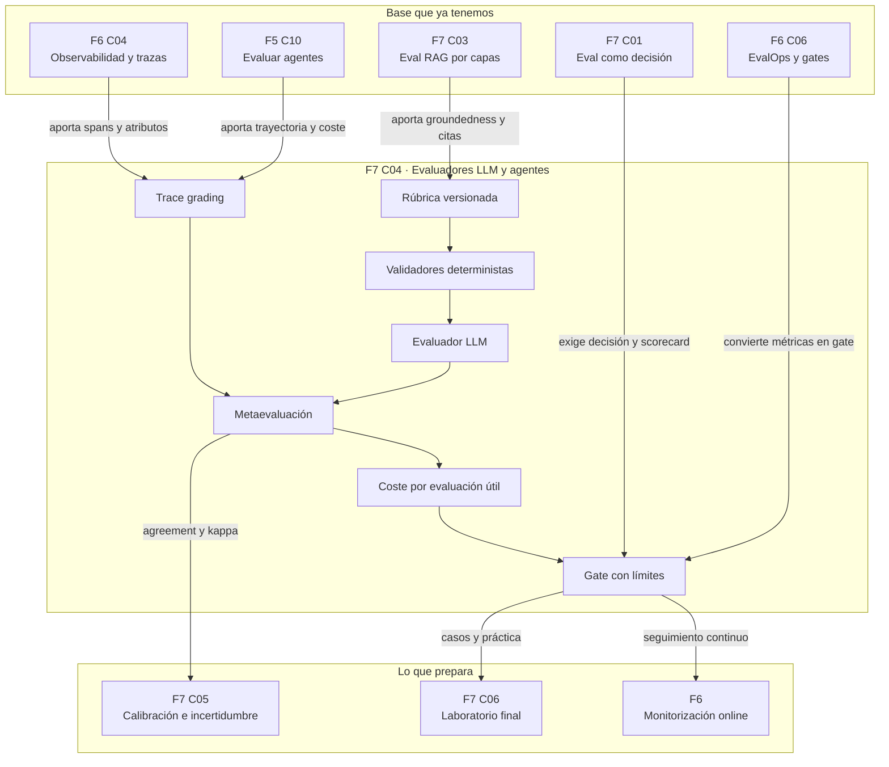

::: {.fasciculo-subtitle}
Facsímil 7 · Evaluar, calibrar e interpretar
:::

# Capítulo 04: Evaluadores LLM y agentes: rúbricas, trazas y coste

## Qué deberías poder hacer al terminar

En el capítulo anterior evaluamos RAG por capas. Ahora entra una pieza incómoda: muchas respuestas de IA no se pueden corregir solo con `exact match`, JSON Schema o una fórmula. Hay que valorar utilidad, suficiencia, claridad, groundedness, orden de razonamiento operativo o trayectoria de un agente. Ahí aparece el evaluador LLM.

Un evaluador LLM puede ser útil. También puede ser una fuente nueva de error. Por eso este capítulo no va de “pon otro modelo a corregir”. Va de **evaluar al evaluador**.

Al terminar deberías poder hacer esto:

| Resultado de aprendizaje | Evidencia de que lo sabes hacer |
|---|---|
| Decidir cuándo usar un evaluador LLM. | Primero separas validadores deterministas, métricas y revisión humana. |
| Escribir una rúbrica evaluable. | Defines criterios observables, escala, ejemplos y condiciones de bloqueo. |
| Calibrar un evaluador. | Comparas sus veredictos contra un conjunto revisado por personas. |
| Medir acuerdo. | Calculas accuracy, kappa, pases indebidos y errores por criterio. |
| Evaluar trazas de agentes. | Puntúas resultado final, tools, orden, argumentos, permisos, coste y latencia. |
| Controlar coste de evaluación. | Calculas coste por evaluación útil y presupuesto de eval. |
| Diseñar un gate con evaluador. | Un evaluador ayuda, pero no decide solo si el sistema se publica. |

La idea central: **un evaluador LLM no es una fuente de verdad; es un instrumento que se calibra, se monitoriza y se limita**.

## El problema: corregir lenguaje abierto no es como validar JSON

Hay tareas donde una máquina puede validar casi todo:

| Tarea | Validación suficiente |
|---|---|
| Salida JSON | Schema, campos obligatorios, tipos y catálogos. |
| Cálculo | Resultado numérico y tolerancia. |
| Tool call | Nombre de tool, argumentos, permisos y error esperado. |
| Código | Tests, lint, tipos, diff y cobertura. |
| Cita RAG | Chunk citado existe y sostiene una afirmación. |

Pero hay otras tareas más abiertas:

| Tarea | Por qué cuesta validarla |
|---|---|
| Resumir un informe. | Puede haber varias respuestas correctas. |
| Explicar un concepto. | Importan claridad, completitud y nivel del público. |
| Revisar una respuesta de soporte. | Importan tono, precisión y siguiente paso. |
| Evaluar un agente. | Importa la trayectoria, no solo la frase final. |
| Comparar dos variantes. | A veces hay que decidir cuál ayuda más con el mismo dato. |

Aquí un evaluador puede ayudar a escalar revisión. Pero si el evaluador no tiene rúbrica, no tiene ejemplos, no se compara contra personas y no conserva trazas, solo cambia una opinión por otra opinión con apariencia de número.

## Fecha de corte del estado del arte

**Fecha de corte:** 31 de mayo de 2026.  
**Fuentes consultadas:** documentación de OpenAI Graders, OpenAI agent evals y trace grading; LangSmith LLM-as-judge y evaluación; Ragas rubrics; Phoenix LLM evals; Google ADK Evaluate; OpenTelemetry; y trabajos sobre LLM-as-a-judge, G-Eval, AgentBench y WebArena.

En castellano usaré **evaluador LLM**. En documentación y papers aparece a menudo como `LLM-as-a-judge`; lo citaremos así cuando sea el nombre técnico de la fuente, pero en el cuerpo del capítulo hablaremos de evaluadores.

OpenAI documenta graders para evals y fine-tuning, incluyendo model graders, validación del grader y ejecución con muestras de prueba.^[OpenAI. (2026). *Graders*. https://developers.openai.com/api/docs/guides/graders. Consultado el 31 de mayo de 2026.] LangSmith permite definir evaluadores LLM, usando la denominación `LLM-as-a-judge`, para evaluación offline y online sobre trazas.^[LangChain. (2026). *How to define an LLM-as-a-judge evaluator*. https://docs.langchain.com/langsmith/llm-as-judge. Consultado el 31 de mayo de 2026.] Ragas ofrece métricas basadas en rúbricas y criterios definidos por el usuario.^[Ragas. (2026). *General Purpose Metrics*. https://docs.ragas.io/en/stable/concepts/metrics/available_metrics/general_purpose/. Consultado el 31 de mayo de 2026.]

Zheng et al. estudiaron LLM-as-a-judge en MT-Bench y Chatbot Arena, señalando acuerdo alto con preferencias humanas en ciertos entornos, pero también sesgos de posición, verbosidad y preferencia por respuestas propias.^[Zheng, L. et al. (2023). *Judging LLM-as-a-Judge with MT-Bench and Chatbot Arena*. NeurIPS Datasets and Benchmarks.] G-Eval propuso usar LLMs con instrucciones y formularios de evaluación para tareas de generación, con mejor correlación con valoraciones humanas que métricas automáticas clásicas en los experimentos reportados.^[Liu, Y. et al. (2023). *G-Eval: NLG Evaluation using GPT-4 with Better Human Alignment*. EMNLP.] Para agentes, AgentBench y WebArena muestran que evaluar acción en entornos interactivos exige mirar trayectorias, no solo respuestas finales.^[Liu, X. et al. (2024). *AgentBench: Evaluating LLMs as Agents*. ICLR. Zhou, S. et al. (2023). *WebArena: A Realistic Web Environment for Building Autonomous Agents*. arXiv.]

La conclusión útil no es “los evaluadores funcionan” ni “los evaluadores no funcionan”. La conclusión adulta es: **funcionan bajo diseño, calibración, trazas y límites**.

## Anatomía de un sistema de evaluadores

<figure id="f7-c04-evaluator-system" class="book-figure book-figure-svg">
<svg viewBox="0 0 1760 1220" role="img" aria-labelledby="f7-c04-title f7-c04-desc" xmlns="http://www.w3.org/2000/svg">
  <title id="f7-c04-title">Sistema de evaluación con evaluadores, validadores y trazas</title>
  <desc id="f7-c04-desc">Diagrama en blanco, negro y gris que muestra dataset, salida del sistema, validadores deterministas, evaluador LLM, evaluación de trazas, calibración humana, coste y gate final.</desc>
  <defs>
    <marker id="f7c04-arrow" markerWidth="12" markerHeight="12" refX="10" refY="6" orient="auto">
      <path d="M1 1 L11 6 L1 11 Z" fill="#111111"/>
    </marker>
    <pattern id="f7c04-grid" width="32" height="32" patternUnits="userSpaceOnUse">
      <path d="M 32 0 L 0 0 0 32" fill="none" stroke="#ECECEC" stroke-width="1"/>
    </pattern>
    <style>
      .f7c04-bg{fill:#FFFFFF}
      .f7c04-grid{fill:url(#f7c04-grid)}
      .f7c04-title{font-family:Inter,Arial,sans-serif;font-size:34px;font-weight:800;fill:#111111}
      .f7c04-sub{font-family:Inter,Arial,sans-serif;font-size:18px;fill:#444444}
      .f7c04-box{fill:#FFFFFF;stroke:#111111;stroke-width:2}
      .f7c04-soft{fill:#F7F7F7;stroke:#111111;stroke-width:1.6}
      .f7c04-dark{fill:#111111;stroke:#111111;stroke-width:2}
      .f7c04-label{font-family:Inter,Arial,sans-serif;font-size:18px;font-weight:800;fill:#111111}
      .f7c04-small{font-family:Inter,Arial,sans-serif;font-size:13px;fill:#333333}
      .f7c04-tiny{font-family:Inter,Arial,sans-serif;font-size:11.5px;fill:#666666}
      .f7c04-white{font-family:Inter,Arial,sans-serif;font-size:16px;font-weight:800;fill:#FFFFFF}
      .f7c04-code{font-family:ui-monospace,SFMono-Regular,Menlo,Consolas,monospace;font-size:12.5px;fill:#111111}
      .f7c04-line{stroke:#111111;stroke-width:2;fill:none;marker-end:url(#f7c04-arrow)}
      .f7c04-dash{stroke:#777777;stroke-width:1.6;stroke-dasharray:7 7;fill:none;marker-end:url(#f7c04-arrow)}
      .f7c04-thin{stroke:#333333;stroke-width:1.2;fill:none}
    </style>
  </defs>

  <rect class="f7c04-bg" x="0" y="0" width="1760" height="1220"/>
  <rect class="f7c04-grid" x="52" y="46" width="1656" height="1084" rx="24"/>

  <text class="f7c04-title" x="92" y="112">Un evaluador LLM se diseña como un sistema de medida</text>
  <text class="f7c04-sub" x="92" y="146">Primero reglas deterministas; después evaluador calibrado; siempre trazas, coste y gate.</text>

  <rect class="f7c04-dark" x="92" y="214" width="250" height="58" rx="12"/>
  <text class="f7c04-white" x="217" y="250" text-anchor="middle">Dataset calibrado</text>
  <rect class="f7c04-box" x="92" y="296" width="250" height="250" rx="16"/>
  <text class="f7c04-label" x="122" y="338">Casos con criterio</text>
  <text class="f7c04-code" x="122" y="374">input</text>
  <text class="f7c04-code" x="122" y="402">output</text>
  <text class="f7c04-code" x="122" y="430">reference</text>
  <text class="f7c04-code" x="122" y="458">human_labels</text>
  <text class="f7c04-code" x="122" y="486">trace_expected</text>
  <text class="f7c04-tiny" x="122" y="524">Sin referencia humana no hay calibración.</text>

  <path class="f7c04-line" d="M342 420 C390 420 406 420 454 420"/>

  <rect class="f7c04-dark" x="454" y="214" width="250" height="58" rx="12"/>
  <text class="f7c04-white" x="579" y="250" text-anchor="middle">Sistema bajo prueba</text>
  <rect class="f7c04-box" x="454" y="296" width="250" height="250" rx="16"/>
  <text class="f7c04-label" x="484" y="338">Salida y traza</text>
  <text class="f7c04-code" x="484" y="374">answer</text>
  <text class="f7c04-code" x="484" y="402">tool_calls[]</text>
  <text class="f7c04-code" x="484" y="430">spans[]</text>
  <text class="f7c04-code" x="484" y="458">tokens</text>
  <text class="f7c04-code" x="484" y="486">latency_ms</text>
  <text class="f7c04-tiny" x="484" y="524">Lo evaluado debe ser reproducible.</text>

  <path class="f7c04-line" d="M704 420 C752 420 768 420 816 420"/>

  <rect class="f7c04-dark" x="816" y="214" width="250" height="58" rx="12"/>
  <text class="f7c04-white" x="941" y="250" text-anchor="middle">Validadores baratos</text>
  <rect class="f7c04-box" x="816" y="296" width="250" height="250" rx="16"/>
  <text class="f7c04-label" x="846" y="338">Código antes que evaluador</text>
  <rect class="f7c04-soft" x="846" y="364" width="190" height="34" rx="7"/>
  <text class="f7c04-small" x="941" y="386" text-anchor="middle">schema</text>
  <rect class="f7c04-soft" x="846" y="410" width="190" height="34" rx="7"/>
  <text class="f7c04-small" x="941" y="432" text-anchor="middle">citas</text>
  <rect class="f7c04-soft" x="846" y="456" width="190" height="34" rx="7"/>
  <text class="f7c04-small" x="941" y="478" text-anchor="middle">tools y permisos</text>
  <text class="f7c04-tiny" x="846" y="524">Reduce coste y ruido del evaluador.</text>

  <path class="f7c04-line" d="M1066 420 C1114 420 1130 420 1178 420"/>

  <rect class="f7c04-dark" x="1178" y="214" width="250" height="58" rx="12"/>
  <text class="f7c04-white" x="1303" y="250" text-anchor="middle">Evaluador LLM</text>
  <rect class="f7c04-box" x="1178" y="296" width="250" height="250" rx="16"/>
  <text class="f7c04-label" x="1208" y="338">Rúbrica versionada</text>
  <text class="f7c04-code" x="1208" y="374">criterion_id</text>
  <text class="f7c04-code" x="1208" y="402">scale</text>
  <text class="f7c04-code" x="1208" y="430">evidence</text>
  <text class="f7c04-code" x="1208" y="458">score</text>
  <text class="f7c04-code" x="1208" y="486">rationale</text>
  <text class="f7c04-tiny" x="1208" y="524">Formato cerrado, no texto libre.</text>

  <path class="f7c04-line" d="M1303 546 C1303 604 1303 620 1303 678"/>

  <rect class="f7c04-dark" x="1178" y="678" width="250" height="58" rx="12"/>
  <text class="f7c04-white" x="1303" y="714" text-anchor="middle">Metaevaluación</text>
  <rect class="f7c04-box" x="1178" y="760" width="250" height="248" rx="16"/>
  <text class="f7c04-label" x="1208" y="802">¿El evaluador mide bien?</text>
  <text class="f7c04-code" x="1208" y="838">accuracy</text>
  <text class="f7c04-code" x="1208" y="866">kappa</text>
  <text class="f7c04-code" x="1208" y="894">pases_indebidos</text>
  <text class="f7c04-code" x="1208" y="922">cost_per_evaluation</text>
  <text class="f7c04-code" x="1208" y="950">drift_check</text>

  <path class="f7c04-line" d="M1178 884 C1128 884 1110 884 1060 884"/>

  <rect class="f7c04-dark" x="810" y="678" width="250" height="58" rx="12"/>
  <text class="f7c04-white" x="935" y="714" text-anchor="middle">Trace grading</text>
  <rect class="f7c04-box" x="810" y="760" width="250" height="248" rx="16"/>
  <text class="f7c04-label" x="840" y="802">Trayectoria de agente</text>
  <text class="f7c04-code" x="840" y="838">required_tools</text>
  <text class="f7c04-code" x="840" y="866">tool_args</text>
  <text class="f7c04-code" x="840" y="894">extra_steps</text>
  <text class="f7c04-code" x="840" y="922">policy_gate</text>
  <text class="f7c04-code" x="840" y="950">trace_complete</text>

  <path class="f7c04-line" d="M810 884 C760 884 742 884 692 884"/>

  <rect class="f7c04-dark" x="442" y="678" width="250" height="58" rx="12"/>
  <text class="f7c04-white" x="567" y="714" text-anchor="middle">Coste y latencia</text>
  <rect class="f7c04-box" x="442" y="760" width="250" height="248" rx="16"/>
  <text class="f7c04-label" x="472" y="802">Presupuesto de eval</text>
  <text class="f7c04-code" x="472" y="838">N casos</text>
  <text class="f7c04-code" x="472" y="866">R repeticiones</text>
  <text class="f7c04-code" x="472" y="894">tokens_evaluador</text>
  <text class="f7c04-code" x="472" y="922">coste_total</text>
  <text class="f7c04-code" x="472" y="950">p95_eval_ms</text>

  <path class="f7c04-line" d="M442 884 C392 884 374 884 324 884"/>

  <rect class="f7c04-dark" x="92" y="678" width="232" height="58" rx="12"/>
  <text class="f7c04-white" x="208" y="714" text-anchor="middle">Gate final</text>
  <rect class="f7c04-box" x="92" y="760" width="232" height="248" rx="16"/>
  <text class="f7c04-label" x="122" y="802">Decisión</text>
  <text class="f7c04-code" x="122" y="838">kappa >= 0.60</text>
  <text class="f7c04-code" x="122" y="866">pases == 0</text>
  <text class="f7c04-code" x="122" y="894">trace_ok</text>
  <text class="f7c04-code" x="122" y="922">coste_ok</text>
  <text class="f7c04-small" x="122" y="970">usar, ajustar o revisar</text>

  <path class="f7c04-dash" d="M941 546 C941 602 935 622 935 678"/>
  <path class="f7c04-dash" d="M579 546 C579 604 567 622 567 678"/>
  <text x="1660" y="1168" text-anchor="end" class="tiny" fill="#888888" opacity="0.45">IA para gente curiosa / Facsímil 07 / Capítulo 04 / 686f6c61</text>
</svg>
<figcaption>Un evaluador LLM entra en un sistema de medición: validadores baratos, rúbrica, trazas, calibración, coste y gate.</figcaption>
</figure>

## Primero código, luego evaluador

La regla más barata y más sana:

> Si puedes evaluarlo con código, no lo mandes primero a un evaluador LLM.

| Criterio | Mejor primera opción | Cuándo entra el evaluador |
|---|---|---|
| JSON válido | Parser y schema. | Casi nunca. |
| Campos obligatorios | Validación estructurada. | Casi nunca. |
| Cita existe | Lookup contra chunks recuperados. | Si hay que valorar si sostiene una frase. |
| Tool correcta | Comparación de trayectoria. | Si hay varias trayectorias aceptables. |
| Argumentos de tool | Schema, rangos, catálogos. | Si el argumento es semántico. |
| Cálculo | Recalcular. | Casi nunca. |
| Resumen útil | Rúbrica y evaluador calibrado. | Cuando no hay respuesta única. |
| Explicación didáctica | Rúbrica y ejemplos. | Cuando importa nivel, claridad y completitud. |

Esto no es una manía. Es coste, reproducibilidad y depuración. Un validador determinista suele ser más barato, más estable y más fácil de explicar que un evaluador.

## Qué es una rúbrica evaluable

Una rúbrica no es “califica del 1 al 5”. Eso es una invitación al ruido. Una rúbrica evaluable tiene criterios observables, escala concreta, ejemplos y condiciones de bloqueo.

| Pieza | Pregunta | Ejemplo |
|---|---|---|
| Criterio | ¿Qué se evalúa? | `groundedness`, `completitud`, `tono`, `trayectoria`. |
| Evidencia | ¿Qué debe mirar el evaluador? | Respuesta, referencia, contexto, trazas, tools. |
| Escala | ¿Qué significa cada valor? | 0, 1, 2 o 3 con descripciones cerradas. |
| Bloqueo | ¿Qué caso no puede aprobar? | Respuesta sin evidencia cuando la tarea exige fuente. |
| Ejemplos | ¿Cómo se ve cada nota? | Casos calibrados con explicación humana. |
| Salida | ¿Qué formato devuelve? | JSON con `score`, `label`, `rationale`, `evidence`. |

Ejemplo de criterio:

```json
{
  "criterion_id": "groundedness",
  "description": "La respuesta debe apoyarse en la evidencia proporcionada.",
  "scale": {
    "0": "Afirmaciones centrales sin soporte.",
    "1": "Parte de la respuesta tiene soporte, pero falta una condición importante.",
    "2": "La respuesta está mayoritariamente soportada, con detalle menor discutible.",
    "3": "Todas las afirmaciones relevantes están soportadas por evidencia citada."
  },
  "blocking_rule": "Si una conclusión importante no tiene soporte, el caso no puede aprobar.",
  "required_evidence": ["answer", "reference", "retrieved_context", "citations"]
}
```

La escala debe evitar adjetivos vagos. “Bueno” o “malo” no bastan. El evaluador necesita saber qué evidencia convierte un 1 en un 2 y un 2 en un 3.

## Tipos de evaluadores

No todos los evaluadores son iguales. Conviene elegir el tipo más simple que responda la pregunta.

| Tipo | Qué devuelve | Sirve para | Riesgo técnico |
|---|---|---|---|
| Clasificador binario | `pass/fail` | Gates, contratos semánticos, revisión rápida. | Puede ocultar matices. |
| Escala ordinal | 0-3, 1-5 | Calidad, completitud, claridad. | Los números pueden no estar calibrados. |
| Comparador pareado | Gana A, gana B, empate. | Elegir entre dos variantes. | Puede depender del orden de presentación. |
| Evaluador por criterio | Varias notas separadas. | Diagnóstico útil. | Más coste y más superficie de inconsistencia. |
| Evaluador de traza | Puntúa pasos, tools y argumentos. | Agentes y workflows. | Requiere trazas limpias y schema estable. |
| Panel de evaluadores | Varios modelos o prompts. | Casos de alta variabilidad. | Multiplica coste y puede dar falsa seguridad. |
| Humano asistido | Persona con ayuda de tooling. | Casos de impacto alto o ambigüedad real. | Coste, variabilidad y tiempo. |

La elección profesional suele ser híbrida: reglas deterministas para lo verificable, evaluador para lo semántico, revisión humana para casos límite y scorecard para decidir.

## Sesgos y fallos frecuentes de un evaluador

Los papers y la práctica coinciden en algo: los evaluadores LLM son útiles, pero tienen patrones de error.

| Patrón | Qué significa | Cómo mitigarlo |
|---|---|---|
| Sesgo de posición | Prefiere A o B según el orden. | Aleatorizar orden y medir `order_flip_rate`. |
| Sesgo de verbosidad | Premia respuestas más largas aunque no aporten más. | Rúbrica con penalización de relleno y coste. |
| Preferencia por estilo | Confunde fluidez con calidad factual. | Separar claridad, evidencia y completitud. |
| Inconsistencia | Cambia veredicto entre repeticiones. | Temperatura baja, formato cerrado y repetición en casos críticos. |
| Arrastre de referencia | Copia la respuesta de referencia sin evaluar equivalencia. | Pedir evidencia de decisión, no solo nota. |
| Atajos de puntuación | Aprende señales superficiales. | Calibrar con casos difíciles y revisar errores. |
| Falta de sensibilidad al coste | Aprueba respuestas que exigen demasiados pasos. | Incluir tokens, tools y latencia en la rúbrica. |

Zheng et al. ya mostraban que hay que vigilar posición, verbosidad y sesgos de preferencia. OpenAI también advierte que un sistema entrenado contra un grader puede aprender a explotar debilidades del propio grader, de modo que conviene contrastarlo con evaluación experta.^[OpenAI. (2026). *Graders*. https://developers.openai.com/api/docs/guides/graders. Consultado el 31 de mayo de 2026.]

## Metaevaluación: evaluar al evaluador

Si el evaluador se usa para bloquear releases, necesita su propio expediente.

Sea \(h_i\) la etiqueta humana para el caso \(i\) y \(j_i\) la etiqueta del evaluador:

$$
\operatorname{accuracy}_{eval} =
\frac{1}{N}
\sum_{i=1}^{N}
\mathbb{1}[h_i = j_i]
$$

Pero accuracy no basta si las clases están desbalanceadas. Por eso usamos también kappa de Cohen:

$$
\kappa =
\frac{p_o - p_e}{1 - p_e}
$$

| Símbolo | Significado |
|---|---|
| \(p_o\) | Acuerdo observado entre evaluador y referencia humana. |
| \(p_e\) | Acuerdo esperado por azar según las distribuciones marginales. |
| \(\kappa\) | Acuerdo corregido por azar. |

Y para ingeniería añadimos métricas más incómodas:

| Métrica | Por qué importa |
|---|---|
| `false_pass_rate` | Casos que el evaluador aprueba y la referencia humana rechaza. |
| `false_block_rate` | Casos que el evaluador bloquea aunque eran aceptables. |
| `critical_false_passes` | Pases indebidos en criterios bloqueantes. |
| `score_mae` | Error absoluto medio si hay escala numérica. |
| `order_flip_rate` | Cambios de preferencia al invertir A/B. |
| `rubric_parse_error_rate` | Veces que el evaluador no devuelve formato válido. |
| `cost_per_useful_evaluation` | Coste dividido entre evaluaciones que pasan control de calidad. |

Un evaluador puede tener accuracy alta y aun así no servir para gate si deja pasar justo los casos que más importan.

## Evaluadores para agentes: mirar trayectoria

En agentes no basta con evaluar la salida final. Necesitamos juzgar la trayectoria.

| Elemento de traza | Pregunta de evaluación |
|---|---|
| `model_call` | ¿El prompt y el modelo eran los esperados? |
| `tool_call` | ¿La tool era necesaria y estaba permitida? |
| `tool_args` | ¿Los argumentos eran completos, mínimos y válidos? |
| `observation` | ¿La tool devolvió evidencia útil? |
| `handoff` | ¿Se transfirió la tarea al actor correcto? |
| `approval` | ¿Pidió aprobación cuando la política lo exigía? |
| `retry` | ¿El reintento tenía motivo y presupuesto? |
| `final_answer` | ¿La respuesta final refleja la evidencia y el estado real? |

**Ejemplo de fórmula:** podemos separar puntuación de salida y trayectoria con un score compuesto como este. Los pesos no se aprenden aquí: los fija el equipo antes de ejecutar la eval, según riesgo, coste y política.

$$
S_{run} =
w_y S_y
+ w_t S_t
+ w_p S_p
+ w_o S_o
- \lambda C_n
- \mu L_n
$$

| Símbolo | Significado |
|---|---|
| \(S_y\) | Calidad de la salida final. |
| \(S_t\) | Calidad de trayectoria: tools, orden, argumentos, observaciones. |
| \(S_p\) | Cumplimiento de política: permisos, aprobación, límites. |
| \(S_o\) | Operación: trazas completas, reintentos, finalización limpia. |
| \(C_n\) | Coste normalizado. |
| \(L_n\) | Latencia normalizada. |
| \(w,\lambda,\mu\) | Pesos y penalizaciones definidos antes de ejecutar. |

La fórmula no convierte la valoración en verdad automática. Obliga a escribir qué pesa más. Un agente que ahorra tiempo pero usa tools de más puede ser ineficiente. Un agente que da buena respuesta pero omite una aprobación no debe pasar. Un agente que necesita tres reintentos por caso puede salir caro aunque responda bien.

## Coste de evaluar con evaluadores

Evaluar también cuesta. Si un evaluador automático corre sobre 10.000 casos con respuestas largas y trazas completas, puedes descubrir el problema en la factura.

**Ejemplo de fórmula:** un presupuesto mínimo para evaluar con un evaluador automático podría escribirse así. Ajusta las partidas si tu proveedor cobra por llamada, por token, por batch, por tool o por revisión humana.

$$
C_{eval} =
N \cdot R \cdot
(C_{in} \cdot T_{in} + C_{out} \cdot T_{out})
+ C_{humano}
$$

| Símbolo | Significado |
|---|---|
| \(N\) | Número de casos. |
| \(R\) | Repeticiones por caso o número de evaluadores. |
| \(C_{in}\) | Coste por token de entrada del evaluador. |
| \(T_{in}\) | Tokens de prompt, rúbrica, respuesta, referencia y traza. |
| \(C_{out}\) | Coste por token de salida del evaluador. |
| \(T_{out}\) | Tokens de razonamiento resumido y JSON final. |
| \(C_{humano}\) | Coste de revisión humana para calibración o casos límite. |

**Ejemplo de fórmula:** el coste que me interesa de verdad es el coste por evaluación útil, porque un evaluador que falla formato, cambia de criterio o exige revisión constante encarece el sistema aunque parezca barato por llamada.

$$
C_{evaluacion\_util} =
\frac{C_{eval}}
{\#\text{evaluaciones válidas y aceptadas}}
$$

Si un evaluador devuelve JSON inválido, cambia criterio entre repeticiones o exige revisión humana constante, su coste útil sube.

## Checklist de publicación de un evaluador

Antes de usar un evaluador como gate, pediría esto:

| Control | Pregunta |
|---|---|
| Rúbrica versionada | ¿Sabemos qué criterio se usó? |
| Calibration set | ¿Hay casos con referencia humana? |
| Kappa mínimo | ¿El acuerdo corrige azar? |
| Pases indebidos | ¿Cuántos casos malos aprueba? |
| Parseo estricto | ¿Siempre devuelve JSON válido? |
| Estabilidad | ¿Repite veredicto en casos frontera? |
| Coste | ¿Sabemos cuánto cuesta por evaluación útil? |
| Trazas | ¿Podemos reconstruir qué vio el evaluador? |
| Drift | ¿Reevaluamos cuando cambia modelo, prompt o rúbrica? |
| Revisión humana | ¿Qué casos llegan a persona? |

Un evaluador sin checklist puede ser útil en exploración. Un evaluador con checklist puede formar parte de ingeniería.

## Para entenderlo con un caso

Imagina un agente académico que revisa una cita:

1. El usuario pega un párrafo con una afirmación.
2. El agente busca la fuente.
3. Comprueba si la fuente sostiene la afirmación.
4. Propone una cita en APA.
5. Indica si falta dato o si conviene revisar.

Salida final posible:

> “La fuente localizada sostiene la idea general, pero no la cifra exacta. Te propongo citarla solo para la parte conceptual y revisar la cifra antes de publicarla.”

Un evaluador de salida puede puntuar utilidad y claridad. Pero un evaluador de traza debe mirar más:

| Paso | Qué se evalúa |
|---|---|
| Búsqueda | ¿Buscó fuente antes de validar? |
| Fuente | ¿Usó una fuente recuperable y no solo memoria del modelo? |
| Verificación | ¿Separó idea general de cifra exacta? |
| APA | ¿Generó formato correcto con datos disponibles? |
| Límite | ¿Pidió revisión donde falta evidencia? |
| Coste | ¿Usó una ruta razonable para una tarea corta? |

Ese es el salto: **evaluar agentes es evaluar una ejecución, no una frase**.

## Manos a la obra

**Práctica:** auditar un evaluador antes de usarlo.

Kit ejecutable de este capítulo: `labs/f7/capitulo-practicas/`.

```bash
cd labs/f7/capitulo-practicas
python3 ops/run_f7_practices.py --chapter c04 --write --fail-on-invalid
```

Vamos a construir una práctica sin llamadas externas. Simularemos dos evaluadores candidatos y los compararemos contra una referencia humana. El objetivo es aprender la mecánica: rúbrica, calibration set, outputs del evaluador, métricas de acuerdo, coste y decisión.

### Estructura de archivos

```text
evals/evaluator_rubric.json
evals/evaluator_calibration_cases.json
evals/evaluator_outputs.json
ops/ai/evaluator_audit.py
output/evaluator_audit_report.json
output/evaluator_audit_decision.md
```

### Rúbrica

```json
{
  "rubric_id": "academic_agent_evaluator_v1",
  "criteria": {
    "answer_quality": "La respuesta final es útil, precisa y responde a la tarea.",
    "evidence": "Las afirmaciones importantes están apoyadas por referencia o traza.",
    "trace": "La trayectoria usa los pasos esperados sin tools innecesarias.",
    "policy": "La ejecución respeta permisos, límites y condiciones de revisión."
  },
  "blocking_criteria": ["evidence", "policy"],
  "pass_threshold": 0.75,
  "min_kappa": 0.60,
  "max_false_passes": 0,
  "max_parse_errors": 0,
  "max_cost_per_valid_evaluation": 0.006
}
```

### Calibration set

```json
[
  {
    "case_id": "evaluator_001",
    "task": "validar_cita_apa",
    "input": "Comprueba si esta fuente sostiene la afirmación y genera APA.",
    "answer_tokens": 96,
    "trace": ["search_source", "open_source", "check_claim", "format_apa"],
    "human": {
      "answer_quality": 1,
      "evidence": 1,
      "trace": 1,
      "policy": 1,
      "pass": 1
    }
  },
  {
    "case_id": "evaluator_002",
    "task": "validar_cita_apa",
    "input": "La respuesta cita una fuente que no sostiene la cifra exacta.",
    "answer_tokens": 144,
    "trace": ["search_source", "format_apa"],
    "human": {
      "answer_quality": 0,
      "evidence": 0,
      "trace": 0,
      "policy": 1,
      "pass": 0
    }
  },
  {
    "case_id": "evaluator_003",
    "task": "resumen_normativa",
    "input": "Resume una norma y conserva condiciones y excepciones.",
    "answer_tokens": 210,
    "trace": ["retrieve_policy", "summarize", "cite_policy"],
    "human": {
      "answer_quality": 1,
      "evidence": 1,
      "trace": 1,
      "policy": 1,
      "pass": 1
    }
  },
  {
    "case_id": "evaluator_004",
    "task": "resumen_normativa",
    "input": "La respuesta es fluida pero omite una excepción relevante.",
    "answer_tokens": 260,
    "trace": ["retrieve_policy", "summarize"],
    "human": {
      "answer_quality": 0,
      "evidence": 0,
      "trace": 1,
      "policy": 1,
      "pass": 0
    }
  },
  {
    "case_id": "evaluator_005",
    "task": "agente_herramientas",
    "input": "El agente usa una tool no necesaria y supera presupuesto.",
    "answer_tokens": 132,
    "trace": ["search_source", "open_source", "deep_research", "format_apa"],
    "human": {
      "answer_quality": 1,
      "evidence": 1,
      "trace": 0,
      "policy": 0,
      "pass": 0
    }
  },
  {
    "case_id": "evaluator_006",
    "task": "respuesta_sin_fuente",
    "input": "La respuesta debería abstenerse porque no hay evidencia.",
    "answer_tokens": 88,
    "trace": ["search_source", "answer"],
    "human": {
      "answer_quality": 0,
      "evidence": 0,
      "trace": 1,
      "policy": 0,
      "pass": 0
    }
  }
]
```

### Outputs de dos evaluadores candidatos

```json
[
  {
    "evaluator_id": "evaluator_v1_generic",
    "input_price_per_1k": 0.002,
    "output_price_per_1k": 0.008,
    "runs": [
      {"case_id": "evaluator_001", "parse_ok": true, "input_tokens": 900, "output_tokens": 120, "scores": {"answer_quality": 1, "evidence": 1, "trace": 1, "policy": 1, "pass": 1}},
      {"case_id": "evaluator_002", "parse_ok": true, "input_tokens": 920, "output_tokens": 140, "scores": {"answer_quality": 1, "evidence": 1, "trace": 0, "policy": 1, "pass": 1}},
      {"case_id": "evaluator_003", "parse_ok": true, "input_tokens": 960, "output_tokens": 130, "scores": {"answer_quality": 1, "evidence": 1, "trace": 1, "policy": 1, "pass": 1}},
      {"case_id": "evaluator_004", "parse_ok": true, "input_tokens": 990, "output_tokens": 150, "scores": {"answer_quality": 1, "evidence": 0, "trace": 1, "policy": 1, "pass": 1}},
      {"case_id": "evaluator_005", "parse_ok": true, "input_tokens": 930, "output_tokens": 130, "scores": {"answer_quality": 1, "evidence": 1, "trace": 1, "policy": 1, "pass": 1}},
      {"case_id": "evaluator_006", "parse_ok": true, "input_tokens": 890, "output_tokens": 110, "scores": {"answer_quality": 0, "evidence": 0, "trace": 1, "policy": 0, "pass": 0}}
    ]
  },
  {
    "evaluator_id": "evaluator_v2_rubric",
    "input_price_per_1k": 0.003,
    "output_price_per_1k": 0.010,
    "runs": [
      {"case_id": "evaluator_001", "parse_ok": true, "input_tokens": 1100, "output_tokens": 150, "scores": {"answer_quality": 1, "evidence": 1, "trace": 1, "policy": 1, "pass": 1}},
      {"case_id": "evaluator_002", "parse_ok": true, "input_tokens": 1120, "output_tokens": 170, "scores": {"answer_quality": 0, "evidence": 0, "trace": 0, "policy": 1, "pass": 0}},
      {"case_id": "evaluator_003", "parse_ok": true, "input_tokens": 1160, "output_tokens": 160, "scores": {"answer_quality": 1, "evidence": 1, "trace": 1, "policy": 1, "pass": 1}},
      {"case_id": "evaluator_004", "parse_ok": true, "input_tokens": 1180, "output_tokens": 180, "scores": {"answer_quality": 0, "evidence": 0, "trace": 1, "policy": 1, "pass": 0}},
      {"case_id": "evaluator_005", "parse_ok": true, "input_tokens": 1130, "output_tokens": 160, "scores": {"answer_quality": 1, "evidence": 1, "trace": 0, "policy": 0, "pass": 0}},
      {"case_id": "evaluator_006", "parse_ok": true, "input_tokens": 1090, "output_tokens": 140, "scores": {"answer_quality": 0, "evidence": 0, "trace": 1, "policy": 0, "pass": 0}}
    ]
  }
]
```

### Auditor de evaluadores

```python
import argparse
import json
from pathlib import Path


def load_json(path):
    return json.loads(Path(path).read_text(encoding="utf-8"))


def safe_div(num, den):
    return round(num / den, 4) if den else 0.0


def binary_kappa(reference, predicted):
    labels = [0, 1]
    n = len(reference)
    observed = safe_div(sum(1 for a, b in zip(reference, predicted) if a == b), n)
    expected = 0.0
    for label in labels:
        ref_rate = safe_div(sum(1 for value in reference if value == label), n)
        pred_rate = safe_div(sum(1 for value in predicted if value == label), n)
        expected += ref_rate * pred_rate
    if expected == 1:
        return 1.0
    return round((observed - expected) / (1 - expected), 4)


def cost_for_run(run, evaluator):
    return (
        run["input_tokens"] / 1000 * evaluator["input_price_per_1k"]
        + run["output_tokens"] / 1000 * evaluator["output_price_per_1k"]
    )


def audit_evaluator(evaluator, cases, rubric):
    by_case = {case["case_id"]: case for case in cases}
    criteria = list(rubric["criteria"].keys()) + ["pass"]
    rows = []
    parse_errors = 0
    total_cost = 0.0

    for run in evaluator["runs"]:
        case = by_case[run["case_id"]]
        total_cost += cost_for_run(run, evaluator)
        if not run["parse_ok"]:
            parse_errors += 1
        row = {
            "case_id": run["case_id"],
            "human_pass": case["human"]["pass"],
            "evaluator_pass": run["scores"].get("pass"),
            "cost": round(cost_for_run(run, evaluator), 6),
        }
        for criterion in criteria:
            row[f"{criterion}_match"] = int(case["human"][criterion] == run["scores"].get(criterion))
        rows.append(row)

    human_pass = [by_case[run["case_id"]]["human"]["pass"] for run in evaluator["runs"]]
    evaluator_pass = [run["scores"].get("pass") for run in evaluator["runs"]]
    false_passes = [
        row["case_id"]
        for row in rows
        if row["human_pass"] == 0 and row["evaluator_pass"] == 1
    ]
    false_blocks = [
        row["case_id"]
        for row in rows
        if row["human_pass"] == 1 and row["evaluator_pass"] == 0
    ]
    criterion_accuracy = {}
    for criterion in criteria:
        criterion_accuracy[criterion] = safe_div(
            sum(row[f"{criterion}_match"] for row in rows),
            len(rows),
        )

    valid_evaluations = len(rows) - parse_errors
    cost_per_valid = safe_div(total_cost, valid_evaluations)
    report = {
        "evaluator_id": evaluator["evaluator_id"],
        "cases": len(rows),
        "parse_errors": parse_errors,
        "criterion_accuracy": criterion_accuracy,
        "pass_accuracy": criterion_accuracy["pass"],
        "pass_kappa": binary_kappa(human_pass, evaluator_pass),
        "false_passes": false_passes,
        "false_blocks": false_blocks,
        "total_cost": round(total_cost, 6),
        "cost_per_valid_evaluation": cost_per_valid,
    }
    report["passes_gate"] = (
        report["pass_kappa"] >= rubric["min_kappa"]
        and len(false_passes) <= rubric["max_false_passes"]
        and parse_errors <= rubric["max_parse_errors"]
        and cost_per_valid <= rubric["max_cost_per_valid_evaluation"]
    )
    return report


def choose_candidate(reports):
    passing = [report for report in reports if report["passes_gate"]]
    passing.sort(
        key=lambda report: (
            report["pass_kappa"],
            report["pass_accuracy"],
            -report["cost_per_valid_evaluation"],
        ),
        reverse=True,
    )
    return passing[0]["evaluator_id"] if passing else None


def render_decision(result):
    lines = [
        "# Decisión de auditoría de evaluador",
        "",
        f"Candidato recomendado: `{result['recommended_evaluator']}`",
        "",
        "## Resumen por evaluador",
        "",
    ]
    for report in result["reports"]:
        lines.append(
            "- `{evaluator}`: kappa={kappa}, pass_accuracy={acc}, false_passes={fp}, cost_per_valid={cost}, gate={gate}".format(
                evaluator=report["evaluator_id"],
                kappa=report["pass_kappa"],
                acc=report["pass_accuracy"],
                fp=len(report["false_passes"]),
                cost=report["cost_per_valid_evaluation"],
                gate="OK" if report["passes_gate"] else "REVISAR",
            )
        )
    lines.extend(["", "## Acción", ""])
    if result["recommended_evaluator"]:
        lines.append("Usar el evaluador recomendado en prepublicación, mantener revisión humana de muestra y recalibrar si cambia modelo, rúbrica o tarea.")
    else:
        lines.append("No usar ningún evaluador como gate todavía. Revisar rúbrica, ejemplos calibrados y coste.")
    return "\n".join(lines) + "\n"


def main():
    parser = argparse.ArgumentParser()
    parser.add_argument("--rubric", default="evals/evaluator_rubric.json")
    parser.add_argument("--cases", default="evals/evaluator_calibration_cases.json")
    parser.add_argument("--outputs", default="evals/evaluator_outputs.json")
    parser.add_argument("--output", default="output/evaluator_audit_report.json")
    parser.add_argument("--decision-output", default="output/evaluator_audit_decision.md")
    parser.add_argument("--write", action="store_true")
    args = parser.parse_args()

    rubric = load_json(args.rubric)
    cases = load_json(args.cases)
    evaluators = load_json(args.outputs)
    reports = [audit_evaluator(evaluator, cases, rubric) for evaluator in evaluators]
    result = {
        "rubric_id": rubric["rubric_id"],
        "reports": reports,
        "recommended_evaluator": choose_candidate(reports),
    }
    rendered = json.dumps(result, indent=2, ensure_ascii=False)
    print(rendered)

    if args.write:
        Path(args.output).parent.mkdir(parents=True, exist_ok=True)
        Path(args.output).write_text(rendered + "\n", encoding="utf-8")
        Path(args.decision_output).parent.mkdir(parents=True, exist_ok=True)
        Path(args.decision_output).write_text(render_decision(result), encoding="utf-8")


if __name__ == "__main__":
    main()
```

### Cómo lo ejecutas

```bash
python ops/ai/evaluator_audit.py --write
cat output/evaluator_audit_report.json
cat output/evaluator_audit_decision.md
```

### Qué deberías ver

La práctica debería recomendar `evaluator_v2_rubric`. `evaluator_v1_generic` aprueba respuestas fluidas que la referencia humana rechaza. Esa es justo la clase de error que no quieres en un gate.

```json
{
  "recommended_evaluator": "evaluator_v2_rubric"
}
```

La lectura importante:

| Señal | Interpretación |
|---|---|
| `pass_kappa` | Acuerdo corregido por azar entre evaluador y referencia humana. |
| `false_passes` | Casos rechazados por personas que el evaluador deja pasar. |
| `criterion_accuracy.evidence` | Si el evaluador entiende el criterio de evidencia. |
| `criterion_accuracy.trace` | Si el evaluador entiende la trayectoria. |
| `cost_per_valid_evaluation` | Si el evaluador es sostenible para usarlo con frecuencia. |

### Qué entregaría un alumno

1. Rúbrica versionada con criterios y bloqueos.
2. Calibration set con al menos 40 casos revisados por personas.
3. Outputs de dos evaluadores o dos prompts de evaluador.
4. Script de auditoría con kappa, accuracy, pases indebidos y coste.
5. Decisión escrita sobre qué evaluador se puede usar y en qué entorno.
6. Plan de recalibración si cambia modelo, tarea o rúbrica.

## Cómo encaja todo



## Vocabulario aprendido

| Término | Definición breve |
|---|---|
| Evaluador LLM | Modelo que evalúa una salida o traza según una rúbrica. |
| Rúbrica | Criterios observables, escala, ejemplos y reglas de bloqueo. |
| Metaevaluación | Evaluación del propio evaluador. |
| Calibration set | Casos con referencia humana para calibrar el evaluador. |
| Kappa de Cohen | Acuerdo corregido por azar entre dos evaluadores. |
| Pases indebidos | Casos que el evaluador aprueba aunque la referencia humana rechaza. |
| Trace grading | Evaluación de la trayectoria completa de un agente. |
| Coste por evaluación útil | Coste de evaluar dividido entre evaluaciones válidas y aceptadas. |
| Criterio bloqueante | Criterio que impide aprobar aunque la media sea buena. |
| Drift del evaluador | Cambio de comportamiento del evaluador al cambiar modelo, prompt, tarea o rúbrica. |

## Dónde solía tropezar yo

| Tropiezo | Por qué ocurre | Antídoto |
|---|---|---|
| Usar un evaluador sin calibration set | Si no lo comparas contra referencia humana, no sabes si mide lo que necesitas. | Empezar con pocos casos, pero revisados con cuidado. |
| Pedir una nota global | Una nota única no dice si falló evidencia, claridad, formato, trayectoria o política. | Puntuar por criterio. |
| Mandarlo todo al evaluador | Validar JSON, tool calls o cálculos con un LLM es caro y frágil. | Usar código para lo verificable. |
| No contar pases indebidos | Accuracy alta puede esconder que el evaluador aprueba casos que no debería. | Mirar `false_passes` y criterios bloqueantes. |
| Olvidar el coste de evaluar | Un sistema de evaluación también puede romper presupuesto. | Medir coste por evaluación útil. |
| Evaluar agentes como si fueran respuestas sueltas | La frase final puede sonar bien aunque la trayectoria sea mala. | Usar trace grading. |

## Antes de pasar página

Antes de avanzar, deberías poder responder:

1. ¿Por qué un evaluador LLM no sustituye una referencia humana?
2. ¿Qué validarías con código antes de usar un evaluador?
3. ¿Qué debe incluir una rúbrica evaluable?
4. ¿Qué diferencia hay entre evaluador binario, ordinal y pareado?
5. ¿Qué es un pase indebido y por qué importa?
6. ¿Por qué kappa aporta más que accuracy en algunos casos?
7. ¿Qué elementos de una traza de agente debe mirar un evaluador?
8. ¿Cómo calculas coste por evaluación útil?
9. ¿Cuándo mandarías un caso a revisión humana?
10. ¿Qué archivos entrega la práctica del capítulo?

## Para saber más

Cohen, J. (1960). A coefficient of agreement for nominal scales. *Educational and Psychological Measurement*, 20(1), 37-46. https://doi.org/10.1177/001316446002000104

Efron, B. (1979). Bootstrap methods: Another look at the jackknife. *The Annals of Statistics*, 7(1), 1-26. https://doi.org/10.1214/aos/1176344552

LangChain. (2026). *How to define an LLM-as-a-judge evaluator*. https://docs.langchain.com/langsmith/llm-as-judge

Liu, X. et al. (2024). AgentBench: Evaluating LLMs as Agents. *International Conference on Learning Representations*. https://arxiv.org/abs/2308.03688

Liu, Y., Iter, D., Xu, Y., Wang, S., Xu, R. y Zhu, C. (2023). G-Eval: NLG Evaluation using GPT-4 with Better Human Alignment. *EMNLP*. https://arxiv.org/abs/2303.16634

McNemar, Q. (1947). Note on the sampling error of the difference between correlated proportions or percentages. *Psychometrika*, 12(2), 153-157. https://doi.org/10.1007/BF02295996

OpenAI. (2026). *Graders*. https://developers.openai.com/api/docs/guides/graders

OpenAI. (2026). *Trace grading*. https://developers.openai.com/api/docs/guides/trace-grading

Ragas. (2026). *General Purpose Metrics*. https://docs.ragas.io/en/stable/concepts/metrics/available_metrics/general_purpose/

Zheng, L. et al. (2023). Judging LLM-as-a-Judge with MT-Bench and Chatbot Arena. *NeurIPS Datasets and Benchmarks*. https://arxiv.org/abs/2306.05685

Zhou, S. et al. (2023). WebArena: A Realistic Web Environment for Building Autonomous Agents. https://arxiv.org/abs/2307.13854

## En resumen

| Idea | Qué te llevas |
|---|---|
| Un evaluador LLM es un instrumento, no una verdad. | Debe calibrarse contra referencias humanas o reglas fiables. |
| La rúbrica manda. | Sin criterios observables, el número no significa gran cosa. |
| Código antes que evaluador. | Lo verificable se valida con parsers, schemas, tests o cálculos. |
| La metaevaluación es obligatoria. | Accuracy, kappa, pases indebidos, parseo y coste dicen si el evaluador sirve. |
| Agentes exigen trace grading. | La trayectoria puede fallar aunque la salida final suene bien. |
| El coste de evaluar también se diseña. | Un evaluador útil debe caber en presupuesto y aportar señal accionable. |
