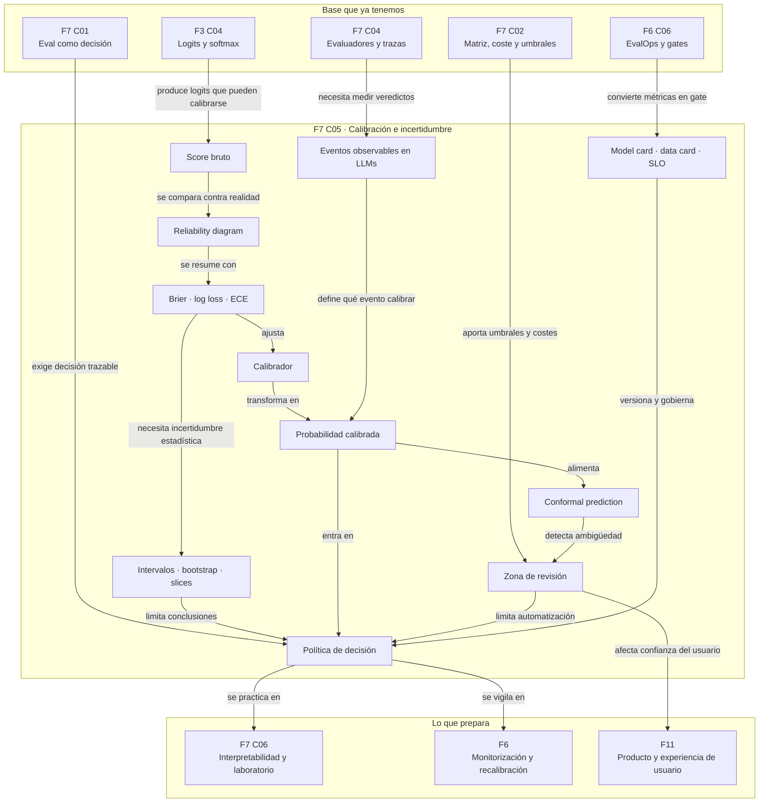

::: {.fasciculo-subtitle}
Facsímil 7 · Evaluar, calibrar e interpretar
:::

# Capítulo 05: Calibración e incertidumbre: de scores a decisiones

## Qué deberías poder hacer al terminar

En el capítulo 02 vimos que un score se convierte en acción cuando le ponemos umbrales. En el capítulo 04 vimos que un evaluador LLM también debe medirse antes de confiar en sus veredictos. Ahora falta una pregunta incómoda: **¿ese 0,82 que aparece en una métrica, un clasificador, un recuperador o un evaluador significa algo parecido a “82 %”?**

Muchas veces no. Un sistema puede ordenar bien los casos y estar mal calibrado. También puede decir “alta confianza” sin que esa confianza corresponda a una frecuencia real de acierto. Para ingeniería, esa diferencia importa muchísimo: no es lo mismo una puntuación útil para ordenar que una probabilidad útil para automatizar.

Al terminar deberías poder hacer esto:

| Resultado de aprendizaje | Evidencia de que lo sabes hacer |
|---|---|
| Separar score, probabilidad y decisión. | Puedes explicar por qué un 0,9 puede ordenar bien y aun así no ser una probabilidad fiable. |
| Medir calibración. | Calculas Brier score, log loss, ECE y lees un reliability diagram. |
| Elegir una técnica de calibración. | Distingues Platt scaling, isotonic regression, histogram/binning y temperature scaling. |
| Usar incertidumbre sin teatralizarla. | Diseñas zona de revisión, abstención o salida con intervalo cuando el sistema no tiene suficiente evidencia. |
| Entender conformal prediction. | Construyes conjuntos o intervalos con cobertura objetivo y sabes qué supuesto los sostiene. |
| Convertir calibración en política operativa. | Escribes umbrales, costes, revisión y criterios de publicación. |
| Medir incertidumbre estadística. | Añades intervalos, bootstrap y lectura por slice antes de sacar conclusiones. |
| Entregar un kit reproducible. | Produces datos, script, reporte JSON, manifest y decisión Markdown que un equipo puede revisar. |

La idea central del capítulo es sencilla: **un score no merece mandar hasta que sabes qué significa cuando se equivoca**.

## El 0,92 que no significa 92 %

Imagina un sistema que prioriza tickets de soporte. Un caso llega con score 0,92 de “urgente”. Producto quiere automatizar: si supera 0,90, se marca como urgente y se salta la cola.

Antes de hacerlo, necesitamos saber qué significa ese 0,92.

| Lectura ingenua | Lectura de ingeniería |
|---|---|
| “El sistema está seguro al 92 %”. | “En casos parecidos con score cercano a 0,92, ¿cuántos eran realmente urgentes?” |
| “El score es alto, automatizamos”. | “¿Qué coste tiene equivocarnos aquí y cuántos casos de esta banda hemos medido?” |
| “Si ordena bien, ya sirve”. | “Ordenar bien no basta si el score alimenta umbrales, revisión o SLA.” |

Esto aparece por todas partes en IA aplicada:

| Lugar donde aparece un score | Error típico |
|---|---|
| Clasificador de tickets | Leer `0.87` como probabilidad sin medir calibración. |
| RAG | Confundir similitud de embedding con probabilidad de que la respuesta esté soportada. |
| Evaluador automático | Tratar una nota `4/5` como verdad operacional sin calibrarla contra casos revisados. |
| Agente con tool calls | Usar “confidence” textual del modelo como si fuera una métrica medida. |
| Modelo local o API | Comparar scores de proveedores distintos como si vivieran en la misma escala. |

Un score puede servir para ordenar. Una probabilidad calibrada sirve para decidir bajo coste. No son la misma promesa.

## Qué no es calibrar

Calibrar no es subir la accuracy. Un sistema puede tener la misma accuracy antes y después de calibrar, pero producir probabilidades más honestas.

Tampoco es “hacer que el modelo dude”. A veces calibrar baja scores exagerados; otras veces sube scores demasiado conservadores. La dirección no importa. Importa que el número signifique algo empírico.

Y calibrar tampoco sustituye a una buena evaluación. Si tu dataset no representa el uso real, si mezclas datos de ajuste con datos de evaluación o si cambias el umbral después de mirar el resultado, tendrás una apariencia de rigor, no una política fiable.

Podemos resumirlo así:

| Concepto | Pregunta que responde | Qué no responde |
|---|---|---|
| Discriminación | ¿Ordena positivos por encima de negativos? | Si el 0,8 significa 80 %. |
| Accuracy | ¿Cuántos acierta con un umbral dado? | Si sus probabilidades son honestas. |
| Calibración | ¿El score coincide con frecuencia real? | Si el modelo entiende el dominio. |
| Incertidumbre | ¿Cuánto margen de duda queda? | Qué decisión de producto conviene tomar. |
| Política | ¿Qué hacemos con esa duda? | Si los datos de partida eran buenos. |

## Qué sí es una probabilidad calibrada

Una predicción probabilística está calibrada cuando, entre los casos a los que asigna probabilidad \(p\), la frecuencia real del evento también es \(p\).

$$
\mathbb{P}(Y = 1 \mid \hat{p}(X) = p) = p
$$

| Símbolo | Significado | Ejemplo |
|---|---|---|
| \(X\) | Entrada del sistema. | Texto de un ticket. |
| \(Y\) | Etiqueta real. | 1 si el ticket era urgente. |
| \(\hat{p}(X)\) | Probabilidad predicha por el sistema. | 0,80. |
| \(p\) | Banda o valor de confianza. | Casos alrededor de 0,80. |
| \(\mathbb{P}(Y=1 \mid \hat{p}(X)=p)\) | Frecuencia real de positivos dentro de esa banda. | 0,78 en la muestra. |

En la práctica no tenemos infinitos casos con exactamente \(p=0,80\). Agrupamos predicciones en bandas: 0,0-0,1; 0,1-0,2; 0,2-0,3; y así sucesivamente. Si en la banda 0,8-0,9 el score medio es 0,84 y el 62 % de los casos son realmente positivos, el modelo está sobreconfiado en esa banda.

La calibración es local. Un promedio bonito puede esconder bandas malas. Por eso miramos la curva completa.

## Fecha de corte del estado del arte

**Fecha de corte:** 1 de junio de 2026.  
**Fuentes consultadas:** trabajos clásicos sobre probabilidades calibradas, Brier score, reliability diagrams, calibración supervisada, calibración de redes neuronales modernas y conformal prediction; además de documentación de scikit-learn, trabajos sobre incertidumbre en LLMs, documentación técnica de modelos/datos y guías de producción de sistemas ML.

Brier propuso en 1950 una puntuación para predicciones probabilísticas que mide el error cuadrático entre probabilidad y resultado observado.^[Brier, G. W. (1950). Verification of Forecasts Expressed in Terms of Probability. *Monthly Weather Review*, 78(1), 1-3. https://doi.org/10.1175/1520-0493(1950)078<0001:VOEPIO>2.0.CO;2] Murphy descompuso después esa puntuación en componentes relacionados con fiabilidad, resolución e incertidumbre.^[Murphy, A. H. (1973). A New Vector Partition of the Probability Score. *Journal of Applied Meteorology*, 12(4), 595-600. https://doi.org/10.1175/1520-0450(1973)012<0595:ANVPOT>2.0.CO;2]

Niculescu-Mizil y Caruana mostraron que clasificadores distintos producen probabilidades con comportamientos de calibración muy distintos, aunque su capacidad de ranking sea buena.^[Niculescu-Mizil, A. y Caruana, R. (2005). Predicting Good Probabilities with Supervised Learning. *ICML*. https://doi.org/10.1145/1102351.1102430] Platt scaling popularizó una calibración sigmoidal para salidas de SVM.^[Platt, J. C. (1999). Probabilistic Outputs for Support Vector Machines and Comparisons to Regularized Likelihood Methods. En *Advances in Large Margin Classifiers*. MIT Press.] Guo et al. mostraron que redes neuronales modernas pueden estar muy bien en accuracy y mal calibradas, y que temperature scaling puede corregir parte de esa sobreconfianza con un ajuste simple.^[Guo, C., Pleiss, G., Sun, Y. y Weinberger, K. Q. (2017). On Calibration of Modern Neural Networks. *ICML*. https://proceedings.mlr.press/v70/guo17a.html]

Para cuantificar incertidumbre con garantías finitas, la familia de conformal prediction viene de los trabajos de Vovk, Gammerman y Shafer.^[Vovk, V., Gammerman, A. y Shafer, G. (2005). *Algorithmic Learning in a Random World*. Springer. https://doi.org/10.1007/b106715] Shafer y Vovk ofrecen una introducción tutorial al enfoque.^[Shafer, G. y Vovk, V. (2008). A Tutorial on Conformal Prediction. *Journal of Machine Learning Research*, 9, 371-421. https://www.jmlr.org/papers/v9/shafer08a.html] Angelopoulos y Bates escribieron una introducción moderna a conformal prediction y cuantificación de incertidumbre libre de distribución.^[Angelopoulos, A. N. y Bates, S. (2021). A Gentle Introduction to Conformal Prediction and Distribution-Free Uncertainty Quantification. arXiv. https://arxiv.org/abs/2107.07511]

La documentación de scikit-learn resume la diferencia práctica entre calibración, curvas de fiabilidad y métodos como sigmoid e isotonic calibration.^[scikit-learn. (2026). *Probability Calibration*. https://scikit-learn.org/stable/modules/calibration.html. Consultado el 1 de junio de 2026.]

Para llevar esto a ingeniería de IA moderna, también nos apoyamos en trabajos sobre incertidumbre en modelos de lenguaje, documentación de modelos y datos, y preparación para producción.

| Pieza de ingeniería | Fuente usada |
|---|---|
| Incertidumbre en modelos de lenguaje | Kadavath et al. estudian cuándo los modelos de lenguaje pueden reconocer límites de conocimiento bajo determinados protocolos.^[Kadavath, S., Conerly, T., Askell, A., Henighan, T., Drain, D., Perez, E., Schiefer, N., Hatfield-Dodds, Z., DasSarma, N., Tran-Johnson, E., Johnston, S. y otros. (2022). *Language Models (Mostly) Know What They Know*. arXiv. https://arxiv.org/abs/2207.05221] |
| Incertidumbre semántica | Kuhn, Gal y Farquhar proponen agrupar respuestas que dicen lo mismo aunque usen palabras distintas.^[Kuhn, L., Gal, Y. y Farquhar, S. (2023). Semantic Uncertainty: Linguistic Invariances for Uncertainty Estimation in Natural Language Generation. *ICLR*. https://arxiv.org/abs/2302.09664] |
| Documentación de modelos | Model Cards propone reportar usos previstos, límites y resultados por segmentos.^[Mitchell, M., Wu, S., Zaldivar, A., Barnes, P., Vasserman, L., Hutchinson, B., Spitzer, E., Raji, I. D. y Gebru, T. (2019). Model Cards for Model Reporting. *FAT*, 220-229. https://doi.org/10.1145/3287560.3287596] |
| Documentación de datos | Data Cards estructura información sobre origen, composición, límites y uso previsto de datasets.^[Pushkarna, M., Zaldivar, A. y Kjartansson, O. (2022). *Data Cards: Purposeful and Transparent Dataset Documentation for Responsible AI*. arXiv. https://arxiv.org/abs/2204.01075] |
| Preparación para producción | Sculley et al. describen deuda técnica propia de sistemas ML.^[Sculley, D., Holt, G., Golovin, D., Davydov, E., Phillips, T., Ebner, D., Chaudhary, V., Young, M., Crespo, J. F. y Dennison, D. (2015). Hidden Technical Debt in Machine Learning Systems. *NeurIPS*. https://papers.nips.cc/paper/5656-hidden-technical-debt-in-machine-learning-systems] |
| Readiness de ML | El ML Test Score propone pruebas y necesidades de monitorización para sistemas ML en producción.^[Breck, E., Cai, S., Nielsen, E., Salib, M. y Sculley, D. (2017). The ML Test Score: A Rubric for ML Production Readiness and Technical Debt Reduction. *IEEE Big Data*. https://research.google/pubs/pub46555/] |
| SLI/SLO | La guía SRE de Google separa indicador, objetivo y presupuesto de error para decidir con datos.^[Jones, C., Wilkes, J., Murphy, N. y Smith, C. (2016). Service Level Objectives. En *Site Reliability Engineering*. https://sre.google/sre-book/service-level-objectives/] |

## Anatomía de una política calibrada

<figure id="f7-c05-calibration-system" class="book-figure book-figure-svg">
<svg viewBox="0 0 1760 1260" role="img" aria-labelledby="f7-c05-title f7-c05-desc" xmlns="http://www.w3.org/2000/svg">
  <title id="f7-c05-title">Sistema de calibración, incertidumbre y decisión</title>
  <desc id="f7-c05-desc">Diagrama en blanco, negro y gris que conecta logits, scores, calibrador, reliability diagram, conformal prediction, umbrales, revisión humana y gate operativo.</desc>
  <defs>
    <marker id="f7c05-arrow" markerWidth="12" markerHeight="12" refX="10" refY="6" orient="auto">
      <path d="M1 1 L11 6 L1 11 Z" fill="#111111"/>
    </marker>
    <pattern id="f7c05-grid" width="28" height="28" patternUnits="userSpaceOnUse">
      <path d="M 28 0 L 0 0 0 28" fill="none" stroke="#ECECEC" stroke-width="1"/>
    </pattern>
    <style>
      .f7c05-bg{fill:#FFFFFF}
      .f7c05-grid{fill:url(#f7c05-grid)}
      .f7c05-title{font-family:Inter,Arial,sans-serif;font-size:34px;font-weight:800;fill:#111111}
      .f7c05-sub{font-family:Inter,Arial,sans-serif;font-size:18px;fill:#444444}
      .f7c05-box{fill:#FFFFFF;stroke:#111111;stroke-width:2}
      .f7c05-soft{fill:#F6F6F6;stroke:#111111;stroke-width:1.6}
      .f7c05-dark{fill:#111111;stroke:#111111;stroke-width:2}
      .f7c05-label{font-family:Inter,Arial,sans-serif;font-size:17px;font-weight:800;fill:#111111}
      .f7c05-small{font-family:Inter,Arial,sans-serif;font-size:13px;fill:#333333}
      .f7c05-tiny{font-family:Inter,Arial,sans-serif;font-size:11.5px;fill:#666666}
      .f7c05-white{font-family:Inter,Arial,sans-serif;font-size:15px;font-weight:800;fill:#FFFFFF}
      .f7c05-code{font-family:ui-monospace,SFMono-Regular,Menlo,Consolas,monospace;font-size:12px;fill:#111111}
      .f7c05-line{stroke:#111111;stroke-width:2;fill:none;marker-end:url(#f7c05-arrow)}
      .f7c05-dash{stroke:#666666;stroke-width:1.6;stroke-dasharray:7 7;fill:none;marker-end:url(#f7c05-arrow)}
      .f7c05-axis{stroke:#333333;stroke-width:1.3;fill:none}
      .f7c05-faint{stroke:#BBBBBB;stroke-width:1;fill:none}
    </style>
  </defs>

  <rect class="f7c05-bg" x="0" y="0" width="1760" height="1260"/>
  <rect class="f7c05-grid" x="52" y="46" width="1656" height="1110" rx="24"/>

  <text class="f7c05-title" x="92" y="112">Del score bruto a una decisión defendible</text>
  <text class="f7c05-sub" x="92" y="146">Calibrar no mejora una demo: convierte puntuaciones en políticas con incertidumbre medible.</text>

  <rect class="f7c05-dark" x="92" y="204" width="250" height="54" rx="12"/>
  <text class="f7c05-white" x="217" y="238" text-anchor="middle">1 · Salida bruta</text>
  <rect class="f7c05-box" x="92" y="282" width="250" height="260" rx="16"/>
  <text class="f7c05-label" x="122" y="322">Logits o scores</text>
  <text class="f7c05-code" x="122" y="358">z = [1.8, 0.2]</text>
  <text class="f7c05-code" x="122" y="386">softmax(z)</text>
  <text class="f7c05-code" x="122" y="414">similitud RAG</text>
  <text class="f7c05-code" x="122" y="442">nota evaluador</text>
  <line class="f7c05-axis" x1="122" y1="488" x2="302" y2="488"/>
  <circle cx="148" cy="488" r="5" fill="#111111"/>
  <circle cx="206" cy="488" r="5" fill="#111111"/>
  <circle cx="282" cy="488" r="5" fill="#111111"/>
  <text class="f7c05-tiny" x="122" y="522">Ordena, pero todavía no promete probabilidad.</text>

  <path class="f7c05-line" d="M342 410 C384 410 402 410 444 410"/>

  <rect class="f7c05-dark" x="444" y="204" width="250" height="54" rx="12"/>
  <text class="f7c05-white" x="569" y="238" text-anchor="middle">2 · Set calibrado</text>
  <rect class="f7c05-box" x="444" y="282" width="250" height="260" rx="16"/>
  <text class="f7c05-label" x="474" y="322">Datos reservados</text>
  <text class="f7c05-code" x="474" y="358">score_raw</text>
  <text class="f7c05-code" x="474" y="386">label_real</text>
  <text class="f7c05-code" x="474" y="414">slice</text>
  <text class="f7c05-code" x="474" y="442">coste_error</text>
  <rect class="f7c05-soft" x="474" y="470" width="190" height="34" rx="7"/>
  <text class="f7c05-small" x="569" y="492" text-anchor="middle">no se entrena aquí</text>
  <text class="f7c05-tiny" x="474" y="522">Se mide lo que el sistema verá fuera.</text>

  <path class="f7c05-line" d="M694 410 C736 410 754 410 796 410"/>

  <rect class="f7c05-dark" x="796" y="204" width="250" height="54" rx="12"/>
  <text class="f7c05-white" x="921" y="238" text-anchor="middle">3 · Medida</text>
  <rect class="f7c05-box" x="796" y="282" width="250" height="260" rx="16"/>
  <text class="f7c05-label" x="826" y="322">Fiabilidad por bandas</text>
  <line class="f7c05-axis" x1="844" y1="488" x2="1004" y2="488"/>
  <line class="f7c05-axis" x1="844" y1="488" x2="844" y2="348"/>
  <path class="f7c05-faint" d="M844 488 L1004 348"/>
  <rect x="860" y="456" width="18" height="32" fill="#E8E8E8" stroke="#111111"/>
  <rect x="890" y="438" width="18" height="50" fill="#DADADA" stroke="#111111"/>
  <rect x="920" y="410" width="18" height="78" fill="#CCCCCC" stroke="#111111"/>
  <rect x="950" y="386" width="18" height="102" fill="#BEBEBE" stroke="#111111"/>
  <rect x="980" y="424" width="18" height="64" fill="#AFAFAF" stroke="#111111"/>
  <text class="f7c05-code" x="826" y="520">ECE · Brier · log loss</text>

  <path class="f7c05-line" d="M1046 410 C1088 410 1106 410 1148 410"/>

  <rect class="f7c05-dark" x="1148" y="204" width="250" height="54" rx="12"/>
  <text class="f7c05-white" x="1273" y="238" text-anchor="middle">4 · Calibrador</text>
  <rect class="f7c05-box" x="1148" y="282" width="250" height="260" rx="16"/>
  <text class="f7c05-label" x="1178" y="322">Transformación</text>
  <text class="f7c05-code" x="1178" y="358">Platt / sigmoid</text>
  <text class="f7c05-code" x="1178" y="386">isotonic</text>
  <text class="f7c05-code" x="1178" y="414">temperature T</text>
  <text class="f7c05-code" x="1178" y="442">binning</text>
  <rect class="f7c05-soft" x="1178" y="470" width="190" height="34" rx="7"/>
  <text class="f7c05-small" x="1273" y="492" text-anchor="middle">score → probabilidad</text>
  <text class="f7c05-tiny" x="1178" y="522">Se ajusta en calibración, no en test.</text>

  <path class="f7c05-line" d="M1273 542 C1273 598 1273 624 1273 680"/>

  <rect class="f7c05-dark" x="1148" y="680" width="250" height="54" rx="12"/>
  <text class="f7c05-white" x="1273" y="714" text-anchor="middle">5 · Incertidumbre</text>
  <rect class="f7c05-box" x="1148" y="758" width="250" height="260" rx="16"/>
  <text class="f7c05-label" x="1178" y="798">Conformal prediction</text>
  <text class="f7c05-code" x="1178" y="834">alpha = 0.10</text>
  <text class="f7c05-code" x="1178" y="862">q = quantile(scores)</text>
  <text class="f7c05-code" x="1178" y="890">set(y) si score ≤ q</text>
  <rect class="f7c05-soft" x="1178" y="918" width="68" height="48" rx="8"/>
  <text class="f7c05-small" x="1212" y="947" text-anchor="middle">no</text>
  <rect class="f7c05-soft" x="1256" y="918" width="68" height="48" rx="8"/>
  <text class="f7c05-small" x="1290" y="947" text-anchor="middle">sí</text>
  <rect class="f7c05-soft" x="1334" y="918" width="34" height="48" rx="8"/>
  <text class="f7c05-small" x="1351" y="947" text-anchor="middle">?</text>
  <text class="f7c05-tiny" x="1178" y="994">Si el conjunto es ambiguo, no automatices.</text>

  <path class="f7c05-line" d="M1148 888 C1098 888 1080 888 1030 888"/>

  <rect class="f7c05-dark" x="780" y="680" width="250" height="54" rx="12"/>
  <text class="f7c05-white" x="905" y="714" text-anchor="middle">6 · Política</text>
  <rect class="f7c05-box" x="780" y="758" width="250" height="260" rx="16"/>
  <text class="f7c05-label" x="810" y="798">Umbrales con revisión</text>
  <line class="f7c05-axis" x1="810" y1="870" x2="1000" y2="870"/>
  <rect x="810" y="842" width="58" height="56" fill="#F5F5F5" stroke="#111111"/>
  <rect x="868" y="842" width="82" height="56" fill="#FFFFFF" stroke="#111111" stroke-dasharray="6 5"/>
  <rect x="950" y="842" width="50" height="56" fill="#DCDCDC" stroke="#111111"/>
  <text class="f7c05-tiny" x="839" y="922" text-anchor="middle">normal</text>
  <text class="f7c05-tiny" x="909" y="922" text-anchor="middle">revisar</text>
  <text class="f7c05-tiny" x="975" y="922" text-anchor="middle">urgente</text>
  <text class="f7c05-code" x="810" y="966">low=0.35 · high=0.78</text>
  <text class="f7c05-tiny" x="810" y="994">La duda se enruta, no se oculta.</text>

  <path class="f7c05-line" d="M780 888 C730 888 712 888 662 888"/>

  <rect class="f7c05-dark" x="412" y="680" width="250" height="54" rx="12"/>
  <text class="f7c05-white" x="537" y="714" text-anchor="middle">7 · Gate</text>
  <rect class="f7c05-box" x="412" y="758" width="250" height="260" rx="16"/>
  <text class="f7c05-label" x="442" y="798">Decisión operativa</text>
  <text class="f7c05-code" x="442" y="834">ECE &lt;= 0.08</text>
  <text class="f7c05-code" x="442" y="862">Brier mejora</text>
  <text class="f7c05-code" x="442" y="890">coverage &gt;= 0.90</text>
  <text class="f7c05-code" x="442" y="918">auto_error &lt;= 0.12</text>
  <text class="f7c05-code" x="442" y="946">review &lt;= capacidad</text>
  <text class="f7c05-small" x="442" y="994">publicar, limitar o revisar</text>

  <path class="f7c05-line" d="M412 888 C362 888 344 888 294 888"/>

  <rect class="f7c05-dark" x="92" y="680" width="202" height="54" rx="12"/>
  <text class="f7c05-white" x="193" y="714" text-anchor="middle">8 · Monitorizar</text>
  <rect class="f7c05-box" x="92" y="758" width="202" height="260" rx="16"/>
  <text class="f7c05-label" x="122" y="798">Después</text>
  <text class="f7c05-code" x="122" y="834">base_rate</text>
  <text class="f7c05-code" x="122" y="862">ECE por slice</text>
  <text class="f7c05-code" x="122" y="890">cola revisión</text>
  <text class="f7c05-code" x="122" y="918">drift</text>
  <text class="f7c05-code" x="122" y="946">recalibrar</text>
  <text class="f7c05-tiny" x="122" y="994">Un calibrador caduca si cambian datos o modelo.</text>

  <path class="f7c05-dash" d="M905 758 C905 630 921 610 921 542"/>
  <path class="f7c05-dash" d="M537 758 C537 620 569 600 569 542"/>
  <text x="1660" y="1208" text-anchor="end" class="tiny" fill="#888888" opacity="0.45">IA para gente curiosa / Facsímil 07 / Capítulo 05 / 686f6c61</text>
</svg>
<figcaption>Una política calibrada conecta score bruto, datos reservados, medición, calibrador, incertidumbre, umbrales, gate y monitorización.</figcaption>
</figure>

## Medir calibración: Brier, log loss y ECE

Hay tres medidas que conviene tener cerca. No dicen exactamente lo mismo, y esa diferencia es útil.

### Brier score

Brier score mide el error cuadrático entre la probabilidad predicha y la etiqueta real:

$$
BS =
\frac{1}{N}
\sum_{i=1}^{N}
(\hat{p}_i - y_i)^2
$$

| Símbolo | Significado | Ejemplo |
|---|---|---|
| \(BS\) | Brier score; cuanto menor, mejor. | 0,142. |
| \(N\) | Número de casos. | 200 tickets. |
| \(\hat{p}_i\) | Probabilidad predicha para el caso \(i\). | 0,80. |
| \(y_i\) | Etiqueta real del caso \(i\): 0 o 1. | 1 si era urgente. |

Si predices 0,80 y el caso era positivo, aportas \((0,80 - 1)^2 = 0,04\). Si predices 0,80 y el caso era negativo, aportas \((0,80 - 0)^2 = 0,64\). El Brier castiga tanto mala calibración como mala discriminación, pero es fácil de explicar.

### Log loss

Log loss penaliza de forma dura estar muy seguro y equivocarte:

$$
LL =
-\frac{1}{N}
\sum_{i=1}^{N}
\left[
y_i \log(\hat{p}_i)
+ (1-y_i)\log(1-\hat{p}_i)
\right]
$$

| Símbolo | Significado | Ejemplo |
|---|---|---|
| \(LL\) | Log loss; cuanto menor, mejor. | 0,41. |
| \(\log\) | Logaritmo natural. | \(\log(0,9)\). |
| \(\hat{p}_i\) | Probabilidad predicha, recortada para evitar 0 o 1 exactos. | 0,97. |
| \(y_i\) | Etiqueta real. | 0. |

Si un sistema dice 0,99 y falla, log loss lo deja en evidencia. Eso es sano cuando una decisión automática usa el score como confianza.

### ECE

Expected Calibration Error agrupa predicciones por bandas y compara confianza media con accuracy real:

$$
ECE =
\sum_{m=1}^{M}
\frac{|B_m|}{N}
\left|
\operatorname{acc}(B_m)
- \operatorname{conf}(B_m)
\right|
$$

| Símbolo | Significado | Ejemplo |
|---|---|---|
| \(M\) | Número de bandas. | 10 bandas. |
| \(B_m\) | Casos que caen en la banda \(m\). | Scores entre 0,8 y 0,9. |
| \(|B_m|\) | Número de casos en la banda. | 34 casos. |
| \(\operatorname{acc}(B_m)\) | Frecuencia real de acierto en esa banda. | 0,65. |
| \(\operatorname{conf}(B_m)\) | Confianza media predicha en esa banda. | 0,84. |

ECE es intuitivo, pero depende de cómo elijas bandas. Por eso no lo usaría solo. Lo pondría junto a Brier, log loss, reliability diagram y análisis por slice.

## Reliability diagram: mirar la curva, no solo el número

Un reliability diagram pone en el eje X la confianza media de cada banda y en el eje Y la frecuencia real de acierto. La diagonal perfecta significa calibración ideal.

| Patrón visual | Lectura |
|---|---|
| Curva por debajo de la diagonal | El sistema está sobreconfiado: promete más de lo que cumple. |
| Curva por encima de la diagonal | El sistema es conservador: acierta más de lo que su score dice. |
| Bien en scores bajos, mal en scores altos | Peligroso si automatizas por umbral alto. |
| Bien en promedio, mal en un slice | No publiques sin política específica para ese slice. |

Para proyectos de IA, el reliability diagram debe mirarse por familias de caso: idioma, dominio, fuente documental, tipo de usuario, longitud de entrada, modelo usado, recuperador usado, herramienta invocada o evaluador aplicado.

Una calibración global puede esconder que el sistema es honesto en tickets simples y sobreconfiado en documentos largos.

## Métodos de calibración que sí se usan

Calibrar significa aprender una transformación que convierte scores brutos en probabilidades más fiables. Esa transformación debe ajustarse en un conjunto de calibración reservado, no en el test final.

| Método | Idea | Cuándo encaja | Cuidado |
|---|---|---|---|
| Platt scaling | Ajusta una sigmoide sobre el score bruto. | Clasificadores binarios con forma de error suave. | Puede quedarse corto si la curva real no es sigmoidal. |
| Isotonic regression | Aprende una función monótona por tramos. | Tienes suficientes datos de calibración. | Puede sobreajustar con pocos casos. |
| Histogram/binning | Agrupa scores y sustituye por frecuencia observada. | Necesitas algo explicable y auditable. | Bandas con pocos casos son ruidosas. |
| Temperature scaling | Divide logits por una temperatura \(T\) antes de softmax. | Redes neuronales y clasificación multicategoría. | No cambia el ranking; solo suaviza o endurece confianza. |
| Vector/matrix scaling | Ajustes más flexibles sobre logits multicategoría. | Multiclase con datos suficientes. | Más parámetros, más riesgo de ajuste a calibración. |
| Calibración por slice | Calibradores separados o correcciones por segmento. | Los segmentos se comportan de forma distinta. | Necesita volumen y control de deriva. |

Temperature scaling se escribe así:

$$
\hat{p}_k =
\frac{\exp(z_k / T)}
{\sum_{j=1}^{K}\exp(z_j / T)}
$$

| Símbolo | Significado | Ejemplo |
|---|---|---|
| \(z_k\) | Logit bruto de la clase \(k\). | 3,2 para `urgente`. |
| \(T\) | Temperatura aprendida en calibración. | 1,7. |
| \(K\) | Número de clases. | 3: normal, revisar, urgente. |
| \(\hat{p}_k\) | Probabilidad calibrada de la clase \(k\). | 0,74. |

Si \(T > 1\), la distribución se suaviza: menos seguridad extrema. Si \(T < 1\), se endurece: más masa en la clase dominante. Guo et al. mostraron que, para muchas redes modernas, una temperatura aprendida podía mejorar mucho la calibración sin cambiar la clase predicha.^[Guo et al., 2017.]

## Incertidumbre: no todo tiene que salir como sí o no

En ingeniería, la incertidumbre no es una disculpa. Es una señal de control.

| Señal de incertidumbre | Acción razonable |
|---|---|
| Score cerca del umbral. | Mandar a revisión o pedir más evidencia. |
| Reliability diagram malo en esa banda. | No automatizar esa banda. |
| Conformal set con dos clases posibles. | No elegir una sola clase en automático. |
| RAG con citas débiles. | Abstenerse o responder con alcance limitado. |
| Evaluador automático con desacuerdo alto. | Revisar muestra humana y recalibrar. |
| Drift de base rate. | Recalcular calibración antes de mantener umbrales. |

La salida profesional no siempre es “sí” o “no”. A veces es:

```json
{
  "decision": "revisar",
  "reason": "score calibrado dentro de zona gris",
  "calibrated_probability": 0.61,
  "conformal_set": ["normal", "urgente"],
  "next_step": "enviar a cola de soporte nivel 2"
}
```

Esto no es menos inteligente. Es más honesto.

## Conformal prediction: garantías con supuestos claros

Conformal prediction no intenta adivinar si el modelo “está seguro” en abstracto. Construye conjuntos o intervalos que contienen la respuesta correcta con una cobertura objetivo, bajo un supuesto clave: los datos de calibración y los datos futuros son intercambiables, es decir, vienen del mismo mecanismo de generación en el sentido estadístico que necesitamos para el problema.

En clasificación, una forma sencilla es usar como score de no conformidad:

$$
a_i = 1 - \hat{p}_{y_i}(x_i)
$$

| Símbolo | Significado | Ejemplo |
|---|---|---|
| \(a_i\) | Score de no conformidad del caso \(i\). | 0,18. |
| \(\hat{p}_{y_i}(x_i)\) | Probabilidad asignada a la clase correcta del caso \(i\). | 0,82. |
| \(x_i\) | Entrada del caso \(i\). | Ticket de soporte. |
| \(y_i\) | Clase real del caso \(i\). | `urgente`. |

Después elegimos un cuantil de esos scores en el conjunto de calibración:

$$
q =
\operatorname{Quantile}_{\left\lceil (n+1)(1-\alpha) \right\rceil / n}
\left(
a_1,\ldots,a_n
\right)
$$

| Símbolo | Significado | Ejemplo |
|---|---|---|
| \(q\) | Umbral conformal de no conformidad. | 0,42. |
| \(n\) | Número de casos de calibración. | 100. |
| \(\alpha\) | Tasa de error permitida. | 0,10 para cobertura 90 %. |
| \(\lceil\cdot\rceil\) | Redondeo hacia arriba. | Garantiza una elección conservadora. |

Para un caso nuevo, incluimos cada clase cuyo score de no conformidad no supera \(q\):

$$
\Gamma_\alpha(x) =
\left\{
y :
1 - \hat{p}_{y}(x) \le q
\right\}
$$

| Símbolo | Significado | Ejemplo |
|---|---|---|
| \(\Gamma_\alpha(x)\) | Conjunto de clases plausibles para \(x\). | `{normal, urgente}`. |
| \(y\) | Clase candidata. | `urgente`. |
| \(\hat{p}_{y}(x)\) | Probabilidad de esa clase para el caso nuevo. | 0,63. |
| \(q\) | Umbral aprendido en calibración. | 0,42. |

Si el conjunto tiene una sola clase, quizá podemos automatizar. Si tiene dos o más, el sistema está diciendo: “con la cobertura que me pediste, no puedo elegir solo una sin perder garantía”. Esa frase vale oro en un producto real.

En regresión, la versión más sencilla usa residuos absolutos:

$$
a_i = |y_i - \hat{f}(x_i)|
$$

Y construye un intervalo:

$$
C_\alpha(x) =
\left[
\hat{f}(x) - q,
\hat{f}(x) + q
\right]
$$

| Símbolo | Significado | Ejemplo |
|---|---|---|
| \(\hat{f}(x)\) | Predicción numérica del modelo. | 18 minutos de espera. |
| \(q\) | Cuantil de residuos en calibración. | 6 minutos. |
| \(C_\alpha(x)\) | Intervalo conformal. | [12, 24] minutos. |

La parte honesta: conformal prediction no arregla un dataset que ya no representa producción. Si cambia el canal de entrada, el idioma, el modelo base, la política de producto o el tipo de caso, recalibramos.

## De probabilidad a decisión: coste, revisión y cobertura

Una probabilidad calibrada no decide sola. Necesita una política.

Para un caso binario, podemos comparar coste esperado de automatizar frente a revisar.

**Ejemplo de fórmula:** esta política de automatización no es una regla universal; solo expresa una idea operativa: si automatizar mal cuesta mucho, el umbral de automatización debe ser más exigente.

$$
R_{auto}(x) =
(1-\hat{p}(x)) \cdot C_{error}
$$

$$
R_{review}(x) =
C_{review} + C_{delay}
$$

| Símbolo | Significado | Ejemplo |
|---|---|---|
| \(R_{auto}(x)\) | Riesgo esperado de automatizar el caso \(x\). | 0,42 unidades de coste. |
| \(\hat{p}(x)\) | Probabilidad calibrada de que la acción automática sea correcta. | 0,93. |
| \(C_{error}\) | Coste de automatizar mal. | 6 unidades. |
| \(R_{review}(x)\) | Coste esperado de revisar. | 1,20 unidades. |
| \(C_{review}\) | Coste humano u operativo de revisión. | 0,80. |
| \(C_{delay}\) | Coste de demorar la respuesta. | 0,40. |

Automatizar tiene sentido si \(R_{auto}(x) < R_{review}(x)\), siempre que no viole restricciones de producto, cumplimiento, capacidad o calidad por slice.

En sistemas con zona gris, usamos dos umbrales.

**Ejemplo de fórmula:** esta regla de decisión convierte una probabilidad calibrada en tres acciones: automatizar negativo, revisar o automatizar positivo. En producción habría que añadir restricciones por slice, capacidad de cola y severidad del caso.

$$
decision(\hat{p}) =
\begin{cases}
normal & \text{si } \hat{p} \le t_{bajo} \\
revisar & \text{si } t_{bajo} < \hat{p} < t_{alto} \\
urgente & \text{si } \hat{p} \ge t_{alto}
\end{cases}
$$

| Símbolo | Significado | Ejemplo |
|---|---|---|
| \(\hat{p}\) | Probabilidad calibrada. | 0,64. |
| \(t_{bajo}\) | Umbral bajo para automatizar negativo. | 0,30. |
| \(t_{alto}\) | Umbral alto para automatizar positivo. | 0,78. |
| `revisar` | Zona donde el sistema no decide solo. | 0,31 a 0,77. |

La política correcta no es la que más automatiza. Es la que automatiza donde tiene evidencia suficiente y deja trazas para mejorar.

## Esto en un proyecto real

Si trabajas con sistemas de IA, calibración aparece de maneras menos limpias que en el ejemplo de manual.

| Sistema | Qué calibraría | Qué mediría |
|---|---|---|
| Clasificador de soporte | Score de prioridad. | Brier, ECE, error automático, cola de revisión. |
| RAG documental | Probabilidad de que la respuesta esté soportada. | Groundedness por banda, abstención correcta, evidencia faltante. |
| Evaluador automático | Veredicto `pass/fail` o nota por rúbrica. | Acuerdo con referencia humana, ECE por criterio, pases indebidos. |
| Router de modelos | Probabilidad de que un modelo barato baste. | Calidad por ruta, coste por aceptada, fallback rate. |
| Agente con tools | Probabilidad de éxito sin revisión. | Error por trayectoria, permisos, latencia, coste y cobertura. |

Un patrón útil es guardar siempre estos campos por caso:

```json
{
  "case_id": "ticket_1842",
  "raw_score": 0.91,
  "calibrated_probability": 0.76,
  "decision": "revisar",
  "conformal_set": ["normal", "urgente"],
  "slice": "becas",
  "model_version": "support-prioritizer-2026-06-01",
  "calibrator_version": "histogram-v1",
  "policy_version": "support-thresholds-v3"
}
```

Sin esos campos, luego nadie sabe si falló el modelo, el calibrador, el umbral, el slice, el evaluador o la política.

## Lo que un ingeniero de IA no debería omitir

Hasta aquí parece que calibrar consiste en tomar un score y ajustarlo. En sistemas de IA reales, el problema suele ser más amplio: primero hay que decidir **qué score** merece ser calibrado.

| Caso | Score tentador | Por qué no basta | Qué calibraría de verdad |
|---|---|---|---|
| LLM con logprobs | Probabilidad media de tokens. | Una respuesta larga acumula logprob distinto a una corta; token probable no implica respuesta correcta. | Resultado de tarea: respuesta aceptada, cita correcta, formato válido, acción correcta. |
| RAG | Similitud de embedding o score del reranker. | Similaridad no es soporte factual. | Probabilidad de groundedness o de respuesta soportada por evidencia. |
| Router de modelos | Score de “modelo barato basta”. | El coste bajo puede esconder más fallback o más revisión. | Probabilidad de salida aceptada sin fallback y coste por aceptada. |
| Evaluador automático | Nota de rúbrica. | La nota puede estar desplazada por estilo, longitud o versión del modelo. | Acuerdo con referencia humana por criterio y tasa de pases indebidos. |
| Agente con herramientas | “Éxito” declarado por el agente. | La salida final puede sonar bien aunque la trayectoria falle. | Éxito de run: herramienta correcta, permisos, evidencia, coste y finalización limpia. |

Para LLMs, conviene escribir una regla brutalmente clara:

> No calibres la sensación verbal de confianza. Calibra un evento observable.

Ejemplos de eventos observables:

| Evento calibrable | Etiqueta real |
|---|---|
| “La respuesta contiene JSON válido y completo”. | 1 si el parser y el contrato pasan. |
| “La respuesta está soportada por las citas”. | 1 si una revisión o validador de evidencia lo confirma. |
| “El modelo barato basta para este caso”. | 1 si pasa la misma eval que el modelo de referencia. |
| “El agente puede actuar sin revisión”. | 1 si la run cumple trayectoria, permisos y resultado. |

Esto evita una trampa muy común: convertir una frase como “estoy bastante seguro” en una métrica. Esa frase puede servir para UX, pero no para gates.

## LLMs reales: calibrar respuestas, no frases bonitas

En clasificación clásica, el modelo suele devolver un score por clase. En LLMs generativos, la cosa se complica: el modelo produce texto token a token, puede dar varias respuestas distintas que significan lo mismo y puede sonar seguro aunque la evidencia sea débil.

Por eso, para ingeniería, hay que separar tres niveles:

| Nivel | Qué mide | Por qué importa |
|---|---|---|
| Token | Probabilidad del siguiente token. | Sirve para entender generación, pero no prueba que la respuesta completa sea correcta. |
| Secuencia | Probabilidad agregada de una salida concreta. | Penaliza longitud y redacción; dos respuestas equivalentes pueden tener probabilidades diferentes. |
| Evento de tarea | Si la respuesta cumple el contrato. | Es lo que realmente decide producto, operación o evaluación. |

Un ejemplo: ante una pregunta documental, el modelo puede responder:

| Respuesta | Tokens distintos | Mismo significado |
|---|---:|---:|
| “La matrícula cierra el 15 de julio.” | Sí | Sí |
| “El plazo termina el 15/07.” | Sí | Sí |
| “La fecha límite es el quince de julio.” | Sí | Sí |

Si miramos solo tokens, tratamos esas salidas como objetos diferentes. Si miramos la tarea, las tres dicen lo mismo. Ahí entra la incertidumbre semántica: no preguntamos solo “¿qué tan probable era esta frase exacta?”, sino “¿cuánta dispersión hay entre significados posibles?”.

Una práctica seria con LLMs suele medir al menos esto:

| Señal | Cómo se mide | Qué decisión permite |
|---|---|---|
| Validez de formato | Parser, JSON Schema, Pydantic o contrato equivalente. | Reintentar, reparar o rechazar salida. |
| Soporte documental | Comparación con citas, spans o evidencia recuperada. | Responder, pedir más contexto o revisar. |
| Consistencia semántica | Varias muestras agrupadas por significado. | Detectar preguntas ambiguas o información insuficiente. |
| Acuerdo con referencia | Evaluación humana o dataset revisado. | Calibrar score de aceptabilidad. |
| Coste de fallback | Tokens, latencia y llamadas adicionales. | Decidir cuándo usar modelo grande o revisión. |

El punto de ingeniería es incómodo pero liberador: **la incertidumbre útil no vive en una frase de confianza; vive en una variable que puedes medir contra realidad**.

## Rigor estadístico mínimo: no publiques un ECE desnudo

ECE es útil, pero no es garantía suficiente. Depende del número de bandas, del tamaño de muestra y de cómo se distribuyen los casos. Con veinte ejemplos puedes fabricar una tabla que parece precisa y, en realidad, solo tiene ruido.

Para no engañarnos, cada política de calibración debería traer tres capas de incertidumbre:

| Capa | Qué añade | Qué evita |
|---|---|---|
| Conteo por banda | Cuántos casos sostienen cada punto del reliability diagram. | Concluir demasiado con una banda de 2 casos. |
| Intervalo de proporción | Rango plausible de accuracy real por banda o slice. | Leer 0,75 como si fuera exacto. |
| Bootstrap de métricas | Variabilidad aproximada de Brier o ECE al remuestrear. | Comparar mejoras microscópicas como si fueran sólidas. |

Para una proporción, un intervalo Wilson es más informativo que enseñar solo el punto medio. Si en una banda hay 6 aciertos de 8 casos, la accuracy observada es 0,75, pero el intervalo es amplio. No es lo mismo decir “esta banda acierta el 75 %” que decir “he observado 6 de 8; todavía necesito más muestra”.

El bootstrap usa una idea práctica: tomar muchas muestras con reemplazo del conjunto de evaluación, recalcular la métrica y mirar su distribución.^[Efron, B. (1979). Bootstrap Methods: Another Look at the Jackknife. *The Annals of Statistics*, 7(1), 1-26. https://doi.org/10.1214/aos/1176344552] No convierte un dataset malo en bueno, pero obliga a ver si una mejora tiene cuerpo o es una fluctuación.

Una revisión profesional debería bloquear o limitar despliegue cuando vea cualquiera de estas señales:

| Señal | Lectura |
|---|---|
| Bandas con muy pocos casos | El reliability diagram no sostiene decisiones finas. |
| ECE global baja y slice malo | La media esconde un segmento problemático. |
| Mejora de Brier menor que su variabilidad bootstrap | No hay evidencia fuerte de mejora. |
| Base rate distinto entre calibración y evaluación | El calibrador ya nace con deriva posible. |
| Umbral elegido después de mirar demasiadas variantes | Estás ajustando a la evaluación, no validando. |

## Riesgo-cobertura: automatizar menos, fallar mejor

Cuando un sistema puede abstenerse, revisar o escalar, no miramos solo accuracy. Miramos la curva riesgo-cobertura: qué error queda cuando automatizamos cierto porcentaje de casos.

Definimos una función de aceptación \(A_i(c)\), que vale 1 si el caso \(i\) se automatiza bajo una política con cobertura objetivo \(c\), y 0 si se revisa:

$$
Coverage(c) =
\frac{1}{N}
\sum_{i=1}^{N}
A_i(c)
$$

$$
Risk(c) =
\frac{
\sum_{i=1}^{N}
\ell_i A_i(c)
}{
\sum_{i=1}^{N}
A_i(c)
}
$$

| Símbolo | Significado | Ejemplo |
|---|---|---|
| \(Coverage(c)\) | Proporción de casos automatizados. | 0,62. |
| \(Risk(c)\) | Error medio dentro de los casos automatizados. | 0,08. |
| \(A_i(c)\) | Indicador de automatización del caso \(i\). | 1 si sale de la zona gris. |
| \(\ell_i\) | Pérdida o coste del caso \(i\). | 0 si acierta, 8 si pierde un urgente. |
| \(N\) | Número total de casos evaluados. | 500. |

La lectura profesional es esta:

| Resultado | Decisión |
|---|---|
| Alta cobertura y bajo riesgo | Buen candidato para automatización. |
| Alta cobertura y alto riesgo | El sistema automatiza demasiado. |
| Baja cobertura y bajo riesgo | Puede servir como primera fase conservadora. |
| Baja cobertura y alto riesgo | El score no separa bien; no basta con calibrar. |

La literatura de clasificación selectiva trabaja precisamente con esta idea: permitir que el modelo responda solo cuando su confianza supera una condición y medir el error en el subconjunto aceptado.^[Geifman, Y. y El-Yaniv, R. (2017). Selective Classification for Deep Neural Networks. *NeurIPS*. https://proceedings.neurips.cc/paper/2017/hash/4a5cfa9281924139db466a8a19291aff-Abstract.html]

En un producto de IA, esta curva te ayuda a defender frases como:

> “Automatizamos el 40 % de los casos con error automático menor del 13 %, y el resto pasa a revisión porque el conjunto conformal sigue ambiguo”.

Eso es mucho más útil que “el modelo tiene 86 % de accuracy”.

## Contrato de calibración en producción

Un calibrador no debería vivir como una función suelta escondida en código. Debería tener un contrato operativo.

| Campo | Pregunta que responde |
|---|---|
| `model_version` | ¿Qué modelo produjo el score bruto? |
| `score_name` | ¿Qué número estamos calibrando exactamente? |
| `score_semantics` | ¿Qué evento observable intenta predecir? |
| `calibration_dataset_hash` | ¿Con qué datos se ajustó? |
| `evaluation_dataset_hash` | ¿Con qué datos se validó? |
| `calibrator_type` | ¿Qué transformación se usó? |
| `calibrator_version` | ¿Qué versión del calibrador está desplegada? |
| `policy_version` | ¿Qué umbrales y costes deciden? |
| `valid_slices` | ¿En qué segmentos se ha medido? |
| `known_bad_slices` | ¿Dónde no debe automatizar? |
| `recalibration_triggers` | ¿Qué cambios obligan a recalibrar? |
| `owner` | ¿Quién responde por esta política? |

Un manifest mínimo podría verse así:

```json
{
  "model_version": "support-prioritizer-2026-06-01",
  "score_name": "raw_score",
  "score_semantics": "probabilidad de que el ticket requiera prioridad urgente",
  "calibrator_type": "histogram_laplace",
  "calibrator_version": "cal-ticket-v1",
  "policy_version": "support-thresholds-v3",
  "valid_slices": ["general", "becas", "matricula"],
  "known_bad_slices": [],
  "recalibration_triggers": {
    "model_changed": true,
    "prompt_changed": true,
    "base_rate_relative_change": 0.20,
    "ece_regression": 0.03,
    "new_slice_without_50_cases": true
  },
  "owner": "equipo-ia"
}
```

Este manifest no es burocracia. Es lo que permite revisar una incidencia tres semanas después y saber qué número mandaba, con qué datos se calibró y cuándo dejó de ser fiable.

## Documentación profesional: model card, data card y SLO

Una política calibrada no debería quedarse encerrada en un notebook. Si va a afectar a un sistema real, necesita tres documentos vivos:

| Documento | Qué contiene | Pregunta que resuelve |
|---|---|---|
| Model card | Modelo, uso previsto, límites, métricas, resultados por slice y cambios relevantes. | “¿Para qué sirve este modelo y dónde no deberíamos usarlo?” |
| Data card | Origen de datos, composición, etiquetas, cobertura, huecos y transformaciones. | “¿Qué mundo representa este dataset y cuál deja fuera?” |
| SLO de IA | Objetivos medibles de calidad, revisión, latencia, coste y disponibilidad. | “¿Cuándo decimos que el sistema está suficientemente sano?” |

En calibración, esos documentos deberían conectarse así:

| Pieza | Campo mínimo |
|---|---|
| Model card | `model_version`, `score_name`, `score_semantics`, métricas por slice, límites conocidos. |
| Data card | `dataset_hash`, split, fecha, criterio de etiquetado, distribución por slice. |
| SLO | `max_auto_error_rate`, `max_review_rate`, `min_auto_coverage`, latencia y coste máximo. |
| Manifest | Qué combinación exacta de modelo, datos, calibrador y política está aprobada. |

Esto no es papeleo académico. Sculley et al. muestran que los sistemas ML acumulan deuda técnica por dependencias ocultas, cambios silenciosos y límites difusos entre componentes. En calibración, una dependencia oculta puede ser un prompt, un índice RAG, un proveedor, una plantilla de salida, un criterio de etiquetado o una cola de revisión.

Una frase útil para equipos:

> Si no puedes decir qué cambió entre dos runs, no puedes decir si el calibrador sigue siendo válido.

El SLO de IA tampoco debería sonar genérico. Debe ser medible:

| SLI | SLO posible |
|---|---|
| Error automático en casos aceptados | Menor o igual que 18 % en evaluación revisada. |
| Tasa de revisión | Menor o igual que 60 % con capacidad operativa disponible. |
| Cobertura automática | Mayor o igual que 40 % sin romper el error automático. |
| ECE calibrado | Menor o igual que 0,16 en evaluación y revisado por slice. |
| Latencia de decisión | p95 menor de 1,5 s si no hay revisión. |

Si el SLO se rompe, la acción debe estar escrita: limitar automatización, volver a una política anterior, aumentar revisión, recalibrar o bloquear despliegue hasta reunir muestra suficiente.

Para ordenar responsabilidades, el NIST AI RMF también es útil porque separa gobernar, mapear, medir y gestionar riesgos de sistemas de IA.^[Tabassi, E. (2023). *Artificial Intelligence Risk Management Framework (AI RMF 1.0)*. National Institute of Standards and Technology. https://doi.org/10.6028/NIST.AI.100-1] En este capítulo no lo usamos como marco legal, sino como recordatorio técnico: medir sin gestionar no cambia el sistema.

## Monitorización: cuándo recalibrar

La calibración no es una ceremonia de una vez. Se vigila.

| Señal online | Qué indica | Acción |
|---|---|---|
| Cambia el base rate | La proporción real de positivos ya no se parece a calibración. | Recalcular reliability diagram por fecha y slice. |
| Sube ECE en muestra revisada | El score ya no corresponde a frecuencia real. | Recalibrar o limitar automatización. |
| Crece la cola de revisión | La zona gris está absorbiendo demasiados casos. | Revisar umbrales, capacidad o calidad del modelo. |
| Aumentan errores automáticos | La política acepta casos que antes separaba bien. | Bajar cobertura automática y abrir análisis de regresión. |
| Aparece un slice nuevo | No hay evidencia para automatizar ese segmento. | Revisar hasta reunir muestra mínima. |
| Cambia modelo, prompt, RAG o herramienta | Cambió el sistema que produce el score. | Invalidar calibrador anterior salvo prueba contraria. |

Para ingenieros de IA, el patrón operativo sano es:

1. Versionar modelo, prompt, datos, calibrador y política.
2. Mantener una muestra revisada de producción.
3. Medir Brier, ECE, error automático y revisión por slice.
4. Tener una acción automática si el calibrador caduca: limitar automatización, subir revisión o volver a política anterior.

Si no hay acción asociada, la métrica es decoración.

## Manos a la obra

**Práctica:** calibrar una política de revisión.

Kit ejecutable de este capítulo: `labs/f7/c05-calibracion/`.

```bash
cd labs/f7/c05-calibracion
python3 ops/ai/calibrate_policy.py --write
```

Vamos a construir una práctica sin dependencias externas. El caso es un clasificador de tickets que devuelve `raw_score` de urgencia. La práctica está materializada en el repo del libro, no solo en este bloque de texto:

```text
labs/f7/c05-calibracion/
```

Queremos:

1. Medir calibración antes y después.
2. Aprender un calibrador por bandas con suavizado.
3. Construir un umbral conformal para saber cuándo el conjunto de clases es ambiguo.
4. Escanear umbrales bajo coste y capacidad de revisión.
5. Exportar un manifest de calibración con versiones y triggers.
6. Añadir intervalos Wilson, bootstrap y lectura por slice.
7. Escribir una decisión operativa.

### Estructura de archivos

```text
labs/f7/c05-calibracion/
  README.md
  evals/calibration_cases.csv
  policies/calibration_policy.json
  ops/ai/calibrate_policy.py
  output/calibration_report.json
  output/calibration_manifest.json
  output/calibration_decision.md
```

El kit real incluye más columnas que el ejemplo mínimo: `slice`, `channel` y `week`. Eso permite probar si la media global esconde segmentos débiles.

### Dataset mínimo explicado

```csv
case_id,split,raw_score,label,slice
c001,calibration,0.05,0,general
c002,calibration,0.08,0,general
c003,calibration,0.12,0,becas
c004,calibration,0.18,0,general
c005,calibration,0.22,0,matricula
c006,calibration,0.27,1,becas
c007,calibration,0.31,0,matricula
c008,calibration,0.36,0,general
c009,calibration,0.41,1,becas
c010,calibration,0.46,0,general
c011,calibration,0.52,1,matricula
c012,calibration,0.57,0,general
c013,calibration,0.62,1,becas
c014,calibration,0.66,1,matricula
c015,calibration,0.71,1,general
c016,calibration,0.76,0,general
c017,calibration,0.81,1,matricula
c018,calibration,0.86,1,becas
c019,calibration,0.91,1,general
c020,calibration,0.96,1,matricula
e001,evaluation,0.04,0,general
e002,evaluation,0.11,0,becas
e003,evaluation,0.17,0,matricula
e004,evaluation,0.24,1,becas
e005,evaluation,0.29,0,general
e006,evaluation,0.34,0,general
e007,evaluation,0.39,1,becas
e008,evaluation,0.44,0,matricula
e009,evaluation,0.49,1,general
e010,evaluation,0.54,1,matricula
e011,evaluation,0.59,0,general
e012,evaluation,0.64,1,becas
e013,evaluation,0.69,1,general
e014,evaluation,0.74,0,matricula
e015,evaluation,0.79,1,becas
e016,evaluation,0.84,1,general
e017,evaluation,0.89,1,matricula
e018,evaluation,0.93,1,general
e019,evaluation,0.97,1,becas
e020,evaluation,0.99,0,general
```

### Política

```json
{
  "model_version": "support-prioritizer-2026-06-01",
  "score_name": "raw_score",
  "score_semantics": "probabilidad de que el ticket requiera prioridad urgente",
  "calibrator_version": "cal-ticket-v1",
  "policy_version": "support-thresholds-v3",
  "owner": "equipo-ia",
  "positive_label": "urgente",
  "negative_label": "normal",
  "bins": 5,
  "alpha": 0.10,
  "cost_false_positive": 2.0,
  "cost_false_negative": 8.0,
  "cost_review": 0.8,
  "max_review_rate": 0.60,
  "max_auto_error_rate": 0.18,
  "min_auto_coverage": 0.40,
  "valid_slices": ["general", "becas", "matricula"],
  "known_bad_slices": [],
  "recalibration_triggers": {
    "model_changed": true,
    "prompt_changed": true,
    "base_rate_relative_change": 0.20,
    "ece_regression": 0.03,
    "new_slice_without_50_cases": true
  }
}
```

### Script mínimo explicado

El bloque siguiente enseña el mecanismo sin dependencias externas. El script que debe ejecutar el lector está en `labs/f7/c05-calibracion/ops/ai/calibrate_policy.py` y añade lo que pediría en una práctica de ingeniería: intervalos Wilson, bootstrap, reporte por slice, hashes y manifest.

```python
import argparse
import csv
import json
import math
from pathlib import Path


def clamp(value, low=1e-6, high=1 - 1e-6):
    return min(high, max(low, value))


def load_cases(path):
    with Path(path).open(newline="", encoding="utf-8") as handle:
        rows = list(csv.DictReader(handle))
    cases = []
    for row in rows:
        cases.append({
            "case_id": row["case_id"],
            "split": row["split"],
            "raw_score": float(row["raw_score"]),
            "label": int(row["label"]),
            "slice": row["slice"],
        })
    return cases


def brier(cases, score_key):
    return sum((case[score_key] - case["label"]) ** 2 for case in cases) / len(cases)


def log_loss(cases, score_key):
    total = 0.0
    for case in cases:
        p = clamp(case[score_key])
        y = case["label"]
        total += y * math.log(p) + (1 - y) * math.log(1 - p)
    return -total / len(cases)


def bin_index(score, bins):
    return min(bins - 1, int(score * bins))


def reliability(cases, score_key, bins):
    table = []
    for index in range(bins):
        lo = index / bins
        hi = (index + 1) / bins
        bucket = [case for case in cases if bin_index(case[score_key], bins) == index]
        if not bucket:
            table.append({
                "bin": index,
                "range": [round(lo, 2), round(hi, 2)],
                "count": 0,
                "confidence": None,
                "accuracy": None,
                "gap": None,
            })
            continue
        confidence = sum(case[score_key] for case in bucket) / len(bucket)
        accuracy = sum(case["label"] for case in bucket) / len(bucket)
        table.append({
            "bin": index,
            "range": [round(lo, 2), round(hi, 2)],
            "count": len(bucket),
            "confidence": round(confidence, 4),
            "accuracy": round(accuracy, 4),
            "gap": round(abs(accuracy - confidence), 4),
        })
    return table


def ece(cases, score_key, bins):
    table = reliability(cases, score_key, bins)
    total = 0.0
    for row in table:
        if row["count"]:
            total += row["count"] / len(cases) * row["gap"]
    return total


def fit_histogram_calibrator(cases, bins):
    calibrator = []
    global_rate = sum(case["label"] for case in cases) / len(cases)
    for index in range(bins):
        bucket = [case for case in cases if bin_index(case["raw_score"], bins) == index]
        positives = sum(case["label"] for case in bucket)
        # Laplace smoothing: evita que una banda pequeña devuelva 0 o 1 absoluto.
        calibrated = (positives + 1) / (len(bucket) + 2) if bucket else global_rate
        calibrator.append({
            "bin": index,
            "count": len(bucket),
            "calibrated_probability": round(calibrated, 6),
        })
    return calibrator


def apply_calibrator(cases, calibrator, bins):
    by_bin = {row["bin"]: row["calibrated_probability"] for row in calibrator}
    enriched = []
    for case in cases:
        copy = dict(case)
        copy["calibrated_score"] = by_bin[bin_index(case["raw_score"], bins)]
        enriched.append(copy)
    return enriched


def conformal_threshold(calibration_cases, alpha):
    nonconformity = []
    for case in calibration_cases:
        p = case["calibrated_score"]
        score = 1 - p if case["label"] == 1 else p
        nonconformity.append(score)
    nonconformity.sort()
    n = len(nonconformity)
    rank = min(n, math.ceil((n + 1) * (1 - alpha)))
    return nonconformity[rank - 1]


def conformal_set(probability, q):
    labels = []
    if probability <= q:
        labels.append("normal")
    if 1 - probability <= q:
        labels.append("urgente")
    return labels or ["normal", "urgente"]


def decide(probability, low, high, q):
    labels = conformal_set(probability, q)
    if len(labels) > 1:
        return "review"
    if probability <= low:
        return "normal"
    if probability >= high:
        return "urgent"
    return "review"


def evaluate_thresholds(cases, q, policy):
    candidates = []
    grid = [round(i / 20, 2) for i in range(1, 20)]
    for low in grid:
        for high in grid:
            if low >= high:
                continue
            cost = 0.0
            auto = 0
            auto_errors = 0
            reviewed = 0
            confusion = {"tp": 0, "fp": 0, "fn": 0, "tn": 0}
            decisions = []
            for case in cases:
                decision = decide(case["calibrated_score"], low, high, q)
                if decision == "review":
                    reviewed += 1
                    cost += policy["cost_review"]
                else:
                    auto += 1
                    predicted = 1 if decision == "urgent" else 0
                    actual = case["label"]
                    if predicted == 1 and actual == 1:
                        confusion["tp"] += 1
                    elif predicted == 1 and actual == 0:
                        confusion["fp"] += 1
                        auto_errors += 1
                        cost += policy["cost_false_positive"]
                    elif predicted == 0 and actual == 1:
                        confusion["fn"] += 1
                        auto_errors += 1
                        cost += policy["cost_false_negative"]
                    else:
                        confusion["tn"] += 1
                decisions.append({"case_id": case["case_id"], "decision": decision})
            review_rate = reviewed / len(cases)
            auto_coverage = auto / len(cases)
            auto_error_rate = auto_errors / auto if auto else 0.0
            passes = (
                review_rate <= policy["max_review_rate"]
                and auto_coverage >= policy["min_auto_coverage"]
                and auto_error_rate <= policy["max_auto_error_rate"]
            )
            candidates.append({
                "low": low,
                "high": high,
                "cost": round(cost, 4),
                "review_rate": round(review_rate, 4),
                "auto_coverage": round(auto_coverage, 4),
                "auto_error_rate": round(auto_error_rate, 4),
                "confusion_auto": confusion,
                "passes": passes,
                "decisions": decisions,
            })
    valid = [item for item in candidates if item["passes"]]
    valid.sort(key=lambda item: (item["cost"], item["review_rate"], -item["auto_coverage"], -item["high"], item["low"]))
    return valid[0] if valid else min(candidates, key=lambda item: item["cost"])


def prediction_if_accepted(case, q, min_confidence):
    probability = case["calibrated_score"]
    labels = conformal_set(probability, q)
    if len(labels) > 1:
        return None
    confidence = max(probability, 1 - probability)
    if confidence < min_confidence:
        return None
    return 1 if probability >= 0.5 else 0


def risk_coverage_curve(cases, q, policy):
    rows = []
    for min_confidence in [round(i / 20, 2) for i in range(10, 20)]:
        accepted = []
        total_cost = 0.0
        for case in cases:
            predicted = prediction_if_accepted(case, q, min_confidence)
            if predicted is None:
                continue
            accepted.append(case)
            actual = case["label"]
            if predicted == 1 and actual == 0:
                total_cost += policy["cost_false_positive"]
            elif predicted == 0 and actual == 1:
                total_cost += policy["cost_false_negative"]
        coverage = len(accepted) / len(cases)
        risk = total_cost / len(accepted) if accepted else None
        rows.append({
            "min_confidence": min_confidence,
            "coverage": round(coverage, 4),
            "risk": round(risk, 4) if risk is not None else None,
            "accepted": len(accepted),
        })
    return rows


def metrics_block(cases, score_key, bins):
    return {
        "brier": round(brier(cases, score_key), 4),
        "log_loss": round(log_loss(cases, score_key), 4),
        "ece": round(ece(cases, score_key, bins), 4),
        "reliability": reliability(cases, score_key, bins),
    }


def build_manifest(report, policy, calibration_cases, evaluation_cases):
    slices = sorted({case["slice"] for case in calibration_cases + evaluation_cases})
    return {
        "model_version": policy["model_version"],
        "score_name": policy["score_name"],
        "score_semantics": policy["score_semantics"],
        "calibrator_type": report["calibrator"]["type"],
        "calibrator_version": policy["calibrator_version"],
        "policy_version": policy["policy_version"],
        "owner": policy["owner"],
        "valid_slices": policy["valid_slices"],
        "observed_slices": slices,
        "known_bad_slices": policy["known_bad_slices"],
        "dataset_counts": {
            "calibration": len(calibration_cases),
            "evaluation": len(evaluation_cases),
        },
        "quality_gate": {
            "max_review_rate": policy["max_review_rate"],
            "max_auto_error_rate": policy["max_auto_error_rate"],
            "min_auto_coverage": policy["min_auto_coverage"],
            "passes": report["recommended_policy"]["passes"],
        },
        "metrics": {
            "raw_ece": report["raw_metrics"]["ece"],
            "calibrated_ece": report["calibrated_metrics"]["ece"],
            "raw_brier": report["raw_metrics"]["brier"],
            "calibrated_brier": report["calibrated_metrics"]["brier"],
        },
        "recommended_policy": {
            "low": report["recommended_policy"]["low"],
            "high": report["recommended_policy"]["high"],
            "review_rate": report["recommended_policy"]["review_rate"],
            "auto_coverage": report["recommended_policy"]["auto_coverage"],
            "auto_error_rate": report["recommended_policy"]["auto_error_rate"],
        },
        "recalibration_triggers": policy["recalibration_triggers"],
    }


def render_decision(report):
    rec = report["recommended_policy"]
    lines = [
        "# Decisión de calibración",
        "",
        f"Calibrador: `{report['calibrator']['type']}` con {report['calibrator']['bins']} bandas.",
        f"Umbral conformal q: `{report['conformal']['q']}` para cobertura objetivo `{report['conformal']['target_coverage']}`.",
        "",
        "## Política recomendada",
        "",
        f"- `low`: {rec['low']}",
        f"- `high`: {rec['high']}",
        f"- tasa de revisión: {rec['review_rate']}",
        f"- cobertura automática: {rec['auto_coverage']}",
        f"- error automático: {rec['auto_error_rate']}",
        f"- coste estimado: {rec['cost']}",
        f"- manifest: `output/calibration_manifest.json`",
        "",
        "## Lectura",
        "",
        "Automatiza solo fuera de la zona gris y conserva revisión cuando el conjunto conformal no permite una clase única.",
        "Si cambia el modelo, el dominio, la mezcla de tickets o la capacidad de revisión, recalibra antes de conservar estos umbrales.",
    ]
    return "\n".join(lines) + "\n"


def main():
    parser = argparse.ArgumentParser()
    parser.add_argument("--cases", default="evals/calibration_cases.csv")
    parser.add_argument("--policy", default="policies/calibration_policy.json")
    parser.add_argument("--output", default="output/calibration_report.json")
    parser.add_argument("--manifest-output", default="output/calibration_manifest.json")
    parser.add_argument("--decision-output", default="output/calibration_decision.md")
    parser.add_argument("--write", action="store_true")
    args = parser.parse_args()

    policy = json.loads(Path(args.policy).read_text(encoding="utf-8"))
    cases = load_cases(args.cases)
    calibration = [case for case in cases if case["split"] == "calibration"]
    evaluation = [case for case in cases if case["split"] == "evaluation"]
    calibrator = fit_histogram_calibrator(calibration, policy["bins"])
    calibration_calibrated = apply_calibrator(calibration, calibrator, policy["bins"])
    evaluation_calibrated = apply_calibrator(evaluation, calibrator, policy["bins"])
    q = conformal_threshold(calibration_calibrated, policy["alpha"])
    recommended = evaluate_thresholds(evaluation_calibrated, q, policy)

    report = {
        "raw_metrics": metrics_block(evaluation, "raw_score", policy["bins"]),
        "calibrated_metrics": metrics_block(evaluation_calibrated, "calibrated_score", policy["bins"]),
        "calibrator": {
            "type": "histogram_laplace",
            "bins": policy["bins"],
            "mapping": calibrator,
        },
        "conformal": {
            "alpha": policy["alpha"],
            "target_coverage": round(1 - policy["alpha"], 4),
            "q": round(q, 4),
        },
        "risk_coverage_curve": risk_coverage_curve(evaluation_calibrated, q, policy),
        "recommended_policy": recommended,
    }
    manifest = build_manifest(report, policy, calibration_calibrated, evaluation_calibrated)
    rendered = json.dumps(report, indent=2, ensure_ascii=False)
    print(rendered)
    if args.write:
        Path(args.output).parent.mkdir(parents=True, exist_ok=True)
        Path(args.output).write_text(rendered + "\n", encoding="utf-8")
        Path(args.manifest_output).write_text(json.dumps(manifest, indent=2, ensure_ascii=False) + "\n", encoding="utf-8")
        Path(args.decision_output).parent.mkdir(parents=True, exist_ok=True)
        Path(args.decision_output).write_text(render_decision(report), encoding="utf-8")


if __name__ == "__main__":
    main()
```

### Cómo lo ejecutas

```bash
cd labs/f7/c05-calibracion
python ops/ai/calibrate_policy.py --write
cat output/calibration_report.json
cat output/calibration_manifest.json
cat output/calibration_decision.md
```

### Qué deberías ver

El reporte compara métricas del score bruto contra el score calibrado, muestra la tabla de bandas, calcula \(q\) conformal, genera una curva riesgo-cobertura y recomienda una política con `low`, `high`, tasa de revisión, cobertura automática, error automático y coste. En el kit real también aparecen intervalos Wilson por banda, bootstrap de Brier/ECE, reporte por slice y checks operativos.

La salida exacta puede variar si cambias datos o política, pero deberías ver una estructura así:

```json
{
  "calibrator": {
    "type": "histogram_laplace",
    "bins": 6
  },
  "conformal": {
    "target_coverage": 0.9
  },
  "risk_coverage_curve": [
    {
      "min_confidence": 0.5,
      "coverage": 0.4
    }
  ],
  "slice_report": [
    {
      "slice": "becas",
      "count": 10
    }
  ],
  "recommended_policy": {
    "low": 0.15,
    "high": 0.75,
    "passes": true
  }
}
```

La lectura importante no es memorizar esos umbrales. Es entender el expediente:

| Campo | Qué te dice |
|---|---|
| `raw_metrics.ece` | Cómo de lejos estaba el score bruto de una probabilidad fiable. |
| `calibrated_metrics.brier` | Si la calibración mejoró el error probabilístico. |
| `calibrator.mapping` | Qué probabilidad empírica asigna cada banda. |
| `conformal.q` | Cuánta rareza aceptas para mantener cobertura. |
| `risk_coverage_curve` | Qué error queda al automatizar más o menos casos. |
| `slice_report` | Si un segmento concreto se comporta peor que la media. |
| `bootstrap` | Si la métrica parece estable o demasiado dependiente de la muestra. |
| `recommended_policy.review_rate` | Qué carga operativa genera la duda. |
| `recommended_policy.auto_error_rate` | Qué error queda en lo automatizado. |
| `calibration_manifest.json` | Qué versiones, slices, métricas y triggers justifican desplegar la política. |

### Qué entregaría un alumno

1. Dataset separado en `calibration` y `evaluation`.
2. Script ejecutable que calcule Brier, log loss, ECE y reliability table.
3. Calibrador aprendido solo con el split de calibración.
4. Umbral conformal y política de revisión.
5. Curva riesgo-cobertura para justificar automatización frente a revisión.
6. Intervalos Wilson o bootstrap para no vender una métrica puntual como certeza.
7. Manifest de calibración con versiones, hashes, slices y triggers.
8. Reporte JSON con métricas y decisión.
9. Documento Markdown explicando si publicaría, limitaría o pediría más datos.

## Cómo encaja todo



## Vocabulario aprendido

| Término | Definición breve |
|---|---|
| Score bruto | Puntuación salida del modelo antes de calibrar. |
| Probabilidad calibrada | Score interpretable como frecuencia esperada de acierto. |
| Discriminación | Capacidad de ordenar casos positivos por encima de negativos. |
| Calibración | Correspondencia entre confianza predicha y frecuencia real. |
| Brier score | Error cuadrático medio de probabilidades. |
| Log loss | Pérdida que castiga mucho equivocarse con confianza alta. |
| ECE | Error de calibración esperado por bandas. |
| Reliability diagram | Gráfico de confianza media frente a accuracy por banda. |
| Platt scaling | Calibración sigmoidal de un score. |
| Isotonic regression | Calibración monótona por tramos. |
| Temperature scaling | Ajuste de logits con una temperatura aprendida. |
| Conformal prediction | Construcción de conjuntos o intervalos con cobertura objetivo. |
| Cobertura | Proporción de casos donde el conjunto contiene la respuesta correcta. |
| Zona de revisión | Banda donde el sistema no automatiza por incertidumbre. |
| Riesgo-cobertura | Curva que compara porcentaje automatizado y error en lo automatizado. |
| Deriva de calibración | Cambio de la relación entre score y frecuencia real. |
| Manifest de calibración | Contrato versionado de score, calibrador, política, datos y triggers. |
| Incertidumbre semántica | Duda sobre el significado de una respuesta, no solo sobre su texto exacto. |
| Intervalo Wilson | Intervalo para una proporción observada, útil con muestras pequeñas. |
| Bootstrap | Remuestreo con reemplazo para estimar variabilidad de métricas. |
| Model card | Documento de modelo con uso previsto, límites y métricas por segmento. |
| Data card | Documento de datos con origen, composición, huecos y uso previsto. |
| SLO de IA | Objetivo medible de calidad, coste, revisión, latencia o disponibilidad. |

## Dónde solía tropezar yo

| Tropiezo | Por qué ocurre | Antídoto |
|---|---|---|
| Leer cualquier score como probabilidad | El número parece probabilístico aunque solo ordene. | Medir calibración antes de automatizar con umbrales. |
| Mirar solo accuracy | Puedes acertar mucho y estar sobreconfiado. | Añadir Brier, log loss, ECE y reliability diagram. |
| Calibrar con el test final | El resultado queda contaminado por decisiones de ajuste. | Separar train, calibration y evaluation. |
| Usar ECE como número absoluto | Depende de bandas y puede esconder slices malos. | Mirar curva, slices y casos frontera. |
| Automatizar la zona gris | La presión por reducir revisión empuja a decidir donde falta señal. | Diseñar revisión como parte del sistema, no como fracaso. |
| Olvidar que la calibración caduca | Cambian datos, modelo, prompt, retrieval o usuarios. | Versionar calibrador y recalibrar con monitorización. |
| Confundir logprob con verdad | Un token probable no garantiza una respuesta correcta. | Calibrar eventos observables de tarea. |
| Publicar sin intervalos | Una métrica puntual puede parecer más estable de lo que es. | Añadir Wilson, bootstrap y mínimos por slice. |

## Antes de pasar página

Antes de avanzar, deberías poder responder:

1. ¿Por qué un score alto no implica probabilidad calibrada?
2. ¿Qué diferencia hay entre discriminación y calibración?
3. ¿Cómo se calcula Brier score y qué penaliza?
4. ¿Por qué log loss castiga tanto una predicción confiada que falla?
5. ¿Qué mide ECE y por qué depende de las bandas?
6. ¿Cómo leerías un reliability diagram por debajo de la diagonal?
7. ¿Cuándo usarías temperature scaling frente a isotonic regression?
8. ¿Qué supuesto sostiene conformal prediction?
9. ¿Qué significa que un conjunto conformal tenga dos clases?
10. ¿Por qué la curva riesgo-cobertura es más útil que una accuracy global para decidir automatización?
11. ¿Qué debería contener un manifest de calibración?
12. ¿Por qué no basta con mirar logprobs para calibrar una respuesta de LLM?
13. ¿Qué aporta un intervalo Wilson en una banda pequeña?
14. ¿Qué diferencia hay entre model card, data card y manifest de calibración?
15. ¿Qué SLO de IA escribirías para decidir si esta política puede desplegarse?
16. ¿Qué archivos entrega la práctica del capítulo?

## Para saber más

Angelopoulos, A. N. y Bates, S. (2021). A Gentle Introduction to Conformal Prediction and Distribution-Free Uncertainty Quantification. *arXiv*. https://arxiv.org/abs/2107.07511

Brier, G. W. (1950). Verification of Forecasts Expressed in Terms of Probability. *Monthly Weather Review*, 78(1), 1-3. https://doi.org/10.1175/1520-0493(1950)078<0001:VOEPIO>2.0.CO;2

Breck, E., Cai, S., Nielsen, E., Salib, M. y Sculley, D. (2017). The ML Test Score: A Rubric for ML Production Readiness and Technical Debt Reduction. *IEEE Big Data*, 1123-1132. https://research.google/pubs/pub46555/

Efron, B. (1979). Bootstrap Methods: Another Look at the Jackknife. *The Annals of Statistics*, 7(1), 1-26. https://doi.org/10.1214/aos/1176344552

Geifman, Y. y El-Yaniv, R. (2017). Selective Classification for Deep Neural Networks. *Advances in Neural Information Processing Systems*. https://proceedings.neurips.cc/paper/2017/hash/4a5cfa9281924139db466a8a19291aff-Abstract.html

Guo, C., Pleiss, G., Sun, Y. y Weinberger, K. Q. (2017). On Calibration of Modern Neural Networks. *Proceedings of the 34th International Conference on Machine Learning*, 70, 1321-1330. https://proceedings.mlr.press/v70/guo17a.html

Jones, C., Wilkes, J., Murphy, N. y Smith, C. (2016). Service Level Objectives. En *Site Reliability Engineering*. https://sre.google/sre-book/service-level-objectives/

Kadavath, S., Conerly, T., Askell, A., Henighan, T., Drain, D., Perez, E., Schiefer, N., Hatfield-Dodds, Z., DasSarma, N., Tran-Johnson, E., Johnston, S. y otros. (2022). *Language Models (Mostly) Know What They Know*. arXiv. https://arxiv.org/abs/2207.05221

Kuhn, L., Gal, Y. y Farquhar, S. (2023). Semantic Uncertainty: Linguistic Invariances for Uncertainty Estimation in Natural Language Generation. *International Conference on Learning Representations*. https://arxiv.org/abs/2302.09664

Mitchell, M., Wu, S., Zaldivar, A., Barnes, P., Vasserman, L., Hutchinson, B., Spitzer, E., Raji, I. D. y Gebru, T. (2019). Model Cards for Model Reporting. *Proceedings of the Conference on Fairness, Accountability, and Transparency*, 220-229. https://doi.org/10.1145/3287560.3287596

Murphy, A. H. (1973). A New Vector Partition of the Probability Score. *Journal of Applied Meteorology*, 12(4), 595-600. https://doi.org/10.1175/1520-0450(1973)012<0595:ANVPOT>2.0.CO;2

Naeini, M. P., Cooper, G. F. y Hauskrecht, M. (2015). Obtaining Well Calibrated Probabilities Using Bayesian Binning. *AAAI*. https://ojs.aaai.org/index.php/AAAI/article/view/9602

Niculescu-Mizil, A. y Caruana, R. (2005). Predicting Good Probabilities with Supervised Learning. *Proceedings of the 22nd International Conference on Machine Learning*, 625-632. https://doi.org/10.1145/1102351.1102430

Platt, J. C. (1999). Probabilistic Outputs for Support Vector Machines and Comparisons to Regularized Likelihood Methods. En *Advances in Large Margin Classifiers*. MIT Press.

Pushkarna, M., Zaldivar, A. y Kjartansson, O. (2022). *Data Cards: Purposeful and Transparent Dataset Documentation for Responsible AI*. arXiv. https://arxiv.org/abs/2204.01075

scikit-learn. (2026). *Probability Calibration*. https://scikit-learn.org/stable/modules/calibration.html

Sculley, D., Holt, G., Golovin, D., Davydov, E., Phillips, T., Ebner, D., Chaudhary, V., Young, M., Crespo, J. F. y Dennison, D. (2015). Hidden Technical Debt in Machine Learning Systems. *Advances in Neural Information Processing Systems*. https://papers.nips.cc/paper/5656-hidden-technical-debt-in-machine-learning-systems

Shafer, G. y Vovk, V. (2008). A Tutorial on Conformal Prediction. *Journal of Machine Learning Research*, 9, 371-421. https://www.jmlr.org/papers/v9/shafer08a.html

Tabassi, E. (2023). *Artificial Intelligence Risk Management Framework (AI RMF 1.0)*. National Institute of Standards and Technology. https://doi.org/10.6028/NIST.AI.100-1

Vovk, V., Gammerman, A. y Shafer, G. (2005). *Algorithmic Learning in a Random World*. Springer. https://doi.org/10.1007/b106715

## En resumen

| Idea | Qué te llevas |
|---|---|
| Un score no es automáticamente una probabilidad. | Primero mide si su confianza coincide con frecuencias reales. |
| Calibrar no es subir accuracy. | Es hacer que el número sea útil para decidir bajo coste. |
| Brier, log loss, ECE y reliability diagram se complementan. | Ninguna métrica aislada basta para publicar una política. |
| Conformal prediction convierte incertidumbre en conjuntos o intervalos. | Si el conjunto es ambiguo, el sistema debe revisar o abstenerse. |
| En LLMs se calibran eventos, no frases de confianza. | El evento debe ser observable: formato válido, respuesta soportada, acción correcta o salida aceptada. |
| La calibración es operativa. | Versiona calibrador, umbrales, política, datos, SLOs y monitorización porque todo eso caduca. |
