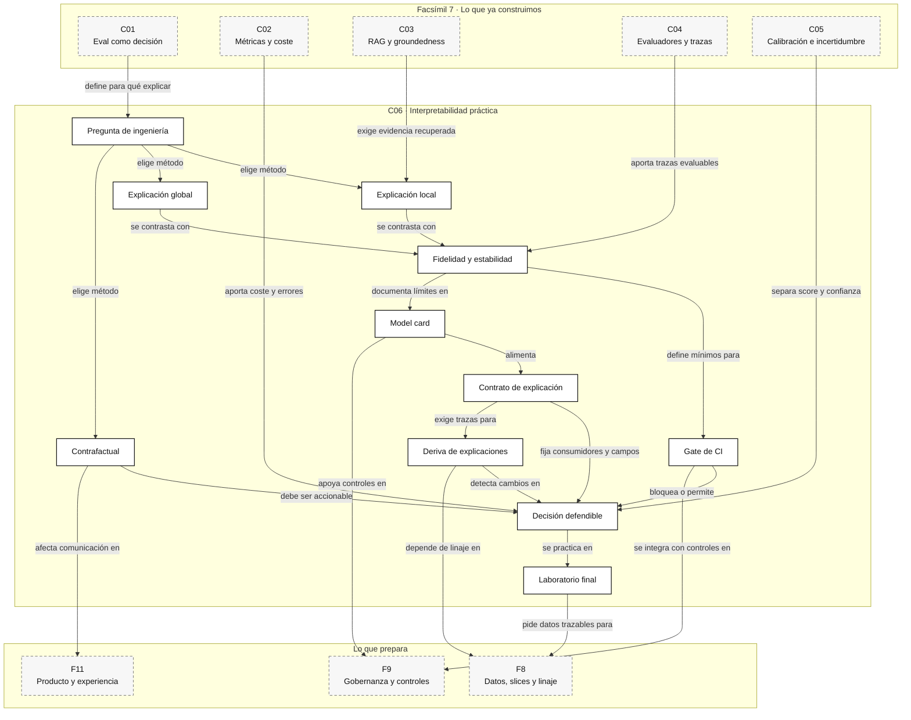

::: {.fasciculo-subtitle}
Facsímil 7 · Evaluar, calibrar e interpretar
:::

# Capítulo 06: Interpretabilidad práctica y laboratorio de evaluación

## Qué deberías poder hacer al terminar

Este facsímil empezó con una idea sobria: una eval existe para tomar una decisión. Después medimos errores, evaluamos RAG, diseñamos evaluadores, calibramos scores y convertimos incertidumbre en política. Ahora queda una pregunta que aparece siempre en ingeniería de IA:

> ¿Podemos explicar lo suficiente para depurar, publicar, limitar o rechazar este sistema?

Interpretabilidad no es una palabra para tranquilizar a alguien en una reunión. Tampoco es una imagen bonita, una tabla de pesos o una respuesta del modelo diciendo “he decidido esto por...”. Interpretabilidad, en ingeniería, es una herramienta para hacer mejores preguntas: qué feature pesa, qué caso cambia, qué slice se rompe, qué explicación es estable, qué parte del sistema no entendemos todavía y qué decisión podemos defender.

Al terminar deberías poder hacer esto:

| Resultado de aprendizaje | Evidencia de que lo sabes hacer |
|---|---|
| Separar interpretabilidad, explicabilidad y transparencia. | No usas esas palabras como sinónimos automáticos. |
| Elegir método según pregunta. | Distingues explicación local, global, contrafactual, conceptual y mecánica. |
| Evaluar una explicación. | Mides fidelidad, estabilidad, sensibilidad y utilidad operativa. |
| Leer atribuciones con cautela. | Sabes por qué una atribución plausible puede ser infiel. |
| Diseñar contrafactuales útiles. | Separas cambios accionables de cambios imposibles o injustos. |
| Conectar interpretabilidad con EvalOps. | Conviertes explicaciones en checks, model card y casos de regresión. |
| Cerrar el facsímil con práctica real. | Ejecutas un kit, generas un reporte y resuelves dos retos integradores. |

La idea central del capítulo es esta: **una explicación no se acepta porque suene bien; se acepta porque ayuda a diagnosticar y resiste comprobaciones**.

## El problema: una explicación puede sonar perfecta y no explicar nada

Imagina un sistema que prioriza tickets académicos. Para un caso concreto devuelve:

```json
{
  "score": 0.86,
  "decision": "urgente",
  "explanation": "El caso parece urgente por su tono y por la fecha cercana."
}
```

La frase suena humana. Pero un ingeniero debería preguntar:

| Pregunta | Por qué importa |
|---|---|
| ¿El modelo tenía una feature llamada `tono`? | Si no existe, la explicación puede ser una racionalización. |
| ¿Qué pasa si eliminamos la feature principal? | Si la salida no cambia, la explicación no sostiene la decisión. |
| ¿La explicación cambia ante pequeñas perturbaciones? | Si cambia demasiado, no es estable. |
| ¿El caso era parte de un slice problemático? | Una explicación local puede esconder un patrón global malo. |
| ¿El cambio recomendado es accionable? | No todo contrafactual sirve para una persona o un equipo. |

Esto es especialmente delicado en LLMs. Una respuesta puede construir una narración convincente después de producir la salida. En ese caso, la explicación puede ser plausible para nosotros, pero no fiel al proceso que produjo el resultado.

Por eso el capítulo no va de “hacer explicable la IA” en abstracto. Va de crear un expediente técnico: qué método usamos, qué pregunta responde, qué prueba lo contradice y qué decisión permite tomar.

## Qué no es interpretabilidad

Interpretabilidad no es necesariamente simplicidad. Un modelo lineal puede ser fácil de leer y aun así estar usando features mal definidas, proxies pobres o datos incompletos. Un árbol pequeño puede ser comprensible y seguir aprendiendo una regla poco útil.

Tampoco es una promesa de verdad. Una explicación post hoc puede aproximar el comportamiento de un modelo complejo, pero no convertirse en el modelo real. LIME aproxima localmente; SHAP reparte contribuciones bajo supuestos; saliency maps señalan sensibilidad; contrafactuales proponen cambios; ninguna de esas piezas sustituye una evaluación.

Y, sobre todo, interpretabilidad no es decoración de compliance. Si nadie puede decir qué decisión cambia gracias a la explicación, quizá solo hemos añadido otra pantalla.

| Confusión | Lectura de ingeniería |
|---|---|
| “Tenemos explicación, así que el sistema es fiable”. | La explicación también se evalúa. |
| “El mapa de calor marca la zona importante”. | Hay que probar sensibilidad, estabilidad y sanity checks. |
| “El modelo dice por qué decidió”. | Una explicación textual puede no ser fiel. |
| “SHAP lo arregla”. | SHAP responde una familia concreta de preguntas bajo supuestos concretos. |
| “Contrafactual significa recomendación”. | Solo algunos cambios son accionables y aceptables. |

Lipton advertía que “interpretabilidad” suele mezclar propiedades distintas: transparencia, simulabilidad, decomponibilidad, post hoc explanations y confianza humana.^[Lipton, Z. C. (2018). The Mythos of Model Interpretability. *Communications of the ACM*, 61(10), 36-43. https://doi.org/10.1145/3233231] Doshi-Velez y Kim proponían tratar la interpretabilidad como una cuestión evaluable, no como una etiqueta estética.^[Doshi-Velez, F. y Kim, B. (2017). *Towards A Rigorous Science of Interpretable Machine Learning*. arXiv. https://arxiv.org/abs/1702.08608]

## Qué sí es interpretar un sistema de IA

Interpretar es responder una pregunta situada. No “explícame el modelo”, sino:

| Pregunta | Método razonable |
|---|---|
| ¿Por qué este caso se marcó como urgente? | Explicación local y prueba de borrado. |
| ¿Qué features pesan globalmente? | Importancia por permutación, SHAP agregado o modelo interpretable. |
| ¿Qué tendría que cambiar para otra decisión? | Contrafactual accionable. |
| ¿Qué concepto humano usa el modelo? | TCAV o análisis por conceptos. |
| ¿Qué región de una imagen activó una clase? | Grad-CAM u otro método visual con sanity checks. |
| ¿Qué parte interna participa en una asociación factual? | Intervenciones causales o análisis mecanicista. |
| ¿Qué explicación puedo mostrar a usuario final? | Una explicación validada por utilidad, no solo por fidelidad técnica. |

Hay dos ejes que conviene escribir siempre:

| Eje | Pregunta |
|---|---|
| Local frente a global | ¿Explicamos un caso concreto o el comportamiento general? |
| Fidelidad frente a plausibilidad | ¿Refleja el modelo o solo convence a la persona? |
| Diagnóstico frente a comunicación | ¿Sirve para depurar o para informar una decisión? |
| Accionable frente a descriptivo | ¿Permite hacer algo distinto? |

Jacovi y Goldberg separan explícitamente fidelidad y plausibilidad en NLP: una explicación puede parecer buena a una persona y no reflejar el mecanismo que produjo la salida.^[Jacovi, A. y Goldberg, Y. (2020). Towards Faithfully Interpretable NLP Systems: How Should We Define and Evaluate Faithfulness? *ACL*. https://aclanthology.org/2020.acl-main.386/] Esa distinción es clave para LLMs.

## Fecha de corte del estado del arte

**Fecha de corte:** 6 de junio de 2026.  
**Fuentes consultadas:** trabajos clásicos sobre ciencia de la interpretabilidad, LIME, SHAP, Integrated Gradients, Grad-CAM, sanity checks, contrafactuales, modelos interpretables para decisiones sensibles, TCAV, interpretabilidad fiel en NLP y localización causal de asociaciones factuales en GPT.

LIME propone aproximar localmente un modelo complejo con un modelo interpretable alrededor de una predicción concreta.^[Ribeiro, M. T., Singh, S. y Guestrin, C. (2016). Why Should I Trust You? Explaining the Predictions of Any Classifier. *KDD*, 1135-1144. https://doi.org/10.1145/2939672.2939778] SHAP conecta atribuciones aditivas con valores de Shapley y un marco común para asignar importancia a features.^[Lundberg, S. M. y Lee, S.-I. (2017). A Unified Approach to Interpreting Model Predictions. *NeurIPS*. https://papers.nips.cc/paper/7062-a-unified-approach-to-interpreting-model-predictions] Integrated Gradients plantea axiomas como sensibilidad e invariancia de implementación para atribuciones en redes profundas.^[Sundararajan, M., Taly, A. y Yan, Q. (2017). Axiomatic Attribution for Deep Networks. *ICML*, 3319-3328. https://proceedings.mlr.press/v70/sundararajan17a.html]

Grad-CAM localiza regiones relevantes para modelos visuales usando gradientes hacia capas convolucionales.^[Selvaraju, R. R., Cogswell, M., Das, A., Vedantam, R., Parikh, D. y Batra, D. (2017). Grad-CAM: Visual Explanations from Deep Networks via Gradient-Based Localization. *ICCV*. https://doi.org/10.1109/ICCV.2017.74] Adebayo et al. mostraron que algunos mapas de saliencia pueden fallar sanity checks: si la explicación apenas cambia al aleatorizar parámetros o etiquetas, hay que desconfiar.^[Adebayo, J., Gilmer, J., Muelly, M., Goodfellow, I., Hardt, M. y Kim, B. (2018). Sanity Checks for Saliency Maps. *NeurIPS*. https://papers.nips.cc/paper/2018/hash/294a8ed24b1ad22ec2e7efea049b8737-Abstract.html]

Los contrafactuales explican decisiones indicando cambios mínimos que producirían otra salida.^[Wachter, S., Mittelstadt, B. y Russell, C. (2017). Counterfactual Explanations without Opening the Black Box: Automated Decisions and the GDPR. *Harvard Journal of Law and Technology*, 31, 841-887. https://arxiv.org/abs/1711.00399] Rudin defiende que en decisiones de alto impacto conviene preferir modelos interpretables cuando sea posible, en lugar de explicar una caja negra después.^[Rudin, C. (2019). Stop Explaining Black Box Machine Learning Models for High Stakes Decisions and Use Interpretable Models Instead. *Nature Machine Intelligence*, 1, 206-215. https://doi.org/10.1038/s42256-019-0048-x]

Para conceptos humanos, TCAV cuantifica sensibilidad a direcciones conceptuales aprendidas.^[Kim, B., Wattenberg, M., Gilmer, J., Cai, C., Wexler, J., Viégas, F. y Sayres, R. (2018). Interpretability Beyond Feature Attribution: Quantitative Testing with Concept Activation Vectors. *ICML*. https://arxiv.org/abs/1711.11279] En modelos de lenguaje, trabajos como ROME usan intervenciones causales para localizar asociaciones factuales en GPT.^[Meng, K., Bau, D., Andonian, A. y Belinkov, Y. (2022). Locating and Editing Factual Associations in GPT. *NeurIPS*. https://papers.nips.cc/paper_files/paper/2022/hash/6f1d43d5a82a37e89b0665b33bf3a182-Abstract-Conference.html]

## Anatomía de una auditoría de interpretabilidad

<figure id="f7-c06-interpretability-audit" class="book-figure book-figure-svg">
<svg viewBox="0 0 1760 1260" role="img" aria-labelledby="f7-c06-title f7-c06-desc" xmlns="http://www.w3.org/2000/svg">
  <title id="f7-c06-title">Auditoría de interpretabilidad práctica</title>
  <desc id="f7-c06-desc">Diagrama en blanco, negro y gris que conecta pregunta de ingeniería, modelo, explicación local, explicación global, contrafactuales, pruebas de fidelidad, estabilidad, model card, EvalOps y decisión.</desc>
  <defs>
    <marker id="f7c06-arrow" markerWidth="12" markerHeight="12" refX="10" refY="6" orient="auto">
      <path d="M1 1 L11 6 L1 11 Z" fill="#111111"/>
    </marker>
    <pattern id="f7c06-grid" width="28" height="28" patternUnits="userSpaceOnUse">
      <path d="M 28 0 L 0 0 0 28" fill="none" stroke="#EFEFEF" stroke-width="1"/>
    </pattern>
    <style>
      .bg{fill:#FFFFFF}
      .grid{fill:url(#f7c06-grid)}
      .title{font-family:Inter,Arial,sans-serif;font-size:34px;font-weight:800;fill:#111111}
      .sub{font-family:Inter,Arial,sans-serif;font-size:18px;fill:#444444}
      .box{fill:#FFFFFF;stroke:#111111;stroke-width:2}
      .soft{fill:#F6F6F6;stroke:#111111;stroke-width:1.6}
      .dark{fill:#111111;stroke:#111111;stroke-width:2}
      .label{font-family:Inter,Arial,sans-serif;font-size:17px;font-weight:800;fill:#111111}
      .small{font-family:Inter,Arial,sans-serif;font-size:13px;fill:#333333}
      .tiny{font-family:Inter,Arial,sans-serif;font-size:11.5px;fill:#666666}
      .white{font-family:Inter,Arial,sans-serif;font-size:15px;font-weight:800;fill:#FFFFFF}
      .code{font-family:ui-monospace,SFMono-Regular,Menlo,Consolas,monospace;font-size:12px;fill:#111111}
      .line{stroke:#111111;stroke-width:2;fill:none;marker-end:url(#f7c06-arrow)}
      .dash{stroke:#666666;stroke-width:1.6;stroke-dasharray:7 7;fill:none;marker-end:url(#f7c06-arrow)}
      .axis{stroke:#333333;stroke-width:1.3;fill:none}
      .faint{stroke:#BBBBBB;stroke-width:1;fill:none}
    </style>
  </defs>

  <rect class="bg" x="0" y="0" width="1760" height="1260"/>
  <rect class="grid" x="52" y="46" width="1656" height="1110" rx="24"/>
  <text class="title" x="92" y="112">Interpretar no es decorar: es auditar una decisión</text>
  <text class="sub" x="92" y="146">Una explicación defendible conecta pregunta, método, prueba de fidelidad y acción operativa.</text>

  <rect class="dark" x="86" y="205" width="270" height="54" rx="12"/>
  <text class="white" x="221" y="239" text-anchor="middle">1 · Pregunta</text>
  <rect class="box" x="86" y="280" width="270" height="265" rx="16"/>
  <text class="label" x="116" y="320">Qué necesitas saber</text>
  <text class="small" x="116" y="356">• por qué este caso</text>
  <text class="small" x="116" y="382">• qué pesa globalmente</text>
  <text class="small" x="116" y="408">• qué cambio bastaría</text>
  <text class="small" x="116" y="434">• qué parte no entendemos</text>
  <line class="faint" x1="116" y1="462" x2="326" y2="462"/>
  <text class="tiny" x="116" y="492">Sin pregunta concreta,</text>
  <text class="tiny" x="116" y="514">la explicación no tiene contrato.</text>

  <rect class="dark" x="424" y="205" width="270" height="54" rx="12"/>
  <text class="white" x="559" y="239" text-anchor="middle">2 · Modelo y dato</text>
  <rect class="box" x="424" y="280" width="270" height="265" rx="16"/>
  <text class="label" x="454" y="320">Score trazable</text>
  <text class="code" x="454" y="356">z = beta0 + sum beta_j x_j</text>
  <text class="code" x="454" y="382">p = sigmoid(z)</text>
  <text class="small" x="454" y="420">versiones:</text>
  <text class="tiny" x="454" y="446">model · data · threshold</text>
  <text class="tiny" x="454" y="468">policy · explanation</text>
  <line class="faint" x1="454" y1="492" x2="664" y2="492"/>
  <text class="tiny" x="454" y="520">Si falta linaje, no hay auditoría.</text>

  <rect class="dark" x="762" y="205" width="270" height="54" rx="12"/>
  <text class="white" x="897" y="239" text-anchor="middle">3 · Explicar</text>
  <rect class="box" x="762" y="280" width="270" height="265" rx="16"/>
  <text class="label" x="792" y="320">Métodos</text>
  <text class="small" x="792" y="356">Local: contribuciones</text>
  <text class="small" x="792" y="382">Global: permutación</text>
  <text class="small" x="792" y="408">Cambio: contrafactual</text>
  <text class="small" x="792" y="434">Concepto: TCAV</text>
  <text class="small" x="792" y="460">Interno: intervención</text>
  <line class="faint" x1="792" y1="486" x2="1002" y2="486"/>
  <text class="tiny" x="792" y="516">Un método responde</text>
  <text class="tiny" x="792" y="536">solo una pregunta.</text>

  <rect class="dark" x="1100" y="205" width="270" height="54" rx="12"/>
  <text class="white" x="1235" y="239" text-anchor="middle">4 · Probar</text>
  <rect class="box" x="1100" y="280" width="270" height="265" rx="16"/>
  <text class="label" x="1130" y="320">Fidelidad</text>
  <text class="small" x="1130" y="356">borrado de top feature</text>
  <text class="small" x="1130" y="382">permutación</text>
  <text class="small" x="1130" y="408">estabilidad</text>
  <text class="small" x="1130" y="434">sanity checks</text>
  <text class="small" x="1130" y="460">casos frontera</text>
  <line class="faint" x1="1130" y1="486" x2="1340" y2="486"/>
  <text class="tiny" x="1130" y="516">Una explicación sin prueba</text>
  <text class="tiny" x="1130" y="536">es una hipótesis.</text>

  <path class="line" d="M356 412 C386 412 394 412 424 412"/>
  <path class="line" d="M694 412 C724 412 732 412 762 412"/>
  <path class="line" d="M1032 412 C1062 412 1070 412 1100 412"/>

  <rect class="soft" x="244" y="650" width="310" height="260" rx="18"/>
  <text class="label" x="399" y="690" text-anchor="middle">Local</text>
  <text class="code" x="286" y="730">case_id: t001</text>
  <text class="code" x="286" y="756">score: 0.8596</text>
  <text class="small" x="286" y="792">1 · student_wait_days</text>
  <rect x="286" y="808" width="198" height="16" fill="#111111"/>
  <text class="small" x="286" y="850">2 · missing_payment</text>
  <rect x="286" y="866" width="158" height="16" fill="#444444"/>
  <text class="small" x="286" y="894">3 · prior_cases</text>

  <rect class="soft" x="628" y="650" width="310" height="260" rx="18"/>
  <text class="label" x="783" y="690" text-anchor="middle">Global</text>
  <line class="axis" x1="682" y1="850" x2="872" y2="850"/>
  <line class="axis" x1="682" y1="850" x2="682" y2="730"/>
  <rect x="704" y="752" width="34" height="98" fill="#111111"/>
  <rect x="760" y="774" width="34" height="76" fill="#444444"/>
  <rect x="816" y="796" width="34" height="54" fill="#777777"/>
  <text class="tiny" x="702" y="880">deadline</text>
  <text class="tiny" x="758" y="902">wait</text>
  <text class="tiny" x="814" y="880">prior</text>
  <text class="small" x="680" y="722">caída de accuracy</text>

  <rect class="soft" x="1012" y="650" width="310" height="260" rx="18"/>
  <text class="label" x="1167" y="690" text-anchor="middle">Contrafactual</text>
  <text class="small" x="1056" y="734">Caso t019</text>
  <text class="code" x="1056" y="764">score 0.779 → 0.625</text>
  <text class="small" x="1056" y="806">Cambio accionable:</text>
  <text class="tiny" x="1056" y="834">adjuntar documentación</text>
  <line class="faint" x1="1056" y1="858" x2="1282" y2="858"/>
  <text class="tiny" x="1056" y="886">No todo cambio mínimo</text>
  <text class="tiny" x="1056" y="906">es aceptable o justo.</text>

  <path class="dash" d="M902 545 C902 600 430 610 430 650"/>
  <path class="dash" d="M902 545 C902 600 784 610 784 650"/>
  <path class="dash" d="M1236 545 C1236 600 1168 610 1168 650"/>

  <rect class="dark" x="160" y="1000" width="220" height="58" rx="12"/>
  <text class="white" x="270" y="1036" text-anchor="middle">Contrato</text>
  <rect class="dark" x="450" y="1000" width="220" height="58" rx="12"/>
  <text class="white" x="560" y="1036" text-anchor="middle">Model card</text>
  <rect class="dark" x="740" y="1000" width="220" height="58" rx="12"/>
  <text class="white" x="850" y="1036" text-anchor="middle">Gate CI</text>
  <rect class="dark" x="1030" y="1000" width="220" height="58" rx="12"/>
  <text class="white" x="1140" y="1036" text-anchor="middle">Monitorización</text>
  <rect class="dark" x="1320" y="1000" width="220" height="58" rx="12"/>
  <text class="white" x="1430" y="1036" text-anchor="middle">Decisión</text>
  <path class="line" d="M380 1030 L450 1030"/>
  <path class="line" d="M670 1030 L740 1030"/>
  <path class="line" d="M960 1030 L1030 1030"/>
  <path class="line" d="M1250 1030 L1320 1030"/>
  <rect class="soft" x="160" y="1084" width="220" height="72" rx="10"/>
  <text class="tiny" x="178" y="1110">purpose · consumers</text>
  <text class="tiny" x="178" y="1130">required_fields</text>
  <text class="tiny" x="178" y="1150">data_hash · policy_hash</text>
  <rect class="soft" x="450" y="1084" width="220" height="72" rx="10"/>
  <text class="tiny" x="468" y="1110">scope · limits</text>
  <text class="tiny" x="468" y="1130">eval evidence</text>
  <text class="tiny" x="468" y="1150">owner · release</text>
  <rect class="soft" x="740" y="1084" width="220" height="72" rx="10"/>
  <text class="tiny" x="758" y="1110">borrado · estabilidad</text>
  <text class="tiny" x="758" y="1130">suficiencia · C_K</text>
  <text class="tiny" x="758" y="1150">proxy scan · threshold</text>
  <rect class="soft" x="1030" y="1084" width="220" height="72" rx="10"/>
  <text class="tiny" x="1048" y="1110">top feature distribution</text>
  <text class="tiny" x="1048" y="1130">drift · trace id</text>
  <text class="tiny" x="1048" y="1150">counterfactual rate</text>
  <rect class="soft" x="1320" y="1084" width="220" height="72" rx="10"/>
  <text class="tiny" x="1338" y="1110">permitir · limitar</text>
  <text class="tiny" x="1338" y="1130">revisar · bloquear</text>
  <text class="tiny" x="1338" y="1150">criterio operativo</text>
  <text x="1660" y="1208" text-anchor="end" class="tiny" fill="#888888" opacity="0.45">IA para gente curiosa / Facsímil 07 / Capítulo 06 / 686f6c61</text>
</svg>
<figcaption>Una auditoría de interpretabilidad empieza con una pregunta y termina en una decisión. Entre medias hay método, prueba y documentación.</figcaption>
</figure>

## Las fórmulas que sí conviene saber

En el kit práctico usamos un modelo lineal porque permite ver las tripas sin depender de librerías. No porque todos los sistemas reales sean lineales, sino porque es el punto más honesto para aprender a auditar explicaciones.

El modelo calcula un logit:

$$
z(x) =
\beta_0 +
\sum_{j=1}^{d}
\beta_j x_j
$$

Y lo convierte en probabilidad con una sigmoide:

$$
\hat{p}(x) =
\sigma(z) =
\frac{1}{1 + e^{-z(x)}}
$$

| Símbolo | Significado | Ejemplo |
|---|---|---|
| \(x\) | Caso que evaluamos. | Ticket `t001`. |
| \(x_j\) | Valor de la feature \(j\). | `student_wait_days = 12`. |
| \(\beta_j\) | Peso de la feature \(j\). | 0,13. |
| \(\beta_0\) | Intercepto. | -2,35. |
| \(z(x)\) | Suma lineal antes de probabilidad. | 1,812. |
| \(\hat{p}(x)\) | Probabilidad estimada. | 0,8596. |

En un modelo lineal, la contribución local de una feature puede escribirse de forma directa:

$$
c_j(x) =
\beta_j x_j
$$

| Símbolo | Significado | Ejemplo |
|---|---|---|
| \(c_j(x)\) | Contribución de la feature \(j\) al logit. | 1,56. |
| \(\beta_j\) | Peso aprendido o fijado. | 0,13. |
| \(x_j\) | Valor del caso. | 12 días de espera. |

Para `t001`, el kit obtiene:

| Feature | Valor | Peso | Contribución |
|---|---:|---:|---:|
| `student_wait_days` | 12 | 0,13 | 1,56 |
| `missing_payment` | 1 | 1,25 | 1,25 |
| `prior_cases` | 3 | 0,28 | 0,84 |

La explicación es clara: el modelo sube prioridad por días de espera, pago pendiente y casos previos. Pero no nos basta con leer esa tabla. Probamos si al quitar la feature superior el score cae de forma relevante.

La prueba de borrado mide:

$$
\Delta_{delete}(x, j) =
\hat{p}(x) -
\hat{p}(x_{\setminus j})
$$

| Símbolo | Significado | Ejemplo |
|---|---|---|
| \(\Delta_{delete}\) | Caída de score al neutralizar una feature. | 0,44 en el máximo del kit. |
| \(x_{\setminus j}\) | Caso con la feature \(j\) neutralizada. | `student_wait_days = 0`. |
| \(\hat{p}(x)\) | Score original. | 0,8596. |

Para importancia global por permutación:

$$
I_j =
M(D) -
M(D_{\pi(j)})
$$

| Símbolo | Significado | Ejemplo |
|---|---|---|
| \(I_j\) | Importancia global de la feature \(j\). | 0,25 para `deadline_hours`. |
| \(M(D)\) | Métrica original en dataset. | Accuracy 0,75. |
| \(D_{\pi(j)}\) | Dataset con la feature \(j\) permutada. | `deadline_hours` desordenada. |

En el kit, las tres features con mayor caída son:

| Feature | Accuracy original | Accuracy permutada | Caída |
|---|---:|---:|---:|
| `deadline_hours` | 0,75 | 0,50 | 0,25 |
| `student_wait_days` | 0,75 | 0,55 | 0,20 |
| `prior_cases` | 0,75 | 0,60 | 0,15 |

Para contrafactuales, buscamos un caso parecido que cambie la decisión:

$$
x^\* =
\arg\min_{x'}
d(x, x')
\quad
\text{sujeto a}
\quad
f(x') \ne f(x)
$$

| Símbolo | Significado | Ejemplo |
|---|---|---|
| \(x^\*\) | Caso contrafactual elegido. | Ticket con documentación adjunta. |
| \(d(x,x')\) | Distancia o coste de cambiar de \(x\) a \(x'\). | Un cambio accionable. |
| \(f(x')\) | Decisión del modelo para el caso modificado. | Pasa de urgente a normal. |

Esta fórmula parece limpia, pero en producto tiene una condición escondida: el cambio debe ser accionable y aceptable. No sirve decir “si fueras otra persona” o “si tu historial no existiera”. Sirve decir “si falta documentación, pide la documentación” o “si el pago está pendiente, compruébalo”.

## Método no es garantía: cómo elegir bien

Los métodos de interpretación responden preguntas distintas:

| Método | Pregunta que responde | Riesgo |
|---|---|---|
| Modelo interpretable | ¿Puedo entender el mecanismo completo? | Puede ser demasiado simple para el problema. |
| LIME | ¿Qué modelo simple aproxima esta predicción localmente? | Depende de perturbaciones y vecindario. |
| SHAP | ¿Cómo se reparten contribuciones entre features? | Depende del fondo, correlaciones y coste computacional. |
| Integrated Gradients | ¿Qué entrada aporta al cambio desde una línea base? | La línea base puede cambiar la historia. |
| Grad-CAM | ¿Qué región visual pesa para una clase? | Mapa grueso y sensible a sanity checks. |
| Contrafactuales | ¿Qué cambio produciría otra decisión? | Puede proponer cambios no accionables. |
| TCAV | ¿Qué concepto humano afecta al modelo? | Requiere buenos ejemplos del concepto. |
| Intervenciones internas | ¿Qué componente participa causalmente? | Es costoso, específico y fácil de sobreinterpretar. |

La regla práctica:

> No elijas el método por popularidad. Elige el método por la decisión que necesitas tomar.

Si el equipo quiere depurar un clasificador tabular, importancia por permutación y contrafactuales pueden bastar. Si quiere revisar un modelo de visión, Grad-CAM puede ayudar, pero con sanity checks. Si quiere saber si un LLM recupera un hecho por una zona concreta, hacen falta intervenciones más cercanas a interpretabilidad mecanicista. Si la decisión tiene alto impacto, Rudin nos recuerda que quizá el primer debate no sea “cómo explico la caja negra”, sino “por qué no uso un modelo interpretable desde el principio”.

## Cómo evaluar una explicación

Una explicación debe pasar pruebas. No todas son matemáticas sofisticadas; algunas son puro criterio de ingeniería:

| Prueba | Qué comprueba | Señal mala |
|---|---|---|
| Borrado | Quitar la parte explicada cambia la salida. | La salida no cambia. |
| Inserción | Añadir features importantes recupera la salida. | Features supuestamente clave no aportan. |
| Permutación | Desordenar una feature global baja métrica. | Importancia alta sin caída real. |
| Estabilidad | Perturbaciones pequeñas conservan explicación. | Explicación cambia por ruido menor. |
| Sanity check | Explicación responde a modelo/datos reales. | Mapa igual con pesos aleatorios. |
| Revisión de slice | Explicación se sostiene por segmento. | Global bien, segmento mal. |
| Utilidad humana | La persona decide mejor con la explicación. | Más confianza sin mejor decisión. |

Hay una trampa clásica: una explicación muy bonita puede aumentar confianza sin aumentar acierto. Eso es peligroso. En entornos de producto, una explicación debería medirse por decisión: reduce errores, mejora revisión, acelera diagnóstico o permite detectar un problema antes.

## Esto en un proyecto real

En un proyecto de IA, interpretabilidad aparece en cinco momentos:

| Momento | Pregunta |
|---|---|
| Diseño | ¿Necesitamos modelo interpretable por defecto? |
| Desarrollo | ¿Qué features dominan y cuáles son proxies problemáticos? |
| Evaluación | ¿Las explicaciones se sostienen en fallos y slices? |
| Producción | ¿Podemos explicar una incidencia o una decisión revisada? |
| Mejora | ¿Qué casos se convierten en regresión o cambio de datos? |

Un ejemplo cercano: en un asistente RAG, la explicación no debería ser “respondí esto porque el modelo lo consideró relevante”. Debería mostrar:

| Capa | Evidencia |
|---|---|
| Retrieval | Documentos recuperados, scores, reranker y citas usadas. |
| Respuesta | Afirmaciones principales y soporte por chunk. |
| Evaluación | Groundedness, cobertura de cita, abstención y errores. |
| Calibración | Probabilidad de respuesta aceptada o zona de revisión. |
| Operación | Modelo, prompt, índice, release y trace id. |

En agentes, una explicación útil no es solo el resumen final. Es la trayectoria: qué herramienta eligió, con qué argumentos, qué observó, qué descartó, cuánto costó y dónde pidió revisión.

## Contrato de explicación: quién puede usarla y para qué

Una explicación profesional debería tener contrato. No basta con producir un gráfico o una frase. Hay que declarar para qué sirve, quién puede verla, qué campos son obligatorios, qué versión del modelo la produjo y qué usos no están permitidos.

En el kit generamos `output/explanation_contract.json`. Un ejemplo resumido:

```json
{
  "model_version": "support-prioritizer-linear-v1",
  "explanation_policy_version": "interp-audit-v1",
  "owner": "equipo-ia",
  "purpose": "diagnostico interno y revision operativa de tickets priorizados",
  "allowed_consumers": ["ingenieria", "soporte_n2", "producto"],
  "not_for": ["decision final sin revision", "comunicacion automatica a usuario"],
  "required_fields": [
    "case_id",
    "model_version",
    "score",
    "prediction",
    "top_features",
    "deletion_test",
    "counterfactual",
    "data_hash_sha256",
    "policy_hash_sha256"
  ]
}
```

La parte importante no es el JSON bonito. Es la disciplina:

| Campo | Qué evita |
|---|---|
| `purpose` | Que una explicación de diagnóstico acabe vendida como verdad final. |
| `allowed_consumers` | Que cualquier equipo use la explicación sin entender sus límites. |
| `not_for` | Que se automatice una decisión que exige revisión. |
| `required_fields` | Que una explicación llegue sin score, versión, prueba o linaje. |
| `data_hash_sha256` | Que no sepamos con qué datos se generó. |
| `policy_hash_sha256` | Que cambie el umbral o la política y nadie lo vea. |

Esto conecta con las model cards, pero baja a operación. Una model card explica el sistema; el contrato de explicación fija cómo se puede consumir una explicación concreta en una run concreta.

## Tests de explicación en CI

Si una explicación forma parte de una release, también debería tener tests. No en el sentido de “la explicación es bonita”, sino en el sentido de que pasa checks mínimos antes de publicar una versión.

El kit produce `output/ci_explanation_gate.json`:

```json
{
  "gate": "pass",
  "checks": [
    {"name": "deletion_top_feature_drop", "passes": true},
    {"name": "permutation_importance_drop", "passes": true},
    {"name": "stability_top1", "passes": true},
    {"name": "counterfactual_available", "passes": true},
    {"name": "comprehensiveness_top2", "passes": true},
    {"name": "sufficiency_top2", "passes": true},
    {"name": "feature_proxy_scan", "passes": true}
  ],
  "recommendation": "permitir uso interno con monitorización"
}
```

Aquí aparecen dos pruebas que conviene conocer bien:

$$
C_K(x) =
\hat{p}(x) -
\hat{p}(x_{\setminus S_K})
$$

| Símbolo | Significado |
|---|---|
| \(C_K(x)\) | Comprehensiveness para las \(K\) features explicadas. |
| \(S_K\) | Conjunto de las \(K\) features superiores de la explicación. |
| \(x_{\setminus S_K}\) | Caso con esas features neutralizadas. |
| \(\hat{p}(x)\) | Score original del modelo. |

Si quitamos las features que la explicación dice que importan y el score no cae, la explicación no está contando algo fuerte.

La suficiencia mira la pregunta contraria:

$$
U_K(x) =
\left|
\hat{p}(x) -
\hat{p}(x_{S_K})
\right|
$$

| Símbolo | Significado |
|---|---|
| \(U_K(x)\) | Diferencia entre score original y score usando solo las \(K\) features explicadas. |
| \(x_{S_K}\) | Caso donde conservamos las features explicadas y neutralizamos el resto. |

Si las features explicadas bastan para reconstruir casi todo el score, \(U_K(x)\) será bajo. Si no bastan, quizá la explicación ha omitido una señal importante.

En la ejecución actual:

| Check | Resultado | Lectura |
|---|---:|---|
| `deletion_top_feature_drop` | 0,444993 | La feature superior tiene efecto medible. |
| `permutation_importance_drop` | 0,25 | Hay features globales con impacto real. |
| `stability_top1` | 0,9667 | La explicación local es estable ante perturbación pequeña. |
| `comprehensiveness_top2` | 0,210094 | Al quitar las dos features principales, el score cae. |
| `sufficiency_top2` | 0,063245 | Las dos features principales aproximan bastante el score. |
| `feature_proxy_scan` | 0,8837 | Hay correlación alta entre `prior_cases` y `student_wait_days`; conviene revisarla. |

Ese último punto es muy de ingeniería. Una correlación alta no prueba causalidad ni invalida el modelo, pero sí abre una tarea: comprobar si dos features están contando casi lo mismo, si una funciona como proxy de otra o si el dataset necesita rediseño.

## Producción: deriva de explicaciones y trazas

En producción no basta con guardar predicciones. Si la explicación influye en revisión, soporte o producto, conviene guardar eventos de explicación:

```json
{
  "case_id": "t001",
  "model_version": "support-prioritizer-linear-v1",
  "score": 0.859603,
  "prediction": 1,
  "top_features": ["student_wait_days", "missing_payment", "prior_cases"],
  "data_hash_sha256": "ec7bf...",
  "policy_hash_sha256": "9c167..."
}
```

Con esos eventos podemos medir deriva explicativa. Una forma sencilla es comparar la distribución de feature principal entre dos ventanas:

$$
D_{TV}(P_t, P_{t-1}) =
\frac{1}{2}
\sum_f
\left|
P_t(f) -
P_{t-1}(f)
\right|
$$

| Símbolo | Significado |
|---|---|
| \(P_t(f)\) | Proporción de casos donde la feature \(f\) fue la explicación principal en la ventana \(t\). |
| \(P_{t-1}(f)\) | La misma proporción en la ventana anterior. |
| \(D_{TV}\) | Distancia total variation entre distribuciones. |

En la muestra actual, la distribución de feature principal queda así:

| Feature principal | Proporción |
|---|---:|
| `deadline_hours` | 0,50 |
| `student_wait_days` | 0,30 |
| `missing_payment` | 0,15 |
| `prior_cases` | 0,05 |

Si en la siguiente release `prior_cases` pasa de 0,05 a 0,45, no basta con decir “el accuracy sigue bien”. Algo cambió en la razón operativa de las decisiones. Puede ser un cambio de datos, un cambio de política, un error de feature engineering o una señal nueva real. Hay que investigarlo.

## LLMs: explicación textual, traza y mecanismo

En modelos de lenguaje hay una confusión habitual: pedir al modelo que explique su respuesta y tratar esa explicación como mecanismo interno. Son cosas distintas.

| Nivel | Qué es | Qué puede aportar | Qué no garantiza |
|---|---|---|---|
| Explicación textual | Una justificación generada en lenguaje natural. | Puede ayudar a revisar una respuesta. | No prueba cómo se produjo la salida. |
| Traza operativa | Prompt, mensajes, herramientas, documentos, scores, coste y eventos. | Permite depurar una run. | No abre las capas internas del modelo. |
| Evidencia externa | Chunks, citas, resultados de herramientas y validaciones. | Permite comprobar afirmaciones. | No demuestra causalidad interna. |
| Interpretabilidad mecanicista | Análisis de activaciones, circuitos o intervenciones internas. | Puede estudiar mecanismos concretos. | Es costosa, parcial y no siempre trasladable a producto. |

Para ingeniería aplicada, muchas veces la traza vale más que una explicación verbal. Si un agente consulta una herramienta, recupera un documento, cambia una respuesta y pide revisión por score bajo, eso se puede auditar. Si solo dice “he razonado cuidadosamente”, no tenemos suficiente.

Una regla práctica para alumnos:

> En LLMs, no confundas explicación narrada con evidencia. Guarda trazas, contratos y resultados verificables.

## Manos a la obra

**Práctica:** auditar una explicación que se pueda defender.

Kit ejecutable de este capítulo: `labs/f7/c06-interpretabilidad-laboratorio/`.

```bash
cd labs/f7/c06-interpretabilidad-laboratorio
python3 ops/ai/interpretability_audit.py --write
```

El kit del capítulo está en:

```text
labs/f7/c06-interpretabilidad-laboratorio/
```

Construye una auditoría pequeña pero completa para un modelo lineal de priorización de tickets. El script no necesita dependencias externas.

### Estructura

```text
labs/f7/c06-interpretabilidad-laboratorio/
  README.md
  data/ticket_features.csv
  policies/interpretability_policy.json
  ops/ai/interpretability_audit.py
  output/interpretability_report.json
  output/explanation_contract.json
  output/ci_explanation_gate.json
  output/model_card_interpretability.md
  output/interpretability_decision.md
```

### Cómo lo ejecutas

```bash
cd labs/f7/c06-interpretabilidad-laboratorio
python3 ops/ai/interpretability_audit.py --write
cat output/interpretability_decision.md
```

### Qué hace el script

| Pieza | Qué produce |
|---|---|
| Predicción | Score y clase para cada ticket. |
| Explicación local | Contribuciones por feature. |
| Prueba de borrado | Caída de score al neutralizar la feature superior. |
| Importancia global | Caída de accuracy al permutar cada feature. |
| Estabilidad | Acuerdo de top feature ante perturbaciones pequeñas. |
| Contrafactuales | Cambios accionables que podrían mover una decisión. |
| Comprehensiveness | Caída media al eliminar las dos features explicadas. |
| Suficiencia | Diferencia media usando solo las dos features explicadas. |
| Revisión de proxies | Correlación máxima entre features para detectar señales redundantes. |
| Contrato de explicación | Campos obligatorios, consumidores y usos excluidos. |
| Gate de CI | Resumen `pass/fail` para automatizar release. |
| Model card | Fragmento documentando explicación y límites. |
| Decisión | Markdown con checks y conclusión técnica. |

### Salida esperada

El kit genera, entre otras cosas:

```json
{
  "accuracy": 0.75,
  "stability": {
    "top1_agreement": 0.9667
  },
  "audit_checks": [
    {
      "name": "deletion_top_feature_drop",
      "passes": true
    },
    {
      "name": "permutation_importance_drop",
      "passes": true
    },
    {
      "name": "stability_top1",
      "passes": true
    },
    {
      "name": "counterfactual_available",
      "passes": true
    },
    {
      "name": "comprehensiveness_top2",
      "passes": true
    },
    {
      "name": "sufficiency_top2",
      "passes": true
    },
    {
      "name": "feature_proxy_scan",
      "passes": true
    }
  ]
}
```

Y una decisión:

```text
Estado: defendible.

La explicación local se acepta solo porque puede contrastarse con pruebas de borrado,
importancia global, estabilidad y contrafactuales accionables.
```

La práctica importante está en discutir límites:

| Resultado | Lectura |
|---|---|
| `accuracy = 0.75` | El modelo no es perfecto; explicación no compensa evaluación pobre. |
| `top1_agreement = 0.9667` | La feature principal es estable ante perturbaciones pequeñas. |
| `deadline_hours` cae 0,25 al permutar | Globalmente pesa mucho. |
| Hay contrafactual accionable | Podemos convertir explicación en siguiente paso. |
| `comprehensiveness_top2 = 0.210094` | Al quitar las dos señales principales, la salida pierde fuerza. |
| `sufficiency_top2 = 0.063245` | Las dos señales principales casi bastan para reconstruir la salida. |
| Correlación máxima 0,8837 | `prior_cases` y `student_wait_days` deberían revisarse como posible redundancia. |

El resultado no se queda en reporte. También deja dos artefactos útiles para ingeniería:

| Archivo | Para qué sirve |
|---|---|
| `output/explanation_contract.json` | Define cómo puede consumirse una explicación y qué campos debe traer. |
| `output/ci_explanation_gate.json` | Permite meter los checks de explicación en CI antes de publicar una versión. |

## Cómo encaja todo



## Vocabulario aprendido

| Término | Definición breve |
|---|---|
| Interpretabilidad | Capacidad de entender una decisión o comportamiento con una finalidad concreta. |
| Explicación local | Explicación de una predicción concreta. |
| Explicación global | Resumen del comportamiento general del modelo. |
| Fidelidad | Correspondencia entre explicación y comportamiento real del modelo. |
| Plausibilidad | Facilidad con la que una persona acepta una explicación como razonable. |
| Atribución | Reparto de una salida entre features, tokens, regiones o componentes. |
| LIME | Aproximación local de un modelo complejo mediante un modelo interpretable. |
| SHAP | Marco de atribución basado en valores de Shapley. |
| Integrated Gradients | Método de atribución que integra gradientes desde una línea base hasta la entrada. |
| Grad-CAM | Método visual que localiza regiones relevantes para una clase. |
| Contrafactual | Cambio mínimo de entrada que produciría otra decisión. |
| Importancia por permutación | Caída de métrica al desordenar una feature. |
| Sanity check | Prueba para detectar explicaciones que no responden al modelo o datos reales. |
| TCAV | Técnica que mide sensibilidad a conceptos definidos por personas. |
| Interpretabilidad mecanicista | Estudio de componentes internos y circuitos del modelo mediante análisis e intervenciones. |
| Contrato de explicación | Acuerdo técnico que fija finalidad, consumidores, campos obligatorios, linaje y usos excluidos. |
| Comprehensiveness | Prueba que elimina las features explicadas y comprueba cuánto cae el score. |
| Suficiencia | Prueba que conserva solo las features explicadas y comprueba cuánto se parece el score al original. |
| Deriva de explicaciones | Cambio temporal o entre versiones en las razones principales del modelo. |
| Proxy | Feature que puede representar indirectamente otra variable o mezclar señales que conviene separar. |
| Recourse | Cambio accionable que una persona o equipo puede realizar para mover una decisión o resolver un caso. |

## Dónde solía tropezar yo

| Tropiezo | Por qué ocurre | Antídoto |
|---|---|---|
| Aceptar explicaciones porque suenan bien | La explicación textual parece convincente. | Separar plausibilidad de fidelidad. |
| Usar un método para todo | LIME, SHAP o saliency parecen universales. | Empezar por la pregunta de ingeniería. |
| Enseñar atribuciones sin pruebas | La tabla queda elegante. | Añadir borrado, permutación y estabilidad. |
| Proponer contrafactuales imposibles | La optimización encuentra cambios absurdos. | Filtrar por accionabilidad y aceptabilidad. |
| Confundir atención con explicación | Un peso de atención parece intuitivo. | Verificar si cambia la salida y si el mecanismo lo sostiene. |
| Olvidar los slices | La explicación global tapa segmentos malos. | Auditar por slice y por caso frontera. |
| No declarar quién puede usar la explicación | El mismo artefacto se usa para diagnóstico, soporte y comunicación externa. | Escribir contrato de explicación. |
| Dejar explicaciones fuera de CI | La release pasa métricas, pero cambia la lógica explicativa. | Añadir gate con borrado, suficiencia, estabilidad y proxies. |
| No vigilar deriva de razones | El modelo sigue acertando, pero decide por señales distintas. | Monitorizar distribución de top features. |
| Tratar proxy como causalidad | Una correlación alta parece una explicación causal. | Revisar pares de features y validar con datos o dominio. |
| Confundir explicación textual de LLM con mecanismo | La respuesta suena razonada. | Pedir trazas, evidencias y contratos de salida. |

## Antes de pasar página

Antes de cerrar el facsímil, deberías poder responder:

1. ¿Qué diferencia hay entre interpretabilidad, explicación y transparencia?
2. ¿Por qué una explicación plausible puede ser infiel?
3. ¿Cuándo preferirías un modelo interpretable frente a explicar una caja negra?
4. ¿Qué pregunta responde LIME y qué no responde?
5. ¿Qué aporta SHAP y qué supuestos conviene revisar?
6. ¿Por qué Integrated Gradients depende de una línea base?
7. ¿Qué comprobarías antes de confiar en un mapa visual?
8. ¿Qué hace que un contrafactual sea accionable?
9. ¿Cómo usarías pruebas de borrado y permutación?
10. ¿Qué debería entrar en una model card sobre interpretabilidad?
11. ¿Qué campos mínimos pondrías en un contrato de explicación?
12. ¿Qué diferencia hay entre comprehensiveness y suficiencia?
13. ¿Qué señal te daría una deriva de explicaciones?
14. ¿Por qué una correlación alta entre features puede pedir revisión?
15. ¿Qué produce el kit del capítulo?
16. ¿Cómo conecta interpretabilidad con EvalOps y calibración?

## En resumen

| Idea | Qué te llevas |
|---|---|
| Interpretar es responder una pregunta situada. | No existe “explicación general” útil para todo. |
| Plausibilidad no basta. | Una explicación debe probar fidelidad, estabilidad y utilidad. |
| Cada método tiene límites. | LIME, SHAP, Grad-CAM, contrafactuales y TCAV responden cosas distintas. |
| Los contrafactuales necesitan criterio humano. | Mínimo no significa accionable ni aceptable. |
| Las explicaciones se documentan. | Model card, datos, thresholds, checks y decisión. |
| Las explicaciones también tienen contrato. | Deben declarar finalidad, consumidores, linaje y campos obligatorios. |
| Las explicaciones se testean. | CI puede revisar borrado, suficiencia, estabilidad, proxies y contrafactuales. |
| Las explicaciones pueden derivar. | En producción conviene vigilar qué razones dominan cada versión. |
| El facsímil se cierra practicando. | El laboratorio integra métricas, RAG, evaluadores, calibración e interpretación. |

## Laboratorio

Un laboratorio, dentro de este libro, es un espacio de práctica guiada. No es un examen para pillar a nadie. Es el lugar donde convertimos el facsímil en trabajo real: construir, medir, explicar y defender.

En este laboratorio cerramos el facsímil 7. Los retos movilizan todo lo visto:

| Tema | Capítulo |
|---|---|
| Decidir para qué sirve una eval | C01 |
| Medir errores y coste | C02 |
| Evaluar RAG por capas | C03 |
| Evaluar respuestas y trazas con rúbricas | C04 |
| Calibrar scores e incertidumbre | C05 |
| Auditar interpretabilidad | C06 |

Los dos retos tienen resolución. El primero usa el kit de interpretabilidad. El segundo construye un expediente completo de evaluación para una release de IA.

### Cómo trabajar este laboratorio

Este laboratorio no va de hacer una explicación bonita. Va de defender una release. La pregunta profesional no es “¿entiendo este score?”, sino:

```text
¿Puedo usar esta evaluación para publicar, limitar o bloquear una versión de IA?
```

Trabaja con esta secuencia:

| Paso | Qué haces | Evidencia esperada |
|---|---|---|
| 1 | Ejecutas el kit de interpretabilidad. | `interpretability_report.json`. |
| 2 | Lees la decisión generada. | `interpretability_decision.md`. |
| 3 | Revisas el contrato de explicación. | `explanation_contract.json`. |
| 4 | Compruebas el gate automatizable. | `ci_explanation_gate.json`. |
| 5 | Preparas documentación de release. | `model_card_interpretability.md`. |
| 6 | Escribes una decisión. | `decision.md`. |

Un resultado fuerte tiene tres capas: números, interpretación y acción. Si solo hay números, falta criterio. Si solo hay interpretación, falta evidencia. Si no hay acción, no hay ingeniería.

### Reto 1: defender una explicación local

#### Contexto

El equipo de soporte quiere saber por qué el ticket `t001` se marca como urgente. La respuesta no puede ser “porque el score es alto”. Tienes que enseñar qué features empujan la decisión y qué pruebas sostienen esa explicación.

El caso tiene intención: `t001` no se explica para convencer con una frase amable, sino para probar si la explicación sirve como herramienta interna. Una explicación interna debe permitir depurar, revisar y decidir si el comportamiento está dentro del contrato. Una explicación hacia usuario final exigiría otro lenguaje, otra validación y otros límites.

#### Objetivo

Ejecutar el kit, leer la explicación local de `t001`, contrastarla con borrado, importancia global y estabilidad, y escribir una decisión.

#### Enunciado

Ejecuta:

```bash
cd labs/f7/c06-interpretabilidad-laboratorio
python3 ops/ai/interpretability_audit.py --write
cat output/interpretability_decision.md
cat output/model_card_interpretability.md
python3 -m json.tool output/explanation_contract.json
python3 -m json.tool output/ci_explanation_gate.json
```

Después responde:

1. ¿Qué tres features explican más `t001`?
2. ¿Qué feature pesa más globalmente?
3. ¿La explicación es estable?
4. ¿Hay contrafactual accionable en algún caso?
5. ¿Qué dice el gate de CI?
6. ¿Qué uso permite el contrato de explicación?
7. ¿La usarías para publicar el sistema?
8. ¿Qué parte no mostrarías automáticamente a un usuario final?
9. ¿Qué monitorizarías en producción para saber si la explicación cambia?
10. ¿Qué check convertirías en obligatorio para la siguiente release?

#### Resolución paso a paso

Primero leemos el caso local. El reporte indica para `t001`:

| Feature | Contribución |
|---|---:|
| `student_wait_days` | 1,56 |
| `missing_payment` | 1,25 |
| `prior_cases` | 0,84 |

El score de `t001` es 0,8596 y la predicción es positiva. La explicación local dice que la prioridad sube por días de espera, pago pendiente y casos previos.

Después comprobamos si esa explicación aguanta pruebas. Si la feature principal no cambia el score al borrarla, la explicación sería sospechosa. Si la importancia global cuenta otra historia, el caso local quizá sea anecdótico. Si la explicación cambia demasiado con perturbaciones pequeñas, no sirve para un gate de release.

En este kit, las señales son:

| Prueba | Resultado |
|---|---|
| Máxima caída en borrado | 0,444993 |
| Mayor caída por permutación | 0,25 |
| Estabilidad top-1 | 0,9667 |
| Contrafactual accionable | Existe al menos un caso donde cambia la decisión. |
| Comprehensiveness top-2 | 0,210094 |
| Suficiencia top-2 | 0,063245 |
| Proxy scan | `prior_cases` y `student_wait_days` tienen correlación 0,8837. |
| Gate de CI | `pass`, con recomendación de uso interno monitorizado. |

La correlación entre `prior_cases` y `student_wait_days` no bloquea porque queda bajo el máximo configurado, pero no debe ignorarse. En una revisión real pediría mirar si ambas variables están midiendo casi la misma fricción operativa. Si empiezan a moverse juntas en producción, la explicación puede hacerse menos informativa.

El contrafactual útil también se interpreta con cuidado. Para `t001`, resolver el pago pendiente cambia el score de `0.859603` a `0.636915` y la predicción pasa de `1` a `0`. Eso no significa culpar al pago. Significa que, bajo el modelo y sus pesos, esa variable es accionable y tiene fuerza suficiente para cambiar la salida.

#### Respuesta

Yo aceptaría la explicación como defendible para diagnóstico interno, no como explicación final al usuario. El contrato permite su uso por ingeniería, soporte N2 y producto; no permite usarla como decisión final sin revisión ni como comunicación automática.

Para usuario final la traduciría así:

> El caso se prioriza porque acumula varios indicadores operativos: espera prolongada, posible pago pendiente y antecedentes relacionados. Antes de actuar, conviene revisar documentación y estado de pago.

#### Entrega profesional esperada

```text
release-interpretability-review/
  interpretability_decision.md
  interpretability_report.json
  explanation_contract.json
  ci_explanation_gate.json
  model_card_interpretability.md
  reviewer_notes.md
```

`reviewer_notes.md` debe incluir:

1. La explicación local de `t001` en términos técnicos.
2. La versión traducida para soporte o producto.
3. Qué pruebas sostienen la explicación.
4. Qué prueba sería suficiente para dejarla en revisión.
5. Qué consumidor puede usarla y con qué límites.
6. Qué señal monitorizarías en producción.

#### Por qué funciona

No aceptamos la explicación por estética. La aceptamos porque:

1. Está conectada al cálculo del modelo.
2. La feature principal tiene efecto medible.
3. Las features globales relevantes coinciden con señales razonables.
4. La explicación no se rompe con perturbaciones pequeñas.
5. El contrato declara consumidores y campos obligatorios.
6. El gate de CI deja una condición automatizable.
7. El reporte deja trazas y model card.

#### Variaciones

- Cambia el umbral a 0,75 y mira qué casos cambian.
- Cambia el peso de `docs_attached` y explica el impacto.
- Añade un slice y decide si la explicación sigue siendo estable.

### Reto 2: preparar un expediente de evaluación completo

#### Contexto

Vas a publicar una nueva versión de un asistente RAG con agente de soporte. El equipo no quiere una opinión general; quiere un expediente técnico.

El reto simula una situación habitual: hay varias piezas que parecen razonables por separado, pero la release solo debería avanzar si el paquete completo aguanta. Un RAG con buena groundedness puede fallar por calibración. Un evaluador LLM puede puntuar bien y aun así tener demasiados pases indebidos. Una explicación puede ser plausible y no superar checks de fidelidad. El expediente fuerza a mirar la release por capas.

#### Objetivo

Diseñar el paquete mínimo de evaluación que permita publicar, limitar o bloquear una release.

#### Enunciado

Construye este expediente:

```text
release-eval/
  eval_contract.json
  rag_eval_report.json
  evaluator_metaeval.json
  calibration_manifest.json
  interpretability_report.json
  explanation_contract.json
  ci_explanation_gate.json
  model_card_fragment.md
  release_eval_report.json
  source_evidence_matrix.csv
  ci_release_gate.json
  decision.md
```

Debe responder:

1. ¿Qué decisión permite tomar la eval?
2. ¿Qué métricas de error y coste se usan?
3. ¿Cómo se evalúa RAG?
4. ¿Cómo se valida el evaluador LLM?
5. ¿Qué score está calibrado?
6. ¿Qué explicación se puede defender?
7. ¿Qué contrato permite consumir esa explicación?
8. ¿Qué condición bloquea release?
9. ¿Qué pieza se puede automatizar en CI?
10. ¿Qué pieza requiere revisión humana o de producto?
11. ¿Qué métrica vigilarías durante la primera semana?

El kit real está en:

```text
labs/f7/laboratorio-cierre/
```

Antes de construir el expediente final, genera las evidencias de calibración e interpretabilidad:

```bash
cd labs/f7/c05-calibracion
python3 ops/ai/calibrate_policy.py --write

cd ../c06-interpretabilidad-laboratorio
python3 ops/ai/interpretability_audit.py --write
```

Después ejecuta el cierre:

```bash
cd ../laboratorio-cierre
python3 ops/build_release_eval_pack.py --write
python3 -m json.tool output/ci_release_gate.json
cat output/decision.md
```

La salida de referencia no dice “todo perfecto”. Dice `publicar_con_condiciones`: el paquete no tiene bloqueos, pero conserva puntos que un equipo serio no debería ignorar, como cobertura de cola larga en RAG e intervalo Wilson amplio en error automático.

También hay una variante para practicar el bloqueo:

```bash
python3 ops/build_release_eval_pack.py \
  --rag-report evidence/rag_eval_report_student.json \
  --evaluator-report evidence/evaluator_metaeval_student.json \
  --output-dir output/student \
  --write
python3 -m json.tool output/student/ci_release_gate.json
cat output/student/decision.md
```

En esa variante el resultado debe ser `bloquear`, porque RAG no sostiene suficientemente groundedness, citas y abstención, y el evaluador deja pasar demasiados casos que no debería.

#### Resolución paso a paso

Primero, el contrato. No empieza por métricas porque sí; empieza por decisión:

```json
{
  "release_id": "support-rag-agent@2.1.0",
  "decision": "publicar, limitar o bloquear release",
  "must_pass": {
    "rag_groundedness": 0.9,
    "citation_acceptance": 0.88,
    "auto_error_rate": 0.18,
    "review_rate_max": 0.6,
    "evaluator_undue_pass_rate": 0.08,
    "interpretability_checks": "all_pass"
  }
}
```

Después, cada capítulo aporta una pieza. Lo importante es que ninguna pieza decide sola:

| Pieza | Viene de | Qué exige |
|---|---|---|
| `eval_contract.json` | C01 | Decisión, alcance y condición de bloqueo. |
| `rag_eval_report.json` | C03 | Retrieval, groundedness, citas y abstención. |
| `evaluator_metaeval.json` | C04 | Evaluador medido contra referencia. |
| `calibration_manifest.json` | C05 | Score, calibrador, umbrales, slices y triggers. |
| `interpretability_report.json` | C06 | Fidelidad, estabilidad, contrafactuales y model card. |
| `explanation_contract.json` | C06 | Finalidad, consumidores, campos y linaje de explicación. |
| `ci_explanation_gate.json` | C06 | Checks mínimos para automatizar una decisión de release. |
| `source_evidence_matrix.csv` | C01-C06 | Matriz que conecta cada check con capítulo, métrica y fuente. |
| `ci_release_gate.json` | C01-C06 | Salida mínima que podría usar un pipeline. |

Ahora se interpreta el paquete:

| Capa | Pregunta | Salida esperada |
|---|---|---|
| Eval general | ¿Qué decisión permite tomar? | Contrato con `must_pass`. |
| RAG | ¿La respuesta se apoya en evidencia? | Groundedness, citas y abstención. |
| Evaluador | ¿El evaluador coincide con referencia fiable? | Metaevaluación y pases indebidos bajo límite. |
| Calibración | ¿El score significa riesgo operativo? | Umbrales, zona gris y revisión. |
| Interpretabilidad | ¿La explicación se sostiene? | Checks, contrato y model card. |
| Operación | ¿Qué pasa si algo cambia? | Canary, monitorización y rollback. |

La decisión Markdown podría decir:

```markdown
# Decisión de release

Estado: publicar con condiciones.

Motivo:
- RAG pasa groundedness y citas.
- Evaluador automático pasa metaevaluación, pero queda cerca del límite en casos de soporte largo.
- Calibración permite automatizar fuera de zona gris.
- Interpretabilidad pasa checks técnicos y contrato de uso interno.

Condiciones:
- Canary al 10%.
- Revisión obligatoria para slice `matricula`.
- Recalibrar si cambia índice RAG o prompt.
- Vigilar distribución de razones principales durante la primera semana.
```

#### Respuesta

Publicaría solo con condiciones si todas las piezas pasan y ninguna depende de una muestra demasiado pequeña. Bloquearía si:

| Bloqueo | Motivo |
|---|---|
| RAG no sostiene citas | El usuario recibe afirmaciones sin evidencia. |
| Evaluador aprueba fallos graves | El gate deja pasar regresiones. |
| Calibrador caducado | El score ya no significa lo que creemos. |
| Interpretabilidad no pasa sanity checks | La explicación puede crear confianza falsa. |
| Gate de explicación falla | La explicación no resiste mínimos técnicos. |
| Contrato de explicación incompleto | No sabemos quién puede usarla ni con qué campos. |
| No hay owner | Nadie responde por la política. |

La respuesta fuerte no se queda en “publicar con condiciones”. Debe decir qué condiciones:

1. Canary al 10% con trazas completas.
2. Revisión obligatoria para zona gris de calibración.
3. Bloqueo si groundedness o cita válida cae bajo umbral.
4. Recalibración si cambia modelo, prompt, retriever o índice.
5. Monitorización de distribución de top features y motivos de abstención.
6. Revisión semanal de errores por slice durante la primera ventana.

#### Validar la entrega

Cuando el alumno haya construido su carpeta, puede pasar el checker:

```bash
cd labs/f7/laboratorio-cierre
python3 ops/check_student_submission.py --submission-dir solutions/reference --write
```

Para una entrega propia:

```bash
python3 ops/check_student_submission.py --submission-dir solutions/mi-equipo --write --fail-on-missing
```

La solución de referencia obtiene `70/70`. Ese número no significa que la release sea perfecta; significa que la entrega contiene contrato, evidencias, gates, matriz de fuentes y decisión defendible.

#### Entrega profesional esperada

```text
release-eval/
  eval_contract.json
  rag_eval_report.json
  evaluator_metaeval.json
  calibration_manifest.json
  interpretability_report.json
  explanation_contract.json
  ci_explanation_gate.json
  model_card_fragment.md
  release_eval_report.json
  source_evidence_matrix.csv
  ci_release_gate.json
  decision.md
```

`decision.md` debe explicar:

1. Qué se publicaría o bloquearía.
2. Qué evidencia sostiene RAG.
3. Qué límites tiene el evaluador.
4. Qué dice la calibración y dónde hay incertidumbre.
5. Qué permite el contrato de explicación.
6. Qué condición entra en CI.
7. Qué tarea queda para la siguiente iteración.

#### Por qué funciona

El expediente evita el error de publicar por una sola métrica. Una release de IA necesita evidencia por capas: datos, recuperación, salida, evaluación, calibración, explicación y operación.

También fuerza una idea clave del facsímil 7: evaluar no es calcular métricas; es decidir qué evidencia cambia una decisión. Cada archivo del expediente existe porque alguien debe poder auditarlo después.

#### Cómo explicarlo a otra persona

“No publicamos porque el modelo parezca bueno. Publicamos si el expediente demuestra que responde con evidencia, se evalúa con criterios, calibra su incertidumbre, puede explicarse cuando falla y deja claro qué hacer si cambia el contexto.”

#### Variaciones

- Cambia `publicar con condiciones` por `bloquear` y escribe qué evidencia faltaría.
- Añade coste p95 por run al contrato.
- Añade una muestra nueva de producción y decide si hay deriva.

### Cierre del laboratorio

Si completas estos dos retos, el facsímil 7 deja de ser una lista de métricas. Se convierte en una práctica profesional: defines una decisión, mides errores, evalúas RAG, validas evaluadores, calibras scores, interpretas salidas y documentas límites.

La pregunta final es:

> ¿Puedo defender esta release con evidencia, o solo tengo una demo que me gusta?

## Para saber más

Adebayo, J., Gilmer, J., Muelly, M., Goodfellow, I., Hardt, M. y Kim, B. (2018). Sanity Checks for Saliency Maps. *Advances in Neural Information Processing Systems*. https://papers.nips.cc/paper/2018/hash/294a8ed24b1ad22ec2e7efea049b8737-Abstract.html

Doshi-Velez, F. y Kim, B. (2017). *Towards A Rigorous Science of Interpretable Machine Learning*. arXiv. https://arxiv.org/abs/1702.08608

Jacovi, A. y Goldberg, Y. (2020). Towards Faithfully Interpretable NLP Systems: How Should We Define and Evaluate Faithfulness? *Proceedings of ACL*. https://aclanthology.org/2020.acl-main.386/

Kim, B., Wattenberg, M., Gilmer, J., Cai, C., Wexler, J., Viégas, F. y Sayres, R. (2018). Interpretability Beyond Feature Attribution: Quantitative Testing with Concept Activation Vectors. *ICML*. https://arxiv.org/abs/1711.11279

Lipton, Z. C. (2018). The Mythos of Model Interpretability. *Communications of the ACM*, 61(10), 36-43. https://doi.org/10.1145/3233231

Lundberg, S. M. y Lee, S.-I. (2017). A Unified Approach to Interpreting Model Predictions. *Advances in Neural Information Processing Systems*. https://papers.nips.cc/paper/7062-a-unified-approach-to-interpreting-model-predictions

Meng, K., Bau, D., Andonian, A. y Belinkov, Y. (2022). Locating and Editing Factual Associations in GPT. *Advances in Neural Information Processing Systems*. https://papers.nips.cc/paper_files/paper/2022/hash/6f1d43d5a82a37e89b0665b33bf3a182-Abstract-Conference.html

Mitchell, M., Wu, S., Zaldivar, A., Barnes, P., Vasserman, L., Hutchinson, B., Spitzer, E., Raji, I. D. y Gebru, T. (2019). Model Cards for Model Reporting. *FAT*, 220-229. https://doi.org/10.1145/3287560.3287596

Ribeiro, M. T., Singh, S. y Guestrin, C. (2016). Why Should I Trust You? Explaining the Predictions of Any Classifier. *KDD*, 1135-1144. https://doi.org/10.1145/2939672.2939778

Rudin, C. (2019). Stop Explaining Black Box Machine Learning Models for High Stakes Decisions and Use Interpretable Models Instead. *Nature Machine Intelligence*, 1, 206-215. https://doi.org/10.1038/s42256-019-0048-x

Selvaraju, R. R., Cogswell, M., Das, A., Vedantam, R., Parikh, D. y Batra, D. (2017). Grad-CAM: Visual Explanations from Deep Networks via Gradient-Based Localization. *ICCV*. https://doi.org/10.1109/ICCV.2017.74

Sundararajan, M., Taly, A. y Yan, Q. (2017). Axiomatic Attribution for Deep Networks. *ICML*, 3319-3328. https://proceedings.mlr.press/v70/sundararajan17a.html

Tabassi, E. (2023). *Artificial Intelligence Risk Management Framework (AI RMF 1.0)*. National Institute of Standards and Technology. https://doi.org/10.6028/NIST.AI.100-1

Wachter, S., Mittelstadt, B. y Russell, C. (2017). Counterfactual Explanations without Opening the Black Box: Automated Decisions and the GDPR. *Harvard Journal of Law and Technology*, 31, 841-887. https://arxiv.org/abs/1711.00399
