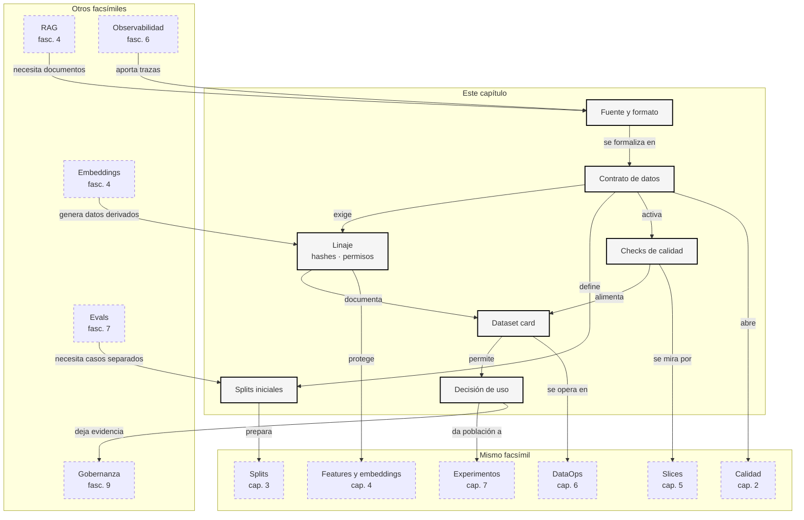

::: {.fasciculo-subtitle}
Facsímil 8 · La ciencia de los datos
:::

# Capítulo 01: Datos, datasets y linaje: la primera decisión de IA

## Qué deberías poder hacer al terminar

Este facsímil cambia el foco. Hasta ahora hemos hablado de modelos, APIs, agentes, operación, evaluación, calibración e interpretabilidad. Pero todos esos sistemas tienen una pieza anterior que condiciona casi todo: **qué datos entran, de dónde vienen, para qué pueden usarse y cómo sabemos que no nos estamos engañando**.

La frase central del capítulo es esta:

> Un dataset no es una carpeta con filas. Es una decisión técnica congelada.

Al terminar deberías poder hacer esto:

| Resultado de aprendizaje | Evidencia de que lo sabes hacer |
|---|---|
| Distinguir dato, ejemplo, dataset y artefacto derivado. | No llamas “datos” a cualquier texto metido en un prompt. |
| Diseñar un contrato de datos mínimo. | Defines columnas, splits, licencias, sensibilidad, owner y checks. |
| Explicar linaje. | Puedes responder qué fuente produjo cada fila y qué hash identifica el snapshot. |
| Detectar leakage básico. | Sabes buscar duplicados o equivalencias entre train, validation y test. |
| Separar uso de entrenamiento, evaluación y consulta. | No usas el mismo dato para todo si su licencia o finalidad no lo permite. |
| Conectar datos con RAG, fine-tuning y evals. | Ves que documentos, chunks, embeddings, labels y trazas son artefactos de datos. |
| Ejecutar un gate de datos. | Generas un reporte, una dataset card y una decisión técnica reproducible. |

La ciencia de datos en IA no empieza entrenando. Empieza preguntando: **¿puedo usar este dato para esta decisión?**

## La escena: el modelo falla, pero el bug estaba en el dataset

Imagina un asistente académico que responde dudas sobre matrícula, becas, pagos y horarios. El equipo detecta errores en producción y lo primero que se propone es cambiar de modelo. Parece razonable: si la respuesta falla, el modelo será peor de lo esperado.

Pero al mirar los datos aparecen cosas menos vistosas:

| Hallazgo | Consecuencia |
|---|---|
| Varias respuestas de evaluación también estaban en entrenamiento. | La métrica era demasiado optimista. |
| Algunos documentos del corpus estaban obsoletos. | El RAG citaba bien, pero citaba una fuente vieja. |
| Una licencia permitía consulta interna, no entrenamiento. | El fine-tuning propuesto no era aceptable. |
| El campo `producto` cambió de nombre en producción. | El modelo recibía una feature rota. |
| Las etiquetas se pusieron con criterios distintos según el equipo. | La métrica mezclaba desacuerdos humanos con errores del modelo. |

En ese punto, cambiar de modelo es secundario. El sistema no necesita más brillo; necesita DataOps.

## Qué no es un dataset

Un dataset no es “unos CSV que encontré”, una carpeta de PDFs, una tabla de tickets o un export rápido de una herramienta interna. Eso puede ser una fuente de datos, pero todavía no es un dataset listo para ingeniería de IA.

Tampoco es un objeto neutral. La forma de recogerlo, filtrar filas, etiquetar casos, borrar columnas, crear splits y elegir qué queda fuera define qué aprenderá o evaluará el sistema.

Y no es intercambiable entre usos. Un dato puede servir para consultar en RAG, pero no para entrenar. Puede servir para evaluación interna, pero no para publicar resultados. Puede servir con metadatos, pero no si se separa de su fuente.

| Confusión | Lectura de ingeniería |
|---|---|
| “Tengo datos, ya puedo entrenar”. | Primero contrato, linaje, licencia, sensibilidad y splits. |
| “Es texto público, puedo usarlo para todo”. | Hay que revisar licencia, finalidad, atribución y restricciones. |
| “Los embeddings no son texto”. | Son datos derivados y deben protegerse como parte del corpus. |
| “La eval salió alta”. | Si hay leakage, duplicados o etiquetas débiles, la métrica no vale lo que parece. |
| “Lo arreglamos limpiando después”. | La limpieza sin contrato crea versiones imposibles de reproducir. |

Datasheets for Datasets propuso documentar motivación, composición, recogida, preprocesamiento, usos y distribución de datasets para mejorar transparencia y responsabilidad técnica.^[Gebru, T., Morgenstern, J., Vecchione, B., Vaughan, J. W., Wallach, H., Daumé III, H. y Crawford, K. (2021). Datasheets for Datasets. *Communications of the ACM*, 64(12), 86-92. https://doi.org/10.1145/3458723] Data Cards sigue esa línea con fichas de dataset orientadas a decisiones de uso y documentación práctica.^[Pushkarna, M., Zaldivar, A. y Kjartansson, O. (2022). *Data Cards: Purposeful and Transparent Dataset Documentation for Responsible AI*. arXiv. https://arxiv.org/abs/2204.01075]

## Qué sí es un dataset para IA

En este libro llamaremos dataset a un conjunto de ejemplos con datos, metadatos, finalidad, propietario, versión, permisos, splits y checks verificables.

Ejemplo de fórmula: podemos escribirlo así para recordar qué piezas mínimas debe traer un dataset profesional. No es una definición universal de la literatura; es una notación de trabajo para este facsímil.

$$
D =
(X, Y, M, S, L, V, Q)
$$

| Símbolo | Significado | Ejemplo |
|---|---|---|
| \(D\) | Dataset. | Casos de soporte académico. |
| \(X\) | Entradas o features. | Texto del ticket, producto, canal, idioma. |
| \(Y\) | Etiquetas o salidas esperadas. | `answer`, `ask_more`, `escalate`. |
| \(M\) | Metadatos. | Fuente, fecha, owner, licencia, sensibilidad. |
| \(S\) | Splits. | `train`, `validation`, `test`. |
| \(L\) | Linaje. | Hash del snapshot, documento origen, transformación. |
| \(V\) | Versión. | `support-cases@2026-06-06`. |
| \(Q\) | Checks de calidad. | Schema, duplicados, missing, licencias, leakage. |

Ejemplo de fórmula: cada fila también debería poder leerse como un objeto trazable. De nuevo, no pretende imponer un estándar único; sirve para que el alumno no olvide etiqueta, metadatos, split y linaje cuando mira una fila.

$$
e_i =
(x_i, y_i, m_i, s_i, l_i)
$$

| Símbolo | Significado |
|---|---|
| \(e_i\) | Ejemplo individual. |
| \(x_i\) | Entrada del ejemplo. |
| \(y_i\) | Etiqueta, referencia o salida esperada. |
| \(m_i\) | Metadatos del ejemplo. |
| \(s_i\) | Split asignado. |
| \(l_i\) | Linaje del ejemplo. |

La diferencia con “un CSV” es brutal: ahora el dataset tiene contrato. Puedes auditarlo, versionarlo, discutirlo y bloquear su uso si no cumple.

## Cómo se estructura un dataset

Un dataset se estructura según la tarea. Esta frase parece obvia, pero evita muchos errores. No tiene la misma forma un dataset para clasificar tickets, un corpus RAG, un conjunto de preferencias, una tabla de features o una traza de agente.

La pregunta que conviene hacerse primero no es “qué formato uso”, sino **cuál es la unidad de decisión**. En clasificación puede ser una fila. En RAG puede ser un chunk con su documento origen. En preferencias puede ser una comparación entre dos respuestas. En agentes puede ser una trayectoria completa. Si no defines esa unidad, acabas mezclando cosas que parecen datos parecidos, pero que responden a decisiones distintas.

También hay una pregunta de tiempo: ¿este dato describe algo que ya estaba disponible cuando el sistema debía decidir, o se calculó después? Esta distinción marca la frontera entre un dataset honesto y un dataset que da ventaja irreal al modelo. En ingeniería de IA, el tiempo del dato importa tanto como el valor del dato.

### Dataset tabular

Un dataset tabular suele tener una fila por ejemplo y columnas para entrada, etiqueta y metadatos:

```text
case_id | split | product   | label
d001    | train | matricula | answer
```

| Columna | Por qué importa |
|---|---|
| `case_id` | Permite rastrear una fila concreta. |
| `split` | Evita mezclar entrenamiento y evaluación. |
| `source_id` | Conecta el ejemplo con su fuente original. |
| `label` | Define lo que aprende o mide el sistema. |
| `license` | Decide si puede entrenarse, evaluarse o solo consultarse. |
| `pii_risk` | Define controles de tratamiento y revisión. |

Este formato sirve para clasificación, regresión, scoring, routing, análisis por segmentos y evaluación con referencias.

La lectura importante es que una fila no debería ser solo “texto y etiqueta”. Si `source_id` falta, no sabes de dónde salió el caso. Si `split` falta, no sabes si el ejemplo mide o entrena. Si `license` falta, no sabes si el uso que quieres hacer es aceptable. Y si `pii_risk` falta, el sistema puede tratar todos los casos igual aunque unos necesiten más cuidado que otros.

En un proyecto real, muchas discusiones se resuelven mirando estas columnas. Producto pregunta si el asistente puede contestar consultas de becas; datos mira cuántos ejemplos de `becas` hay por split; legal o compliance mira permisos; ingeniería mira si el schema se mantiene estable. Esa es la diferencia entre un CSV suelto y un dataset gobernable.

### Dataset JSONL para LLMs

En LLMs se usa mucho JSONL porque cada línea puede representar una conversación, una instrucción, una preferencia o una traza:

```json
{"prompt":"Resume","response":"Falta dato","split":"train"}
{"prompt":"Decide","response":{"action":"ask_more"},"split":"test"}
```

Lo importante no es que sea JSON. Lo importante es que cada línea sea independiente, versionable y validable. Si una línea trae `messages`, `tools`, `expected_output`, `rubric_id` o `trace_id`, el contrato debe declararlo.

JSONL se usa mucho porque encaja bien con pipelines: puedes leer línea a línea, validar ejemplos de forma aislada, partir en splits y detectar qué registro falló sin cargar un archivo gigante completo. Para un alumno de ingeniería, esta ventaja es muy concreta: si la línea 842 rompe el contrato, no tienes que interpretar una conversación entera o un export opaco; puedes señalar el ejemplo exacto.

Hay otra consecuencia: el orden de campos no es el contrato. El contrato vive en lo que esperas de cada campo. `prompt` puede ser texto plano, pero `response` puede ser texto, JSON estructurado o una lista de mensajes. Si mañana cambias de `prompt`/`response` a `messages`, no has cambiado solo nombres: has cambiado la interfaz de datos que alimenta al sistema.

### Dataset de RAG

Un corpus RAG no es solo texto. Cada chunk debería traer metadatos:

```json
{
  "document_id": "doc-pay-001",
  "chunk_id": "doc-pay-001#001",
  "source_uri": "intranet://academico/pagos/justificantes",
  "version": "2026-05-02",
  "text": "El justificante de pago se revisa...",
  "license": "internal_retrieval_allowed",
  "expires_at": "2026-12-31"
}
```

| Campo | Pregunta que responde |
|---|---|
| `document_id` | ¿Qué documento produjo este chunk? |
| `chunk_id` | ¿Qué fragmento exacto se recuperó? |
| `source_uri` | ¿Dónde está la fuente original? |
| `version` | ¿Qué versión estaba vigente? |
| `expires_at` | ¿Cuándo caduca esta evidencia? |
| `license` | ¿Puede recuperarse, indexarse o mostrarse? |

Si un RAG falla, muchas veces el problema no es el modelo. Puede ser un chunk sin fecha, una fuente obsoleta, un embedding generado con otro modelo, metadatos incompletos o un índice que no refleja el snapshot esperado.

Piensa en una consulta académica sobre pagos. Si el retriever encuentra un fragmento correcto pero de una normativa antigua, el modelo puede sonar seguro y aun así guiar mal. Por eso `version` y `expires_at` no son decoración: permiten decidir si una evidencia sigue viva. En RAG, recuperar “algo parecido” no basta; hay que recuperar algo pertinente, vigente y permitido.

Además, el chunk es un dato derivado. Se ha creado al partir un documento, quizá después de limpiar HTML, pasar OCR, eliminar cabeceras y generar embeddings. Cada paso puede cambiar el resultado. Si no guardas el `document_id`, la versión del chunking y el modelo de embedding, reconstruir un fallo se vuelve una conversación de memoria en vez de una investigación técnica.

### Dataset de preferencias

Un dataset de preferencias enseña comparaciones:

```json
{
  "prompt": "Responde una consulta sin evidencia",
  "chosen": "No tengo evidencia suficiente...",
  "rejected": "La anulacion siempre se puede hacer...",
  "preference_policy": "abstencion_con_evidencia"
}
```

Aquí el dato no dice solo “esta respuesta es buena”. Dice: “entre estas dos respuestas, bajo esta política, preferimos esta”. Eso exige documentar quién etiquetó, con qué rúbrica, en qué fecha y para qué entrenamiento o evaluación se puede usar.

La parte delicada es que una preferencia siempre depende de criterio. En un asistente académico quizá preferimos una respuesta que pregunta por documentación antes que otra que inventa una solución. En un asistente de programación quizá preferimos una respuesta que añade test y explica el riesgo. La preferencia no flota en el aire: necesita una política escrita.

Si no guardas `preference_policy`, un equipo puede interpretar que `chosen` significa “más amable”, otro que significa “más corta” y otro que significa “más correcta”. El dataset parecerá grande, pero estará enseñando señales mezcladas. Para post-entrenamiento y evaluación comparativa, esa ambigüedad es veneno lento: no rompe el script, pero degrada la decisión.

### Dataset de trazas

En agentes, un dataset útil puede ser una traza:

```json
{
  "trace_id": "tr_001",
  "goal": "resolver ticket",
  "state": "falta evidencia",
  "action": "retrieve_documents",
  "observation": "2 chunks recuperados",
  "outcome": "ask_more"
}
```

Este formato sirve para evaluar trayectorias, herramientas, costes, pasos innecesarios, criterios de parada y handoffs. Si solo guardamos la respuesta final, perdemos el dato que explica cómo llegó el sistema hasta allí.

La traza cambia la pregunta. Ya no miras solo si la respuesta final fue aceptable; miras si el sistema eligió bien los pasos. ¿Consultó una herramienta cuando hacía falta? ¿Pidió aclaración cuando la evidencia era insuficiente? ¿Repitió una llamada sin ganar información? ¿Terminó por el motivo correcto? Esa información es oro para ingeniería porque permite mejorar el sistema sin tocar necesariamente el modelo.

También convierte observabilidad en dataset. Las trazas que vimos en facsímiles anteriores no sirven solo para depurar una incidencia puntual. Bien muestreadas y revisadas, pueden transformarse en evals, casos de regresión, datasets de herramientas o ejemplos para entrenar políticas de orquestación.

### Dataset de features

En ML clásico y sistemas híbridos aparece otra estructura: una entidad con features calculadas en un tiempo concreto.

```text
entity_id | event_time | wait_days | label
s001      | 2026-05-01 | 12        | urgent
```

Aquí hay una trampa crítica: las features deben existir en el momento de la predicción. Si calculas una feature usando información posterior al evento, el modelo aprende con ventaja irreal. Este error se llama leakage temporal y suele producir métricas preciosas en notebook y decepción en producción.

El campo `event_time` es el ancla. Si quieres predecir el 1 de mayo si un caso será urgente, no puedes usar una variable calculada el 5 de mayo. Parece una obviedad, pero ocurre mucho cuando se agregan tablas históricas sin respetar la fecha de disponibilidad de cada columna.

Por eso un feature store no es simplemente “una base de datos con variables”. Su valor está en mantener la misma definición de feature para entrenamiento e inferencia, controlar frescura, guardar versiones y evitar que el notebook use una realidad distinta a la que verá el servicio en producción.

## Taxonomía práctica de datasets en IA

| Tipo de dataset | Unidad mínima | Uso típico | Riesgo principal |
|---|---|---|---|
| Tabular supervisado | Fila con features y etiqueta. | Clasificación, regresión, routing. | Leakage, desbalance, etiqueta ruidosa. |
| Corpus RAG | Documento o chunk con metadatos. | Recuperación y citas. | Fuente obsoleta, chunk sin linaje. |
| Instrucciones | Entrada y salida esperada. | SFT, evaluación, formato. | Enseñar estilo sin cubrir casos reales. |
| Preferencias | Prompt, respuesta elegida y rechazada. | Preferencias, ranking, post-entrenamiento. | Rúbrica ambigua o etiqueta inconsistente. |
| Trazas | Estado, acción, observación y resultado. | Agentes y EvalOps. | Guardar solo el final y perder diagnóstico. |
| Features | Entidad, tiempo y variables calculadas. | Modelos online/offline. | Desalineación entre entrenamiento e inferencia. |
| Multimodal | Texto, imagen/audio/video y metadatos. | Visión, documentos, OCR, audio. | Calidad de OCR, resolución, permisos. |
| Producción muestreada | Run real revisada. | Drift, regresiones, mejora continua. | Sesgo de muestreo y falta de owner. |

Esta tabla no pretende encerrar todos los casos. Sirve para que el alumno aprenda a hacer una separación mental: **qué unidad estoy midiendo, qué uso tendrá y cuál es el riesgo dominante**. Si el dataset es RAG, el riesgo dominante suele estar en la fuente y el linaje. Si es preferencias, en la rúbrica. Si es features, en el tiempo y la consistencia entre entrenamiento e inferencia.

Una buena práctica es nombrar el dataset por su uso, no solo por su origen. `tickets_soporte.csv` dice poco. `support_cases_eval_v2026_06` ya indica una finalidad. `support_cases_sft_v2026_06` indica otra. Puede venir de la misma fuente, pero no tiene el mismo contrato ni debería tener los mismos permisos.

Hugging Face Datasets popularizó una interfaz donde un dataset puede cargarse como `DatasetDict`, con splits como `train`, `validation` y `test`, y operaciones reproducibles de carga, transformación y procesamiento.^[Hugging Face. (2026). *Datasets Documentation*. https://huggingface.co/docs/datasets/. Consultado el 6 de junio de 2026.] No hace falta usar esa librería para aprender la idea: un dataset moderno debe declarar estructura, particiones y transformaciones de forma explícita.

## Fecha de corte del estado del arte

**Fecha de corte:** 6 de junio de 2026.  
**Fuentes consultadas:** Datasheets for Datasets, Data Cards, Model Cards, Hidden Technical Debt in Machine Learning Systems, Software Engineering for Machine Learning, TFX, ML Test Score, ODCS, TensorFlow Data Validation, ML Metadata, OpenLineage, DataHub, Great Expectations, Feast, Evidently, DVC, lakeFS, Delta Lake, Apache Iceberg y Hugging Face Datasets.

Lo estable es la disciplina: datos versionados, schema verificable, linaje, documentación, validación, separación de splits, evaluación por segmentos y monitorización de cambios. Lo coyuntural son herramientas, paneles, proveedores y formatos exactos.

Las fuentes de este bloque no dicen todas lo mismo, y eso es bueno. Unas hablan de documentación, otras de pipelines, otras de contratos, otras de linaje y otras de monitorización. Juntas dibujan una idea muy importante: en IA, la calidad del sistema no se puede separar de la vida del dato. El dato nace, cambia, se transforma, se versiona, se consume y se degrada.

Sculley et al. explicaron que los sistemas de ML acumulan deuda técnica especial: dependencias de datos, realimentaciones escondidas, configuraciones frágiles y cambios no locales.^[Sculley, D. et al. (2015). Hidden Technical Debt in Machine Learning Systems. *NeurIPS*. https://papers.nips.cc/paper_files/paper/2015/hash/86df7dcfd896fcaf2674f757a2463eba-Abstract.html] Amershi et al. mostraron desde Microsoft que construir ML exige prácticas de ingeniería diferentes al software clásico, especialmente alrededor de datos, experimentos y evolución del sistema.^[Amershi, S. et al. (2019). Software Engineering for Machine Learning: A Case Study. *ICSE-SEIP*, 291-300. https://doi.org/10.1109/ICSE-SEIP.2019.00042]

TFX formalizó una plataforma de ML a escala de producción donde ingestión, validación, transformación, entrenamiento, evaluación y serving forman un pipeline reproducible.^[Baylor, D. et al. (2017). TFX: A TensorFlow-Based Production-Scale Machine Learning Platform. *KDD*, 1387-1395. https://doi.org/10.1145/3097983.3098021] El ML Test Score propuso una rúbrica para madurez de producción que incluye tests de datos, validación, monitorización y gestión de cambios.^[Breck, E., Cai, S., Nielsen, E., Salib, M. y Sculley, D. (2017). The ML Test Score: A Rubric for ML Production Readiness and Technical Debt Reduction. *IEEE Big Data*, 1123-1132. https://research.google/pubs/pub46555/]

En herramientas actuales, ODCS define una estructura abierta para contratos de datos con secciones de fundamentos, schema, referencias, calidad, soporte, equipo, roles y acuerdos de servicio.^[Bitol. (2026). *Open Data Contract Standard*. https://bitol-io.github.io/open-data-contract-standard/latest/. Consultado el 6 de junio de 2026.] TensorFlow Data Validation analiza datos, genera estadísticas, infiere schema y detecta anomalías contra expectativas.^[TensorFlow. (2026). *TensorFlow Data Validation*. https://www.tensorflow.org/tfx/data_validation/get_started/. Consultado el 6 de junio de 2026.] ML Metadata registra artefactos, ejecuciones y contextos para recuperar linaje en workflows de ML.^[TensorFlow. (2026). *ML Metadata*. https://tensorflow.github.io/tfx/guide/mlmd/. Consultado el 6 de junio de 2026.]

OpenLineage aporta un estándar abierto para capturar metadatos de linaje en ejecuciones de jobs.^[OpenLineage. (2026). *OpenLineage Documentation*. https://openlineage.io/docs/. Consultado el 6 de junio de 2026.] DataHub se presenta como catálogo de datos para metadatos, búsqueda, linaje, perfilado, gobernanza y contratos.^[DataHub. (2026). *DataHub Documentation*. https://docs.datahub.com/. Consultado el 6 de junio de 2026.] Great Expectations organiza calidad de datos mediante expectations reutilizables.^[Great Expectations. (2026). *Expectations Overview*. https://docs.greatexpectations.io/docs/cloud/expectations/expectations_overview/. Consultado el 6 de junio de 2026.]

Feast es un feature store que separa offline store para generar datos de entrenamiento y online store para servir features de baja latencia.^[Feast. (2026). *Feast Documentation*. https://docs.feast.dev/. Consultado el 6 de junio de 2026.] Evidently documenta métricas de drift para comparar distribuciones y detectar cambios en datos o modelos.^[Evidently AI. (2026). *Data Drift Documentation*. https://docs.evidentlyai.com/metrics/explainer_drift. Consultado el 6 de junio de 2026.] DVC, lakeFS, Delta Lake y Apache Iceberg tratan el problema de reproducibilidad y versionado desde ángulos distintos: proyectos ML versionados, data lakes con semántica tipo Git, time travel, schema enforcement, snapshots y evolución de schema.^[DVC. (2026). *What is DVC?*. https://dvc.org/doc/user-guide/what-is-dvc. Consultado el 6 de junio de 2026.]^[lakeFS. (2026). *lakeFS Documentation*. https://docs.lakefs.io/. Consultado el 6 de junio de 2026.]^[Delta Lake. (2026). *Delta Lake Documentation*. https://docs.delta.io/. Consultado el 6 de junio de 2026.]^[Apache Iceberg. (2026). *Apache Iceberg Documentation*. https://iceberg.apache.org/docs/latest/evolution/. Consultado el 6 de junio de 2026.]

La lección práctica para este facsímil: **los datos no son un paso previo; son parte del sistema**.

## Arquitectura de datos para IA

Una arquitectura mínima de datos para IA tiene varias capas. No todas hacen falta en un proyecto pequeño, pero todas deben existir como pregunta mental:

| Capa | Qué guarda | Pregunta que responde |
|---|---|---|
| Fuente | Tabla, documento, log, traza, imagen o evento original. | ¿De dónde salió este dato? |
| Ingestión | Copia controlada del dato. | ¿Cuándo entró y bajo qué contrato? |
| Validación | Estadísticas, schema, expectations y anomalías. | ¿Cumple lo prometido? |
| Transformación | Limpieza, chunking, OCR, features, embeddings. | ¿Qué se cambió y con qué versión? |
| Versionado | Snapshot, hash, commit, tabla Delta/Iceberg, DVC/lakeFS. | ¿Puedo reconstruir el mismo dataset? |
| Catálogo | Owner, descripción, sensibilidad, contrato, documentación. | ¿Quién responde por esto y para qué sirve? |
| Linaje | Jobs, inputs, outputs, columnas y artefactos derivados. | ¿Qué rompemos si cambia esta fuente? |
| Consumo | Entrenamiento, RAG, eval, dashboard, agente, producto. | ¿Qué sistema usa este dato? |
| Monitorización | Drift, frescura, calidad, cobertura, feedback. | ¿Producción sigue pareciéndose a lo validado? |

La arquitectura correcta depende del tamaño. Para un proyecto didáctico, un CSV, un contrato JSON y un script bastan. Para una organización, quizá necesitas catálogo, feature store, lineage estándar, lakehouse y gates en CI. Lo importante es no saltarse la pregunta: **qué evidencia tengo de que este dato sigue siendo el dato que creo que es**.

Una forma sencilla de leer esta arquitectura es seguir una fila. Primero existe en una fuente: un ticket, un documento, una traza. Después entra en una zona controlada mediante ingestión. Luego se valida: tipos, nulos, valores permitidos, licencias. Más tarde se transforma: quizá se limpia, se trocea, se convierte en embedding o se convierte en feature. Finalmente se consume: entrena, evalúa, alimenta un RAG o aparece en un dashboard.

Si cada paso deja evidencia, puedes investigar un fallo con calma. Si no la deja, dependes de recordar quién exportó qué archivo, con qué filtro y en qué día. Eso no escala, y además impide que un alumno aprenda ingeniería reproducible. La meta no es montar una plataforma enorme desde el primer día; la meta es que incluso el proyecto pequeño tenga una línea clara entre fuente, transformación, versión y decisión.

<figure id="f8-c01-data-lifecycle" class="book-figure book-figure-svg">
<svg viewBox="0 0 1760 1120" role="img" aria-labelledby="f8-c01-life-title f8-c01-life-desc" xmlns="http://www.w3.org/2000/svg">
  <title id="f8-c01-life-title">Ciclo de vida de datos para IA</title>
  <desc id="f8-c01-life-desc">Diagrama en blanco y negro que muestra fuentes, ingestión, validación, transformación, versionado, consumo y monitorización.</desc>
  <defs>
    <marker id="f8c01-life-arrow" markerWidth="12" markerHeight="12" refX="10" refY="6" orient="auto">
      <path d="M1 1 L11 6 L1 11 Z" fill="#111111"/>
    </marker>
    <style>
      .bg{fill:#FFFFFF}
      .box{fill:#FFFFFF;stroke:#111111;stroke-width:2}
      .soft{fill:#F7F7F7;stroke:#111111;stroke-width:1.5}
      .dark{fill:#111111;stroke:#111111;stroke-width:2}
      .title{font-family:Inter,Arial,sans-serif;font-size:32px;font-weight:800;fill:#111111}
      .label{font-family:Inter,Arial,sans-serif;font-size:16px;font-weight:800;fill:#111111}
      .small{font-family:Inter,Arial,sans-serif;font-size:12px;fill:#333333}
      .tiny{font-family:Inter,Arial,sans-serif;font-size:11px;fill:#666666}
      .white{font-family:Inter,Arial,sans-serif;font-size:15px;font-weight:800;fill:#FFFFFF}
      .code{font-family:ui-monospace,SFMono-Regular,Menlo,Consolas,monospace;font-size:11px;fill:#111111}
      .line{stroke:#111111;stroke-width:2;fill:none;marker-end:url(#f8c01-life-arrow)}
      .dash{stroke:#666666;stroke-width:1.4;fill:none;stroke-dasharray:7 7;marker-end:url(#f8c01-life-arrow)}
    </style>
  </defs>
  <rect class="bg" x="0" y="0" width="1760" height="1120"/>
  <text class="title" x="90" y="94">Ciclo de vida: el dato viaja, cambia y deja evidencia</text>

  <rect class="dark" x="88" y="150" width="210" height="54" rx="12"/>
  <text class="white" x="193" y="184" text-anchor="middle">Fuente</text>
  <rect class="box" x="88" y="228" width="210" height="170" rx="14"/>
  <text class="small" x="116" y="270">tickets</text>
  <text class="small" x="116" y="294">documentos</text>
  <text class="small" x="116" y="318">logs</text>
  <text class="small" x="116" y="342">trazas</text>
  <text class="tiny" x="116" y="374">owner · permiso</text>

  <rect class="dark" x="368" y="150" width="210" height="54" rx="12"/>
  <text class="white" x="473" y="184" text-anchor="middle">Ingestión</text>
  <rect class="box" x="368" y="228" width="210" height="170" rx="14"/>
  <text class="code" x="396" y="270">snapshot_id</text>
  <text class="code" x="396" y="294">created_at</text>
  <text class="code" x="396" y="318">source_uri</text>
  <text class="tiny" x="396" y="374">no se ingiere sin contrato</text>

  <rect class="dark" x="648" y="150" width="210" height="54" rx="12"/>
  <text class="white" x="753" y="184" text-anchor="middle">Validación</text>
  <rect class="box" x="648" y="228" width="210" height="170" rx="14"/>
  <text class="small" x="676" y="270">schema</text>
  <text class="small" x="676" y="294">missing</text>
  <text class="small" x="676" y="318">licencia</text>
  <text class="small" x="676" y="342">split leakage</text>
  <text class="tiny" x="676" y="374">gate: pass/review/block</text>

  <rect class="dark" x="928" y="150" width="210" height="54" rx="12"/>
  <text class="white" x="1033" y="184" text-anchor="middle">Transformación</text>
  <rect class="box" x="928" y="228" width="210" height="170" rx="14"/>
  <text class="small" x="956" y="270">limpiar</text>
  <text class="small" x="956" y="294">chunking</text>
  <text class="small" x="956" y="318">features</text>
  <text class="small" x="956" y="342">embeddings</text>
  <text class="tiny" x="956" y="374">versiona cada receta</text>

  <rect class="dark" x="1208" y="150" width="210" height="54" rx="12"/>
  <text class="white" x="1313" y="184" text-anchor="middle">Versionado</text>
  <rect class="box" x="1208" y="228" width="210" height="170" rx="14"/>
  <text class="code" x="1236" y="270">dataset_hash</text>
  <text class="code" x="1236" y="294">contract_hash</text>
  <text class="code" x="1236" y="318">table_snapshot</text>
  <text class="tiny" x="1236" y="374">reproducir o revertir</text>

  <path class="line" d="M298 314 L368 314"/>
  <path class="line" d="M578 314 L648 314"/>
  <path class="line" d="M858 314 L928 314"/>
  <path class="line" d="M1138 314 L1208 314"/>

  <rect class="soft" x="220" y="560" width="260" height="210" rx="16"/>
  <text class="label" x="350" y="598" text-anchor="middle">Consumo</text>
  <text class="small" x="250" y="636">train</text>
  <text class="small" x="250" y="662">RAG</text>
  <text class="small" x="250" y="688">eval</text>
  <text class="small" x="250" y="714">agentes</text>
  <text class="tiny" x="250" y="746">cada uso tiene permiso</text>

  <rect class="soft" x="620" y="560" width="260" height="210" rx="16"/>
  <text class="label" x="750" y="598" text-anchor="middle">Catálogo</text>
  <text class="small" x="650" y="636">dataset card</text>
  <text class="small" x="650" y="662">owner</text>
  <text class="small" x="650" y="688">sensibilidad</text>
  <text class="small" x="650" y="714">contrato</text>
  <text class="tiny" x="650" y="746">descubrible y revisable</text>

  <rect class="soft" x="1020" y="560" width="260" height="210" rx="16"/>
  <text class="label" x="1150" y="598" text-anchor="middle">Monitorización</text>
  <text class="small" x="1050" y="636">frescura</text>
  <text class="small" x="1050" y="662">drift</text>
  <text class="small" x="1050" y="688">calidad</text>
  <text class="small" x="1050" y="714">cobertura</text>
  <text class="tiny" x="1050" y="746">producción cambia</text>

  <path class="line" d="M1313 398 C1313 500 350 492 350 560"/>
  <path class="dash" d="M753 398 C753 490 750 500 750 560"/>
  <path class="line" d="M480 666 L620 666"/>
  <path class="line" d="M880 666 L1020 666"/>
  <path class="dash" d="M1150 560 C1150 470 753 470 753 398"/>

  <rect class="dark" x="420" y="900" width="820" height="64" rx="14"/>
  <text class="white" x="830" y="940" text-anchor="middle">Si cambia el dato, cambia el sistema aunque no cambie el modelo.</text>
  <text class="tiny" x="1688" y="1048" text-anchor="end" fill="#888888" opacity="0.55">IA para gente curiosa / Facsímil 08 / Capítulo 01 / 686f6c61</text>
</svg>
<figcaption>El dato no se queda quieto: se ingiere, valida, transforma, versiona, consume y monitoriza. Cada paso debe dejar evidencia.</figcaption>
</figure>

## Anatomía de un contrato de datos para IA

<figure id="f8-c01-data-contract" class="book-figure book-figure-svg">
<svg viewBox="0 0 1760 1260" role="img" aria-labelledby="f8-c01-title f8-c01-desc" xmlns="http://www.w3.org/2000/svg">
  <title id="f8-c01-title">Contrato de datos para IA</title>
  <desc id="f8-c01-desc">Diagrama en blanco, negro y gris que conecta fuentes, contrato, validación, splits, artefactos derivados, linaje, gates y decisión de uso.</desc>
  <defs>
    <marker id="f8c01-arrow" markerWidth="12" markerHeight="12" refX="10" refY="6" orient="auto">
      <path d="M1 1 L11 6 L1 11 Z" fill="#111111"/>
    </marker>
    <pattern id="f8c01-grid" width="28" height="28" patternUnits="userSpaceOnUse">
      <path d="M 28 0 L 0 0 0 28" fill="none" stroke="#EFEFEF" stroke-width="1"/>
    </pattern>
    <style>
      .bg{fill:#FFFFFF}
      .grid{fill:url(#f8c01-grid)}
      .title{font-family:Inter,Arial,sans-serif;font-size:34px;font-weight:800;fill:#111111}
      .sub{font-family:Inter,Arial,sans-serif;font-size:18px;fill:#444444}
      .box{fill:#FFFFFF;stroke:#111111;stroke-width:2}
      .soft{fill:#F7F7F7;stroke:#111111;stroke-width:1.6}
      .dark{fill:#111111;stroke:#111111;stroke-width:2}
      .label{font-family:Inter,Arial,sans-serif;font-size:17px;font-weight:800;fill:#111111}
      .small{font-family:Inter,Arial,sans-serif;font-size:13px;fill:#333333}
      .tiny{font-family:Inter,Arial,sans-serif;font-size:11.5px;fill:#666666}
      .white{font-family:Inter,Arial,sans-serif;font-size:15px;font-weight:800;fill:#FFFFFF}
      .code{font-family:ui-monospace,SFMono-Regular,Menlo,Consolas,monospace;font-size:12px;fill:#111111}
      .line{stroke:#111111;stroke-width:2;fill:none;marker-end:url(#f8c01-arrow)}
      .dash{stroke:#666666;stroke-width:1.5;stroke-dasharray:7 7;fill:none;marker-end:url(#f8c01-arrow)}
      .thin{stroke:#BBBBBB;stroke-width:1;fill:none}
    </style>
  </defs>

  <rect class="bg" x="0" y="0" width="1760" height="1260"/>
  <rect class="grid" x="52" y="46" width="1656" height="1110" rx="24"/>
  <text class="title" x="92" y="112">Un dataset usable tiene contrato, linaje y gate</text>
  <text class="sub" x="92" y="146">La pregunta no es “cuántas filas tengo”, sino si puedo usar esas filas para esta decisión concreta.</text>

  <rect class="dark" x="86" y="208" width="250" height="54" rx="12"/>
  <text class="white" x="211" y="242" text-anchor="middle">1 · Fuentes</text>
  <rect class="box" x="86" y="282" width="250" height="260" rx="16"/>
  <text class="label" x="116" y="322">Origen</text>
  <text class="small" x="116" y="358">documentos</text>
  <text class="small" x="116" y="382">tickets</text>
  <text class="small" x="116" y="406">logs</text>
  <text class="small" x="116" y="430">trazas</text>
  <line class="thin" x1="116" y1="460" x2="306" y2="460"/>
  <text class="tiny" x="116" y="492">Cada fuente necesita</text>
  <text class="tiny" x="116" y="512">owner, fecha y permiso.</text>

  <rect class="dark" x="410" y="208" width="285" height="54" rx="12"/>
  <text class="white" x="552" y="242" text-anchor="middle">2 · Contrato</text>
  <rect class="box" x="410" y="282" width="285" height="260" rx="16"/>
  <text class="label" x="440" y="322">Especificación</text>
  <text class="code" x="440" y="358">required_columns</text>
  <text class="code" x="440" y="382">allowed_labels</text>
  <text class="code" x="440" y="406">allowed_licenses</text>
  <text class="code" x="440" y="430">min_rows_per_split</text>
  <line class="thin" x1="440" y1="462" x2="665" y2="462"/>
  <text class="tiny" x="440" y="492">El contrato convierte</text>
  <text class="tiny" x="440" y="512">opiniones en checks.</text>

  <rect class="dark" x="769" y="208" width="285" height="54" rx="12"/>
  <text class="white" x="912" y="242" text-anchor="middle">3 · Validación</text>
  <rect class="box" x="769" y="282" width="285" height="260" rx="16"/>
  <text class="label" x="799" y="322">Checks</text>
  <text class="small" x="799" y="358">schema · missing</text>
  <text class="small" x="799" y="382">case_id único</text>
  <text class="small" x="799" y="406">licencia compatible</text>
  <text class="small" x="799" y="430">PII permitida</text>
  <text class="small" x="799" y="454">leakage entre splits</text>
  <line class="thin" x1="799" y1="482" x2="1024" y2="482"/>
  <text class="tiny" x="799" y="512">Si falla aquí,</text>
  <text class="tiny" x="799" y="532">no entrenes todavía.</text>

  <rect class="dark" x="1128" y="208" width="285" height="54" rx="12"/>
  <text class="white" x="1270" y="242" text-anchor="middle">4 · Splits</text>
  <rect class="box" x="1128" y="282" width="285" height="260" rx="16"/>
  <text class="label" x="1158" y="322">Separación</text>
  <text class="small" x="1158" y="358">train</text>
  <text class="small" x="1158" y="382">validation</text>
  <text class="small" x="1158" y="406">test</text>
  <text class="small" x="1158" y="430">holdout futuro</text>
  <line class="thin" x1="1158" y1="462" x2="1383" y2="462"/>
  <text class="tiny" x="1158" y="492">La evaluación solo vale</text>
  <text class="tiny" x="1158" y="512">si no vio la respuesta.</text>

  <path class="line" d="M336 412 C370 412 376 412 410 412"/>
  <path class="line" d="M695 412 C728 412 736 412 769 412"/>
  <path class="line" d="M1054 412 C1087 412 1095 412 1128 412"/>

  <rect class="soft" x="160" y="660" width="270" height="225" rx="16"/>
  <text class="label" x="295" y="698" text-anchor="middle">Artefactos derivados</text>
  <text class="small" x="190" y="736">chunks</text>
  <text class="small" x="190" y="762">embeddings</text>
  <text class="small" x="190" y="788">features</text>
  <text class="small" x="190" y="814">labels generadas</text>
  <text class="tiny" x="190" y="852">No son inocuos:</text>
  <text class="tiny" x="190" y="872">heredan permiso y linaje.</text>

  <rect class="soft" x="510" y="660" width="270" height="225" rx="16"/>
  <text class="label" x="645" y="698" text-anchor="middle">Linaje</text>
  <text class="code" x="540" y="736">dataset_hash</text>
  <text class="code" x="540" y="762">contract_hash</text>
  <text class="code" x="540" y="788">source_id</text>
  <text class="code" x="540" y="814">transform_version</text>
  <text class="tiny" x="540" y="852">Sin hashes,</text>
  <text class="tiny" x="540" y="872">no hay repetición.</text>

  <rect class="soft" x="860" y="660" width="270" height="225" rx="16"/>
  <text class="label" x="995" y="698" text-anchor="middle">Gate</text>
  <text class="small" x="890" y="736">schema_ok</text>
  <text class="small" x="890" y="762">license_ok</text>
  <text class="small" x="890" y="788">split_ok</text>
  <text class="small" x="890" y="814">lineage_ok</text>
  <text class="tiny" x="890" y="852">Salida:</text>
  <text class="tiny" x="890" y="872">pass · review · block</text>

  <rect class="soft" x="1210" y="660" width="270" height="225" rx="16"/>
  <text class="label" x="1345" y="698" text-anchor="middle">Decisión</text>
  <text class="small" x="1240" y="736">entrenar</text>
  <text class="small" x="1240" y="762">evaluar</text>
  <text class="small" x="1240" y="788">indexar</text>
  <text class="small" x="1240" y="814">bloquear uso</text>
  <text class="tiny" x="1240" y="852">El uso permitido</text>
  <text class="tiny" x="1240" y="872">sale del contrato.</text>

  <path class="dash" d="M912 542 C912 612 300 608 300 660"/>
  <path class="dash" d="M912 542 C912 612 645 608 645 660"/>
  <path class="dash" d="M912 542 C912 612 995 608 995 660"/>
  <path class="dash" d="M1270 542 C1270 610 1345 610 1345 660"/>
  <path class="line" d="M430 772 L510 772"/>
  <path class="line" d="M780 772 L860 772"/>
  <path class="line" d="M1130 772 L1210 772"/>

  <rect class="dark" x="410" y="980" width="785" height="72" rx="14"/>
  <text class="white" x="802" y="1025" text-anchor="middle">data_ok = schema_ok AND lineage_ok AND license_ok AND split_ok AND quality_ok</text>
  <rect class="box" x="410" y="1078" width="785" height="70" rx="12"/>
  <text class="tiny" x="438" y="1110">La evaluación, el RAG y el fine-tuning heredan la salud del dataset. Si el dato no tiene contrato, el sistema tampoco.</text>
  <text class="tiny" x="1688" y="1188" text-anchor="end" fill="#888888" opacity="0.55">IA para gente curiosa / Facsímil 08 / Capítulo 01 / 686f6c61</text>
</svg>
<figcaption>El contrato de datos convierte una colección de filas en un artefacto que puede usarse, bloquearse, versionarse y auditarse.</figcaption>
</figure>

## Las fórmulas que sí conviene saber

Ejemplo de fórmula: la primera fórmula útil no es estadística. Es de ingeniería y resume una política de release de datos. Podríamos añadir más condiciones en otro proyecto, pero si una de estas falla, el dataset no debería avanzar sin revisión.

$$
data\_ok =
schema\_ok
\land lineage\_ok
\land license\_ok
\land split\_ok
\land quality\_ok
$$

| Término | Qué exige |
|---|---|
| `schema_ok` | Columnas, tipos y valores permitidos coinciden con el contrato. |
| `lineage_ok` | Cada fila tiene fuente, fecha, owner y hash reproducible. |
| `license_ok` | El uso previsto respeta licencia y consentimiento declarados. |
| `split_ok` | Train, validation y test están separados sin fuga obvia. |
| `quality_ok` | No hay missing, duplicados, etiquetas imposibles o señales rotas por encima del umbral. |

La tasa de valores faltantes por columna puede escribirse como:

$$
miss(c) =
\frac{
\sum_{i=1}^{n}
\mathbb{1}[x_{i,c}=\varnothing]
}{n}
$$

| Símbolo | Significado |
|---|---|
| \(miss(c)\) | Proporción de filas donde falta la columna \(c\). |
| \(n\) | Número de filas del dataset. |
| \(x_{i,c}\) | Valor de la columna \(c\) en la fila \(i\). |
| \(\mathbb{1}\) | Indicador: vale 1 si la condición se cumple, 0 si no. |

Para leakage simple entre train y test podemos mirar huellas de texto:

$$
leak(D_{train}, D_{test}) =
\frac{
|F(D_{train}) \cap F(D_{test})|
}{
|F(D_{test})|
}
$$

| Símbolo | Significado |
|---|---|
| \(F(D)\) | Conjunto de huellas normalizadas de ejemplos en un dataset. |
| \(D_{train}\) | Split de entrenamiento. |
| \(D_{test}\) | Split de prueba. |
| \(leak\) | Proporción de ejemplos de test que aparecen también en train. |

Esto no detecta todos los problemas. Un duplicado semántico puede no tener el mismo texto. Pero ya evita una trampa básica: evaluar con respuestas que el sistema pudo ver durante ajuste.

Para revisar balance de etiquetas podemos usar proporciones:

$$
p(y=k)=
\frac{n_k}{n}
$$

| Símbolo | Significado |
|---|---|
| \(p(y=k)\) | Proporción de ejemplos con etiqueta \(k\). |
| \(n_k\) | Número de ejemplos de esa etiqueta. |
| \(n\) | Número total de ejemplos. |

Si una clase tiene muy pocos ejemplos, el modelo puede aprender a ignorarla y aun así sacar una métrica global aceptable. Por eso conviene mirar distribución de labels, productos, canales e idiomas.

La entropía resume cuán repartida está una distribución:

$$
H(Y)=
-\sum_k p(y=k)\log p(y=k)
$$

| Símbolo | Significado |
|---|---|
| \(H(Y)\) | Entropía de la distribución de etiquetas. |
| \(p(y=k)\) | Proporción de la etiqueta \(k\). |

Una entropía baja no es necesariamente mala. Puede significar que el mundo real está desbalanceado. Lo importante es no confundir “realista” con “suficiente para entrenar o evaluar bien”.

Para drift entre una muestra de referencia \(P\) y una muestra actual \(Q\), una medida sencilla es distancia total variation:

$$
D_{TV}(P,Q)=
\frac{1}{2}
\sum_i
|P_i-Q_i|
$$

| Símbolo | Significado |
|---|---|
| \(P_i\) | Proporción de la categoría \(i\) en la referencia. |
| \(Q_i\) | Proporción de la categoría \(i\) en la muestra actual. |
| \(D_{TV}\) | Distancia entre distribuciones categóricas. |

También se usa PSI (*Population Stability Index*) en entornos de scoring:

$$
PSI =
\sum_i
(Q_i-P_i)
\log
\frac{Q_i}{P_i}
$$

| Símbolo | Significado |
|---|---|
| \(PSI\) | Índice de estabilidad poblacional. |
| \(P_i\) | Proporción esperada o de referencia. |
| \(Q_i\) | Proporción observada o actual. |

No lo uses como oráculo. Úsalo como señal: si sube, mira la distribución, el tamaño muestral, la fecha, el origen y si la evaluación sigue representando producción.

Para etiquetas humanas, si dos personas anotan los mismos casos, conviene medir acuerdo. Una versión clásica es kappa de Cohen:

$$
\kappa =
\frac{p_o-p_e}{1-p_e}
$$

| Símbolo | Significado |
|---|---|
| \(p_o\) | Acuerdo observado. |
| \(p_e\) | Acuerdo esperado por azar según las distribuciones de anotación. |
| \(\kappa\) | Acuerdo corregido por azar. |

Si las personas no se ponen de acuerdo, quizá el problema no es el modelo. Quizá la etiqueta está mal definida.

## Los siete contratos que debería tener un dataset

Un contrato de datos no tiene que ser enorme para ser útil. Debe responder siete preguntas:

| Contrato | Pregunta | Ejemplo |
|---|---|---|
| Schema | ¿Qué columnas existen y qué valores son válidos? | `label` solo puede ser `answer`, `ask_more`, `escalate`. |
| Linaje | ¿De dónde viene cada fila? | `source_id`, `created_at`, `owner`, `dataset_hash`. |
| Uso permitido | ¿Para qué puede usarse? | Entrenar, evaluar, consultar, indexar o solo revisar. |
| Sensibilidad | ¿Qué cuidado exige? | Riesgo de PII bajo, medio o alto. |
| Splits | ¿Qué se usa para entrenar y qué para medir? | `train`, `validation`, `test`. |
| Calidad mínima | ¿Qué bloquea uso? | Missing, duplicado, licencia incompatible, etiqueta no permitida. |
| Decisión | ¿Qué hacemos con el resultado? | `pass`, `review`, `block`. |

Estos contratos no son burocracia. Son una forma de convertir intuiciones en reglas que se puedan revisar. Si alguien dice “este dataset es bueno”, podemos preguntar: ¿bueno para qué uso?, ¿con qué permisos?, ¿para qué población?, ¿con qué fecha de corte?, ¿con qué separación entre entrenamiento y evaluación? Un contrato no elimina la discusión, pero la vuelve concreta.

También evita que el dato cambie silenciosamente. Si un productor añade una columna, cambia el significado de `label` o deja de enviar `source_id`, el consumidor no debería enterarse semanas después por una caída de calidad. El contrato permite detectar el cambio en el momento en que entra al pipeline.

Esta idea conecta con model cards. Una model card documenta un modelo; una dataset card documenta el material que lo alimenta o lo evalúa.^[Mitchell, M. et al. (2019). Model Cards for Model Reporting. *FAT*, 220-229. https://doi.org/10.1145/3287560.3287596] Las dos cosas se necesitan: un modelo sin datos documentados es difícil de interpretar; un dataset sin uso previsto puede acabar aplicado donde no toca.

## Herramientas: qué problema resuelve cada una

No hay una herramienta única para “datos de IA”. Hay piezas distintas:

| Herramienta o estándar | Resuelve | Sirve cuando | No sustituye |
|---|---|---|---|
| ODCS | Contrato de datos legible y extensible. | Varios equipos producen y consumen datos. | La validación ejecutable si no conectas checks. |
| TensorFlow Data Validation | Estadísticas, schema y anomalías. | Quieres perfilar y validar datasets de ML. | Decidir si la licencia o finalidad son correctas. |
| ML Metadata | Linaje de artefactos, ejecuciones y contextos. | Tienes pipelines ML reproducibles. | Un catálogo de negocio completo. |
| OpenLineage | Estándar de eventos de linaje de jobs. | Necesitas linaje entre orquestadores y sistemas. | Documentación semántica de cada campo. |
| DataHub | Catálogo, metadatos, linaje y gobernanza. | Una organización necesita descubrir y gobernar datos. | Checks específicos de entrenamiento si no los defines. |
| Great Expectations | Expectations y suites de calidad. | Quieres tests de datos repetibles. | Versionado de snapshots o linaje completo. |
| Feast | Feature store online/offline. | Necesitas features consistentes en train e inferencia. | Limpieza de datos fuente o evaluación de modelo. |
| Evidently | Drift y monitorización de datos/modelos. | Comparas referencia contra producción. | Arreglar por sí solo una distribución que cambió. |
| DVC | Versionado de datos y pipelines con Git. | Equipos pequeños o medianos quieren reproducibilidad ML. | Catálogo empresarial o tabla transaccional. |
| lakeFS | Versionado tipo Git sobre data lake. | Necesitas ramas, commits y rollbacks de datos a escala. | Validación semántica de columnas. |
| Delta Lake | Tablas con transacciones, schema enforcement y time travel. | Lakehouse con necesidad de historial y rollback. | Contrato de uso por dominio. |
| Apache Iceberg | Tablas con snapshots y evolución de schema/partición. | Data lake analítico con motores múltiples. | Evaluación de calidad del dataset. |
| Hugging Face Datasets | Carga, splits y procesamiento reproducible. | Datasets de NLP, multimodalidad y benchmarks. | Gobernanza interna, licencias y owner. |

Una forma práctica de ordenar estas herramientas es por pregunta. Si preguntas “¿qué columnas prometo?”, estás cerca de contratos. Si preguntas “¿cumple lo prometido?”, estás cerca de validación. Si preguntas “¿de dónde viene este resultado?”, estás cerca de linaje. Si preguntas “¿qué versión exacta usé?”, estás cerca de versionado. Y si preguntas “¿ha cambiado producción?”, estás cerca de monitorización.

En un proyecto pequeño no necesitas instalar todo. Puedes empezar con un contrato JSON, scripts de validación, hashes y una dataset card. En un proyecto de empresa, esas mismas ideas pueden acabar repartidas entre DataHub, OpenLineage, Great Expectations, Feast, DVC, lakeFS o tablas lakehouse. La escala cambia; la lógica no.

La lectura correcta para ingeniería no es “elige la herramienta de moda”. Es:

1. ¿Dónde vive la verdad del dataset?
2. ¿Cómo versiono el snapshot?
3. ¿Cómo valido schema y calidad?
4. ¿Cómo registro linaje?
5. ¿Cómo documento finalidad y límites?
6. ¿Cómo detecto que producción cambió?

Si no puedes responder esas seis preguntas, el stack todavía no está maduro aunque tenga nombres modernos. Y al revés: si puedes responderlas con herramientas simples, ya tienes una base didáctica y profesional bastante sana.

## Cómo los datos alteran algoritmos

Un dataset no solo alimenta modelos; cambia el comportamiento de los algoritmos.

| Algoritmo o sistema | Qué dato lo condiciona | Qué pasa si el dato está mal |
|---|---|---|
| Árbol de decisión | Features categóricas, umbrales, missing. | Puede elegir un split cómodo pero espurio. |
| Regresión logística | Escala, colinealidad, balance de clases. | Pesos inestables o clase minoritaria ignorada. |
| k-means | Escalado y distancia. | Una variable con rango grande domina los clusters. |
| Embeddings | Corpus, idioma, longitud y objetivo de entrenamiento. | Vecinos semánticos pobres o sesgo de dominio. |
| RAG | Chunking, metadatos, vigencia, índice. | Recupera texto irrelevante o caducado. |
| Fine-tuning | Pares entrada-salida y etiquetas. | Aprende formato superficial o errores de anotación. |
| Preferencias | `chosen`, `rejected`, rúbrica. | Optimiza gustos mal definidos. |
| Evaluador LLM | Casos, criterios y ejemplos calibrados. | Premia estilo en vez de verdad operativa. |
| Agente | Trazas, tools, outcomes y costes. | Aprende trayectorias largas o acciones no útiles. |

La parte incómoda es que muchos algoritmos parecen matemáticamente limpios cuando se explican en abstracto, pero se vuelven frágiles al tocar datos reales. Un k-means no “sabe” que una variable está en euros y otra en días; solo ve magnitudes. Una regresión no “sabe” que una clase minoritaria es crítica para negocio; solo optimiza sobre lo que le das. Un retriever no “sabe” que un documento caducó si no lo marcas.

Esto no resta importancia a los algoritmos. Al contrario: para usarlos bien hay que respetar sus supuestos. Si el algoritmo usa distancia, revisa escalado. Si usa etiquetas, revisa criterios de anotación. Si usa ranking, revisa qué documentos pueden aparecer arriba. Si usa trazas, revisa si esas trazas representan la operación real o solo casos cómodos.

Un ejemplo sencillo: si un dataset de soporte tiene casi todo `answer` y muy pocos `ask_more`, un clasificador puede responder siempre y sacar buen accuracy. Pero producto necesita saber cuándo preguntar. En ese caso, el problema no es solo el algoritmo: el dataset no representa suficientemente la decisión que queremos automatizar.

Otro ejemplo: en RAG, dos chunks pueden tener texto parecido, pero uno está vigente y otro caducado. Si no guardas `version` y `expires_at`, el retriever puede hacer lo que le pediste técnicamente y aun así devolver evidencia mala.

La ingeniería de datos para IA consiste justo en esto: mirar dónde se rompen los supuestos antes de culpar al modelo. A veces el modelo falla; muchas otras, el dataset no estaba contando el mundo que creíamos.

## Datasets en LLMs: no solo entrenamiento

En sistemas con LLMs, la palabra datos aparece en muchas capas:

| Capa | Artefacto de datos | Pregunta de ingeniería |
|---|---|---|
| Pre-entrenamiento | Corpus masivo. | ¿Qué mezcla de idioma, dominio y calidad aprende el modelo base? |
| SFT o ajuste | Pares entrada-salida. | ¿Enseñan formato y comportamiento estable? |
| Preferencias | Comparaciones o rankings. | ¿Qué criterio humano o automático se está optimizando? |
| RAG | Documentos, chunks y metadatos. | ¿La fuente está vigente, citada y recuperable? |
| Embeddings | Vectores derivados de texto o imagen. | ¿Se protegen como parte del corpus? |
| Evals | Casos, referencias y rúbricas. | ¿Separan baseline y candidate con evidencia? |
| Observabilidad | Traces, errores y feedback. | ¿Se pueden convertir en regresiones o mejoras del dataset? |

Esta tabla ayuda a desmontar una confusión habitual: “datos de LLM” no significa solo corpus de entrenamiento. Un documento de ayuda puede no tocar jamás los pesos del modelo y aun así condicionar una respuesta mediante RAG. Una traza de producción puede no entrenar nada hoy, pero convertirse mañana en un caso de evaluación. Una conversación puede servir para mejorar formato, pero no para actualizar conocimiento vivo.

La clave: **un dato cambia de papel según su uso**. Un documento puede ser fuente RAG, caso de evaluación, ejemplo de fine-tuning o evidencia de una incidencia. Cada uso necesita permiso y contrato.

Por eso el contrato debe hablar de usos, no solo de columnas. La misma fila puede estar permitida para evaluación interna, prohibida para entrenamiento, permitida para recuperación sin mostrar texto literal, o reservada para análisis manual. Sin esa distinción, el dataset se vuelve una bolsa de material disponible y el equipo acaba tomando decisiones por costumbre.

## Manos a la obra

El kit del capítulo está en:

```text
labs/f8/c01-dataset-contract/
```

Construye una auditoría pequeña pero completa sobre un dataset sintético de soporte académico. No entrena ningún modelo porque esa no es la decisión de este capítulo. La decisión es anterior: **este dataset puede entrar en una cadena de IA o debe quedarse en revisión**.

El kit cubre cuatro formas de datos:

| Forma | Archivo | Para qué sirve |
|---|---|---|
| Dataset tabular | `data/support_cases.csv` | Clasificación, splits, etiquetas, licencias y linaje por fila. |
| Corpus RAG | `data/rag_documents.jsonl` | Chunks con versión, caducidad, fuente y permiso de recuperación. |
| Preferencias | `data/preference_pairs.jsonl` | Pares `chosen`/`rejected` con política de preferencia. |
| Muestra actual | `data/production_sample.csv` | Comparar producción contra el dataset de referencia y detectar drift. |

La idea es que el alumno no solo lea nombres de archivos. Debe entender qué papel juega cada uno. `support_cases.csv` representa el dataset que queremos aprobar. `rag_documents.jsonl` enseña cómo debería documentarse un corpus recuperable. `preference_pairs.jsonl` enseña que una preferencia necesita política. `production_sample.csv` introduce la vida real: aunque el dataset base pase, producción puede moverse.

Cuando termines el laboratorio, deberías poder llevarte el patrón a otro proyecto. Cambiarás columnas, dominios y umbrales, pero mantendrás la secuencia: contrato, auditoría, manifest, card, decisión y revisión de drift.

### Estructura

```text
labs/f8/c01-dataset-contract/
  README.md
  data/support_cases.csv
  data/rag_documents.jsonl
  data/preference_pairs.jsonl
  data/production_sample.csv
  contracts/data_contract.json
  contracts/odcs_like_contract.yaml
  ops/data/audit_dataset_contract.py
  ops/data/compare_drift.py
  output/data_quality_report.json
  output/lineage_manifest.json
  output/data_release_gate.json
  output/leakage_report.json
  output/dataset_card.md
  output/data_release_decision.md
  output/drift_report.json
  output/drift_decision.md
```

La estructura separa datos, contratos, código y salidas. Esta separación importa. Si mezclas todo en una carpeta, es fácil editar una salida a mano, confundir un reporte viejo con uno nuevo o no saber si el contrato usado coincide con el dataset. En cambio, cuando cada cosa tiene su sitio, el proyecto enseña una disciplina simple: entrada, regla, ejecución y evidencia.

### Cómo lo ejecutas

```bash
cd labs/f8/c01-dataset-contract
python3 ops/data/audit_dataset_contract.py --write
python3 ops/data/compare_drift.py --write
cat output/data_release_decision.md
cat output/drift_decision.md
```

No hay dependencias externas. Es deliberado: el alumno debe poder abrir el código y ver cada comprobación.

En una organización usarías librerías y servicios más completos, pero aquí interesa ver la mecánica sin capas intermedias. El script lee el contrato, carga el dataset, calcula checks, decide el gate y escribe artefactos. Ese recorrido es exactamente el mismo que luego haría un pipeline más grande con Airflow, Dagster, dbt, Great Expectations o una plataforma interna.

### Qué audita el primer script

| Pieza | Qué produce | Por qué importa |
|---|---|---|
| Schema | Comprueba columnas obligatorias y columnas extra. | Si cambia la forma, puede romper entrenamiento, eval o RAG. |
| Unicidad | Verifica que `case_id` no se repite. | Una fila duplicada puede inflar métricas o sesgar conteos. |
| Splits | Comprueba valores permitidos y mínimos por split. | Una evaluación sin test suficiente no permite decidir. |
| Etiquetas | Verifica catálogo y cantidad mínima total. | Una clase sin ejemplos es una promesa falsa. |
| Missing | Calcula tasa de valores faltantes. | Los huecos no son inocentes: pueden ocultar un pipeline roto. |
| Licencias | Comprueba si cada split permite ese uso. | Entrenar, evaluar e indexar no son el mismo permiso. |
| Sensibilidad | Bloquea valores de riesgo no permitidos. | El contrato debe saber qué dato necesita más cuidado. |
| Linaje | Revisa fuente, fecha, owner, licencia y consentimiento. | Sin linaje no puedes explicar ni reconstruir la decisión. |
| Leakage | Busca duplicados de texto entre splits. | Evita medir con ejemplos que ya estaban cerca del entrenamiento. |
| Manifest | Genera hashes del dataset y del contrato. | Permite saber exactamente qué snapshot se aprobó. |
| Dataset card | Documenta finalidad, distribución y resultado. | Sustituye memoria oral por evidencia revisable. |
| Gate | Escribe `pass`, `review` o `block`. | Convierte calidad de datos en decisión operativa. |

El punto más importante es que el gate no dice “el dataset es perfecto”. Dice algo más humilde y útil: “con las reglas actuales, este snapshot cumple lo suficiente para el uso declarado”. Si el uso cambia, el contrato debe cambiar. Si el contrato cambia, el gate debe volver a ejecutarse.

También conviene mirar los checks que pasan, no solo los que fallan. Un reporte con todo en verde enseña qué condiciones está garantizando: no hay IDs repetidos, los splits existen, las licencias encajan, el linaje está completo. Esa evidencia permite defender una decisión técnica sin depender de impresiones.

### Qué audita el segundo script

El segundo script compara `support_cases.csv` contra `production_sample.csv` en columnas categóricas:

| Columna | Qué mira | Cómo se lee |
|---|---|---|
| `product` | Si cambió la mezcla de temas. | Si aparecen muchas consultas nuevas, la eval puede no representar producción. |
| `label` | Si cambió la distribución de acciones esperadas. | Si suben casos de `ask_more`, una política de respuesta directa puede quedarse corta. |
| `channel` | Si cambió el canal de entrada. | Un canal nuevo trae estilo, longitud y ruido distintos. |
| `pii_risk` | Si cambió la sensibilidad. | La operación necesita otro control antes de reutilizar trazas. |

Calcula tres señales:

| Señal | Qué mide | Lectura práctica |
|---|---|---|
| `total_variation` | Diferencia total entre dos distribuciones categóricas. | Buena para entender cuánto se ha movido la mezcla. |
| `jensen_shannon` | Separación suavizada entre distribuciones. | Útil porque es simétrica y estable para comparar perfiles. |
| `psi` | Estabilidad poblacional. | Señal habitual en scoring y monitorización, pero siempre requiere mirar el dato. |

El drift no significa automáticamente que haya que tirar el dataset. Significa que hay que mirar. Si producción cambia de `titulos` a `pagos`, quizá es una semana rara; quizá hubo una campaña; quizá el producto cambió; quizá la evaluación ya no cubre lo que importa. La métrica abre una revisión, no la sustituye.

En el ejemplo, `psi` salta especialmente porque una categoría que existía en la referencia deja de aparecer en la muestra actual. Eso no convierte el número en una verdad absoluta, pero sí en una buena alarma didáctica. El siguiente paso no es discutir el decimal: es abrir distribuciones, mirar fechas, revisar tamaño muestral y decidir si hace falta actualizar la eval.

### Salida esperada de calidad

El reporte actual genera:

```json
{
  "row_count": 18,
  "split_counts": {
    "train": 8,
    "validation": 4,
    "test": 6
  },
  "label_distribution": {
    "answer": 11,
    "ask_more": 4,
    "escalate": 3
  },
  "gate": "pass",
  "recommendation": "usar como dataset didactico"
}
```

La decisión importante es:

```text
Estado: pass.

Este dataset puede usarse como material didactico.
Tiene contrato, schema esperado, splits definidos,
licencias compatibles, linaje por fila y hashes reproducibles.
```

Esta salida no autoriza a usar datos reales sin más. Autoriza este snapshot didáctico bajo este contrato didáctico. En un proyecto real, la decisión debería incluir quién aprueba, qué uso se permite, qué fecha de caducidad tiene el dataset y qué cambios obligan a repetir la auditoría.

### Salida esperada de drift

La muestra de producción está preparada para que haya una señal de revisión:

```json
{
  "gate": "review",
  "recommendation": "revisar drift antes de reutilizar la eval"
}
```

La lectura no es “todo está roto”. La lectura profesional es más precisa: **producción cambió lo suficiente como para revisar si el test sigue representando la realidad**.

Esta diferencia de lenguaje es importante. `review` no es fracaso; es una pausa técnica. Si el dataset de evaluación ya no representa los casos actuales, comparar modelos con ese test puede llevarte a elegir mal. El gate de drift protege la decisión, no solo el dataset.

### Cómo lo adaptas a tu caso

| Si tu proyecto es... | Añade al contrato | Añade al gate |
|---|---|---|
| RAG documental | `document_version`, `chunk_id`, `retrieval_scope`, `expires_at`, `embedding_model`. | Fuente vigente, chunk con cita, embedding regenerado con versión esperada. |
| Fine-tuning | `training_allowed`, `label_source`, `reviewer_id`, `label_policy_version`. | Licencia compatible, etiqueta revisada, ejemplos por etiqueta y por segmento. |
| Evaluación | `expected_output`, `rubric_id`, `criticality`, `baseline_version`. | Leakage, cobertura por caso crítico, acuerdo entre anotadores. |
| Agentes | `tool_context`, `action_allowed`, `approval_required`, `trace_id`, `stop_reason`. | Trayectoria válida, coste máximo, herramienta permitida, salida verificable. |
| Multimodal | `media_type`, `resolution`, `ocr_quality`, `caption_source`, `asset_license`. | Resolución mínima, OCR revisado, permiso de uso y metadatos completos. |
| Feature store | `entity_id`, `event_time`, `feature_view`, `freshness_slo`. | Sin leakage temporal, consistencia offline/online, frescura mínima. |

Para adaptar el laboratorio, empieza por escribir una historia de uso: “quiero evaluar un asistente de soporte”, “quiero indexar documentación interna”, “quiero ajustar el formato de respuesta”, “quiero entrenar un clasificador”. Después traduce esa historia a columnas. Si una columna no ayuda a decidir, quizá sobra. Si una decisión no se puede tomar con las columnas actuales, falta contrato.

La mejor adaptación no es la más larga. Es la que deja claro qué está permitido, qué se mide, qué se bloquea y qué evidencia queda. Un contrato pequeño pero ejecutable gana a una política enorme que nadie puede comprobar.

### Qué entregaría un alumno

1. `data_quality_report.json` ejecutado sin editar a mano.
2. `lineage_manifest.json` con hashes reproducibles.
3. `dataset_card.md` revisada como ficha de uso.
4. `data_release_decision.md` con una decisión clara.
5. `drift_report.json` comparando referencia y muestra actual.
6. Una propuesta de cambio al contrato para su propio caso.
7. Una respuesta escrita a esta pregunta: “¿qué uso permitiría y qué uso no permitiría con estos datos?”.

El objetivo no es copiar este contrato. Es aprender la forma mental: **antes de usar datos, escribe qué significa usarlos bien y haz que una máquina lo compruebe**.

## Cómo encaja todo

El mapa siguiente conecta este capítulo con lo que ya hemos trabajado. RAG necesita documentos y chunks; embeddings son datos derivados; observabilidad produce trazas; evals necesitan casos separados; interpretabilidad necesita linaje para explicar por qué un sistema decidió algo. Por eso este facsímil no va aparte: es el suelo sobre el que pisan los facsímiles anteriores.

También prepara los siguientes capítulos. Calidad de datos, splits, features, slices, drift y experimentos no son temas aislados. Son capas de una misma pregunta: **qué evidencia tenemos de que el dato representa bien la decisión que queremos tomar**.



## Vocabulario aprendido

| Término | Definición breve |
|---|---|
| Dataset | Conjunto de ejemplos con datos, metadatos y finalidad de uso. |
| Fuente de datos | Lugar original del que sale el dato: tabla, documento, log, traza o evento. |
| DatasetDict | Estructura que agrupa splits como `train`, `validation` y `test`. |
| JSONL | Formato de una línea JSON por ejemplo, muy útil para LLMs, RAG y trazas. |
| Linaje | Registro de origen, transformación, versión, owner y hash. |
| Contrato de datos | Especificación verificable de columnas, permisos, splits y checks. |
| ODCS | Estándar abierto para describir contratos de datos. |
| Split | Partición destinada a entrenar, validar, probar o evaluar. |
| Leakage | Fuga de información que contamina la evaluación. |
| Dataset card | Ficha que documenta finalidad, composición, límites y usos previstos. |
| Dato derivado | Chunk, embedding, feature, resumen, etiqueta o traza producida desde otro dato. |
| Feature store | Sistema para mantener features consistentes entre entrenamiento e inferencia. |
| Drift | Cambio en una distribución respecto a una referencia. |
| PSI | Índice de estabilidad poblacional usado como señal de drift. |
| Sensibilidad | Nivel de cuidado por privacidad, licencia, permisos o impacto. |
| Schema | Forma esperada del dataset: columnas, tipos y valores válidos. |
| Snapshot | Copia concreta y fechada del dataset. |
| Time travel | Capacidad de consultar una versión anterior de un dato o tabla. |
| Hash | Huella criptográfica que identifica una versión exacta. |
| Owner | Equipo o persona responsable del contrato y sus cambios. |
| Gate de datos | Decisión automatizada de `pass`, `review` o `block` sobre un dataset. |

## Dónde solía tropezar yo

| Tropiezo | Por qué ocurre | Antídoto |
|---|---|---|
| Entrenar antes de escribir contrato | El dataset parece obvio porque está delante. | Escribir schema, uso permitido, splits y checks antes de tocar modelo. |
| Mezclar train y test sin darse cuenta | Duplicados, textos parecidos o casos derivados cruzan particiones. | Calcular huellas y revisar leakage básico. |
| Usar el mismo dato para RAG, fine-tuning y eval | Todo vive en la misma carpeta y parece “texto útil”. | Declarar finalidad y permiso por fila o documento. |
| Tratar embeddings como si no fueran datos | Al ser vectores, parecen menos sensibles. | Heredar permisos, linaje y protección del texto origen. |
| Creer que una licencia vale para todo | Consulta, evaluación y entrenamiento son usos distintos. | Registrar `license` y `consent_scope` por fila. |
| Guardar preferencias sin política | Un `chosen` sin rúbrica parece verdad universal. | Versionar `preference_policy`, anotador, fecha y criterio. |
| Documentar solo el modelo | Es más visible presentar una model card. | Añadir dataset card y manifest de linaje. |
| Limpiar sin versionar | La limpieza mejora algo, pero borra el camino. | Guardar contrato, hashes y decisión de cada snapshot. |
| Ignorar producción después de aprobar la eval | El test aprobado da tranquilidad falsa durante meses. | Comparar muestras nuevas contra referencia y revisar drift. |
| Confundir feature store con base de datos normal | Parece solo una tabla más. | Verificar `event_time`, frescura, consistencia offline/online y leakage temporal. |

## Antes de pasar página

Antes de avanzar, deberías poder responder:

1. ¿Por qué un dataset no es simplemente una carpeta de filas?
2. ¿Qué diferencia hay entre fuente de datos, dataset y dato derivado?
3. ¿Qué campos mínimos incluirías en un contrato de datos?
4. ¿Por qué una licencia puede permitir RAG pero no fine-tuning?
5. ¿Qué es linaje y qué aporta un hash?
6. ¿Cómo detectarías leakage básico entre train y test?
7. ¿Por qué los embeddings deben tratarse como datos derivados?
8. ¿Qué cambia entre un CSV, un JSONL, un DatasetDict y un corpus RAG?
9. ¿Qué debería contener una dataset card?
10. ¿Qué significa que un gate de datos devuelva `pass`, `review` o `block`?
11. ¿Qué mide PSI y por qué no basta con mirar solo ese número?
12. ¿Qué metadatos necesita un chunk RAG para ser confiable?
13. ¿Qué información mínima debe traer un par de preferencias?
14. ¿Qué problema resuelve un feature store y qué problema no resuelve?
15. ¿Cómo conecta este capítulo con evaluación e interpretabilidad?

## En resumen

| Idea | Qué te llevas |
|---|---|
| Los datos son parte del sistema. | No son una entrada pasiva ni una fase previa menor. |
| Un dataset necesita contrato. | Schema, linaje, uso permitido, sensibilidad, splits y checks. |
| La estructura depende de la tarea. | Tabular, JSONL, RAG, preferencias, trazas y features no piden lo mismo. |
| La evaluación depende del dato. | Si hay leakage o etiquetas débiles, la métrica miente. |
| RAG y embeddings también son DataOps. | Chunks y vectores heredan permisos, versiones y linaje. |
| El drift cambia decisiones. | Un test aprobado puede dejar de representar producción. |
| La documentación importa. | Dataset card, manifest y decisión técnica evitan memoria oral. |
| La práctica empieza con un gate. | Antes de entrenar, indexar o evaluar, audita el dataset. |
| Lo profesional es dejar evidencia. | Contrato, hashes, reportes y decisión deben poder repetirse. |

## Para saber más

Baylor, D., Breck, E., Cheng, H.-T., Fiedel, N., Foo, C. Y., Haque, Z., Haykal, S., Ispir, M., Jain, V., Koc, L., Koo, C. Y., Lew, L., Mewald, C., Modi, A. N., Polyzotis, N., Ramesh, S., Roy, S., Whang, S. E., Wicke, M., Wilkiewicz, J., Zhang, X. y Zinkevich, M. (2017). TFX: A TensorFlow-Based Production-Scale Machine Learning Platform. *KDD*, 1387-1395. https://doi.org/10.1145/3097983.3098021

Bitol. (2026). Open Data Contract Standard. https://bitol-io.github.io/open-data-contract-standard/latest/

Breck, E., Cai, S., Nielsen, E., Salib, M. y Sculley, D. (2017). The ML Test Score: A Rubric for ML Production Readiness and Technical Debt Reduction. *IEEE Big Data*, 1123-1132. https://research.google/pubs/pub46555/

DataHub. (2026). DataHub Documentation. https://docs.datahub.com/

DVC. (2026). What is DVC? https://dvc.org/doc/user-guide/what-is-dvc

Evidently AI. (2026). Data Drift Documentation. https://docs.evidentlyai.com/metrics/explainer_drift

Feast. (2026). Feast Documentation. https://docs.feast.dev/

Gebru, T., Morgenstern, J., Vecchione, B., Vaughan, J. W., Wallach, H., Daumé III, H. y Crawford, K. (2021). Datasheets for Datasets. *Communications of the ACM*, 64(12), 86-92. https://doi.org/10.1145/3458723

Great Expectations. (2026). Expectations Overview. https://docs.greatexpectations.io/docs/cloud/expectations/expectations_overview/

Hugging Face. (2026). Datasets Documentation. https://huggingface.co/docs/datasets/

lakeFS. (2026). lakeFS Documentation. https://docs.lakefs.io/

Mitchell, M., Wu, S., Zaldivar, A., Barnes, P., Vasserman, L., Hutchinson, B., Spitzer, E., Raji, I. D. y Gebru, T. (2019). Model Cards for Model Reporting. *FAT*, 220-229. https://doi.org/10.1145/3287560.3287596

OpenLineage. (2026). OpenLineage Documentation. https://openlineage.io/docs/

Pushkarna, M., Zaldivar, A. y Kjartansson, O. (2022). Data Cards: Purposeful and Transparent Dataset Documentation for Responsible AI. arXiv. https://arxiv.org/abs/2204.01075

Sculley, D., Holt, G., Golovin, D., Davydov, E., Phillips, T., Ebner, D., Chaudhary, V., Young, M., Crespo, J.-F. y Dennison, D. (2015). Hidden Technical Debt in Machine Learning Systems. *NeurIPS*. https://papers.nips.cc/paper_files/paper/2015/hash/86df7dcfd896fcaf2674f757a2463eba-Abstract.html

TensorFlow. (2026). ML Metadata. https://tensorflow.github.io/tfx/guide/mlmd/

TensorFlow. (2026). TensorFlow Data Validation. https://www.tensorflow.org/tfx/data_validation/get_started/
