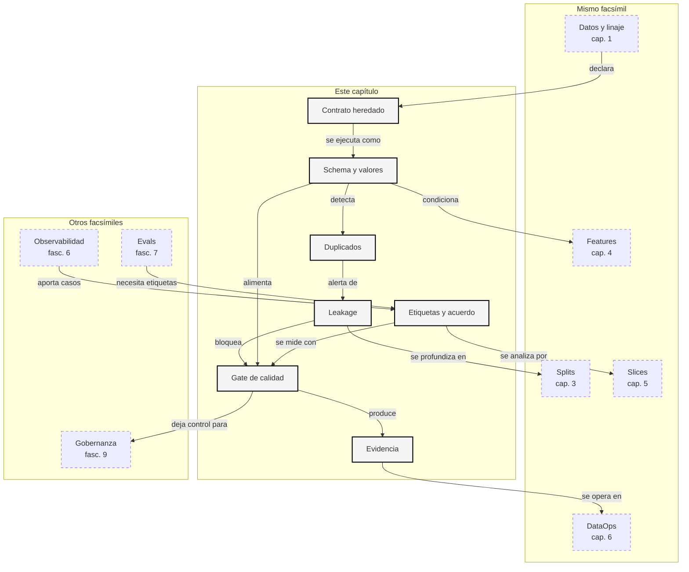

::: {.fasciculo-subtitle}
Facsímil 8 · La ciencia de los datos
:::

# Capítulo 02: Calidad de datos: schema, duplicados, leakage y etiquetas

## Qué deberías poder hacer al terminar

En el capítulo anterior construimos una idea base: un dataset serio no empieza en el modelo, empieza en el contrato. Ahora damos un paso más. Un contrato escrito no sirve de mucho si no se ejecuta. La calidad de datos aparece justo ahí: en convertir el contrato en comprobaciones que puedan aprobar, revisar o bloquear un dataset antes de que llegue al modelo, al RAG o a una evaluación.

Calidad no significa “datos bonitos”. Significa **datos suficientemente correctos para la decisión que queremos tomar**. Un dataset puede ser aceptable para un prototipo, insuficiente para una evaluación pública, útil para RAG interno y prohibido para entrenamiento. La calidad siempre se lee junto al uso.

Al terminar deberías poder hacer esto:

| Resultado de aprendizaje | Evidencia de que lo sabes hacer |
|---|---|
| Distinguir schema, expectation y contrato. | No confundes “la columna existe” con “el dato es válido”. |
| Detectar duplicados exactos y cercanos. | Sabes mirar claves repetidas, textos normalizados y similitud. |
| Explicar leakage con ejemplos de datos. | Puedes detectar cuándo test se contaminó con train o cuándo una feature mira el futuro. |
| Revisar etiquetas con criterio. | No borras ejemplos difíciles; los llevas a una cola de revisión. |
| Calcular acuerdo entre anotadores. | Entiendes \(p_o\), \(p_e\) y \(\kappa\). |
| Diseñar un gate de calidad. | Produces un reporte con `pass`, `review` o `block`. |
| Conectar calidad con evaluación. | Ves que una métrica puede caer por modelo o por dataset, y sabes separarlo. |

La idea central es esta:

> La calidad de datos no se inspecciona al final. Se prueba antes de decidir.

## La escena: el modelo parece peor, pero el dataset cambió

Imagina que tenemos una eval de soporte académico. Durante semanas el asistente funciona razonablemente bien. Un día, tras cambiar algunos datos, la métrica baja. El primer impulso es pensar que el modelo ha empeorado o que el prompt ya no sirve.

Pero al mirar el dataset aparecen señales menos espectaculares y más importantes: una etiqueta nueva llamada `resolve` se coló en un catálogo donde solo existían `answer`, `ask_more` y `escalate`; un caso de `train` aparece casi igual en `test`; un campo `source_id` está vacío; una fila de validación lleva licencia de entrenamiento; y dos anotadores no se ponen de acuerdo en varios ejemplos.

Nada de eso requiere cambiar el modelo. Requiere parar la cadena y preguntar: **¿este dataset puede sostener la decisión que estamos tomando?** Si no puede, la métrica deja de ser una medida limpia. Se convierte en una mezcla de comportamiento del modelo, fallos de contrato, errores de etiqueta y contaminación entre splits.

## Qué no es calidad de datos

Calidad de datos no es “no tener nulos”. Los nulos importan, pero son solo una parte pequeña. Un dataset puede no tener ningún valor vacío y aun así estar mal: etiquetas inconsistentes, licencia incompatible, duplicados entre splits, texto caducado, clases desbalanceadas o columnas con significado ambiguo.

Tampoco es “pasar un script de limpieza”. Limpiar sin contrato puede empeorar el problema. Si borras todos los casos difíciles porque ensucian la métrica, quizá destruyes justo los ejemplos que el sistema necesita aprender o evaluar. Si deduplicas sin mirar splits, puedes eliminar evidencia legítima o dejar contaminación.

Y no es una puntuación universal. La misma tabla puede estar bien para explorar, mal para entrenar y completamente inaceptable para evaluar. Por eso la pregunta correcta no es “¿tiene calidad?”, sino “¿tiene calidad suficiente para este uso, con este contrato y esta fecha de corte?”.

| Malentendido | Lectura de ingeniería |
|---|---|
| “Si no hay nulos, está limpio”. | Faltan catálogo, licencias, duplicados, leakage, etiquetas y linaje. |
| “Un duplicado siempre se borra”. | Primero hay que saber si es repetición real, evento legítimo o contaminación. |
| “La etiqueta registrada es verdad”. | La etiqueta es una decisión humana o automática que puede fallar. |
| “Si la métrica baja, el modelo empeoró”. | Puede haber cambiado el dataset, el split o la distribución. |
| “Calidad es cosa de datos, no de ingeniería”. | Un gate de calidad es parte del pipeline de software. |

## Qué sí es calidad de datos para IA

En este libro llamaremos calidad de datos al grado en que un dataset cumple las condiciones necesarias para una decisión de IA: entrenar, evaluar, indexar, recuperar, monitorizar o revisar.

Ejemplo de fórmula: una forma compacta de escribirlo es la siguiente. No es una ley académica cerrada; es una regla de lectura para recordar que la calidad depende del uso previsto.

$$
quality(D, u) =
schema(D)
\land values(D)
\land lineage(D)
\land license(D, u)
\land splits(D, u)
\land labels(D, u)
$$

| Símbolo | Significado | Ejemplo |
|---|---|---|
| \(D\) | Dataset que queremos usar. | Casos de soporte académico. |
| \(u\) | Uso previsto. | Evaluación interna, RAG o fine-tuning. |
| \(schema(D)\) | El dataset tiene la forma esperada. | Están `case_id`, `split`, `label`, `text`. |
| \(values(D)\) | Los valores respetan catálogos y tipos. | `label` no contiene `resolve` si no está permitido. |
| \(lineage(D)\) | Cada fila conserva origen y versión. | `source_id` no está vacío. |
| \(license(D,u)\) | El permiso encaja con el uso. | `support_eval_only` no se usa para entrenamiento. |
| \(splits(D,u)\) | Las particiones no contaminan la decisión. | `test` no repite casos de `train`. |
| \(labels(D,u)\) | Las etiquetas son coherentes con la política. | Dos anotadores no discrepan masivamente. |

Esta fórmula no pretende ser una verdad matemática absoluta. Es una forma de recordar que la calidad es una conjunción: si una pieza crítica falla, el dataset no debería avanzar como si nada.

## Fecha de corte del estado del arte

**Fecha de corte:** 6 de junio de 2026.  
**Fuentes consultadas:** TensorFlow Data Validation, Great Expectations, Pandera, Deequ, Cleanlab, Snorkel, scikit-learn y literatura clásica sobre acuerdo entre anotadores.

La idea estable es que la validación de datos debe ser declarativa, reproducible y cercana al pipeline. TensorFlow Data Validation perfila datasets, infiere schema y detecta anomalías contra expectativas.^[TensorFlow. (2026). *TensorFlow Data Validation*. https://www.tensorflow.org/tfx/data_validation/get_started/. Consultado el 6 de junio de 2026.] Su referencia de anomalías muestra que un sistema de validación no solo dice “hay error”, sino que clasifica problemas como tipo inválido, dominio inesperado, valor ausente o cambio de distribución.^[TensorFlow. (2026). *TensorFlow Data Validation Anomalies Reference*. https://www.tensorflow.org/tfx/data_validation/anomalies. Consultado el 6 de junio de 2026.]

Great Expectations organiza la calidad como expectations: afirmaciones verificables sobre columnas, rangos, nulos, formatos o relaciones entre datos.^[Great Expectations. (2026). *Expectations Overview*. https://docs.greatexpectations.io/docs/cloud/expectations/expectations_overview/. Consultado el 6 de junio de 2026.] Pandera lleva esa misma filosofía al mundo de DataFrames, con schemas programáticos para validar tipos y propiedades de columnas.^[Pandera. (2026). *Pandera Documentation*. https://pandera.readthedocs.io/en/stable/. Consultado el 6 de junio de 2026.] Deequ propone “unit tests for data” sobre Spark, una frase muy útil porque acerca la calidad de datos a una práctica que cualquier ingeniero de software reconoce.^[AWS Labs. (2026). *Deequ: Unit Tests for Data*. https://github.com/awslabs/deequ. Consultado el 6 de junio de 2026.]

Para etiquetas, confident learning propone estimar incertidumbre y errores de etiqueta en datasets, y Cleanlab lo popularizó como herramienta práctica.^[Northcutt, C. G., Jiang, L. y Chuang, I. L. (2021). Confident Learning: Estimating Uncertainty in Dataset Labels. *Journal of Artificial Intelligence Research*, 70, 1373-1411. https://doi.org/10.1613/jair.1.12125] El trabajo sobre errores de etiqueta en test sets mostró algo incómodo: incluso benchmarks muy usados pueden contener errores de etiqueta suficientes para desestabilizar conclusiones.^[Northcutt, C. G., Athalye, A. y Mueller, J. (2021). Pervasive Label Errors in Test Sets Destabilize Machine Learning Benchmarks. *NeurIPS Datasets and Benchmarks*. https://arxiv.org/abs/2103.14749]

Snorkel es importante porque enseña otra vía: crear datos de entrenamiento con supervisión débil mediante funciones de etiquetado, y después combinar señales ruidosas de forma sistemática.^[Ratner, A., Bach, S. H., Ehrenberg, H., Fries, J., Wu, S. y Ré, C. (2017). Snorkel: Rapid Training Data Creation with Weak Supervision. *PVLDB*, 11(3), 269-282. https://doi.org/10.14778/3157794.3157797] La lección para este capítulo no es “usa una herramienta concreta”. Es más básica: si una etiqueta puede fallar, la etiqueta también necesita ingeniería.

## Las tripas de la calidad: de schema a decisión

La calidad empieza con schema, pero no termina ahí. El schema responde a la forma: qué columnas existen, qué tipos tienen, qué valores son válidos. Después vienen reglas de contenido: nulos, catálogos, rangos, licencias, duplicados, distribución de clases, coherencia entre anotadores y leakage entre splits.

Una expectation sencilla puede escribirse como una función booleana:

$$
E_j(D) \in \{0,1\}
$$

| Símbolo | Significado | Ejemplo |
|---|---|---|
| \(E_j\) | Expectation o check número \(j\). | “`label` pertenece al catálogo permitido”. |
| \(D\) | Dataset evaluado. | `quality_cases_dirty.csv`. |
| \(0\) | La regla falla. | Aparece `resolve` aunque no está permitido. |
| \(1\) | La regla pasa. | Todas las etiquetas están en catálogo. |

Ejemplo de fórmula: un gate del kit agrupa expectations y les asigna severidad. En otro equipo podrían cambiar los nombres o los umbrales, pero la idea operativa es la misma: no todo fallo pesa igual.

$$
gate(D)=s,\quad s\in\{\mathrm{block},\mathrm{review},\mathrm{pass}\}
$$

La tabla concreta cuándo devuelve cada estado:

| Resultado | Qué significa | Qué haría un equipo |
|---|---|---|
| `block` | Hay fallos que impiden usar el dataset. | No entrenar, no evaluar, no indexar ese snapshot. |
| `review` | No hay bloqueo técnico, pero hay dudas que requieren criterio. | Abrir cola de revisión y documentar decisión. |
| `pass` | Cumple el contrato actual para el uso declarado. | Usarlo y guardar reporte/versionado. |

La parte importante es la palabra “actual”. Un `pass` no significa que el dataset sea perfecto para siempre. Significa que, bajo este contrato y este uso, no hemos encontrado fallos que impidan avanzar.

### Missing y valores fuera de catálogo

El missing se calcula como proporción de celdas vacías sobre las celdas obligatorias:

$$
miss(D) =
\frac{
\sum_{i=1}^{n}
\sum_{c \in C}
\mathbb{1}[x_{i,c}=\varnothing]
}{
n \cdot |C|
}
$$

| Símbolo | Significado | Ejemplo |
|---|---|---|
| \(n\) | Número de filas. | 19 casos. |
| \(C\) | Columnas obligatorias. | `case_id`, `source_id`, `label`, `text`, etc. |
| \(x_{i,c}\) | Valor de la columna \(c\) en la fila \(i\). | `source_id` de `q007`. |
| \(\mathbb{1}\) | Indicador: 1 si falta, 0 si no. | Vale 1 si `source_id` está vacío. |
| \(miss(D)\) | Tasa total de missing. | 0.003096 en el kit. |

Un missing bajo puede seguir siendo grave. Si falta una columna secundaria quizá es revisable; si falta `source_id`, perdemos linaje. Por eso la tasa agregada no basta: hay que mirar qué columna falta y para qué uso era necesaria.

Los valores fuera de catálogo son otra familia de errores. Si `label` solo permite `answer`, `ask_more` y `escalate`, una etiqueta `resolve` no es una variación inocente: rompe la semántica del dataset. Quizá representa una nueva clase legítima, pero entonces el contrato debe cambiar y la evaluación debe rehacerse.

### Duplicados exactos y duplicados cercanos

Un duplicado exacto puede detectarse normalizando texto:

$$
dup_{exact}(a,b) =
\mathbb{1}[norm(text_a)=norm(text_b)]
$$

| Símbolo | Significado | Ejemplo |
|---|---|---|
| \(a,b\) | Dos ejemplos comparados. | `q001` y `q017`. |
| \(norm\) | Normalización de texto. | Minúsculas, quitar signos, compactar espacios. |
| \(dup_{exact}\) | Indicador de duplicado textual exacto. | 1 si el texto normalizado coincide. |

Pero muchos duplicados no son idénticos. Cambian una palabra o añaden un adjetivo. Para enseñar la idea sin dependencias externas, el kit usa Jaccard sobre conjuntos de tokens:

$$
J(A,B)=
\frac{|A \cap B|}{|A \cup B|}
$$

| Símbolo | Significado | Ejemplo |
|---|---|---|
| \(A\) | Tokens del primer texto. | `consulta`, `documentacion`, `beca`. |
| \(B\) | Tokens del segundo texto. | `consulta`, `documentacion`, `beca`, `necesaria`. |
| \(|A \cap B|\) | Tokens comunes. | Palabras compartidas. |
| \(|A \cup B|\) | Tokens totales únicos. | Palabras distintas entre ambos textos. |
| \(J(A,B)\) | Similitud de Jaccard. | 0.833333 en un par del kit. |

Jaccard no entiende semántica profunda. No sabe que “matrícula” y “inscripción” pueden estar relacionadas. Pero es suficiente para enseñar una idea crítica: si un caso muy parecido aparece en train y test, la evaluación deja de ser limpia.

### Leakage entre splits

Leakage no es solo duplicado textual. Es cualquier información que permite al sistema obtener ventaja en evaluación porque ya vio directa o indirectamente la respuesta.

Una tasa básica puede escribirse así:

$$
leak(D_{train}, D_{test}) =
\frac{
|\{e \in D_{test}: sim(e,D_{train}) \ge \tau\}|
}{
|D_{test}|
}
$$

| Símbolo | Significado | Ejemplo |
|---|---|---|
| \(D_{train}\) | Split de entrenamiento. | 8 filas en el kit. |
| \(D_{test}\) | Split de prueba. | 7 filas en el kit. |
| \(e\) | Ejemplo de test. | `q017` o `q019`. |
| \(sim\) | Función de similitud. | Coincidencia exacta o Jaccard. |
| \(\tau\) | Umbral de similitud. | 0.82 para duplicado cercano. |

En el próximo capítulo entraremos más a fondo en splits y leakage. Aquí basta con una regla operativa: si algo de test está demasiado cerca de train, no uses ese test para decidir si el sistema generaliza.

### Distribución de etiquetas

Una etiqueta no es solo un texto. Es una decisión que influye en el aprendizaje o en la evaluación. Por eso conviene mirar proporciones:

$$
p(y=k)=
\frac{n_k}{n}
$$

| Símbolo | Significado | Ejemplo |
|---|---|---|
| \(y\) | Etiqueta. | `answer`, `ask_more`, `escalate`. |
| \(k\) | Clase concreta. | `ask_more`. |
| \(n_k\) | Número de ejemplos de esa clase. | 4 casos. |
| \(n\) | Número total de ejemplos. | 19 casos. |

Si casi todo es `answer`, el sistema puede aprender a contestar siempre. Si casi no hay `escalate`, puede parecer correcto hasta que aparece un caso crítico. En clasificación y evaluación, mirar la distribución por split es obligatorio.

Para comparar la distribución global con la de cada split podemos usar distancia total variation:

$$
D_{TV}(P,Q)=
\frac{1}{2}
\sum_i |P_i-Q_i|
$$

| Símbolo | Significado | Ejemplo |
|---|---|---|
| \(P_i\) | Proporción global de la clase \(i\). | Proporción global de `answer`. |
| \(Q_i\) | Proporción de la clase \(i\) en un split. | Proporción de `answer` en test. |
| \(D_{TV}\) | Distancia entre distribuciones. | 0.172932 para test en el kit. |

scikit-learn permite hacer splits estratificados con `train_test_split(..., stratify=y)` cuando esa estrategia encaja con el problema.^[scikit-learn. (2026). *train_test_split*. https://scikit-learn.org/stable/modules/generated/sklearn.model_selection.train_test_split.html. Consultado el 6 de junio de 2026.] Estratificar no arregla etiquetas malas, pero ayuda a que cada partición conserve una mezcla parecida de clases.

### Calidad de etiquetas y acuerdo entre anotadores

Las etiquetas son datos, no dogmas. En el kit aparecen tres señales de revisión: desacuerdo entre anotadores, diferencia con una referencia didáctica y baja confianza de un modelo auxiliar. En un proyecto real no siempre tendrás `expected_label`, pero sí puedes tener doble anotación, reglas de revisión, muestras auditadas o modelos que prioricen casos dudosos.

El acuerdo observado se calcula así:

$$
p_o =
\frac{
\sum_{i=1}^{n}
\mathbb{1}[a_i=b_i]
}{
n
}
$$

| Símbolo | Significado | Ejemplo |
|---|---|---|
| \(a_i\) | Etiqueta del anotador A para el ejemplo \(i\). | `answer`. |
| \(b_i\) | Etiqueta del anotador B para el ejemplo \(i\). | `ask_more`. |
| \(p_o\) | Proporción de acuerdo observado. | 0.789474 en el kit. |

Pero parte del acuerdo puede ocurrir por azar, especialmente si una clase domina. Kappa de Cohen corrige ese efecto:^[Cohen, J. (1960). A Coefficient of Agreement for Nominal Scales. *Educational and Psychological Measurement*, 20(1), 37-46. https://doi.org/10.1177/001316446002000104]

$$
\kappa =
\frac{p_o-p_e}{1-p_e}
$$

| Símbolo | Significado | Ejemplo |
|---|---|---|
| \(p_o\) | Acuerdo observado. | 0.789474. |
| \(p_e\) | Acuerdo esperado por azar según distribuciones marginales. | 0.518006. |
| \(\kappa\) | Acuerdo corregido por azar. | 0.563218. |

En el kit, \(\kappa\) queda por debajo del umbral `0.6`, así que no bloquea por sí solo, pero exige revisión. Esta distinción importa: una etiqueta dudosa no siempre se borra; se revisa con política.

## Anatomía de un gate de calidad

<figure id="f8-c02-quality-gate" class="book-figure book-figure-svg">
<svg viewBox="0 0 1760 1180" role="img" aria-labelledby="f8-c02-title f8-c02-desc" xmlns="http://www.w3.org/2000/svg">
  <title id="f8-c02-title">Gate de calidad de datos</title>
  <desc id="f8-c02-desc">Diagrama en blanco y negro que muestra schema, valores, duplicados, leakage, etiquetas, acuerdo, severidad y decision final.</desc>
  <defs>
    <marker id="f8c02-arrow" markerWidth="12" markerHeight="12" refX="10" refY="6" orient="auto">
      <path d="M1 1 L11 6 L1 11 Z" fill="#111111"/>
    </marker>
    <style>
      .bg{fill:#FFFFFF}
      .box{fill:#FFFFFF;stroke:#111111;stroke-width:2}
      .soft{fill:#F6F6F6;stroke:#111111;stroke-width:1.5}
      .dark{fill:#111111;stroke:#111111;stroke-width:2}
      .title{font-family:Inter,Arial,sans-serif;font-size:34px;font-weight:800;fill:#111111}
      .sub{font-family:Inter,Arial,sans-serif;font-size:17px;fill:#444444}
      .label{font-family:Inter,Arial,sans-serif;font-size:15px;font-weight:800;fill:#111111}
      .small{font-family:Inter,Arial,sans-serif;font-size:12px;fill:#333333}
      .tiny{font-family:Inter,Arial,sans-serif;font-size:10.5px;fill:#666666}
      .white{font-family:Inter,Arial,sans-serif;font-size:15px;font-weight:800;fill:#FFFFFF}
      .code{font-family:ui-monospace,SFMono-Regular,Menlo,Consolas,monospace;font-size:11px;fill:#111111}
      .line{stroke:#111111;stroke-width:2;fill:none;marker-end:url(#f8c02-arrow)}
      .dash{stroke:#666666;stroke-width:1.5;fill:none;stroke-dasharray:7 7;marker-end:url(#f8c02-arrow)}
      .thin{stroke:#BBBBBB;stroke-width:1;fill:none}
    </style>
  </defs>
  <rect class="bg" x="0" y="0" width="1760" height="1180"/>
  <text class="title" x="92" y="96">Gate de calidad: no limpia por intuición, decide con evidencia</text>
  <text class="sub" x="92" y="130">Cada check tiene severidad. Un fallo bloqueante detiene el dataset; un fallo revisable abre cola de trabajo.</text>

  <rect class="dark" x="90" y="198" width="250" height="54" rx="12"/>
  <text class="white" x="215" y="232" text-anchor="middle">Dataset + contrato</text>
  <rect class="box" x="90" y="282" width="250" height="210" rx="16"/>
  <text class="code" x="120" y="326">quality_cases_dirty.csv</text>
  <text class="code" x="120" y="354">quality_contract.json</text>
  <line class="thin" x1="120" y1="384" x2="310" y2="384"/>
  <text class="small" x="120" y="418">uso declarado</text>
  <text class="small" x="120" y="444">catálogos</text>
  <text class="small" x="120" y="470">umbrales</text>

  <rect class="soft" x="430" y="172" width="250" height="150" rx="16"/>
  <text class="label" x="555" y="210" text-anchor="middle">Schema</text>
  <text class="small" x="460" y="244">columnas obligatorias</text>
  <text class="small" x="460" y="270">tipos y campos vacíos</text>
  <text class="tiny" x="460" y="296">missing · extra columns</text>

  <rect class="soft" x="430" y="366" width="250" height="150" rx="16"/>
  <text class="label" x="555" y="404" text-anchor="middle">Valores</text>
  <text class="small" x="460" y="438">catálogos permitidos</text>
  <text class="small" x="460" y="464">licencia por split</text>
  <text class="tiny" x="460" y="490">label · product · pii</text>

  <rect class="soft" x="760" y="172" width="250" height="150" rx="16"/>
  <text class="label" x="885" y="210" text-anchor="middle">Duplicados</text>
  <text class="small" x="790" y="244">case_id repetido</text>
  <text class="small" x="790" y="270">texto exacto</text>
  <text class="tiny" x="790" y="296">normalización textual</text>

  <rect class="soft" x="760" y="366" width="250" height="150" rx="16"/>
  <text class="label" x="885" y="404" text-anchor="middle">Leakage</text>
  <text class="small" x="790" y="438">train cerca de test</text>
  <text class="small" x="790" y="464">Jaccard alto</text>
  <text class="tiny" x="790" y="490">eval contaminada</text>

  <rect class="soft" x="1090" y="172" width="250" height="150" rx="16"/>
  <text class="label" x="1215" y="210" text-anchor="middle">Etiquetas</text>
  <text class="small" x="1120" y="244">catálogo</text>
  <text class="small" x="1120" y="270">confianza baja</text>
  <text class="tiny" x="1120" y="296">cola de revisión</text>

  <rect class="soft" x="1090" y="366" width="250" height="150" rx="16"/>
  <text class="label" x="1215" y="404" text-anchor="middle">Acuerdo</text>
  <text class="small" x="1120" y="438">anotador A vs B</text>
  <text class="small" x="1120" y="464">kappa</text>
  <text class="tiny" x="1120" y="490">revisable</text>

  <path class="line" d="M340 386 C390 386 390 247 430 247"/>
  <path class="line" d="M340 386 C390 386 390 441 430 441"/>
  <path class="line" d="M680 247 L760 247"/>
  <path class="line" d="M680 441 L760 441"/>
  <path class="line" d="M1010 247 L1090 247"/>
  <path class="line" d="M1010 441 L1090 441"/>

  <rect class="dark" x="430" y="660" width="250" height="64" rx="14"/>
  <text class="white" x="555" y="700" text-anchor="middle">fallo bloqueante</text>
  <rect class="box" x="430" y="752" width="250" height="150" rx="16"/>
  <text class="small" x="460" y="792">schema roto</text>
  <text class="small" x="460" y="818">licencia incompatible</text>
  <text class="small" x="460" y="844">leakage entre splits</text>
  <text class="tiny" x="460" y="876">salida: block</text>

  <rect class="dark" x="760" y="660" width="250" height="64" rx="14"/>
  <text class="white" x="885" y="700" text-anchor="middle">fallo revisable</text>
  <rect class="box" x="760" y="752" width="250" height="150" rx="16"/>
  <text class="small" x="790" y="792">kappa bajo</text>
  <text class="small" x="790" y="818">etiqueta dudosa</text>
  <text class="small" x="790" y="844">distribución rara</text>
  <text class="tiny" x="790" y="876">salida: review</text>

  <rect class="dark" x="1090" y="660" width="250" height="64" rx="14"/>
  <text class="white" x="1215" y="700" text-anchor="middle">evidencia</text>
  <rect class="box" x="1090" y="752" width="250" height="150" rx="16"/>
  <text class="code" x="1120" y="792">quality_report.json</text>
  <text class="code" x="1120" y="818">label_queue.csv</text>
  <text class="code" x="1120" y="844">clean_actions.md</text>
  <text class="tiny" x="1120" y="876">reproducible</text>

  <path class="dash" d="M555 516 C555 590 555 600 555 660"/>
  <path class="dash" d="M885 516 C885 590 885 600 885 660"/>
  <path class="dash" d="M1215 516 C1215 590 1215 600 1215 660"/>
  <path class="line" d="M680 827 L760 827"/>
  <path class="line" d="M1010 827 L1090 827"/>

  <rect class="dark" x="462" y="1000" width="820" height="68" rx="14"/>
  <text class="white" x="872" y="1042" text-anchor="middle">Una métrica sin calidad de datos es una decisión con suelo blando.</text>
  <text class="tiny" x="1688" y="1122" text-anchor="end" fill="#888888" opacity="0.55">IA para gente curiosa / Facsímil 08 / Capítulo 02 / 686f6c61</text>
</svg>
<figcaption>Un gate de calidad separa fallos bloqueantes, revisiones necesarias y evidencia generada. No sustituye el criterio humano: lo organiza.</figcaption>
</figure>

## Severidad: cuándo bloquear, cuándo revisar y cuándo aceptar deuda

Un gate útil no trata todos los fallos igual. Si una etiqueta dudosa y una licencia incompatible aparecen en la misma lista sin severidad, el equipo pierde criterio. La severidad existe para responder a una pregunta muy concreta: **¿qué daño produce avanzar con este fallo?**

En ingeniería de IA conviene separar tres niveles. Un fallo bloqueante invalida el uso automático del dataset. Un fallo revisable no permite publicar una decisión todavía, pero sí permite abrir trabajo humano. Una deuda aceptada es un problema conocido que no afecta al uso actual o que tiene un plan explícito de corrección.

| Nivel | Pregunta de decisión | Ejemplo | Acción |
|---|---|---|---|
| `block` | ¿Puede invalidar entrenamiento, evaluación, permiso o seguridad del uso? | Leakage entre `train` y `test`; licencia incompatible; etiqueta fuera de catálogo. | Detener uso automatizado. |
| `review` | ¿Necesita criterio humano antes de confiar en la decisión? | Kappa bajo; baja confianza de etiqueta; distribución rara. | Abrir cola de revisión. |
| `accepted_debt` | ¿Se puede vivir con esto durante una ventana concreta? | Missing en un campo no usado por este modelo. | Documentar owner, fecha y plan. |

Esta tabla evita dos extremos. El primero es bloquearlo todo y convertir calidad en un cuello de botella imposible. El segundo es dejar pasar todo porque “ya lo arreglaremos”. La severidad obliga a escribir el riesgo y la acción. Si no puedes explicar por qué algo es `block` o `review`, quizá la regla todavía no está bien formulada.

La matriz también debe depender del uso. Un `source_id` vacío puede ser revisable para exploración local, pero bloqueante para evaluación trazable. Una etiqueta dudosa puede ser tolerable en entrenamiento con millones de ejemplos, pero bloqueante en un test pequeño que decide entre dos modelos. La severidad no vive aislada: vive con el contrato.

## SLI, SLO y presupuesto de error de datos

En operación ya vimos que un SLI es un indicador medible, un SLO es un objetivo y el presupuesto de error dice cuánto margen queda antes de actuar. Esa idea encaja muy bien con calidad de datos.

Un **SLI de datos** mide una propiedad concreta del dataset. Un **SLO de datos** fija el umbral aceptable. Un **presupuesto de error de datos** define qué ocurre cuando nos acercamos al límite o lo superamos. No es una frase de marketing: es una herramienta para que el equipo sepa cuándo parar.

| SLI de datos | Qué mide | SLO posible | Acción si falla |
|---|---|---|---|
| `critical_missing_rate` | Missing en columnas críticas. | `<= 0.5%` | Bloquear snapshot si afecta linaje o etiqueta. |
| `cross_split_duplicates` | Duplicados entre splits. | `0` | Bloquear evaluación. |
| `invalid_catalog_values` | Valores fuera de catálogo. | `0` | Bloquear hasta migrar contrato o datos. |
| `license_mismatches` | Uso incompatible con licencia. | `0` | Bloquear uso automatizado. |
| `annotator_kappa` | Acuerdo corregido por azar. | `>= 0.6` | Abrir revisión de política de anotación. |
| `label_review_queue_size` | Casos pendientes de revisar. | `<= 2` | No cerrar release si supera el umbral. |

En el kit, estos objetivos aparecen en:

```text
labs/f8/c02-data-quality/contracts/quality_slos.json
```

El presupuesto de error evita discusiones vagas. Por ejemplo: si el SLO exige cero duplicados entre train y test, un solo duplicado consume todo el presupuesto y bloquea. Si el SLO permite hasta dos casos en cola de revisión, un tercero no significa que el dataset sea inútil, pero sí que la release no debería cerrarse sin mirar esos casos.

## Ciclo de vida de una incidencia de datos

Detectar un fallo es el principio, no el final. Una incidencia de datos debería tener un ciclo de vida tan claro como una incidencia de software:

1. Detectar: el gate marca un check fallido.
2. Clasificar: se decide severidad, owner y uso afectado.
3. Diagnosticar: se busca causa raíz.
4. Corregir: se cambia dato, contrato, pipeline o política.
5. Reejecutar: se vuelve a correr el gate.
6. Versionar: se guarda snapshot, reporte y decisión.
7. Aprender: se añade un check para que no vuelva a pasar igual.

La causa raíz importa porque no todos los fallos se arreglan tocando el CSV. Si aparece una etiqueta `resolve`, puede ser un error de anotación, pero también una señal de que el dominio necesita una nueva clase. Si aparece `admisiones` en `product`, puede ser un campo mal escrito, o puede ser que el producto haya crecido y el contrato esté viejo. Si baja kappa, quizá los anotadores fallaron, pero quizá la política era ambigua.

| Síntoma | Causa raíz posible | Arreglo pobre | Arreglo de ingeniería |
|---|---|---|---|
| Etiqueta nueva | Catálogo real cambió. | Reemplazarla por la clase más parecida. | Versionar contrato y migrar evaluación. |
| Duplicado entre splits | Split creado después de deduplicar mal. | Borrar una fila sin registro. | Rehacer split desde snapshot limpio. |
| Kappa bajo | Política de anotación ambigua. | Pedir “más cuidado”. | Añadir casos frontera y regla de desempate. |
| Licencia incompatible | Export mezcló permisos. | Ignorar en prototipo. | Separar usos permitidos por split. |
| Missing en linaje | Pipeline perdió metadatos. | Rellenar a mano. | Corregir ingestión y reejecutar. |

Esta forma de pensar es muy de ingeniería: no arreglar solo el síntoma, sino el mecanismo que permitió que apareciera.

## Schema evolution: cuando el dataset cambia sin pedir permiso

Los datasets vivos cambian. Aparecen columnas, se renombran campos, se añaden etiquetas, se deprecan productos y cambian tipos. Ese cambio no es malo. Lo peligroso es que ocurra sin versión, sin migración y sin compatibilidad.

Schema evolution significa gestionar cambios de forma controlada. En un dataset de IA, no basta con que el código lea la nueva columna. Hay que saber si el significado cambió. Una columna `label` puede mantener el mismo nombre y cambiar por completo si el equipo añade una política nueva. Un valor `resolve` puede ser un error hoy y una clase legítima mañana.

| Cambio | Riesgo | Estrategia |
|---|---|---|
| Nueva columna opcional | Los consumidores antiguos la ignoran. | Añadirla como `optional` y documentar fecha. |
| Columna obligatoria nueva | Pipelines antiguos fallan. | Crear versión `v2` del contrato y periodo de convivencia. |
| Nuevo valor de catálogo | Métricas antiguas no comparan igual. | Versionar label set y rehacer splits/evals. |
| Cambio de tipo | Validación y transformación pueden romper. | Migración explícita con tests de datos. |
| Cambio de significado | El peor caso: parece compatible, pero no lo es. | Nota de contrato, ejemplos y revisión humana. |

Una regla útil: si un cambio altera una decisión, no es un detalle técnico. Es una nueva versión del contrato.

## Política de anotación: la etiqueta también necesita contrato

Una etiqueta como `answer` parece sencilla hasta que aparecen casos frontera. ¿Qué hacemos si falta un dato menor? ¿Y si el usuario mezcla beca y matrícula? ¿Y si el asistente podría responder, pero con riesgo de orientar mal? Sin política, cada anotador inventa su criterio.

El kit incluye una política mínima en:

```text
labs/f8/c02-data-quality/contracts/annotation_policy.md
```

Una política de anotación profesional debería incluir:

| Pieza | Por qué importa |
|---|---|
| Definición de cada etiqueta | Evita que dos personas usen palabras iguales con criterios distintos. |
| Ejemplos positivos | Muestran cuándo sí aplica la etiqueta. |
| Ejemplos negativos | Muestran cuándo no aplica aunque se parezca. |
| Casos frontera | Reducen desacuerdo donde el dominio es ambiguo. |
| Regla de desempate | Permite cerrar conflictos sin improvisar. |
| Versión de política | Hace trazable qué criterio produjo cada etiqueta. |

Esto conecta directamente con kappa. Si el acuerdo es bajo, no siempre significa que los anotadores sean malos. Puede significar que la política no explica los casos difíciles. En ese caso, el siguiente paso no es reetiquetar a ciegas: es mejorar la política y después revisar.

## Calidad por segmentos

Una media global puede esconder un problema local. El dataset puede tener buen missing global, pero fallar en `becas`; buen kappa global, pero mucho desacuerdo en `chat`; buen reparto de etiquetas, pero ningún caso crítico en `test`.

Por eso la calidad debería mirarse por segmentos:

| Segmento | Pregunta |
|---|---|
| `product` | ¿Todos los temas tienen cobertura y etiquetas coherentes? |
| `channel` | ¿Chat, email y portal tienen estilos comparables? |
| `split` | ¿Train, validation y test mantienen distribuciones razonables? |
| `pii_risk` | ¿Los casos sensibles tienen controles suficientes? |
| `language` | ¿La calidad se mantiene si hay varios idiomas? |
| `criticality` | ¿Los casos de alto impacto están representados y revisados? |

Esta idea preparará el capítulo de slices. La intuición es sencilla: un dataset no se rompe siempre “en general”. Muchas veces se rompe en un rincón. La ingeniería consiste en encontrar ese rincón antes de que lo encuentre producción.

## Leakage temporal

Hasta ahora hemos hablado de leakage entre splits. Hay otro tipo especialmente traicionero: leakage temporal. Ocurre cuando el dataset usa información que no existía en el momento en que el sistema habría tenido que decidir.

Ejemplos:

| Caso | Leakage temporal |
|---|---|
| Predicción de urgencia | Usar `days_to_resolution`, que solo se conoce después de cerrar el caso. |
| RAG académico | Evaluar con un documento actualizado después de la consulta original. |
| Feature de pagos | Usar un estado de pago corregido días después del evento. |
| Etiqueta de soporte | Etiquetar con información de resolución posterior y usarla como entrada. |

La regla de oro es: para cada feature o documento, pregunta “¿esto estaba disponible en ese momento?”. Si la respuesta es no, quizá sirve para análisis histórico, pero no para entrenar o evaluar una decisión que pretende simular producción.

## Esto en un proyecto real

En un equipo de IA, la calidad de datos debería estar cerca de CI. Igual que un cambio de código no debería desplegarse si rompe tests, un snapshot de datos no debería llegar a entrenamiento o evaluación si rompe checks críticos.

La práctica madura tiene cuatro capas:

| Capa | Pregunta | Artefacto |
|---|---|---|
| Contrato | ¿Qué prometen los datos? | JSON, YAML, ODCS, schema programático. |
| Validación | ¿Cumplen lo prometido? | Reporte de checks y anomalías. |
| Revisión | ¿Qué casos requieren criterio? | Cola de etiquetas, duplicados, incidencias. |
| Decisión | ¿Qué hacemos con el snapshot? | `pass`, `review`, `block` y plan de limpieza. |

La parte difícil no es escribir `if row["label"] not in allowed_labels`. Eso lo puede hacer cualquiera. La parte difícil es decidir qué fallos bloquean, cuáles abren revisión y cuáles se aceptan temporalmente con una nota. Ahí aparece la ingeniería: convertir incertidumbre en reglas operativas que un equipo pueda sostener.

En CI/CD, el patrón mínimo sería:

```bash
python3 ops/data_quality_gate.py --write
python3 ops/ci_assert_gate.py
```

Si `release_gate.json` contiene `block`, el segundo comando termina con error y el pipeline se detiene. Si el equipo permite releases en `review` para entornos manuales, podría ejecutarlo con:

```bash
python3 ops/ci_assert_gate.py --allow-review
```

La clave es que el pipeline no decide por intuición. Lee un artefacto. Ese artefacto queda guardado y puede revisarse después.

## Por qué debería importarte

Si no revisas calidad, puedes entrenar con etiquetas rotas, evaluar con leakage, elegir un modelo por una métrica falsa o indexar documentos que no debían usarse. Todo eso produce sistemas que parecen funcionar hasta que llegan a producción o hasta que alguien intenta explicar una decisión.

Además, la calidad de datos es una de las formas más baratas de mejorar IA. Cambiar de modelo puede costar dinero, latencia y complejidad. Corregir una etiqueta mal puesta, separar bien splits o bloquear una licencia incompatible puede mejorar la decisión sin tocar arquitectura.

La calidad no compite con el modelado. Lo hace posible.

## Manos a la obra

El kit del capítulo está en:

```text
labs/f8/c02-data-quality/
```

La práctica trabaja con un dataset deliberadamente problemático. Esto es intencional: si el gate devolviera `pass` a la primera, aprenderíamos menos. Aquí queremos ver cómo se organiza una revisión real.

### Estructura

```text
labs/f8/c02-data-quality/
  README.md
  data/quality_cases_dirty.csv
  contracts/quality_contract.json
  contracts/quality_slos.json
  contracts/annotation_policy.md
  ops/data_quality_gate.py
  ops/ci_assert_gate.py
  output/quality_report.json
  output/release_gate.json
  output/duplicate_candidates.csv
  output/label_review_queue.csv
  output/clean_actions.md
```

### Cómo lo ejecutas

```bash
cd labs/f8/c02-data-quality
python3 ops/data_quality_gate.py --write
python3 ops/ci_assert_gate.py
cat output/clean_actions.md
```

No necesita dependencias externas. La idea es que puedas abrir el script, seguir cada check y modificarlo para tu proyecto.

En este dataset, `ci_assert_gate.py` debe fallar porque el gate es `block`. Eso no es un error del kit: es el comportamiento esperado. Si un pipeline siguiera adelante con este snapshot, estaría ignorando su propio contrato.

### Qué detecta

El gate busca problemas de distinta naturaleza:

| Familia | Ejemplo en el kit | Severidad |
|---|---|---|
| ID duplicado | `q004` aparece dos veces. | `block` |
| Valor fuera de catálogo | Producto `admisiones`. | `block` |
| Etiqueta inválida | `resolve`. | `block` |
| PII fuera de contrato | `high`. | `block` |
| Licencia incompatible | Fila de `validation` con licencia de entrenamiento. | `block` |
| Duplicado exacto entre splits | `q001` y `q017`. | `block` |
| Duplicado cercano entre splits | `q007` y `q019` con Jaccard 0.833333. | `block` |
| Etiqueta dudosa | `q006`, `q008`, `q011`, `q015`. | `review` |
| Acuerdo bajo | \(\kappa=0.563218\). | `review` |

La lectura correcta no es “el dataset es un desastre”. La lectura correcta es: el gate ha convertido una intuición difusa en una lista priorizada. Primero se corrigen bloqueos. Después se revisan etiquetas. Luego se reejecuta.

Además, ahora el kit trae dos contratos complementarios. `quality_slos.json` traduce salud del dataset a SLI/SLO y presupuesto de error. `annotation_policy.md` explica cómo deberían decidirse `answer`, `ask_more` y `escalate`. Si la cola de revisión crece, no basta con corregir filas: hay que mirar si la política está incompleta.

### Salida esperada

El `release_gate.json` debería resumir algo así:

```json
{
  "gate": "block",
  "blocking_failures": [
    "case_id_unique",
    "product_values",
    "label_values",
    "pii_risk_values",
    "license_compatibility",
    "exact_cross_split_duplicates",
    "near_cross_split_duplicates"
  ],
  "review_failures": [
    "label_review_queue",
    "annotator_agreement"
  ]
}
```

Y `clean_actions.md` debería empezar con una decisión clara: no usar este snapshot de forma automatizada hasta corregir fallos de contrato, leakage y etiquetas.

### Cómo lo adaptas a tu caso

| Si tu dataset es... | Añade checks |
|---|---|
| RAG documental | Documento vigente, `chunk_id` único, fuente recuperable, permiso de indexación. |
| Fine-tuning | Licencia de entrenamiento, formato de mensajes, revisión de salidas esperadas. |
| Evaluación | Separación estricta de splits, casos críticos, rúbrica, acuerdo de anotadores. |
| Agentes | Herramienta permitida, estado inicial, acción final, coste máximo, criterio de parada. |
| Features | `event_time`, frescura, rango, consistencia offline/online, leakage temporal. |

El patrón es siempre el mismo: escribe el contrato, codifica checks, decide severidades, genera evidencia y reejecuta tras cada cambio.

Si quieres llevarlo a un repositorio real, añade el comando del gate a CI y guarda `output/` como artefacto de ejecución. Así una persona revisora no solo ve que el pipeline falló; ve por qué falló y qué casos debe revisar.

### Qué entregaría un alumno

1. `quality_report.json` generado.
2. `release_gate.json` con decisión.
3. `duplicate_candidates.csv` revisado.
4. `label_review_queue.csv` con acciones propuestas.
5. `clean_actions.md` ampliado con decisiones justificadas.
6. Una modificación al contrato para un caso propio.
7. Una propuesta de SLI/SLO de datos.
8. Una versión de política de anotación con casos frontera.
9. Una explicación corta de por qué un fallo es `block` y otro es `review`.

## Cómo encaja todo

El capítulo anterior nos dio contrato y linaje. Este capítulo ejecuta ese contrato. El siguiente capítulo se centrará en splits y leakage con más profundidad. Más adelante veremos features, slices, drift y análisis aplicado. La calidad de datos es el puente entre “tengo datos” y “puedo tomar una decisión con ellos”.



## Vocabulario aprendido

| Término | Definición breve |
|---|---|
| Calidad de datos | Grado en que un dataset cumple el contrato necesario para una decisión concreta. |
| Schema | Forma esperada de los datos: columnas, tipos, catálogos y reglas. |
| Expectation | Regla verificable sobre el dataset. |
| Gate | Decisión automatizada de `pass`, `review` o `block`. |
| Duplicado exacto | Registro que repite clave o texto normalizado. |
| Duplicado cercano | Registro muy parecido según una medida de similitud. |
| Jaccard | Similitud entre conjuntos basada en intersección y unión. |
| Leakage | Información que contamina entrenamiento, evaluación o tiempo de decisión. |
| Etiqueta | Clase o salida esperada asociada a un ejemplo. |
| Ruido de etiqueta | Sospecha de que la etiqueta registrada no sigue la política. |
| Kappa | Acuerdo entre dos anotadores corregido por azar. |
| Cola de revisión | Lista priorizada de casos que necesitan criterio humano. |
| SLI de datos | Indicador medible de salud del dataset. |
| SLO de datos | Objetivo mínimo aceptable para un indicador de datos. |
| Presupuesto de error de datos | Margen de fallos tolerables antes de bloquear o revisar. |
| Schema evolution | Gestión versionada de cambios en columnas, tipos y catálogos. |
| Leakage temporal | Uso de información que no existía en el momento de decisión. |

## Dónde solía tropezar yo

| Tropiezo | Por qué ocurre | Antídoto |
|---|---|---|
| Mirar solo nulos | Es el check más fácil de programar. | Separar schema, catálogo, licencias, duplicados, leakage y etiquetas. |
| Borrar duplicados sin mirar splits | Parece una limpieza obvia. | Revisar si el duplicado contamina evaluación o representa un evento legítimo. |
| Tratar una etiqueta como verdad | La columna `label` da falsa seguridad. | Medir acuerdo, revisar baja confianza y documentar política de anotación. |
| Mezclar fallos bloqueantes y revisables | Todo se mete en una lista única. | Asignar severidad: `block` para lo que invalida uso, `review` para lo que pide criterio. |
| Celebrar un `pass` sin contexto | Suena a certificado universal. | Leerlo siempre junto a contrato, uso, fecha y versión del dataset. |
| Cambiar schema sin versión | El código sigue funcionando y parece compatible. | Versionar contrato si cambia una decisión o significado. |
| Mirar calidad solo global | Las medias esconden problemas locales. | Revisar por producto, canal, split, sensibilidad e idioma. |

## Antes de pasar página

Antes de avanzar, deberías poder responder:

1. ¿Por qué calidad de datos no significa solo “sin nulos”?
2. ¿Qué diferencia hay entre schema y expectation?
3. ¿Por qué un valor fuera de catálogo puede bloquear un dataset?
4. ¿Qué diferencia hay entre duplicado exacto y duplicado cercano?
5. ¿Cómo se calcula Jaccard y qué limitación tiene?
6. ¿Por qué un duplicado entre train y test puede contaminar una evaluación?
7. ¿Qué significa que una etiqueta vaya a cola de revisión?
8. ¿Por qué kappa corrige el acuerdo observado?
9. ¿Qué diferencia hay entre `block`, `review` y `pass`?
10. ¿Qué archivo del kit usarías para justificar una decisión ante otra persona?
11. ¿Qué SLI y SLO definirías para duplicados entre splits?
12. ¿Cuándo un cambio de schema exige nueva versión del contrato?
13. ¿Qué problema resuelve una política de anotación?
14. ¿Qué es leakage temporal y por qué no lo detecta siempre un deduplicador?
15. ¿Cómo conectarías el gate de datos a CI/CD?

## En resumen

| Idea | Qué te llevas |
|---|---|
| Calidad es calidad para un uso. | No existe un dataset bueno en abstracto. |
| El schema es el principio. | La forma importa, pero no basta. |
| Los duplicados pueden contaminar. | Especialmente si cruzan splits. |
| Leakage rompe la evaluación. | El test deja de medir generalización. |
| Las etiquetas son datos revisables. | Necesitan política, acuerdo y cola de revisión. |
| Un gate organiza la decisión. | `block`, `review` y `pass` separan tipos de acción. |
| La práctica debe dejar evidencia. | Reporte, cola, duplicados y plan de limpieza. |
| Los SLOs hacen operativa la calidad. | Un indicador sin objetivo no guía una decisión. |
| El schema evoluciona. | Los cambios de significado necesitan versión y migración. |
| La calidad se mira por segmentos. | El fallo puede vivir en un producto, canal o split concreto. |
| CI/CD también sirve para datos. | El pipeline puede bloquear snapshots con evidencia reproducible. |

## Para saber más

AWS Labs. (2026). Deequ: Unit Tests for Data. https://github.com/awslabs/deequ

Cohen, J. (1960). A Coefficient of Agreement for Nominal Scales. *Educational and Psychological Measurement*, 20(1), 37-46. https://doi.org/10.1177/001316446002000104

Great Expectations. (2026). Expectations Overview. https://docs.greatexpectations.io/docs/cloud/expectations/expectations_overview/

Northcutt, C. G., Athalye, A. y Mueller, J. (2021). Pervasive Label Errors in Test Sets Destabilize Machine Learning Benchmarks. *NeurIPS Datasets and Benchmarks*. https://arxiv.org/abs/2103.14749

Northcutt, C. G., Jiang, L. y Chuang, I. L. (2021). Confident Learning: Estimating Uncertainty in Dataset Labels. *Journal of Artificial Intelligence Research*, 70, 1373-1411. https://doi.org/10.1613/jair.1.12125

Pandera. (2026). Pandera Documentation. https://pandera.readthedocs.io/en/stable/

Ratner, A., Bach, S. H., Ehrenberg, H., Fries, J., Wu, S. y Ré, C. (2017). Snorkel: Rapid Training Data Creation with Weak Supervision. *PVLDB*, 11(3), 269-282. https://doi.org/10.14778/3157794.3157797

scikit-learn. (2026). train_test_split. https://scikit-learn.org/stable/modules/generated/sklearn.model_selection.train_test_split.html

TensorFlow. (2026). TensorFlow Data Validation. https://www.tensorflow.org/tfx/data_validation/get_started/

TensorFlow. (2026). TensorFlow Data Validation Anomalies Reference. https://www.tensorflow.org/tfx/data_validation/anomalies
