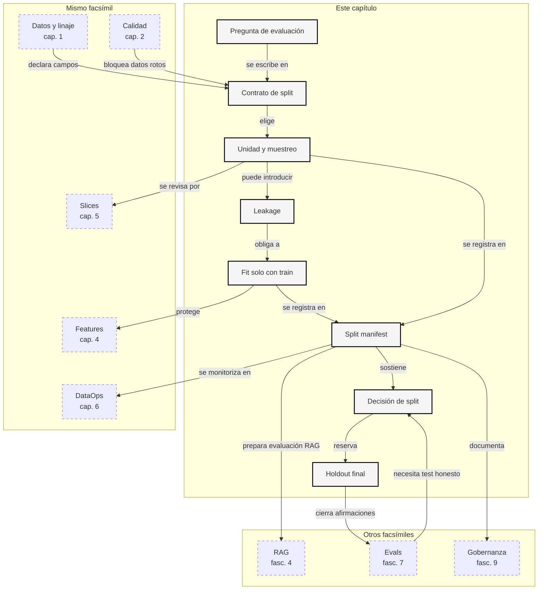

::: {.fasciculo-subtitle}
Facsímil 8 · La ciencia de los datos
:::

# Capítulo 03: Splits, muestreo y leakage: medir sin engañarse

## Qué deberías poder hacer al terminar

El capítulo anterior nos enseñó a bloquear un dataset con fallos de calidad. Pero un dataset puede pasar schema, licencias, etiquetas y duplicados básicos, y aun así medir mal. La razón suele estar en cómo lo partimos.

Un split no es un porcentaje. Es una promesa de evaluación. Cuando decimos `train`, `validation` y `test`, no estamos repartiendo filas al azar como quien reparte cartas. Estamos diciendo qué puede ver el sistema, qué usamos para ajustar decisiones y qué reservamos para comprobar si generaliza.

Al terminar deberías poder hacer esto:

| Resultado de aprendizaje | Evidencia de que lo sabes hacer |
|---|---|
| Explicar para qué sirve cada split. | No usas test para elegir prompt, modelo o umbral. |
| Elegir estrategia de muestreo según la pregunta. | No haces random split si hay tiempo, grupos o fuentes repetidas. |
| Detectar leakage por entidad, fuente, texto y tiempo. | Sabes buscar estudiantes, documentos o textos que cruzan splits. |
| Medir distribución de etiquetas por split. | No celebras un split si test pierde clases críticas. |
| Comparar estrategias de partición. | Puedes justificar random, estratificado, por grupo, temporal o híbrido. |
| Construir un manifiesto de split. | Dejas asignaciones y hallazgos versionados. |

La frase central del capítulo:

> Un split mide una pregunta. Si partes mal, la respuesta parece científica y no lo es.

## La escena: una métrica que sube demasiado

Imagina que evaluamos un asistente académico. Hacemos un `train/test split` aleatorio y obtenemos una métrica preciosa. El sistema responde muy bien sobre matrículas, becas y pagos. Todo parece listo para enseñar.

Luego alguien mira los casos. Un estudiante aparece en train y test. Un documento fuente está repetido en ambos. Una consulta de test es casi igual a una de train. Además, algunos ejemplos de train tienen fecha posterior a ejemplos de test. La métrica no está midiendo generalización: está midiendo familiaridad.

Este es uno de los errores más caros porque no rompe el código. Al contrario: el código funciona, el reporte se ve profesional y la gráfica sube. Justo por eso hay que tratar los splits como ingeniería, no como una llamada rápida a una función.

## Qué no es un split

Un split no es “60/20/20 y ya”. Esos números dicen cuántas filas hay, no si la partición responde bien a la pregunta. Si hay varios tickets de la misma persona, un random split puede poner unos en train y otros en test. Si hay documentos con versiones parecidas, puede partir la misma evidencia en dos. Si hay tiempo, puede entrenar con eventos posteriores y evaluar con eventos anteriores.

Tampoco es una garantía automática de independencia. Dos filas distintas pueden compartir entidad, fuente, plantilla, texto, anotador o evento. Para un modelo o un retriever, esa cercanía puede ser suficiente para inflar resultados.

Y test no es un lugar donde mirar muchas veces. Si usamos test para decidir prompts, elegir modelo, ajustar umbrales, cambiar chunking o seleccionar features, test deja de ser una medida final. Se convierte en otra validación, aunque sigamos llamándolo test.

## Qué sí es un split de evaluación

Un split es una partición diseñada para responder a una pregunta de generalización:

$$
D =
D_{train}
\cup D_{val}
\cup D_{test}
$$

con:

$$
D_{train}
\cap D_{val}
\cap D_{test}
= \varnothing
$$

| Símbolo | Significado | Ejemplo |
|---|---|---|
| \(D\) | Dataset completo. | 24 casos de soporte. |
| \(D_{train}\) | Datos que el sistema puede usar para aprender. | Casos anteriores usados para ajustar. |
| \(D_{val}\) | Datos para elegir decisiones durante desarrollo. | Elegir prompt, umbral o estrategia. |
| \(D_{test}\) | Datos reservados para medir al final. | Casos no usados para ajustar nada. |
| \(\varnothing\) | Intersección vacía. | Ninguna fila debería estar en dos splits. |

La intersección vacía de filas es necesaria, pero no suficiente. También necesitamos evitar solapamiento de entidades, fuentes o información temporal cuando esas dimensiones afecten a la pregunta.

## Fecha de corte del estado del arte

**Fecha de corte:** 6 de junio de 2026.  
**Fuentes consultadas:** documentación oficial de scikit-learn sobre `train_test_split`, `GroupKFold`, `StratifiedGroupKFold` y `TimeSeriesSplit`; literatura sobre leakage en data mining y reproducibilidad de evaluación con machine learning; y el paper original de Retrieval-Augmented Generation para situar por qué, en RAG, documentos y consultas también forman parte de la evaluación.

`train_test_split` permite partir arrays o matrices en subconjuntos aleatorios de entrenamiento y test, con opciones como `test_size`, `train_size`, `random_state`, `shuffle` y `stratify`.^[scikit-learn. (2026). *train_test_split*. [Documentación oficial](https://scikit-learn.org/stable/modules/generated/sklearn.model_selection.train_test_split.html). Consultado el 6 de junio de 2026.] Esa función es útil, pero no decide por nosotros si un random split es correcto.

`GroupKFold` mantiene grupos no solapados entre folds, y `StratifiedGroupKFold` intenta preservar proporciones de clases sin partir grupos.^[scikit-learn. (2026). *GroupKFold*. [Documentación oficial](https://scikit-learn.org/stable/modules/generated/sklearn.model_selection.GroupKFold.html). Consultado el 6 de junio de 2026.]^[scikit-learn. (2026). *StratifiedGroupKFold*. [Documentación oficial](https://scikit-learn.org/stable/modules/generated/sklearn.model_selection.StratifiedGroupKFold.html). Consultado el 6 de junio de 2026.] `TimeSeriesSplit` trabaja con particiones ordenadas en el tiempo, donde cada train es anterior al test correspondiente.^[scikit-learn. (2026). *TimeSeriesSplit*. [Documentación oficial](https://scikit-learn.org/stable/modules/generated/sklearn.model_selection.TimeSeriesSplit.html). Consultado el 6 de junio de 2026.]

Kaufman, Rosset, Perlich y Stitelman definieron leakage como la introducción de información sobre el objetivo que no debería estar disponible legítimamente para el modelo, y lo trataron como un error recurrente en proyectos reales y competiciones.^[Kaufman, S., Rosset, S., Perlich, C. y Stitelman, O. (2012). Leakage in Data Mining: Formulation, Detection, and Avoidance. *ACM Transactions on Knowledge Discovery from Data*, 6(4), 1-21. [DOI](https://doi.org/10.1145/2382577.2382579).] Kapoor y Narayanan revisaron leakage como una fuente importante de problemas de reproducibilidad en ciencia basada en machine learning.^[Kapoor, S. y Narayanan, A. (2023). Leakage and the Reproducibility Crisis in Machine-Learning-Based Science. *Patterns*, 4(9), 100804. [DOI](https://doi.org/10.1016/j.patter.2023.100804).]

Lewis y colaboradores formalizaron RAG como una combinación de modelo paramétrico y memoria no paramétrica recuperada desde documentos.^[Lewis, P. et al. (2020). Retrieval-Augmented Generation for Knowledge-Intensive NLP Tasks. *NeurIPS 2020*. [Paper](https://papers.nips.cc/paper/2020/hash/6b493230205f780e1bc26945df7481e5-Abstract.html).] Esa idea cambia la conversación sobre splits: no basta con partir preguntas, también hay que controlar documentos, versiones, chunks e índices de recuperación.

La lección estable es esta: las funciones de partición ayudan, pero la garantía viene de entender la estructura del dato.

## Estrategias de muestreo

Antes de elegir una estrategia, debemos escribir la pregunta de evaluación. ¿Queremos saber si el sistema generaliza a nuevos casos de las mismas personas? ¿A nuevas personas? ¿A documentos futuros? ¿A otro periodo? ¿A clases raras? Cada pregunta pide un split distinto.

| Estrategia | Qué preserva | Qué puede romper |
|---|---|---|
| Random por fila | Proporciones aproximadas si hay suficientes datos. | Grupos, fuentes, tiempo y textos cercanos. |
| Estratificado por etiqueta | Distribución de clases. | Entidades repetidas o tiempo. |
| Por grupo | Entidades no solapadas. | Distribución de etiquetas o cronología. |
| Temporal | Simulación de futuro. | Grupos repetidos o clases raras. |
| Temporal por grupo | Tiempo y entidad a la vez. | Puede dejar alguna distribución en revisión. |

No hay estrategia universal. Si todos los casos de una misma persona se parecen, necesitas grupo. Si el producto cambia con el tiempo, necesitas tiempo. Si hay clases muy raras, necesitas mirar cobertura por etiqueta. Si hay documentos comunes, quizá necesitas agrupar por fuente.

## Las fórmulas que sí conviene saber

Para medir si los splits conservan etiquetas, podemos comparar proporciones:

$$
p_s(y=k)=
\frac{n_{s,k}}{n_s}
$$

| Símbolo | Significado | Ejemplo |
|---|---|---|
| \(s\) | Split. | `train`, `validation`, `test`. |
| \(k\) | Etiqueta concreta. | `escalate`. |
| \(n_{s,k}\) | Ejemplos de la etiqueta \(k\) en el split \(s\). | Casos `escalate` en test. |
| \(n_s\) | Total de ejemplos del split \(s\). | 5 casos de test. |

Para comparar la distribución de un split con la global usamos distancia total variation:

$$
D_{TV}(P,Q)=
\frac{1}{2}
\sum_i |P_i-Q_i|
$$

| Símbolo | Significado |
|---|---|
| \(P_i\) | Proporción global de la clase \(i\). |
| \(Q_i\) | Proporción de la clase \(i\) en el split. |
| \(D_{TV}\) | Distancia entre ambas distribuciones. |

Para textos cercanos usamos Jaccard, igual que en el capítulo anterior:

$$
J(A,B)=
\frac{|A \cap B|}{|A \cup B|}
$$

| Símbolo | Significado |
|---|---|
| \(A\) | Tokens del primer texto. |
| \(B\) | Tokens del segundo texto. |
| \(|A \cap B|\) | Tokens compartidos. |
| \(|A \cup B|\) | Tokens únicos totales. |

Y para leakage temporal podemos mirar si train contiene filas posteriores al primer test:

$$
future\_train =
\{e \in D_{train}: t(e) > \min(t(D_{test}))\}
$$

| Símbolo | Significado |
|---|---|
| \(e\) | Ejemplo individual. |
| \(t(e)\) | Fecha del ejemplo. |
| \(D_{train}\) | Split de entrenamiento. |
| \(D_{test}\) | Split de prueba. |

Si ese conjunto no está vacío en una evaluación temporal, tenemos una señal clara de que la partición no simula futuro.

## Tipos de leakage que debe mirar un ingeniero

Leakage no siempre se ve como una fila duplicada. Muchas veces aparece como una relación escondida.

| Tipo | Cómo aparece | Qué check ayuda |
|---|---|---|
| Por fila | Mismo `case_id` o mismo texto. | Duplicado exacto. |
| Por entidad | Misma persona, cliente, documento o dispositivo en train y test. | Group split. |
| Por fuente | Mismo `source_id` o versión documental. | Agrupar por fuente. |
| Por texto cercano | Preguntas casi iguales en splits distintos. | Jaccard, embeddings o revisión. |
| Temporal | Train ve eventos posteriores a test. | Split temporal. |
| De preprocesamiento | Escalado, imputación o selección de features hecha con todo el dataset. | Fit solo con train. |
| De decisión | Test se usa para elegir prompt, modelo o umbral. | Separar validation y test real. |

El leakage de preprocesamiento merece una frase aparte. Si calculas la media de una columna con todo el dataset y luego escalas train y test, test ya influyó en train. La solución es sencilla conceptualmente: `fit` de transformaciones solo en train; `transform` en validation y test.

## El split como contrato de evaluación

En ingeniería conviene dejar de hablar del split como una operación suelta y empezar a tratarlo como un contrato. Un contrato de split responde a preguntas que deberían quedar por escrito:

| Pregunta | Respuesta que debe quedar versionada |
|---|---|
| ¿Qué decisión medimos? | Clasificador, RAG, prompt, modelo, retriever, umbral o pipeline completo. |
| ¿Qué estrategia se eligió? | Random, estratificada, por grupo, temporal, temporal por grupo o una combinación propia. |
| ¿Qué claves protegen la independencia? | `case_id`, `student_id`, `source_id`, `created_at`, `label`, `text`. |
| ¿Qué puede hacerse con cada split? | Train entrena, validation decide, test mide, holdout confirma. |
| ¿Qué está prohibido después de mirar test? | Elegir modelo, reescribir prompt, ajustar umbral, cambiar chunking o modificar el retriever. |
| ¿Qué hashes demuestran reproducibilidad? | Hash del dataset, hash de la política y asignaciones por split. |

El artefacto que recoge todo eso es el manifiesto de split. En el kit se genera como `output/split_manifest.json`. Un manifiesto mínimo debería contener:

```json
{
  "policy_id": "support-split-policy-v1",
  "dataset": {
    "sha256": "..."
  },
  "split_contract": {
    "selected_strategy": "time_group_holdout",
    "gate": "review",
    "keys": {
      "group": "student_id",
      "source": "source_id",
      "time": "created_at"
    }
  }
}
```

El hash no es decoración. Si cambias una fila, una etiqueta o una fecha, el hash del dataset cambia. Si cambias una regla de la política, el hash de la política cambia. Eso permite reconstruir qué se midió, con qué reglas y por qué la métrica era defendible en ese momento.

En un equipo real, el manifiesto evita discusiones imposibles semanas después. Si alguien pregunta “¿por qué aquella métrica bajó al repetir el experimento?”, no deberíamos responder mirando una gráfica suelta. Deberíamos poder abrir el manifiesto, comprobar el hash del dataset, ver qué política estaba activa, saber qué estrategia asignó cada `case_id` y revisar si test se usó solo para medir o también para decidir. Esa diferencia parece administrativa, pero es ingeniería: sin trazabilidad, una métrica deja de ser una medida y se convierte en una anécdota difícil de reproducir.

El manifiesto también ayuda a integrar evaluación en CI/CD. Puedes bloquear una ejecución si cambia el hash del dataset sin regenerar el split, si falta una predicción para un caso de test, si validation o test se usan para hacer `fit` de un transformador, o si una política nueva modifica los umbrales sin actualizar la decisión. En proyectos de IA, muchas regresiones no vienen de una línea de modelo, sino de una línea de datos que cambió sin que nadie la registrara.

Ejemplo de fórmula: para este facsímil podemos pensar el manifiesto de split así. No es una especificación estándar; es una forma compacta de recordar qué debe quedar versionado para que la evaluación sea reproducible.

$$
M = (h_D, h_P, S, A, G)
$$

| Símbolo | Significado |
|---|---|
| \(M\) | Manifiesto de split. |
| \(h_D\) | Hash del dataset. |
| \(h_P\) | Hash de la política de split. |
| \(S\) | Estrategia elegida. |
| \(A\) | Asignación de IDs a train, validation y test. |
| \(G\) | Resultado del gate: `pass`, `review` o `block`. |

La métrica sin manifiesto es débil. Puede estar bien, pero no sabemos repetirla ni auditarla.

## Leakage de preprocesamiento

Una fuga clásica no aparece en el split, sino en el pipeline. Suele pasar cuando hacemos esto:

1. Cargar todo el dataset.
2. Normalizar, imputar, seleccionar variables o crear vocabulario.
3. Partir en train, validation y test.
4. Entrenar y medir.

El problema está en el paso 2. Si una transformación aprende algo del dataset completo, validation y test ya han participado en el entrenamiento, aunque el modelo principal no los haya visto.

La versión correcta es:

$$
\theta_T = fit(T, D_{train})
$$

$$
X'_s = transform(T_{\theta_T}, X_s), \quad s \in \{train, val, test\}
$$

| Símbolo | Significado |
|---|---|
| \(T\) | Transformación: escalado, imputación, PCA, vectorizador, calibrador. |
| \(\theta_T\) | Parámetros aprendidos por la transformación. |
| \(D_{train}\) | Datos usados para aprender esos parámetros. |
| \(X_s\) | Features originales del split \(s\). |
| \(X'_s\) | Features transformadas del split \(s\). |

La regla práctica:

| Transformación | Qué aprende | Dónde se hace `fit` | Qué se aplica a validation/test |
|---|---|---|---|
| Normalización | Media, desviación, mínimos o máximos. | Solo train. | `transform` con parámetros de train. |
| Imputación | Media, moda, percentil o modelo auxiliar. | Solo train. | Relleno con reglas aprendidas en train. |
| Selección de features | Variables que parecen predictivas. | Solo train, o dentro de cada fold. | Mismas features elegidas. |
| PCA | Componentes y proyección. | Solo train. | Misma proyección. |
| TF-IDF | Vocabulario e IDF. | Solo train. | Misma matriz de vocabulario. |
| Oversampling | Ejemplos sintéticos o pesos. | Solo train. | Nunca se sintetiza test. |

La frase que debería quedar pegada a la pantalla: primero partes, luego aprendes transformaciones.

En el kit, esta idea se convierte en un script ejecutable: `ops/preprocessing_fit_audit.py`. El script no entrena un modelo grande; hace algo más pequeño y muy útil para aprender: compara el vocabulario que obtendrías si ajustas un vectorizador con solo train frente al vocabulario que obtendrías usando todo el dataset. Si el vocabulario global aprende palabras que solo aparecen en validation o test, acabas de demostrar una fuga de preprocesamiento con un ejemplo que cabe en una terminal.

Por ejemplo, con el split recomendado del kit, el vectorizador ajustado solo con train no conoce algunos términos que aparecen en test, como `convocatoria`, `abonado`, `confirmacion` o `bloqueada`. Eso es normal: test representa futuro o datos reservados. Si ajustas el vectorizador con todo el dataset antes de partir, esas palabras entran en el vocabulario desde el principio. El modelo todavía no ha visto la etiqueta de test, pero su representación ya fue preparada con información del test. En texto, ese detalle es importante porque vocabulario, IDF, normalizadores y reglas de tokenización forman parte de lo que el sistema aprende.

Puedes ejecutarlo así:

```bash
cd labs/f8/c03-splits-leakage
python3 ops/split_audit.py --write
python3 ops/preprocessing_fit_audit.py --write
cat output/preprocessing_fit_decision.md
```

La salida no pretende decir “este vocabulario es malo”. Dice algo más concreto: si quieres medir honestamente, el `fit` del vectorizador debe ocurrir después del split y solo con train. Luego aplicas ese mismo vectorizador a validation y test. Ese patrón se traslada igual a `StandardScaler`, imputadores, PCA, selección de features, calibración, oversampling o cualquier transformación que aprenda parámetros.

## RAG y LLM eval también tienen splits

En un clasificador tabular, solemos pensar en filas. En RAG y evaluación de LLMs hay más piezas:

| Objeto | Por qué puede contaminar la evaluación |
|---|---|
| Documento | El mismo documento puede generar chunks, preguntas y respuestas en varios splits. |
| Chunk | Dos chunks hermanos pueden contener casi la misma evidencia. |
| Pregunta sintética | Si se genera desde un documento, hereda su grupo. |
| Respuesta esperada | Si acaba en trazas de desarrollo, el test deja de ser final. |
| Prompt few-shot | Ejemplos demasiado parecidos al test facilitan la tarea artificialmente. |
| Índice de recuperación | Si mezcla corpus de desarrollo y test, la medición no separa conocimiento. |
| Herramientas y trazas | Logs de ejecución pueden contener soluciones, IDs o rutas documentales. |

Para RAG, la regla no debería ser “parto preguntas”. Debería ser:

$$
g(d_i) = g(d_j) \Rightarrow split(d_i) = split(d_j)
$$

| Símbolo | Significado |
|---|---|
| \(d_i, d_j\) | Documentos, chunks o preguntas derivadas. |
| \(g(\cdot)\) | Grupo documental: `document_id`, `source_id`, versión o URL canónica. |
| \(split(\cdot)\) | Partición asignada. |

Si dos chunks vienen del mismo documento, no deberían terminar uno en train y otro en test salvo que la evaluación esté diseñada explícitamente para medir recuperación sobre documentos compartidos. Y si ese caso existe, debe declararse, porque ya no estamos midiendo generalización documental.

En evaluación de LLMs hay otra trampa: mirar fallos de test para mejorar el prompt. La primera vez puede ser análisis. La segunda empieza a parecer ajuste. Si cambiamos el prompt, el modelo, el formato de salida, el sistema de herramientas o la rúbrica porque vimos test, test ya no es final. Necesitamos validation o un nuevo holdout.

Un ejemplo operativo: supón que tienes 200 preguntas para evaluar un RAG de normativa universitaria. Si generas 100 preguntas desde un documento de becas y luego repartes esas preguntas al azar, algunas acabarán en train, otras en validation y otras en test. El modelo o el equipo no ven exactamente la misma pregunta, pero sí ven el mismo documento, los mismos términos y a veces la misma respuesta escrita de otra manera. Para medir generalización documental, eso no vale. El grupo no debería ser la pregunta: debería ser el documento, la versión del documento o la fuente canónica.

Otro caso frecuente: usas ejemplos few-shot en el prompt. Esos ejemplos también tienen que salir de train o validation, no del test. Si al mirar el test descubres que el modelo falla en “matrícula bloqueada” y copias un ejemplo parecido al prompt, has convertido el test en una herramienta de ajuste. La práctica correcta no es dejar de aprender del error; es mover esa decisión a validation y reservar un nuevo holdout si quieres comunicar una cifra final.

## Validación cruzada avanzada

La validación cruzada no arregla por sí sola un split mal pensado. Solo repite una regla de partición varias veces. Si la regla parte grupos o mezcla futuro, el problema se repite en cada fold.

| Método | Cuándo sirve | Riesgo si se usa sin pensar |
|---|---|---|
| `KFold` | Datos independientes y suficientes. | Parte entidades repetidas. |
| `StratifiedKFold` | Clasificación con clases desbalanceadas. | Conserva etiquetas, pero puede mezclar grupos. |
| `GroupKFold` | Hay usuarios, estudiantes, clientes, pacientes, documentos o dispositivos. | Puede dejar folds con etiquetas descompensadas. |
| `StratifiedGroupKFold` | Necesitas grupos no compartidos y proporciones de clases razonables. | No siempre puede satisfacer ambas cosas si el dataset es pequeño. |
| `TimeSeriesSplit` | Evaluación hacia futuro. | No protege entidades repetidas por sí solo. |
| Validación cruzada anidada | Separar selección de hiperparámetros y estimación final. | Es más cara y exige disciplina con pipelines. |

La validación cruzada anidada se usa cuando queremos seleccionar hiperparámetros sin engañar la estimación. La idea:

$$
CV_{outer} \rightarrow \hat{R}
$$

$$
CV_{inner} \rightarrow \lambda^*
$$

| Símbolo | Significado |
|---|---|
| \(CV_{outer}\) | Bucle externo que estima rendimiento. |
| \(CV_{inner}\) | Bucle interno que elige configuración dentro de cada train externo. |
| \(\hat{R}\) | Estimación de rendimiento. |
| \(\lambda^*\) | Hiperparámetros elegidos. |

Si usas el mismo fold para elegir y medir, el resultado tiende a ser optimista. No porque nadie haya hecho nada extraño, sino porque el proceso de selección ya miró esa señal.

## Negativos difíciles, ranking y recuperación

En RAG, ranking y clasificación semántica, los ejemplos negativos importan mucho. Un negativo fácil es un caso claramente distinto. Un negativo difícil es uno que se parece mucho al positivo pero requiere distinguir un detalle.

| Caso | Positivo | Negativo difícil |
|---|---|---|
| Beca | “requisitos de beca general” | “requisitos de beca de movilidad” |
| Pago | “justificante de pago pendiente” | “pago duplicado reclamado” |
| Matrícula | “plazo ordinario de matrícula” | “ampliación de matrícula fuera de plazo” |

Los negativos difíciles enseñan y evalúan mejor, pero también pueden contaminar si se generan mezclando splits. La regla operativa:

1. Si generas negativos antes de partir, agrupa por entidad y fuente para que no crucen splits.
2. Si generas negativos después de partir, hazlo dentro de cada split.
3. Si usas embeddings para buscar negativos, no uses el índice de test para seleccionar ejemplos de train.
4. Si ajustas un reranker, mide con consultas y documentos que no hayan participado en su selección.

Para un retriever, una evaluación mínima debería reportar:

| Métrica | Qué pregunta responde |
|---|---|
| `recall@k` | ¿El documento correcto aparece entre los \(k\) primeros? |
| `MRR` | ¿A qué altura aparece el primer resultado útil? |
| Precisión de contexto | ¿Cuánto contexto recuperado es realmente relevante? |
| Cobertura por fuente | ¿El sistema recupera bien todos los tipos de documento? |
| Latencia | ¿La recuperación cabe en el presupuesto operativo? |

Este punto prepara el capítulo de embeddings y los capítulos de RAG: la evaluación de recuperación también empieza por un split honesto.

## Tamaño mínimo, intervalos y slices

Un test pequeño puede ser honesto y aun así poco informativo. Si medimos accuracy con 20 ejemplos, pasar de 15 a 16 aciertos cambia la métrica de 75% a 80%. Eso no es una mejora estable; puede ser ruido muestral.

Una aproximación rápida para una proporción es:

$$
SE(\hat{p}) =
\sqrt{\frac{\hat{p}(1-\hat{p})}{n}}
$$

$$
IC_{95} \approx
\hat{p} \pm 1.96 \cdot SE(\hat{p})
$$

| Símbolo | Significado |
|---|---|
| \(\hat{p}\) | Métrica como proporción: accuracy, tasa de acierto, recall binario. |
| \(n\) | Número de ejemplos del test. |
| \(SE\) | Error estándar aproximado. |
| \(IC_{95}\) | Intervalo de confianza aproximado al 95%. |

Ejemplo: si \(\hat{p}=0.80\) y \(n=25\), entonces:

$$
SE \approx \sqrt{\frac{0.8 \cdot 0.2}{25}} = 0.08
$$

El intervalo aproximado sería \(0.80 \pm 0.16\). Es decir, el test dice algo, pero todavía no permite presumir precisión quirúrgica. Para métricas más complejas, bootstrap suele ser una opción práctica: remuestrear el test muchas veces y observar la distribución de la métrica.

Además de mirar la media global, hay que mirar slices. Un sistema puede tener buen resultado global y fallar justo en el segmento que importa.

| Slice | Por qué mirarlo |
|---|---|
| `product` | Matrícula, becas, pagos, horarios o prácticas pueden tener dificultad distinta. |
| `channel` | Portal, email y chat no generan el mismo lenguaje. |
| `label` | Las clases raras suelen desaparecer en tests pequeños. |
| `source_id` | Algunas fuentes documentales son más ambiguas. |
| Fecha | Cambios de periodo pueden alterar vocabulario y reglas. |
| Criticidad | No todos los errores cuestan lo mismo. |
| Idioma o región | Si existen, pueden cambiar distribución y estilo. |

La pregunta técnica no es solo “¿cuánto acierta?”. También es: “¿dónde falla, con cuánta evidencia y qué decisión puedo tomar sin engañarme?”.

El segundo script práctico del kit trabaja justo esta parte: `ops/evaluate_test_slices.py`. Lee `data/model_predictions.csv`, toma del manifiesto los IDs asignados a test y evalúa solo esos casos. Esto es importante: no deja que se cuele una predicción de train o validation en la métrica final. Después calcula accuracy, intervalo aproximado, latencia y slices por `product`, `channel` y `label`.

Con el dataset pequeño del capítulo, el resultado esperado es deliberadamente incómodo: accuracy de 0.75 con solo 4 casos de test, un fallo en el caso `s023` y una decisión `review_test_too_small`. Eso enseña una lección que muchos proyectos aprenden tarde: una métrica global puede sonar bien y seguir sin ser suficiente para tomar una decisión fuerte. Si el único caso `escalate` del test falla, la media global no cuenta toda la historia. Si cada producto tiene un único ejemplo, ningún slice tiene evidencia suficiente. El reporte no bloquea por capricho; te obliga a mirar la métrica con tamaño, contexto y coste del error.

Puedes ejecutarlo así:

```bash
cd labs/f8/c03-splits-leakage
python3 ops/evaluate_test_slices.py --write
cat output/evaluation_slice_decision.md
python3 -m json.tool output/evaluation_slice_report.json
```

Este ejemplo sí se puede reutilizar. Cambias `data/model_predictions.csv` por las predicciones de tu modelo, mantienes `case_id`, `predicted_label`, `confidence` y `latency_ms`, y el script usa el manifiesto para decidir qué pertenece a test. Si tu proyecto mide otra cosa, cambias la función de métrica, pero mantienes el contrato: IDs versionados, split congelado, slices explícitos y decisión documentada.

## Política de test y holdout final

La política sencilla:

| Split | Permiso |
|---|---|
| Train | Aprender. |
| Validation | Elegir. |
| Test | Medir una decisión cerrada. |
| Holdout final | Confirmar una conclusión importante. |

Cuando test se usa para decidir, deja de ser test final. En un proyecto real eso no debería vivirse como culpa, sino como trazabilidad: se anota y se crea una nueva partición final si hace falta.

Un ejemplo concreto:

1. Entrenas tres modelos con train.
2. Eliges el mejor con validation.
3. Mides una vez con test.
4. Ves que falla en “becas”.
5. Cambias el prompt, el chunking o el retriever.
6. La siguiente medición ya no debería venderse como test puro.

La solución profesional es reservar un holdout final para decisiones importantes o crear una nueva versión de evaluación. No siempre hace falta en un ejercicio pequeño; sí hace falta cuando vas a comunicar rendimiento, comparar sistemas o tomar una decisión con impacto.

## Anatomía de una partición que no se engaña

<figure id="f8-c03-split-anatomy" class="book-figure book-figure-svg">
<svg viewBox="0 0 1760 1180" role="img" aria-labelledby="f8-c03-title f8-c03-desc" xmlns="http://www.w3.org/2000/svg">
  <title id="f8-c03-title">Anatomía de un split sin contaminación</title>
  <desc id="f8-c03-desc">Diagrama en blanco y negro que muestra estrategias de split, checks de leakage y decisión final.</desc>
  <defs>
    <marker id="f8c03-arrow" markerWidth="12" markerHeight="12" refX="10" refY="6" orient="auto">
      <path d="M1 1 L11 6 L1 11 Z" fill="#111111"/>
    </marker>
    <style>
      .bg{fill:#FFFFFF}
      .box{fill:#FFFFFF;stroke:#111111;stroke-width:2}
      .soft{fill:#F6F6F6;stroke:#111111;stroke-width:1.5}
      .dark{fill:#111111;stroke:#111111;stroke-width:2}
      .title{font-family:Inter,Arial,sans-serif;font-size:34px;font-weight:800;fill:#111111}
      .sub{font-family:Inter,Arial,sans-serif;font-size:17px;fill:#444444}
      .label{font-family:Inter,Arial,sans-serif;font-size:15px;font-weight:800;fill:#111111}
      .small{font-family:Inter,Arial,sans-serif;font-size:12px;fill:#333333}
      .tiny{font-family:Inter,Arial,sans-serif;font-size:10.5px;fill:#666666}
      .white{font-family:Inter,Arial,sans-serif;font-size:15px;font-weight:800;fill:#FFFFFF}
      .code{font-family:ui-monospace,SFMono-Regular,Menlo,Consolas,monospace;font-size:11px;fill:#111111}
      .line{stroke:#111111;stroke-width:2;fill:none;marker-end:url(#f8c03-arrow)}
      .dash{stroke:#666666;stroke-width:1.5;fill:none;stroke-dasharray:7 7;marker-end:url(#f8c03-arrow)}
    </style>
  </defs>
  <rect class="bg" x="0" y="0" width="1760" height="1180"/>
  <text class="title" x="90" y="94">Partir datos es diseñar una evaluación</text>
  <text class="sub" x="90" y="130">La estrategia elegida debe respetar la pregunta: filas, etiquetas, grupos, fuentes y tiempo.</text>

  <rect class="dark" x="90" y="190" width="290" height="58" rx="12"/>
  <text class="white" x="235" y="226" text-anchor="middle">Dataset con estructura</text>
  <rect class="box" x="90" y="280" width="290" height="250" rx="16"/>
  <text class="code" x="122" y="322">case_id</text>
  <text class="code" x="122" y="350">student_id</text>
  <text class="code" x="122" y="378">source_id</text>
  <text class="code" x="122" y="406">created_at</text>
  <text class="code" x="122" y="434">label</text>
  <text class="tiny" x="122" y="490">sin estas columnas no sabemos</text>
  <text class="tiny" x="122" y="510">qué leakage buscar</text>

  <rect class="soft" x="500" y="170" width="250" height="145" rx="16"/>
  <text class="label" x="625" y="208" text-anchor="middle">Random</text>
  <text class="small" x="530" y="244">rápido</text>
  <text class="small" x="530" y="270">pero mezcla grupos</text>

  <rect class="soft" x="500" y="350" width="250" height="145" rx="16"/>
  <text class="label" x="625" y="388" text-anchor="middle">Estratificado</text>
  <text class="small" x="530" y="424">cuida etiquetas</text>
  <text class="small" x="530" y="450">no cuida tiempo</text>

  <rect class="soft" x="830" y="170" width="250" height="145" rx="16"/>
  <text class="label" x="955" y="208" text-anchor="middle">Por grupo</text>
  <text class="small" x="860" y="244">no parte estudiantes</text>
  <text class="small" x="860" y="270">puede romper fechas</text>

  <rect class="soft" x="830" y="350" width="250" height="145" rx="16"/>
  <text class="label" x="955" y="388" text-anchor="middle">Temporal</text>
  <text class="small" x="860" y="424">simula futuro</text>
  <text class="small" x="860" y="450">puede partir grupos</text>

  <rect class="soft" x="1160" y="260" width="270" height="165" rx="16"/>
  <text class="label" x="1295" y="298" text-anchor="middle">Temporal + grupo</text>
  <text class="small" x="1190" y="334">respeta fechas</text>
  <text class="small" x="1190" y="360">mantiene entidades</text>
  <text class="tiny" x="1190" y="394">puede quedar en review</text>

  <path class="line" d="M380 405 C440 405 440 242 500 242"/>
  <path class="line" d="M380 405 C440 405 440 422 500 422"/>
  <path class="line" d="M750 242 L830 242"/>
  <path class="line" d="M750 422 L830 422"/>
  <path class="line" d="M1080 242 C1125 242 1125 320 1160 320"/>
  <path class="line" d="M1080 422 C1125 422 1125 360 1160 360"/>

  <rect class="dark" x="260" y="670" width="270" height="58" rx="12"/>
  <text class="white" x="395" y="706" text-anchor="middle">Checks de leakage</text>
  <rect class="box" x="260" y="760" width="270" height="180" rx="16"/>
  <text class="small" x="292" y="792">grupo compartido</text>
  <text class="small" x="292" y="818">source_id compartido</text>
  <text class="small" x="292" y="844">texto exacto o cercano</text>
  <text class="small" x="292" y="870">fit antes de partir</text>
  <text class="small" x="292" y="896">chunks cruzados</text>
  <text class="tiny" x="292" y="922">si falla, no midas todavía</text>

  <rect class="dark" x="670" y="670" width="270" height="58" rx="12"/>
  <text class="white" x="805" y="706" text-anchor="middle">Checks de cobertura</text>
  <rect class="box" x="670" y="760" width="270" height="180" rx="16"/>
  <text class="small" x="702" y="802">labels en test</text>
  <text class="small" x="702" y="828">distancia TV</text>
  <text class="small" x="702" y="854">segmentos críticos</text>
  <text class="tiny" x="702" y="914">puede ser review</text>

  <rect class="dark" x="1080" y="670" width="270" height="58" rx="12"/>
  <text class="white" x="1215" y="706" text-anchor="middle">Decisión</text>
  <rect class="box" x="1080" y="760" width="270" height="180" rx="16"/>
  <text class="code" x="1112" y="802">pass</text>
  <text class="code" x="1112" y="828">review</text>
  <text class="code" x="1112" y="854">block</text>
  <text class="tiny" x="1112" y="896">hashes + IDs</text>
  <text class="tiny" x="1112" y="916">split_manifest.json</text>

  <path class="dash" d="M1295 425 C1295 585 395 585 395 670"/>
  <path class="dash" d="M1295 425 C1295 585 805 585 805 670"/>
  <path class="line" d="M530 850 L670 850"/>
  <path class="line" d="M940 850 L1080 850"/>

  <rect class="dark" x="430" y="1020" width="900" height="66" rx="14"/>
  <text class="white" x="880" y="1061" text-anchor="middle">El mejor split no es el más equilibrado: es el que responde honestamente a la pregunta.</text>
  <text class="tiny" x="1688" y="1130" text-anchor="end" fill="#888888" opacity="0.55">IA para gente curiosa / Facsímil 08 / Capítulo 03 / 686f6c61</text>
</svg>
<figcaption>Una partición seria combina estrategia, checks de leakage, cobertura y una decisión documentada.</figcaption>
</figure>

## Esto en un proyecto real

Un equipo profesional debería discutir el split antes de mirar resultados. Si elegimos estrategia después de ver métricas, ya estamos contaminando la decisión. La pregunta correcta es: “¿qué uso real queremos simular?”.

| Situación | Split razonable | Por qué |
|---|---|---|
| Tickets de los mismos clientes | Por cliente o cuenta. | Evita que el sistema vea estilos repetidos. |
| Documentación viva | Temporal por versión. | Evalúa contra futuro documental. |
| Datasets médicos o académicos por persona | Por sujeto o estudiante. | Evita que la misma entidad cruce particiones. |
| Clases raras | Estratificado con revisión manual. | Evita perder casos críticos en test. |
| Logs de producto | Temporal. | Simula despliegue hacia adelante. |

La regla profesional: si una entidad puede generar varias filas parecidas, no partas por fila hasta demostrar que no contamina.

## Por qué debería importarte

Una mala partición puede hacer que un modelo mediocre parezca excelente. También puede hacer que un modelo bueno parezca inestable si el test no cubre clases importantes. En ambos casos, la decisión técnica se apoya en una medición defectuosa.

Este capítulo importa porque casi todo lo que sigue depende de aquí: features, embeddings, slices, drift, análisis causal y gobernanza. Si test no es honesto, los capítulos posteriores están midiendo sobre una base torcida.

## Manos a la obra

El kit del capítulo está en:

```text
labs/f8/c03-splits-leakage/
```

Compara cinco estrategias sobre el mismo dataset:

| Estrategia | Qué intenta | Resultado esperado en el kit |
|---|---|---|
| `random_row` | Repartir filas con orden pseudoaleatorio estable. | `block`. |
| `stratified_label` | Conservar proporción de etiquetas. | `block`. |
| `group_holdout` | No partir estudiantes. | `block`. |
| `time_cutoff` | Respetar cronología. | `block`. |
| `time_group_holdout` | Combinar tiempo y grupos. | `review`. |

### Estructura

```text
labs/f8/c03-splits-leakage/
  README.md
  data/model_predictions.csv
  data/support_split_cases.csv
  contracts/evaluation_use_policy.md
  contracts/preprocessing_policy.json
  contracts/rag_llm_eval_policy.json
  contracts/split_policy.json
  ops/evaluate_test_slices.py
  ops/preprocessing_fit_audit.py
  ops/split_audit.py
  output/evaluation_slice_decision.md
  output/evaluation_slice_report.json
  output/preprocessing_fit_decision.md
  output/preprocessing_fit_report.json
  output/split_manifest.json
  output/split_report.json
  output/strategy_comparison.csv
  output/leakage_findings.csv
  output/split_assignments.csv
  output/split_decision.md
```

### Cómo lo ejecutas

```bash
cd labs/f8/c03-splits-leakage
python3 ops/split_audit.py --write
cat output/split_decision.md
python3 -m json.tool output/split_manifest.json
python3 ops/preprocessing_fit_audit.py --write
cat output/preprocessing_fit_decision.md
python3 ops/evaluate_test_slices.py --write
cat output/evaluation_slice_decision.md
```

### Qué deberías ver

La estrategia recomendada debería ser `time_group_holdout`, pero con gate `review`. Esto es importante: la estrategia evita leakage fuerte por grupo, fuente, texto y tiempo, pero deja una revisión por distribución de etiquetas. No todo se arregla automáticamente.

```json
{
  "chosen_strategy": "time_group_holdout",
  "recommendation": "revisar label_distribution_shift"
}
```

En `output/split_manifest.json` deberías ver cuatro cosas especialmente importantes:

| Campo | Por qué importa |
|---|---|
| `dataset.sha256` | Si cambia el dataset, cambia la medición. |
| `policy.sha256` | Si cambia la política, cambia el contrato. |
| `split_contract.keys` | Explica qué claves protegen grupos, fuentes, tiempo y etiquetas. |
| `assignments_by_split` | Permite reconstruir qué casos estaban en train, validation y test. |

Después, `output/preprocessing_fit_decision.md` debería bloquear el `fit` con todo el dataset. La lectura útil no es memorizar los términos concretos del ejemplo, sino entender el patrón: si una transformación aprende parámetros con validation o test, la evaluación queda preparada con información reservada.

Por último, `output/evaluation_slice_decision.md` debería dejar la evaluación en revisión por tamaño de test. Verás una accuracy global de 0.75, pero también un fallo en `s023`, slices con una sola muestra y un intervalo demasiado ancho para vender una conclusión fuerte. Eso es exactamente lo que queremos que aprenda un alumno: una evaluación seria no solo imprime una métrica, también dice cuánto puedes fiarte de ella.

### Cómo lo adaptas a tu caso

| Si tu problema tiene... | Añade al contrato |
|---|---|
| Clientes repetidos | `group_field: customer_id`. |
| Documentos versionados | `source_group: document_id` y `version_date`. |
| Tiempo crítico | Ventanas temporales y fecha mínima de test. |
| Clases raras | Labels obligatorias en validation y test. |
| Transformaciones | Regla de `fit` solo con train. |
| RAG | Prohibir que chunks del mismo documento crucen splits. |
| Evaluaciones de LLM | Separar prompt, ejemplos few-shot, rúbrica y respuestas esperadas. |
| Ranking o retriever | Generar negativos difíciles sin cruzar splits. |
| Métricas públicas | Holdout final o nueva versión de evaluación. |

### Qué entregaría un alumno

1. `split_report.json` generado.
2. `strategy_comparison.csv` explicado.
3. `leakage_findings.csv` revisado.
4. `split_manifest.json` con hashes y asignaciones.
5. `split_decision.md` con decisión propia.
6. `preprocessing_fit_report.json` y decisión de preprocesado.
7. `evaluation_slice_report.json` y lectura por slices.
8. Una regla de preprocesado que demuestre `fit` solo con train.
9. Una propuesta de split para un dataset real, justificando grupos, tiempo, RAG si aplica y cobertura.

## Cómo encaja todo

Este capítulo conecta calidad de datos con evaluación. El capítulo 02 detectaba fallos dentro del dataset; este capítulo pregunta si la partición permite medir sin engañarse. El capítulo 04 usará estos splits para hablar de features y embeddings: ahí veremos que una transformación también puede introducir leakage si se ajusta con todo el dataset.



## Vocabulario aprendido

| Término | Definición breve |
|---|---|
| Split | Partición de un dataset con finalidad concreta. |
| Train | Split que puede usarse para aprender o ajustar. |
| Validation | Split para elegir decisiones durante desarrollo. |
| Test | Split reservado para medir al final. |
| Holdout | Conjunto separado que no se usa durante ajuste. |
| Estratificación | Mantener proporciones de etiquetas o segmentos. |
| Split por grupo | Mantener todas las filas de una entidad juntas. |
| Split temporal | Respetar orden cronológico. |
| Leakage | Información indebida que contamina la evaluación. |
| Purga | Separar o retirar ejemplos demasiado cercanos. |
| Distancia TV | Medida de diferencia entre distribuciones. |
| Manifiesto de split | Documento técnico con hashes, estrategia, claves, permisos y asignaciones. |
| Leakage de preprocesamiento | Fuga causada por transformaciones ajustadas antes de partir o usando splits reservados. |
| RAG leakage | Fuga en documentos, chunks, preguntas, respuestas esperadas, prompts o índices. |
| Negativo difícil | Ejemplo muy parecido al positivo, pero con etiqueta o respuesta distinta. |
| Holdout final | Partición reservada para confirmar una conclusión después de cerrar decisiones. |
| Slice | Subconjunto relevante del test: producto, canal, etiqueta, fuente, fecha o criticidad. |
| Error estándar | Estimación de cuánto puede variar una métrica por tamaño de muestra. |

## Dónde solía tropezar yo

| Tropiezo | Por qué ocurre | Antídoto |
|---|---|---|
| Confundir porcentaje con validez | 60/20/20 parece profesional. | Preguntar qué decisión simula cada split. |
| Estratificar y olvidarme de grupos | Las clases quedan bonitas. | Revisar `student_id`, cliente, fuente o documento. |
| Hacer split después de transformar | El pipeline parece más cómodo. | Separar primero; ajustar transformaciones solo en train. |
| Mirar test demasiadas veces | Es tentador ajustar contra la métrica final. | Usar validation para decisiones y test para cierre. |
| Ignorar el tiempo | Random parece estable. | Usar split temporal si producción será futura. |
| Partir preguntas RAG sin agrupar documentos | Parece que cada pregunta es independiente. | Agrupar por documento, versión, fuente o URL canónica. |
| Hacer negativos difíciles con todo el índice | Sale una evaluación más dura, pero mezclada. | Generarlos dentro de cada split o con grupos congelados. |
| No guardar manifiesto | El reporte parece suficiente. | Versionar hashes, política, estrategia e IDs por split. |
| Celebrar una métrica con test pequeño | El número tiene demasiada varianza. | Acompañar con tamaño, intervalo y slices. |

## Antes de pasar página

Antes de avanzar, deberías poder responder:

1. ¿Por qué un split no es solo un porcentaje?
2. ¿Qué diferencia hay entre train, validation y test?
3. ¿Cuándo usarías split por grupo?
4. ¿Cuándo usarías split temporal?
5. ¿Por qué una estrategia estratificada puede seguir contaminada?
6. ¿Qué mide Jaccard en el kit?
7. ¿Qué significa `future_train_vs_test`?
8. ¿Por qué `time_group_holdout` queda en `review` y no en `pass`?
9. ¿Qué archivo del kit explica los hallazgos de leakage?
10. ¿Cómo evitarías leakage de preprocesamiento?
11. ¿Por qué un documento RAG puede contaminar varias preguntas?
12. ¿Qué pasa si miras test para cambiar el prompt?
13. ¿Qué diferencia hay entre validation, test y holdout final?
14. ¿Qué debería guardar un `split_manifest.json`?
15. ¿Cuándo usarías `StratifiedGroupKFold` en vez de `KFold`?
16. ¿Por qué una métrica global puede esconder fallos por slice?
17. ¿Qué te dice el error estándar cuando el test es pequeño?
18. ¿Qué demuestra `preprocessing_fit_audit.py`?
19. ¿Por qué `evaluate_test_slices.py` filtra por IDs del manifiesto?
20. ¿Qué cambiarías en `model_predictions.csv` para usarlo con tu propio modelo?

## En resumen

| Idea | Qué te llevas |
|---|---|
| Un split mide una pregunta. | La estrategia depende del uso real. |
| Random no siempre es inocente. | Puede mezclar grupos, fuentes y tiempo. |
| Estratificar no basta. | Conserva labels, pero no protege entidades. |
| El tiempo cambia la evaluación. | Entrenar con futuro infla resultados. |
| La mejor estrategia puede quedar en review. | Evitar leakage no garantiza cobertura perfecta. |
| El split debe versionarse. | Asignaciones, hallazgos y decisión son artefactos. |
| Preprocesar también aprende. | Todo `fit` que aprende parámetros debe usar train. |
| RAG añade nuevas fronteras. | Documentos, chunks, prompts y respuestas esperadas también se separan. |
| Test no decide. | Si test decide, necesitas validation nueva o holdout final. |
| Los negativos difíciles se controlan. | Son útiles, pero deben respetar grupos y particiones. |
| El tamaño importa. | Un test pequeño necesita intervalo, cautela y lectura por slices. |
| Los ejemplos deben ejecutarse. | El kit genera reportes de split, preprocesado y evaluación por slices. |

## Para saber más

Kapoor, S. y Narayanan, A. (2023). Leakage and the Reproducibility Crisis in Machine-Learning-Based Science. *Patterns*, 4(9), 100804. [DOI](https://doi.org/10.1016/j.patter.2023.100804)

Kaufman, S., Rosset, S., Perlich, C. y Stitelman, O. (2012). Leakage in Data Mining: Formulation, Detection, and Avoidance. *ACM Transactions on Knowledge Discovery from Data*, 6(4), 1-21. [DOI](https://doi.org/10.1145/2382577.2382579)

Lewis, P., Perez, E., Piktus, A., Petroni, F., Karpukhin, V., Goyal, N., Küttler, H., Lewis, M., Yih, W., Rocktäschel, T., Riedel, S. y Kiela, D. (2020). Retrieval-Augmented Generation for Knowledge-Intensive NLP Tasks. *NeurIPS 2020*. [Paper](https://papers.nips.cc/paper/2020/hash/6b493230205f780e1bc26945df7481e5-Abstract.html)

scikit-learn. (2026). [GroupKFold](https://scikit-learn.org/stable/modules/generated/sklearn.model_selection.GroupKFold.html)

scikit-learn. (2026). [StratifiedGroupKFold](https://scikit-learn.org/stable/modules/generated/sklearn.model_selection.StratifiedGroupKFold.html)

scikit-learn. (2026). [TimeSeriesSplit](https://scikit-learn.org/stable/modules/generated/sklearn.model_selection.TimeSeriesSplit.html)

scikit-learn. (2026). [train_test_split](https://scikit-learn.org/stable/modules/generated/sklearn.model_selection.train_test_split.html)
