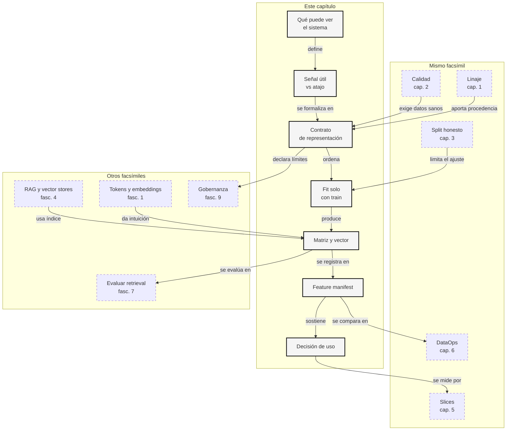

::: {.fasciculo-subtitle}
Facsímil 8 · La ciencia de los datos
:::

# Capítulo 04: Features y representaciones: de tablas a embeddings

## Qué deberías poder hacer al terminar

En el capítulo anterior congelamos una partición honesta. Ahora toca una pregunta igual de importante: ¿qué entra realmente al modelo? Un dataset no se convierte solo en inteligencia por estar en una tabla. Hay que transformar fechas, categorías, texto y metadatos en números que una función pueda operar.

Ese paso se llama representación. A veces es tan sencillo como convertir `email` en una columna binaria. A veces implica normalizar una fecha. A veces convierte un texto completo en un vector de cientos o miles de dimensiones. En todos los casos hay una decisión de ingeniería: qué información permitimos, qué información prohibimos, cuándo se ajusta la transformación y qué versión queda registrada.

Al terminar deberías poder hacer esto:

| Resultado de aprendizaje | Evidencia de que lo sabes hacer |
|---|---|
| Distinguir dato crudo, feature y representación. | No llamas “dato” a cualquier columna sin mirar cómo se transforma. |
| Diseñar un contrato de features. | Declaras columnas permitidas, prohibidas, tipos y `fit_scope`. |
| Explicar one-hot, normalización, TF-IDF y embeddings. | Puedes escribir sus fórmulas y decir qué aprende cada pieza. |
| Evitar leakage de representación. | Ajustas vocabulario, escalas e IDF solo con train. |
| Leer una dimensión de embedding como coste y contrato. | No tratas `d=64`, `d=768` o `d=3072` como decoración. |
| Evaluar una búsqueda vectorial mínima. | Miras top-k, términos fuera de vocabulario, metadata y slices. |

La frase central del capítulo:

> Una feature no es una columna: es una promesa sobre cómo una columna se convierte en señal.

## La escena: el modelo no sabe leer tu tabla

Imagina una tabla con casos de soporte académico. Tiene columnas como `created_at`, `product`, `channel`, `student_id`, `source_id`, `label` y `text`. Una persona puede leerla y entender bastante: esto va de becas, aquello de matrícula, esto llegó por email, aquello por portal.

El modelo, en cambio, no ve “becas” como idea ni “email” como canal humano. Ve números. Si le das texto, alguien debe tokenizarlo o vectorizarlo. Si le das fechas, alguien debe convertirlas en una escala útil. Si le das categorías, alguien debe decidir si se codifican como one-hot, índices, embeddings aprendidos o metadata para filtrar.

Aquí aparece una parte muy de ingeniería de datos e IA: no basta con tener datos. Hay que construir una representación coherente, reproducible y alineada con el uso real. Si esa representación se construye mal, el modelo puede aprender una señal falsa, olvidar una señal importante o medir con información que no debería haber visto.

## Qué no es una feature

Una feature no es cualquier columna que tengamos a mano. `student_id` existe en la tabla, pero quizá no debería entrar al modelo. Si entra, el sistema podría aprender estilos de estudiantes concretos en vez de patrones generales. `source_id` existe, pero puede actuar como atajo si cada documento está demasiado asociado a una etiqueta. `label` existe, pero usarla como entrada sería convertir la respuesta en pista.

Tampoco es una transformación hecha “porque mejora la métrica”. Si una feature mejora mucho el resultado, hay que preguntar por qué. Puede ser una señal legítima, como la antigüedad de un caso. Puede ser una fuga, como una fecha de resolución disponible solo después de cerrar el ticket. Puede ser una variable de identidad, como un código interno que en train coincide con la etiqueta pero en producción cambia.

Y un embedding no es conocimiento puro. Es una representación numérica aprendida o calculada. Puede capturar parecido semántico, pero no garantiza verdad, actualidad, permisos ni relación exacta. Si un vector store devuelve un fragmento cercano, todavía necesitamos comprobar si ese fragmento contiene evidencia suficiente para la pregunta.

## Qué sí es una representación

Una representación es la forma en que describimos un objeto para que un algoritmo pueda trabajar con él. En aprendizaje estadístico, el punto de partida suele ser una matriz \(X\), donde cada fila representa un ejemplo y cada columna representa una feature.^[Hastie, T., Tibshirani, R. y Friedman, J. (2009). *The Elements of Statistical Learning* (2.ª ed.). Springer. [Libro](https://web.stanford.edu/~hastie/ElemStatLearn/).] La etiqueta o valor que queremos predecir suele separarse como \(y\).

$$
X \in \mathbb{R}^{n \times d}
$$

| Símbolo | Significado | Ejemplo |
|---|---|---|
| \(X\) | Matriz de features. | 24 casos por 49 features. |
| \(n\) | Número de ejemplos. | 24 filas. |
| \(d\) | Número de features. | 49 columnas generadas por el kit. |
| \(x_{i,j}\) | Valor de la feature \(j\) para el ejemplo \(i\). | `product__becas = 1`. |

En un proyecto de IA moderna, \(X\) puede mezclar varias familias de señal:

| Familia | Ejemplo | Qué aporta |
|---|---|---|
| Numérica | Días desde la primera fecha de train. | Orden temporal, recencia, duración. |
| Categórica | Producto, canal, país, tipo de usuario. | Segmentos y contexto operativo. |
| Texto disperso | TF-IDF, bolsa de palabras, BM25. | Coincidencia lexical y términos técnicos. |
| Texto denso | Embeddings de frases o documentos. | Parecido semántico y paráfrasis. |
| Metadata | `case_id`, permisos, versión de documento. | Trazabilidad, filtros y auditoría. |

La clave es no mezclar funciones. Metadata puede ser imprescindible para auditar o filtrar, pero no necesariamente debe ser feature del modelo. El contrato decide esa frontera.

## Cómo se construye una feature por dentro

Construir una representación es una cadena de decisiones. Primero elegimos columnas permitidas. Después definimos transformaciones. Luego ajustamos lo que tenga que aprenderse usando solo train. Finalmente transformamos train, validation y test con los parámetros ya congelados.

Una feature numérica puede normalizarse así:

$$
\tilde{x} =
\frac{x - x_{min}^{train}}
{x_{max}^{train} - x_{min}^{train}}
$$

| Símbolo | Significado | Ejemplo |
|---|---|---|
| \(x\) | Valor original. | Día 10 desde el inicio. |
| \(x_{min}^{train}\) | Mínimo observado en train. | Día 0. |
| \(x_{max}^{train}\) | Máximo observado en train. | Día 15. |
| \(\tilde{x}\) | Valor normalizado. | \(10/15 = 0.67\). |

La parte importante está en los superíndices: mínimo y máximo salen de train. Si usas todo el dataset, test participa en la escala. Puede parecer poco, pero en pipelines grandes esa pequeña comodidad se acumula con imputación, selección de variables, vocabularios e índices.

Una categoría puede codificarse con one-hot:

$$
onehot(c)_k =
\begin{cases}
1 & \text{si } c = k \\
0 & \text{si } c \ne k
\end{cases}
$$

| Símbolo | Significado | Ejemplo |
|---|---|---|
| \(c\) | Categoría de la fila. | `becas`. |
| \(k\) | Categoría concreta del vocabulario. | `matricula`. |
| \(onehot(c)_k\) | Columna binaria para \(k\). | 0 si el producto es `becas`. |

Si en train vemos `becas`, `horarios`, `matricula`, `pagos`, `practicas` y `titulos`, esas son las columnas que crea el contrato. Si mañana aparece `doctorado`, el sistema no debería improvisar silenciosamente una columna nueva en producción. Debe registrarlo como categoría desconocida, decidir cómo tratarla y actualizar el contrato si procede.

Para texto lexical, TF-IDF pondera términos usando frecuencia local y rareza global. Una forma habitual es:

$$
tfidf(t,d) =
tf(t,d)
\cdot
\left(
\log \frac{1 + N}{1 + df(t)}
+ 1
\right)
$$

| Símbolo | Significado | Ejemplo |
|---|---|---|
| \(t\) | Término. | `beca`. |
| \(d\) | Documento o texto de una fila. | “requisitos de beca”. |
| \(tf(t,d)\) | Veces que aparece \(t\) en \(d\). | 1. |
| \(N\) | Número de textos de train. | 15. |
| \(df(t)\) | Número de textos de train que contienen \(t\). | 2. |
| \(tfidf(t,d)\) | Peso final del término. | Mayor si el término es informativo. |

BM25, una familia clásica de ranking lexical, parte de una intuición parecida pero ajusta saturación de frecuencia y longitud del documento.^[Robertson, S. y Zaragoza, H. (2009). The Probabilistic Relevance Framework: BM25 and Beyond. *Foundations and Trends in Information Retrieval*, 3(4), 333-389. [DOI](https://doi.org/10.1561/1500000019).] En RAG híbrido, estas señales lexicales siguen siendo muy útiles: los embeddings toleran paráfrasis; lo lexical rescata términos exactos, códigos, siglas y nombres propios.

## Embeddings: vectores densos con contrato

Un embedding es un vector denso:

$$
e = f_{\theta}(objeto) \in \mathbb{R}^{m}
$$

| Símbolo | Significado | Ejemplo |
|---|---|---|
| \(objeto\) | Lo que queremos representar. | Texto de un caso, imagen, usuario, producto. |
| \(f_{\theta}\) | Encoder o función de representación. | Modelo de embeddings o encoder local. |
| \(\theta\) | Parámetros del encoder. | Pesos entrenados o reglas congeladas. |
| \(m\) | Dimensión del vector. | 64 en el kit; 768 en muchos modelos BERT. |
| \(e\) | Vector resultante. | `[0.0, -0.12, ...]`. |

La historia moderna de embeddings no empieza con los LLM actuales. Bengio y colaboradores ya propusieron representar palabras mediante vectores aprendidos dentro de modelos de lenguaje neuronales.^[Bengio, Y., Ducharme, R., Vincent, P. y Janvin, C. (2003). A Neural Probabilistic Language Model. *Journal of Machine Learning Research*, 3, 1137-1155. [Paper](https://www.jmlr.org/papers/volume3/bengio03a/bengio03a.pdf).] Word2Vec popularizó embeddings preentrenados eficientes para palabras.^[Mikolov, T., Chen, K., Corrado, G. y Dean, J. (2013). Efficient Estimation of Word Representations in Vector Space. [arXiv](https://arxiv.org/abs/1301.3781).] BERT llevó la idea a representaciones contextuales: el vector de una palabra depende de la frase completa.^[Devlin, J., Chang, M.-W., Lee, K. y Toutanova, K. (2019). BERT: Pre-training of Deep Bidirectional Transformers for Language Understanding. *NAACL-HLT 2019*, 4171-4186. [DOI](https://doi.org/10.18653/v1/N19-1423).] Sentence-BERT adaptó arquitecturas BERT para producir embeddings de frases útiles en similitud semántica.^[Reimers, N. y Gurevych, I. (2019). Sentence-BERT: Sentence Embeddings using Siamese BERT-Networks. *EMNLP-IJCNLP 2019*, 3982-3992. [DOI](https://doi.org/10.18653/v1/D19-1410).]

La similitud coseno compara direcciones:

$$
\cos(a,b) =
\frac{a \cdot b}
{\|a\| \|b\|}
$$

| Símbolo | Significado | Ejemplo |
|---|---|---|
| \(a,b\) | Dos vectores. | Query y caso indexado. |
| \(a \cdot b\) | Producto escalar. | Suma de productos dimensión a dimensión. |
| \(\|a\|\) | Norma de \(a\). | Longitud del vector. |
| \(\cos(a,b)\) | Similitud por dirección. | 1 si apuntan igual; 0 si son ortogonales. |

Dimensión no significa “inteligencia”. Significa longitud del vector y, por tanto, memoria, coste de cálculo, coste de índice y capacidad de representar matices. Un embedding de 64 dimensiones cabe barato y sirve como baseline local. Uno de 768 o más puede capturar mucha más estructura, pero cuesta más guardar, comparar y servir.

## La anatomía de una representación publicable

<figure id="f8-c04-feature-anatomy" class="book-figure book-figure-svg">
<svg viewBox="0 0 1760 1180" role="img" aria-labelledby="f8-c04-title f8-c04-desc" xmlns="http://www.w3.org/2000/svg">
  <title id="f8-c04-title">Anatomía de un pipeline de features y embeddings</title>
  <desc id="f8-c04-desc">Diagrama en blanco y negro que conecta datos crudos, contrato, fit con train, matrices, embeddings y búsqueda vectorial.</desc>
  <defs>
    <marker id="f8c04-arrow" markerWidth="12" markerHeight="12" refX="10" refY="6" orient="auto">
      <path d="M1 1 L11 6 L1 11 Z" fill="#111111"/>
    </marker>
    <style>
      .bg{fill:#FFFFFF}
      .box{fill:#FFFFFF;stroke:#111111;stroke-width:2}
      .soft{fill:#F6F6F6;stroke:#111111;stroke-width:1.4}
      .dark{fill:#111111;stroke:#111111;stroke-width:2}
      .title{font-family:Inter,Arial,sans-serif;font-size:34px;font-weight:800;fill:#111111}
      .sub{font-family:Inter,Arial,sans-serif;font-size:17px;fill:#444444}
      .label{font-family:Inter,Arial,sans-serif;font-size:15px;font-weight:800;fill:#111111}
      .small{font-family:Inter,Arial,sans-serif;font-size:12px;fill:#333333}
      .tiny{font-family:Inter,Arial,sans-serif;font-size:10.5px;fill:#666666}
      .white{font-family:Inter,Arial,sans-serif;font-size:15px;font-weight:800;fill:#FFFFFF}
      .code{font-family:ui-monospace,SFMono-Regular,Menlo,Consolas,monospace;font-size:11px;fill:#111111}
      .line{stroke:#111111;stroke-width:2;fill:none;marker-end:url(#f8c04-arrow)}
      .dash{stroke:#666666;stroke-width:1.5;fill:none;stroke-dasharray:7 7;marker-end:url(#f8c04-arrow)}
    </style>
  </defs>
  <rect class="bg" x="0" y="0" width="1760" height="1180"/>
  <text class="title" x="90" y="94">De datos crudos a representación usable</text>
  <text class="sub" x="90" y="130">Una feature publicable tiene contrato, fit scope, dimensión, metadata y evaluación.</text>

  <rect class="dark" x="90" y="190" width="280" height="56" rx="12"/>
  <text class="white" x="230" y="225" text-anchor="middle">Datos crudos</text>
  <rect class="box" x="90" y="275" width="280" height="250" rx="16"/>
  <text class="code" x="122" y="315">created_at</text>
  <text class="code" x="122" y="343">product</text>
  <text class="code" x="122" y="371">channel</text>
  <text class="code" x="122" y="399">text</text>
  <text class="code" x="122" y="427">label</text>
  <text class="tiny" x="122" y="486">no todo lo que existe</text>
  <text class="tiny" x="122" y="506">puede ser entrada</text>

  <rect class="soft" x="470" y="170" width="300" height="170" rx="16"/>
  <text class="label" x="620" y="210" text-anchor="middle">Contrato de features</text>
  <text class="small" x="506" y="246">permitidas</text>
  <text class="small" x="506" y="272">prohibidas</text>
  <text class="small" x="506" y="298">fit_scope = train</text>
  <text class="tiny" x="506" y="322">versiona la frontera</text>

  <rect class="soft" x="470" y="395" width="300" height="180" rx="16"/>
  <text class="label" x="620" y="435" text-anchor="middle">Transformaciones</text>
  <text class="small" x="506" y="470">normalización</text>
  <text class="small" x="506" y="496">one-hot</text>
  <text class="small" x="506" y="522">TF-IDF</text>
  <text class="small" x="506" y="548">encoder denso</text>

  <rect class="dark" x="870" y="190" width="300" height="56" rx="12"/>
  <text class="white" x="1020" y="225" text-anchor="middle">Fit solo con train</text>
  <rect class="box" x="870" y="275" width="300" height="250" rx="16"/>
  <text class="small" x="908" y="318">vocabulario</text>
  <text class="small" x="908" y="346">categorías</text>
  <text class="small" x="908" y="374">IDF</text>
  <text class="small" x="908" y="402">mínimos y máximos</text>
  <text class="tiny" x="908" y="486">validation/test solo</text>
  <text class="tiny" x="908" y="506">se transforman</text>

  <rect class="soft" x="1270" y="145" width="300" height="155" rx="16"/>
  <text class="label" x="1420" y="184" text-anchor="middle">Matriz de features</text>
  <text class="small" x="1308" y="222">49 columnas</text>
  <text class="small" x="1308" y="248">tabular + texto</text>
  <text class="tiny" x="1308" y="276">sirve para ML clásico</text>

  <rect class="soft" x="1270" y="350" width="300" height="155" rx="16"/>
  <text class="label" x="1420" y="389" text-anchor="middle">Embedding denso</text>
  <text class="small" x="1308" y="427">64 dimensiones</text>
  <text class="small" x="1308" y="453">normalización L2</text>
  <text class="tiny" x="1308" y="481">sirve para similitud</text>

  <path class="line" d="M370 400 C420 400 420 255 470 255"/>
  <path class="line" d="M620 340 L620 395"/>
  <path class="line" d="M770 485 C820 485 820 400 870 400"/>
  <path class="line" d="M1170 360 C1215 360 1215 222 1270 222"/>
  <path class="line" d="M1170 420 C1215 420 1215 430 1270 430"/>

  <rect class="dark" x="300" y="710" width="300" height="56" rx="12"/>
  <text class="white" x="450" y="745" text-anchor="middle">Manifest</text>
  <rect class="box" x="300" y="795" width="300" height="170" rx="16"/>
  <text class="small" x="338" y="835">hash dataset</text>
  <text class="small" x="338" y="861">hash split</text>
  <text class="small" x="338" y="887">dimensión</text>
  <text class="small" x="338" y="913">vocabulario</text>
  <text class="tiny" x="338" y="943">sin esto no hay trazabilidad</text>

  <rect class="dark" x="730" y="710" width="300" height="56" rx="12"/>
  <text class="white" x="880" y="745" text-anchor="middle">Búsqueda</text>
  <rect class="box" x="730" y="795" width="300" height="170" rx="16"/>
  <text class="small" x="768" y="835">query vector</text>
  <text class="small" x="768" y="861">coseno</text>
  <text class="small" x="768" y="887">top-k</text>
  <text class="small" x="768" y="913">out-of-vocab</text>

  <rect class="dark" x="1160" y="710" width="300" height="56" rx="12"/>
  <text class="white" x="1310" y="745" text-anchor="middle">Decisión</text>
  <rect class="box" x="1160" y="795" width="300" height="170" rx="16"/>
  <text class="code" x="1198" y="835">pass</text>
  <text class="code" x="1198" y="861">review</text>
  <text class="code" x="1198" y="887">block</text>
  <text class="tiny" x="1198" y="943">no todo top-k es suficiente</text>

  <path class="dash" d="M1420 505 C1420 635 450 635 450 710"/>
  <path class="dash" d="M1420 505 C1420 635 880 635 880 710"/>
  <path class="line" d="M600 880 L730 880"/>
  <path class="line" d="M1030 880 L1160 880"/>

  <rect class="dark" x="430" y="1040" width="900" height="66" rx="14"/>
  <text class="white" x="880" y="1081" text-anchor="middle">La representación es parte del sistema: se versiona, se evalúa y se puede explicar.</text>
  <text class="tiny" x="1688" y="1130" text-anchor="end" fill="#888888" opacity="0.55">IA para gente curiosa / Facsímil 08 / Capítulo 04 / 686f6c61</text>
</svg>
<figcaption>Una representación publicable conecta contrato, transformación, fit con train, manifiesto y evaluación.</figcaption>
</figure>

## Esto en un proyecto real

En un equipo profesional, las features no deberían vivir escondidas dentro de un notebook. Deben tener nombre, definición, propietario, tipo, fuente, ventana temporal, reglas de null, método de cálculo, versión y criterio de retirada. Cuando la misma feature se usa para entrenamiento offline y predicción online, además aparece un problema clásico: que el cálculo de entrenamiento y el cálculo de producción no coincidan.

Ahí entra la idea de feature store: un sistema o una disciplina para compartir definiciones de features, materializarlas, servirlas y versionarlas. Feast, por ejemplo, documenta esta filosofía de definir entidades, feature views y fuentes para servir features de manera consistente.^[Feast. (2026). *Feast Documentation*. [Documentación](https://docs.feast.dev/). Consultado el 6 de junio de 2026.] Lo importante para este libro no es casarnos con una herramienta concreta, sino entender la responsabilidad: si una feature decide, esa feature debe poder explicarse.

En RAG ocurre algo parecido. El embedding de un chunk no es una columna tradicional, pero es un dato derivado. Debe conservar `document_id`, versión del documento, versión del chunking, encoder, dimensión, fecha de creación y permisos. Si cambias cualquiera de esas piezas, el índice ya no es el mismo aunque el texto visible parezca igual.

## Por qué debería importarte

Una mala representación puede arruinar un sistema sin que el error sea evidente. El modelo compila, la API responde y la métrica puede subir, pero quizá aprendió una identidad, una fecha posterior, una categoría mal codificada o un embedding sin metadata. La representación es el lugar donde se decide qué puede aprender el sistema.

También es una cuestión de coste. Si tienes 10 millones de documentos y pasas de 384 a 3072 dimensiones, multiplicas almacenamiento y cálculo. Si además replicas el índice, guardas metadata y añades estructuras de vecinos aproximados, el coste ya no es marginal. FAISS y HNSW existen porque buscar vecinos en espacios vectoriales grandes requiere estructuras especializadas.^[Johnson, J., Douze, M. y Jégou, H. (2019). Billion-Scale Similarity Search with GPUs. *IEEE Transactions on Big Data*, 7(3), 535-547. [DOI](https://doi.org/10.1109/TBDATA.2019.2921572).]^[Malkov, Y. A. y Yashunin, D. A. (2020). Efficient and Robust Approximate Nearest Neighbor Search Using Hierarchical Navigable Small World Graphs. *IEEE Transactions on Pattern Analysis and Machine Intelligence*, 42(4), 824-836. [DOI](https://doi.org/10.1109/TPAMI.2018.2889473).]

## Manos a la obra

El kit del capítulo está en:

```text
labs/f8/c04-features-embeddings/
```

Construye dos artefactos: una matriz de features y una búsqueda vectorial mínima. Todo se hace sin dependencias externas para que puedas leer el mecanismo completo.

### Estructura

```text
labs/f8/c04-features-embeddings/
  README.md
  data/feature_cases.csv
  data/search_queries.csv
  data/split_assignments.csv
  contracts/feature_contract.json
  ops/build_feature_vectors.py
  ops/search_feature_vectors.py
  output/feature_manifest.json
  output/feature_matrix.csv
  output/dense_embedding_matrix.csv
  output/feature_quality_report.json
  output/feature_decision.md
  output/search_results.csv
  output/search_report.json
  output/search_decision.md
```

### Cómo lo ejecutas

```bash
cd labs/f8/c04-features-embeddings
python3 ops/build_feature_vectors.py --write
cat output/feature_decision.md
python3 ops/search_feature_vectors.py --write
cat output/search_decision.md
```

### Qué deberías ver

El primer script debería dejar el gate en `pass`:

```text
Genera 49 features tabulares/textuales y embeddings densos locales de 64 dimensiones.
```

La matriz `feature_matrix.csv` incluye columnas como `product__becas`, `channel__email` y `tfidf__matricula`. El archivo `dense_embedding_matrix.csv` incluye `embedding_00` hasta `embedding_63`. El manifiesto guarda hashes, vocabularios, dimensión y `fit_scope`.

El segundo script debería quedar en `review`, no porque el sistema esté roto, sino porque algunas consultas tienen términos fuera del vocabulario de train:

```text
q002 -> justificante, pendiente
q004 -> bloqueada
```

Eso es una lección real: si el vocabulario se ajusta solo con train, validation y test pueden contener palabras nuevas. Un buen pipeline no las esconde; las reporta. Después puedes decidir si necesitas más datos, un encoder neural, búsqueda híbrida, expansión de consultas o revisión del split.

### Cómo lo adaptas a tu caso

| Si tu proyecto tiene... | Qué cambias |
|---|---|
| Nuevas columnas tabulares | Añádelas a `allowed_input_columns` y define transformación. |
| IDs o columnas sensibles | Mételas en `forbidden_input_columns`. |
| Más texto | Sube `max_terms` o cambia el encoder. |
| Embeddings reales | Sustituye `deterministic_hash_projection`, pero conserva dimensión y versión. |
| Índice de producción | Añade metadata, permisos, fecha de indexado y versión de corpus. |
| Evaluación RAG | Calcula `recall@k`, cobertura por producto, latencia y out-of-vocabulary. |

### Qué entregaría un alumno

1. `feature_manifest.json` generado.
2. `feature_quality_report.json` explicado.
3. `search_report.json` con una lectura de cada consulta.
4. Tres consultas nuevas y su resultado top-k.
5. Una propuesta para sustituir el encoder local por embeddings reales sin perder trazabilidad.

## Cómo encaja todo

Este mapa debe leerse como una brújula, no como un inventario de técnicas. Los capítulos anteriores del facsímil nos dieron linaje, calidad y splits; los facsímiles previos nos dieron tokens, embeddings, RAG y vector stores. Este capítulo hace de puente: decide **qué puede ver el sistema** y cómo queda esa decisión convertida en matriz, vector, manifiesto y búsqueda.

La continuidad posterior también es importante. Una representación no termina cuando se genera `feature_matrix.csv`: se evalúa por slices, se monitoriza cuando cambia la producción, se mide como recuperación si entra en RAG y se gobierna si toca permisos, identidad o decisiones sensibles.



## Vocabulario aprendido

| Término | Definición breve |
|---|---|
| Feature | Variable de entrada que un modelo puede usar. |
| Representación | Forma numérica de describir un objeto. |
| One-hot | Codificación binaria de categorías. |
| Normalización | Cambio de escala para comparar valores. |
| TF-IDF | Peso lexical basado en frecuencia local y rareza global. |
| Embedding | Vector denso que permite comparar objetos por similitud. |
| Dimensión | Longitud del vector o número de coordenadas. |
| Similitud coseno | Comparación de dirección entre dos vectores. |
| Out-of-vocabulary | Término que no estaba en el vocabulario ajustado. |
| Feature manifest | Artefacto que versiona columnas, vocabulario, hashes y dimensiones. |

## Dónde solía tropezar yo

| Tropiezo | Por qué ocurre | Antídoto |
|---|---|---|
| Usar todas las columnas | Parece que más información siempre ayuda. | Separar entradas, target, IDs y metadata. |
| Ajustar vocabulario con todo el dataset | Es más cómodo hacerlo antes del split. | Crear split primero y hacer `fit` solo con train. |
| Llamar conocimiento a un embedding | El vector parece semántico. | Conservar evidencia, metadata, permisos y evaluación. |
| Ignorar dimensión y coste | El modelo de embeddings se ve como una caja externa. | Calcular almacenamiento, latencia e índice. |
| Mirar solo el top-1 | El primer vecino puede ser casual. | Evaluar top-k, slices y términos fuera de vocabulario. |

## Antes de pasar página

Antes de avanzar, deberías poder responder:

1. ¿Por qué una feature no es simplemente una columna?
2. ¿Qué diferencia hay entre feature, metadata y target?
3. ¿Por qué one-hot necesita vocabulario ajustado en train?
4. ¿Qué aprende TF-IDF y por qué puede contaminar si se ajusta con todo el dataset?
5. ¿Qué significa que un embedding viva en \(\mathbb{R}^{m}\)?
6. ¿Qué mide la similitud coseno?
7. ¿Por qué la dimensión afecta coste y ranking?
8. ¿Qué guarda `feature_manifest.json`?
9. ¿Por qué `search_report.json` queda en `review`?
10. ¿Qué cambiarías para usar embeddings reales sin perder trazabilidad?

## En resumen

| Idea | Qué te llevas |
|---|---|
| La representación es parte del sistema. | No se improvisa dentro de un notebook. |
| El `fit` pertenece a train. | Escalas, vocabularios e IDF se congelan antes de validation y test. |
| Embedding no significa verdad. | Es una geometría útil que necesita metadata y evaluación. |
| La dimensión tiene coste. | Afecta memoria, latencia, índice y calidad de ranking. |
| Una práctica real deja artefactos. | Contrato, matriz, manifiesto, reporte y decisión. |

## Para saber más

Bengio, Y., Ducharme, R., Vincent, P. y Janvin, C. (2003). A Neural Probabilistic Language Model. *Journal of Machine Learning Research*, 3, 1137-1155. [Paper](https://www.jmlr.org/papers/volume3/bengio03a/bengio03a.pdf)

Devlin, J., Chang, M.-W., Lee, K. y Toutanova, K. (2019). BERT: Pre-training of Deep Bidirectional Transformers for Language Understanding. *NAACL-HLT 2019*, 4171-4186. [DOI](https://doi.org/10.18653/v1/N19-1423)

Feast. (2026). Feast Documentation. [Documentación](https://docs.feast.dev/)

Hastie, T., Tibshirani, R. y Friedman, J. (2009). *The Elements of Statistical Learning* (2.ª ed.). Springer. [Libro](https://web.stanford.edu/~hastie/ElemStatLearn/)

Johnson, J., Douze, M. y Jégou, H. (2019). Billion-Scale Similarity Search with GPUs. *IEEE Transactions on Big Data*, 7(3), 535-547. [DOI](https://doi.org/10.1109/TBDATA.2019.2921572)

Malkov, Y. A. y Yashunin, D. A. (2020). Efficient and Robust Approximate Nearest Neighbor Search Using Hierarchical Navigable Small World Graphs. *IEEE Transactions on Pattern Analysis and Machine Intelligence*, 42(4), 824-836. [DOI](https://doi.org/10.1109/TPAMI.2018.2889473)

Mikolov, T., Chen, K., Corrado, G. y Dean, J. (2013). Efficient Estimation of Word Representations in Vector Space. [arXiv](https://arxiv.org/abs/1301.3781)

Reimers, N. y Gurevych, I. (2019). Sentence-BERT: Sentence Embeddings using Siamese BERT-Networks. *EMNLP-IJCNLP 2019*, 3982-3992. [DOI](https://doi.org/10.18653/v1/D19-1410)

Robertson, S. y Zaragoza, H. (2009). The Probabilistic Relevance Framework: BM25 and Beyond. *Foundations and Trends in Information Retrieval*, 3(4), 333-389. [DOI](https://doi.org/10.1561/1500000019)
