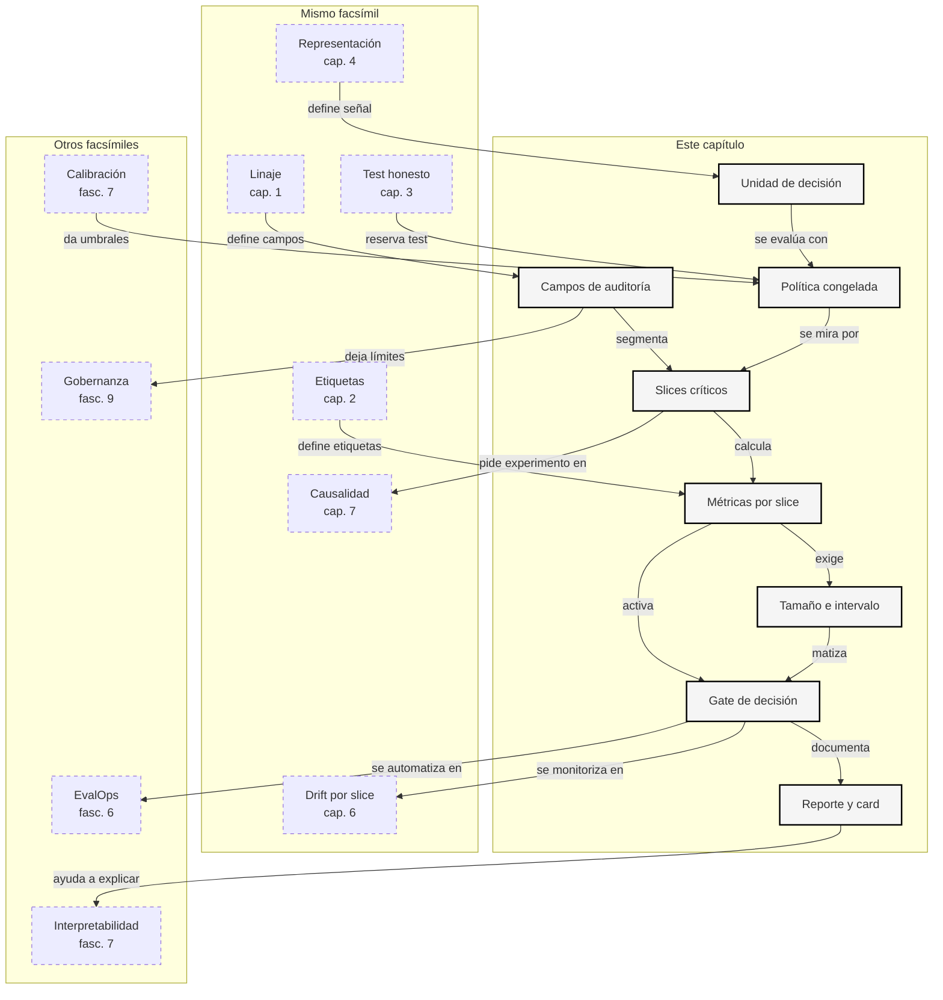

::: {.fasciculo-subtitle}
Facsímil 8 · La ciencia de los datos
:::

# Capítulo 05: Slices, sesgos y decisión algorítmica

## Qué deberías poder hacer al terminar

En el capítulo anterior convertimos datos en representaciones. Ahora viene una pregunta menos cómoda: **¿esa representación se comporta igual de bien en todas las partes importantes del problema?**

La respuesta casi nunca sale mirando solo la media global. Una accuracy de 0,86, un recall de 0,78 o un coste medio aceptable pueden esconder que el sistema falla en un producto, un canal, un idioma, una fuente de datos, una necesidad de accesibilidad o una combinación pequeña pero importante. A esa partición útil del comportamiento la llamamos slice.

Al terminar deberías poder hacer esto:

| Resultado de aprendizaje | Evidencia de que lo sabes hacer |
|---|---|
| Definir slices útiles. | No partes por columnas al azar: eliges segmentos conectados con la decisión. |
| Separar atributo de auditoría y feature. | Entiendes que un campo puede servir para medir aunque no deba entrar al modelo. |
| Calcular métricas por slice. | Obtienes recall, tasa de revisión, falsos positivos, coste y captura segura por grupo. |
| Leer disparidades sin convertirlas en eslogan. | Sabes qué métrica se compara, qué tamaño de muestra la sostiene y qué acción permite. |
| Entender criterios clásicos de equidad algorítmica. | Distingues paridad demográfica, igualdad de oportunidad, odds igualadas y calibración por grupo. |
| Convertir una auditoría en decisión. | Produces un reporte, un CSV de slices, una ficha y una decisión operativa. |

La frase central del capítulo:

> Un sistema no se publica porque la media global suene bien; se publica cuando sabes dónde funciona, dónde no y qué harás con esa diferencia.

## La escena: la media global llega demasiado tarde

Imagina un sistema que ayuda a priorizar casos académicos. Cada caso recibe un score. Si el score es alto, se prioriza. Si es bajo, sigue el flujo normal. Si cae en medio, se manda a revisión.

La métrica global parece razonable. El sistema acierta muchos casos, revisa una parte manejable y mantiene buena latencia. En una reunión rápida alguien podría decir: “vamos adelante”.

Pero al partir los resultados por slices aparece otra lectura. Los casos con necesidad de adaptación tienen más casos prioritarios enviados al flujo normal. En inglés se revisa mucho más. En un producto concreto, los casos importantes no quedan capturados. La media global no mentía; simplemente comprimía demasiado.

Este capítulo enseña a no dejar que eso pase.

## Qué no es auditar por slices

Auditar por slices no es hacer una tabla enorme con todas las columnas del CSV. Si cada valor distinto se convierte en una fila de auditoría, obtienes ruido. Un slice debe existir porque representa una hipótesis: “este canal cambia la forma de escribir”, “este producto tiene más ambigüedad”, “este idioma tiene menos ejemplos”, “este grupo necesita que no confundamos silencio con baja prioridad”.

Tampoco es declarar que una diferencia numérica demuestra una injusticia completa. Una disparidad es una señal medible, no una sentencia universal. Puede venir de datos escasos, etiquetas inconsistentes, política de negocio, diseño del umbral, cobertura desigual, drift o un error real del modelo. La ingeniería consiste en separar esas causas antes de automatizar más.

Y no es lo mismo usar un atributo para decidir que usarlo para auditar. En muchos sistemas, ciertos campos no deben entrar como feature. Aun así, puede ser imprescindible medir resultados agregados por esos campos para detectar si el sistema está fallando justo donde más importa. El contrato debe decirlo: **campo no usado por el modelo, campo permitido para auditoría agregada**.

## Qué sí es un slice

Un slice es un subconjunto definido por una condición. Si \(D\) es el conjunto evaluado y \(A\) es un atributo de auditoría, el slice asociado al valor \(a\) es:

$$
D_a = \{(x_i, y_i, \hat{s}_i) \in D : A_i = a\}
$$

| Símbolo | Significado | Ejemplo |
|---|---|---|
| \(D\) | Dataset de evaluación. | 36 casos de test del kit. |
| \(A\) | Atributo usado para auditar. | `language`. |
| \(a\) | Valor concreto del atributo. | `en`. |
| \(D_a\) | Slice formado por casos con ese valor. | Casos de test en inglés. |
| \(x_i\) | Entrada o representación del caso. | Texto, producto, canal, metadata. |
| \(y_i\) | Etiqueta real. | `true_priority = 1`. |
| \(\hat{s}_i\) | Score producido por el sistema. | `0.84`. |

La parte importante es que el slice conserva la unidad de decisión. No evaluamos “idioma” en abstracto. Evaluamos **decisiones sobre casos** dentro de un idioma, producto, canal o combinación de condiciones.

Ejemplo de fórmula: en el kit del capítulo, una política de triaje convierte score en decisión. Los números son umbrales didácticos congelados para la práctica; en un proyecto real se fijarían con validación, capacidad humana y coste operativo antes de mirar test.

$$
d(\hat{s}) =
\begin{cases}
P & \hat{s} \ge 0.78 \\
N & \hat{s} < 0.38 \\
R & \text{otro caso}
\end{cases}
$$

| Símbolo | Significado | Ejemplo |
|---|---|---|
| \(\hat{s}\) | Score producido por el sistema. | 0,36. |
| \(P\) | Priorizar. | Caso claro de alta prioridad. |
| \(N\) | Flujo normal. | Caso claro de baja prioridad. |
| \(R\) | Revisar. | Caso intermedio. |
| 0,78 | Umbral alto congelado antes de mirar test. | Priorizar casos claros. |
| 0,38 | Umbral bajo congelado antes de mirar test. | Enviar al flujo normal casos claros. |

Esta política no se ajusta en test. Test sirve para medir. Si tocamos umbrales mirando el slice que falla, ya no estamos auditando: estamos usando la evaluación como desarrollo. Eso lo vimos en [el capítulo 03 del facsímil 08](/libro/fasciculo-08/#capitulo-03).

## Métricas por slice: lo mínimo que un ingeniero debería mirar

Para cada slice conviene calcular una matriz de confusión. En una decisión binaria clásica, tendríamos TP, FP, FN y TN. En una política con revisión, añadimos una tercera salida: `revisar`. Eso cambia la lectura.

Si un caso prioritario se manda a `normal`, tenemos un fallo operativo fuerte. Si se manda a `revisar`, no se ha automatizado bien, pero tampoco se ha dejado pasar sin mirar. Por eso el kit distingue tres métricas:

| Métrica | Fórmula | Lectura |
|---|---|---|
| Auto-recall | \(TP / P\) | De los casos prioritarios, cuántos se priorizan automáticamente. |
| Miss rate | \(FN / P\) | De los casos prioritarios, cuántos se envían a flujo normal. |
| Captura segura | \((TP + review_P) / P\) | De los prioritarios, cuántos quedan priorizados o revisados. |

Donde:

| Símbolo | Significado | Ejemplo |
|---|---|---|
| \(P\) | Número de casos positivos reales en el slice. | 6 casos prioritarios. |
| \(TP\) | Positivos reales priorizados. | 2 casos. |
| \(FN\) | Positivos reales enviados a flujo normal. | 4 casos. |
| \(review_P\) | Positivos reales mandados a revisión. | 1 caso. |

La diferencia entre auto-recall y captura segura es muy útil. Si auto-recall es bajo pero captura segura es alta, quizá el sistema no automatiza mucho, pero protege la decisión con revisión. Si captura segura es baja, el problema es más serio: casos importantes están pasando al flujo normal.

Ejemplo de fórmula: para no olvidar el coste, el kit usa esta función lineal. Es una plantilla pedagógica: cada equipo debería cambiar pesos y unidades según impacto real, tiempo de revisión, riesgo y capacidad.

$$
C =
c_{FN} \cdot FN
+
c_{FP} \cdot FP
+
c_R \cdot R
$$

| Símbolo | Significado | Ejemplo del kit |
|---|---|---|
| \(C\) | Coste operativo total del slice. | 19,6. |
| \(c_{FN}\) | Coste de enviar un prioritario a flujo normal. | 8,0. |
| \(c_{FP}\) | Coste de priorizar un no prioritario. | 3,0. |
| \(c_R\) | Coste de revisión. | 1,2. |
| \(R\) | Número de casos revisados. | 3. |

Un coste no tiene que ser euros. Puede ser minutos de equipo, riesgo operativo, saturación de soporte o coste de oportunidad. Lo importante es hacerlo explícito antes de elegir política.

## Criterios clásicos: nombres útiles, no dogmas

La literatura de equidad algorítmica distingue varios criterios. Conviene conocerlos porque aparecen en papers, herramientas y auditorías, pero no deben usarse como recetas automáticas.

La **paridad demográfica** compara tasas de selección entre grupos. En nuestro caso sería comparar qué proporción de casos se prioriza en cada slice:

$$
P(\hat{Y}=1 \mid A=a)
$$

Sirve para detectar diferencias de tasa de salida. No sabe si los casos positivos reales estaban distribuidos igual. Si un producto recibe más casos realmente prioritarios que otro, exigir la misma tasa de priorización puede ser una mala idea.

La **igualdad de oportunidad** compara la tasa de verdaderos positivos entre grupos, es decir, si los casos positivos reales reciben la salida positiva con tasas parecidas.^[Hardt, M., Price, E. y Srebro, N. (2016). Equality of Opportunity in Supervised Learning. *Advances in Neural Information Processing Systems 29*, 3323-3331. https://papers.nips.cc/paper/6374-equality-of-opportunity-in-supervised-learning] En el kit se parece al auto-recall por slice:

$$
P(\hat{Y}=1 \mid Y=1, A=a)
$$

Las **odds igualadas** comparan tanto verdaderos positivos como falsos positivos entre grupos. Pide que el sistema tenga comportamiento parecido para positivos reales y negativos reales. Es más exigente que mirar solo recall.

La **calibración por grupo** pregunta si un score significa lo mismo en cada grupo. Si los casos con score 0,8 aciertan el 80 % en un slice y el 55 % en otro, no basta con decir que el score ordena bien globalmente. Esto conecta con [calibración e incertidumbre en el facsímil 07](/libro/fasciculo-07/#capitulo-05).

Hay un punto clave: algunos criterios no se pueden satisfacer todos a la vez salvo en condiciones especiales. Chouldechova y Kleinberg, Mullainathan y Raghavan mostraron incompatibilidades entre nociones de equidad cuando las tasas base difieren entre grupos.^[Chouldechova, A. (2017). Fair Prediction with Disparate Impact: A Study of Bias in Recidivism Prediction Instruments. *Big Data*, 5(2), 153-163. https://doi.org/10.1089/big.2016.0047]^[Kleinberg, J., Mullainathan, S. y Raghavan, M. (2017). *Inherent Trade-Offs in the Fair Determination of Risk Scores*. https://arxiv.org/abs/1609.05807] Traducido a ingeniería: elegir una métrica de equidad es elegir qué error quieres controlar y qué compromiso aceptas.

## Sesgo no siempre significa lo mismo

La palabra sesgo se usa demasiado rápido. Para ingeniería, decir “el modelo tiene sesgo” sin precisar de qué tipo es casi no ayuda. Necesitamos localizar **dónde entra**, **cómo se manifiesta**, **qué métrica lo hace visible** y **qué acción permite**.

En este capítulo no usamos sesgo como insulto técnico. Lo usamos como una diferencia sistemática que puede afectar a una decisión. Puede estar en los datos, en el objetivo, en la representación, en el modelo, en el umbral, en la interfaz o en la forma de medir. Si no separas esas capas, acabas arreglando el sitio equivocado.

| Fuente de sesgo | Qué ocurre | Cómo se detecta | Qué suele hacerse |
|---|---|---|---|
| Cobertura | Un slice tiene pocos ejemplos o no aparece en train. | Conteos, intervalos, unknowns, categorías raras. | Recoger más datos, limitar automatización, declarar cobertura. |
| Selección | Los datos observados no representan el uso real. | Comparar distribución de train, test y producción. | Rehacer split, muestreo, ponderación o contrato de uso. |
| Medición | Un campo no mide lo mismo en todos los grupos. | Revisar definición, instrumento de captura y linaje. | Cambiar proxy, añadir variable mejor, documentar límite. |
| Proxy | Una variable cómoda sustituye mal al concepto real. | Correlación con slices, errores concentrados, revisión de dominio. | Sustituir proxy o cambiar objetivo. |
| Etiquetado | Las etiquetas se aplican con criterios distintos. | Acuerdo entre anotadores, desacuerdo por slice, revisión de casos frontera. | Reescribir política de anotación y reetiquetar muestra. |
| Representación | Las features o embeddings capturan peor un segmento. | OOV, vecinos pobres, recall por slice, sensibilidad a idioma o formato. | Cambiar encoder, vocabulario, normalización o datos de entrenamiento. |
| Agregación | Un único modelo o umbral mezcla subpoblaciones con comportamientos distintos. | Buen promedio global con slices débiles. | Umbrales por contexto, rutas de revisión o modelos especializados con control. |
| Evaluación | El test no contiene el problema que aparecerá en producción. | Falta de slices críticos, test pequeño, ausencia de intersecciones. | Nueva eval, holdout, monitorización por slice. |
| Interacción | La interfaz cambia lo que el usuario escribe o aporta. | Diferencias por canal, longitud, idioma, plantilla o formulario. | Rediseñar entrada, instrucciones y validaciones. |
| Política | El mismo score produce consecuencias distintas según contexto. | Coste, revisión, capacidad operativa y efectos por segmento. | Cambiar umbrales, limitar automatización o exigir revisión. |

Un caso clásico de la literatura sanitaria mostró que usar coste sanitario como proxy de necesidad médica podía reducir la identificación de pacientes con necesidades reales en ciertos grupos, porque el gasto histórico no medía necesidad de forma neutral.^[Obermeyer, Z., Powers, B., Vogeli, C. y Mullainathan, S. (2019). Dissecting Racial Bias in an Algorithm Used to Manage the Health of Populations. *Science*, 366(6464), 447-453. https://doi.org/10.1126/science.aax2342] La lección para este libro no es copiar ese dominio; es entender el patrón: **un proxy cómodo puede cambiar la decisión que crees estar midiendo**.

Por eso el capítulo 01 insistía en linaje y uso permitido, el 02 en calidad, el 03 en splits y el 04 en representación. Los slices son donde esas decisiones anteriores se vuelven visibles.

## Qué sabemos por estudios en modelos reales

Los sesgos no aparecen solo en clasificadores tabulares. También se han observado en embeddings, modelos de lenguaje, clasificadores de texto, sistemas de visión y sistemas de decisión basados en proxies. Ver esos estudios ayuda porque cambia la pregunta: ya no es “¿puede pasar?”, sino “¿cómo lo detectaría en mi caso?”.

| Estudio | Tipo de modelo o sistema | Qué mostró | Señal detectable |
|---|---|---|---|
| Bolukbasi et al. (2016) | Word embeddings | Algunas analogías en embeddings capturaban asociaciones de género no deseadas.^[Bolukbasi, T., Chang, K.-W., Zou, J. Y., Saligrama, V. y Kalai, A. T. (2016). Man is to Computer Programmer as Woman is to Homemaker? Debiasing Word Embeddings. *NeurIPS 2016*, 4349-4357. https://papers.nips.cc/paper/6228-man-is-to-computer-programmer-as-woman-is-to-homemaker-debiasing-word-embeddings] | Direcciones en el espacio vectorial y vecinos semánticos. |
| Caliskan et al. (2017) | Embeddings entrenados con corpus | WEAT mostró asociaciones recuperables desde lenguaje ordinario.^[Caliskan, A., Bryson, J. J. y Narayanan, A. (2017). Semantics Derived Automatically from Language Corpora Contain Human-Like Biases. *Science*, 356(6334), 183-186. https://doi.org/10.1126/science.aal4230] | Test de asociación entre conjuntos de términos. |
| Buolamwini y Gebru (2018) | Clasificación facial comercial | Las tasas de error variaban mucho por intersección de tono de piel y género en sistemas evaluados.^[Buolamwini, J. y Gebru, T. (2018). Gender Shades: Intersectional Accuracy Disparities in Commercial Gender Classification. *Proceedings of Machine Learning Research*, 81, 77-91. https://proceedings.mlr.press/v81/buolamwini18a.html] | Accuracy por grupos e intersecciones, no solo global. |
| Dixon et al. (2018) | Clasificación de toxicidad | Ciertos términos de identidad podían disparar predicciones tóxicas aunque el texto no lo fuera.^[Dixon, L., Li, J., Sorensen, J., Thain, N. y Vasserman, L. (2018). Measuring and Mitigating Unintended Bias in Text Classification. *AIES 2018*, 67-73. https://research.google/pubs/measuring-and-mitigating-unintended-bias-in-text-classification/] | Falsos positivos asociados a términos concretos. |
| CrowS-Pairs (2020) | Modelos de lenguaje enmascarados | Comparó pares de frases para medir preferencias por frases con estereotipo.^[Nangia, N., Vania, C., Bhalerao, R. y Bowman, S. R. (2020). CrowS-Pairs: A Challenge Dataset for Measuring Social Biases in Masked Language Models. *EMNLP 2020*, 1953-1967. https://doi.org/10.18653/v1/2020.emnlp-main.154] | Probabilidad relativa entre pares mínimos. |
| StereoSet (2021) | Modelos de lenguaje preentrenados | Midió sesgo estereotípico junto con capacidad de modelado lingüístico.^[Nadeem, M., Bethke, A. y Reddy, S. (2021). StereoSet: Measuring Stereotypical Bias in Pretrained Language Models. *ACL-IJCNLP 2021*, 5356-5371. https://doi.org/10.18653/v1/2021.acl-long.416] | Relación entre score lingüístico y score de estereotipo. |
| BBQ (2022) | Pregunta-respuesta | Evaluó si modelos recurren a estereotipos cuando el contexto es insuficiente o ambiguo.^[Parrish, A. et al. (2022). BBQ: A Hand-Built Bias Benchmark for Question Answering. *Findings of ACL 2022*, 2086-2105. https://doi.org/10.18653/v1/2022.findings-acl.165] | Respuestas bajo contexto ambiguo frente a contexto informativo. |

Hay dos lecciones de ingeniería en esa tabla.

La primera: el sesgo no siempre aparece como “métrica baja”. A veces aparece como asociación geométrica, falso positivo lexical, peor cobertura en intersecciones, sensibilidad al contexto ambiguo o score calibrado de forma distinta por grupo.

La segunda: cada tipo de sistema necesita su prueba. Para embeddings haces vecinos, direcciones, WEAT o pares mínimos. Para clasificación haces matriz por slice. Para RAG miras recuperación por fuente, idioma, fecha y permisos. Para generación miras pares contrafactuales, respuestas con contexto insuficiente, abstención y criterios de evaluación.

## Detectabilidad: cómo se ve un sesgo antes de producción

Una auditoría útil no pregunta “¿hay sesgo?” en abstracto. Pregunta “¿qué señal observable esperaría si este sistema falla de forma sistemática?”.

| Señal detectable | Cómo se calcula | Qué indica | Qué no demuestra sola |
|---|---|---|---|
| Slice con poco \(n\) | Conteo por segmento. | Falta evidencia para concluir. | Que el sistema sea malo en ese slice. |
| Diferencia de recall | \(TP/P\) por slice. | Un grupo de positivos reales se detecta peor. | La causa del problema. |
| Diferencia de falsos positivos | \(FP/N\) por slice. | Un grupo recibe más salidas positivas indebidas. | Que el objetivo esté bien definido. |
| Captura segura baja | \((TP + review_P)/P\). | Casos importantes pasan sin priorizar ni revisar. | Qué componente lo provocó. |
| Tasa de revisión dispar | \(R/n\) por slice. | Un segmento se automatiza menos o consume más revisión. | Que revisar sea necesariamente malo. |
| Coste por caso dispar | \(C/n\) por slice. | El impacto operativo se concentra. | Que el coste esté bien ponderado. |
| OOV alto | Términos fuera del vocabulario por slice. | La representación cubre peor un segmento. | Que un embedding real no lo arregle. |
| Vecinos pobres | Top-k sin evidencia útil para un slice. | Recuperación débil o índice mal cubierto. | Que el generador sea el único culpable. |
| Pares contrafactuales inestables | Cambiar solo un atributo y comparar salida. | Sensibilidad indeseada a un cambio controlado. | Que todos los casos reales fallen igual. |
| Contexto ambiguo decide demasiado | Probar preguntas con evidencia insuficiente. | El modelo rellena huecos con asociaciones aprendidas. | Que falle cuando la evidencia es completa. |

La palabra “detectable” importa. Si un sesgo no tiene métrica, muestra, caso de prueba o traza, se convierte en debate interminable. El objetivo no es tener todas las respuestas, sino diseñar señales que permitan revisar.

## Buenas prácticas para no fabricar un problema nuevo

La buena práctica empieza antes de entrenar. Un equipo serio no espera al final para “pasar fairness”. Diseña la evaluación desde el contrato de datos.

| Buena práctica | Qué haces en concreto |
|---|---|
| Definir la unidad de decisión | No mezclas usuario, caso, documento, chunk y sesión como si fueran lo mismo. |
| Separar feature y auditoría | Un campo puede no entrar al modelo y aun así medirse de forma agregada. |
| Escribir slices críticos antes de test | Evitas elegir segmentos solo porque cuentan una historia cómoda. |
| Medir intersecciones | `language=en` puede parecer aceptable y `language=en + access_need=si` no. |
| Añadir mínimos de muestra | Sin \(n\), positivos y negativos suficientes, el slice va a revisión. |
| Guardar política y hashes | Si cambia el dataset o el contrato, cambia la auditoría. |
| Congelar umbrales antes de test | Ajustar con test convierte auditoría en desarrollo. |
| Mirar coste, no solo métrica | Un fallo raro puede importar más que diez aciertos baratos. |
| Dejar una acción escrita | `pass`, `review` o `block` con razones y siguiente paso. |
| Conectar con monitorización | Los mismos slices se observan después en producción. |

Y hay cosas que conviene evitar:

| Evita | Por qué |
|---|---|
| “No medimos ese atributo, así que no hay problema” | No usar un campo como feature no implica que el sistema no tenga diferencias por ese campo. |
| “La muestra es pequeña, pero la media global pasa” | Un slice pequeño no se arregla escondiéndolo dentro del promedio. |
| “El benchmark público dice que el modelo es bueno” | El benchmark quizá no cubre tu dominio, idioma, interfaz o coste. |
| “Mitigamos borrando una columna” | Otros campos pueden actuar como proxies. |
| “Probamos muchos slices y publicamos solo los interesantes” | Eso convierte auditoría en selección de relato. |
| “Una herramienta lo certifica” | La herramienta calcula; el equipo define uso, consecuencia, coste, límites y acción. |
| “Arreglamos el test tocando el umbral” | Si el umbral se elige mirando test, necesitas nueva evaluación. |
| “Todos los slices deben tener la misma tasa” | Algunas tasas base reales pueden diferir; la pregunta es qué error estás controlando. |

El kit del capítulo incorpora estas prácticas en pequeño: `fields_not_for_model`, `audit_fields`, `critical_slices`, mínimos de muestra, gates, hashes y decisión Markdown. No es una auditoría completa de un sistema real, pero sí tiene la forma profesional que debe tener una primera revisión.

## Anatomía de una auditoría de decisión

<figure class="book-figure">
<svg viewBox="0 0 1600 1180" role="img" aria-labelledby="f8-c05-title f8-c05-desc" xmlns="http://www.w3.org/2000/svg">
  <title id="f8-c05-title">Anatomía de una auditoría por slices</title>
  <desc id="f8-c05-desc">Diagrama monocromo que muestra datos de evaluación, política de umbrales, decisiones, slices, métricas, disparidades, gates y acciones de ingeniería.</desc>
  <defs>
    <marker id="f8c05-arrow" markerWidth="10" markerHeight="10" refX="8" refY="3" orient="auto" markerUnits="strokeWidth">
      <path d="M0,0 L0,6 L8,3 z" fill="#111111"/>
    </marker>
    <style>
      .box{fill:#ffffff;stroke:#111111;stroke-width:1.4}
      .soft{fill:#f7f7f7;stroke:#333333;stroke-width:1.2}
      .dark{fill:#111111;stroke:#111111;stroke-width:1.2}
      .line{fill:none;stroke:#111111;stroke-width:1.4;marker-end:url(#f8c05-arrow)}
      .dash{fill:none;stroke:#555555;stroke-width:1.2;stroke-dasharray:7 6;marker-end:url(#f8c05-arrow)}
      .label{font-family:Inter,Arial,sans-serif;font-size:28px;font-weight:700;fill:#111111}
      .small{font-family:Inter,Arial,sans-serif;font-size:20px;fill:#222222}
      .tiny{font-family:Inter,Arial,sans-serif;font-size:17px;fill:#555555}
      .white{font-family:Inter,Arial,sans-serif;font-size:22px;font-weight:700;fill:#ffffff}
      .code{font-family:ui-monospace,SFMono-Regular,Menlo,monospace;font-size:18px;fill:#111111}
    </style>
  </defs>

  <rect x="55" y="45" width="1490" height="1065" rx="22" fill="#ffffff" stroke="#111111" stroke-width="1.4"/>
  <text class="label" x="100" y="105">Auditar una decisión por slices</text>
  <text class="tiny" x="100" y="137">No ajusta el modelo: mide una política congelada y decide qué automatización es defendible.</text>

  <rect class="dark" x="100" y="190" width="260" height="54" rx="12"/>
  <text class="white" x="230" y="225" text-anchor="middle">Evaluación congelada</text>
  <rect class="box" x="100" y="268" width="260" height="190" rx="16"/>
  <text class="small" x="128" y="308">score</text>
  <text class="small" x="128" y="338">etiqueta real</text>
  <text class="small" x="128" y="368">split de test</text>
  <text class="small" x="128" y="398">metadatos</text>
  <text class="tiny" x="128" y="430">hash + contrato</text>

  <rect class="dark" x="445" y="190" width="260" height="54" rx="12"/>
  <text class="white" x="575" y="225" text-anchor="middle">Política</text>
  <rect class="box" x="445" y="268" width="260" height="190" rx="16"/>
  <text class="code" x="476" y="310">score >= 0.78</text>
  <text class="small" x="476" y="340">priorizar</text>
  <text class="code" x="476" y="374">score < 0.38</text>
  <text class="small" x="476" y="404">normal</text>
  <text class="tiny" x="476" y="432">en medio: revisar</text>

  <rect class="dark" x="790" y="190" width="260" height="54" rx="12"/>
  <text class="white" x="920" y="225" text-anchor="middle">Matriz por slice</text>
  <rect class="box" x="790" y="268" width="260" height="190" rx="16"/>
  <text class="small" x="818" y="308">TP · FP</text>
  <text class="small" x="818" y="338">FN · TN</text>
  <text class="small" x="818" y="368">revisión</text>
  <text class="small" x="818" y="398">latencia p95</text>
  <text class="tiny" x="818" y="430">tamaño importa</text>

  <rect class="dark" x="1135" y="190" width="260" height="54" rx="12"/>
  <text class="white" x="1265" y="225" text-anchor="middle">Gates</text>
  <rect class="box" x="1135" y="268" width="260" height="190" rx="16"/>
  <text class="small" x="1163" y="308">captura mínima</text>
  <text class="small" x="1163" y="338">miss rate máximo</text>
  <text class="small" x="1163" y="368">gap máximo</text>
  <text class="small" x="1163" y="398">coste por caso</text>
  <text class="tiny" x="1163" y="430">pass · review · block</text>

  <path class="line" d="M360 363 H445"/>
  <path class="line" d="M705 363 H790"/>
  <path class="line" d="M1050 363 H1135"/>

  <rect class="soft" x="135" y="545" width="300" height="245" rx="18"/>
  <text class="label" x="285" y="594" text-anchor="middle">Slices</text>
  <text class="small" x="170" y="640">producto</text>
  <text class="small" x="170" y="670">canal</text>
  <text class="small" x="170" y="700">idioma</text>
  <text class="small" x="170" y="730">adaptación</text>
  <text class="small" x="170" y="760">intersecciones</text>

  <rect class="soft" x="520" y="545" width="300" height="245" rx="18"/>
  <text class="label" x="670" y="594" text-anchor="middle">Métricas</text>
  <text class="small" x="555" y="640">auto-recall</text>
  <text class="small" x="555" y="670">captura segura</text>
  <text class="small" x="555" y="700">falsos positivos</text>
  <text class="small" x="555" y="730">revisión</text>
  <text class="small" x="555" y="760">coste</text>

  <rect class="soft" x="905" y="545" width="300" height="245" rx="18"/>
  <text class="label" x="1055" y="594" text-anchor="middle">Disparidad</text>
  <text class="small" x="940" y="640">máximo - mínimo</text>
  <text class="small" x="940" y="670">intervalo Wilson</text>
  <text class="small" x="940" y="700">muestra mínima</text>
  <text class="small" x="940" y="730">slice crítico</text>
  <text class="small" x="940" y="760">lectura causal pendiente</text>

  <path class="dash" d="M920 458 C920 500 285 500 285 545"/>
  <path class="line" d="M435 668 H520"/>
  <path class="line" d="M820 668 H905"/>
  <path class="dash" d="M1205 668 C1265 668 1265 505 1265 458"/>

  <rect class="dark" x="220" y="900" width="360" height="64" rx="14"/>
  <text class="white" x="400" y="941" text-anchor="middle">Salida técnica</text>
  <rect class="box" x="220" y="985" width="360" height="90" rx="14"/>
  <text class="code" x="250" y="1025">slice_audit_report.json</text>
  <text class="code" x="250" y="1055">slice_metrics.csv</text>

  <rect class="dark" x="620" y="900" width="360" height="64" rx="14"/>
  <text class="white" x="800" y="941" text-anchor="middle">Salida humana</text>
  <rect class="box" x="620" y="985" width="360" height="90" rx="14"/>
  <text class="code" x="650" y="1025">slice_decision.md</text>
  <text class="code" x="650" y="1055">slice_audit_card.md</text>

  <rect class="dark" x="1020" y="900" width="360" height="64" rx="14"/>
  <text class="white" x="1200" y="941" text-anchor="middle">Acciones</text>
  <rect class="box" x="1020" y="985" width="360" height="90" rx="14"/>
  <text class="small" x="1050" y="1025">ampliar datos</text>
  <text class="small" x="1050" y="1055">revisar umbrales</text>

  <path class="line" d="M1055 790 C1055 845 400 845 400 900"/>
  <path class="line" d="M1055 790 C1055 845 800 845 800 900"/>
  <path class="line" d="M1200 790 V900"/>
  <text class="tiny" x="1528" y="1145" text-anchor="end" fill="#888888" opacity="0.55">IA para gente curiosa / Facsímil 08 / Capítulo 05 / 686f6c61</text>
</svg>
<figcaption>Auditar por slices convierte una métrica global en una decisión revisable: datos, política, segmentos, métricas, gates y acciones.</figcaption>
</figure>

## Herramientas reales y cómo leerlas

Fecha de corte de esta lectura: **7 de junio de 2026**. El mercado cambia rápido, así que no conviene memorizar logos. Conviene memorizar **qué artefacto produce cada herramienta**: métrica por slice, intervalo, explicación, alerta, comparación de versiones, política de mitigación o evidencia para una revisión.

Una herramienta seria no “quita el sesgo” en abstracto. Hace una de estas cosas: mide una diferencia, ayuda a encontrar causa probable, aplica una técnica de mitigación, deja trazabilidad o vigila si producción se aleja de lo que mediste en validación. Si no produce un artefacto revisable, es una demo bonita, no una práctica de ingeniería.

### Herramientas abiertas para auditar y mitigar

Estas herramientas encajan bien cuando el equipo trabaja con notebooks, `pandas`, `scikit-learn`, TensorFlow o reportes reproducibles en CI. Son especialmente útiles para enseñar y para construir un primer estándar interno, porque puedes inspeccionar datos, métricas y código.

| Herramienta | Dónde encaja | Qué permite ver | Qué puede ayudar a mitigar | Qué no debes delegarle |
|---|---|---|---|---|
| Fairlearn | Modelos tabulares o pipelines compatibles con `scikit-learn`. | Métricas agrupadas con `MetricFrame`, comparación entre grupos y visualización de disparidades.^[Fairlearn. (2026). *Assessment: Performing a Fairness Assessment*. https://fairlearn.org/main/user_guide/assessment/. Consultado el 7 de junio de 2026.] | Reducciones como `ExponentiatedGradient`, búsqueda con restricciones y optimización de umbrales.^[Fairlearn. (2026). *Mitigations*. https://fairlearn.org/main/user_guide/mitigation/index.html. Consultado el 7 de junio de 2026.] | La definición de grupos, coste del error y métrica que gobierna la decisión. |
| AI Fairness 360 | Comparar algoritmos de fairness, datasets de referencia y métricas clásicas. | Métricas, detectores, explicadores y API compatible con `scikit-learn` para parte del toolkit.^[IBM Research. (2026). *AI Fairness 360 documentation*. https://aif360.readthedocs.io/en/stable/index.html. Consultado el 7 de junio de 2026.] | Preprocesamiento, técnicas durante entrenamiento y postprocesamiento.^[Bellamy, R. K. E. et al. (2019). AI Fairness 360: An Extensible Toolkit for Detecting and Mitigating Algorithmic Bias. *IBM Journal of Research and Development*, 63(4/5), 4:1-4:15. https://doi.org/10.1147/JRD.2019.2942287] | El encaje con tu contrato de datos real. Muchos ejemplos académicos no se parecen a tu producto. |
| Aequitas | Auditoría de scores binarios o continuos con CSV, CLI o interfaz local. | Métricas de grupo, disparidades y criterios sobre scores, etiquetas y atributos.^[Center for Data Science and Public Policy. (2026). *Aequitas documentation*. https://dssg.github.io/aequitas/. Consultado el 7 de junio de 2026.] | No mitiga por sí sola: ayuda a decidir si el modelo o la política deben cambiar. | Convertir una tabla de disparidades en decisión sin revisar el dominio. |
| Fairness Indicators | Ecosistema TensorFlow, TFMA y evaluación por slices. | Visualización de rendimiento por segmentos, intervalos y métricas en pipelines TensorFlow.^[TensorFlow. (2026). *Fairness Indicators*. https://github.com/tensorflow/fairness-indicators. Consultado el 7 de junio de 2026.] | No es una varita de mitigación; empuja a localizar slices débiles y a rediseñar datos o entrenamiento. | Pensar que solo aplica a “temas sociales”. También sirve para idioma, canal, dispositivo o fuente. |
| What-If Tool | Exploración interactiva de ejemplos, umbrales y contrafactuales. | Cómo cambian predicciones al mover ejemplos, atributos o umbrales.^[Wexler, J. et al. (2019). The What-If Tool: Interactive Probing of Machine Learning Models. *IEEE TVCG*. https://research.google/pubs/the-what-if-tool-interactive-probing-of-machine-learning-models/] | Ayuda a descubrir hipótesis antes de automatizar una prueba. | Sustituir una evaluación versionada. Explorar no es certificar. |
| Responsibly | Aprendizaje, prototipos y análisis de fairness en clasificación y NLP. | Métricas, visualizaciones y utilidades para enseñar conceptos con código.^[Responsibly. (2026). *Responsibly documentation*. https://docs.responsibly.ai/. Consultado el 7 de junio de 2026.] | Puede acompañar un primer laboratorio o auditoría exploratoria. | Producción sin controles propios, versionado y trazabilidad. |

Para un curso de ingeniería, Fairlearn y AIF360 son buenas primeras estaciones porque obligan a escribir `y_true`, `y_pred`, score, atributo sensible o de auditoría y métrica. Ese gesto parece básico, pero es la mitad del aprendizaje: si no sabes pasar esos arrays con nombres correctos, todavía no sabes qué estás auditando.

### Plataformas cloud y de ciclo de vida

Cuando el sistema ya vive en una nube concreta, las herramientas integradas aportan algo que una libreta local no tiene: conexión con jobs, registros de modelo, monitorización, permisos, reportes y gobierno de releases.

| Plataforma | Qué cubre | Cuándo tiene sentido | Cuidado de ingeniería |
|---|---|---|---|
| Amazon SageMaker Clarify | Sesgo en datos y modelos, explicabilidad, evaluaciones de modelos fundacionales y monitorización integrada con SageMaker.^[Amazon Web Services. (2026). *Amazon SageMaker Clarify*. https://aws.amazon.com/sagemaker/ai/clarify/. Consultado el 7 de junio de 2026.] | Si tu entrenamiento, registro o despliegue ya está en SageMaker. | Hay que fijar qué features o atributos se analizan, en qué split, con qué baseline y qué acción dispara una alerta. |
| Azure Responsible AI dashboard | Paneles de análisis responsable dentro de Azure ML: errores, importancia de variables, contrafactuales, causalidad y fairness según el tipo de modelo.^[Microsoft. (2026). *Use the Responsible AI dashboard in Azure Machine Learning studio*. https://learn.microsoft.com/en-us/azure/machine-learning/how-to-responsible-ai-dashboard. Consultado el 7 de junio de 2026.] | Si trabajas con Azure ML y quieres que evaluación, registro y explicación vivan en el mismo flujo. | Un panel no sustituye un gate en CI/CD. Debe acabar en una decisión reproducible. |
| SageMaker Model Monitor, Azure ML monitoring o equivalentes | Vigilancia de datos, predicciones, latencia y cambios por segmento. | Si el riesgo no termina al desplegar. | La métrica por slice debe existir antes de producción; no la inventes cuando salta la alerta. |

La pregunta correcta para una nube no es “¿tiene dashboard?”. Es: **¿puedo versionar la política, reproducir el reporte, bloquear un release, abrir una incidencia y comparar producción contra validación por los mismos slices?** Si no, el panel sirve para mirar, pero no para gobernar.

### Observabilidad y herramientas de mercado

En producción aparece otra familia: plataformas de observabilidad de ML y GenAI. No suelen ser la primera herramienta para aprender fairness, pero sí son relevantes cuando tienes tráfico real, múltiples modelos, trazas, embeddings, RAG, usuarios, feedback y alertas.

| Herramienta | Qué suele aportar | Dónde ayuda con sesgos | Qué pedir antes de adoptarla |
|---|---|---|---|
| Evidently | Librería y plataforma para calidad de datos, drift, evaluación y reportes.^[Evidently AI. (2026). *Evidently documentation*. https://docs.evidentlyai.com/docs/library/overview. Consultado el 7 de junio de 2026.] | Comparar referencia frente a producción, crear reportes por segmento y vigilar si cambian distribuciones. | Exportar reportes, integrarlo en CI y definir tus propios slices, no solo métricas por defecto. |
| Giskard | Evaluación y testing de modelos, agentes y aplicaciones GenAI.^[Giskard. (2026). *Giskard documentation*. https://docs.giskard.ai/. Consultado el 7 de junio de 2026.] | Pruebas de comportamiento en LLMs: toxicidad, estereotipos, robustez de prompts, RAG y regresiones de comportamiento. | Datasets de prueba propios y criterios explícitos. Sin casos de tu dominio, solo pruebas una maqueta. |
| Fiddler | Observabilidad, explicabilidad y métricas de fairness en producción.^[Fiddler AI. (2026). *Fairness*. https://docs.fiddler.ai/observability/fairness. Consultado el 7 de junio de 2026.] | Monitorizar rendimiento por cohortes, explicar predicciones y detectar degradación por grupos. | Acceso a etiquetas o feedback posterior; sin ground truth retrasado, algunas señales serán aproximadas. |
| Arize | Observabilidad para ML, visión, embeddings y GenAI, con slicing, drift y análisis de rendimiento.^[Arize AI. (2026). *ML Observability Platform*. https://arize.com/capabilities/. Consultado el 7 de junio de 2026.] | Slices, cohortes, embeddings, drift y degradación de rendimiento en producción. | Que los atributos de auditoría lleguen al sistema con permisos y granularidad correcta. |
| WhyLabs | Observabilidad con perfiles de datos, drift, calidad, modelos predictivos y GenAI.^[WhyLabs. (2026). *WhyLabs documentation*. https://docs.whylabs.ai/docs/. Consultado el 7 de junio de 2026.] | Vigilar cambios de datos, problemas de calidad, drift, outputs de LLM y trazas. | Que las alertas estén conectadas con owners, SLOs y acciones, no solo con correos. |
| Arthur, WhyLabs, Fiddler, Arize u otros proveedores enterprise | Gobierno, monitorización, dashboards, explicabilidad y control operativo.^[Arthur AI. (2020). *Product Update - Bias Monitoring v2.1*. https://www.arthur.ai/blog/product-update-bias-monitoring-v21. Consultado el 7 de junio de 2026.] | Cuando hay varios equipos, varios modelos y requisitos de trazabilidad. | Evita comprar “confianza”. Compra integración, auditoría, permisos, exportación y comparabilidad. |

El mercado es útil cuando resuelve un problema de operación: logging, trazas, control de versiones, dashboards compartidos, alertas, permisos, exportaciones y soporte. Pero el mercado no conoce por defecto tu coste de error. Tampoco sabe si un falso positivo molesta, si un falso negativo deja a alguien sin atención o si un slice con poca muestra debe bloquear o pedir más datos.

### Mitigar no es borrar una columna

Hay una trampa clásica: detectar una diferencia, borrar el atributo sensible y declarar el problema resuelto. En sistemas reales, los proxies aparecen por código postal, idioma, canal, horario, dispositivo, historial, coste, texto libre o fuente documental. Por eso la mitigación debe elegir **dónde está la causa probable**.

| Capa de mitigación | Qué cambia | Ejemplos técnicos | Cuándo usarla | Qué vigilar |
|---|---|---|---|---|
| Datos | La distribución, cobertura o calidad de las muestras. | Recolectar más casos, reetiquetar, balancear, reponderar, mejorar instrucciones de anotación, separar fuentes. | Hay slices con poca muestra, etiquetas inconsistentes o proxies claros. | No fabricar un dataset artificial que ya no se parezca a producción. |
| Representación | Cómo se codifica el caso. | Mejorar features, revisar embeddings, normalizar idioma, añadir metadatos permitidos, cambiar encoder, reducir OOV. | El modelo no ve señales suficientes en ciertos grupos o formatos. | No meter campos que expliquen demasiado bien una condición sensible sin justificación. |
| Entrenamiento | La función objetivo o restricciones del modelo. | Fairlearn reductions, restricciones de paridad, regularización, pérdidas ponderadas, búsqueda de hiperparámetros con gates. | El modelo aprende una frontera útil pero desigual. | Medir trade-off: una restricción puede mejorar un slice y empeorar otro. |
| Umbral y política | La conversión de score a acción. | Umbral global, banda de revisión, umbrales condicionados con revisión de dominio, abstención, doble lectura humana. | El score está razonablemente calibrado, pero la acción automática concentra riesgo. | Cambiar umbrales por grupo tiene implicaciones de producto, ética, regulación y soporte. No se improvisa. |
| Producto | La experiencia y el circuito humano. | Explicación al usuario, apelación, revisión manual, colas por capacidad, feedback posterior, monitorización. | La consecuencia de equivocarse es alta o no hay datos suficientes para automatizar. | Que la revisión humana no sea un cajón sin dueño, SLA ni trazabilidad. |

La mitigación buena suele ser aburrida: cambiar datos, contratos, umbrales, monitorización, revisión y documentación. La mala mitigación suele parecer elegante: un algoritmo nuevo aplicado sin explicar qué consecuencia reduce.

### Cómo elegir herramienta según tu stack

| Si estás aquí | Empieza por | Añade después |
|---|---|---|
| Notebook con CSV y modelo `sklearn` | Fairlearn o Aequitas para métricas por grupo. | AIF360 si necesitas comparar técnicas de mitigación. |
| Pipeline TensorFlow/TFX | Fairness Indicators y What-If Tool. | Reporte versionado y gate por slice en CI. |
| SageMaker | SageMaker Clarify. | Model Monitor, Model Cards y job recurrente por slice. |
| Azure ML | Responsible AI dashboard. | Componente de evaluación que exporte métricas a tu release. |
| Producto con tráfico real | Evidently, Fiddler, Arize, WhyLabs o plataforma equivalente. | SLO por slice, owner, alerta, runbook y comparación contra validación. |
| LLM, agente o RAG | Giskard, Evidently, Arize Phoenix u otras evals propias. | Dataset de pares mínimos, prompts de regresión, trazas y revisión humana en casos críticos. |
| Auditoría académica o de clase | Kit propio + Fairlearn/AIF360/Aequitas. | Informe reproducible, model card, data card y defensa oral de decisiones. |

Para decidir, yo haría esta prueba: toma diez filas reales, un contrato de política y una métrica por slice. Si la herramienta no puede decirte **qué fila falló, en qué slice, con qué métrica, contra qué baseline, desde qué versión y qué acción toca**, aún no tienes una herramienta de auditoría; tienes una visualización.

### Qué evitar al comprar o adoptar una herramienta

1. Elegir por capturas de pantalla. Hay que pedir exportaciones, API, reproducibilidad y ejemplos con tus datos.
2. Medir fairness solo en validación y olvidarlo en producción. La distribución cambia y los slices también.
3. Usar atributos de auditoría sin política de acceso. Medir requiere permiso, minimización y propósito.
4. Mitigar antes de diagnosticar. No es igual falta de cobertura, proxy, mala etiqueta, mala calibración o umbral mal puesto.
5. Comparar herramientas sin el mismo dataset, split, métrica y política de decisión.
6. Aceptar métricas por defecto sin traducirlas a coste. Paridad, recall, falsos positivos y calibración no responden la misma pregunta.
7. Confundir un panel verde con una decisión publicable. La salida debe ser `pass`, `review` o `block`, con evidencia.

La regla práctica es sencilla: usa herramientas, pero no les delegues el criterio. Una herramienta calcula, visualiza, alerta o ejecuta una técnica. El equipo decide qué métrica representa la consecuencia que quiere controlar, qué slices importan y qué se hace cuando algo no pasa.

### Caso completo: de `block` a `review`

Un buen capítulo de sesgos no puede quedarse en “usa una herramienta”. Tiene que enseñar una historia completa: una política parece razonable, falla en slices críticos, se propone una mitigación y se vuelve a medir. Eso es lo que hace el kit.

La política base dice:

| Decisión | Regla |
|---|---|
| `priorizar` | `score >= 0.78` |
| `normal` | `score < 0.38` |
| `revisar` | `0.38 <= score < 0.78` |

Con esa política, el resultado global queda en `block`: captura segura `0.7778`, pérdida operativa `0.2222`, tasa de revisión `0.3611` y coste por caso `1.4056`. El problema no es solo la media. En los slices críticos aparece algo peor:

| Slice crítico | n | Positivos | Auto-recall | Pérdida | Captura segura | Revisión | Coste por caso |
|---|---:|---:|---:|---:|---:|---:|---:|
| `language=en` | 9 | 4 | 0.25 | 0.25 | 0.75 | 0.5556 | 1.5556 |
| `access_need=si` | 12 | 6 | 0.0 | 0.6667 | 0.3333 | 0.5 | 3.2667 |
| `product=practicas|access_need=si` | 4 | 2 | 0.0 | 1.0 | 0.0 | 0.5 | 4.6 |

La lectura humana es directa: algunos casos prioritarios con necesidad de accesibilidad o en inglés están yendo a flujo normal. No basta con decir “la accuracy global es aceptable”. La política está dejando pasar casos que el contrato considera críticos.

La mitigación candidata no cambia el modelo. Cambia la política de decisión: amplía la banda de revisión bajando el umbral de flujo normal de `0.38` a `0.32`.

| Decisión | Política base | Política candidata |
|---|---:|---:|
| `priorizar` | `score >= 0.78` | `score >= 0.78` |
| `normal` | `score < 0.38` | `score < 0.32` |
| `revisar` | `0.38 <= score < 0.78` | `0.32 <= score < 0.78` |

El antes/después queda así:

| Política | Estado | Captura segura | Pérdida operativa | Tasa de revisión | Coste por caso | Flags block | Flags review |
|---|---|---:|---:|---:|---:|---:|---:|
| Base | `block` | 0.7778 | 0.2222 | 0.3611 | 1.4056 | 5 | 7 |
| Banda de revisión | `review` | 1.0 | 0.0 | 0.5278 | 0.7167 | 0 | 5 |

Esto no significa “ya está arreglado”. Significa algo más interesante para ingeniería: la candidata elimina los casos prioritarios enviados a flujo normal, pero aumenta la carga de revisión humana. Pasa de `block` a `review`, no a `pass`. Si el equipo no puede revisar aproximadamente el 53 % de los casos, la mitigación mejora una métrica y rompe la operación. Por eso fairness, coste y capacidad deben leerse juntos.

### La matemática mínima de la mitigación

En un proyecto serio no se elige mitigación porque “suena mejor”. Ejemplo de fórmula: podemos formularla como una optimización con restricciones. La estructura viene de optimización con restricciones, pero las variables y límites de este ejemplo son una traducción práctica para el caso del capítulo.

$$
\min_{\theta,\tau}\ \mathcal{L}(\theta,\tau;D_{val}) \quad
\text{sujeto a}\quad
\Delta_m(S) \leq \epsilon_m,\quad
C(\tau) \leq B
$$

Donde:

| Símbolo | Qué significa en este capítulo |
|---|---|
| $\theta$ | Parámetros del modelo o configuración que produce el score. |
| $\tau$ | Política de umbrales: cuándo priorizar, revisar o mandar a flujo normal. |
| $\mathcal{L}$ | Pérdida: error, coste, latencia o combinación definida por el equipo. |
| $D_{val}$ | Validación, no test. Aquí se decide la política antes de medir en test. |
| $S$ | Conjunto de slices auditados. |
| $\Delta_m(S)$ | Disparidad máxima entre slices para una métrica $m$. |
| $\epsilon_m$ | Límite aceptado para esa disparidad. |
| $C(\tau)$ | Coste operativo de la política: revisión, falsos positivos, falsos negativos. |
| $B$ | Presupuesto operativo: capacidad humana, dinero o latencia disponible. |

La parte importante es la palabra **sujeto a**. No queremos solo minimizar error global. Queremos minimizarlo sin romper restricciones de slices, coste y operación. Fairlearn lo expresa con reducciones y restricciones; AIF360 ofrece varias familias de mitigación; nuestro kit lo enseña con algo más humilde pero más transparente: umbrales, gates, slices y coste.

Hay tres familias de respuesta:

| Familia | Qué optimiza | Ejemplo en el kit | Cuándo sirve |
|---|---|---|---|
| Cambiar datos | Mejorar cobertura o etiquetas. | Recolectar más casos `access_need=si`. | Cuando el slice falla porque casi no hay evidencia fiable. |
| Cambiar modelo | Modificar entrenamiento o representación. | Reentrenar con features, embeddings o pérdidas mejor controladas. | Cuando el score separa mal en ciertos segmentos. |
| Cambiar política | Modificar umbrales, revisión o automatización. | Ampliar banda de revisión de `0.38` a `0.32`. | Cuando el score es incierto y la consecuencia de mandar a flujo normal es alta. |

La mitigación por política suele ser la primera que un equipo puede probar porque no exige reentrenar. También es peligrosa si se usa sin capacidad: cada caso enviado a revisión debe tener owner, SLA, registro y criterio de cierre.

### De validación a producción

La auditoría no termina al generar `slice_metrics.csv`. En producción pueden cambiar los canales, idiomas, productos, prompts, documentos, colas humanas o criterios de etiqueta. Por eso los mismos slices deben convertirse en señales operativas.

| Señal en producción | Qué mide | Qué acción debería disparar |
|---|---|---|
| `review_rate` por slice | Carga humana que genera la política. | Ajustar capacidad, revisar umbral o limitar automatización. |
| `miss_rate` con etiqueta retrasada | Casos importantes que acabaron en flujo normal. | Abrir revisión de política y bloquear aumento de automatización. |
| Drift de distribución por slice | Cambio en canales, idiomas, productos o perfiles. | Comparar contra validación y revisar datos de entrenamiento. |
| Latencia p95 por slice | Si ciertos casos tardan más en resolverse. | Revisar pipeline, herramientas o colas específicas. |
| Tasa de apelación o corrección | Si usuarios o revisores corrigen más un segmento. | Revisar etiqueta, interfaz, rúbrica o explicación. |

Esta es la conexión natural con DataOps: un SLI por slice no es una frase bonita, es una medida que se calcula. Un SLO por slice no es “queremos hacerlo bien”, es un objetivo que decide si se mantiene, se revisa o se detiene una política.

## En un proyecto real

En un proyecto de IA aplicada, los slices deben definirse antes de mirar el resultado final. Puedes añadir nuevos slices cuando aparece una señal nueva, pero no deberías probar veinte cortes hasta encontrar el que cuenta la historia que querías contar.

Una plantilla mínima de decisión sería:

| Pregunta | Respuesta que debe existir |
|---|---|
| ¿Cuál es la unidad de decisión? | Caso, usuario, documento, consulta, turno, sesión. |
| ¿Qué campos se usan como features? | Lista permitida y lista prohibida. |
| ¿Qué campos se usan solo para auditoría? | Segmentos agregados, con permiso y propósito claro. |
| ¿Qué slices son críticos? | Los que no pueden fallar aunque la media global pase. |
| ¿Qué métrica gobierna cada slice? | Recall, miss rate, revisión, coste, latencia, calibración. |
| ¿Qué gate decide? | Umbral medible de pass, review o block. |
| ¿Qué acción sigue si falla? | Más datos, revisión de etiqueta, cambio de umbral, desautomatización, monitorización. |

Para un ingeniero, lo más peligroso no es que el reporte diga `block`. Lo peligroso es que no exista reporte. Sin slices, la decisión parece técnica porque tiene números, pero no tiene trazabilidad.

## Manos a la obra

El kit del capítulo está en:

```text
labs/f8/c05-slices-decision/
```

La práctica parte de predicciones ya generadas. No entrena un modelo. No mueve el umbral para mejorar el resultado. Toma una política congelada, la aplica sobre test y produce una auditoría por slices.

### Estructura

```text
labs/f8/c05-slices-decision/
  README.md
  data/decision_predictions.csv
  contracts/slice_decision_policy.json
  contracts/slice_decision_policy_review_band.json
  contracts/bias_audit_playbook.md
  ops/audit_decision_slices.py
  ops/compare_mitigation.py
  ops/audit_with_fairlearn.py
  output/slice_audit_report.json
  output/slice_metrics.csv
  output/slice_decision.md
  output/slice_audit_card.md
  output/mitigation_before_after.md
  output/mitigation_before_after.csv
  output/mitigation_critical_slices.csv
```

### Cómo lo ejecutas

```bash
cd labs/f8/c05-slices-decision
python3 ops/audit_decision_slices.py --write
cat output/slice_decision.md
python3 -m json.tool output/slice_audit_report.json
```

Para ver el antes/después de la mitigación por banda de revisión:

```bash
python3 ops/compare_mitigation.py --write
cat output/mitigation_before_after.md
```

Para repetir parte de la lectura con Fairlearn o con el fallback estándar si no tienes dependencias instaladas:

```bash
python3 ops/audit_with_fairlearn.py --field access_need --write
python3 -m json.tool output/fairlearn_metricframe.json
```

Si quieres obtener el `MetricFrame` real de Fairlearn, crea un entorno e instala dependencias antes de repetir el comando:

```bash
python3 -m venv .venv
source .venv/bin/activate
python3 -m pip install pandas fairlearn
python3 ops/audit_with_fairlearn.py --field access_need --write
python3 -m json.tool output/fairlearn_metricframe.json
```

### Qué deberías ver

El resultado esperado queda en `block`. No porque el sistema no acierte nada, sino porque los gates conectan métricas con consecuencias:

```json
{
  "release_status": "block",
  "overall": {
    "n": 36,
    "safety_capture": 0.7778,
    "miss_rate": 0.2222,
    "review_rate": 0.3611
  }
}
```

La lectura humana aparece en `output/slice_decision.md`:

```text
Estado: block
La captura segura global queda por debajo del mínimo.
Un slice crítico contiene casos prioritarios enviados a flujo normal.
```

La salida más importante para ingeniería es `output/slice_metrics.csv`. Ahí puedes ordenar por `miss_rate`, `review_rate`, `cost_per_case` o `auto_recall`. Si solo miras `overall`, te pierdes el motivo de la decisión.

El archivo `contracts/bias_audit_playbook.md` funciona como checklist profesional. No calcula nada: obliga a escribir unidad de decisión, fuentes de sesgo, señales detectables, gates, buenas prácticas y cosas que evitar. Es el tipo de documento que conviene tener junto al reporte automático, porque una auditoría no es solo matemática; también es criterio operativo.

El archivo `output/mitigation_before_after.md` funciona como defensa técnica. Enseña que una mitigación aceptable no se resume en “mejoró la métrica”: debe declarar qué bajó, qué subió, qué coste aparece y por qué la política candidata queda en `review`.

El script `ops/audit_with_fairlearn.py` no sustituye el kit. Lo conecta con una herramienta real. Si instalas `pandas` y `fairlearn`, genera un `MetricFrame` por el campo elegido y permite comparar la lectura propia con una librería profesional. Esa comparación es valiosa porque evita dos extremos: reinventarlo todo o delegarlo todo.

### Qué cambia si lo adaptas a tu caso

| Si tu proyecto tiene... | Cambia esto |
|---|---|
| Un clasificador de incidencias | `true_priority`, costes y slices por producto/canal. |
| Un RAG de soporte | Slices por tipo de documento, idioma, fecha de actualización y fuente. |
| Un evaluador automático | Slices por criterio de rúbrica, longitud, idioma y tipo de fallo. |
| Un sistema con revisión humana | Coste de revisión y capacidad diaria. |
| Un modelo local y uno cloud | Añade slice por proveedor, latencia y coste. |
| Documentos con permisos | Audita recuperación por permisos y origen, no solo por texto. |
| Pocos casos por segmento | Usa `review` y recolecta más datos antes de automatizar. |

### Qué entregaría un alumno

1. `slice_audit_report.json` generado.
2. `slice_metrics.csv` ordenado por una métrica elegida.
3. `slice_decision.md` explicado con sus propias palabras.
4. Dos slices nuevos justificados para su proyecto.
5. Un cambio en `slice_decision_policy.json` y explicación de por qué no se ha elegido mirando test.
6. Una propuesta de recogida de datos para slices con muestra insuficiente.
7. Una ficha `slice_audit_card.md` lista para adjuntar a una model card o data card.
8. Una versión adaptada de `bias_audit_playbook.md` para su propio dominio.
9. `mitigation_before_after.md` explicado como trade-off de ingeniería.
10. Una salida opcional de Fairlearn o una justificación de por qué otra herramienta encaja mejor.

## Cómo encaja todo

Este mapa debe leerse como continuidad de ingeniería. Los capítulos anteriores construyeron el suelo: linaje, calidad, split honesto y representación. Este capítulo pregunta si la política resultante se comporta de forma defendible en los segmentos que importan. Después, el capítulo 06 usará estos mismos slices como señales de monitorización: si producción cambia, no miraremos solo drift global.

La decisión central aquí es pasar de “mi métrica global mejora” a “sé qué slices sostienen o impiden automatizar”. Esa decisión conecta directamente con evaluación, calibración, interpretabilidad y gobernanza.



## Vocabulario aprendido

| Término | Definición breve |
|---|---|
| Slice | Subconjunto de datos definido por una condición útil para evaluar una decisión. |
| Atributo de auditoría | Campo usado para medir comportamiento por segmentos. |
| Atributo no usado por el modelo | Campo que no entra como feature, pero puede usarse para auditoría agregada. |
| Paridad demográfica | Comparación de tasas de selección entre grupos. |
| Igualdad de oportunidad | Comparación de verdaderos positivos entre grupos positivos reales. |
| Odds igualadas | Comparación simultánea de verdaderos positivos y falsos positivos entre grupos. |
| Calibración por grupo | Comprobación de que un score significa algo parecido en cada grupo. |
| Disparidad | Diferencia medible entre slices para una métrica concreta. |
| Captura segura | Proporción de casos importantes priorizados o enviados a revisión. |
| Gate | Regla medible que convierte métricas en decisión de release. |
| Proxy | Variable que sustituye a otra más difícil de medir, con riesgo de medir otra cosa. |
| OOV | Término fuera del vocabulario usado para construir una representación textual. |
| Par mínimo | Dos entradas casi iguales que solo cambian una pieza controlada. |
| WEAT | Test de asociación para medir relaciones entre grupos de palabras en embeddings. |
| Intersección | Slice definido por la combinación de varios atributos. |

## Dónde solía tropezar yo

| Tropiezo | Por qué ocurre | Antídoto |
|---|---|---|
| Mirar solo la media global | Es cómoda y fácil de explicar. | Exigir slices críticos antes de aprobar. |
| Partir por demasiadas columnas | Parece más completo. | Empezar por hipótesis de decisión y coste. |
| Confundir auditoría con feature | Si tengo el campo, parece que puedo usarlo. | Separar `fields_not_for_model` y `audit_fields`. |
| Ajustar umbrales mirando test | Es tentador arreglar el slice que falla. | Congelar umbrales desde validation y versionar la política. |
| Ignorar tamaños pequeños | Una tabla con números da sensación de rigor. | Añadir mínimos, intervalos y estado `review`. |
| Elegir una métrica de equidad sin contexto | La palabra suena suficiente. | Preguntar qué error controla y qué compromiso acepta. |
| No dejar acción concreta | El reporte se queda en diagnóstico. | Escribir decisión, dueño, gate y siguiente paso. |

## Antes de pasar página

Antes de avanzar, deberías poder responder:

1. ¿Qué es un slice y por qué no equivale a cualquier columna?
2. ¿Qué diferencia hay entre feature y atributo de auditoría?
3. ¿Por qué una métrica global puede esconder un problema importante?
4. ¿Qué mide la paridad demográfica?
5. ¿Qué mide la igualdad de oportunidad?
6. ¿Por qué odds igualadas mira verdaderos positivos y falsos positivos?
7. ¿Qué significa que algunas nociones de equidad sean incompatibles en ciertos escenarios?
8. ¿Por qué conviene separar auto-recall y captura segura?
9. ¿Qué coste se asigna en el kit a un falso negativo operativo?
10. ¿Por qué `access_need=si` bloquea la política del kit?
11. ¿Qué archivo contiene la tabla plana de métricas por slice?
12. ¿Qué harías si un slice crítico tiene muestra insuficiente?
13. ¿Por qué no se deben ajustar umbrales mirando test?
14. ¿Cómo conectarías esta auditoría con una model card?
15. ¿Qué slices monitorizarías en producción en el capítulo siguiente?
16. ¿Qué diferencia hay entre sesgo de cobertura, medición, proxy y representación?
17. ¿Por qué los estudios de embeddings no se detectan igual que los de clasificación?
18. ¿Qué señal usarías para detectar falsos positivos asociados a términos concretos?
19. ¿Qué significa probar pares mínimos o contrafactuales?
20. ¿Qué parte del playbook adaptarías primero a tu proyecto?
21. ¿Por qué la política candidata pasa de `block` a `review`, pero no a `pass`?
22. ¿Qué trade-off aparece al ampliar la banda de revisión?
23. ¿Qué representa $\Delta_m(S)$ en una mitigación con restricciones?
24. ¿Qué pedirías a una herramienta antes de incorporarla al ciclo de release?
25. ¿Qué SLI por slice monitorizarías cuando el sistema llegue a producción?

## En resumen

| Idea | Qué te llevas |
|---|---|
| La media global no decide sola. | Hay que mirar slices conectados con consecuencias reales. |
| Un campo puede auditar sin decidir. | No todo atributo útil para medir debe entrar al modelo. |
| La métrica depende del error. | Paridad, oportunidad, odds y calibración responden preguntas distintas. |
| El tamaño importa. | Un slice pequeño pide revisión o más datos, no conclusión fuerte. |
| La auditoría debe producir acción. | Reporte, CSV, card y decisión son artefactos de ingeniería. |
| Los sesgos tienen mecanismos distintos. | Cobertura, proxy, etiqueta, representación y política requieren pruebas diferentes. |
| Las buenas prácticas se escriben antes de test. | Si eliges slices y gates después, la auditoría pierde fuerza. |
| Mitigar implica trade-offs. | La banda de revisión reduce pérdida, pero aumenta carga humana. |
| Las herramientas no deciden solas. | Fairlearn, AIF360, Clarify o Evidently ayudan si hay contrato, slices y gates. |
| Producción cambia la pregunta. | Los mismos slices deben convertirse en SLI, SLO, alerta y runbook. |

## Para saber más

Bellamy, R. K. E., Dey, K., Hind, M., Hoffman, S. C., Houde, S., Kannan, K., Lohia, P., Martino, J., Mehta, S., Mojsilovic, A., Nagar, S., Ramamurthy, K. N., Richards, J., Saha, D., Sattigeri, P., Singh, M., Varshney, K. R. y Zhang, Y. (2019). AI Fairness 360: An Extensible Toolkit for Detecting and Mitigating Algorithmic Bias. *IBM Journal of Research and Development*, 63(4/5), 4:1-4:15. [DOI](https://doi.org/10.1147/JRD.2019.2942287)

Amazon Web Services. (2026). *Amazon SageMaker Clarify*. [Documentación](https://aws.amazon.com/sagemaker/ai/clarify/)

Arize AI. (2026). *ML Observability Platform*. [Producto](https://arize.com/capabilities/)

Arthur AI. (2020). *Product Update - Bias Monitoring v2.1*. [Blog](https://www.arthur.ai/blog/product-update-bias-monitoring-v21)

Bolukbasi, T., Chang, K.-W., Zou, J. Y., Saligrama, V. y Kalai, A. T. (2016). Man is to Computer Programmer as Woman is to Homemaker? Debiasing Word Embeddings. *Advances in Neural Information Processing Systems 29*, 4349-4357. [Paper](https://papers.nips.cc/paper/6228-man-is-to-computer-programmer-as-woman-is-to-homemaker-debiasing-word-embeddings)

Buolamwini, J. y Gebru, T. (2018). Gender Shades: Intersectional Accuracy Disparities in Commercial Gender Classification. *Proceedings of Machine Learning Research*, 81, 77-91. [Paper](https://proceedings.mlr.press/v81/buolamwini18a.html)

Caliskan, A., Bryson, J. J. y Narayanan, A. (2017). Semantics Derived Automatically from Language Corpora Contain Human-Like Biases. *Science*, 356(6334), 183-186. [DOI](https://doi.org/10.1126/science.aal4230)

Center for Data Science and Public Policy. (2026). *Aequitas documentation*. [Documentación](https://dssg.github.io/aequitas/)

Chouldechova, A. (2017). Fair Prediction with Disparate Impact: A Study of Bias in Recidivism Prediction Instruments. *Big Data*, 5(2), 153-163. [DOI](https://doi.org/10.1089/big.2016.0047)

Dixon, L., Li, J., Sorensen, J., Thain, N. y Vasserman, L. (2018). Measuring and Mitigating Unintended Bias in Text Classification. *Proceedings of the 2018 AAAI/ACM Conference on AI, Ethics, and Society*, 67-73. [Google Research](https://research.google/pubs/measuring-and-mitigating-unintended-bias-in-text-classification/)

Dwork, C., Hardt, M., Pitassi, T., Reingold, O. y Zemel, R. (2012). Fairness Through Awareness. *Proceedings of the 3rd Innovations in Theoretical Computer Science Conference*, 214-226. [DOI](https://doi.org/10.1145/2090236.2090255)

Evidently AI. (2026). *Evidently documentation*. [Documentación](https://docs.evidentlyai.com/docs/library/overview)

Fairlearn. (2026). *Assessment: Performing a Fairness Assessment*. [Documentación](https://fairlearn.org/main/user_guide/assessment/)

Fairlearn. (2026). *Mitigations*. [Documentación](https://fairlearn.org/main/user_guide/mitigation/index.html)

Fiddler AI. (2026). *Fairness*. [Documentación](https://docs.fiddler.ai/observability/fairness)

Gebru, T., Morgenstern, J., Vecchione, B., Vaughan, J. W., Wallach, H., Daumé III, H. y Crawford, K. (2021). Datasheets for Datasets. *Communications of the ACM*, 64(12), 86-92. [DOI](https://doi.org/10.1145/3458723)

Giskard. (2026). *Giskard documentation*. [Documentación](https://docs.giskard.ai/)

Hardt, M., Price, E. y Srebro, N. (2016). Equality of Opportunity in Supervised Learning. *Advances in Neural Information Processing Systems 29*, 3323-3331. [Paper](https://papers.nips.cc/paper/6374-equality-of-opportunity-in-supervised-learning)

IBM Research. (2026). *AI Fairness 360 documentation*. [Documentación](https://aif360.readthedocs.io/en/stable/index.html)

Kleinberg, J., Mullainathan, S. y Raghavan, M. (2017). *Inherent Trade-Offs in the Fair Determination of Risk Scores*. [arXiv](https://arxiv.org/abs/1609.05807)

Microsoft. (2026). *Use the Responsible AI dashboard in Azure Machine Learning studio*. [Documentación](https://learn.microsoft.com/en-us/azure/machine-learning/how-to-responsible-ai-dashboard)

Mitchell, M., Wu, S., Zaldivar, A., Barnes, P., Vasserman, L., Hutchinson, B., Spitzer, E., Raji, I. D. y Gebru, T. (2019). Model Cards for Model Reporting. *Proceedings of the Conference on Fairness, Accountability, and Transparency*, 220-229. [DOI](https://doi.org/10.1145/3287560.3287596)

Nadeem, M., Bethke, A. y Reddy, S. (2021). StereoSet: Measuring Stereotypical Bias in Pretrained Language Models. *ACL-IJCNLP 2021*, 5356-5371. [DOI](https://doi.org/10.18653/v1/2021.acl-long.416)

Nangia, N., Vania, C., Bhalerao, R. y Bowman, S. R. (2020). CrowS-Pairs: A Challenge Dataset for Measuring Social Biases in Masked Language Models. *EMNLP 2020*, 1953-1967. [DOI](https://doi.org/10.18653/v1/2020.emnlp-main.154)

Obermeyer, Z., Powers, B., Vogeli, C. y Mullainathan, S. (2019). Dissecting Racial Bias in an Algorithm Used to Manage the Health of Populations. *Science*, 366(6464), 447-453. [DOI](https://doi.org/10.1126/science.aax2342)

Parrish, A., Chen, A., Nangia, N., Padmakumar, V., Phang, J., Thompson, J., Htut, P. M. y Bowman, S. R. (2022). BBQ: A Hand-Built Bias Benchmark for Question Answering. *Findings of ACL 2022*, 2086-2105. [DOI](https://doi.org/10.18653/v1/2022.findings-acl.165)

Raji, I. D., Smart, A., White, R. N., Mitchell, M., Gebru, T., Hutchinson, B., Smith-Loud, J., Theron, D. y Barnes, P. (2020). *Closing the AI Accountability Gap: Defining an End-to-End Framework for Internal Algorithmic Auditing*. [arXiv](https://arxiv.org/abs/2001.00973)

Responsibly. (2026). *Responsibly documentation*. [Documentación](https://docs.responsibly.ai/)

TensorFlow. (2026). *Fairness Indicators*. [GitHub](https://github.com/tensorflow/fairness-indicators)

Wexler, J., Pushkarna, M., Bolukbasi, T., Wattenberg, M., Viégas, F. y Wilson, J. (2019). The What-If Tool: Interactive Probing of Machine Learning Models. *IEEE Transactions on Visualization and Computer Graphics*. [Google Research](https://research.google/pubs/the-what-if-tool-interactive-probing-of-machine-learning-models/)

WhyLabs. (2026). *WhyLabs documentation*. [Documentación](https://docs.whylabs.ai/docs/)
