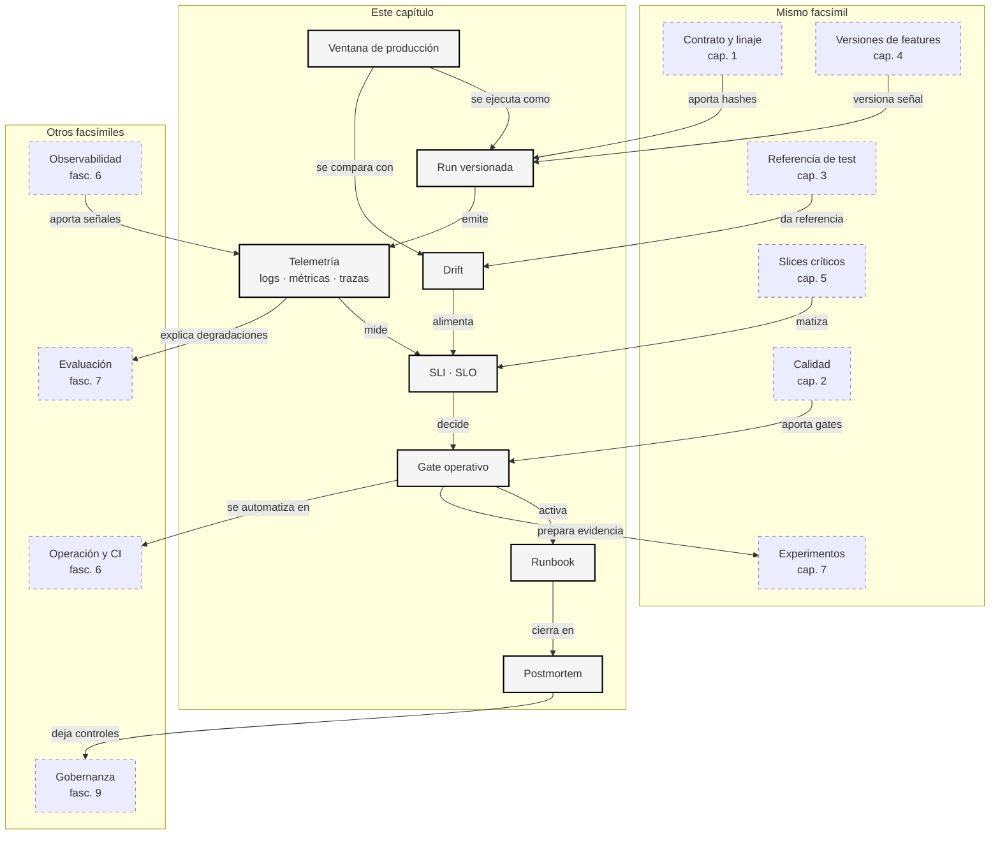

::: {.fasciculo-subtitle}
Facsímil 8 · La ciencia de los datos
:::

# Capítulo 06: DataOps: pipelines, drift y monitorización

## Qué deberías poder hacer al terminar

En el capítulo anterior vimos que una decisión no se publica solo porque tenga una métrica global aceptable. Hay que mirarla por slices, escribir gates y decidir `pass`, `review` o `block`. Ahora viene la pregunta operativa: **¿qué pasa después de publicar?**

Los datos cambian. Las colas cambian. Los idiomas cambian. Un producto nuevo concentra tráfico. Un campo deja de llegar. Una traza se pierde. Una latencia sube. La etiqueta real llega días después. Y el sistema que el lunes parecía razonable puede dejar de representar la producción del jueves.

Al terminar deberías poder hacer esto:

| Resultado de aprendizaje | Evidencia de que lo sabes hacer |
|---|---|
| Diseñar un pipeline de datos para IA. | Distingues fuente, validación, transformación, evaluación, serving y monitorización. |
| Leer una ejecución como artefacto. | Sabes qué inputs, outputs, hashes, versiones y estado debe dejar una run. |
| Definir SLIs y SLOs de datos. | Escribes indicadores medibles, objetivos y acciones cuando fallan. |
| Medir drift sin convertirlo en superstición. | Calculas distancia entre referencia y producción y decides qué revisar. |
| Conectar slices con operación. | No miras solo drift global: mides slices críticos y consecuencias. |
| Crear un runbook y un postmortem. | Dejas una guía de respuesta y una explicación técnica de la incidencia. |

La frase central:

> DataOps no es tener dashboards. Es saber qué dato cambió, qué run lo produjo, qué decisión afecta y qué acción toca.

## La escena: ayer pasaba, hoy bloquea

Imagina que el asistente académico ya está en producción. El viernes se aprobó la política de decisión: casos claros se priorizan, casos claramente normales pasan a flujo normal y casos inciertos van a revisión. El lunes todo parece estable.

El martes entra una campaña de prácticas internacionales. De repente suben los casos en inglés, casi todos con necesidad de accesibilidad, y además una parte del pipeline pierde `trace_id`. La métrica global del mes todavía no parece dramática, pero la ventana del día cuenta otra historia: más latencia, más revisión, más casos prioritarios que acaban como `normal`.

Ese es el problema que resuelve DataOps. No pregunta solo “¿funcionó el modelo?”. Pregunta:

| Pregunta operativa | Por qué importa |
|---|---|
| ¿Qué ventana cambió? | Una media mensual puede esconder un día roto. |
| ¿Qué versión de pipeline produjo los eventos? | Un cambio de código puede explicar el problema. |
| ¿Qué datos entraron? | Sin hash ni versión, no se reproduce la decisión. |
| ¿Qué slices fallan? | El daño operativo suele concentrarse. |
| ¿Hay trazas completas? | Sin `trace_id`, investigar se vuelve conjetura. |
| ¿Qué runbook se ejecuta? | Una alerta sin acción se convierte en ruido. |

## Qué no es DataOps

DataOps no es “tener un CSV limpio”. Tampoco es instalar un orquestador y dar por resuelta la operación. Un orquestador lanza jobs; no decide por sí mismo si un dataset representa producción, si un slice crítico se degradó o si una ventana debe bloquear un release.

Tampoco es guardar logs infinitos sin contrato. Si cada evento tiene mil campos pero no sabemos cuáles son obligatorios, qué SLI alimentan o quién responde cuando fallan, hemos cambiado desorden pequeño por desorden caro.

Y no es mirar drift como si fuera una alarma universal. Drift significa cambio de distribución. A veces es una incidencia; a veces es una campaña esperada; a veces es una mejora de cobertura; a veces indica que la evaluación ya no representa el uso real. La métrica abre una revisión. No sustituye el criterio.

## Qué sí es DataOps para IA

DataOps es tratar los datos, runs y artefactos como piezas operables del sistema. Esto incluye contratos, validaciones, linaje, versionado, monitorización, gates y runbooks. En IA, además, debe conectar con modelos, features, embeddings, prompts, evals, slices y decisiones.

Sculley et al. explicaron que los sistemas de ML acumulan deuda técnica por dependencias de datos, cambios no locales y realimentaciones difíciles de ver.^[Sculley, D. et al. (2015). Hidden Technical Debt in Machine Learning Systems. *NeurIPS*. https://papers.nips.cc/paper_files/paper/2015/hash/86df7dcfd896fcaf2674f757a2463eba-Abstract.html] TFX formalizó una arquitectura de producción con ingestión, validación, transformación, entrenamiento, evaluación y serving reproducibles.^[Baylor, D. et al. (2017). TFX: A TensorFlow-Based Production-Scale Machine Learning Platform. *KDD*, 1387-1395. https://doi.org/10.1145/3097983.3098021] El ML Test Score propuso que la madurez de un sistema ML se mida también por tests de datos, monitorización y gestión de cambios.^[Breck, E., Cai, S., Nielsen, E., Salib, M. y Sculley, D. (2017). The ML Test Score: A Rubric for ML Production Readiness and Technical Debt Reduction. *IEEE Big Data*, 1123-1132. https://research.google/pubs/pub46555/]

Fecha de corte: **7 de junio de 2026**. Fuentes consultadas ese día: OpenLineage, OpenTelemetry, Great Expectations, Evidently, Prometheus, Apache Airflow, Dagster, Prefect, dbt, TFX, ML Test Score y literatura de ingeniería de ML. Lo estable no es la herramienta concreta: es la obligación de versionar, medir, trazar y decidir.

## El pipeline por dentro

Un pipeline de IA no es solo “entrenar y desplegar”. Es una cadena de contratos. Ejemplo de fórmula: podemos escribirlo como una composición de funciones para recordar que cada paso transforma datos y deja un artefacto. No describe una arquitectura obligatoria; describe una disciplina de trazabilidad.

$$
A = f_k(f_{k-1}(\dots f_2(f_1(D_0))\dots))
$$

| Símbolo | Significado | Ejemplo |
|---|---|---|
| \(D_0\) | Datos de entrada originales. | Eventos de soporte académico. |
| \(f_i\) | Paso del pipeline. | Validar schema, crear features, evaluar slices. |
| \(A\) | Artefacto final de la run. | Reporte, modelo, índice, decisión o alerta. |
| \(k\) | Número de pasos encadenados. | 7 pasos desde ingesta hasta gate. |

La clave es que cada paso debe dejar evidencia:

| Paso | Entrada | Salida | Evidencia mínima |
|---|---|---|---|
| Ingesta | Fuente externa o interna. | Snapshot controlado. | `source_id`, timestamp, hash. |
| Validación | Snapshot. | Reporte de calidad. | Checks, columnas, valores inválidos. |
| Transformación | Datos válidos. | Features, chunks o embeddings. | Versión de código, parámetros, hashes. |
| Evaluación | Predicciones o outputs. | Métricas y slices. | Dataset, política, umbrales, intervalos. |
| Gate | Métricas. | `pass`, `review` o `block`. | Regla exacta y motivo. |
| Serving | Modelo o política. | Decisiones. | `trace_id`, versión, latencia. |
| Monitorización | Eventos de producción. | Alertas y scorecard. | SLI, SLO, runbook, owner. |

OpenLineage propone un estándar abierto para capturar metadatos de runs, jobs y datasets en componentes de pipeline.^[OpenLineage. (2026). *OpenLineage Documentation*. https://openlineage.io/docs/. Consultado el 7 de junio de 2026.] OpenTelemetry define señales de observabilidad como trazas, métricas y logs; una traza permite seguir una operación por spans, una métrica mide valores agregados y un log registra eventos.^[OpenTelemetry. (2026). *Traces*. https://opentelemetry.io/docs/concepts/signals/traces/. Consultado el 7 de junio de 2026.]^[OpenTelemetry. (2026). *Metrics*. https://opentelemetry.io/docs/concepts/signals/metrics/. Consultado el 7 de junio de 2026.]^[OpenTelemetry. (2026). *Logs*. https://opentelemetry.io/docs/concepts/signals/logs/. Consultado el 7 de junio de 2026.]

En términos prácticos:

| Señal | Qué contesta | Ejemplo en IA |
|---|---|---|
| Log | Qué ocurrió. | “Evento p013 llegó sin `trace_id`”. |
| Métrica | Cuánto ocurre. | `missing_trace_rate = 0.1`. |
| Traza | Por dónde pasó. | Ingesta → validación → decisión → revisión. |
| Linaje | De dónde viene y qué produjo. | `production_events.csv` → `monitoring_report.json`. |
| Runbook | Qué hacer ahora. | Revisar pipeline `pipe-1.4.2`, idioma `en`, slice `access_need=si`. |

## Patrones de arquitectura de pipeline

Un ingeniero de software no debería quedarse en “tengo un script”. La pregunta es qué garantías necesita ese script cuando se ejecuta todos los días, con datos que cambian y con personas dependiendo de sus salidas.

| Patrón | Qué resuelve | Riesgo si no lo diseñas |
|---|---|---|
| Batch | Procesar ventanas cerradas. | Repetir una ventana y obtener otra decisión sin saber por qué. |
| Streaming | Procesar eventos conforme llegan. | Mezclar eventos tardíos, duplicados o incompletos. |
| Checkpoint | Recordar hasta dónde llegó una run. | Reprocesar a ciegas o perder eventos. |
| Backfill | Recalcular ventanas antiguas. | Cambiar histórico sin versionar pipeline, datos y contrato. |
| Replay | Reproducir eventos con una versión concreta. | No poder depurar una decisión pasada. |
| Retry | Reintentar un paso fallido. | Duplicar efectos si no hay idempotencia. |
| Canary | Probar una versión en una parte controlada. | Publicar un cambio a toda producción sin señal temprana. |
| Shadow mode | Ejecutar una versión sin afectar la decisión. | Confundir evaluación silenciosa con decisión real. |

Apache Airflow organiza workflows como DAGs con tareas y dependencias.^[Apache Airflow. (2026). *Core Concepts*. https://airflow.apache.org/docs/apache-airflow/stable/core-concepts/. Consultado el 7 de junio de 2026.] Dagster enfatiza assets definidos por software, linaje, observabilidad y testabilidad.^[Dagster. (2026). *Dagster documentation*. https://docs.dagster.io/getting-started. Consultado el 7 de junio de 2026.] Prefect documenta deployments con metadatos de ejecución remota, versiones y configuración, y también retries configurables por workflow o tarea.^[Prefect. (2026). *Deployments*. https://docs.prefect.io/concepts/deployments. Consultado el 7 de junio de 2026.]^[Prefect. (2026). *How to automatically rerun your workflow when it fails*. https://docs.prefect.io/v3/how-to-guides/workflows/retries. Consultado el 7 de junio de 2026.]

La herramienta importa menos que el contrato de ejecución:

| Decisión de diseño | Pregunta que debes responder |
|---|---|
| Orquestador | ¿Quién lanza la run, con qué parámetros y dónde queda su estado? |
| Idempotencia | ¿Qué clave evita duplicar una decisión si se reintenta? |
| Retries | ¿Qué pasos se pueden repetir y cuáles requieren revisión manual? |
| Backfill | ¿Qué versión de datos, código y contrato se usa para recalcular? |
| Checkpoint | ¿Qué pasa si una run cae a mitad? |
| Output | ¿La salida se escribe una vez, se sobreescribe o se versiona? |
| Rollback | ¿Cómo volvemos a una política anterior sin perder trazabilidad? |

Idempotencia merece una explicación propia. Una operación es idempotente si repetirla produce el mismo efecto observable que ejecutarla una vez. En pipelines de IA, la clave suele ser algo como:

```text
idempotency_key = window + event_id
```

Si una tarea falla después de emitir una decisión y se reintenta sin esa clave, puedes duplicar un caso, mandar dos revisiones humanas o contar dos veces una alerta. Esto no es un detalle de plataforma: es ingeniería de software aplicada al dato.

## Contratos entre servicios y evolución de schema

En capítulos anteriores hablamos de contrato de datos. Aquí ampliamos la idea: un pipeline de producción tiene contratos entre productores y consumidores. El productor promete columnas, tipos, semántica, frecuencia y trazabilidad. El consumidor promete cómo usará esos campos y qué cambios acepta.

dbt model contracts permiten declarar y hacer cumplir columnas, tipos y restricciones en modelos dbt.^[dbt Labs. (2026). *Model contracts*. https://docs.getdbt.com/docs/mesh/govern/model-contracts. Consultado el 7 de junio de 2026.] Great Expectations organiza expectativas verificables sobre datos. OpenLineage conecta jobs y datasets. OpenTelemetry conecta ejecución y trazas. Son capas distintas de la misma idea: **un cambio no debería romper al consumidor en silencio**.

| Cambio | Compatible | Requiere revisión | Rompe |
|---|---|---|---|
| Añadir columna opcional | Sí | Si afecta coste o privacidad. | No. |
| Añadir valor nuevo a catálogo | A veces. | Sí, si cambia slices o política. | Si el consumidor no lo acepta. |
| Renombrar columna obligatoria | No. | Sí. | Sí, salvo alias versionado. |
| Cambiar significado de `decision` | No. | Sí. | Sí. |
| Quitar `trace_id` | No. | Sí. | Sí. |
| Subir un SLO | Sí. | Sí, si bloquea más ventanas. | No necesariamente. |

Un contrato de evolución debería declarar:

| Pieza | Ejemplo |
|---|---|
| Compatibilidad hacia atrás | La versión nueva acepta datos de la versión anterior. |
| Compatibilidad hacia delante | La versión anterior puede ignorar campos nuevos opcionales. |
| Deprecación | Campo permitido hasta una fecha o versión. |
| Aliases | `student_profile` puede aceptar temporalmente `profile`. |
| Campo obligatorio | `trace_id` no se puede quitar. |
| Política de rollback | Volver a `pipe-1.4.1` conserva outputs y hashes. |

## Observabilidad correlacionada

La observabilidad de IA no consiste en guardar un log grande. Consiste en poder saltar de una alerta a los eventos concretos y de ahí a la traza que explica dónde se degradó.

Una traza mínima de decisión debería poder responder:

| Campo | Por qué importa |
|---|---|
| `trace_id` | Une logs, métricas, spans y evento final. |
| `event_id` | Identifica la unidad de decisión. |
| `pipeline_version` | Distingue cambio de código de cambio de datos. |
| `model_version` | Permite comparar comportamiento por versión. |
| `data_version` | Evita investigar con otro snapshot. |
| `policy_version` | Explica por qué el mismo score acabó en otra decisión. |
| `span_name` | Localiza ingesta, validación, scoring, decisión o emisión. |
| `duration_ms` | Separa problema de calidad de problema de latencia. |

En el kit, el contrato de ingeniería exige spans `ingest`, `validate`, `score`, `decide` y `emit`. El evento `p013` no tiene `trace_id`. El evento `p017` tiene traza, pero le falta `emit`. Los eventos `p011`, `p012` y `p017` muestran `score` lento. Esa correlación permite decir algo concreto: la ventana `2026-06-08` no solo cambió de distribución; también llegó peor instrumentada y más lenta.

| Evento | Ventana | Señal |
|---|---|---|
| `p011` | `2026-06-08` | Traza total `710 ms`, `score` lento. |
| `p012` | `2026-06-08` | Traza total `755 ms`, `score` lento. |
| `p013` | `2026-06-08` | Sin `trace_id`. |
| `p017` | `2026-06-08` | Falta span `emit`, `score` lento. |

Sin esta correlación, el equipo podría culpar al modelo, al dato o al usuario sin evidencia suficiente. Con trazas, la pregunta cambia: ¿qué parte del pipeline cambió entre `pipe-1.4.1` y `pipe-1.4.2`?

## Testing de pipelines de IA

Un pipeline de IA necesita tests, pero no todos los tests son iguales. Un test unitario puede comprobar que una función calcula una media. Eso es necesario, pero insuficiente. En producción también hay que probar contratos, ventanas, trazabilidad, linaje, regresiones por slices y comportamiento operativo.

| Tipo de test | Qué comprueba | Ejemplo útil |
|---|---|---|
| Unitario | Una función aislada. | `total_variation_distance(P, Q)` devuelve `0.8` en un caso conocido. |
| Contract test | Productor y consumidor hablan el mismo idioma. | `trace_id`, `event_id`, `decision`, `latency_ms` y `window` existen y tienen tipo esperado. |
| Data quality test | La ventana tiene datos válidos. | No hay nulos en campos obligatorios, catálogos permitidos y rangos razonables. |
| Lineage test | La run conserva procedencia. | Los hashes de inputs y outputs quedan escritos en `lineage_event.json`. |
| Regression test | Una versión nueva no empeora una referencia. | `pipe-1.4.2` no reduce captura segura frente a `pipe-1.4.1`. |
| Slice test | No se esconde un fallo en la media. | `language=en` y `access_need=si` mantienen SLO propio. |
| Trace test | La operación se puede investigar. | Cada evento crítico tiene spans `ingest`, `validate`, `score`, `decide` y `emit`. |
| Replay test | Se puede reproducir una ventana. | Reejecutar `2026-06-08` con la misma versión produce la misma decisión. |

El error típico es probar solo el código y no probar el sistema. En IA, el sistema incluye datos, contratos, scheduler, runtime, versión de modelo, política de decisión, evals, slices y observabilidad. Por eso el ML Test Score no se limita a accuracy: pregunta por tests de datos, monitorización, cambios y dependencia de features.^[Breck, E., Cai, S., Nielsen, E., Salib, M. y Sculley, D. (2017). The ML Test Score: A Rubric for ML Production Readiness and Technical Debt Reduction. *IEEE Big Data*, 1123-1132. https://research.google/pubs/pub46555/]

Para un equipo de ingeniería, una regla práctica sería esta:

```text
No hay release de pipeline si no pasan:
1. contrato de datos,
2. contrato de trazas,
3. replay de una ventana conocida,
4. scorecard de slices críticos,
5. evento de linaje con hashes.
```

Esto parece mucho hasta que ocurre la primera incidencia real. Entonces descubres que esos cinco puntos no son burocracia: son la diferencia entre investigar en una hora o discutir durante días.

## Drift, SLI, SLO y presupuesto de error

El drift se mide comparando una distribución de referencia \(P\) con una distribución actual \(Q\). Una medida sencilla es la distancia de variación total:

$$
TV(P,Q)=\frac{1}{2}\sum_{c\in C}|P(c)-Q(c)|
$$

| Símbolo | Significado | Ejemplo |
|---|---|---|
| \(P\) | Distribución de referencia. | Idiomas durante validación. |
| \(Q\) | Distribución actual. | Idiomas del 8 de junio de 2026. |
| \(C\) | Categorías posibles. | `es`, `ca`, `en`. |
| \(P(c)\) | Proporción de la categoría \(c\) en referencia. | `en = 0.2`. |
| \(Q(c)\) | Proporción de la categoría \(c\) en producción. | `en = 1.0`. |
| \(TV(P,Q)\) | Distancia entre 0 y 1. | `0.8`, cambio fuerte. |

También se usa PSI:

$$
PSI(P,Q)=\sum_{c\in C}(Q(c)-P(c))\log\frac{Q(c)}{P(c)}
$$

| Símbolo | Significado | Ejemplo |
|---|---|---|
| \(PSI\) | Índice de estabilidad poblacional. | `11.711575` para `language`. |
| \(\log\) | Logaritmo natural. | Penaliza cambios grandes de proporción. |
| \(Q(c)-P(c)\) | Diferencia de proporciones. | `en` sube mucho. |

Pero drift no es lo único. Para operar necesitamos SLIs y SLOs.

| Concepto | Definición | Ejemplo |
|---|---|---|
| SLI | Indicador medible. | `latency_p95_ms`, `miss_rate`, `missing_trace_rate`. |
| SLO | Objetivo sobre un SLI. | `latency_p95_ms <= 650`. |
| Presupuesto de error | Margen tolerado antes de frenar cambios. | Si `miss_rate > 0.12`, no se aumenta automatización. |
| Gate | Regla que convierte SLOs en estado. | `block` si falta trazabilidad o cae captura segura. |

Prometheus insiste en que los nombres de métricas deben ser claros, consistentes y expresar unidades cuando aplica.^[Prometheus. (2026). *Metric and label naming*. https://prometheus.io/docs/practices/naming/. Consultado el 7 de junio de 2026.] Eso parece menor hasta que tienes que investigar una alerta a las 9 de la mañana. `latency` es ambiguo; `decision_latency_p95_ms` dice mucho más.

## Arquitectura operativa de un sistema de datos para IA

<figure class="book-figure">
<svg viewBox="0 0 1440 980" role="img" aria-labelledby="f8-c06-title f8-c06-desc" xmlns="http://www.w3.org/2000/svg">
  <title id="f8-c06-title">Anatomía de un pipeline DataOps para IA</title>
  <desc id="f8-c06-desc">Diagrama en blanco y negro que conecta fuentes, contrato, validación, transformación, evaluación, serving, telemetría, drift, gates y runbook.</desc>
  <style>
    .box { fill: #fff; stroke: #111; stroke-width: 1.5; }
    .soft { fill: #f6f6f6; stroke: #111; stroke-width: 1.2; }
    .dark { fill: #111; stroke: #111; stroke-width: 1.5; }
    .text { font: 700 25px Inter, Arial, sans-serif; fill: #111; }
    .small { font: 500 17px Inter, Arial, sans-serif; fill: #222; }
    .tiny { font: 500 13px Inter, Arial, sans-serif; fill: #666; }
    .white { font: 700 21px Inter, Arial, sans-serif; fill: #fff; }
    .line { fill: none; stroke: #111; stroke-width: 1.6; marker-end: url(#arrow); }
    .dash { fill: none; stroke: #555; stroke-width: 1.4; stroke-dasharray: 7 6; marker-end: url(#arrow); }
  </style>
  <defs>
    <marker id="arrow" viewBox="0 0 10 10" refX="9" refY="5" markerWidth="7" markerHeight="7" orient="auto-start-reverse">
      <path d="M 0 0 L 10 5 L 0 10 z" fill="#111"/>
    </marker>
  </defs>

  <rect x="60" y="50" width="1320" height="860" rx="22" fill="#fff" stroke="#ddd"/>
  <text class="text" x="90" y="100">DataOps en IA: de evento a decisión operativa</text>
  <text class="tiny" x="90" y="128">Cada caja debe dejar artefacto, versión y owner.</text>

  <rect class="dark" x="90" y="175" width="210" height="58" rx="12"/>
  <text class="white" x="195" y="211" text-anchor="middle">Fuentes</text>
  <rect class="soft" x="90" y="245" width="210" height="126" rx="12"/>
  <text class="small" x="112" y="286">tickets</text>
  <text class="small" x="112" y="316">documentos</text>
  <text class="small" x="112" y="346">eventos</text>

  <rect class="dark" x="360" y="175" width="230" height="58" rx="12"/>
  <text class="white" x="475" y="211" text-anchor="middle">Contrato</text>
  <rect class="box" x="360" y="245" width="230" height="126" rx="12"/>
  <text class="small" x="382" y="286">schema</text>
  <text class="small" x="382" y="316">valores permitidos</text>
  <text class="small" x="382" y="346">SLOs</text>

  <rect class="dark" x="650" y="175" width="230" height="58" rx="12"/>
  <text class="white" x="765" y="211" text-anchor="middle">Run</text>
  <rect class="box" x="650" y="245" width="230" height="126" rx="12"/>
  <text class="small" x="672" y="286">hash inputs</text>
  <text class="small" x="672" y="316">versión pipeline</text>
  <text class="small" x="672" y="346">outputs</text>

  <rect class="dark" x="940" y="175" width="230" height="58" rx="12"/>
  <text class="white" x="1055" y="211" text-anchor="middle">Gate</text>
  <rect class="box" x="940" y="245" width="230" height="126" rx="12"/>
  <text class="small" x="962" y="286">pass</text>
  <text class="small" x="962" y="316">review</text>
  <text class="small" x="962" y="346">block</text>

  <path class="line" d="M300 308 H360"/>
  <path class="line" d="M590 308 H650"/>
  <path class="line" d="M880 308 H940"/>

  <rect class="soft" x="130" y="470" width="260" height="136" rx="14"/>
  <text class="text" x="160" y="512">Telemetría</text>
  <text class="small" x="160" y="548">logs · métricas · trazas</text>
  <text class="small" x="160" y="578">trace_id obligatorio</text>

  <rect class="soft" x="470" y="470" width="260" height="136" rx="14"/>
  <text class="text" x="500" y="512">Drift</text>
  <text class="small" x="500" y="548">TV · PSI</text>
  <text class="small" x="500" y="578">referencia vs ventana</text>

  <rect class="soft" x="810" y="470" width="260" height="136" rx="14"/>
  <text class="text" x="840" y="512">Slices</text>
  <text class="small" x="840" y="548">idioma · acceso</text>
  <text class="small" x="840" y="578">producto crítico</text>

  <rect class="soft" x="1130" y="470" width="220" height="136" rx="14"/>
  <text class="text" x="1160" y="512">Runbook</text>
  <text class="small" x="1160" y="548">owner</text>
  <text class="small" x="1160" y="578">acción y salida</text>

  <path class="dash" d="M765 371 C765 430 260 420 260 470"/>
  <path class="dash" d="M765 371 C765 430 600 420 600 470"/>
  <path class="dash" d="M1055 371 C1055 425 940 430 940 470"/>
  <path class="line" d="M1070 538 H1130"/>
  <path class="line" d="M730 538 H810"/>
  <path class="line" d="M390 538 H470"/>

  <rect class="box" x="225" y="720" width="980" height="96" rx="16"/>
  <text class="text" x="255" y="760">Decisión operativa</text>
  <text class="small" x="255" y="792">no aumentar automatización · revisar ventana · corregir trazabilidad · conservar evidencia</text>
  <path class="line" d="M1240 606 C1240 690 715 670 715 720"/>

  <text class="tiny" x="1368" y="875" text-anchor="end" fill="#888888" opacity="0.55">IA para gente curiosa / Facsímil 08 / Capítulo 06 / 686f6c61</text>
</svg>
<figcaption>Un pipeline DataOps convierte eventos en evidencia: contrato, run, telemetría, drift, slices, gate y runbook.</figcaption>
</figure>

## Cómo se ve en producción

En producción trabajamos con ventanas. Una ventana puede ser un día, una hora, un batch, una versión de modelo, una campaña o un segmento de tráfico. La ventana es importante porque las medias largas esconden problemas cortos.

En el kit del capítulo, la ventana `2026-06-07` pasa. La ventana `2026-06-08` bloquea.

| Ventana | Estado | n | Trace faltante | Latencia p95 | Revisión | Pérdida | Captura segura | Flags |
|---|---|---:|---:|---:|---:|---:|---:|---:|
| 2026-06-07 | `pass` | 10 | 0.0 | 590.0 | 0.4 | 0.0 | 1.0 | 0 |
| 2026-06-08 | `block` | 10 | 0.1 | 760.0 | 0.7 | 0.6 | 0.4 | 15 |

La segunda ventana no bloquea por una sola razón. Bloquea porque varias señales coinciden:

| Señal | Lectura |
|---|---|
| `missing_trace_rate = 0.1` | Falta trazabilidad; una investigación quedaría incompleta. |
| `latency_p95_ms = 760` | La ventana supera el SLO de latencia. |
| `miss_rate = 0.6` | Demasiados casos prioritarios pasan a flujo normal. |
| `safety_capture = 0.4` | La política ya no captura de forma segura los casos importantes. |
| Drift en `language` y `access_need` | Producción se aleja mucho de la referencia. |
| Slices críticos fallan | `language=en`, `access_need=si` y `product=practicas` concentran señales. |

Aquí se ve la diferencia entre dashboard y operación. Un dashboard muestra números. Un gate operativo dice: **no aumentes automatización ni uses esta ventana para reentrenar sin investigar**.

## Incidentes, postmortems y acciones correctivas

Cuando una ventana queda en `block`, el trabajo no termina en “hay alerta”. Empieza la parte profesional: reconstruir impacto, señales, causa probable, acción correctiva y criterio de cierre. El postmortem no busca repartir culpa. Busca impedir que el mismo patrón vuelva a repetirse sin que el sistema lo detecte.

Un postmortem técnico mínimo debería incluir:

| Bloque | Pregunta que responde | Ejemplo del kit |
|---|---|---|
| Resumen | ¿Qué estado queda y qué se bloquea? | `Estado de ingeniería: block`. |
| Impacto | ¿Qué decisión queda afectada? | No aumentar automatización en `2026-06-08`. |
| Timeline | ¿Qué scripts y señales detectaron el problema? | `monitor_dataops.py` y `inspect_pipeline_engineering.py`. |
| Señales | ¿Qué eventos concretos fallaron? | `p013` sin `trace_id`, `p017` sin `emit`. |
| Causa probable | ¿Qué explicación encaja con la evidencia? | Cambio de distribución más trazabilidad incompleta y `score` lento. |
| Acción correctiva | ¿Qué se cambia en código, contrato o operación? | Hacer `trace_id` bloqueante y añadir test de spans. |
| Criterio de cierre | ¿Cómo sabemos que está resuelto? | Replay con trazas completas y scorecard sin `block`. |

El detalle importante es que cada acción correctiva debe convertirse en una defensa técnica. Si el problema fue una columna obligatoria ausente, añade un contract test. Si fue una traza incompleta, añade un trace test. Si fue un retry que duplicó efectos, añade clave de idempotencia. Si fue una ventana de datos rota, añade un gate que impida usarla para reentrenamiento.

| Problema detectado | Acción pobre | Acción de ingeniería |
|---|---|---|
| Falta `trace_id` | “Mirarlo manualmente”. | Bloquear emisión si falta `trace_id` en eventos críticos. |
| Span `score` lento | “Optimizar algo”. | Medir p95 por versión y crear SLO por span. |
| Slice crítico degradado | “Avisar al equipo”. | Añadir SLO por slice y replay de la ventana. |
| Drift fuerte | “Reentrenar rápido”. | Separar drift esperado, drift operativo y datos no aptos. |
| Backfill de histórico | “Recalcular y ya”. | Congelar versión de código, contrato, datos y política. |

Un postmortem útil también deja una decisión negativa explícita: **qué no se va a hacer**. En el kit, no se usa `2026-06-08` para aumentar automatización ni para reentrenar hasta que el gate cierre. Esa frase protege al equipo de convertir datos dudosos en verdad operativa.

## Por qué debería importarte

Si no entiendes DataOps, puedes tomar malas decisiones con muy buena intención. Puedes reentrenar con una ventana rota. Puedes comparar modelos con datos que ya no representan producción. Puedes ignorar un slice crítico porque la media global parece estable. Puedes perder trazas justo cuando más las necesitas.

La operación de IA necesita una idea incómoda: el modelo no vive solo. Vive dentro de contratos, datos, versiones, colas, revisiones humanas, latencia, permisos, trazas y decisiones de producto.

## Manos a la obra

El kit del capítulo está en:

```text
labs/f8/c06-dataops-monitoring/
```

### Estructura

```text
labs/f8/c06-dataops-monitoring/
  README.md
  data/reference_events.csv
  data/production_events.csv
  contracts/monitoring_contract.json
  contracts/pipeline_engineering_contract.json
  contracts/runbook.md
  data/trace_spans.csv
  ops/monitor_dataops.py
  ops/inspect_pipeline_engineering.py
  output/monitoring_report.json
  output/slo_scorecard.csv
  output/alerts.md
  output/operational_decision.md
  output/lineage_event.json
  output/trace_correlation_report.json
  output/trace_scorecard.csv
  output/incident_postmortem.md
```

### Cómo lo ejecutas

```bash
cd labs/f8/c06-dataops-monitoring
python3 ops/monitor_dataops.py --write
cat output/operational_decision.md
cat output/alerts.md
python3 -m json.tool output/monitoring_report.json
python3 ops/inspect_pipeline_engineering.py --write
cat output/incident_postmortem.md
python3 -m json.tool output/trace_correlation_report.json
```

### Qué deberías ver

El estado global queda en `block` porque la ventana `2026-06-08` incumple el contrato:

```text
Estado global: block
2026-06-07: pass
2026-06-08: block
```

Los artefactos importantes son:

| Archivo | Qué demuestra |
|---|---|
| `monitoring_report.json` | Reporte completo para CI o pipeline. |
| `slo_scorecard.csv` | Scorecard por ventana con SLIs principales. |
| `alerts.md` | Lectura humana de señales y umbrales. |
| `operational_decision.md` | Decisión operativa defendible. |
| `lineage_event.json` | Run, inputs, outputs y hashes. |
| `runbook.md` | Qué hacer cuando la ventana falla. |
| `trace_correlation_report.json` | Qué eventos tienen traza, qué spans faltan y qué spans superan SLO. |
| `trace_scorecard.csv` | Tabla por evento para depurar la operación. |
| `incident_postmortem.md` | Postmortem generado desde evidencia, no desde memoria. |

La segunda herramienta (`inspect_pipeline_engineering.py`) debe detectar:

| Señal | Valor esperado | Lectura |
|---|---:|---|
| Eventos revisados | `20` | Todas las decisiones de producción entran en el análisis. |
| Eventos que requieren detalle de spans | `5` | No todo evento necesita spans completos, pero los críticos sí. |
| Eventos sin traza | `1` | `p013` no se puede investigar bien. |
| Eventos con spans obligatorios faltantes | `1` | `p017` no emitió todo el recorrido esperado. |
| Claves de idempotencia duplicadas | `0` | Reintentar no duplicó decisiones en este dataset. |
| Estado de ingeniería | `block` | La ventana no está lista para automatizar más. |

### Cómo lo adaptarías

| Si tu sistema es... | Cambia esto |
|---|---|
| Un RAG documental | Slices por fuente, versión de documento, idioma y permisos. |
| Un clasificador de tickets | Slices por producto, canal, equipo y severidad. |
| Un agente con herramientas | Slices por herramienta, estado, tipo de tarea y resultado. |
| Un modelo local | Añade memoria, batch, saturación y versión de runtime. |
| Una API cloud | Añade proveedor, región, coste, latencia y modelo servido. |

### Qué entregaría un alumno

1. `operational_decision.md` generado.
2. `slo_scorecard.csv` interpretado con sus palabras.
3. Un cambio razonado en `monitoring_contract.json`.
4. Un cambio razonado en `pipeline_engineering_contract.json`.
5. Un nuevo SLI por slice para su proyecto.
6. Una adaptación de `runbook.md` con owner, acción y criterio de salida.
7. Una explicación de por qué la ventana `2026-06-08` no debe usarse para aumentar automatización.
8. Un postmortem que convierta el fallo en una acción verificable.
9. Un test nuevo que habría impedido repetir el problema.

## Cómo encaja todo

Este mapa se lee como continuidad del facsímil. Los capítulos 01 a 05 construyeron contrato, calidad, split, representación y slices. Este capítulo convierte esas piezas en operación: ventanas, SLIs, SLOs, drift, trazas, linaje y runbooks.

La decisión que enseña no es “qué modelo elegir”. Es más básica y más profesional: **qué ventana de producción es apta para seguir tomando decisiones y cuál exige revisión**. Después, el capítulo 07 usará esta evidencia para análisis aplicado, experimentos y causalidad.



## Vocabulario aprendido

| Término | Definición breve |
|---|---|
| DataOps | Operar datos como producto versionado, verificable y monitorizable. |
| Pipeline | Secuencia reproducible de pasos que transforma entradas en artefactos. |
| Run | Ejecución concreta con inputs, outputs, versiones, hashes y estado. |
| Drift | Cambio medible entre referencia y producción. |
| SLI | Indicador medible. |
| SLO | Objetivo sobre un SLI. |
| Presupuesto de error | Margen permitido antes de frenar cambios. |
| Trace ID | Identificador que permite seguir una operación por el sistema. |
| Runbook | Guía de acción cuando una alerta o gate falla. |
| Gate operativo | Regla que convierte señales en `pass`, `review` o `block`. |
| Idempotencia | Propiedad que permite repetir una operación sin duplicar efectos. |
| Backfill | Reprocesado de ventanas antiguas con versión controlada de datos, código y contrato. |
| Replay | Reejecución de una ventana para reproducir o comparar una decisión. |
| Span | Tramo de una traza que representa un paso medible de una operación. |
| Contract test | Test que verifica que productor y consumidor cumplen el contrato pactado. |
| Postmortem | Documento técnico que convierte una incidencia en acciones verificables. |

## Dónde solía tropezar yo

| Tropiezo | Por qué ocurre | Antídoto |
|---|---|---|
| Mirar solo métricas globales | La media da sensación de control. | Medir ventanas y slices críticos. |
| Confundir drift con fallo automático | Un cambio puede ser esperado. | Revisar causa, contexto y consecuencia. |
| No exigir `trace_id` | Parece detalle de logging. | Tratar trazabilidad como SLO bloqueante. |
| Tener alerta sin runbook | El dashboard avisa, pero nadie sabe qué hacer. | Escribir owner, acción y criterio de salida. |
| Reentrenar con producción rota | Se intenta arreglar rápido. | Bloquear ventanas con gate `block`. |
| Reintentar sin idempotencia | Se piensa que retry siempre es inocente. | Definir `idempotency_key` antes de automatizar retries. |
| Hacer backfill sin congelar versión | Parece solo recalcular. | Guardar datos, código, contrato, política y hashes. |
| Escribir postmortem sin test nuevo | Se documenta el problema, pero no se evita repetirlo. | Cada postmortem debe cerrar con una defensa verificable. |

## Antes de pasar página

Antes de avanzar, deberías poder responder:

1. ¿Qué diferencia hay entre pipeline y run?
2. ¿Por qué una ventana corta puede contar más que una media larga?
3. ¿Qué mide `missing_trace_rate` y por qué puede bloquear?
4. ¿Qué diferencia hay entre log, métrica y traza?
5. ¿Qué mide la distancia de variación total?
6. ¿Qué mide PSI y por qué no se lee sin contexto?
7. ¿Qué es un SLI?
8. ¿Qué es un SLO?
9. ¿Qué significa presupuesto de error?
10. ¿Por qué `2026-06-08` queda en `block` en el kit?
11. ¿Qué hace `lineage_event.json`?
12. ¿Qué debe contener un runbook útil?
13. ¿Qué slices críticos monitorizarías en tu proyecto?
14. ¿Por qué no deberías reentrenar con una ventana rota?
15. ¿Por qué un retry sin idempotencia puede duplicar efectos?
16. ¿Qué diferencia hay entre backfill y replay?
17. ¿Qué comprobaría un contract test de trazas?
18. ¿Qué acción correctiva añadirías al postmortem del kit?
19. ¿Cómo conecta este capítulo con análisis aplicado?

## En resumen

| Idea | Qué te llevas |
|---|---|
| DataOps es operación, no decoración. | Contratos, runs, hashes, gates y runbooks sostienen el sistema. |
| El drift abre investigación. | Un cambio de distribución no se interpreta sin contexto ni consecuencia. |
| Los SLOs deben ser medibles. | `latency_p95_ms <= 650` es operativo; “que vaya bien” no lo es. |
| La trazabilidad puede bloquear. | Sin `trace_id`, no hay investigación fiable. |
| Los slices siguen vivos en producción. | Lo que se auditó en test debe monitorizarse después. |
| Un gate protege decisiones. | Evita aumentar automatización o reentrenar con ventanas rotas. |
| Los retries necesitan idempotencia. | Repetir una tarea no debe duplicar decisiones ni alertas. |
| Un postmortem debe crear una defensa. | La acción correctiva se traduce en test, contrato o gate. |

## Para saber más

Baylor, D., Breck, E., Cheng, H.-T., Fiedel, N., Foo, C. Y., Haque, Z., Haykal, S., Ispir, M., Jain, V., Koc, L., Koo, C. Y., Lew, L., Mewald, C., Modi, A. N., Polyzotis, N., Ramesh, S., Roy, S., Whang, S. E., Wicke, M., Wilkiewicz, J., Zhang, X. y Zinkevich, M. (2017). TFX: A TensorFlow-Based Production-Scale Machine Learning Platform. *KDD*, 1387-1395. [DOI](https://doi.org/10.1145/3097983.3098021)

Breck, E., Cai, S., Nielsen, E., Salib, M. y Sculley, D. (2017). The ML Test Score: A Rubric for ML Production Readiness and Technical Debt Reduction. *IEEE Big Data*, 1123-1132. [Google Research](https://research.google/pubs/pub46555/)

Apache Airflow. (2026). Core Concepts. [Documentación](https://airflow.apache.org/docs/apache-airflow/stable/core-concepts/)

Dagster. (2026). Dagster documentation. [Documentación](https://docs.dagster.io/getting-started)

dbt Labs. (2026). Model contracts. [Documentación](https://docs.getdbt.com/docs/mesh/govern/model-contracts)

Evidently AI. (2026). Data Drift Documentation. [Documentación](https://docs.evidentlyai.com/metrics/explainer_drift)

Great Expectations. (2026). Expectations Overview. [Documentación](https://docs.greatexpectations.io/docs/cloud/expectations/expectations_overview/)

OpenLineage. (2026). OpenLineage Documentation. [Documentación](https://openlineage.io/docs/)

OpenTelemetry. (2026). Logs. [Documentación](https://opentelemetry.io/docs/concepts/signals/logs/)

OpenTelemetry. (2026). Metrics. [Documentación](https://opentelemetry.io/docs/concepts/signals/metrics/)

OpenTelemetry. (2026). Traces. [Documentación](https://opentelemetry.io/docs/concepts/signals/traces/)

Prefect. (2026). Deployments. [Documentación](https://docs.prefect.io/concepts/deployments)

Prefect. (2026). How to automatically rerun your workflow when it fails. [Documentación](https://docs.prefect.io/v3/how-to-guides/workflows/retries)

Prometheus. (2026). Metric and label naming. [Documentación](https://prometheus.io/docs/practices/naming/)

Sculley, D. et al. (2015). Hidden Technical Debt in Machine Learning Systems. *NeurIPS*. [Paper](https://papers.nips.cc/paper_files/paper/2015/hash/86df7dcfd896fcaf2674f757a2463eba-Abstract.html)
