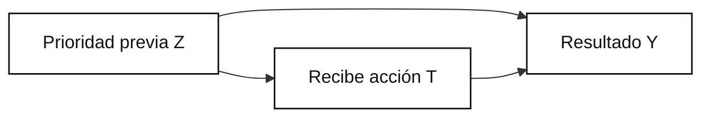
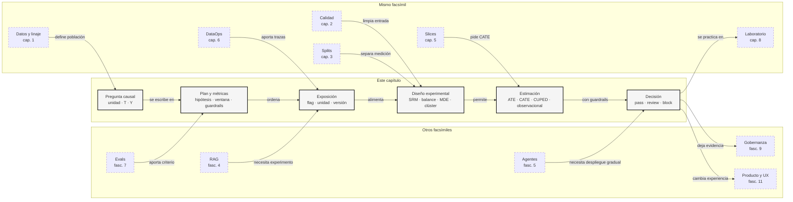

::: {.fasciculo-subtitle}
Facsímil 8 · La ciencia de los datos
:::

# Capítulo 07: Análisis aplicado: experimentos, causalidad y decisión

## Qué deberías poder hacer al terminar

En el capítulo anterior aprendimos a operar datos: ventanas, drift, trazas, SLOs, gates y postmortems. Eso nos protege de tomar decisiones con datos rotos. Ahora damos el siguiente paso: **decidir si una acción cambia algo**.

Esta es una de las fronteras más importantes para cualquier persona que trabaja con IA. Un modelo puede predecir que un estudiante no resolverá su trámite a tiempo. Pero otra pregunta mucho más difícil es: ¿qué acción aumenta realmente la probabilidad de resolverlo? ¿Enviar una plantilla? ¿Escalarlo? ¿Cambiar el orden de cola? ¿Dar un mensaje más claro? ¿Nada?

Al terminar deberías poder hacer esto:

| Resultado de aprendizaje | Evidencia de que lo sabes hacer |
|---|---|
| Separar predicción de intervención. | No usas un score predictivo como prueba de efecto causal. |
| Escribir una pregunta causal. | Distingues tratamiento, control, resultado, unidad y población. |
| Diseñar un experimento mínimo. | Defines asignación, métrica primaria, guardrails, tamaño y criterio de decisión. |
| Leer un A/B test como artefacto de ingeniería. | Buscas SRM, balance, slices, intervalos y trazabilidad. |
| Diseñar una plataforma mínima de experimento. | Separas flag, contexto, exposición, métricas, análisis y release gate. |
| Calcular readiness estadístico. | Escribes MDE, alpha, potencia, muestra y política de peeking. |
| Entender ATE, CATE y uplift. | Sabes cuándo importa el efecto medio y cuándo importa el efecto por segmento. |
| Auditar datos observacionales con cuidado. | No cierras una conclusión causal si falta solapamiento o hay confounding. |
| Generar una decisión reproducible. | Dejas reportes, scorecards y una decisión versionada. |

La frase central:

> Predecir responde qué puede pasar. Causalidad responde qué cambiaría si actuamos.

## La escena: el descuento que parecía funcionar

Imagina que tenemos un asistente para soporte académico. El sistema predice qué casos tienen más probabilidad de resolverse tarde. Un equipo propone enviar una plantilla guiada a ciertos casos antes de que el operador responda. Al mirar datos históricos, los casos que recibieron plantilla parecen resolverse mucho más.

La tentación es decir: “perfecto, la plantilla funciona”. Pero quizá la plantilla se mandaba sobre todo a casos de matrícula, que ya tenían más probabilidad de resolverse. O quizá se mandaba a estudiantes con expedientes más completos. O quizá los operadores más expertos usaban más la plantilla y también resolvían mejor sin ella.

El análisis aplicado empieza cuando frenamos esa conclusión rápida y escribimos la pregunta correcta:

| Pregunta floja | Pregunta útil |
|---|---|
| ¿Quién resuelve mejor? | ¿Qué cambia si asignamos la plantilla? |
| ¿Qué variable predice resolución? | ¿Qué acción modifica la resolución? |
| ¿La gente con plantilla resolvió más? | ¿Casos comparables resolverían más con plantilla que sin plantilla? |
| ¿El modelo lo explica? | ¿El diseño permite estimar el efecto? |

## Qué no es análisis causal

Análisis causal no es mirar una correlación y escribir una historia convincente. Las historias pueden ayudar a formular hipótesis, pero no convierten una asociación en efecto.

Tampoco es una capa que arregle datos malos por sí sola. Si la asignación está rota, si el resultado se mide tarde, si cambió el producto a mitad del experimento o si falta trazabilidad, la fórmula no salva la decisión. Por eso este capítulo depende tanto del [capítulo 06 sobre DataOps](/libro/fasciculo-08/#capitulo-06).

Y no es interpretabilidad. SHAP, importancia de variables, PDP, ICE o trazas pueden ayudarnos a preguntar mejor, pero no prueban por sí solas que una acción cause un resultado. Si una variable aparece como importante, quizá sea causa, quizá sea proxy, quizá sea síntoma o quizá esté recogiendo una regla de negocio.

## Qué sí es análisis aplicado para IA

Análisis aplicado es convertir datos en una decisión defendible. En IA suele aparecer en tres momentos:

| Momento | Pregunta | Ejemplo |
|---|---|---|
| Antes de publicar | ¿Este cambio mejora algo real? | Nuevo prompt, nuevo ranking, nueva política de revisión. |
| Después de publicar | ¿La mejora se mantiene? | Ventana post-release comparada con control o holdout. |
| Al priorizar acciones | ¿Dónde conviene intervenir? | Casos donde una plantilla cambia la resolución, no donde ya iba a resolverse. |

Rubin formalizó el enfoque de resultados potenciales: para cada unidad imaginamos el resultado bajo tratamiento y bajo control, aunque solo observemos uno.^[Rubin, D. B. (1974). Estimating Causal Effects of Treatments in Randomized and Nonrandomized Studies. *Journal of Educational Psychology*, 66(5), 688-701. https://doi.org/10.1037/h0037350] Holland popularizó la idea de que la inferencia causal se enfrenta a un problema fundamental: no podemos observar simultáneamente ambos resultados potenciales para la misma unidad.^[Holland, P. W. (1986). Statistics and Causal Inference. *Journal of the American Statistical Association*, 81(396), 945-960. https://doi.org/10.1080/01621459.1986.10478354] Pearl desarrolló un marco gráfico y el operador `do` para razonar sobre intervención, ajuste y supuestos causales.^[Pearl, J. (2009). *Causality: Models, Reasoning, and Inference* (2.ª ed.). Cambridge University Press.]

Fecha de corte: **7 de junio de 2026**. Fuentes consultadas ese día: literatura clásica de causalidad, Microsoft ExP, CUPED, DoWhy, EconML, OpenFeature, LaunchDarkly, Statsig, GrowthBook y trabajos sobre calidad de experimentos a escala. Lo estable es la diferencia entre asociación, intervención, contrafactual y decisión. Lo que cambia son herramientas, plataformas y automatizaciones.

## Predicción e intervención no responden lo mismo

La confusión más habitual cabe en dos expresiones parecidas:

$$
P(Y \mid X=x)
$$

$$
P(Y \mid do(X=x))
$$

| Símbolo | Significado | Ejemplo |
|---|---|---|
| \(Y\) | Resultado que medimos. | Caso resuelto. |
| \(X\) | Variable o acción que miramos. | Recibir plantilla. |
| \(x\) | Valor concreto de \(X\). | `plantilla = sí`. |
| \(P(Y \mid X=x)\) | Probabilidad observada dado que \(X\) ocurrió. | Resolución entre casos que recibieron plantilla. |
| \(do(X=x)\) | Intervención que fija \(X\) desde el diseño. | Asignar plantilla por experimento. |
| \(P(Y \mid do(X=x))\) | Probabilidad bajo intervención. | Resolución si forzamos plantilla en casos comparables. |

La primera expresión es predictiva u observacional. Nos dice qué pasa entre casos donde \(X\) aparece. La segunda es causal. Nos pregunta qué pasa si intervenimos.

Para un ingeniero de IA, la diferencia es práctica:

| Si haces... | Necesitas... | Por qué |
|---|---|---|
| Ordenar casos por riesgo | Predicción bien evaluada. | Quieres anticipar qué ocurrirá. |
| Cambiar una política | Efecto causal o experimento. | Quieres saber qué cambia por actuar. |
| Elegir a quién enviar una acción | Uplift o CATE. | No basta saber quién tiene más probabilidad de éxito. |
| Publicar un cambio de producto | Diseño experimental y guardrails. | Debes proteger métricas secundarias y operación. |

## El problema de los resultados potenciales

La notación de resultados potenciales escribe dos mundos para cada unidad:

$$
Y_i(1)
$$

$$
Y_i(0)
$$

| Símbolo | Significado | Ejemplo |
|---|---|---|
| \(i\) | Unidad analizada. | Ticket `u014`. |
| \(Y_i(1)\) | Resultado de la unidad si recibe tratamiento. | Resolvería con plantilla. |
| \(Y_i(0)\) | Resultado de la unidad si recibe control. | Resolvería sin plantilla. |
| \(1\) | Tratamiento activo. | `treatment`. |
| \(0\) | Control. | `control`. |

El problema es que para una misma unidad solo observamos una de las dos columnas. Si `u014` recibió plantilla, vemos \(Y_{014}(1)\), pero no vemos \(Y_{014}(0)\). Ese resultado no observado es el contrafactual.

Por eso no medimos el efecto individual real de cada caso. Estimamos efectos agregados bajo supuestos:

$$
ATE = E[Y(1)-Y(0)]
$$

| Símbolo | Significado | Ejemplo |
|---|---|---|
| \(ATE\) | Efecto medio del tratamiento. | +0.25 en tasa de resolución. |
| \(E[\cdot]\) | Esperanza o promedio poblacional. | Media sobre los casos del experimento. |
| \(Y(1)\) | Resultado bajo tratamiento. | Resolver con plantilla. |
| \(Y(0)\) | Resultado bajo control. | Resolver sin plantilla. |

Si aleatorizamos bien, el grupo control actúa como aproximación del mundo sin tratamiento y el grupo tratamiento como aproximación del mundo con tratamiento.

## Un A/B test como sistema de ingeniería

Kohavi, Longbotham, Sommerfield y Henne trataron los experimentos online como práctica central para tomar decisiones en la web, pero también documentaron problemas habituales de diseño, métrica y ejecución.^[Kohavi, R., Longbotham, R., Sommerfield, D. y Henne, R. M. (2009). Controlled Experiments on the Web: Survey and Practical Guide. *Data Mining and Knowledge Discovery*, 18(1), 140-181. https://doi.org/10.1007/s10618-008-0114-1] Microsoft ExP describe una plataforma de experimentación con portal, servicio de ejecución, procesamiento de logs y análisis como piezas separadas de una arquitectura escalable.^[Gupta, S., Ulanova, L., Bhardwaj, S., Dmitriev, P., Raff, P. y Fabijan, A. (2018). The Anatomy of a Large-Scale Experimentation Platform. *IEEE International Conference on Software Architecture*. https://www.microsoft.com/en-us/research/publication/the-anatomy-of-a-large-scale-experimentation-platform/]

Esto es importante: un A/B test no es una tabla con `control` y `treatment`. Es un sistema.

| Pieza | Pregunta de ingeniería | Fallo típico |
|---|---|---|
| Unidad | ¿Qué se asigna? | Mezclar usuario, sesión y ticket. |
| Asignación | ¿Cómo se decide control o tratamiento? | Reparto roto o no reproducible. |
| Persistencia | ¿La unidad conserva variante? | Un usuario cambia de grupo entre eventos. |
| Métrica primaria | ¿Qué decide el experimento? | Optimizar una proxy cómoda. |
| Guardrails | ¿Qué no puede empeorar? | Mejorar resolución subiendo coste o latencia. |
| Logging | ¿Qué evento demuestra exposición? | Medir casos que nunca vieron la intervención. |
| Análisis | ¿Qué estimador y regla de parada usamos? | Mirar cada día y parar cuando conviene. |
| Decisión | ¿Qué hacemos con el resultado? | Publicar sin contrato ni evidencia. |

## Plan de análisis antes de tocar resultados

Un experimento serio se empieza escribiendo antes qué se va a mirar. Esto no es solemnidad académica: es protección contra cambiar la pregunta cuando ya hemos visto la respuesta.

El kit incluye `analysis_plan.json`. Ese archivo fija hipótesis, población, tratamiento, control, métrica primaria, guardrails, slices a reportar, exclusiones y reglas de decisión. También incluye `metric_catalog.json`, porque una métrica sin definición estable se convierte en una palabra elástica.

| Pieza del plan | Pregunta que responde | Ejemplo |
|---|---|---|
| Hipótesis | ¿Qué creemos que cambiará? | La plantilla guiada aumenta resolución a 7 días. |
| Población | ¿Sobre quién vale la decisión? | Casos académicos con trazabilidad completa. |
| Unidad | ¿Qué se asigna y analiza? | `unit_id`. |
| Tratamiento | ¿Qué cambia exactamente? | Plantilla guiada + contexto documental revisado. |
| Control | ¿Contra qué comparamos? | Flujo actual. |
| Métrica primaria | ¿Qué decide el experimento? | `resolved`. |
| Ventana | ¿Cuándo madura la métrica? | `day_7`. |
| Guardrails | ¿Qué no puede empeorar? | Feedback, latencia, coste, cita válida. |
| Exclusiones | ¿Qué se elimina antes del análisis? | Sin exposure event, fallback no etiquetado, unidad inestable. |
| Regla de decisión | ¿Qué significa `pass`, `review` o `block`? | Publicar solo con readiness y guardrails en `pass`. |

El detalle importante es “antes”. Si primero miramos el resultado y luego elegimos la métrica que más favorece a la variante, no estamos evaluando; estamos buscando una justificación.

`validate_experiment_design.py` revisa que el plan, catálogo y contrato de flag encajen. No calcula efecto. Hace algo anterior y muy de ingeniería: comprueba si el experimento está suficientemente definido para poder medir.

El catálogo de métricas cumple otra función: evita que dos personas usen la misma palabra para cosas distintas. En un proyecto real, `resolved` no puede significar “el operador cerró el ticket” un día y “el estudiante no volvió a escribir” al siguiente. Si la métrica decide publicación, tiene que tener unidad, ventana, dirección y definición operativa.

| Campo en `metric_catalog.json` | Qué obliga a decidir | Ejemplo del kit |
|---|---|---|
| `name` | Nombre estable para código, SQL y reporte. | `resolved`. |
| `type` | Papel de la métrica. | `primary`, `guardrail`, `diagnostic`. |
| `unit` | Grano de medición. | `unit_id`. |
| `window` | Cuándo se considera madura. | `day_7` o `exposure`. |
| `direction` | Qué significa mejorar. | `higher_is_better` o `lower_is_better`. |
| `definition` | Interpretación que debe sobrevivir al cambio de equipo. | Caso resuelto correctamente dentro de la ventana observada. |

Esto parece burocrático hasta que falla. Si un experimento mejora `answer_accepted` pero empeora `citation_valid`, o si `latency_ms` se mide desde puntos distintos del backend, no tienes una decisión: tienes una conversación interminable. El catálogo corta esa ambigüedad antes de ejecutar.

## Plataforma experimental para sistemas de IA

Cuando un equipo de IA madura, el experimento deja de vivir en una hoja de cálculo. Se convierte en una plataforma con piezas separadas. OpenFeature define una especificación abierta para feature flags con una API común y proveedores intercambiables.^[OpenFeature. (2026). *Introduction*. https://openfeature.dev/docs/reference/intro/. Consultado el 7 de junio de 2026.] La especificación de `evaluation context` describe el contexto que viaja con una evaluación de flag, incluyendo un `targeting key` que identifica la unidad sobre la que se evalúa la variante.^[OpenFeature. (2026). *Evaluation Context*. https://openfeature.dev/specification/sections/evaluation-context/. Consultado el 7 de junio de 2026.]

La idea que nos interesa no es la marca de la herramienta. Es el contrato de plataforma:

| Componente | Qué hace | Qué debe quedar trazado |
|---|---|---|
| Feature flag | Decide qué variante recibe una unidad. | `flag_key`, versión, proveedor y regla. |
| Evaluation context | Aporta atributos para evaluar la flag. | `targeting_key`, segmento, región, canal, entorno. |
| Assignment service | Hace persistente la variante. | Unidad, variante, timestamp, hash de regla. |
| Exposure event | Registra que la unidad vio la variante. | Evento de exposición, no solo asignación teórica. |
| Metrics layer | Define métricas con una semántica estable. | Nombre, ventana, unidad, filtros, owner. |
| Warehouse | Une exposición, eventos y métricas. | Tablas, particiones, linaje y retrasos de datos. |
| Analysis service | Calcula efecto, intervalos, slices y guardrails. | Método, parámetros, fecha, versión de contrato. |
| Release gate | Convierte análisis en acción. | `pass`, `review`, `block`, rollout o rollback. |

LaunchDarkly describe experimentación conectando métricas a flags y configuraciones para medir cambios en comportamiento, y menciona A/A testing para validar instrumentación antes de un A/B real.^[LaunchDarkly. (2026). *Experimentation*. https://launchdarkly.com/docs/home/experimentation. Consultado el 7 de junio de 2026.] GrowthBook se presenta como plataforma open source de feature flags y experimentación, con énfasis en métricas sobre datos existentes y transparencia de consultas.^[GrowthBook. (2026). *GrowthBook Documentation*. https://docs.growthbook.io/. Consultado el 7 de junio de 2026.] Statsig documenta opciones avanzadas como duración de asignación, periodo de análisis, covariables, sequential testing y correcciones por múltiples comparaciones.^[Statsig. (2026). *Experiment Options*. https://docs.statsig.com/statsig-warehouse-native/features/experiment-options. Consultado el 7 de junio de 2026.]

En IA, esta arquitectura tiene matices propios:

| Caso de IA | Qué se experimenta | Riesgo de ingeniería |
|---|---|---|
| Nuevo prompt | Variante textual o plantilla. | La exposición debe registrar versión exacta del prompt. |
| Nuevo modelo | Modelo, proveedor o configuración. | Latencia, coste y fallback importan tanto como calidad. |
| RAG | Retriever, reranker, chunking o fuente. | Cambia el contexto recuperado, no solo la respuesta. |
| Agente | Política de herramientas o aprobación. | La unidad puede ser tarea, conversación o usuario. |
| Recomendación | Ranking o regla de diversidad. | Un usuario puede afectar inventario, cola o experiencia de otros. |
| Moderación de cola | Umbral o política de revisión. | Guardrails humanos y operativos son obligatorios. |

La pregunta de ingeniería no es “¿qué librería uso?”. Es esta:

```text
¿Puedo reconstruir qué unidad recibió qué variante,
con qué contexto, bajo qué versión, y qué métricas maduraron después?
```

Si la respuesta es no, todavía no hay experimento publicable.

## Unidad, exposición e interferencia

La unidad de asignación es una decisión de diseño. Si asignas por sesión, pero el usuario vuelve varias veces, puede ver control y tratamiento. Si asignas por ticket, pero el operador aprende de una variante y cambia su comportamiento en otros tickets, hay contaminación entre unidades. Si asignas por empresa, tendrás menos unidades pero menos mezcla entre grupos.

| Unidad | Sirve cuando | Cuidado |
|---|---|---|
| Usuario | La experiencia se mantiene en el tiempo. | Varias sesiones deben conservar variante. |
| Sesión | La intervención dura solo una visita. | No sirve para métricas que maduran por usuario. |
| Ticket | Cada caso es independiente. | Un mismo operador puede influir varios tickets. |
| Empresa | Hay efecto compartido entre usuarios. | Menos muestra y más varianza. |
| Conversación | Agentes o asistentes conversacionales. | Una conversación puede contener varias tareas. |

La exposición también importa. Asignar una variante no significa que la unidad la haya recibido. En un sistema de IA puede haber fallback, timeout, caché, error de proveedor, ruta alternativa o una regla de permisos que impide mostrar la variante. Por eso el contrato del kit exige `experiment_exposure`: una decisión experimental se analiza sobre unidades expuestas, no solo asignadas.

Interferencia significa que una unidad puede afectar el resultado de otra. En producto digital aparece en marketplaces, colas, rankings, soporte compartido y sistemas con capacidad limitada. En IA aparece también cuando un agente consume herramientas compartidas, cambia una cola humana, modifica documentos o prioriza casos que compiten por el mismo recurso. Si hay interferencia fuerte, el A/B clásico por usuario puede quedarse corto y quizá necesites asignar por clúster, equipo, cola o ventana temporal.

El kit incluye `cluster_interference_events.csv`. La idea es sencilla: si dentro de un mismo equipo conviven control y tratamiento, y el operador aprende de la variante nueva, el control puede contaminarse. En ese caso quizá la unidad correcta no sea `unit_id`, sino `cluster_id`.

| Señal | Lectura |
|---|---|
| Cluster con control y treatment mezclados | Posible contaminación de comportamiento. |
| Mismo operador en ambas variantes | Puede aprender de treatment y aplicarlo a control. |
| Cola compartida | Una variante puede cambiar tiempos de la otra. |
| Recurso limitado | La mejora de un grupo puede desplazar capacidad. |

Una regla práctica:

```text
Si las unidades comparten operador, inventario, cola, aula, empresa o herramienta limitada,
pregunta si deberías asignar por clúster.
```

Si asignas por clúster, la pregunta cambia ligeramente. Ya no preguntas solo por tickets individuales; preguntas por equipos, empresas, aulas o colas completas. Una forma pedagógica de verlo es calcular primero el resultado medio de cada clúster y después comparar clústeres:

$$
\widehat{ATE}_{cluster}
=
\frac{1}{K_T}\sum_{k \in T}\bar{Y}_k
-
\frac{1}{K_C}\sum_{k \in C}\bar{Y}_k
$$

| Símbolo | Significado | Ejemplo |
|---|---|---|
| \(k\) | Clúster completo. | `team_a`, `team_b`, `team_c`. |
| \(\bar{Y}_k\) | Resultado medio dentro del clúster \(k\). | Resolución media del equipo. |
| \(K_T\) | Número de clústeres en tratamiento. | Equipos asignados a la variante nueva. |
| \(K_C\) | Número de clústeres en control. | Equipos asignados al flujo actual. |

La ventaja es que reduces contaminación entre unidades. El precio es que tienes menos observaciones efectivas: cien tickets dentro de tres equipos no equivalen a cien unidades independientes si el equipo comparte operador, cola y aprendizaje. Por eso la decisión de unidad no es un detalle técnico pequeño; cambia la potencia, el coste y la credibilidad del experimento.

El estimador básico en un A/B test es diferencia de medias:

$$
\widehat{ATE}
=
\bar{Y}_{T}
-
\bar{Y}_{C}
$$

| Símbolo | Significado | Ejemplo |
|---|---|---|
| \(\widehat{ATE}\) | Estimación del efecto medio. | `0.25`. |
| \(\bar{Y}_{T}\) | Media del resultado en tratamiento. | `0.833333` resueltos. |
| \(\bar{Y}_{C}\) | Media del resultado en control. | `0.583333` resueltos. |
| \(T\) | Grupo tratamiento. | Casos con plantilla guiada. |
| \(C\) | Grupo control. | Casos sin plantilla nueva. |

En el kit, el efecto observado es:

$$
\widehat{ATE}
=
0.833333 - 0.583333
=
0.25
$$

Esto suena fuerte, pero no basta. Hay que mirar incertidumbre:

$$
SE(\widehat{ATE})
=
\sqrt{
\frac{s_T^2}{n_T}
+
\frac{s_C^2}{n_C}
}
$$

| Símbolo | Significado | Ejemplo |
|---|---|---|
| \(SE\) | Error estándar de la estimación. | `0.186339`. |
| \(s_T^2\) | Varianza del resultado en tratamiento. | Varianza de `resolved` en treatment. |
| \(s_C^2\) | Varianza del resultado en control. | Varianza de `resolved` en control. |
| \(n_T\) | Número de unidades en tratamiento. | `12`. |
| \(n_C\) | Número de unidades en control. | `12`. |

Y un intervalo aproximado:

$$
IC_{95\%}
=
\widehat{ATE}
\pm
1.96 \cdot SE(\widehat{ATE})
$$

| Símbolo | Significado | Ejemplo |
|---|---|---|
| \(IC_{95\%}\) | Intervalo de confianza aproximado al 95%. | `[-0.115224, 0.615224]`. |
| \(1.96\) | Multiplicador normal aproximado para 95%. | Valor estándar. |
| \(\widehat{ATE}\) | Efecto estimado. | `0.25`. |
| \(SE\) | Error estándar. | `0.186339`. |

La lectura honesta es: señal positiva, todavía imprecisa. Publicar automáticamente sería precipitado. Repetir o ampliar muestra es más defendible.

## Calidad del experimento antes de mirar el resultado

Antes de celebrar un efecto, un ingeniero revisa si el experimento merece confianza. En el kit lo hacemos con tres controles: SRM, balance y guardrails.

SRM significa *sample ratio mismatch*: el reparto observado no coincide con el reparto esperado. Si diseñamos 50/50 y aparece 70/30, quizá la asignación, tracking o filtrado está fallando. Nie y colaboradores describen validaciones automáticas de aleatorización y detección de SRM en plataformas de experimentación a escala.^[Nie, K., Zhang, Z., Xu, B. y Yuan, T. (2022). Ensure A/B Test Quality at Scale with Automated Randomization Validation and Sample Ratio Mismatch Detection. *CIKM*. https://doi.org/10.1145/3511808.3557087]

Una comprobación clásica usa chi-cuadrado:

$$
\chi^2
=
\sum_{g \in G}
\frac{(O_g-E_g)^2}{E_g}
$$

| Símbolo | Significado | Ejemplo |
|---|---|---|
| \(\chi^2\) | Estadístico de desajuste. | `0.0`. |
| \(G\) | Grupos del experimento. | `control`, `treatment`. |
| \(O_g\) | Conteo observado en grupo \(g\). | `12`. |
| \(E_g\) | Conteo esperado en grupo \(g\). | `12`. |

El balance revisa si las covariables previas al tratamiento son parecidas. Si los grupos ya eran distintos antes de actuar, el efecto puede mezclarse con composición.

Una medida simple es la diferencia de medias estandarizada:

$$
SMD
=
\frac{\bar{X}_T-\bar{X}_C}{s_{pooled}}
$$

| Símbolo | Significado | Ejemplo |
|---|---|---|
| \(SMD\) | Diferencia estandarizada entre grupos. | `0.0`. |
| \(\bar{X}_T\) | Media de covariable previa en tratamiento. | Tareas previas en treatment. |
| \(\bar{X}_C\) | Media de covariable previa en control. | Tareas previas en control. |
| \(s_{pooled}\) | Desviación típica combinada. | Variación compartida entre grupos. |

Los guardrails son métricas que no deciden la victoria, pero sí pueden impedir publicar. En el kit, la intervención mejora resolución, pero vigilamos coste, latencia y feedback negativo.

## Tamaño muestral, MDE y peeking

El error más común al enseñar A/B testing es quedarse en la fórmula del efecto y no hablar de cuánta muestra hace falta para medirlo. Un experimento con 12 unidades por variante puede ser excelente para aprender el mecanismo, pero no para tomar una decisión global si queremos detectar un cambio pequeño.

El MDE (*minimum detectable effect*) es el efecto mínimo que el experimento está diseñado para detectar con una potencia determinada. Para dos grupos del mismo tamaño y una métrica aproximadamente continua, una aproximación útil es:

$$
n
\approx
\frac{
2(z_{1-\alpha/2}+z_{1-\beta})^2\sigma^2
}{
\delta^2
}
$$

| Símbolo | Significado | Ejemplo |
|---|---|---|
| \(n\) | Unidades necesarias por variante. | `1530` para el MDE del kit. |
| \(\alpha\) | Probabilidad aceptada de falso positivo. | `0.05`. |
| \(1-\beta\) | Potencia: probabilidad de detectar el efecto si existe. | `0.8`. |
| \(z_{1-\alpha/2}\) | Cuantil normal para el nivel de confianza. | `1.959964`. |
| \(z_{1-\beta}\) | Cuantil normal para la potencia. | `0.841621`. |
| \(\sigma^2\) | Varianza aproximada de la métrica. | Para binaria: \(p(1-p)\). |
| \(\delta\) | MDE que queremos detectar. | `0.05`. |

Para una métrica binaria como `resolved`, usamos:

$$
\sigma^2
=
p(1-p)
$$

| Símbolo | Significado | Ejemplo |
|---|---|---|
| \(p\) | Tasa base esperada. | `0.58`. |
| \(1-p\) | Complemento de la tasa base. | `0.42`. |
| \(\sigma^2\) | Varianza binaria aproximada. | `0.2436`. |

El kit calcula:

| Parámetro | Valor |
|---|---:|
| Baseline | `0.58` |
| Alpha | `0.05` |
| Potencia | `0.8` |
| MDE planificado | `0.05` |
| n actual por variante | `12` |
| n recomendado por variante | `1530` |
| MDE aproximado con n actual | `0.564504` |

Eso explica por qué el capítulo deja el experimento en `review`: la señal observada es positiva, pero la muestra solo permite detectar efectos enormes. Para decidir con un MDE pequeño, necesitamos más unidades.

Peeking es mirar resultados muchas veces y decidir cuando la gráfica parece favorable. Statsig recomienda configurar sequential testing cuando se quiere evitar que mirar varias veces aumente falsos positivos.^[Statsig. (2026). *Experiment Options*. https://docs.statsig.com/statsig-warehouse-native/features/experiment-options. Consultado el 7 de junio de 2026.] En un contrato serio, la regla debe estar escrita antes:

| Decisión | Qué escribir antes de empezar |
|---|---|
| Cuándo mirar | Fecha final, número de looks o regla secuencial. |
| Qué métrica decide | Una primaria, no cinco primarias cambiantes. |
| Qué guardrails bloquean | Umbrales concretos y dirección. |
| Qué pasa si queda `review` | Ampliar muestra, repetir ventana o limitar rollout. |
| Qué no se permite | Cambiar metodología al ver el resultado. |

También conviene ejecutar A/A antes de A/B. En A/A, ambas variantes se comportan igual. Si el sistema detecta efecto donde no debería, tenemos problema de instrumentación, asignación, logging o análisis. Es una prueba humilde y muy de ingeniería: antes de medir impacto, comprobamos que el contador mide.

## Métricas, jerarquía y comparaciones múltiples

Otro tropiezo habitual: medir muchas cosas y quedarse con la que sale bonita. Si miras diez métricas, cinco slices y tres ventanas, alguna diferencia llamativa aparecerá por azar. Por eso el plan debe separar métrica primaria, guardrails y diagnósticas.

| Tipo | Decide | Ejemplo | Cómo se interpreta |
|---|---|---|---|
| Primaria | Sí | `resolved_day_7`. | Una, fijada antes. |
| Guardrail | Bloquea | `latency_ms`, `cost_eur`, `citation_valid`. | No gana el experimento, pero puede impedir publicar. |
| Diagnóstica | Explica | `retrieval_precision`. | Ayuda a depurar, no decide sola. |
| Slice | Matiza | `segment=becas`. | Señal de heterogeneidad o riesgo. |
| Ventana secundaria | Complementa | `day_1`, `day_30`. | Ayuda a maduración, no reemplaza primaria sin plan. |

Si declaramos muchos resultados como “primarios”, sube el riesgo de falso descubrimiento. Una corrección conservadora es Bonferroni:

$$
\alpha^\*
=
\frac{\alpha}{m}
$$

| Símbolo | Significado | Ejemplo |
|---|---|---|
| \(\alpha^\*\) | Umbral corregido por número de pruebas. | `0.01` si \(\alpha=0.05\) y \(m=5\). |
| \(\alpha\) | Umbral original. | `0.05`. |
| \(m\) | Número de pruebas consideradas. | `5` guardrails o hipótesis. |

Benjamini y Hochberg propusieron controlar la tasa de descubrimientos falsos, menos conservadora que Bonferroni cuando se exploran muchas hipótesis.^[Benjamini, Y. y Hochberg, Y. (1995). Controlling the False Discovery Rate: A Practical and Powerful Approach to Multiple Testing. *Journal of the Royal Statistical Society: Series B*, 57(1), 289-300. https://doi.org/10.1111/j.2517-6161.1995.tb02031.x]

En este libro la regla pedagógica es clara:

```text
Una métrica primaria.
Guardrails bloqueantes.
Slices y diagnósticas como explicación, no como celebración automática.
```

## CUPED: reducir varianza sin cambiar la pregunta

CUPED usa información previa al experimento para reducir ruido. Deng, Xu, Kohavi y Walker propusieron usar datos pre-experimento para mejorar la sensibilidad de experimentos online.^[Deng, A., Xu, Y., Kohavi, R. y Walker, T. (2013). Improving the Sensitivity of Online Controlled Experiments by Utilizing Pre-Experiment Data. *WSDM*, 123-132. https://doi.org/10.1145/2433396.2433413] Microsoft ExP lo describe como técnica de reducción de varianza en A/B testing.^[Microsoft Research. (2022). Deep Dive Into Variance Reduction. https://www.microsoft.com/en-us/research/articles/deep-dive-into-variance-reduction/]

La idea no es manipular el resultado. Es restar parte del ruido explicable por una covariable medida antes del tratamiento:

$$
Y_i^\*
=
Y_i
-
\theta(X_i-\bar{X})
$$

| Símbolo | Significado | Ejemplo |
|---|---|---|
| \(Y_i^\*\) | Resultado ajustado por CUPED. | `resolved` ajustado. |
| \(Y_i\) | Resultado original. | `resolved = 1`. |
| \(X_i\) | Covariable previa al experimento. | `historical_resolution_rate`. |
| \(\bar{X}\) | Media de la covariable previa. | Media histórica del dataset. |
| \(\theta\) | Peso del ajuste. | `3.107096` en el kit. |

El peso suele estimarse así:

$$
\theta
=
\frac{Cov(Y,X)}{Var(X)}
$$

| Símbolo | Significado | Ejemplo |
|---|---|---|
| \(Cov(Y,X)\) | Covarianza entre resultado y covariable previa. | Relación entre resolución y histórico. |
| \(Var(X)\) | Varianza de la covariable previa. | Dispersión de `historical_resolution_rate`. |
| \(\theta\) | Coeficiente de ajuste. | `3.107096`. |

En el kit, CUPED mantiene el efecto en `0.25`, pero baja el error estándar de `0.186339` a `0.162557`. Eso no convierte una señal en verdad absoluta, pero ayuda a medir con menos ruido.

## Causalidad observacional: cuando no puedes aleatorizar

No siempre podemos hacer un A/B test. A veces trabajamos con datos históricos. En ese caso, el primer deber es no vender la asociación como efecto.

El problema típico se llama confounding. Una variable \(Z\) influye en el tratamiento y en el resultado:



Si no ajustamos por \(Z\), podemos atribuir a \(T\) lo que en realidad viene de la prioridad previa. El ajuste por backdoor escribe:

$$
P(Y \mid do(T=t))
=
\sum_z
P(Y \mid T=t, Z=z)P(Z=z)
$$

| Símbolo | Significado | Ejemplo |
|---|---|---|
| \(T\) | Tratamiento o acción. | Recibir plantilla. |
| \(t\) | Valor del tratamiento. | `1` o `0`. |
| \(Y\) | Resultado. | Caso resuelto. |
| \(Z\) | Confounder observado. | Prioridad previa. |
| \(z\) | Nivel concreto de \(Z\). | `high`, `medium`, `low`. |
| \(P(Y \mid T=t, Z=z)\) | Resultado dentro de un estrato comparable. | Resolución de casos `medium` con plantilla. |
| \(P(Z=z)\) | Peso del estrato en la población. | Proporción de prioridad `medium`. |

Esto exige solapamiento. Si en prioridad `low` nadie recibió tratamiento, no podemos comparar tratamiento contra control dentro de ese nivel. El kit lo muestra: el efecto ingenuo es `0.5`, pero al estratificar por prioridad baja a `0.0375` en la población estimable y queda en `review` por falta de solapamiento.

DoWhy separa modelado causal, identificación, estimación y refutación.^[Sharma, A. y Kiciman, E. (2020). DoWhy: An End-to-End Library for Causal Inference. *arXiv:2011.04216*. https://arxiv.org/abs/2011.04216] Su documentación actual insiste en tratar los supuestos como ciudadanos de primera clase y separar identificación de estimación.^[PyWhy. (2026). *DoWhy documentation*. https://www.pywhy.org/dowhy/main/index.html. Consultado el 7 de junio de 2026.] EconML aplica técnicas de machine learning a estimación de respuestas causales individuales o heterogéneas en datos experimentales u observacionales.^[PyWhy. (2026). *EconML documentation*. https://www.pywhy.org/EconML/spec/overview.html. Consultado el 7 de junio de 2026.]

La regla para el libro es sencilla: si no puedes escribir supuestos, estimando, población y prueba de robustez, todavía no tienes conclusión causal.

Una herramienta clásica en observacional es el propensity score: la probabilidad de recibir tratamiento dado el contexto observado.^[Rosenbaum, P. R. y Rubin, D. B. (1983). The Central Role of the Propensity Score in Observational Studies for Causal Effects. *Biometrika*, 70(1), 41-55. https://doi.org/10.1093/biomet/70.1.41] Se escribe:

$$
e(x)
=
P(T=1 \mid X=x)
$$

| Símbolo | Significado | Ejemplo |
|---|---|---|
| \(e(x)\) | Propensity score. | Probabilidad de recibir plantilla. |
| \(T=1\) | Recibir tratamiento. | `received_action = 1`. |
| \(X=x\) | Contexto observado. | Prioridad, segmento, histórico. |

Sirve para emparejar, ponderar o estratificar casos con probabilidades parecidas de recibir tratamiento. Pero no resuelve el sesgo por sí solo: solo ajusta por variables observadas. Si falta una causa importante, el sesgo puede seguir ahí. Imbens y Rubin desarrollan con detalle este tipo de inferencia causal basada en supuestos explícitos.^[Imbens, G. W. y Rubin, D. B. (2015). *Causal Inference for Statistics, Social, and Biomedical Sciences: An Introduction*. Cambridge University Press. https://doi.org/10.1017/CBO9781139025751]

## Uplift y CATE: actuar donde cambia algo

El ATE puede ser positivo y aun así esconder una decisión mala. Quizá la intervención no ayuda a todos por igual. En IA aplicada, muchas veces queremos saber dónde cambia algo.

El efecto condicionado se escribe:

$$
CATE(x)
=
E[Y(1)-Y(0)\mid X=x]
$$

| Símbolo | Significado | Ejemplo |
|---|---|---|
| \(CATE(x)\) | Efecto medio condicionado al contexto \(x\). | Efecto en `segment=becas`. |
| \(X=x\) | Contexto o características del caso. | Segmento, idioma, canal, prioridad. |
| \(Y(1)\) | Resultado con tratamiento. | Resolución con plantilla. |
| \(Y(0)\) | Resultado sin tratamiento. | Resolución sin plantilla. |

Esto conecta directamente con slices. En el kit:

| Segmento | Control | Tratamiento | Efecto observado |
|---|---:|---:|---:|
| `becas` | `0.25` | `0.75` | `0.50` |
| `matricula` | `1.00` | `1.00` | `0.00` |
| `practicas` | `0.50` | `0.75` | `0.25` |

La decisión no debería ser “plantilla para todo el mundo”. Podría ser: ampliar muestra, estudiar por qué `becas` concentra mejora y comprobar que `matricula` no necesita gasto adicional.

## Del experimento al rollout

Un resultado experimental no es el final del trabajo. Es la entrada a una decisión de release. En sistemas de IA, publicar al 100% sin escalones puede mezclar tres problemas a la vez: efecto causal, estabilidad operativa y coste.

Una política de rollout sobria puede ser:

| Paso | Qué ocurre | Qué se mira |
|---|---|---|
| A/A | Variantes iguales. | SRM, exposición, métricas estables. |
| A/B pequeño | Primera ventana controlada. | Señal, guardrails, slices. |
| Ramp 5% | Tráfico real limitado. | Latencia, coste, errores y trazas. |
| Ramp 25% | Más diversidad de casos. | CATE, segmentos raros, operación humana. |
| Ramp 50% | Estrés realista. | SLOs y presupuesto de error. |
| 100% | Publicación completa. | Monitorización post-release y rollback. |

En el contrato del kit aparece:

```json
{
  "initial_ramp_percent": 5,
  "ramp_steps_percent": [5, 25, 50, 100],
  "rollback_if_guardrail_blocks": true,
  "publish_requires_status": "pass"
}
```

Esto no es decoración. Si el experimento queda en `review`, no debería pasar a 100%. Puede pasar a otra ventana de medición, a un A/A pendiente, a un rollout limitado o a una mejora de instrumentación. La salida profesional no es “ganó B”. La salida profesional es: **qué hacemos ahora, con qué riesgo y qué evidencia queda guardada**.

## Bandits y experimentos adaptativos

Un A/B test clásico mantiene proporciones estables mientras mide. Eso es útil porque simplifica la interpretación: si control y tratamiento están bien asignados, estimar el efecto es directo. Pero a veces el objetivo no es solo medir; también queremos aprender y asignar más tráfico a variantes que parecen mejores durante el proceso.

Ahí aparecen los bandits. En un problema de bandits elegimos acciones, observamos recompensa y vamos actualizando la política de asignación. Sutton y Barto lo explican como una tensión entre exploración y explotación: probar para aprender frente a usar lo que parece mejor.^[Sutton, R. S. y Barto, A. G. (2018). *Reinforcement Learning: An Introduction* (2.ª ed.). MIT Press. https://incompleteideas.net/book/the-book-2nd.html]

La idea mínima se puede escribir así:

$$
a_t
=
\arg\max_a Q_t(a)
$$

| Símbolo | Significado | Ejemplo |
|---|---|---|
| \(a_t\) | Acción elegida en el paso \(t\). | Variante de prompt para el ticket actual. |
| \(a\) | Acción candidata. | `control`, `treatment_a`, `treatment_b`. |
| \(Q_t(a)\) | Valor estimado de la acción en el paso \(t\). | Tasa media de resolución observada. |
| \(\arg\max\) | Acción con mayor valor estimado. | Variante que parece mejor. |

Pero si siempre elegimos la que parece mejor, podemos dejar de explorar demasiado pronto. Una regla epsilon-greedy añade exploración:

$$
a_t =
\begin{cases}
\text{acción aleatoria} & \text{con probabilidad } \epsilon\\
\arg\max_a Q_t(a) & \text{con probabilidad } 1-\epsilon
\end{cases}
$$

| Símbolo | Significado | Ejemplo |
|---|---|---|
| \(\epsilon\) | Probabilidad de explorar. | `0.1`. |
| \(1-\epsilon\) | Probabilidad de explotar lo mejor conocido. | `0.9`. |
| \(Q_t(a)\) | Estimación acumulada por acción. | Calidad media por variante. |

Para IA aplicada, la tabla de decisión sería:

| Diseño | Útil cuando | No lo uses si |
|---|---|---|
| A/B fijo | Necesitas una conclusión clara y auditable. | La pérdida de oportunidad durante la prueba es muy alta. |
| A/A | Quieres validar instrumentación. | Esperas medir efecto real. |
| Bandit | Quieres aprender y reasignar tráfico mientras operas. | Necesitas estimación simple del ATE con reparto estable. |
| Rollout progresivo | Quieres publicar con control operativo. | Lo confundes con experimento causal completo. |
| Holdout persistente | Quieres medir impacto largo plazo. | No puedes mantener grupo sin tratamiento. |

Los bandits pueden ser muy útiles en recomendación, prompts alternativos o selección de respuesta, pero complican inferencia, métricas tardías y comunicación. Si cambias la asignación durante el experimento, el análisis debe saberlo. No puedes tratarlo luego como si hubiese sido un A/B fijo.

## Herramientas y decisiones de compra o montaje

No hace falta que cada equipo construya Microsoft ExP desde cero. Pero sí debe saber qué está comprando o montando.

| Opción | Encaja cuando | Preguntas antes de usarla |
|---|---|---|
| Feature flags simples | Solo necesitas activar o desactivar variantes. | ¿Registra exposición? ¿Persistencia? ¿Auditoría? |
| Plataforma de experimentación | Quieres análisis, métricas y decisiones recurrentes. | ¿SRM, A/A, CUPED, sequential testing, slices? |
| Warehouse-native | Ya tienes métricas en BigQuery, Snowflake, Databricks o similar. | ¿La definición SQL de métricas es versionable? |
| Implementación propia | Necesitas control completo o restricciones internas. | ¿Quién mantiene asignación, logs, análisis y UI? |
| OpenFeature + proveedor | Quieres no acoplar código a una herramienta. | ¿El proveedor soporta contexto, tracking y trazas? |

Para IA, añade estas preguntas:

| Pregunta | Por qué importa |
|---|---|
| ¿La variante incluye versión de modelo, prompt y parámetros? | Cambiar `temperature`, prompt o modelo cambia el tratamiento. |
| ¿La exposición registra fallback? | Si el modelo nuevo falla y se usa otro, no puedes contar esa unidad igual. |
| ¿Las métricas maduran tarde? | Una resolución puede medirse días después de la exposición. |
| ¿Hay trazas de herramienta o RAG? | Sin ellas no sabes qué contexto o tool produjo el resultado. |
| ¿El coste se mide por unidad asignada o expuesta? | Una variante puede resolver más y aun así no compensar. |

## Experimentos RAG y métricas tardías

Un experimento RAG no mide solo “la respuesta gustó”. Cambiar el retriever, el reranker o el chunking cambia qué evidencia llega al modelo. Por eso las métricas deben separar resultado, calidad de recuperación y guardrails técnicos.

En el kit añadimos `rag_experiment_events.csv` con estas señales:

| Métrica | Qué mide | Por qué importa |
|---|---|---|
| `answer_accepted` | Si la respuesta fue aceptada. | Métrica de utilidad. |
| `citation_valid` | Si la cita apuntaba a evidencia válida. | Guardrail documental. |
| `retrieval_precision` | Si los documentos recuperados eran relevantes. | Calidad del sistema RAG, no solo del LLM. |
| `latency_ms` | Tiempo de respuesta. | Un reranker puede mejorar calidad y empeorar experiencia. |
| `cost_eur` | Coste por unidad. | La mejora puede no compensar si el coste sube demasiado. |

La salida del kit deja el experimento RAG en `review`: el tratamiento mejora aceptación y recuperación, pero sube latencia y coste. Esa es una decisión realista. En IA aplicada, muchas mejoras son tradeoffs, no victorias limpias.

También añadimos `late_metric_events.csv`. Algunas métricas maduran tarde. Un caso puede parecer resuelto en el día 1 y reabrirse en el día 7. O puede necesitar seguimiento al principio y terminar bien después. Por eso la tabla de métricas debe declarar ventana:

| Ventana | Qué puede medir | Riesgo |
|---|---|---|
| `day_0` | Exposición, latencia, coste. | Todavía no sabes si ayudó. |
| `day_1` | Resolución temprana. | Puede ignorar reaperturas. |
| `day_7` | Resolución más estable. | Llega tarde para decisiones rápidas. |
| `day_30` | Retención o satisfacción persistente. | Mezcla más cambios del entorno. |

Un sistema profesional no pregunta solo “¿qué métrica?”. Pregunta “¿en qué ventana, con qué unidad y con qué maduración?”.

## Schema, CI y contrato de análisis

El kit incluye `warehouse_schema.sql` para dejar una idea de arquitectura mínima. Hay cuatro tablas:

| Tabla | Qué guarda | Por qué existe |
|---|---|---|
| `experiment_units` | Unidad, variante, flag y contexto. | Saber qué se asignó. |
| `exposure_events` | Exposición real a la variante. | Saber qué se vio o recibió. |
| `metric_events` | Métricas por unidad y ventana. | Separar exposición de resultado. |
| `experiment_decisions` | Decisión final y evidencia. | Versionar la salida profesional. |

Además, `ci_experiment_gate.py` revisa que existan contratos, outputs y campos obligatorios del reporte. No bloquea por estar en `review`; lo deja explícito. Bloquearía si faltan archivos, si el schema falla, si SRM queda en `block` o si algún guardrail bloquea.

Eso es importante para equipos de ingeniería: una decisión en `review` puede ser aceptable si significa “seguir midiendo”. Una decisión en `block` significa “no publiques, hay una condición rota”. El CI no debe sustituir criterio, pero sí debe impedir que un experimento incompleto parezca listo.

## Arquitectura de una decisión experimental

<figure class="book-figure">
<svg viewBox="0 0 1440 1040" role="img" aria-labelledby="f8-c07-title f8-c07-desc" xmlns="http://www.w3.org/2000/svg">
  <title id="f8-c07-title">Anatomía de una decisión experimental para IA</title>
  <desc id="f8-c07-desc">Diagrama en blanco y negro que conecta pregunta causal, contrato experimental, asignación, exposición, métricas, guardrails, análisis, slices, decisión y aprendizaje operativo.</desc>
  <style>
    .box { fill: #fff; stroke: #111; stroke-width: 1.5; }
    .soft { fill: #f6f6f6; stroke: #111; stroke-width: 1.2; }
    .dark { fill: #111; stroke: #111; stroke-width: 1.4; }
    .text { font: 700 24px Inter, Arial, sans-serif; fill: #111; }
    .small { font: 500 16px Inter, Arial, sans-serif; fill: #222; }
    .tiny { font: 500 13px Inter, Arial, sans-serif; fill: #666; }
    .white { font: 700 20px Inter, Arial, sans-serif; fill: #fff; }
    .line { fill: none; stroke: #111; stroke-width: 1.5; marker-end: url(#arrow); }
    .dash { fill: none; stroke: #555; stroke-width: 1.3; stroke-dasharray: 7 6; marker-end: url(#arrow); }
  </style>
  <defs>
    <marker id="arrow" viewBox="0 0 10 10" refX="9" refY="5" markerWidth="7" markerHeight="7" orient="auto-start-reverse">
      <path d="M 0 0 L 10 5 L 0 10 z" fill="#111"/>
    </marker>
  </defs>

  <rect x="55" y="45" width="1330" height="925" rx="22" fill="#fff" stroke="#ddd"/>
  <text class="text" x="90" y="95">De hipótesis a decisión experimental</text>
  <text class="tiny" x="90" y="124">Una decisión causal necesita contrato, asignación, exposición, métricas, trazabilidad y salida operativa.</text>

  <rect class="dark" x="90" y="170" width="250" height="56" rx="12"/>
  <text class="white" x="215" y="205" text-anchor="middle">Pregunta causal</text>
  <rect class="box" x="90" y="240" width="250" height="138" rx="12"/>
  <text class="small" x="115" y="280">Unidad: ticket</text>
  <text class="small" x="115" y="310">T: plantilla guiada</text>
  <text class="small" x="115" y="340">Y: caso resuelto</text>

  <rect class="dark" x="405" y="170" width="250" height="56" rx="12"/>
  <text class="white" x="530" y="205" text-anchor="middle">Contrato</text>
  <rect class="box" x="405" y="240" width="250" height="138" rx="12"/>
  <text class="small" x="430" y="280">flag y targeting key</text>
  <text class="small" x="430" y="310">métrica primaria</text>
  <text class="small" x="430" y="340">guardrails y MDE</text>

  <rect class="dark" x="720" y="170" width="250" height="56" rx="12"/>
  <text class="white" x="845" y="205" text-anchor="middle">Ejecución</text>
  <rect class="box" x="720" y="240" width="250" height="138" rx="12"/>
  <text class="small" x="745" y="280">asignación persistente</text>
  <text class="small" x="745" y="310">exposure event</text>
  <text class="small" x="745" y="340">logs y unidad estable</text>

  <rect class="dark" x="1035" y="170" width="250" height="56" rx="12"/>
  <text class="white" x="1160" y="205" text-anchor="middle">Readiness</text>
  <rect class="box" x="1035" y="240" width="250" height="138" rx="12"/>
  <text class="small" x="1060" y="280">A/A · SRM</text>
  <text class="small" x="1060" y="310">balance · peeking</text>
  <text class="small" x="1060" y="340">muestra suficiente</text>

  <path class="line" d="M340 309 H405"/>
  <path class="line" d="M655 309 H720"/>
  <path class="line" d="M970 309 H1035"/>

  <rect class="soft" x="115" y="500" width="250" height="150" rx="14"/>
  <text class="text" x="145" y="542">Estimación</text>
  <text class="small" x="145" y="578">ATE · CATE · IC95%</text>
  <text class="small" x="145" y="608">CUPED si procede</text>

  <rect class="soft" x="430" y="500" width="250" height="150" rx="14"/>
  <text class="text" x="460" y="542">Slices</text>
  <text class="small" x="460" y="578">CATE por segmento</text>
  <text class="small" x="460" y="608">heterogeneidad</text>

  <rect class="soft" x="745" y="500" width="250" height="150" rx="14"/>
  <text class="text" x="775" y="542">Guardrails</text>
  <text class="small" x="775" y="578">latencia · coste</text>
  <text class="small" x="775" y="608">feedback negativo</text>

  <rect class="soft" x="1060" y="500" width="250" height="150" rx="14"/>
  <text class="text" x="1090" y="542">Rollout</text>
  <text class="small" x="1090" y="578">5 · 25 · 50 · 100</text>
  <text class="small" x="1090" y="608">rollback por guardrail</text>

  <path class="dash" d="M1160 378 C1160 455 240 435 240 500"/>
  <path class="dash" d="M1160 378 C1160 455 555 435 555 500"/>
  <path class="dash" d="M1160 378 C1160 455 870 435 870 500"/>
  <path class="dash" d="M1160 378 C1160 455 1185 435 1185 500"/>

  <rect class="box" x="250" y="780" width="940" height="110" rx="16"/>
  <text class="text" x="285" y="824">Salida profesional</text>
  <text class="small" x="285" y="856">pass · review · block · ampliar muestra · repetir ventana · publicar solo por slice</text>
  <path class="line" d="M240 650 C240 720 720 710 720 780"/>
  <path class="line" d="M555 650 C555 720 720 710 720 780"/>
  <path class="line" d="M870 650 C870 720 720 710 720 780"/>
  <path class="line" d="M1185 650 C1185 720 720 710 720 780"/>

  <text class="tiny" x="1368" y="940" text-anchor="end" fill="#888888" opacity="0.55">IA para gente curiosa / Facsímil 08 / Capítulo 07 / 686f6c61</text>
</svg>
<figcaption>Una decisión experimental no empieza en el p-value: empieza en la pregunta causal y termina en una salida operativa versionada.</figcaption>
</figure>

## Cómo se ve en producción

En producción no basta con decir que el tratamiento “gana”. El resultado tiene que pasar por un contrato.

En el kit del capítulo, el A/B test tiene 24 unidades: 12 en control y 12 en tratamiento. La métrica primaria es `resolved`, que debe subir. Los guardrails vigilan feedback negativo, latencia y coste.

| Señal | Resultado | Lectura |
|---|---:|---|
| Control `resolved` | `0.583333` | Línea base. |
| Treatment `resolved` | `0.833333` | Mejora observada. |
| ATE observado | `0.25` | Señal positiva. |
| IC95% | `[-0.115224, 0.615224]` | Intervalo demasiado ancho. |
| SRM | `pass` | Asignación 50/50 correcta. |
| Balance previo | `pass` | Covariables iniciales equilibradas. |
| Guardrails | `pass` | Coste y latencia no bloquean. |
| Decisión | `review` | Prometedor, pero falta precisión. |

El readiness añade otra capa:

| Señal de readiness | Resultado | Lectura |
|---|---:|---|
| A/A previo | `review` | Falta documentarlo antes de confiar en el A/B. |
| Exposure event | `pass` | El contrato exige `experiment_exposure`. |
| Asignación persistente | `pass` | La unidad conserva variante. |
| n recomendado por variante | `1530` | El MDE de `0.05` exige mucha más muestra. |
| MDE aproximado con n actual | `0.564504` | Con 12 por variante solo detectas efectos enormes. |
| Política de peeking | `pass` | Hay una sola mirada planificada. |
| Rollout | `pass` | Hay pasos 5/25/50/100 y rollback por guardrail. |

El análisis observacional cuenta otra historia:

| Lectura | Resultado |
|---|---:|
| Efecto ingenuo | `0.5` |
| Efecto estratificado por prioridad | `0.0375` |
| Población estimable por prioridad | `0.75` |
| Decisión | `review` |

La diferencia enseña la lección del capítulo: lo que parece enorme en datos históricos puede encogerse cuando comparas contextos más parecidos.

## Por qué debería importarte

Si no separas predicción de intervención, puedes construir sistemas que gastan recursos donde no cambian nada. Puedes enviar acciones a quienes ya iban a resolver. Puedes castigar un segmento porque aparece asociado a un resultado, cuando en realidad recibe casos más difíciles. Puedes publicar un cambio por una métrica primaria bonita mientras se degrada latencia, coste o experiencia.

Para ingeniería de IA, causalidad no es lujo académico. Es control de daños en decisiones que actúan sobre el mundo.

## Manos a la obra

El kit está en:

```text
labs/f8/c07-applied-experiments/
```

### Estructura

```text
labs/f8/c07-applied-experiments/
  README.md
  data/experiment_events.csv
  data/observational_campaign.csv
  data/rag_experiment_events.csv
  data/late_metric_events.csv
  data/cluster_interference_events.csv
  contracts/experiment_contract.json
  contracts/analysis_plan.json
  contracts/metric_catalog.json
  contracts/causal_question.md
  contracts/feature_flag_contract.json
  contracts/warehouse_schema.sql
  contracts/ci_gate_policy.json
  ops/analyze_ab_experiment.py
  ops/audit_observational_effect.py
  ops/validate_experiment_design.py
  ops/simulate_feature_flag_assignment.py
  ops/analyze_rag_experiment.py
  ops/summarize_metric_maturation.py
  ops/analyze_cluster_interference.py
  ops/ci_experiment_gate.py
  output/experiment_report.json
  output/experiment_scorecard.csv
  output/balance_report.csv
  output/slice_effects.csv
  output/experiment_decision.md
  output/experiment_readiness.md
  output/experiment_design_validation.json
  output/experiment_design_validation.md
  output/exposure_events.csv
  output/flag_assignment_manifest.json
  output/rag_experiment_report.json
  output/metric_maturation_report.json
  output/cluster_interference_report.json
  output/cluster_interference_decision.md
  output/ci_gate_report.json
  output/observational_causal_report.json
  output/observational_strata.csv
  output/observational_decision.md
```

### Cómo lo ejecutas

```bash
cd labs/f8/c07-applied-experiments
python3 ops/analyze_ab_experiment.py --write
cat output/experiment_decision.md
cat output/experiment_readiness.md
python3 -m json.tool output/experiment_report.json
```

Para comparar con datos no aleatorizados:

```bash
python3 ops/audit_observational_effect.py --write
cat output/observational_decision.md
python3 -m json.tool output/observational_causal_report.json
```

Para simular plataforma experimental:

```bash
python3 ops/validate_experiment_design.py --write
cat output/experiment_design_validation.md
python3 ops/simulate_feature_flag_assignment.py --write
cat output/flag_assignment_decision.md
python3 ops/analyze_rag_experiment.py --write
cat output/rag_experiment_decision.md
python3 ops/summarize_metric_maturation.py --write
cat output/metric_maturation_decision.md
python3 ops/analyze_cluster_interference.py --write
cat output/cluster_interference_decision.md
python3 ops/ci_experiment_gate.py --write
cat output/ci_gate_decision.md
```

### Qué deberías ver

El experimento queda en `review`:

```text
Estado: review
ATE observado: 0.25
IC95%: [-0.115224, 0.615224]
```

La muestra observacional también queda en `review`:

```text
Efecto ingenuo: 0.5
Efecto estratificado por prioridad: 0.0375
Población estimable por prioridad: 0.75
```

La validación de diseño debería quedar en `pass`:

```text
Estado: pass
plan_field:hypothesis: pass
primary_metric_in_catalog: pass
exposure_fields: pass
```

La interferencia por clúster queda en `review`:

```text
Estado: review
Clusters mezclados con aprendizaje compartido: team_a, team_b, team_c
Decisión: considerar asignación por cluster_id
```

Los artefactos principales son:

| Archivo | Qué demuestra |
|---|---|
| `experiment_report.json` | Reporte completo del experimento. |
| `experiment_scorecard.csv` | Métricas por variante. |
| `balance_report.csv` | Balance previo entre grupos. |
| `slice_effects.csv` | Efectos por segmento. |
| `experiment_decision.md` | Decisión operativa versionable. |
| `experiment_readiness.md` | MDE, potencia, A/A, peeking y rollout. |
| `experiment_design_validation.json` | Validación del plan antes de mirar resultados. |
| `experiment_design_validation.md` | Lectura humana de esa validación. |
| `exposure_events.csv` | Eventos de exposición generados desde la flag. |
| `flag_assignment_manifest.json` | Reparto por flag y discrepancias con el dataset. |
| `rag_experiment_report.json` | Experimento RAG con calidad, citas, latencia y coste. |
| `metric_maturation_report.json` | Métricas por ventana de maduración. |
| `cluster_interference_report.json` | Mezcla de variantes dentro de equipos, colas u otros clústeres. |
| `cluster_interference_decision.md` | Decisión sobre si la unidad individual es suficiente. |
| `ci_gate_report.json` | Gate de CI para contratos y outputs. |
| `observational_causal_report.json` | Lectura de efecto ingenuo y ajuste por contexto. |
| `observational_decision.md` | Por qué la muestra histórica no cierra la conclusión. |

### Cómo lo adaptarías

| Si tu proyecto es... | Cambia esto |
|---|---|
| Un RAG documental | Tratamiento: nuevo chunking o reranker. Resultado: respuesta aceptada. Guardrail: citas válidas. |
| Un agente con herramientas | Tratamiento: política de aprobación. Resultado: tarea completada. Guardrail: coste y reversión. |
| Un clasificador de tickets | Tratamiento: plantilla, cola o SLA. Resultado: resolución. Guardrail: revisión humana. |
| Una API de recomendación | Tratamiento: nuevo ranking. Resultado: conversión incremental. Guardrail: latencia y diversidad. |
| Un modelo local | Tratamiento: modelo cuantizado o prompt. Resultado: calidad aceptada. Guardrail: memoria y tiempo. |

### Qué entregaría un alumno

1. `experiment_decision.md` generado e interpretado.
2. Un cambio razonado en `experiment_contract.json`.
3. Una nueva métrica guardrail para su proyecto.
4. Una lectura de `slice_effects.csv` indicando dónde se concentra el efecto.
5. Una explicación de por qué `observational_campaign.csv` no permite cerrar conclusión causal.
6. Un diseño de próximo experimento: unidad, tratamiento, métrica primaria, guardrails y criterio de parada.
7. Un readiness de experimento: A/A, exposure event, MDE, potencia, política de peeking y rollout.
8. Un `analysis_plan.json` propio, validado antes de mirar resultados.
9. Un `metric_catalog.json` con primaria, guardrails y diagnósticas.
10. Una decisión sobre unidad individual o clúster, justificada con datos.

## Cómo encaja todo

Este mapa se lee desde los capítulos anteriores. Los datos y contratos vienen del capítulo 01, la evaluación honesta del capítulo 03, los slices del capítulo 05 y la operación del capítulo 06. Este capítulo enseña a decidir si una acción cambia algo.

La decisión que introduce es nueva: no basta con medir calidad predictiva; necesitamos estimar efecto, revisar diseño experimental y dejar una salida operativa. En el cierre del facsímil, esto se convertirá en laboratorio integrador.



## Vocabulario aprendido

| Término | Definición breve |
|---|---|
| Tratamiento | Acción o variante cuyo efecto queremos medir. |
| Control | Condición de comparación sin la intervención nueva. |
| Resultado | Variable que medimos después de la intervención. |
| Unidad | Elemento que se asigna y analiza: usuario, ticket, empresa o sesión. |
| ATE | Efecto medio del tratamiento. |
| CATE | Efecto medio condicionado a un contexto o segmento. |
| Contrafactual | Resultado que no observamos para la misma unidad bajo otra acción. |
| Confounder | Variable que afecta al tratamiento y al resultado. |
| DAG causal | Grafo que explicita hipótesis sobre relaciones causales. |
| SRM | Desajuste entre asignación esperada y observada. |
| Guardrail | Métrica que no debe empeorar aunque la primaria mejore. |
| CUPED | Ajuste con covariable previa para reducir varianza. |
| Solapamiento | Existencia de tratamiento y control dentro de contextos comparables. |
| Feature flag | Interruptor controlado en ejecución para servir variantes sin desplegar código nuevo. |
| Evaluation context | Contexto usado para evaluar una flag: unidad, segmento, canal, entorno o atributos. |
| Exposure event | Evento que demuestra que la unidad recibió la variante. |
| A/A test | Prueba con variantes equivalentes para validar instrumentación y reparto. |
| MDE | Efecto mínimo detectable bajo una muestra y potencia dadas. |
| Peeking | Mirar resultados repetidamente sin regla previa. |
| Rollout | Publicación progresiva con pasos, guardrails y rollback. |
| Plan de análisis | Contrato previo con hipótesis, población, métrica, ventanas, exclusiones y reglas de decisión. |
| Catálogo de métricas | Registro versionado que define nombre, unidad, ventana, dirección y propósito de cada métrica. |
| Comparaciones múltiples | Riesgo de encontrar señales aparentes al mirar muchas métricas, slices o ventanas. |
| Propensity score | Probabilidad estimada de recibir tratamiento dado el contexto observado. |
| Asignación por clúster | Diseño que asigna grupos completos cuando las unidades pueden influirse entre sí. |

## Dónde solía tropezar yo

| Tropiezo | Por qué ocurre | Antídoto |
|---|---|---|
| Usar predicción como efecto | El score parece accionable. | Preguntar si queremos \(P(Y\mid X)\) o \(P(Y\mid do(X))\). |
| Celebrar un ATE sin guardrails | La métrica primaria sube. | Revisar coste, latencia, feedback y slices antes de decidir. |
| Mirar el resultado antes de validar asignación | Queremos saber quién ganó. | Comprobar SRM, balance y exposición antes del efecto. |
| Vender datos históricos como experimento | Hay muchas filas y parece serio. | Escribir DAG, confounders, solapamiento y supuestos. |
| Ignorar heterogeneidad | El promedio es cómodo. | Revisar CATE o slices antes de publicar una política global. |
| Parar cuando el resultado gusta | La señal temprana seduce. | Fijar criterio de parada y decisión antes de mirar. |
| No registrar exposición real | La asignación parece suficiente. | Medir solo unidades que vieron o recibieron la variante. |
| No calcular MDE | El resultado parece grande. | Escribir MDE, alpha, potencia y n antes de empezar. |
| Pasar de experimento a 100% | El equipo quiere cerrar rápido. | Usar rollout por pasos y rollback si falla un guardrail. |
| Confundir métrica primaria con métrica diagnóstica | Todas parecen interesantes. | Una primaria decide; las demás explican o bloquean. |
| Ignorar clústeres naturales | La unidad individual da más muestra aparente. | Preguntar si equipo, empresa, aula, operador o cola comparten efectos. |
| Ajustar observacional sin mirar solapamiento | El modelo devuelve un número. | Revisar si existen casos comparables antes de hablar de efecto. |

## Antes de pasar página

Antes de avanzar, deberías poder responder:

1. ¿Qué diferencia hay entre \(P(Y\mid X)\) y \(P(Y\mid do(X))\)?
2. ¿Por qué no observamos \(Y_i(1)\) y \(Y_i(0)\) a la vez?
3. ¿Qué mide el ATE?
4. ¿Qué mide el CATE?
5. ¿Qué es un contrafactual?
6. ¿Qué piezas debe tener una pregunta causal?
7. ¿Qué comprueba SRM?
8. ¿Qué significa balance previo entre grupos?
9. ¿Por qué un guardrail puede bloquear un experimento ganador?
10. ¿Qué hace CUPED y qué no hace?
11. ¿Qué es un confounder?
12. ¿Por qué hace falta solapamiento en datos observacionales?
13. ¿Por qué el kit deja el experimento en `review`?
14. ¿Por qué el efecto ingenuo observacional no basta?
15. ¿Qué demuestra un exposure event?
16. ¿Por qué un A/A test puede ahorrar un experimento mal medido?
17. ¿Qué significa MDE?
18. ¿Por qué mirar resultados muchas veces sin regla previa cambia el riesgo de error?
19. ¿Qué debería contener una política de rollout?
20. ¿Qué campos mínimos debe tener un plan de análisis?
21. ¿Qué diferencia hay entre métrica primaria, guardrail y diagnóstica?
22. ¿Cuándo usarías Bonferroni o control de descubrimientos falsos?
23. ¿Qué intenta resumir un propensity score?
24. ¿Por qué una asignación por clúster puede ser más honesta aunque tenga menos potencia?
25. ¿Cómo conecta este capítulo con el laboratorio final del facsímil?

## En resumen

| Idea | Qué te llevas |
|---|---|
| Predicción no es intervención. | Un score útil para anticipar no prueba que una acción cambie el resultado. |
| Un experimento es arquitectura. | Unidad, asignación, logging, métricas y análisis deben estar contratados. |
| El efecto necesita incertidumbre. | Un ATE observado sin intervalo puede llevar a decisiones precipitadas. |
| Los guardrails importan. | Una mejora primaria no justifica degradar coste, latencia o experiencia. |
| Causalidad observacional exige supuestos. | Si falta solapamiento o hay confounding, la lectura queda en triage. |
| Las decisiones se versionan. | El resultado útil es un artefacto: reporte, scorecard y decisión. |
| La plataforma importa. | Flags, exposición, métricas, warehouse y análisis forman parte del experimento. |
| El MDE evita autoengaños. | Una muestra pequeña puede aprender mucho y decidir poco. |
| El rollout también es causalidad aplicada. | Publicar progresivamente protege calidad, coste y operación. |
| El plan evita cambiar la pregunta. | Hipótesis, métrica, ventanas y reglas deben existir antes del resultado. |
| Los clústeres cambian el diseño. | Si hay aprendizaje compartido, la unidad individual puede engañar. |
| Las métricas necesitan contrato. | Nombre, unidad, ventana y dirección deben ser inequívocos. |

## Para saber más

Rubin, D. B. (1974). Estimating Causal Effects of Treatments in Randomized and Nonrandomized Studies. *Journal of Educational Psychology*, 66(5), 688-701. [DOI](https://doi.org/10.1037/h0037350)

Holland, P. W. (1986). Statistics and Causal Inference. *Journal of the American Statistical Association*, 81(396), 945-960. [DOI](https://doi.org/10.1080/01621459.1986.10478354)

Pearl, J. (2009). *Causality: Models, Reasoning, and Inference* (2.ª ed.). Cambridge University Press.

Kohavi, R., Longbotham, R., Sommerfield, D. y Henne, R. M. (2009). Controlled Experiments on the Web: Survey and Practical Guide. *Data Mining and Knowledge Discovery*, 18(1), 140-181. [Microsoft Research](https://www.microsoft.com/en-us/research/publication/controlled-experiments-on-the-web-survey-practical-guide/)

Deng, A., Xu, Y., Kohavi, R. y Walker, T. (2013). Improving the Sensitivity of Online Controlled Experiments by Utilizing Pre-Experiment Data. *WSDM*, 123-132. [PDF](https://robotics.stanford.edu/~ronnyk/2013-02CUPEDImprovingSensitivityOfControlledExperiments.pdf)

Gupta, S., Ulanova, L., Bhardwaj, S., Dmitriev, P., Raff, P. y Fabijan, A. (2018). The Anatomy of a Large-Scale Experimentation Platform. *IEEE International Conference on Software Architecture*. [Microsoft Research](https://www.microsoft.com/en-us/research/publication/the-anatomy-of-a-large-scale-experimentation-platform/)

Nie, K., Zhang, Z., Xu, B. y Yuan, T. (2022). Ensure A/B Test Quality at Scale with Automated Randomization Validation and Sample Ratio Mismatch Detection. *CIKM*. [arXiv](https://arxiv.org/abs/2208.07766)

Sharma, A. y Kiciman, E. (2020). DoWhy: An End-to-End Library for Causal Inference. [arXiv](https://arxiv.org/abs/2011.04216)

PyWhy. (2026). DoWhy documentation. [Documentación](https://www.pywhy.org/dowhy/main/index.html)

PyWhy. (2026). EconML documentation. [Documentación](https://www.pywhy.org/EconML/spec/overview.html)

OpenFeature. (2026). Introduction. [Documentación](https://openfeature.dev/docs/reference/intro/)

OpenFeature. (2026). Evaluation Context. [Especificación](https://openfeature.dev/specification/sections/evaluation-context/)

LaunchDarkly. (2026). Experimentation. [Documentación](https://launchdarkly.com/docs/home/experimentation)

Rosenbaum, P. R. y Rubin, D. B. (1983). The Central Role of the Propensity Score in Observational Studies for Causal Effects. *Biometrika*, 70(1), 41-55. [DOI](https://doi.org/10.1093/biomet/70.1.41)

Benjamini, Y. y Hochberg, Y. (1995). Controlling the False Discovery Rate: A Practical and Powerful Approach to Multiple Testing. *Journal of the Royal Statistical Society: Series B*, 57(1), 289-300. [DOI](https://doi.org/10.1111/j.2517-6161.1995.tb02031.x)

Imbens, G. W. y Rubin, D. B. (2015). *Causal Inference for Statistics, Social, and Biomedical Sciences: An Introduction*. Cambridge University Press. [DOI](https://doi.org/10.1017/CBO9781139025751)

Statsig. (2026). Experiment Options. [Documentación](https://docs.statsig.com/statsig-warehouse-native/features/experiment-options)

GrowthBook. (2026). GrowthBook Documentation. [Documentación](https://docs.growthbook.io/)
