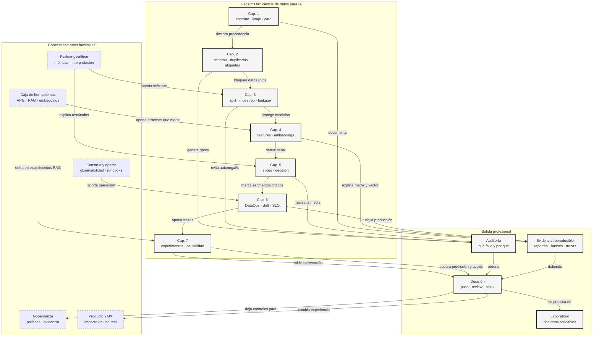

::: {.fasciculo-subtitle}
Facsímil 8 · La ciencia de los datos
:::

# Capítulo 08: Recapitulación y laboratorio de ciencia de datos

## Qué deberías poder hacer al terminar

Este facsímil empezó con una idea sencilla: en IA, los datos no son un trámite. Son parte del sistema. Si el dataset está mal definido, si el contrato no existe, si el split engaña, si los slices fallan, si falta trazabilidad o si confundimos predicción con intervención, el modelo puede parecer sofisticado y aun así tomar malas decisiones.

Al cerrar el facsímil deberías poder hacer esto:

| Resultado de aprendizaje | Evidencia de que lo sabes hacer |
|---|---|
| Auditar un dataset antes de usarlo. | Revisas contrato, columnas, valores, licencias, linaje y trazabilidad. |
| Diseñar una evaluación honesta. | Separas train, validation y test sin leakage. |
| Leer features y embeddings como decisiones. | No conviertes columnas en vectores sin contrato. |
| Medir slices críticos. | No publicas una media global si falla un segmento importante. |
| Operar datos en producción. | Escribes SLIs, SLOs, runbooks, trazas y gates. |
| Diseñar un experimento aplicable. | Separas predicción de intervención, ATE de CATE y A/B de observacional. |
| Entregar una decisión defendible. | Generas scorecard, reporte y documento de salida. |

La frase de cierre:

> La ciencia de datos en IA no consiste en encontrar una métrica bonita. Consiste en construir una decisión que aguante preguntas.

## Lo que hemos construido

El recorrido del facsímil puede leerse como una cadena:

La cadena no es una ocurrencia editorial. Datasheets for Datasets consolidó la idea de documentar motivación, composición, recogida, usos y límites de un dataset antes de ponerlo a circular.^[Gebru, T. et al. (2021). Datasheets for datasets. *Communications of the ACM*, 64(12), 86-92. https://doi.org/10.1145/3458723] Model Cards hizo algo parecido para modelos, obligándonos a declarar uso previsto, métricas, grupos evaluados y limitaciones.^[Mitchell, M. et al. (2019). Model cards for model reporting. *Proceedings of the Conference on Fairness, Accountability, and Transparency*, 220-229. https://doi.org/10.1145/3287560.3287596] Y el ML Test Score recordaba una cosa muy de ingeniería: un sistema de ML no está maduro solo porque tenga una métrica alta; necesita tests de datos, monitorización, reproducibilidad y gestión de cambios.^[Breck, E., Cai, S., Nielsen, E., Salib, M. y Sculley, D. (2017). The ML test score: A rubric for ML production readiness and technical debt reduction. *2017 IEEE International Conference on Big Data*, 1123-1132. https://doi.org/10.1109/BigData.2017.8258038]

| Capítulo | Pregunta | Artefacto mental |
|---|---|---|
| 01 | ¿Qué dato tenemos y de dónde viene? | Contrato, linaje y dataset card. |
| 02 | ¿El dato cumple lo mínimo? | Gate de calidad. |
| 03 | ¿Medimos sin engañarnos? | Split y manifiesto de evaluación. |
| 04 | ¿Cómo representamos la información? | Features, embeddings y búsqueda. |
| 05 | ¿A quién falla la decisión? | Slices, políticas y mitigación. |
| 06 | ¿Qué pasa cuando llega producción? | DataOps, drift, trazas y postmortem. |
| 07 | ¿Una acción cambia algo? | Experimento, causalidad y rollout. |

Si una persona termina este facsímil y solo recuerda una cosa, que sea esta: **cada métrica necesita una historia de procedencia, una unidad de análisis, una ventana, un contrato y una decisión permitida**.

## Cómo encaja todo

Este mapa une el facsímil completo. No intenta repetir cada tabla, sino mostrar el flujo profesional: del dato inicial a la decisión de publicación. La lectura buena no es lineal del todo: contrato, calidad, split, representación, slices, operación y causalidad se revisan entre sí.



## Anatomía visual: de dataset a decisión

El cierre del facsímil necesitaba una figura propia porque la ciencia de datos no termina en el dataframe. Termina cuando alguien puede explicar qué dato entró, qué se midió, qué se corrigió, qué quedó fuera y qué decisión se tomó.

<figure class="svg-figure" id="f8-c08-data-release-figure">
<svg id="f8-c08-data-release" xmlns="http://www.w3.org/2000/svg" viewBox="0 0 1320 760" role="img" aria-label="Anatomía de una revisión de release de datos para IA">
  <defs>
    <marker id="f8c08-arrow" viewBox="0 0 10 10" refX="9" refY="5" markerWidth="7" markerHeight="7" orient="auto-start-reverse">
      <path d="M 0 0 L 10 5 L 0 10 z" fill="#111111"/>
    </marker>
    <pattern id="f8c08-grid" width="26" height="26" patternUnits="userSpaceOnUse">
      <path d="M26 0 L0 0 0 26" fill="none" stroke="#EEEEEE" stroke-width="1"/>
    </pattern>
  </defs>
  <rect x="24" y="24" width="1272" height="680" rx="18" fill="#FFFFFF" stroke="#111111" stroke-width="2"/>
  <text x="660" y="64" text-anchor="middle" font-family="Arial, sans-serif" font-size="25" font-weight="700" fill="#111111">Release de datos: no se publica una media, se publica una decisión</text>
  <text x="660" y="92" text-anchor="middle" font-family="Arial, sans-serif" font-size="13" fill="#555555">Contrato, calidad, split, slices, operación y experimento producen una evidencia única.</text>
  <rect x="70" y="126" width="1180" height="438" rx="14" fill="url(#f8c08-grid)" stroke="#DDDDDD"/>
  <g font-family="Arial, sans-serif">
    <rect x="108" y="178" width="172" height="104" rx="12" fill="#111111" stroke="#111111"/>
    <text x="194" y="210" text-anchor="middle" font-size="13" font-weight="700" fill="#FFFFFF">1 · Contrato</text>
    <text x="194" y="236" text-anchor="middle" font-size="11" fill="#E8E8E8">unidad de análisis</text>
    <text x="194" y="254" text-anchor="middle" font-size="11" fill="#E8E8E8">schema · linaje · licencia</text>

    <line x1="280" y1="230" x2="326" y2="230" stroke="#111111" stroke-width="1.3" marker-end="url(#f8c08-arrow)"/>
    <rect x="326" y="178" width="172" height="104" rx="12" fill="#FFFFFF" stroke="#111111" stroke-width="1.4"/>
    <text x="412" y="210" text-anchor="middle" font-size="13" font-weight="700">2 · Calidad</text>
    <text x="412" y="236" text-anchor="middle" font-size="11" fill="#555555">nulos · duplicados</text>
    <text x="412" y="254" text-anchor="middle" font-size="11" fill="#555555">etiquetas · leakage</text>

    <line x1="498" y1="230" x2="544" y2="230" stroke="#111111" stroke-width="1.3" marker-end="url(#f8c08-arrow)"/>
    <rect x="544" y="178" width="172" height="104" rx="12" fill="#FFFFFF" stroke="#111111" stroke-width="1.4"/>
    <text x="630" y="210" text-anchor="middle" font-size="13" font-weight="700">3 · Split</text>
    <text x="630" y="236" text-anchor="middle" font-size="11" fill="#555555">train · validation · test</text>
    <text x="630" y="254" text-anchor="middle" font-size="11" fill="#555555">tiempo · grupos · holdout</text>

    <line x1="716" y1="230" x2="762" y2="230" stroke="#111111" stroke-width="1.3" marker-end="url(#f8c08-arrow)"/>
    <rect x="762" y="178" width="172" height="104" rx="12" fill="#FFFFFF" stroke="#111111" stroke-width="1.4"/>
    <text x="848" y="210" text-anchor="middle" font-size="13" font-weight="700">4 · Señal</text>
    <text x="848" y="236" text-anchor="middle" font-size="11" fill="#555555">features · embeddings</text>
    <text x="848" y="254" text-anchor="middle" font-size="11" fill="#555555">normalización · versión</text>

    <line x1="934" y1="230" x2="980" y2="230" stroke="#111111" stroke-width="1.3" marker-end="url(#f8c08-arrow)"/>
    <rect x="980" y="178" width="172" height="104" rx="12" fill="#FFFFFF" stroke="#111111" stroke-width="1.4"/>
    <text x="1066" y="210" text-anchor="middle" font-size="13" font-weight="700">5 · Slices</text>
    <text x="1066" y="236" text-anchor="middle" font-size="11" fill="#555555">segmentos críticos</text>
    <text x="1066" y="254" text-anchor="middle" font-size="11" fill="#555555">errores y mitigación</text>

    <rect x="230" y="374" width="232" height="116" rx="12" fill="#FFFFFF" stroke="#111111" stroke-width="1.4"/>
    <text x="346" y="408" text-anchor="middle" font-size="13" font-weight="700">Operación</text>
    <text x="346" y="436" text-anchor="middle" font-size="11" fill="#555555">drift · SLI · SLO</text>
    <text x="346" y="456" text-anchor="middle" font-size="11" fill="#555555">trazas · runbook · gate CI</text>

    <rect x="544" y="374" width="232" height="116" rx="12" fill="#FFFFFF" stroke="#111111" stroke-width="1.4"/>
    <text x="660" y="408" text-anchor="middle" font-size="13" font-weight="700">Experimento</text>
    <text x="660" y="436" text-anchor="middle" font-size="11" fill="#555555">exposure event · métrica</text>
    <text x="660" y="456" text-anchor="middle" font-size="11" fill="#555555">guardrails · ventana</text>

    <rect x="858" y="374" width="232" height="116" rx="12" fill="#FFFFFF" stroke="#111111" stroke-width="1.4"/>
    <text x="974" y="408" text-anchor="middle" font-size="13" font-weight="700">Decisión</text>
    <text x="974" y="436" text-anchor="middle" font-size="11" fill="#555555">pass · review · block</text>
    <text x="974" y="456" text-anchor="middle" font-size="11" fill="#555555">owner · fecha · evidencia</text>

    <path d="M1066 282 C1066 330 346 326 346 374" fill="none" stroke="#111111" stroke-width="1.2" marker-end="url(#f8c08-arrow)"/>
    <line x1="462" y1="432" x2="544" y2="432" stroke="#111111" stroke-width="1.2" marker-end="url(#f8c08-arrow)"/>
    <line x1="776" y1="432" x2="858" y2="432" stroke="#111111" stroke-width="1.2" marker-end="url(#f8c08-arrow)"/>
  </g>
  <rect x="250" y="604" width="820" height="48" rx="24" fill="#111111"/>
  <text x="660" y="634" text-anchor="middle" font-family="Arial, sans-serif" font-size="14" font-weight="700" fill="#FFFFFF">La evidencia buena permite repetir la decisión sin repetir la discusión.</text>
  <text x="1228" y="682" text-anchor="end" font-family="Arial, sans-serif" font-size="11" fill="#888888" opacity="0.55">IA para gente curiosa / Facsímil 08 / Capítulo 08 / 686f6c61</text>
</svg>
<figcaption>La revisión de datos une contrato, calidad, medición, segmentos, operación y experimento. El resultado útil no es “la métrica sube”, sino una decisión trazable.</figcaption>
</figure>

## Laboratorio

Un laboratorio, dentro de este libro, es un espacio de práctica guiada. No está pensado para pillar a nadie, sino para obligarnos a trabajar como trabajaríamos fuera del libro: con datos imperfectos, contratos, umbrales, decisiones y una salida que otra persona pueda revisar.

En este laboratorio vamos a tocar:

| Tema | Capítulos que lo sostienen |
|---|---|
| Contrato y linaje | Capítulos 01 y 02. |
| Split y evaluación | Capítulo 03. |
| Slices críticos | Capítulo 05. |
| Operación y trazabilidad | Capítulo 06. |
| Experimento y decisión causal | Capítulo 07. |

El kit está en:

```text
labs/f8/laboratorio-cierre/
```

### Cómo trabajar este laboratorio

No lo plantees como “ejecutar un script y copiar el estado”. Plantealo como una revisión de release. En una empresa o en un proyecto universitario serio, el resultado útil no es decir que un sistema “va bien” o “va mal”, sino dejar una cadena de evidencia:

| Paso | Qué haces | Qué artefacto miras |
|---|---|---|
| 1 | Lees el contrato antes de mirar resultados. | `contracts/final_review_contract.json`. |
| 2 | Ejecutas la auditoría final. | `ops/run_final_review.py`. |
| 3 | Separas bloqueo, revisión y pase. | `output/final_decision.md`. |
| 4 | Compruebas comportamiento por split. | `output/final_split_summary.csv`. |
| 5 | Compruebas slices críticos. | `output/final_slice_summary.csv`. |
| 6 | Escribes un plan de corrección. | `correction_plan.md`. |
| 7 | Diseñas una intervención medible. | `next_experiment_plan.md`. |
| 8 | Validamos una entrega profesional. | `ops/check_student_submission.py`. |

La entrega fuerte contiene una decisión y una siguiente iteración. Si solo entregas “Estado: block”, te falta ingeniería. Un bloqueo bien explicado debe decir qué se rompe, por qué importa, qué evidencia lo demuestra y qué harías antes de volver a medir.

Antes de ejecutar, abre también las evidencias fuente del kit:

```text
evidence/traceability_policy.md
evidence/data_quality_contract.json
evidence/slice_remediation_plan.md
evidence/experiment_exposure_contract.json
evidence/data_release_scope.md
```

Estas piezas salen directamente del temario: trazabilidad y operación del capítulo 06, calidad y contrato del capítulo 02, slices del capítulo 05, experimento del capítulo 07 y alcance/linaje del capítulo 01. No hay una capa nueva escondida en el laboratorio; solo estamos juntando lo que ya aprendimos.

### Reto 1: auditar si un mini sistema puede publicarse

#### Contexto

Un equipo quiere publicar una automatización para priorizar casos académicos. Tienes un dataset pequeño con splits, predicciones, trazas, citas, latencias y variantes de experimento. La pregunta no es si el modelo “parece bueno”. La pregunta es si hay evidencia suficiente para publicarlo.

La situación es realista: el sistema acierta algunos casos, cita bastante bien y parece tener valor. El problema es que una release no se decide por una impresión global. Se decide por contrato. Si faltan trazas, si hay campos incompletos o si un slice crítico falla, el sistema puede ser prometedor y aun así no ser publicable.

#### Objetivo

Generar una decisión de publicación reproducible: `pass`, `review` o `block`.

#### Enunciado

Ejecuta:

```bash
cd labs/f8/laboratorio-cierre
python3 ops/run_final_review.py --write
cat output/final_decision.md
cat output/technical_decision_memo.md
cat output/source_evidence_review.md
cat output/final_split_summary.csv
cat output/final_slice_summary.csv
cat output/correction_plan.md
cat output/next_experiment_plan.md
python3 -m json.tool output/final_review_report.json
python3 -m json.tool output/data_release_ci_gate.json
```

Después responde:

1. ¿Qué checks bloquean?
2. ¿Qué checks quedan en revisión?
3. ¿Qué slices concentran fallos?
4. ¿Qué cambiarías antes de publicar?
5. ¿Qué parte del contrato no cambiarías aunque el equipo tenga prisa?
6. ¿Qué evidencia enseñarías en una revisión de release?
7. ¿Qué experimento diseñarías para el slice más débil?
8. ¿Qué evidencia fuente existe para cada parte de la decisión?
9. ¿Qué comando usarías como gate de CI?

#### Resolución paso a paso

Primero miramos contrato. El dataset cumple columnas, así que el problema no es schema. Eso es importante: un schema correcto no significa que el sistema sea publicable. Solo significa que el formato mínimo existe.

Después miramos trazabilidad. Hay un evento sin `trace_id`; eso bloquea porque no podemos reconstruir una decisión concreta. Si una persona pregunta “por qué se priorizó o no se priorizó este caso”, nos falta la pieza que conecta dato, predicción, decisión y ejecución. No es un detalle administrativo: es la diferencia entre depurar y adivinar.

Luego miramos campos obligatorios. Hay un caso con campos incompletos. También bloquea. En el capítulo 02 insistimos en esto: si la ingesta deja pasar filas incompletas, el modelo puede estar midiendo ausencias, rutas alternativas o errores de formulario.

Después miramos evaluación. `test_accuracy` queda en `0.6`, por debajo del umbral `0.75`. No bloquea por sí solo en el contrato, pero deja el sistema en revisión. La lectura correcta no es “el modelo es malo”, sino “con este split y este umbral no alcanza el mínimo que dijimos antes de mirar”.

Finalmente miramos slices: `language=en`, `segment=practicas` y `source=form` concentran misses. Eso conecta con el capítulo 05: la media global no basta. Si el sistema falla donde más necesitamos robustez, no se publica globalmente.

| Check | Valor | Umbral | Lectura |
|---|---:|---:|---|
| `missing_trace_rate` | `0.083333` | `0.0` | Bloquea: hay decisión sin reconstrucción. |
| `missing_required_fields_rate` | `0.083333` | `0.0` | Bloquea: hay dato incompleto. |
| `latency_p95_ms` | `730` | `720` | Revisión: la ruta p95 supera SLO. |
| `test_accuracy` | `0.6` | `0.75` | Revisión: el test no sostiene publicación. |
| `citation_valid_rate` | `0.916667` | `0.9` | Pasa: la capa documental aguanta. |
| `language=en` miss rate | `0.8` | `0.25` | Revisión fuerte: slice crítico muy débil. |
| `segment=practicas` miss rate | `0.75` | `0.25` | Revisión fuerte: segmento problemático. |
| `source=form` miss rate | `0.666667` | `0.25` | Revisión fuerte: fuente problemática. |

#### Respuesta modelo

La decisión correcta es:

```text
Estado: block
```

Motivo: faltan trazas, hay campos obligatorios incompletos, test no alcanza el umbral y los slices críticos fallan demasiado. Que `citation_valid_rate` pase no compensa los bloqueos; una parte sana del sistema no convierte en publicable una decisión que no se puede reconstruir.

#### Por qué funciona

La solución no intenta arreglar el modelo a ciegas. Separa problemas:

| Problema | Capítulo que lo explica | Acción |
|---|---|---|
| Falta trazabilidad | 06 | Bloquear publicación hasta recuperar `trace_id`. |
| Campos incompletos | 02 | Corregir contrato y pipeline de ingesta. |
| Test bajo | 03 | Revisar split y evaluación. |
| Slices con misses altos | 05 | Revisar datos, política y umbrales por segmento. |

#### Cómo explicarlo a otra persona

“No publicaría este sistema todavía. No porque una métrica sea fea, sino porque hay decisiones que no podríamos reconstruir, datos incompletos y segmentos críticos donde falla demasiado. Antes de automatizar, hay que arreglar trazabilidad, calidad y comportamiento por slice.”

#### Entrega profesional esperada

La entrega no debería ser una respuesta suelta, sino una carpeta de revisión:

```text
final-data-release-review/
  final_decision.md
  technical_decision_memo.md
  final_review_report.json
  final_split_summary.csv
  final_slice_summary.csv
  source_evidence_review.md
  correction_plan.md
  next_experiment_plan.md
  data_release_ci_gate.json
```

Como gate de CI:

```bash
python3 ops/run_final_review.py --write --fail-on-blocker
```

Si el estado final es `block`, el comando debe salir con código `2`. Eso convierte una discusión en una regla ejecutable: no se publica si falta trazabilidad o si entran filas incompletas.

`correction_plan.md` debe incluir:

1. Qué campos o trazas se corrigen.
2. Qué validación impide que el fallo vuelva a entrar.
3. Qué slice se prioriza y por qué.
4. Qué métrica se volverá a mirar.
5. Qué umbral no se cambia después de ver el resultado.

#### Variaciones

1. Cambia `max_latency_p95_ms` a `760` y observa qué deja de estar en revisión.
2. Añade un nuevo slice crítico por `language=ca`.
3. Corrige el `trace_id` faltante y vuelve a ejecutar.
4. Ejecuta la variante del alumno:

```bash
python3 ops/run_final_review.py \
  --data data/final_project_events_student.csv \
  --output-dir output/student \
  --write

cat output/student/final_decision.md
cat output/student/technical_decision_memo.md
cat output/student/source_evidence_review.md
python3 -m json.tool output/student/data_release_ci_gate.json
```

La variante `student` corrige trazabilidad y campos obligatorios. Si lo has entendido, deberías ver que desaparece el bloqueo, pero no desaparece la revisión: siguen abiertos test, latencia y slices críticos. Esa diferencia es justo la lectura profesional.

### Reto 2: diseñar una mejora medible sin confundir predicción con intervención

#### Contexto

El equipo propone una plantilla guiada para casos de prácticas en inglés. Los datos muestran que ese segmento falla. Pero no sabemos si la plantilla cambiará el resultado o si solo estamos identificando casos difíciles.

#### Objetivo

Diseñar un experimento aplicable y conectado con los hallazgos del reto 1.

#### Enunciado

Usa el kit del capítulo 07 desde la raíz del repositorio. Este reto no vive dentro de `labs/f8/laboratorio-cierre/`: reutiliza el material experimental de `labs/f8/c07-applied-experiments/` para que quede claro qué parte del facsímil estás poniendo en juego.

```bash
python3 labs/f8/c07-applied-experiments/ops/validate_experiment_design.py --write
python3 labs/f8/c07-applied-experiments/ops/analyze_ab_experiment.py --write
python3 labs/f8/c07-applied-experiments/ops/analyze_rag_experiment.py --write
python3 labs/f8/c07-applied-experiments/ops/summarize_metric_maturation.py --write
python3 labs/f8/c07-applied-experiments/ops/analyze_cluster_interference.py --write
python3 labs/f8/c07-applied-experiments/ops/ci_experiment_gate.py --write
cat labs/f8/c07-applied-experiments/output/experiment_design_validation.md
cat labs/f8/c07-applied-experiments/output/experiment_decision.md
cat labs/f8/c07-applied-experiments/output/rag_experiment_decision.md
cat labs/f8/c07-applied-experiments/output/metric_maturation_decision.md
cat labs/f8/c07-applied-experiments/output/cluster_interference_decision.md
cat labs/f8/c07-applied-experiments/output/ci_gate_decision.md
```

Diseña una mejora para el segmento `segment=practicas` y `language=en`:

1. Unidad de asignación.
2. Tratamiento y control.
3. Métrica primaria.
4. Guardrails.
5. Exposure event.
6. MDE y política de peeking.
7. Rollout.
8. Plan de análisis.
9. Catálogo de métricas.
10. Riesgo de interferencia por equipo, cola u operador.
11. Qué harías si el resultado queda en `review`.

#### Resolución paso a paso

La unidad debe ser el caso académico, no una fila suelta de log. Si una misma decisión aparece en varios eventos, la unidad de asignación sigue siendo el caso. Si varios casos comparten operador o cola, hay que preguntarse si existe interferencia y si conviene asignar por clúster.

El tratamiento puede ser una plantilla guiada más recuperación documental revisada para prácticas internacionales. El control es el flujo actual. La métrica primaria puede ser resolución correcta a 7 días. Los guardrails deben incluir cita válida, latencia, coste y feedback negativo.

El exposure event debe registrar que el caso realmente recibió la plantilla y la versión del RAG. Si el sistema cae a fallback, esa unidad no se analiza igual. Para no engañarnos, calculamos MDE antes de empezar y fijamos una política de peeking: una sola lectura al cerrar ventana o análisis secuencial explícito.

El plan de análisis se escribe antes de mirar resultados. Debe decir hipótesis, población, tratamiento, control, métrica primaria, ventanas, exclusiones y regla de decisión. El catálogo de métricas evita que `resolved_day_7`, `citation_valid` o `latency_ms` cambien de significado entre personas.

La parte importante: el resultado del kit puede quedar en `review`. Eso no es fracaso. Significa que hay señal, pero falta precisión, muestra, maduración o robustez por slice. En ingeniería, `review` es una salida útil si explica qué medir después.

#### Respuesta modelo

| Pieza | Diseño |
|---|---|
| Unidad | `case_id`. |
| Tratamiento | Plantilla guiada + retriever revisado para prácticas internacionales. |
| Control | Flujo actual. |
| Métrica primaria | `resolved_day_7`. |
| Guardrails | `citation_valid`, `latency_ms`, `cost_eur`, `negative_feedback`. |
| Exposure event | `experiment_exposure` con `case_id`, variante, versión de prompt, versión de retriever y trace. |
| MDE | Definido antes de iniciar; si se busca `0.05`, hace falta mucha más muestra que un ejemplo de aula. |
| Peeking | No decidir antes de la ventana final sin regla secuencial. |
| Rollout | A/A, A/B, 5%, 25%, 50%, 100% con rollback por guardrail. |
| Plan de análisis | Hipótesis, población, unidad, ventanas, exclusiones y regla `pass/review/block` antes de mirar. |
| Catálogo de métricas | Primaria, guardrails y diagnósticas con unidad, ventana y dirección. |
| Interferencia | Revisar si operador, equipo o cola comparten aprendizaje; si ocurre, considerar `cluster_id`. |
| Salida si queda `review` | Ampliar muestra, repetir ventana, limitar rollout o corregir instrumentación. |

#### Por qué funciona

Porque no usa el modelo predictivo como prueba de intervención. El diseño pregunta si una acción cambia el resultado, registra exposición real y protege guardrails. Además, conecta con el reto 1: no actúa sobre todo el sistema, sino sobre el segmento que la auditoría mostró como problemático.

También funciona porque separa tres cosas que suelen mezclarse:

| Cosa | Qué pregunta | Artefacto |
|---|---|---|
| Auditoría | ¿Dónde falla el sistema actual? | Reto 1. |
| Intervención | ¿Qué cambio concreto proponemos? | Tratamiento/control. |
| Evidencia causal | ¿Ese cambio modifica el resultado? | Experimento, exposure event, ATE/CATE y guardrails. |

#### Cómo explicarlo a otra persona

“Primero encontramos dónde falla el sistema. Luego diseñamos una intervención concreta para ese segmento y la medimos como experimento, no como intuición. Si mejora resolución sin romper citas, latencia ni coste, podemos plantear rollout. Si no, aprendimos sin publicar a ciegas.”

#### Variaciones

1. Cambia la unidad de asignación a `student_id` y explica qué mejora o empeora.
2. Añade una métrica de satisfacción a 14 días.
3. Diseña el mismo experimento como bandit y explica qué perderías en interpretación.

#### Entrega profesional esperada

```text
next-experiment-plan/
  analysis_plan.json
  metric_catalog.json
  feature_flag_contract.json
  warehouse_schema.sql
  experiment_decision.md
  rollout_plan.md
```

La entrega debe defender una decisión concreta: publicar nada, medir más, limitar a un slice, repetir el experimento o pasar a rollout controlado. No basta con escribir un diseño bonito; hay que decir qué evidencia lo haría avanzar y qué evidencia lo frenaría.

### Validar la entrega

Para que el laboratorio no se quede en prosa, el kit incluye un checker:

```bash
cd labs/f8/laboratorio-cierre
python3 ops/check_student_submission.py --submission-dir solutions/reference --write
cat output/student_submission_report.md
```

Una entrega propia debería tener esta forma:

```text
solutions/mi-equipo/
  decision_memo.md
  correction_plan.md
  next_experiment_plan.md
  residual_data_risk.md
  data_release_ci_gate.json
  traceability_policy.md
  data_quality_contract.json
  slice_remediation_plan.md
  experiment_exposure_contract.json
```

El checker no sustituye la revisión humana. Solo evita entregas vacías: comprueba que hay decisión, plan de corrección, plan experimental, riesgo residual, salida CI y evidencias de trazabilidad, calidad, slices y exposición.

### Rúbrica de evaluación

| Criterio | Peso | Qué espero ver |
|---|---:|---|
| Lectura del contrato | 15 | Identifica columnas, SLOs, splits y slices críticos antes de mirar resultados. |
| Decisión de release | 20 | Defiende `block`, `review` o `pass` con checks y evidencia. |
| Corrección de datos | 20 | Corrige trazabilidad y campos sin relajar umbrales. |
| Análisis por slices | 15 | Explica por qué la media global no basta y qué slice priorizaría. |
| Plan experimental | 15 | Conecta la intervención con `case_id`, exposure event, métrica primaria y guardrails. |
| Gate CI | 10 | Produce una salida máquina y entiende cuándo debe fallar. |
| Claridad profesional | 5 | El memo puede leerlo ingeniería, datos, producto u operación. |

Una entrega excelente no intenta maquillar el resultado. Enseña qué se puede defender, qué no, qué dato se corrige, qué slice se prioriza y qué experimento mediría el siguiente cambio.

## Vocabulario aprendido

| Término | Qué significa aquí | Cómo lo usarías en una entrega |
|---|---|---|
| Decisión de release de datos | Dictamen técnico sobre si los datos y sus derivados permiten automatizar, revisar o bloquear. | Lo escribes como `pass`, `review` o `block`, con checks y evidencia. |
| Evidencia reproducible | Reportes, hashes, manifests, trazas, contratos y salidas que otra persona puede regenerar. | La adjuntas al memo para que la revisión no dependa de confianza verbal. |
| Gate de datos | Regla ejecutable que impide publicar si fallan calidad, split, trazabilidad, slices o SLOs. | Lo conectas a CI o a la revisión de release. |
| Corrección sin relajar umbrales | Arreglar datos, trazas o contratos sin bajar el listón después de ver el fallo. | Mantienes el contrato y corriges la causa, no la métrica incómoda. |
| Siguiente experimento | Intervención medible para aprender si una acción mejora el sistema en un slice concreto. | Diseñas unidad, exposición, métrica primaria, guardrails y criterio de parada. |

## Dónde solía tropezar yo

| Tropiezo | Por qué ocurre | Antídoto |
|---|---|---|
| Querer publicar por una métrica global | La media resume demasiado. | Mirar contrato, test, slices y operación. |
| Arreglar el modelo antes de arreglar datos | Parece la parte más interesante. | Revisar trazabilidad y calidad primero. |
| Diseñar experimentos sin exposure event | La asignación parece suficiente. | Registrar exposición real y versión exacta. |
| Ignorar ventanas de maduración | Queremos decidir rápido. | Declarar `day_1`, `day_7` o la ventana que toque. |

## Antes de pasar página

Antes de cerrar el facsímil, deberías poder responder:

1. ¿Qué diferencia hay entre contrato de datos y contrato de experimento?
2. ¿Por qué un dataset con schema correcto puede quedar bloqueado?
3. ¿Qué hace que un split sea honesto?
4. ¿Por qué los slices críticos pueden cambiar una decisión?
5. ¿Qué SLI de DataOps bloquearía una publicación?
6. ¿Qué diferencia hay entre asignación y exposición?
7. ¿Por qué un experimento en `review` no es necesariamente un fracaso?
8. ¿Qué entregarías como evidencia reproducible de una decisión?
9. ¿Por qué no deberías cambiar umbrales después de mirar el resultado?
10. ¿Qué diferencia hay entre corregir trazabilidad y mejorar el modelo?
11. ¿Qué comprobaría un gate de CI de datos?

## En resumen

| Idea | Qué te llevas |
|---|---|
| Los datos son sistema. | No son entrada pasiva del modelo. |
| La evaluación es una promesa. | Si el split o los slices fallan, la métrica no basta. |
| La operación decide. | Sin trazas, SLOs y runbooks, no hay publicación responsable. |
| La causalidad cambia la pregunta. | Predecir no prueba que una acción funcione. |
| El laboratorio junta todo. | La salida profesional es una decisión reproducible, no una impresión. |

## Para saber más

Breck, E., Cai, S., Nielsen, E., Salib, M. y Sculley, D. (2017). The ML test score: A rubric for ML production readiness and technical debt reduction. *2017 IEEE International Conference on Big Data*, 1123-1132. https://doi.org/10.1109/BigData.2017.8258038

Gebru, T. et al. (2021). Datasheets for datasets. *Communications of the ACM*, 64(12), 86-92. https://doi.org/10.1145/3458723

Kohavi, R., Longbotham, R., Sommerfield, D. y Henne, R. M. (2009). Controlled experiments on the web: Survey and practical guide. *Data Mining and Knowledge Discovery*, 18(1), 140-181. https://doi.org/10.1007/s10618-008-0114-1

Mitchell, M. et al. (2019). Model cards for model reporting. *Proceedings of the Conference on Fairness, Accountability, and Transparency*, 220-229. https://doi.org/10.1145/3287560.3287596

National Institute of Standards and Technology. (2023). *Artificial Intelligence Risk Management Framework (AI RMF 1.0)*. https://doi.org/10.6028/NIST.AI.100-1

Sambasivan, N. et al. (2021). “Everyone wants to do the model work, not the data work”: Data cascades in high-stakes AI. *Proceedings of CHI 2021*, 1-15. https://doi.org/10.1145/3411764.3445518

Sculley, D. et al. (2015). Hidden technical debt in machine learning systems. *Advances in Neural Information Processing Systems 28*. https://papers.nips.cc/paper/5656-hidden-technical-debt-in-machine-learning-systems
