::: {.fasciculo-subtitle}
Facsímil 9 · Seguridad, privacidad y gobernanza
:::

# Capítulo 01: Riesgos, controles y evidencias: la primera capa de gobernanza

## Qué deberías poder hacer al terminar

Este facsímil empieza justo donde muchos proyectos de IA se vuelven adultos. Ya sabemos construir prototipos, usar APIs, montar RAG, trabajar con agentes, observar sistemas, evaluar calidad y revisar datos. Ahora aparece otra pregunta: **si mañana alguien nos pide justificar por qué esta capacidad de IA puede usarse, qué enseñamos?**

No vale contestar “porque funciona en mis pruebas”. Tampoco basta enseñar una arquitectura bonita. En seguridad, privacidad y gobernanza necesitamos poder enseñar inventario, límites, controles, owner, evidencia y decisión. Es decir: no solo qué hace el sistema, sino bajo qué condiciones aceptamos que lo haga.

Al terminar este capítulo deberías poder hacer esto:

| Resultado de aprendizaje | Evidencia de que lo sabes hacer |
|---|---|
| Separar riesgo, control y evidencia. | No confundes “tenemos política” con “tenemos prueba de que la política se cumple”. |
| Modelar un sistema de IA como superficie de decisión. | Nombras datos, modelo, RAG, tools, memoria, logs, usuario, salida y owner. |
| Escribir un registro de riesgos mínimo. | Cada riesgo tiene probabilidad, impacto, exposición, detección, owner, control y evidencia. |
| Calcular severidad de forma defendible. | Usas una escala explícita y puedes explicar por qué un escenario sube o baja. |
| Diseñar un gate de salida. | La versión no avanza si faltan controles, trazas, revisión o aceptación de riesgo residual. |
| Conectar marcos reales con ingeniería. | Lees NIST AI RMF, ISO 42001, AI Act, GDPR y OWASP como fuentes de requisitos operativos, no como decoración. |
| Ejecutar una práctica real. | Generas `risk_register.md`, `control_matrix.csv`, `release_gate.md` y `evidence_pack/` con el kit del capítulo. |

La idea central es esta:

> Gobernar IA no es frenar la ingeniería. Es hacer que las decisiones importantes de la ingeniería sean visibles, medibles y revisables.

## La escena: el sistema ya responde, pero nadie sabe quién lo puede publicar

Imagina un asistente académico que responde preguntas de matrícula, becas y normativa. El sistema usa RAG, cita documentos, registra trazas y deriva casos difíciles a una persona. En una demo funciona bien. El equipo está contento. Alguien pregunta: “¿lo ponemos en producción?”

Y entonces empiezan las preguntas incómodas:

| Pregunta | Qué revela |
|---|---|
| ¿Qué datos personales aparecen en logs y durante cuánto tiempo? | Privacidad y retención. |
| ¿Qué ocurre si el índice recupera una norma antigua? | Calidad del RAG y control de versiones. |
| ¿Puede una tool cambiar el estado de un expediente? | Permisos y revisión humana. |
| ¿Qué versión de prompt y modelo produjo una respuesta concreta? | Trazabilidad y reproducibilidad. |
| ¿Quién acepta que un riesgo residual siga abierto? | Gobernanza y responsabilidad operativa. |
| ¿Qué evidencia revisaría una auditoría interna? | Paquete documental, no solo opiniones. |

Si estas preguntas aparecen por primera vez el día de publicar, llegamos tarde. El objetivo de este capítulo es construir una forma de pensar que aparezca antes: desde la arquitectura, desde los datos, desde las evals y desde la operación.

## Fecha de corte y fuentes consultadas

**Fecha de corte:** 7 de junio de 2026.  
**Fuentes consultadas ese día:** NIST AI RMF 1.0, NIST AI RMF Generative AI Profile, Reglamento (UE) 2024/1689, GDPR, NIST Privacy Framework 1.0, ISO/IEC 42001:2023, OWASP Top 10 for LLM Applications 2025 y trabajos académicos sobre documentación y auditoría de sistemas de IA.

El NIST AI RMF 1.0 se presenta como un marco voluntario, no sectorial y práctico para gestionar riesgos de IA en organizaciones que diseñan, desarrollan, despliegan o usan sistemas de IA.^[Tabassi, E. (2023). *Artificial Intelligence Risk Management Framework (AI RMF 1.0)*. National Institute of Standards and Technology, NIST AI 100-1. https://doi.org/10.6028/NIST.AI.100-1. Consultado el 7 de junio de 2026.] Su perfil para IA generativa aterriza el marco en sistemas capaces de generar texto, código, imágenes u otros contenidos, y lo conecta con el ciclo de vida de esos sistemas.^[Autio, C., Schwartz, R., Dunietz, J., Jain, S., Stanley, M., Tabassi, E., Hall, P. y Roberts, K. (2024). *Artificial Intelligence Risk Management Framework: Generative Artificial Intelligence Profile*. NIST AI 600-1. https://doi.org/10.6028/NIST.AI.600-1. Consultado el 7 de junio de 2026.]

El AI Act europeo, publicado como Reglamento (UE) 2024/1689, establece un marco jurídico basado en categorías de riesgo y obligaciones para ciertos sistemas de IA.^[European Parliament and Council of the European Union. (2024). *Regulation (EU) 2024/1689*. Official Journal of the European Union. https://eur-lex.europa.eu/eli/reg/2024/1689/oj. Consultado el 7 de junio de 2026.] ISO/IEC 42001:2023 define requisitos para establecer, implementar, mantener y mejorar un sistema de gestión de IA dentro de una organización.^[International Organization for Standardization. (2023). *ISO/IEC 42001:2023 Information technology — Artificial intelligence — Management system*. https://www.iso.org/standard/42001. Consultado el 7 de junio de 2026.] GDPR sigue siendo imprescindible cuando tratamos datos personales; su artículo 35 exige evaluación de impacto relativa a protección de datos cuando un tratamiento puede implicar alto riesgo para derechos y libertades de personas.^[European Parliament and Council of the European Union. (2016). *Regulation (EU) 2016/679*. https://eur-lex.europa.eu/legal-content/EN/TXT/?uri=CELEX:32016R0679. Consultado el 7 de junio de 2026.]

Lo estable no es el nombre de una checklist concreta. Lo estable es la disciplina: inventariar, mapear contexto, medir, controlar, documentar, revisar y mejorar.

## Qué no es gobernanza de IA

Gobernanza de IA no es tener un PDF en una carpeta compartida. Un documento puede ayudar, pero no gobierna nada si no está conectado con código, datos, despliegues, owners, métricas y decisiones.

Tampoco es una revisión legal al final. La parte legal importa, claro, pero la gobernanza no puede llegar cuando el sistema ya está diseñado. Si una tool puede escribir en un CRM, si una traza guarda datos sensibles, si un RAG cita documentos obsoletos o si un modelo local se sirve sin control de versión, eso no se arregla solo con una frase en una política.

Y no es una forma elegante de decir “no”. Una buena gobernanza debería permitir publicar mejor: con límites claros, revisiones proporcionadas, gates automatizados, decisiones escritas y una forma honesta de aceptar o reducir riesgo residual.

| Confusión | Lectura de ingeniería |
|---|---|
| “Tenemos una política de IA”. | ¿Qué controles la ejecutan y qué evidencia la demuestra? |
| “El proveedor ya se ocupa”. | El proveedor no conoce tu finalidad, tus datos, tus usuarios ni tus consecuencias. |
| “La eval salió alta”. | ¿Qué riesgos mide esa eval y cuáles deja fuera? |
| “No guardamos datos personales”. | ¿Lo verifican logs, trazas, memoria, proveedores, backups y exports? |
| “La tool tiene permisos”. | ¿Permisos mínimos, aprobación, idempotencia y registro de efectos? |
| “Es solo orientación”. | ¿Puede el usuario tomar una decisión real a partir de esa orientación? |

La frase que conviene tatuar en la pizarra es menos solemne:

> Si no hay evidencia, no hay control: hay intención.

## Qué sí es gobernanza de IA para ingeniería

En este libro llamaremos gobernanza de IA al sistema de roles, políticas, controles, mediciones y evidencias que permite decidir cómo se diseña, publica, usa y revisa una capacidad de IA.

Ejemplo de fórmula: podemos representar la gobernanza de IA así para recordar sus piezas mínimas. No es una definición normativa; es una notación pedagógica para este facsímil.

$$
G = (I, C, R, K, E, D, M)
$$

| Símbolo | Significado | Ejemplo |
|---|---|---|
| \(G\) | Gobernanza de IA. | Sistema para decidir si un asistente académico puede pasar de canary a producción. |
| \(I\) | Inventario. | Modelo, prompt, índice, tools, memoria, datos, logs, owners. |
| \(C\) | Contexto. | Finalidad, usuarios, jurisdicción, efecto de la decisión, límites. |
| \(R\) | Riesgos. | Respuesta sin fuente, dato personal en traza, tool con efecto administrativo. |
| \(K\) | Controles. | Validación de salida, revisión humana, retención limitada, permisos mínimos. |
| \(E\) | Evidencias. | Trazas, evals, fichas, actas, decisiones, políticas versionadas. |
| \(D\) | Decisión. | Publicar, publicar con condiciones, revisar antes de publicar. |
| \(M\) | Monitorización y mejora. | Revisión periódica, métricas, incidencias, drift, actualización de controles. |

Esta fórmula no pretende reducir la gobernanza a matemáticas. Pretende evitar algo peor: que todo quede en conversación. Si \(I\) falta, no sabemos qué estamos gobernando. Si \(C\) falta, no sabemos para qué sirve el sistema. Si \(K\) falta, los riesgos no bajan. Si \(E\) falta, no podemos demostrar nada. Si \(D\) falta, el sistema avanza por inercia.

NIST organiza el AI RMF alrededor de funciones como gobernar, mapear, medir y gestionar. Para un equipo de ingeniería, esa estructura se traduce en cuatro preguntas prácticas:

| Función | Pregunta de ingeniería | Artefacto mínimo |
|---|---|---|
| Gobernar | ¿Quién decide, con qué política y con qué revisión? | Owner, política, gate y acta de decisión. |
| Mapear | ¿Qué sistema, contexto, usuarios, datos e integraciones existen? | Inventario y diagrama de límites. |
| Medir | ¿Qué riesgos, métricas y pruebas se observan? | Registro de riesgos, evals y trazas. |
| Gestionar | ¿Qué controles se aplican y qué queda pendiente? | Matriz de controles y plan de reducción. |

ISO 42001 empuja una idea parecida desde el lenguaje de sistemas de gestión: no basta revisar una aplicación aislada; hace falta un sistema que establezca políticas, procesos, objetivos y mejora continua para la IA en la organización.^[ISO, 2023.] Esta diferencia importa: una aplicación puede pasar una revisión puntual; un sistema de gestión pregunta si el equipo puede repetir el proceso con la siguiente aplicación.

## De los marcos a los artefactos

Los marcos no son el trabajo. Son una forma de no olvidar preguntas importantes. El trabajo real aparece cuando un equipo convierte esas preguntas en artefactos que se pueden abrir, ejecutar, revisar y versionar.

Esta conversión es donde muchos proyectos se quedan cortos. Citan NIST, ISO, AI Act, GDPR u OWASP, pero no explican qué archivo, prueba, traza o decisión demuestra que el sistema cambió. En ingeniería, esa distancia es peligrosa: parece que hay control, pero solo hay vocabulario.

Una forma práctica de leer los marcos es esta:

| Fuente | Qué pregunta trae al proyecto | Artefacto que debería existir |
|---|---|---|
| NIST AI RMF · Govern | ¿Quién decide, con qué política y cómo se revisa? | `raci.md`, `control_policy.json`, `release_gate.md`. |
| NIST AI RMF · Map | ¿Qué sistema, uso, datos e integraciones estamos evaluando? | `ai_system_context.json`, diagrama de límites, inventario de componentes. |
| NIST AI RMF · Measure | ¿Cómo medimos riesgos, calidad, trazabilidad y huecos? | `risk_register.md`, evals, trazas de muestra, métricas por escenario. |
| NIST AI RMF · Manage | ¿Qué hacemos con lo medido? | `control_matrix.csv`, plan de reducción, decisión de salida. |
| NIST GenAI Profile | ¿Qué añade la IA generativa al ciclo de vida? | Casos de salida no determinista, evaluación de contexto, control de memoria y herramientas. |
| ISO/IEC 42001 | ¿Existe un sistema repetible de gestión de IA? | Política, roles, revisión periódica, mejora continua y registro de decisiones. |
| AI Act | ¿Qué tipo de uso es, qué obligaciones puede activar y qué documentación técnica existe? | Clasificación de uso, documentación técnica, monitorización posterior a release. |
| GDPR | ¿Qué datos personales se tratan y con qué necesidad? | `privacy_review.md`, política de retención, minimización, DPIA si procede. |
| OWASP LLM 2025 | ¿Qué riesgos propios de aplicaciones LLM estamos cubriendo? | Validadores de salida, límites de tools, revisión de contexto, controles de dependencias. |

Fíjate en la columna de la derecha. Ninguna fila acaba en “hacer una reunión”. Las reuniones pueden ayudar a decidir, pero el sistema necesita piezas persistentes. Si no queda una evidencia, el siguiente equipo no puede reproducir la decisión.

La forma mínima de trabajar sería:

```text
marco -> pregunta -> control -> evidencia -> decisión
```

Por ejemplo:

| Marco | Pregunta | Control | Evidencia | Decisión |
|---|---|---|---|---|
| GDPR | ¿Guardamos texto de usuario en trazas? | Redacción de logs y retención limitada. | `trace_sample.jsonl` y `privacy_review.md`. | No subir de fase si aparece texto bruto innecesario. |
| OWASP LLM | ¿Una tool puede producir un efecto externo sin confirmación? | Modo lectura, aprobación humana e idempotencia. | `tool_trace_sample` y `approval_policy`. | Solo canary con tool sin ejecución automática. |
| NIST AI RMF | ¿Podemos reconstruir una respuesta? | Manifest de release y `trace_id`. | `release_manifest.json` y muestra de traza. | Publicar con condiciones si falta algún atributo. |

Esta tabla no sustituye asesoría legal ni revisión especializada. Su valor está en otra parte: obliga a ingeniería a producir evidencia antes de pedir confianza.

## El mecanismo paso a paso

La primera capa de gobernanza funciona como una tubería de decisión. No empieza por “qué marco cumplo”, sino por “qué estamos construyendo”.

### 1. Inventario: qué existe realmente

Un inventario de IA no es una lista de modelos. Un sistema moderno suele tener más piezas:

| Pieza | Pregunta |
|---|---|
| Modelo | ¿Proveedor, versión, modo de uso, límites, coste, región? |
| Prompt o instrucciones | ¿Versión, owner, cambios, criterios de aceptación? |
| RAG | ¿Corpus, índice, embeddings, filtros, versionado, calidad de fuentes? |
| Tools | ¿Qué leen, qué escriben, con qué permisos y con qué aprobación? |
| Datos | ¿Origen, licencia, sensibilidad, finalidad, retención, linaje? |
| Memoria | ¿Qué se guarda, quién lo puede leer y cuándo se borra? |
| Logs y trazas | ¿Incluyen datos personales, IDs, salida del modelo, contexto recuperado? |
| Evaluaciones | ¿Qué riesgos miden y qué riesgos no cubren? |
| Interfaz | ¿Qué entiende el usuario, qué límites ve y qué decisión puede tomar? |

Model Cards y Datasheets for Datasets nacieron precisamente para documentar capacidades y datos de forma estructurada, incluyendo usos previstos, límites, composición y métricas relevantes.^[Mitchell, M. et al. (2019). Model Cards for Model Reporting. *Proceedings of the Conference on Fairness, Accountability, and Transparency*, 220-229. https://doi.org/10.1145/3287560.3287596.]^[Gebru, T. et al. (2021). Datasheets for Datasets. *Communications of the ACM*, 64(12), 86-92. https://doi.org/10.1145/3458723.] El primer aprendizaje es directo: no puedes gobernar lo que no está inventariado.

### 1.1. Superficies técnicas: dónde mirar

Una superficie técnica es una zona del sistema donde puede aparecer un riesgo. La palabra “superficie” ayuda porque nos obliga a mirar el sistema por partes, no como una caja misteriosa.

En una aplicación de IA generativa, yo revisaría al menos estas superficies:

| Superficie | Qué puede fallar | Control técnico útil | Evidencia esperada |
|---|---|---|---|
| Modelo | Calidad desigual, límites no documentados, cambio de proveedor o versión. | Model card, eval de regresión, fallback, pin de versión. | `model_card.md`, `eval_report.json`, `release_manifest.json`. |
| Instrucciones | Cambio de comportamiento por prompt no versionado o reglas contradictorias. | Versionado, tests de contrato, diff de prompt. | `prompt_version`, `prompt_eval.md`. |
| RAG | Fuente obsoleta, chunk pobre, filtro incorrecto, cita ausente. | Manifest de índice, filtros de confianza, eval retrieval, abstención. | `index_manifest.json`, `rag_eval_report.json`. |
| Tools | Lectura o escritura fuera del alcance previsto. | Scopes, allowlist, modo lectura, aprobación, idempotencia. | `tool_policy.json`, `tool_trace_sample.jsonl`. |
| Memoria | Guardar más contexto del necesario o recuperar algo fuera de finalidad. | Política de memoria, TTL, separación por usuario, revisión de borrado. | `memory_policy.md`, muestra de recuperación. |
| Logs y trazas | Conservar datos innecesarios o no poder reconstruir una run. | Redacción de logs, atributos mínimos, retención, sampling revisable. | `trace_sample.jsonl`, política de retención. |
| Datos | Licencia, linaje, sensibilidad, leakage o mezcla de usos. | Dataset card, contrato de datos, splits, checks de sensibilidad. | `dataset_card.md`, `split_manifest.json`. |
| Interfaz | El usuario cree que el sistema decide más de lo que realmente debe. | Microcopy de límites, estado de evidencia, ruta de revisión. | Captura, checklist UX, casos de usuario. |
| Proveedor | Región, cambios de modelo, límites de servicio, contratos de tratamiento. | Registro de proveedor, configuración por entorno, evaluación periódica. | `provider_review.md`, manifest de configuración. |
| Despliegue | Secretos, permisos por entorno, rollback o configuración divergente. | Secret manager, CI gates, IaC, feature flags, rollback probado. | `release_gate.md`, `rollback_runbook.md`. |

Esta tabla tiene una consecuencia práctica: cada fila debería poder convertirse en un test, una revisión o una pieza del paquete de evidencias. Si una fila solo produce una conversación, todavía no está madura.

### 2. Contexto: para qué se usa y qué consecuencias tiene

El mismo modelo puede tener riesgos distintos según el uso. Un asistente que resume noticias internas no se parece a un sistema que recomienda becas, prioriza tickets médicos, redacta cláusulas contractuales o ejecuta acciones administrativas.

Por eso necesitamos describir:

| Campo | Ejemplo |
|---|---|
| Finalidad | Responder dudas de normativa académica. |
| Usuarios | Alumnado, secretaría, docentes. |
| Tipo de decisión | Orientativa, automática, recomendación, cambio de estado, derivación. |
| Consecuencia posible | Confusión, pérdida de tiempo, trámite mal iniciado, exposición de datos. |
| Jurisdicción | UE, España, normativa interna. |
| Datos | Documentos públicos, normativa interna, tickets seudonimizados, trazas. |
| Dependencias | Proveedor de modelo, vector store, sistema de tickets, observabilidad. |

El AI Act usa una lógica basada en riesgo, con obligaciones distintas según el tipo de sistema y su contexto de uso.^[European Parliament and Council of the European Union, 2024.] Esto no significa que cada proyecto sea “alto riesgo” por defecto. Significa que no debemos decidir por la etiqueta técnica del modelo, sino por la función real del sistema.

### 3. Riesgos: convertir preocupación en escenario verificable

Un riesgo útil no se escribe así:

> “Puede haber problemas de privacidad”.

Eso es demasiado vago. Un riesgo útil se escribe así:

> “Una traza conserva texto con datos personales más tiempo del necesario para depuración”.

Ahora sí podemos trabajar. Sabemos dónde mirar, qué control aplicar y qué evidencia pedir.

Ejemplo de fórmula: la forma mínima que usaremos para un riesgo individual será esta. Sirve para que el alumno no olvide escenario, owner, control y evidencia; no pretende sustituir metodologías formales de riesgo.

$$
r_i = (s_i, p_i, i_i, e_i, d_i, o_i, k_i, v_i)
$$

| Símbolo | Significado | Ejemplo |
|---|---|---|
| \(r_i\) | Riesgo individual. | R-002: dato personal en traza operativa. |
| \(s_i\) | Escenario concreto. | Retención de texto sensible en logs. |
| \(p_i\) | Probabilidad. | 3 sobre 5. |
| \(i_i\) | Impacto. | 5 sobre 5. |
| \(e_i\) | Exposición. | 3 sobre 5. |
| \(d_i\) | Hueco de detección. | 4 sobre 5: cuesta verlo a tiempo. |
| \(o_i\) | Owner. | Equipo de privacidad. |
| \(k_i\) | Control. | Seudonimización, retención limitada, muestreo revisable. |
| \(v_i\) | Evidencia. | Política de retención y muestra de traza. |

### 4. Severidad: medir para ordenar, no para fingir precisión

Ejemplo de fórmula: usaremos una puntuación simple para ordenar conversación y prioridades. La escala es deliberadamente discutible; lo importante es dejar explícitos los factores.

$$
S_i = P_i \times I_i \times E_i \times D_i
$$

| Símbolo | Significado | Ejemplo |
|---|---|---|
| \(S_i\) | Severidad del escenario \(i\). | 240. |
| \(P_i\) | Probabilidad de que ocurra en la ventana revisada. | 3. |
| \(I_i\) | Impacto si ocurre. | 5. |
| \(E_i\) | Exposición: alcance, frecuencia o número de piezas implicadas. | 4. |
| \(D_i\) | Hueco de detección: 1 fácil de detectar, 5 difícil de detectar. | 4. |

Con esos números:

$$
S_i = 3 \times 5 \times 4 \times 4 = 240
$$

La puntuación no es una verdad científica. Es una herramienta de orden. Sirve para que el equipo discuta con claridad: “¿de verdad esto es impacto 5?”, “¿por qué exposición 4?”, “¿qué control bajaría el hueco de detección de 4 a 2?”.

Una escala práctica:

| Banda | Rango | Lectura |
|---|---:|---|
| Bajo | \(S < 80\) | Seguimiento normal si hay evidencia básica. |
| Medio | \(80 \le S < 180\) | Revisión y control documentado. |
| Alto | \(180 \le S < 350\) | Condición explícita antes de publicar o ampliar uso. |
| Crítico | \(S \ge 350\) | No avanzaría sin reducir riesgo o cambiar diseño. |

El punto importante es que la severidad inicial no cierra la conversación. Ejemplo de fórmula: después de aplicar controles, podemos estimar riesgo residual así. Es una aproximación de trabajo, no una garantía estadística.

$$
S_{residual} = S_{inicial} \times (1 - C)
$$

| Símbolo | Significado | Ejemplo |
|---|---|---|
| \(S_{residual}\) | Severidad que queda después de controles. | 96. |
| \(S_{inicial}\) | Severidad antes de controles. | 240. |
| \(C\) | Efectividad estimada de controles, entre 0 y 1. | 0,60. |

Si no sabemos estimar \(C\), no pasa nada: empezamos registrando controles y evidencia. Pero el objetivo técnico es llegar a poder medir si un control reduce realmente incidencia, exposición, latencia de detección o impacto.

### 4.1. Ejemplo completo: una traza conserva datos personales

Supongamos este escenario:

> R-002: una traza conserva texto con datos personales más tiempo del necesario para depuración.

Antes de controles, el equipo puntúa:

| Factor | Valor | Por qué |
|---|---:|---|
| Probabilidad \(P\) | 3 | El sistema registra muchas runs y todavía no se ha revisado cada campo. |
| Impacto \(I\) | 5 | Puede afectar a personas y activar obligaciones de privacidad. |
| Exposición \(E\) | 3 | No todos los usuarios aportan datos personales, pero sí ocurre en tickets reales. |
| Hueco de detección \(D\) | 4 | Si nadie mira las trazas de muestra, el problema puede durar semanas. |

La severidad inicial es:

$$
S_{inicial} = 3 \times 5 \times 3 \times 4 = 180
$$

Eso cae en banda alta. No significa “pánico”. Significa: no lo trataría como detalle menor antes de subir de fase.

Ahora aplicamos controles:

| Control | Qué cambia | Evidencia |
|---|---|---|
| Redacción de logs | El texto bruto se sustituye por campos mínimos o hashes. | `trace_sample.jsonl`. |
| Retención limitada | Las trazas se borran o compactan tras una ventana definida. | `retention_policy.md`. |
| Muestreo revisable | Una muestra de trazas se revisa antes de release. | `privacy_review.md`. |
| Campos obligatorios | La traza conserva `trace_id`, `model_id`, `prompt_version`, `index_version`, pero no texto innecesario. | `release_manifest.json`. |

Si estimamos que esos controles reducen el riesgo en un 60%, entonces:

$$
S_{residual} = 180 \times (1 - 0{,}60) = 72
$$

| Valor | Lectura |
|---|---|
| \(S_{inicial}=180\) | Riesgo alto: requiere condición de salida. |
| \(C=0{,}60\) | Los controles reducen bastante, pero no eliminan. |
| \(S_{residual}=72\) | Riesgo bajo/medio según escala; puede avanzar si la evidencia existe. |

La decisión profesional no sería “ya está arreglado”. Sería más precisa:

> Puede avanzar a canary si `trace_sample.jsonl` no conserva texto bruto, `retention_policy.md` define ventana de borrado, `privacy_review.md` queda firmado por el owner y el gate bloquea cualquier traza futura que incumpla el contrato.

Este es el salto que buscamos. No vendemos certeza; construimos condiciones verificables.

### 5. Controles: prevenir, detectar, limitar y corregir

Un control no es una promesa. Es una pieza que cambia el sistema.

| Tipo de control | Qué hace | Ejemplo en IA |
|---|---|---|
| Preventivo | Evita que un caso entre por una ruta peligrosa. | Filtro de fuente, permisos mínimos, schema estricto. |
| Detectivo | Permite ver un problema a tiempo. | Trazas con `trace_id`, eval de regresión, alertas por contrato roto. |
| Limitante | Reduce alcance si algo falla. | Rate limit, modo lectura, revisión humana, canary. |
| Correctivo | Permite volver o reparar. | Rollback de prompt, reindexado, borrado de trazas, revisión de dataset. |
| Documental | Permite reconstruir y justificar. | Model card, dataset card, acta de aceptación, release gate. |

OWASP Top 10 for LLM Applications 2025 es útil para traducir riesgos propios de aplicaciones con LLM en categorías de revisión técnica, como instrucciones no confiables, manejo inseguro de salida, control excesivo de tools, exposición de datos sensibles o dependencias de cadena de suministro.^[OWASP Foundation. (2025). *OWASP Top 10 for LLM and Generative AI Applications 2025*. https://genai.owasp.org/resource/owasp-top-10-for-llm-applications-2025/. Consultado el 7 de junio de 2026.] La lectura de ingeniería no es memorizar el top 10. Es preguntar qué control, evidencia y owner cubre cada categoría en tu sistema.

En un proyecto con IA generativa, los controles deberían sonar a ingeniería concreta:

| Control técnico | Qué protege | Cómo se implementa | Señal de que existe |
|---|---|---|---|
| Scope por tool | Evita que una herramienta haga más de lo previsto. | Cada tool declara permisos de lectura/escritura y entorno permitido. | `tool_policy.json` y traza de llamada. |
| Allowlist de acciones | Reduce rutas no previstas. | Solo se ejecutan acciones registradas por nombre y versión. | Fallo explícito si la acción no está en catálogo. |
| Modo lectura inicial | Limita el efecto de una integración nueva. | La tool simula o consulta, pero no escribe hasta pasar gate. | Campo `executed=false` en trazas de canary. |
| Aprobación para efectos externos | Añade revisión antes de modificar estado. | La run entra en `WAITING_APPROVAL` antes de escribir. | `approval_id` y owner en la traza. |
| Idempotencia | Evita duplicar efectos si una run se reintenta. | `idempotency_key` por operación persistente. | Dos reintentos producen un único efecto. |
| Validación de salida | Evita que el sistema entregue formatos incompatibles. | JSON Schema, enums, campos obligatorios y rechazo explícito. | `output_contract_ok=true`. |
| Redacción de logs | Evita conservar texto innecesario. | Reglas que sustituyen contenido sensible por hash, categoría o contador. | `trace_sample.jsonl` sin texto bruto. |
| Manifest de release | Permite reconstruir una respuesta. | Modelo, prompt, índice, policy, dataset y código quedan fijados. | `release_manifest.json`. |
| Hash de corpus o índice | Evita dudas sobre qué fuente usó RAG. | Hash de documentos, chunks e índice vectorial. | `index_manifest.json`. |
| Gate de CI | Detiene cambios sin evidencia mínima. | Script que falla si faltan manifest, eval o política. | Check rojo en PR o release. |
| Retención configurable | Reduce exposición temporal. | TTL por tipo de dato y entorno. | Política y job de borrado verificable. |
| Separación por entorno | Evita mezclar pruebas y producción. | Secrets, permisos, datos y proveedores distintos por entorno. | Configuración versionada. |

Si un control no puede probarse, escríbelo como hueco. Por ejemplo: “tenemos redacción de logs en diseño, pero todavía no hay muestra revisada”. Esa frase es incómoda, pero útil. La gobernanza madura no consiste en fingir que todo está cerrado; consiste en saber exactamente qué sigue abierto.

### 6. Evidencia: lo que hace que una revisión sea posible

En gobernanza de IA, evidencia significa artefacto revisable. Puede ser:

| Evidencia | Qué demuestra |
|---|---|
| `release_manifest.json` | Qué versión de modelo, prompt, índice, policy y código se publicó. |
| `risk_register.md` | Qué escenarios se revisaron y con qué severidad. |
| `control_matrix.csv` | Qué controles cubren cada riesgo y qué falta. |
| `rag_eval_report.json` | Si retrieval, citas y abstención funcionan en casos conocidos. |
| `trace_sample.jsonl` | Si una run se puede reconstruir sin datos innecesarios. |
| `privacy_review.md` | Qué datos personales se tratan y por qué. |
| `model_card.md` | Límites, métricas, usos previstos y condiciones del modelo. |
| `dataset_card.md` | Origen, composición, licencia, sensibilidad y límites del dataset. |

Raji y colaboradores proponen pensar la auditoría interna de IA como un proceso de extremo a extremo, con documentación, mapeo de artefactos, pruebas y reflexión organizativa durante el ciclo de vida del sistema.^[Raji, I. D. et al. (2020). Closing the AI Accountability Gap: Defining an End-to-End Framework for Internal Algorithmic Auditing. *Proceedings of the 2020 Conference on Fairness, Accountability, and Transparency*, 33-44. https://doi.org/10.1145/3351095.3372873.] Esa idea encaja con lo que venimos haciendo en el libro: la evidencia no se inventa al final; se produce mientras construimos.

### 7. Roles: quién ejecuta, quién acepta y quién se entera

Un registro de riesgos sin roles se queda cojo. La palabra owner ayuda, pero a veces no basta. En ingeniería usamos matrices RACI para separar cuatro responsabilidades:

| Letra | Significado | Pregunta |
|---|---|---|
| R | Responsible | ¿Quién hace el trabajo? |
| A | Accountable | ¿Quién acepta la decisión final? |
| C | Consulted | ¿Quién debe aportar criterio antes de decidir? |
| I | Informed | ¿Quién debe enterarse del resultado? |

En IA conviene no esconder esta parte, porque los sistemas cruzan muchas disciplinas. Un cambio de prompt puede ser técnico, pero también afecta a producto, soporte y privacidad. Una tool puede ser integración, pero también cambia responsabilidad operativa. Una política de memoria puede ser arquitectura, pero también tratamiento de datos.

Un RACI mínimo para el asistente académico podría ser:

| Decisión | R | A | C | I |
|---|---|---|---|---|
| Cambiar modelo | Plataforma IA | Responsable técnico | Evaluación, producto, privacidad | Soporte |
| Cambiar índice RAG | Equipo RAG | Owner funcional | Datos, evaluación | Usuarios internos |
| Activar una tool de escritura | Plataforma | Owner funcional | Privacidad, operación | Soporte |
| Subir de canary a producción | Responsable técnico | Dirección del producto | Evaluación, privacidad, operación | Equipo completo |
| Aceptar riesgo residual alto | Owner funcional | Responsable designado | Legal, privacidad, seguridad | Dirección y soporte |

La regla práctica es simple: cuanto más efecto tenga una decisión sobre personas, datos, coste o sistemas externos, más explícito debe ser quién la acepta. No para llenar papeles, sino para evitar que una decisión importante quede repartida entre conversaciones sueltas.

## Anatomía visual: de sistema a decisión

Este diagrama resume la cadena completa. Léelo de izquierda a derecha: primero identificamos qué sistema existe, después escribimos escenarios concretos, luego asignamos controles y evidencias, y solo al final tomamos una decisión de salida.

<svg id="f9-c01-governance-stack" xmlns="http://www.w3.org/2000/svg" viewBox="0 0 1800 1240" role="img" aria-label="Anatomía de gobernanza de IA con inventario, contexto, riesgos, controles, evidencias y gate de salida">
  <defs>
    <marker id="f9c01-arrow" viewBox="0 0 10 10" refX="9" refY="5" markerWidth="8" markerHeight="8" orient="auto-start-reverse">
      <path d="M 0 0 L 10 5 L 0 10 z" fill="#111111"/>
    </marker>
    <style>
      #f9-c01-governance-stack { background:#ffffff; color:#111111; font-family:Inter, Arial, sans-serif; }
      #f9-c01-governance-stack .frame { fill:#ffffff; stroke:#111111; stroke-width:2; }
      #f9-c01-governance-stack .lane { fill:#f7f7f7; stroke:#111111; stroke-width:1.2; }
      #f9-c01-governance-stack .panel { fill:#ffffff; stroke:#111111; stroke-width:1.5; }
      #f9-c01-governance-stack .soft { fill:#efefef; stroke:#111111; stroke-width:1.2; }
      #f9-c01-governance-stack .dark { fill:#111111; stroke:#111111; stroke-width:1.3; }
      #f9-c01-governance-stack .line { stroke:#111111; stroke-width:2; fill:none; marker-end:url(#f9c01-arrow); }
      #f9-c01-governance-stack .dash { stroke:#555555; stroke-width:1.4; fill:none; stroke-dasharray:8 7; marker-end:url(#f9c01-arrow); }
      #f9-c01-governance-stack .title { font-size:34px; font-weight:800; fill:#111111; }
      #f9-c01-governance-stack .subtitle { font-size:15px; fill:#444444; }
      #f9-c01-governance-stack .h { font-size:16px; font-weight:800; fill:#111111; }
      #f9-c01-governance-stack .hw { font-size:16px; font-weight:800; fill:#ffffff; }
      #f9-c01-governance-stack .txt { font-size:12px; fill:#222222; }
      #f9-c01-governance-stack .tiny { font-size:10.5px; fill:#555555; }
      #f9-c01-governance-stack .code { font-size:11px; fill:#222222; font-family:SFMono-Regular, Consolas, monospace; }
      #f9-c01-governance-stack .white { font-size:11.5px; fill:#ffffff; }
    </style>
  </defs>

  <rect x="24" y="24" width="1752" height="1192" rx="18" class="frame"/>
  <text x="900" y="78" text-anchor="middle" class="title">Primera capa de gobernanza de IA</text>
  <text x="900" y="110" text-anchor="middle" class="subtitle">Del sistema real a una decisión publicable: inventario, contexto, riesgos, controles, evidencias y gate.</text>

  <rect x="70" y="152" width="300" height="270" rx="14" class="lane"/>
  <text x="220" y="186" text-anchor="middle" class="h">1 · Inventario</text>
  <rect x="104" y="214" width="232" height="44" rx="9" class="panel"/>
  <text x="220" y="241" text-anchor="middle" class="txt">modelo · prompt · índice</text>
  <rect x="104" y="274" width="232" height="44" rx="9" class="panel"/>
  <text x="220" y="301" text-anchor="middle" class="txt">tools · memoria · logs</text>
  <rect x="104" y="334" width="232" height="44" rx="9" class="panel"/>
  <text x="220" y="361" text-anchor="middle" class="txt">datos · owners · versiones</text>

  <rect x="420" y="152" width="300" height="270" rx="14" class="lane"/>
  <text x="570" y="186" text-anchor="middle" class="h">2 · Contexto</text>
  <rect x="454" y="214" width="232" height="44" rx="9" class="panel"/>
  <text x="570" y="241" text-anchor="middle" class="txt">finalidad y usuarios</text>
  <rect x="454" y="274" width="232" height="44" rx="9" class="panel"/>
  <text x="570" y="301" text-anchor="middle" class="txt">decisión y consecuencia</text>
  <rect x="454" y="334" width="232" height="44" rx="9" class="panel"/>
  <text x="570" y="361" text-anchor="middle" class="txt">jurisdicción y límites</text>

  <rect x="770" y="152" width="300" height="270" rx="14" class="lane"/>
  <text x="920" y="186" text-anchor="middle" class="h">3 · Escenarios</text>
  <rect x="804" y="214" width="232" height="44" rx="9" class="panel"/>
  <text x="920" y="241" text-anchor="middle" class="txt">evento concreto</text>
  <rect x="804" y="274" width="232" height="44" rx="9" class="panel"/>
  <text x="920" y="301" text-anchor="middle" class="txt">P · I · E · D</text>
  <rect x="804" y="334" width="232" height="44" rx="9" class="panel"/>
  <text x="920" y="361" text-anchor="middle" class="txt">owner y riesgo residual</text>

  <rect x="1120" y="152" width="300" height="270" rx="14" class="lane"/>
  <text x="1270" y="186" text-anchor="middle" class="h">4 · Controles</text>
  <rect x="1154" y="214" width="232" height="44" rx="9" class="panel"/>
  <text x="1270" y="241" text-anchor="middle" class="txt">preventivo · detectivo</text>
  <rect x="1154" y="274" width="232" height="44" rx="9" class="panel"/>
  <text x="1270" y="301" text-anchor="middle" class="txt">limitante · correctivo</text>
  <rect x="1154" y="334" width="232" height="44" rx="9" class="panel"/>
  <text x="1270" y="361" text-anchor="middle" class="txt">documental</text>

  <rect x="1470" y="152" width="260" height="270" rx="14" class="lane"/>
  <text x="1600" y="186" text-anchor="middle" class="h">5 · Evidencia</text>
  <rect x="1502" y="214" width="196" height="44" rx="9" class="panel"/>
  <text x="1600" y="241" text-anchor="middle" class="txt">trazas y evals</text>
  <rect x="1502" y="274" width="196" height="44" rx="9" class="panel"/>
  <text x="1600" y="301" text-anchor="middle" class="txt">cards y políticas</text>
  <rect x="1502" y="334" width="196" height="44" rx="9" class="panel"/>
  <text x="1600" y="361" text-anchor="middle" class="txt">acta de decisión</text>

  <path d="M370 288 L420 288" class="line"/>
  <path d="M720 288 L770 288" class="line"/>
  <path d="M1070 288 L1120 288" class="line"/>
  <path d="M1420 288 L1470 288" class="line"/>

  <rect x="120" y="500" width="1560" height="260" rx="16" class="panel"/>
  <text x="900" y="538" text-anchor="middle" class="h">Matriz técnica: cada riesgo debe tener control, owner y prueba</text>
  <line x1="170" y1="568" x2="1630" y2="568" stroke="#111111" stroke-width="1"/>
  <text x="190" y="600" class="h">Escenario</text>
  <text x="500" y="600" class="h">Severidad</text>
  <text x="735" y="600" class="h">Control</text>
  <text x="1010" y="600" class="h">Evidencia</text>
  <text x="1300" y="600" class="h">Decisión</text>
  <line x1="170" y1="620" x2="1630" y2="620" stroke="#cccccc" stroke-width="1"/>
  <text x="190" y="655" class="txt">norma obsoleta en RAG</text>
  <text x="500" y="655" class="code">S = 3·4·4·3 = 144</text>
  <text x="735" y="655" class="txt">versionar índice + eval retrieval</text>
  <text x="1010" y="655" class="txt">manifest + reporte</text>
  <text x="1300" y="655" class="txt">condición de salida</text>
  <text x="190" y="700" class="txt">dato personal en traza</text>
  <text x="500" y="700" class="code">S = 3·5·3·4 = 180</text>
  <text x="735" y="700" class="txt">retención + seudonimización</text>
  <text x="1010" y="700" class="txt">privacy review</text>
  <text x="1300" y="700" class="txt">revisar antes</text>
  <text x="190" y="745" class="txt">tool cambia expediente</text>
  <text x="500" y="745" class="code">S = 2·5·4·4 = 160</text>
  <text x="735" y="745" class="txt">aprobación humana + idempotencia</text>
  <text x="1010" y="745" class="txt">traza tool</text>
  <text x="1300" y="745" class="txt">modo lectura inicial</text>

  <rect x="120" y="840" width="450" height="220" rx="14" class="soft"/>
  <text x="345" y="876" text-anchor="middle" class="h">Gate de salida</text>
  <text x="158" y="914" class="txt">1. No hay escenarios críticos abiertos.</text>
  <text x="158" y="946" class="txt">2. Todo riesgo alto tiene owner.</text>
  <text x="158" y="978" class="txt">3. Las evidencias existen y son revisables.</text>
  <text x="158" y="1010" class="txt">4. El riesgo residual está aceptado por escrito.</text>

  <rect x="675" y="840" width="450" height="220" rx="14" class="soft"/>
  <text x="900" y="876" text-anchor="middle" class="h">Paquete de evidencias</text>
  <text x="713" y="914" class="code">release_manifest.json</text>
  <text x="713" y="946" class="code">risk_register.md</text>
  <text x="713" y="978" class="code">control_matrix.csv</text>
  <text x="713" y="1010" class="code">rag_eval_report.json</text>

  <rect x="1230" y="840" width="450" height="220" rx="14" class="dark"/>
  <text x="1455" y="876" text-anchor="middle" class="hw">Decisión publicable</text>
  <text x="1268" y="914" class="white">publicar con seguimiento</text>
  <text x="1268" y="946" class="white">publicar con condiciones</text>
  <text x="1268" y="978" class="white">revisar antes de publicar</text>
  <text x="1268" y="1010" class="white">cambiar diseño o alcance</text>

  <path d="M570 950 L675 950" class="line"/>
  <path d="M1125 950 L1230 950" class="line"/>
  <path d="M1600 422 C1600 500 1455 500 1455 840" class="dash"/>
  <text x="1728" y="1148" text-anchor="end" class="tiny" fill="#888888" opacity="0.55">IA para gente curiosa / Facsímil 09 / Capítulo 01 / 686f6c61</text>
</svg>

## Cómo se ve en un proyecto real

En un proyecto real, el primer documento útil no es una declaración de principios. Es una ficha corta que permite a otra persona entender el sistema.

Un ejemplo mínimo:

| Campo | Valor |
|---|---|
| Sistema | Asistente académico con RAG. |
| Finalidad | Responder dudas de normativa con citas y abstención. |
| Fase | Canary interno. |
| Datos | Normativa interna, documentos públicos, tickets seudonimizados, trazas. |
| Tools | Crear ticket, consultar estado, proponer derivación. |
| Decisiones permitidas | Orientar y derivar, no resolver trámites automáticamente. |
| Owner técnico | Equipo de plataforma IA. |
| Owner funcional | Secretaría académica. |
| Evidencias mínimas | Eval RAG, trazas de muestra, política de retención, gate de release. |

Después escribimos escenarios. No todos tendrán el mismo peso. Un fallo de estilo en una respuesta no se trata igual que una tool que cambia un expediente. Una cita ausente no se trata igual en una respuesta recreativa que en una recomendación administrativa.

Aquí aparece una idea clave para ingenieros: **el riesgo está en el sistema completo, no en el modelo aislado**. Un modelo con buenos benchmarks puede vivir dentro de un producto mal trazado. Un modelo modesto puede estar dentro de una arquitectura prudente, con límites, abstención, trazas, revisión y recuperación.

La ingeniería de software para ML lleva años señalando que estos sistemas acumulan deuda técnica en datos, dependencias, configuración, evaluación y operación.^[Amershi, S. et al. (2019). Software Engineering for Machine Learning: A Case Study. *International Conference on Software Engineering: Software Engineering in Practice*, 291-300. https://doi.org/10.1109/ICSE-SEIP.2019.00042.] En IA generativa añadimos prompts, contexto, tools, memoria, proveedores y salida no determinista. Gobernanza es la forma de que todo eso no viva en la cabeza de una sola persona.

### Tres sistemas, tres lecturas distintas

El mismo marco no produce la misma decisión en todos los sistemas. Mira estos tres casos:

| Sistema | Riesgo dominante | Controles que miraría primero | Evidencia mínima |
|---|---|---|---|
| Asistente RAG interno | Citar documentos obsoletos o conservar trazas con datos innecesarios. | Manifest de índice, filtros de fuente, abstención, redacción de logs. | `index_manifest.json`, `rag_eval_report.json`, `trace_sample.jsonl`. |
| Agente con tools | Ejecutar una acción con más efecto del previsto. | Scope por tool, modo lectura, aprobación, idempotencia, registro de efectos. | `tool_policy.json`, `approval_policy.md`, traza de tool. |
| Modelo local con datos sensibles | Mezclar datos de prueba, logs, pesos, cache o backups sin finalidad clara. | Aislamiento por entorno, retención, control de acceso, dataset card, inventario de hardware. | `dataset_card.md`, `access_review.md`, `retention_policy.md`. |

El aprendizaje es importante: no hay una gobernanza genérica que sirva pegada encima. Hay una forma común de pensar, pero los controles prioritarios cambian con la arquitectura.

En el asistente RAG, el corazón está en corpus, citas y trazas. En el agente con tools, el corazón está en permisos, estado y efectos. En el modelo local, el corazón está en datos, despliegue, acceso, hardware y operación. Si usamos la misma checklist sin mirar esa diferencia, la gobernanza se vuelve teatro.

## Lo que te juegas si no lo sabes

Si no sabes hacer esto, puedes publicar algo que funciona, pero no sabes explicarlo. Y en cuanto aparezca una pregunta de privacidad, un error de fuente, una salida incompatible, una queja de usuario o una revisión interna, el equipo tendrá que reconstruir la historia a mano.

El coste real de una mala gobernanza no es solo “incumplir”. Es perder capacidad de aprendizaje. Si no sabes qué versión contestó, qué datos entraron, qué control falló o qué evidencia faltaba, no puedes mejorar con precisión. Cambias cosas al azar.

Una buena primera capa de gobernanza evita tres pérdidas:

| Pérdida | Cómo se nota |
|---|---|
| Pérdida de trazabilidad | Nadie puede reproducir una respuesta. |
| Pérdida de criterio | Todas las preocupaciones pesan igual y se decide por cansancio. |
| Pérdida de confianza técnica | El equipo no puede demostrar qué controla ni qué acepta. |

Por eso este capítulo no va de “cumplimiento” en abstracto. Va de ingeniería revisable.

## Dónde solía tropezar yo

**Tropezaba pensando que una checklist era suficiente.** Una checklist puede ordenar, pero no sustituye la evidencia. Si marco “retención revisada” y no tengo política, configuración, prueba y owner, solo he movido el problema de sitio.

**Tropezaba mezclando riesgo del modelo con riesgo del producto.** Un modelo puede ser razonable y el producto ser peligroso por permisos, interfaz, memoria, datos o ausencia de revisión. La unidad de análisis debe ser el sistema completo.

**Tropezaba escribiendo riesgos demasiado abstractos.** “Privacidad” o “seguridad” no son escenarios. Un escenario útil nombra qué ocurre, dónde, por qué importa, cómo se detecta y qué evidencia lo cubre.

**Tropezaba olvidando el riesgo residual.** Aplicar un control no elimina por completo el riesgo. Lo reduce, lo desplaza o lo hace observable. Lo que queda debe tener owner y decisión.

**Tropezaba dejando la gobernanza para el final.** Cuando llega al final, se convierte en fricción. Cuando nace con el diseño, se convierte en arquitectura.

## Manos a la obra

Vamos a construir un registro de riesgos mínimo para un asistente académico con RAG. No es un documento suelto: es un kit ejecutable que produce un paquete de evidencias: registro, matriz, gate, manifest, traza de muestra y revisión inicial de privacidad.

Ruta del kit:

```text
labs/f9/c01-risk-governance/
```

Estructura:

```text
contracts/
  ai_system_context.json
  control_policy.json
data/
  risk_scenarios.csv
ops/
  build_risk_register.py
output/
  evidence_pack/
```

Ejecuta:

```bash
cd labs/f9/c01-risk-governance
python3 ops/build_risk_register.py --write
```

Qué produce:

| Archivo | Qué revisar |
|---|---|
| `output/risk_register.json` | Registro completo con cálculo y decisión. |
| `output/risk_register.md` | Lectura ejecutiva para revisión o entrega. |
| `output/control_matrix.csv` | Matriz de escenarios, controles, owners y evidencias. |
| `output/release_gate.md` | Condiciones para publicar, publicar con condiciones o revisar antes. |
| `output/evidence_pack/release_manifest.json` | Qué versiones de modelo, prompt, índice, policy, dataset y decisión se revisan. |
| `output/evidence_pack/evidence_index.md` | Cómo se conectan NIST, ISO, AI Act, GDPR y OWASP con artefactos reales. |
| `output/evidence_pack/trace_sample.jsonl` | Traza mínima para comprobar atributos y privacidad de observabilidad. |
| `output/evidence_pack/privacy_review.md` | Revisión inicial que prepara el capítulo 02. |

El script usa esta misma fórmula de ejemplo:

$$
S_i = P_i \times I_i \times E_i \times D_i
$$

La práctica no pretende que aceptes esos umbrales como universales. Pretende que aprendas a hacer algo mejor que opinar: escribir una escala, aplicarla, discutirla, dejar evidencia y decidir.

### Qué entregaría un alumno

Un entregable serio tendría:

1. El `risk_register.md` generado.
2. La `control_matrix.csv` revisada con al menos dos cambios propios.
3. Un `release_gate.md` con decisión defendible.
4. Un `evidence_pack/` revisado: manifest, índice, traza y privacidad.
5. Un párrafo respondiendo: “qué no publicaría todavía y por qué”.
6. Un párrafo explicando qué dato, tool o evidencia cambiaría en su propio proyecto.

### Cómo adaptarlo

Empieza por `contracts/ai_system_context.json`. Cambia finalidad, usuarios, datos e integraciones. Después modifica `data/risk_scenarios.csv`. Si tu sistema no tiene RAG, borra escenarios RAG y añade memoria, clasificación, visión, audio, Text-to-SQL o agentes. Si tu sistema no ejecuta tools, el control de aprobación humana quizá no aplica, pero sí aplicarán logs, retención, salida estructurada, evaluación y límites de uso.

La regla que mantendría siempre:

> Ningún riesgo entra en el registro sin owner, control y evidencia esperada.

Y una segunda regla, igual de práctica:

> Ninguna versión cambia de fase sin manifest de release.

El manifest no tiene que ser enorme. Debe responder: qué modelo, qué prompt, qué índice, qué policy, qué dataset de evaluación, qué decisión y qué owners estaban activos. Sin eso, una respuesta puede parecer explicable, pero no será reconstruible.

## Cómo encaja todo

Este mapa une lo que ya aprendimos con lo que empieza ahora. Del facsímil 5 heredamos agentes, permisos, revisión y memoria. Del facsímil 6 heredamos operación, SLO, trazas, costes y gates. Del facsímil 7 heredamos evaluación, calibración y datasets de prueba. Del facsímil 8 heredamos datos, linaje, sesgos, contratos y calidad de dataset.

Este capítulo no añade una capa burocrática encima de todo eso. Hace algo más útil: convierte esas piezas en un **sistema de decisión revisable**. Un sistema gobernado puede responder qué existe, quién lo mantiene, qué puede fallar, qué control lo reduce, qué evidencia lo demuestra y qué decisión se tomó antes de publicar.

La lectura importante es la dirección. Gobernanza no sustituye a arquitectura, datos, evaluación ni operación; los organiza para que una decisión técnica pueda reconstruirse. Si el inventario no existe, privacidad llega tarde. Si la evaluación no está conectada a riesgos, mide cosas sueltas. Si la observabilidad no produce evidencia, el gate no puede decidir. Si el owner no acepta el riesgo residual, nadie responde por lo que queda.

En este facsímil, este capítulo es la base común. El capítulo 02 baja esa base a privacidad. El 03 la baja a aplicaciones LLM con instrucciones, tools y RAG. El 04 la traduce a cumplimiento y auditoría. El laboratorio final obliga a practicar todo junto.

```mermaid
graph LR
  subgraph prev["Venimos de capítulos anteriores"]
    AGEN["Agentes, memoria y revisión<br/>(facsímil 05)"]:::external
    OPS["Operación, SLO, trazas y gates<br/>(facsímil 06)"]:::external
    EVAL["Evaluación, calibración y datasets<br/>(facsímil 07)"]:::external
    DATA["Datos, linaje, sesgos y contratos<br/>(facsímil 08)"]:::external
  end

  subgraph base["Capítulo 09.01 · gobernanza como sistema de decisión"]
    INV["Inventario vivo<br/>modelos · prompts · datos · tools · memoria · proveedores"]:::core
    CTX["Contexto de uso<br/>usuarios · consecuencias · entorno · límites"]:::core
    RISK["Registro de escenarios<br/>probabilidad · impacto · exposición · detección"]:::core
    CTRL["Matriz de controles<br/>preventivos · detectivos · correctivos"]:::core
    OWNER["Owners y RACI<br/>quién ejecuta · quién acepta · quién revisa"]:::core
    EVI["Paquete de evidencias<br/>evals · logs · policies · decisiones"]:::core
    MAN["Manifest de release<br/>versiones activas y trazables"]:::core
    GATE["Gate de salida<br/>publicar · condicionar · revisar"]:::core
    RES["Riesgo residual<br/>aceptado · reducido · bloqueado"]:::core
  end

  subgraph next["Se reutiliza después"]
    PRIV["Privacidad, minimización, DPIA y memoria<br/>(capítulo 09.02)"]:::future
    APP["Aplicaciones LLM, instrucciones, tools y RAG<br/>(capítulo 09.03)"]:::future
    COMP["AI Act, ISO 42001 y auditoría<br/>(capítulo 09.04)"]:::future
    LAB["Laboratorio de gobernanza<br/>(capítulo 09.05)"]:::future
  end

  AGEN -->|"aporta límites de acción, memoria y handoff"| INV
  OPS -->|"aporta SLO, trazas y señales de release"| EVI
  EVAL -->|"aporta métricas, rúbricas y casos de regresión"| RISK
  DATA -->|"aporta linaje, sensibilidad y contratos"| INV

  INV -->|"sitúa el sistema real"| CTX
  CTX -->|"convierte incertidumbre en escenarios"| RISK
  RISK -->|"ordena prioridad"| CTRL
  CTRL -->|"necesita responsables"| OWNER
  OWNER -->|"exige pruebas revisables"| EVI
  EVI -->|"versiona la decisión"| MAN
  MAN -->|"alimenta condiciones"| GATE
  GATE -->|"produce decisión explícita"| RES

  RES -->|"si toca personas, exige mapa de flujos"| PRIV
  CTRL -->|"si hay tools o RAG, baja a límites ejecutables"| APP
  EVI -->|"si hay auditoría, arma el expediente"| COMP
  MAN -->|"si hay práctica, fija entregables"| LAB
  GATE -->|"se convierte en ejercicio de publicación"| LAB

  classDef core fill:#ffffff,stroke:#111111,color:#111111,stroke-width:1.6px;
  classDef external fill:#f7f7f7,stroke:#555555,color:#111111,stroke-width:1.2px,stroke-dasharray:6 5;
  classDef future fill:#eeeeee,stroke:#111111,color:#111111,stroke-width:1.2px;
```



## Puente al capítulo 02

El siguiente capítulo baja a privacidad. Aquí hemos tratado datos personales como una superficie dentro del sistema. Allí abriremos esa superficie con más calma: minimización, finalidad, retención, memoria, trazas, proveedores, DPIA y cómo decidir qué datos no deberían entrar nunca en una aplicación de IA.

La pregunta cambia de escala. En este capítulo preguntamos: “¿qué riesgos tiene el sistema?”. En el siguiente preguntaremos: “¿qué datos de personas toca el sistema, por qué, durante cuánto tiempo y con qué controles?”.

## Vocabulario aprendido

| Término | Definición en castellano llano |
|---|---|
| Riesgo | Escenario concreto donde el sistema puede producir una consecuencia no deseada. |
| Control | Medida técnica u organizativa que reduce, detecta, limita o corrige un riesgo. |
| Evidencia | Prueba revisable de que una decisión, control o medición existe. |
| Riesgo residual | Riesgo que queda después de aplicar controles. |
| Owner | Persona o equipo responsable de mantener una pieza y responder por ella. |
| Gate | Condición verificable para permitir, condicionar o detener una versión. |
| Inventario de IA | Lista viva de modelos, datos, prompts, tools, memoria, logs, owners y versiones. |
| Matriz de controles | Tabla que conecta riesgos con controles, evidencias y responsables. |
| Paquete de evidencias | Conjunto de artefactos que permite reconstruir una decisión. |
| DPIA | Evaluación de impacto relativa a protección de datos cuando el tratamiento puede implicar alto riesgo. |
| AI Management System | Sistema organizativo para gobernar IA con políticas, procesos y mejora continua. |
| Riesgo de sistema | Riesgo que nace de la combinación de modelo, datos, tools, contexto, interfaz y operación. |
| Superficie técnica | Zona concreta donde mirar riesgos: modelo, RAG, tools, memoria, logs, datos, interfaz o proveedor. |
| RACI | Matriz que separa quién ejecuta, quién acepta, quién aporta criterio y quién debe enterarse. |
| Redacción de logs | Técnica para no conservar texto o datos innecesarios en observabilidad. |
| Manifest de release | Registro de versiones activas de modelo, prompt, índice, policy, dataset, decisión y owners. |

## Antes de pasar página

Antes de pasar al capítulo de privacidad, deberías poder responder:

1. ¿Por qué gobernanza de IA no es lo mismo que tener una política escrita?
2. ¿Qué diferencia hay entre riesgo, control y evidencia?
3. ¿Por qué el sistema completo importa más que el modelo aislado?
4. ¿Qué piezas mínimas meterías en un inventario de IA?
5. ¿Cómo calcularías la severidad de un escenario con \(P\), \(I\), \(E\) y \(D\)?
6. ¿Qué significa riesgo residual?
7. ¿Qué artefactos enseñarías si alguien pregunta por qué una versión puede publicarse?
8. ¿Qué parte del kit cambiarías primero para adaptarlo a tu proyecto?
9. ¿Qué superficie técnica revisarías primero en un sistema RAG? ¿Y en un agente con tools?
10. ¿Por qué un manifest de release cambia la calidad de una revisión?

Si no puedes responder a la 2, vuelve a “Qué sí es gobernanza de IA para ingeniería”. Si no puedes responder a la 5, vuelve a “Severidad”. Si no puedes responder a la 7, vuelve a “Evidencia” y ejecuta el kit.

## Para saber más

Autio, C., Schwartz, R., Dunietz, J., Jain, S., Stanley, M., Tabassi, E., Hall, P. y Roberts, K. (2024). *Artificial Intelligence Risk Management Framework: Generative Artificial Intelligence Profile*. National Institute of Standards and Technology. https://doi.org/10.6028/NIST.AI.600-1

European Parliament and Council of the European Union. (2016). *Regulation (EU) 2016/679*. https://eur-lex.europa.eu/legal-content/EN/TXT/?uri=CELEX:32016R0679

European Parliament and Council of the European Union. (2024). *Regulation (EU) 2024/1689*. https://eur-lex.europa.eu/eli/reg/2024/1689/oj

Gebru, T. et al. (2021). Datasheets for datasets. *Communications of the ACM*, 64(12), 86-92. https://doi.org/10.1145/3458723

International Organization for Standardization. (2023). *ISO/IEC 42001:2023. Artificial intelligence management system*. https://www.iso.org/standard/42001

Mitchell, M. et al. (2019). Model cards for model reporting. *Proceedings of the Conference on Fairness, Accountability, and Transparency*, 220-229. https://doi.org/10.1145/3287560.3287596

OWASP Foundation. (2025). *OWASP Top 10 for LLM and Generative AI Applications 2025*. https://genai.owasp.org/resource/owasp-top-10-for-llm-applications-2025/

Raji, I. D. et al. (2020). Closing the AI accountability gap: Defining an end-to-end framework for internal algorithmic auditing. *Proceedings of the 2020 Conference on Fairness, Accountability, and Transparency*, 33-44. https://doi.org/10.1145/3351095.3372873

Tabassi, E. (2023). *Artificial Intelligence Risk Management Framework (AI RMF 1.0)*. National Institute of Standards and Technology. https://doi.org/10.6028/NIST.AI.100-1

## En resumen

| Idea | Qué llevarte |
|---|---|
| Gobernar IA es hacer visibles las decisiones técnicas. | Inventario, contexto, riesgos, controles, evidencias y gates convierten intuición en revisión. |
| El riesgo vive en el sistema completo. | Modelo, RAG, tools, memoria, datos, interfaz y operación se combinan. |
| Sin evidencia no hay control defendible. | Una política sin prueba no permite reconstruir ni mejorar una decisión. |
| El riesgo residual debe tener owner. | Lo que queda después de los controles no desaparece: se acepta, se reduce o se bloquea. |
| Los marcos deben aterrizar en archivos. | NIST, ISO, AI Act, GDPR y OWASP aportan preguntas; ingeniería debe convertirlas en artefactos. |
| La práctica debe generar artefactos. | El kit produce registro, matriz, gate, manifest y paquete de evidencias para adaptar a un proyecto real. |
