::: {.fasciculo-subtitle}
Facsímil 9 · Seguridad, privacidad y gobernanza
:::

# Capítulo 02: Privacidad y datos personales: minimización, DPIA y memoria

## Qué deberías poder hacer al terminar

El capítulo anterior nos dio una primera capa de gobernanza: inventario, riesgos, controles, evidencias y gates. Ahora bajamos a una superficie concreta que en IA se complica muy rápido: **los datos personales que atraviesan prompts, RAG, memoria, proveedores, logs, trazas, evaluaciones y datasets**.

La idea central del capítulo es esta:

> La privacidad de un sistema de IA no se decide en una frase del proveedor. Se diseña en el flujo de datos.

Al terminar deberías poder hacer esto:

| Resultado de aprendizaje | Evidencia de que lo sabes hacer |
|---|---|
| Separar contexto efímero, memoria, trazas, RAG y entrenamiento. | No dices "no entrenamos" como si eso resolviera todos los tratamientos. |
| Construir un mapa de flujos de datos personales. | Puedes explicar origen, destino, finalidad, owner, retención y evidencia de cada flujo. |
| Aplicar minimización. | Decides qué campos se eliminan, se redactan, se agregan o se justifican. |
| Entender cuándo aparece una EIPD/DPIA. | Detectas señales de alto riesgo y sabes qué documentar antes de tratar datos. |
| Diseñar retención por tipo de memoria. | No guardas prompts, preferencias, trazas y datasets con la misma ventana. |
| Revisar proveedores y modelos con criterio técnico. | Preguntas por región, contratos, uso de datos, borrado, logs, subprocesadores y versión servida. |
| Evaluar herramientas de mercado sin comprarlas por fe. | Sabes cuándo usar Presidio, DLP cloud, Macie, Comprehend, Datadog u otras piezas, y qué limitaciones tienen. |
| Ejecutar una práctica real. | Generas inventario, prechequeo EIPD/DPIA, plan de retención, trazas redactadas y gate CI de privacidad. |

Este capítulo no es asesoría legal. Es una guía de ingeniería para llegar a una revisión seria con artefactos, no con intuiciones.

## La escena: el sistema no entrena con tus datos, pero los guarda en cinco sitios

Imagina un asistente académico que responde dudas de matrícula. Un alumno escribe:

> "Soy Alba, mi correo es alba.perez@example.test. Necesito saber si puedo cambiar matrícula porque tengo una situación personal complicada."

El equipo responde rápido: "tranquilos, el proveedor no usa esto para entrenar". Esa frase puede ser cierta y, aun así, quedarse corta. El dato ha podido pasar por varios sitios:

| Punto del sistema | Qué puede ocurrir |
|---|---|
| Prompt enviado al modelo | El texto viaja a un proveedor o runtime local. |
| RAG | Se añade contexto recuperado desde documentos internos. |
| Tool | Se consulta un sistema de tickets o expediente. |
| Trazas | Se guarda texto para depurar latencia, calidad o errores. |
| Memoria | Se conserva una preferencia o dato de usuario para futuras conversaciones. |
| Evaluación | Se usa el caso para revisar calidad. |
| Backups | Se replica información en sistemas que nadie mira en el diagrama inicial. |

La pregunta profesional no es solo "¿se entrena?". La pregunta es:

> ¿Qué tratamiento ocurre, para qué finalidad, durante cuánto tiempo, con qué control y con qué evidencia?

## Fecha de corte y fuentes consultadas

**Fecha de corte:** 7 de junio de 2026.

**Fuentes consultadas ese día:** GDPR, NIST Privacy Framework, EDPB Opinion 28/2024 sobre modelos de IA y datos personales, recomendaciones de CNIL sobre desarrollo de sistemas de IA bajo GDPR, páginas de AEPD sobre evaluación de riesgo y EIPD, herramienta Evalúa-Riesgo RGPD, guía de ICO sobre IA y protección de datos, trabajos académicos sobre reidentificación y extracción de datos de entrenamiento, documentación oficial de Microsoft Presidio, Microsoft Priva, Microsoft Purview DSPM for AI, Microsoft Purview DLP, Microsoft Purview sensitivity labels, Google Cloud Sensitive Data Protection, Amazon Macie, Amazon Comprehend PII, Datadog Sensitive Data Scanner, OpenAI Enterprise Privacy y Anthropic API Data Retention.

El GDPR exige que el responsable aplique medidas técnicas y organizativas apropiadas y que pueda demostrar cumplimiento; además, el artículo 25 conecta diseño y defecto con principios como minimización, y el artículo 35 exige una evaluación de impacto cuando un tipo de tratamiento, por su naturaleza, alcance, contexto y fines, puede implicar alto riesgo para derechos y libertades.^[European Parliament and Council of the European Union. (2016). *Regulation (EU) 2016/679*. https://eur-lex.europa.eu/legal-content/EN/TXT/?uri=CELEX:32016R0679. Consultado el 7 de junio de 2026.]

La AEPD recuerda que la evaluación de riesgo no es una lista cerrada: debe atender a naturaleza, contexto, alcance y fines de cada tratamiento, e identificar riesgos durante todo el ciclo de vida.^[Agencia Española de Protección de Datos. (2023). *Evaluación del riesgo que un tratamiento de datos personales puede suponer para los derechos y libertades de las personas*. https://www.aepd.es/derechos-y-deberes/cumple-tus-deberes/medidas-de-cumplimiento/evaluacion-del-riesgo-que-un. Consultado el 7 de junio de 2026.] Su herramienta Evalúa-Riesgo RGPD ayuda a identificar factores de riesgo, estimar riesgo intrínseco, valorar necesidad de EIPD y estimar riesgo residual con medidas de mitigación.^[Agencia Española de Protección de Datos. (2026). *Evalúa-Riesgo RGPD*. https://evalua-riesgo.aepd.es/. Consultado el 7 de junio de 2026.]

El EDPB publicó en diciembre de 2024 la Opinion 28/2024 sobre aspectos de protección de datos en modelos de IA, incluyendo cuándo un modelo puede considerarse anónimo, la base jurídica de interés legítimo y consecuencias de desarrollar un modelo con datos personales tratados de forma no conforme.^[European Data Protection Board. (2024). *Opinion 28/2024 on Certain Data Protection Aspects Related to the Processing of Personal Data in the Context of AI Models*. https://www.edpb.europa.eu/our-work-tools/our-documents/opinion-board-art-64/opinion-282024-certain-data-protection-aspects_en. Consultado el 7 de junio de 2026.]

CNIL, en sus recomendaciones de enero de 2026, insiste en definir una finalidad clara para el sistema de IA, porque esa finalidad limita qué datos pueden usarse y evita almacenar o tratar datos innecesarios.^[Commission Nationale de l'Informatique et des Libertés. (2026). *AI System Development: CNIL's Recommendations to Comply with the GDPR*. https://www.cnil.fr/en/ai-system-development-cnils-recommendations-to-comply-gdpr. Consultado el 7 de junio de 2026.] También señala que el estatus de un modelo respecto al GDPR debe analizarse caso por caso, y que un modelo diseñado para producir o inferir información sobre personas contenidas en su entrenamiento puede contener datos personales.^[Commission Nationale de l'Informatique et des Libertés. (2026). *Analysing the Status of an AI Model with Regard to the GDPR*. https://www.cnil.fr/en/analysing-status-ai-model-regard-gdpr. Consultado el 7 de junio de 2026.]

## Qué no es privacidad en IA

Privacidad no es poner un aviso largo al pie de la pantalla. La transparencia importa, pero si el sistema conserva texto innecesario en trazas, el aviso no arregla el diseño.

Tampoco es decir "no usamos los datos para entrenar". Esa frase responde a una parte del problema. Un dato puede no entrenar el modelo y, aun así, viajar al proveedor, quedar en logs, almacenarse en memoria, entrar en un dataset de evaluación, aparecer en una herramienta de observabilidad o quedarse en backups.

Y no es sinónimo de "lo hacemos local". Un modelo local puede estar peor diseñado que una API externa si guarda prompts completos, no separa entornos, no tiene política de borrado, mezcla tickets reales con evaluación o no permite atender derechos de acceso y supresión.

| Confusión | Lectura de ingeniería |
|---|---|
| "No entrenamos con prompts". | ¿Qué ocurre con contexto, logs, memoria, trazas, evals y backups? |
| "Los embeddings no son texto". | Son datos derivados del corpus y pueden necesitar el mismo cuidado que su fuente. |
| "Hemos anonimizado". | ¿Se puede reidentificar razonablemente combinando datos, metadatos o salidas? |
| "Solo guardamos para depurar". | ¿Durante cuánto tiempo, con qué campos, quién accede y cómo se borra? |
| "El proveedor cumple". | ¿Qué rol tiene, qué región, qué subprocesadores, qué retención y qué uso de datos declara? |
| "La memoria mejora UX". | ¿Qué recuerda, por qué, con qué consentimiento o base, y cómo se elimina? |

Narayanan y Shmatikov mostraron que grandes datasets supuestamente anonimizados podían reidentificarse combinándolos con información auxiliar, una advertencia clásica para no tratar la anonimización como garantía automática.^[Narayanan, A. y Shmatikov, V. (2008). Robust De-anonymization of Large Sparse Datasets. *2008 IEEE Symposium on Security and Privacy*, 111-125. https://doi.org/10.1109/SP.2008.33.] En LLMs, Carlini y colaboradores demostraron que modelos de lenguaje pueden llegar a reproducir datos de entrenamiento en ciertas condiciones, lo que refuerza la necesidad de analizar entrenamiento, memorias y exposición de datos con rigor.^[Carlini, N. et al. (2021). Extracting Training Data from Large Language Models. https://doi.org/10.48550/arXiv.2012.07805.]

## Qué sí es privacidad para un sistema de IA

En este libro llamaremos privacidad de IA al conjunto de decisiones técnicas y organizativas que controlan qué datos personales se tratan, para qué finalidad, dónde circulan, cuánto tiempo se conservan, quién puede acceder, qué evidencia existe y cómo se atienden derechos.

Ejemplo de fórmula: podemos modelar cada flujo así para obligarnos a nombrar origen, destino, finalidad, base, campos, retención, memoria y evidencia. Es una ficha técnica comprimida, no una ontología legal completa.

$$
\begin{aligned}
F_i = (&O_i, D_i, P_i, B_i, C_i, \\
       &R_i, M_i, E_i)
\end{aligned}
$$

| Símbolo | Significado | Ejemplo |
|---|---|---|
| \(F_i\) | Flujo de datos \(i\). | Prompt de consulta enviado al modelo. |
| \(O_i\) | Origen. | Web chat. |
| \(D_i\) | Destino. | Proveedor LLM o runtime local. |
| \(P_i\) | Finalidad. | Responder una consulta académica. |
| \(B_i\) | Base o justificación de tratamiento que debe revisar la organización. | Contrato, consentimiento, interés legítimo u otra base aplicable. |
| \(C_i\) | Categorías de datos. | Texto de pregunta, correo, curso, preferencia de idioma. |
| \(R_i\) | Retención. | 0 días si solo vive en contexto efímero; 14 días si es traza operativa. |
| \(M_i\) | Tipo de memoria o persistencia. | Contexto, memoria de usuario, traza, dataset, índice RAG. |
| \(E_i\) | Evidencia. | Contrato de prompt, política de retención, muestra de traza redactada. |

La privacidad se vuelve manejable cuando dejamos de hablar de "datos" en general y pasamos a hablar de flujos concretos.

## El mecanismo paso a paso

### 1. Inventariar tratamientos, no solo tablas

Un tratamiento es cualquier operación sobre datos personales: recoger, enviar, guardar, consultar, transformar, usar o borrar. En IA generativa, ese tratamiento puede aparecer en lugares que no se ven si solo miramos la base de datos principal.

| Zona | Pregunta técnica |
|---|---|
| Prompt | ¿Qué texto entra y qué campos se envían al modelo? |
| Contexto RAG | ¿Qué documentos o chunks se añaden y con qué permisos? |
| Memoria | ¿Qué se conserva para futuras sesiones? |
| Trazas | ¿Qué queda en observabilidad? |
| Tools | ¿Qué sistemas consultan o modifican datos? |
| Evaluación | ¿Qué casos reales se convierten en dataset? |
| Proveedor | ¿Qué región, rol, retención y uso de datos declara? |
| Backups | ¿Durante cuánto tiempo vive una copia fuera del flujo principal? |

Un inventario útil tiene esta forma:

| Campo | Ejemplo |
|---|---|
| `flow_id` | `F-003` |
| Origen | `app_runtime` |
| Destino | `observability_tool` |
| Finalidad | Depurar servicio. |
| Datos | `trace_id`, `latency_ms`, `question_text`, `email`. |
| Memoria | Traza operativa. |
| Retención | 90 días. |
| Owner | Operación. |
| Evidencia | `trace_contract`, `retention_policy`, `redacted_trace_sample`. |

Si no puedes rellenar esa tabla, todavía no sabes qué trata tu sistema.

### 2. Separar contexto efímero, memoria y entrenamiento

Esta distinción es fundamental:

| Pieza | Qué es | Qué no debes confundir |
|---|---|---|
| Contexto efímero | Texto que se envía para resolver una run concreta. | No implica por sí mismo memoria permanente. |
| Memoria de producto | Información que el sistema conserva para futuras interacciones. | No es "solo prompt"; es tratamiento persistente. |
| Traza operativa | Registro para depurar, medir o reconstruir una run. | No debería guardar texto bruto si basta con metadatos. |
| Corpus RAG | Documentos y chunks recuperables por el sistema. | No es entrenamiento, pero sí dato o dato derivado. |
| Dataset de evaluación | Casos para medir calidad. | No es automáticamente apto para entrenamiento. |
| Entrenamiento o ajuste | Uso de datos para cambiar pesos o adaptadores. | Requiere una decisión específica y más controles. |

La frase "no entrenamos" solo cubre la última fila. Las cinco filas anteriores siguen existiendo.

### 2.1. Ciclo de vida completo del dato en una aplicación de IA

Para que un ingeniero pueda trabajar, el dato no se mira como "texto". Se mira como una unidad que cambia de estado. En una aplicación con RAG y memoria, el ciclo real puede ser este:

| Fase | Qué ocurre | Artefacto técnico | Pregunta de privacidad |
|---|---|---|---|
| Captura | El usuario escribe o sube contenido. | Request HTTP, payload, adjunto, metadata de sesión. | ¿Qué campos aceptamos y cuáles rechazamos antes de entrar? |
| Normalización | El backend transforma la entrada. | `input_contract`, parser, validador, redactor. | ¿Quitamos identificadores directos antes de observabilidad? |
| Ensamblado de prompt | Se construyen mensajes para el modelo. | `system`, `developer`, `user`, contexto recuperado, tool schema. | ¿El modelo recibe solo lo necesario para esta run? |
| Recuperación RAG | Se buscan chunks relevantes. | Query embedding, filtros, `top_k`, documentos, permisos. | ¿El usuario puede recuperar solo fuentes de su grupo? |
| Inferencia | El modelo genera salida. | Proveedor, modelo, versión, parámetros, salida. | ¿Qué conserva el proveedor y durante cuánto tiempo? |
| Observabilidad | Se registran métricas y trazas. | Logs, spans, eventos, coste, latencia, errores. | ¿Se guarda texto bruto o solo campos operativos? |
| Memoria | Se decide qué persistir. | Perfil, resumen, embedding, estado de tarea. | ¿Tiene finalidad, TTL, consentimiento o base revisada y borrado? |
| Evaluación | Algunas runs pasan a eval. | Dataset, rúbrica, expected answer, reviewer. | ¿El caso necesita datos personales para medir calidad? |
| Backups y exports | El dato se replica. | Snapshot, bucket, almacén analítico, SIEM. | ¿La ruta de borrado llega también a copias y derivados? |
| Eliminación | Se borra, agrega o compacta. | Job de TTL, tombstone, manifest de borrado. | ¿Podemos demostrar qué desapareció y qué quedó como evidencia mínima? |

El error típico es dibujar solo `usuario -> modelo -> respuesta`. Ese diagrama sirve para explicar una demo, pero no para gobernar un sistema. La privacidad aparece en los bordes: antes de enviar, durante la recuperación, al observar, al recordar, al evaluar y al borrar.

Un contrato técnico mínimo para una run debería incluir:

```json
{
  "trace_id": "tr_2026_06_07_001",
  "purpose": "responder_consulta",
  "input_policy": "academic-input@0.3.0",
  "redaction_policy": "pii-redaction@0.2.0",
  "model_id": "provider-model@2026-06-07",
  "rag_index": "normativa-academica@2026-06-07",
  "memory_write": false,
  "retention_class": "contexto_efimero",
  "evidence": ["redaction_test", "provider_review", "trace_contract"]
}
```

La clave es `memory_write`. Mucha gente mete memoria como una mejora de producto sin convertirla en una decisión. Si `memory_write=true`, el sistema debe explicar qué se guarda, por qué, hasta cuándo y cómo se borra.

### 3. Minimizar por finalidad

El GDPR incorpora el principio de minimización: los datos deben ser adecuados, pertinentes y limitados a lo necesario para la finalidad. En ingeniería esto se traduce en una allowlist por finalidad.

Ejemplo de fórmula: podemos escribirlo así para medir de forma sencilla cuánto hemos minimizado para una finalidad. El ratio no decide por sí solo; solo ayuda a detectar campos sobrantes.

$$
M_p = \frac{|A_p|}{|C_p|}
$$

| Símbolo | Significado | Ejemplo |
|---|---|---|
| \(M_p\) | Ratio de minimización para la finalidad \(p\). | 0,67 |
| \(A_p\) | Campos aceptados para esa finalidad. | `trace_id`, `model_id`, `latency_ms`, `error_code`. |
| \(C_p\) | Campos recogidos inicialmente. | `trace_id`, `model_id`, `latency_ms`, `question_text`, `email`, `phone`. |

Si para depurar latencia recogemos seis campos y solo cuatro son necesarios, el ratio es:

$$
M_{depurar} = \frac{4}{6} = 0{,}67
$$

La interpretación no es "0,67 bueno o malo" por sí sola. La interpretación es: hay dos campos que deben eliminarse, redactarse o justificarse.

| Finalidad | Campos razonables | Campos que miraría con lupa |
|---|---|---|
| Responder consulta | Pregunta, idioma, curso, documentos recuperados. | Correo, teléfono, identificador administrativo. |
| Depurar latencia | `trace_id`, timestamp, modelo, tokens, latencia, error. | Texto completo del usuario. |
| Recordar preferencias | ID seudónimo, idioma, preferencia, expiración. | Motivos personales de la consulta. |
| Evaluar calidad | Caso revisado, respuesta esperada, rúbrica, fuente. | Datos identificativos si no hacen falta para la métrica. |
| Entrenar o ajustar | Dataset documentado, permiso de uso, linaje, revisión. | Datos personales sin decisión explícita y sin control de extracción. |

### 4. Medir riesgo de privacidad como flujo

Ejemplo de fórmula: para ordenar flujos, usaremos una puntuación simple. No calcula “la privacidad” en abstracto; prioriza qué revisar primero.

$$
\rho_i = C_i \times E_i \times T_i \times D_i
$$

| Símbolo | Significado | Ejemplo |
|---|---|---|
| \(\rho_i\) | Puntuación de privacidad del flujo \(i\). | 240 |
| \(C_i\) | Criticidad del dato, de 1 a 5. | 5 si hay datos especialmente sensibles; 4 si hay identificadores directos. |
| \(E_i\) | Exposición, de 1 a 5. | Sube si hay proveedor, escala alta, texto bruto, memoria o entrenamiento. |
| \(T_i\) | Retención, de 1 a 5. | 1 si no se conserva; 4 si dura meses. |
| \(D_i\) | Hueco de detección, de 1 a 5. | Sube si cuesta ver que el dato se quedó guardado. |

Ejemplo:

| Factor | Valor | Razón |
|---|---:|---|
| \(C_i\) | 4 | El flujo incluye correo y texto de pregunta. |
| \(E_i\) | 5 | Va a proveedor, queda en observabilidad y opera a escala. |
| \(T_i\) | 3 | Se conserva 90 días. |
| \(D_i\) | 4 | Sin muestra redactada, cuesta detectarlo a tiempo. |

Entonces:

$$
\rho_i = 4 \times 5 \times 3 \times 4 = 240
$$

Eso no "calcula la privacidad" de forma absoluta. Sirve para priorizar ingeniería: este flujo necesita minimización, retención menor, redacción y evidencia antes de publicar.

### 5. Decidir si hay señales de EIPD/DPIA

EIPD es la sigla española de Evaluación de Impacto en Protección de Datos. DPIA es la sigla inglesa de *Data Protection Impact Assessment*. La AEPD la describe como una herramienta para evaluar de forma anticipada riesgos potenciales sobre datos personales y establecer salvaguardas antes del tratamiento cuando puede existir alto riesgo.^[Agencia Española de Protección de Datos. (2026). *Qué es una Evaluación de Impacto en la Protección de Datos*. https://www.aepd.es/preguntas-frecuentes/2-tus-obligaciones-como-responsable-del-tratamiento/10-evaluacion-de-impacto/FAQ-0225-que-es-una-evaluacion-de-impacto-de-la-proteccion-de-datos. Consultado el 7 de junio de 2026.]

En ingeniería, el prechequeo no sustituye la EIPD formal. Sirve para no llegar tarde. Señales que me harían levantar la mano:

| Señal | Por qué importa |
|---|---|
| Categorías especiales o datos muy sensibles | El impacto potencial sube y los controles deben ser más estrictos. |
| Decisión automatizada sobre personas | La salida puede afectar derechos, acceso, prioridad o trato recibido. |
| Escala alta o uso recurrente | Un pequeño defecto se multiplica por volumen. |
| Proveedor externo o transferencia internacional | Hay que revisar rol, contrato, región, subprocesadores y garantías. |
| Memoria persistente | El sistema recuerda y reutiliza datos más allá de la run. |
| Uso para entrenamiento o ajuste | Los datos pueden incorporarse a pesos, adaptadores o datasets persistentes. |
| Retención larga de texto bruto | Aumenta exposición y dificulta justificar necesidad. |

### 6. Diseñar memoria como producto, no como cajón

La memoria en IA moderna puede significar varias cosas:

| Tipo | Qué guarda | Diseño prudente |
|---|---|---|
| Contexto de conversación | Mensajes recientes para contestar. | Efímero, limitado por ventana y sin persistencia innecesaria. |
| Memoria de preferencias | Idioma, formato, accesibilidad. | Consentimiento o base revisada, TTL y borrado fácil. |
| Memoria semántica | Resúmenes o embeddings de interacciones. | Minimización, revisión de finalidad y separación por usuario. |
| Memoria operativa | Estado de una tarea o tool. | Retención breve, trazabilidad, idempotencia. |
| Memoria de evaluación | Casos convertidos en dataset. | Dataset card, linaje, permisos y split claro. |

Una buena regla de ingeniería:

> Cada memoria debe tener finalidad, TTL, owner, lectura permitida, escritura permitida y ruta de borrado.

Sin eso, "memoria" es solo una forma amable de decir "almacenamiento poco pensado".

### 7. Privacidad en RAG y embeddings

RAG añade una capa de privacidad distinta del entrenamiento. El modelo no aprende pesos nuevos, pero el sistema sí recupera documentos, chunks y embeddings. Si esos chunks contienen datos personales, permisos internos o documentos con finalidad limitada, el índice vectorial se convierte en una pieza sensible.

Un RAG privado necesita al menos cuatro controles:

| Control | Qué evita | Cómo se implementa |
|---|---|---|
| Filtro por metadatos | Recuperar documentos fuera del grupo del usuario. | `tenant_id`, `access_group`, `document_acl`, `purpose`, `version`. |
| Versionado de índice | No saber qué fuente respondió. | `index_manifest.json` con hash de documentos, chunker, embedding model y fecha. |
| Borrado de derivados | Borrar documento pero dejar su embedding vivo. | Tombstones, reindexado, invalidación de chunks y auditoría de borrado. |
| Separación por entorno | Mezclar pruebas, producción y datos reales. | Índices distintos, claves distintas, buckets distintos, owners distintos. |

Una regla práctica:

> Si un documento requiere permiso para leerse, su chunk y su embedding también requieren permiso para recuperarse.

El embedding no suele permitir reconstruir el texto de forma directa en condiciones normales, pero eso no lo vuelve libre. Sigue siendo un artefacto derivado del corpus. En ingeniería, lo prudente es tratarlo como parte del mismo linaje: documento, chunk, embedding, índice y resultado recuperado.

Para una vector DB, miraría esta tabla antes de publicar:

| Pregunta | Señal de buen diseño |
|---|---|
| ¿Cada chunk conserva `source_document_id`? | Sí, y se puede volver al documento original. |
| ¿Cada chunk tiene `access_group`? | Sí, y el filtro se aplica antes del ranking final. |
| ¿El usuario puede recuperar chunks de otro grupo? | No, hay test automatizado. |
| ¿Qué pasa si se borra un documento? | Se marca tombstone, se reindexa y se guarda evidencia. |
| ¿Hay índices separados por entorno? | Sí: desarrollo, staging y producción no comparten corpus sensible. |
| ¿Se evalúa retrieval por privacidad? | Sí: casos que intentan cruzar permisos deben devolver abstención o cero resultados. |

### 8. Trazas privadas: qué guardar y qué no

Observabilidad sin privacidad acaba convirtiéndose en una segunda base de datos, peor documentada que la primera. No queremos eso. Queremos trazas útiles para depurar, coste, latencia, regresiones y reconstrucción, pero sin conservar texto personal innecesario.

Una traza privada debería parecerse a esto:

```json
{
  "trace_id": "tr_001",
  "timestamp": "2026-06-07T09:14:23Z",
  "model_id": "provider-model@2026-06-07",
  "prompt_version": "academic-assistant@0.4.2",
  "rag_index_version": "normativa@2026-06-07",
  "latency_ms": 1420,
  "input_tokens": 812,
  "output_tokens": 230,
  "output_contract_ok": true,
  "redaction_status": "applied",
  "retention_class": "traza_operativa"
}
```

Y no esto:

```json
{
  "trace_id": "tr_001",
  "user_text": "Soy Alba, mi correo es alba.perez@example.test...",
  "full_prompt": "...",
  "full_retrieved_context": "..."
}
```

La segunda traza es cómoda para depurar una tarde. La primera es defendible durante meses. Si de verdad necesitas texto para analizar un bug, crea una ruta excepcional: muestreo pequeño, redacción previa, owner, TTL corto y motivo escrito.

### 9. Borrado y derechos como ingeniería

Los derechos de acceso, supresión o rectificación no se implementan contestando correos a mano si el sistema ya creció. Necesitan ruta técnica. En un sistema de IA, borrar una interacción puede implicar más de una pieza:

| Pieza | Qué debe pasar |
|---|---|
| Base principal | Borrar o actualizar el registro original. |
| Memoria de usuario | Eliminar preferencias, resúmenes y estado persistente asociado. |
| Vector store | Borrar chunks y embeddings derivados, o marcar tombstone y reindexar. |
| Observabilidad | Eliminar texto innecesario o conservar solo metadatos no identificativos según política. |
| Dataset de evaluación | Retirar el caso o sustituirlo por una versión seudonimizada si la finalidad lo permite. |
| Proveedor | Ejecutar la ruta contractual o técnica disponible para eliminación si aplica. |
| Backups | Aplicar política de expiración y documentar cuándo desaparecerá la copia. |

Un borrado serio deja evidencia. No basta decir "lo hemos borrado"; hace falta un manifest:

```json
{
  "request_id": "dsr_2026_06_07_004",
  "subject_key": "user_hash_9d31",
  "systems_checked": ["profile_store", "vector_store", "observability", "eval_repository"],
  "deleted": ["memory:user_hash_9d31", "chunk:doc_144:7"],
  "retained": ["trace_id:tr_001_metadata_only"],
  "reason_retained": "evidencia operativa sin texto personal",
  "completed_at": "2026-06-07T12:40:00Z"
}
```

Esto es ingeniería de privacidad: no prometer que el dato desaparece, sino diseñar una ruta que pueda ejecutarse, auditarse y repetirse.

### 10. Herramientas de mercado: qué resuelven y qué no

Las herramientas ayudan, pero no sustituyen el mapa de flujos. Un detector de PII no sabe por sí solo si un dato es necesario para una finalidad. Un DLP cloud puede encontrar patrones, pero no decide si tu memoria de usuario tiene sentido. Una suite de gobierno puede inventariar, pero no arregla una traza mal diseñada.

Con fecha de corte 7 de junio de 2026, miraría estas familias:

| Herramienta | Dónde encaja | Qué aporta | Qué no sustituye |
|---|---|---|---|
| Microsoft Presidio | Redacción local o en backend antes de logs, RAG o proveedor. | Detecta PII en texto y ofrece piezas para desidentificación en texto, imágenes, datos estructurados y JSON.^[Microsoft. (2026). *Getting Started with Microsoft Presidio*. https://microsoft.github.io/presidio/getting_started/. Consultado el 7 de junio de 2026.] | No decide finalidad, base jurídica ni retención. Hay que calibrar falsos positivos y falsos negativos. |
| Google Cloud Sensitive Data Protection | DLP gestionado para inspección, desidentificación, imágenes, storage y bases de datos. | Documentación oficial para inspeccionar texto, storage y bases de datos, crear plantillas y desidentificar datos.^[Google Cloud. (2026). *Sensitive Data Protection Documentation*. https://docs.cloud.google.com/sensitive-data-protection/docs. Consultado el 7 de junio de 2026.] | No evita por sí solo que mandes al modelo un dato innecesario; debe integrarse antes del envío y en pipelines. |
| Amazon Macie | Descubrimiento de datos sensibles en S3 y resultados de clasificación. | Automatiza descubrimiento, logging y reporting de datos sensibles en el estate de S3, con identificadores gestionados, personalizados y allowlists.^[Amazon Web Services. (2026). *Discovering Sensitive Data with Amazon Macie*. https://docs.aws.amazon.com/macie/latest/user/data-classification.html. Consultado el 7 de junio de 2026.] | Está optimizado para S3; no cubre toda tu aplicación si logs, vector DB o proveedor viven fuera. |
| Amazon Comprehend PII | Detección o redacción de PII en texto. | Permite localizar entidades PII en documentos en inglés o español, y redactarlas mediante trabajos asíncronos.^[Amazon Web Services. (2026). *Personally Identifiable Information in Amazon Comprehend*. https://docs.aws.amazon.com/comprehend/latest/dg/pii.html. Consultado el 7 de junio de 2026.] | No es un contrato de privacidad completo; es una pieza de detección/redacción. |
| Datadog Sensitive Data Scanner | Observabilidad, logs, trazas, eventos y cloud storage. | Ayuda a descubrir, clasificar y redactar datos sensibles en telemetría y almacenamiento cloud.^[Datadog. (2026). *Sensitive Data Scanner*. https://docs.datadoghq.com/security/sensitive_data_scanner/. Consultado el 7 de junio de 2026.] | No debería ser el primer control. Mejor redactar antes de emitir la traza y usarlo como segunda línea. |
| Microsoft Priva Privacy Risk Management | Gobierno de privacidad dentro de Microsoft 365 y fuentes conectadas a Purview. | Da visibilidad sobre datos personales y riesgos asociados en Exchange Online, SharePoint, OneDrive y Teams; incluye plantillas de minimización, sobreexposición y transferencias.^[Microsoft. (2026). *Microsoft Priva Service Description*. https://learn.microsoft.com/en-us/office365/servicedescriptions/microsoft-365-service-descriptions/microsoft-365-tenantlevel-services-licensing-guidance/microsoft-priva-service-description. Consultado el 7 de junio de 2026.] | No cubre automáticamente tu backend, vector DB o proveedor LLM si viven fuera de Microsoft 365/Purview. |
| Microsoft Priva Subject Rights Requests | Gestión de solicitudes de acceso, revisión, redacción y colaboración. | Automatiza descubrimiento de datos, detección de conflictos, revisión en origen y conexión con soluciones internas o de terceros mediante Microsoft Graph.^[Microsoft. (2026). *Microsoft Priva Subject Rights Requests*. https://www.microsoft.com/en-us/security/business/privacy/microsoft-priva-subject-rights-requests. Consultado el 7 de junio de 2026.] | No borra por sí sola memorias, embeddings o trazas de una app propia si no integras esas rutas. |
| Microsoft Purview DSPM for AI | Puerta central de seguridad de datos para Copilots, agentes y apps generativas. | Ofrece analítica de actividad de IA, políticas listas para usar, evaluaciones de riesgo de datos y controles de cumplimiento para proteger datos en prompts.^[Microsoft. (2026). *Microsoft Purview Data Security Posture Management for AI*. https://learn.microsoft.com/en-us/purview/dspm-for-ai. Consultado el 7 de junio de 2026.] | No sustituye el diseño interno del producto: prompt contract, redacción previa, memory policy y gate CI siguen siendo tuyos. |
| Microsoft Purview DLP e Information Protection | Etiquetado, clasificación, DLP y restricciones sobre datos sensibles. | DLP permite auditar, bloquear o bloquear con justificación acciones como pegar información sensible en navegadores; las sensitivity labels clasifican y protegen contenido con políticas configurables.^[Microsoft. (2026). *Data Loss Prevention Policy Reference*. https://learn.microsoft.com/en-us/purview/dlp-policy-reference. Consultado el 7 de junio de 2026.]^[Microsoft. (2026). *Learn About Sensitivity Labels*. https://learn.microsoft.com/en-gb/purview/sensitivity-labels. Consultado el 7 de junio de 2026.] | No resuelve la privacidad de datos que nunca pasan por los puntos donde Purview observa o aplica política. |
| OpenAI Enterprise Privacy | Revisión de proveedor LLM. | Declara DPA disponible, cifrado, acceso limitado, retención de API hasta 30 días salvo excepciones y ZDR para casos elegibles.^[OpenAI. (2026). *Enterprise Privacy at OpenAI*. https://openai.com/enterprise-privacy/. Consultado el 7 de junio de 2026.] | No documenta tu finalidad, tus tools, tus memorias ni tus datos internos. |
| Anthropic API Data Retention | Revisión de proveedor LLM. | Explica acuerdos de tratamiento de datos, ZDR, alcance por producto y límites de integraciones de terceros.^[Anthropic. (2026). *API and Data Retention*. https://platform.claude.com/docs/en/manage-claude/api-and-data-retention. Consultado el 7 de junio de 2026.] | No cubre automáticamente servicios externos que conectes ni decisiones de memoria de tu producto. |

La decisión de compra o adopción debería hacerse por arquitectura:

| Si tu problema es... | Empieza por... | Entregable técnico |
|---|---|---|
| Redactar PII antes de llamar al modelo | Presidio o Comprehend PII, según stack y cloud. | Middleware de redacción con tests de precisión y muestra revisada. |
| Descubrir datos sensibles en buckets | Macie o Sensitive Data Protection. | Job programado, findings, owner y plan de remediación. |
| Evitar PII en logs y trazas | Redacción propia antes de emitir + Datadog scanner como defensa adicional. | `trace_contract.json`, muestra redactada y gate CI. |
| Gobernar proveedor LLM | Revisión OpenAI/Anthropic/Bedrock/Vertex según contrato. | `provider_review.md` con retención, región, DPA, ZDR, subprocesadores y features usadas. |
| Atender borrado y derechos | Data catalog, DSR workflow y manifiesto de borrado. | `deletion_manifest.json` que alcance memoria, vector store, logs y datasets. |
| Gestionar privacidad en Microsoft 365 | Microsoft Priva + Purview Data Map. | Políticas de minimización/sobreexposición/transferencias y workflow de solicitudes de derechos. |
| Vigilar datos sensibles en prompts corporativos | Purview DSPM for AI + DLP. | Políticas para detectar o bloquear información sensible compartida con apps generativas. |

El criterio que usaría en clase es simple: **ninguna herramienta cuenta como control si no produce evidencia revisable**. Un scanner que avisa pero nadie mira no es control; es ruido. Un DLP sin owner no es control; es decoración. Un proveedor con buena documentación no gobierna tu arquitectura; solo responde por su parte.

### 10.1. Microsoft Presidio por dentro: no es solo una expresión regular

Presidio es interesante porque baja la privacidad a una tubería técnica que un equipo puede integrar en backend, pipelines de datos, trazas o servicios internos. Microsoft lo describe como un SDK de protección y desidentificación de datos: detecta y anonimiza entidades privadas en texto e imágenes, y también ofrece piezas para datos estructurados y semiestructurados.^[Microsoft. (2026). *Presidio: Data Protection and De-identification SDK*. https://microsoft.github.io/presidio/. Consultado el 7 de junio de 2026.] La idea importante para ingeniería no es "instalar Presidio y listo", sino entender dónde se coloca, qué devuelve, cómo se calibra y qué evidencia genera.

La arquitectura mental es esta:

```mermaid
graph LR
  A["Texto, JSON, tabla o imagen"]:::external --> B["AnalyzerEngine"]:::core
  B --> C["NlpEngine<br/>tokens, lemas, entidades"]:::core
  B --> D["RecognizerRegistry<br/>detectores activos"]:::core
  D --> E["Regex, reglas, listas, checksum, NER<br/>o servicios externos"]:::core
  C --> F["ContextAwareEnhancer<br/>sube o ajusta puntuación"]:::core
  E --> G["RecognizerResult<br/>entity_type, start, end, score"]:::core
  F --> G
  G --> H["AnonymizerEngine"]:::core
  H --> I["Operadores<br/>replace, redact, mask, hash, encrypt, custom"]:::core
  I --> J["Texto, traza o dataset desidentificado"]:::future
  G --> K["Decision process<br/>por qué se detectó"]:::future
  J --> L["Gate CI y evidencia"]:::future

  classDef core fill:#ffffff,stroke:#111111,color:#111111,stroke-width:1.5px;
  classDef external fill:#f7f7f7,stroke:#555555,color:#111111,stroke-width:1.2px,stroke-dasharray:6 5;
  classDef future fill:#eeeeee,stroke:#111111,color:#111111,stroke-width:1.2px;
```



Presidio Analyzer es un servicio o módulo Python para detectar entidades PII en texto. Internamente ejecuta distintos reconocedores; cada reconocedor se encarga de una o varias entidades y puede basarse en expresiones regulares, modelos NER, reglas, checksums, listas o lógica propia.^[Microsoft. (2026). *Presidio Analyzer*. https://microsoft.github.io/presidio/analyzer/. Consultado el 7 de junio de 2026.] El resultado base no es "texto redactado", sino una lista de spans:

```json
[
  {
    "entity_type": "EMAIL_ADDRESS",
    "start": 31,
    "end": 55,
    "score": 0.95,
    "recognizer": "EmailRecognizer"
  }
]
```

Los campos `start` y `end` son críticos. Permiten aplicar una acción sobre el tramo exacto del texto sin tocar lo demás. La puntuación `score` no significa "verdad absoluta"; significa confianza del detector según patrón, modelo, contexto y validaciones. En producción no basta con `score > 0.5`. Debe haber umbrales por entidad y finalidad:

| Entidad | Umbral razonable de inicio | Por qué no usar uno único |
|---|---:|---|
| `EMAIL_ADDRESS` | 0.85-0.95 | El patrón suele ser claro; un falso positivo molesta, pero suele ser detectable. |
| `PHONE_NUMBER` | 0.70-0.90 | Hay muchos formatos y números parecidos a códigos internos. |
| `PERSON` | 0.60-0.85 | Depende mucho del idioma, dominio y modelo NER. |
| `NATIONAL_ID` o DNI/NIE | 0.80-0.95 | Conviene combinar patrón con validación o checksum si existe. |
| Dato propio del negocio | depende | Un número de expediente, matrícula o póliza exige reconocedor propio. |

El `NlpEngine` aporta tokens, lemas y entidades. Presidio puede apoyarse en spaCy, Stanza o Transformers, y también puede combinar más de un modelo como motor NLP o como reconocedor adicional.^[Microsoft. (2026). *Presidio Analyzer*. https://microsoft.github.io/presidio/analyzer/. Consultado el 7 de junio de 2026.] Esto importa mucho para español: no daría por bueno un detector de personas o direcciones sin probarlo con nombres, apellidos, acentos, abreviaturas, matrículas, NIE, DNIs, teléfonos y expresiones reales del dominio.

El `ContextAwareEnhancer` ajusta puntuaciones usando palabras de contexto. Si detectas cinco dígitos, no sabes si es un código postal, una referencia interna o parte de otro identificador. Si alrededor aparece "código postal", la confianza sube. La documentación muestra precisamente cómo un patrón débil puede mejorar cuando aparece contexto, y cómo también puede inyectarse contexto desde metadatos como el nombre de columna.^[Microsoft. (2026). *Context Enhancement in Presidio*. https://microsoft.github.io/presidio/tutorial/06_context/. Consultado el 7 de junio de 2026.]

Traducido a producto de IA:

```python
contexto_presidio = [
    "campo:user_text",
    "finalidad:depurar_servicio",
    "idioma:es",
    "origen:web_chat"
]
```

No es que Presidio entienda tu finalidad legal. Lo que sí puede hacer es mejorar detección con señales técnicas. Si una columna se llama `student_email`, `dni`, `phone`, `direccion` o `expediente`, ese nombre de campo debe entrar como contexto del análisis.

Después llega Presidio Anonymizer. El anonimizador toma el texto original y los `RecognizerResult` del Analyzer, y aplica operadores: `replace`, `redact`, `hash`, `mask`, `encrypt`, `custom` o `keep`, entre otros.^[Microsoft. (2026). *Presidio Anonymizer*. https://microsoft.github.io/presidio/anonymizer/. Consultado el 7 de junio de 2026.] Esta separación es elegante porque permite decidir por entidad y finalidad:

| Entidad | Para logs | Para analítica | Para soporte autorizado | Comentario técnico |
|---|---|---|---|---|
| Email | `hash` con sal gestionada o `replace`. | `hash` si necesitas agrupar eventos. | `keep` solo si el caso lo exige y hay ruta controlada. | Hash no es anonimato automático; si guardas sal, hay que protegerla. |
| Teléfono | `redact` o `mask`. | Normalmente `redact`. | `keep` excepcional. | No suele aportar a latencia, coste ni calidad. |
| DNI/NIE | `redact`. | `redact`. | `encrypt` solo si hay motivo fuerte y claves gestionadas. | Identificador directo de alta sensibilidad operativa. |
| Persona | `replace` por `<PERSON>`. | `replace` o pseudónimo. | Depende del flujo. | En español hay que medir calidad del detector. |
| Expediente interno | `hash` o `mask`. | `hash` para correlacionar. | `keep` si la tool necesita consultar estado. | Requiere reconocedor propio del dominio. |

Hay un detalle fino: las entidades se pueden solapar. Un nombre completo puede contener un nombre propio detectado por separado; un número puede parecer teléfono y otro identificador. Presidio documenta reglas para resolver solapes: si hay solape completo puede elegir la entidad con mayor puntuación; si una entidad contiene a otra, puede usar el tramo más grande; si hay intersección parcial, el resultado se compone por partes.^[Microsoft. (2026). *Presidio Anonymizer*. https://microsoft.github.io/presidio/anonymizer/. Consultado el 7 de junio de 2026.] Esto no es un detalle decorativo: si tú programas una redacción propia sustituyendo spans de izquierda a derecha, puedes desplazar índices y redactar mal. Por eso conviene dejar esa parte a un motor probado o aplicar reemplazos de derecha a izquierda con pruebas.

Presidio también permite trazar el proceso de decisión. Puede devolver o registrar por qué se detectó una entidad: reconocedor usado, patrón, palabras de contexto, puntuación antes y después, y otros detalles. Además, puede asociarlo a un `correlation_id` para investigar una petición concreta.^[Microsoft. (2026). *The Presidio Analyzer Decision Process*. https://microsoft.github.io/presidio/analyzer/decision_process/. Consultado el 7 de junio de 2026.] Esto es oro para ingeniería: si un gate de privacidad falla, no basta decir "hay PII"; necesitas saber qué detector lo dijo, con qué score y qué operador debería aplicarse.

Un hallazgo técnico útil tendría esta forma:

```json
{
  "trace_id": "tr_001",
  "field": "user_text",
  "entity_type": "EMAIL_ADDRESS",
  "start": 31,
  "end": 55,
  "score": 0.96,
  "recognizer": "EmailRecognizer",
  "decision_process": {
    "original_score": 0.92,
    "score_after_context": 0.96,
    "context_word": "correo"
  },
  "operator": "hash",
  "send_to_model": "depende_de_finalidad",
  "store_in_trace": false
}
```

Fíjate en las dos últimas claves. Presidio detecta y transforma, pero la arquitectura decide. Puede que un email sea necesario para una tool de soporte, pero innecesario para el modelo. Puede que no debas mandarlo al LLM, pero sí conservar un hash para correlacionar tickets. Esa decisión no sale sola del detector; sale de tu política.

Presidio Structured extiende la idea a DataFrames, tablas y JSON. Analiza columnas o claves que contienen PII, crea un mapeo entre columnas/claves y entidades detectadas, y después aplica Presidio Anonymizer sobre los valores.^[Microsoft. (2026). *Presidio Structured*. https://microsoft.github.io/presidio/structured/. Consultado el 7 de junio de 2026.] Para nosotros esto encaja con tres sitios:

| Sitio del sistema | Uso de Presidio Structured |
|---|---|
| Export de soporte | Revisar columnas antes de convertir tickets reales en dataset de evaluación. |
| Dataset de entrenamiento o ajuste | Detectar columnas problemáticas y exigir decisión explícita antes de usar datos personales. |
| JSON de tools | Analizar argumentos y respuestas antes de trazarlos o mandarlos al modelo. |

Presidio Image Redactor añade OCR y redacción de texto en imágenes; Microsoft lo marca como beta y advierte que, en DICOM, redacta texto como píxeles pero no limpia metadatos, por lo que la limpieza de metadatos requiere otra pieza.^[Microsoft. (2026). *Presidio Image Redactor*. https://microsoft.github.io/presidio/image-redactor/. Consultado el 7 de junio de 2026.] Para sistemas multimodales esto es importante: una captura puede contener correo, DNI, matrícula, dirección o historial, y el dato no vive solo en el texto del prompt.

La evaluación es obligatoria. La propia documentación de Presidio recuerda que ningún sistema automático de desidentificación es perfecto y propone medir precisión, recall y \(F_\beta\), dando especial importancia al recall cuando se quiere evitar dejar PII sin detectar.^[Microsoft. (2026). *Evaluating PII Detection with Presidio*. https://microsoft.github.io/presidio/evaluation/. Consultado el 7 de junio de 2026.] Las fórmulas mínimas son:

$$
\text{precision} = \frac{TP}{TP + FP}
$$

$$
\text{recall} = \frac{TP}{TP + FN}
$$

$$
F_\beta = \frac{(1+\beta^2)\cdot\text{precision}\cdot\text{recall}}{\beta^2\cdot\text{precision}+\text{recall}}
$$

| Métrica | Qué significa aquí | Decisión de ingeniería |
|---|---|---|
| TP | Detectaste una entidad que realmente era PII. | Bien, pero revisa si el operador aplicado era correcto. |
| FP | Detectaste PII donde no la había. | Puede romper experiencia o borrar información útil. |
| FN | No detectaste PII que sí estaba. | Es lo que más me preocuparía en logs, memoria y datasets. |
| Precision | De lo marcado como PII, cuánto lo era. | Importa para no destruir datos útiles. |
| Recall | De la PII real, cuánto encontraste. | Importa para no dejar datos personales vivos. |
| \(F_2\) | Balance que pesa más el recall. | Útil cuando prefieres revisar de más antes que guardar PII. |

Cómo lo integraría en una app LLM seria:

1. **Antes de observabilidad:** analizar `user_text`, tool args, tool outputs y contexto RAG. La traza guarda solo hallazgos, hashes, scores, operador y política.
2. **Antes del proveedor:** decidir si la entidad se permite, se redacta, se resume, se hashea o bloquea el envío según finalidad.
3. **Después de la salida:** analizar la respuesta del modelo, porque puede reproducir datos del contexto o de una tool.
4. **Antes de memoria:** si se escribe memoria, guardar solo lo permitido por `memory_policy.md`, con TTL y ruta de borrado.
5. **Antes de dataset:** pasar Presidio sobre ejemplos de evaluación, expected answers, conversaciones y metadata.
6. **En CI:** ejecutar un corpus de frases con entidades esperadas y fallar si baja el recall mínimo o si aparece una entidad prohibida en trazas.

Un contrato de integración puede ser así:

```json
{
  "pii_detection": {
    "engine": "presidio",
    "language": "es",
    "min_score": {
      "EMAIL_ADDRESS": 0.9,
      "PHONE_NUMBER": 0.85,
      "PERSON": 0.7,
      "NATIONAL_ID": 0.9
    },
    "operators": {
      "EMAIL_ADDRESS": "hash",
      "PHONE_NUMBER": "redact",
      "PERSON": "replace",
      "NATIONAL_ID": "redact"
    },
    "evaluation_gate": {
      "min_recall": 0.95,
      "min_f2": 0.92,
      "dataset": "privacy-eval-es@2026-06-07"
    }
  }
}
```

Lo que no aceptaría en una entrega universitaria: "hemos puesto Presidio" y nada más. Lo aceptable sería: detectores configurados, idioma declarado, entidades de dominio añadidas, thresholds por entidad, operadores por finalidad, evaluación con TP/FP/FN, decisión sobre falsos negativos, trazas sin texto bruto y evidencia que el pipeline puede ejecutar.

### 10.2. Microsoft Priva y Purview: cómo lo leería un ingeniero de IA

Creo que esta era la pieza que recordabas. Microsoft no tiene solo un detector aislado: tiene una familia de configuración y gobierno alrededor de **Priva** y **Purview**. Para nuestro capítulo, lo interesante no es memorizar nombres, sino entender qué parte del mapa cubren.

| Capa Microsoft | Qué configura | Lectura para IA |
|---|---|---|
| Priva Privacy Risk Management | Políticas de minimización, sobreexposición y transferencias sobre datos personales. | Sirve para vigilar datos personales en Microsoft 365 y fuentes conectadas a Purview. Encaja con nuestro `data_flow_map.md`. |
| Priva Subject Rights Requests | Flujo de solicitudes de derechos: descubrir datos, revisar, redactar, colaborar y conectar con Graph APIs. | Encaja con nuestro `deletion_manifest.json` y rutas de acceso/supresión, pero necesita integración con memorias, logs y vector DB propias. |
| Purview DSPM for AI | Panel central para actividad de IA, políticas de protección de datos en prompts y evaluación de riesgo de datos. | Encaja con el apartado de prompts corporativos, Copilots, agentes y apps generativas registradas. |
| Purview DLP | Reglas para auditar, bloquear o permitir con justificación acciones sobre datos sensibles. | Encaja con "no pegues este dato en una app generativa" y con políticas de navegador/endpoint. |
| Sensitivity labels | Clasificación persistente de documentos, emails, sitios, datasets o contenido soportado. | Encaja con RAG: si el documento tiene etiqueta o permiso, el chunk y el embedding deberían heredar esa señal. |

Microsoft Priva Privacy Risk Management permite crear políticas desde plantillas como sobreexposición y transferencias de datos, con alertas y notificaciones para que propietarios de contenido corrijan situaciones de riesgo.^[Microsoft. (2026). *Privacy Risk Management Policies in Microsoft Priva*. https://learn.microsoft.com/en-us/privacy/priva/risk-management-policies. Consultado el 7 de junio de 2026.] Además, Microsoft documenta que Priva evalúa datos en el entorno Microsoft 365 de la organización y fuentes registradas mediante Microsoft Purview, no cualquier dato externo sin integración explícita.^[Microsoft. (2026). *Learn About Microsoft Priva*. https://learn.microsoft.com/en-us/privacy/priva/priva-overview. Consultado el 7 de junio de 2026.]

Purview DSPM for AI añade una capa muy cercana a nuestro tema: ubicación central para proteger datos en apps de IA, monitorizar uso, aplicar políticas listas para usar y hacer evaluaciones de riesgo de datos. En documentación de apps registradas con Entra, Microsoft lista soporte para auditoría, clasificación, sensitivity labels, DLP, eDiscovery, Data Lifecycle Management y Compliance Manager en interacciones de IA.^[Microsoft. (2026). *Use Microsoft Purview to Manage Data Security and Compliance for Entra-Registered AI Apps*. https://learn.microsoft.com/en-us/purview/ai-entra-registered. Consultado el 7 de junio de 2026.]

Traducido a nuestro sistema:

```text
documento etiquetado en Purview
  -> chunk con metadata de sensibilidad
  -> embedding con access_group y label_id
  -> retrieval filtrado por permisos
  -> prompt enviado solo si el usuario tiene derecho
  -> traza sin texto bruto
  -> retención y eDiscovery según política
```

La idea que añadiría al kit en una evolución futura sería un fichero `purview_priva_mapping.json`:

```json
{
  "source_label": "Highly Confidential",
  "rag_metadata": {
    "sensitivity_label": "highly_confidential",
    "access_group": "secretaria",
    "allowed_purpose": "responder_consulta_autorizada"
  },
  "ai_policy": {
    "allow_retrieval": true,
    "allow_prompt_export": false,
    "trace_content": "metadata_only",
    "retention_class": "enterprise_ai_app"
  }
}
```

No lo convertiría todavía en dependencia del laboratorio, porque nuestro kit debe funcionar sin Microsoft 365. Pero sí lo pondría como puente profesional: si una organización ya vive en Microsoft 365, **Priva/Purview puede ser la capa de configuración corporativa**, mientras el repo de IA sigue teniendo sus propios contratos, tests y gates.

## Anatomía visual: privacidad como flujo de datos

Este diagrama separa las capas que suelen mezclarse. En la parte superior está la interacción. En el centro, las piezas que pueden conservar datos. En la parte inferior, los controles que convierten privacidad en ingeniería revisable.

<svg id="f9-c02-privacy-flow" xmlns="http://www.w3.org/2000/svg" viewBox="0 0 1800 1220" role="img" aria-label="Anatomía de privacidad en IA con prompt, RAG, memoria, trazas, proveedor, minimización y EIPD">
  <defs>
    <marker id="f9c02-arrow" viewBox="0 0 10 10" refX="9" refY="5" markerWidth="8" markerHeight="8" orient="auto-start-reverse">
      <path d="M 0 0 L 10 5 L 0 10 z" fill="#111111"/>
    </marker>
    <style>
      #f9-c02-privacy-flow { background:#ffffff; font-family:Inter, Arial, sans-serif; color:#111111; }
      #f9-c02-privacy-flow .frame { fill:#ffffff; stroke:#111111; stroke-width:2; }
      #f9-c02-privacy-flow .panel { fill:#ffffff; stroke:#111111; stroke-width:1.5; }
      #f9-c02-privacy-flow .soft { fill:#f3f3f3; stroke:#111111; stroke-width:1.2; }
      #f9-c02-privacy-flow .dark { fill:#111111; stroke:#111111; stroke-width:1.3; }
      #f9-c02-privacy-flow .line { stroke:#111111; stroke-width:2; fill:none; marker-end:url(#f9c02-arrow); }
      #f9-c02-privacy-flow .dash { stroke:#555555; stroke-width:1.5; stroke-dasharray:8 7; fill:none; marker-end:url(#f9c02-arrow); }
      #f9-c02-privacy-flow .title { font-size:34px; font-weight:800; fill:#111111; }
      #f9-c02-privacy-flow .subtitle { font-size:15px; fill:#444444; }
      #f9-c02-privacy-flow .h { font-size:16px; font-weight:800; fill:#111111; }
      #f9-c02-privacy-flow .hw { font-size:16px; font-weight:800; fill:#ffffff; }
      #f9-c02-privacy-flow .txt { font-size:12px; fill:#222222; }
      #f9-c02-privacy-flow .tiny { font-size:10.5px; fill:#555555; }
      #f9-c02-privacy-flow .code { font-size:11px; fill:#222222; font-family:SFMono-Regular, Consolas, monospace; }
      #f9-c02-privacy-flow .white { font-size:11.5px; fill:#ffffff; }
    </style>
  </defs>

  <rect x="24" y="24" width="1752" height="1168" rx="18" class="frame"/>
  <text x="900" y="78" text-anchor="middle" class="title">Privacidad en IA: del dato al control</text>
  <text x="900" y="110" text-anchor="middle" class="subtitle">Un dato personal puede vivir en prompt, RAG, memoria, trazas, proveedor, evaluación o entrenamiento. Cada salto necesita finalidad, retención y evidencia.</text>

  <rect x="80" y="165" width="245" height="150" rx="14" class="panel"/>
  <text x="202" y="198" text-anchor="middle" class="h">Usuario</text>
  <text x="202" y="232" text-anchor="middle" class="txt">pregunta · correo · curso</text>
  <text x="202" y="258" text-anchor="middle" class="txt">preferencias · contexto</text>

  <rect x="410" y="150" width="300" height="180" rx="14" class="soft"/>
  <text x="560" y="186" text-anchor="middle" class="h">Entrada minimizada</text>
  <text x="560" y="226" text-anchor="middle" class="txt">allowlist por finalidad</text>
  <text x="560" y="252" text-anchor="middle" class="txt">redacción antes de guardar</text>
  <text x="560" y="278" text-anchor="middle" class="code">Fᵢ = origen · destino · finalidad</text>

  <rect x="795" y="150" width="300" height="180" rx="14" class="panel"/>
  <text x="945" y="186" text-anchor="middle" class="h">Run del modelo</text>
  <text x="945" y="226" text-anchor="middle" class="txt">prompt + contexto recuperado</text>
  <text x="945" y="252" text-anchor="middle" class="txt">proveedor o runtime local</text>
  <text x="945" y="278" text-anchor="middle" class="code">trace_id · model_id · policy_id</text>

  <rect x="1180" y="150" width="300" height="180" rx="14" class="soft"/>
  <text x="1330" y="186" text-anchor="middle" class="h">Salida controlada</text>
  <text x="1330" y="226" text-anchor="middle" class="txt">respuesta · cita · abstención</text>
  <text x="1330" y="252" text-anchor="middle" class="txt">contrato de salida</text>
  <text x="1330" y="278" text-anchor="middle" class="txt">sin datos extra innecesarios</text>

  <path d="M325 240 L410 240" class="line"/>
  <path d="M710 240 L795 240" class="line"/>
  <path d="M1095 240 L1180 240" class="line"/>

  <rect x="150" y="430" width="255" height="175" rx="14" class="panel"/>
  <text x="278" y="465" text-anchor="middle" class="h">RAG</text>
  <text x="278" y="505" text-anchor="middle" class="txt">chunks · fuentes · permisos</text>
  <text x="278" y="531" text-anchor="middle" class="txt">embeddings como dato derivado</text>
  <text x="278" y="557" text-anchor="middle" class="code">index_manifest.json</text>

  <rect x="505" y="430" width="255" height="175" rx="14" class="panel"/>
  <text x="633" y="465" text-anchor="middle" class="h">Memoria</text>
  <text x="633" y="505" text-anchor="middle" class="txt">preferencias · estado</text>
  <text x="633" y="531" text-anchor="middle" class="txt">TTL · consentimiento · borrado</text>
  <text x="633" y="557" text-anchor="middle" class="code">memory_policy.md</text>

  <rect x="860" y="430" width="255" height="175" rx="14" class="panel"/>
  <text x="988" y="465" text-anchor="middle" class="h">Trazas</text>
  <text x="988" y="505" text-anchor="middle" class="txt">latencia · tokens · errores</text>
  <text x="988" y="531" text-anchor="middle" class="txt">texto redactado o no guardado</text>
  <text x="988" y="557" text-anchor="middle" class="code">trace_contract.json</text>

  <rect x="1215" y="430" width="255" height="175" rx="14" class="panel"/>
  <text x="1343" y="465" text-anchor="middle" class="h">Proveedor</text>
  <text x="1343" y="505" text-anchor="middle" class="txt">rol · región · retención</text>
  <text x="1343" y="531" text-anchor="middle" class="txt">subprocesadores · versión</text>
  <text x="1343" y="557" text-anchor="middle" class="code">provider_review.md</text>

  <path d="M945 330 C945 380 278 380 278 430" class="dash"/>
  <path d="M945 330 C945 395 633 395 633 430" class="dash"/>
  <path d="M945 330 L988 430" class="dash"/>
  <path d="M945 330 C945 395 1343 395 1343 430" class="dash"/>

  <rect x="150" y="700" width="1470" height="235" rx="16" class="soft"/>
  <text x="885" y="740" text-anchor="middle" class="h">Controles de privacidad que deben convertirse en evidencia</text>
  <line x1="210" y1="770" x2="1560" y2="770" stroke="#111111" stroke-width="1"/>
  <text x="235" y="805" class="h">Control</text>
  <text x="565" y="805" class="h">Qué reduce</text>
  <text x="940" y="805" class="h">Evidencia</text>
  <text x="1265" y="805" class="h">Gate</text>
  <line x1="210" y1="825" x2="1560" y2="825" stroke="#cccccc" stroke-width="1"/>
  <text x="235" y="858" class="txt">minimización</text>
  <text x="565" y="858" class="txt">campos innecesarios</text>
  <text x="940" y="858" class="code">minimization_report.md</text>
  <text x="1265" y="858" class="txt">bloquea campo fuera de finalidad</text>
  <text x="235" y="893" class="txt">retención por memoria</text>
  <text x="565" y="893" class="txt">exposición temporal</text>
  <text x="940" y="893" class="code">retention_plan.csv</text>
  <text x="1265" y="893" class="txt">bloquea TTL no justificado</text>
  <text x="235" y="928" class="txt">prechequeo EIPD/DPIA</text>
  <text x="565" y="928" class="txt">alto riesgo no revisado</text>
  <text x="940" y="928" class="code">dpia_precheck.md</text>
  <text x="1265" y="928" class="txt">exige owner y decisión</text>

  <rect x="360" y="1010" width="360" height="90" rx="14" class="dark"/>
  <text x="540" y="1043" text-anchor="middle" class="hw">No publicar todavía</text>
  <text x="540" y="1072" text-anchor="middle" class="white">si hay texto bruto, entrenamiento o EIPD pendiente</text>

  <rect x="900" y="1010" width="360" height="90" rx="14" class="panel"/>
  <text x="1080" y="1043" text-anchor="middle" class="h">Publicar con condiciones</text>
  <text x="1080" y="1072" text-anchor="middle" class="txt">si las evidencias existen y el residual tiene owner</text>

  <path d="M885 935 C885 970 540 970 540 1010" class="line"/>
  <path d="M885 935 C885 970 1080 970 1080 1010" class="line"/>
  <text x="1728" y="1150" text-anchor="end" class="tiny" fill="#888888" opacity="0.55">IA para gente curiosa / Facsímil 09 / Capítulo 02 / 686f6c61</text>
</svg>

## Cómo se ve en un proyecto real

En un proyecto real, privacidad empieza con una matriz de flujos:

| Flujo | Finalidad | Memoria | Qué haría antes de publicar |
|---|---|---|---|
| Prompt de consulta | Responder al usuario. | Contexto efímero. | Enviar solo campos necesarios y redactar antes de trazar. |
| RAG de normativa | Añadir fuente verificable. | Corpus e índice. | Versionar documentos, permisos y embeddings. |
| Trazas operativas | Depurar calidad y coste. | Log temporal. | No guardar texto bruto salvo caso justificado y ventana corta. |
| Memoria de preferencias | Mejorar continuidad. | Perfil persistente. | Guardar solo idioma/formato, no historias personales. |
| Dataset de evaluación | Medir calidad. | Dataset versionado. | Linaje, split, revisión y eliminación de identificadores directos. |
| Ajuste de modelo | Cambiar comportamiento. | Pesos/adaptador. | Decisión específica, dataset card y revisión de datos personales. |

Model Cards y Datasheets nos enseñaron a documentar modelos y datasets con finalidad, límites, composición y usos previstos.^[Mitchell, M. et al. (2019). Model Cards for Model Reporting. *Proceedings of the Conference on Fairness, Accountability, and Transparency*, 220-229. https://doi.org/10.1145/3287560.3287596.]^[Gebru, T. et al. (2021). Datasheets for Datasets. *Communications of the ACM*, 64(12), 86-92. https://doi.org/10.1145/3458723.] En privacidad, esa disciplina se extiende a cada flujo.

### Preguntas de proveedor que no dejaría sin responder

| Pregunta | Por qué importa |
|---|---|
| ¿El proveedor actúa como encargado, responsable independiente u otro rol? | Define contrato, instrucciones y responsabilidades. |
| ¿Dónde se procesa y conserva el dato? | Afecta región, transferencias y garantías. |
| ¿Se usan entradas o salidas para entrenar, evaluar o mejorar servicios? | Cambia el alcance del tratamiento. |
| ¿Cuánto tiempo se conservan logs del proveedor? | La retención no acaba en tu aplicación. |
| ¿Qué subprocesadores participan? | El flujo real puede incluir más terceros. |
| ¿Cómo se borra una conversación, traza o memoria? | Los derechos no se atienden con una promesa verbal. |
| ¿Qué identificadores quedan en trazas? | Sirve para depurar sin conservar texto personal. |
| ¿Qué versión de modelo se sirvió? | Necesario para reconstrucción y revisión. |

ICO presenta su guía de IA y protección de datos para perfiles que incluyen DPOs, legal, gestión de riesgos, desarrolladores ML, científicos de datos, ingenieros de software e IT risk managers, justo la mezcla de roles que aparece en estos proyectos.^[Information Commissioner's Office. (2026). *Guidance on AI and Data Protection*. https://ico.org.uk/for-organisations/uk-gdpr-guidance-and-resources/artificial-intelligence/guidance-on-ai-and-data-protection/. Consultado el 7 de junio de 2026.] La privacidad no vive en un departamento aislado: se reparte entre arquitectura, datos, producto, operación y revisión.

## Lo que te juegas si no lo sabes

Si no sabes mapear privacidad, puedes creer que has reducido riesgo porque el proveedor no entrena con tus datos, mientras tu observabilidad conserva texto completo durante meses. Puedes separar entrenamiento de evaluación, pero olvidar que el dataset de evaluación contiene identificadores directos. Puedes añadir memoria para mejorar experiencia, pero crear una persistencia que nadie sabe borrar.

La consecuencia técnica es dura: cuando llegue una solicitud de acceso, supresión, rectificación, auditoría interna o incidente operativo, el equipo tendrá que descubrir a mano dónde vive cada dato.

Una arquitectura de privacidad buena reduce tres pérdidas:

| Pérdida | Cómo se evita |
|---|---|
| Pérdida de control | Cada flujo tiene finalidad, owner, retención y evidencia. |
| Pérdida de proporcionalidad | La minimización evita guardar datos solo "por si acaso". |
| Pérdida de memoria operativa | El sistema puede explicar qué recuerda, qué no recuerda y cómo borrar. |

NIST Privacy Framework se presenta como una herramienta voluntaria para ayudar a organizaciones a identificar y gestionar riesgo de privacidad mientras construyen productos y servicios.^[National Institute of Standards and Technology. (2020). *NIST Privacy Framework: A Tool for Improving Privacy Through Enterprise Risk Management, Version 1.0*. https://doi.org/10.6028/NIST.CSWP.01162020.] Esa lectura encaja con nuestro enfoque: privacidad como gestión de riesgo y diseño de producto, no como un añadido final.

## Dónde solía tropezar yo

**Tropezaba diciendo "no entrenamos" demasiado pronto.** Esa frase puede ser relevante, pero no cubre memoria, trazas, RAG, proveedor, evaluación ni backups. Ahora pregunto siempre por flujos completos.

**Tropezaba tratando embeddings como si fueran inocuos.** Un embedding es dato derivado de un corpus. Si el corpus tiene permisos, sensibilidad o finalidad, el índice también necesita cuidado.

**Tropezaba guardando trazas completas para depurar.** Depurar no exige conservar todo. Muchas veces basta con `trace_id`, latencia, modelo, tokens, error, contrato de salida y una muestra redactada.

**Tropezaba confundiendo seudonimizar con anonimizar.** Un hash o ID seudónimo reduce exposición, pero puede seguir conectando eventos y personas si alguien conserva la clave o suficientes metadatos.

**Tropezaba diseñando memoria sin borrado.** Si el sistema recuerda, debe saber olvidar. Si no, no es memoria inteligente: es almacenamiento sin disciplina.

## Manos a la obra

Vamos a construir un paquete de privacidad para un asistente académico. La práctica genera inventario de flujos, minimización por finalidad, prechequeo EIPD/DPIA, plan de retención, trazas redactadas y gate de privacidad.

Ruta del kit:

```text
labs/f9/c02-privacy-dpia/
```

Estructura:

```text
contracts/
  privacy_policy.json
data/
  data_flows.csv
  sample_traces.jsonl
ops/
  build_privacy_pack.py
  privacy_ci_gate.py
output/
```

Ejecuta:

```bash
cd labs/f9/c02-privacy-dpia
python3 ops/build_privacy_pack.py --write
python3 ops/privacy_ci_gate.py --write
```

Si quieres usarlo como CI real:

```bash
python3 ops/privacy_ci_gate.py --write --fail-on-blocker
```

Qué produce:

| Archivo | Qué revisar |
|---|---|
| `output/data_flow_inventory.json` | Inventario enriquecido con puntuación, señales EIPD/DPIA y decisión. |
| `output/data_flow_map.md` | Mapa de origen, destino, finalidad, memoria, retención y owner. |
| `output/minimization_report.md` | Campos permitidos, campos a transformar y ratio de minimización. |
| `output/dpia_precheck.md` | Señales que justifican revisión formal antes de tratar datos. |
| `output/retention_plan.csv` | Retención actual frente a retención esperada por tipo de memoria. |
| `output/redacted_trace_sample.jsonl` | Trazas sin correos, teléfonos ni identificadores directos. |
| `output/presidio_style_findings.json` | Hallazgos estilo Presidio con entidad, span, score, reconocedor y operador recomendado. |
| `output/presidio_detection_report.md` | Informe técnico de detección PII para revisar falsos positivos, falsos negativos y política aplicada. |
| `output/privacy_release_gate.md` | Decisión de salida y evidencias obligatorias. |
| `output/ci_privacy_gate.json` | Resultado máquina para pipeline de CI. |
| `output/ci_privacy_gate.md` | Resultado legible con hallazgos bloqueantes. |

En este ejemplo, el gate debe fallar si lo ejecutas con `--fail-on-blocker`. No porque el script esté roto, sino porque el sistema de ejemplo tiene decisiones que no publicaría: texto bruto retenido demasiado tiempo, uso de tickets con datos personales para ajuste y señales EIPD/DPIA sin cierre formal. Es una práctica más útil así: enseña a bloquear con criterio.

### Qué entregaría un alumno

Un entregable serio tendría:

1. El `data_flow_map.md` explicado con un diagrama o una defensa oral breve.
2. Un `minimization_report.md` con al menos tres cambios justificados.
3. El `dpia_precheck.md` indicando si hay señales de EIPD/DPIA y por qué.
4. El `retention_plan.csv` modificado para su caso.
5. Una muestra `redacted_trace_sample.jsonl` sin identificadores directos.
6. El `presidio_detection_report.md` explicando qué entidades detectó el pipeline, qué operador aplicó y qué falsos negativos buscarías en una evaluación real.
7. El `ci_privacy_gate.md` con explicación de qué fallaría en CI.
8. Una decisión final: publicar, publicar con condiciones o revisar antes.

### Cómo adaptarlo

Empieza por `data/data_flows.csv`. Añade tus flujos reales: prompts, RAG, memoria, tools, logs, proveedores, backups, datasets, evaluación y entrenamiento. Después ajusta `contracts/privacy_policy.json`: finalidades, campos permitidos, TTL y condiciones de salida.

La regla que mantendría siempre:

> Ningún dato personal entra en memoria, traza o dataset sin finalidad, TTL, owner, minimización y ruta de borrado.

La segunda regla:

> Si una condición de privacidad no puede convertirse en test, manifest o evidencia, todavía no es control operativo.

## Cómo encaja todo

Este mapa responde a tres preguntas. Primero, de dónde venimos: datos, memoria, observabilidad y gobernanza. Segundo, qué aprendemos aquí: convertir privacidad en una tubería técnica con entradas, transformaciones, evidencias y gates. Tercero, dónde se reutiliza después: aplicaciones LLM, RAG, tools, auditoría, producto y laboratorio.

No lo leas como un catálogo de siglas. Léelo como una tubería. El dato entra por un prompt, un documento, una tool o una memoria. Después se clasifica, se minimiza, se transforma, se decide si puede viajar, se decide si puede persistir y se deja evidencia. Si el dato entra sin finalidad, todo lo demás se debilita. Si la redacción ocurre después de guardar la traza, ya llegas tarde. Si el embedding no hereda permisos, el RAG rompe el linaje. Si la memoria no sabe borrar, la experiencia de usuario se convierte en almacenamiento indefinido.

Este capítulo también es el puente entre gobernanza general y seguridad de aplicaciones LLM. La privacidad nos fuerza a mirar instrucciones, tools y RAG con más precisión: qué dato recibe cada pieza, qué permiso tiene, qué salida conserva y qué parte puede demostrarse en un gate.

```mermaid
graph LR
  subgraph prev["Venimos de capítulos anteriores"]
    DATA["Datos, linaje, sensibilidad y contratos<br/>(facsímil 08)"]:::external
    MEM["Contexto, memoria, compaction y handoff<br/>(facsímil 05)"]:::external
    OBS["Observabilidad, trazas, costes y SLO<br/>(facsímil 06)"]:::external
    GOV["Riesgos, controles, evidencias y gates<br/>(capítulo 09.01)"]:::external
  end

  subgraph intake["Entrada y linaje del dato"]
    FLOW["Mapa de flujos<br/>origen · destino · finalidad · owner"]:::core
    CAT["Categorías de datos<br/>identificadores · sensibilidad · derivados"]:::core
    PURPOSE["Finalidad y base revisable<br/>qué se puede usar y para qué"]:::core
  end

  subgraph controls["Transformación y controles"]
    MINI["Minimización<br/>allowlist por finalidad"]:::core
    PII["Detección y desidentificación<br/>Presidio · DLP · operadores"]:::core
    TRACE["Trazas privadas<br/>metadata primero, texto solo excepcional"]:::core
    MEMORY["Memoria con TTL y borrado<br/>preferencias · estado · resúmenes"]:::core
    RAG["RAG privado<br/>ACL · etiquetas · tombstones · reindexado"]:::core
  end

  subgraph decision["Decisión y evidencia"]
    DPIA["Prechequeo EIPD/DPIA<br/>señales, alcance y salvaguardas"]:::core
    PROVIDER["Revisión de proveedor<br/>retención · región · contrato · uso de datos"]:::core
    DSR["Derechos y borrado<br/>manifest de supresión y derivados"]:::core
    GATE["Gate de privacidad<br/>publicar · condicionar · revisar"]:::core
  end

  subgraph next["Se reutiliza después"]
    APP["Aplicaciones LLM, instrucciones, tools y RAG<br/>(capítulo 09.03)"]:::future
    COMP["AI Act, ISO 42001 y auditoría<br/>(capítulo 09.04)"]:::future
    LAB["Laboratorio de gobernanza<br/>(capítulo 09.05)"]:::future
    PROD["Producto y UX responsable<br/>(facsímil 11)"]:::future
  end

  DATA -->|"aporta fuente, sensibilidad y contrato"| FLOW
  MEM -->|"distingue contexto efímero de persistencia"| MEMORY
  OBS -->|"aporta trazas, costes y retención observable"| TRACE
  GOV -->|"exige owner, evidencia y decisión residual"| GATE

  FLOW -->|"enumera tratamientos"| CAT
  CAT -->|"obliga a justificar"| PURPOSE
  PURPOSE -->|"recorta campos"| MINI
  MINI -->|"decide qué transformar"| PII
  PII -->|"protege antes de guardar"| TRACE
  PII -->|"protege antes de recordar"| MEMORY
  PII -->|"protege antes de indexar"| RAG
  RAG -->|"hereda permisos y borrado"| DSR
  MEMORY -->|"puede activar revisión"| DPIA
  TRACE -->|"puede activar revisión"| DPIA
  PROVIDER -->|"condiciona envío y retención"| DPIA
  DPIA -->|"define salvaguardas"| GATE
  DSR -->|"demuestra ruta de borrado"| GATE

  GATE -->|"limita prompts, tools y recuperación"| APP
  PROVIDER -->|"alimenta expediente de proveedor"| COMP
  DSR -->|"aporta evidencia de derechos"| COMP
  GATE -->|"se practica con artefactos"| LAB
  MEMORY -->|"afecta continuidad y confianza"| PROD

  classDef core fill:#ffffff,stroke:#111111,color:#111111,stroke-width:1.6px;
  classDef external fill:#f7f7f7,stroke:#555555,color:#111111,stroke-width:1.2px,stroke-dasharray:6 5;
  classDef future fill:#eeeeee,stroke:#111111,color:#111111,stroke-width:1.2px;
```



## Puente al capítulo 03

En este capítulo hemos tratado privacidad como flujo de datos. En el siguiente miraremos aplicaciones LLM desde otra cara: instrucciones, tools, RAG y límites de ejecución. La conexión es directa. Una tool con permisos excesivos también puede tratar datos personales. Un RAG sin filtros puede recuperar información fuera de finalidad. Una traza sin redacción puede convertir una buena observabilidad en una mala decisión de privacidad.

## Vocabulario aprendido

| Término | Definición en castellano llano |
|---|---|
| Dato personal | Información que identifica a una persona o permite identificarla razonablemente. |
| Tratamiento | Operación sobre datos: recoger, enviar, guardar, consultar, transformar o borrar. |
| Finalidad | Motivo concreto por el que se usa un dato. |
| Minimización | Usar solo los datos necesarios para una finalidad concreta. |
| EIPD/DPIA | Evaluación previa de impacto cuando un tratamiento puede implicar alto riesgo. |
| Contexto efímero | Información usada para una run concreta sin persistencia necesaria. |
| Memoria persistente | Información que el sistema conserva para futuras interacciones. |
| Traza operativa | Registro técnico para depurar, medir o reconstruir una ejecución. |
| Retención | Tiempo durante el cual se conserva un dato o artefacto derivado. |
| Seudonimización | Sustitución de identificadores por claves o hashes, sin garantizar anonimato. |
| Anonimización | Situación en la que no se puede identificar razonablemente a una persona. |
| Redacción de trazas | Eliminación o sustitución de datos innecesarios antes de conservar observabilidad. |
| Dataset de evaluación | Casos usados para medir calidad, no necesariamente aptos para entrenamiento. |
| Gate de privacidad | Condición verificable para publicar, condicionar o revisar un sistema por sus flujos de datos. |
| DLP | Herramienta o proceso para detectar, clasificar, redactar o controlar datos sensibles. |
| Tombstone | Marca que indica que un documento o chunk debe considerarse borrado e invalidar derivados. |
| Provider review | Revisión técnica y contractual de proveedor: retención, región, rol, DPA, ZDR, features y límites. |
| Gate CI de privacidad | Script de pipeline que falla cuando aparecen trazas, retenciones o flujos incompatibles con la política. |

## Antes de pasar página

Antes de avanzar, deberías poder responder:

1. ¿Por qué "no entrenamos con tus datos" no basta para hablar de privacidad?
2. ¿Qué diferencia hay entre contexto efímero, memoria, traza, RAG, evaluación y entrenamiento?
3. ¿Qué campos pondrías en un mapa de flujos de datos?
4. ¿Cómo se aplica minimización por finalidad?
5. ¿Qué significa \(M_p = |A_p| / |C_p|\)?
6. ¿Qué factores usa la puntuación \(\rho_i = C_i \times E_i \times T_i \times D_i\)?
7. ¿Qué señales te harían abrir un prechequeo EIPD/DPIA?
8. ¿Por qué un embedding puede necesitar control aunque no sea texto literal?
9. ¿Qué debe tener una memoria de usuario para ser defendible?
10. ¿Qué artefactos enseñarías para demostrar privacidad operable?
11. ¿Qué herramienta usarías para redactar PII antes del modelo? ¿Y para descubrir datos sensibles en S3?
12. ¿Qué comprobaría un gate CI de privacidad?

Si no puedes responder a la 2, vuelve a "Separar contexto efímero, memoria y entrenamiento". Si no puedes responder a la 4, vuelve a "Minimizar por finalidad". Si no puedes responder a la 10, ejecuta el kit.

## Para saber más

Agencia Española de Protección de Datos. (2023). *Evaluación del riesgo que un tratamiento de datos personales puede suponer para los derechos y libertades de las personas*. https://www.aepd.es/derechos-y-deberes/cumple-tus-deberes/medidas-de-cumplimiento/evaluacion-del-riesgo-que-un

Agencia Española de Protección de Datos. (2026). *Evalúa-Riesgo RGPD*. https://evalua-riesgo.aepd.es/

Carlini, N. et al. (2021). Extracting training data from large language models. arXiv:2012.07805. https://doi.org/10.48550/arXiv.2012.07805

Commission Nationale de l'Informatique et des Libertés. (2026). *AI system development: CNIL's recommendations to comply with the GDPR*. https://www.cnil.fr/en/ai-system-development-cnils-recommendations-to-comply-gdpr

European Data Protection Board. (2024). *Opinion 28/2024 on certain data protection aspects related to the processing of personal data in the context of AI models*. https://www.edpb.europa.eu/our-work-tools/our-documents/opinion-board-art-64/opinion-282024-certain-data-protection-aspects_en

European Parliament and Council of the European Union. (2016). *Regulation (EU) 2016/679*. https://eur-lex.europa.eu/legal-content/EN/TXT/?uri=CELEX:32016R0679

Information Commissioner's Office. (2026). *Guidance on AI and data protection*. https://ico.org.uk/for-organisations/uk-gdpr-guidance-and-resources/artificial-intelligence/guidance-on-ai-and-data-protection/

Microsoft. (2026). *Presidio: Data Protection and De-identification SDK*. https://microsoft.github.io/presidio/

Microsoft. (2026). *Use Microsoft Purview to manage data security and compliance for Entra-registered AI apps*. https://learn.microsoft.com/en-us/purview/ai-entra-registered

Narayanan, A. y Shmatikov, V. (2008). Robust de-anonymization of large sparse datasets. *2008 IEEE Symposium on Security and Privacy*, 111-125. https://doi.org/10.1109/SP.2008.33

National Institute of Standards and Technology. (2020). *NIST Privacy Framework: A tool for improving privacy through enterprise risk management, Version 1.0*. https://doi.org/10.6028/NIST.CSWP.01162020

OpenAI. (2026). *Enterprise privacy*. https://openai.com/enterprise-privacy/

## En resumen

| Idea | Qué llevarte |
|---|---|
| Privacidad es flujo, no eslogan. | Hay que mapear origen, destino, finalidad, memoria, retención, owner y evidencia. |
| No entrenar no basta. | Prompt, RAG, memoria, trazas, proveedor, evaluación y backups siguen siendo tratamientos posibles. |
| Minimizar exige allowlists. | Cada finalidad debe declarar qué campos necesita y qué campos se eliminan o transforman. |
| La memoria necesita TTL y borrado. | Recordar sin saber olvidar no es una mejora técnica defendible. |
| EIPD/DPIA empieza con señales. | Escala, datos sensibles, automatización, proveedor, entrenamiento y retención larga piden revisión temprana. |
| Las herramientas ayudan si encajan en la arquitectura. | Presidio, DLP cloud, Macie, Comprehend, Datadog y revisiones de proveedor son piezas, no sustitutos del diseño. |
| Presidio exige calibración. | Hay que configurar idioma, entidades, thresholds, operadores y evaluación con precision, recall y \(F_\beta\). |
| La práctica debe producir evidencias. | El kit genera inventario, minimización, prechequeo, retención, trazas redactadas, hallazgos estilo Presidio y gate CI. |
