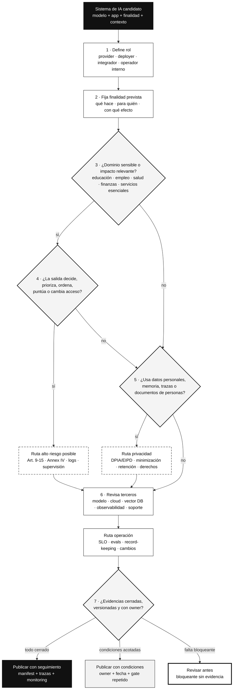
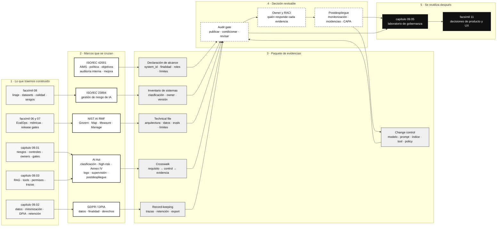

::: {.fasciculo-subtitle}
Facsímil 9 · Seguridad, privacidad y gobernanza
:::

# Capítulo 04: Cumplimiento y auditoría: AI Act, ISO 42001 y paquetes de evidencia

## Qué deberías poder hacer al terminar

Los tres capítulos anteriores nos han dado las piezas técnicas: inventario, riesgos, privacidad, RAG, tools, permisos, trazas y gates. Ahora toca una pregunta incómoda pero muy real:

> Si mañana alguien nos pide demostrar que este sistema de IA está controlado, ¿qué enseñamos?

No basta con decir “tenemos buenas prácticas”. Tampoco basta con un documento largo que nadie conecta con código. Cumplimiento, para un equipo de ingeniería, significa tener un puente entre requisitos, decisiones técnicas y evidencias. La auditoría no debería ser una interrupción heroica al final del proyecto, sino una consecuencia natural de cómo construimos.

Al terminar deberías poder hacer esto:

| Resultado de aprendizaje | Evidencia de que lo sabes hacer |
|---|---|
| Distinguir marco legal, estándar y control técnico. | No confundes AI Act, ISO/IEC 42001, NIST AI RMF y tus tests de CI. |
| Clasificar un sistema por uso, rol y contexto. | No clasificas solo por modelo; miras finalidad, dominio, usuario, efecto y despliegue. |
| Construir un paquete de evidencias. | Puedes enseñar inventario, alcance, versión, datos, evals, logs, owners, riesgos y cambios. |
| Mapear requisitos a artefactos. | Cada requisito tiene owner, control, evidencia, versión y estado. |
| Entender ISO/IEC 42001 como sistema de gestión. | No lo tratas como una pegatina: lo conectas con procesos, objetivos, riesgos y mejora continua. |
| Preparar una revisión de AI Act sin improvisar. | Tienes technical documentation, registro, trazas, supervisión humana y monitorización. |
| Ejecutar una práctica real. | Generas register, matriz AI Act/ISO/NIST, manifest, technical file, gate y playbook de auditoría. |

Este capítulo no es asesoría legal. Es una guía de ingeniería para llegar a una revisión con artefactos y preguntas bien formuladas.

## La escena: el sistema funciona, pero ahora hay que demostrarlo

Imagina que el asistente académico de capítulos anteriores ya responde bien. Tiene RAG, tools y trazas. Se han pasado evals. Se han revisado datos personales. En la demo todo encaja.

Entonces aparece una revisión interna y pregunta:

| Pregunta | Qué necesita ver |
|---|---|
| ¿Cuál es la finalidad prevista del sistema? | Declaración de alcance, ficha del sistema y límites de uso. |
| ¿Quién es proveedor, quién despliega y quién opera? | Roles, RACI, contratos y owner técnico. |
| ¿Qué versión está publicada? | Manifest de release, modelo, prompt, índice RAG, policy y tools. |
| ¿Qué datos usa? | Data cards, linaje, permisos, minimización y DPIA/EIPD si aplica. |
| ¿Qué riesgos se identificaron? | Registro de riesgos, controles, owner y riesgo residual. |
| ¿Qué logs existen? | Política de record-keeping, muestra de trazas y retención. |
| ¿Cómo se supervisa humanamente? | Manual de operación, approval gates y escalado. |
| ¿Qué ocurre después de publicar? | Plan de monitorización, incidencias, cambios y revisión periódica. |

Si cada respuesta exige buscar en Slack, mirar carpetas, preguntar a tres personas y reconstruir decisiones a mano, el sistema no está preparado para auditoría. La calidad de un paquete de evidencias se mide por una cosa: **cuánto tarda una persona ajena al proyecto en reconstruir por qué el sistema se pudo publicar**.

## Fecha de corte y fuentes consultadas

**Fecha de corte:** 7 de junio de 2026.

Fuentes consultadas: Reglamento (UE) 2024/1689, página oficial de la Comisión Europea sobre AI Act y calendario de aplicación, ISO/IEC 42001:2023, ISO/IEC 23894:2023, ISO/IEC 5338:2023, NIST AI RMF 1.0, NIST AI RMF Generative AI Profile, NIST SP 800-207 sobre Zero Trust Architecture, GDPR, NIST Privacy Framework, Model Cards, Datasheets for Datasets y el eBook de Anthropic sobre Zero Trust para agentes de IA publicado el 18 de mayo de 2026.

El AI Act es el Reglamento (UE) 2024/1689, publicado en el Diario Oficial el 12 de julio de 2024 y en vigor desde el 1 de agosto de 2024.^[European Parliament and Council of the European Union. (2024). *Regulation (EU) 2024/1689*. https://eur-lex.europa.eu/eli/reg/2024/1689/oj. Consultado el 7 de junio de 2026.] La Comisión Europea indica que será plenamente aplicable el 2 de agosto de 2026, con excepciones y periodos específicos; también señala la aplicación de obligaciones de alfabetización en IA y prácticas prohibidas desde el 2 de febrero de 2025, obligaciones para modelos GPAI desde el 2 de agosto de 2025 y calendarios específicos para sistemas de alto riesgo.^[European Commission. (2026). *AI Act: regulatory framework and application timeline*. https://digital-strategy.ec.europa.eu/en/policies/regulatory-framework-ai. Consultado el 7 de junio de 2026.]

ISO/IEC 42001:2023 define requisitos para establecer, implementar, mantener y mejorar continuamente un sistema de gestión de IA dentro de una organización. ISO lo presenta como el primer estándar mundial de sistema de gestión de IA, orientado a gestionar riesgos y oportunidades y a demostrar uso responsable, trazabilidad, transparencia y fiabilidad.^[International Organization for Standardization. (2023). *ISO/IEC 42001:2023 Information technology — Artificial intelligence — Management system*. https://www.iso.org/standard/42001. Consultado el 7 de junio de 2026.] ISO/IEC 23894:2023 ofrece guía para gestionar riesgos específicos de IA e integrarlos en actividades y funciones de la organización.^[International Organization for Standardization. (2023). *ISO/IEC 23894:2023 Information technology — Artificial intelligence — Guidance on risk management*. https://www.iso.org/standard/77304. Consultado el 7 de junio de 2026.] ISO/IEC 5338:2023 define procesos de ciclo de vida para sistemas de IA basados en aprendizaje automático y enfoques heurísticos, conectándolos con procesos de sistema y software.^[International Organization for Standardization. (2023). *ISO/IEC 5338:2023 Information technology — Artificial intelligence — AI system life cycle processes*. https://www.iso.org/standard/81118. Consultado el 7 de junio de 2026.]

## Qué no es cumplimiento en IA

Cumplimiento no es copiar artículos en una tabla. Eso puede servir de inventario inicial, pero no demuestra nada por sí solo.

Cumplimiento no es certificar un modelo aislado y olvidarse de la aplicación. En sistemas LLM, el comportamiento depende de modelo, prompt, RAG, tools, permisos, memoria, UI, datos, política, proveedor y operación. Cambiar el retriever, añadir una tool o modificar un prompt puede cambiar el riesgo del sistema.

Cumplimiento no es “legal lo revisará al final”. Legal puede interpretar obligaciones, pero ingeniería debe producir evidencias: versiones, tests, logs, manifests, owners, trazas, resultados y decisiones.

Y cumplimiento no es publicar menos. Una buena práctica de cumplimiento debería permitir publicar con más claridad: qué entra, qué sale, qué no se permite, quién decide, con qué evidencia y cuándo se revisa.

| Mal enfoque | Enfoque de ingeniería |
|---|---|
| “Tenemos un documento de política.” | ¿Qué control técnico demuestra que se cumple? |
| “El proveedor dice que es seguro.” | ¿Qué versión servimos, con qué contrato, región, logs y límites? |
| “No somos alto riesgo porque usamos un LLM general.” | ¿Cuál es el uso previsto, dominio y efecto sobre personas? |
| “El sistema tiene trazas.” | ¿Las trazas registran decisiones de política y son revisables? |
| “Tenemos ISO 42001 en roadmap.” | ¿Qué procesos del AIMS ya existen y qué evidencia dejan? |

## AI Act explicado para ingenieros

El AI Act no se lee como una librería. Se lee como un mapa de obligaciones por rol, categoría y uso. Para ingeniería, la primera decisión no es “qué modelo usamos”, sino:

```text
sistema_de_IA = modelo + aplicación + finalidad + contexto + usuario + efecto
```

Un mismo modelo puede aparecer en contextos muy distintos. Un asistente interno que resume documentación técnica no se evalúa igual que un sistema que ayuda a tomar decisiones educativas, laborales, sanitarias o de acceso a servicios relevantes. El uso previsto importa.

### Roles que cambian obligaciones

| Rol | Pregunta de ingeniería |
|---|---|
| Provider | ¿Diseñamos, desarrollamos o ponemos el sistema en mercado/servicio bajo nuestro nombre? |
| Deployer | ¿Usamos el sistema bajo nuestra autoridad en una operación real? |
| Importer o distributor | ¿Introducimos o distribuimos un sistema de terceros en el mercado? |
| Product owner interno | ¿Somos responsables de uso, cambios, owners y evidencias aunque no seamos proveedor legal? |
| Integrador | ¿Conectamos modelo, RAG, tools y procesos internos hasta crear un sistema nuevo? |

Un equipo técnico debe documentar estos roles. Si no sabes qué rol ocupa tu organización, no sabes qué obligaciones revisar.

### Categoría de riesgo como función del uso

En ingeniería conviene evitar frases vagas. Ejemplo de fórmula: podemos modelar la clasificación inicial así para recordar las variables que hay que discutir. No reemplaza una evaluación jurídica ni una clasificación formal.

$$
clasificacion = f(finalidad, dominio, usuario, efecto, autonomia, datos, despliegue)
$$

| Variable | Pregunta |
|---|---|
| Finalidad | ¿Para qué se usa realmente el sistema? |
| Dominio | ¿Educación, empleo, salud, finanzas, justicia, infraestructura, atención al cliente, productividad interna? |
| Usuario | ¿Profesional, estudiante, ciudadano, empleado, operador interno? |
| Efecto | ¿Informa, recomienda, prioriza, decide, actúa o modifica estado? |
| Autonomía | ¿La salida se ejecuta sola, requiere revisión o solo orienta? |
| Datos | ¿Usa datos personales, sensibles, históricos, inferidos o de terceros? |
| Despliegue | ¿Está en producción, piloto, herramienta interna, API pública o componente de producto? |

El resultado no debería ser una etiqueta suelta. Debería ser una decisión documentada:

```json
{
  "system_id": "academic_support_assistant",
  "intended_purpose": "orientar sobre trámites académicos y preparar respuestas revisables",
  "deployment_context": "universidad",
  "user_roles": ["student", "operator"],
  "effect": "guidance_and_prepare",
  "risk_classification": "limited_or_context_dependent",
  "classification_rationale": "no decide acceso ni califica; prepara información y requiere revisión para acciones",
  "next_review": "2026-09-01",
  "owner": "equipo-plataforma-ia"
}
```

### Artículos que un ingeniero debería reconocer

No hace falta memorizar todo el reglamento. Sí conviene reconocer los artículos que se traducen directamente a artefactos:

| AI Act | Lectura técnica | Artefacto de ingeniería |
|---|---|---|
| Art. 9 · Risk management system | Riesgos identificados, evaluados, controlados y revisados durante el ciclo de vida. | `risk_register.md`, matriz de controles, gate de release. |
| Art. 10 · Data governance | Datos adecuados, relevantes, suficientemente representativos y controlados. | datasheets, linaje, calidad, sesgos, minimización. |
| Art. 11 + Annex IV · Technical documentation | Documento técnico suficiente para evaluar conformidad. | technical file versionado. |
| Art. 12 · Record-keeping | Registro automático de eventos durante la vida del sistema. | trazas, logs, retención y export de auditoría. |
| Art. 13 · Transparency and instructions | Información comprensible para quienes usan o despliegan. | instrucciones de uso, límites, UI copy, operator manual. |
| Art. 14 · Human oversight | Diseño para supervisión humana efectiva. | approval gates, escalado, roles y evidencias de revisión. |
| Art. 15 · Accuracy, robustness and cybersecurity | Métricas, resiliencia y seguridad técnica. | evals, SLO, pruebas, monitoring y controles de app. |
| Art. 17 · Quality management system | Procesos de calidad para proveedores de alto riesgo. | QMS/AIMS, change control, CAPA, supplier review. |
| Art. 27 · Fundamental rights impact assessment | Evaluación de impacto en ciertos usos por deployers. | FRIA/EIPD, si aplica. |
| Art. 43 · Conformity assessment | Evaluación antes de poner en mercado/servicio. | checklist de conformidad y evidencias cerradas. |
| Art. 47 · Declaration of conformity | Declaración formal de conformidad si aplica. | declaración versionada y firmada. |
| Art. 49 · EU database | Registro de ciertos sistemas de alto riesgo. | ficha de registro y URL/entry si aplica. |
| Art. 72 · Post-market monitoring | Seguimiento tras publicación. | monitoring plan, incidencias, cambios y revisiones. |

El propio Reglamento indica que la documentación técnica de sistemas de alto riesgo debe demostrar cumplimiento y contener, como mínimo, elementos de Annex IV.^[Regulation (EU) 2024/1689, Article 11 and Annex IV. https://eur-lex.europa.eu/eli/reg/2024/1689/oj. Consultado el 7 de junio de 2026.] Annex IV pide, entre otros elementos, descripción general del sistema, finalidad prevista, proveedor, versión y relación con versiones previas, interacción con hardware/software, formas de puesta en servicio, interfaz e instrucciones de uso.^[Regulation (EU) 2024/1689, Annex IV. https://eur-lex.europa.eu/eli/reg/2024/1689/oj. Consultado el 7 de junio de 2026.]

### Árbol de decisión operativo

Un equipo técnico necesita convertir el marco en una ruta de preguntas. Si no hay ruta, cada revisión se convierte en debate. El árbol siguiente no sustituye asesoría legal, pero sí ayuda a que ingeniería llegue a la reunión con datos ordenados.



Lo importante no es memorizar el diagrama. Lo importante es que la clasificación quede como una decisión reproducible. Si dos personas técnicas leen el mismo inventario, deberían llegar a una conclusión parecida o, al menos, entender en qué variable discrepan.

## ISO/IEC 42001 explicado sin solemnidad

ISO/IEC 42001 no es una certificación de “este modelo contesta bien”. Es un sistema de gestión. Eso significa que mira cómo una organización gobierna IA: alcance, políticas, roles, objetivos, riesgos, oportunidades, recursos, operación, evaluación, auditorías internas y mejora.

Para un ingeniero, la forma útil de entenderlo es:

> ISO/IEC 42001 pregunta si la organización tiene un sistema repetible para gestionar IA, no si una demo concreta impresiona.

| Pregunta de ISO 42001 | Traducción técnica |
|---|---|
| ¿Cuál es el alcance del AIMS? | Qué productos, equipos, datos, modelos, proveedores y entornos cubre. |
| ¿Qué política de IA existe? | Qué usos se permiten, condicionan o revisan. |
| ¿Qué roles hay? | RACI: product owner, ML/AI engineer, data owner, compliance, security, operador. |
| ¿Cómo se evalúan riesgos y oportunidades? | Registro de riesgos, criterios de severidad, controles, gates y owners. |
| ¿Cómo se controla el ciclo de vida? | Intake, diseño, datos, evaluación, release, monitoring y retirada. |
| ¿Cómo se miden resultados? | KPIs, evals, SLOs, incidencias y revisiones. |
| ¿Cómo se mejora? | CAPA, retrospectivas, cambios y auditorías internas. |

ISO/IEC 23894 encaja como guía de gestión de riesgo específica de IA: ayuda a integrar la gestión de riesgos en actividades y funciones relacionadas con IA. ISO/IEC 5338 aporta procesos de ciclo de vida: definición, control, gestión, ejecución y mejora del sistema de IA durante sus etapas. Leídos juntos, 42001 pregunta “¿tenéis sistema de gestión?”, 23894 ayuda con “¿cómo gestionáis riesgo?” y 5338 ayuda con “¿cómo gobernáis el ciclo de vida?”.

### ISO 42001 como SDLC de IA

Para que ISO/IEC 42001 sea útil a ingeniería, conviene proyectarla sobre el ciclo de vida real. ISO habla de establecer, implementar, mantener y mejorar un AIMS; en un equipo de software eso debería aparecer en tickets, PRs, pipelines, manifests y revisiones.

| Momento del ciclo | Pregunta AIMS | Evidencia técnica |
|---|---|---|
| Intake | ¿Por qué existe este sistema y qué uso queda fuera? | ficha de caso de uso, finalidad, límites, owner. |
| Diseño | ¿Qué arquitectura, datos, modelo y terceros entran? | diagrama, ADR, proveedor, data card, modelo de riesgos. |
| Construcción | ¿Qué controles se implementan? | PRs, tests, políticas, RAG ACL, tool contracts, redacción de trazas. |
| Evaluación | ¿Qué medimos antes de publicar? | eval datasets, thresholds, informes, regresiones, revisión por slices. |
| Release | ¿Qué condición permite publicar? | release manifest, gate, approvals, hash de evidencias. |
| Operación | ¿Qué observamos después? | SLO, alertas, costes, drift, incidencias, cambios. |
| Mejora | ¿Qué aprendimos y qué corregimos? | CAPA, postmortems, auditoría interna, revisión de política. |

La diferencia con un documento bonito es que cada fila debe dejar una huella. Si la revisión no puede abrir un PR, un manifest, un log o una salida generada por pipeline, el AIMS está más cerca de una intención que de un sistema de gestión.

## Terceros y due diligence técnica

Los sistemas modernos de IA rara vez son una sola pieza. Puede haber API de modelo, almacenamiento vectorial, proveedor cloud, observabilidad, colas, OCR, motor de redacción de datos, evaluadores automáticos, gateway de APIs y herramientas internas. Cada proveedor cambia el paquete de evidencias.

| Capa | Qué hay que preguntar | Evidencia mínima |
|---|---|---|
| Modelo alojado | Qué versión se sirve, región, retención, logs, límites, cambios y contrato. | ficha de proveedor, DPA, SLA/SLO, política de datos, versión de modelo. |
| Modelo local | Pesos, licencia, runtime, cuantización, GPU, controles de acceso y actualizaciones. | model card, LICENSE, hash de pesos, benchmark interno, runbook. |
| Vector DB | Dónde viven embeddings, metadatos, ACL, backups, borrado y reindexado. | data flow, retention plan, ACL tests, tombstones, restore test. |
| Observabilidad | Qué campos registra, si guarda prompts, salidas, documentos o datos personales. | schema de traza, redacción, retención, acceso y export. |
| Tools externas | Qué acciones permite, con qué permisos y qué evidencia deja. | tool contract, scopes, approval gate, idempotency key, trace sample. |
| Cloud | Región, cifrado, IAM, red, auditoría, backups y subprocesadores. | arquitectura, IAM review, logging policy, contrato y plan de salida. |

El criterio práctico es simple: si un tercero puede ver datos, cambiar comportamiento, afectar disponibilidad o modificar una decisión operativa, no es un detalle de arquitectura. Es parte del expediente.

## AI-BOM y Zero Trust para agentes

El eBook de Anthropic sobre Zero Trust para agentes de IA, publicado el 18 de mayo de 2026, aporta una idea muy útil para este capítulo: cuando un agente puede usar tools, memoria, credenciales y sistemas externos, el paquete de evidencias ya no puede limitarse a “modelo, prompt y evaluación”. Tiene que demostrar quién actúa, con qué permiso, durante cuánto tiempo, sobre qué datos y con qué salida revisable.^[Anthropic. (2026). *Zero Trust for AI Agents: A Security Framework for Deploying Autonomous AI Agents in the Enterprise*. https://cdn.prod.website-files.com/6889473510b50328dbb70ae6/6a1611a04085d7cd3dadc924_Claude-eBook-Zero-Trust-for-AI-Agents-05182026.pdf. Consultado el 7 de junio de 2026.] La raíz conceptual viene de NIST SP 800-207: no asumir confianza implícita por estar “dentro” de una red, sino verificar acceso y contexto de forma explícita.^[Rose, S., Borchert, O., Mitchell, S., & Connelly, S. (2020). *Zero Trust Architecture*. NIST SP 800-207. https://doi.org/10.6028/NIST.SP.800-207. Consultado el 7 de junio de 2026.]

Para ingeniería, la forma de aterrizarlo es un **AI-BOM**: un inventario de componentes vivos del sistema de IA. Igual que un SBOM ayuda a entender dependencias de software, un AI-BOM ayuda a entender qué piezas pueden cambiar el comportamiento del sistema.

| Componente del AI-BOM | Qué debe declarar | Por qué importa en auditoría |
|---|---|---|
| Modelo | proveedor, `model_id`, región, versión servida, modo de razonamiento si aplica. | Permite saber qué sistema generó una salida y si cambió entre dos revisiones. |
| Prompt y plantilla | versión, owner, roles, instrucciones de sistema, contrato de salida. | Un cambio pequeño puede alterar formato, permisos, tono y criterios de decisión. |
| RAG | índice, corpus, ACL, fecha de indexado, chunking, embedding y reranker. | La respuesta depende de lo recuperado; sin linaje no se puede revisar una cita. |
| Tools | nombre, acción permitida, scopes, modo lectura/escritura, idempotencia, approval. | Un agente no solo responde: puede consultar, preparar o ejecutar acciones. |
| Memoria | tipo, TTL, owner, origen, hash, aislamiento por sesión o usuario. | La memoria persistente puede arrastrar contexto viejo, sensible o no verificable. |
| Credenciales | identidad del agente, caducidad, ámbito, rotación y separación por entorno. | Evita que una credencial genérica convierta un error pequeño en un cambio amplio. |
| Políticas | allowlists, validación de parámetros, egress, retención, escalado y fallback. | La política real debe estar versionada y ejecutarse, no vivir solo en un documento. |
| Evidencias | hashes, manifests, gates, logs, evals, decisiones y owners. | Sin evidencias no hay forma de reconstruir por qué una versión pudo publicarse. |

La expresión “Least Agency” del documento se puede traducir de forma operativa como **menor capacidad de actuación necesaria**. No preguntes “¿el agente puede hacerlo?”. Pregunta:

| Pregunta de diseño | Buena señal |
|---|---|
| ¿Necesita ejecutar acciones o basta con preparar una propuesta? | La tool separa `prepare` de `execute`. |
| ¿Necesita ver todos los documentos o solo los autorizados para ese usuario? | La ACL se aplica antes de recuperar contexto. |
| ¿Necesita una credencial larga o un token corto por tarea? | La credencial caduca y está limitada por scope. |
| ¿Necesita memoria persistente o basta con memoria de sesión? | La memoria tiene TTL, hash de origen y borrado verificable. |
| ¿Necesita actuar sin revisión humana? | Las acciones de impacto pasan por approval. |

Una auditoría técnica debería poder pedir una matriz como esta:

| Control Zero Trust | Evidencia defendible | Nivel mínimo |
|---|---|---|
| Identidad única del agente | `agent_id`, entorno, owner, certificado o token asociado. | Cada agente tiene identidad distinta de usuario, servicio y proveedor. |
| Credenciales cortas | TTL, scopes, rotación y registro de uso. | No hay tokens genéricos permanentes para tools sensibles. |
| Límite de tools | allowlist, contrato de parámetros y modo `read/prepare/execute`. | El agente no descubre tools fuera de su caso de uso. |
| Validación de parámetros | schema, rangos, tipos, catálogos y bloqueo de campos extra. | La tool rechaza entradas fuera de contrato antes de tocar sistemas externos. |
| Memoria aislada | `memory_store_id`, TTL, origen, hash, permisos y purga. | Una sesión no hereda memoria de otra sin autorización explícita. |
| Configuración íntegra | policy-as-code, manifest, hash, revisión y despliegue reproducible. | Cambiar una política deja rastro y repite el gate necesario. |
| Observabilidad | trazas con policy version, tool call, decisión y motivo. | Se puede reconstruir una acción sin conservar más datos de los necesarios. |
| Reversibilidad | rollback, desactivación de tool, revocación de credenciales y plan de continuidad. | Existe un camino probado para volver a estado anterior. |

Un buen test de madurez es este: si una credencial, una memoria o una tool se configura mal, ¿el control lo hace imposible o solo lo hace más lento? En sistemas de IA, los controles más valiosos reducen capacidad real, no solo añaden una advertencia.

### Configuración como evidencia

La configuración de un agente debe tratarse como código revisable. En un paquete serio no basta con decir “tenemos límites”; hay que enseñar qué límites estaban activos.

```yaml
agent_boundary:
  agent_id: admissions_prioritization_helper.agent.review
  owner: owner-platform
  environment: pilot
  identity:
    credential_ttl_minutes: 30
    credential_scope:
      - cases:read
      - ranking:prepare
    forbidden_scopes:
      - cases:update
      - email:send
  tools:
    allowed:
      - retrieve_admissions_policy
      - prepare_ranking_explanation
    requires_human_approval:
      - publish_ranking
  memory:
    store: session_only
    ttl_hours: 8
    source_attribution_required: true
    hash_records: true
  observability:
    log_policy_version: true
    log_tool_parameters_hash: true
    store_personal_data_in_trace: false
```

El YAML no “cumple” por sí solo. Cumple cuando se conecta con runtime, tests, trazas y gate. La configuración versionada sirve para que una revisión pueda comparar: qué estaba permitido antes, qué se cambió, quién lo aprobó y qué evidencia se generó después.

## Anatomía de un paquete de evidencias

El paquete de evidencias debe ser versionado. No es una carpeta infinita. Es un conjunto de artefactos que se pueden revisar con una pregunta concreta: **¿esta versión del sistema puede publicarse o mantenerse en servicio?**

<svg id="f9-c04-evidence-package" xmlns="http://www.w3.org/2000/svg" viewBox="0 0 1800 1220" role="img" aria-label="Anatomía de un paquete de evidencias para AI Act, ISO 42001 y auditoría">
  <defs>
    <marker id="f9c04-arrow" viewBox="0 0 10 10" refX="8.5" refY="5" markerWidth="7" markerHeight="7" orient="auto-start-reverse">
      <path d="M 0 0 L 10 5 L 0 10 z" fill="#111111"/>
    </marker>
    <pattern id="f9c04-hatch" width="10" height="10" patternUnits="userSpaceOnUse" patternTransform="rotate(45)">
      <line x1="0" y1="0" x2="0" y2="10" stroke="#D8D8D8" stroke-width="3"/>
    </pattern>
    <style>
      #f9-c04-evidence-package { font-family: Inter, Arial, sans-serif; background: #fff; }
      #f9-c04-evidence-package .frame { fill: #fff; stroke: #111; stroke-width: 2.2; }
      #f9-c04-evidence-package .panel { fill: #fff; stroke: #111; stroke-width: 1.7; }
      #f9-c04-evidence-package .soft { fill: #f6f6f6; stroke: #111; stroke-width: 1.5; }
      #f9-c04-evidence-package .dark { fill: #111; stroke: #111; stroke-width: 1.5; }
      #f9-c04-evidence-package .hatch { fill: url(#f9c04-hatch); stroke: #111; stroke-width: 1.4; }
      #f9-c04-evidence-package .title { font-size: 34px; font-weight: 800; fill: #111; }
      #f9-c04-evidence-package .subtitle { font-size: 17px; fill: #555; }
      #f9-c04-evidence-package .label { font-size: 18px; font-weight: 750; fill: #111; }
      #f9-c04-evidence-package .small { font-size: 14px; fill: #444; }
      #f9-c04-evidence-package .tiny { font-size: 12px; fill: #666; }
      #f9-c04-evidence-package .white { fill: #fff; }
      #f9-c04-evidence-package .line { stroke: #111; stroke-width: 1.8; fill: none; marker-end: url(#f9c04-arrow); }
      #f9-c04-evidence-package .dash { stroke: #555; stroke-width: 1.4; fill: none; stroke-dasharray: 8 7; marker-end: url(#f9c04-arrow); }
      #f9-c04-evidence-package .thin { stroke: #777; stroke-width: 1.1; fill: none; }
    </style>
  </defs>

  <rect x="24" y="24" width="1752" height="1168" rx="18" class="frame"/>
  <text x="70" y="82" class="title">Paquete de evidencias de un sistema de IA</text>
  <text x="70" y="116" class="subtitle">No es documentación por volumen: es trazabilidad entre requisitos, controles, pruebas y decisiones.</text>

  <rect x="70" y="165" width="300" height="245" rx="16" class="panel"/>
  <text x="220" y="205" text-anchor="middle" class="label">1 · Alcance</text>
  <text x="220" y="244" text-anchor="middle" class="small">system_id</text>
  <text x="220" y="270" text-anchor="middle" class="small">finalidad prevista</text>
  <text x="220" y="296" text-anchor="middle" class="small">roles y contexto</text>
  <text x="220" y="322" text-anchor="middle" class="small">versión y límites</text>
  <line x1="115" y1="348" x2="335" y2="348" class="thin"/>
  <text x="220" y="376" text-anchor="middle" class="tiny">si no hay alcance, no hay auditoría</text>

  <rect x="450" y="165" width="300" height="245" rx="16" class="soft"/>
  <text x="600" y="205" text-anchor="middle" class="label">2 · Clasificación</text>
  <text x="600" y="244" text-anchor="middle" class="small">AI Act</text>
  <text x="600" y="270" text-anchor="middle" class="small">rol: provider/deployer</text>
  <text x="600" y="296" text-anchor="middle" class="small">uso y dominio</text>
  <text x="600" y="322" text-anchor="middle" class="small">rationale revisable</text>
  <line x1="495" y1="348" x2="705" y2="348" class="thin"/>
  <text x="600" y="376" text-anchor="middle" class="tiny">la clasificación cambia obligaciones</text>

  <rect x="830" y="165" width="300" height="245" rx="16" class="panel"/>
  <text x="980" y="205" text-anchor="middle" class="label">3 · Controles</text>
  <text x="980" y="244" text-anchor="middle" class="small">riesgos y mitigaciones</text>
  <text x="980" y="270" text-anchor="middle" class="small">datos y privacidad</text>
  <text x="980" y="296" text-anchor="middle" class="small">RAG, tools y logs</text>
  <text x="980" y="322" text-anchor="middle" class="small">supervisión humana</text>
  <line x1="875" y1="348" x2="1085" y2="348" class="thin"/>
  <text x="980" y="376" text-anchor="middle" class="tiny">cada control necesita owner</text>

  <rect x="1210" y="165" width="300" height="245" rx="16" class="soft"/>
  <text x="1360" y="205" text-anchor="middle" class="label">4 · Evidencias</text>
  <text x="1360" y="244" text-anchor="middle" class="small">tests y evals</text>
  <text x="1360" y="270" text-anchor="middle" class="small">technical file</text>
  <text x="1360" y="296" text-anchor="middle" class="small">manifests y trazas</text>
  <text x="1360" y="322" text-anchor="middle" class="small">registros postdespliegue</text>
  <line x1="1255" y1="348" x2="1465" y2="348" class="thin"/>
  <text x="1360" y="376" text-anchor="middle" class="tiny">sin evidencia no hay control</text>

  <path d="M370 288 H450" class="line"/>
  <path d="M750 288 H830" class="line"/>
  <path d="M1130 288 H1210" class="line"/>

  <rect x="110" y="510" width="1500" height="280" rx="18" class="hatch"/>
  <text x="860" y="552" text-anchor="middle" class="label">Matriz de trazabilidad</text>
  <text x="860" y="584" text-anchor="middle" class="small">requisito → control → artefacto → owner → versión → resultado → decisión</text>

  <rect x="170" y="630" width="210" height="90" rx="12" class="panel"/>
  <text x="275" y="666" text-anchor="middle" class="small">AI Act</text>
  <text x="275" y="692" text-anchor="middle" class="tiny">Art. 9 · 11 · 12 · 13 · 14 · 15 · 17</text>
  <rect x="455" y="630" width="210" height="90" rx="12" class="panel"/>
  <text x="560" y="666" text-anchor="middle" class="small">ISO 42001</text>
  <text x="560" y="692" text-anchor="middle" class="tiny">AIMS · objetivos · mejora</text>
  <rect x="740" y="630" width="210" height="90" rx="12" class="panel"/>
  <text x="845" y="666" text-anchor="middle" class="small">NIST AI RMF</text>
  <text x="845" y="692" text-anchor="middle" class="tiny">Govern · Map · Measure · Manage</text>
  <rect x="1025" y="630" width="210" height="90" rx="12" class="panel"/>
  <text x="1130" y="666" text-anchor="middle" class="small">GDPR/DPIA</text>
  <text x="1130" y="692" text-anchor="middle" class="tiny">datos · finalidad · derechos</text>
  <rect x="1310" y="630" width="210" height="90" rx="12" class="panel"/>
  <text x="1415" y="666" text-anchor="middle" class="small">Operación</text>
  <text x="1415" y="692" text-anchor="middle" class="tiny">SLO · logs · cambios · CAPA</text>

  <rect x="140" y="895" width="360" height="160" rx="16" class="panel"/>
  <text x="320" y="936" text-anchor="middle" class="label">Gate de auditoría</text>
  <text x="320" y="972" text-anchor="middle" class="small">publicar</text>
  <text x="320" y="998" text-anchor="middle" class="small">publicar con condiciones</text>
  <text x="320" y="1024" text-anchor="middle" class="small">revisar antes</text>

  <rect x="620" y="895" width="360" height="160" rx="16" class="soft"/>
  <text x="800" y="936" text-anchor="middle" class="label">Audit trail</text>
  <text x="800" y="972" text-anchor="middle" class="small">quién cambió qué</text>
  <text x="800" y="998" text-anchor="middle" class="small">cuándo y por qué</text>
  <text x="800" y="1024" text-anchor="middle" class="small">con qué evidencia</text>

  <rect x="1100" y="895" width="360" height="160" rx="16" class="dark"/>
  <text x="1280" y="936" text-anchor="middle" class="label white">Mejora continua</text>
  <text x="1280" y="972" text-anchor="middle" class="small white">monitorización</text>
  <text x="1280" y="998" text-anchor="middle" class="small white">incidencias</text>
  <text x="1280" y="1024" text-anchor="middle" class="small white">acciones correctivas</text>

  <path d="M860 790 C810 850 520 860 320 895" class="dash"/>
  <path d="M860 790 V895" class="dash"/>
  <path d="M860 790 C930 850 1110 860 1280 895" class="dash"/>
  <text x="1728" y="1138" text-anchor="end" class="tiny" fill="#888888" opacity="0.55">IA para gente curiosa / Facsímil 09 / Capítulo 04 / 686f6c61</text>
</svg>

La matriz central del SVG es la pieza importante. Ejemplo de fórmula: para cada requisito, deberíamos poder rellenar esta tupla de evidencia. Es una plantilla de ingeniería documental.

$$
E(r) = (control, artefacto, owner, version, fecha, resultado, decision)
$$

Un requisito sin artefacto es deseo. Un artefacto sin owner se queda viejo. Un owner sin versión no puede explicar qué se revisó. Una versión sin resultado no demuestra nada. Un resultado sin decisión no cierra el ciclo.

## De requisito a evidencia: tabla de ingeniería

Esta tabla es el corazón del capítulo. No pretende agotar cada obligación. Pretende enseñar la forma mental correcta.

| Requisito o marco | Qué se pregunta | Evidencia útil |
|---|---|---|
| AI Act · Art. 9 | ¿Hay gestión de riesgos durante el ciclo de vida? | Registro de riesgos, criterios, controles, revisión residual y cambios. |
| AI Act · Art. 10 | ¿Los datos están gobernados? | Linaje, datasheets, calidad, representatividad, minimización y exclusiones. |
| AI Act · Art. 11 + Annex IV | ¿Existe documentación técnica suficiente? | Technical file con finalidad, arquitectura, versiones, datos, evaluación y límites. |
| AI Act · Art. 12 | ¿El sistema registra eventos relevantes? | `trace_sample.jsonl`, política de logs, retención y campos mínimos. |
| AI Act · Art. 13 | ¿Quien despliega entiende uso y límites? | Instrucciones de uso, UI copy, manual de operador y warnings operativos. |
| AI Act · Art. 14 | ¿Hay supervisión humana efectiva? | Approval gates, escalado, roles, training y ejemplos de intervención. |
| AI Act · Art. 15 | ¿Hay métricas de calidad, robustez y seguridad? | Evals, SLO, tests de regresión, monitoring y appsec gate. |
| AI Act · Art. 17 | ¿Hay sistema de calidad? | Change control, supplier review, CAPA, auditoría interna y mejora. |
| ISO/IEC 42001 | ¿La organización gestiona IA de forma repetible? | AIMS scope, política, objetivos, procesos, owners y revisión directiva. |
| ISO/IEC 23894 | ¿La gestión de riesgo de IA está integrada? | Metodología de riesgo, criterios, tratamiento, monitorización y revisión. |
| ISO/IEC 5338 | ¿El ciclo de vida de IA está definido? | Intake, diseño, datos, entrenamiento/integración, validación, operación y retirada. |
| NIST AI RMF | ¿Gobernamos, mapeamos, medimos y gestionamos? | Evidencias por Govern, Map, Measure y Manage. |
| GDPR/DPIA | ¿Se tratan datos personales con base, finalidad y proporcionalidad? | Mapa de flujos, DPIA/EIPD, minimización, retención y derechos. |

## Technical documentation operativa

Una documentación técnica útil debe poder leerse por capas:

| Capa | Qué contiene |
|---|---|
| Identidad | `system_id`, nombre, owner, proveedor, deployer, versión, fecha y estado. |
| Finalidad | Qué hace, qué no hace, para quién, en qué contexto y con qué límites. |
| Arquitectura | Modelo, prompts, RAG, tools, memoria, UI, proveedores, entornos y dependencias. |
| Datos | Fuentes, linaje, permisos, calidad, sensibilidad, minimización y retención. |
| Evaluación | Datasets, métricas, thresholds, resultados, comparativas y limitaciones. |
| Controles | Riesgos, mitigaciones, approval gates, logs, privacidad, appsec y monitorización. |
| Operación | SLO, runbooks, incidencias, cambios, retirada y revisión periódica. |
| Evidencias | Links o paths a artefactos versionados, con owner y fecha. |

Si una sección no enlaza con artefactos reales, es probable que sea narrativa. La narrativa ayuda a explicar; no sustituye evidencia.

### Annex IV como schema de ingeniería

Annex IV no debería quedarse como una referencia abstracta. Podemos convertirlo en un contrato de documentación. El contrato no tiene que ser perfecto desde el primer día, pero sí debe forzar campos que normalmente se olvidan.

```yaml
technical_file:
  system_identity:
    system_id: string
    provider: string
    deployer: string
    owner: string
    version: string
    previous_version: string
    intended_purpose: string
    out_of_scope_uses: [string]
  deployment_form:
    api_or_app: string
    environments: [dev, staging, production]
    regions: [string]
    hardware_or_runtime: string
    user_interface_summary: string
    instructions_for_deployer: string
  architecture:
    model_id: string
    prompt_version: string
    rag_index_version: string
    tool_policy_version: string
    third_party_components: [string]
    interaction_diagram: path
  data:
    sources: [string]
    personal_data: boolean
    retention_days: integer
    minimization_controls: [string]
    quality_checks: [string]
  evaluation:
    datasets: [string]
    metrics: [string]
    thresholds: object
    latest_results: path
    known_limitations: [string]
  oversight_and_logs:
    human_review_required: boolean
    approval_rules: [string]
    trace_schema: path
    retention_policy: path
  evidence:
    manifest: path
    crosswalk: path
    change_control: path
    post_deployment_plan: path
```

El schema obliga a declarar relaciones. Si cambia `model_id`, `prompt_version`, `rag_index_version` o `tool_policy_version`, no basta con actualizar una línea: hay que repetir las partes de evaluación y gate que dependían de esa versión.

### Ejemplo de technical file mínimo

```yaml
system_id: academic_support_assistant
version: "2026.06.07"
owner: equipo-plataforma-ia
intended_purpose: orientar sobre trámites académicos y preparar respuestas revisables
deployment_context: universidad
ai_act_initial_classification: limited_or_context_dependent
classification_rationale: no decide acceso, calificación ni sanción; prepara información y exige revisión para acciones
model:
  provider: proveedor-modelo
  model_id: modelo-versionado
rag:
  index_version: rag-academic-policy-2026.1
  acl_before_similarity: true
tools:
  - prepare_academic_email
  - search_policy_docs
human_oversight:
  approval_required_for:
    - send_email
    - update_case_status
evidence:
  risk_register: output/risk_register.md
  privacy_gate: output/privacy_release_gate.md
  appsec_gate: output/appsec_gate_report.md
  eval_report: output/eval_summary.md
  audit_manifest: output/evidence_package_manifest.json
```

## Registro postdespliegue

Cumplimiento no termina en el release. Para sistemas de IA, publicar es empezar a observar. El paquete de evidencias necesita señales posteriores:

| Señal | Qué mide |
|---|---|
| Calidad | Drift de métricas, fallos de respuesta, citas incorrectas, regresiones. |
| Seguridad de aplicación | Tools bloqueadas, dominios no permitidos, RAG excluido por ACL, approval gates. |
| Privacidad | Datos redactados, solicitudes de derechos, retención, borrados y trazas revisadas. |
| Operación | Latencia, coste, disponibilidad, colas, errores de proveedor, fallback. |
| Cambios | Nuevo modelo, nuevo prompt, nuevo índice, nueva tool, nuevo proveedor. |
| Revisión humana | Aprobaciones, rechazos, escalados y decisiones corregidas. |

Cada señal debe tener owner. Una alerta sin owner no es monitorización; es ruido.

### Record-keeping como contrato de traza

El AI Act exige que los sistemas de alto riesgo permitan registro automático de eventos durante la vida del sistema. En ingeniería eso se convierte en schema de eventos. No vale “tenemos logs” si el log no permite reconstruir una decisión.

Una traza mínima para revisión debería separar identidad técnica, decisión de política y datos sensibles. El objetivo es poder auditar sin conservar más información de la necesaria.

```json
{
  "event_id": "f9c04_trace_001",
  "event_type": "compliance_gate_evaluated",
  "timestamp": "2026-06-07T16:25:00Z",
  "system_id": "admissions_prioritization_helper",
  "policy_version": "f9c04-compliance-policy@0.1.0",
  "model_id": "provider-model@2026-06-07",
  "prompt_version": "admissions-prompt@0.2.0",
  "rag_index_version": "admissions-index@2026.1",
  "tool_policy_version": "admissions-tools@0.1.0",
  "classification": "alto_riesgo_posible",
  "decision": "revisar_antes",
  "blockers": ["AIACT_ART12_RECORD_KEEPING"],
  "conditions": ["AIACT_ART10_DATA_GOVERNANCE", "AIACT_ART14_HUMAN_OVERSIGHT"],
  "personal_data_stored": false,
  "retention_until": "2026-12-07"
}
```

Campos que no deberían faltar:

| Campo | Por qué importa |
|---|---|
| `event_id` | Permite referenciar una decisión concreta. |
| `system_id` | Evita mezclar evidencias de sistemas distintos. |
| `policy_version` | Sin versión de política no sabemos qué regla se aplicó. |
| `model_id`, `prompt_version`, `rag_index_version`, `tool_policy_version` | Identifican la versión real evaluada. |
| `decision` | Cierra el ciclo: publicar, condicionar o revisar antes. |
| `blockers` y `conditions` | Explican por qué la decisión no es una opinión. |
| `personal_data_stored` | Obliga a declarar si el evento conserva datos personales. |
| `retention_until` | Permite borrar o revisar trazas con fecha clara. |

### Thresholds postdespliegue

Monitorizar sin thresholds acaba en una bandeja de ruido. Cada señal debería tener regla de acción.

| Señal | Threshold de revisión | Acción de ingeniería |
|---|---|---|
| Latencia p95 | supera SLO dos días seguidos | revisar proveedor, batch, caché y fallback. |
| Coste por 1.000 runs | sube más de 25% frente a baseline | revisar prompts, contexto, modelo y rutas de tool. |
| Tasa de aprobación humana | cae más de 15 puntos | revisar calidad, instrucciones y cambios recientes. |
| Recuperación RAG sin fuente válida | supera 2% en eval o producción | bloquear release de índice y revisar linaje. |
| Tool calls rechazadas por política | aumenta más de 30% | revisar UX, permisos, contrato de tool y casos de uso. |
| Evidencia caducada | supera ventana de revisión | repetir gate antes de cambiar de fase. |
| Cambio de finalidad | cualquier cambio | reabrir clasificación, DPIA y technical file. |

El punto no es castigar al sistema por moverse. El punto es detectar cuándo un cambio técnico deja viejo el paquete de evidencias.

## Caso completo: priorización de admisiones

Tomemos el caso más delicado del laboratorio: un sistema que ayuda a ordenar expedientes para revisión de admisiones. No decide por sí solo, pero su salida puede influir en una decisión relevante. Eso ya cambia la conversación.

| Paso | Decisión técnica | Evidencia esperada |
|---|---|---|
| Intake | El sistema vive en educación y ordena expedientes. | ficha de finalidad y clasificación inicial. |
| Clasificación | Alto riesgo posible por dominio y efecto de priorización. | rationale versionado y revisión con owner. |
| Datos | Usa expedientes y señales académicas. | data governance pack, linaje, calidad, exclusiones, minimización. |
| Evaluación | Debe medirse por precisión, estabilidad y slices relevantes. | eval report, thresholds, regresiones y resultados por subgrupo. |
| Supervisión | La salida prepara revisión, no sustituye la decisión humana. | playbook de revisión humana y evidencia de escalado. |
| Logs | Debe reconstruirse qué versión produjo qué ranking y con qué política. | schema de record-keeping y export de trazas. |
| Gate | Falta record-keeping real. | decisión `revisar_antes`. |

La lección para ingeniería es fuerte: “hay revisión humana” no arregla un sistema si no podemos reconstruir cómo se generó una recomendación, qué versión estaba viva y qué evidencia sustentaba el gate. En el laboratorio, por eso el sistema de admisiones no pasa.

## Evidencias endurecidas

Una evidencia útil no es solo un archivo. Es un archivo con identidad, integridad y contexto.

| Propiedad | Pregunta | Implementación práctica |
|---|---|---|
| Identidad | ¿De qué sistema y versión habla? | `system_id`, versión, owner y fecha. |
| Integridad | ¿Cambió desde que se revisó? | hash SHA-256 en manifest. |
| Trazabilidad | ¿Qué requisito cubre? | crosswalk requisito → artefacto. |
| Vigencia | ¿Sigue dentro de ventana de revisión? | `reviewed_on`, `stale_after_days`. |
| Reproducibilidad | ¿Puede regenerarse? | script, inputs, policy version y comando. |
| Acceso | ¿Quién puede verlo o modificarlo? | permisos, repo, owners y protección de rama. |
| Retención | ¿Cuánto tiempo vive? | política de retención por tipo de evidencia. |

El salto de madurez es pasar de “he escrito un documento” a “puedo regenerar el paquete, comparar hashes y explicar por qué el gate cambió”.

### Policy-as-code

Cumplimiento práctico significa que algunas reglas se ejecutan. Un ejemplo:

```python
PRIORIDAD = {
    "publicar_con_seguimiento": 0,
    "publicar_con_condiciones": 1,
    "revisar_antes": 2,
}

def subir(decision_actual, decision_nueva):
    if PRIORIDAD[decision_nueva] > PRIORIDAD[decision_actual]:
        return decision_nueva
    return decision_actual

def decidir_gate(classification, personal_data, requisitos_sin_evidencia, evidencia_caducada):
    decision = "publicar_con_seguimiento"

    if classification == "alto_riesgo_posible" and "AIACT_ART12_RECORD_KEEPING" in requisitos_sin_evidencia:
        decision = subir(decision, "revisar_antes")

    if personal_data and "GDPR_DPIA" in requisitos_sin_evidencia:
        decision = subir(decision, "publicar_con_condiciones")

    if evidencia_caducada:
        decision = subir(decision, "publicar_con_condiciones")

    return decision
```

Esta no es toda la realidad. Pero cambia la cultura: las reglas importantes dejan de vivir solo en reuniones y empiezan a vivir en el pipeline.

## Dónde solía tropezar yo

**Tropezaba creyendo que cumplimiento era documentación.** Ahora lo veo como trazabilidad: requisito, control, evidencia, owner, versión y decisión.

**Tropezaba clasificando por modelo.** La categoría depende del uso, contexto y efecto. El mismo modelo puede vivir en sistemas con obligaciones distintas.

**Tropezaba preparando evidencias al final.** Si las trazas, evals y manifests no nacen con el sistema, reconstruirlos después es caro y frágil.

**Tropezaba confundiendo ISO 42001 con una checklist técnica.** Es un sistema de gestión. Necesita procesos, objetivos, revisión, auditoría interna y mejora continua.

**Tropezaba sin paquete de cambios.** Un sistema de IA cambia aunque el código no cambie: modelo, prompt, índice RAG, proveedor, dataset, política y threshold pueden alterar la revisión.

## Manos a la obra

Vamos a construir un paquete de evidencias para tres sistemas de IA. El objetivo no es decidir legalmente si cumplen o no. El objetivo es producir un artefacto que un equipo técnico, producto, compliance o auditoría interna pueda revisar sin reconstruir todo desde cero.

Ruta del kit:

```text
labs/f9/c04-compliance-audit/
```

Estructura:

```text
contracts/
  compliance_policy.json
data/
  ai_systems.csv
  evidence_catalog.csv
  providers.csv
ops/
  build_audit_pack.py
output/
```

Ejecuta:

```bash
cd labs/f9/c04-compliance-audit
python3 ops/build_audit_pack.py --write
```

Como gate:

```bash
python3 ops/build_audit_pack.py --write --fail-on-blocker
```

Qué produce:

| Archivo | Qué revisar |
|---|---|
| `output/ai_system_register.csv` | Inventario enriquecido con clasificación inicial, roles y señales. |
| `output/article_to_artifact_crosswalk.csv` | Requisito → control → evidencia → owner → estado. |
| `output/compliance_gap_matrix.md` | Huecos bloqueantes, condicionantes y evidencias presentes. |
| `output/evidence_package_manifest.json` | Manifest versionado para auditoría. |
| `output/annex_iv_technical_file.md` | Technical file mínimo para el sistema principal. |
| `output/iso42001_aims_scope.md` | Alcance AIMS y procesos cubiertos. |
| `output/change_control_record.md` | Registro de cambios que pueden alterar clasificación o evidencias. |
| `output/audit_gate.md` | Decisión: publicar, publicar con condiciones o revisar antes. |
| `output/trace_evidence_sample.jsonl` | Trazas mínimas para demostrar record-keeping. |
| `output/recordkeeping_schema.json` | Contrato de campos mínimos para trazas revisables. |
| `output/provider_due_diligence_checklist.md` | Revisión técnica de terceros: modelo, cloud, vector DB, observabilidad y salida. |
| `output/ai_bom.md` | Inventario operativo de modelo, prompt, RAG, tools, terceros, políticas y límites de agente. |
| `output/evidence_maturity_model.md` | Madurez de evidencias por requisito y sistema. |
| `output/policy_as_code_rules.md` | Reglas ejecutables que explican por qué el gate permite, condiciona o detiene. |

La práctica deja algunos huecos intencionados. Si todo pasara, no aprenderíamos a revisar. El objetivo es que el alumno vea cómo se detecta que falta una evidencia, quién debe cerrarla y por qué afecta al gate.

### Qué entregaría un alumno

Un entregable serio tendría:

1. `ai_system_register.csv` explicado: qué sistemas existen, qué uso tienen y qué clasificación inicial sale.
2. `article_to_artifact_crosswalk.csv` revisado: cada obligación importante enlazada con evidencia.
3. `compliance_gap_matrix.md` con huecos y plan de cierre.
4. `annex_iv_technical_file.md` adaptado al sistema elegido.
5. `iso42001_aims_scope.md` explicando qué cubre el sistema de gestión de IA.
6. `change_control_record.md` con al menos tres cambios que obligan a reabrir revisión.
7. `audit_gate.md` defendido oralmente: qué se permite, qué queda condicionado y qué no se debería publicar.
8. `provider_due_diligence_checklist.md` adaptado a proveedores reales.
9. `recordkeeping_schema.json` revisado para no conservar datos innecesarios.
10. `ai_bom.md` revisado como inventario vivo de modelo, prompt, RAG, tools, terceros, credenciales y memoria.
11. `policy_as_code_rules.md` convertido en gate de CI si el proyecto lo permite.

## Cómo encaja todo

Este capítulo convierte los capítulos anteriores en material auditable. El capítulo 1 nos dio registro de riesgos y evidencias. El capítulo 2 nos dio flujos de datos, minimización y DPIA. El capítulo 3 nos dio límites de aplicación, tools, RAG y trazas. Ahora juntamos todo en un paquete que pueda revisarse frente a AI Act, ISO 42001, NIST y privacidad.

El mapa no dice “cumplir es hacer documentos”. Dice algo más útil: cada decisión técnica debe poder conectar con requisito, control, evidencia, owner y revisión posterior.



## Puente al siguiente capítulo

El siguiente capítulo cerrará el facsímil con recapitulación y laboratorio. Este capítulo le deja el material que necesitaba: un paquete de evidencias que conecta riesgos, privacidad, RAG, tools, trazas, AI Act, ISO 42001 y auditoría.

La promesa del laboratorio será sencilla: si el alumno ha seguido el facsímil, debería poder defender un sistema de IA ante una revisión técnica con documentos, no con intuiciones.

## Vocabulario aprendido

| Término | Definición de trabajo |
|---|---|
| Cumplimiento | Capacidad de demostrar requisitos aplicables mediante controles y evidencias. |
| Auditoría | Revisión sistemática frente a criterios definidos. |
| Technical file | Documentación técnica versionada del sistema y sus evidencias. |
| AIMS | Sistema de gestión de IA de una organización. |
| QMS | Sistema de gestión de calidad usado para procesos y obligaciones de proveedores. |
| Annex IV | Contenido mínimo de documentación técnica para sistemas de alto riesgo en AI Act. |
| Crosswalk | Tabla que conecta requisitos de marcos distintos con controles y evidencias. |
| CAPA | Corrective and preventive action: acción correctiva o preventiva ante hallazgos. |
| Postdespliegue | Fase posterior a publicación donde se monitoriza y revisa el sistema. |

## Antes de pasar página

Antes de seguir, comprueba que puedes responder estas preguntas:

1. ¿Por qué no basta clasificar un sistema por el modelo que usa?
2. ¿Qué diferencia hay entre technical documentation y paquete de evidencias?
3. ¿Qué artefacto enseñarías para Art. 12 record-keeping?
4. ¿Qué significa ISO/IEC 42001 como sistema de gestión?
5. ¿Qué cambia si una tool nueva permite modificar estado real?
6. ¿Qué evidencias cerrarían un gate de auditoría?
7. ¿Qué señal postdespliegue obligaría a reabrir revisión?

## Para saber más

- European Parliament and Council of the European Union. (2024). *Regulation (EU) 2024/1689*. https://eur-lex.europa.eu/eli/reg/2024/1689/oj/eng
- European Commission. (2026). *AI Act: regulatory framework and application timeline*. https://digital-strategy.ec.europa.eu/en/policies/regulatory-framework-ai
- International Organization for Standardization. (2023). *ISO/IEC 42001:2023. Artificial intelligence management system*. https://www.iso.org/standard/42001
- International Organization for Standardization. (2023). *ISO/IEC 23894:2023. Artificial intelligence: Guidance on risk management*. https://www.iso.org/standard/77304.html
- International Organization for Standardization. (2023). *ISO/IEC/IEEE 5338:2023. Artificial intelligence: AI system life cycle processes*. https://www.iso.org/standard/81118.html
- National Institute of Standards and Technology. (2023). *Artificial Intelligence Risk Management Framework (AI RMF 1.0)*. https://www.nist.gov/itl/ai-risk-management-framework
- Autio, C., Schwartz, R., Dunietz, J., Jain, S., Stanley, M., Tabassi, E., Hall, P. y Roberts, K. (2024). *Artificial Intelligence Risk Management Framework: Generative Artificial Intelligence Profile*. https://www.nist.gov/publications/artificial-intelligence-risk-management-framework-generative-artificial-intelligence
- European Parliament and Council of the European Union. (2016). *Regulation (EU) 2016/679*. https://eur-lex.europa.eu/legal-content/EN/TXT/?uri=CELEX:32016R0679
- National Institute of Standards and Technology. (2020). *NIST Privacy Framework*. https://www.nist.gov/privacy-framework

## En resumen

Cumplimiento no es tener muchas páginas. Es poder demostrar decisiones. Un sistema de IA preparado para auditoría tiene alcance, clasificación, owners, riesgos, datos, arquitectura, evals, trazas, controles, cambios y monitorización. Todo versionado. Todo enlazado.

La frase que me llevaría de este capítulo:

> La auditoría no se prepara al final; se diseña en cada artefacto que el sistema deja mientras vive.
