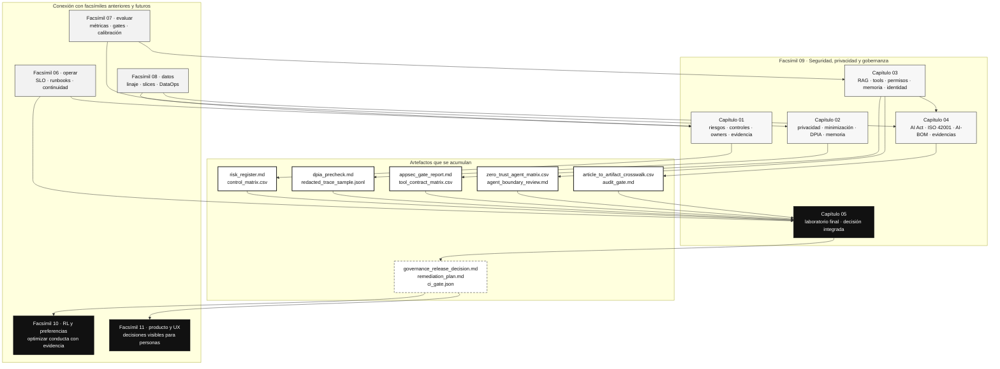

::: {.fasciculo-subtitle}
Facsímil 9 · Seguridad, privacidad y gobernanza
:::

# Capítulo 05: Recapitulación y laboratorio de gobernanza

## Qué deberías poder hacer al terminar

Este facsímil empezó con una pregunta muy concreta: si mañana alguien nos pide justificar por qué un sistema de IA puede usarse, qué enseñamos. La respuesta ya no puede ser “funciona en la demo”. Tiene que ser una carpeta de evidencias, una decisión reproducible y una explicación técnica que aguante preguntas.

Al cerrar el facsímil deberías poder hacer esto:

| Resultado de aprendizaje | Evidencia de que lo sabes hacer |
|---|---|
| Separar riesgo, control y evidencia. | No confundes política con prueba de cumplimiento. |
| Diseñar privacidad como arquitectura. | Identificas flujos, minimización, retención, DPIA/EIPD y redacción de trazas. |
| Proteger una aplicación LLM por capas. | Separas instrucciones confiables, RAG, tools, permisos, output validation y egress. |
| Preparar cumplimiento técnico. | Mapeas AI Act, ISO 42001, NIST AI RMF y GDPR a artefactos revisables. |
| Aplicar Zero Trust a agentes. | Puedes limitar identidad, credenciales, tools, memoria y configuración con evidencias versionadas. |
| Decidir una publicación con criterios. | Puedes decir publicar, publicar con condiciones o revisar antes, y defender por qué. |
| Construir un paquete de gobernanza. | Generas matriz, manifest, decisión, plan de cierre, trazas y resumen ejecutivo. |

La idea de cierre:

> Gobernanza en IA no es tener más reuniones. Es conseguir que las decisiones importantes tengan owner, versión, evidencia y una salida clara.

## Lo que hemos construido

| Capítulo | Pregunta | Artefacto profesional |
|---|---|---|
| 01 | ¿Qué puede salir mal y cómo lo reducimos? | Registro de riesgos, controles y gate de salida. |
| 02 | ¿Qué datos personales tratamos y cómo los minimizamos? | Inventario de flujos, DPIA/EIPD, redacción y retención. |
| 03 | ¿Dónde están los límites técnicos de una app LLM? | Contratos de RAG, tools, permisos, egress, memoria, identidad de agente y trazas. |
| 04 | ¿Cómo demostramos lo anterior ante una revisión? | Crosswalk AI Act/ISO/NIST/GDPR, AI-BOM, technical file y paquete de evidencias. |

Leído como ingeniería, el facsímil enseña una cadena:

```text
inventario -> riesgo -> privacidad -> límites técnicos -> evidencias -> gate -> seguimiento
```

Si una pieza falta, la decisión se debilita. Un riesgo sin owner queda flotando. Una privacidad sin trazas no se puede revisar. Una tool sin contrato se vuelve opaca. Un cumplimiento sin manifest se queda viejo. Un gate sin plan de cierre solo es una opinión con formato.

## Fecha de corte y fuentes consultadas

**Fecha de corte:** 7 de junio de 2026.

Este cierre se apoya en los mismos marcos de los capítulos anteriores: NIST AI RMF 1.0, NIST AI RMF Generative AI Profile, NIST SP 800-207 sobre Zero Trust Architecture, Reglamento (UE) 2024/1689, calendario oficial de aplicación del AI Act, ISO/IEC 42001:2023, GDPR, OWASP Top 10 for LLM Applications 2025, el eBook de Anthropic sobre Zero Trust para agentes de IA y Microsoft Presidio como ejemplo técnico de detección/redacción de datos personales.

El NIST AI RMF Generative AI Profile se presenta como un perfil transversal y recurso complementario del AI RMF para mejorar la incorporación de consideraciones de confianza en diseño, desarrollo, uso y evaluación de sistemas de IA generativa.^[NIST. (2024). *Artificial Intelligence Risk Management Framework: Generative Artificial Intelligence Profile*. https://www.nist.gov/publications/artificial-intelligence-risk-management-framework-generative-artificial-intelligence. Consultado el 7 de junio de 2026.] ISO/IEC 42001 define requisitos para establecer, implementar, mantener y mejorar un sistema de gestión de IA, aplicable a organizaciones que proveen o usan productos y servicios basados en IA.^[International Organization for Standardization. (2023). *ISO/IEC 42001:2023*. https://www.iso.org/standard/42001. Consultado el 7 de junio de 2026.] El AI Act es el Reglamento (UE) 2024/1689, publicado en el Diario Oficial el 12 de julio de 2024 y en vigor desde el 1 de agosto de 2024.^[European Parliament and Council of the European Union. (2024). *Regulation (EU) 2024/1689*. https://eur-lex.europa.eu/eli/reg/2024/1689/oj. Consultado el 7 de junio de 2026.] Para agentes, Anthropic propone una lectura Zero Trust centrada en identidad, menor capacidad de actuación, credenciales acotadas, aislamiento, memoria protegida, configuración versionada y evidencias continuas; lo conectamos con NIST SP 800-207 para que el alumno distinga un marco de arquitectura de una guía aplicada a agentes.^[Anthropic. (2026). *Zero Trust for AI Agents: A Security Framework for Deploying Autonomous AI Agents in the Enterprise*. https://cdn.prod.website-files.com/6889473510b50328dbb70ae6/6a1611a04085d7cd3dadc924_Claude-eBook-Zero-Trust-for-AI-Agents-05182026.pdf. Consultado el 7 de junio de 2026.]^[Rose, S., Borchert, O., Mitchell, S., & Connelly, S. (2020). *Zero Trust Architecture*. NIST SP 800-207. https://doi.org/10.6028/NIST.SP.800-207. Consultado el 7 de junio de 2026.]

## Cómo encaja todo

Este mapa une el facsímil completo. La gobernanza no aparece al final; atraviesa datos, herramientas, límites, operación y cumplimiento. El laboratorio obliga a practicar esa unión.



## Zero Trust para agentes como cierre del facsímil

La idea que añadimos desde el PDF de Anthropic es especialmente útil porque corrige una tentación habitual: evaluar un agente como si fuera solo un chatbot. Un agente combina modelo, memoria, herramientas, credenciales, configuración y trazas. Si cualquiera de esas piezas queda fuera del expediente, la decisión final se apoya en una zona oscura.

En el laboratorio lo aterrizamos con dos artefactos nuevos:

| Artefacto | Qué obliga a pensar |
|---|---|
| `zero_trust_agent_matrix.csv` | Qué identidad usa cada sistema, qué tool o memoria toca, qué alcance tiene y qué evidencia lo demuestra. |
| `agent_boundary_review.md` | Si el agente tiene menor capacidad de actuación, credenciales acotadas, memoria con TTL, configuración versionada y rollback. |

La pregunta que queremos que un alumno se lleve no es “¿hemos puesto Zero Trust en una diapositiva?”. Es esta:

> Si el agente se equivoca, si cambia una política o si una credencial se usa fuera de contexto, ¿el sistema tiene límites reales o solo buenas intenciones?

Ese criterio conecta con todo el facsímil: riesgo para saber qué importa, privacidad para limitar datos, seguridad LLM para limitar tools, cumplimiento para dejar evidencia y operación para repetir el gate cuando cambie la versión.

## Anatomía visual: paquete de gobernanza

Un paquete de gobernanza no debería ser una carpeta ceremonial. Tiene que parecerse más a un sistema de release: entradas versionadas, controles ejecutables, evidencias verificables y una decisión que se pueda repetir.

<figure class="svg-figure" id="f9-c05-governance-packet-figure">
<svg id="f9-c05-governance-packet" xmlns="http://www.w3.org/2000/svg" viewBox="0 0 1360 780" role="img" aria-label="Anatomía de un paquete de gobernanza para sistemas de IA">
  <defs>
    <marker id="f9c05-arrow" viewBox="0 0 10 10" refX="9" refY="5" markerWidth="7" markerHeight="7" orient="auto-start-reverse">
      <path d="M 0 0 L 10 5 L 0 10 z" fill="#111111"/>
    </marker>
    <pattern id="f9c05-grid" width="28" height="28" patternUnits="userSpaceOnUse">
      <path d="M28 0 L0 0 0 28" fill="none" stroke="#EEEEEE" stroke-width="1"/>
    </pattern>
  </defs>
  <rect x="24" y="24" width="1312" height="700" rx="18" fill="#FFFFFF" stroke="#111111" stroke-width="2"/>
  <text x="680" y="66" text-anchor="middle" font-family="Arial, sans-serif" font-size="25" font-weight="700" fill="#111111">Paquete de gobernanza: de inventario a gate repetible</text>
  <text x="680" y="94" text-anchor="middle" font-family="Arial, sans-serif" font-size="13" fill="#555555">No basta con una política: cada control necesita evidencia, owner, versión y condición de salida.</text>
  <rect x="72" y="126" width="1216" height="462" rx="14" fill="url(#f9c05-grid)" stroke="#DDDDDD"/>
  <g font-family="Arial, sans-serif">
    <rect x="112" y="176" width="206" height="108" rx="12" fill="#111111" stroke="#111111"/>
    <text x="215" y="210" text-anchor="middle" font-size="13" font-weight="700" fill="#FFFFFF">Inventario vivo</text>
    <text x="215" y="238" text-anchor="middle" font-size="11" fill="#E8E8E8">modelo · prompt · RAG</text>
    <text x="215" y="256" text-anchor="middle" font-size="11" fill="#E8E8E8">tools · memoria · datos</text>

    <line x1="318" y1="230" x2="370" y2="230" stroke="#111111" stroke-width="1.3" marker-end="url(#f9c05-arrow)"/>
    <rect x="370" y="176" width="206" height="108" rx="12" fill="#FFFFFF" stroke="#111111" stroke-width="1.4"/>
    <text x="473" y="210" text-anchor="middle" font-size="13" font-weight="700">Matriz de controles</text>
    <text x="473" y="238" text-anchor="middle" font-size="11" fill="#555555">riesgo · privacidad</text>
    <text x="473" y="256" text-anchor="middle" font-size="11" fill="#555555">tools · cumplimiento</text>

    <line x1="576" y1="230" x2="628" y2="230" stroke="#111111" stroke-width="1.3" marker-end="url(#f9c05-arrow)"/>
    <rect x="628" y="176" width="206" height="108" rx="12" fill="#FFFFFF" stroke="#111111" stroke-width="1.4"/>
    <text x="731" y="210" text-anchor="middle" font-size="13" font-weight="700">Evidencias fuente</text>
    <text x="731" y="238" text-anchor="middle" font-size="11" fill="#555555">logs · exports · policies</text>
    <text x="731" y="256" text-anchor="middle" font-size="11" fill="#555555">hashes · trazas · owners</text>

    <line x1="834" y1="230" x2="886" y2="230" stroke="#111111" stroke-width="1.3" marker-end="url(#f9c05-arrow)"/>
    <rect x="886" y="176" width="206" height="108" rx="12" fill="#FFFFFF" stroke="#111111" stroke-width="1.4"/>
    <text x="989" y="210" text-anchor="middle" font-size="13" font-weight="700">Gate ejecutable</text>
    <text x="989" y="238" text-anchor="middle" font-size="11" fill="#555555">pass · condiciones</text>
    <text x="989" y="256" text-anchor="middle" font-size="11" fill="#555555">revisar · bloquear</text>

    <rect x="240" y="394" width="230" height="118" rx="12" fill="#FFFFFF" stroke="#111111" stroke-width="1.4"/>
    <text x="355" y="430" text-anchor="middle" font-size="13" font-weight="700">Límites de agente</text>
    <text x="355" y="458" text-anchor="middle" font-size="11" fill="#555555">identidad · credenciales</text>
    <text x="355" y="478" text-anchor="middle" font-size="11" fill="#555555">tools · memoria · TTL</text>

    <rect x="565" y="394" width="230" height="118" rx="12" fill="#FFFFFF" stroke="#111111" stroke-width="1.4"/>
    <text x="680" y="430" text-anchor="middle" font-size="13" font-weight="700">Plan de cierre</text>
    <text x="680" y="458" text-anchor="middle" font-size="11" fill="#555555">prioridad · plazo</text>
    <text x="680" y="478" text-anchor="middle" font-size="11" fill="#555555">owner · prueba esperada</text>

    <rect x="890" y="394" width="230" height="118" rx="12" fill="#FFFFFF" stroke="#111111" stroke-width="1.4"/>
    <text x="1005" y="430" text-anchor="middle" font-size="13" font-weight="700">Registro de decisión</text>
    <text x="1005" y="458" text-anchor="middle" font-size="11" fill="#555555">alcance · riesgo residual</text>
    <text x="1005" y="478" text-anchor="middle" font-size="11" fill="#555555">fecha de revisión</text>

    <path d="M989 284 C989 338 355 334 355 394" fill="none" stroke="#111111" stroke-width="1.2" marker-end="url(#f9c05-arrow)"/>
    <line x1="470" y1="453" x2="565" y2="453" stroke="#111111" stroke-width="1.2" marker-end="url(#f9c05-arrow)"/>
    <line x1="795" y1="453" x2="890" y2="453" stroke="#111111" stroke-width="1.2" marker-end="url(#f9c05-arrow)"/>
  </g>
  <rect x="292" y="630" width="776" height="48" rx="24" fill="#111111"/>
  <text x="680" y="660" text-anchor="middle" font-family="Arial, sans-serif" font-size="14" font-weight="700" fill="#FFFFFF">La gobernanza útil se puede ejecutar, revisar y repetir.</text>
  <text x="1268" y="704" text-anchor="end" font-family="Arial, sans-serif" font-size="11" fill="#888888" opacity="0.55">IA para gente curiosa / Facsímil 09 / Capítulo 05 / 686f6c61</text>
</svg>
<figcaption>El paquete conecta inventario, controles, evidencias, gate, límites de agente, plan de cierre y registro de decisión. Si una pieza falta, la gobernanza pierde trazabilidad.</figcaption>
</figure>

## Laboratorio

Un laboratorio, dentro de este libro, es un espacio guiado para convertir teoría en trabajo real. Aquí no queremos que el alumno “responda bonito”. Queremos que genere un paquete de gobernanza que otra persona pueda revisar.

En este laboratorio vamos a tocar:

| Tema | Capítulos que lo sostienen |
|---|---|
| Riesgo y controles | Capítulo 01. |
| Privacidad y datos personales | Capítulo 02. |
| Seguridad de aplicaciones LLM | Capítulo 03. |
| Zero Trust para agentes | Capítulos 03 y 04. |
| Cumplimiento, AI Act e ISO 42001 | Capítulo 04. |
| Operación y release gates | Facsímiles 06 y 07. |
| Datos y trazabilidad | Facsímil 08. |

Ruta del kit:

```text
labs/f9/laboratorio-gobernanza/
```

Ejecuta:

```bash
cd labs/f9/laboratorio-gobernanza
python3 ops/run_governance_lab.py --write
cat output/governance_release_decision.md
cat output/technical_decision_memo.md
cat output/remediation_plan.md
python3 -m json.tool output/governance_report.json
```

Qué produce:

| Archivo | Qué demuestra |
|---|---|
| `output/governance_release_decision.md` | Decisión final y lectura ejecutiva. |
| `output/technical_decision_memo.md` | Memo técnico defendible para dirección de ingeniería o comité de release. |
| `output/governance_report.json` | Resultado estructurado para CI o revisión. |
| `output/control_evidence_matrix.csv` | Capa → requisito → evidencia → owner → estado. |
| `output/source_evidence_matrix.csv` | Comprobación de rutas de evidencia declaradas. |
| `output/source_evidence_review.md` | Lectura crítica de evidencias fuente: existe, no existe, o existe pero no basta. |
| `output/remediation_plan.md` | Plan de cierre con prioridad y plazo. |
| `output/evidence_package_index.md` | Índice de evidencias por sistema y versión viva. |
| `output/zero_trust_agent_matrix.csv` | Matriz de identidad, tool, credencial, memoria, límite y evidencia por agente. |
| `output/agent_boundary_review.md` | Revisión explicada de límites de agente y controles prácticos. |
| `output/risk_acceptance_record.md` | Condiciones que alguien debe aceptar explícitamente. |
| `output/executive_brief.md` | Resumen ejecutivo trazable. |
| `output/ci_gate.json` | Salida máquina para pipeline. |
| `output/trace_sample.jsonl` | Evento mínimo del gate final. |

El laboratorio se organiza en dos retos oficiales:

| Reto | Qué construye | Entrega principal |
|---|---|---|
| Reto 1 | Diagnóstico del paquete y decisión inicial. | `governance-release-review/` |
| Reto 2 | Remediación, nuevo gate y evidencias defendibles. | `governance-remediation-review/` y `solutions/mi-equipo/` |

Las fases internas existen para que el trabajo sea realista: primero se lee el expediente, después se ejecuta el gate, luego se corrige, se compara y se valida la entrega.

### Reto 1: diagnosticar el paquete y decidir si puede avanzar

#### Fase 1: leer el expediente antes de ejecutar

#### Contexto

En un equipo real, lo primero no es lanzar comandos. Lo primero es entender el expediente: qué sistemas existen, qué versiones están vivas, qué capas exige la política y qué evidencias se declaran.

#### Enunciado

Abre estos archivos:

```text
contracts/final_governance_policy.json
data/release_components.csv
data/governance_findings.csv
evidence/agent_identity_policy.yaml
evidence/tool_boundary_contract.yaml
evidence/memory_retention_policy.md
evidence/recordkeeping_contract.json
```

Responde:

1. ¿Qué capas son obligatorias?
2. ¿Qué sistema está en piloto?
3. ¿Qué versión de modelo, prompt, RAG y tools tiene el sistema de admisiones?
4. ¿Qué control puede bloquear la publicación?
5. ¿Qué evidencia existe pero todavía no basta para cerrar record-keeping?

#### Resolución paso a paso

La política declara seis capas obligatorias: riesgo, privacidad, seguridad de aplicación LLM, Zero Trust para agentes, cumplimiento y operación. El sistema de admisiones está en piloto y usa `provider-model@2026-06-07`, `admissions-prompt@0.2.0`, `admissions-index@2026.1` y `admissions-tools@0.1.0`.

El bloqueo importante es `recordkeeping_export`. El contrato `evidence/recordkeeping_contract.json` existe, pero no basta por sí solo: define campos mínimos. Para cerrar el control hace falta conectarlo con una exportación real de trazas del pipeline.

#### Fase 2: ejecutar el gate inicial y defender la decisión

#### Contexto

El equipo tiene tres sistemas: un asistente académico con RAG, una ayuda de priorización para admisiones y un asistente interno de código. Los cuatro capítulos anteriores han generado evidencias parciales. Ahora toca integrarlas.

La pregunta no es “cuál sistema parece mejor”. La pregunta es:

> Con las evidencias actuales, ¿qué puede avanzar, qué queda condicionado y qué debe revisarse antes?

#### Enunciado

Ejecuta:

```bash
cd labs/f9/laboratorio-gobernanza
python3 ops/run_governance_lab.py --write
cat output/governance_release_decision.md
cat output/technical_decision_memo.md
cat output/control_evidence_matrix.csv
cat output/source_evidence_review.md
cat output/remediation_plan.md
cat output/evidence_package_index.md
```

Responde:

1. ¿Cuál es la decisión global?
2. ¿Qué sistema concentra el bloqueo?
3. ¿Qué evidencia falta?
4. ¿Qué condiciones quedan aunque se cierre el bloqueo?
5. ¿Qué owner debe actuar primero?
6. ¿Qué archivo enseñarías a una revisión técnica?
7. ¿Qué archivo usarías en CI?
8. ¿Qué agente necesita una reducción de capacidad antes de avanzar?
9. ¿Qué evidencia fuente existe pero no cierra todavía su control?

#### Resolución paso a paso

Primero miramos la decisión global. El kit devuelve:

```text
Decision: revisar_antes
```

No es una opinión. Sale de la matriz de controles. Hay una evidencia bloqueante: el sistema de admisiones no tiene record-keeping exportable suficiente. Eso conecta directamente con el capítulo 04. Si no podemos reconstruir qué versión, qué política y qué evidencia produjo una decisión, no deberíamos avanzar de fase.

Después miramos condiciones. Aunque se cierre el bloqueo, quedan temas de privacidad, permisos, FRIA/precheck, rollback y monitorización. Es decir: cerrar el bloqueo no convierte el sistema en “perfecto”; solo lo mueve de `revisar_antes` a una ruta condicionada.

| Capa | Hallazgo | Estado | Lectura |
|---|---|---|---|
| Cumplimiento | `recordkeeping_export` | `block` | Falta evidencia exportable para reconstruir decisiones. |
| Privacidad | `dpia_retention_decision` | `review` | Falta decisión formal de retención. |
| LLM appsec | `tool_and_rag_boundary` | `review` | Faltan pruebas de permisos del piloto. |
| Zero Trust para agentes | `agent_identity_and_short_lived_credentials` | `review` | Falta identidad técnica y credencial acotada para el agente de admisiones. |
| Zero Trust para agentes | `least_agency_tool_boundary` | `review` | Falta separar preparación de ejecución y demostrar allowlist de tools. |
| Cumplimiento | `fria_precheck` | `review` | Falta cierre con deployer. |
| Operación | `rollback_and_monitoring` | `review` | Falta rollback y thresholds. |

La entrega profesional no diría solo “no”. Diría: no avanzamos por `recordkeeping_export`; primer owner `owner-platform`; evidencia esperada `trace_evidence_sample.jsonl` conectada al pipeline real; repetir gate al cerrar.

#### Respuesta modelo

```text
Decision: revisar_antes.

Motivo: el sistema de admisiones tiene una evidencia bloqueante en record-keeping.
No se puede defender una publicación si no podemos reconstruir la decisión con versión de modelo, prompt, RAG, tools, política y resultado.
```

Entrega mínima:

```text
governance-release-review/
  governance_release_decision.md
  technical_decision_memo.md
  governance_report.json
  control_evidence_matrix.csv
  source_evidence_review.md
  remediation_plan.md
  evidence_package_index.md
  zero_trust_agent_matrix.csv
  agent_boundary_review.md
  ci_gate.json
  trace_sample.jsonl
```

#### Por qué funciona

Porque une los capítulos:

| Capítulo | Cómo aparece en el reto |
|---|---|
| 01 | Riesgo y owner por hallazgo. |
| 02 | DPIA/EIPD, retención y datos personales. |
| 03 | RAG, tools y límites de aplicación. |
| 04 | Record-keeping, AI Act, ISO 42001 y evidencias. |
| PDF Anthropic Zero Trust | Identidad del agente, menor capacidad de actuación, credenciales cortas, memoria y rollback. |

### Reto 2: remediar, repetir el gate y construir evidencias defendibles

#### Fase 1: cerrar el bloqueo y repetir el gate

#### Contexto

Un equipo serio no se queda en “bloqueado”. Cierra la evidencia crítica, repite el gate y comprueba si la decisión cambia. El laboratorio incluye un segundo dataset donde `recordkeeping_export` pasa a `pass`.

#### Enunciado

Ejecuta:

```bash
cd labs/f9/laboratorio-gobernanza
python3 ops/run_governance_lab.py \
  --findings data/governance_findings_remediated.csv \
  --output-dir output/remediated \
  --write

cat output/remediated/governance_release_decision.md
cat output/remediated/remediation_plan.md
python3 -m json.tool output/remediated/ci_gate.json
```

Responde:

1. ¿Cambia la decisión?
2. ¿Desaparece todo el trabajo pendiente?
3. ¿Qué condiciones quedan?
4. ¿Qué aceptarías como riesgo residual y qué no?
5. ¿Qué evidencia compararías entre `output/` y `output/remediated/`?
6. ¿Qué regla pondrías en CI?
7. ¿Qué control Zero Trust seguiría abierto aunque el bloqueo de record-keeping se cierre?

#### Resolución paso a paso

El escenario remediado devuelve:

```text
Decision: publicar_con_condiciones
```

Eso significa que cerrar record-keeping cambia la decisión global. Ya no hay bloqueo duro, pero quedan condiciones relevantes. Esta es una lección importante: la gobernanza no es binaria. Puede haber una ruta profesional entre “no publicar” y “publicar todo”.

Las condiciones restantes no son decorativas:

| Condición | Por qué queda |
|---|---|
| Retención de datos personales | Afecta privacidad, trazas y derechos. |
| Pruebas de permisos en piloto | Afecta tools y RAG en un sistema sensible. |
| FRIA/precheck | Afecta impacto y uso previsto. |
| Identidad y límites de agente | Afecta credenciales, memoria, tools y capacidad de actuación. |
| Rollback y monitorización | Afecta operación real. |
| Monitorización del asistente académico | Afecta seguimiento postdespliegue. |

La decisión profesional sería: avanzar solo si el alcance queda limitado, las condiciones tienen owner y fecha, y el gate se repite antes de ampliar uso. Si alguien quiere pasar de piloto a producción sin cerrar condiciones, cambia el riesgo y hay que volver al paquete.

#### Respuesta modelo

```text
Decision: publicar_con_condiciones.

Motivo: se cerro la evidencia bloqueante de record-keeping, pero siguen abiertas condiciones de privacidad, permisos, FRIA/precheck y operacion.
```

Regla de CI recomendada:

```bash
python3 ops/run_governance_lab.py --write --fail-on-blocker
```

Si el comando sale con código `2`, no se publica. Si sale bien pero `ci_gate.json` dice `publicar_con_condiciones`, el pipeline puede permitir solo despliegue limitado o requerir aprobación interna.

#### Entrega profesional esperada

```text
governance-remediation-review/
  before/
    governance_release_decision.md
    ci_gate.json
  after/
    governance_release_decision.md
    ci_gate.json
  diff_notes.md
  residual_risk_acceptance.md
  next_gate_date.md
```

`diff_notes.md` debe explicar qué evidencia cambió, por qué cambió la decisión y qué no se ha cerrado todavía.

#### Fase 2: crear tu propia variante de remediación

#### Contexto

Usar el dataset remediado que ya viene en el kit sirve para aprender la mecánica. Pero en la práctica profesional nadie te entrega el CSV perfecto. Tienes que decidir qué evidencia cierras, qué queda condicionada y qué no puedes aceptar todavía.

#### Enunciado

Copia el escenario del alumno:

```bash
cd labs/f9/laboratorio-gobernanza
cp data/governance_findings_student.csv data/governance_findings_mi_equipo.csv
```

Edita `data/governance_findings_mi_equipo.csv` y toma una decisión explícita:

1. Cierra `recordkeeping_export` solo si puedes explicar qué evidencia lo sostiene.
2. No marques todo como `pass`.
3. Deja al menos una condición abierta y justifícala.
4. Ejecuta:

```bash
python3 ops/run_governance_lab.py \
  --findings data/governance_findings_mi_equipo.csv \
  --output-dir output/mi_equipo \
  --write

cat output/mi_equipo/governance_release_decision.md
cat output/mi_equipo/source_evidence_review.md
cat output/mi_equipo/technical_decision_memo.md
```

Después escribe:

```text
solutions/mi-equipo/
  decision_memo.md
  diff_notes.md
  residual_risk_acceptance.md
  next_gate_date.md
  ci_gate.json
```

#### Resolución paso a paso

Una buena entrega no busca que el script diga “todo bien”. Busca que el gate diga la verdad. Si cierras record-keeping, la decisión debería pasar de `revisar_antes` a `publicar_con_condiciones`. Si además cierras identidad del agente, pero dejas `least_agency_tool_boundary` abierto, puedes defender que el piloto avanza con alcance limitado, pero no que el sistema se amplíe a producción.

El punto delicado está aquí: **una evidencia no es una promesa**. Si `recordkeeping_contract.json` existe pero la traza real no sale del pipeline, el control sigue sin estar cerrado. Si `tool_boundary_contract.yaml` dice que `publish_ranking` está deshabilitada, debes poder probar que el agente no la ve o que el runtime la rechaza.

#### Fase 3: construir evidencias de agente y pasarlas por un checker

#### Contexto

Este reto convierte el laboratorio en algo que un alumno puede llevarse a un proyecto real. No solo interpreta el paquete: crea artefactos que un equipo podría adaptar.

#### Enunciado

Construye una carpeta de entrega:

```text
solutions/mi-equipo/
  decision_memo.md
  diff_notes.md
  residual_risk_acceptance.md
  next_gate_date.md
  ci_gate.json
  agent_identity_policy.yaml
  tool_boundary_contract.yaml
  memory_retention_policy.md
  recordkeeping_contract.json
```

Puedes mirar `solutions/reference/`, pero no copies sin pensar. Ajusta la entrega para tu decisión.

Valida:

```bash
python3 ops/check_student_submission.py \
  --submission-dir solutions/mi-equipo \
  --output output/mi_equipo/student_submission_report.md \
  --write

cat output/mi_equipo/student_submission_report.md
```

Si quieres usar la solución de referencia:

```bash
python3 ops/check_student_submission.py --submission-dir solutions/reference --write
cat output/student_submission_report.md
```

#### Resolución paso a paso

El checker revisa cosas muy concretas:

| Archivo | Qué busca |
|---|---|
| `decision_memo.md` | Decisión, bloqueo principal y primer owner. |
| `diff_notes.md` | Qué cambió entre el escenario inicial y el remediado. |
| `residual_risk_acceptance.md` | Qué condiciones se aceptan temporalmente y cuáles no. |
| `next_gate_date.md` | Cuándo y cómo se repite el gate. |
| `ci_gate.json` | Decisión máquina y número de bloqueos. |
| `agent_identity_policy.yaml` | `agent_id`, TTL y credenciales acotadas. |
| `tool_boundary_contract.yaml` | Separación entre `prepare` y `execute`. |
| `memory_retention_policy.md` | TTL, purga y aislamiento de memoria. |
| `recordkeeping_contract.json` | Campos mínimos de traza, incluyendo `agent_id`. |

El checker no sustituye la revisión humana. Sirve para evitar entregas vacías. Si falta un memo, si el `ci_gate.json` no es JSON válido o si el alumno no explica qué queda condicionado, la entrega no es profesional.

### Rúbrica de evaluación

| Criterio | Peso | Qué espero ver |
|---|---:|---|
| Lectura del expediente | 15 | Identifica sistemas, versiones vivas, capas obligatorias y bloqueo principal. |
| Decisión técnica | 20 | Defiende `revisar_antes` o `publicar_con_condiciones` con evidencia, no con intuición. |
| Remediación realista | 20 | Cierra una evidencia concreta sin marcar todo como `pass`. |
| Evidencias de agente | 20 | Entrega identidad, credenciales, tools, memoria y record-keeping con límites verificables. |
| Gate y CI | 10 | Produce `ci_gate.json` y entiende cuándo debe fallar. |
| Riesgo residual | 10 | Distingue condiciones aceptables de condiciones que no permiten ampliar alcance. |
| Claridad profesional | 5 | El memo se entiende por ingeniería, producto, privacidad y cumplimiento. |

Una entrega excelente no es la que deja menos líneas en rojo. Es la que explica con precisión qué se puede hacer, qué no, qué falta, quién debe actuar y cuándo se vuelve a medir.

## Vocabulario aprendido

| Término | Qué significa aquí | Cómo lo usarías en una entrega |
|---|---|---|
| Paquete de evidencias | Carpeta versionada con registros, matrices, trazas, políticas y decisiones. | Lo adjuntas al gate para que otra persona pueda revisar el criterio. |
| Riesgo residual | Riesgo que queda después de aplicar controles y que alguien acepta con condiciones. | Lo escribes con owner, fecha de revisión y límite de alcance. |
| Record-keeping | Capacidad de reconstruir una decisión con trazas mínimas y campos obligatorios. | No basta un contrato: debe existir export real de trazas. |
| Menor capacidad de actuación | Principio de dar a un agente solo las acciones y permisos necesarios. | Separas `prepare` de `execute`, scopes y aprobaciones. |
| Gate de gobernanza | Regla reproducible que decide si publicar, condicionar o revisar antes. | Lo ejecutas al cambiar modelo, prompt, RAG, tool, memoria o finalidad. |

## Dónde solía tropezar yo

| Tropiezo | Por qué ocurre | Antídoto |
|---|---|---|
| Querer resolver gobernanza con una checklist | Es rápido, pero no conecta con sistemas reales. | Usar matrices con owner, versión, evidencia y decisión. |
| Mezclar privacidad con seguridad de aplicación | Ambas importan, pero responden preguntas distintas. | Separar flujo de datos, permisos, tools, RAG y logs. |
| Aceptar condiciones sin fecha | Parece pragmático y luego se olvida. | Toda condición necesita owner, evidencia esperada y plazo. |
| Tratar un bloqueo como fracaso | Un bloqueo útil evita publicar sin poder defenderlo. | Verlo como señal de ingeniería: falta una pieza concreta. |
| No repetir el gate tras corregir | Se corrige algo, pero no se demuestra el cambio. | Ejecutar de nuevo y conservar before/after. |

## Antes de pasar página

Antes de cerrar el facsímil, deberías poder responder:

1. ¿Qué diferencia hay entre riesgo, control y evidencia?
2. ¿Por qué privacidad no se arregla solo con redactar texto?
3. ¿Qué diferencia hay entre contenido no confiable e instrucción confiable?
4. ¿Qué campos mínimos debe tener una traza revisable?
5. ¿Por qué un sistema puede pasar de `revisar_antes` a `publicar_con_condiciones`?
6. ¿Qué condición aceptarías con riesgo residual y cuál no?
7. ¿Qué artefacto enseñarías para defender una decisión de release?
8. ¿Qué regla pondrías en CI para no depender de memoria humana?
9. ¿Por qué un contrato de trazas no cierra record-keeping si no hay export real?
10. ¿Qué diferencia hay entre una evidencia fuente y un resumen generado por el laboratorio?
11. ¿Qué debe demostrar una política de identidad de agente?
12. ¿Qué comprobarías antes de ampliar un piloto a producción?

## Para saber más

Anthropic. (2026). *Zero Trust for AI Agents: A Security Framework for Deploying Autonomous AI Agents in the Enterprise*. https://cdn.prod.website-files.com/6889473510b50328dbb70ae6/6a1611a04085d7cd3dadc924_Claude-eBook-Zero-Trust-for-AI-Agents-05182026.pdf

Autio, C., Schwartz, R., Dunietz, J., Jain, S., Stanley, M., Tabassi, E., Hall, P. y Roberts, K. (2024). *Artificial Intelligence Risk Management Framework: Generative Artificial Intelligence Profile*. National Institute of Standards and Technology. https://doi.org/10.6028/NIST.AI.600-1

European Parliament and Council of the European Union. (2016). *Regulation (EU) 2016/679*. https://eur-lex.europa.eu/legal-content/EN/TXT/?uri=CELEX:32016R0679

European Parliament and Council of the European Union. (2024). *Regulation (EU) 2024/1689*. https://eur-lex.europa.eu/eli/reg/2024/1689/oj

International Organization for Standardization. (2023). *ISO/IEC 42001:2023. Artificial intelligence management system*. https://www.iso.org/standard/42001

Microsoft. (2026). *Presidio: Data Protection and De-identification SDK*. https://microsoft.github.io/presidio/

OWASP Foundation. (2025). *OWASP Top 10 for LLM and Generative AI Applications 2025*. https://genai.owasp.org/resource/owasp-top-10-for-llm-applications-2025/

Raji, I. D. et al. (2020). Closing the AI accountability gap: Defining an end-to-end framework for internal algorithmic auditing. *Proceedings of the 2020 Conference on Fairness, Accountability, and Transparency*, 33-44. https://doi.org/10.1145/3351095.3372873

Rose, S., Borchert, O., Mitchell, S. y Connelly, S. (2020). *Zero Trust Architecture*. NIST SP 800-207. https://doi.org/10.6028/NIST.SP.800-207

Tabassi, E. (2023). *Artificial Intelligence Risk Management Framework (AI RMF 1.0)*. National Institute of Standards and Technology. https://doi.org/10.6028/NIST.AI.100-1

## En resumen

| Idea | Qué te llevas |
|---|---|
| Gobernanza es ingeniería visible. | Lo importante queda versionado, asignado y revisable. |
| Privacidad es arquitectura. | No basta con buenas intenciones sobre datos. |
| Seguridad LLM es capa de aplicación. | RAG, tools, permisos y salidas necesitan contratos. |
| Cumplimiento necesita evidencias. | AI Act, ISO 42001 y NIST se traducen a artefactos. |
| El laboratorio junta todo. | La salida profesional es una decisión defendible y repetible. |

La frase final del facsímil:

> Un sistema de IA maduro no solo responde: deja suficientes evidencias para explicar por qué podía responder así, en esa versión y bajo esas condiciones.
