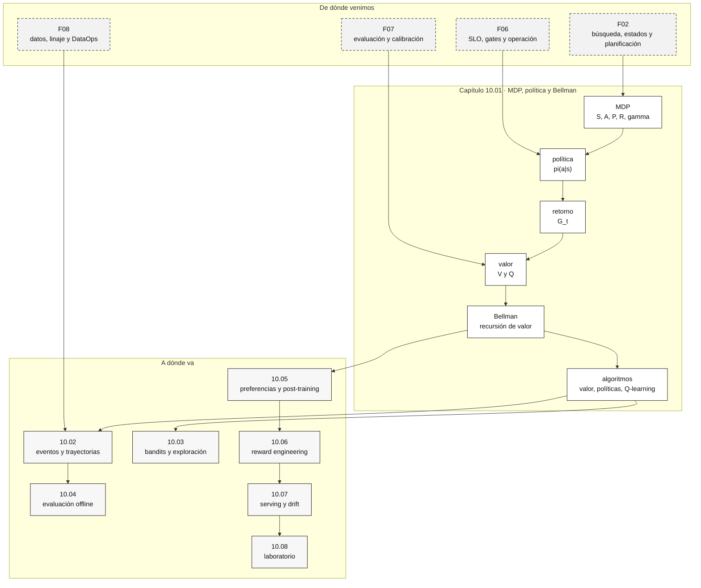

::: {.fasciculo-subtitle}
Facsímil 10 · Aprendizaje por refuerzo
:::

# Capítulo 01: MDP, políticas, retorno y Bellman

## La diferencia entre responder y decidir

Hasta ahora hemos evaluado modelos que predicen, clasifican, recuperan documentos, llaman herramientas o generan texto. El aprendizaje por refuerzo cambia la pregunta. Ya no preguntamos solo “¿la salida es correcta?”, sino “¿qué pasa después de actuar?”.

Un clasificador de tickets puede acertar una etiqueta. Un sistema de refuerzo decide qué hacer con el ticket, observa consecuencias y aprende qué política produce mejores resultados acumulados. Esa diferencia parece pequeña hasta que aparece el tiempo: cerrar rápido puede subir una métrica hoy y generar reaperturas mañana; pedir más información puede parecer lento y evitar errores posteriores; usar una herramienta cara puede resolver mejor, pero romper el presupuesto si se usa sin criterio.

En ingeniería, RL es útil aunque no entrenes un agente. Te da vocabulario para diseñar decisiones: estado, acción, recompensa, política, horizonte, valor futuro y efectos de optimizar una métrica incompleta. Ese vocabulario será clave para entender bandits, RLHF, RLAIF, RLVR y agentes con evaluadores.

Sutton y Barto presentan el aprendizaje por refuerzo como el estudio de cómo un agente aprende a tomar acciones mediante interacción para maximizar una señal acumulada.^[Sutton, R. S., & Barto, A. G. (2018). *Reinforcement Learning: An Introduction*. MIT Press. https://mitpress.mit.edu/9780262039246/reinforcement-learning/. Consultado el 7 de junio de 2026.] La idea es antigua, pero en IA moderna reaparece en post-training, routing, evaluación, agentes y sistemas que optimizan comportamiento.

## El MDP como contrato de decisión

Un MDP se escribe:

$$
\mathcal{M}=(S,A,P,R,\gamma)
$$

| Símbolo | Nombre | Qué significa | Ejemplo en un sistema de IA |
|---|---|---|---|
| \(S\) | Estados | Situaciones posibles. | Ticket nuevo, ticket con evidencia, ticket resuelto. |
| \(A\) | Acciones | Decisiones disponibles. | Responder, pedir datos, consultar RAG, escalar a persona. |
| \(P(s' \mid s,a)\) | Transición | Probabilidad de pasar a \(s'\) al hacer \(a\). | Si pido datos, quizá el usuario responde o abandona. |
| \(R(s,a,s')\) | Recompensa | Resultado numérico inmediato. | +2 si resuelve, -1 si usa tool cara, -5 si reabre. |
| \(\gamma\) | Descuento | Peso del futuro. | \(\gamma=0.9\) valora consecuencias futuras; \(\gamma=0\) mira solo lo inmediato. |

La palabra “Markov” significa que el estado actual contiene lo necesario para modelar el siguiente paso. No significa que el mundo sea simple. Significa que nosotros hemos decidido qué información metemos en el estado para que la predicción sea tratable.

En un producto real, esta es la parte más difícil. “Estado” no es una palabra elegante para “contexto”. Es una especificación. Si omites una variable importante, la política aprende con una fotografía incompleta.

| Estado pobre | Qué pierde | Estado mejor |
|---|---|---|
| `ticket_abierto` | No sabe prioridad, historial ni evidencia. | `ticket_abierto + categoria + SLA + intentos + documentos_recuperados`. |
| `usuario` | No distingue sesión, permiso ni consentimiento. | `usuario + rol + permiso + politica_datos + canal`. |
| `respuesta_generada` | No sabe si hay cita ni si pasó eval. | `respuesta_generada + cita + score_eval + coste + trazas`. |

## Política y retorno

La política indica cómo actúa el sistema:

$$
\pi(a \mid s)=P(A_t=a \mid S_t=s)
$$

Puede ser determinista, si siempre elige la misma acción en un estado:

$$
a=\pi(s)
$$

o estocástica, si reparte probabilidad entre acciones:

$$
\pi(\text{consultar\_rag}\mid s)=0.7,\quad \pi(\text{pedir\_aclaracion}\mid s)=0.3
$$

El retorno desde el tiempo \(t\) es:

$$
G_t=R_{t+1}+\gamma R_{t+2}+\gamma^2 R_{t+3}+\cdots
$$

| Pieza | Lectura | Ejemplo |
|---|---|---|
| \(R_{t+1}\) | Resultado inmediato. | Responder rápido. |
| \(\gamma R_{t+2}\) | Consecuencia futura descontada. | El usuario confirma o reabre. |
| \(\gamma^2 R_{t+3}\) | Consecuencia aún más lejana. | El caso mejora la base de conocimiento. |

Si \(\gamma=0\), el sistema solo valora la recompensa inmediata. Si \(\gamma\) se acerca a 1, el sistema valora más el futuro. En soporte, salud, educación o compliance, \(\gamma\) demasiado bajo produce políticas miopes. En sistemas de alto coste por acción, \(\gamma\) demasiado alto puede hacer que el sistema explore demasiado antes de dar valor.

## Valor, Bellman y la idea de recursión

La función de valor de una política es:

$$
V^\pi(s)=\mathbb{E}_{\pi}\left[G_t \mid S_t=s\right]
$$

La función acción-valor es:

$$
Q^\pi(s,a)=\mathbb{E}_{\pi}\left[G_t \mid S_t=s, A_t=a\right]
$$

La diferencia entre \(V\) y \(Q\) es muy práctica. \(V^\pi(s)\) te dice cuánto vale estar en un estado si sigues una política. \(Q^\pi(s,a)\) te dice cuánto vale tomar una acción concreta desde ese estado y luego seguir la política. Si quieres elegir una acción, \(Q\) suele ser más directo.

Bellman convierte esa intuición en una ecuación recursiva. Richard Bellman formuló la programación dinámica como una forma de resolver problemas secuenciales dividiéndolos en subproblemas conectados por valor futuro.^[Bellman, R. (1957). *Dynamic Programming*. Princeton University Press.] En un MDP, esa idea se lee así:

$$
V^\pi(s)=\sum_a \pi(a\mid s)\sum_{s'}P(s'\mid s,a)\left(R(s,a,s')+\gamma V^\pi(s')\right)
$$

No te quedes en la fórmula. Léela como una frase:

> El valor de estar en \(s\) es el promedio, bajo la política, de recompensa inmediata más valor futuro esperado.

| Término | Qué hace | Si lo olvidas |
|---|---|---|
| \(\pi(a\mid s)\) | Pondera qué acciones toma la política. | Evalúas una política que no se parece a la que ejecutas. |
| \(P(s'\mid s,a)\) | Modela consecuencias. | Tratas el mundo como si no respondiera. |
| \(R(s,a,s')\) | Define qué cuenta como buen resultado. | Optimizas una señal cómoda, no el objetivo. |
| \(\gamma V^\pi(s')\) | Mete futuro. | El sistema se queda corto de horizonte. |

El matiz importante: Bellman no es una sola fórmula. Es una familia de ecuaciones. Puedes usarla para **evaluar una política** o para **buscar una política mejor**.

## Bellman óptimo: cuando queremos decidir mejor

Si queremos la mejor política posible dentro del MDP definido, escribimos valor óptimo:

$$
V^\*(s)=\max_a \sum_{s'}P(s'\mid s,a)\left(R(s,a,s')+\gamma V^\*(s')\right)
$$

Y acción-valor óptimo:

$$
Q^\*(s,a)=\sum_{s'}P(s'\mid s,a)\left(R(s,a,s')+\gamma \max_{a'}Q^\*(s',a')\right)
$$

| Símbolo | Significado | Lectura cercana |
|---|---|---|
| \(V^\*(s)\) | Mejor valor posible desde \(s\). | Si estoy aquí, cuánto puedo esperar como máximo. |
| \(Q^\*(s,a)\) | Mejor valor posible tras tomar \(a\) en \(s\). | Si hago esto ahora, cuánto puedo esperar después. |
| \(\max_a\) | Elige la acción con más retorno esperado. | No elige la más bonita, elige la que mejor futuro modelado produce. |
| \(\max_{a'}Q^\*(s',a')\) | Mejor acción futura desde el nuevo estado. | Lo de ahora se evalúa mirando qué abre después. |

Puterman trata los MDP como el marco matemático estándar para decisiones secuenciales bajo incertidumbre, con políticas, transiciones, recompensas y métodos de programación dinámica.^[Puterman, M. L. (1994). *Markov Decision Processes: Discrete Stochastic Dynamic Programming*. John Wiley & Sons. https://doi.org/10.1002/9780470316887.] Esa palabra, dinámica, importa: el valor de una decisión no está solo en la acción actual, sino en el estado que deja preparado.

## Algoritmos fundamentales

Una vez tienes \(S,A,P,R,\gamma\), aparecen varios caminos. No todos significan lo mismo.

Howard formuló la iteración de políticas como una forma práctica de alternar dos preguntas: cuánto vale la política actual y qué política resulta si actuamos de forma codiciosa respecto a ese valor.^[Howard, R. A. (1960). *Dynamic Programming and Markov Processes*. MIT Press.] Bertsekas desarrolla esta familia de métodos como el núcleo de la programación dinámica moderna: resolver una decisión grande mediante ecuaciones locales de valor, convergencia y mejora iterativa.^[Bertsekas, D. P. (2012). *Dynamic Programming and Optimal Control* (Vol. 2, 4.ª ed.). Athena Scientific.]

| Algoritmo | Qué necesita | Qué produce | Cuándo encaja |
|---|---|---|---|
| Evaluación de política | Política fija \(\pi\), transición y recompensa. | \(V^\pi\). | Quieres saber cuánto vale una política ya definida. |
| Iteración de valor | Modelo \(P,R\). | Aproximación de \(V^\*\). | Tienes modelo del entorno y quieres política óptima. |
| Iteración de políticas | Modelo \(P,R\) y una política inicial. | Políticas cada vez mejores. | Puedes alternar evaluar y mejorar. |
| Q-learning | Experiencias \((s,a,r,s')\). | Tabla o función \(Q\). | No conoces \(P\), pero observas interacción. |
| Deep Q-Network | Experiencias y red neuronal. | Aproximación de \(Q\) en estados grandes. | El espacio de estados no cabe en una tabla. |

La evaluación iterativa de una política aplica:

$$
V_{k+1}^{\pi}(s)=\sum_a \pi(a\mid s)\sum_{s'}P(s'\mid s,a)\left(R(s,a,s')+\gamma V_k^\pi(s')\right)
$$

La iteración de valor aplica:

$$
V_{k+1}(s)=\max_a \sum_{s'}P(s'\mid s,a)\left(R(s,a,s')+\gamma V_k(s')\right)
$$

La mejora de política elige:

$$
\pi_{\text{nueva}}(s)=\arg\max_a\sum_{s'}P(s'\mid s,a)\left(R(s,a,s')+\gamma V^\pi(s')\right)
$$

Y Q-learning actualiza con experiencia observada:

$$
Q_{t+1}(s_t,a_t)=Q_t(s_t,a_t)+\alpha\left(r_{t+1}+\gamma\max_{a'}Q_t(s_{t+1},a')-Q_t(s_t,a_t)\right)
$$

| Símbolo | Qué significa | Ejemplo |
|---|---|---|
| \(\alpha\) | Tasa de aprendizaje. | 0,1: actualiza poco; 0,8: actualiza mucho. |
| \(r_{t+1}\) | Recompensa observada. | +2 si la respuesta se acepta. |
| \(\gamma\max_{a'}Q_t(s_{t+1},a')\) | Mejor futuro estimado desde el nuevo estado. | Qué podríamos conseguir después. |
| \(r+\gamma\max Q - Q\) | Error temporal. | Diferencia entre lo esperado y lo observado. |

Watkins y Dayan formalizaron Q-learning como un método que aprende valores acción-estado a partir de experiencia, sin requerir conocer de antemano las probabilidades de transición.^[Watkins, C. J. C. H., & Dayan, P. (1992). Q-learning. *Machine Learning*, 8(3-4), 279-292. https://doi.org/10.1007/BF00992698.] Mucho después, Deep Q-Networks conectaron Q-learning con redes neuronales para aproximar \(Q\) en espacios grandes, como juegos de Atari con píxeles como entrada.^[Mnih, V. et al. (2015). Human-level control through deep reinforcement learning. *Nature*, 518, 529-533. https://doi.org/10.1038/nature14236.]

Para el libro, la idea no es memorizar algoritmos. La idea es distinguir preguntas:

| Si preguntas... | Estás haciendo... |
|---|---|
| “¿Cuánto vale esta política?” | Evaluación de política. |
| “¿Qué acción maximiza futuro si conozco el entorno?” | Iteración de valor o políticas. |
| “¿Qué aprendo de cada experiencia observada?” | Q-learning o variantes. |
| “¿Puedo evaluar otra política con datos históricos?” | Offline RL y evaluación contrafactual, capítulo 04. |

## Ejemplo numérico con transición

Volvamos al asistente de soporte. Queremos decidir qué hacer en \(s_0\): ticket nuevo con información incompleta.

| Estado | Significado | Valor estimado |
|---|---|---:|
| \(s_0\) | Ticket nuevo incompleto. | Lo calcularemos. |
| \(s_1\) | Ticket con evidencia suficiente. | \(V(s_1)=4\). |
| \(s_2\) | Ticket resuelto. | \(V(s_2)=3\). |
| \(s_3\) | Ticket reabierto. | \(V(s_3)=-1\). |

Acciones disponibles:

| Acción | Recompensa inmediata | Transición |
|---|---:|---|
| \(a_p\): pedir aclaración | \(-0.2\) | 80 % a \(s_1\), 20 % sigue en \(s_0\) con valor aproximado 1. |
| \(a_r\): responder ya | \(+1.0\) | 55 % a \(s_2\), 45 % a \(s_3\). |

Con \(\gamma=0.9\):

$$
Q(s_0,a_p)=-0.2+0.9(0.8\cdot4+0.2\cdot1)=2.86
$$

$$
Q(s_0,a_r)=1+0.9(0.55\cdot3+0.45\cdot(-1))=2.08
$$

La acción \(a_r\) parece más atractiva si miras solo la recompensa inmediata: \(+1.0\) frente a \(-0.2\). Pero el retorno esperado dice otra cosa. Pedir aclaración abre un estado con más evidencia, y ese futuro compensa el coste inicial.

Esta es la intuición que quiero que te lleves. Bellman obliga a dejar de discutir “qué acción suena mejor” y empezar a discutir “qué futuro medible abre esta acción”.

## Modelo conocido, modelo aprendido y datos

No todos los problemas RL se resuelven igual. La división más importante para ingeniería es si conoces el modelo del entorno.

| Caso | Qué tienes | Qué haces |
|---|---|---|
| Modelo conocido | \(P(s'\mid s,a)\) y \(R(s,a,s')\). | Programación dinámica, iteración de valor, iteración de políticas. |
| Modelo simulado | Un simulador que genera transiciones. | Entrenas y evalúas en entorno controlado. |
| Modelo desconocido con interacción | Eventos reales \((s,a,r,s')\). | Q-learning, bandits, métodos basados en experiencia. |
| Solo datos históricos | Logs de políticas anteriores. | Offline RL y evaluación contrafactual. |
| Preferencias humanas o verificables | Pares elegido/rechazado, checkers o rúbricas. | Post-training y diseño de recompensas. |

Este cuadro conecta el capítulo 01 con el capítulo 02. Antes de hablar de datos de interacción, necesitamos saber qué debe contener cada dato: estado, acción, recompensa, siguiente estado y versión de política. Sin esa estructura, los algoritmos del cuadro se quedan en teoría.

## Anatomía ampliada de un MDP de ingeniería

<svg id="f10-c01-mdp-ingenieria" xmlns="http://www.w3.org/2000/svg" viewBox="0 0 1320 980" role="img" aria-label="Anatomía de ingeniería de un MDP con algoritmos y datos">
  <defs>
    <marker id="f10c01-arrow" viewBox="0 0 10 10" refX="9" refY="5" markerWidth="7" markerHeight="7" orient="auto-start-reverse">
      <path d="M 0 0 L 10 5 L 0 10 z" fill="#111111"/>
    </marker>
    <pattern id="f10c01-grid" width="20" height="20" patternUnits="userSpaceOnUse">
      <path d="M20 0 L0 0 0 20" fill="none" stroke="#EEEEEE" stroke-width="1"/>
    </pattern>
  </defs>
  <rect x="24" y="24" width="1272" height="932" rx="18" fill="#FFFFFF" stroke="#111111" stroke-width="2"/>
  <text x="660" y="64" text-anchor="middle" font-family="Arial, sans-serif" font-size="25" font-weight="700" fill="#111111">MDP como sistema de ingeniería</text>
  <text x="660" y="92" text-anchor="middle" font-family="Arial, sans-serif" font-size="13" fill="#555555">Definir estados y recompensas no basta: hay que saber qué algoritmo, qué datos y qué gate sostienen la política.</text>
  <rect x="58" y="126" width="1204" height="754" rx="14" fill="url(#f10c01-grid)" stroke="#DDDDDD"/>

  <g font-family="Arial, sans-serif">
    <rect x="92" y="160" width="210" height="104" rx="12" fill="#111111" stroke="#111111"/>
    <text x="197" y="192" text-anchor="middle" font-size="14" font-weight="700" fill="#FFFFFF">Estado s</text>
    <text x="197" y="218" text-anchor="middle" font-size="11" fill="#E8E8E8">features observables</text>
    <text x="197" y="238" text-anchor="middle" font-size="11" fill="#E8E8E8">SLA · evidencia · permisos</text>

    <line x1="302" y1="212" x2="354" y2="212" stroke="#111111" stroke-width="1.4" marker-end="url(#f10c01-arrow)"/>
    <rect x="354" y="160" width="210" height="104" rx="12" fill="#FFFFFF" stroke="#111111" stroke-width="1.4"/>
    <text x="459" y="192" text-anchor="middle" font-size="14" font-weight="700">Acciones A</text>
    <text x="459" y="218" text-anchor="middle" font-size="11" fill="#555555">responder · pedir dato</text>
    <text x="459" y="238" text-anchor="middle" font-size="11" fill="#555555">RAG · tool · revisión</text>

    <line x1="564" y1="212" x2="616" y2="212" stroke="#111111" stroke-width="1.4" marker-end="url(#f10c01-arrow)"/>
    <rect x="616" y="160" width="210" height="104" rx="12" fill="#FFFFFF" stroke="#111111" stroke-width="1.4"/>
    <text x="721" y="192" text-anchor="middle" font-size="14" font-weight="700">Política π</text>
    <text x="721" y="218" text-anchor="middle" font-size="11" fill="#555555">determinista o estocástica</text>
    <text x="721" y="238" text-anchor="middle" font-size="11" fill="#555555">versionada y medible</text>

    <line x1="826" y1="212" x2="878" y2="212" stroke="#111111" stroke-width="1.4" marker-end="url(#f10c01-arrow)"/>
    <rect x="878" y="160" width="210" height="104" rx="12" fill="#FFFFFF" stroke="#111111" stroke-width="1.4"/>
    <text x="983" y="192" text-anchor="middle" font-size="14" font-weight="700">Entorno</text>
    <text x="983" y="218" text-anchor="middle" font-size="11" fill="#555555">transición P</text>
    <text x="983" y="238" text-anchor="middle" font-size="11" fill="#555555">recompensa R</text>

    <path d="M983 264 C983 330 197 330 197 264" fill="none" stroke="#111111" stroke-width="1.2" marker-end="url(#f10c01-arrow)"/>
    <text x="590" y="318" text-anchor="middle" font-size="12" fill="#333333">cada acción produce nuevo estado y señal de resultado</text>

    <rect x="110" y="404" width="250" height="130" rx="12" fill="#FFFFFF" stroke="#111111" stroke-width="1.4"/>
    <text x="235" y="438" text-anchor="middle" font-size="14" font-weight="700">Bellman</text>
    <text x="235" y="466" text-anchor="middle" font-size="11" fill="#555555">valor actual</text>
    <text x="235" y="486" text-anchor="middle" font-size="11" fill="#555555">= recompensa</text>
    <text x="235" y="506" text-anchor="middle" font-size="11" fill="#555555">+ futuro descontado</text>

    <rect x="420" y="404" width="250" height="130" rx="12" fill="#F7F7F7" stroke="#111111" stroke-width="1.4"/>
    <text x="545" y="438" text-anchor="middle" font-size="14" font-weight="700">Con modelo</text>
    <text x="545" y="466" text-anchor="middle" font-size="11" fill="#555555">iteración de valor</text>
    <text x="545" y="486" text-anchor="middle" font-size="11" fill="#555555">iteración de políticas</text>
    <text x="545" y="506" text-anchor="middle" font-size="11" fill="#555555">programación dinámica</text>

    <rect x="730" y="404" width="250" height="130" rx="12" fill="#FFFFFF" stroke="#111111" stroke-width="1.4"/>
    <text x="855" y="438" text-anchor="middle" font-size="14" font-weight="700">Con experiencia</text>
    <text x="855" y="466" text-anchor="middle" font-size="11" fill="#555555">Q-learning</text>
    <text x="855" y="486" text-anchor="middle" font-size="11" fill="#555555">TD error</text>
    <text x="855" y="506" text-anchor="middle" font-size="11" fill="#555555">replay buffer</text>

    <rect x="1040" y="404" width="170" height="130" rx="12" fill="#111111" stroke="#111111"/>
    <text x="1125" y="438" text-anchor="middle" font-size="14" font-weight="700" fill="#FFFFFF">Gate</text>
    <text x="1125" y="466" text-anchor="middle" font-size="11" fill="#E8E8E8">calidad</text>
    <text x="1125" y="486" text-anchor="middle" font-size="11" fill="#E8E8E8">coste</text>
    <text x="1125" y="506" text-anchor="middle" font-size="11" fill="#E8E8E8">riesgo</text>

    <line x1="360" y1="469" x2="420" y2="469" stroke="#111111" stroke-width="1.2" marker-end="url(#f10c01-arrow)"/>
    <line x1="670" y1="469" x2="730" y2="469" stroke="#111111" stroke-width="1.2" marker-end="url(#f10c01-arrow)"/>
    <line x1="980" y1="469" x2="1040" y2="469" stroke="#111111" stroke-width="1.2" marker-end="url(#f10c01-arrow)"/>

    <rect x="150" y="646" width="1020" height="72" rx="12" fill="#FFFFFF" stroke="#111111" stroke-dasharray="7 5"/>
    <text x="660" y="676" text-anchor="middle" font-size="13" font-weight="700">Contrato mínimo de datos</text>
    <text x="660" y="700" text-anchor="middle" font-size="12" fill="#555555">evento = estado + acción + probabilidad + recompensa + siguiente estado + versión de política + traza</text>

    <rect x="318" y="762" width="684" height="52" rx="12" fill="#111111"/>
    <text x="660" y="794" text-anchor="middle" font-size="13" font-weight="700" fill="#FFFFFF">Una política no es publicable si no puedes explicar qué optimiza, con qué datos y cómo se revierte.</text>
  </g>

  <text x="1244" y="924" text-anchor="end" font-family="Arial, sans-serif" font-size="11" fill="#888888">IA para gente curiosa / Facsímil 10 / Capítulo 01 / 686f6c61</text>
</svg>

## Dónde solía tropezar yo

| Tropiezo | Por qué ocurre | Antídoto |
|---|---|---|
| Llamar RL a cualquier sistema que decide | La palabra “agente” seduce. | Preguntar si hay estado, acción, transición, recompensa y aprendizaje. |
| Confundir contexto con estado | En LLMs todo parece contexto. | Definir qué variables hacen falta para predecir consecuencias. |
| Optimizar recompensa inmediata | Es fácil de medir. | Escribir retorno y decidir \(\gamma\). |
| Tratar Bellman como fórmula decorativa | Parece abstracta. | Leerla como “ahora más futuro” y aplicarla a un ejemplo. |
| Saltar a Q-learning sin contrato de datos | El algoritmo parece el centro. | Registrar estado, acción, recompensa, siguiente estado y versión. |
| No separar política de evaluación | Se evalúa una cosa y se ejecuta otra. | Versionar política, reglas, prompts, rewards y evaluadores. |

## Manos a la obra

El kit real de este capítulo está en:

```text
labs/f10/c01-mdp-bellman/
```

La práctica no se queda en copiar un fragmento. El kit declara un MDP completo para un asistente de soporte interno: estado `nuevo`, estado `evidencia`, estado `critico`, dos terminales, transiciones con probabilidad y recompensas. Después ejecuta iteración de valor, calcula \(Q(s,a)\), extrae la política y deja una decisión revisable.

Desde la carpeta del kit:

```bash
python3 ops/evaluate_bellman.py --write
cat output/bellman_decision.md
python3 -m json.tool output/policy_iteration_report.json
cat output/value_table.csv
cat output/q_values.csv
```

Salida esperada:

```text
gate_ok=true
politica: nuevo -> pedir_dato, evidencia -> responder_con_cita, critico -> escalar
```

Como gate de revisión:

```bash
python3 ops/evaluate_bellman.py --write --fail-on-gate
```

El alumno debería poder explicar:

| Artefacto | Pregunta que responde |
|---|---|
| `data/support_mdp.json` | ¿Qué estados, acciones, transiciones y recompensas tiene el problema? |
| `contracts/bellman_contract.json` | ¿Qué descuento, tolerancia y reglas mínimas exige la práctica? |
| `output/policy_iteration_report.json` | ¿Convergió la iteración y qué política salió? |
| `output/value_table.csv` | ¿Qué valor tiene cada estado y qué acción gana? |
| `output/q_values.csv` | ¿Cuánto vale cada acción posible desde cada estado? |
| `output/bellman_decision.md` | ¿Qué decisión técnica se puede defender con esos números? |

Lo importante no es que el ejemplo diga “pedir dato” como si fuera una verdad universal. Lo importante es poder cambiar una recompensa, una probabilidad o \(\gamma\), ejecutar otra vez y ver cómo cambia la política. Ese es el punto donde Bellman deja de ser una fórmula y se convierte en una herramienta de ingeniería.

## Cómo encaja todo

Este mapa rehace el capítulo como parte de todo el facsímil. Heredamos estados y planificación de IA clásica, añadimos Bellman y algoritmos, y preparamos los datos, la exploración, la evaluación offline, el post-training y la operación de políticas.



## Vocabulario aprendido

| Término | Definición |
|---|---|
| MDP | Modelo formal de decisión con estados, acciones, transiciones, recompensas y descuento. |
| Política | Regla o distribución que decide acciones desde estados. |
| Retorno | Suma de recompensas futuras descontadas. |
| Valor \(V\) | Retorno esperado desde un estado. |
| Valor \(Q\) | Retorno esperado desde un estado y una acción concreta. |
| Bellman | Recursión que conecta valor actual con recompensa inmediata y valor futuro. |
| Iteración de valor | Algoritmo que actualiza valores usando el máximo sobre acciones. |
| Iteración de políticas | Alternancia entre evaluar una política y mejorarla. |
| Q-learning | Actualización de valores acción-estado a partir de experiencia observada. |

## Antes de pasar página

- ¿Puedes escribir un MDP como \((S,A,P,R,\gamma)\)?
- ¿Qué información debe estar en el estado para que una política de soporte no sea miope?
- ¿Qué significa \(\pi(a\mid s)\)?
- ¿Qué cambia si \(\gamma=0\) frente a \(\gamma=0.95\)?
- ¿Por qué \(Q(s,a)\) puede ser más útil que \(V(s)\) para elegir una acción?
- ¿Qué diferencia hay entre evaluar una política y buscar una política óptima?
- ¿Cuándo usarías iteración de valor y cuándo Q-learning?
- ¿Qué artefacto dejarías para demostrar qué política se ejecutó?

## Para saber más

Bellman, R. (1957). *Dynamic Programming*. Princeton University Press.

Bertsekas, D. P. (2012). *Dynamic Programming and Optimal Control* (Vol. 2, 4.ª ed.). Athena Scientific.

Howard, R. A. (1960). *Dynamic Programming and Markov Processes*. MIT Press.

Mnih, V., Kavukcuoglu, K., Silver, D., Rusu, A. A., Veness, J., Bellemare, M. G., Graves, A., Riedmiller, M., Fidjeland, A. K., Ostrovski, G., Petersen, S., Beattie, C., Sadik, A., Antonoglou, I., King, H., Kumaran, D., Wierstra, D., Legg, S. y Hassabis, D. (2015). Human-level control through deep reinforcement learning. *Nature*, 518, 529-533. https://doi.org/10.1038/nature14236

Puterman, M. L. (1994). *Markov Decision Processes: Discrete Stochastic Dynamic Programming*. John Wiley & Sons. https://doi.org/10.1002/9780470316887

Sutton, R. S. y Barto, A. G. (2018). *Reinforcement Learning: An Introduction* (2.ª ed.). MIT Press. https://incompleteideas.net/book/the-book-2nd.html

Watkins, C. J. C. H. y Dayan, P. (1992). Q-learning. *Machine Learning*, 8(3-4), 279-292. https://doi.org/10.1007/BF00992698

## En resumen

| Idea | Qué debes recordar |
|---|---|
| RL empieza con una decisión formal. | Sin \(S,A,P,R,\gamma\), puede haber automatización, pero no un MDP claro. |
| Bellman mete futuro en la decisión. | No evalúa solo la recompensa inmediata. |
| \(V\) y \(Q\) responden preguntas distintas. | \(V\) valora estados; \(Q\) ayuda a elegir acciones. |
| Los algoritmos dependen de lo que sabes. | Si conoces \(P,R\), usa programación dinámica; si observas experiencia, necesitas datos. |
| El capítulo 02 se vuelve inevitable. | Todo algoritmo serio acaba pidiendo eventos, trayectorias y linaje. |
