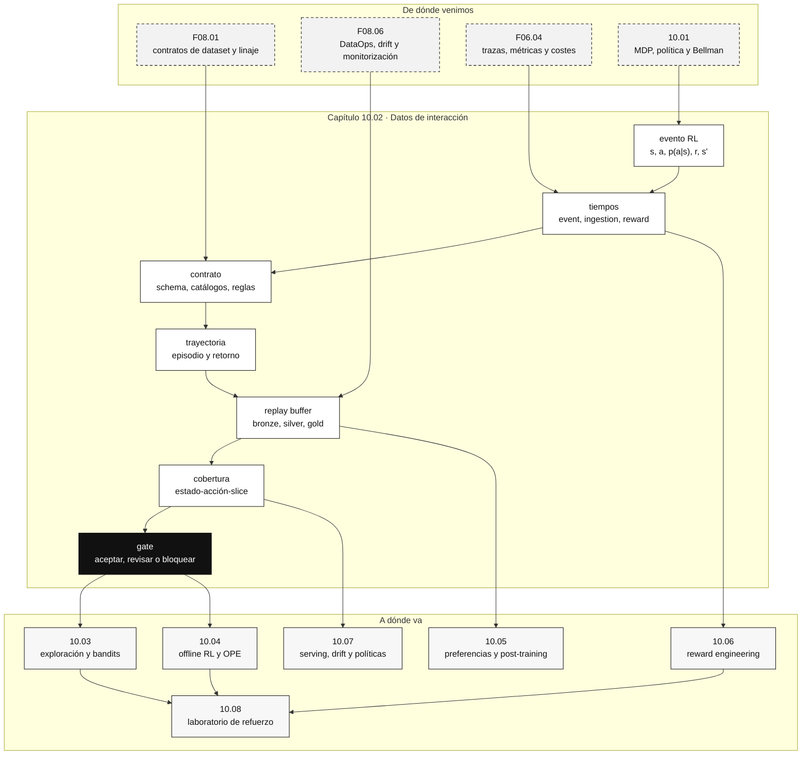

::: {.fasciculo-subtitle}
Facsímil 10 · Aprendizaje por refuerzo
:::

# Capítulo 02: Datos de interacción: eventos, trayectorias y linaje

## Antes de aprender, hay que registrar bien

El capítulo anterior nos dio el lenguaje matemático: estados, acciones, transiciones, recompensas, políticas y retorno. Eso sirve para pensar. Pero un sistema real no aprende de una definición bonita. Aprende de datos que alguien ha capturado, validado, versionado y defendido.

Aquí cambia la mentalidad. En un problema supervisado puedes empezar con una tabla: entrada, etiqueta y metadatos. En RAG puedes empezar con documentos, chunks, fuentes y versión. En aprendizaje por refuerzo, una fila aislada casi nunca basta, porque la acción de hoy modifica la observación de mañana. El dato tiene tiempo, política, decisión, consecuencia y linaje.

Si lo miramos como ingenieros de datos, la pregunta importante no es todavía “qué algoritmo entrenamos”. La pregunta es:

> ¿podemos reconstruir qué vio la política, qué opciones tenía, qué eligió, con qué probabilidad, qué ocurrió después y con qué versión de sistema se produjo todo?

Sutton y Barto describen el aprendizaje por refuerzo como aprendizaje mediante interacción entre agente y entorno.^[Sutton, R. S. y Barto, A. G. (2018). *Reinforcement Learning: An Introduction* (2.ª ed.). MIT Press. https://incompleteideas.net/book/the-book-2nd.html] En ingeniería, esa palabra, interacción, se traduce en eventos, trayectorias, contratos de datos, metadatos y snapshots reproducibles.

## Qué no es un dataset de refuerzo

Un dataset de refuerzo no es una colección de prompts con respuestas. Tampoco es un log de aplicación con mensajes de depuración. Y no es una lista de recompensas sueltas. Esas piezas pueden ayudar, pero no bastan para saber si una política produjo una buena decisión.

El fallo típico consiste en guardar lo que era cómodo para depurar, no lo que hará falta para evaluar. Guardamos la respuesta final, pero no las acciones disponibles. Guardamos una recompensa, pero no cuándo llegó. Guardamos el modelo usado, pero no la versión de política que eligió la acción. Guardamos trazas técnicas, pero no la probabilidad con la que se tomó la decisión.

| Error de datos | Qué parece que tienes | Qué falta para RL |
|---|---|---|
| Solo guardar la respuesta final. | Un historial legible de interacciones. | Estado, acción, alternativas, política, propensión y consecuencia. |
| Guardar recompensa sin `reward_time`. | Una métrica de resultado. | Atribución temporal: a qué acción se asocia esa señal. |
| Mezclar versiones de política. | Más volumen de datos. | Comparabilidad y reproducibilidad. |
| Omitir `available_actions`. | La acción tomada. | El conjunto de decisiones posibles en ese estado. |
| Omitir `action_probability`. | Qué eligió la política. | Con qué probabilidad lo eligió, clave para evaluación offline. |
| No separar `event_time` e `ingestion_time`. | Un timestamp. | Orden real del mundo frente a orden de llegada al pipeline. |
| No registrar contrato ni hash del snapshot. | Una carpeta de datos. | Evidencia de qué se entrenó o evaluó exactamente. |

Sculley y coautores explicaron que en sistemas ML la deuda técnica aparece en datos, dependencias, configuración, cambios silenciosos y bucles de retroalimentación.^[Sculley, D., Holt, G., Golovin, D., Davydov, E., Phillips, T., Ebner, D., Chaudhary, V., Young, M., Crespo, J.-F. y Dennison, D. (2015). Hidden technical debt in machine learning systems. *Advances in Neural Information Processing Systems*, 28. https://papers.nips.cc/paper_files/paper/2015/hash/86df7dcfd896fcaf2674f757a2463eba-Abstract.html] En RL esa deuda se multiplica: la política que toma decisiones también decide qué datos veremos después.

## Del log malo al evento defendible

Una forma rápida de entender el salto es comparar un log de aplicación con un evento de decisión. El log de aplicación sirve para depurar. El evento RL sirve para reconstruir, evaluar y aprender.

| Registro pobre | Por qué no basta | Evento defendible |
|---|---|---|
| `2026-06-07 09:00 usuario pide ayuda` | No dice qué vio la política ni qué podía hacer. | `state_id`, `state_features`, `available_actions`. |
| `accion=pedir_dato` | No dice si esa acción era una opción razonable o la única disponible. | `action`, `available_actions`, `policy_version`. |
| `modelo=gpt-x` | El modelo no es la política completa. Falta routing, prompt, reglas y umbrales. | `policy_id`, `policy_version`, `environment_version`. |
| `score=0.82` | Score de qué, calculado cuándo y con qué versión. | `reward`, `reward_terms`, `reward_version`, `reward_time`. |
| `ok=true` | No separa éxito inmediato, reapertura, coste ni groundedness. | Componentes de recompensa separados. |
| `trace=abc` | La traza ayuda, pero no sustituye el contrato de decisión. | `trace_id` más evento RL completo. |

Ejemplo de log pobre:

```text
2026-06-07T09:00:00Z case_001 accion=pedir_dato ok=false modelo=asistente-v4
```

Ejemplo de evento defendible, abreviado:

```json
{
  "episode_id": "case_001",
  "t": 0,
  "state_id": "ticket_nuevo",
  "available_actions": ["consultar_rag", "pedir_dato", "escalar_revision"],
  "action": "pedir_dato",
  "action_probability": 0.34,
  "policy_version": "2026-06-07.3",
  "reward": -0.2,
  "reward_version": "support_reward.v2",
  "reward_time": "2026-06-07T09:04:00Z",
  "next_state_id": "esperando_usuario"
}
```

La diferencia no es estética. El primer registro permite contar una historia aproximada. El segundo permite escribir tests, calcular retorno, medir cobertura, comparar políticas y decidir si un snapshot puede usarse.

## El evento mínimo que sí permite reconstruir una decisión

Un evento de interacción es el registro atómico de una decisión. No debe intentar contar toda la historia del usuario ni guardar datos innecesarios. Debe guardar lo suficiente para reconstruir el paso \(t\) de una trayectoria.

Este sería un evento razonable para un asistente que decide si responder, pedir más datos o escalar a revisión:

```json
{
  "schema_version": "rl_event.v1",
  "event_id": "evt_2026_06_07_00042",
  "episode_id": "case_matricula_731",
  "t": 3,
  "event_time": "2026-06-07T12:05:31Z",
  "ingestion_time": "2026-06-07T12:05:34Z",
  "reward_time": "2026-06-07T12:22:10Z",
  "state_id": "ticket_con_evidencia",
  "state_features": {
    "categoria": "matricula",
    "sla_horas_restantes": 18,
    "evidencias_recuperadas": 2,
    "confianza_eval": 0.82
  },
  "available_actions": ["responder", "pedir_dato", "escalar_revision"],
  "action": "pedir_dato",
  "action_probability": 0.31,
  "policy_id": "routing_policy_ucb",
  "policy_version": "2026-06-07.3",
  "reward": -0.2,
  "reward_version": "support_reward.v2",
  "reward_terms": {
    "resolved": 0.0,
    "groundedness": 0.9,
    "cost": -0.2,
    "reopened": 0.0
  },
  "next_state_id": "esperando_usuario",
  "terminal": false,
  "trace_id": "trace_9be2",
  "environment_version": "support_runtime.2026-06-07",
  "data_minimization": {
    "contains_personal_data": false,
    "redaction_policy": "support_redaction.v1"
  }
}
```

Cada campo existe por una razón técnica:

| Campo | Qué permite defender |
|---|---|
| `schema_version` | Qué contrato de datos aplica y cómo migrar versiones. |
| `event_id` | Idempotencia, deduplicación y trazabilidad. |
| `episode_id` | Agrupar eventos en una trayectoria. |
| `t` | Orden lógico dentro del episodio. |
| `event_time` | Cuándo ocurrió la decisión en el mundo. |
| `ingestion_time` | Cuándo llegó al pipeline. |
| `reward_time` | Cuándo se observó la consecuencia. |
| `state_id` y `state_features` | Qué información vio la política. |
| `available_actions` | Qué podía elegir legalmente en ese estado. |
| `action` | Qué eligió. |
| `action_probability` | Propensión de la política histórica. |
| `policy_id` y `policy_version` | Qué lógica produjo la acción. |
| `reward` y `reward_terms` | Resultado total y componentes auditables. |
| `reward_version` | Qué definición de recompensa se usó. |
| `next_state_id` | Transición observada. |
| `terminal` | Si el episodio termina ahí. |
| `trace_id` | Unión con logs, spans, latencia, coste y errores. |
| `environment_version` | UI, permisos, catálogo, datos externos y runtime que condicionaron la decisión. |
| `data_minimization` | Evidencia de privacidad y minimización. |

Baylor y coautores describieron TFX como una plataforma donde datos, transformaciones, validación, modelos y metadatos forman un sistema de producción, no una cadena informal de scripts.^[Baylor, D., Breck, E., Cheng, H.-T., Fiedel, N., Foo, C. Y., Haque, Z., Haykal, S., Ispir, M., Jain, V., Koc, L., Koo, C. Y., Lew, L., Mewald, C., Modi, A. N., Polyzotis, N., Ramesh, S., Roy, S., Whang, S. E., Wicke, M., Wilkiewicz, J., Zhang, X. y Zinkevich, M. (2017). TFX: A TensorFlow-based production-scale machine learning platform. *Proceedings of the 23rd ACM SIGKDD International Conference on Knowledge Discovery and Data Mining*, 1387-1395. https://doi.org/10.1145/3097983.3098021] Un evento RL debe vivir en esa misma filosofía: datos, contrato, validación, metadatos y linaje.

## Contrato de datos: no basta con un JSON bonito

Un evento de ejemplo enseña la forma. Un contrato obliga al sistema a cumplirla. En una arquitectura seria, el contrato define campos obligatorios, tipos, catálogos, rangos, claves, reglas temporales, evolución de versiones y criterios de rechazo.

Fragmento simplificado de contrato:

```json
{
  "schema_version": "rl_event.v1",
  "primary_key": ["event_id"],
  "episode_key": ["episode_id"],
  "required": [
    "event_id",
    "episode_id",
    "t",
    "event_time",
    "ingestion_time",
    "state_id",
    "available_actions",
    "action",
    "action_probability",
    "policy_version",
    "reward",
    "reward_version",
    "next_state_id",
    "terminal",
    "trace_id"
  ],
  "constraints": {
    "action_in_available_actions": true,
    "probability_range": [0.0, 1.0],
    "event_time_before_ingestion_time": true,
    "reward_time_after_event_time": true,
    "terminal_event_closes_episode": true
  }
}
```

Ese contrato no es burocracia. Es el equivalente, en datos, a una interfaz de API. Si cambia sin control, rompe consumidores. Si permite campos ambiguos, genera datasets que no se pueden comparar. Si no define reglas de evolución, una política entrenada en junio quizá no sea reproducible en julio.

Breck y coautores propusieron el ML Test Score como una rúbrica para medir preparación de sistemas ML en producción, incluyendo pruebas de datos, infraestructura, monitorización y reproducibilidad.^[Breck, E., Cai, S., Nielsen, E., Salib, M. y Sculley, D. (2017). The ML Test Score: A rubric for ML production readiness and technical debt reduction. *2017 IEEE International Conference on Big Data*, 1123-1132. https://research.google/pubs/pub46555/] El contrato de evento RL es una pieza de esa preparación: antes de entrenar o evaluar, comprobamos si los datos merecen ser usados.

## Trayectorias: una fila no cuenta la historia

Una trayectoria o episodio es una secuencia ordenada de decisiones:

$$
\tau = (s_0,a_0,p_0,r_1,s_1,a_1,p_1,r_2,\ldots,s_T)
$$

| Símbolo | Significado | Ejemplo |
|---|---|---|
| \(\tau\) | Trayectoria completa. | Caso de soporte desde apertura hasta cierre. |
| \(s_t\) | Estado en el paso \(t\). | Ticket con evidencia recuperada. |
| \(a_t\) | Acción tomada. | Pedir dato, responder, escalar. |
| \(p_t\) | Propensión de la acción observada. | La política eligió `pedir_dato` con 0,31. |
| \(r_{t+1}\) | Recompensa observada después de actuar. | +2 si se resuelve, -1 si se reabre. |
| \(T\) | Longitud del episodio. | 4 pasos antes de terminar. |

El retorno de una trayectoria es:

$$
G(\tau)=\sum_{t=0}^{T-1}\gamma^t r_{t+1}
$$

| Símbolo | Significado | Valor de ejemplo |
|---|---|---|
| \(G(\tau)\) | Retorno acumulado descontado. | 2,349 |
| \(\gamma\) | Descuento del futuro. | 0,9 |
| \(r_{t+1}\) | Recompensa tras la acción del paso \(t\). | -0,1; -0,2; +2,0; +1,0 |
| \(T\) | Número de transiciones con recompensa. | 4 |

Ejemplo:

| Paso | Acción | Recompensa |
|---:|---|---:|
| 0 | consultar RAG | -0,1 |
| 1 | pedir dato | -0,2 |
| 2 | responder con cita | +2,0 |
| 3 | cierre sin reapertura | +1,0 |

Con \(\gamma=0.9\):

$$
G(\tau)=-0.1 + 0.9(-0.2)+0.9^2(2.0)+0.9^3(1.0)=2.349
$$

Si guardas solo la última respuesta, no puedes calcular esto. Si guardas solo el coste, tampoco. Si guardas solo la recompensa final, pierdes qué acciones abrieron o cerraron el camino. La trayectoria es la unidad natural cuando el sistema decide varias veces antes de observar el resultado.

## Recompensas tardías y ventanas de atribución

En muchas aplicaciones, la recompensa no aparece en el mismo instante que la acción. Un usuario puede reabrir un ticket horas después. Un alumno puede valorar una explicación al final de la práctica. Una recomendación puede producir lectura hoy y abandono mañana. Un agente puede resolver una tarea y descubrir más tarde que la tool usada era innecesaria.

Por eso separamos tres tiempos:

| Tiempo | Qué representa | Error típico si lo mezclas |
|---|---|---|
| `event_time` | Momento real de la decisión. | Ordenas por llegada al pipeline y cambias la historia. |
| `ingestion_time` | Momento en que el evento entra al sistema de datos. | Confundes retraso de infraestructura con comportamiento del usuario. |
| `reward_time` | Momento en que la consecuencia se observa o se calcula. | Atribuyes una señal tardía a una acción equivocada. |

Ejemplo de fórmula: una regla de atribución mínima puede escribirse así. No es un estándar universal; es una forma de recordar que la recompensa depende de la observación posterior, de la acción evaluada, del estado previo y de una ventana temporal explícita.

$$
r_{t+1}=f(o_{t+1}, a_t, s_t, \Delta t \leq W)
$$

| Símbolo | Significado | Ejemplo |
|---|---|---|
| \(r_{t+1}\) | Recompensa atribuida al paso \(t\). | +2 por resolución confirmada. |
| \(o_{t+1}\) | Observación posterior. | Confirmación, reapertura, coste, revisión. |
| \(a_t\) | Acción que queremos evaluar. | Responder con cita. |
| \(s_t\) | Estado previo. | Ticket con evidencia. |
| \(\Delta t\) | Tiempo entre acción y observación. | 17 minutos. |
| \(W\) | Ventana máxima de atribución. | 48 horas. |

La ventana \(W\) no es un detalle menor. Si es demasiado corta, no capturas consecuencias reales. Si es demasiado larga, mezclas efectos de muchas decisiones. En el contrato de datos debe aparecer cómo se atribuye cada recompensa, qué ocurre con episodios abiertos y cuándo un snapshot se considera maduro.

## Arquitectura de datos: bronze, silver y gold para RL

Un pipeline RL defendible se parece más a una plataforma de datos que a una carpeta de experimentos. La estructura bronze, silver y gold ayuda a separar responsabilidades:

| Capa | Qué contiene | Qué no debería contener | Ejemplo de artefacto |
|---|---|---|---|
| Bronze | Eventos crudos recibidos del producto. | Decisiones de entrenamiento. | `raw_rl_events/2026-06-07/*.jsonl` |
| Silver | Eventos validados, deduplicados y enriquecidos. | Eventos que violan contrato. | `validated_events_v1` |
| Gold | Trayectorias, snapshots y datasets listos para evaluación. | Filas sin linaje o sin criterios de inclusión. | `replay_snapshot_2026_06_07_sha256...` |

El replay buffer no es solo una tabla grande. Es un producto de datos. Debe responder:

| Pregunta | Por qué importa |
|---|---|
| ¿Qué eventos entran y cuáles se rechazan? | Evita entrenar con datos rotos. |
| ¿Qué política produjo cada evento? | Permite comparar y reproducir. |
| ¿Qué reward se usó? | Evita mezclar objetivos distintos. |
| ¿Qué distribución de estados y acciones cubre? | Detecta zonas sin evidencia. |
| ¿Qué datos se minimizan o se eliminan? | Reduce exposición innecesaria. |
| ¿Qué hash identifica el snapshot? | Permite repetir entrenamiento o evaluación. |
| ¿Qué contrato lo validó? | Permite auditar cambios de schema. |

TensorFlow ML Metadata modela artefactos, ejecuciones, contextos y linaje dentro de pipelines ML.^[TensorFlow. (2026). *ML Metadata*. https://tensorflow.github.io/tfx/guide/mlmd/. Consultado el 6 de junio de 2026.] OpenLineage propone un estándar abierto para representar jobs, datasets, runs y relaciones de linaje.^[OpenLineage. (2026). *OpenLineage Documentation*. https://openlineage.io/docs/. Consultado el 6 de junio de 2026.] El principio que nos interesa es estable: un dataset de interacción no debe ser anónimo; debe decir de dónde viene, cómo se procesó y qué versión exacta se usó.

## Propensión: el campo que se echa de menos cuando ya es tarde

La propensión es la probabilidad con la que la política que generó el dato eligió la acción registrada:

$$
p_t = \pi_b(a_t \mid s_t)
$$

| Símbolo | Significado |
|---|---|
| \(p_t\) | Probabilidad registrada de la acción tomada. |
| \(\pi_b\) | Política de comportamiento, la que produjo el dato histórico. |
| \(a_t\) | Acción observada. |
| \(s_t\) | Estado observado por la política. |

¿Por qué nos importa tanto? Porque después quizá queramos estimar qué habría pasado con otra política \(\pi_e\) sin desplegarla todavía. Una forma básica de ponderación por importancia usa:

$$
w_t=\frac{\pi_e(a_t\mid s_t)}{\pi_b(a_t\mid s_t)}
$$

| Símbolo | Lectura |
|---|---|
| \(w_t\) | Peso que corrige cuánto se parece la política nueva a la histórica. |
| \(\pi_e\) | Política que queremos evaluar. |
| \(\pi_b\) | Política que produjo el dato. |

Para una trayectoria completa, una versión simplificada de importancia acumulada sería:

$$
\widehat{V}_{IS}(\pi_e)=\frac{1}{n}\sum_{i=1}^{n}\left(\prod_{t=0}^{T_i-1}\frac{\pi_e(a_{i,t}\mid s_{i,t})}{\pi_b(a_{i,t}\mid s_{i,t})}\right)G(\tau_i)
$$

| Símbolo | Significado |
|---|---|
| \(\widehat{V}_{IS}(\pi_e)\) | Estimación offline del valor de la política nueva. |
| \(n\) | Número de trayectorias históricas. |
| \(T_i\) | Longitud de la trayectoria \(i\). |
| \(G(\tau_i)\) | Retorno observado de la trayectoria. |
| \(\pi_e / \pi_b\) | Corrección entre política evaluada y política histórica. |

La fórmula no es una invitación a usarla a ciegas. Puede tener varianza alta si las políticas se parecen poco o si algunas propensiones son muy pequeñas. La idea importante para este capítulo es más básica: si no registraste \(\pi_b(a_t\mid s_t)\), no puedes aplicar muchas técnicas de evaluación offline con rigor. Dudík, Langford y Li desarrollaron estimadores doblemente robustos para evaluación y aprendizaje de políticas combinando información de propensión y modelos de recompensa.^[Dudík, M., Langford, J. y Li, L. (2011). Doubly robust policy evaluation and learning. *Proceedings of the 28th International Conference on Machine Learning*, 1097-1104. https://icml.cc/2011/papers/511_icmlpaper.pdf] Li y coautores muestran esta lógica en recomendación de noticias con contextual bandits y datos registrados de políticas anteriores.^[Li, L., Chu, W., Langford, J. y Schapire, R. E. (2010). A contextual-bandit approach to personalized news article recommendation. *Proceedings of the 19th International Conference on World Wide Web*, 661-670. https://doi.org/10.1145/1772690.1772758]

## Cobertura: qué estados y acciones sí has observado

Un replay buffer puede tener millones de eventos y seguir siendo pobre. Si casi todos los eventos vienen de estados fáciles, o si una acción apenas se ha probado, el volumen global engaña.

Una forma sencilla de medir cobertura estado-acción es:

$$
\widehat{c}(s,a)=\frac{1}{N}\sum_{i=1}^{N}\mathbf{1}\{s_i=s,\ a_i=a\}
$$

| Símbolo | Significado | Ejemplo |
|---|---|---|
| \(\widehat{c}(s,a)\) | Cobertura empírica de una pareja estado-acción. | 0,08 |
| \(N\) | Número total de eventos. | 10.000 |
| \(\mathbf{1}\{\cdot\}\) | Indicador: vale 1 si se cumple la condición. | 1 si `ticket_con_evidencia` y `responder`. |
| \(s_i,a_i\) | Estado y acción del evento \(i\). | `ticket_nuevo`, `pedir_dato`. |

La cobertura no decide sola, pero guía la confianza:

| Señal | Qué significa | Decisión prudente |
|---|---|---|
| Mucha cobertura en estados frecuentes. | Hay evidencia para decisiones comunes. | Evaluar offline y preparar piloto controlado. |
| Cero cobertura en una acción permitida. | No sabemos cómo se comporta. | Explorar primero o mantener revisión. |
| Cobertura desbalanceada por canal. | La política histórica casi no vio algunos casos. | Medir slices antes de automatizar. |
| Propensiones muy pequeñas. | Ponderaciones inestables. | Recortar pesos, usar estimadores robustos o no concluir. |
| Cambios de entorno sin versión. | Los datos mezclan mundos distintos. | Separar snapshots por `environment_version`. |

Great Expectations y Pandera representan dos formas habituales de validar expectativas y schemas de datos en proyectos de datos y ML.^[Great Expectations. (2026). *Expectations Overview*. https://docs.greatexpectations.io/docs/cloud/expectations/expectations_overview/. Consultado el 6 de junio de 2026.]^[Pandera. (2026). *Pandera documentation*. https://pandera.readthedocs.io/en/stable/. Consultado el 6 de junio de 2026.] En RL, además de tipos y rangos, hay que validar cobertura temporal, cobertura de acciones y coherencia de trayectorias.

## Tres ejemplos que sí se parecen a trabajo real

Veamos cómo cambia el contrato según el sistema.

### Soporte con IA

El sistema decide si responder, pedir más datos, consultar RAG o escalar a revisión. El estado incluye categoría, SLA, evidencias recuperadas, confianza de evaluación y permisos. La recompensa puede mezclar resolución, groundedness, coste y reapertura.

| Campo crítico | Por qué importa |
|---|---|
| `available_actions` | Puede que `responder` no esté permitido sin evidencia suficiente. |
| `reward_time` | La reapertura puede llegar horas después. |
| `trace_id` | Permite saber si RAG falló, si una tool fue lenta o si faltó cita. |
| `reward_terms.reopened` | Separa resolver ahora de generar trabajo después. |

### Recomendador de contenidos

El sistema decide qué documento, noticia o recurso mostrar. El estado incluye usuario anonimizado, contexto, disponibilidad de contenido y restricciones. La recompensa puede ser lectura útil, permanencia, feedback explícito o continuación de tarea.

| Campo crítico | Por qué importa |
|---|---|
| `action_probability` | Sin propensión, no puedes comparar con rigor otra política de ranking. |
| `available_actions` | El catálogo visible cambia con permisos, idioma y disponibilidad. |
| `environment_version` | Un cambio de UI altera el comportamiento observado. |
| `data_minimization` | No todo atributo de usuario debe entrar en estado. |

Mini evento abreviado:

```json
{
  "state_id": "home_usuario_anonimo",
  "available_actions": ["doc_rag_17", "doc_rag_21", "doc_rag_44"],
  "action": "doc_rag_21",
  "action_probability": 0.18,
  "reward_terms": {
    "lectura_util": 1.0,
    "abandono": 0.0,
    "cost": -0.01
  }
}
```

Ese `0.18` es oro para ingeniería. Si luego comparamos otra política de recomendación, necesitamos saber cuánto se parecía o no se parecía a la política histórica que produjo el dato.

### Agente con herramientas

El sistema decide si responder directamente, consultar RAG, llamar una tool, pedir confirmación o parar. El estado incluye tarea, permisos, resultados previos, presupuesto, trazas y contrato operativo.

| Campo crítico | Por qué importa |
|---|---|
| `policy_version` | La lógica de routing puede cambiar más que el modelo base. |
| `reward_terms.cost` | Una política puede resolver, pero gastar demasiado. |
| `terminal` | El agente puede cerrar la tarea o dejarla pendiente. |
| `trace_id` | Une decisión con spans, llamadas, coste y latencia. |

Mini evento abreviado:

```json
{
  "state_id": "tarea_con_datos_incompletos",
  "available_actions": ["consultar_rag", "llamar_tool", "pedir_confirmacion", "parar"],
  "action": "pedir_confirmacion",
  "action_probability": 0.27,
  "reward_terms": {
    "resolucion": 0.0,
    "cost": -0.05,
    "revision_evitable": 0.4,
    "reopened": 0.0
  }
}
```

Aquí se ve por qué `available_actions` importa tanto. Si `llamar_tool` no estaba permitida por permisos, la política no “falló” al no usarla. No podemos evaluar una acción que no era legal en ese estado.

### Sistema educativo adaptativo

El sistema decide si dar una pista, mostrar una explicación, proponer un ejercicio más fácil o pasar al siguiente tema. El estado incluye dominio, intentos, tiempo, señales de confusión y objetivo pedagógico. La recompensa puede llegar tarde: quizá el alumno parece avanzar ahora, pero la comprensión real aparece en una prueba posterior.

| Campo crítico | Por qué importa |
|---|---|
| `reward_time` | La comprensión puede medirse después, no en el clic inmediato. |
| `state_features.intentos` | La misma pista no significa lo mismo en el primer intento que en el quinto. |
| `available_actions` | Algunas ayudas pueden no estar disponibles por nivel o secuencia didáctica. |
| `reward_terms` | Separar rapidez, comprensión y abandono evita optimizar solo velocidad. |

Mini evento abreviado:

```json
{
  "state_id": "ejercicio_gradientes_intento_2",
  "available_actions": ["dar_pista", "mostrar_solucion_parcial", "nuevo_ejercicio"],
  "action": "dar_pista",
  "action_probability": 0.41,
  "reward_time": "2026-06-08T08:00:00Z",
  "reward_terms": {
    "comprension_posterior": 0.8,
    "abandono": 0.0,
    "cost": -0.02
  }
}
```

Estos ejemplos no intentan cubrir todo RL. Intentan enseñar el patrón: si hay decisiones secuenciales, el dato debe conservar estado, acción, alternativas, probabilidad, consecuencia, tiempo y versión.

## Cómo se vería en una base de datos

En producción, tarde o temprano alguien preguntará dónde viven estos datos. Un JSONL sirve para aprender y para pruebas pequeñas; un sistema de datos necesita tablas, claves, particionado, contratos y consultas.

Un modelo físico mínimo podría separar seis tablas:

| Tabla | Qué guarda | Pregunta que responde |
|---|---|---|
| `rl_events` | Evento atómico de decisión. | Qué pasó en cada paso. |
| `rl_episodes` | Episodios agregados y retorno. | Cómo terminó cada trayectoria. |
| `rl_policy_versions` | Versiones de política y configuración. | Qué lógica produjo las acciones. |
| `rl_reward_versions` | Versiones de recompensa y ventana de atribución. | Qué objetivo estábamos optimizando. |
| `rl_trajectory_snapshots` | Cortes reproducibles del replay buffer. | Qué snapshot alimentó evaluación o entrenamiento. |
| `rl_data_quality_runs` | Resultados de gates y validaciones. | Qué se aceptó, revisó o bloqueó. |

El kit del capítulo incluye `sql/warehouse_schema.sql` con ese esquema mínimo. No pretende imponer una base de datos concreta. Pretende mostrar la anatomía profesional: eventos, episodios, versiones, snapshots y runs de calidad no deberían mezclarse en una tabla única sin gobierno.

También incluye `sql/query_examples.sql` con consultas que usarías en el día a día:

| Consulta | Para qué sirve |
|---|---|
| Cobertura por `state_id, action`. | Detectar qué decisiones están respaldadas por datos. |
| Eventos sin propensión útil. | Encontrar filas que debilitan evaluación offline. |
| Recompensas tardías. | Auditar ventanas de atribución. |
| Episodios sin cierre terminal. | Detectar trayectorias incompletas. |
| Retorno por `policy_version`. | Comparar comportamiento histórico sin mezclar versiones. |
| Snapshots no publicables. | Impedir que un corte `review` o `block` alimente entrenamiento. |

Esto conecta directamente con los facsímiles de operación y datos: un replay buffer serio no es solo un dataset; es un conjunto de tablas, contratos, validaciones, decisiones y evidencias.

## Herramientas y SDKs que encajan aquí

Fecha de corte: 7 de junio de 2026. Esta lista no pretende decir “usa todas estas herramientas”. Pretende ubicar familias de herramientas en el pipeline. La regla importante es esta: ninguna herramienta arregla un evento mal diseñado. Si faltan `action_probability`, `policy_version`, `reward_time` o `available_actions`, el problema está en la instrumentación, no en el orquestador.

| Capa del pipeline | Herramientas o SDKs | Para qué sirven | Qué no arreglan |
|---|---|---|---|
| Validación de datos | Great Expectations, Pandera, Deequ | Reglas de schema, tipos, rangos, catálogos, nulos y expectativas. | No inventan propensión ni reconstruyen acciones disponibles. |
| Linaje y catálogo | OpenLineage, Marquez, DataHub | Registrar jobs, datasets, runs, propietarios, cambios y dependencias. | No sustituyen un contrato de evento RL. |
| Versionado y lakehouse | DVC, lakeFS, Delta Lake | Snapshots, rollback, control de cambios y reproducción de cortes. | No deciden si el reward está bien atribuido. |
| Orquestación | Airflow, Dagster, Prefect | Ejecutar ingesta, validación, backfills, snapshots y gates. | No convierte un pipeline sin checks en un pipeline fiable. |
| Feature store | Feast | Reutilizar señales online/offline y evitar inconsistencias de features. | No garantiza que una señal sea suficiente como estado de un MDP. |
| Observabilidad de datos | Evidently, WhyLabs/whylogs | Drift, calidad, distribución y alertas de datos. | No evalúan por sí solas una política nueva. |
| Tracking de experimentos | MLflow, Weights & Biases | Registrar runs, parámetros, métricas, artefactos, hashes y comparaciones. | No reemplazan el linaje del dataset ni el gate de datos. |
| RL y bandits | Vowpal Wabbit, Ray RLlib, TorchRL, CleanRL | Entrenar, simular o prototipar políticas cuando los datos ya son válidos. | No deberían ser el primer paso si el replay buffer aún no pasa contrato. |
| Warehouse o lakehouse | DuckDB, Postgres, BigQuery, Snowflake, Databricks | Consultas, agregados, auditorías y materialización de snapshots. | No corrigen eventos que llegaron incompletos. |

Las herramientas de validación y contratos cubren la primera defensa del pipeline. Great Expectations, Pandera y Deequ documentan formas de expresar expectativas, schemas o tests sobre datos.^[Great Expectations. (2026). *Expectations Overview*. https://docs.greatexpectations.io/docs/cloud/expectations/expectations_overview/. Consultado el 6 de junio de 2026.]^[Pandera. (2026). *Pandera documentation*. https://pandera.readthedocs.io/en/stable/. Consultado el 6 de junio de 2026.]^[AWS Labs. (2026). *Deequ: Unit Tests for Data*. https://github.com/awslabs/deequ. Consultado el 6 de junio de 2026.] En este capítulo las usaríamos para comprobar que `action` pertenece a `available_actions`, que `action_probability` está entre 0 y 1, que `reward_time` no precede a `event_time` y que todos los episodios tienen cierre.

Las herramientas de linaje y versionado ayudan a saber de dónde viene cada snapshot. OpenLineage, Marquez, DataHub, DVC, lakeFS y Delta Lake cubren piezas distintas de esa trazabilidad: eventos de linaje, visualización de metadatos, catálogo, versionado o almacenamiento transaccional.^[OpenLineage. (2026). *OpenLineage Documentation*. https://openlineage.io/docs/. Consultado el 6 de junio de 2026.]^[Marquez Project. (2026). *Marquez*. https://github.com/MarquezProject/marquez. Consultado el 7 de junio de 2026.]^[DataHub. (2026). *DataHub Documentation*. https://docs.datahub.com/. Consultado el 6 de junio de 2026.]^[DVC. (2026). *What is DVC?*. https://dvc.org/doc/user-guide/what-is-dvc. Consultado el 6 de junio de 2026.]^[lakeFS. (2026). *lakeFS Documentation*. https://docs.lakefs.io/. Consultado el 6 de junio de 2026.]^[Delta Lake. (2026). *Delta Lake Documentation*. https://docs.delta.io/. Consultado el 6 de junio de 2026.] En un replay buffer, esto se traduce en una pregunta muy concreta: si alguien te da un modelo entrenado, ¿puedes recuperar exactamente qué eventos, contrato, versión de reward y política histórica lo alimentaron?

La orquestación y la observabilidad convierten el contrato en una rutina. Airflow, Dagster y Prefect sirven para programar y gobernar ejecuciones; Evidently y WhyLabs/whylogs para vigilar distribución, drift y calidad de datos; MLflow y Weights & Biases para registrar experimentos, métricas y artefactos.^[Apache Airflow. (2026). *Apache Airflow Documentation*. https://airflow.apache.org/docs/apache-airflow/stable/core-concepts/. Consultado el 7 de junio de 2026.]^[Dagster. (2026). *Dagster Documentation*. https://docs.dagster.io/getting-started. Consultado el 7 de junio de 2026.]^[Prefect. (2026). *Deployments*. https://docs.prefect.io/concepts/deployments. Consultado el 7 de junio de 2026.]^[Evidently AI. (2026). *Data Drift Documentation*. https://docs.evidentlyai.com/metrics/explainer_drift. Consultado el 6 de junio de 2026.]^[WhyLabs. (2026). *WhyLabs Documentation*. https://docs.whylabs.ai/docs/. Consultado el 7 de junio de 2026.]^[MLflow. (2026). *MLflow Tracking*. https://mlflow.org/docs/latest/ml/tracking. Consultado el 7 de junio de 2026.]^[Weights & Biases. (2026). *Experiments Overview*. https://docs.wandb.ai/models/track. Consultado el 7 de junio de 2026.] En un equipo real, el gate del kit no viviría solo como comando manual: sería un paso de pipeline, con salida archivada y decisión visible.

Las librerías de RL llegan después. Vowpal Wabbit encaja especialmente bien cuando hablamos de contextual bandits y aprendizaje online; Ray RLlib cuando necesitas escala, simulación o entrenamiento distribuido; TorchRL cuando quieres trabajar dentro del ecosistema PyTorch; CleanRL cuando buscas implementaciones compactas para estudiar o prototipar algoritmos.^[Vowpal Wabbit. (2026). *Vowpal Wabbit Documentation*. https://vowpalwabbit.org/docs/. Consultado el 7 de junio de 2026.]^[Ray. (2026). *RLlib: Industry-Grade, Scalable Reinforcement Learning*. https://docs.ray.io/en/latest/rllib/. Consultado el 7 de junio de 2026.]^[PyTorch. (2026). *TorchRL Documentation*. https://docs.pytorch.org/rl/. Consultado el 7 de junio de 2026.]^[CleanRL. (2026). *CleanRL Documentation*. https://docs.cleanrl.dev/. Consultado el 7 de junio de 2026.] El orden importa: primero contrato e instrumentación; después validación y snapshots; luego evaluación offline; y solo entonces entrenamiento o despliegue de políticas.

También conviene pensar en SDKs propios. En un producto real, no quieres que cada equipo emita eventos RL “a mano”. Diseñarías un pequeño SDK interno con una función parecida a esta:

```python
def emit_rl_event(
    episode_id,
    t,
    state,
    available_actions,
    action,
    action_probability,
    policy_version,
    reward=None,
    reward_version=None,
    trace_id=None,
):
    assert action in available_actions
    assert 0.0 <= action_probability <= 1.0
    return {
        "schema_version": "rl_event.v1",
        "episode_id": episode_id,
        "t": t,
        "state_id": state["state_id"],
        "state_features": state["features"],
        "available_actions": available_actions,
        "action": action,
        "action_probability": action_probability,
        "policy_version": policy_version,
        "reward": reward,
        "reward_version": reward_version,
        "trace_id": trace_id,
    }
```

Ese SDK no es el pipeline completo. Es la primera línea de defensa: evita que producto emita eventos imposibles antes de que lleguen al lakehouse. Después vendrían validación de datos, linaje, snapshot, gate y tracking de runs.

## Anatomía de un pipeline de datos para RL

<svg id="f10-c02-rl-data-pipeline" xmlns="http://www.w3.org/2000/svg" viewBox="0 0 1440 1040" role="img" aria-label="Arquitectura de datos para eventos y trayectorias de aprendizaje por refuerzo">
  <defs>
    <marker id="f10c02-arrow" viewBox="0 0 10 10" refX="9" refY="5" markerWidth="7" markerHeight="7" orient="auto-start-reverse">
      <path d="M 0 0 L 10 5 L 0 10 z" fill="#111111"/>
    </marker>
    <pattern id="f10c02-grid" width="20" height="20" patternUnits="userSpaceOnUse">
      <path d="M20 0 L0 0 0 20" fill="none" stroke="#EEEEEE" stroke-width="1"/>
    </pattern>
  </defs>
  <rect x="24" y="24" width="1392" height="992" rx="18" fill="#FFFFFF" stroke="#111111" stroke-width="2"/>
  <text x="720" y="64" text-anchor="middle" font-family="Arial, sans-serif" font-size="25" font-weight="700" fill="#111111">Pipeline de datos RL: del evento al snapshot defendible</text>
  <text x="720" y="92" text-anchor="middle" font-family="Arial, sans-serif" font-size="13" fill="#555555">La política aprende de datos temporales, versionados y validados; no de logs sueltos.</text>
  <rect x="58" y="126" width="1324" height="790" rx="14" fill="url(#f10c02-grid)" stroke="#DDDDDD"/>

  <g font-family="Arial, sans-serif">
    <rect x="86" y="162" width="212" height="96" rx="12" fill="#111111" stroke="#111111"/>
    <text x="192" y="194" text-anchor="middle" font-size="14" font-weight="700" fill="#FFFFFF">Producto</text>
    <text x="192" y="220" text-anchor="middle" font-size="11" fill="#E8E8E8">usuario · agente · entorno</text>
    <text x="192" y="240" text-anchor="middle" font-size="11" fill="#E8E8E8">estado observable</text>

    <line x1="298" y1="210" x2="346" y2="210" stroke="#111111" stroke-width="1.4" marker-end="url(#f10c02-arrow)"/>
    <rect x="346" y="162" width="212" height="96" rx="12" fill="#FFFFFF" stroke="#111111" stroke-width="1.4"/>
    <text x="452" y="194" text-anchor="middle" font-size="14" font-weight="700">Política</text>
    <text x="452" y="220" text-anchor="middle" font-size="11" fill="#555555">elige acción</text>
    <text x="452" y="240" text-anchor="middle" font-size="11" fill="#555555">emite propensión</text>

    <line x1="558" y1="210" x2="606" y2="210" stroke="#111111" stroke-width="1.4" marker-end="url(#f10c02-arrow)"/>
    <rect x="606" y="162" width="212" height="96" rx="12" fill="#FFFFFF" stroke="#111111" stroke-width="1.4"/>
    <text x="712" y="194" text-anchor="middle" font-size="14" font-weight="700">Evento bruto</text>
    <text x="712" y="220" text-anchor="middle" font-size="11" fill="#555555">s, a, p, reward_time</text>
    <text x="712" y="240" text-anchor="middle" font-size="11" fill="#555555">trace · versiones</text>

    <line x1="818" y1="210" x2="866" y2="210" stroke="#111111" stroke-width="1.4" marker-end="url(#f10c02-arrow)"/>
    <rect x="866" y="162" width="212" height="96" rx="12" fill="#F7F7F7" stroke="#111111" stroke-width="1.4"/>
    <text x="972" y="194" text-anchor="middle" font-size="14" font-weight="700">Bronze</text>
    <text x="972" y="220" text-anchor="middle" font-size="11" fill="#555555">append-only</text>
    <text x="972" y="240" text-anchor="middle" font-size="11" fill="#555555">idempotencia</text>

    <line x1="1078" y1="210" x2="1126" y2="210" stroke="#111111" stroke-width="1.4" marker-end="url(#f10c02-arrow)"/>
    <rect x="1126" y="162" width="212" height="96" rx="12" fill="#FFFFFF" stroke="#111111" stroke-width="1.4"/>
    <text x="1232" y="194" text-anchor="middle" font-size="14" font-weight="700">Contrato</text>
    <text x="1232" y="220" text-anchor="middle" font-size="11" fill="#555555">schema · catálogos</text>
    <text x="1232" y="240" text-anchor="middle" font-size="11" fill="#555555">tiempo · privacidad</text>

    <rect x="124" y="378" width="250" height="132" rx="12" fill="#FFFFFF" stroke="#111111" stroke-width="1.4"/>
    <text x="249" y="410" text-anchor="middle" font-size="14" font-weight="700">Validación Silver</text>
    <text x="249" y="436" text-anchor="middle" font-size="11" fill="#555555">tipos · acciones posibles</text>
    <text x="249" y="456" text-anchor="middle" font-size="11" fill="#555555">probabilidad · timestamps</text>
    <text x="249" y="476" text-anchor="middle" font-size="11" fill="#555555">deduplicación</text>

    <rect x="474" y="378" width="250" height="132" rx="12" fill="#FFFFFF" stroke="#111111" stroke-width="1.4"/>
    <text x="599" y="410" text-anchor="middle" font-size="14" font-weight="700">Enriquecimiento</text>
    <text x="599" y="436" text-anchor="middle" font-size="11" fill="#555555">reward_terms</text>
    <text x="599" y="456" text-anchor="middle" font-size="11" fill="#555555">slices · entorno</text>
    <text x="599" y="476" text-anchor="middle" font-size="11" fill="#555555">linaje de política</text>

    <rect x="824" y="378" width="250" height="132" rx="12" fill="#F7F7F7" stroke="#111111" stroke-width="1.4"/>
    <text x="949" y="410" text-anchor="middle" font-size="14" font-weight="700">Trayectorias Gold</text>
    <text x="949" y="436" text-anchor="middle" font-size="11" fill="#555555">episode_id · orden t</text>
    <text x="949" y="456" text-anchor="middle" font-size="11" fill="#555555">retorno · terminal</text>
    <text x="949" y="476" text-anchor="middle" font-size="11" fill="#555555">madurez de reward</text>

    <rect x="1174" y="378" width="250" height="132" rx="12" fill="#FFFFFF" stroke="#111111" stroke-width="1.4"/>
    <text x="1299" y="410" text-anchor="middle" font-size="14" font-weight="700">Replay snapshot</text>
    <text x="1299" y="436" text-anchor="middle" font-size="11" fill="#555555">hash · contrato</text>
    <text x="1299" y="456" text-anchor="middle" font-size="11" fill="#555555">rango temporal</text>
    <text x="1299" y="476" text-anchor="middle" font-size="11" fill="#555555">criterios de inclusión</text>

    <path d="M1232 258 C1232 320 249 320 249 378" fill="none" stroke="#111111" stroke-width="1.2" marker-end="url(#f10c02-arrow)"/>
    <line x1="374" y1="444" x2="474" y2="444" stroke="#111111" stroke-width="1.2" marker-end="url(#f10c02-arrow)"/>
    <line x1="724" y1="444" x2="824" y2="444" stroke="#111111" stroke-width="1.2" marker-end="url(#f10c02-arrow)"/>
    <line x1="1074" y1="444" x2="1174" y2="444" stroke="#111111" stroke-width="1.2" marker-end="url(#f10c02-arrow)"/>

    <rect x="150" y="648" width="260" height="120" rx="12" fill="#FFFFFF" stroke="#111111" stroke-width="1.4"/>
    <text x="280" y="680" text-anchor="middle" font-size="14" font-weight="700">Coverage report</text>
    <text x="280" y="706" text-anchor="middle" font-size="11" fill="#555555">estados · acciones</text>
    <text x="280" y="726" text-anchor="middle" font-size="11" fill="#555555">slices · propensiones</text>
    <text x="280" y="746" text-anchor="middle" font-size="11" fill="#555555">huecos de evidencia</text>

    <rect x="530" y="648" width="260" height="120" rx="12" fill="#111111" stroke="#111111"/>
    <text x="660" y="680" text-anchor="middle" font-size="14" font-weight="700" fill="#FFFFFF">Gate de datos RL</text>
    <text x="660" y="706" text-anchor="middle" font-size="11" fill="#E8E8E8">si falta propensión, reward</text>
    <text x="660" y="726" text-anchor="middle" font-size="11" fill="#E8E8E8">o linaje, bloquea</text>
    <text x="660" y="746" text-anchor="middle" font-size="11" fill="#E8E8E8">entrenamiento/evaluación</text>

    <rect x="910" y="648" width="260" height="120" rx="12" fill="#FFFFFF" stroke="#111111" stroke-width="1.4"/>
    <text x="1040" y="680" text-anchor="middle" font-size="14" font-weight="700">Consumo</text>
    <text x="1040" y="706" text-anchor="middle" font-size="11" fill="#555555">bandits · OPE</text>
    <text x="1040" y="726" text-anchor="middle" font-size="11" fill="#555555">post-training</text>
    <text x="1040" y="746" text-anchor="middle" font-size="11" fill="#555555">monitorización</text>

    <path d="M1299 510 C1299 604 280 604 280 648" fill="none" stroke="#111111" stroke-width="1.2" marker-end="url(#f10c02-arrow)"/>
    <line x1="410" y1="708" x2="530" y2="708" stroke="#111111" stroke-width="1.2" marker-end="url(#f10c02-arrow)"/>
    <line x1="790" y1="708" x2="910" y2="708" stroke="#111111" stroke-width="1.2" marker-end="url(#f10c02-arrow)"/>

    <rect x="268" y="832" width="904" height="52" rx="12" fill="#FFFFFF" stroke="#111111" stroke-dasharray="7 5"/>
    <text x="720" y="864" text-anchor="middle" font-size="13" font-weight="700">Un buffer de RL es publicable solo si se puede versionar, reproducir, auditar y rechazar por contrato.</text>
  </g>

  <text x="1368" y="970" text-anchor="end" font-family="Arial, sans-serif" font-size="11" fill="#888888">IA para gente curiosa / Facsímil 10 / Capítulo 02 / 686f6c61</text>
</svg>

## Manos a la obra

En este capítulo sí vamos a dejar un artefacto operativo. El kit está en:

`labs/f10/c02-rl-events/`

La práctica construye un mini pipeline de eventos RL con piezas de datos, contrato, validación, SQL y decisión:

| Archivo | Qué hace |
|---|---|
| `data/events.jsonl` | Eventos de interacción de un asistente de soporte. |
| `data/events_bad.jsonl` | Eventos rotos para comprobar que el gate bloquea. |
| `contracts/rl_event_contract.json` | Contrato de evento, reglas temporales y umbrales. |
| `ops/validate_rl_events.py` | Validador ejecutable sin dependencias externas. |
| `sql/warehouse_schema.sql` | Modelo físico mínimo de warehouse RL. |
| `sql/query_examples.sql` | Consultas para cobertura, propensión, recompensas tardías y snapshots. |
| `output/rl_event_report.json` | Reporte generado: checks, retornos, cobertura y hash. |
| `output/rl_event_decision.md` | Decisión técnica para aceptar, revisar o bloquear el snapshot. |

Ejecución:

```bash
cd labs/f10/c02-rl-events
python3 ops/validate_rl_events.py --write
cat output/rl_event_decision.md
python3 -m json.tool output/rl_event_report.json
```

Qué deberías ver:

```text
status=pass
episodes=4
events=8
snapshot_hash=...
```

Para ver un caso que debe bloquear:

```bash
python3 ops/validate_rl_events.py \
  --events data/events_bad.jsonl \
  --output output_bad \
  --write
cat output_bad/rl_event_decision.md
```

Qué deberías ver:

```text
status=block
```

El entregable no es “haber corrido un script”. Lo que entregaría un alumno sería:

1. El contrato revisado con un campo nuevo adaptado a su dominio.
2. Un dataset JSONL con al menos tres episodios.
3. Un dataset roto pequeño que demuestre que el gate falla cuando debe fallar.
4. El reporte generado.
5. Una consulta SQL propia para auditar cobertura o reward tardío.
6. Una explicación de qué checks protegen el entrenamiento o la evaluación.
7. Una decisión técnica: usar, revisar o bloquear el snapshot.
8. Una propuesta de mejora de cobertura para una pareja estado-acción con pocos datos.

El objetivo es muy concreto: que al terminar puedas mirar unos logs de producto y decir “esto todavía no es un replay buffer” o “esto sí podría convertirse en un snapshot defendible”.

## Cómo encaja todo

Este mapa debe leerse en tres capas. Venimos del MDP del capítulo 01: estados, acciones, política y retorno. En este capítulo convertimos esos conceptos en datos versionados. Después, esos datos sostienen exploración, evaluación offline, post-training, reward engineering y operación de políticas.



## Dónde solía tropezar yo

| Tropiezo | Por qué ocurre | Antídoto |
|---|---|---|
| Guardar logs sin política. | Parece suficiente para depurar. | Registrar `policy_id`, `policy_version` y `action_probability`. |
| Confundir evento con trayectoria. | Una fila se entiende mejor que una secuencia. | Agrupar por `episode_id`, ordenar por `t` y calcular retorno. |
| Calcular reward tarde y sin versión. | Es cómodo añadirlo después. | Guardar `reward_terms`, `reward_version`, `reward_time` y regla de atribución. |
| Olvidar acciones disponibles. | Miramos solo lo que ocurrió. | Registrar el catálogo permitido en cada estado. |
| Celebrar volumen sin cobertura. | Un agregado grande tranquiliza. | Medir cobertura por estado, acción, slice y política. |
| Tratar el replay buffer como carpeta. | Los experimentos empiezan rápido. | Publicar snapshots con contrato, hash, rango temporal y decisión. |

## Vocabulario aprendido

| Término | Definición |
|---|---|
| Evento de interacción | Registro atómico de estado, acción, probabilidad, recompensa y versión. |
| Trayectoria | Secuencia ordenada de eventos de un episodio. |
| Propensión | Probabilidad con la que la política histórica eligió la acción observada. |
| Recompensa tardía | Resultado que llega después de actuar y necesita regla de atribución. |
| Replay buffer | Almacén versionado de experiencias. |
| Snapshot de replay | Corte reproducible del buffer con contrato, hash y criterios de inclusión. |
| Cobertura estado-acción | Medida de qué parejas estado-acción están representadas en los datos. |
| Gate de datos RL | Validación que impide usar experiencias incompletas o no reproducibles. |

## Antes de pasar página

- ¿Puedes explicar por qué una trayectoria no es lo mismo que una fila?
- ¿Qué campo permite saber qué política produjo un evento?
- ¿Por qué `action_probability` importa para evaluación offline?
- ¿Qué diferencia hay entre `event_time`, `ingestion_time` y `reward_time`?
- ¿Qué pierde un replay buffer sin contrato ni hash?
- ¿Cómo medirías cobertura de una pareja estado-acción?
- ¿Qué harías si una acción crítica aparece con cobertura cero?
- ¿Qué artefactos produce el kit práctico del capítulo?

## Para saber más

Apache Airflow. (2026). *Apache Airflow Documentation*. https://airflow.apache.org/docs/apache-airflow/stable/core-concepts/

AWS Labs. (2026). *Deequ: Unit Tests for Data*. https://github.com/awslabs/deequ

Baylor, D., Breck, E., Cheng, H.-T., Fiedel, N., Foo, C. Y., Haque, Z., Haykal, S., Ispir, M., Jain, V., Koc, L., Koo, C. Y., Lew, L., Mewald, C., Modi, A. N., Polyzotis, N., Ramesh, S., Roy, S., Whang, S. E., Wicke, M., Wilkiewicz, J., Zhang, X. y Zinkevich, M. (2017). TFX: A TensorFlow-based production-scale machine learning platform. *Proceedings of the 23rd ACM SIGKDD International Conference on Knowledge Discovery and Data Mining*, 1387-1395. https://doi.org/10.1145/3097983.3098021

Breck, E., Cai, S., Nielsen, E., Salib, M. y Sculley, D. (2017). The ML Test Score: A rubric for ML production readiness and technical debt reduction. *2017 IEEE International Conference on Big Data*, 1123-1132. https://research.google/pubs/pub46555/

CleanRL. (2026). *CleanRL Documentation*. https://docs.cleanrl.dev/

Dagster. (2026). *Dagster Documentation*. https://docs.dagster.io/getting-started

DataHub. (2026). *DataHub Documentation*. https://docs.datahub.com/

Delta Lake. (2026). *Delta Lake Documentation*. https://docs.delta.io/

Dudík, M., Langford, J. y Li, L. (2011). Doubly robust policy evaluation and learning. *Proceedings of the 28th International Conference on Machine Learning*, 1097-1104. https://icml.cc/2011/papers/511_icmlpaper.pdf

DVC. (2026). *What is DVC?* https://dvc.org/doc/user-guide/what-is-dvc

Evidently AI. (2026). *Data Drift Documentation*. https://docs.evidentlyai.com/metrics/explainer_drift

Feast. (2026). *Feast Documentation*. https://docs.feast.dev/

Great Expectations. (2026). *Expectations Overview*. https://docs.greatexpectations.io/docs/cloud/expectations/expectations_overview/

lakeFS. (2026). *lakeFS Documentation*. https://docs.lakefs.io/

Li, L., Chu, W., Langford, J. y Schapire, R. E. (2010). A contextual-bandit approach to personalized news article recommendation. *Proceedings of the 19th International Conference on World Wide Web*, 661-670. https://doi.org/10.1145/1772690.1772758

Marquez Project. (2026). *Marquez*. https://github.com/MarquezProject/marquez

MLflow. (2026). *MLflow Tracking*. https://mlflow.org/docs/latest/ml/tracking

OpenLineage. (2026). *OpenLineage Documentation*. https://openlineage.io/docs/

Pandera. (2026). *Pandera documentation*. https://pandera.readthedocs.io/en/stable/

Prefect. (2026). *Deployments*. https://docs.prefect.io/concepts/deployments

PyTorch. (2026). *TorchRL Documentation*. https://docs.pytorch.org/rl/

Ray. (2026). *RLlib: Industry-Grade, Scalable Reinforcement Learning*. https://docs.ray.io/en/latest/rllib/

Sculley, D., Holt, G., Golovin, D., Davydov, E., Phillips, T., Ebner, D., Chaudhary, V., Young, M., Crespo, J.-F. y Dennison, D. (2015). Hidden technical debt in machine learning systems. *Advances in Neural Information Processing Systems*, 28. https://papers.nips.cc/paper_files/paper/2015/hash/86df7dcfd896fcaf2674f757a2463eba-Abstract.html

Sutton, R. S. y Barto, A. G. (2018). *Reinforcement Learning: An Introduction* (2.ª ed.). MIT Press. https://incompleteideas.net/book/the-book-2nd.html

TensorFlow. (2026). *ML Metadata*. https://tensorflow.github.io/tfx/guide/mlmd/

Vowpal Wabbit. (2026). *Vowpal Wabbit Documentation*. https://vowpalwabbit.org/docs/

Weights & Biases. (2026). *Experiments Overview*. https://docs.wandb.ai/models/track

WhyLabs. (2026). *WhyLabs Documentation*. https://docs.whylabs.ai/docs/

## En resumen

| Idea | Qué debes recordar |
|---|---|
| RL necesita datos temporales. | El orden estado-acción-recompensa importa tanto como los valores. |
| Un evento debe registrar alternativas. | Sin `available_actions`, no sabemos qué podía decidir la política. |
| La propensión no es un lujo. | Sin probabilidad histórica, muchas evaluaciones offline pierden rigor. |
| La recompensa puede llegar tarde. | Necesitas `reward_time` y regla de atribución. |
| El replay buffer es un producto de datos. | Debe tener contrato, linaje, cobertura, privacidad, versión y hash. |
| El capítulo 03 depende de este. | Explorar con bandits exige logging y propensiones bien capturadas. |
