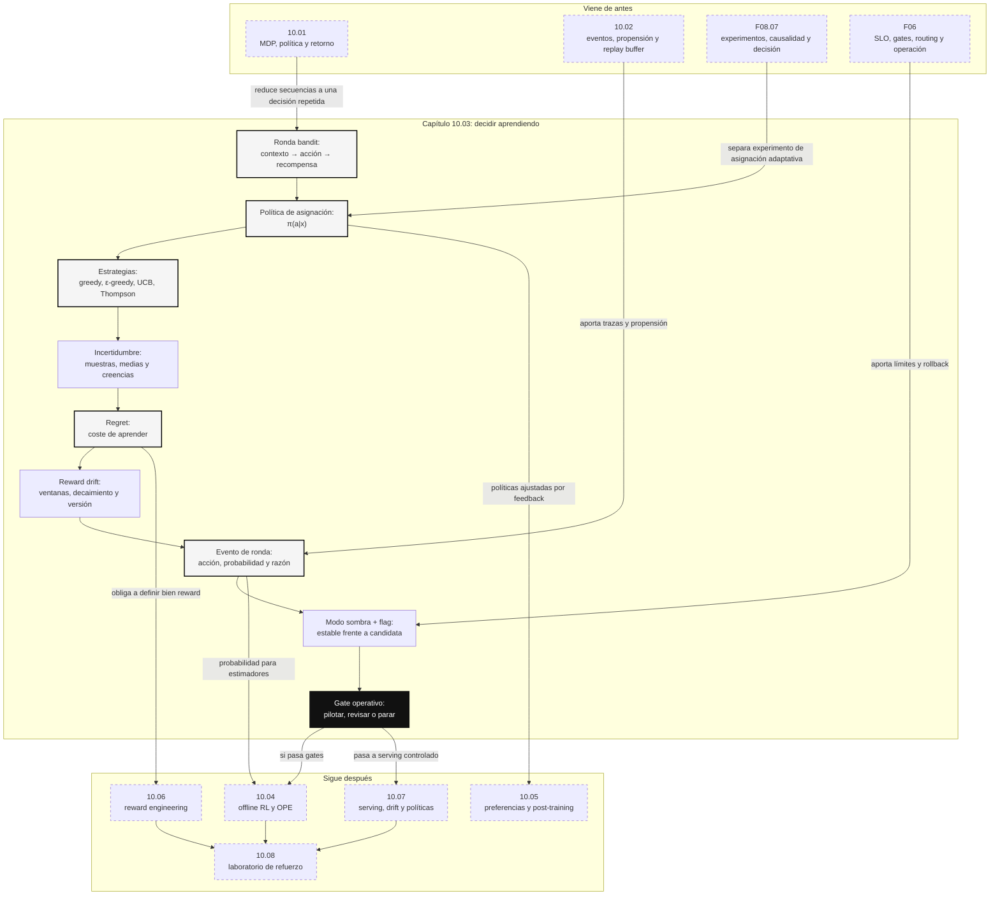

::: {.fasciculo-subtitle}
Facsímil 10 · Aprendizaje por refuerzo
:::

# Capítulo 03: Exploración, bandits y validación de políticas

## Aprender mientras decides no es gratis

En un A/B test clásico repartes tráfico, esperas, analizas y decides. En un bandit, el sistema decide y aprende a la vez: manda más tráfico a lo que parece funcionar, pero reserva parte para seguir probando. Suena eficiente. También es delicado, porque la exploración deja de ser un análisis externo y pasa a modificar la experiencia real del producto.

La pregunta de ingeniería no es “¿usamos bandits?”. La pregunta es:

> ¿qué podemos probar, con qué límite, en qué casos, con qué métrica de daño aceptable y con qué rollback?

Un bandit es una versión simplificada de aprendizaje por refuerzo. No modela una secuencia larga como un MDP completo. En cada ronda observas un contexto opcional, eliges una acción, recibes una recompensa y actualizas evidencia. Sutton y Barto tratan los bandits como el caso mínimo donde aparece el dilema entre explorar y explotar.^[Sutton, R. S. y Barto, A. G. (2018). *Reinforcement Learning: An Introduction* (2.ª ed.). MIT Press. https://incompleteideas.net/book/the-book-2nd.html]

## Qué no es un bandit

Un bandit no es “un A/B test que se mueve solo”. Tampoco es una forma elegante de saltarse evaluación. Y no es una excusa para probar cualquier opción con cualquier usuario.

| Malentendido | Por qué confunde | Forma correcta de pensarlo |
|---|---|---|
| “El bandit encontrará solo lo mejor”. | Si la recompensa está mal diseñada, optimiza lo equivocado. | Primero reward, límites y trazas; luego política. |
| “Explorar siempre mejora”. | Explorar opciones peores tiene coste real. | Medir regret y presupuesto de exploración. |
| “Si cambia asignación, ya aprende”. | Cambiar tráfico no garantiza evidencia útil. | Registrar acción, propensión, contexto y recompensa. |
| “Es más moderno que A/B testing”. | Responde otra pregunta. | Bandit optimiza durante la asignación; A/B estima con diseño fijo. |
| “Vale para cualquier caso”. | Algunos contextos no toleran exploración automática. | Definir slices donde se limita o desactiva. |

En ingeniería de IA, un bandit puede ser útil para routing de modelos, selección de prompts, configuración de RAG, elección de herramientas o recomendación. Pero solo si aceptamos la frase incómoda: aprender tiene coste de oportunidad.

## A/B test, bandit o ninguna de las dos

Esta distinción importa mucho en proyectos reales. Si el objetivo es estimar con claridad el efecto de una variante, un A/B test suele ser más limpio: asignación fija, periodo definido, análisis estadístico y decisión. Si el objetivo es repartir tráfico mientras aprendemos y el coste de equivocarnos está acotado, un bandit puede tener sentido. Si la decisión afecta a casos críticos, a cumplimiento normativo o a una experiencia donde el error tiene consecuencias serias, quizá no corresponde explorar online: primero simulación, evaluación offline y revisión humana del cambio.

| Situación | Mejor punto de partida | Por qué |
|---|---|---|
| Quiero saber si un nuevo prompt mejora una métrica antes de adoptarlo. | A/B test controlado. | Separas estimación de despliegue y puedes medir efecto con menos movimiento adaptativo. |
| Tengo varias rutas de modelo y el coste de una mala elección está limitado. | Bandit con gates. | El sistema puede mover tráfico hacia rutas prometedoras mientras controla regret, coste y slices. |
| El reward llega tarde o depende de varias decisiones encadenadas. | MDP, offline RL o evaluación de trayectorias. | Un bandit ve una recompensa inmediata o atribuible a una decisión; no modela bien una secuencia larga. |
| La métrica principal no está validada. | Ninguna política adaptativa todavía. | Si el reward está mal, el algoritmo aprenderá a optimizar ruido o un proxy cómodo. |
| Hay poco volumen. | A/B simple, regla fija o simulación. | Un bandit necesita observaciones suficientes para que la incertidumbre se reduzca. |
| El cambio solo debe activarse para un grupo por despliegue progresivo. | Feature flag o rollout gradual. | Controlas exposición, pero no necesariamente aprendes una política. |

Una forma práctica de decidirlo es preguntar: ¿necesito aprender una asignación durante el uso, o solo necesito controlar quién ve una versión? La primera pregunta apunta a bandits. La segunda apunta a feature flags, canary releases o experimentación clásica. LaunchDarkly documenta rollouts porcentuales para liberar cambios de forma gradual, y OpenFeature separa la evaluación de flags mediante un contexto que puede incluir atributos de usuario, aplicación o petición.^[LaunchDarkly. (2026). *Releasing features with LaunchDarkly*. https://launchdarkly.com/docs/home/releases/releasing. Consultado el 8 de junio de 2026.]^[OpenFeature. (2026). *Evaluation Context*. https://openfeature.dev/specification/sections/evaluation-context/. Consultado el 8 de junio de 2026.]

## El problema formal

En un bandit de \(K\) brazos tenemos un conjunto de acciones:

$$
A=\{1,2,\ldots,K\}
$$

En cada ronda \(t\), elegimos una acción \(a_t\) y observamos una recompensa:

$$
r_t \sim R(a_t)
$$

| Símbolo | Significado | Ejemplo |
|---|---|---|
| \(A\) | Conjunto de acciones o brazos. | `modelo_rapido`, `modelo_fuerte`, `revision_humana`. |
| \(K\) | Número de acciones. | 3 |
| \(t\) | Ronda de decisión. | Ticket número 41 de la ventana. |
| \(a_t\) | Acción elegida en la ronda \(t\). | Usar `modelo_fuerte`. |
| \(r_t\) | Recompensa observada. | Calidad menos coste y penalización por reapertura. |
| \(R(a_t)\) | Distribución de recompensas de esa acción. | El modelo fuerte suele dar más calidad, pero cuesta más. |

La media real de una acción, que normalmente no conocemos, es:

$$
\mu_a=\mathbb{E}[r \mid a]
$$

Y la media observada después de probarla \(N_a(t)\) veces es:

$$
\hat{\mu}_{a,t}=\frac{1}{N_a(t)}\sum_{i:a_i=a} r_i
$$

| Símbolo | Significado | Ejemplo |
|---|---|---|
| \(\mu_a\) | Recompensa media real de la acción. | Valor esperado del modelo fuerte. |
| \(\hat{\mu}_{a,t}\) | Media estimada con datos hasta \(t\). | Media observada tras 12 usos. |
| \(N_a(t)\) | Veces que se ha elegido \(a\). | 12 |
| \(\sum_{i:a_i=a} r_i\) | Suma de recompensas donde se eligió \(a\). | 8,9 puntos acumulados. |

La trampa está aquí: una acción con poca muestra puede parecer mala por azar o buena por azar. La exploración es la disciplina de no confundir evidencia temprana con verdad.

## Greedy y epsilon-greedy

La política greedy elige siempre la acción con mejor media observada:

$$
a_t=\arg\max_a \hat{\mu}_{a,t}
$$

Es simple, rápida y fácil de explicar. También puede quedar atrapada. Si una acción buena empezó con dos recompensas flojas, greedy quizá no vuelva a probarla nunca.

\(\epsilon\)-greedy añade exploración:

$$
a_t =
\begin{cases}
\text{acción aleatoria}, & \text{con probabilidad } \epsilon \\
\arg\max_a \hat{\mu}_{a,t}, & \text{con probabilidad } 1-\epsilon
\end{cases}
$$

| Símbolo | Significado | Ejemplo |
|---|---|---|
| \(\epsilon\) | Probabilidad de explorar. | 0,1 |
| \(1-\epsilon\) | Probabilidad de explotar la mejor media observada. | 0,9 |
| \(\arg\max_a\) | Acción con mayor estimación. | `modelo_fuerte`. |

\(\epsilon\)-greedy es buena para aprender el concepto porque es auditable. Puedes decir “exploramos un 10 %”. Pero tiene una limitación clara: explora de forma poco informada. Puede seguir probando acciones con mala evidencia aunque haya otras con incertidumbre más razonable.

## UCB: explorar donde falta evidencia

UCB, *Upper Confidence Bound*, elige la acción con mejor combinación de media observada e incertidumbre:

$$
a_t=\arg\max_a\left(\hat{\mu}_{a,t} + c\sqrt{\frac{\ln t}{N_a(t)}}\right)
$$

| Símbolo | Significado | Ejemplo |
|---|---|---|
| \(\hat{\mu}_{a,t}\) | Media observada de la acción. | 0,74 |
| \(c\) | Peso del bonus de exploración. | 0,8 |
| \(\ln t\) | Logaritmo de la ronda actual. | \(\ln 100\) |
| \(N_a(t)\) | Veces que se ha probado la acción. | 5 |
| \(c\sqrt{\ln t / N_a(t)}\) | Bonus por incertidumbre. | Alto si hay poca muestra. |

La intuición es bonita: no explora por capricho, explora donde la incertidumbre todavía es grande. Auer, Cesa-Bianchi y Fischer analizaron garantías finitas para el problema multi-armed bandit, incluyendo UCB1.^[Auer, P., Cesa-Bianchi, N. y Fischer, P. (2002). Finite-time analysis of the multiarmed bandit problem. *Machine Learning*, 47, 235-256. https://doi.org/10.1023/A:1013689704352] Antes, Lai y Robbins habían establecido fundamentos asintóticos sobre reglas adaptativas eficientes.^[Lai, T. L. y Robbins, H. (1985). Asymptotically efficient adaptive allocation rules. *Advances in Applied Mathematics*, 6(1), 4-22. https://doi.org/10.1016/0196-8858(85)90002-8]

Un ejemplo pequeño ayuda. Imagina dos rutas de modelo en la ronda \(t=100\). La ruta A tiene media observada \(0{,}72\) tras 40 usos. La ruta B tiene media observada \(0{,}68\) tras 5 usos. Si usamos \(c=0{,}4\), UCB calcula:

$$
\operatorname{score}(A)=0{,}72+0{,}4\sqrt{\frac{\ln 100}{40}}\approx 0{,}856
$$

$$
\operatorname{score}(B)=0{,}68+0{,}4\sqrt{\frac{\ln 100}{5}}\approx 1{,}064
$$

El score no es una probabilidad; puede superar 1. Es una puntuación de decisión que mezcla media e incertidumbre. Aunque B tiene peor media observada, UCB la prueba porque apenas tiene muestra. Si después de varias rondas B sigue sin mejorar, su bonus baja porque \(N_B(t)\) crece. Esto es lo que queremos en producción: no “probar por probar”, sino probar donde la evidencia todavía no permite cerrar el caso.

| Ruta | Media observada | Usos | Bonus UCB | Score | Lectura |
|---|---:|---:|---:|---:|---|
| A | 0,72 | 40 | 0,136 | 0,856 | Buena evidencia, menor incertidumbre. |
| B | 0,68 | 5 | 0,384 | 1,064 | Peor media inicial, pero mucha incertidumbre. |

## Thompson sampling: decidir según creencias

Thompson sampling viene de una idea de 1933: representar la incertidumbre sobre cada opción y muestrear de esa creencia antes de decidir.^[Thompson, W. R. (1933). On the likelihood that one unknown probability exceeds another in view of the evidence of two samples. *Biometrika*, 25(3-4), 285-294. https://doi.org/10.2307/2332286]

En el caso Bernoulli, donde cada acción produce éxito o fracaso, podemos usar una distribución Beta:

$$
\theta_a \sim \operatorname{Beta}(\alpha_a,\beta_a)
$$

Elegimos:

$$
a_t=\arg\max_a \theta_a
$$

Después actualizamos:

$$
(\alpha_a,\beta_a)=
\begin{cases}
(\alpha_a+1,\beta_a), & \text{si hay éxito} \\
(\alpha_a,\beta_a+1), & \text{si hay fracaso}
\end{cases}
$$

| Símbolo | Significado | Ejemplo |
|---|---|---|
| \(\theta_a\) | Muestra de la creencia de éxito para la acción \(a\). | 0,73 |
| \(\alpha_a\) | Evidencia acumulada de éxitos. | 8 |
| \(\beta_a\) | Evidencia acumulada de fracasos. | 3 |
| \(\operatorname{Beta}\) | Distribución sobre probabilidades entre 0 y 1. | Creencia sobre tasa de éxito. |

Chapelle y Li evaluaron empíricamente Thompson sampling y mostraron su buen comportamiento práctico en problemas de bandits.^[Chapelle, O. y Li, L. (2011). An empirical evaluation of Thompson sampling. *Advances in Neural Information Processing Systems 24*. https://papers.nips.cc/paper/4321-an-empirical-evaluation-of-thompson-sampling] Para un equipo de ingeniería, su ventaja es que explora de forma proporcional a la incertidumbre. Su coste pedagógico es que puede ser más difícil de explicar que UCB a personas que no viven en estadística bayesiana.

## Regret: la factura de aprender

Si en cada ronda existe una mejor acción disponible con media \(\mu^\*\), el regret acumulado se escribe:

$$
\operatorname{Regret}(T)=\sum_{t=1}^{T}\left(\mu^\*-\mu_{a_t}\right)
$$

En un contexto con recompensas conocidas de simulación, también podemos calcular regret por ronda como:

$$
\operatorname{regret}_t=r_t^\* - r_t
$$

| Símbolo | Significado | Ejemplo |
|---|---|---|
| \(\operatorname{Regret}(T)\) | Pérdida acumulada por no elegir siempre lo mejor. | 3,8 |
| \(T\) | Número de rondas. | 60 |
| \(\mu^\*\) | Media de la mejor acción. | 0,78 |
| \(\mu_{a_t}\) | Media de la acción elegida. | 0,61 |
| \(r_t^\*\) | Mejor recompensa disponible en la ronda simulada. | 0,82 |
| \(r_t\) | Recompensa recibida por la acción elegida. | 0,57 |

Bubeck y Cesa-Bianchi revisan el análisis de regret en bandits estocásticos y no estocásticos.^[Bubeck, S. y Cesa-Bianchi, N. (2012). Regret analysis of stochastic and nonstochastic multi-armed bandit problems. *Foundations and Trends in Machine Learning*, 5(1), 1-122. https://doi.org/10.1561/2200000024] La traducción práctica: no basta con mirar recompensa acumulada. Hay que mirar cuánto coste asumimos por aprender.

## Cuando las recompensas cambian

Hasta aquí hemos hablado como si la distribución de recompensa de cada acción fuera relativamente estable. En productos reales casi nunca es tan cómodo. El modelo rápido puede recibir una mejora de proveedor. El modelo fuerte puede subir de precio. El tráfico puede cambiar por calendario académico. Un prompt puede dejar de funcionar porque el tipo de consulta cambia. Esto se llama no estacionariedad: la recompensa que estimabas ayer no describe necesariamente la recompensa de hoy.

Una solución simple es estimar medias con ventana móvil: solo cuentan las últimas \(W\) rondas.

$$
\hat{\mu}_{a,t}^{(W)}=
\frac{1}{N_{a,W}(t)}
\sum_{\substack{i:a_i=a\\t-W<i\leq t}} r_i
$$

Otra solución es aplicar decaimiento: las observaciones recientes pesan más que las antiguas.

$$
\hat{\mu}_{a,t}^{(\lambda)}=
\frac{\sum_{i:a_i=a}\lambda^{t-i}r_i}
{\sum_{i:a_i=a}\lambda^{t-i}}
,\quad 0<\lambda\leq 1
$$

| Símbolo | Significado | Decisión de ingeniería |
|---|---|---|
| \(W\) | Tamaño de la ventana móvil. | Ventanas cortas reaccionan rápido, pero son más ruidosas. |
| \(N_{a,W}(t)\) | Veces que la acción \(a\) aparece dentro de la ventana. | Si es bajo, no publiques conclusión fuerte. |
| \(\lambda\) | Factor de decaimiento temporal. | Cerca de 1 conserva historia; más bajo olvida antes. |
| \(\lambda^{t-i}\) | Peso de una observación antigua. | Cuanto más antigua, menos pesa. |

En una plataforma de IA esto se traduce en tres prácticas: versionar cada modelo o prompt como acción distinta, reiniciar o separar estadísticas cuando cambian condiciones importantes, y monitorizar reward drift por slice. Si mezclas observaciones de `modelo_fuerte_v1` y `modelo_fuerte_v2`, quizá el algoritmo parezca estable, pero en realidad has borrado el linaje de la decisión.

## Contextual bandits: cuando el estado importa, pero no hay trayectoria larga

Un contextual bandit observa contexto \(x_t\), elige acción \(a_t\) y recibe recompensa \(r_t\):

$$
x_t \rightarrow a_t \rightarrow r_t
$$

La política se escribe:

$$
\pi(a\mid x)=P(A_t=a\mid X_t=x)
$$

| Símbolo | Significado | Ejemplo |
|---|---|---|
| \(x_t\) | Contexto observado antes de decidir. | Idioma, criticidad, coste, tipo de consulta. |
| \(a_t\) | Acción elegida. | Prompt A, modelo fuerte, top-k 6. |
| \(r_t\) | Recompensa observada. | Eval aprobada menos coste. |
| \(\pi(a\mid x)\) | Probabilidad de elegir acción dado el contexto. | 0,22 para `modelo_fuerte`. |

La diferencia con un MDP completo es que no modelamos una secuencia larga de estados. No decimos que la acción no tenga consecuencias futuras; decimos que para este problema vamos a optimizar una decisión repetida con contexto inmediato. Li y coautores aplicaron contextual bandits a recomendación personalizada de noticias, registrando acciones y recompensas para aprender asignaciones adaptativas.^[Li, L., Chu, W., Langford, J. y Schapire, R. E. (2010). A contextual-bandit approach to personalized news article recommendation. *Proceedings of the 19th International Conference on World Wide Web*, 661-670. https://doi.org/10.1145/1772690.1772758]

## Ejemplos que sí se parecen a proyectos de IA

### Routing de modelos

Tienes tres rutas: modelo rápido, modelo fuerte y revisión humana. La recompensa no debería ser solo “respuesta aceptada”. Debería descontar coste, latencia, reapertura y fallos de groundedness.

| Acción | Señal positiva | Coste que debes restar |
|---|---|---|
| `modelo_rapido` | Baja latencia y coste. | Puede fallar en casos complejos. |
| `modelo_fuerte` | Más calidad en casos difíciles. | Más coste y latencia. |
| `revision_humana` | Alta fiabilidad en casos críticos. | Capacidad limitada y demora. |

Un bandit aquí no decide “qué modelo es mejor en abstracto”. Decide cómo repartir tráfico bajo restricciones.

### Selección de prompts

Puedes probar prompt A, B o C para una tarea estable. La recompensa puede venir de una eval automática más coste de tokens:

$$
r = \mathbf{1}\{\text{eval pasa}\} - \lambda \cdot \text{tokens}
$$

| Símbolo | Significado |
|---|---|
| \(\mathbf{1}\{\text{eval pasa}\}\) | 1 si la salida supera la evaluación, 0 si no. |
| \(\lambda\) | Penalización por token. |
| `tokens` | Tokens usados por la respuesta. |

Si no restas tokens, el sistema puede aprender que el prompt más largo “gana” aunque sea más caro sin aportar valor.

### Configuración de RAG

Puedes elegir `top_k=3`, `top_k=6`, búsqueda híbrida o reranking. La recompensa puede combinar cita correcta, groundedness y latencia.

| Acción | Qué aprende el bandit | Riesgo si no limitas |
|---|---|---|
| `top_k_3` | Menos contexto, menor latencia. | Puede perder evidencia. |
| `top_k_6` | Más cobertura documental. | Más coste y ruido. |
| `hybrid_search` | Mejor recall en consultas raras. | Más complejidad. |
| `rerank` | Mejor orden final. | Más latencia. |

Este ejemplo conecta con el facsímil 4: una política de RAG no se evalúa solo por respuesta final, sino por recuperación, cita, coste y trazas.

## Validar una política antes de ponerla a decidir

Una política bandit en producción necesita gates. No basta con decir que UCB obtuvo más recompensa en simulación. Tenemos que fijar límites:

| Límite | Pregunta de ingeniería | Artefacto |
|---|---|---|
| Presupuesto de exploración | ¿Qué porcentaje máximo puede probar opciones inciertas? | `max_exploration_share`. |
| Regret máximo | ¿Cuánto coste de aprendizaje aceptamos por ventana? | `max_regret`. |
| Coste máximo | ¿Cuánto puede gastar la política por lote? | SLO de coste. |
| Calidad mínima | ¿Qué opción se retira si cae por debajo del umbral? | gate de evaluación. |
| Slices sin exploración | ¿Dónde no permitimos exploración automática? | política por criticidad. |
| Propensión registrada | ¿Podremos evaluar offline después? | `action_probability` en cada evento. |
| Rollback | ¿Cómo volvemos a una política fija? | feature flag y runbook. |

Podemos escribir un gate simple:

$$
\text{publicable} =
(\operatorname{Regret}(T) \leq R_{\max})
\land
(B_T \leq B_{\max})
\land
(C_T \leq C_{\max})
\land
(Q_T \geq Q_{\min})
$$

| Símbolo | Significado | Ejemplo |
|---|---|---|
| \(R_{\max}\) | Regret máximo permitido. | 4,0 |
| \(B_T\) | Fracción de rondas exploratorias. | 0,18 |
| \(B_{\max}\) | Presupuesto máximo de exploración. | 0,25 |
| \(C_T\) | Coste acumulado o medio. | 8,4 |
| \(C_{\max}\) | Coste máximo permitido. | 10 |
| \(Q_T\) | Calidad mínima medida en la ventana. | 0,82 |
| \(Q_{\min}\) | Umbral mínimo de calidad. | 0,75 |

Dudík, Langford y Li explican evaluación y aprendizaje de políticas con estimadores que combinan propensión y modelos, lo que refuerza la necesidad de registrar probabilidades de acción desde el principio.^[Dudík, M., Langford, J. y Li, L. (2011). Doubly robust policy evaluation and learning. *Proceedings of the 28th International Conference on Machine Learning*, 1097-1104. https://icml.cc/2011/papers/511_icmlpaper.pdf]

## El evento mínimo de una ronda bandit

El capítulo 02 insistía en eventos, trayectorias y linaje. Aquí el evento se vuelve todavía más importante, porque una política adaptativa cambia la probabilidad de observar ciertas acciones. Si no registras esa probabilidad, después no puedes reconstruir bien qué habría pasado con otra política.

Un evento útil no se limita a `action` y `reward`. Necesita contexto, acciones permitidas, política, probabilidad de asignación, motivo de elección y versión del contrato:

```json
{
  "event_type": "bandit_round",
  "event_id": "evt_20260608_000184",
  "trace_id": "trc_support_0194",
  "occurred_at": "2026-06-08T10:12:44Z",
  "policy_version": "routing_bandit.v3",
  "contract_version": "bandit_policy_gate.v1",
  "context": {
    "slice": "media_criticidad",
    "language": "es",
    "estimated_complexity": 0.74,
    "customer_tier": "standard"
  },
  "allowed_actions": ["modelo_rapido", "modelo_fuerte", "revision_humana"],
  "selected_action": "modelo_fuerte",
  "action_probability": 0.37,
  "selection_reason": "ucb_score",
  "reward": {
    "quality": 0.86,
    "latency_ms": 1840,
    "cost_eur": 0.021,
    "reopened": false,
    "final_reward": 0.742
  }
}
```

Ese JSON no es decoración. Es el expediente técnico de la decisión. `allowed_actions` evita evaluar una política contra acciones que no estaban disponibles. `action_probability` permite estimadores offline. `selection_reason` distingue exploración inicial, UCB, Thompson o política estable. `contract_version` permite saber qué límites estaban vigentes. Y `trace_id` conecta la ronda con el sistema completo: prompt, modelo, retrieval, herramientas y métricas.

## De simulación a piloto controlado

El orden sano no es “simulación buena, producción”. El orden sano es una escalera:

| Fase | Qué ocurre | Qué debe salir |
|---|---|---|
| Replay histórico | Reproduces decisiones sobre eventos antiguos con recompensas conocidas o estimadas. | Scorecard offline y errores de cobertura. |
| Simulación sintética | Creas escenarios pequeños donde sabes qué acción debería ganar. | Prueba de que el código del algoritmo no hace cosas absurdas. |
| Shadow | La política recomienda, pero no decide. El sistema ejecuta la política estable. | Comparación entre recomendación y acción real, sin afectar usuarios. |
| Piloto limitado | La política decide solo en slices permitidos y con tráfico bajo. | Métricas online, regret, coste, calidad y rollback probado. |
| Producción gradual | Aumentas exposición por ventanas y gates. | Evidencia acumulada y alertas por drift. |

En un piloto controlado debes escribir antes de lanzar:

| Elemento | Regla concreta |
|---|---|
| Feature flag | La política bandit vive detrás de una flag con variante `stable` y variante `bandit_candidate`. |
| Política de reserva | Si falta contexto, reward o trazabilidad, se usa la ruta estable. |
| Slices permitidos | Solo baja o media criticidad hasta que el comité técnico apruebe ampliar. |
| Límite de exposición | Por ejemplo, 5 % durante 24 horas, 10 % durante 48 horas y revisión antes de subir. |
| Condiciones de parada | Regret por encima del umbral, coste medio alto, caída de calidad, falta de trazas o desviación de tráfico. |
| Observabilidad | Dashboard por política, acción, slice, coste, reward, latencia y drift. |

OpenTelemetry mantiene convenciones semánticas para atributos de feature flags, de modo que decisiones de flags pueden aparecer en trazas y métricas con nombres estables.^[OpenTelemetry. (2026). *Feature flag semantic conventions*. https://opentelemetry.io/docs/specs/semconv/registry/attributes/feature-flag/. Consultado el 8 de junio de 2026.] Esto encaja bien con bandits: la decisión adaptativa no debe vivir en una caja aislada, sino en la misma trazabilidad que el resto del sistema.

## Herramientas y SDKs

Fecha de corte: 8 de junio de 2026. En este capítulo las herramientas tienen que entenderse como soporte, no como sustituto del diseño estadístico.

| Herramienta | Encaja cuando | Qué mirar antes |
|---|---|---|
| Vowpal Wabbit | Contextual bandits, aprendizaje online y experimentación con políticas. | Logging de propensión, formato de ejemplos y evaluación. |
| Ray RLlib | Simulación o entrenamiento RL a escala. | Si el problema realmente exige RL completo o basta bandit. |
| TorchRL | Prototipos dentro del ecosistema PyTorch. | Entorno, tensores, collectors y reproducibilidad. |
| CleanRL | Estudiar algoritmos con implementaciones compactas. | No confundir ejemplo educativo con plataforma productiva. |
| OpenFeature | API neutral de proveedor para evaluar flags con contexto. | Separar decisión de flag, decisión bandit y trazabilidad. |
| LaunchDarkly | Rollouts, flags, targeting y experimentación de producto. | Variantes, off variation, rollout gradual y deuda de flags. |
| Unleash | Feature flags con estrategias de activación y gradual rollout. | Contexto de evaluación, stickiness, segmentos y operación self-hosted si aplica. |
| Statsig | Feature gates, experimentos y análisis de producto. | Diferencia entre gate, experimento, métricas y assignment. |
| GrowthBook | Experimentación y feature flags conectadas con analítica. | Si el equipo quiere evaluación apoyada en warehouse y SDKs. |
| Eppo | Rollouts, interruptores de parada y análisis de experimentos. | Métricas en warehouse, asignación y criterios de lectura. |
| Optimizely Feature Experimentation | A/B tests y feature flags en productos con cultura de experimentación. | Diferenciar experimento, rollout y personalización. |
| Langfuse o Phoenix | Trazas y evaluación de aplicaciones LLM. | Relacionar decisión bandit con prompt, retrieval, coste y evaluación. |

Vowpal Wabbit documenta soporte para aprendizaje online y contextual bandits; RLlib, TorchRL y CleanRL cubren distintos niveles de entrenamiento, investigación y prototipado RL.^[Vowpal Wabbit. (2026). *Vowpal Wabbit Documentation*. https://vowpalwabbit.org/docs/. Consultado el 7 de junio de 2026.]^[Ray. (2026). *RLlib: Industry-Grade, Scalable Reinforcement Learning*. https://docs.ray.io/en/latest/rllib/. Consultado el 7 de junio de 2026.]^[PyTorch. (2026). *TorchRL Documentation*. https://docs.pytorch.org/rl/. Consultado el 7 de junio de 2026.]^[CleanRL. (2026). *CleanRL Documentation*. https://docs.cleanrl.dev/. Consultado el 7 de junio de 2026.] Para nuestro caso, lo importante es el orden: antes de usar una librería, valida evento, propensión, reward y gate.

La segunda familia no entrena políticas; gobierna despliegues. OpenFeature aporta una API común y contexto de evaluación. LaunchDarkly, Unleash, Statsig, GrowthBook, Eppo y Optimizely sirven para controlar exposición, segmentación, variantes y lectura de experimentos.^[Unleash. (2026). *How to perform a gradual rollout*. https://docs.getunleash.io/feature-flag-tutorials/use-cases/gradual-rollout. Consultado el 8 de junio de 2026.]^[Statsig. (2026). *Experiment Options*. https://docs.statsig.com/statsig-warehouse-native/features/experiment-options. Consultado el 8 de junio de 2026.]^[GrowthBook. (2026). *GrowthBook Documentation*. https://docs.growthbook.io/. Consultado el 8 de junio de 2026.]^[Eppo. (2026). *The Eppo Docs*. https://docs.geteppo.com/. Consultado el 8 de junio de 2026.]^[Optimizely. (2026). *Introduction to Optimizely Feature Experimentation*. https://docs.developers.optimizely.com/feature-experimentation/docs. Consultado el 8 de junio de 2026.] Langfuse y Phoenix ayudan a mirar trazas y evaluaciones de aplicaciones LLM; no sustituyen el gate estadístico, pero hacen visible qué prompt, retrieval o ruta de modelo produjo cada recompensa.^[Langfuse. (2026). *Langfuse Documentation*. https://langfuse.com/docs. Consultado el 8 de junio de 2026.]^[Arize AI. (2026). *Phoenix Documentation*. https://arize.com/docs/phoenix. Consultado el 8 de junio de 2026.]

## Anatomía de una política bandit operable

<svg id="f10-c03-bandit-operable" xmlns="http://www.w3.org/2000/svg" viewBox="0 0 1440 1000" role="img" aria-label="Política bandit operable con contexto, presupuesto, propensión, reward y gates">
  <defs>
    <marker id="f10c03-arrow" viewBox="0 0 10 10" refX="9" refY="5" markerWidth="7" markerHeight="7" orient="auto-start-reverse">
      <path d="M 0 0 L 10 5 L 0 10 z" fill="#111111"/>
    </marker>
    <pattern id="f10c03-grid" width="20" height="20" patternUnits="userSpaceOnUse">
      <path d="M20 0 L0 0 0 20" fill="none" stroke="#EEEEEE" stroke-width="1"/>
    </pattern>
  </defs>
  <rect x="24" y="24" width="1392" height="952" rx="18" fill="#FFFFFF" stroke="#111111" stroke-width="2"/>
  <text x="720" y="64" text-anchor="middle" font-family="Arial, sans-serif" font-size="25" font-weight="700" fill="#111111">Bandit operable: aprender con límites</text>
  <text x="720" y="92" text-anchor="middle" font-family="Arial, sans-serif" font-size="13" fill="#555555">Explorar no es improvisar: cada ronda deja contexto, propensión, reward, regret y decisión de gate.</text>
  <rect x="58" y="126" width="1324" height="760" rx="14" fill="url(#f10c03-grid)" stroke="#DDDDDD"/>

  <g font-family="Arial, sans-serif">
    <rect x="92" y="164" width="230" height="108" rx="12" fill="#111111" stroke="#111111"/>
    <text x="207" y="198" text-anchor="middle" font-size="14" font-weight="700" fill="#FFFFFF">Contexto x_t</text>
    <text x="207" y="224" text-anchor="middle" font-size="11" fill="#E8E8E8">criticidad · coste</text>
    <text x="207" y="244" text-anchor="middle" font-size="11" fill="#E8E8E8">idioma · canal · slice</text>

    <line x1="322" y1="218" x2="378" y2="218" stroke="#111111" stroke-width="1.4" marker-end="url(#f10c03-arrow)"/>
    <rect x="378" y="150" width="252" height="136" rx="12" fill="#FFFFFF" stroke="#111111" stroke-width="1.4"/>
    <text x="504" y="182" text-anchor="middle" font-size="14" font-weight="700">Política π(a|x)</text>
    <text x="504" y="208" text-anchor="middle" font-size="11" fill="#555555">greedy · epsilon</text>
    <text x="504" y="228" text-anchor="middle" font-size="11" fill="#555555">UCB · Thompson</text>
    <text x="504" y="248" text-anchor="middle" font-size="11" fill="#555555">registra propensión</text>

    <line x1="630" y1="218" x2="686" y2="218" stroke="#111111" stroke-width="1.4" marker-end="url(#f10c03-arrow)"/>
    <rect x="686" y="136" width="228" height="164" rx="12" fill="#FFFFFF" stroke="#111111" stroke-width="1.4"/>
    <text x="800" y="168" text-anchor="middle" font-size="14" font-weight="700">Acciones</text>
    <text x="800" y="196" text-anchor="middle" font-size="11" fill="#555555">modelo rápido</text>
    <text x="800" y="216" text-anchor="middle" font-size="11" fill="#555555">modelo fuerte</text>
    <text x="800" y="236" text-anchor="middle" font-size="11" fill="#555555">RAG config</text>
    <text x="800" y="256" text-anchor="middle" font-size="11" fill="#555555">revisión humana</text>

    <line x1="914" y1="218" x2="970" y2="218" stroke="#111111" stroke-width="1.4" marker-end="url(#f10c03-arrow)"/>
    <rect x="970" y="150" width="250" height="136" rx="12" fill="#F7F7F7" stroke="#111111" stroke-width="1.4"/>
    <text x="1095" y="182" text-anchor="middle" font-size="14" font-weight="700">Observación</text>
    <text x="1095" y="208" text-anchor="middle" font-size="11" fill="#555555">reward · coste</text>
    <text x="1095" y="228" text-anchor="middle" font-size="11" fill="#555555">latencia · reapertura</text>
    <text x="1095" y="248" text-anchor="middle" font-size="11" fill="#555555">groundedness</text>

    <rect x="132" y="430" width="245" height="128" rx="12" fill="#FFFFFF" stroke="#111111" stroke-width="1.4"/>
    <text x="254" y="462" text-anchor="middle" font-size="14" font-weight="700">Métricas online</text>
    <text x="254" y="488" text-anchor="middle" font-size="11" fill="#555555">recompensa acumulada</text>
    <text x="254" y="508" text-anchor="middle" font-size="11" fill="#555555">regret · coste</text>
    <text x="254" y="528" text-anchor="middle" font-size="11" fill="#555555">reparto de acciones</text>

    <rect x="454" y="430" width="245" height="128" rx="12" fill="#FFFFFF" stroke="#111111" stroke-width="1.4"/>
    <text x="576" y="462" text-anchor="middle" font-size="14" font-weight="700">Presupuestos</text>
    <text x="576" y="488" text-anchor="middle" font-size="11" fill="#555555">exploración máxima</text>
    <text x="576" y="508" text-anchor="middle" font-size="11" fill="#555555">coste máximo</text>
    <text x="576" y="528" text-anchor="middle" font-size="11" fill="#555555">slices sin explorar</text>

    <rect x="776" y="430" width="245" height="128" rx="12" fill="#FFFFFF" stroke="#111111" stroke-width="1.4"/>
    <text x="898" y="462" text-anchor="middle" font-size="14" font-weight="700">Trazas</text>
    <text x="898" y="488" text-anchor="middle" font-size="11" fill="#555555">ronda · contexto</text>
    <text x="898" y="508" text-anchor="middle" font-size="11" fill="#555555">acción · probabilidad</text>
    <text x="898" y="528" text-anchor="middle" font-size="11" fill="#555555">razón de selección</text>

    <rect x="1098" y="430" width="245" height="128" rx="12" fill="#111111" stroke="#111111"/>
    <text x="1220" y="462" text-anchor="middle" font-size="14" font-weight="700" fill="#FFFFFF">Gate</text>
    <text x="1220" y="488" text-anchor="middle" font-size="11" fill="#E8E8E8">pilotar</text>
    <text x="1220" y="508" text-anchor="middle" font-size="11" fill="#E8E8E8">limitar</text>
    <text x="1220" y="528" text-anchor="middle" font-size="11" fill="#E8E8E8">rollback</text>

    <path d="M1095 286 C1095 350 254 350 254 430" fill="none" stroke="#111111" stroke-width="1.2" marker-end="url(#f10c03-arrow)"/>
    <line x1="377" y1="494" x2="454" y2="494" stroke="#111111" stroke-width="1.2" marker-end="url(#f10c03-arrow)"/>
    <line x1="699" y1="494" x2="776" y2="494" stroke="#111111" stroke-width="1.2" marker-end="url(#f10c03-arrow)"/>
    <line x1="1021" y1="494" x2="1098" y2="494" stroke="#111111" stroke-width="1.2" marker-end="url(#f10c03-arrow)"/>

    <rect x="254" y="704" width="932" height="58" rx="12" fill="#FFFFFF" stroke="#111111" stroke-dasharray="7 5"/>
    <text x="720" y="738" text-anchor="middle" font-size="13" font-weight="700">La política solo aprende de forma defendible si cada ronda deja probabilidad, contexto, reward y motivo de elección.</text>
  </g>

  <text x="1368" y="932" text-anchor="end" font-family="Arial, sans-serif" font-size="11" fill="#888888">IA para gente curiosa / Facsímil 10 / Capítulo 03 / 686f6c61</text>
</svg>

## Manos a la obra

El kit del capítulo está en:

`labs/f10/c03-bandits-policy-validation/`

Construye una simulación reproducible de routing de modelos. Compara greedy, \(\epsilon\)-greedy, UCB y Thompson sampling. Además genera traza por ronda, scorecard y decisión de piloto.

```bash
cd labs/f10/c03-bandits-policy-validation
python3 ops/simulate_policy_gate.py --write
cat output/policy_decision.md
python3 -m json.tool output/bandit_validation_report.json
python3 -m json.tool output/shadow_replay_report.json
```

Salida esperada:

```text
status=pass
selected_policy=greedy
rounds=60
```

Que el escenario seleccione `greedy` no significa que greedy sea siempre mejor. Significa que, con estas recompensas y estos límites, el mejor brazo se identifica pronto y las políticas que exploran más pagan coste adicional. Esa es precisamente la lección: una política se valida contra un contrato, no contra una preferencia estética por algoritmos más sofisticados.

El kit genera cinco artefactos que deberías leer en este orden:

| Artefacto | Para qué sirve |
|---|---|
| `output/policy_scorecard.csv` | Comparar recompensa, regret, coste y exploración por política. |
| `output/bandit_validation_report.json` | Ver qué gates pasa cada política y cuál queda seleccionada. |
| `output/bandit_trace.jsonl` | Auditar cada ronda: contexto, acción, probabilidad, motivo y recompensa. |
| `output/shadow_replay_report.json` | Comprobar si la política candidata está lista para shadow y piloto limitado. |
| `labs/f10/c03-bandits-policy-validation/runbooks/pilot_runbook.md` | Llevar a una revisión técnica el plan de rollout, fallback y parada. |

También hay un escenario que debe quedar en revisión:

```bash
python3 ops/simulate_policy_gate.py \
  --scenario data/routing_scenario_risky.json \
  --output output_risky \
  --write
```

Salida esperada:

```text
status=review
selected_policy=greedy
rounds=60
```

Lo que debería llevarse un alumno no es solo el JSON. Debe poder explicar:

1. Qué política obtuvo más recompensa.
2. Qué política pagó más regret.
3. Qué porcentaje de rondas fueron exploratorias.
4. Qué slices no deberían recibir exploración automática.
5. Qué datos guardaríamos para evaluar offline después.
6. Qué condición haría rollback.
7. Qué pasaría primero en shadow y qué métrica permitiría activar un piloto.
8. Qué parte del contrato cambiaría si el escenario de negocio cambia.

## Cómo encaja todo

Este mapa debe leerse como el paso intermedio entre “tengo datos de interacción” y “puedo evaluar o servir una política”. Del capítulo 01 heredamos política, retorno y valor. Del capítulo 02 heredamos evento, propensión y linaje. Aquí convertimos todo eso en una decisión adaptativa con presupuesto de exploración, regret, modo sombra y gate operativo. Después, el capítulo 04 podrá hacer evaluación offline y el capítulo 07 podrá servir políticas con drift y rollback.



## Dónde solía tropezar yo

| Tropiezo | Por qué ocurre | Antídoto |
|---|---|---|
| Ver bandits como A/B testing automático. | Se parecen en superficie. | Separar estimación fija, asignación adaptativa y regret. |
| Optimizar clic, aceptación o score sin coste. | La recompensa cómoda suele estar disponible antes. | Restar coste, latencia, reapertura y fallos de evidencia. |
| Explorar en todos los casos. | Parece estadísticamente eficiente. | Definir slices donde la exploración se limita o desactiva. |
| No guardar propensión. | Solo miramos acción y recompensa. | Registrar \(\pi(a\mid x)\), política, semilla y razón de selección. |
| Confundir mejor media con mejor decisión. | La incertidumbre desaparece en el agregado. | Comparar greedy, \(\epsilon\)-greedy, UCB y Thompson en simulación. |
| Publicar sin rollback. | La simulación salió bien. | Exigir feature flag, política de reserva y gate por ventana. |

## Vocabulario aprendido

| Término | Definición |
|---|---|
| Bandit | Problema de decisión repetida donde elegimos una acción y observamos recompensa. |
| Contextual bandit | Bandit que usa contexto observado antes de decidir. |
| Exploración | Probar acciones inciertas para aprender. |
| Explotación | Usar la acción que parece mejor con la evidencia actual. |
| Regret | Coste acumulado de no elegir la mejor acción disponible. |
| UCB | Estrategia que suma media observada y bonus de incertidumbre. |
| Thompson sampling | Estrategia que muestrea creencias sobre acciones y elige la muestra más alta. |
| Presupuesto de exploración | Límite explícito de rondas, tráfico o coste destinado a probar. |
| No estacionariedad | Situación donde la distribución de recompensa cambia con el tiempo. |
| Shadow | Fase donde la política recomienda, pero el sistema sigue ejecutando la ruta estable. |
| Feature flag | Mecanismo para controlar variantes, exposición y rollback sin redesplegar código. |

## Antes de pasar página

- ¿Qué diferencia hay entre exploración y explotación?
- ¿Por qué greedy puede quedar atrapado?
- ¿Qué mide el regret?
- ¿Qué pregunta responde UCB?
- ¿Cómo se actualiza una Beta en Thompson sampling?
- ¿Qué cambia entre bandit y contextual bandit?
- ¿Por qué una media antigua puede ser peligrosa si cambia el tráfico o el modelo?
- ¿Qué límites pondrías antes de usar bandits para routing de modelos?
- ¿Qué campos guardarías para poder evaluar una política offline después?
- ¿Qué debe ocurrir en shadow antes de permitir un piloto?
- ¿Qué diferencia hay entre una feature flag y una política bandit?

## Para saber más

Auer, P., Cesa-Bianchi, N. y Fischer, P. (2002). Finite-time analysis of the multiarmed bandit problem. *Machine Learning*, 47, 235-256. https://doi.org/10.1023/A:1013689704352

Bubeck, S. y Cesa-Bianchi, N. (2012). Regret analysis of stochastic and nonstochastic multi-armed bandit problems. *Foundations and Trends in Machine Learning*, 5(1), 1-122. https://doi.org/10.1561/2200000024

Chapelle, O. y Li, L. (2011). An empirical evaluation of Thompson sampling. *Advances in Neural Information Processing Systems 24*. https://papers.nips.cc/paper/4321-an-empirical-evaluation-of-thompson-sampling

CleanRL. (2026). *CleanRL Documentation*. https://docs.cleanrl.dev/

Dudík, M., Langford, J. y Li, L. (2011). Doubly robust policy evaluation and learning. *Proceedings of the 28th International Conference on Machine Learning*, 1097-1104. https://icml.cc/2011/papers/511_icmlpaper.pdf

Eppo. (2026). *The Eppo Docs*. https://docs.geteppo.com/

GrowthBook. (2026). *GrowthBook Documentation*. https://docs.growthbook.io/

Lai, T. L. y Robbins, H. (1985). Asymptotically efficient adaptive allocation rules. *Advances in Applied Mathematics*, 6(1), 4-22. https://doi.org/10.1016/0196-8858(85)90002-8

Langfuse. (2026). *Langfuse Documentation*. https://langfuse.com/docs

LaunchDarkly. (2026). *Experimentation*. https://launchdarkly.com/docs/home/experimentation

LaunchDarkly. (2026). *Releasing features with LaunchDarkly*. https://launchdarkly.com/docs/home/releases/releasing

Li, L., Chu, W., Langford, J. y Schapire, R. E. (2010). A contextual-bandit approach to personalized news article recommendation. *Proceedings of the 19th International Conference on World Wide Web*, 661-670. https://doi.org/10.1145/1772690.1772758

OpenFeature. (2026). *Evaluation Context*. https://openfeature.dev/specification/sections/evaluation-context/

OpenTelemetry. (2026). *Feature flag semantic conventions*. https://opentelemetry.io/docs/specs/semconv/registry/attributes/feature-flag/

Optimizely. (2026). *Introduction to Optimizely Feature Experimentation*. https://docs.developers.optimizely.com/feature-experimentation/docs

Phoenix. (2026). *Phoenix Documentation*. https://arize.com/docs/phoenix

PyTorch. (2026). *TorchRL Documentation*. https://docs.pytorch.org/rl/

Ray. (2026). *RLlib: Industry-Grade, Scalable Reinforcement Learning*. https://docs.ray.io/en/latest/rllib/

Statsig. (2026). *Experiment Options*. https://docs.statsig.com/statsig-warehouse-native/features/experiment-options

Sutton, R. S. y Barto, A. G. (2018). *Reinforcement Learning: An Introduction* (2.ª ed.). MIT Press. https://incompleteideas.net/book/the-book-2nd.html

Thompson, W. R. (1933). On the likelihood that one unknown probability exceeds another in view of the evidence of two samples. *Biometrika*, 25(3-4), 285-294. https://doi.org/10.2307/2332286

Unleash. (2026). *How to perform a gradual rollout*. https://docs.getunleash.io/feature-flag-tutorials/use-cases/gradual-rollout

Vowpal Wabbit. (2026). *Vowpal Wabbit Documentation*. https://vowpalwabbit.org/docs/

## En resumen

| Idea | Qué debes recordar |
|---|---|
| Un bandit aprende mientras decide. | Por eso necesita límites operativos, no solo métrica final. |
| Explorar tiene coste. | El regret mide la factura de aprender. |
| UCB explora por incertidumbre. | No prueba al azar sin más: prioriza acciones poco observadas. |
| Thompson sampling muestrea creencias. | Explora proporcionalmente a la incertidumbre posterior. |
| El contexto cambia la decisión. | Routing de modelos, prompts y RAG suelen ser contextual bandits. |
| Sin propensión no hay buena evaluación posterior. | Cada ronda debe guardar política, probabilidad, acción y reward. |
| Las recompensas pueden cambiar. | Usa ventanas, decaimiento y versionado cuando cambian modelos, prompts o tráfico. |
| Shadow reduce riesgo. | La política recomienda antes de decidir y deja comparar contra la ruta estable. |
| La feature flag no es el bandit. | La flag controla exposición y rollback; la política decide la acción dentro de los límites. |
