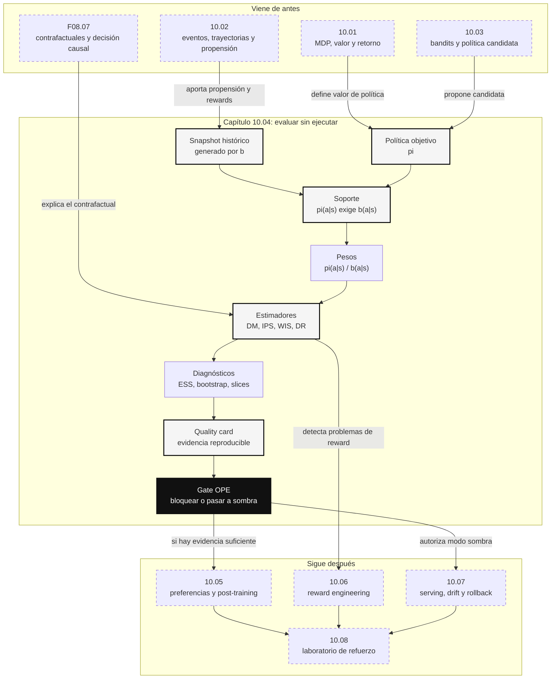

::: {.fasciculo-subtitle}
Facsímil 10 · Aprendizaje por refuerzo
:::

# Capítulo 04: Offline RL y evaluación contrafactual de políticas

## La pregunta incómoda antes de mover tráfico

Imagina que ya tienes lo que construimos en los capítulos anteriores: un dataset de eventos con estado, acción, recompensa, política histórica, propensión y trazas. También tienes una política candidata que, según simulación, parece repartir mejor el tráfico entre modelo rápido, modelo fuerte y revisión humana. La tentación es lanzarla a un 5 % de usuarios y mirar.

Offline RL y OPE aparecen justo para frenar esa prisa. La pregunta ya no es “¿funcionó la política que estaba en producción?”. La pregunta es más difícil:

> ¿qué habría pasado si otra política hubiera tomado las decisiones, usando solo los datos que ya tenemos?

Esa pregunta es contrafactual. Para una misma consulta observamos una acción y una recompensa. No observamos la recompensa de las acciones que no se eligieron. En el facsímil 8 vimos que este es el corazón del razonamiento causal: tenemos un resultado observado y varios resultados posibles que no llegaron a ocurrir.

Offline RL intenta aprender una política desde un dataset fijo. OPE, *off-policy evaluation*, intenta estimar el valor de una política nueva con datos generados por otra política. Las dos piezas están relacionadas, pero no son lo mismo. Puedes hacer OPE sin entrenar una política nueva. Y puedes entrenar offline RL sin tener aún suficiente confianza para desplegar.

## Qué no es offline RL

Offline RL no es “entrenar con logs” sin más. Un log de producto puede estar lleno de acciones históricas, pero si no contiene propensión, acciones disponibles, recompensa versionada, contexto suficiente y cobertura, no es un dataset defendible de RL.

Tampoco es aprendizaje supervisado con un nombre más sofisticado. En supervisado solemos aprender de etiquetas observadas: entrada, etiqueta, pérdida. En offline RL, la etiqueta no es “la acción correcta”. La acción del log fue la acción que tomó una política histórica, con sus sesgos, sus límites y sus zonas ciegas. Copiarla puede ser una baseline útil, pero no necesariamente una mejora.

Y OPE no es una garantía absoluta. Un estimador puede decir que una política candidata parece mejor, pero esa estimación vive bajo supuestos: soporte suficiente, propensiones correctas, reward fiable, independencia razonable, ausencia de cambios fuertes de distribución y varianza controlada. Si alguno de esos supuestos falla, la cifra puede ser tranquilizadora y estar equivocada.

## Tres preguntas distintas

Antes de elegir método, conviene separar tres preguntas:

| Pregunta | Nombre | Qué responde | Qué no responde |
|---|---|---|---|
| ¿Cuánto valdría una política candidata con datos históricos? | OPE | Estima valor sin ejecutarla. | No crea una política nueva. |
| ¿Qué política puedo aprender de un dataset fijo? | Offline RL | Entrena o selecciona una política sin interacción nueva. | No garantiza que el dataset cubra buenas acciones. |
| ¿Puedo pasar a modo sombra o piloto? | Gate operativo | Decide si la evidencia basta para el siguiente paso. | No sustituye monitorización online. |

En un proyecto de IA, OPE suele ser el primer freno serio antes de publicar una política adaptativa. Offline RL viene después si quieres aprender una política más compleja a partir de experiencias históricas. El gate operativo decide si la evidencia es suficiente para avanzar o si toca volver al dataset.

## El dataset de OPE como producto de datos

Un ingeniero de datos no debería tratar OPE como un notebook suelto. Debe tratarlo como un producto de datos versionado. La unidad mínima no es “una fila con reward”, sino un evento de decisión con linaje suficiente para reconstruir quién decidió, qué podía decidir, con qué probabilidad y qué recompensa se le atribuyó después.

| Campo | Por qué es obligatorio | Qué fallo evita |
|---|---|---|
| `event_id` | Identifica la decisión. | Duplicados invisibles. |
| `occurred_at` | Sitúa la decisión en el tiempo. | Mezclar políticas o rewards de épocas distintas. |
| `context` | Describe el estado observado antes de actuar. | Evaluar una política con información que no tenía al decidir. |
| `allowed_actions` | Catálogo de acciones disponibles en ese momento. | Comparar contra acciones imposibles. |
| `action` | Acción realmente ejecutada. | No hay evento evaluable sin acción observada. |
| `behavior_policy_id` | Política histórica que produjo el dato. | Tratar logs como si fueran neutrales. |
| `behavior_action_probability` | Propensión histórica. | No poder corregir sesgo de asignación. |
| `target_policy_probability_by_action` | Probabilidades de la política candidata sobre el mismo contexto. | No poder estimar contrafactualmente. |
| `reward` | Resultado atribuido a la decisión. | Optimizar métricas cómodas pero irrelevantes. |
| `reward_version` | Versión de la función de recompensa. | Mezclar definiciones incompatibles. |
| `q_model_version` | Versión del modelo usado por DM/DR/FQE. | No reproducir estimaciones. |
| `dataset_snapshot_id` | Corte congelado del dataset. | Recalcular sobre datos cambiantes sin saberlo. |

La tabla anterior no es burocracia. Es ingeniería de reproducibilidad. Si cambias `reward_version`, un mismo evento puede valer otra cosa. Si cambias `behavior_policy_id`, las propensiones ya no significan lo mismo. Si pierdes `allowed_actions`, quizá evalúas una política candidata que “elige” una acción que en producción no habría estado disponible.

En un warehouse, conviene separar al menos tres tablas:

| Tabla | Contenido | Quién la consume |
|---|---|---|
| `rl_ope_events` | Eventos históricos con contexto, acción, propensión, reward y versiones. | Data engineering, ML, auditoría. |
| `rl_ope_importance_weights` | Pesos por evento y run de evaluación. | ML, analítica, revisión técnica. |
| `rl_ope_runs` | Resultado agregado: estimadores, intervalos, ESS y status. | Comité técnico, CI/CD, operación. |

El kit del capítulo incluye un esquema mínimo en `sql/ope_warehouse_schema.sql`. No pretende imponer Postgres, BigQuery o Snowflake; pretende fijar el contrato mental: OPE deja evidencias consultables, no solo una gráfica en un notebook.

## Particionar sin hacerse trampas

El error clásico en OPE es usar todo para todo. Entrenas un modelo de recompensa con los mismos eventos que luego evalúas, ajustas umbrales mirando el resultado final y acabas creyendo que el estimador confirmó una política cuando en realidad has filtrado información del futuro.

Una partición defendible suele separar:

| Corte | Uso | Regla práctica |
|---|---|---|
| Entrenamiento del modelo \(\hat{q}\) | Aprender reward esperado o función Q. | Datos anteriores en el tiempo. |
| Validación de \(\hat{q}\) | Medir calibración y error del modelo auxiliar. | Corte temporal posterior, sin tocar política candidata. |
| OPE final | Estimar política candidata y aplicar gate. | Snapshot congelado, sin reentrenar después de mirar el resultado. |
| Shadow o piloto | Confirmar online con exposición controlada. | Solo si OPE no bloquea. |

La regla de oro es temporal: si en producción no sabías algo en el momento de decidir, no puede aparecer en el contexto de entrenamiento ni en el modelo de evaluación. En datos de producto esto incluye rewards tardíos, reaberturas, tickets escalados, costes finales, feedback humano y cambios de política.

## El valor de una política

En el capítulo 01 definimos retorno. Para evaluar una política \(\pi\), queremos su valor esperado:

$$
V(\pi)=\mathbb{E}_{\tau\sim\pi}\left[\sum_{t=0}^{T}\gamma^t r_t\right]
$$

| Símbolo | Significado | Ejemplo |
|---|---|---|
| \(V(\pi)\) | Valor esperado de ejecutar la política \(\pi\). | Recompensa media esperada del routing candidato. |
| \(\tau\) | Trayectoria completa de estados, acciones y recompensas. | Secuencia de decisiones sobre un ticket. |
| \(\gamma\) | Factor de descuento. | 0,95 |
| \(r_t\) | Recompensa en el paso \(t\). | Calidad menos coste y penalización por reapertura. |
| \(T\) | Horizonte del episodio. | 5 decisiones del asistente. |

El problema offline es que los datos no vienen de \(\pi\). Vienen de una política histórica \(b\), llamada política de comportamiento. Nuestro dataset se parece a:

$$
\mathcal{D}=\{\tau_i\}_{i=1}^{n}, \quad \tau_i \sim b
$$

| Símbolo | Significado | Ejemplo |
|---|---|---|
| \(\mathcal{D}\) | Dataset histórico fijo. | Logs de 12.000 tickets. |
| \(n\) | Número de trayectorias o eventos. | 12.000 |
| \(b\) | Política de comportamiento que generó los datos. | Routing estable anterior. |
| \(\pi\) | Política objetivo que queremos evaluar. | Routing candidato. |

La diferencia entre \(b\) y \(\pi\) lo cambia todo. Si la política candidata elige acciones que la histórica casi nunca eligió, estamos intentando adivinar fuera de los datos. Ahí empieza el peligro.

## Propensión: el campo que decide si podemos evaluar

La propensión es la probabilidad con la que la política histórica eligió la acción observada:

$$
b(a_t\mid s_t)
$$

La política candidata tiene su propia probabilidad:

$$
\pi(a_t\mid s_t)
$$

Con ambas podemos construir el peso de importancia por paso:

$$
\rho_t=\frac{\pi(a_t\mid s_t)}{b(a_t\mid s_t)}
$$

| Símbolo | Significado | Ejemplo |
|---|---|---|
| \(b(a_t\mid s_t)\) | Probabilidad histórica de la acción observada. | 0,25 |
| \(\pi(a_t\mid s_t)\) | Probabilidad candidata para esa misma acción. | 0,50 |
| \(\rho_t\) | Peso de importancia. | 2,0 |

Si \(\rho_t=2\), ese evento cuenta el doble porque la política candidata habría elegido esa acción con más frecuencia que la histórica. Si \(\rho_t=0{,}1\), cuenta poco. Si \(b(a_t\mid s_t)\) es casi cero, el peso explota. Y si \(b(a_t\mid s_t)=0\) pero \(\pi(a_t\mid s_t)>0\), no hay estimación estadística honesta: la política candidata quiere hacer algo que el dataset no observó.

Ejemplo de fórmula: una condición mínima de soporte puede escribirse así. La idea no es decorar el texto con símbolos, sino obligarnos a decir: si la política candidata quiere elegir una acción, el dato histórico debe contener evidencia para esa acción en ese estado.

$$
\pi(a\mid s)>0 \Rightarrow b(a\mid s)>0
$$

| Símbolo | Significado | Ejemplo |
|---|---|---|
| \(\pi(a\mid s)>0\) | La política candidata puede elegir esa acción. | Quiere usar `revision_humana`. |
| \(b(a\mid s)>0\) | La política histórica también la eligió alguna vez con probabilidad positiva. | Hay tickets parecidos con revisión humana registrada. |
| \(\Rightarrow\) | Implicación. | Si quieres evaluarla, debe existir soporte. |

Esta es una de las frases más importantes del capítulo: no puedes evaluar bien una política que se sale de la cobertura de tus datos.

## IPS: corregir por probabilidad histórica

El estimador más directo es *inverse propensity scoring* o importance sampling. En su versión por evento:

$$
\widehat{V}_{\text{IPS}}(\pi)=
\frac{1}{n}\sum_{i=1}^{n}
\frac{\pi(a_i\mid x_i)}{b(a_i\mid x_i)}r_i
$$

| Símbolo | Significado | Ejemplo |
|---|---|---|
| \(\widehat{V}_{\text{IPS}}\) | Estimación IPS del valor de la política candidata. | 0,789 |
| \(x_i\) | Contexto observado. | Criticidad, idioma, complejidad. |
| \(a_i\) | Acción registrada. | `modelo_fuerte`. |
| \(r_i\) | Recompensa observada. | 0,79 |
| \(n\) | Número de eventos. | 12 |

Ejemplo numérico: si la política histórica eligió `modelo_fuerte` con probabilidad \(0{,}28\), la candidata lo habría elegido con probabilidad \(0{,}42\), y la recompensa observada fue \(0{,}76\), el término IPS es:

$$
\frac{0{,}42}{0{,}28}\cdot 0{,}76=1{,}14
$$

Ese evento empuja hacia arriba la estimación. No porque su recompensa tenga una propiedad especial, sino porque la candidata habría elegido esa acción con más frecuencia. El coste es la varianza: unos pocos pesos grandes pueden dominar la media.

## WIS: normalizar los pesos

Weighted importance sampling normaliza por la suma de pesos:

$$
\widehat{V}_{\text{WIS}}(\pi)=
\frac{\sum_{i=1}^{n}w_i r_i}{\sum_{i=1}^{n}w_i}
,\quad
w_i=\frac{\pi(a_i\mid x_i)}{b(a_i\mid x_i)}
$$

| Símbolo | Significado | Ejemplo |
|---|---|---|
| \(w_i\) | Peso de importancia del evento \(i\). | 1,5 |
| \(\sum w_i r_i\) | Recompensas ponderadas. | 8,75 |
| \(\sum w_i\) | Peso total acumulado. | 11,68 |
| \(\widehat{V}_{\text{WIS}}\) | Estimación normalizada. | 0,749 |

WIS suele ser más estable que IPS cuando los pesos no suman cerca de \(n\). Pero también introduce sesgo. No hay almuerzo gratis: IPS puede ser insesgado y ruidoso; WIS puede ser más estable y sesgado. Por eso no miramos un único número.

## Tamaño efectivo de muestra

Contar eventos no basta. Si tienes 10.000 filas, pero la política candidata depende de 20 eventos con pesos enormes, tu muestra efectiva es pequeña.

El tamaño efectivo de muestra se calcula a menudo como:

$$
\operatorname{ESS}=
\frac{\left(\sum_{i=1}^{n}w_i\right)^2}
{\sum_{i=1}^{n}w_i^2}
$$

| Símbolo | Significado | Ejemplo |
|---|---|---|
| \(\operatorname{ESS}\) | Tamaño efectivo de muestra. | 11,02 |
| \(w_i\) | Peso de importancia. | 1,54 |
| \(n\) | Número de eventos reales. | 12 |

En el kit de este capítulo, el escenario sano tiene 12 eventos y ESS cercano a 11. El escenario roto tiene solo 6 eventos y pesos máximos por encima de 30. Ahí una cifra de reward alta no es una buena noticia: es una alarma.

## Intervalos de confianza: no publiques una media desnuda

Una estimación puntual puede ser engañosa. Si `doubly_robust=0,744`, la pregunta de ingeniería es: ¿esa cifra es estable o depende demasiado de unas pocas filas? Una forma simple de introducir incertidumbre es bootstrap: re-muestrear el dataset con reemplazo muchas veces y recalcular el estimador.

Para \(B\) re-muestreos, obtenemos:

$$
\widehat{V}_{\text{DR}}^{(1)},
\widehat{V}_{\text{DR}}^{(2)},
\ldots,
\widehat{V}_{\text{DR}}^{(B)}
$$

Después tomamos percentiles. Para un intervalo del 90 %:

$$
[
P_{5}(\widehat{V}_{\text{DR}}),
P_{95}(\widehat{V}_{\text{DR}})
]
$$

| Símbolo | Significado | Ejemplo |
|---|---|---|
| \(B\) | Número de re-muestreos bootstrap. | 500 |
| \(\widehat{V}_{\text{DR}}^{(b)}\) | Estimación DR en el re-muestreo \(b\). | 0,731 |
| \(P_5\) | Percentil 5 de las estimaciones. | 0,700 |
| \(P_{95}\) | Percentil 95 de las estimaciones. | 0,786 |

Esto no convierte OPE en verdad absoluta. Pero mejora la conversación: si el límite inferior del intervalo queda por debajo del umbral de calidad, no deberíamos avanzar aunque la media sea bonita. En decisiones profesionales, el gate debería mirar al menos media, intervalo, ESS y soporte por slice.

## Direct method y doubly robust

Otra familia usa un modelo de recompensa \(\hat{q}(x,a)\) que predice qué reward esperamos para cada acción:

$$
\widehat{V}_{\text{DM}}(\pi)=
\frac{1}{n}\sum_{i=1}^{n}
\sum_a \pi(a\mid x_i)\hat{q}(x_i,a)
$$

| Símbolo | Significado | Ejemplo |
|---|---|---|
| \(\hat{q}(x_i,a)\) | Reward predicho para acción \(a\) en contexto \(x_i\). | 0,78 |
| \(\sum_a \pi(a\mid x_i)\hat{q}(x_i,a)\) | Valor esperado según el modelo. | 0,73 |
| \(\widehat{V}_{\text{DM}}\) | Estimación por modelo directo. | 0,733 |

El riesgo es obvio: si \(\hat{q}\) está mal, DM hereda ese error con mucha confianza.

Doubly robust combina el modelo con la corrección por propensión:

$$
\widehat{V}_{\text{DR}}(\pi)=
\frac{1}{n}\sum_{i=1}^{n}
\left[
\sum_a \pi(a\mid x_i)\hat{q}(x_i,a)
+
\frac{\pi(a_i\mid x_i)}{b(a_i\mid x_i)}
\left(r_i-\hat{q}(x_i,a_i)\right)
\right]
$$

| Símbolo | Significado | Ejemplo |
|---|---|---|
| \(\widehat{V}_{\text{DR}}\) | Estimación doubly robust. | 0,744 |
| \(\hat{q}(x_i,a_i)\) | Predicción del reward para la acción observada. | 0,74 |
| \(r_i-\hat{q}(x_i,a_i)\) | Error residual del modelo. | 0,02 |
| \(\frac{\pi}{b}\) | Corrección por diferencia entre políticas. | 1,5 |

Jiang y Li extendieron estimadores doubly robust a evaluación off-policy secuencial en RL, buscando reducir varianza frente a importance sampling puro.^[Jiang, N. y Li, L. (2016). Doubly robust off-policy value evaluation for reinforcement learning. *Proceedings of the 33rd International Conference on Machine Learning*, 48, 652-661. https://proceedings.mlr.press/v48/jiang16.html] Dudík, Langford y Li ya habían trabajado estimadores doubly robust para evaluación y aprendizaje de políticas en bandits.^[Dudík, M., Langford, J. y Li, L. (2011). Doubly robust policy evaluation and learning. *Proceedings of the 28th International Conference on Machine Learning*, 1097-1104. https://icml.cc/2011/papers/511_icmlpaper.pdf] La lectura práctica: DR no te libra de malos datos, pero suele dar una señal más resistente cuando el modelo de reward y la propensión aportan información complementaria.

## FQE: evaluar aprendiendo una función Q

Fitted Q Evaluation, FQE, intenta estimar el valor de una política fija aprendiendo una función \(Q^\pi(s,a)\). No está aprendiendo una política nueva; está evaluando una política objetivo. La actualización conceptual se parece a Bellman:

$$
\hat{Q}_{k+1}(s_t,a_t)
\leftarrow
r_t+\gamma
\mathbb{E}_{a'\sim\pi(\cdot\mid s_{t+1})}
\left[
\hat{Q}_{k}(s_{t+1},a')
\right]
$$

| Símbolo | Significado | Ejemplo |
|---|---|---|
| \(\hat{Q}_{k}\) | Aproximación de Q en la iteración \(k\). | Modelo auxiliar de valor. |
| \(s_t,a_t,r_t,s_{t+1}\) | Transición observada. | Estado, acción, reward y siguiente estado de una trayectoria. |
| \(\pi(\cdot\mid s_{t+1})\) | Política que estamos evaluando. | Routing candidato. |
| \(\gamma\) | Descuento temporal. | 0,95 |

FQE es útil cuando tienes trayectorias y un espacio donde un modelo \(Q\) puede generalizar. Pero esa generalización es justo su riesgo: si el modelo aprende valores para zonas fuera del soporte, puede sonar convincente y estar extrapolando. Por eso herramientas como d3rlpy lo presentan dentro de OPE, no como sustituto de auditoría de datos.^[d3rlpy. (2026). *Off-Policy Evaluation*. https://d3rlpy.readthedocs.io/en/v2.4.0/references/off_policy_evaluation.html. Consultado el 8 de junio de 2026.]

Una lectura práctica:

| Si tienes... | FQE ayuda a... | Cuidado |
|---|---|---|
| Trayectorias completas | Evaluar valor secuencial, no solo eventos sueltos. | Necesitas \(s_{t+1}\), terminales y rewards bien atribuidos. |
| Acciones discretas | Comparar políticas candidatas con una Q aproximada. | El espacio debe estar cubierto. |
| Modelo Q validado | Reducir dependencia de pesos extremos. | Si Q está mal calibrado, el estimador se vuelve confiado. |

## Cuando la decisión es secuencial

Hasta ahora hemos usado una versión por evento porque es más fácil de llevar a código. En RL secuencial, una trayectoria completa tiene pesos acumulados:

$$
W_i=\prod_{t=0}^{T}
\frac{\pi(a_{i,t}\mid s_{i,t})}{b(a_{i,t}\mid s_{i,t})}
$$

| Símbolo | Significado | Ejemplo |
|---|---|---|
| \(W_i\) | Peso total de la trayectoria \(i\). | 3,8 |
| \(a_{i,t}\) | Acción de la trayectoria \(i\) en paso \(t\). | Llamar herramienta. |
| \(s_{i,t}\) | Estado de la trayectoria \(i\) en paso \(t\). | Ticket con adjunto y prioridad media. |
| \(\prod\) | Producto de ratios por paso. | Multiplicar 1,2 · 0,8 · 1,5 |

El producto es peligroso. Si cada paso tiene algo de varianza, multiplicar ratios durante muchos pasos puede explotar. Por eso OPE secuencial es difícil y por eso los datos del capítulo 02 importan tanto: sin trayectorias limpias, tiempos correctos y reward atribuible, el estimador se convierte en una ilusión.

Thomas y Brunskill propusieron métodos de evaluación off-policy orientados a eficiencia de datos y confianza, dentro de esta preocupación por estimar políticas con datos históricos de forma útil para decisiones reales.^[Thomas, P. S. y Brunskill, E. (2016). Data-efficient off-policy policy evaluation for reinforcement learning. *Proceedings of the 33rd International Conference on Machine Learning*, 48, 2139-2148. https://arxiv.org/abs/1604.00923]

## Offline RL: aprender sin pedir más interacción

OPE evalúa una política candidata. Offline RL intenta aprender una política desde un dataset fijo. Levine, Kumar, Tucker y Fu describen offline RL como una familia de algoritmos que usan datos previamente recogidos sin nueva recolección online.^[Levine, S., Kumar, A., Tucker, G. y Fu, J. (2020). Offline reinforcement learning: Tutorial, review, and perspectives on open problems. *arXiv:2005.01643*. https://arxiv.org/abs/2005.01643]

El problema técnico central es el desplazamiento de distribución. Un algoritmo puede asignar valor alto a acciones que casi no aparecen en el dataset. Esa sobreestimación puede producir políticas que parecen excelentes en entrenamiento y fallan cuando se ejecutan.

Hay varias familias de solución:

| Familia | Idea | Cuándo encaja | Riesgo |
|---|---|---|---|
| Behavior cloning | Imitar la política histórica. | Baseline fuerte si los datos son buenos. | No mejora más allá de lo observado. |
| Restricción de soporte | Mantener la política cerca de acciones vistas. | Cuando salirse del dataset es peligroso. | Puede ser demasiado conservadora. |
| Q conservador | Penalizar valores altos fuera del dato. | Cuando la sobreestimación es el problema principal. | Ajustar conservadurismo no es trivial. |
| Fitted Q Evaluation | Aprender \(\hat{Q}\) para evaluar una política. | OPE con función de valor. | Depende de generalización del modelo. |
| Model-based offline RL | Aprender dinámica o reward y simular. | Entornos con transiciones modelables. | Error de modelo acumulado. |

BCQ restringe acciones candidatas para evitar extrapolar fuera del batch.^[Fujimoto, S., Meger, D. y Precup, D. (2019). Off-policy deep reinforcement learning without exploration. *Proceedings of the 36th International Conference on Machine Learning*, 97, 2052-2062. https://proceedings.mlr.press/v97/fujimoto19a.html] CQL propone aprender funciones \(Q\) conservadoras que reduzcan el valor de acciones fuera de distribución.^[Kumar, A., Zhou, A., Tucker, G. y Levine, S. (2020). Conservative Q-learning for offline reinforcement learning. *Advances in Neural Information Processing Systems*, 33, 1179-1191. https://arxiv.org/abs/2006.04779] D4RL ayudó a estandarizar benchmarks para este escenario con datasets de políticas, demostraciones y mezclas.^[Fu, J., Kumar, A., Nachum, O., Tucker, G. y Levine, S. (2020). D4RL: Datasets for deep data-driven reinforcement learning. *arXiv:2004.07219*. https://arxiv.org/abs/2004.07219]

Ejemplo de fórmula: una forma conceptual de leer CQL es:

$$
\min_Q \ \operatorname{BellmanError}(Q)
+
\alpha
\left(
\mathbb{E}_{a\sim\pi}[Q(s,a)]
-
\mathbb{E}_{a\sim\mathcal{D}}[Q(s,a)]
\right)
$$

| Símbolo | Significado | Ejemplo |
|---|---|---|
| \(Q(s,a)\) | Valor estimado de acción en estado. | Valor de usar `modelo_fuerte`. |
| \(\operatorname{BellmanError}\) | Error frente a la consistencia de Bellman. | Diferencia entre target y predicción. |
| \(\alpha\) | Peso del término conservador. | 0,5 |
| \(a\sim\pi\) | Acciones que propone la política aprendida. | Acciones candidatas nuevas. |
| \(a\sim\mathcal{D}\) | Acciones presentes en el dataset. | Acciones históricas observadas. |

No hace falta memorizar el objetivo. Quédate con la intuición: si una acción aparece poco o nada en los datos, no dejes que el modelo le asigne valor alto sin evidencia.

## Ejemplos que sí se parecen al trabajo real

### Routing de modelos

Tienes logs de una política estable que elegía entre modelo rápido, modelo fuerte y revisión humana. Quieres saber si una política candidata, más inclinada al modelo fuerte en casos complejos, habría mejorado calidad sin disparar coste.

La evaluación no debería mirar solo reward medio. Debe mirar:

| Señal | Por qué importa |
|---|---|
| Propensión histórica | Sin ella no corriges el sesgo de asignación. |
| Soporte por slice | Si la candidata elige `revision_humana` en slices donde apenas hay ejemplos, no hay base suficiente. |
| ESS | Si unos pocos eventos dominan, la conclusión es frágil. |
| Gap IPS-WIS | Si se separan, los pesos están pesando demasiado. |
| Gap DM-DR | Si se separan, el modelo de reward o las propensiones no están alineadas. |

### RAG adaptativo

La acción puede ser `top_k=3`, `top_k=6`, `hybrid_search` o `rerank`. La política histórica quizá usaba casi siempre `top_k=6`. La candidata quiere usar reranking cuando detecta consulta ambigua. Si en los logs casi no hay reranking en consultas ambiguas, OPE no puede prometer que esa decisión funcione. Puede sugerir “necesitas más datos de esa zona”.

### Agentes con herramientas

Una política decide si el agente responde, busca en documentos, llama a una API o pide revisión. Offline RL puede ser tentador porque hay muchas trazas. Pero si la política histórica no registró acciones disponibles, permisos, resultado de herramientas y reward tardío, el dataset no permite saber qué habría pasado con otra secuencia.

## Diagnóstico por slice y acción

La media global suele mentir por omisión. Una política puede tener buen DR agregado y estar mal soportada en `alta_criticidad`. O puede tener soporte para `modelo_fuerte`, pero no para `revision_humana`. En IA aplicada, ese detalle importa más que la cifra final.

El kit genera dos artefactos nuevos:

| Artefacto | Pregunta que responde |
|---|---|
| `output/slice_diagnostics.csv` | ¿Qué pasa por slice: DR, ESS, peso máximo y soporte? |
| `output/support_matrix.csv` | ¿Qué acciones tienen masa de política candidata pero poco soporte observado? |

Un patrón sano se parece a esto:

| Señal | Lectura sana | Lectura peligrosa |
|---|---|---|
| ESS por slice | Cada slice conserva muestra efectiva razonable. | Un slice queda dominado por uno o dos eventos. |
| Peso máximo | Ningún evento manda la estimación. | Un evento tiene peso enorme y reward alto. |
| Soporte de acción | Las acciones con probabilidad candidata aparecen en logs. | La candidata quiere acciones no observadas. |
| DR por slice | No hay caída fuerte oculta. | La media global sube, pero un slice crítico cae. |

Para ingeniería de datos, esto se convierte en un control de calidad programable: si `support_matrix.csv` muestra `has_observed_support=false` para una acción con masa candidata relevante, no se arregla con una frase optimista. Se arregla recogiendo datos, limitando la política candidata o cambiando el alcance del piloto.

El matiz importante es “masa relevante”. Si una política candidata asigna un 0,5 % a una acción no observada, quizá basta con documentarlo y mantener el piloto limitado. Si asigna un 30 %, el gate debe bloquear. Por eso el contrato del kit incluye `max_unsupported_target_probability_mass`: no basta saber si hay huecos, hay que medir cuánto peso de decisión cae en ellos.

## Qué mira un equipo antes de aprobar OPE

Antes de permitir modo sombra, un equipo serio debería poder responder:

| Revisión | Pregunta concreta | Evidencia |
|---|---|---|
| Contrato de datos | ¿Están todos los campos obligatorios y sus versiones? | `ope_contract.json` y schema de warehouse. |
| Linaje | ¿Qué snapshot, política, reward y modelo Q produjeron la estimación? | `dataset_snapshot_id`, `reward_version`, `q_model_version`. |
| Soporte | ¿La candidata decide dentro de zonas observadas? | `support_matrix.csv`. |
| Incertidumbre | ¿El límite inferior bootstrap pasa el umbral? | `bootstrap_ci_lower`. |
| Estabilidad | ¿IPS, WIS, DM y DR cuentan una historia parecida? | `estimator_scorecard.csv`. |
| Riesgo por slice | ¿Hay slices que bloquean aunque el promedio pase? | `slice_diagnostics.csv`. |
| Operación | ¿Qué ocurre si el modo sombra contradice OPE? | Runbook del capítulo 10.03 y capítulo 10.07. |

La salida profesional no es “mi notebook dice que mejora”. La salida profesional es una tarjeta de calidad: qué se evaluó, con qué snapshot, qué supuestos pasan, qué supuestos fallan y qué decisión permite.

## Herramientas y estado del arte

Fecha de corte: 8 de junio de 2026. Fuentes consultadas: literatura clásica de OPE/offline RL, d3rlpy, SCOPE-RL, Minari, RLlib y TorchRL. Lo estable es el problema: soporte, propensión, distribución y estimación contrafactual. Lo cambiante son APIs, benchmarks y librerías.

| Herramienta | Qué aporta | Qué mirar antes |
|---|---|---|
| d3rlpy | Librería offline RL con APIs tipo scikit-learn, algoritmos offline y OPE/FQE. | Si tus datos caben en su formato y si los algoritmos soportan tu espacio de acciones. |
| SCOPE-RL | Flujo para offline RL, OPE y selección de políticas. | Métricas de riesgo-retorno, estimadores disponibles y diseño experimental. |
| Minari | API/datasets para offline RL dentro del ecosistema Farama. | Formato de datasets, versionado y si necesitas reproducir benchmarks tipo D4RL. |
| Ray RLlib | Entrenamiento RL a escala y APIs offline sobre Ray Data. | Complejidad operativa, integración con datos y si necesitas escala real. |
| TorchRL | Objetivos offline como CQL dentro de PyTorch. | Si quieres control de tensores, pérdidas y pipelines de investigación. |

d3rlpy documenta OPE con Fitted Q Evaluation; SCOPE-RL cubre offline RL, OPE y selección de políticas; Minari organiza datasets de offline RL; RLlib documenta APIs offline; TorchRL incluye objetivos offline como CQL.^[d3rlpy. (2026). *Off-Policy Evaluation*. https://d3rlpy.readthedocs.io/en/v2.4.0/references/off_policy_evaluation.html. Consultado el 8 de junio de 2026.]^[SCOPE-RL. (2026). *SCOPE-RL Documentation*. https://scope-rl.readthedocs.io/en/latest/documentation/index.html. Consultado el 8 de junio de 2026.]^[Farama Foundation. (2026). *Minari Documentation*. https://minari.farama.org/. Consultado el 8 de junio de 2026.]^[Ray. (2026). *Offline RL API*. https://docs.ray.io/en/latest/rllib/package_ref/offline.html. Consultado el 8 de junio de 2026.]^[PyTorch. (2026). *Offline RL Methods*. https://docs.pytorch.org/rl/main/reference/objectives_offline.html. Consultado el 8 de junio de 2026.]

La elección práctica no empieza por “qué librería está de moda”. Empieza por el formato del dato. Minari es interesante cuando quieres datasets versionados con una API de offline RL. RLlib encaja si ya usas Ray Data y necesitas ingestion a escala; su documentación offline se apoya en flujos de lectura/escritura de datos como Parquet. d3rlpy es más directo para experimentar con algoritmos y OPE/FQE. SCOPE-RL ayuda a ordenar el flujo completo de offline RL, OPE y selección de política, incluyendo escenarios de high-confidence OPE en sus ejemplos. TorchRL es útil si el equipo quiere mantener control bajo en PyTorch.

Para un equipo de datos, la pregunta de integración sería:

| Pregunta | Por qué importa |
|---|---|
| ¿Puedo cargar mi snapshot sin perder `behavior_action_probability`? | Sin propensión, OPE se debilita. |
| ¿Puedo versionar dataset, reward y política candidata? | Sin versiones, no hay reproducibilidad. |
| ¿Puedo exportar pesos y diagnósticos al warehouse? | Sin evidencias consultables, no hay revisión operativa. |
| ¿Puedo separar train/validation/OPE por tiempo? | Sin partición temporal, hay riesgo de leakage. |
| ¿Puedo bloquear por slice? | Sin slices, la media global oculta fallos. |

## Anatomía de una evaluación offline defendible

<svg id="f10-c04-offline-ope" xmlns="http://www.w3.org/2000/svg" viewBox="0 0 1440 980" role="img" aria-label="Evaluación offline de políticas con dataset, soporte, estimadores, diagnósticos y gate">
  <defs>
    <marker id="f10c04-arrow" viewBox="0 0 10 10" refX="9" refY="5" markerWidth="7" markerHeight="7" orient="auto-start-reverse">
      <path d="M 0 0 L 10 5 L 0 10 z" fill="#111111"/>
    </marker>
    <pattern id="f10c04-grid" width="20" height="20" patternUnits="userSpaceOnUse">
      <path d="M20 0 L0 0 0 20" fill="none" stroke="#EEEEEE" stroke-width="1"/>
    </pattern>
  </defs>
  <rect x="24" y="24" width="1392" height="932" rx="18" fill="#FFFFFF" stroke="#111111" stroke-width="2"/>
  <text x="720" y="64" text-anchor="middle" font-family="Arial, sans-serif" font-size="25" font-weight="700" fill="#111111">OPE: estimar sin ejecutar todavía</text>
  <text x="720" y="92" text-anchor="middle" font-family="Arial, sans-serif" font-size="13" fill="#555555">Una política candidata solo avanza si el snapshot tiene soporte, propensión, incertidumbre y estimadores consistentes.</text>
  <rect x="58" y="124" width="1324" height="760" rx="14" fill="url(#f10c04-grid)" stroke="#DDDDDD"/>

  <g font-family="Arial, sans-serif">
    <rect x="92" y="164" width="250" height="128" rx="12" fill="#111111" stroke="#111111"/>
    <text x="217" y="198" text-anchor="middle" font-size="14" font-weight="700" fill="#FFFFFF">Dataset histórico</text>
    <text x="217" y="224" text-anchor="middle" font-size="11" fill="#E8E8E8">contexto · acción · reward</text>
    <text x="217" y="244" text-anchor="middle" font-size="11" fill="#E8E8E8">política b · propensión</text>
    <text x="217" y="264" text-anchor="middle" font-size="11" fill="#E8E8E8">snapshot · reward version</text>

    <line x1="342" y1="228" x2="424" y2="228" stroke="#111111" stroke-width="1.4" marker-end="url(#f10c04-arrow)"/>
    <rect x="424" y="150" width="252" height="156" rx="12" fill="#FFFFFF" stroke="#111111" stroke-width="1.4"/>
    <text x="550" y="184" text-anchor="middle" font-size="14" font-weight="700">Política candidata pi</text>
    <text x="550" y="210" text-anchor="middle" font-size="11" fill="#555555">probabilidades por acción</text>
    <text x="550" y="230" text-anchor="middle" font-size="11" fill="#555555">sin mover tráfico</text>
    <text x="550" y="250" text-anchor="middle" font-size="11" fill="#555555">versión y contrato</text>

    <line x1="676" y1="228" x2="758" y2="228" stroke="#111111" stroke-width="1.4" marker-end="url(#f10c04-arrow)"/>
    <rect x="758" y="150" width="252" height="156" rx="12" fill="#FFFFFF" stroke="#111111" stroke-width="1.4"/>
    <text x="884" y="184" text-anchor="middle" font-size="14" font-weight="700">Soporte</text>
    <text x="884" y="210" text-anchor="middle" font-size="11" fill="#555555">pi(a|x) exige b(a|x)</text>
    <text x="884" y="230" text-anchor="middle" font-size="11" fill="#555555">matriz slice-acción</text>
    <text x="884" y="250" text-anchor="middle" font-size="11" fill="#555555">pesos razonables</text>

    <line x1="1010" y1="228" x2="1092" y2="228" stroke="#111111" stroke-width="1.4" marker-end="url(#f10c04-arrow)"/>
    <rect x="1092" y="150" width="250" height="156" rx="12" fill="#F7F7F7" stroke="#111111" stroke-width="1.4"/>
    <text x="1217" y="184" text-anchor="middle" font-size="14" font-weight="700">Estimadores</text>
    <text x="1217" y="210" text-anchor="middle" font-size="11" fill="#555555">DM · IPS · WIS</text>
    <text x="1217" y="230" text-anchor="middle" font-size="11" fill="#555555">doubly robust</text>
    <text x="1217" y="250" text-anchor="middle" font-size="11" fill="#555555">FQE si hay Q_hat</text>

    <rect x="162" y="468" width="250" height="142" rx="12" fill="#FFFFFF" stroke="#111111" stroke-width="1.4"/>
    <text x="287" y="502" text-anchor="middle" font-size="14" font-weight="700">Diagnósticos</text>
    <text x="287" y="528" text-anchor="middle" font-size="11" fill="#555555">ESS · max weight</text>
    <text x="287" y="548" text-anchor="middle" font-size="11" fill="#555555">intervalo bootstrap</text>
    <text x="287" y="568" text-anchor="middle" font-size="11" fill="#555555">slices · gaps</text>

    <rect x="495" y="468" width="250" height="142" rx="12" fill="#FFFFFF" stroke="#111111" stroke-width="1.4"/>
    <text x="620" y="502" text-anchor="middle" font-size="14" font-weight="700">Decisión</text>
    <text x="620" y="528" text-anchor="middle" font-size="11" fill="#555555">quality card</text>
    <text x="620" y="548" text-anchor="middle" font-size="11" fill="#555555">modo sombra</text>
    <text x="620" y="568" text-anchor="middle" font-size="11" fill="#555555">bloquear si falta soporte</text>

    <rect x="828" y="468" width="250" height="142" rx="12" fill="#FFFFFF" stroke="#111111" stroke-width="1.4"/>
    <text x="953" y="502" text-anchor="middle" font-size="14" font-weight="700">Aprender offline</text>
    <text x="953" y="528" text-anchor="middle" font-size="11" fill="#555555">BC · BCQ · CQL</text>
    <text x="953" y="548" text-anchor="middle" font-size="11" fill="#555555">restricción de soporte</text>
    <text x="953" y="568" text-anchor="middle" font-size="11" fill="#555555">validar antes de servir</text>

    <rect x="1161" y="468" width="250" height="142" rx="12" fill="#111111" stroke="#111111"/>
    <text x="1286" y="502" text-anchor="middle" font-size="14" font-weight="700" fill="#FFFFFF">Siguiente paso</text>
    <text x="1286" y="528" text-anchor="middle" font-size="11" fill="#E8E8E8">reward card</text>
    <text x="1286" y="548" text-anchor="middle" font-size="11" fill="#E8E8E8">serving de políticas</text>
    <text x="1286" y="568" text-anchor="middle" font-size="11" fill="#E8E8E8">monitorización</text>

    <path d="M1217 306 C1217 390 287 390 287 468" fill="none" stroke="#111111" stroke-width="1.2" marker-end="url(#f10c04-arrow)"/>
    <line x1="412" y1="539" x2="495" y2="539" stroke="#111111" stroke-width="1.2" marker-end="url(#f10c04-arrow)"/>
    <line x1="745" y1="539" x2="828" y2="539" stroke="#111111" stroke-width="1.2" marker-end="url(#f10c04-arrow)"/>
    <line x1="1078" y1="539" x2="1161" y2="539" stroke="#111111" stroke-width="1.2" marker-end="url(#f10c04-arrow)"/>

    <rect x="238" y="724" width="964" height="58" rx="12" fill="#FFFFFF" stroke="#111111" stroke-dasharray="7 5"/>
    <text x="720" y="758" text-anchor="middle" font-size="13" font-weight="700">OPE defendible = snapshot versionado + soporte + incertidumbre + decisión reproducible.</text>
  </g>

  <text x="1368" y="932" text-anchor="end" font-family="Arial, sans-serif" font-size="11" fill="#888888">IA para gente curiosa / Facsímil 10 / Capítulo 04 / 686f6c61</text>
</svg>

## Manos a la obra

El kit del capítulo está en:

`labs/f10/c04-offline-ope/`

Calcula cuatro estimadores sobre una política candidata: direct method, IPS, WIS y doubly robust. Además genera pesos de importancia, scorecard y decisión técnica.

```bash
cd labs/f10/c04-offline-ope
python3 ops/evaluate_offline_policy.py --write
cat output/ope_decision.md
python3 -m json.tool output/ope_report.json
cat output/ope_quality_card.md
```

Salida esperada:

```text
status=pass
events=12
doubly_robust=0.743715
```

Qué archivos deberías mirar:

| Archivo | Qué te enseña |
|---|---|
| `output/ope_report.json` | Estimadores, diagnósticos y checks del gate. |
| `output/importance_weights.csv` | Qué eventos tienen más peso en la estimación. |
| `output/slice_diagnostics.csv` | Qué ocurre por slice: DR, ESS, soporte y peso máximo. |
| `output/support_matrix.csv` | Qué acciones tienen soporte observado y cuánta masa candidata acumulan. |
| `output/estimator_scorecard.csv` | Comparación compacta de valores y diagnósticos. |
| `output/ope_decision.md` | Decisión técnica: avanzar o bloquear. |
| `output/ope_quality_card.md` | Tarjeta de calidad para defender el run como artefacto de datos. |
| `sql/ope_warehouse_schema.sql` | Modelo mínimo de warehouse para eventos, pesos y runs OPE. |
| `sql/ope_quality_queries.sql` | Consultas para pesos extremos, soporte, ESS y runs bloqueables. |

También hay un escenario que debe bloquear:

```bash
python3 ops/evaluate_offline_policy.py \
  --events data/logged_policy_events_bad.jsonl \
  --output output_bad \
  --write
cat output_bad/ope_decision.md
```

Salida esperada:

```text
status=block
events=6
```

El aprendizaje está en comparar ambos reportes. En el caso sano, los pesos son moderados, ESS es alto y los estimadores no se separan demasiado. En el caso roto, IPS se dispara porque algunos eventos tienen peso extremo. Ese es el tipo de señal que debe impedir un piloto.

Lo que entregaría un alumno:

1. Reporte JSON generado.
2. CSV de pesos interpretado.
3. Decisión Markdown.
4. Explicación de por qué IPS, WIS, DM y DR coinciden o se separan.
5. Cambio de política candidata y predicción de cómo afectaría a ESS.
6. Criterio de paso a modo sombra y criterio de bloqueo.
7. Consulta SQL propia para detectar huecos de soporte o pesos extremos.
8. Tarjeta de calidad OPE explicando si el snapshot sirve para decidir.

## Cómo encaja todo

Este mapa une el facsímil como una cadena de evidencia. El capítulo 02 nos da logs con propensión. El capítulo 03 nos da políticas candidatas y validación online limitada. Aquí preguntamos si una política puede evaluarse con datos históricos antes de ejecutarla. Lo que salga de este capítulo alimenta post-training, diseño de reward y serving de políticas.



## Dónde solía tropezar yo

| Tropiezo | Por qué ocurre | Antídoto |
|---|---|---|
| Llamar offline RL a cualquier entrenamiento con logs. | El nombre suena amplio. | Exigir estado, acción, reward, propensión, acciones disponibles y versión. |
| Creer que OPE demuestra que una política funcionará. | Devuelve una cifra. | Leer soporte, ESS, pesos máximos y gaps entre estimadores. |
| Olvidar la política de comportamiento. | Los logs parecen datos neutros. | Guardar `behavior_policy_id` y `behavior_action_probability`. |
| Aceptar pesos enormes. | IPS puede dar un valor alto. | Revisar distribución de pesos y bloquear si unos pocos eventos mandan. |
| Entrenar una política fuera del soporte. | El modelo generaliza con confianza. | Usar restricciones, conservadurismo o recoger datos de cobertura. |
| Mezclar rewards de versiones distintas. | Es cómodo juntar históricos. | Versionar reward y evaluar por cortes temporales. |

## Vocabulario aprendido

| Término | Definición |
|---|---|
| Offline RL | Aprender políticas desde un dataset fijo de experiencias. |
| OPE | Evaluar una política candidata con datos generados por otra política. |
| Política de comportamiento | Política histórica que produjo los datos. |
| Política objetivo | Política candidata que queremos evaluar. |
| Propensión | Probabilidad histórica de la acción observada. |
| Importance sampling | Reponderación por la relación entre política candidata e histórica. |
| WIS | Importance sampling normalizado por suma de pesos. |
| Direct method | Estimador que usa un modelo de reward para predecir valor. |
| Doubly robust | Estimador que combina modelo de reward y corrección por propensión. |
| ESS | Tamaño efectivo de muestra tras aplicar pesos. |
| Intervalo bootstrap | Rango de estimaciones obtenido al re-muestrear el dataset. |
| FQE | Estimación offline de una función Q para evaluar una política fija. |
| Soporte | Cobertura suficiente para evaluar acciones que la política candidata podría elegir. |
| Quality card | Documento que resume estimadores, checks, slices, soporte y decisión. |
| CQL | Método offline RL que penaliza valores altos fuera del dato observado. |

## Antes de pasar página

- ¿Qué diferencia hay entre OPE y offline RL?
- ¿Qué es la política de comportamiento?
- ¿Por qué `action_probability` es tan importante?
- ¿Qué significa que una política candidata esté fuera de soporte?
- ¿Qué mide IPS?
- ¿Por qué WIS puede ser más estable que IPS?
- ¿Qué combina doubly robust?
- ¿Qué te dice ESS que no te dice el número bruto de eventos?
- ¿Por qué mirarías el límite inferior del intervalo bootstrap?
- ¿Qué diferencia hay entre una media global y un diagnóstico por slice?
- ¿Qué función cumple una quality card de OPE?
- ¿Por qué OPE puede autorizar modo sombra, pero no producción amplia?
- ¿Qué artefactos produce el kit práctico del capítulo?

## Para saber más

d3rlpy. (2026). *Off-Policy Evaluation*. https://d3rlpy.readthedocs.io/en/v2.4.0/references/off_policy_evaluation.html

Dudík, M., Langford, J. y Li, L. (2011). Doubly robust policy evaluation and learning. *Proceedings of the 28th International Conference on Machine Learning*, 1097-1104. https://icml.cc/2011/papers/511_icmlpaper.pdf

Farama Foundation. (2026). *Minari Documentation*. https://minari.farama.org/

Fu, J., Kumar, A., Nachum, O., Tucker, G. y Levine, S. (2020). D4RL: Datasets for deep data-driven reinforcement learning. *arXiv:2004.07219*. https://arxiv.org/abs/2004.07219

Fujimoto, S., Meger, D. y Precup, D. (2019). Off-policy deep reinforcement learning without exploration. *Proceedings of the 36th International Conference on Machine Learning*, 97, 2052-2062. https://proceedings.mlr.press/v97/fujimoto19a.html

Jiang, N. y Li, L. (2016). Doubly robust off-policy value evaluation for reinforcement learning. *Proceedings of the 33rd International Conference on Machine Learning*, 48, 652-661. https://proceedings.mlr.press/v48/jiang16.html

Kumar, A., Zhou, A., Tucker, G. y Levine, S. (2020). Conservative Q-learning for offline reinforcement learning. *Advances in Neural Information Processing Systems*, 33, 1179-1191. https://arxiv.org/abs/2006.04779

Levine, S., Kumar, A., Tucker, G. y Fu, J. (2020). Offline reinforcement learning: Tutorial, review, and perspectives on open problems. *arXiv:2005.01643*. https://arxiv.org/abs/2005.01643

PyTorch. (2026). *Offline RL Methods*. https://docs.pytorch.org/rl/main/reference/objectives_offline.html

Ray. (2026). *Offline RL API*. https://docs.ray.io/en/latest/rllib/package_ref/offline.html

SCOPE-RL. (2026). *SCOPE-RL Documentation*. https://scope-rl.readthedocs.io/en/latest/documentation/index.html

Seno, T. y Imai, M. (2022). d3rlpy: An offline deep reinforcement learning library. *Journal of Machine Learning Research*, 23(315), 1-20. https://jmlr.org/papers/v23/22-0017.html

Sutton, R. S. y Barto, A. G. (2018). *Reinforcement Learning: An Introduction* (2.ª ed.). MIT Press. https://incompleteideas.net/book/the-book-2nd.html

Thomas, P. S. y Brunskill, E. (2016). Data-efficient off-policy policy evaluation for reinforcement learning. *Proceedings of the 33rd International Conference on Machine Learning*, 48, 2139-2148. https://arxiv.org/abs/1604.00923

## En resumen

| Idea | Qué debes recordar |
|---|---|
| OPE estima una política no ejecutada. | Usa datos de otra política y necesita propensión. |
| Offline RL aprende desde un dataset fijo. | El peligro central es salirse del soporte del dato. |
| IPS corrige por probabilidad. | Puede tener varianza enorme si hay pesos grandes. |
| WIS estabiliza. | Normaliza pesos, pero puede introducir sesgo. |
| Doubly robust combina dos fuentes. | Modelo de reward más corrección por propensión. |
| ESS importa más que contar filas. | Muchas filas pueden equivaler a pocas si los pesos dominan. |
| Los intervalos importan. | Una media sin incertidumbre no basta para decidir. |
| Los slices importan. | Una política puede pasar en promedio y fallar donde más duele. |
| OPE es un producto de datos. | Necesita snapshot, warehouse, contrato, linaje y quality card. |
| El gate decide el siguiente paso. | Un buen OPE permite modo sombra o piloto limitado, no confianza ciega. |
