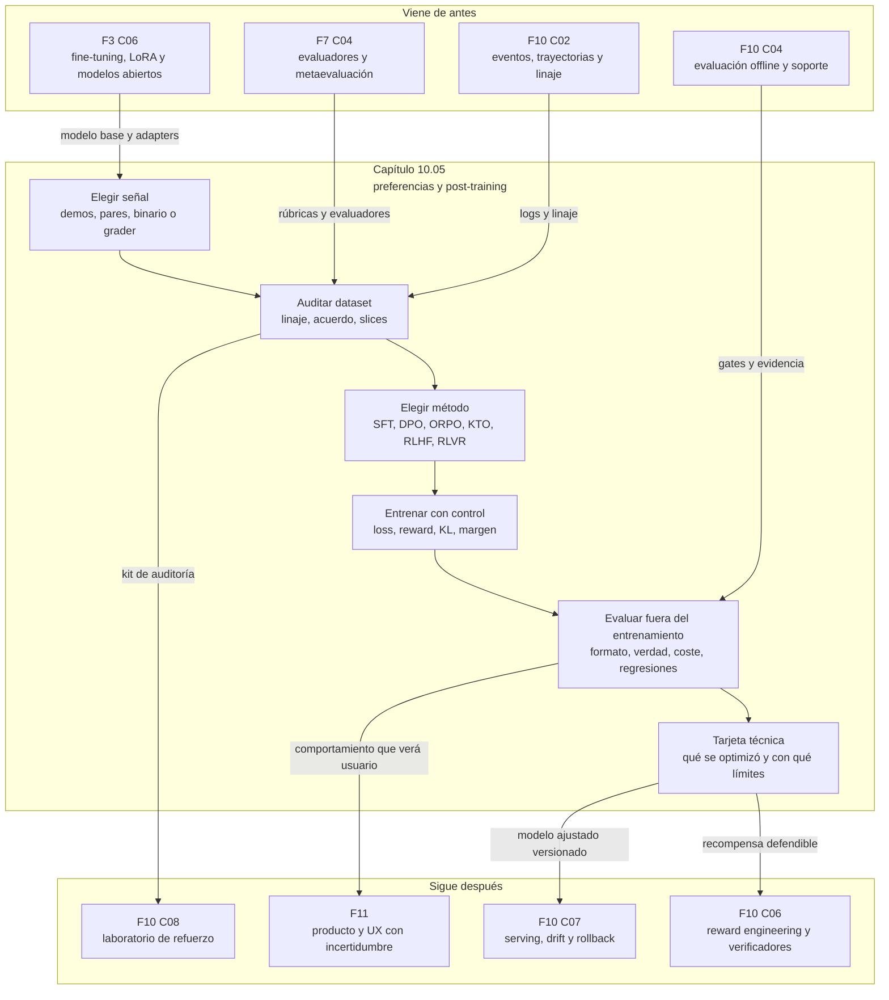

::: {.fasciculo-subtitle}
Facsímil 10 · Aprendizaje por refuerzo
:::

# Capítulo 05: Preferencias y post-training: RLHF, DPO, RLAIF y RLVR

## El modelo ya sabe escribir; ahora queremos que decida mejor

Un LLM pre-entrenado aprende una distribución de texto. Eso no significa que se comporte como necesitamos en un producto: puede contestar con formato incorrecto, citar sin evidencia suficiente, usar una herramienta cuando no toca, alargar una respuesta sencilla o preferir una solución elegante pero poco verificable. El post-training aparece cuando queremos convertir capacidad general en comportamiento operativo.

La diferencia importante es esta: no estamos "metiendo conocimiento" sin más. Estamos cambiando qué salidas se vuelven más probables bajo una señal. Esa señal puede venir de demostraciones humanas, pares de preferencias, evaluadores automáticos, tests, verificadores simbólicos o reglas de negocio. Si la señal es pobre, el modelo no aprende nuestra intención; aprende la señal pobre con mucha seguridad.

Ouyang et al. popularizaron una receta moderna para modelos instructivos: demostraciones para SFT, rankings humanos, reward model y optimización con RLHF. En su distribución de evaluación, un InstructGPT de 1,3B parámetros fue preferido frente a GPT-3 175B, lo que ilustra que el comportamiento post-entrenado puede pesar más que el tamaño bruto para ciertas tareas.^[Ouyang, L. et al. (2022). *Training language models to follow instructions with human feedback*. arXiv:2203.02155. https://arxiv.org/abs/2203.02155. Consultado el 8 de junio de 2026.] Antes, Stiennon et al. ya habían mostrado el esquema de comparaciones humanas, reward model y fine-tuning de una política para resumen, con análisis de generalización del reward model.^[Stiennon, N. et al. (2020). *Learning to summarize from human feedback*. arXiv:2009.01325. https://arxiv.org/abs/2009.01325. Consultado el 8 de junio de 2026.]

En este capítulo no vamos a vender nombres. Vamos a leer cada método como un contrato de ingeniería:

| Si tienes... | Puedes plantear... | Lo que de verdad estás optimizando |
|---|---|---|
| Entradas y salidas correctas | SFT | Imitación de demostraciones. |
| Para el mismo prompt, una respuesta preferida y otra rechazada | DPO, IPO, ORPO | Margen relativo entre salidas. |
| Comparaciones humanas suficientes | RLHF clásico | Recompensa aprendida y política ajustada. |
| Principios escritos y evaluación asistida por otro modelo | RLAIF / Constitutional AI | Crítica, revisión y preferencia escalada. |
| Tests, resultados exactos o graders reproducibles | RFT / RLVR / GRPO | Recompensa programática o verificable. |

La palabra clave es "señal". Un equipo serio no empieza preguntando "¿hacemos RLHF?". Empieza preguntando "¿qué señal tenemos, cómo la medimos, qué sesgos tiene, qué coste añade y qué evidencia deja?".

## Qué no es post-training

Post-training no es pedirle al modelo en el prompt que "sea mejor". Un prompt puede orientar una respuesta concreta, pero no cambia los pesos. Si cada llamada tiene que recordar diez páginas de normas para producir un JSON estable, quizá necesitas contrato de salida, RAG, evaluaciones o fine-tuning; no una frase más larga.

Tampoco es una forma barata de actualizar conocimiento vivo. Si cambia cada día el catálogo, el precio, la política de un cliente o la documentación interna, RAG o herramientas suelen encajar mejor. Fine-tuning y preferencias enseñan comportamiento repetido: formato, criterio, estilo, uso de herramientas, rechazo de respuestas insuficientes, razonamiento verificable. No son una base de datos.

Y no es una garantía ética automática. Si entrenas preferencias de mala calidad, el sistema puede volverse más convincente sin volverse más correcto. Si entrenas con un verificador incompleto, puede aprender el camino que pasa el verificador, no necesariamente el comportamiento profesional que querías.

## La taxonomía que usaría un ingeniero

Hay varias familias, y conviene separarlas por el tipo de dato que exigen:

| Familia | Dato mínimo | Entrenamiento típico | Qué artefacto deberías guardar |
|---|---|---|---|
| SFT | `prompt`, `completion` o conversación completa. | Cross-entropy sobre la respuesta objetivo. | Dataset de demostraciones, plantilla de chat, eval de formato. |
| Reward modeling | `prompt`, `chosen`, `rejected`. | Modelo escalar que predice preferencia. | Reward card, acuerdo entre anotadores, métricas por slice. |
| RLHF con PPO | Prompts, reward model, política referencia, rollout. | Muestrear respuestas y optimizar reward con anclaje KL. | Config de PPO, curvas de reward/KL, samples y evals. |
| DPO/IPO/ORPO | Pares preferido/rechazado. | Pérdida contrastiva offline. | Auditoría de pares, márgenes chosen/rejected, eval retenida. |
| KTO | Etiquetas binarias deseable/no deseable, no siempre pareadas. | Pérdida inspirada en utilidad humana. | Distribución de etiquetas, balance por tarea, revisión de negativos. |
| RLAIF | Críticas o preferencias generadas por IA bajo principios. | Similar a preferencias, pero con evaluador automático. | Principios, prompt del evaluador, checks humanos de muestra. |
| RLVR/RFT/GRPO | Prompts y reward verificable por programa o grader. | Generación online y actualización por recompensa. | Código del grader, casos ocultos, tasa de error del grader. |

DPO no es "SFT con dos columnas más". RLHF no es "DPO caro". RLVR no es "DPO con tests". La diferencia práctica está en cuándo se generan las respuestas, quién asigna la señal, si hay modelo de recompensa separado, si hay política de referencia y si el entrenamiento necesita rollouts durante el proceso.

## El dato de preferencias como producto de datos

Un par de preferencias parece sencillo:

```json
{
  "prompt": "Resume esta incidencia y propone siguiente paso.",
  "chosen": "Resumen breve, causa probable y acción concreta.",
  "rejected": "Texto largo, sin acción y con datos no comprobados."
}
```

Pero un dataset profesional necesita bastante más:

| Campo | Por qué importa | Fallo que evita |
|---|---|---|
| `pair_id` | Identificador estable. | Duplicados invisibles. |
| `prompt_id` | Agrupa pares del mismo caso. | Mezclar ejemplos sin saber su origen. |
| `task_family` | Clasifica el tipo de tarea. | Que una media oculte fallos por dominio. |
| `prompt` | Entrada real enviada al modelo. | Entrenar con contexto que no existirá en producción. |
| `chosen` | Respuesta preferida. | Señal positiva. |
| `rejected` | Respuesta menos preferida. | Señal contrastiva. |
| `preference_reason` | Razón de la elección. | Pares correctos por azar pero sin criterio. |
| `rubric_scores` | Calidad, evidencia, formato, coste, etc. | Saber qué dimensión explica la preferencia. |
| `annotator_ids` | Identifica evaluadores o fuentes. | No detectar desacuerdos sistemáticos. |
| `agreement` | Acuerdo entre evaluadores. | Entrenar sobre pares ambiguos como si fueran claros. |
| `source_policy` | Modelo o sistema que generó cada respuesta. | Filtrar ventajas de una política concreta. |
| `created_at` | Fecha del ejemplo. | Mezclar normas antiguas y nuevas. |
| `reference_answer` | Respuesta o criterio esperado si existe. | No poder revisar el par. |
| `verifier_result` | Resultado de test o grader si aplica. | Confundir preferencia subjetiva con verificación objetiva. |

La columna más ignorada suele ser `preference_reason`. Sin razón, el par dice "A gana a B", pero no dice si gana por ser correcto, breve, educado, trazable, barato, seguro, completo o simplemente más bonito. En entrenamiento, todas esas razones se mezclan en una sola dirección de gradiente.

## Bradley-Terry: convertir comparaciones en probabilidad

Una forma clásica de modelar preferencias pareadas es Bradley-Terry. Si tenemos un prompt \(x\), una respuesta ganadora \(y_w\) y una respuesta perdedora \(y_l\), el modelo de recompensa asigna puntuaciones \(r_\phi(x,y_w)\) y \(r_\phi(x,y_l)\). La probabilidad de que \(y_w\) sea preferida puede escribirse así:

$$
P(y_w \succ y_l \mid x)=
\sigma\left(r_\phi(x,y_w)-r_\phi(x,y_l)\right)
$$

| Símbolo | Significado | Ejemplo |
|---|---|---|
| \(x\) | Prompt o contexto. | Ticket de soporte con SLA y logs. |
| \(y_w\) | Respuesta preferida. | Diagnóstico con acción y evidencia. |
| \(y_l\) | Respuesta rechazada. | Respuesta genérica sin evidencia. |
| \(r_\phi(x,y)\) | Reward model con parámetros \(\phi\). | Puntuación escalar de una respuesta. |
| \(\sigma\) | Sigmoide. | Convierte diferencia en probabilidad. |
| \(\succ\) | "Preferido a". | \(y_w\) gana a \(y_l\). |

La pérdida del reward model suele empujar a que la respuesta preferida tenga más puntuación:

$$
\mathcal{L}_{RM} =
-\log \sigma\left(r_\phi(x,y_w)-r_\phi(x,y_l)\right)
$$

Si \(r_\phi(x,y_w)=3{,}1\) y \(r_\phi(x,y_l)=1{,}7\), la diferencia es \(1{,}4\). La sigmoide de \(1{,}4\) es aproximadamente \(0{,}80\). El reward model está diciendo: "según lo que he aprendido, hay un 80 % de probabilidad de que la primera respuesta sea la preferida". No está diciendo que sea verdadera, ni que sea legal, ni que sea adecuada para todos los usuarios. Solo traduce la señal entrenada.

Ese matiz evita mucha confusión. Un reward model no es una autoridad. Es un estimador entrenado sobre preferencias observadas.

## RLHF como pipeline de ingeniería

La receta clásica de RLHF se puede escribir así:

```text
modelo base
  -> SFT con demostraciones
  -> generación de respuestas candidatas
  -> comparaciones humanas
  -> reward model
  -> optimización de política
  -> evaluación retenida y gates
```

El paso de RL suele optimizar una política \(\pi_\theta(y\mid x)\) para maximizar recompensa, pero evitando alejarse demasiado de una política de referencia \(\pi_{\text{ref}}\). Ejemplo de fórmula: una forma conceptual del objetivo es:

$$
\max_\theta \ 
\mathbb{E}_{y\sim\pi_\theta(\cdot\mid x)}
\left[
r_\phi(x,y)
-\beta \operatorname{KL}
\left(
\pi_\theta(\cdot\mid x)\ \|\ \pi_{\text{ref}}(\cdot\mid x)
\right)
\right]
$$

| Símbolo | Significado | Ejemplo |
|---|---|---|
| \(\pi_\theta\) | Política/modelo que ajustamos. | Modelo SFT que queremos mejorar. |
| \(\pi_{\text{ref}}\) | Política de referencia. | Copia congelada del modelo antes de RL. |
| \(r_\phi(x,y)\) | Reward model. | Puntuación de preferencia estimada. |
| \(\operatorname{KL}\) | Divergencia entre distribuciones. | Cuánto se aleja el modelo ajustado. |
| \(\beta\) | Peso de la penalización KL. | Freno contra cambios bruscos. |

PPO, presentado por Schulman et al., es una familia de métodos de gradiente de política que alterna muestreo y varias épocas de actualización con un objetivo sustituto.^[Schulman, J. et al. (2017). *Proximal Policy Optimization Algorithms*. arXiv:1707.06347. https://arxiv.org/abs/1707.06347. Consultado el 8 de junio de 2026.] En RLHF, la parte complicada no es solo "usar PPO". Es mantener coherentes cuatro piezas: política, referencia, reward model y datos de rollout.

| Señal en una run de RLHF | Qué deberías mirar | Qué indica si se tuerce |
|---|---|---|
| `train_reward_mean` | Recompensa media en entrenamiento. | Puede subir por aprender un atajo de la señal. |
| `valid_reward_mean` | Recompensa en validación. | Si no sube, el entrenamiento memoriza patrones locales. |
| `kl_to_ref` | Distancia a la referencia. | Si crece demasiado, el modelo cambia más de lo previsto. |
| `response_length` | Longitud de salida. | Reward puede estar premiando verbosidad. |
| `format_pass_rate` | Cumplimiento de contrato de salida. | Calidad aparente con formato roto. |
| `human_eval_delta` | Preferencia humana retenida. | El reward model no basta como prueba final. |

OpenAI documenta el RFT actual como un proceso basado en graders programables que puntúan respuestas candidatas, con métricas de reward por entrenamiento y validación; a fecha de corte, su documentación también indica que la plataforma de fine-tuning se está cerrando para nuevos usuarios, por lo que aquí lo usamos como referencia conceptual y operativa, no como recomendación universal de disponibilidad.^[OpenAI. (2026). *Reinforcement fine-tuning*. https://developers.openai.com/api/docs/guides/reinforcement-fine-tuning. Consultado el 8 de junio de 2026.]

## DPO: preferencia sin montar un ciclo RL completo

DPO parte del mismo tipo de dato básico:

```text
prompt x
respuesta elegida y_w
respuesta rechazada y_l
modelo referencia pi_ref
modelo que entrenamos pi_theta
```

La intuición es subir la probabilidad relativa de la respuesta preferida frente a la rechazada, comparando el cambio respecto al modelo de referencia. Rafailov et al. formularon DPO como una forma de optimizar preferencias con una pérdida de clasificación, sin entrenar explícitamente un reward model separado ni hacer muestreo de RL durante el ajuste.^[Rafailov, R. et al. (2023). *Direct Preference Optimization: Your Language Model is Secretly a Reward Model*. arXiv:2305.18290. https://arxiv.org/abs/2305.18290. Consultado el 8 de junio de 2026.]

Una forma habitual de escribir la pérdida:

$$
\mathcal{L}_{\text{DPO}} =
-\log \sigma\left(
\beta[
\log \pi_\theta(y_w\mid x)
-\log \pi_\theta(y_l\mid x)
-\log \pi_{\text{ref}}(y_w\mid x)
+\log \pi_{\text{ref}}(y_l\mid x)
]
\right)
$$

| Símbolo | Significado | Lectura práctica |
|---|---|---|
| \(\pi_\theta(y_w\mid x)\) | Probabilidad de la respuesta elegida bajo el modelo entrenado. | Queremos que suba frente a la rechazada. |
| \(\pi_\theta(y_l\mid x)\) | Probabilidad de la respuesta rechazada. | Queremos que baje relativamente. |
| \(\pi_{\text{ref}}\) | Modelo de referencia. | Ancla el cambio. |
| \(\beta\) | Intensidad del contraste. | Más alto suele endurecer la preferencia. |
| \(\sigma\) | Sigmoide. | Convierte margen en probabilidad de acierto. |

No hace falta memorizar la fórmula completa. La lectura de ingeniería es:

> DPO aprende el margen entre una salida preferida y una no preferida, condicionado por un modelo de referencia.

La ventaja operativa es clara: dataset offline, sin reward model separado y sin infraestructura RL completa. El riesgo también: si los pares tienen desacuerdo, ruido, sesgo de longitud o razones mezcladas, DPO lo aprende. Herramientas como TRL esperan datasets de preferencia con `prompt`, `chosen` y `rejected`, y documentan métricas como log-probabilidades, recompensas implícitas, márgenes y accuracy de recompensa.^[Hugging Face. (2026). *DPO Trainer*. https://huggingface.co/docs/trl/dpo_trainer. Consultado el 8 de junio de 2026.]

## IPO, KTO y ORPO: no todo es DPO

En la práctica moderna aparecen variantes porque DPO no agota el problema.

| Método | Qué cambia | Cuándo lo miraría | Cuidado |
|---|---|---|---|
| IPO | Reinterpreta preferencias dentro de una familia teórica más general. | Cuando preocupa saturación o sobreconfianza del margen. | No elimina la necesidad de buenos pares. |
| KTO | Aprende de señales binarias deseable/no deseable, no necesariamente pareadas. | Cuando tienes feedback de producto tipo pulgar arriba/abajo. | Balance de positivos/negativos y definición de "deseable". |
| ORPO | Combina SFT y preferencia con odds ratio sin modelo referencia separado. | Cuando quieres un flujo simple con pares chosen/rejected. | Sensible al dataset y a la mezcla entre imitación y contraste. |

KTO se apoya en teoría de prospecto y propone aprender desde una señal binaria de deseabilidad, lo que puede encajar con feedback de producto que no viene en pares perfectos.^[Ethayarajh, K. et al. (2024). *KTO: Model Alignment as Prospect Theoretic Optimization*. arXiv:2402.01306. https://arxiv.org/abs/2402.01306. Consultado el 8 de junio de 2026.] ORPO propone una optimización por odds ratio que integra preferencia durante el SFT, sin una fase adicional con modelo de referencia.^[Hong, J. et al. (2024). *ORPO: Monolithic Preference Optimization without Reference Model*. arXiv:2403.07691. https://arxiv.org/abs/2403.07691. Consultado el 8 de junio de 2026.]

La decisión no debería basarse en el nombre del método, sino en el dato disponible:

| Dato real en tu empresa | Método candidato | Antes de entrenar |
|---|---|---|
| Conversaciones corregidas por expertos | SFT | Revisar plantilla de chat y retener casos difíciles. |
| Pares de respuestas para el mismo prompt | DPO u ORPO | Auditar duplicados, desacuerdo y longitud. |
| Likes/dislikes sueltos | KTO | Separar señal de satisfacción de señal de verdad. |
| Tests o graders robustos | RFT/RLVR/GRPO | Versionar grader y casos ocultos. |
| Principios y revisión asistida | RLAIF | Auditar el evaluador automático con muestra humana. |

## RLAIF: feedback de IA, pero con contrato

Constitutional AI propuso usar principios escritos para generar críticas, revisiones y feedback desde IA, reduciendo dependencia directa de preferencias humanas en determinadas fases.^[Bai, Y. et al. (2022). *Constitutional AI: Harmlessness from AI Feedback*. arXiv:2212.08073. https://arxiv.org/abs/2212.08073. Consultado el 8 de junio de 2026.] La idea no es "que otro modelo tenga razón". La idea es hacer explícito el criterio, escalar revisión y dejar trazabilidad.

Un flujo RLAIF defendible necesita:

| Pieza | Pregunta de ingeniería |
|---|---|
| Principios | ¿Qué regla concreta decide que una respuesta es mejor? |
| Prompt del evaluador | ¿Se puede reproducir la crítica? |
| Modelo evaluador | ¿Qué versión se usó y con qué parámetros? |
| Muestra revisada por personas | ¿Cuánto coincide el evaluador automático con criterio humano? |
| Dataset generado | ¿Qué pares se aceptan, cuáles se descartan y por qué? |
| Evals retenidas | ¿Mejora fuera del dataset generado por el evaluador? |

RLAIF puede ser útil cuando el volumen de revisión humana no escala o cuando quieres aplicar principios repetibles. Pero si no guardas el prompt del evaluador, la versión del modelo y la muestra de control, has creado una caja opaca más.

## RLVR y RFT: cuando la recompensa se puede comprobar

RLVR, reinforcement learning from verifiable rewards, es especialmente interesante en código, matemáticas, SQL, razonamiento con respuesta exacta, extracción estructurada y tareas donde un verificador puede asignar una recompensa reproducible. DeepSeek-R1 mostró una línea influyente: entrenar razonamiento con RL y recompensas verificables en tareas como matemáticas, código y STEM, con razonamiento emergente sin depender siempre de trayectorias humanas etiquetadas.^[DeepSeek-AI et al. (2025/2026). *DeepSeek-R1: Incentivizing Reasoning Capability in LLMs via Reinforcement Learning*. arXiv:2501.12948. https://arxiv.org/abs/2501.12948. Consultado el 8 de junio de 2026.]

La recompensa verificable no es siempre binaria. Puede componerse:

$$
R(y)=
\lambda_1 R_{\text{exactitud}}(y)
+\lambda_2 R_{\text{formato}}(y)
+\lambda_3 R_{\text{evidencia}}(y)
-\lambda_4 C_{\text{coste}}(y)
$$

| Símbolo | Significado | Ejemplo |
|---|---|---|
| \(R(y)\) | Recompensa total de la respuesta. | 0,84 |
| \(R_{\text{exactitud}}\) | Si la respuesta resuelve la tarea. | Tests pasan. |
| \(R_{\text{formato}}\) | Si cumple el contrato de salida. | JSON válido con campos obligatorios. |
| \(R_{\text{evidencia}}\) | Si cita o usa pruebas correctas. | IDs de documentos recuperados. |
| \(C_{\text{coste}}\) | Penalización por tokens, latencia o pasos. | Respuesta demasiado larga. |
| \(\lambda_i\) | Peso de cada componente. | 0,5, 0,2, 0,2, 0,1 |

Un grader puede ser un `string_check`, una similitud textual, un evaluador por modelo, una ejecución Python o una combinación ponderada. OpenAI documenta graders con salida de 0 a 1 y multigraders para componer varias señales; lo relevante para nosotros es la idea de contrato de recompensa versionado.^[OpenAI. (2026). *Graders*. https://developers.openai.com/api/docs/guides/graders. Consultado el 8 de junio de 2026.]

Ejemplos donde RLVR tiene sentido:

| Dominio | Grader útil | Lo que falta si solo miras el grader |
|---|---|---|
| Código | Tests unitarios, lint, tipos, benchmark. | Casos ocultos, rendimiento y mantenibilidad. |
| SQL | Ejecutar contra fixtures y comparar filas. | Datos reales, coste de consulta y permisos. |
| RAG | Verificar que la respuesta cita fragmentos recuperados. | Síntesis correcta y ausencia de inferencias no soportadas. |
| Matemáticas | Resultado exacto o verificador simbólico. | Robustez ante enunciados ambiguos. |
| Operación de agentes | Simulador de herramientas y contrato de permisos. | Cambios de estado reales y rollback. |

El peligro no desaparece. Cambia de sitio: ahora vive en el grader. Si el grader es incompleto, la política aprende a optimizar esa parte visible. Por eso el capítulo 06 entra después: reward engineering no es decorar una métrica, es diseñar una señal que aguante presión.

## El bucle completo de post-training

Un bucle profesional suele tener estas fases:

1. Definir comportamiento objetivo con ejemplos y contraejemplos.
2. Elegir señal: demostración, preferencia, reward model, grader o combinación.
3. Diseñar dataset con linaje, slices y contrato.
4. Separar train, validación, test retenido y revisión humana.
5. Entrenar con método compatible con el dato.
6. Medir métricas internas del método: loss, reward, KL, margen, accuracy, longitud, coste.
7. Medir métricas externas: tareas reales, regresiones, formato, evidencia, latencia, satisfacción.
8. Revisar samples, no solo números.
9. Congelar versión y publicar tarjeta técnica.
10. Servir con monitorización, rollback y drift.

Esto conecta directamente con el capítulo 04. Allí preguntábamos si una política candidata podía evaluarse offline. Aquí preguntamos si una política lingüística puede moverse con preferencias o recompensas sin perder trazabilidad. En ambos casos, el núcleo es el mismo: no basta entrenar; hay que poder defender la evidencia.

## Un caso completo: asistente RAG interno

Supón que tienes un asistente RAG para políticas internas. La versión actual responde con citas, pero a veces mezcla documentos, contesta sin evidencia suficiente o devuelve JSON roto cuando el sistema aguas abajo espera campos obligatorios. El equipo quiere "mejorarlo con post-training". Antes de elegir método, escribimos el caso como ingeniería:

| Pieza | Decisión concreta |
|---|---|
| Tarea | Contestar dudas de política interna con cita y abstención si no hay evidencia. |
| Baseline | Prompt actual + RAG + validador JSON. |
| Modelo base | Modelo instructivo ya servido en producción o candidato abierto con licencia compatible. |
| Dato disponible | Conversaciones corregidas, pares `chosen/rejected`, trazas de citas y validaciones JSON. |
| Señal principal | Preferencia pareada: una respuesta gana por citar bien, respetar formato y no inventar. |
| Señal auxiliar | Grader de formato JSON y verificador de cita contra fragmentos recuperados. |
| Método razonable | Primero SFT si el formato falla mucho; después DPO si hay pares limpios. |
| Método que evitaría de entrada | RLHF/PPO si no hay reward model validado ni infraestructura para rollouts. |
| Gate mínimo | Mejora sobre baseline en cita válida, exactitud revisada, formato, coste y regresiones. |

Un par sano no dice solo "esta respuesta me gusta más". Dice por qué gana:

```json
{
  "prompt_id": "rag_policy_042",
  "task_family": "rag",
  "prompt": "¿Puedo pedir reembolso de taxi si salgo tarde de una reunión?",
  "chosen": "Según POL-TRAVEL-04, el reembolso de taxi nocturno se permite si el viaje termina después de las 22:00 y se adjunta recibo. No encuentro excepción para viajes personales.",
  "rejected": "Sí, normalmente la empresa permite taxis si sales tarde y tienes recibo.",
  "preference_reason": "La elegida cita documento, condiciona la respuesta y no extrapola.",
  "rubric_scores": {
    "correctness": 0.89,
    "evidence": 0.94,
    "format": 0.80,
    "cost": 0.76
  }
}
```

La decisión técnica podría ser:

| Observación | Consecuencia |
|---|---|
| El formato JSON falla un 18 % en baseline. | Primero corregir con prompt, validador o SFT corto. |
| Hay 3.000 pares limpios con razón y acuerdo alto. | DPO es razonable como siguiente experimento. |
| Solo 300 pares tienen verificador de cita. | No usar RLVR como señal principal todavía. |
| El coste de inferencia del modelo ajustado sube 35 %. | La mejora debe aparecer en casos de alto valor, no solo en media. |
| Hay caída en consultas de RR. HH. | Bloquear publicación aunque la media global mejore. |

Este ejemplo enseña una idea importante: post-training no sustituye al RAG, al validador, a la observabilidad ni al diseño de producto. Los conecta.

## Guía de anotación: cómo escribir pares que enseñan algo

Una persona anotadora no debería limitarse a elegir A o B. Necesita una rúbrica. Si no, el dataset mezcla gustos, longitud, estilo, corrección y paciencia del día.

| Regla | Cómo se aplica | Qué evita |
|---|---|---|
| Una preferencia debe tener razón | `chosen` gana por exactitud, evidencia, formato, coste o abstención correcta. | Pares que solo reflejan gusto personal. |
| El prompt debe ser realista | Mismo contexto que verá el sistema en producción. | Entrenar con información que el modelo no tendrá. |
| La respuesta rechazada debe ser plausible | No usar respuestas absurdamente malas si la tarea real es difícil. | Inflar métricas con pares demasiado fáciles. |
| Separar dimensiones | Puntuaciones de verdad, evidencia, formato y coste. | No saber qué aprendió el modelo. |
| Registrar desacuerdo | Dos personas pueden discrepar; ese dato importa. | Convertir ambigüedad en etiqueta dura. |
| Revisar longitud | Una respuesta larga no es mejor por defecto. | Sesgo a verbosidad. |
| Mantener trazabilidad | Fuente, modelo generador, fecha, versión de rúbrica y slice. | No poder reproducir el dataset. |

Un par debería descartarse si:

| Motivo | Ejemplo |
|---|---|
| No hay diferencia clara | Ambas respuestas son correctas y equivalentes. |
| La razón no se puede escribir | "Suena mejor" sin criterio operativo. |
| La preferida contradice un verificador | JSON inválido, SQL que no ejecuta, cita ausente. |
| Falta contexto de producción | El prompt no incluye documentos, permisos o contrato de salida. |
| Hay desacuerdo fuerte sin resolución | Acuerdo bajo y sin tercera revisión. |

Para hacerlo práctico, el kit incluye `guides/annotation_guide.md`. Esa guía no es decoración: debería vivir junto al dataset, porque el dataset no se entiende sin sus reglas de anotación.

## Decidir método también es decidir coste

La tabla siguiente es la que pondría delante de un equipo antes de abrir una máquina con GPU:

| Método | Dato necesario | Coste relativo | Complejidad | Riesgo principal | Cuándo lo usaría |
|---|---|---:|---|---|---|
| Prompt + contrato | Instrucciones, ejemplos y validación. | Bajo | Baja | No cambia comportamiento de fondo. | Primer intento, salida estructurada, reglas simples. |
| SFT | Demostraciones buenas. | Medio | Media | Imitar errores del dataset. | Formato, estilo, tarea repetida y estable. |
| DPO | Pares `chosen/rejected` limpios. | Medio | Media | Aprender pares ruidosos con seguridad. | Preferencias claras sin infraestructura RL. |
| ORPO | Pares y deseo de flujo compacto. | Medio | Media | Mezclar imitación y contraste sin diagnóstico. | Cuando se quiere una fase única supervisada + preferencia. |
| KTO | Señal binaria deseable/no deseable. | Medio | Media | Feedback binario mal calibrado. | Likes/dislikes, revisiones de producto no pareadas. |
| Reward model | Rankings o pares suficientes. | Alto | Alta | Reward que puntúa bien en validación pobre. | Antes de RLHF o ranking interno. |
| RLHF/PPO | Reward model, rollouts, referencia y eval fuerte. | Alto | Alta | Optimizar reward con drift de comportamiento. | Cuando hay equipo, infraestructura y reward validado. |
| RLVR/GRPO | Grader reproducible y casos retenidos. | Alto | Alta | Aprender el checker en vez de la tarea. | Código, SQL, matemáticas, formato verificable. |

Un criterio útil:

$$
\text{valor neto} =
\Delta Q_{\text{retenida}}
- \lambda_c \Delta C_{\text{inferencia}}
- \lambda_r R_{\text{regresión}}
- \lambda_o C_{\text{operación}}
$$

| Símbolo | Significado | Ejemplo |
|---|---|---|
| \(\Delta Q_{\text{retenida}}\) | Mejora de calidad en eval no usada para entrenar. | +0,07 en cita correcta. |
| \(\Delta C_{\text{inferencia}}\) | Incremento de coste por respuesta. | +35 %. |
| \(R_{\text{regresión}}\) | Penalización por caída en slices críticos. | RR. HH. cae 0,04. |
| \(C_{\text{operación}}\) | Coste de servir, monitorizar y mantener. | GPU, logs, rollback. |
| \(\lambda\) | Peso de cada penalización. | Define tolerancia del negocio. |

No es una fórmula universal. Es una forma de obligarnos a hablar de calidad, coste y regresiones en la misma frase.

## Configuración mínima de referencia

Este bloque no pretende ser una receta para copiar sin pensar. Pretende enseñar qué piezas aparecen en una configuración realista de DPO con LoRA. Si alguien no entiende estos campos, todavía no debería entrenar.

```yaml
run_name: f10-c05-rag-dpo-lora
method: dpo

model:
  base_model: proveedor/modelo-instructivo
  tokenizer: proveedor/modelo-instructivo
  chat_template: versionada_en_repo
  torch_dtype: bfloat16

dataset:
  train_path: data/preference_pairs_train.jsonl
  eval_path: data/preference_pairs_eval.jsonl
  fields:
    prompt: prompt
    chosen: chosen
    rejected: rejected
  max_prompt_length: 2048
  max_completion_length: 768
  split_rule: temporal_por_created_at

lora:
  enabled: true
  r: 16
  alpha: 32
  dropout: 0.05
  target_modules: [q_proj, k_proj, v_proj, o_proj]

training:
  learning_rate: 0.000005
  beta: 0.1
  batch_size: 4
  gradient_accumulation_steps: 8
  epochs: 1
  warmup_ratio: 0.03
  seed: 41

eval:
  every_steps: 100
  metrics:
    - chosen_reward_margin
    - chosen_accuracy
    - format_pass_rate
    - citation_supported_rate
    - avg_completion_tokens
    - latency_p95

gates:
  min_chosen_accuracy: 0.72
  min_citation_supported_rate: 0.78
  max_format_failure_rate: 0.04
  max_avg_token_increase: 0.20
  block_on_slice_regression: true
```

La parte que más suele faltar es `gates`. Mucha gente configura entrenamiento, pero no configura una decisión. Entrenar sin gate es producir un checkpoint; no producir una mejora.

## Cuando esto sale mal en proyectos reales

| Síntoma | Qué significa probablemente | Cómo lo detectas |
|---|---|---|
| El reward sube y la calidad retenida no | El modelo aprendió una señal interna que no generaliza. | Eval holdout y revisión de samples. |
| Las respuestas se vuelven más largas | El dataset premia detalle aunque no aporte. | `avg_completion_tokens` y coste por slice. |
| DPO mejora chosen accuracy pero rompe formato | La preferencia no incluía contrato de salida. | Validador JSON o tests de formato. |
| RLVR pasa tests visibles y falla casos nuevos | El grader no cubre suficiente variedad. | Casos ocultos y rotación de fixtures. |
| El modelo ajustado gana en media y cae en un área crítica | La media global oculta slices. | Métricas por familia de tarea. |
| El coste de inferencia sube más que la mejora | Se optimizó calidad sin restricción operativa. | Valor neto, latencia p95 y tokens. |
| El equipo no sabe explicar qué cambió | No hay card ni trazabilidad. | Falta de snapshot, config, eval y changelog. |

El remedio no es "entrenar más". El remedio suele ser volver al contrato: mejores pares, mejor guía de anotación, mejor grader, eval retenida más dura o decisión de no usar RL en esa fase.

## Herramientas y estado del arte

Fecha de corte: 8 de junio de 2026. El ecosistema se mueve rápido, así que las herramientas se citan por capacidad y no como receta cerrada.

| Herramienta | Qué aporta | Qué revisaría antes de usarla |
|---|---|---|
| Hugging Face TRL | Trainers para SFT, Reward, DPO, PPO, GRPO y variantes; formatos de dataset documentados. | Version exacta, formato `prompt/chosen/rejected`, métricas y soporte de PEFT. |
| OpenRLHF | Framework distribuido con PPO, GRPO, DPO, reward model, Ray, vLLM, checkpoints y opciones de alto rendimiento. | Complejidad operativa, GPUs, coherencia de rollouts y logprobs. |
| Axolotl | Configuración YAML para SFT, preference learning, GRPO, LoRA/QLoRA/full fine-tuning y mapas de hardware. | Que el método elegido encaje con tu señal real y tu VRAM. |
| Unsloth | Flujos rápidos para DPO, ORPO, KTO, GRPO y entrenamiento con menos VRAM en muchos escenarios. | Compatibilidad de modelos, kernels, cuantización y evaluación retenida. |
| OpenAI RFT/Graders | RFT con graders programables, métricas de reward y validación de graders. | Disponibilidad actual, coste, tipos de grader y errores de grading. |

TRL documenta el formato esperado para DPO con `prompt`, `chosen` y `rejected`, además de tool calling y VLMs en datasets de preferencia.^[Hugging Face. (2026). *DPO Trainer*. https://huggingface.co/docs/trl/dpo_trainer. Consultado el 8 de junio de 2026.] OpenRLHF documenta algoritmos como PPO, REINFORCE++, GRPO y RLOO, motores híbridos con vLLM/Ray, rewards remotos y entrenamiento multi-turn.^[OpenRLHF. (2026). *OpenRLHF documentation*. https://openrlhf.readthedocs.io/en/latest/. Consultado el 8 de junio de 2026.] Axolotl ofrece una guía de decisión que separa SFT, preference learning, GRPO y reward modeling por dato requerido y coste de cómputo.^[Axolotl. (2026). *Which Fine-Tuning Method Should I Use?* https://docs.axolotl.ai/docs/choosing_method.html. Consultado el 8 de junio de 2026.] Unsloth documenta flujos de DPO, ORPO y KTO integrados con TRL.^[Unsloth. (2026). *Reinforcement Learning - DPO, ORPO & KTO*. https://docs.unsloth.ai/get-started/reinforcement-learning-rl-guide/reinforcement-learning-dpo-orpo-and-kto. Consultado el 8 de junio de 2026.]

La pregunta profesional no es "¿qué herramienta está de moda?". Es esta:

| Pregunta | Si la respuesta es no |
|---|---|
| ¿Sé qué señal estoy optimizando? | No entrenes todavía. |
| ¿Tengo dataset con linaje y partición retenida? | Primero ingeniería de datos. |
| ¿Puedo reproducir el entrenamiento? | Versiona configs, seeds, modelo base y tokenizador. |
| ¿Tengo métricas por slice? | La media global no basta. |
| ¿Puedo comparar contra SFT y prompt baseline? | No sabes si RL aporta. |
| ¿Sé cuánto cuesta servir el modelo ajustado? | El experimento no está listo para producto. |

## Anatomía técnica del post-training por señal

<svg id="f10-c05-posttraining" xmlns="http://www.w3.org/2000/svg" viewBox="0 0 1680 1220" role="img" aria-label="Anatomía técnica de post-training con contratos de datos, objetivos, entrenamiento, gates y salida a producto">
  <defs>
    <marker id="f10c05-arrow" viewBox="0 0 10 10" refX="9" refY="5" markerWidth="7" markerHeight="7" orient="auto-start-reverse">
      <path d="M 0 0 L 10 5 L 0 10 z" fill="#111111"/>
    </marker>
    <pattern id="f10c05-grid" width="20" height="20" patternUnits="userSpaceOnUse">
      <path d="M20 0 L0 0 0 20" fill="none" stroke="#EEEEEE" stroke-width="1"/>
    </pattern>
  </defs>
  <rect x="24" y="24" width="1632" height="1172" rx="18" fill="#FFFFFF" stroke="#111111" stroke-width="2"/>
  <text x="840" y="64" text-anchor="middle" font-family="Arial, sans-serif" font-size="28" font-weight="700" fill="#111111">Anatomía técnica de un sistema de post-training</text>
  <text x="840" y="96" text-anchor="middle" font-family="Arial, sans-serif" font-size="14" fill="#555555">El método sale del tipo de señal, y la publicación sale de los gates: datos, pérdidas, telemetría, evaluación y rollback.</text>
  <rect x="58" y="126" width="1564" height="970" rx="14" fill="url(#f10c05-grid)" stroke="#DDDDDD"/>

  <g font-family="Arial, sans-serif">
    <rect x="86" y="150" width="1508" height="250" rx="14" fill="#FFFFFF" stroke="#111111" stroke-width="1.4"/>
    <rect x="86" y="150" width="1508" height="38" rx="14" fill="#111111"/>
    <text x="840" y="175" text-anchor="middle" font-size="15" font-weight="700" fill="#FFFFFF">1. Contrato de datos: si esta capa falla, no hay método que lo arregle</text>

    <rect x="120" y="220" width="196" height="126" rx="10" fill="#FFFFFF" stroke="#111111"/>
    <text x="218" y="250" text-anchor="middle" font-size="13" font-weight="700">Modelo base</text>
    <text x="218" y="274" text-anchor="middle" font-size="11" fill="#555555">pi_ref congelada</text>
    <text x="218" y="294" text-anchor="middle" font-size="11" fill="#555555">tokenizer + chat template</text>
    <text x="218" y="314" text-anchor="middle" font-size="11" fill="#555555">licencia · precision · seed</text>

    <rect x="352" y="220" width="196" height="126" rx="10" fill="#FFFFFF" stroke="#111111"/>
    <text x="450" y="250" text-anchor="middle" font-size="13" font-weight="700">Prompts X</text>
    <text x="450" y="274" text-anchor="middle" font-size="11" fill="#555555">familia de tarea</text>
    <text x="450" y="294" text-anchor="middle" font-size="11" fill="#555555">contexto permitido</text>
    <text x="450" y="314" text-anchor="middle" font-size="11" fill="#555555">split temporal retenido</text>

    <rect x="584" y="220" width="220" height="126" rx="10" fill="#FFFFFF" stroke="#111111"/>
    <text x="694" y="250" text-anchor="middle" font-size="13" font-weight="700">Preferencias D_pref</text>
    <text x="694" y="274" text-anchor="middle" font-size="11" fill="#555555">prompt · chosen · rejected</text>
    <text x="694" y="294" text-anchor="middle" font-size="11" fill="#555555">reason · annotators · kappa</text>
    <text x="694" y="314" text-anchor="middle" font-size="11" fill="#555555">scores por rúbrica y slice</text>

    <rect x="840" y="220" width="212" height="126" rx="10" fill="#FFFFFF" stroke="#111111"/>
    <text x="946" y="250" text-anchor="middle" font-size="13" font-weight="700">Grader / verifier G</text>
    <text x="946" y="274" text-anchor="middle" font-size="11" fill="#555555">tests · JSON · SQL · RAG</text>
    <text x="946" y="294" text-anchor="middle" font-size="11" fill="#555555">score 0..1 versionado</text>
    <text x="946" y="314" text-anchor="middle" font-size="11" fill="#555555">casos visibles + ocultos</text>

    <rect x="1088" y="220" width="206" height="126" rx="10" fill="#FFFFFF" stroke="#111111"/>
    <text x="1191" y="250" text-anchor="middle" font-size="13" font-weight="700">Eval holdout</text>
    <text x="1191" y="274" text-anchor="middle" font-size="11" fill="#555555">no tocar para entrenar</text>
    <text x="1191" y="294" text-anchor="middle" font-size="11" fill="#555555">regresiones y slices</text>
    <text x="1191" y="314" text-anchor="middle" font-size="11" fill="#555555">samples revisados</text>

    <polygon points="1436,216 1536,283 1436,350 1336,283" fill="#F7F7F7" stroke="#111111" stroke-width="1.3"/>
    <text x="1436" y="264" text-anchor="middle" font-size="12" font-weight="700">Gate datos</text>
    <text x="1436" y="286" text-anchor="middle" font-size="10" fill="#555555">schema · duplicados</text>
    <text x="1436" y="304" text-anchor="middle" font-size="10" fill="#555555">margen · acuerdo</text>
    <text x="1436" y="322" text-anchor="middle" font-size="10" fill="#555555">cobertura grader</text>

    <line x1="316" y1="283" x2="352" y2="283" stroke="#111111" stroke-width="1.2" marker-end="url(#f10c05-arrow)"/>
    <line x1="548" y1="283" x2="584" y2="283" stroke="#111111" stroke-width="1.2" marker-end="url(#f10c05-arrow)"/>
    <line x1="804" y1="283" x2="840" y2="283" stroke="#111111" stroke-width="1.2" marker-end="url(#f10c05-arrow)"/>
    <line x1="1052" y1="283" x2="1088" y2="283" stroke="#111111" stroke-width="1.2" marker-end="url(#f10c05-arrow)"/>
    <line x1="1294" y1="283" x2="1336" y2="283" stroke="#111111" stroke-width="1.2" marker-end="url(#f10c05-arrow)"/>

    <rect x="86" y="430" width="1508" height="342" rx="14" fill="#FFFFFF" stroke="#111111" stroke-width="1.4"/>
    <rect x="86" y="430" width="1508" height="38" rx="14" fill="#111111"/>
    <text x="840" y="455" text-anchor="middle" font-size="15" font-weight="700" fill="#FFFFFF">2. Objetivos de entrenamiento: misma familia, señales distintas</text>

    <rect x="120" y="505" width="246" height="214" rx="10" fill="#FFFFFF" stroke="#111111"/>
    <text x="243" y="534" text-anchor="middle" font-size="13" font-weight="700">SFT</text>
    <text x="243" y="560" text-anchor="middle" font-size="11" fill="#555555">Dato: prompt -> completion</text>
    <line x1="144" y1="576" x2="342" y2="576" stroke="#CCCCCC"/>
    <text x="243" y="601" text-anchor="middle" font-size="11" fill="#111111">Loss: - log pi_theta(y|x)</text>
    <text x="243" y="625" text-anchor="middle" font-size="11" fill="#555555">Enseña formato y tarea</text>
    <text x="243" y="645" text-anchor="middle" font-size="11" fill="#555555">No compara alternativas</text>
    <text x="243" y="677" text-anchor="middle" font-size="11" fill="#111111">Métricas</text>
    <text x="243" y="697" text-anchor="middle" font-size="10" fill="#555555">format pass · CE · eval humana</text>

    <rect x="394" y="505" width="246" height="214" rx="10" fill="#FFFFFF" stroke="#111111"/>
    <text x="517" y="534" text-anchor="middle" font-size="13" font-weight="700">DPO / ORPO</text>
    <text x="517" y="560" text-anchor="middle" font-size="11" fill="#555555">Dato: chosen vs rejected</text>
    <line x1="418" y1="576" x2="616" y2="576" stroke="#CCCCCC"/>
    <text x="517" y="601" text-anchor="middle" font-size="11" fill="#111111">Delta = logp_w - logp_l</text>
    <text x="517" y="625" text-anchor="middle" font-size="11" fill="#111111">ajustado contra pi_ref</text>
    <text x="517" y="649" text-anchor="middle" font-size="11" fill="#555555">No necesita reward model</text>
    <text x="517" y="677" text-anchor="middle" font-size="11" fill="#111111">Métricas</text>
    <text x="517" y="697" text-anchor="middle" font-size="10" fill="#555555">reward margin · chosen acc · length</text>

    <rect x="668" y="505" width="246" height="214" rx="10" fill="#FFFFFF" stroke="#111111"/>
    <text x="791" y="534" text-anchor="middle" font-size="13" font-weight="700">Reward model</text>
    <text x="791" y="560" text-anchor="middle" font-size="11" fill="#555555">Dato: pares + ranking</text>
    <line x1="692" y1="576" x2="890" y2="576" stroke="#CCCCCC"/>
    <text x="791" y="601" text-anchor="middle" font-size="11" fill="#111111">P = sigmoid(r_w - r_l)</text>
    <text x="791" y="625" text-anchor="middle" font-size="11" fill="#111111">L_RM = -log P</text>
    <text x="791" y="649" text-anchor="middle" font-size="11" fill="#555555">Puntúa respuestas candidatas</text>
    <text x="791" y="677" text-anchor="middle" font-size="11" fill="#111111">Métricas</text>
    <text x="791" y="697" text-anchor="middle" font-size="10" fill="#555555">pair acc · calibración · slices</text>

    <rect x="942" y="505" width="246" height="214" rx="10" fill="#FFFFFF" stroke="#111111"/>
    <text x="1065" y="534" text-anchor="middle" font-size="13" font-weight="700">RLHF / PPO</text>
    <text x="1065" y="560" text-anchor="middle" font-size="11" fill="#555555">Dato: prompts + RM + rollouts</text>
    <line x1="966" y1="576" x2="1164" y2="576" stroke="#CCCCCC"/>
    <text x="1065" y="601" text-anchor="middle" font-size="11" fill="#111111">max E[r_phi - beta KL]</text>
    <text x="1065" y="625" text-anchor="middle" font-size="11" fill="#555555">actor · critic · ref · reward</text>
    <text x="1065" y="649" text-anchor="middle" font-size="11" fill="#555555">rollout -> score -> update</text>
    <text x="1065" y="677" text-anchor="middle" font-size="11" fill="#111111">Métricas</text>
    <text x="1065" y="697" text-anchor="middle" font-size="10" fill="#555555">reward valid · KL · entropy · cost</text>

    <rect x="1216" y="505" width="246" height="214" rx="10" fill="#FFFFFF" stroke="#111111"/>
    <text x="1339" y="534" text-anchor="middle" font-size="13" font-weight="700">RLVR / GRPO</text>
    <text x="1339" y="560" text-anchor="middle" font-size="11" fill="#555555">Dato: prompts + grader G</text>
    <line x1="1240" y1="576" x2="1438" y2="576" stroke="#CCCCCC"/>
    <text x="1339" y="601" text-anchor="middle" font-size="11" fill="#111111">R = sum lambda_i G_i(y)</text>
    <text x="1339" y="625" text-anchor="middle" font-size="11" fill="#555555">K respuestas por prompt</text>
    <text x="1339" y="649" text-anchor="middle" font-size="11" fill="#555555">ventaja relativa por grupo</text>
    <text x="1339" y="677" text-anchor="middle" font-size="11" fill="#111111">Métricas</text>
    <text x="1339" y="697" text-anchor="middle" font-size="10" fill="#555555">grader pass · hidden tests · variance</text>

    <path d="M1436 350 C1436 408 243 408 243 505" fill="none" stroke="#111111" stroke-width="1.1" marker-end="url(#f10c05-arrow)"/>
    <path d="M1436 350 C1436 418 517 418 517 505" fill="none" stroke="#111111" stroke-width="1.1" marker-end="url(#f10c05-arrow)"/>
    <path d="M1436 350 C1436 428 791 428 791 505" fill="none" stroke="#111111" stroke-width="1.1" marker-end="url(#f10c05-arrow)"/>
    <path d="M1436 350 C1436 438 1065 438 1065 505" fill="none" stroke="#111111" stroke-width="1.1" marker-end="url(#f10c05-arrow)"/>
    <path d="M1436 350 C1436 448 1339 448 1339 505" fill="none" stroke="#111111" stroke-width="1.1" marker-end="url(#f10c05-arrow)"/>

    <rect x="86" y="802" width="1508" height="294" rx="14" fill="#FFFFFF" stroke="#111111" stroke-width="1.4"/>
    <rect x="86" y="802" width="1508" height="38" rx="14" fill="#111111"/>
    <text x="840" y="827" text-anchor="middle" font-size="15" font-weight="700" fill="#FFFFFF">3. Gates, artefactos y publicación: entrenar no es publicar</text>

    <rect x="126" y="872" width="230" height="154" rx="10" fill="#FFFFFF" stroke="#111111"/>
    <text x="241" y="902" text-anchor="middle" font-size="13" font-weight="700">Telemetría run</text>
    <text x="241" y="928" text-anchor="middle" font-size="11" fill="#555555">loss · reward · KL</text>
    <text x="241" y="948" text-anchor="middle" font-size="11" fill="#555555">logps chosen/rejected</text>
    <text x="241" y="968" text-anchor="middle" font-size="11" fill="#555555">grad_norm · tokens · VRAM</text>
    <text x="241" y="988" text-anchor="middle" font-size="11" fill="#555555">checkpoint y config hash</text>

    <rect x="404" y="872" width="230" height="154" rx="10" fill="#FFFFFF" stroke="#111111"/>
    <text x="519" y="902" text-anchor="middle" font-size="13" font-weight="700">Eval retenida</text>
    <text x="519" y="928" text-anchor="middle" font-size="11" fill="#555555">baseline vs SFT vs método</text>
    <text x="519" y="948" text-anchor="middle" font-size="11" fill="#555555">truth · format · citations</text>
    <text x="519" y="968" text-anchor="middle" font-size="11" fill="#555555">coste p95 · regresiones</text>
    <text x="519" y="988" text-anchor="middle" font-size="11" fill="#555555">samples leídos, no solo media</text>

    <polygon points="798,868 910,949 798,1030 686,949" fill="#F7F7F7" stroke="#111111" stroke-width="1.3"/>
    <text x="798" y="922" text-anchor="middle" font-size="12" font-weight="700">Gate técnico</text>
    <text x="798" y="944" text-anchor="middle" font-size="10" fill="#555555">mejora real</text>
    <text x="798" y="962" text-anchor="middle" font-size="10" fill="#555555">sin regresión crítica</text>
    <text x="798" y="980" text-anchor="middle" font-size="10" fill="#555555">coste asumible</text>

    <rect x="962" y="872" width="230" height="154" rx="10" fill="#FFFFFF" stroke="#111111"/>
    <text x="1077" y="902" text-anchor="middle" font-size="13" font-weight="700">Expediente</text>
    <text x="1077" y="928" text-anchor="middle" font-size="11" fill="#555555">preference / reward card</text>
    <text x="1077" y="948" text-anchor="middle" font-size="11" fill="#555555">dataset snapshot</text>
    <text x="1077" y="968" text-anchor="middle" font-size="11" fill="#555555">model card y changelog</text>
    <text x="1077" y="988" text-anchor="middle" font-size="11" fill="#555555">riesgos y límites</text>

    <rect x="1240" y="872" width="230" height="154" rx="10" fill="#111111" stroke="#111111"/>
    <text x="1355" y="902" text-anchor="middle" font-size="13" font-weight="700" fill="#FFFFFF">Serving controlado</text>
    <text x="1355" y="928" text-anchor="middle" font-size="11" fill="#E8E8E8">shadow -> piloto</text>
    <text x="1355" y="948" text-anchor="middle" font-size="11" fill="#E8E8E8">flags y rollback</text>
    <text x="1355" y="968" text-anchor="middle" font-size="11" fill="#E8E8E8">drift de reward</text>
    <text x="1355" y="988" text-anchor="middle" font-size="11" fill="#E8E8E8">monitor por slice</text>

    <line x1="356" y1="949" x2="404" y2="949" stroke="#111111" stroke-width="1.2" marker-end="url(#f10c05-arrow)"/>
    <line x1="634" y1="949" x2="686" y2="949" stroke="#111111" stroke-width="1.2" marker-end="url(#f10c05-arrow)"/>
    <line x1="910" y1="949" x2="962" y2="949" stroke="#111111" stroke-width="1.2" marker-end="url(#f10c05-arrow)"/>
    <line x1="1192" y1="949" x2="1240" y2="949" stroke="#111111" stroke-width="1.2" marker-end="url(#f10c05-arrow)"/>

    <path d="M243 719 C243 770 241 820 241 872" fill="none" stroke="#111111" stroke-width="1.1" marker-end="url(#f10c05-arrow)"/>
    <path d="M517 719 C517 770 519 820 519 872" fill="none" stroke="#111111" stroke-width="1.1" marker-end="url(#f10c05-arrow)"/>
    <path d="M791 719 C791 770 798 820 798 868" fill="none" stroke="#111111" stroke-width="1.1" marker-end="url(#f10c05-arrow)"/>
    <path d="M1065 719 C1065 770 798 812 798 868" fill="none" stroke="#111111" stroke-width="1.1" marker-end="url(#f10c05-arrow)"/>
    <path d="M1339 719 C1339 770 798 812 798 868" fill="none" stroke="#111111" stroke-width="1.1" marker-end="url(#f10c05-arrow)"/>

    <path d="M1355 1026 C1355 1128 450 1136 450 346" fill="none" stroke="#555555" stroke-width="1.1" stroke-dasharray="7 6" marker-end="url(#f10c05-arrow)"/>
    <text x="860" y="1146" text-anchor="middle" font-size="11" fill="#555555">Feedback de producción: errores, coste, drift y muestras revisadas vuelven al contrato de datos, no directamente al entrenamiento.</text>

    <rect x="120" y="1048" width="540" height="48" rx="10" fill="#F7F7F7" stroke="#111111"/>
    <text x="390" y="1078" text-anchor="middle" font-size="12" fill="#111111">Bloquea si el dato no tiene linaje, el grader no se reproduce o la eval retenida no mejora al baseline.</text>

    <rect x="1018" y="1048" width="452" height="48" rx="10" fill="#F7F7F7" stroke="#111111"/>
    <text x="1244" y="1078" text-anchor="middle" font-size="12" fill="#111111">Publica solo con checkpoint, card, gates, monitorización y rollback documentado.</text>
  </g>

  <text x="1584" y="1166" text-anchor="end" font-family="Arial, sans-serif" font-size="11" fill="#888888">IA para gente curiosa / Facsímil 10 / Capítulo 05 / 686f6c61</text>
</svg>

## Manos a la obra

El kit de este capítulo está en:

```text
labs/f10/c05-preference-posttraining/
```

No entrena un LLM. Esa no es la práctica útil aquí. La práctica útil es aprender a decir "este dataset sirve" o "este dataset bloquearía un DPO/RLHF/RLVR" antes de gastar GPU.

Desde la carpeta del kit:

```bash
python3 ops/audit_preference_dataset.py --write
cat output/preference_dataset_decision.md
python3 -m json.tool output/preference_dataset_report.json
cat output/reward_card.md
```

Salida esperada:

```text
status=pass
pairs=12
chosen_win_rate=...
```

Y para el escenario que debe bloquear:

```bash
python3 ops/audit_preference_dataset.py \
  --pairs data/preference_pairs_bad.jsonl \
  --output output_bad \
  --write
cat output_bad/preference_dataset_decision.md
```

Salida esperada:

```text
status=block
pairs=6
```

El kit separa artefactos de entrada y salidas generadas:

| Artefacto | Para qué sirve |
|---|---|
| `labs/f10/c05-preference-posttraining/guides/annotation_guide.md` | Reglas para escribir pares útiles y descartar pares ambiguos. |
| `labs/f10/c05-preference-posttraining/configs/dpo_minimal_config.yaml` | Configuración de referencia para leer un experimento DPO/LoRA. |
| `data/preference_pairs_train.jsonl` | Split de entrenamiento para separar ajuste y evaluación. |
| `data/preference_pairs_eval.jsonl` | Split retenido para comprobar que el experimento no solo memoriza ejemplos. |
| `output/preference_dataset_report.json` | Métricas, checks y status. |
| `output/pair_scorecard.csv` | Pares con margen, acuerdo y cobertura. |
| `output/preference_dataset_decision.md` | Decisión técnica: entrenar, revisar o bloquear. |
| `output/reward_card.md` | Tarjeta breve de la señal de preferencia. |

Lo importante es el criterio. Si hay muchos duplicados, desacuerdo alto, margen negativo o verificadores sin cobertura, entrenar no arregla el dato. Solo acelera el error.

## Cómo encaja todo



## Vocabulario aprendido

| Término | Qué significa | Cómo lo usaría |
|---|---|---|
| SFT | Ajuste supervisado con respuestas objetivo. | Para enseñar formato o tarea repetida. |
| Preference pair | Prompt con respuesta preferida y rechazada. | Base de DPO, ORPO y reward modeling. |
| Reward model | Modelo que puntúa respuestas. | Señal para RLHF o ranking. |
| Política de referencia | Modelo congelado usado como ancla. | Evita cambios excesivos. |
| KL | Distancia entre distribución entrenada y referencia. | Freno en RLHF/RFT. |
| DPO | Optimización directa de preferencias. | Si tengo pares limpios y quiero flujo offline. |
| KTO | Optimización desde señal binaria de deseabilidad. | Si el feedback no está pareado. |
| ORPO | Preferencia integrada con SFT por odds ratio. | Si quiero un flujo más compacto con pares. |
| RLAIF | Feedback de IA bajo principios. | Para escalar crítica, con auditoría humana de muestra. |
| RLVR | Refuerzo con recompensas verificables. | Código, matemáticas, SQL, graders. |
| GRPO | Optimización relativa por grupos. | Tareas con varias respuestas candidatas y reward. |
| Reward card | Documento que describe señal, datos, límites y gates. | Evidencia antes de publicar. |

## Dónde solía tropezar yo

| Tropiezo | Por qué ocurre | Antídoto |
|---|---|---|
| Decir "RLHF" cuando bastaba SFT | El nombre suena más avanzado. | Empezar por el tipo de dato disponible. |
| Creer que DPO arregla pares malos | La fórmula parece limpia. | Auditar duplicados, desacuerdo, margen y slices. |
| Mirar reward medio sin revisar samples | El número tranquiliza. | Leer respuestas retenidas y comparar con baseline. |
| Usar un grader sin versionarlo | Parece código auxiliar. | Tratarlo como parte del modelo: versión, tests y tarjeta. |
| Mezclar verdad, estilo y coste en una señal opaca | Todo se resume en una nota. | Separar componentes de reward y pesos. |
| No comparar contra prompt baseline y SFT | RL parece el siguiente paso natural. | Exigir mejora incremental medible. |
| Olvidar coste de serving | El entrenamiento pasa evals. | Medir tokens, latencia, VRAM y rollback antes de producto. |

## Antes de pasar página

- ¿Qué diferencia práctica hay entre SFT, DPO y RLHF?
- ¿Qué campos mínimos exigirías en un dataset de preferencias?
- ¿Por qué un reward model no es una autoridad?
- ¿Qué papel cumple la penalización KL?
- ¿Cuándo usarías KTO en vez de DPO?
- ¿Qué hace que RLVR sea atractivo y qué riesgo traslada al grader?
- ¿Qué tendría que contener una reward card antes de publicar un modelo ajustado?

## Para saber más

Axolotl. (2026). *Which Fine-Tuning Method Should I Use?* https://docs.axolotl.ai/docs/choosing_method.html

Bai, Y., Kadavath, S., Kundu, S., Askell, A., Kernion, J., Jones, A., Chen, A., Goldie, A., Mirhoseini, A., McKinnon, C., Chen, C., Olsson, C., Olah, C., Hernandez, D., Drain, D., Ganguli, D., Li, D., Tran-Johnson, E., Perez, E., ... Kaplan, J. (2022). *Constitutional AI: Harmlessness from AI Feedback*. arXiv:2212.08073. https://arxiv.org/abs/2212.08073

DeepSeek-AI, Guo, D., Yang, D., Zhang, H., Song, J., Wang, P., Zhu, Q., Xu, R., Zhang, R., Ma, S., Bi, X., Zhang, X., Yu, X., Wu, Y., Wu, Z. F., Gou, Z., Shao, Z., Li, Z., Gao, Z., Liu, A., ... Liang, W. (2025). *DeepSeek-R1: Incentivizing Reasoning Capability in LLMs via Reinforcement Learning*. arXiv:2501.12948. https://arxiv.org/abs/2501.12948

Ethayarajh, K., Xu, W., Muennighoff, N., Jurafsky, D., & Kiela, D. (2024). *KTO: Model Alignment as Prospect Theoretic Optimization*. arXiv:2402.01306. https://arxiv.org/abs/2402.01306

Hong, J., Lee, N., & Thorne, J. (2024). *ORPO: Monolithic Preference Optimization without Reference Model*. arXiv:2403.07691. https://arxiv.org/abs/2403.07691

Hugging Face. (2026). *DPO Trainer*. https://huggingface.co/docs/trl/dpo_trainer

Nakano, R., Hilton, J., Balaji, S., Wu, J., Ouyang, L., Kim, C., Hesse, C., Jain, S., Kosaraju, V., Saunders, W., Jiang, X., Cobbe, K., Eloundou, T., Krueger, G., Button, K., Knight, M., Chess, B., & Schulman, J. (2021). *WebGPT: Browser-assisted question-answering with human feedback*. arXiv:2112.09332. https://arxiv.org/abs/2112.09332

OpenAI. (2026). *Graders*. https://developers.openai.com/api/docs/guides/graders

OpenAI. (2026). *Reinforcement fine-tuning*. https://developers.openai.com/api/docs/guides/reinforcement-fine-tuning

OpenRLHF. (2026). *OpenRLHF documentation*. https://openrlhf.readthedocs.io/en/latest/

Ouyang, L., Wu, J., Jiang, X., Almeida, D., Wainwright, C. L., Mishkin, P., Zhang, C., Agarwal, S., Slama, K., Ray, A., Schulman, J., Hilton, J., Kelton, F., Miller, L., Simens, M., Askell, A., Welinder, P., Christiano, P., Leike, J., & Lowe, R. (2022). *Training language models to follow instructions with human feedback*. arXiv:2203.02155. https://arxiv.org/abs/2203.02155

Rafailov, R., Sharma, A., Mitchell, E., Ermon, S., Manning, C. D., & Finn, C. (2023). *Direct Preference Optimization: Your Language Model is Secretly a Reward Model*. *Advances in Neural Information Processing Systems, 36*. https://arxiv.org/abs/2305.18290

Schulman, J., Wolski, F., Dhariwal, P., Radford, A., & Klimov, O. (2017). *Proximal Policy Optimization Algorithms*. arXiv:1707.06347. https://arxiv.org/abs/1707.06347

Stiennon, N., Ouyang, L., Wu, J., Ziegler, D. M., Lowe, R., Voss, C., Radford, A., Amodei, D., & Christiano, P. F. (2020). *Learning to summarize from human feedback*. arXiv:2009.01325. https://arxiv.org/abs/2009.01325

Unsloth. (2026). *Reinforcement Learning - DPO, ORPO & KTO*. https://docs.unsloth.ai/get-started/reinforcement-learning-rl-guide/reinforcement-learning-dpo-orpo-and-kto

## En resumen

Post-training es ingeniería de señal. SFT imita ejemplos; DPO y ORPO aprenden márgenes entre respuestas; KTO puede aprovechar feedback binario; RLHF usa reward model y optimización de política; RLAIF escala crítica bajo principios; RLVR y RFT dependen de verificadores reproducibles. En todos los casos, el método no salva un dato mal diseñado.

El criterio profesional es sencillo de decir y difícil de cumplir: si no puedes explicar qué señal optimizaste, con qué dataset, qué evaluaciones pasaron, qué regresiones miraste y qué límites quedan, todavía no tienes un modelo ajustado defendible.
