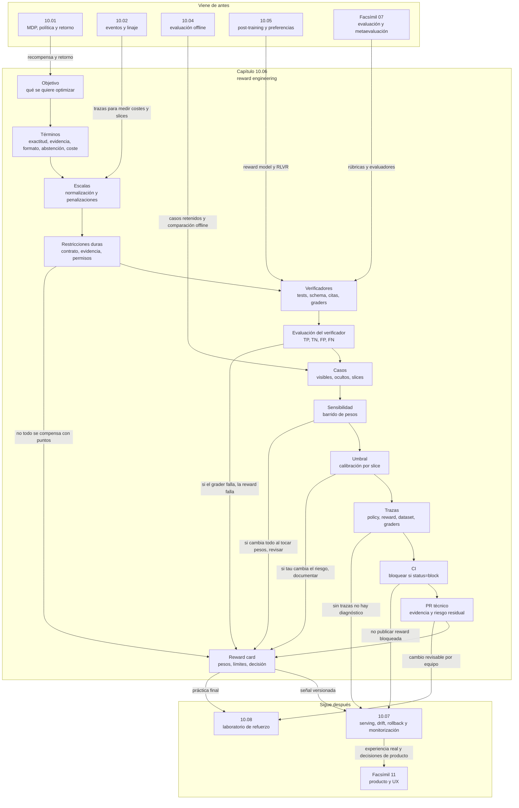

::: {.fasciculo-subtitle}
Facsímil 10 · Aprendizaje por refuerzo
:::

# Capítulo 06: Reward engineering: calidad de señal, verificadores y reward cards

## La recompensa es una especificación bajo presión

En los capítulos anteriores hemos hablado de políticas, retorno, bandits, evaluación offline y post-training. Todo acaba chocando contra una pregunta incómoda: ¿qué está intentando maximizar el sistema?

La recompensa parece un número. En realidad es una especificación comprimida. Si esa especificación está mal escrita, la política no "entiende la intención"; optimiza lo que le dimos. En un sistema RAG, una reward puede premiar respuestas con cita. Bien. Pero si solo mira si aparece un identificador de documento, puede premiar citas decorativas. En un asistente de código, puede premiar tests que pasan. Bien. Pero si los tests son pobres, puede favorecer soluciones frágiles. En un agente con herramientas, puede premiar resolver rápido. Bien. Pero si no controla cambios de estado, puede sacrificar trazabilidad.

Sutton y Barto definen RL alrededor de señales de recompensa y retorno; esa idea es potente porque reduce una decisión secuencial a consecuencias medibles.^[Sutton, R. S. y Barto, A. G. (2018). *Reinforcement Learning: An Introduction* (2.ª ed.). MIT Press. http://incompleteideas.net/book/the-book-2nd.html. Consultado el 8 de junio de 2026.] Silver, Singh, Precup y Sutton defendieron que maximizar recompensa puede explicar una gran variedad de comportamientos inteligentes, una tesis fuerte que conviene leer con cuidado en ingeniería aplicada.^[Silver, D., Singh, S., Precup, D. y Sutton, R. S. (2021). Reward is enough. *Artificial Intelligence, 299*, 103535. https://doi.org/10.1016/j.artint.2021.103535] En producto, la lección práctica no es "un número basta". Es justo la contraria: si el número manda, diseñarlo bien importa muchísimo.

Reward engineering es ese trabajo: convertir intención en una señal medible, versionada, auditable y resistente a cambios.

## Qué no es una recompensa buena

Una recompensa buena no es la métrica más cómoda. `clicks`, `tokens`, `satisfacción`, `tiempo`, `respuestas largas`, `tests pasan`, `cita presente` o `like` pueden ser señales útiles, pero no son automáticamente el objetivo.

Tampoco es una suma de cosas bonitas:

```text
calidad + seguridad + rapidez + coste + satisfacción
```

Si no defines cómo se mide cada término, qué peso tiene, qué casos debe pasar y cuándo bloquea, la fórmula es una frase. No una especificación.

Y no es estable para siempre. Una recompensa que funciona con un modelo base, un RAG, una política de herramientas y un tipo de usuario puede degradarse cuando cambia cualquiera de esas piezas.

La ley de Goodhart suele resumirse como el problema de convertir una medida en objetivo. Goodhart formuló esta preocupación en el contexto de gestión monetaria: cuando una regularidad observada se usa para control, puede dejar de comportarse igual.^[Goodhart, C. A. E. (1975). *Problems of Monetary Management: The U.K. Experience*. Reserve Bank of Australia. https://www.rba.gov.au/publications/confs/1975/. Consultado el 8 de junio de 2026.] En IA aplicada, la lectura es directa: si una métrica se vuelve el objetivo del modelo, el modelo encontrará los bordes de esa métrica.

## De intención a fórmula

Ejemplo de fórmula: una recompensa compuesta puede escribirse así para obligarnos a separar señales, pesos y coste. No es una receta universal; cada componente debe estar definido, medido y versionado.

$$
R(x,y)=
\sum_{j=1}^{m} w_j f_j(x,y)
$$

| Símbolo | Significado | Ejemplo |
|---|---|---|
| \(x\) | Entrada o contexto. | Pregunta del usuario + documentos recuperados. |
| \(y\) | Respuesta candidata. | Respuesta del asistente. |
| \(f_j(x,y)\) | Componente medible de la recompensa. | Exactitud, cita, formato, coste. |
| \(w_j\) | Peso del componente. | 0,40 para exactitud. |
| \(m\) | Número de componentes. | 7 términos. |
| \(R(x,y)\) | Recompensa total. | 0,82 |

Ejemplo de fórmula para un asistente RAG:

$$
R =
0{,}40R_{\text{correcta}}
+0{,}22R_{\text{evidencia}}
+0{,}13R_{\text{formato}}
+0{,}12R_{\text{abstención}}
-0{,}07C_{\text{latencia}}
-0{,}04C_{\text{tokens}}
-0{,}02C_{\text{herramientas}}
$$

| Término | Qué mide | Cómo lo verificaría |
|---|---|---|
| \(R_{\text{correcta}}\) | La respuesta resuelve la tarea. | Revisión humana, grader de tarea o test. |
| \(R_{\text{evidencia}}\) | La respuesta está soportada por fuente. | Verificador de cita y recuperación. |
| \(R_{\text{formato}}\) | Cumple contrato de salida. | JSON schema, parser, tipos. |
| \(R_{\text{abstención}}\) | Se abstiene si falta evidencia. | Clasificador de answerability o caso etiquetado. |
| \(C_{\text{latencia}}\) | Tiempo de respuesta. | Traza p50/p95. |
| \(C_{\text{tokens}}\) | Coste de generación. | Tokens de entrada/salida. |
| \(C_{\text{herramientas}}\) | Coste y riesgo operativo. | Número y tipo de llamadas. |

Los pesos no son verdad científica. Son una decisión de producto y riesgo. Precisamente por eso deben documentarse.

## Antes de sumar: normalizar y separar lo no negociable

La fórmula anterior parece limpia, pero en ingeniería hay una trampa: no todas las señales nacen en la misma escala. La exactitud puede venir como 0 o 1. La latencia viene en milisegundos. Los tokens vienen como conteo. Una puntuación de evidencia puede salir de un verificador entre 0 y 1. Si sumas todo sin normalizar, el peso deja de significar lo que crees que significa.

Ejemplo de fórmula: una forma común es convertir cada señal a un rango comparable:

$$
\tilde{f}_j(x,y)=
\frac{f_j(x,y)-f_j^{\min}}{f_j^{\max}-f_j^{\min}+\epsilon}
$$

| Símbolo | Significado | Ejemplo |
|---|---|---|
| \(f_j(x,y)\) | Valor bruto de la señal. | 1850 ms de latencia. |
| \(f_j^{\min}\) | Valor mínimo observado o pactado. | 500 ms. |
| \(f_j^{\max}\) | Valor máximo observado o pactado. | 5000 ms. |
| \(\epsilon\) | Pequeño valor para evitar división por cero. | \(10^{-9}\). |
| \(\tilde{f}_j(x,y)\) | Señal normalizada. | Valor comparable en 0..1. |

Si menor es mejor, como latencia o coste, puedes convertirlo en penalización:

$$
C_{\text{latencia}}(x,y)=
\frac{\text{latencia}(x,y)-\text{latencia}_{\min}}
{\text{latencia}_{\max}-\text{latencia}_{\min}+\epsilon}
$$

Entonces un valor alto de \(C_{\text{latencia}}\) resta más. Si no haces esto, una mejora de 300 ms puede parecer enorme o irrelevante según el rango que haya caído en tus datos. Y si el rango se calcula con todo el tráfico mezclado, puedes castigar de forma injusta tareas naturalmente más lentas, como una consulta con herramienta frente a una respuesta directa. Por eso muchas reward cards normalizan por `slice`: RAG, SQL, salida estructurada, agente con herramientas, etc.

Hay una segunda trampa: no todo debe poder compensarse con puntos. Un JSON inválido no debería publicarse porque la respuesta sea muy bonita. Una cita que no soporta la frase no debería pasar porque el coste sea bajo. Una acción sobre un sistema externo no debería ejecutarse si falta aprobación humana o permiso técnico. Para eso usamos restricciones duras:

$$
G(x,y)=
\mathbb{1}[\text{JSON válido}]
\cdot
\mathbb{1}[\text{citas soportadas}]
\cdot
\mathbb{1}[\text{permiso correcto}]
$$

Y la decisión de publicación se separa de la puntuación:

$$
\text{publicar}(x,y)=
\mathbb{1}[G(x,y)=1]
\cdot
\mathbb{1}[R(x,y)\geq \tau]
$$

| Elemento | Qué significa | Ejemplo operativo |
|---|---|---|
| \(G(x,y)\) | Producto de restricciones duras. | Vale 0 si falla cualquier condición obligatoria. |
| \(\mathbb{1}[\cdot]\) | Indicador: 1 si se cumple, 0 si no. | JSON válido: 1; JSON roto: 0. |
| \(\tau\) | Umbral mínimo de reward. | Publicar solo si \(R \geq 0{,}75\). |
| `slice` | Subconjunto con comportamiento propio. | `rag`, `sql`, `herramientas`, `privacidad`. |

Este punto es muy de ingeniería: una reward no es solo una función matemática. Es una decisión de control. Tiene una parte continua, donde comparas candidatos, y una parte discreta, donde bloqueas salidas que no cumplen contrato.

## Ejemplo numérico completo

Imagina un asistente RAG que responde una pregunta sobre una política interna. Tenemos dos respuestas candidatas. Las dos pasan el contrato mínimo: salida parseable, cita presente y ruta permitida. Ahora toca decidir cuál gana por recompensa.

| Componente normalizado | Candidato A | Candidato B | Lectura |
|---|---:|---:|---|
| `correctness` | 0,80 | 1,00 | B resuelve mejor la pregunta en abstracto. |
| `evidence` | 1,00 | 0,35 | A está mucho mejor soportado por documentos. |
| `format` | 1,00 | 1,00 | Ambos cumplen JSON schema. |
| `abstention` | 0,00 | 0,00 | En este caso sí hay fuente, no toca abstenerse. |
| `latency_cost` | 0,45 | 0,12 | B es más rápido. |
| `token_cost` | 0,45 | 0,18 | B usa menos tokens. |
| `tool_cost` | 0,20 | 0,00 | B usa menos herramientas. |

Con los pesos declarados:

| Término | Peso | A | Contribución A | B | Contribución B |
|---|---:|---:|---:|---:|---:|
| `correctness` | 0,40 | 0,80 | 0,3200 | 1,00 | 0,4000 |
| `evidence` | 0,22 | 1,00 | 0,2200 | 0,35 | 0,0770 |
| `format` | 0,13 | 1,00 | 0,1300 | 1,00 | 0,1300 |
| `abstention` | 0,12 | 0,00 | 0,0000 | 0,00 | 0,0000 |
| `latency_cost` | -0,07 | 0,45 | -0,0315 | 0,12 | -0,0084 |
| `token_cost` | -0,04 | 0,45 | -0,0180 | 0,18 | -0,0072 |
| `tool_cost` | -0,02 | 0,20 | -0,0040 | 0,00 | 0,0000 |
| **Total** |  |  | **0,6165** |  | **0,5914** |

Gana A por 0,0251. No gana porque sea más barato ni porque sea más completo. Gana porque, en una tarea RAG, la evidencia pesa lo suficiente como para preferir una respuesta algo menos ambiciosa pero más defendible. Esta frase es importante: una reward card no solo produce un ganador, produce una explicación técnica del ganador.

Ahora reducimos el peso de `evidence` a la mitad, de 0,22 a 0,11. No cambiamos candidatos, solo criterio:

| Candidato | Reward original | Reward con `evidence` a 0,11 | Qué pasa |
|---|---:|---:|---|
| A | 0,6165 | 0,5065 | Pierde mucha puntuación porque dependía de evidencia fuerte. |
| B | 0,5914 | 0,5529 | Pierde poco porque tenía poca evidencia. |

Con esa variación gana B. ¿Es malo? Depende. Si el equipo quería que el asistente priorizara respuestas más completas aunque la evidencia fuera parcial, el cambio es coherente. Si el equipo quería un RAG conservador para documentación interna, el cambio revela que el peso de evidencia no es un detalle: es una decisión de producto, riesgo y pedagogía.

Este es el tipo de ejemplo que conviene tener en la reward card. No para decorar. Para que cualquier persona del equipo pueda entender qué gana, qué pierde y qué criterio estamos imponiendo al sistema.

## Tipos de señal y cuándo fiarte

| Señal | Ventaja | Riesgo | Uso razonable |
|---|---|---|---|
| Métrica de negocio | Conecta con resultado real. | Puede ser tardía y confusa. | Evaluación agregada y decisiones de producto. |
| Preferencia humana | Captura criterio experto. | Coste, desacuerdo y fatiga. | Pares, reward model, DPO/RLHF. |
| Verificador determinista | Reproducible y barato. | Mide solo lo programado. | JSON, SQL, tests, formato, citas. |
| Grader por modelo | Flexible para tareas abiertas. | Puede cambiar con modelo/prompts. | Rúbricas complejas con validación humana. |
| Proxy técnico | Fácil de medir. | Puede desplazar el objetivo real. | Coste, latencia, longitud, pasos. |
| Casos ocultos | Reduce ajuste al test visible. | Requiere mantenimiento. | Gate antes de publicar. |

Christiano et al. mostraron que las preferencias humanas pueden definir recompensas para tareas donde escribir el reward manual es difícil, usando comparaciones de segmentos de comportamiento.^[Christiano, P. F. et al. (2017). *Deep Reinforcement Learning from Human Preferences*. arXiv:1706.03741. https://arxiv.org/abs/1706.03741. Consultado el 8 de junio de 2026.] Leike et al. formularon reward modeling como una dirección para escalar supervisión: aprender una función de recompensa de interacción con personas y optimizarla después.^[Leike, J. et al. (2018). *Scalable Agent Alignment via Reward Modeling: A Research Direction*. arXiv:1811.07871. https://arxiv.org/abs/1811.07871. Consultado el 8 de junio de 2026.]

La advertencia: una recompensa aprendida sigue siendo una aproximación. No deja de necesitar validación.

## Verificadores: programas que ponen límites

Un verificador convierte parte de la intención en una prueba reproducible. No resuelve todo, pero baja ambigüedad.

| Verificador | Entrada | Salida | Ejemplo |
|---|---|---|---|
| JSON schema | Texto generado. | `pass/fail`. | Campos obligatorios y tipos. |
| Test unitario | Código generado. | Tests pasados. | Función que valida eventos RL. |
| SQL fixture | Consulta SQL. | Filas esperadas. | Conteo de tickets por semana. |
| Verificador de cita | Respuesta + documentos. | Cita soportada o no. | ID de documento y fragmento. |
| Answerability | Pregunta + contexto. | Debe responder o abstenerse. | No hay fuente para una política. |
| Grader por modelo | Respuesta + rúbrica. | Puntuación 0..1. | Calidad de explicación técnica. |

OpenAI documenta graders como evaluadores que devuelven una puntuación entre 0 y 1, incluyendo variantes como checks de texto, modelo, Python y combinaciones ponderadas.^[OpenAI. (2026). *Graders*. https://platform.openai.com/docs/guides/graders/. Consultado el 8 de junio de 2026.] Su documentación de reinforcement fine-tuning conecta estos graders con métricas de entrenamiento y validación.^[OpenAI. (2026). *Reinforcement fine-tuning*. https://developers.openai.com/api/docs/guides/reinforcement-fine-tuning. Consultado el 8 de junio de 2026.]

La regla que usaría en un equipo: todo componente crítico de reward debe tener al menos una forma de verificación o revisión retenida. Si no, ese componente no debería decidir publicación por sí solo.

## El verificador también se evalúa

Un grader o verificador no es verdad revelada. Es otro sistema que puede equivocarse. Si un verificador de citas marca como soportada una frase que el documento no sostiene, la reward premiará una mala respuesta. Si marca como no soportada una frase correcta, castigará respuestas buenas. En ambos casos la política aprende una señal deformada.

Por eso un verificador importante debe tener su propio conjunto de evaluación:

| Caso | Gold | Predicción del verificador | Lectura |
|---|---:|---:|---|
| Cita correcta detectada como correcta | 1 | 1 | Verdadero positivo. |
| Cita incorrecta detectada como incorrecta | 0 | 0 | Verdadero negativo. |
| Cita incorrecta aceptada | 0 | 1 | Falso positivo. |
| Cita correcta rechazada | 1 | 0 | Falso negativo. |

Con esa matriz calculamos métricas básicas:

$$
\text{precision} =
\frac{TP}{TP+FP}
$$

$$
\text{recall} =
\frac{TP}{TP+FN}
$$

$$
\text{accuracy} =
\frac{TP+TN}{TP+TN+FP+FN}
$$

| Métrica | Qué pregunta responde | En una reward card |
|---|---|---|
| Precisión | Cuando el verificador dice "pasa", ¿cuántas veces acierta? | Importa si el verificador desbloquea publicación. |
| Recall | De los casos que deberían pasar, ¿cuántos detecta? | Importa si no quieres castigar respuestas buenas. |
| Accuracy | ¿Qué proporción total clasifica bien? | Útil, pero puede engañar si las clases están desbalanceadas. |
| Falsos positivos | ¿Qué se cuela como válido sin serlo? | Puede elevar la reward de respuestas incorrectas. |
| Falsos negativos | ¿Qué se castiga siendo válido? | Puede empujar al modelo hacia respuestas conservadoras o pobres. |

Ejemplo: si un verificador de cita tiene mucha precisión y poco recall, suele ser estricto. Puede venir bien en un dominio regulado, pero quizá castigue demasiadas respuestas correctas. Si tiene mucho recall y poca precisión, deja pasar demasiadas citas débiles. En un RAG interno, eso puede convertir una reward de evidencia en una reward de "poner IDs de documentos".

La decisión no es elegir una métrica bonita. Es decidir qué error pesa más para el producto, declarar esa elección y volver a medir cuando cambien documentos, plantilla de respuesta, modelo base o política de recuperación.

## Reward card: el expediente de la señal

Una reward card es una ficha técnica de la recompensa. No es un documento bonito para enseñar al final. Es el contrato que evita que el equipo olvide qué se está optimizando.

| Campo | Pregunta que responde |
|---|---|
| Objetivo | ¿Qué comportamiento queremos mejorar? |
| No objetivos | ¿Qué no debe premiarse aunque mejore la métrica? |
| Términos | ¿Qué componentes tiene la recompensa? |
| Pesos | ¿Cuánto pesa cada componente y por qué? |
| Verificadores | ¿Cómo se mide cada componente? |
| Casos visibles | ¿Qué ejemplos usamos para depurar? |
| Casos ocultos | ¿Qué ejemplos protegemos para gate? |
| Slices | ¿Dónde puede fallar aunque la media pase? |
| Coste | ¿Qué penalizamos por tokens, latencia y herramientas? |
| Límites | ¿Qué no cubre esta reward card? |
| Criterio de cambio | ¿Cuándo hay que versionarla? |

La reward card debe vivir cerca del código y de los datos. Si está en una presentación suelta, se perderá justo cuando más haga falta.

## Casos negativos y ocultos

El reward no se prueba solo con casos donde la respuesta correcta gana de forma obvia. Necesita casos que fuercen bordes:

| Caso | Qué comprueba |
|---|---|
| Respuesta correcta sin cita | Que evidencia importa. |
| Cita presente pero no soporta la frase | Que la cita no sea decorativa. |
| JSON con buen contenido pero inválido | Que formato importa. |
| Pregunta sin fuente | Que abstención importa. |
| Respuesta larga y elegante pero costosa | Que longitud no se premie sola. |
| Tool timeout | Que el sistema no rellene resultados no observados. |
| Slice crítico pequeño | Que la media global no oculte caída. |

Amodei et al. colocaron el problema de objetivo incorrecto y optimización literal de especificaciones dentro de los problemas concretos de seguridad en sistemas de aprendizaje.^[Amodei, D. et al. (2016). *Concrete Problems in AI Safety*. arXiv:1606.06565. https://arxiv.org/abs/1606.06565. Consultado el 8 de junio de 2026.] Krakovna et al. recopilaron ejemplos de sistemas que cumplen la especificación literal sin cumplir la intención práctica, lo que ilustra por qué necesitamos casos negativos y verificadores.^[Krakovna, V. et al. (2020). *Specification Gaming: The Flip Side of AI Ingenuity*. Google DeepMind. https://deepmind.google/blog/article/Specification-gaming-the-flip-side-of-AI-ingenuity. Consultado el 8 de junio de 2026.]

No se trata de asustar al alumno. Se trata de enseñar una disciplina: cuando una señal manda, hay que probar sus bordes.

## Ejemplos de reward por dominio

La reward cambia según el sistema. No existe una plantilla universal, pero sí una manera de pensar: objetivo, señales, restricciones duras, casos retenidos y monitorización.

| Sistema | Qué optimiza | Señales útiles | Restricción dura típica | Caso que pondría sí o sí |
|---|---|---|---|---|
| RAG documental | Responder con evidencia real. | Correctitud, soporte de cita, abstención, coste. | No afirmar si el documento recuperado no soporta la frase. | Pregunta sin fuente suficiente. |
| SQL assistant | Generar consulta ejecutable y correcta. | Resultado esperado, sintaxis, coste de query, explicación. | La consulta debe ejecutarse en fixture controlado. | Query correcta en una tabla, incorrecta en otra por join mal hecho. |
| Agente con herramientas | Resolver una tarea con trazabilidad. | Éxito de tarea, pasos, coste, permisos, recuperación ante error. | No hacer cambios de estado sin aprobación o permiso técnico. | Tool timeout con respuesta honesta. |
| Asistente de código | Producir código mantenible. | Tests, tipos, lint, complejidad, cobertura de casos. | No pasar si rompe un test existente. | Solución que pasa un test simple pero falla borde. |
| Salida estructurada | Devolver contrato validable. | JSON schema, campos obligatorios, tipos, catálogo. | El parser debe cargar la salida sin reparación manual. | Buen contenido con JSON inválido. |
| Routing de modelos | Elegir modelo adecuado por caso. | Calidad, coste, latencia, confianza, fallback. | No enviar datos sensibles a una ruta no permitida. | Caso barato que no necesita modelo caro. |

Fíjate en que la reward no sustituye al contrato del sistema. Lo complementa. En salida estructurada, el contrato parseable va primero. En herramientas, permisos y trazabilidad van primero. En RAG, evidencia y abstención van primero. La puntuación sirve para comparar candidatos dentro de un marco válido, no para borrar errores de diseño.

## Sensibilidad de pesos

Una reward card debe incluir una pregunta incómoda: ¿qué pasa si cambio un poco los pesos?

Si el candidato ganador cambia al mover `evidence` de 0,22 a 0,20, la señal es frágil. Si al duplicar una penalización de coste siguen ganando los mismos candidatos correctos, quizá la reward es estable. Este análisis no demuestra que la reward sea buena, pero detecta fórmulas que dependen demasiado de una decisión arbitraria.

Formalmente puedes comparar ganadores:

$$
\Delta_{\text{winners}}(w_j, \alpha)=
\sum_{i=1}^{n}
\mathbb{1}
\left[
\operatorname*{argmax}_{y} R_i(y; w_j)
\neq
\operatorname*{argmax}_{y} R_i(y; \alpha w_j)
\right]
$$

| Símbolo | Significado | Lectura |
|---|---|---|
| \(w_j\) | Peso original del término \(j\). | Peso de evidencia, formato o coste. |
| \(\alpha\) | Multiplicador aplicado al peso. | 0,50; 0,75; 1,25; 1,50. |
| \(n\) | Número de casos evaluados. | Casos visibles y ocultos. |
| \(\Delta_{\text{winners}}\) | Número de ganadores que cambian. | Mayor valor implica mayor sensibilidad. |

La señal que quieres para producción no es "nunca cambia". Hay decisiones donde coste o evidencia deben cambiar el ganador. Lo que buscas es que los cambios sean explicables. Si al variar `token_cost` cambia un caso de privacidad, hay que mirar si estás mezclando señales sin control. Si al variar `evidence` cambia un caso RAG dudoso, puede ser justo lo que esperabas.

## Calibrar el umbral

El umbral \(\tau\) no se elige mirando una respuesta suelta. Se calibra contra un conjunto retenido donde sabes qué salidas deberían pasar y cuáles deberían bloquearse. Si \(\tau\) es demasiado bajo, pasan respuestas débiles. Si \(\tau\) es demasiado alto, bloqueas respuestas útiles y el sistema se vuelve torpe.

Para cada candidato retenido calculas:

$$
\hat{p}(y)=\mathbb{1}[R(x,y)\geq \tau]
$$

y lo comparas con una etiqueta de referencia:

$$
z(y) \in \{0,1\}
$$

| Símbolo | Qué significa | Ejemplo |
|---|---|---|
| \(\tau\) | Umbral de publicación o selección. | 0,75 en un asistente documental. |
| \(\hat{p}(y)\) | Decisión del sistema con ese umbral. | 1 si pasa, 0 si bloquea. |
| \(z(y)\) | Etiqueta retenida. | 1 si el equipo acepta la salida. |
| Falso pase | \(\hat{p}=1\), \(z=0\). | Sale una respuesta no aceptable. |
| Falso bloqueo | \(\hat{p}=0\), \(z=1\). | Se descarta una respuesta útil. |

Una tabla mínima de calibración podría verse así:

| Umbral \(\tau\) | Pass rate | Falsos pases | Falsos bloqueos | Lectura |
|---:|---:|---:|---:|---|
| 0,55 | 0,91 | 7 | 1 | Demasiado permisivo para RAG interno. |
| 0,65 | 0,78 | 3 | 3 | Equilibrado si el coste de revisar es bajo. |
| 0,75 | 0,62 | 1 | 7 | Más estricto; útil si evidencia importa mucho. |
| 0,85 | 0,34 | 0 | 18 | Quizá demasiado conservador. |

No hay un único umbral correcto. Puede haber un \(\tau_{\text{rag}}\), un \(\tau_{\text{sql}}\), un \(\tau_{\text{herramientas}}\) y un \(\tau_{\text{privacidad}}\). En SQL, un falso pase puede romper una ejecución; en un resumen interno, un falso bloqueo quizá solo obliga a revisar manualmente. El umbral debe reflejar ese coste.

La regla práctica: calibra por slice, guarda la curva de decisión y revisa ejemplos concretos, no solo la media. Una reward con buen promedio puede tener un umbral pésimo para un segmento pequeño.

## Producción: reward drift y monitorización

La reward card no termina cuando se publica un experimento. En serving, el sistema cambia: nuevos documentos, nuevas consultas, nuevas plantillas, nuevos modelos, cambios de latencia y modificaciones de herramientas. En ese punto hay que monitorizar la relación entre reward y resultado real.

| Señal en producción | Qué puede indicar | Qué haría |
|---|---|---|
| `reward_mean` sube y satisfacción baja | La política aprendió a complacer la métrica. | Revisar casos negativos y ejemplos retenidos. |
| `evidence_pass_rate` sube demasiado rápido | El verificador puede estar aceptando señales débiles. | Auditar muestras y matriz del verificador. |
| `abstention_rate` cae | El sistema responde aunque falte fuente. | Revisar answerability y casos sin evidencia. |
| `token_cost_p95` sube | La reward no penaliza suficiente longitud o herramientas. | Revisar pesos y normalización por slice. |
| `case_pass_rate` pasa en global y falla un slice | La media oculta un segmento crítico. | Gate por slice, no solo por media. |
| `grader_precision` cambia | El evaluador dejó de comportarse igual. | Recalibrar grader o congelar versión. |

Para un equipo de ingeniería, la reward card debería versionarse junto a cuatro cosas: dataset de evaluación, verificadores, prompts o contratos de salida, y política candidata. Si solo versionas la fórmula, no podrás explicar por qué cambió una decisión.

## Qué se guarda en cada run

La reward card no sirve de mucho si producción no guarda las trazas necesarias. Cuando una respuesta gana, el equipo debería poder reconstruir por qué ganó: qué política la generó, qué reward card se usó, qué verificadores puntuaron, qué gates pasaron y qué valores tuvo cada componente.

Una traza mínima para este capítulo tendría esta forma:

```json
{
  "trace_id": "f10-c06-0001",
  "run_at": "2026-06-09T17:30:00Z",
  "policy_version": "rag-policy-2026-06-09",
  "reward_card_version": "1.0.0",
  "input_slice": "rag",
  "candidate_id": "a",
  "component_scores": {
    "correctness": 0.8,
    "evidence": 1.0,
    "format": 1.0,
    "abstention": 0.0,
    "latency_cost": 0.45,
    "token_cost": 0.45,
    "tool_cost": 0.2
  },
  "hard_gates": {
    "valid_output_contract": true,
    "supported_claims": true,
    "answerability_or_abstention": true
  },
  "reward": 0.6165,
  "winner": true,
  "latency_ms": 1850,
  "input_tokens": 1420,
  "output_tokens": 310,
  "grader_versions": {
    "citation_support_v1": "2026-06-09",
    "json_schema_v1": "1.0.0",
    "answerability_v1": "2026-06-09"
  },
  "dataset_version": "reward-eval-2026-06-09"
}
```

| Campo | Por qué importa |
|---|---|
| `trace_id` | Une logs, respuesta, evaluación y revisión posterior. |
| `policy_version` | Permite saber qué política o modelo produjo la salida. |
| `reward_card_version` | Evita comparar puntuaciones de fórmulas distintas como si fueran iguales. |
| `input_slice` | Permite detectar drift por segmento. |
| `component_scores` | Explica el reward total y permite auditoría por término. |
| `hard_gates` | Separa condiciones obligatorias de puntuación ponderada. |
| `grader_versions` | Hace reproducible la evaluación si cambia un grader. |
| `dataset_version` | Conecta la decisión con el conjunto de casos retenidos. |

En el kit, este contrato vive en `contracts/reward_run_trace_contract.json`. No es un estándar universal; es una propuesta mínima para que el alumno entienda qué debe guardar si quiere operar una reward en serio.

## Criterios para pasar al siguiente paso

Una reward card no debería pasar de documento a experimento porque "parece razonable". Debería pasar por una checklist.

| Criterio | Mínimo razonable | Qué miraría |
|---|---|---|
| Casos | Al menos 8-10 iniciales, creciendo con el producto. | No solo casos felices. |
| Slices | Varios segmentos reales. | RAG, SQL, coste, herramientas, privacidad. |
| Casos ocultos | 25 % o más en una primera práctica. | No ajustar todo contra lo visible. |
| Pass rate | 90 % o más antes de experimento controlado. | Mirar también errores concretos. |
| Restricciones duras | Todas con verificador real. | Ninguna condición obligatoria en `none`. |
| Normalización | Costes normalizados antes de sumar. | Latencia y tokens por slice. |
| Verificador | Matriz de confusión revisada. | Falsos pases y falsos bloqueos. |
| Sensibilidad | Cambios de ganador explicables. | Identificar casos como `sensibilidad_evidencia`. |
| Trazas | Campos mínimos definidos. | Versiones de policy, reward, dataset y graders. |
| CI | Falla si `status=block`. | No depender de lectura manual. |

Esta tabla no sustituye al criterio del equipo. Lo fuerza a hacerse explícito. Y eso, en sistemas de IA, ya es media batalla ganada.

## Qué se lleva un equipo de ingeniería

Al terminar este capítulo, un equipo debería poder llevarse tres piezas reutilizables.

| Pieza | Para qué sirve | Cuándo se usa |
|---|---|---|
| Validador de trazas | Comprueba que una run guarda campos, versiones, gates y reward coherente. | Antes de confiar en métricas de producción. |
| Calibrador de umbral | Calcula falsos pases y falsos bloqueos para varios \(\tau\). | Antes de seleccionar o publicar candidatos. |
| Plantilla de PR | Obliga a justificar cambios de objetivo, pesos, casos, sensibilidad y operación. | Cada vez que cambia una reward card. |

El validador de trazas evita una situación muy común: tener un dashboard bonito sin poder reconstruir una decisión. Si falta `reward_card_version`, no sabes qué fórmula puntuó. Si falta `grader_versions`, no sabes si la evaluación cambió. Si el `reward` guardado no coincide con los componentes, no sabes si hay un bug de cálculo o una transformación no documentada.

El calibrador de umbral convierte una discusión vaga en una tabla revisable. En lugar de decir "0,75 parece bien", el equipo mira falsos pases, falsos bloqueos y casos concretos por slice. Para RAG interno quizá priorizas no dejar pasar respuestas sin soporte. Para SQL quizá priorizas no ejecutar una consulta incorrecta. Para un asistente de redacción quizá aceptas más falsos bloqueos si la revisión humana es barata.

La plantilla de PR es la disciplina que evita cambios silenciosos. Cambiar `evidence` de 0,22 a 0,11 no es tocar un número: cambia qué tipo de respuesta gana. Un PR de reward card debe enseñar `reward_card_decision.md`, `sensitivity_report.csv`, `threshold_recommendation.md`, matriz de verificador y trazas. Si no, el equipo está aprobando una intuición, no una especificación.

## Anatomía de una reward card defendible

<svg id="f10-c06-reward-card" xmlns="http://www.w3.org/2000/svg" viewBox="0 0 1560 1040" role="img" aria-label="Anatomía de una reward card defendible con objetivo, términos, verificadores, casos y gates">
  <defs>
    <marker id="f10c06-arrow" viewBox="0 0 10 10" refX="9" refY="5" markerWidth="7" markerHeight="7" orient="auto-start-reverse">
      <path d="M 0 0 L 10 5 L 0 10 z" fill="#111111"/>
    </marker>
    <pattern id="f10c06-grid" width="20" height="20" patternUnits="userSpaceOnUse">
      <path d="M20 0 L0 0 0 20" fill="none" stroke="#EEEEEE" stroke-width="1"/>
    </pattern>
  </defs>
  <rect x="24" y="24" width="1512" height="992" rx="18" fill="#FFFFFF" stroke="#111111" stroke-width="2"/>
  <text x="780" y="64" text-anchor="middle" font-family="Arial, sans-serif" font-size="26" font-weight="700">Reward card: de intención a gate reproducible</text>
  <text x="780" y="94" text-anchor="middle" font-family="Arial, sans-serif" font-size="13" fill="#555555">La recompensa solo es defendible si declara objetivo, escalas, restricciones duras, verificadores, casos, límites y decisión.</text>
  <rect x="58" y="126" width="1444" height="806" rx="14" fill="url(#f10c06-grid)" stroke="#DDDDDD"/>

  <g font-family="Arial, sans-serif">
    <rect x="92" y="164" width="248" height="154" rx="12" fill="#111111" stroke="#111111"/>
    <text x="216" y="198" text-anchor="middle" font-size="14" font-weight="700" fill="#FFFFFF">Objetivo</text>
    <text x="216" y="226" text-anchor="middle" font-size="11" fill="#E8E8E8">qué comportamiento mejora</text>
    <text x="216" y="246" text-anchor="middle" font-size="11" fill="#E8E8E8">qué no debe premiar</text>
    <text x="216" y="266" text-anchor="middle" font-size="11" fill="#E8E8E8">quién decide pesos</text>
    <text x="216" y="286" text-anchor="middle" font-size="11" fill="#E8E8E8">cuándo se versiona</text>

    <line x1="340" y1="241" x2="420" y2="241" stroke="#111111" stroke-width="1.3" marker-end="url(#f10c06-arrow)"/>
    <rect x="420" y="150" width="302" height="182" rx="12" fill="#FFFFFF" stroke="#111111"/>
    <text x="571" y="184" text-anchor="middle" font-size="14" font-weight="700">Términos ponderados</text>
    <text x="571" y="212" text-anchor="middle" font-size="11" fill="#555555">correctness · evidence</text>
    <text x="571" y="232" text-anchor="middle" font-size="11" fill="#555555">format · abstention</text>
    <text x="571" y="252" text-anchor="middle" font-size="11" fill="#555555">latency · tokens · tools</text>
    <text x="571" y="272" text-anchor="middle" font-size="11" fill="#555555">normalización por slice</text>
    <text x="571" y="296" text-anchor="middle" font-size="11" fill="#111111">R = sum w_j f_j(x,y)</text>

    <line x1="722" y1="241" x2="802" y2="241" stroke="#111111" stroke-width="1.3" marker-end="url(#f10c06-arrow)"/>
    <rect x="802" y="150" width="302" height="182" rx="12" fill="#FFFFFF" stroke="#111111"/>
    <text x="953" y="184" text-anchor="middle" font-size="14" font-weight="700">Verificadores</text>
    <text x="953" y="212" text-anchor="middle" font-size="11" fill="#555555">schema · tests · SQL</text>
    <text x="953" y="232" text-anchor="middle" font-size="11" fill="#555555">citas · answerability</text>
    <text x="953" y="252" text-anchor="middle" font-size="11" fill="#555555">grader por modelo</text>
    <text x="953" y="272" text-anchor="middle" font-size="11" fill="#555555">matriz TP/TN/FP/FN</text>
    <text x="953" y="296" text-anchor="middle" font-size="11" fill="#111111">score reproducible 0..1</text>

    <line x1="1104" y1="241" x2="1184" y2="241" stroke="#111111" stroke-width="1.3" marker-end="url(#f10c06-arrow)"/>
    <polygon points="1310,142 1440,241 1310,340 1180,241" fill="#F7F7F7" stroke="#111111" stroke-width="1.3"/>
    <text x="1310" y="216" text-anchor="middle" font-size="13" font-weight="700">Gate inicial</text>
    <text x="1310" y="238" text-anchor="middle" font-size="10" fill="#555555">términos requeridos</text>
    <text x="1310" y="256" text-anchor="middle" font-size="10" fill="#555555">restricciones duras</text>
    <text x="1310" y="274" text-anchor="middle" font-size="10" fill="#555555">proxy bajo control</text>
    <text x="1310" y="292" text-anchor="middle" font-size="10" fill="#555555">sin bonus longitud</text>

    <rect x="138" y="472" width="250" height="164" rx="12" fill="#FFFFFF" stroke="#111111"/>
    <text x="263" y="506" text-anchor="middle" font-size="14" font-weight="700">Casos visibles</text>
    <text x="263" y="534" text-anchor="middle" font-size="11" fill="#555555">depurar pesos</text>
    <text x="263" y="554" text-anchor="middle" font-size="11" fill="#555555">comparar candidatos</text>
    <text x="263" y="574" text-anchor="middle" font-size="11" fill="#555555">explicar al equipo</text>
    <text x="263" y="604" text-anchor="middle" font-size="11" fill="#111111">no son el gate final</text>

    <rect x="454" y="472" width="250" height="164" rx="12" fill="#FFFFFF" stroke="#111111"/>
    <text x="579" y="506" text-anchor="middle" font-size="14" font-weight="700">Casos ocultos</text>
    <text x="579" y="534" text-anchor="middle" font-size="11" fill="#555555">no ajustar contra ellos</text>
    <text x="579" y="554" text-anchor="middle" font-size="11" fill="#555555">rotar fixtures</text>
    <text x="579" y="574" text-anchor="middle" font-size="11" fill="#555555">slices críticos</text>
    <text x="579" y="604" text-anchor="middle" font-size="11" fill="#111111">bloquean publicación</text>

    <rect x="770" y="472" width="250" height="164" rx="12" fill="#FFFFFF" stroke="#111111"/>
    <text x="895" y="506" text-anchor="middle" font-size="14" font-weight="700">Scorecard</text>
    <text x="895" y="534" text-anchor="middle" font-size="11" fill="#555555">winner vs expected</text>
    <text x="895" y="554" text-anchor="middle" font-size="11" fill="#555555">case_pass_rate</text>
    <text x="895" y="574" text-anchor="middle" font-size="11" fill="#555555">proxy_share · slices</text>
    <text x="895" y="594" text-anchor="middle" font-size="11" fill="#555555">sensibilidad de pesos</text>
    <text x="895" y="616" text-anchor="middle" font-size="11" fill="#111111">evidencia de auditoría</text>

    <rect x="1086" y="472" width="250" height="164" rx="12" fill="#111111" stroke="#111111"/>
    <text x="1211" y="506" text-anchor="middle" font-size="14" font-weight="700" fill="#FFFFFF">Decisión</text>
    <text x="1211" y="534" text-anchor="middle" font-size="11" fill="#E8E8E8">pass / block</text>
    <text x="1211" y="554" text-anchor="middle" font-size="11" fill="#E8E8E8">reward_card.md</text>
    <text x="1211" y="574" text-anchor="middle" font-size="11" fill="#E8E8E8">changelog</text>
    <text x="1211" y="594" text-anchor="middle" font-size="11" fill="#E8E8E8">rollback si deriva</text>
    <text x="1211" y="616" text-anchor="middle" font-size="11" fill="#E8E8E8">criterio de publicación</text>

    <path d="M1310 340 C1310 410 263 410 263 472" fill="none" stroke="#111111" stroke-width="1.1" marker-end="url(#f10c06-arrow)"/>
    <line x1="388" y1="554" x2="454" y2="554" stroke="#111111" stroke-width="1.2" marker-end="url(#f10c06-arrow)"/>
    <line x1="704" y1="554" x2="770" y2="554" stroke="#111111" stroke-width="1.2" marker-end="url(#f10c06-arrow)"/>
    <line x1="1020" y1="554" x2="1086" y2="554" stroke="#111111" stroke-width="1.2" marker-end="url(#f10c06-arrow)"/>

    <rect x="250" y="754" width="1060" height="72" rx="12" fill="#F7F7F7" stroke="#111111"/>
    <text x="780" y="786" text-anchor="middle" font-size="13" font-weight="700">Regla de ingeniería</text>
    <text x="780" y="812" text-anchor="middle" font-size="12" fill="#555555">Una reward card no aprueba un modelo: aprueba una señal para experimentar con trazabilidad.</text>
  </g>

  <text x="1476" y="974" text-anchor="end" font-family="Arial, sans-serif" font-size="11" fill="#888888">IA para gente curiosa / Facsímil 10 / Capítulo 06 / 686f6c61</text>
</svg>

## Manos a la obra

El kit del capítulo está en:

```text
labs/f10/c06-reward-engineering/
```

Ejecuta:

```bash
python3 ops/audit_reward_card.py --write
python3 ops/reward_weight_sweep.py
python3 ops/calibrate_thresholds.py --write
python3 ops/validate_trace.py --write
python3 ops/fail_ci_if_blocked.py --report output/reward_card_audit_report.json
cat output/reward_card_decision.md
head -n 8 output/sensitivity_report.csv
cat output/threshold_recommendation.md
cat output/trace_validation_report.json
cat output/grader_confusion_matrix.csv
cat output/reward_card.md
```

Salida esperada:

```text
status=pass
cases=9
```

Y para una reward card que debe bloquear:

```bash
python3 ops/audit_reward_card.py \
  --spec data/reward_spec_bad.json \
  --output output_bad \
  --write
cat output_bad/reward_card_decision.md
python3 ops/reward_weight_sweep.py \
  --spec data/reward_spec_bad.json \
  --output output_bad/sensitivity_report.csv
python3 ops/validate_trace.py \
  --trace data/reward_run_trace_bad.json \
  --output output_bad/trace_validation_report.json \
  --write
python3 ops/fail_ci_if_blocked.py \
  --report output_bad/reward_card_audit_report.json
```

El último comando debe fallar con código de salida `1`. Eso es lo deseable: si el reporte está en `block`, CI no debería dejar pasar el cambio.

Salida esperada:

```text
status=block
cases=4
```

El alumno debería poder explicar:

| Artefacto | Pregunta que responde |
|---|---|
| `contracts/reward_card_contract.json` | ¿Qué mínimos exige el gate? |
| `contracts/reward_run_trace_contract.json` | ¿Qué campos mínimos debe guardar producción? |
| `data/reward_spec.json` | ¿Qué objetivo, pesos y casos declara la recompensa? |
| `output/reward_card_audit_report.json` | ¿Qué checks pasan o fallan? |
| `output/component_scorecard.csv` | ¿Qué peso tiene cada término? |
| `output/case_scorecard.csv` | ¿Qué candidato gana por caso? |
| `output/sensitivity_report.csv` | ¿Qué decisiones cambian si varía cada peso? |
| `output/threshold_calibration.csv` | ¿Qué falsos pases y falsos bloqueos produce cada umbral? |
| `output/threshold_recommendation.md` | ¿Qué umbral elegiría el script por slice y qué casos revisaría? |
| `output/grader_confusion_matrix.csv` | ¿Qué precisión, recall y accuracy tienen los verificadores evaluados? |
| `output/trace_validation_report.json` | ¿La traza guarda versiones, gates y reward coherente? |
| `labs/f10/c06-reward-engineering/templates/reward_card_pr_template.md` | ¿Qué evidencia debe traer un cambio de reward card? |
| `output/reward_card.md` | ¿Cómo se defendería esta señal ante el equipo? |

La práctica no busca que el alumno memorice el script. Busca que pueda llevarse un patrón reutilizable:

1. Escribir una reward card con objetivo, no objetivos, términos, pesos y verificadores.
2. Declarar restricciones duras separadas de la puntuación.
3. Normalizar costes antes de mezclarlos con calidad.
4. Preparar casos visibles, ocultos y por slice.
5. Evaluar el verificador con matriz de confusión.
6. Barrer pesos y mirar si los ganadores cambian sin explicación.
7. Generar una decisión técnica que pueda revisarse en equipo.
8. Fallar CI si la reward card queda bloqueada.
9. Definir qué traza mínima se guardará en producción.
10. Calibrar umbrales por slice.
11. Revisar cambios de reward card con una plantilla de PR.

Cuando `sensitivity_report.csv` marque `sensibilidad_evidencia` como caso cambiado, no hay que leerlo automáticamente como error. Hay que leerlo como una alerta de criterio: si bajas evidencia, gana la respuesta más completa y barata; si mantienes evidencia fuerte, gana la respuesta más soportada. Esa conversación es exactamente la que una reward card debe provocar antes de tocar producción.

## Cómo encaja todo



## Vocabulario aprendido

| Término | Qué significa | Cómo lo usaría |
|---|---|---|
| Reward | Señal que una política maximiza. | Resultado numérico de una especificación. |
| Proxy | Medida indirecta del objetivo. | Latencia, longitud, clicks, coste. |
| Verificador | Prueba reproducible de un componente. | JSON schema, test, SQL, cita. |
| Grader | Evaluador que devuelve puntuación. | Puede ser código, modelo o mezcla. |
| Caso oculto | Caso reservado para gate. | No se usa para ajustar pesos. |
| Reward card | Expediente de la señal. | Documento versionado con pesos y límites. |
| Reward drift | Pérdida de relación entre reward y objetivo real. | Cambios de datos, producto o usuarios. |
| Normalización | Conversión de señales a una escala comparable. | Evita sumar milisegundos con exactitud como si fueran iguales. |
| Restricción dura | Condición que bloquea aunque la puntuación sea alta. | JSON válido, cita soportada, permiso técnico. |
| Matriz de confusión | TP, TN, FP y FN de un verificador. | Mide si el grader merece confianza operativa. |
| Sensibilidad de pesos | Cambio de decisiones al variar pesos. | Detecta rewards frágiles. |
| Umbral | Valor mínimo para pasar una decisión. | Calibrar \(\tau\) por slice antes de publicar. |
| Traza de reward | Registro completo de una run evaluada. | Reconstruir por qué ganó una respuesta. |
| Calibración de umbral | Barrido de thresholds contra casos etiquetados. | Elegir \(\tau\) mirando falsos pases y bloqueos. |
| Plantilla de PR | Contrato de revisión para cambios de reward. | Evitar cambios de pesos sin evidencia. |

## Dónde solía tropezar yo

| Tropiezo | Por qué ocurre | Antídoto |
|---|---|---|
| Premiar lo fácil de medir | La métrica está a mano. | Separar objetivo real, proxy y coste. |
| No poner casos ocultos | Da pereza mantenerlos. | Reservarlos como gate de publicación. |
| Usar un grader sin probarlo | Devuelve un número. | Auditarlo con casos donde sabemos la respuesta. |
| Mezclar coste y calidad sin pesos claros | Todo se mete en una fórmula. | Declarar pesos y revisar sensibilidad. |
| No normalizar escalas | Latencia, tokens y calidad viven en rangos distintos. | Normalizar por slice antes de sumar. |
| Compensar condiciones obligatorias con puntos | Una respuesta inválida puede ganar por otros términos. | Separar restricciones duras de reward ponderada. |
| Premiar longitud | Parece que una respuesta larga trabaja más. | Medir tokens y no dar bonus por extensión. |
| Olvidar slices pequeños | La media pasa. | Bloquear si cae un slice crítico. |
| Elegir \(\tau\) a ojo | El umbral parece un número menor. | Calibrarlo con casos retenidos y coste de error. |
| No guardar trazas | En producción solo queda el resultado final. | Registrar policy, reward card, dataset, graders y componentes. |
| Cambiar una reward sin PR técnico | Parece un ajuste local. | Exigir sensibilidad, calibración, trazas y riesgo residual. |
| No versionar la reward card | Parece documentación. | Versionarla como código y datos. |

## Antes de pasar página

- ¿Por qué una recompensa es una especificación bajo presión?
- ¿Qué diferencia hay entre objetivo real y proxy?
- ¿Qué términos pondrías en una reward card para un asistente RAG?
- ¿Cuándo un verificador determinista es mejor que un grader por modelo?
- ¿Por qué un verificador necesita su propia matriz de confusión?
- ¿Qué diferencia hay entre una penalización ponderada y una restricción dura?
- ¿Qué significa que una reward sea sensible a pesos?
- ¿Cómo elegirías un umbral para RAG y otro para SQL?
- ¿Qué campos mínimos guardarías en una traza de reward?
- ¿Qué debería fallar en CI cuando una reward card queda en `block`?
- ¿Qué evidencia pedirías en un PR que cambia pesos?
- ¿Por qué hacen falta casos ocultos?
- ¿Qué bloquearías antes de publicar una política?

## Para saber más

Amodei, D., Olah, C., Steinhardt, J., Christiano, P., Schulman, J., & Mané, D. (2016). *Concrete Problems in AI Safety*. arXiv:1606.06565. https://arxiv.org/abs/1606.06565

Christiano, P. F., Leike, J., Brown, T. B., Martic, M., Legg, S., & Amodei, D. (2017). *Deep Reinforcement Learning from Human Preferences*. arXiv:1706.03741. https://arxiv.org/abs/1706.03741

Goodhart, C. A. E. (1975). *Problems of Monetary Management: The U.K. Experience*. Reserve Bank of Australia. https://www.rba.gov.au/publications/confs/1975/

Krakovna, V., Uesato, J., Mikulik, V., Rahtz, M., Everitt, T., Kumar, R., Kenton, Z., Leike, J., & Legg, S. (2020). *Specification Gaming: The Flip Side of AI Ingenuity*. Google DeepMind. https://deepmind.google/blog/article/Specification-gaming-the-flip-side-of-AI-ingenuity

Leike, J., Krueger, D., Everitt, T., Martic, M., Maini, V., & Legg, S. (2018). *Scalable Agent Alignment via Reward Modeling: A Research Direction*. arXiv:1811.07871. https://arxiv.org/abs/1811.07871

OpenAI. (2026). *Graders*. https://platform.openai.com/docs/guides/graders/

OpenAI. (2026). *Reinforcement Fine-Tuning*. https://developers.openai.com/api/docs/guides/reinforcement-fine-tuning

Silver, D., Singh, S., Precup, D., & Sutton, R. S. (2021). Reward is enough. *Artificial Intelligence, 299*, 103535. https://doi.org/10.1016/j.artint.2021.103535

Sutton, R. S., & Barto, A. G. (2018). *Reinforcement Learning: An Introduction* (2nd ed.). MIT Press. http://incompleteideas.net/book/the-book-2nd.html

## En resumen

Reward engineering es diseñar la señal que una política va a obedecer. Si la señal premia una aproximación pobre, la política no falla por falta de inteligencia: falla porque le dimos un objetivo incompleto.

Una reward card defendible declara objetivo, términos, normalización, restricciones duras, pesos, verificadores, evaluación del verificador, casos visibles, casos ocultos, slices, umbrales, límites, trazas, CI y decisión. No garantiza que el modelo sea perfecto, pero permite experimentar sin perder el rastro de qué se está optimizando, qué se bloquea y por qué.
