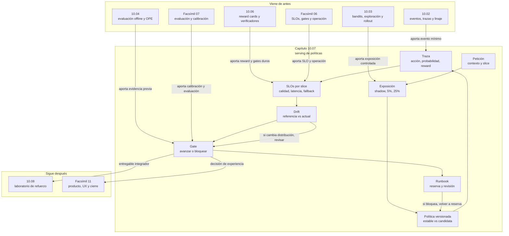

::: {.fasciculo-subtitle}
Facsímil 10 · Aprendizaje por refuerzo
:::

# Capítulo 07: Serving de políticas: monitorización, drift y cambios controlados

## La política no termina cuando pasa evaluación

Una política puede pasar evaluación offline, tener una reward card razonable y aun así comportarse mal al vivir en producción. No porque el algoritmo sea misterioso. Porque producción no es el notebook. Producción trae tráfico cambiante, latencia, herramientas que fallan, usuarios con patrones nuevos, documentos actualizados, costes, trazas incompletas y decisiones que hay que poder deshacer.

En este capítulo dejamos de mirar la política como una fórmula aislada y la miramos como un componente operativo. Una política servida no es solo \(\pi(a\mid x)\). Es \(\pi(a\mid x)\) más versión, traza, SLO, gate, feature flag, política de reserva, ventana de referencia, monitorización por slice y runbook.

Fecha de corte: 9 de junio de 2026. Para la parte de herramientas y operación hemos revisado documentación oficial de OpenTelemetry, LaunchDarkly y Evidently, y la conectamos con literatura estable sobre deuda técnica de ML, producción de modelos, SRE y drift.^[OpenTelemetry. (2026). *Documentation*. https://opentelemetry.io/docs/. Consultado el 9 de junio de 2026.]^[LaunchDarkly. (2026). *Releasing features with LaunchDarkly*. https://launchdarkly.com/docs/home/releases/releasing. Consultado el 9 de junio de 2026.]^[Evidently AI. (2026). *Data drift*. https://docs.evidentlyai.com/metrics/explainer_drift. Consultado el 9 de junio de 2026.]

La idea central:

> Una política no se publica: se sirve, se mide, se limita y se puede retirar.

## Qué no es servir una política

Servir una política no es desplegar un endpoint y mirar si responde. Eso solo comprueba que hay una ruta técnica. No comprueba si la política está tomando buenas decisiones.

Tampoco es activar una feature flag sin contrato. Una flag controla exposición; la política decide acciones. Si mezclas ambas cosas, acabas sin saber si el problema viene del rollout, del modelo, de la recompensa, del contexto, de la herramienta o de la población que recibió la variante.

Y no es monitorizar una media global. Si `reward_mean` sube pero `privacidad` baja, el sistema no está sano. Si baja la latencia porque deja de llamar a una herramienta necesaria, tampoco. Si mejora la aceptación inmediata pero aumenta fallback, quizá has movido el coste a soporte, revisión o reintentos.

Sculley et al. describieron que los sistemas de ML acumulan deuda técnica por dependencias ocultas, configuración, bucles de feedback y cambios del mundo externo.^[Sculley, D. et al. (2015). *Hidden Technical Debt in Machine Learning Systems*. *Advances in Neural Information Processing Systems, 28*. https://papers.nips.cc/paper_files/paper/2015/hash/86df7dcfd896fcaf2674f757a2463eba-Abstract.html] Breck et al. propusieron el ML Test Score como una rúbrica de preparación productiva donde las pruebas y la monitorización son parte del sistema, no un adorno final.^[Breck, E., Cai, S., Nielsen, E., Salib, M. y Sculley, D. (2017). The ML Test Score: A rubric for ML production readiness and technical debt reduction. *2017 IEEE International Conference on Big Data*, 1123-1132. https://doi.org/10.1109/BigData.2017.8258038]

La lección práctica para este capítulo: una política que no deja evidencia operativa no está lista para producción.

## Qué sí es el serving de políticas

Serving de políticas es la capa que recibe una petición, construye el contexto, elige una acción según una política versionada, ejecuta o propone esa acción, registra la decisión y aplica gates antes de aumentar exposición.

En un sistema de IA puede aparecer en muchos sitios:

| Sistema | Política | Acción |
|---|---|---|
| Routing de modelos | Elegir modelo según tarea y coste. | `small_rag_model`, `large_reasoning_model`, `local_model`. |
| RAG | Elegir estrategia de recuperación. | `top_k=4`, `top_k=12`, reranker, abstención. |
| Agente con herramientas | Elegir siguiente herramienta o parada. | Buscar, consultar base de datos, pedir aprobación. |
| Post-training | Elegir variante candidata. | Política estable o política ajustada. |
| Producto | Elegir experiencia controlada. | Mostrar respuesta directa, pedir aclaración, derivar a humano. |

El serving correcto separa cinco planos:

| Plano | Pregunta |
|---|---|
| Política | ¿Qué acción elige \(\pi\)? |
| Exposición | ¿Quién recibe la candidata y cuánto tráfico se mueve? |
| Observabilidad | ¿Qué traza, métrica y log se guardan? |
| Gate | ¿Qué condiciones permiten avanzar? |
| Recuperación | ¿Cómo volvemos a la política de reserva? |

OpenTelemetry define señales como trazas, métricas y logs para instrumentar sistemas distribuidos.^[OpenTelemetry. (2026). *Traces*. https://opentelemetry.io/docs/concepts/signals/traces/. Consultado el 9 de junio de 2026.]^[OpenTelemetry. (2026). *Metrics*. https://opentelemetry.io/docs/concepts/signals/metrics/. Consultado el 9 de junio de 2026.]^[OpenTelemetry. (2026). *Logs*. https://opentelemetry.io/docs/concepts/signals/logs/. Consultado el 9 de junio de 2026.] En IA generativa, además, la semántica de GenAI ayuda a nombrar atributos de peticiones, modelos y operaciones de generación.^[OpenTelemetry. (2026). *Semantic conventions for generative AI systems*. https://opentelemetry.io/docs/specs/semconv/gen-ai/. Consultado el 9 de junio de 2026.]

## El contrato matemático del serving

Ejemplo de fórmula: una política servida puede escribirse así para separar decisión, versión y restricciones. No es una API ni una especificación de producto; es una forma compacta de recordar qué debe viajar junto a una decisión operativa.

$$
a_t \sim \pi_{\theta, v}(a \mid x_t, c_t)
$$

| Símbolo | Significado | Ejemplo |
|---|---|---|
| \(t\) | Instante o petición. | Petición 1523 de la ventana actual. |
| \(x_t\) | Contexto de decisión. | Pregunta, usuario agregado, documentos, tarea. |
| \(c_t\) | Restricciones operativas. | Slice permitido, coste máximo, permisos, flag. |
| \(a_t\) | Acción elegida. | `large_reasoning_model`. |
| \(\pi_{\theta, v}\) | Política con parámetros \(\theta\) y versión \(v\). | `policy_candidate_v4`. |

La decisión no se guarda solo como acción. Se guarda como evento:

$$
e_t =
(x_t, a_t, p_t, r_t, g_t, v_{\pi}, v_R, s_t)
$$

| Símbolo | Significado | Ejemplo |
|---|---|---|
| \(p_t\) | Probabilidad o razón de selección. | 0,05 en un piloto al 5 %. |
| \(r_t\) | Recompensa observada o estimada. | 0,73. |
| \(g_t\) | Resultado de gates duros. | JSON válido, evidencia soportada. |
| \(v_{\pi}\) | Versión de política. | `policy_candidate_v4`. |
| \(v_R\) | Versión de reward card. | `1.0.0`. |
| \(s_t\) | Slice operativo. | `rag`, `sql`, `herramientas`. |

Después agregamos por ventana:

$$
\operatorname{SLI}_m(W)=
\frac{1}{|W|}
\sum_{e_t \in W}
h_m(e_t)
$$

| Símbolo | Significado | Ejemplo |
|---|---|---|
| \(W\) | Ventana de observación. | Últimas 12 horas. |
| \(m\) | Métrica o indicador. | `reward_mean`, `p95_latency_ms`. |
| \(h_m(e_t)\) | Función que extrae una medición del evento. | Latencia de la petición. |
| \(\operatorname{SLI}_m(W)\) | Indicador medido en la ventana. | Reward medio 0,73. |

Un SLO convierte ese indicador en objetivo:

$$
\operatorname{SLI}_m(W) \geq \operatorname{SLO}_m
$$

o, si menor es mejor:

$$
\operatorname{SLI}_m(W) \leq \operatorname{SLO}_m
$$

Google SRE insiste en separar monitorización útil, SLOs y alertas: no medimos por llenar gráficos, medimos para decidir y actuar.^[Ewaschuk, R. (2016). *Monitoring Distributed Systems*. En B. Beyer, C. Jones, J. Petoff y N. R. Murphy (eds.), *Site Reliability Engineering*. https://sre.google/sre-book/monitoring-distributed-systems/. Consultado el 9 de junio de 2026.]^[Jones, C., Wilkes, J., Murphy, N. y Smith, C. (2016). *Service Level Objectives*. En B. Beyer, C. Jones, J. Petoff y N. R. Murphy (eds.), *Site Reliability Engineering*. https://sre.google/sre-book/service-level-objectives/. Consultado el 9 de junio de 2026.]^[Wilkinson, J. (2018). *Alerting on SLOs*. En B. Beyer, N. R. Murphy, D. Rensin, K. Kawahara y S. Thorne (eds.), *The Site Reliability Workbook*. https://sre.google/workbook/alerting-on-slos/. Consultado el 9 de junio de 2026.]

En serving de políticas, el SLO no es solo disponibilidad. También hay SLOs de calidad: evidencia, reward, fallback, coste, latencia y slices.

## Drift: cuando la ventana actual ya no se parece a la referencia

Drift significa que algo relevante cambió. Puede cambiar la distribución de entradas, la mezcla de slices, la acción elegida, la recompensa, el coste, el comportamiento de herramientas o el propio verificador.

Gama et al. revisan el problema de concept drift como cambio en flujos de datos donde la relación entre entrada y objetivo evoluciona con el tiempo.^[Gama, J., Žliobaitė, I., Bifet, A., Pechenizkiy, M. y Bouchachia, A. (2014). A survey on concept drift adaptation. *ACM Computing Surveys, 46*(4), 1-37. https://doi.org/10.1145/2523813] Sugiyama et al. trataron el covariate shift como el caso donde cambia la distribución de entradas aunque la relación condicional se mantenga.^[Sugiyama, M., Krauledat, M. y Müller, K.-R. (2007). Covariate Shift Adaptation by Importance Weighted Cross Validation. *Journal of Machine Learning Research, 8*, 985-1005. https://jmlr.csail.mit.edu/papers/v8/sugiyama07a.html]

En este capítulo no queremos convertir al lector en especialista de detección de drift. Queremos que pueda mirar producción y hacerse estas preguntas:

| Tipo de drift | Qué cambia | Ejemplo |
|---|---|---|
| Drift de contexto | Cambia \(P(x)\). | Llegan más preguntas SQL que RAG. |
| Drift de acción | Cambia la mezcla de acciones. | La política llama mucho más al modelo caro. |
| Drift de recompensa | Cambia la relación entre reward y resultado real. | Sube reward, baja evidencia revisada. |
| Drift de coste | Cambia latencia, tokens o herramientas. | P95 pasa de 1900 ms a 3100 ms. |
| Drift de verificador | Cambia cómo puntúa un grader. | El verificador de citas acepta peor un nuevo formato. |
| Drift de slice | Un segmento pequeño se degrada. | `privacidad` cae mientras el global parece bien. |

Evidently documenta drift comparando una ventana de referencia con una ventana actual y aplicando métodos distintos según tipo de columna, tamaño y cardinalidad.^[Evidently AI, 2026.] La herramienta concreta puede cambiar; la idea estable no: siempre necesitas referencia, actual, métrica y criterio de decisión.

## PSI: una medida sencilla para empezar

Una métrica frecuente para comparar distribuciones discretizadas es el Population Stability Index:

$$
\operatorname{PSI}(P,Q)=
\sum_{b=1}^{B}
(q_b-p_b)\log\left(\frac{q_b}{p_b}\right)
$$

| Símbolo | Significado | Ejemplo |
|---|---|---|
| \(P\) | Distribución de referencia. | Acciones de la política estable. |
| \(Q\) | Distribución actual. | Acciones de la candidata. |
| \(b\) | Bin o categoría. | `rag`, `sql`, `herramientas`. |
| \(p_b\) | Proporción de referencia en el bin. | 0,55. |
| \(q_b\) | Proporción actual en el bin. | 0,32. |
| \(B\) | Número de bins. | 4 slices. |

El PSI no es una verdad universal. Es una alarma. Si \(Q\) se separa mucho de \(P\), toca mirar. En el kit usamos un umbral conservador de 0,20:

| PSI | Lectura práctica |
|---:|---|
| 0,00-0,10 | Cambio pequeño. |
| 0,10-0,20 | Revisar con cuidado. |
| > 0,20 | No aumentar exposición sin explicación. |

Ejemplo: si la distribución de acciones cambia de `small_rag_model` a `large_reasoning_model`, quizá el reward sube un poco, pero el coste y la latencia también. Una política candidata no puede avanzar solo porque una métrica mejore si está cambiando la forma de usar el sistema.

## El gate de rollout

Un gate de serving combina SLOs, drift, trazas y preparación de rollback:

$$
G_k =
\mathbb{1}[\text{SLI}_{\text{reward}} \geq \tau_R]
\cdot
\mathbb{1}[\text{SLI}_{\text{evidencia}} \geq \tau_E]
\cdot
\mathbb{1}[\text{p95}_{\text{latencia}} \leq \tau_L]
\cdot
\mathbb{1}[\text{PSI} \leq \tau_D]
\cdot
\mathbb{1}[\text{rollback listo}]
$$

| Símbolo | Significado | Ejemplo |
|---|---|---|
| \(G_k\) | Gate de la etapa \(k\). | Gate para `pilot_5`. |
| \(\tau_R\) | Umbral mínimo de reward. | 0,62. |
| \(\tau_E\) | Umbral mínimo de evidencia. | 0,90. |
| \(\tau_L\) | Máximo p95 de latencia. | 2500 ms. |
| \(\tau_D\) | Máximo drift aceptable. | PSI 0,20. |

Si cualquier factor vale 0, el producto vale 0. Esa es la gracia: el rollout no avanza porque una media compense un fallo operativo. No compensamos rollback no preparado con reward alto. No compensamos evidencia baja con latencia buena. No compensamos drift fuerte con una media global bonita.

Una secuencia razonable:

| Etapa | Tráfico real | Qué exige |
|---|---:|---|
| Shadow | 0 % | Trazas completas, paridad razonable, latencia medida. |
| Piloto 5 % | 5 % | SLOs por slice y política de reserva lista. |
| Piloto 25 % | 25 % | Drift bajo, coste dentro de presupuesto, revisión de soporte. |
| Piloto 50 % | 50 % | Estabilidad en varias ventanas. |
| General | 100 % | Runbook, alertas y deuda de flags revisada. |

LaunchDarkly documenta rollouts porcentuales y progresivos como forma de liberar cambios gradualmente.^[LaunchDarkly, 2026.] También advierte sobre deuda técnica de flags: una flag que controla un rollout no debe quedarse indefinidamente como residuo operativo.^[LaunchDarkly. (2026). *Reducing technical debt from feature flags*. https://launchdarkly.com/docs/guides/flags/technical-debt. Consultado el 9 de junio de 2026.]

## La anatomía de un serving defendible

<svg id="f10-c07-policy-serving" xmlns="http://www.w3.org/2000/svg" viewBox="0 0 1600 1040" role="img" aria-label="Anatomía de serving de políticas con contexto, política candidata, gates, monitorización y rollback">
  <defs>
    <marker id="f10c07-arrow" viewBox="0 0 10 10" refX="9" refY="5" markerWidth="7" markerHeight="7" orient="auto-start-reverse">
      <path d="M 0 0 L 10 5 L 0 10 z" fill="#111111"/>
    </marker>
    <pattern id="f10c07-grid" width="20" height="20" patternUnits="userSpaceOnUse">
      <path d="M20 0 L0 0 0 20" fill="none" stroke="#EEEEEE" stroke-width="1"/>
    </pattern>
  </defs>
  <rect x="24" y="24" width="1552" height="992" rx="18" fill="#FFFFFF" stroke="#111111" stroke-width="2"/>
  <text x="800" y="66" text-anchor="middle" font-family="Arial, sans-serif" font-size="26" font-weight="700">Serving de políticas: control plane + decisión + evidencia</text>
  <text x="800" y="96" text-anchor="middle" font-family="Arial, sans-serif" font-size="13" fill="#555555">La política candidata solo aumenta exposición si pasan SLOs, drift, trazas y rollback.</text>
  <rect x="58" y="126" width="1484" height="820" rx="14" fill="url(#f10c07-grid)" stroke="#DDDDDD"/>

  <g font-family="Arial, sans-serif">
    <rect x="92" y="176" width="230" height="150" rx="12" fill="#FFFFFF" stroke="#111111"/>
    <text x="207" y="208" text-anchor="middle" font-size="14" font-weight="700">Petición</text>
    <text x="207" y="234" text-anchor="middle" font-size="11" fill="#555555">contexto x_t</text>
    <text x="207" y="254" text-anchor="middle" font-size="11" fill="#555555">slice operativo</text>
    <text x="207" y="274" text-anchor="middle" font-size="11" fill="#555555">restricciones c_t</text>
    <text x="207" y="300" text-anchor="middle" font-size="11" fill="#111111">trace_id</text>

    <line x1="322" y1="251" x2="392" y2="251" stroke="#111111" stroke-width="1.3" marker-end="url(#f10c07-arrow)"/>
    <rect x="392" y="156" width="260" height="190" rx="12" fill="#FFFFFF" stroke="#111111"/>
    <text x="522" y="188" text-anchor="middle" font-size="14" font-weight="700">Control de exposición</text>
    <text x="522" y="214" text-anchor="middle" font-size="11" fill="#555555">feature flag</text>
    <text x="522" y="234" text-anchor="middle" font-size="11" fill="#555555">shadow · 5% · 25%</text>
    <text x="522" y="254" text-anchor="middle" font-size="11" fill="#555555">política estable</text>
    <text x="522" y="274" text-anchor="middle" font-size="11" fill="#555555">política candidata</text>
    <text x="522" y="306" text-anchor="middle" font-size="11" fill="#111111">a_t ~ π(a|x,c)</text>

    <line x1="652" y1="251" x2="722" y2="251" stroke="#111111" stroke-width="1.3" marker-end="url(#f10c07-arrow)"/>
    <rect x="722" y="156" width="260" height="190" rx="12" fill="#111111" stroke="#111111"/>
    <text x="852" y="188" text-anchor="middle" font-size="14" font-weight="700" fill="#FFFFFF">Gate de serving</text>
    <text x="852" y="214" text-anchor="middle" font-size="11" fill="#E8E8E8">reward >= τ_R</text>
    <text x="852" y="234" text-anchor="middle" font-size="11" fill="#E8E8E8">evidencia >= τ_E</text>
    <text x="852" y="254" text-anchor="middle" font-size="11" fill="#E8E8E8">p95 <= τ_L</text>
    <text x="852" y="274" text-anchor="middle" font-size="11" fill="#E8E8E8">PSI <= τ_D</text>
    <text x="852" y="306" text-anchor="middle" font-size="11" fill="#FFFFFF">pass / block</text>

    <line x1="982" y1="251" x2="1052" y2="251" stroke="#111111" stroke-width="1.3" marker-end="url(#f10c07-arrow)"/>
    <rect x="1052" y="156" width="260" height="190" rx="12" fill="#FFFFFF" stroke="#111111"/>
    <text x="1182" y="188" text-anchor="middle" font-size="14" font-weight="700">Ejecución</text>
    <text x="1182" y="214" text-anchor="middle" font-size="11" fill="#555555">acción elegida</text>
    <text x="1182" y="234" text-anchor="middle" font-size="11" fill="#555555">herramientas</text>
    <text x="1182" y="254" text-anchor="middle" font-size="11" fill="#555555">respuesta</text>
    <text x="1182" y="274" text-anchor="middle" font-size="11" fill="#555555">fallback si procede</text>
    <text x="1182" y="306" text-anchor="middle" font-size="11" fill="#111111">resultado observable</text>

    <path d="M852 346 C852 424 250 424 250 500" fill="none" stroke="#111111" stroke-width="1.2" marker-end="url(#f10c07-arrow)"/>
    <rect x="120" y="500" width="260" height="180" rx="12" fill="#FFFFFF" stroke="#111111"/>
    <text x="250" y="532" text-anchor="middle" font-size="14" font-weight="700">Trazas</text>
    <text x="250" y="558" text-anchor="middle" font-size="11" fill="#555555">policy_version</text>
    <text x="250" y="578" text-anchor="middle" font-size="11" fill="#555555">candidate_version</text>
    <text x="250" y="598" text-anchor="middle" font-size="11" fill="#555555">action_probability</text>
    <text x="250" y="618" text-anchor="middle" font-size="11" fill="#555555">reward_card_version</text>
    <text x="250" y="646" text-anchor="middle" font-size="11" fill="#111111">e_t completo</text>

    <line x1="380" y1="590" x2="450" y2="590" stroke="#111111" stroke-width="1.2" marker-end="url(#f10c07-arrow)"/>
    <rect x="450" y="500" width="260" height="180" rx="12" fill="#FFFFFF" stroke="#111111"/>
    <text x="580" y="532" text-anchor="middle" font-size="14" font-weight="700">Métricas por ventana</text>
    <text x="580" y="558" text-anchor="middle" font-size="11" fill="#555555">reward_mean</text>
    <text x="580" y="578" text-anchor="middle" font-size="11" fill="#555555">case_pass_rate</text>
    <text x="580" y="598" text-anchor="middle" font-size="11" fill="#555555">p95_latency_ms</text>
    <text x="580" y="618" text-anchor="middle" font-size="11" fill="#555555">fallback_rate</text>
    <text x="580" y="646" text-anchor="middle" font-size="11" fill="#111111">SLI(W)</text>

    <line x1="710" y1="590" x2="780" y2="590" stroke="#111111" stroke-width="1.2" marker-end="url(#f10c07-arrow)"/>
    <rect x="780" y="500" width="260" height="180" rx="12" fill="#FFFFFF" stroke="#111111"/>
    <text x="910" y="532" text-anchor="middle" font-size="14" font-weight="700">Drift</text>
    <text x="910" y="558" text-anchor="middle" font-size="11" fill="#555555">referencia vs actual</text>
    <text x="910" y="578" text-anchor="middle" font-size="11" fill="#555555">slice distribution</text>
    <text x="910" y="598" text-anchor="middle" font-size="11" fill="#555555">action distribution</text>
    <text x="910" y="618" text-anchor="middle" font-size="11" fill="#555555">reward delta</text>
    <text x="910" y="646" text-anchor="middle" font-size="11" fill="#111111">PSI · ΔR</text>

    <line x1="1040" y1="590" x2="1110" y2="590" stroke="#111111" stroke-width="1.2" marker-end="url(#f10c07-arrow)"/>
    <rect x="1110" y="500" width="260" height="180" rx="12" fill="#111111" stroke="#111111"/>
    <text x="1240" y="532" text-anchor="middle" font-size="14" font-weight="700" fill="#FFFFFF">Decisión</text>
    <text x="1240" y="558" text-anchor="middle" font-size="11" fill="#E8E8E8">avanzar tramo</text>
    <text x="1240" y="578" text-anchor="middle" font-size="11" fill="#E8E8E8">congelar</text>
    <text x="1240" y="598" text-anchor="middle" font-size="11" fill="#E8E8E8">volver a reserva</text>
    <text x="1240" y="618" text-anchor="middle" font-size="11" fill="#E8E8E8">abrir revisión</text>
    <text x="1240" y="646" text-anchor="middle" font-size="11" fill="#FFFFFF">runbook</text>

    <path d="M1240 500 C1240 440 1182 430 1182 346" fill="none" stroke="#111111" stroke-width="1.1" marker-end="url(#f10c07-arrow)"/>

    <rect x="292" y="790" width="1016" height="72" rx="12" fill="#F7F7F7" stroke="#111111"/>
    <text x="800" y="822" text-anchor="middle" font-size="13" font-weight="700">Regla de ingeniería</text>
    <text x="800" y="848" text-anchor="middle" font-size="12" fill="#555555">No subas tráfico a una política que no puedes medir, explicar y devolver a una versión estable.</text>
  </g>

  <text x="1518" y="974" text-anchor="end" font-family="Arial, sans-serif" font-size="11" fill="#888888">IA para gente curiosa / Facsímil 10 / Capítulo 07 / 686f6c61</text>
</svg>

## Manos a la obra

El kit real está en:

```text
labs/f10/c07-serving-politicas/
```

Ejecuta:

```bash
python3 ops/audit_policy_serving.py --write
cat output/serving_decision.md
cat output/serving_runbook.md
head -n 8 output/drift_scorecard.csv
cat output/rollout_scorecard.csv
```

Salida esperada:

```text
status=pass
blocked_slices=0
blocked_rollout_stages=0
```

Ahora ejecuta el caso que debe bloquear:

```bash
python3 ops/audit_policy_serving.py \
  --current data/current_window_bad.json \
  --plan data/release_plan_bad.json \
  --output output_bad \
  --write
cat output_bad/serving_decision.md
cat output_bad/serving_runbook.md
```

Salida esperada:

```text
status=block
blocked_slices=4
blocked_rollout_stages=3
```

El alumno debería poder explicar:

| Artefacto | Pregunta que responde |
|---|---|
| `contracts/policy_serving_contract.json` | ¿Qué SLOs, campos de traza y salidas exige el serving? |
| `data/reference_window.json` | ¿Contra qué ventana estable comparamos? |
| `data/current_window_ok.json` | ¿Qué aspecto tiene una ventana que puede avanzar? |
| `data/current_window_bad.json` | ¿Qué falla cuando la política no debe avanzar? |
| `data/release_plan.json` | ¿Cómo se aumenta tráfico y cómo se vuelve a reserva? |
| `output/serving_decision.md` | ¿Avanza o bloquea? |
| `output/drift_scorecard.csv` | ¿Qué slices cumplen o incumplen? |
| `output/rollout_scorecard.csv` | ¿Qué etapas del rollout están preparadas? |
| `output/serving_runbook.md` | ¿Qué hace el equipo si el gate bloquea? |

Esto es lo que se lleva un ingeniero: no una idea abstracta de monitorización, sino una carpeta que decide si una política puede avanzar.

## Cómo encaja todo

Lee este mapa como el cierre operativo del facsímil antes del laboratorio. Heredamos eventos y linaje del capítulo 02, exploración y rollout del 03, evaluación offline del 04 y reward cards del 06. Aquí juntamos todo en una decisión de serving: shadow, piloto, drift, SLOs, rollback y runbook.



## Vocabulario aprendido

| Término | Qué significa | Cómo lo usaría |
|---|---|---|
| Serving de políticas | Capa que ejecuta una política versionada con gates y trazas. | No confundir con un endpoint sin control operativo. |
| Política candidata | Versión que queremos probar. | `policy_candidate_v4`. |
| Política de reserva | Versión estable a la que podemos volver. | `policy_stable_v3`. |
| Shadow | Fase sin tráfico real de decisión. | La candidata recomienda, pero no decide. |
| Rollout | Aumento gradual de exposición. | 5 %, 25 %, 50 %. |
| Drift | Cambio entre referencia y actual. | Cambio de slices, acciones o reward. |
| PSI | Métrica para comparar distribuciones. | Detectar cambio de mezcla de acciones. |
| SLI | Indicador medido. | `p95_latency_ms`. |
| SLO | Objetivo del indicador. | P95 menor o igual que 2500 ms. |
| Runbook | Guía operativa de actuación. | Qué mirar y qué hacer si bloquea. |

## Dónde solía tropezar yo

| Tropiezo | Por qué ocurre | Antídoto |
|---|---|---|
| Pensar que servir es desplegar un endpoint. | La infraestructura responde. | Exigir política versionada, trazas y gate. |
| Mirar solo una media global. | Es cómoda y fácil de enseñar. | Revisar slices y casos pequeños. |
| Aumentar tráfico sin shadow. | La evaluación offline salió bien. | Pasar primero por shadow con trazas completas. |
| No tener política de reserva. | Nadie piensa en volver hasta que hace falta. | Declararla antes de abrir piloto. |
| Confundir feature flag con política. | Ambas controlan comportamiento. | La flag controla exposición; la política decide acción. |
| Medir drift sin decisión asociada. | El gráfico parece suficiente. | Definir umbral, gate y runbook. |

## Antes de pasar página

- ¿Por qué una política no termina cuando pasa evaluación offline?
- ¿Qué diferencia hay entre política, endpoint y feature flag?
- ¿Qué campos guardarías en una traza de decisión?
- ¿Qué SLOs pondrías para un router de modelos?
- ¿Por qué el drift debe mirarse por slice?
- ¿Qué mide el PSI?
- ¿Qué debería ocurrir en shadow?
- ¿Qué condiciones bloquearían un piloto al 5 %?
- ¿Qué debe contener una política de reserva?
- ¿Qué hace el runbook si el gate bloquea?

## Para saber más

Breck, E., Cai, S., Nielsen, E., Salib, M., & Sculley, D. (2017). The ML Test Score: A rubric for ML production readiness and technical debt reduction. *2017 IEEE International Conference on Big Data*, 1123-1132. https://doi.org/10.1109/BigData.2017.8258038

Evidently AI. (2026). *Data drift*. https://docs.evidentlyai.com/metrics/explainer_drift

Ewaschuk, R. (2016). *Monitoring Distributed Systems*. En B. Beyer, C. Jones, J. Petoff y N. R. Murphy (eds.), *Site Reliability Engineering*. https://sre.google/sre-book/monitoring-distributed-systems/

Gama, J., Žliobaitė, I., Bifet, A., Pechenizkiy, M., & Bouchachia, A. (2014). A survey on concept drift adaptation. *ACM Computing Surveys, 46*(4), 1-37. https://doi.org/10.1145/2523813

Jones, C., Wilkes, J., Murphy, N., & Smith, C. (2016). *Service Level Objectives*. En B. Beyer, C. Jones, J. Petoff y N. R. Murphy (eds.), *Site Reliability Engineering*. https://sre.google/sre-book/service-level-objectives/

LaunchDarkly. (2026). *Releasing features with LaunchDarkly*. https://launchdarkly.com/docs/home/releases/releasing

OpenTelemetry. (2026). *Traces*. https://opentelemetry.io/docs/concepts/signals/traces/

OpenTelemetry. (2026). *Metrics*. https://opentelemetry.io/docs/concepts/signals/metrics/

Sculley, D., Holt, G., Golovin, D., Davydov, E., Phillips, T., Ebner, D., Chaudhary, V., Young, M., Crespo, J.-F., & Dennison, D. (2015). Hidden Technical Debt in Machine Learning Systems. *Advances in Neural Information Processing Systems, 28*. https://papers.nips.cc/paper_files/paper/2015/hash/86df7dcfd896fcaf2674f757a2463eba-Abstract.html

Sugiyama, M., Krauledat, M., & Müller, K.-R. (2007). Covariate Shift Adaptation by Importance Weighted Cross Validation. *Journal of Machine Learning Research, 8*, 985-1005. https://jmlr.csail.mit.edu/papers/v8/sugiyama07a.html

## En resumen

| Idea | Qué debes recordar |
|---|---|
| Una política servida es un sistema operativo, no solo una función. | Necesita versión, trazas, SLOs, gates, exposición controlada y política de reserva. |
| El drift es una señal para decidir, no un gráfico decorativo. | Compara referencia y actual por slice, acciones y reward antes de aumentar tráfico. |
| El rollout debe ser reversible. | Shadow, pilotos y runbook importan tanto como la métrica de calidad. |
| El laboratorio del facsímil ya puede integrar todo. | Datos, reward card, política, serving y gates quedan listos para practicarse juntos. |
