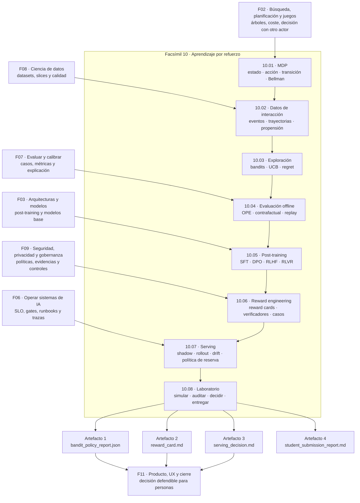

::: {.fasciculo-subtitle}
Facsímil 10 · Aprendizaje por refuerzo
:::

# Capítulo 08: Recapitulación y laboratorio de refuerzo

Un facsímil sobre aprendizaje por refuerzo no debería terminar con una frase bonita sobre agentes que aprenden. Debería terminar con una carpeta que puedas ejecutar, una política que puedas comparar, una recompensa que puedas discutir y una decisión que puedas defender.

Ese es el objetivo de este cierre. No vamos a entrenar un modelo grande. Vamos a hacer algo más controlado y mucho más útil para aprender: construir un circuito pequeño donde se vean las piezas esenciales de RL aplicado a sistemas de IA.

La pregunta final del facsímil no es:

> ¿Qué algoritmo parece más sofisticado?

La pregunta final es:

> ¿Publicarías esta política, con esta recompensa, sobre estos datos, bajo estos límites?

Si no puedes contestar eso, todavía no tienes un sistema de refuerzo. Tienes una simulación suelta.

## Qué deberías poder hacer al terminar

Este facsímil no pretende que salgas entrenando un modelo de razonamiento desde cero. Pretende algo más práctico: que puedas mirar cualquier sistema que optimiza comportamiento y preguntar qué política ejecuta, qué recompensa persigue, qué futuro ignora y qué evidencia deja.

| Resultado de aprendizaje | Evidencia de que lo sabes hacer |
|---|---|
| Formalizar una decisión secuencial. | Escribes \(S,A,P,R,\gamma\), identificas estado, acción, transición, recompensa y horizonte. |
| Leer una política como contrato operativo. | Distingues la política diseñada, la política versionada, la política servida y la política de reserva. |
| Calcular retorno y valor. | Separas recompensa inmediata, retorno descontado, valor esperado y coste de oportunidad. |
| Validar exploración. | Mides regret, coste, cobertura de acciones y límites de tráfico. |
| Diseñar recompensas con cuidado. | Detectas términos que premian señales cómodas pero equivocadas. |
| Entender post-training moderno. | Separas SFT, DPO, RLHF, RLAIF, RFT y RLVR por la señal que usan. |
| Evaluar sin desplegar a ciegas. | Usas trazas, propensión, replay, casos de prueba y gates. |
| Preparar una publicación limitada. | Defines shadow, piloto, rollback, drift, SLI, SLO y runbook. |

La idea de cierre:

> RL es ingeniería de consecuencias. No basta con que una acción parezca buena: hay que medir qué futuro abre y qué coste deja detrás.

## Lo que hemos construido

| Capítulo | Pregunta | Artefacto técnico |
|---|---|---|
| 01 | ¿Qué significa decidir por interacción? | MDP, política, retorno, valor y Bellman. |
| 02 | ¿Qué datos hacen posible aprender de interacción? | Eventos, trayectorias, linaje, propensión y replay buffer. |
| 03 | ¿Cómo aprende una política sin dejar de actuar? | Bandits, exploración, regret, UCB y límites de exposición. |
| 04 | ¿Cómo evaluaríamos sin desplegar? | Evaluación offline, contrafactual, OPE y sesgo de logging. |
| 05 | ¿Cómo se conectan preferencias y post-training? | SFT, pares de preferencia, recompensa, DPO, RLHF, RLVR. |
| 06 | ¿Cómo diseñamos recompensas defendibles? | Reward cards, verificadores, casos negativos y gates. |
| 07 | ¿Cómo vive una política en producción? | Serving, monitorización, drift, trazas y rollout. |
| 08 | ¿Cómo lo practico sin entrenar un LLM? | Simulador, auditoría, entrega reproducible y decisión de publicación. |

El patrón completo es este:

1. Definir el problema como decisión.
2. Registrar datos de interacción.
3. Comparar políticas.
4. Diseñar o auditar la recompensa.
5. Validar antes de publicar.
6. Publicar con límites.
7. Medir si el mundo cambió.

## Fórmulas mínimas que debes llevarte

Un cierre de RL sin fórmulas se queda blando. No hace falta convertir cada práctica en un paper, pero sí conviene tener una chuleta mental. Estas son las piezas que aparecen una y otra vez.

### MDP

\[
\mathcal{M} = (S, A, P, R, \gamma)
\]

| Símbolo | Lectura |
|---|---|
| \(S\) | Conjunto de estados observables o parcialmente observables. |
| \(A\) | Conjunto de acciones posibles. |
| \(P(s' \mid s,a)\) | Dinámica: probabilidad de pasar al siguiente estado. |
| \(R(s,a,s')\) | Recompensa asociada a la transición. |
| \(\gamma\) | Factor de descuento entre presente y futuro. |

La pregunta de ingeniería es: ¿de verdad tengo estado, acción, consecuencia y horizonte? Si solo tengo una clasificación aislada, quizá no necesito RL. Si tengo decisiones repetidas con consecuencias acumuladas, entonces sí empieza a oler a problema secuencial.

### Política

\[
a_t \sim \pi_{\theta,v}(a \mid s_t, c_t)
\]

La política no es una idea abstracta. En producción debería tener versión, contexto, parámetros, trazas y política de reserva. Cuando alguien dice “el sistema decidió”, un ingeniero debería poder preguntar: ¿qué versión de la política?, ¿con qué entrada?, ¿con qué probabilidad?, ¿contra qué alternativa?, ¿con qué gate?

### Retorno

\[
G_t = \sum_{k=0}^{T-t} \gamma^k r_{t+k}
\]

La recompensa inmediata puede ser buena y el retorno malo. Un sistema puede ahorrar tokens hoy y crear más trabajo mañana. Puede resolver una pregunta de forma rápida y aumentar reclamaciones. Por eso el retorno fuerza a pensar en consecuencias, no solo en el marcador del instante.

### Regret

\[
\mathrm{Regret}_T = T\mu^\* - \sum_{t=1}^{T} r_t
\]

| Símbolo | Lectura |
|---|---|
| \(T\) | Número de rondas. |
| \(\mu^\*\) | Recompensa media de la mejor acción conocida en el escenario. |
| \(r_t\) | Recompensa obtenida en la ronda \(t\). |

El regret traduce una intuición muy práctica: cuánto te ha costado aprender. Una política puede estar aprendiendo, pero si el coste de exploración es demasiado alto para el dominio, no debería exponerse igual que en una demo.

### Recompensa compuesta

\[
R(x,y) =
w_c C(x,y) +
w_e E(x,y) +
w_a A(x,y) +
w_f F(x,y) -
w_k K(x,y)
\]

| Término | Lectura en el laboratorio |
|---|---|
| \(C\) | Corrección de la respuesta. |
| \(E\) | Evidencia o cita válida. |
| \(A\) | Abstención cuando falta fuente suficiente. |
| \(F\) | Formato validable. |
| \(K\) | Coste de tokens y herramientas. |

La recompensa compuesta obliga a poner números donde antes había intención. Eso no la vuelve perfecta. La vuelve revisable.

### Gate de publicación

\[
\mathrm{gate}(\pi_v)=
\mathbf{1}[
R_{acum}\geq \tau_R
\land
\mathrm{Regret}\leq \tau_{regret}
\land
\mathrm{trazas}\geq \tau_T
\land
\mathrm{drift}\leq \tau_D
]
\]

Un gate no sustituye criterio. Lo documenta. Si una política no deja trazas, no mide regret, no tiene política de reserva o no sabe detectar drift, no está lista aunque el promedio parezca atractivo.

## Cómo encaja todo



## Anatomía del laboratorio

<figure class="svg-figure" id="f10-c08-lab-anatomia">
<svg xmlns="http://www.w3.org/2000/svg" viewBox="0 0 1600 980" role="img" aria-label="Anatomía del laboratorio de refuerzo con datos, política, recompensa, gates, serving y entrega">
  <defs>
    <marker id="f10c08-arrow" markerWidth="10" markerHeight="10" refX="8" refY="3" orient="auto" markerUnits="strokeWidth">
      <path d="M0,0 L8,3 L0,6 Z" fill="#111111"/>
    </marker>
    <pattern id="f10c08-grid" width="28" height="28" patternUnits="userSpaceOnUse">
      <path d="M28 0H0V28" fill="none" stroke="#E5E5E5" stroke-width="1"/>
    </pattern>
  </defs>

  <rect x="0" y="0" width="1600" height="980" fill="#FFFFFF"/>
  <rect x="44" y="44" width="1512" height="852" fill="url(#f10c08-grid)" stroke="#111111" stroke-width="2"/>
  <text x="800" y="88" text-anchor="middle" font-family="Arial, sans-serif" font-size="28" font-weight="700" fill="#111111">Laboratorio F10: de una política simulada a una decisión publicable</text>
  <text x="800" y="122" text-anchor="middle" font-family="Arial, sans-serif" font-size="15" fill="#555555">No gana quien obtiene un número alto: gana quien deja evidencia suficiente para publicar con límites.</text>

  <rect x="88" y="176" width="240" height="210" rx="16" fill="#FFFFFF" stroke="#111111" stroke-width="2"/>
  <rect x="88" y="176" width="240" height="44" rx="16" fill="#111111"/>
  <text x="208" y="205" text-anchor="middle" font-family="Arial, sans-serif" font-size="15" font-weight="700" fill="#FFFFFF">Datos de interacción</text>
  <text x="208" y="252" text-anchor="middle" font-family="Arial, sans-serif" font-size="14" font-weight="700" fill="#111111">bandit_rewards.json</text>
  <text x="208" y="282" text-anchor="middle" font-family="Arial, sans-serif" font-size="12" fill="#555555">rondas reproducibles</text>
  <text x="208" y="306" text-anchor="middle" font-family="Arial, sans-serif" font-size="12" fill="#555555">acciones candidatas</text>
  <text x="208" y="330" text-anchor="middle" font-family="Arial, sans-serif" font-size="12" fill="#555555">recompensa neta</text>
  <text x="208" y="354" text-anchor="middle" font-family="Arial, sans-serif" font-size="12" fill="#555555">traza por decisión</text>

  <rect x="382" y="176" width="260" height="210" rx="16" fill="#F7F7F7" stroke="#111111" stroke-width="2"/>
  <rect x="382" y="176" width="260" height="44" rx="16" fill="#111111"/>
  <text x="512" y="205" text-anchor="middle" font-family="Arial, sans-serif" font-size="15" font-weight="700" fill="#FFFFFF">Políticas comparadas</text>
  <text x="512" y="250" text-anchor="middle" font-family="Arial, sans-serif" font-size="13" fill="#111111">greedy</text>
  <text x="512" y="280" text-anchor="middle" font-family="Arial, sans-serif" font-size="13" fill="#111111">epsilon-greedy</text>
  <text x="512" y="310" text-anchor="middle" font-family="Arial, sans-serif" font-size="13" fill="#111111">UCB</text>
  <line x1="422" y1="338" x2="602" y2="338" stroke="#111111" stroke-width="1.2"/>
  <text x="512" y="364" text-anchor="middle" font-family="Arial, sans-serif" font-size="12" fill="#555555">mismo escenario, distinta regla</text>

  <rect x="696" y="176" width="260" height="210" rx="16" fill="#FFFFFF" stroke="#111111" stroke-width="2"/>
  <rect x="696" y="176" width="260" height="44" rx="16" fill="#111111"/>
  <text x="826" y="205" text-anchor="middle" font-family="Arial, sans-serif" font-size="15" font-weight="700" fill="#FFFFFF">Métricas de decisión</text>
  <text x="826" y="250" text-anchor="middle" font-family="Arial, sans-serif" font-size="13" fill="#111111">recompensa acumulada</text>
  <text x="826" y="280" text-anchor="middle" font-family="Arial, sans-serif" font-size="13" fill="#111111">regret</text>
  <text x="826" y="310" text-anchor="middle" font-family="Arial, sans-serif" font-size="13" fill="#111111">share por acción</text>
  <line x1="736" y1="338" x2="916" y2="338" stroke="#111111" stroke-width="1.2"/>
  <text x="826" y="364" text-anchor="middle" font-family="Arial, sans-serif" font-size="12" fill="#555555">decidir no es mirar una sola media</text>

  <rect x="1010" y="176" width="260" height="210" rx="16" fill="#F7F7F7" stroke="#111111" stroke-width="2"/>
  <rect x="1010" y="176" width="260" height="44" rx="16" fill="#111111"/>
  <text x="1140" y="205" text-anchor="middle" font-family="Arial, sans-serif" font-size="15" font-weight="700" fill="#FFFFFF">Reward spec</text>
  <text x="1140" y="250" text-anchor="middle" font-family="Arial, sans-serif" font-size="13" fill="#111111">correctness</text>
  <text x="1140" y="280" text-anchor="middle" font-family="Arial, sans-serif" font-size="13" fill="#111111">citation</text>
  <text x="1140" y="310" text-anchor="middle" font-family="Arial, sans-serif" font-size="13" fill="#111111">abstention</text>
  <text x="1140" y="340" text-anchor="middle" font-family="Arial, sans-serif" font-size="13" fill="#111111">format + cost</text>
  <text x="1140" y="364" text-anchor="middle" font-family="Arial, sans-serif" font-size="12" fill="#555555">la recompensa debe ser auditable</text>

  <rect x="119" y="520" width="300" height="210" rx="16" fill="#FFFFFF" stroke="#111111" stroke-width="2"/>
  <rect x="119" y="520" width="300" height="44" rx="16" fill="#111111"/>
  <text x="269" y="549" text-anchor="middle" font-family="Arial, sans-serif" font-size="15" font-weight="700" fill="#FFFFFF">Gate de laboratorio</text>
  <text x="269" y="596" text-anchor="middle" font-family="Arial, sans-serif" font-size="13" fill="#111111">reward_audit_report.json</text>
  <text x="269" y="626" text-anchor="middle" font-family="Arial, sans-serif" font-size="13" fill="#111111">ci_reward_gate.json</text>
  <text x="269" y="656" text-anchor="middle" font-family="Arial, sans-serif" font-size="13" fill="#111111">student_submission_report.md</text>
  <line x1="159" y1="680" x2="379" y2="680" stroke="#111111" stroke-width="1.2"/>
  <text x="269" y="706" text-anchor="middle" font-family="Arial, sans-serif" font-size="12" fill="#555555">si falta evidencia, la entrega no pasa</text>

  <rect x="496" y="520" width="300" height="210" rx="16" fill="#F7F7F7" stroke="#111111" stroke-width="2"/>
  <rect x="496" y="520" width="300" height="44" rx="16" fill="#111111"/>
  <text x="646" y="549" text-anchor="middle" font-family="Arial, sans-serif" font-size="15" font-weight="700" fill="#FFFFFF">Serving y control</text>
  <text x="646" y="596" text-anchor="middle" font-family="Arial, sans-serif" font-size="13" fill="#111111">shadow</text>
  <text x="646" y="626" text-anchor="middle" font-family="Arial, sans-serif" font-size="13" fill="#111111">piloto limitado</text>
  <text x="646" y="656" text-anchor="middle" font-family="Arial, sans-serif" font-size="13" fill="#111111">drift + política de reserva</text>
  <line x1="536" y1="680" x2="756" y2="680" stroke="#111111" stroke-width="1.2"/>
  <text x="646" y="706" text-anchor="middle" font-family="Arial, sans-serif" font-size="12" fill="#555555">conecta con el capítulo 07</text>

  <rect x="873" y="520" width="300" height="210" rx="16" fill="#FFFFFF" stroke="#111111" stroke-width="2"/>
  <rect x="873" y="520" width="300" height="44" rx="16" fill="#111111"/>
  <text x="1023" y="549" text-anchor="middle" font-family="Arial, sans-serif" font-size="15" font-weight="700" fill="#FFFFFF">Decisión defendible</text>
  <text x="1023" y="596" text-anchor="middle" font-family="Arial, sans-serif" font-size="13" fill="#111111">publicar</text>
  <text x="1023" y="626" text-anchor="middle" font-family="Arial, sans-serif" font-size="13" fill="#111111">limitar</text>
  <text x="1023" y="656" text-anchor="middle" font-family="Arial, sans-serif" font-size="13" fill="#111111">revisar</text>
  <line x1="913" y1="680" x2="1133" y2="680" stroke="#111111" stroke-width="1.2"/>
  <text x="1023" y="706" text-anchor="middle" font-family="Arial, sans-serif" font-size="12" fill="#555555">la salida final es una decisión</text>

  <rect x="1250" y="520" width="230" height="210" rx="16" fill="#F7F7F7" stroke="#111111" stroke-width="2"/>
  <rect x="1250" y="520" width="230" height="44" rx="16" fill="#111111"/>
  <text x="1365" y="549" text-anchor="middle" font-family="Arial, sans-serif" font-size="15" font-weight="700" fill="#FFFFFF">Entrega</text>
  <text x="1365" y="596" text-anchor="middle" font-family="Arial, sans-serif" font-size="13" fill="#111111">JSON válido</text>
  <text x="1365" y="626" text-anchor="middle" font-family="Arial, sans-serif" font-size="13" fill="#111111">Markdown legible</text>
  <text x="1365" y="656" text-anchor="middle" font-family="Arial, sans-serif" font-size="13" fill="#111111">comandos repetibles</text>
  <line x1="1284" y1="680" x2="1446" y2="680" stroke="#111111" stroke-width="1.2"/>
  <text x="1365" y="706" text-anchor="middle" font-family="Arial, sans-serif" font-size="12" fill="#555555">otra persona puede revisarlo</text>

  <line x1="328" y1="280" x2="382" y2="280" stroke="#111111" stroke-width="2" marker-end="url(#f10c08-arrow)"/>
  <line x1="642" y1="280" x2="696" y2="280" stroke="#111111" stroke-width="2" marker-end="url(#f10c08-arrow)"/>
  <line x1="956" y1="280" x2="1010" y2="280" stroke="#111111" stroke-width="2" marker-end="url(#f10c08-arrow)"/>
  <path d="M1140 386 C1140 456, 269 456, 269 520" fill="none" stroke="#111111" stroke-width="2" marker-end="url(#f10c08-arrow)"/>
  <line x1="419" y1="625" x2="496" y2="625" stroke="#111111" stroke-width="2" marker-end="url(#f10c08-arrow)"/>
  <line x1="796" y1="625" x2="873" y2="625" stroke="#111111" stroke-width="2" marker-end="url(#f10c08-arrow)"/>
  <line x1="1173" y1="625" x2="1250" y2="625" stroke="#111111" stroke-width="2" marker-end="url(#f10c08-arrow)"/>

  <rect x="248" y="802" width="1104" height="58" rx="12" fill="#111111"/>
  <text x="800" y="838" text-anchor="middle" font-family="Arial, sans-serif" font-size="15" fill="#FFFFFF">Regla práctica: una política no está terminada cuando gana en simulación; está terminada cuando puedes explicar por qué pasa o por qué se bloquea.</text>
  <text x="1510" y="928" text-anchor="end" font-family="Arial, sans-serif" font-size="12" fill="#777777">IA para gente curiosa / Facsímil 10 / Capítulo 08 / 686f6c61</text>
</svg>
<figcaption>El laboratorio une teoría, simulación, recompensa, gates y serving. La salida no es solo un score: es una decisión revisable.</figcaption>
</figure>

## Laboratorio

Un laboratorio, dentro de este libro, es una práctica guiada para llevar el temario a una carpeta ejecutable. No es un cuestionario. No es una demo que “parece funcionar”. Es una forma pequeña de practicar cómo piensa un equipo cuando una política puede afectar decisiones reales.

Aquí trabajaremos con dos retos:

| Reto | Qué practicas | Qué sale al final |
|---|---|---|
| Reto 1 | Comparar políticas bandit y decidir un piloto. | `bandit_policy_report.json`, `bandit_trace.jsonl`, `bandit_policy_decision.md`. |
| Reto 2 | Auditar una recompensa de post-training. | `reward_audit_report.json`, `reward_card.md`, `ci_reward_gate.json`. |

El laboratorio principal vive aquí:

```text
labs/f10/laboratorio-refuerzo/
```

Además, conectaremos el cierre con el kit del capítulo 07, pero como extensión operativa separada:

```text
labs/f10/c07-serving-politicas/
```

Ese kit añade la pregunta que suele faltar en prácticas demasiado académicas:

> Aunque la política gane en simulación, ¿la dejarías avanzar en serving con drift, SLO y trazas?

### Preparación

Ejecuta desde la raíz del proyecto:

```bash
cd labs/f10/laboratorio-refuerzo
python3 ops/simulate_bandit_policy.py --write
python3 ops/audit_reward_spec.py --write
python3 ops/check_student_submission.py --submission-dir solutions/reference --write --fail-on-missing
```

Después ejecuta también el gate de serving del capítulo anterior:

```bash
cd ../../..
python3 labs/f10/c07-serving-politicas/ops/audit_policy_serving.py \
  --write
python3 labs/f10/c07-serving-politicas/ops/audit_policy_serving.py \
  --current labs/f10/c07-serving-politicas/data/current_window_bad.json \
  --plan labs/f10/c07-serving-politicas/data/release_plan_bad.json \
  --output labs/f10/c07-serving-politicas/output_bad \
  --write
```

La primera ejecución representa un caso que pasa. La segunda fuerza un caso que se bloquea. Las dos son importantes: un ingeniero aprende más cuando entiende por qué un gate dice no.

## Reto 1: simular una política de routing con bandits

### Contexto

Un equipo tiene tres rutas para responder solicitudes internas:

| Ruta | Coste relativo | Uso esperado |
|---|---:|---|
| `modelo_rapido` | Bajo | Casos simples y repetitivos. |
| `modelo_fuerte` | Medio | Casos ambiguos o con más contexto. |
| `revision_humana` | Alto | Casos críticos, incompletos o poco claros. |

Queremos decidir una política inicial sin desplegarla a ciegas. Comparamos `greedy`, `epsilon_greedy` y `ucb` sobre una secuencia reproducible de recompensas.

El truco didáctico está en que todas las políticas ven el mismo escenario. Si una política gana, no gana porque los datos hayan cambiado. Gana porque su regla de exploración y explotación encaja mejor con ese escenario.

### Enunciado

1. Ejecuta el simulador.
2. Compara recompensa acumulada, regret y reparto de acciones.
3. Decide qué política pasa a piloto.
4. Especifica presupuesto de exploración.
5. Especifica política de reserva, límites de exposición y condición de parada.

### Resolución paso a paso

Ejecuta:

```bash
cd labs/f10/laboratorio-refuerzo
python3 ops/simulate_bandit_policy.py --write
cat output/bandit_policy_decision.md
python3 -m json.tool output/bandit_policy_report.json
```

Lee primero `bandit_policy_report.json`. No empieces por la conclusión en Markdown. El JSON es el contrato revisable.

Mira estos campos:

| Campo | Qué significa | Qué decisión permite |
|---|---|---|
| `gate_ok` | Si alguna política cumple los umbrales del contrato. | Si el piloto puede siquiera considerarse. |
| `selected_policy` | Política elegida por el simulador bajo el gate. | Qué candidata pasa a decisión humana. |
| `cumulative_reward` | Suma de recompensas obtenidas. | Utilidad acumulada en la ventana simulada. |
| `regret` | Coste de no haber elegido siempre la mejor acción conocida. | Coste de aprender. |
| `action_share` | Reparto de tráfico por acción. | Si una ruta costosa o sensible se usa demasiado. |
| `observed_means` | Media observada por acción. | Qué cree haber aprendido la política. |
| `true_means` | Media de referencia del escenario simulado. | Comparación didáctica, no disponible normalmente en producción. |

Después abre `bandit_trace.jsonl`. Cada línea tiene ronda, política, acción, recompensa y razón de selección. Esto importa porque una métrica agregada puede ocultar una mala secuencia de decisiones. Una política puede tener buen promedio y aun así concentrar demasiadas decisiones costosas al principio.

Una lectura profesional podría ser:

> La política seleccionada pasa a piloto limitado porque supera recompensa mínima, mantiene regret bajo, no concentra demasiada revisión humana y deja trazas suficientes. No se publica de golpe: entra en baja criticidad, con política fija de reserva y parada si el regret de ventana supera el umbral.

### Qué no vale como solución

No vale decir “gana `greedy` porque tiene más recompensa” y cerrar. Eso sería mirar una columna. Una entrega seria explica por qué esa recompensa no viene acompañada de un regret inaceptable, una ruta demasiado costosa o ausencia de trazas.

## Reto 2: auditar una recompensa para post-training verificable

### Contexto

Un equipo quiere ajustar un asistente para responder dudas de normativa interna. La tentación es premiar respuestas largas, fluidas y seguras. Esa señal es cómoda, pero puede ser peligrosa para el aprendizaje: una respuesta puede sonar completa y no estar sostenida por la fuente correcta.

Vamos a auditar una recompensa con términos explícitos:

| Término | Qué premia | Por qué importa |
|---|---|---|
| `correctness` | Respuesta correcta. | Sin exactitud no hay utilidad. |
| `citation` | Cita o evidencia que sostiene la respuesta. | Evita respuestas sin respaldo documental. |
| `abstention` | Reconocer falta de fuente suficiente. | Protege cuando el sistema no tiene evidencia. |
| `format` | Salida estructurada. | Permite validación automática. |
| `cost_per_tool` | Penalización por herramientas innecesarias. | Mantiene coste operativo controlado. |
| `cost_per_100_tokens` | Penalización por longitud. | Evita respuestas infladas cuando no aportan. |

La recompensa no describe lo que nos gustaría que pasara. Describe lo que el entrenamiento tenderá a premiar. Por eso hay que escribirla como si fuera una interfaz pública.

### Enunciado

1. Ejecuta la auditoría de recompensa.
2. Mira qué candidato gana por caso.
3. Identifica si la recompensa premia una conducta no deseada.
4. Escribe una reward card defendible.
5. Ejecuta el checker de entrega.

### Resolución paso a paso

Ejecuta:

```bash
cd labs/f10/laboratorio-refuerzo
python3 ops/audit_reward_spec.py --write
cat output/reward_card.md
python3 -m json.tool output/ci_reward_gate.json
```

Ahora revisa `reward_audit_report.json`:

| Campo | Qué mirar |
|---|---|
| `pass_rate` | Debe llegar al mínimo del contrato. En este laboratorio, todos los casos deben pasar. |
| `missing_terms` | No debería faltar corrección, cita, abstención, coste ni formato. |
| `length_bonus_present` | Debe ser falso: premiar longitud suele introducir una señal equivocada. |
| `cases[].winner` | Qué candidato gana en cada caso. |
| `cases[].case_ok` | Si el ganador coincide con el comportamiento esperado. |

El caso más importante no es el que responde bien con cita. El más revelador es el que no tiene fuente suficiente. Ahí se ve si la recompensa entiende que abstenerse puede ser una conducta correcta.

### Qué debería decir una reward card

Una reward card útil no se limita a listar pesos. Debe poder contestar:

| Pregunta | Respuesta esperada |
|---|---|
| ¿Qué comportamiento queremos inducir? | Respuestas correctas, evidenciadas, validables y con coste razonable. |
| ¿Qué comportamiento no queremos premiar? | Longitud, seguridad verbal sin fuente o ahorro de coste que degrade calidad. |
| ¿Qué casos prueban la recompensa? | Casos con fuente, sin fuente, con formato obligatorio y con coste. |
| ¿Cuándo se repite el gate? | Si cambian documentos, herramienta, modelo, formato o pesos. |
| ¿Qué no cubre todavía? | Casos raros, slices nuevos, cambios de dominio o distribución. |

Una recompensa que no puede explicar sus límites no está lista para entrenar nada importante.

## Extensión: llevarlo a serving

El laboratorio principal termina con política y reward card. Pero el facsímil ya no puede cerrar ahí, porque el capítulo 07 añadió la capa operativa. Por eso conviene ejecutar el kit de serving y comparar dos decisiones:

```bash
cd labs/f10/c07-serving-politicas
python3 ops/audit_policy_serving.py --write
cat output/serving_decision.md

python3 ops/audit_policy_serving.py \
  --current data/current_window_bad.json \
  --plan data/release_plan_bad.json \
  --output output_bad \
  --write
cat output_bad/serving_decision.md
```

La primera decisión puede avanzar. La segunda se bloquea por drift, slices bloqueados y plan incompleto. Esta diferencia es clave: un sistema maduro no solo sabe decir “sí”; sabe decir “ahora no, y estas son las pruebas”.

## Entrega esperada

La entrega final debería quedar así:

```text
rl-lab-release/
  bandit_policy_report.json
  bandit_policy_decision.md
  bandit_trace.jsonl
  reward_audit_report.json
  reward_card.md
  ci_reward_gate.json
  serving_decision.md
  serving_runbook.md
  student_submission_report.md
```

El repositorio ya incluye una solución de referencia:

```text
labs/f10/laboratorio-refuerzo/solutions/reference/
```

Y un checker:

```bash
cd labs/f10/laboratorio-refuerzo
python3 ops/check_student_submission.py \
  --submission-dir solutions/reference \
  --write \
  --fail-on-missing
```

## Rúbrica de revisión

| Criterio | Mínimo aceptable | Buena entrega | Entrega excelente |
|---|---|---|---|
| Política | Elige una política y reporta recompensa. | Justifica con regret, reparto de acciones y trazas. | Añade límites de piloto y condición de parada. |
| Recompensa | Lista términos y pesos. | Demuestra casos que pasan y casos que no deberían ganar. | Explica límites, repetición del gate y riesgos de señal. |
| Evidencia | Adjunta JSON y Markdown. | Los archivos son válidos y reproducibles. | Otra persona puede ejecutar comandos y llegar a la misma decisión. |
| Serving | Menciona rollout. | Ejecuta gate de serving y lee drift. | Compara caso que pasa y caso bloqueado con runbook. |
| Redacción técnica | Describe resultados. | Explica por qué importan. | Defiende una decisión con umbrales, trazas y próximos pasos. |

Esta rúbrica evita que el laboratorio se convierta en “he ejecutado el script y sale verde”. Ejecutar es el principio. Interpretar es el aprendizaje.

## Dónde solía tropezar yo

| Tropiezo | Por qué ocurre | Antídoto |
|---|---|---|
| Pensar que RL exige entrenar un modelo grande | La literatura impresiona. | Empezar con simulaciones pequeñas y decisiones reproducibles. |
| Confundir recompensa con métrica de dashboard | Ambas son números. | Escribir qué comportamiento induce la recompensa. |
| No medir regret | Solo miramos recompensa final. | Comparar contra la mejor acción conocida o una referencia estable. |
| Usar verificadores incompletos | Pasan rápido y dan sensación de seguridad. | Crear casos negativos, slices y cobertura mínima. |
| Olvidar la política de reserva | La política cambia con datos. | Mantener versión estable y condición de retorno. |
| Publicar por promedio | El promedio tapa slices dañados o drift. | Medir por ventana, slice y acción. |

## Vocabulario aprendido

| Término | Definición |
|---|---|
| Laboratorio de refuerzo | Práctica reproducible para simular una política, auditar una recompensa y defender una decisión. |
| Bandit | Problema donde se elige repetidamente entre acciones y se observa recompensa de la acción elegida. |
| Regret | Coste acumulado de no haber elegido siempre la mejor acción disponible bajo el escenario de referencia. |
| Reward card | Documento técnico que explica objetivo, términos, pesos, casos, límites y gates de una recompensa. |
| Gate de política | Regla ejecutable que decide si una política puede avanzar, bloquearse o quedarse en revisión. |
| Modo sombra | Ejecución sin afectar la decisión real para comparar comportamiento y trazas antes del piloto. |
| Política de reserva | Versión estable a la que se vuelve si la candidata degrada calidad, coste, trazas o seguridad. |
| Entrega reproducible | Carpeta con comandos, datos, salidas y decisión que otra persona puede ejecutar y revisar. |

## Antes de pasar página

- ¿Qué significa que RL sea ingeniería de consecuencias?
- ¿Por qué un bandit puede ser más adecuado que un MDP completo?
- ¿Qué diferencia hay entre recompensa acumulada, retorno y regret?
- ¿Qué debe contener una reward card?
- ¿Por qué RLVR depende tanto de la calidad del verificador?
- ¿Qué evidencia pedirías antes de publicar una política candidata?
- ¿Qué conexión hay entre este facsímil y producto/UX?

## Para saber más

Sutton, R. S., & Barto, A. G. (2018). *Reinforcement Learning: An Introduction* (2nd ed.). MIT Press. https://incompleteideas.net/book/the-book-2nd.html

Schulman, J., Wolski, F., Dhariwal, P., Radford, A., & Klimov, O. (2017). *Proximal Policy Optimization Algorithms*. arXiv:1707.06347. https://arxiv.org/abs/1707.06347

Ouyang, L., Wu, J., Jiang, X., Almeida, D., Wainwright, C. L., Mishkin, P., Zhang, C., Agarwal, S., Slama, K., Ray, A., Schulman, J., Hilton, J., Kelton, F., Miller, L., Simens, M., Askell, A., Welinder, P., Christiano, P., Leike, J., & Lowe, R. (2022). *Training Language Models to Follow Instructions with Human Feedback*. arXiv:2203.02155. https://arxiv.org/abs/2203.02155

Rafailov, R., Sharma, A., Mitchell, E., Ermon, S., Manning, C. D., & Finn, C. (2023). *Direct Preference Optimization: Your Language Model is Secretly a Reward Model*. arXiv:2305.18290. https://arxiv.org/abs/2305.18290

Bai, Y., Kadavath, S., Kundu, S., Askell, A., Kernion, J., Jones, A., Chen, A., Goldie, A., Mirhoseini, A., McKinnon, C., Chen, C., Olsson, C., Olah, C., Hernandez, D., Drain, D., Ganguli, D., Li, D., Tran-Johnson, E., Perez, E., ... Kaplan, J. (2022). *Constitutional AI: Harmlessness from AI Feedback*. arXiv:2212.08073. https://arxiv.org/abs/2212.08073

DeepSeek-AI, Guo, D., Yang, D., Zhang, H., Song, J., Wang, P., Zhu, Q., Xu, R., Zhang, R., Ma, S., Bi, X., Zhang, X., Yu, X., Wu, Y., Wu, Z. F., Gou, Z., Shao, Z., Li, Z., Gao, Z., Liu, A., ... Liang, W. (2025). *DeepSeek-R1: Incentivizing Reasoning Capability in LLMs via Reinforcement Learning*. arXiv:2501.12948. https://arxiv.org/abs/2501.12948

Breck, E., Cai, S., Nielsen, E., Salib, M., & Sculley, D. (2017). The ML Test Score: A rubric for ML production readiness and technical debt reduction. *2017 IEEE International Conference on Big Data*, 1123-1132. https://doi.org/10.1109/BigData.2017.8258038

Gama, J., Žliobaitė, I., Bifet, A., Pechenizkiy, M., & Bouchachia, A. (2014). A survey on concept drift adaptation. *ACM Computing Surveys, 46*(4), 1-37. https://doi.org/10.1145/2523813

Sculley, D., Holt, G., Golovin, D., Davydov, E., Phillips, T., Ebner, D., Chaudhary, V., Young, M., Crespo, J.-F., & Dennison, D. (2015). Hidden Technical Debt in Machine Learning Systems. *Advances in Neural Information Processing Systems, 28*. https://papers.nips.cc/paper_files/paper/2015/hash/86df7dcfd896fcaf2674f757a2463eba-Abstract.html

^[Sutton y Barto (2018) es la referencia de base para separar MDP, política, valor, retorno y exploración sin mezclarlo con marketing de agentes.]

^[Ouyang et al. (2022), Rafailov et al. (2023) y Bai et al. (2022) ayudan a conectar el cierre con post-training moderno: feedback humano, preferencias directas y feedback asistido por IA.]

^[Breck et al. (2017), Gama et al. (2014) y Sculley et al. (2015) sostienen la parte de operación: readiness, drift y deuda técnica en sistemas ML.]

## En resumen

| Idea | Qué debes recordar |
|---|---|
| MDP | Si no puedes definir estado, acción, transición, recompensa y descuento, quizá no tienes un problema RL formal. |
| Política | Es la regla que realmente se ejecuta, no la que aparece en una presentación. |
| Retorno | El futuro cuenta; ignorarlo crea decisiones miopes. |
| Bandits | Son útiles cuando eliges repetidamente entre opciones y puedes medir recompensa. |
| Regret | Aprender tiene coste; medirlo evita decisiones ingenuas. |
| Reward design | La recompensa es una especificación de producto e ingeniería. |
| Post-training | El método depende de la señal: ejemplos, preferencias, recompensa o verificador. |
| Serving | Una política no se publica: se expone gradualmente, se observa y se puede detener. |
| Laboratorio | La entrega buena no solo obtiene resultados; deja evidencia para que otra persona los revise. |
