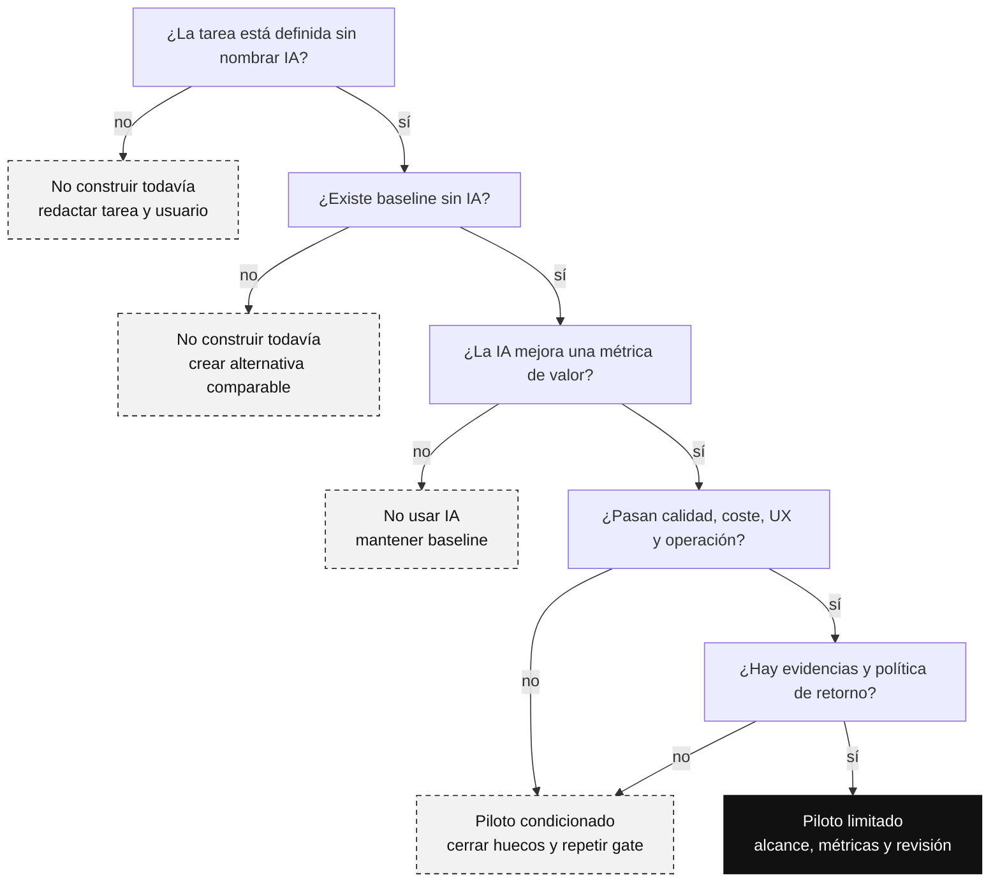
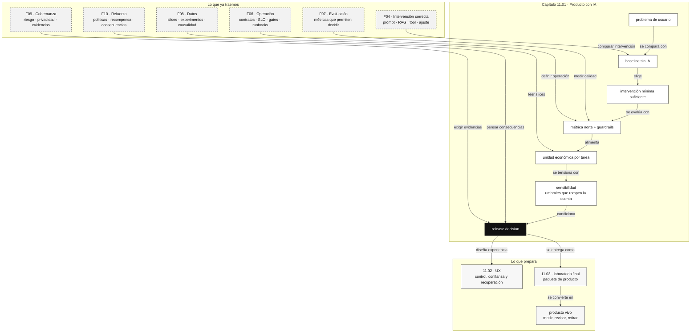

::: {.fasciculo-subtitle}
Facsímil 11 · Producto, UX y cierre
:::

# Capítulo 01: Producto con IA: problema, métrica, coste y riesgo

## El último error caro

Después de diez facsímiles, ya sabemos hablar de modelos, tokens, RAG, agentes, trazas, evaluación, datos, gobernanza y refuerzo. Ahora viene una pregunta menos vistosa, pero más decisiva: **¿merece la pena construir esta función con IA?**

Parece una pregunta de producto. En realidad es una pregunta de ingeniería. Una mala decisión de producto se convierte en deuda de arquitectura. Una promesa demasiado amplia se convierte en una evaluación imposible. Una experiencia sin límites se convierte en soporte, frustración y coste. Y una métrica bonita, si mide lo equivocado, empuja al equipo a mejorar justo lo que no debía mejorar.

Este facsímil cierra el libro porque la IA útil no empieza al elegir modelo. Empieza antes: cuando sabemos formular un problema, acotarlo, medirlo, operarlo y decidir cuándo no construir.

## Qué no es una función de IA

Una función de IA no es un botón con una palabra moderna. Tampoco es una caja de texto libre pegada a una pantalla. Y, sobre todo, no es una excusa para no diseñar el flujo normal de trabajo.

Si el usuario ya sabe exactamente qué quiere, los datos están estructurados y la respuesta correcta sale con una consulta SQL, un modelo generativo puede añadir coste y variabilidad sin aportar valor. Si la tarea exige modificar un sistema externo, necesitas permisos, contratos, trazas y política de retorno. Si el problema es que la pantalla es confusa, un asistente conversacional puede taparlo durante una demo y empeorarlo en uso real.

Un buen criterio de producto empieza comparando alternativas:

| Pregunta | Si la respuesta es sí | Posible alternativa antes de IA |
|---|---|---|
| ¿La regla cabe en una condición clara? | La lógica es determinista. | Regla, validación, flujo guiado. |
| ¿La consulta está en datos estructurados? | La verdad vive en tablas. | SQL, API, dashboard, filtro. |
| ¿La tarea es clasificar pocos casos estables? | Hay etiquetas y ejemplos. | Clasificador clásico o reglas con revisión. |
| ¿El usuario necesita decidir con evidencia? | Hay documentos o políticas. | RAG con citas y abstención. |
| ¿El valor está en actuar? | Hay sistemas externos. | Tool con permisos y contrato. |
| ¿El problema es navegar una interfaz mala? | La IA compensa fricción artificial. | Rediseño de flujo, formularios, defaults. |

La IA entra cuando su variabilidad resuelve una variabilidad real del problema: lenguaje natural, ambigüedad razonable, evidencia dispersa, síntesis, priorización, traducción entre formatos, búsqueda semántica o asistencia en tareas donde la persona conserva criterio.

## El AI-fit como contrato de producto

Llamaremos **AI-fit** al encaje entre necesidad, capacidad, evidencia y operación. No basta con que un modelo pueda producir una respuesta. Tiene que existir una razón para usar IA, una forma de medir mejora, una forma de limitar coste y una forma de mantener el sistema cuando cambien datos, modelo o usuario.

La norma ISO 9241-210 define el diseño centrado en las personas como un enfoque que considera usuarios, tareas y entornos durante el ciclo de vida de sistemas interactivos.^[International Organization for Standardization. (2019). *ISO 9241-210:2019. Ergonomics of human-system interaction -- Human-centred design for interactive systems*. https://www.iso.org/standard/77520.html. Consultado el 10 de junio de 2026.] Traducido a IA: no diseñamos “una respuesta”; diseñamos una tarea completa donde una persona entiende qué puede pedir, qué obtiene, cuándo dudar, cómo corregir y qué queda registrado.

El NIST AI RMF propone gestionar riesgos de IA durante diseño, desarrollo, despliegue y uso mediante funciones como gobernar, mapear, medir y gestionar.^[National Institute of Standards and Technology. (2023). *Artificial Intelligence Risk Management Framework (AI RMF 1.0)*. https://doi.org/10.6028/NIST.AI.100-1. Consultado el 10 de junio de 2026.] Para producto, eso significa que una idea no pasa a roadmap por sonar moderna. Pasa si podemos mapear contexto, medir calidad, gestionar límites y gobernar cambios.

El AI-fit, por tanto, tiene cinco contratos:

| Contrato | Pregunta que responde | Artefacto |
|---|---|---|
| Problema | ¿Qué tarea mejora y para quién? | Brief de producto. |
| Alternativa | ¿Qué haríamos si no usamos IA? | Baseline explícito. |
| Métrica | ¿Cómo sabremos si mejora? | Árbol de métricas y guardrails. |
| Sistema | ¿Cómo se ejecuta y se observa? | Arquitectura, trazas, SLO y gates. |
| Decisión | ¿Cuándo pilotar, limitar, retirar o no construir? | Release decision versionada. |

Si falta uno, no tenemos producto con IA. Tenemos una promesa.

## Fecha de corte y fuentes consultadas

**Fecha de corte:** 10 de junio de 2026.

Para este capítulo usamos marcos estables de diseño centrado en personas, interacción humano-IA, gestión de riesgos y experimentación de producto. Lo cambiante no es la idea de medir valor, coste y experiencia; lo cambiante son herramientas, proveedores, precios, modelos y límites de cada plataforma.

Las fuentes consultadas ese día incluyen NIST AI RMF, Microsoft HAX Toolkit y People + AI Guidebook de Google. Microsoft HAX describe herramientas para equipos que construyen productos de IA orientados a usuarios, incluyendo guías, patrones, workbook y playbook para anticipar fallos de interacción.^[Microsoft. (2026). *Human-AI eXperience Toolkit*. https://www.microsoft.com/en-us/haxtoolkit/. Consultado el 10 de junio de 2026.] Google PAIR organiza el diseño de IA alrededor de necesidades humanas, datos, modelos mentales, feedback, control y evaluación.^[Google PAIR. (2026). *People + AI Guidebook*. https://pair.withgoogle.com/guidebook/. Consultado el 10 de junio de 2026.]

El patrón común es simple y exigente: no diseñes una capacidad aislada; diseña una tarea, sus límites, su medición y su recuperación.

## De idea a decisión: una taxonomía útil

Antes de entrar en métricas, conviene clasificar la función. No es lo mismo una sugerencia que una acción. No es lo mismo buscar evidencia que modificar un expediente. Tampoco es lo mismo ayudar a redactar que cerrar una solicitud.

| Tipo de función | Qué hace | Riesgo típico | Criterio de producto |
|---|---|---|---|
| Asistencia de lectura | Resume, traduce, explica, compara. | Resumen incompleto o sin contexto. | Útil si ahorra tiempo sin esconder fuente. |
| Búsqueda sustentada | Recupera evidencia y responde con citas. | Cita débil, fuente caducada, abstención pobre. | Útil si mejora precisión frente a buscador. |
| Decisión asistida | Recomienda siguiente paso. | Confianza excesiva o sesgo por datos incompletos. | Útil si la persona conserva control. |
| Acción con tool | Consulta, calcula o modifica sistemas. | Permisos, payload incorrecto, coste operativo. | Útil solo con contrato y revisión. |
| Workflow agentic | Encadena pasos y decide orden. | Trayectoria difícil de evaluar. | Útil si el flujo variable justifica autonomía. |
| Optimización de política | Ajusta conducta por recompensa o feedback. | Recompensa mal especificada. | Útil si el objetivo y los límites son medibles. |

Esta tabla evita una trampa habitual: llamar “agente” a todo. Producto debe elegir la intervención mínima que resuelve la tarea con suficiente calidad y coste aceptable.

## Un caso completo: matrícula, normativa y respuesta sustentada

Veamos una situación concreta. Un equipo académico recibe solicitudes de matrícula con dudas repetidas: ampliaciones, pagos pendientes, plazos, excepciones y documentación que falta. El equipo quiere reducir tiempo de resolución, pero no puede perder evidencia: cada respuesta debe apoyarse en normativa vigente o en datos del expediente.

La propuesta inicial suele sonar así:

> “Pongamos un asistente de IA para resolver solicitudes.”

Eso todavía no es un producto. Es una dirección. Para convertirlo en producto tenemos que comparar alternativas, medirlas y decidir qué versión merece piloto.

| Opción | Qué construiríamos | Qué mejora | Qué puede salir mal | Decisión razonable |
|---|---|---|---|---|
| Buscador mejorado sin IA | Búsqueda textual, filtros por curso, plantillas de respuesta. | Menor coste, comportamiento estable, fácil de explicar. | La persona sigue leyendo y redactando casi todo. | Baseline obligatorio. |
| RAG con citas | Recuperar normativa, contestar con fuentes y salida estructurada. | Ahorra lectura y redacción sin perder evidencia. | Puede recuperar fuente débil o responder cuando debería abstenerse. | Buen candidato a piloto limitado. |
| Tool de cierre automático | Consultar expediente y cerrar la solicitud si parece simple. | Ahorro alto en casos repetidos. | Acción prematura, baja recuperación, peor trazabilidad si falta evidencia. | No pilotar todavía; rediseñar como propuesta revisable. |

Fíjate en la diferencia. Las tres opciones hablan del mismo problema, pero no tienen el mismo riesgo ni la misma evaluación. El buscador compite contra la IA. El RAG entra si realmente mejora tiempo y evidencia. La tool de cierre automático no se rechaza porque “la IA sea mala”; se rechaza porque la acción tiene más consecuencia que la evidencia disponible.

La primera decisión madura sería:

> Piloto limitado del RAG con citas para solicitudes con evidencia documental recuperable. Mantener buscador como baseline, no cerrar solicitudes automáticamente, registrar trazas, medir abstención y revisar casos incompletos.

Ese párrafo ya huele a producto. Tiene alcance, alternativa, intervención, límites y evidencia.

## Decisiones malas, mejores versiones

Una forma rápida de mejorar una propuesta de IA es obligarla a decir qué tarea resuelve, qué no promete y cómo se revisa. La tabla siguiente recoge patrones que aparecen mucho en proyectos reales.

| Propuesta inicial | Por qué seduce | Qué falla | Mejor versión |
|---|---|---|---|
| “Chatbot para todo el portal” | Parece flexible y fácil de vender. | No tiene tarea, métrica ni límite. | Asistente para tres tareas concretas, con rutas manuales visibles. |
| “Cerrar solicitudes automáticamente” | Ahorra mucho tiempo en una hoja de cálculo. | Mezcla recomendación y acción; exige evidencia muy fuerte. | Proponer cierre con justificación y aprobación humana. |
| “Resumen de normativa” | Demo rápida y vistosa. | Puede esconder qué fuente sostiene cada frase. | Resumen con citas, fecha de fuente y límites. |
| “Clasificar tickets con IA” | Parece barato y medible. | Si las etiquetas son malas, automatiza confusión. | Redefinir taxonomía, medir acuerdo y permitir revisión. |
| “Agente que lo haga todo” | Promete autonomía. | La trayectoria es difícil de evaluar y recuperar. | Workflow con pasos conocidos y tools autorizadas. |

Este tipo de tabla no es burocracia. Es diseño de producto en modo ingeniería: transforma una intuición en una decisión revisable.

## Ejemplo de fórmula: valor esperado de producto

Una cuenta útil para decidir no es perfecta, pero obliga a pensar. Esto es un ejemplo de fórmula de producto, no una ley universal: sirve para hacer explícitas hipótesis de valor, coste y riesgo antes de enamorarnos de una demo.

\[
VE = p_{ok}\cdot V - C_{uso} - C_{ops} - C_{riesgo}
\]

| Símbolo | Qué significa | Ejemplo |
|---|---|---|
| \(VE\) | Valor esperado por uso o por tarea. | +0,42 euros por solicitud resuelta. |
| \(p_{ok}\) | Probabilidad de resultado aceptable según eval y uso real. | 0,78 en casos de matrícula. |
| \(V\) | Valor si el resultado es aceptable. | 1,10 euros de tiempo ahorrado. |
| \(C_{uso}\) | Coste directo por inferencia, tools, almacenamiento y red. | 0,18 euros por interacción. |
| \(C_{ops}\) | Coste de operar: observabilidad, revisión, soporte y mantenimiento. | 0,12 euros por interacción estimada. |
| \(C_{riesgo}\) | Coste esperado de errores relevantes. | 0,14 euros por reintentos, escalado o corrección. |

Con números:

\[
VE = 0.78\cdot 1.10 - 0.18 - 0.12 - 0.14 = 0.418
\]

El resultado no dice “publica”. Dice: **hay margen si las hipótesis son reales**. Ahora toca probar \(p_{ok}\), revisar el coste, acotar tareas y comprobar si los errores son reversibles.

Ejemplo de fórmula: en ingeniería de producto conviene calcular el valor por slice:

\[
VE_s = p_{ok,s}\cdot V_s - C_{uso,s} - C_{ops,s} - C_{riesgo,s}
\]

| Símbolo | Qué añade |
|---|---|
| \(s\) | Segmento, slice, caso de uso o tipo de solicitud. |
| \(p_{ok,s}\) | Probabilidad de éxito en ese slice, no en promedio global. |
| \(V_s\) | Valor de resolver ese slice. |
| \(C_{riesgo,s}\) | Coste esperado si se equivoca en ese slice. |

La media global puede ocultar que el producto funciona muy bien en consultas simples y muy mal en solicitudes críticas. Esa es una lección que viene de evaluación, datos y refuerzo: las decisiones no deberían apoyarse solo en promedios cómodos.

## La unidad económica completa

El coste real de una función de IA no es el precio de una llamada al modelo. Esa llamada es una línea de una cuenta más amplia. Ejemplo de fórmula: en un producto con RAG, tools y revisión, el coste por tarea útil debería parecerse más a esto:

\[
C_{tarea} =
C_{modelo}
+ C_{retrieval}
+ C_{tools}
+ C_{obs}
+ C_{rev}
+ C_{soporte}
+ \frac{C_{mant}}{N}
\]

| Término | Qué incluye | Ejemplo por tarea |
|---|---|---:|
| \(C_{modelo}\) | Tokens de entrada, salida, razonamiento y reintentos. | 0,09 EUR |
| \(C_{retrieval}\) | Embeddings, búsqueda, reranking y almacenamiento del índice. | 0,04 EUR |
| \(C_{tools}\) | Llamadas a APIs internas o servicios externos. | 0,03 EUR |
| \(C_{obs}\) | Logs, métricas, trazas, almacenamiento y dashboards. | 0,02 EUR |
| \(C_{rev}\) | Revisión humana esperada por probabilidad de escalado. | 0,08 EUR |
| \(C_{soporte}\) | Recontactos, aclaraciones y correcciones. | 0,03 EUR |
| \(C_{mant}/N\) | Mantenimiento repartido entre tareas del periodo. | 0,02 EUR |

Con esos números:

\[
C_{tarea}=0.09+0.04+0.03+0.02+0.08+0.03+0.02=0.31
\]

Esta cifra cambia la conversación. Un asistente que parece barato por llamada puede ser caro por tarea útil si necesita demasiados reintentos, revisión o soporte. Y al revés: un modelo más caro puede ser mejor producto si reduce errores, herramientas innecesarias y revisión.

La unidad económica también debe distinguir **coste medio** y **coste de cola**. Si el 80 % de solicitudes cuesta 0,18 EUR pero el 5 % complejo cuesta 2,40 EUR por retrieval, herramientas y revisión, el promedio puede ocultar el problema operativo. Por eso el gate no debería mirar solo media: debería mirar P50, P95 y coste por slice.

## Análisis de sensibilidad: cuándo deja de compensar

Una unidad económica no está completa hasta que sabes qué variable la rompe. El número final tranquiliza demasiado: parece una verdad, pero normalmente es una mezcla de hipótesis. En un producto con IA, algunas hipótesis cambian rápido: el coste por token, el número de reintentos, la tasa de recuperación, la revisión humana, la latencia, la calidad del retrieval o el porcentaje de casos que realmente quedan resueltos.

La primera pregunta práctica es: **qué probabilidad mínima de éxito necesito para que la función tenga sentido económico**. Ejemplo de fórmula: si el valor por tarea es \(V\) y los costes completos por tarea son \(C_{uso}\), \(C_{ops}\) y \(C_{riesgo}\), el umbral mínimo queda:

\[
p_{ok,min} = \frac{C_{uso}+C_{ops}+C_{riesgo}}{V}
\]

| Símbolo | Lectura de ingeniería | Ejemplo |
|---|---|---:|
| \(V\) | Valor estimado de resolver una tarea correctamente. | 1,10 EUR |
| \(C_{uso}\) | Modelo, retrieval, tools y observabilidad. | 0,18 EUR |
| \(C_{ops}\) | Revisión humana, soporte y operación esperada. | 0,12 EUR |
| \(C_{riesgo}\) | Coste esperado de errores, correcciones o retrabajo. | 0,14 EUR |
| \(p_{ok,min}\) | Probabilidad mínima para no destruir valor. | 0,40 |

Con esos números:

\[
p_{ok,min} = \frac{0.18+0.12+0.14}{1.10}=0.40
\]

Eso no significa que 0,41 sea suficiente para publicar. Significa que por debajo de 0,40 ni siquiera aguanta la cuenta básica. En un sistema real pediríamos más margen porque las estimaciones son imperfectas, los casos no son idénticos y la cola operativa suele aparecer tarde.

Si usamos la candidata del kit `matricula_rag_assistant`, cuyo coste completo estimado es 0,31 EUR por tarea y cuyo valor por tarea es 1,10 EUR:

\[
p_{ok,min} = \frac{0.31}{1.10}=0.282
\]

La lectura correcta es: la función tiene margen económico si mantiene calidad y coste bajo control, pero todavía debe pasar guardrails de evidencia, recuperación, privacidad y operación. La unidad económica no sustituye al release gate; lo alimenta.

| Escenario | \(p_{ok}\) | Coste total | Valor esperado aproximado | Lectura |
|---|---:|---:|---:|---|
| Base medido en el kit | 0,81 | 0,31 EUR | 0,581 EUR | Hay margen para piloto limitado si pasan los guardrails. |
| Coste sube por reintentos | 0,81 | 0,55 EUR | 0,341 EUR | Sigue habiendo margen, pero hay que optimizar prompts, retrieval y tools. |
| Calidad baja en slices críticos | 0,70 | 0,31 EUR | 0,460 EUR | El promedio puede valer; los slices deciden si se publica. |
| Calidad baja y coste sube | 0,60 | 0,55 EUR | 0,110 EUR | Piloto muy condicionado o rediseño antes de escalar. |
| Escenario de ruptura | 0,50 | 0,70 EUR | -0,150 EUR | No compensa: la función consume más valor del que crea. |

Este análisis convierte una opinión en una hipótesis falsable. En vez de decir “parece útil”, el equipo puede decir: “si el coste P95 supera 0,55 EUR o \(p_{ok}\) cae por debajo de 0,70 en pagos pendientes, no escalamos”. Esa frase es ingeniería de producto: una decisión con umbral, observación y consecuencia.

## Métrica norte y guardrails

Una métrica norte es útil cuando concentra una decisión de valor. Es peligrosa cuando se vuelve el único número. Goodhart resumió el problema en política monetaria: cuando una medida se convierte en objetivo, puede dejar de ser buena medida.^[Goodhart, C. A. E. (1975). Problems of monetary management: The U.K. experience. En *Papers in Monetary Economics*. Reserve Bank of Australia. https://www.rba.gov.au/publications/confs/1975/. Consultado el 10 de junio de 2026.]

En IA pasa constantemente. Si optimizas “uso del asistente”, puedes empujar a la gente a usarlo aunque no resuelva. Si optimizas “respuestas largas”, puedes premiar texto sin evidencia. Si optimizas “menos escalados”, puedes esconder casos que deberían revisarse.

Por eso necesitamos métricas por capas:

| Capa | Métrica | Qué responde | Ejemplo de gate |
|---|---|---|---|
| Valor | Tarea completada correctamente | ¿Resuelve algo real? | >= 75 % en casos críticos del dataset. |
| Calidad | Exactitud, groundedness, abstención | ¿La respuesta está sostenida? | >= 0,85 groundedness y abstención correcta. |
| UX | Éxito de tarea, recuperación, claridad | ¿La persona puede usarlo y corregirlo? | 8 de 10 sesiones completan el flujo sin ayuda. |
| Coste | Euros por tarea útil | ¿La unidad económica aguanta? | P95 por debajo del presupuesto definido. |
| Operación | Latencia, errores, fallback | ¿Vive bien en producción? | P95 < 4 s, fallback probado. |
| Gobernanza | Evidencias, permisos, retención | ¿Podemos defenderlo? | Paquete de evidencias completo. |

Kohavi y coautores explican que los experimentos controlados en web exigen métricas bien definidas y protocolo para evitar conclusiones débiles.^[Kohavi, R., Longbotham, R., Sommerfield, D., & Henne, R. M. (2009). Controlled experiments on the web: Survey and practical guide. *Data Mining and Knowledge Discovery*, 18(1), 140-181. https://doi.org/10.1007/s10618-008-0114-1.] Las plataformas de experimentación a escala añaden otra lección: no basta con lanzar pruebas; hay que gestionar asignación, métricas, análisis, calidad de datos y comunicación de resultados.^[Gupta, S., Ulanova, L., Bhardwaj, S., Dmitriev, P., Raff, P., & Fabijan, A. (2018). The anatomy of a large-scale experimentation platform. *2018 IEEE International Conference on Software Architecture*, 1-109. https://doi.org/10.1109/ICSA.2018.00009.]

En funciones de IA esto es todavía más importante: una mejora en satisfacción puede esconder más coste, una reducción de tiempo puede esconder más errores, y una respuesta más rápida puede ser peor si el usuario pierde capacidad de recuperación.

### Métricas buenas y antimétricas

Una métrica buena representa una tarea valiosa. Una antimétrica parece útil, pero puede empujar al sistema hacia una conducta pobre. Conviene escribir ambas antes del piloto.

| Contexto | Métrica norte razonable | Antimétrica tentadora | Por qué sería peligrosa |
|---|---|---|---|
| Soporte académico | Solicitudes resueltas con evidencia suficiente y sin recontacto en 7 días. | Número de conversaciones con el asistente. | Más uso puede significar más confusión. |
| Documentación interna | Tiempo hasta encontrar respuesta validada. | Respuestas más largas. | Longitud no equivale a evidencia. |
| Ingeniería de software | Tickets clasificados correctamente con trazabilidad. | Porcentaje de tickets autoetiquetados. | Automatizar más no significa clasificar mejor. |
| RAG corporativo | Respuestas con cita válida y abstención correcta. | Top-k siempre lleno. | Recuperar más documentos puede añadir ruido. |
| Agente con tools | Tareas completadas con coste y permisos dentro de presupuesto. | Número de tools llamadas. | Más acción puede significar peor planificación. |
| Producto educativo | Alumnos que explican correctamente el concepto después de usarlo. | Minutos dentro de la herramienta. | Más tiempo puede ser atasco, no aprendizaje. |

Esta tabla debería existir en cualquier PRD serio de IA. No hace falta que sea perfecta desde el día uno; hace falta que evite optimizar lo que se mide por comodidad.

## Criterios de no construir

Una cultura sana de producto no solo sabe justificar por qué construir. Sabe justificar por qué no.

| No construir si... | Por qué |
|---|---|
| La alternativa sin IA resuelve con menor coste y menor variabilidad. | La IA no es premio por modernidad. |
| No puedes definir tarea, usuario y contexto. | No podrás evaluar ni diseñar UX. |
| No hay forma de saber si la respuesta es aceptable. | Sin evaluación, solo queda opinión. |
| La unidad económica depende de supuestos no medidos. | El coste aparece tarde y con intereses. |
| El usuario no puede corregir, rechazar o escalar. | La experiencia traslada incertidumbre a la persona. |
| Falta trazabilidad de datos, modelo, prompt o tool. | No podrás depurar ni defender decisiones. |
| El caso sensible falla por slice aunque el promedio pase. | El promedio no paga las consecuencias del caso concreto. |

El criterio de no construir debe estar escrito antes del piloto. Si lo escribimos después, será muy fácil mover la portería para salvar una idea que ya nos gusta.

### Ejemplo defendido: no pilotar el cierre automático

Volvamos al caso de matrícula. En el kit del capítulo aparece una candidata llamada `auto_close_request`: una tool que cerraría solicitudes automáticamente cuando el sistema detecta un caso simple.

Sobre el papel seduce. Tiene valor esperado alto y margen útil aparente. Pero una decisión de producto no puede quedarse en “ahorra tiempo”. En los datos del kit, esta candidata falla en éxito mínimo, groundedness, abstención, recuperación UX y evidencias obligatorias. También queda por debajo en cobertura de trazas y preparación operativa.

La decisión defendible sería:

| Capa | Lectura |
|---|---|
| Valor | Puede ahorrar tiempo, pero el éxito observado no alcanza el mínimo. |
| Calidad | Groundedness y abstención quedan por debajo del umbral. |
| UX | Si se equivoca, la persona no tiene recuperación suficiente. |
| Gobernanza | Faltan evidencias de privacidad, plan de retorno y caminos de recuperación. |
| Operación | Las trazas y preparación operativa no sostienen una acción automática. |
| Decisión | No pilotar como cierre automático. Rediseñar como “propuesta de cierre revisable”. |

Esto no es una derrota del producto. Es una decisión madura. El equipo conserva el valor de la idea, pero baja el nivel de autonomía hasta que la evidencia acompañe. En vez de “la IA cierra”, la versión razonable sería: “la IA propone cierre, muestra evidencia, explica límites y una persona confirma”.

## Plan de piloto: publicar poco para aprender bien

Un piloto no es una versión pequeña de producción. Es un experimento operacional con alcance, duración, población, métricas y condiciones de parada. Si no escribimos esas condiciones antes, el piloto se convierte en una demo larga: genera anécdotas, pero no una decisión.

Para el caso `matricula_rag_assistant`, un plan defendible podría ser:

| Elemento | Decisión concreta | Por qué importa |
|---|---|---|
| Alcance | Solicitudes con evidencia documental recuperable y sin escritura en expediente. | Reduce ambigüedad y evita mezclar acciones de distinto riesgo. |
| Duración | 2 semanas o 200 solicitudes, lo que ocurra antes. | Da volumen mínimo sin convertir el piloto en producción encubierta. |
| Población | Personal académico voluntario y usuarios internos. | Permite observar uso real con capacidad de feedback rápido. |
| Métrica norte | Solicitudes resueltas con evidencia suficiente y sin recontacto en 7 días. | Mide valor, no solo actividad. |
| Guardrails | Groundedness >= 0,85; abstención >= 0,70; recovery >= 0,75; coste <= 0,45 EUR; trace coverage >= 0,95. | Impide que una mejora aparente rompa calidad, coste u operación. |
| Criterios de parada | Dos ventanas consecutivas bajo umbral, coste P95 fuera de presupuesto, evidencias ausentes o aumento de recontactos. | Hace que parar sea una decisión profesional, no emocional. |
| Revisión | Producto, ingeniería, datos/evaluación, operación académica y privacidad. | Evita que una sola mirada confunda valor con viabilidad. |

La regla de publicación debería poder escribirse como contrato:

\[
publicar = valor\_ok \land calidad\_ok \land coste\_ok \land ux\_ok \land evidencia\_ok
\]

Y las responsabilidades deberían quedar claras:

| Rol | Responsabilidad mínima en el piloto |
|---|---|
| Producto | Definir problema, métrica norte, alcance, criterios de parada y decisión final. |
| Ingeniería | Implementar trazas, gates, coste por tarea, fallback y versión reproducible. |
| Datos / evaluación | Construir dataset de prueba, slices críticos, métricas y lectura de resultados. |
| UX | Revisar estados, copy, recuperación, confirmaciones y claridad de límites. |
| Privacidad / gobernanza | Validar permisos, retención, evidencias y revisión documental. |
| Operación / soporte | Medir recontactos, incidencias, escalados y carga real de trabajo. |

La frase “lo probamos con usuarios” se queda corta. Una versión de ingeniería sería: “lo probamos con 200 solicitudes, sin acciones automáticas, con trazas obligatorias, umbrales publicados, revisión semanal y retirada si falla calidad, coste o recuperación”. Esa diferencia cambia la conversación.

### Árbol rápido de decisión



Este árbol no sustituye al análisis. Sirve para ordenar una conversación que, de otro modo, se dispersa enseguida entre modelos, demos y deseos.

## Anatomía de una decisión de producto con IA

<figure class="svg-figure" id="f11-c01-product-ai-fit-figure">
<svg id="f11-c01-product-ai-fit" xmlns="http://www.w3.org/2000/svg" viewBox="0 0 1560 980" role="img" aria-label="Anatomía de una decisión de producto con IA">
  <defs>
    <marker id="f11c01-arrow" viewBox="0 0 10 10" refX="9" refY="5" markerWidth="7" markerHeight="7" orient="auto-start-reverse">
      <path d="M 0 0 L 10 5 L 0 10 z" fill="#111111"/>
    </marker>
    <pattern id="f11c01-grid" width="24" height="24" patternUnits="userSpaceOnUse">
      <path d="M24 0 L0 0 0 24" fill="none" stroke="#EEEEEE" stroke-width="1"/>
    </pattern>
  </defs>
  <rect x="24" y="24" width="1512" height="892" rx="18" fill="#FFFFFF" stroke="#111111" stroke-width="2"/>
  <text x="780" y="70" text-anchor="middle" font-family="Arial, sans-serif" font-size="27" font-weight="700" fill="#111111">AI-fit: decidir si una función merece IA</text>
  <text x="780" y="100" text-anchor="middle" font-family="Arial, sans-serif" font-size="14" fill="#555555">Una idea empieza como hipótesis; para publicarse debe terminar como contrato medible.</text>
  <rect x="70" y="136" width="1420" height="680" rx="14" fill="url(#f11c01-grid)" stroke="#DDDDDD"/>

  <g font-family="Arial, sans-serif">
    <rect x="106" y="174" width="220" height="102" rx="12" fill="#111111" stroke="#111111"/>
    <text x="216" y="207" text-anchor="middle" font-size="14" font-weight="700" fill="#FFFFFF">1 · Problema</text>
    <text x="216" y="232" text-anchor="middle" font-size="11" fill="#E8E8E8">usuario · tarea · contexto</text>
    <text x="216" y="252" text-anchor="middle" font-size="11" fill="#E8E8E8">dolor observable</text>

    <line x1="326" y1="225" x2="376" y2="225" stroke="#111111" stroke-width="1.4" marker-end="url(#f11c01-arrow)"/>
    <rect x="376" y="174" width="220" height="102" rx="12" fill="#FFFFFF" stroke="#111111" stroke-width="1.4"/>
    <text x="486" y="207" text-anchor="middle" font-size="14" font-weight="700">2 · Baseline</text>
    <text x="486" y="232" text-anchor="middle" font-size="11" fill="#555555">regla · SQL · UI · proceso</text>
    <text x="486" y="252" text-anchor="middle" font-size="11" fill="#555555">competidor real de la IA</text>

    <line x1="596" y1="225" x2="646" y2="225" stroke="#111111" stroke-width="1.4" marker-end="url(#f11c01-arrow)"/>
    <rect x="646" y="174" width="220" height="102" rx="12" fill="#FFFFFF" stroke="#111111" stroke-width="1.4"/>
    <text x="756" y="207" text-anchor="middle" font-size="14" font-weight="700">3 · Intervención</text>
    <text x="756" y="232" text-anchor="middle" font-size="11" fill="#555555">RAG · tool · workflow</text>
    <text x="756" y="252" text-anchor="middle" font-size="11" fill="#555555">mínima capacidad suficiente</text>

    <line x1="866" y1="225" x2="916" y2="225" stroke="#111111" stroke-width="1.4" marker-end="url(#f11c01-arrow)"/>
    <rect x="916" y="174" width="220" height="102" rx="12" fill="#FFFFFF" stroke="#111111" stroke-width="1.4"/>
    <text x="1026" y="207" text-anchor="middle" font-size="14" font-weight="700">4 · Métrica</text>
    <text x="1026" y="232" text-anchor="middle" font-size="11" fill="#555555">valor + guardrails</text>
    <text x="1026" y="252" text-anchor="middle" font-size="11" fill="#555555">por slice y por tarea</text>

    <line x1="1136" y1="225" x2="1186" y2="225" stroke="#111111" stroke-width="1.4" marker-end="url(#f11c01-arrow)"/>
    <rect x="1186" y="174" width="220" height="102" rx="12" fill="#FFFFFF" stroke="#111111" stroke-width="1.4"/>
    <text x="1296" y="207" text-anchor="middle" font-size="14" font-weight="700">5 · Release</text>
    <text x="1296" y="232" text-anchor="middle" font-size="11" fill="#555555">pilotar · limitar · parar</text>
    <text x="1296" y="252" text-anchor="middle" font-size="11" fill="#555555">decisión versionada</text>

    <rect x="136" y="372" width="260" height="142" rx="12" fill="#FFFFFF" stroke="#111111" stroke-width="1.4"/>
    <text x="266" y="406" text-anchor="middle" font-size="14" font-weight="700">Contrato de valor</text>
    <text x="266" y="434" text-anchor="middle" font-size="11" fill="#555555">qué cuenta como éxito</text>
    <text x="266" y="456" text-anchor="middle" font-size="11" fill="#555555">qué no se promete</text>
    <text x="266" y="478" text-anchor="middle" font-size="11" fill="#555555">cuándo no construir</text>

    <rect x="458" y="372" width="260" height="142" rx="12" fill="#F7F7F7" stroke="#111111" stroke-width="1.4"/>
    <text x="588" y="406" text-anchor="middle" font-size="14" font-weight="700">Contrato técnico</text>
    <text x="588" y="434" text-anchor="middle" font-size="11" fill="#555555">modelo · prompt · RAG</text>
    <text x="588" y="456" text-anchor="middle" font-size="11" fill="#555555">schema · tools · trazas</text>
    <text x="588" y="478" text-anchor="middle" font-size="11" fill="#555555">SLO y presupuesto</text>

    <rect x="780" y="372" width="260" height="142" rx="12" fill="#FFFFFF" stroke="#111111" stroke-width="1.4"/>
    <text x="910" y="406" text-anchor="middle" font-size="14" font-weight="700">Contrato UX</text>
    <text x="910" y="434" text-anchor="middle" font-size="11" fill="#555555">estados visibles</text>
    <text x="910" y="456" text-anchor="middle" font-size="11" fill="#555555">corrección y recuperación</text>
    <text x="910" y="478" text-anchor="middle" font-size="11" fill="#555555">control de la persona</text>

    <rect x="1102" y="372" width="270" height="142" rx="12" fill="#111111" stroke="#111111"/>
    <text x="1237" y="406" text-anchor="middle" font-size="14" font-weight="700" fill="#FFFFFF">Decisión</text>
    <text x="1237" y="434" text-anchor="middle" font-size="11" fill="#E8E8E8">piloto limitado</text>
    <text x="1237" y="456" text-anchor="middle" font-size="11" fill="#E8E8E8">piloto condicionado</text>
    <text x="1237" y="478" text-anchor="middle" font-size="11" fill="#E8E8E8">no construir todavía</text>

    <path d="M1296 276 C1296 330 266 330 266 372" fill="none" stroke="#111111" stroke-width="1.2" marker-end="url(#f11c01-arrow)"/>
    <line x1="396" y1="443" x2="458" y2="443" stroke="#111111" stroke-width="1.2" marker-end="url(#f11c01-arrow)"/>
    <line x1="718" y1="443" x2="780" y2="443" stroke="#111111" stroke-width="1.2" marker-end="url(#f11c01-arrow)"/>
    <line x1="1040" y1="443" x2="1102" y2="443" stroke="#111111" stroke-width="1.2" marker-end="url(#f11c01-arrow)"/>

    <rect x="190" y="626" width="1180" height="82" rx="12" fill="#FFFFFF" stroke="#111111" stroke-dasharray="7 5"/>
    <text x="780" y="660" text-anchor="middle" font-size="13" font-weight="700">Regla de cierre</text>
    <text x="780" y="685" text-anchor="middle" font-size="12" fill="#555555">Si no puedes medir valor, coste, calidad, riesgo, trazas y recuperación, la función todavía no está lista.</text>
  </g>
  <text x="1450" y="860" text-anchor="end" font-family="Arial, sans-serif" font-size="11" fill="#888888">IA para gente curiosa / Facsímil 11 / Capítulo 01 / 686f6c61</text>
</svg>
<figcaption>La decisión de producto con IA une problema, baseline, intervención, métrica, contratos y release. Sin esa cadena, la IA queda flotando.</figcaption>
</figure>

## Manos a la obra

Vamos a usar el kit real del facsímil 11 para puntuar funciones candidatas. El entregable no es una presentación: es una decisión de producto que puede revisar ingeniería.

Ruta:

```text
labs/f11/producto-ux-cierre/
```

Ejecuta:

```bash
cd labs/f11/producto-ux-cierre
python3 ops/score_product_readiness.py --write
python3 -m json.tool output/product_readiness_report.json
cat output/product_release_decision.md
cat output/metric_tree.md
cat output/unit_economics.csv
cp templates/ai_product_decision.md output/nota_de_decision.md
```

El kit compara tres candidatas:

| Candidata | Intervención | Baseline |
|---|---|---|
| `matricula_rag_assistant` | RAG con citas y salida estructurada. | Buscador de normativa + plantilla manual. |
| `auto_close_request` | Tool con escritura directa. | Regla de estado + revisión administrativa. |
| `policy_search_copilot` | Búsqueda híbrida + resumen con límites. | Buscador por palabra clave. |

La gracia del ejercicio es que una candidata puede tener margen económico aparente y aun así no pasar. Por ejemplo, cerrar solicitudes automáticamente puede ahorrar tiempo, pero si falla abstención, privacidad, UX o operación, no merece piloto. El producto no se decide por promesa; se decide por evidencia.

### Qué deberías mirar

| Archivo | Pregunta |
|---|---|
| `output/product_readiness_report.json` | ¿Qué candidata pasa, cuál queda condicionada y cuál no debería pilotarse? |
| `output/unit_economics.csv` | ¿Cuánto margen útil queda por tarea? |
| `output/metric_tree.md` | ¿Qué métrica norte y guardrails sostienen la decisión? |
| `output/product_release_decision.md` | ¿La decisión explica alcance, condiciones y bloqueos? |
| `labs/f11/producto-ux-cierre/templates/ai_product_decision.md` | ¿Puedes rellenar un PRD/ADR mínimo con criterio propio? |

### Cómo adaptarlo a tu proyecto

Cambia `data/feature_candidates.csv` con tus candidatas. Mantén una fila para la alternativa sin IA o descríbela claramente en `baseline`. Después ajusta `contracts/product_ai_release_policy.json` con tus umbrales. Si usas palabras normativas como `MUST`, `SHOULD` o `MAY`, RFC 2119 es la referencia clásica para indicar niveles de requisito en documentos técnicos.^[Bradner, S. (1997). *Key words for use in RFCs to indicate requirement levels*. RFC 2119. https://www.rfc-editor.org/rfc/rfc2119.]

Una entrega útil para clase o equipo debería contener:

```text
product-release-review/
  product_readiness_report.json
  product_release_decision.md
  metric_tree.md
  unit_economics.csv
  nota_de_decision.md
```

`nota_de_decision.md` debe responder en castellano claro:

1. Qué función merece piloto.
2. Qué alternativa sin IA compite.
3. Qué métrica norte usarías.
4. Qué guardrail bloquearía la publicación.
5. Qué análisis de sensibilidad cambia la decisión.
6. Qué plan de piloto usarías.
7. Qué condición te haría retirar la función.

La plantilla del kit no está para rellenarla mecánicamente. Está para obligarte a escribir una decisión que otra persona pueda discutir. Si no puedes completar una sección, eso no es un fallo de redacción: es una señal de producto.

## Cómo encaja todo

Este mapa responde a tres preguntas: qué hereda este capítulo, qué decisión enseña y dónde se reutiliza. La idea central es que producto no vive después de la ingeniería: define qué ingeniería merece existir.



## Vocabulario aprendido

| Término | Definición |
|---|---|
| AI-fit | Encaje medible entre problema, capacidad de IA, evidencia y operación. |
| Baseline | Alternativa sin IA contra la que debe competir la función. |
| Métrica norte | Medida principal que representa valor real para usuario o negocio. |
| Guardrail de producto | Límite que impide mejorar una métrica rompiendo otra. |
| Antimétrica | Medida que parece útil pero puede incentivar una conducta equivocada. |
| Unidad económica | Coste completo por tarea útil, incluyendo inferencia, tools, operación y revisión. |
| Análisis de sensibilidad | Revisión de qué hipótesis rompen la decisión si cambian: coste, calidad, volumen o cola operativa. |
| Plan de piloto | Contrato de alcance, duración, población, métricas, responsables y criterios de parada. |
| Slice | Segmento de casos donde la función puede comportarse distinto. |
| Criterio de no construir | Condición documentada que evita meter IA donde no aporta. |
| ADR de IA | Registro breve que justifica intervención, baseline, métricas, riesgos y decisión. |
| Release decision | Decisión versionada de pilotar, condicionar, no publicar o retirar. |

## Dónde solía tropezar yo

| Tropiezo | Por qué ocurre | Antídoto |
|---|---|---|
| Empezar por el modelo | Elegir modelo parece avanzar. | Redactar primero tarea, baseline y métrica norte. |
| Medir solo satisfacción | Es fácil preguntar si “gusta”. | Combinar valor, calidad, coste, operación y recuperación. |
| Prometer demasiado | La demo responde a casos felices. | Escribir explícitamente “no construir si...” y casos fuera de alcance. |
| Ignorar unidad económica | El coste por token parece pequeño. | Medir coste por tarea útil, no solo coste por llamada. |
| Confundir piloto con publicación | Un piloto controlado parece producción. | Definir alcance, duración, política de retorno y evidencia mínima. |
| Mirar solo el promedio | El promedio da tranquilidad. | Revisar slices críticos antes de decidir. |

## Antes de pasar página

- ¿Puedes explicar el problema sin nombrar IA?
- ¿Has escrito una alternativa sin IA que compita de verdad?
- ¿Tu métrica norte mide valor o solo uso?
- ¿Has escrito al menos una antimétrica que no quieres optimizar?
- ¿Qué guardrails evitarían optimizar una métrica equivocada?
- ¿Sabes cuánto cuesta una tarea útil completa?
- ¿Puedes separar coste por llamada, coste por tarea útil y coste de cola?
- ¿Has calculado valor esperado por slice?
- ¿Sabes qué variable rompe antes la unidad económica?
- ¿Has escrito duración, población y criterios de parada del piloto?
- ¿Quién revisa cada guardrail y quién decide si se continúa?
- ¿Tienes un criterio explícito para parar, no publicar o retirar la función?
- ¿Puedes conectar la decisión con evaluación, operación, UX y gobernanza?

## Para saber más

- Amershi, S., Weld, D., Vorvoreanu, M., Fourney, A., Nushi, B., Collisson, P., Suh, J., Iqbal, S., Bennett, P. N., Inkpen, K., Teevan, J., Kikin-Gil, R., & Horvitz, E. (2019). Guidelines for human-AI interaction. *Proceedings of the 2019 CHI Conference on Human Factors in Computing Systems*, 1-13. https://doi.org/10.1145/3290605.3300233
- Bradner, S. (1997). *Key words for use in RFCs to indicate requirement levels*. RFC 2119. https://www.rfc-editor.org/rfc/rfc2119
- Goodhart, C. A. E. (1975). Problems of monetary management: The U.K. experience. En *Papers in Monetary Economics*. Reserve Bank of Australia. https://www.rba.gov.au/publications/confs/1975/
- Google PAIR. (2026). *People + AI Guidebook*. https://pair.withgoogle.com/guidebook/
- Gupta, S., Ulanova, L., Bhardwaj, S., Dmitriev, P., Raff, P., & Fabijan, A. (2018). The anatomy of a large-scale experimentation platform. *2018 IEEE International Conference on Software Architecture*, 1-109. https://doi.org/10.1109/ICSA.2018.00009
- International Organization for Standardization. (2019). *ISO 9241-210:2019. Ergonomics of human-system interaction -- Human-centred design for interactive systems*. https://www.iso.org/standard/77520.html
- Kohavi, R., Longbotham, R., Sommerfield, D., & Henne, R. M. (2009). Controlled experiments on the web: Survey and practical guide. *Data Mining and Knowledge Discovery*, 18(1), 140-181. https://doi.org/10.1007/s10618-008-0114-1
- Microsoft. (2026). *Human-AI eXperience Toolkit*. https://www.microsoft.com/en-us/haxtoolkit/
- National Institute of Standards and Technology. (2023). *Artificial Intelligence Risk Management Framework (AI RMF 1.0)*. https://doi.org/10.6028/NIST.AI.100-1

## En resumen

| Idea | Qué debes recordar |
|---|---|
| Producto empieza antes del modelo. | La primera decisión técnica es saber qué problema merece IA y cuál es su baseline. |
| La métrica única engaña. | Necesitas valor, calidad, coste, operación, UX y gobernanza. |
| El coste real es por tarea útil. | Tokens, tools, revisión y mantenimiento forman la unidad económica. |
| La sensibilidad evita autoengaños. | Una decisión seria dice qué coste, calidad o slice la rompería. |
| Un piloto es un contrato. | Alcance, duración, población, métricas, responsables y parada van por escrito. |
| Los slices deciden más que el promedio. | Una función puede pasar globalmente y fallar donde más importa. |
| No construir también es criterio. | Un buen equipo sabe decir que la IA no encaja todavía. |
