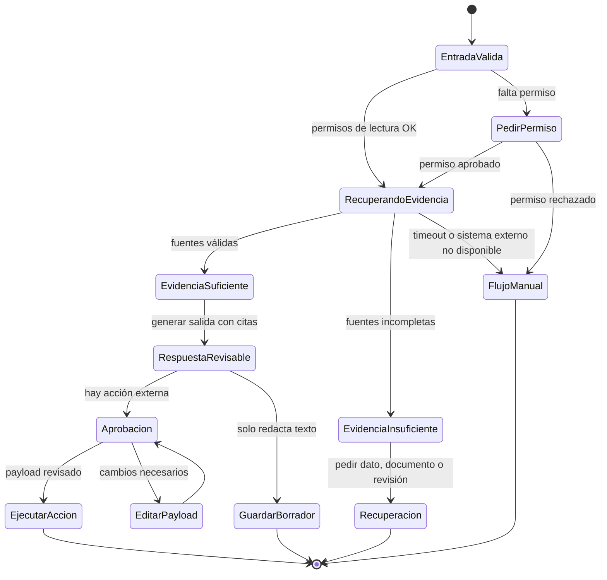
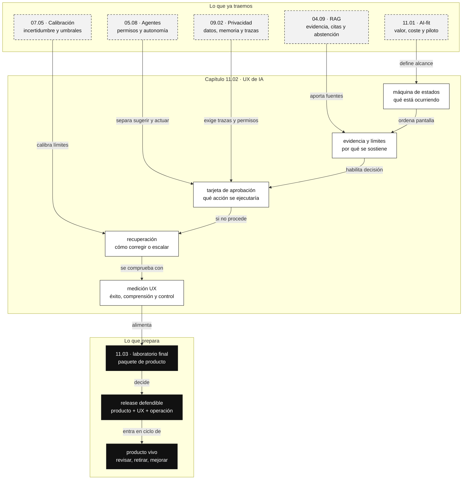

::: {.fasciculo-subtitle}
Facsímil 11 · Producto, UX y cierre
:::

# Capítulo 02: UX de IA: control, confianza, recuperación y entrega

## Una interfaz que cambia de humor no es una interfaz

La UX de un sistema de IA no empieza en el color del botón ni termina en una caja de chat. Empieza en una pregunta más concreta: cuando el sistema no está seguro, cuando tarda, cuando cita mal, cuando necesita permiso, cuando no tiene evidencia o cuando produce una salida incompleta, ¿qué ve la persona y qué puede hacer?

Un software clásico puede fallar, claro. Pero suele fallar dentro de estados más delimitados: error de red, campo obligatorio, permiso insuficiente, validación rota. Un sistema con IA introduce otro tipo de variabilidad: puede responder distinto ante entradas parecidas, puede sonar seguro sin estarlo, puede pedir una herramienta, puede abstenerse, puede necesitar revisión o puede mezclar evidencia correcta con una conclusión débil.

La UX de IA es la disciplina de hacer visible esa variabilidad sin convertir la pantalla en una tesis doctoral.

## Qué no es confianza

Confianza no significa que el usuario “crea” al sistema. Tampoco significa decorar la respuesta con una puntuación misteriosa. Y no significa enseñar todos los detalles internos como si la transparencia total fuera automáticamente útil.

Una experiencia confiable permite calibrar expectativas. La persona entiende qué puede pedir, por qué la respuesta está sustentada, qué límites tiene, qué datos se usaron, qué acción se propone y cómo corregirla. Si el sistema debe decir “no lo sé”, lo dice sin castigar al usuario. Si necesita permisos, los pide con objeto, alcance y efecto. Si hay una acción irreversible, no la ejecuta como si fuera una sugerencia de texto.

Amershi y coautores sintetizaron guías para interacción humano-IA que cubren etapas como mostrar qué puede hacer el sistema, explicar durante la interacción, permitir corrección, apoyar aprendizaje gradual y ayudar a recuperarse de errores.^[Amershi, S. et al. (2019). Guidelines for human-AI interaction. *Proceedings of the 2019 CHI Conference on Human Factors in Computing Systems*, 1-13. https://doi.org/10.1145/3290605.3300233.] Microsoft HAX convierte esas guías en herramientas de diseño como workbook, patrones y playbook para planificar comportamientos de sistemas de IA.^[Microsoft. (2026). *Human-AI eXperience Toolkit*. https://www.microsoft.com/en-us/haxtoolkit/. Consultado el 7 de junio de 2026.] Google People + AI Guidebook propone diseñar alrededor de necesidades humanas, datos, modelos mentales, feedback, control y evaluación.^[Google PAIR. (2026). *People + AI Guidebook*. https://pair.withgoogle.com/guidebook/. Consultado el 7 de junio de 2026.]

La lectura común es clara: una buena UX de IA no intenta que la IA parezca humana. Intenta que la persona pueda trabajar mejor con un sistema probabilístico.

## Estados mínimos de una experiencia con IA

Una interfaz de IA seria debe diseñar estados, no solo respuestas.

| Estado | Qué debe ver la persona | Qué debe poder hacer |
|---|---|---|
| Preparando | Qué tarea se está intentando resolver. | Cancelar o ajustar entrada. |
| Recuperando evidencia | Qué fuentes o sistemas se consultan. | Limitar, ampliar o cambiar fuente. |
| Generando | Que la salida aún no es definitiva. | Detener si el coste o tiempo no compensa. |
| Validando | Qué contrato o regla se está comprobando. | Ver motivo de fallo o repetir con cambios. |
| Resultado sustentado | Respuesta, evidencia, límites y siguiente paso. | Copiar, editar, citar, ejecutar o guardar. |
| Resultado insuficiente | Qué falta para responder bien. | Aportar dato, pedir revisión o cambiar tarea. |
| Acción pendiente | Qué acción se ejecutaría y con qué alcance. | Aprobar, editar payload, rechazar o delegar. |
| Incidencia de experiencia | Qué se rompió y qué alternativa existe. | Reintentar, usar flujo manual o contactar soporte. |

La UX se vuelve ingeniería cuando cada estado tiene entrada, salida, evento de traza, copy, acción permitida y criterio de aceptación.

## La UX como máquina de estados

Una forma práctica de diseñar UX de IA es tratar la interfaz como una máquina de estados. No porque todo tenga que ser rígido, sino porque cada estado obliga a responder preguntas verificables: qué sabe el sistema, qué no sabe, qué está intentando, qué puede hacer la persona y qué evento quedará registrado.

Un estado mínimo debería declararse así:

| Campo | Pregunta que responde | Ejemplo |
|---|---|---|
| `state_id` | ¿Qué momento de la interacción estamos nombrando? | `retrieving_evidence` |
| `entry_condition` | ¿Cuándo entra el flujo en este estado? | Hay pregunta válida y permisos de lectura. |
| `visible_copy` | ¿Qué ve la persona? | “Buscando normativa y expediente”. |
| `available_actions` | ¿Qué puede hacer ahora? | Cancelar, limitar fuente, continuar manualmente. |
| `blocked_actions` | ¿Qué no puede hacer todavía? | Cerrar caso, enviar respuesta definitiva. |
| `trace_event` | ¿Qué evento se guarda? | `ux.state.entered` con `trace_id`. |
| `exit_condition` | ¿Cuándo salimos de este estado? | Evidencia recuperada o timeout. |
| `acceptance_criteria` | ¿Cómo sabemos que está bien diseñado? | 8 de 10 usuarios entienden qué ocurre sin ayuda. |

En forma de contrato, podría verse así:

```yaml
state_id: insufficient_evidence
entry_condition: "retrieval devuelve menos de dos fuentes válidas o la fuente principal no cubre la pregunta"
visible_copy: "No tengo evidencia suficiente para responder con seguridad."
available_actions:
  - aportar_documento
  - cambiar_pregunta
  - escalar_revision
blocked_actions:
  - enviar_respuesta_final
  - cerrar_solicitud
trace_event:
  name: ux.insufficient_evidence_shown
  required_fields:
    - trace_id
    - user_role
    - missing_evidence_reason
    - retrieval_run_id
acceptance_criteria:
  - "la persona entiende qué falta"
  - "existe camino manual"
  - "la respuesta no se maquilla como certeza"
```

Esta especificación parece pequeña, pero cambia el trabajo. Ya no estamos escribiendo “hacer UX de error”. Estamos definiendo un comportamiento observable, revisable y testeable. Si mañana cambia el modelo, el contrato sigue diciendo qué debe pasar cuando la evidencia no basta.



Fíjate en la separación: **redactar**, **aprobar** y **ejecutar** no son el mismo estado. En sistemas con tools, esa separación es una línea de seguridad operativa y también una línea de UX: la persona debe saber cuándo está leyendo una sugerencia y cuándo está a punto de cambiar un sistema real.

## Calibrar confianza con números y comportamiento

La confianza se calibra con dos piezas: comportamiento del sistema y diseño visible.

Podemos modelar riesgo de experiencia de forma simple:

$$
R_{ux}=P(error)\cdot I(error)\cdot (1 - Rec)
$$

| Símbolo | Qué significa | Ejemplo |
|---|---|---|
| \(R_{ux}\) | Riesgo de experiencia. | 0,12 en un flujo revisable. |
| \(P(error)\) | Probabilidad de error observado en eval o piloto. | 0,20 respuestas incompletas. |
| \(I(error)\) | Impacto del error para la tarea. | 0,80 si afecta a decisión importante. |
| \(Rec\) | Capacidad de recuperación entre 0 y 1. | 0,25 si la persona puede corregir rápido. |

Con estos valores:

$$
R_{ux}=0.20\cdot0.80\cdot(1-0.25)=0.12
$$

El número no es una verdad física. Es una herramienta de conversación. Si aumenta la recuperación, baja el riesgo. Si aumenta el impacto, necesitas más control antes de publicar. Si no puedes estimar \(P(error)\), no tienes UX lista: tienes una pantalla esperando datos.

## Diseño de recuperación

La recuperación debe estar diseñada antes de enseñar la función. En sistemas de IA, recuperar no es solo “volver atrás”. Puede significar:

| Situación | Recuperación útil | Evidencia necesaria |
|---|---|---|
| Respuesta sin fuente suficiente | Mostrar hueco y pedir documento o permiso. | Contexto recuperado y razón de abstención. |
| JSON inválido | Reintento con schema y error visible para ingeniería. | Payload, schema, error y versión. |
| Acción con coste alto | Requerir aprobación y mostrar coste estimado. | Tool, payload, presupuesto y owner. |
| Resumen demasiado amplio | Permitir fijar secciones y nivel de detalle. | Documento original y prompt de resumen. |
| Recomendación con baja confianza | Presentar opciones y criterio, no una única salida. | Score, umbral y explicación breve. |
| Datos sensibles en entrada | Redactar, avisar y registrar política aplicada. | Política de privacidad y traza redaccionada. |

El capítulo 05 del facsímil de agentes ya trabajó permisos; el facsímil 09 trabajó privacidad y evidencias. Aquí lo unimos desde el punto de vista de la persona: no basta con que haya un control en backend; tiene que existir un camino comprensible para usarlo.

## Tarjeta de aprobación: cuando la IA propone una acción

La tarjeta de aprobación es una pieza central en productos con IA que pueden actuar. Su objetivo no es poner un botón de “aceptar”. Su objetivo es convertir una acción en una decisión informada.

Una tarjeta defendible debe responder:

| Bloque | Qué muestra | Por qué importa |
|---|---|---|
| Acción propuesta | Verbo concreto, sistema afectado y objeto. | “Enviar respuesta” no es lo mismo que “cerrar expediente”. |
| Motivo | Por qué el sistema propone esa acción. | Evita que la acción parezca autoridad automática. |
| Evidencia | Fuentes, datos y límites usados. | La persona puede comprobar antes de aprobar. |
| Payload editable | Campos que se enviarán o modificarán. | La aprobación no debe ocultar detalles técnicos. |
| Alcance | Qué cambia y qué no cambia. | Reduce malentendidos sobre efectos secundarios. |
| Coste y latencia | Tiempo estimado, coste o consumo de presupuesto. | Hace visible el impacto operativo. |
| Permisos | Qué rol puede aprobar y bajo qué política. | Conecta UX con gobernanza. |
| Recuperación | Deshacer, corregir, escalar o registrar incidencia. | La acción no queda como callejón sin salida. |

Ejemplo:

```json
{
  "approval_card": {
    "action": "enviar_respuesta_revisada",
    "system": "gestor_solicitudes",
    "object_id": "solicitud-2026-1042",
    "reason": "la normativa recuperada cubre la pregunta y el expediente contiene justificante pendiente de revisión",
    "evidence": [
      {"source": "normativa_matricula_2026", "section": "pagos_pendientes"},
      {"source": "expediente", "field": "justificante_subido"}
    ],
    "editable_payload": {
      "response_text": "Antes de cerrar la solicitud, revise el justificante subido el 03/06.",
      "next_status": "revision_humana"
    },
    "blocked_without": ["role:coordinacion_academica", "trace_id", "evidence_visible"],
    "recovery": ["editar_texto", "pedir_mas_evidencia", "escalar_revision", "cancelar"]
  }
}
```

Esta tarjeta obliga a ingeniería, producto y UX a ponerse de acuerdo. Si no sabes rellenar `system`, `object_id`, `evidence`, `editable_payload` o `blocked_without`, la acción todavía no está lista para vivir en una interfaz.

## Copy técnico: decir lo justo, no sonar seguro de más

El texto de la interfaz es parte del sistema. En IA, una frase puede calibrar o descalibrar. “He encontrado la respuesta” no significa lo mismo que “He encontrado dos fuentes que parecen sostener esta respuesta”. “No puedo ayudarte” no significa lo mismo que “Falta una fuente obligatoria para responder sin inventar”.

| Situación | Copy pobre | Copy mejor |
|---|---|---|
| Evidencia suficiente | “Respuesta generada.” | “Respuesta basada en normativa 2026 y expediente. Revísala antes de enviar.” |
| Evidencia incompleta | “No se puede responder.” | “Falta una fuente que confirme el estado del pago. Puedes adjuntarla o escalar revisión.” |
| Baja confianza | “Quizá sea correcto.” | “La evidencia recuperada no cubre toda la pregunta. Te muestro opciones, no una conclusión final.” |
| Acción externa | “Aceptar.” | “Enviar respuesta al expediente” o “Cambiar estado a revisión”. |
| Error recuperable | “Error.” | “No se pudo consultar pagos. Puedes reintentar, continuar manualmente o guardar la respuesta como pendiente.” |

El patrón es sencillo: verbo concreto, objeto concreto, límite concreto y siguiente paso concreto. En productos profesionales, el copy no debe tranquilizar artificialmente. Debe permitir decidir.

## Accesibilidad y carga cognitiva

Diseñar UX de IA también implica diseñar para personas con distintos niveles de atención, contexto, cansancio, visión, experiencia técnica o familiaridad con el sistema. WCAG 2.2 ofrece criterios de accesibilidad para contenido web, interacción por teclado, contraste, foco visible, identificación de errores y ayuda en entradas.^[World Wide Web Consortium. (2023). *Web Content Accessibility Guidelines (WCAG) 2.2*. https://www.w3.org/TR/WCAG22/. Consultado el 10 de junio de 2026.]

En IA hay una capa adicional: **carga cognitiva por incertidumbre**. La persona no solo interpreta una interfaz; interpreta un sistema que puede equivocarse con buena gramática. Por eso conviene aplicar reglas muy concretas:

| Regla | Aplicación en IA |
|---|---|
| Un estado principal por pantalla | No mezclar “generando”, “validando” y “listo” sin jerarquía visual. |
| Evidencia antes que confianza abstracta | Mostrar fuentes y límites antes que una puntuación aislada. |
| Acciones irreversibles con verbo explícito | “Cerrar expediente” mejor que “Aceptar”. |
| Foco y teclado revisados | La aprobación, edición y cancelación deben ser operables sin ratón. |
| Mensajes de error recuperables | Todo error debe ofrecer siguiente paso, no solo diagnóstico. |
| Lenguaje de límites | La abstención no debe parecer avería si es comportamiento correcto. |

La accesibilidad no es un anexo. Si una persona no puede percibir, navegar, entender o corregir la salida, el sistema no está listo.

## Medir UX en IA

El System Usability Scale (SUS), presentado por Brooke, es una escala breve y muy extendida para medir usabilidad percibida.^[Brooke, J. (1996). SUS: A quick and dirty usability scale. En P. W. Jordan, B. Thomas, B. A. Weerdmeester, & I. L. McClelland (eds.), *Usability Evaluation in Industry* (pp. 189-194). Taylor & Francis.] Estudios posteriores lo han usado y analizado en contextos comerciales y de investigación.^[Grier, R. A., Bangor, A., Kortum, P., & Peres, S. C. (2013). The System Usability Scale: beyond standard usability testing. *Proceedings of the Human Factors and Ergonomics Society Annual Meeting*, 57(1), 187-191. https://doi.org/10.1177/1541931213571042.]

Pero en IA necesitamos combinar SUS con métricas propias:

| Métrica | Qué mide | Por qué importa |
|---|---|---|
| Éxito de tarea | Si la persona logra lo que venía a hacer. | Evita medir solo satisfacción. |
| Tiempo hasta valor | Cuánto tarda en obtener algo utilizable. | La IA puede parecer útil y ser lenta. |
| Corrección recuperada | Casos donde el usuario corrige y termina bien. | Mide recuperación, no solo acierto inicial. |
| Abstención entendida | Si el usuario comprende por qué no hay respuesta. | Evita frustración ante límites sanos. |
| Acción segura | Acciones aprobadas con payload entendido. | Conecta UX con permisos y operación. |
| Confianza calibrada | Si el usuario sabe cuándo dudar. | Reduce dependencia ciega y abandono. |

Una UX buena no maximiza confianza. Maximiza **confianza merecida**.

### Protocolo de medición para una revisión UX de IA

Una revisión útil no se limita a “cinco personas lo probaron”. Debe tener escenarios, tareas, observaciones y criterios de salida.

| Pieza | Qué escribir antes de probar | Ejemplo |
|---|---|---|
| Escenario | Situación real que activa variabilidad. | Fuente incompleta, permiso pendiente, error recuperable. |
| Tarea | Acción observable que la persona debe completar. | Redactar respuesta sustentada sin cerrar expediente. |
| Señal principal | Qué demuestra que funcionó. | La persona identifica fuente, límite y siguiente paso. |
| Señal de recuperación | Qué pasa si algo no sale bien. | Cambia a flujo manual sin perder trazas. |
| Métrica | Cómo se mide. | Éxito, tiempo, clics, recuperación, comprensión, coste. |
| Criterio de salida | Qué decisión permite. | `pass`, `review`, `block`. |

Ejemplo de matriz:

| Escenario | Estado esperado | Acción de usuario | Gate |
|---|---|---|---|
| Evidencia completa | Resultado sustentado con fuentes. | Editar y guardar respuesta. | Pass si entiende fuente y límite. |
| Fuente incompleta | Abstención explicada. | Aportar documento o escalar. | Pass si no fuerza respuesta. |
| Permiso pendiente | Tarjeta de aprobación. | Revisar payload y rechazar o aprobar. | Pass si acción y efecto son inequívocos. |
| Error recuperable | Alternativa manual visible. | Reintentar o continuar manualmente. | Pass si termina tarea sin perder contexto. |
| Caso fuera de alcance | Derivación clara. | Cambiar tarea o escalar. | Pass si no se promete capacidad inexistente. |

El kit del capítulo usa exactamente esta idea: cada fila de `ux_review_sessions.csv` representa un escenario, y el script comprueba si aparecen estados, evidencia, límites, separación de acción, recuperación, accesibilidad, trazas y fallback manual.

## Anatomía de una pantalla de IA que se puede defender

<figure class="svg-figure" id="f11-c02-ux-ai-screen-figure">
<svg id="f11-c02-ux-ai-screen" xmlns="http://www.w3.org/2000/svg" viewBox="0 0 1320 900" role="img" aria-label="Anatomía de una pantalla de IA con control, evidencia y recuperación">
  <defs>
    <marker id="f11c02-arrow" viewBox="0 0 10 10" refX="9" refY="5" markerWidth="7" markerHeight="7" orient="auto-start-reverse">
      <path d="M 0 0 L 10 5 L 0 10 z" fill="#111111"/>
    </marker>
  </defs>
  <rect x="24" y="24" width="1272" height="852" rx="18" fill="#FFFFFF" stroke="#111111" stroke-width="2"/>
  <text x="660" y="64" text-anchor="middle" font-family="Arial, sans-serif" font-size="25" font-weight="700" fill="#111111">UX de IA: estados, evidencia, control y recuperación</text>
  <text x="660" y="92" text-anchor="middle" font-family="Arial, sans-serif" font-size="13" fill="#555555">La pantalla debe hacer visible lo que el sistema sabe, lo que no sabe y qué puede hacer la persona.</text>
  <g font-family="Arial, sans-serif">
    <rect x="86" y="136" width="836" height="604" rx="14" fill="#FFFFFF" stroke="#111111" stroke-width="1.6"/>
    <rect x="86" y="136" width="836" height="56" rx="14" fill="#111111"/>
    <text x="118" y="171" font-size="15" font-weight="700" fill="#FFFFFF">Asistente de revisión de expediente</text>
    <text x="890" y="171" text-anchor="end" font-size="12" fill="#E8E8E8">versión f11-demo · trazas activas</text>

    <rect x="122" y="226" width="360" height="92" rx="10" fill="#F7F7F7" stroke="#111111"/>
    <text x="142" y="254" font-size="13" font-weight="700">Estado visible</text>
    <text x="142" y="280" font-size="11" fill="#555555">Recuperando normativa y expediente</text>
    <text x="142" y="300" font-size="11" fill="#555555">2 fuentes consultadas · 1 pendiente</text>

    <rect x="522" y="226" width="360" height="92" rx="10" fill="#FFFFFF" stroke="#111111"/>
    <text x="542" y="254" font-size="13" font-weight="700">Alcance de respuesta</text>
    <text x="542" y="280" font-size="11" fill="#555555">Solo informa, no modifica expediente</text>
    <text x="542" y="300" font-size="11" fill="#555555">No sustituye revisión administrativa</text>

    <rect x="122" y="358" width="760" height="128" rx="10" fill="#FFFFFF" stroke="#111111"/>
    <text x="142" y="388" font-size="13" font-weight="700">Respuesta sustentada</text>
    <text x="142" y="416" font-size="12" fill="#111111">El pago aparece pendiente. Antes de cerrar el caso, revisa el justificante subido el 03/06.</text>
    <text x="142" y="444" font-size="11" fill="#555555">Evidencia: normativa de matrícula · expediente · registro de pagos</text>
    <text x="142" y="464" font-size="11" fill="#555555">Límite: no se ha consultado contabilidad central.</text>

    <rect x="122" y="526" width="236" height="78" rx="10" fill="#111111" stroke="#111111"/>
    <text x="240" y="557" text-anchor="middle" font-size="13" font-weight="700" fill="#FFFFFF">Editar texto</text>
    <text x="240" y="580" text-anchor="middle" font-size="11" fill="#E8E8E8">no ejecuta acciones</text>

    <rect x="382" y="526" width="236" height="78" rx="10" fill="#FFFFFF" stroke="#111111"/>
    <text x="500" y="557" text-anchor="middle" font-size="13" font-weight="700">Pedir evidencia</text>
    <text x="500" y="580" text-anchor="middle" font-size="11" fill="#555555">recuperar otra fuente</text>

    <rect x="642" y="526" width="240" height="78" rx="10" fill="#FFFFFF" stroke="#111111"/>
    <text x="762" y="557" text-anchor="middle" font-size="13" font-weight="700">Escalar revisión</text>
    <text x="762" y="580" text-anchor="middle" font-size="11" fill="#555555">con motivo y trazas</text>

    <rect x="122" y="642" width="760" height="54" rx="10" fill="#F7F7F7" stroke="#111111" stroke-dasharray="6 4"/>
    <text x="142" y="675" font-size="12" fill="#111111">Recuperación: si falta fuente, no se fuerza respuesta; se pide dato o se cambia de flujo.</text>

    <rect x="982" y="136" width="224" height="604" rx="14" fill="#F7F7F7" stroke="#111111" stroke-width="1.4"/>
    <text x="1094" y="174" text-anchor="middle" font-size="14" font-weight="700">Checklist UX</text>
    <line x1="982" y1="196" x2="1206" y2="196" stroke="#111111"/>
    <text x="1004" y="236" font-size="11" fill="#111111">✓ tarea y alcance visibles</text>
    <text x="1004" y="270" font-size="11" fill="#111111">✓ fuentes y límites visibles</text>
    <text x="1004" y="304" font-size="11" fill="#111111">✓ acción separada de texto</text>
    <text x="1004" y="338" font-size="11" fill="#111111">✓ edición antes de ejecutar</text>
    <text x="1004" y="372" font-size="11" fill="#111111">✓ fallback manual</text>
    <text x="1004" y="406" font-size="11" fill="#111111">✓ trazas para soporte</text>
    <text x="1004" y="440" font-size="11" fill="#111111">✓ copia accesible</text>
    <text x="1004" y="474" font-size="11" fill="#111111">✓ coste y latencia medidos</text>
    <path d="M982 534 C930 534 930 565 882 565" fill="none" stroke="#111111" stroke-width="1.2" marker-end="url(#f11c02-arrow)"/>
    <text x="1094" y="576" text-anchor="middle" font-size="12" font-weight="700">El checklist no es estética.</text>
    <text x="1094" y="600" text-anchor="middle" font-size="11" fill="#555555">Es criterio de publicación.</text>
  </g>
  <text x="1244" y="842" text-anchor="end" font-family="Arial, sans-serif" font-size="11" fill="#888888">IA para gente curiosa / Facsímil 11 / Capítulo 02 / 686f6c61</text>
</svg>
<figcaption>Una pantalla de IA publicable no es solo una respuesta. Es estado visible, evidencia, límites, control, recuperación y trazas.</figcaption>
</figure>

## Manos a la obra

Convierte una función de IA en un **contrato UX**:

```text
labs/f11/producto-ux-cierre/templates/ux_contract.md
ux_contract.md
states.csv
recovery_paths.csv
copy_review.md
ux_gate.json
```

Incluye:

| Pieza | Pregunta que debe responder |
|---|---|
| Estados | ¿Qué ve la persona mientras el sistema trabaja? |
| Fuentes | ¿Qué evidencia se muestra y con qué límite? |
| Permisos | ¿Qué acciones requieren aprobación o edición? |
| Recuperación | ¿Cómo corrige, repite, deshace o escala? |
| Métricas | ¿Cómo medimos éxito de tarea, tiempo, recuperación y confianza calibrada? |

En este repositorio tienes una plantilla en:

```text
labs/f11/producto-ux-cierre/templates/ux_contract.md
```

Úsala para escribir el contrato de una función concreta. Después ejecuta:

```bash
cd labs/f11/producto-ux-cierre
python3 ops/review_ux_flows.py --write
cat output/ux_decision.md
cat output/ux_release_gate.json
```

El script no decide si la pantalla es bonita. Decide si la experiencia tiene lo mínimo para publicarse: estados visibles, evidencia, límites, separación entre sugerencia y acción, recuperación, accesibilidad, trazas y fallback manual. Si el gate queda en `review`, no es un suspenso: es una lista de trabajo antes del piloto.

## Cómo encaja todo

Este mapa conecta UX con producto, RAG, agentes, evaluación y privacidad. La UX no es una capa final: es donde las decisiones técnicas se vuelven visibles para quien usa el sistema.



## Dónde solía tropezar yo

| Tropiezo | Por qué ocurre | Antídoto |
|---|---|---|
| Pensar que UX es copy final | Se deja para el final. | Diseñar estados, permisos y recuperación desde el contrato técnico. |
| Mostrar confianza como número absoluto sin contexto | Parece científico. | Explicar evidencia, límites y siguiente acción. |
| No diseñar abstención | Queremos que siempre responda. | Tratar “no hay evidencia suficiente” como un resultado válido. |
| Mezclar sugerencia y acción | El texto parece inocuo. | Separar generar, revisar, aprobar y ejecutar. |
| Medir solo SUS | SUS ayuda, pero no diagnostica todo. | Añadir éxito de tarea, recuperación, coste, latencia y trazas. |

## Vocabulario aprendido

| Término | Definición |
|---|---|
| Estado visible | Momento de la interacción que la interfaz nombra y hace comprensible. |
| Recuperación | Camino para corregir, repetir, deshacer, escalar o cambiar de flujo. |
| Confianza calibrada | Ajuste entre expectativas del usuario y capacidad real del sistema. |
| Máquina de estados UX | Especificación de estados visibles, entradas, salidas, acciones permitidas y trazas. |
| Tarjeta de aprobación | Interfaz que convierte una acción propuesta por IA en una decisión revisable. |
| Copy de límites | Texto que explica alcance, evidencia faltante o incertidumbre sin sonar más seguro de lo que es. |
| Acción pendiente | Acción que el sistema propone pero no ejecuta hasta pasar permisos y revisión. |
| Métrica UX de IA | Medida de experiencia que incluye variabilidad, límites y recuperación. |

## Antes de pasar página

- ¿Puedes enumerar los estados de tu función de IA?
- ¿La persona ve qué evidencia sostiene la respuesta?
- ¿Hay un camino claro cuando la respuesta es insuficiente?
- ¿Las acciones externas están separadas de las sugerencias?
- ¿Tienes una tarjeta de aprobación con acción, evidencia, payload y recuperación?
- ¿El copy distingue entre certeza, evidencia parcial y abstención?
- ¿Mides recuperación, no solo satisfacción?
- ¿El usuario conserva control cuando el sistema duda?

## Para saber más

- Amershi, S., Weld, D., Vorvoreanu, M., Fourney, A., Nushi, B., Collisson, P., Suh, J., Iqbal, S., Bennett, P. N., Inkpen, K., Teevan, J., Kikin-Gil, R., & Horvitz, E. (2019). Guidelines for human-AI interaction. *Proceedings of the 2019 CHI Conference on Human Factors in Computing Systems*, 1-13. https://doi.org/10.1145/3290605.3300233
- Brooke, J. (1996). SUS: A quick and dirty usability scale. En P. W. Jordan, B. Thomas, B. A. Weerdmeester, & I. L. McClelland (Eds.), *Usability Evaluation in Industry* (pp. 189-194). Taylor & Francis.
- Google PAIR. (2026). *People + AI Guidebook*. https://pair.withgoogle.com/guidebook/
- Grier, R. A., Bangor, A., Kortum, P., & Peres, S. C. (2013). The System Usability Scale: beyond standard usability testing. *Proceedings of the Human Factors and Ergonomics Society Annual Meeting*, 57(1), 187-191. https://doi.org/10.1177/1541931213571042
- International Organization for Standardization. (2019). *ISO 9241-210:2019. Ergonomics of human-system interaction -- Human-centred design for interactive systems*. https://www.iso.org/standard/77520.html
- Microsoft. (2026). *Human-AI eXperience Toolkit*. https://www.microsoft.com/en-us/haxtoolkit/
- National Institute of Standards and Technology. (2023). *Artificial Intelligence Risk Management Framework (AI RMF 1.0)*. https://doi.org/10.6028/NIST.AI.100-1
- World Wide Web Consortium. (2023). *Web Content Accessibility Guidelines (WCAG) 2.2*. https://www.w3.org/TR/WCAG22/

## En resumen

| Idea | Qué debes recordar |
|---|---|
| La UX de IA diseña variabilidad. | Estados, límites y recuperación importan tanto como la respuesta. |
| Confianza no es creer. | Es saber cuándo usar, dudar, corregir o escalar. |
| La acción necesita contrato. | Generar texto no es ejecutar una tool. |
| El copy también es ingeniería. | Verbo, objeto, límite y siguiente paso calibran mejor que una frase bonita. |
| Medir UX exige más que satisfacción. | Hay que medir éxito, recuperación, latencia, coste y comprensión. |
