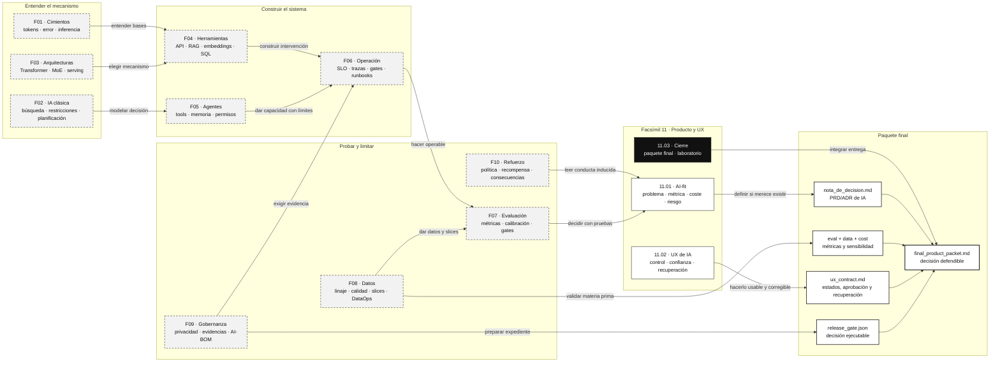

::: {.fasciculo-subtitle}
Facsímil 11 · Producto, UX y cierre
:::

# Capítulo 03: Cierre del libro y laboratorio de producto

## Qué queda cuando quitamos la novedad

Llegamos al final del volumen. Si este libro ha funcionado, la IA debería parecerte menos inexplicable y más interesante. Menos “un modelo responde” y más “un sistema con datos, contratos, herramientas, evaluación, operación, experiencia y consecuencias”. Esa diferencia no es estética: cambia cómo diseñas, cómo presupuestas, cómo publicas y cómo paras una función cuando deja de sostenerse.

El objetivo no era que memorizaras nombres. Era construir criterio. Saber cuándo una neurona artificial es una suma con activación. Saber que un token no es una palabra. Saber que una búsqueda puede necesitar heurísticas, que una herramienta necesita contrato, que un agente necesita límites, que un dataset condiciona todo, que una evaluación decide algo, que una recompensa puede torcer una conducta y que una interfaz debe ayudar a la persona a trabajar con incertidumbre.

Este cierre convierte ese criterio en una entrega final: un paquete de producto para decidir si una función de IA puede pasar a piloto. No es un ejercicio de estilo. Es una simulación pequeña de una conversación real: producto quiere publicar, ingeniería pide evidencia, datos preguntan por calidad, operación pide rollback, gobernanza pide trazas y la persona usuaria necesita una experiencia que no la deje sola ante una respuesta incierta.

La pregunta final del libro no es “¿qué modelo usarías?”. La pregunta final es más incómoda y más útil:

> ¿Publicarías esta función, en este alcance, con estas métricas, estos costes, esta UX y estas evidencias?

Si puedes responder sin esconderte en frases generales, has empezado a pensar como alguien que construye IA de verdad.

## Lo que hemos construido en el libro

| Facsímil | Qué te deja | Cómo aparece en producto |
|---|---|---|
| 01 · Cimientos | Vocabulario técnico mínimo. | No compras promesas si entiendes tokens, modelos, inferencia y error. |
| 02 · IA clásica | Estados, búsqueda, restricciones y planificación. | Puedes modelar tareas, límites y decisiones antes del LLM. |
| 03 · Arquitecturas | Transformers, atención, MoE, inferencia y modelos. | Eliges modelo por mecanismo y coste, no por fama. |
| 04 · Herramientas | APIs, RAG, embeddings, local, cloud y SQL. | Diseñas la intervención adecuada. |
| 05 · Agentes | Estado, tools, memoria, permisos y orquestación. | Separas asistencia, acción y autonomía. |
| 06 · Operación | SLO, trazas, gates, runbooks y continuidad. | Publicas sistemas que se pueden mantener. |
| 07 · Evaluación | Métricas, calibración, interpretabilidad y gates. | Decides con evidencia, no con impresiones. |
| 08 · Datos | Datasets, calidad, splits, sesgos, DataOps y experimentos. | Sabes si la materia prima sostiene la función. |
| 09 · Gobernanza | Riesgo, privacidad, cumplimiento y evidencias. | Preparas un expediente revisable. |
| 10 · Refuerzo | Política, recompensa, preferencias y consecuencias. | Mides qué conducta induce el sistema. |
| 11 · Producto y UX | AI-fit, control, recuperación y release. | Decides qué merece existir y cómo debe vivirse. |

La lectura profesional de esta tabla no es “hemos visto muchas cosas”. Es esta: cada facsímil te permite hacer una pregunta que evita publicar por entusiasmo.

| Pregunta de cierre | Dónde se aprendió | Qué evita |
|---|---|---|
| ¿El problema necesita IA o bastaba un workflow? | F04 y F11. | Construir una demo cara para una tarea simple. |
| ¿El modelo entiende el contexto o solo suena convincente? | F01, F03 y F07. | Confundir fluidez con calidad. |
| ¿La información recuperada es suficiente y verificable? | F04, F07 y F08. | Responder con documentos incompletos o mal citados. |
| ¿La tool tiene permiso real para actuar? | F05, F06 y F09. | Convertir sugerencias en cambios sin contrato. |
| ¿El sistema deja evidencias cuando falla? | F06, F07 y F09. | Depender de relatos posteriores en vez de trazas. |
| ¿La recompensa o métrica empuja una conducta indeseada? | F10 y F11. | Optimizar el número cómodo y perder el objetivo. |
| ¿La persona puede entender, corregir y recuperar? | F11. | Diseñar una interfaz que parece inteligente pero no ayuda. |

## Fecha de corte y fuentes consultadas

**Fecha de corte:** 7 de junio de 2026.

Este cierre usa marcos de diseño centrado en personas, interacción humano-IA, evaluación de producto y gestión de riesgos: ISO 9241-210, guías de Amershi et al., Microsoft HAX, People + AI Guidebook de Google, NIST AI RMF y literatura sobre experimentación controlada.^[International Organization for Standardization. (2019). *ISO 9241-210:2019*. https://www.iso.org/standard/77520.html. Consultado el 7 de junio de 2026.]^[Amershi, S. et al. (2019). Guidelines for human-AI interaction. *Proceedings of CHI 2019*, 1-13. https://doi.org/10.1145/3290605.3300233.]^[Microsoft. (2026). *Human-AI eXperience Toolkit*. https://www.microsoft.com/en-us/haxtoolkit/. Consultado el 7 de junio de 2026.]^[Google PAIR. (2026). *People + AI Guidebook*. https://pair.withgoogle.com/guidebook/. Consultado el 7 de junio de 2026.]^[National Institute of Standards and Technology. (2023). *Artificial Intelligence Risk Management Framework (AI RMF 1.0)*. https://doi.org/10.6028/NIST.AI.100-1. Consultado el 7 de junio de 2026.]^[Kohavi, R. et al. (2009). Controlled experiments on the web. *Data Mining and Knowledge Discovery*, 18(1), 140-181. https://doi.org/10.1007/s10618-008-0114-1.]

También toma una lección de las plataformas de experimentación: una decisión de producto no se sostiene solo con una métrica final; necesita instrumentación, calidad de datos, asignación, análisis y comunicación de resultados.^[Gupta, S., Ulanova, L., Bhardwaj, S., Dmitriev, P., Raff, P., & Fabijan, A. (2018). The anatomy of a large-scale experimentation platform. *2018 IEEE International Conference on Software Architecture*, 1-109. https://doi.org/10.1109/ICSA.2018.00009.]

La idea común es exigente y útil: una función de IA debe diseñarse, medirse, operarse y revisarse como sistema interactivo, no como una respuesta aislada.

## Cómo encaja todo

Este mapa no intenta resumir los once facsímiles capítulo a capítulo. Está construido como un mapa de release: qué hereda el producto, qué decisiones exige y qué evidencias deja. Se lee de izquierda a derecha: primero entendemos el mecanismo, después construimos el sistema, luego lo medimos y gobernamos, y finalmente decidimos si merece vivir como producto.



El mapa final responde a tres preguntas. Qué hereda este cierre: fundamentos, herramientas, operación, evaluación, datos, gobernanza y refuerzo. Qué enseña: convertir todo eso en decisión de producto. Dónde se reutiliza después: en cualquier proyecto donde haya que defender una función de IA ante usuarios, ingeniería, negocio o revisión.

## Anatomía del paquete final

El paquete final no es una carpeta de informes sueltos. Es una cadena de decisión. Cada pieza responde a una pregunta distinta y ninguna sustituye a las demás.

<figure class="svg-figure" id="f11-c03-final-packet-figure">
<svg id="f11-c03-final-packet" xmlns="http://www.w3.org/2000/svg" viewBox="0 0 1480 920" role="img" aria-label="Anatomía del paquete final de producto con IA">
  <defs>
    <marker id="f11c03-arrow" viewBox="0 0 10 10" refX="9" refY="5" markerWidth="7" markerHeight="7" orient="auto-start-reverse">
      <path d="M 0 0 L 10 5 L 0 10 z" fill="#111111"/>
    </marker>
    <pattern id="f11c03-grid" width="24" height="24" patternUnits="userSpaceOnUse">
      <path d="M24 0 L0 0 0 24" fill="none" stroke="#EEEEEE" stroke-width="1"/>
    </pattern>
  </defs>
  <rect x="24" y="24" width="1432" height="850" rx="18" fill="#FFFFFF" stroke="#111111" stroke-width="2"/>
  <text x="740" y="68" text-anchor="middle" font-family="Arial, sans-serif" font-size="27" font-weight="700" fill="#111111">Paquete final: de idea de IA a decisión de piloto</text>
  <text x="740" y="98" text-anchor="middle" font-family="Arial, sans-serif" font-size="14" fill="#555555">Cada bloque deja una evidencia revisable. Si falta uno, la decisión se queda coja.</text>
  <rect x="72" y="132" width="1336" height="610" rx="14" fill="url(#f11c03-grid)" stroke="#DDDDDD"/>

  <g font-family="Arial, sans-serif">
    <rect x="112" y="176" width="230" height="112" rx="12" fill="#111111" stroke="#111111"/>
    <text x="227" y="210" text-anchor="middle" font-size="14" font-weight="700" fill="#FFFFFF">1 · Problema</text>
    <text x="227" y="238" text-anchor="middle" font-size="11" fill="#E8E8E8">usuario · tarea · baseline</text>
    <text x="227" y="260" text-anchor="middle" font-size="11" fill="#E8E8E8">por qué IA y no workflow</text>

    <line x1="342" y1="232" x2="398" y2="232" stroke="#111111" stroke-width="1.4" marker-end="url(#f11c03-arrow)"/>
    <rect x="398" y="176" width="230" height="112" rx="12" fill="#FFFFFF" stroke="#111111" stroke-width="1.4"/>
    <text x="513" y="210" text-anchor="middle" font-size="14" font-weight="700">2 · Evidencia</text>
    <text x="513" y="238" text-anchor="middle" font-size="11" fill="#555555">eval snapshot · slices</text>
    <text x="513" y="260" text-anchor="middle" font-size="11" fill="#555555">groundedness · abstención</text>

    <line x1="628" y1="232" x2="684" y2="232" stroke="#111111" stroke-width="1.4" marker-end="url(#f11c03-arrow)"/>
    <rect x="684" y="176" width="230" height="112" rx="12" fill="#FFFFFF" stroke="#111111" stroke-width="1.4"/>
    <text x="799" y="210" text-anchor="middle" font-size="14" font-weight="700">3 · Economía</text>
    <text x="799" y="238" text-anchor="middle" font-size="11" fill="#555555">coste por tarea útil</text>
    <text x="799" y="260" text-anchor="middle" font-size="11" fill="#555555">sensibilidad y P95</text>

    <line x1="914" y1="232" x2="970" y2="232" stroke="#111111" stroke-width="1.4" marker-end="url(#f11c03-arrow)"/>
    <rect x="970" y="176" width="230" height="112" rx="12" fill="#FFFFFF" stroke="#111111" stroke-width="1.4"/>
    <text x="1085" y="210" text-anchor="middle" font-size="14" font-weight="700">4 · UX</text>
    <text x="1085" y="238" text-anchor="middle" font-size="11" fill="#555555">contrato de estados</text>
    <text x="1085" y="260" text-anchor="middle" font-size="11" fill="#555555">aprobación y recuperación</text>

    <rect x="224" y="394" width="250" height="116" rx="12" fill="#FFFFFF" stroke="#111111" stroke-width="1.4"/>
    <text x="349" y="428" text-anchor="middle" font-size="14" font-weight="700">5 · Operación</text>
    <text x="349" y="456" text-anchor="middle" font-size="11" fill="#555555">trazas · runbook · fallback</text>
    <text x="349" y="478" text-anchor="middle" font-size="11" fill="#555555">SLO · rollback · owner</text>

    <rect x="616" y="394" width="250" height="116" rx="12" fill="#FFFFFF" stroke="#111111" stroke-width="1.4"/>
    <text x="741" y="428" text-anchor="middle" font-size="14" font-weight="700">6 · Gobernanza</text>
    <text x="741" y="456" text-anchor="middle" font-size="11" fill="#555555">privacidad · permisos</text>
    <text x="741" y="478" text-anchor="middle" font-size="11" fill="#555555">retención · auditoría</text>

    <rect x="1008" y="394" width="250" height="116" rx="12" fill="#FFFFFF" stroke="#111111" stroke-width="1.4"/>
    <text x="1133" y="428" text-anchor="middle" font-size="14" font-weight="700">7 · Piloto</text>
    <text x="1133" y="456" text-anchor="middle" font-size="11" fill="#555555">alcance · duración · población</text>
    <text x="1133" y="478" text-anchor="middle" font-size="11" fill="#555555">criterios de parada</text>

    <path d="M1085 288 C1085 338 349 338 349 394" fill="none" stroke="#111111" stroke-width="1.2" marker-end="url(#f11c03-arrow)"/>
    <line x1="474" y1="452" x2="616" y2="452" stroke="#111111" stroke-width="1.2" marker-end="url(#f11c03-arrow)"/>
    <line x1="866" y1="452" x2="1008" y2="452" stroke="#111111" stroke-width="1.2" marker-end="url(#f11c03-arrow)"/>

    <rect x="340" y="608" width="800" height="86" rx="12" fill="#111111" stroke="#111111"/>
    <text x="740" y="642" text-anchor="middle" font-size="15" font-weight="700" fill="#FFFFFF">Decisión versionada</text>
    <text x="740" y="668" text-anchor="middle" font-size="12" fill="#E8E8E8">pilot_limited · pilot_with_conditions · do_not_pilot · withdraw</text>
    <text x="740" y="690" text-anchor="middle" font-size="11" fill="#E8E8E8">La decisión debe poder discutirse, ejecutarse y revisarse con evidencias.</text>

    <path d="M1133 510 C1133 568 740 568 740 608" fill="none" stroke="#111111" stroke-width="1.2" marker-end="url(#f11c03-arrow)"/>
  </g>
  <text x="1352" y="822" text-anchor="end" font-family="Arial, sans-serif" font-size="11" fill="#888888">IA para gente curiosa / Facsímil 11 / Capítulo 03 / 686f6c61</text>
</svg>
<figcaption>El paquete final une producto, evidencia, economía, UX, operación, gobernanza y piloto. No intenta vender la función; intenta hacerla revisable.</figcaption>
</figure>

## Tres niveles de cierre

Hay tres formas de cerrar un proyecto de IA. Solo una es suficiente para publicar con tranquilidad.

| Nivel | Qué parece | Qué le falta | Qué exigiría este libro |
|---|---|---|---|
| Demo | Una pantalla responde bien a tres ejemplos. | No hay baseline, slices, coste, trazas ni retirada. | No se considera release. Sirve para aprender o explorar. |
| Prototipo | Hay flujo, datos de prueba, prompt, RAG o tool y una evaluación inicial. | Falta sensibilidad, operación, UX de recuperación y gobernanza completa. | Puede pasar a revisión técnica, no a piloto con usuarios. |
| Piloto limitado | Hay alcance, población, duración, métricas, guardrails, UX, owner, rollback y evidencias. | Puede fallar, pero falla dentro de límites definidos. | Es el primer nivel publicable. |

Este capítulo trabaja el tercer nivel. No porque todo deba ser perfecto, sino porque un piloto serio no es “lo ponemos y ya vemos”. Un piloto serio es una hipótesis acotada: creemos que esta función mejora esta tarea, en esta población, durante esta ventana, bajo estas condiciones, y sabremos retirarla si los datos contradicen la hipótesis.

## Qué debe contener una entrega defendible

Una entrega final no debería depender de una explicación oral. Si el equipo no está presente, otra persona debe poder abrir la carpeta y entender qué se propone, qué se midió, qué falta y qué decisión se toma.

| Pieza | Archivo del kit | Pregunta que responde |
|---|---|---|
| Decisión PRD/ADR | `output/nota_de_decision.md` | ¿Qué problema, baseline, intervención, métrica, sensibilidad y piloto se defienden? |
| Readiness | `output/product_readiness_report.json` | ¿Qué candidata pasa, cuál queda condicionada y cuál no debería pilotarse? |
| Decisión de producto | `output/product_release_decision.md` | ¿Cuál es el alcance recomendado y qué bloqueos existen? |
| Árbol de métricas | `output/metric_tree.md` | ¿Qué métrica norte y guardrails impiden medir solo uso? |
| Unidad económica | `output/unit_economics.csv` | ¿Cuánto cuesta una tarea útil y dónde puede romperse la cuenta? |
| Contrato UX | `output/ux_contract.md` | ¿Qué estados, evidencias, acciones y recuperaciones ve la persona? |
| Gate UX | `output/ux_release_gate.json` | ¿La experiencia pasa, queda en revisión o bloquea? |
| Decisión UX | `output/ux_decision.md` | ¿Qué cambios concretos necesita la interfaz antes del piloto? |
| Paquete final | `output/final_product_packet.md` | ¿Qué se entrega a producto, ingeniería y operación para decidir? |

La carpeta buena no es la que tiene más archivos. Es la que permite tomar una decisión sin inventar contexto.

Un buen paquete final también separa tres tipos de lenguaje:

| Lenguaje | Quién lo necesita | Cómo se ve en el paquete |
|---|---|---|
| Producto | Quien decide prioridad, alcance y valor. | Problema, usuario, baseline, métrica norte, coste por tarea útil. |
| Ingeniería | Quien debe construir, operar y depurar. | Contratos, trazas, SLO, rollback, gates, versiones y dependencias. |
| Revisión | Quien debe comprobar límites, privacidad y responsabilidad. | Evidencias fuente, AI-BOM, permisos, retención, matriz de riesgos y condiciones. |

Si una entrega solo habla uno de esos idiomas, la discusión se rompe. Producto puede aprobar algo que ingeniería no puede operar. Ingeniería puede construir algo que nadie necesita. Revisión puede pedir controles que no están conectados con el flujo real. El paquete final existe para que esas conversaciones se encuentren en los mismos artefactos.

## Laboratorio

Un laboratorio, dentro de este libro, es una práctica guiada para llevar el temario a una entrega real. Este laboratorio final no te pide inventar un producto brillante. Te pide algo más profesional: evaluar una función de IA candidata y decidir si puede pasar a piloto.

Los dos retos se leen como una única historia. En el primero decides si la función merece piloto desde producto, evidencia y coste. En el segundo decides si la experiencia visible permite usarla sin perder control. Si separas esas dos decisiones, el sistema queda incompleto: una función con métricas buenas puede ser peligrosa si la UX no deja corregir; una UX preciosa no salva una función sin evidencia.

Vamos a trabajar con una función concreta:

> Un asistente interno que ayuda a personal académico a revisar solicitudes de matrícula, recuperar normativa, redactar una respuesta sustentada y escalar casos incompletos.

Toca temas de todo el libro:

| Tema | Dónde lo vimos |
|---|---|
| AI-fit y alternativa sin IA | F11.01 y F04.01. |
| RAG y evidencia | F04.09 y F07.03. |
| Tools y permisos | F05.03 y F05.08. |
| Trazas, SLO y release gates | F06.02, F06.06 y F06.10. |
| Datos, sesgos y calidad | F08.01 a F08.06. |
| Gobernanza y privacidad | F09.01 a F09.05. |
| Política y recompensa | F10.01 a F10.04. |
| UX, control y recuperación | F11.02. |

Ruta del kit:

```text
labs/f11/producto-ux-cierre/
```

Antes de ejecutar nada, abre mentalmente el expediente. Un equipo profesional no empieza por el script: empieza por leer qué se está intentando publicar, qué política gobierna la salida y qué evidencias hay.

| Archivo de entrada | Qué deberías buscar |
|---|---|
| `contracts/product_ai_release_policy.json` | Umbrales, bloqueos y condiciones de publicación. |
| `data/feature_candidates.csv` | Candidatas, alcance, valor esperado, coste y riesgo. |
| `data/eval_snapshot.json` | Calidad, groundedness, abstención, slices y señales de evidencia. |
| `data/ux_review_sessions.csv` | Estados de interfaz, recuperación, permisos, accesibilidad y comprensión. |
| `labs/f11/producto-ux-cierre/templates/ai_product_decision.md` | Estructura de decisión que tendrás que completar. |
| `labs/f11/producto-ux-cierre/templates/ux_contract.md` | Contrato de experiencia que tendrás que volver verificable. |

Ejecuta:

```bash
cd labs/f11/producto-ux-cierre
python3 ops/score_product_readiness.py --write
python3 ops/review_ux_flows.py --write
cp templates/ai_product_decision.md output/nota_de_decision.md
cp templates/ux_contract.md output/ux_contract.md
python3 ops/check_student_submission.py --submission-dir solutions/reference --write --fail-on-missing
```

Qué produce:

| Archivo | Qué demuestra |
|---|---|
| `output/product_readiness_report.json` | Score por valor, calidad, coste, operación y gobernanza. |
| `output/product_release_decision.md` | Decisión razonada: pilotar, condicionar o parar. |
| `output/metric_tree.md` | Árbol de métricas para no medir solo uso. |
| `output/unit_economics.csv` | Coste por tarea útil, no solo por llamada. |
| `output/nota_de_decision.md` | Plantilla PRD/ADR que debes completar con criterio propio. |
| `output/ux_contract.md` | Plantilla de contrato UX que debes completar con estados y recuperación. |
| `output/ux_review_report.json` | Revisión de estados, recuperación, permisos y copy. |
| `output/ux_release_gate.json` | Gate máquina de UX. |
| `output/ux_decision.md` | Decisión de experiencia y cambios obligatorios. |
| `output/final_product_packet.md` | Resumen integrador del paquete final. |

### Reto 1: decidir si una función de IA merece piloto

#### Contexto

Tu equipo recibe una propuesta: añadir un asistente de IA al flujo de solicitudes de matrícula. El problema real no es “poner un asistente”. El problema es reducir tiempo de resolución sin perder evidencia, privacidad ni control operativo.

Este reto usa una tensión muy habitual. La función parece razonable: hay normativa, casos repetidos, mucho texto y presión operativa. Pero esas mismas razones pueden engañarnos. Que una tarea tenga texto no significa que necesite IA. Que un asistente responda con buen tono no significa que esté sustentado. Que el coste por llamada sea bajo no significa que el coste por caso resuelto sea aceptable.

#### Objetivo

Construir una decisión de producto que pueda leer dirección de ingeniería, producto y docencia. Debe decir qué se publica, con qué alcance, con qué métricas y por qué.

#### Temas que usa

| Tema | Dónde aparece |
|---|---|
| Baseline y AI-fit | F11.01 y F04.01. |
| Evaluación y slices | F07.01, F07.03 y F08.05. |
| Coste por tarea útil | F04.03, F06.05 y F11.01. |
| Release gate | F06.06 y F09.05. |
| Piloto limitado | F06.07 y F11.01. |

#### Enunciado

1. Lee `data/feature_candidates.csv`, `data/eval_snapshot.json` y `contracts/product_ai_release_policy.json`.
2. Ejecuta `ops/score_product_readiness.py --write`.
3. Revisa `output/product_release_decision.md`.
4. Completa `templates/ai_product_decision.md` como `nota_de_decision.md`.
5. Explica si la función pasa a piloto, queda condicionada o debe parar.
6. Calcula qué variable rompe antes la decisión: coste, calidad, slice, trazas o UX.
7. Ajusta un umbral de la política y explica qué cambia.

#### Resolución paso a paso

Primero lee la propuesta como si no existiera IA. ¿Qué tarea resuelve? ¿Qué alternativa sin IA compite? Después mira evaluación: groundedness, abstención, éxito de tarea y coste por tarea útil. Por último, mira operación: latencia, trazas, rollback y evidencia de privacidad.

La solución modelo no acepta una función solo porque tenga buen score de respuesta. Exige que el valor esté conectado a una tarea concreta, que el coste sea defendible, que exista recuperación y que los riesgos principales tengan evidencia.

Para que la decisión sea defendible, escribe explícitamente el umbral de ruptura. Por ejemplo: “si el coste P95 supera 0,55 EUR o la groundedness cae por debajo de 0,85 en pagos pendientes, el piloto no escala”. Esa frase demuestra que no estás enamorándote de la demo; estás diseñando una decisión que puede cambiar con datos.

Después mira el coste como sistema, no como precio de API. La unidad relevante no es `coste_por_llamada`; es `coste_por_tarea_util`. Si una solicitud necesita tres recuperaciones, una tool, una revisión humana y un segundo intento por falta de fuente, el coste real no cabe en una tabla de precios del proveedor. El laboratorio fuerza esa lectura porque una función barata por token puede ser cara por caso resuelto.

Por último, escribe una decisión con verbo. No “la función es prometedora”, sino “pasa a piloto limitado”, “pasa con condiciones” o “no pasa todavía”. Cada verbo debe arrastrar alcance, duración, población, owner, métricas de parada y próxima revisión.

#### Respuesta esperada

La entrega debe contener:

```text
product-release-review/
  product_readiness_report.json
  product_release_decision.md
  metric_tree.md
  unit_economics.csv
  nota_de_decision.md
  final_product_packet.md
```

Una respuesta buena dice algo parecido a esto: “La función puede pasar a piloto limitado si se acota a solicitudes con normativa recuperable, si se mantiene revisión para casos incompletos, si el P95 de latencia no supera el umbral y si se monitoriza coste por tarea útil. No se publica como automatización completa”. Después añade plan de piloto: duración, población, responsables, métricas, guardrails y condición de retirada.

#### Por qué funciona

Funciona porque obliga a juntar producto, evaluación, operación y gobernanza. Un producto de IA no se valida con una demo ni con un benchmark aislado. Se valida conectando tarea, evidencia, coste, UX, datos, riesgo y capacidad de mantenimiento.

#### Cómo explicarlo a otra persona

No estamos preguntando si la IA “puede responder”. Estamos preguntando si ayuda a resolver una tarea real mejor que una alternativa sencilla, con coste controlado y con límites visibles.

### Reto 2: diseñar la experiencia de control y recuperación

#### Contexto

La misma función pasa a revisión UX. El equipo descubre que una buena respuesta no basta: la pantalla debe mostrar fuentes, límites, estado, permisos, recuperación y escalado.

Aquí aparece una idea central del facsímil 11: la UX de IA no es una capa visual al final del trabajo. Es el lugar donde el sistema muestra su incertidumbre, sus límites y sus opciones de recuperación. Si la persona no puede distinguir sugerencia de acción, si no sabe de dónde sale una fuente o si no tiene una salida manual, la IA puede aumentar trabajo aunque técnicamente responda bien.

#### Objetivo

Construir un contrato UX y un gate de experiencia para decidir si la función se entiende y se puede corregir.

#### Temas que usa

| Tema | Dónde aparece |
|---|---|
| Estados de experiencia | F11.02. |
| Separar sugerencia, aprobación y ejecución | F05.08 y F11.02. |
| Recuperación y fallback | F06.05, F06.08 y F11.02. |
| Trazas de interacción | F06.04 y F09.01. |
| Accesibilidad y comprensión | F11.02 y las guías HAX/PAIR. |

#### Enunciado

1. Lee `data/ux_review_sessions.csv`.
2. Ejecuta `ops/review_ux_flows.py --write`.
3. Revisa `output/ux_decision.md` y `output/ux_release_gate.json`.
4. Identifica los cambios obligatorios antes de piloto.
5. Completa `templates/ux_contract.md` como `ux_contract.md`.
6. Ejecuta el checker contra `solutions/reference`.

#### Resolución paso a paso

El script no mide belleza visual. Mide si hay estados visibles, fuentes, acción separada de sugerencia, recuperación, accesibilidad, copy de límites y trazas. Cada sesión representa un uso concreto: caso con evidencia completa, caso con fuente incompleta, caso con permiso pendiente, caso con error recuperable y caso fuera de alcance.

La solución modelo falla cualquier experiencia que no explique límites o que permita ejecutar una acción sin separar revisión y aprobación. También penaliza que no haya camino manual cuando la IA no puede sostener la respuesta.

Completa el contrato UX como si lo fuera a leer una persona de ingeniería. No basta con “mostrar error”. Especifica `state_id`, entrada, salida, copy exacto, acciones bloqueadas, evento de traza, tarjeta de aprobación y criterio de recuperación. La interfaz es parte del sistema; si no se puede especificar, no se puede probar.

Una buena revisión UX separa cinco estados mínimos:

| Estado | Qué debe ver la persona | Qué debe registrar el sistema |
|---|---|---|
| Evidencia suficiente | Respuesta, fuentes, confianza operativa y siguiente paso. | Fuentes usadas, versión del prompt, decisión y coste. |
| Evidencia insuficiente | Abstención clara y alternativa manual. | Motivo de abstención, documentos recuperados y ruta de escalado. |
| Acción pendiente | Qué se propone hacer y qué requiere aprobación. | Tool propuesta, argumentos, permisos y usuario que aprueba. |
| Error recuperable | Qué falló y cómo continuar sin IA. | Error, fallback, tiempo de recuperación y estado final. |
| Fuera de alcance | Por qué no se puede resolver en este flujo. | Categoría, derivación y evento para mejorar cobertura. |

#### Respuesta esperada

```text
ux-release-review/
  ux_review_report.json
  ux_release_gate.json
  ux_contract.md
  ux_decision.md
  final_product_packet.md
```

Una entrega buena no dice “mejorar UX” en abstracto. Dice qué estado falta, qué texto debe cambiar, qué botón separa sugerencia de acción, qué traza se guarda y qué métrica comprobará que la recuperación funciona.

#### Por qué funciona

Funciona porque trata UX como ingeniería del comportamiento visible. La persona no ve embeddings, gates, prompts ni políticas de privacidad. Ve una pantalla que le permite entender, corregir y decidir. Si esa pantalla no existe, el sistema no está completo.

#### Cómo explicarlo a otra persona

Un sistema de IA publicable no solo responde bien cuando todo va bien. También ayuda cuando falta información, cuando hay que pedir permiso, cuando debe abstenerse y cuando alguien necesita corregirlo.

### Cómo se evalúa la entrega final

| Criterio | Señal de una entrega fuerte | Señal débil |
|---|---|---|
| Problema | Tarea, usuario, baseline y límite escritos sin vender IA. | “Crear un asistente” como objetivo. |
| Evidencia | Métricas, slices y bloqueos conectados con datos del kit. | Solo copiar el score final. |
| Economía | Coste por tarea útil y sensibilidad explicados. | Hablar solo de coste por llamada. |
| UX | Estados, aprobación, recuperación y fallback especificados. | Decir “mejorar interfaz”. |
| Operación | Trazas, rollback, owner y criterio de parada. | Piloto sin retirada. |
| Gobernanza | Privacidad, permisos y evidencias revisables. | Confiar en que “está controlado”. |
| Comunicación | Decisión clara: pilotar, condicionar o no pilotar. | Conclusión ambigua. |

Esta rúbrica es deliberadamente práctica. El objetivo es que alguien pueda llevarla a un proyecto interno y usarla como lista de revisión antes de enseñar una función de IA a usuarios reales.

La forma más dura de corregir este laboratorio es pedir una defensa oral de cinco minutos:

1. Qué problema resuelve.
2. Qué alternativa sin IA se comparó.
3. Qué evidencia permite piloto.
4. Qué condición lo pararía.
5. Qué verá una persona cuando el sistema no pueda responder.

Si esa defensa necesita “confía en mí”, el paquete todavía no está listo.

## Qué puedes construir ahora

El libro no termina en una idea general sobre IA. Termina en rutas de construcción. Si has seguido los facsímiles con calma, ya puedes elegir una línea de trabajo y convertirla en un proyecto defendible. Esta tabla está pensada como mapa de portfolio: no “cosas que sé”, sino entregables que podrías enseñar.

| Ruta profesional | Qué construirías | Facsímiles que la sostienen | Artefacto final | Cómo defenderlo |
|---|---|---|---|---|
| Buscador RAG serio | Un sistema que indexa documentos, recupera contexto, cita fuentes, mide groundedness y separa memoria de conocimiento documental. | F04, F07, F08, F09 y F11. | `rag_release_packet.md` con evaluación, trazas, privacidad, coste y UX. | “Estas preguntas se responden con estas fuentes; estas otras se abstienen”. |
| Agente con tools | Un asistente que propone acciones, llama tools con contrato, pide aprobación cuando toca y deja trazas revisables. | F05, F06, F07, F09 y F11. | `agent_boundary_review.md` y `tool_contract_matrix.csv`. | “El modelo propone; el sistema autoriza; la persona aprueba lo sensible”. |
| Evaluación de IA generativa | Una suite de casos con métricas, slices, revisión humana, errores etiquetados y gates de release. | F06, F07, F08 y F11. | `eval_suite_report.md` con umbrales, fallos y decisión. | “No digo que va bien: enseño dónde pasa, dónde falla y qué decisión permite”. |
| Auditoría de datos | Una revisión de contrato, linaje, calidad, splits, leakage, slices y drift antes de entrenar o publicar. | F08, F07 y F09. | `data_readiness_report.json` y `data_release_decision.md`. | “La métrica no se interpreta sin procedencia, split y segmentos críticos”. |
| Sistema local o privado | Un despliegue con modelo, cuantización, servidor de inferencia, observabilidad, límites de contexto y plan de coste. | F03, F04, F06 y F09. | `inference_runbook.md` con capacidad, latencia y rollback. | “Sé qué cabe, qué tarda, qué cuesta y cómo se degrada”. |
| Paquete de gobernanza | Un expediente con AI-BOM, privacidad, controles, evidencias, owners y decisión versionada. | F06, F08, F09 y F11. | `governance_release_decision.md` y `evidence_package_index.md`. | “Cada control tiene evidencia, owner, versión y condición de revisión”. |
| Producto AI-fit | Una función donde la IA mejora una tarea real, no una demo, con baseline, métrica, coste y experiencia de recuperación. | F04, F06, F07, F10 y F11. | `nota_de_decision.md` y `ux_contract.md`. | “Sé por qué IA, qué mejora, qué cuesta y cuándo se retira”. |
| Optimización por preferencias | Un sistema que define política, recompensa, comparaciones, validación offline y límites antes de optimizar conducta. | F07, F08, F10 y F11. | `reward_card.md`, `ope_decision.md` y `serving_decision.md`. | “No optimizo una señal cómoda sin comprobar la conducta inducida”. |

La tabla también sirve como brújula para seguir estudiando. Si una ruta te atrae, no empieces por una herramienta. Empieza por el artefacto final: qué decisión quieres poder defender y qué evidencia necesitarías para que otra persona confíe en ella.

Una buena continuación del libro sería escoger dos rutas: una de construcción y otra de revisión. Por ejemplo, construir un RAG y auditar sus datos; o construir un agente con tools y preparar su paquete de gobernanza. La combinación importa porque la IA aplicada no se domina solo creando sistemas, sino aprendiendo a discutir sus límites.

## Dónde solía tropezar yo

| Tropiezo | Por qué ocurre | Antídoto |
|---|---|---|
| Cerrar con una conclusión bonita | Da sensación de final. | Cerrar con una entrega revisable y ejecutable. |
| Separar producto y evaluación | Equipos distintos hablan idiomas distintos. | Usar un paquete común: brief, métricas, UX, coste, gate y evidencias. |
| Llamar “piloto” a publicar sin límites | Suena prudente aunque no lo sea. | Definir alcance, duración, usuarios, rollback y criterios de salida. |
| Olvidar retirada | Pensamos solo en lanzar. | Escribir cuándo se apaga, se revierte o se reemplaza la función. |
| No enseñar la solución | Se confunde práctica con examen. | Mostrar resolución para aprender criterio, no solo resultado. |
| Entregar archivos sin decisión | Parece completo por volumen. | Cada archivo debe responder una pregunta de release. |
| Separar UX del paquete final | Se trata como acabado visual. | Incluir `ux_contract.md` y gate UX en la decisión de piloto. |

## Vocabulario aprendido

| Término | Definición |
|---|---|
| Paquete final | Carpeta de evidencias, decisiones y contratos que permite revisar si una función de IA merece piloto. |
| Piloto limitado | Publicación acotada por población, duración, métricas, responsables, rollback y criterios de parada. |
| Readiness | Preparación técnica y de producto para pasar de demo a piloto con riesgos explícitos. |
| Gate UX | Regla ejecutable que decide si la experiencia visible tiene estados, evidencia, límites y recuperación suficientes. |
| Nota de decisión | Documento tipo PRD/ADR que explica problema, baseline, intervención, métricas, sensibilidad y decisión. |
| Unidad económica | Coste y margen por tarea útil, no solo precio por llamada o por token. |
| Contrato UX | Especificación de estados, acciones, evidencia, permisos, fallback, accesibilidad y trazas. |
| Criterio de retirada | Condición que obliga a parar, revertir o rediseñar una función ya pilotada. |
| Evidencia mínima | Conjunto de métricas, trazas, contratos y revisiones necesarias antes de decidir. |
| Defensa técnica | Explicación breve que permite discutir la decisión sin depender de una demo. |

## Antes de pasar página

Antes de cerrar el volumen, deberías poder responder sin consultar el texto:

1. ¿Puedes defender por qué esta función merece IA y qué alternativa sin IA compite con ella?
2. ¿Has separado demo, prototipo, piloto limitado, publicación y retirada?
3. ¿Tu paquete final tiene métricas, costes, UX, operación, datos y evidencias?
4. ¿Has escrito sensibilidad, plan de piloto y criterios de parada?
5. ¿Tu contrato UX separa sugerencia, aprobación y ejecución?
6. ¿La persona conserva control cuando la respuesta no basta?
7. ¿El gate puede ejecutarse sin depender de opiniones?
8. ¿Qué slice, coste, latencia o fallo de evidencia bloquearía el avance?
9. ¿Qué traza enseñarías si alguien pregunta por qué el sistema hizo lo que hizo?
10. ¿Puedes explicar el sistema completo a una persona curiosa sin esconder la técnica?

Si dudas en las preguntas 1, 3 o 8, vuelve a F11.01. Si dudas en 5 o 6, vuelve a F11.02. Si dudas en 7 o 9, vuelve a F06 y F09. No es retroceder: es cerrar bien.

## Para saber más

- Amershi, S., Weld, D., Vorvoreanu, M., Fourney, A., Nushi, B., Collisson, P., Suh, J., Iqbal, S., Bennett, P. N., Inkpen, K., Teevan, J., Kikin-Gil, R., & Horvitz, E. (2019). Guidelines for human-AI interaction. *Proceedings of the 2019 CHI Conference on Human Factors in Computing Systems*, 1-13. https://doi.org/10.1145/3290605.3300233
- Google PAIR. (2026). *People + AI Guidebook*. https://pair.withgoogle.com/guidebook/
- Gupta, S., Ulanova, L., Bhardwaj, S., Dmitriev, P., Raff, P., & Fabijan, A. (2018). The anatomy of a large-scale experimentation platform. *2018 IEEE International Conference on Software Architecture*, 1-109. https://doi.org/10.1109/ICSA.2018.00009
- International Organization for Standardization. (2019). *ISO 9241-210:2019. Ergonomics of human-system interaction -- Human-centred design for interactive systems*. https://www.iso.org/standard/77520.html
- Kohavi, R., Longbotham, R., Sommerfield, D., & Henne, R. M. (2009). Controlled experiments on the web: Survey and practical guide. *Data Mining and Knowledge Discovery*, 18(1), 140-181. https://doi.org/10.1007/s10618-008-0114-1
- Microsoft. (2026). *Human-AI eXperience Toolkit*. https://www.microsoft.com/en-us/haxtoolkit/
- National Institute of Standards and Technology. (2023). *Artificial Intelligence Risk Management Framework (AI RMF 1.0)*. https://doi.org/10.6028/NIST.AI.100-1

## En resumen

| Idea | Qué debes recordar |
|---|---|
| El cierre del libro es una decisión. | Todo lo aprendido sirve para decidir si un sistema merece existir. |
| El producto de IA es un sistema. | Modelo, datos, tools, UX, operación, evaluación y gobernanza viajan juntos. |
| El laboratorio final es entregable. | Produce informes, contratos, gates y un paquete que se puede revisar. |
| El piloto se diseña antes de publicar. | Alcance, duración, responsables y parada forman parte de la ingeniería. |
| El criterio se practica. | La mejor forma de entender IA es construir algo medible, limitado y defendible. |
