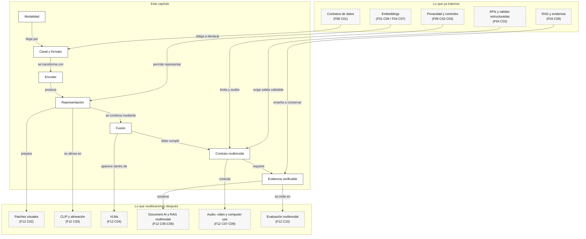

::: {.fasciculo-subtitle}
Facsímil 12 · IA multimodal y sistemas que perciben
:::

# Capítulo 01: Qué es la IA multimodal: texto, imagen, audio, vídeo y acción

## Qué deberías poder hacer al terminar

Este facsímil abre una puerta que suele venderse con demasiado brillo: modelos que “ven”, “oyen”, “leen documentos”, “miran pantallas” o “actúan” en una interfaz. La parte bonita es evidente. La parte importante para ingeniería es otra: **qué señal entra, cómo se representa, dónde se combina con otras señales, qué evidencia queda y cómo medimos que no nos estamos engañando**.

Al terminar este capítulo deberías poder hacer esto:

| Resultado de aprendizaje | Evidencia de que lo sabes hacer |
|---|---|
| Distinguir modalidad, canal, representación y tarea. | No llamas “multimodal” a cualquier prompt con un archivo adjunto. |
| Explicar por qué una imagen, un audio o un PDF no entran “tal cual” al modelo. | Sabes hablar de encoders, embeddings, tokens visuales, transcripción, OCR o layout. |
| Elegir la modalidad mínima suficiente. | No usas visión si basta texto, ni texto si la evidencia está en una captura. |
| Diseñar un contrato multimodal. | Defines entradas, formatos, evidencias, métricas, riesgos y salida esperada. |
| Ver el coste técnico de añadir modalidades. | Nombras latencia, privacidad, evaluación, almacenamiento y revisión humana. |
| Conectar este tema con el resto del libro. | Ves que embeddings, RAG, agentes, evaluación, datos y seguridad reaparecen aquí. |

La frase central del capítulo es esta:

> La IA multimodal no empieza cuando un modelo acepta imágenes. Empieza cuando el sistema sabe qué evidencia necesita de cada modalidad.

## La escena: una captura que cambia la respuesta

Imagina un sistema de soporte académico. Una persona escribe: “No puedo enviar la solicitud de beca”. Si solo recibimos texto, podemos clasificar la incidencia como “problema de formulario” y pedir más datos. Pero si además adjunta una captura de pantalla, el sistema puede ver que el botón está desactivado porque falta un campo obligatorio.

La diferencia no es estética. La imagen aporta evidencia que el texto no traía. El sistema ya no responde solo a una queja; responde a una combinación de señales: texto del ticket, captura, posible mensaje de error, estado visual del formulario y quizá historial de intentos.

Ahora cambia el caso. Una factura en PDF no es solo texto: tiene tabla, importes, layout, páginas, moneda, firma y metadatos. Una reunión grabada no es solo audio: puede necesitar transcripción, turnos, timestamps, identificación de acuerdos y cuidado con datos personales. Un agente que opera una pantalla no recibe solo una imagen: recibe estado, coordenadas, árbol de accesibilidad, permisos y acciones posibles.

Si metemos todo eso en la misma palabra, “multimodal”, perdemos lo que necesita un ingeniero: separar piezas.

## Caso guía del facsímil: una beca bloqueada

Vamos a usar un caso que volverá varias veces durante el facsímil. Una persona intenta enviar una solicitud de beca. El formulario muestra el botón de envío desactivado. Hay una alerta roja, un PDF de política de becas, una tabla de estados internos y un mensaje de la persona solicitante.

La tentación sería decir: “que lo mire un modelo multimodal”. La lectura de ingeniería es más concreta:

| Señal | Qué aporta | Qué puede fallar |
|---|---|---|
| Texto del ticket | Intención de la persona y lenguaje natural del problema. | Puede omitir el dato que bloquea el flujo. |
| Captura del formulario | Estado visual: botón, alerta, campo pendiente. | Puede traer datos personales, baja resolución o texto ilegible. |
| PDF de política | Reglas de elegibilidad, fecha límite y formato aceptado. | Puede tener layout difícil, versión obsoleta o cláusulas ambiguas. |
| Tabla de estados | Estado operativo real: validado, pendiente, rechazado. | Puede estar desactualizada o no coincidir con la interfaz. |

Este caso no se resuelve con una sola modalidad. Tampoco se resuelve metiendo todo en el prompt sin pensar. En el capítulo 01 se convierte en contrato multimodal. En el [capítulo 02](/libro/fasciculo-12/#capitulo-02) preguntaremos si conviene mandar toda la captura o solo la región de la alerta. En el [capítulo 03](/libro/fasciculo-12/#capitulo-03) veremos cómo recuperar casos parecidos sin confundir una política de becas con una factura o una pizarra con números.

La gracia del caso guía es que obliga a decidir. No basta con “acepta imágenes”. Hay que saber qué evidencia entra, qué pieza decide, qué se valida y cuándo debe revisar una persona.

## Lectura de ingeniería: no es añadir archivos, es diseñar evidencia

Cuando una aplicación acepta texto, imagen, audio o documentos, lo primero que cambia no es el modelo, sino el contrato del sistema. En texto puro solemos tener una entrada relativamente clara: una cadena, un historial de mensajes, una herramienta llamada y una salida. En multimodalidad la entrada se fragmenta. Una captura tiene resolución, regiones, texto visible, datos personales y estado visual. Un PDF tiene páginas, layout y tablas. Un audio tiene turnos, ruido, latencia y transcripción. Un vídeo tiene tiempo. Una acción tiene consecuencias. Si no defines qué significa “entrada válida” para cada modalidad, el sistema acaba dependiendo de la intuición del modelo.

La pregunta de ingeniería no es “¿puedo adjuntar un archivo?”. La pregunta es: **qué evidencia necesito para tomar una decisión concreta**. Si el objetivo es explicar por qué una solicitud no se puede enviar, quizá necesitamos una región de la captura, el estado del expediente y una cláusula del PDF. Si el objetivo es buscar incidencias parecidas, quizá basta un embedding visual y una etiqueta. Si el objetivo es actuar en una pantalla, la imagen no basta: hace falta permiso, target estable, aprobación y traza. La modalidad se elige por la evidencia que aporta, no por lo vistosa que resulta.

### El cambio mental: de entrada bonita a expediente verificable

Un sistema multimodal serio debería producir algo más parecido a un expediente que a una respuesta suelta. Un expediente tiene piezas: entrada original o versión redactada, extractor usado, coordenadas de la región, versión de documento, timestamp de audio o vídeo, fila de tabla, estado operativo consultado, decisión tomada y motivo de rechazo si no se puede responder. Sin esas piezas, la salida puede sonar bien, pero no se puede defender.

En el caso de la beca, por ejemplo, no basta con responder “falta un justificante”. La respuesta defendible sería: “en la captura se ve una alerta en la región del formulario; la tabla de estados marca `documento_identidad = pendiente`; la política de becas exige ese justificante antes del envío; por eso el botón no debería activarse todavía”. Observa la diferencia: la primera frase parece ayuda; la segunda deja trazabilidad. La primera depende de la confianza que tengas en el modelo; la segunda se puede revisar.

### Qué debe quedar escrito antes de elegir modelo

Antes de hablar de VLMs, OCR, ASR o RAG, conviene escribir cuatro cosas. Primero, qué decisión queremos apoyar: clasificar, recuperar, describir, extraer, actuar o bloquear. Segundo, qué modalidad aporta evidencia que no existe en una fuente más simple. Tercero, qué forma tendrá esa evidencia: página, región, celda, transcript, intervalo, click, tool call o registro de backend. Cuarto, qué haría que el sistema dijera “no sé” en lugar de improvisar.

Esto evita una confusión muy frecuente: confundir riqueza de entrada con calidad de decisión. Una imagen completa puede traer más información que un recorte, pero también más datos personales, más ruido y más coste. Un audio completo puede permitir entender el tono, pero quizá el producto solo necesita confirmar un número de expediente. Un vídeo puede contener mucha evidencia temporal, pero si la tarea se resuelve con un evento estructurado del sistema, usar vídeo puede ser peor ingeniería.

### Cómo se evalúa una modalidad

También cambia la evaluación. En texto puedo preguntar si una respuesta es correcta. En multimodalidad tengo que preguntar si la respuesta está apoyada por una región, una página, un timestamp, una celda, una transcripción o una acción. Eso obliga a conservar coordenadas, versiones, fuentes y límites. Si una respuesta dice “falta el justificante”, el sistema debería poder señalar dónde vio esa alerta, qué estado operativo consultó y qué regla de la política aplicó.

En una práctica universitaria o en un equipo real, yo pediría tres evidencias mínimas para aceptar una solución multimodal. La primera: un manifiesto de entradas que describa cada modalidad y su sensibilidad. La segunda: un contrato de salida que obligue a citar evidencia o rechazar. La tercera: una evaluación con casos donde una modalidad ayuda y casos donde estorba. Sin esas tres piezas, el capítulo se queda en entusiasmo. Con ellas, empieza a parecer ingeniería.

Por eso este primer capítulo es más importante de lo que parece. No está definiendo una palabra de moda; está fijando una manera de construir. Cada vez que aparezca una nueva modalidad en el facsímil, vuelve a esta pregunta: qué evidencia necesito, qué representación uso, qué riesgo añado y qué prueba me haría confiar en el resultado. Si no puedes contestar eso, todavía no tienes un sistema multimodal; tienes una demo con archivos adjuntos.

## Qué no es la IA multimodal

IA multimodal no significa que el modelo “entienda el mundo” por recibir una imagen, un PDF o un audio. Esa frase queda bien en una demo, pero no sirve para construir. Un sistema puede aceptar una imagen y aun así fallar contando objetos, leyendo texto pequeño, interpretando una tabla inclinada o distinguiendo una señal relevante de una decoración.

Tampoco significa que haya que usar siempre la modalidad más rica. Si un usuario pregunta por el estado de un pedido y el dato vive en una base de datos, una consulta determinista puede ser mejor que pasar una captura a un modelo visual. Si necesitamos sumar importes de una factura, quizá conviene OCR, parser de tablas y validación numérica antes que pedirle al modelo “lee esto” y confiar.

Y no significa que todas las modalidades se traten igual. Texto, imagen, audio, vídeo, documento y acción tienen formas distintas de error. El texto puede ser ambiguo. La imagen puede esconder datos personales. El audio puede confundirse por ruido o acentos. El vídeo añade tiempo. La acción añade responsabilidad: hacer clic, borrar, enviar o comprar no es lo mismo que describir.

| Confusión | Lectura de ingeniería |
|---|---|
| “El modelo acepta imágenes, ya es multimodal”. | Falta saber qué representación visual usa, qué tarea resuelve y cómo se evalúa. |
| “Mandamos el PDF entero y que responda”. | Hay que decidir páginas, OCR, layout, tablas, evidencia por campo y límites. |
| “Audio es texto con un paso previo”. | ASR introduce errores, timestamps, diarización, latencia y privacidad de voz. |
| “Si ve la pantalla, puede actuar”. | Actuar exige permisos, confirmaciones, trazas, rollback y política de seguridad. |
| “Más modalidades siempre mejoran”. | A veces añaden ruido, coste, latencia, riesgo y métricas más difíciles. |

## Cuándo no usar multimodalidad

Esta sección debería estar pegada al monitor de cualquier equipo que empieza con visión, audio o documentos. La multimodalidad es útil cuando aporta evidencia nueva. Si solo añade coste o apariencia de sofisticación, estorba.

| Situación | Mejor primera opción | Por qué |
|---|---|---|
| El dato vive en SQL o una API interna. | Consulta determinista o tool con permisos. | Es más exacto, auditable y barato que mirar una captura. |
| El PDF tiene texto digital limpio. | Extracción textual + validación de campos. | Visión puede añadir coste sin mejorar evidencia. |
| Solo necesitas clasificar una frase corta. | Clasificador, reglas o LLM textual pequeño. | La imagen no aporta señal nueva. |
| El usuario manda captura con datos sensibles innecesarios. | Pedir dato mínimo o aplicar redacción antes de procesar. | Minimización antes que “más contexto”. |
| La salida implica acción irreversible. | Tool con política, aprobación y trazas. | Ver una pantalla no autoriza actuar. |
| No tienes set de evaluación por modalidad. | Construir evaluación antes de integrar. | Sin métricas, la demo manda más que la calidad. |

La regla práctica es dura pero sana: **si no puedes nombrar la evidencia nueva que aporta una modalidad, no la metas todavía**.

## Qué sí es un sistema multimodal

Un sistema multimodal es un sistema que usa más de un tipo de señal para resolver una tarea. La definición parece sencilla, pero tiene dos palabras que importan: **señal** y **tarea**.

La señal es lo que entra: texto, imagen, audio, vídeo, tabla, documento, captura, evento o acción. La tarea es lo que queremos decidir: clasificar, extraer, buscar, resumir, responder, verificar, actuar o escalar a una persona. Si no definimos la tarea, la modalidad queda como un adorno.

La literatura de aprendizaje multimodal suele organizar el problema alrededor de representación, traducción entre modalidades, alineación, fusión y aprendizaje compartido.^[Baltrušaitis, T., Ahuja, C. y Morency, L.-P. (2019). Multimodal Machine Learning: A Survey and Taxonomy. *IEEE Transactions on Pattern Analysis and Machine Intelligence*, 41(2), 423-443. https://doi.org/10.1109/TPAMI.2018.2798607. El artículo ofrece una taxonomía clásica para separar representación, traducción, alineación, fusión y co-learning.] En lenguaje más de proyecto:

| Pregunta | Traducción práctica |
|---|---|
| ¿Cómo represento cada señal? | Encoder de texto, imagen, audio, OCR, transcripción, embeddings o features. |
| ¿Cómo alineo señales distintas? | Texto e imagen deben poder compararse, conectarse o condicionarse. |
| ¿Dónde fusiono la información? | Antes del modelo, dentro de la arquitectura, después de varios modelos o en una capa de decisión. |
| ¿Qué evidencia guardo? | Página, región, timestamp, fila, chunk, fragmento o acción ejecutada. |
| ¿Cómo evalúo? | Métrica por modalidad y métrica final de tarea. |

Un sistema multimodal bien diseñado no empieza preguntando “qué modelo está de moda”. Empieza preguntando: **qué modalidad aporta evidencia que no puedo obtener de forma más simple**.

## Las tripas: de señal bruta a decisión

El camino mínimo de un sistema multimodal tiene cinco piezas:

1. Señal bruta.
2. Encoder o extractor.
3. Representación.
4. Fusión o decisión.
5. Salida verificable.

Ejemplo de fórmula: podemos escribir el recorrido así. No es una definición universal; es una notación de trabajo para recordar qué piezas deben aparecer en cualquier diseño serio.

$$
x_m \xrightarrow{E_m} z_m \xrightarrow{\phi} h \xrightarrow{g} \hat{y}
$$

| Símbolo | Significado | Ejemplo |
|---|---|---|
| \(m\) | Modalidad. | Texto, imagen, documento o audio. |
| \(x_m\) | Entrada bruta de esa modalidad. | Captura PNG, PDF, audio WAV, texto del ticket. |
| \(E_m\) | Encoder o extractor específico de la modalidad. | Tokenizador, ViT, OCR, ASR, parser de tablas. |
| \(z_m\) | Representación interna. | Embedding, tokens visuales, transcripción, regiones de documento. |
| \(\phi\) | Función de fusión o composición. | Concatenar, atender, rankear, votar, validar. |
| \(h\) | Representación combinada. | Estado que mezcla texto e imagen. |
| \(g\) | Cabeza de tarea o capa de decisión. | Clasificador, generador, extractor JSON, agente. |
| \(\hat{y}\) | Salida producida. | Categoría, respuesta, campos extraídos, acción recomendada. |

Fíjate en lo que esta notación obliga a declarar. No basta con decir “meto una imagen”. Hay que decir qué encoder la transforma, qué representación produce, dónde se mezcla con el texto y qué salida validamos.

### Imagen

Una imagen puede representarse como un tensor de alto, ancho y canales. En arquitecturas tipo Vision Transformer se divide en patches que se proyectan a embeddings.^[Dosovitskiy, A. et al. (2021). An Image is Worth 16x16 Words: Transformers for Image Recognition at Scale. *International Conference on Learning Representations*. https://arxiv.org/abs/2010.11929. ViT muestra una forma influyente de tratar imágenes como secuencias de patches.] Este será el tema del [capítulo 02](/libro/fasciculo-12/#capitulo-02).

La consecuencia práctica: resolución, recorte, orientación y tamaño de patch cambian lo que el sistema puede ver. Una captura con texto pequeño puede perder información si se reduce demasiado. Una factura escaneada puede necesitar OCR y layout. Una foto de producto puede necesitar embeddings visuales para búsqueda.

### Texto e imagen

CLIP popularizó una forma muy útil de alinear imagen y texto: entrenar encoders para que una imagen y su descripción queden cerca en un espacio común.^[Radford, A. et al. (2021). Learning Transferable Visual Models From Natural Language Supervision. *Proceedings of the 38th International Conference on Machine Learning*, 8748-8763. https://arxiv.org/abs/2103.00020. CLIP aprende representaciones visuales transferibles mediante supervisión en lenguaje natural.] Eso permite buscar imágenes por texto o clasificar con prompts, pero no convierte cualquier búsqueda en verdad. El ranking puede fallar si el dataset, la descripción o el dominio no se parecen.

La similitud coseno será una herramienta recurrente:

$$
\operatorname{sim}(u,v)=\frac{u \cdot v}{\lVert u\rVert \lVert v\rVert}
$$

| Símbolo | Significado | Ejemplo |
|---|---|---|
| \(u\) | Vector de una señal. | Embedding de una descripción. |
| \(v\) | Vector de otra señal. | Embedding de una imagen. |
| \(u \cdot v\) | Producto escalar. | Cuánto apuntan en direcciones parecidas. |
| \(\lVert u\rVert\) | Norma de \(u\). | Longitud del vector de texto. |
| \(\lVert v\rVert\) | Norma de \(v\). | Longitud del vector de imagen. |

Cuando la similitud es alta, no significa “la imagen es correcta”. Significa que, según ese espacio de representación, texto e imagen están cerca. En ingeniería hay que medir si esa cercanía sirve para la tarea.

### Documento

Un documento mezcla modalidades. Un PDF puede tener texto digital, imágenes, tablas, layout, firmas, pies de página y metadatos. Si solo extraemos texto plano, podemos perder el orden de lectura o romper tablas. Si solo tratamos la página como imagen, podemos subir coste y perder estructura.

Por eso muchos sistemas documentales combinan OCR, layout, extracción estructurada, RAG y revisión humana. No hay una única respuesta. Hay contrato: qué campos extraigo, de qué página salen, qué evidencia guardo y cuándo bloqueo.

### Audio y vídeo

Audio suele pasar por reconocimiento automático del habla antes de llegar a un LLM. Ese paso introduce errores: palabras cambiadas, nombres mal transcritos, speakers mezclados, timestamps imprecisos. Vídeo añade una dimensión más: tiempo. No basta con describir frames aislados; a menudo necesitamos eventos, secuencias, cambios y evidencia temporal.

La idea que conviene guardar: cada modalidad trae su propio extractor y su propia métrica. Si no medimos el extractor, culparemos al modelo final de errores que nacieron antes.

### Acción

Cuando el sistema no solo responde, sino que actúa, entramos en otra categoría. Un agente puede mirar una pantalla, decidir un clic, llamar una API o rellenar un formulario. Ahí la salida no es una frase: es una consecuencia.

Por eso los sistemas con acciones necesitan política, permisos, confirmación humana en pasos irreversibles, trazas y rollback. La multimodalidad se vuelve operación.

## Tres formas de fusionar modalidades

Hay muchas arquitecturas, pero para empezar basta con distinguir tres patrones. No son etiquetas de marketing: son lugares donde decides juntar señales.

| Patrón | Qué hace | Sirve cuando | Riesgo |
|---|---|---|---|
| Fusión temprana | Convierte señales a una representación común antes de decidir. | Búsqueda imagen-texto, embeddings multimodales, clasificación conjunta. | Pierde detalle si la representación comprime demasiado. |
| Fusión dentro del modelo | Un modelo mezcla tokens o embeddings de varias modalidades durante el razonamiento. | VLMs, preguntas sobre imágenes, documentos visuales, capturas. | Más coste, más opacidad, evaluación más compleja. |
| Fusión tardía | Varios módulos producen señales y una capa final decide. | OCR + reglas + LLM, ASR + resumen, RAG + verificador. | La integración puede ocultar errores si no hay trazas. |

Flamingo mostró una vía para combinar modelos visuales y de lenguaje en secuencias intercaladas de imágenes, vídeo y texto.^[Alayrac, J.-B. et al. (2022). Flamingo: a Visual Language Model for Few-Shot Learning. *Advances in Neural Information Processing Systems 35*, 23716-23736. https://arxiv.org/abs/2204.14198. Flamingo integra información visual y textual para few-shot learning multimodal.] LLaVA popularizó otra lectura muy influyente: conectar un encoder visual con un LLM y ajustarlo con instrucciones visuales.^[Liu, H., Li, C., Wu, Q. y Lee, Y. J. (2023). Visual Instruction Tuning. *Advances in Neural Information Processing Systems 36*. https://arxiv.org/abs/2304.08485. LLaVA usa alineación visual-instruccional para diálogo imagen-texto.]

<svg id="f12-c01-mapa-modalidades" xmlns="http://www.w3.org/2000/svg" viewBox="0 0 1280 860" role="img" aria-label="Mapa técnico de un sistema multimodal desde señales brutas hasta decisión evaluada">
  <rect width="1280" height="860" fill="#FFFFFF"/>
  <text x="60" y="66" font-size="28" font-weight="700" fill="#111111">Anatomía mínima de un sistema multimodal</text>
  <text x="60" y="98" font-size="15" fill="#555555">La pregunta no es cuántas modalidades acepta, sino qué evidencia aporta cada una y cómo se valida la salida.</text>

  <defs>
    <marker id="f12c01-arrow" markerWidth="10" markerHeight="10" refX="8" refY="3" orient="auto" markerUnits="strokeWidth">
      <path d="M0,0 L8,3 L0,6 Z" fill="#111111"/>
    </marker>
    <style>
      .box { fill: #FFFFFF; stroke: #111111; stroke-width: 1.4; }
      .soft { fill: #F6F6F6; stroke: #222222; stroke-width: 1.1; }
      .label { font-family: Inter, Arial, sans-serif; fill: #111111; }
      .muted { font-family: Inter, Arial, sans-serif; fill: #555555; }
      .tiny { font-family: Inter, Arial, sans-serif; fill: #666666; font-size: 12px; }
    </style>
  </defs>

  <rect x="60" y="142" width="210" height="520" rx="10" class="box"/>
  <text x="165" y="176" text-anchor="middle" font-size="16" font-weight="700" class="label">Señales brutas</text>
  <line x1="84" y1="196" x2="246" y2="196" stroke="#CCCCCC"/>

  <rect x="88" y="222" width="154" height="52" rx="8" class="soft"/>
  <text x="165" y="244" text-anchor="middle" font-size="13" font-weight="700" class="label">Texto</text>
  <text x="165" y="262" text-anchor="middle" class="tiny">ticket · prompt · nota</text>

  <rect x="88" y="294" width="154" height="52" rx="8" class="soft"/>
  <text x="165" y="316" text-anchor="middle" font-size="13" font-weight="700" class="label">Imagen</text>
  <text x="165" y="334" text-anchor="middle" class="tiny">captura · foto</text>

  <rect x="88" y="366" width="154" height="52" rx="8" class="soft"/>
  <text x="165" y="388" text-anchor="middle" font-size="13" font-weight="700" class="label">Documento</text>
  <text x="165" y="406" text-anchor="middle" class="tiny">PDF · tabla · layout</text>

  <rect x="88" y="438" width="154" height="52" rx="8" class="soft"/>
  <text x="165" y="460" text-anchor="middle" font-size="13" font-weight="700" class="label">Audio</text>
  <text x="165" y="478" text-anchor="middle" class="tiny">voz · ruido · turnos</text>

  <rect x="88" y="510" width="154" height="52" rx="8" class="soft"/>
  <text x="165" y="532" text-anchor="middle" font-size="13" font-weight="700" class="label">Vídeo / pantalla</text>
  <text x="165" y="550" text-anchor="middle" class="tiny">frames · estado · acción</text>

  <rect x="324" y="142" width="240" height="520" rx="10" class="box"/>
  <text x="444" y="176" text-anchor="middle" font-size="16" font-weight="700" class="label">Extractores</text>
  <line x1="350" y1="196" x2="538" y2="196" stroke="#CCCCCC"/>
  <text x="444" y="242" text-anchor="middle" font-size="14" class="label">Tokenizador</text>
  <text x="444" y="318" text-anchor="middle" font-size="14" class="label">Encoder visual</text>
  <text x="444" y="394" text-anchor="middle" font-size="14" class="label">OCR + layout</text>
  <text x="444" y="470" text-anchor="middle" font-size="14" class="label">ASR + diarización</text>
  <text x="444" y="546" text-anchor="middle" font-size="14" class="label">Sampler temporal</text>
  <text x="444" y="608" text-anchor="middle" font-size="12" class="muted">Cada extractor tiene errores propios</text>

  <rect x="620" y="142" width="250" height="520" rx="10" class="box"/>
  <text x="745" y="176" text-anchor="middle" font-size="16" font-weight="700" class="label">Representaciones</text>
  <line x1="646" y1="196" x2="844" y2="196" stroke="#CCCCCC"/>
  <rect x="650" y="228" width="190" height="58" rx="8" class="soft"/>
  <text x="745" y="252" text-anchor="middle" font-size="13" font-weight="700" class="label">Embeddings</text>
  <text x="745" y="270" text-anchor="middle" class="tiny">texto · imagen · audio</text>
  <rect x="650" y="320" width="190" height="58" rx="8" class="soft"/>
  <text x="745" y="344" text-anchor="middle" font-size="13" font-weight="700" class="label">Tokens visuales</text>
  <text x="745" y="362" text-anchor="middle" class="tiny">patches · regiones</text>
  <rect x="650" y="412" width="190" height="58" rx="8" class="soft"/>
  <text x="745" y="436" text-anchor="middle" font-size="13" font-weight="700" class="label">Evidencia</text>
  <text x="745" y="454" text-anchor="middle" class="tiny">bbox · página · timestamp</text>
  <rect x="650" y="504" width="190" height="58" rx="8" class="soft"/>
  <text x="745" y="528" text-anchor="middle" font-size="13" font-weight="700" class="label">Estado operativo</text>
  <text x="745" y="546" text-anchor="middle" class="tiny">permisos · acciones</text>

  <rect x="926" y="142" width="270" height="520" rx="10" class="box"/>
  <text x="1061" y="176" text-anchor="middle" font-size="16" font-weight="700" class="label">Fusión y decisión</text>
  <line x1="952" y1="196" x2="1170" y2="196" stroke="#CCCCCC"/>
  <rect x="958" y="226" width="206" height="70" rx="8" class="soft"/>
  <text x="1061" y="252" text-anchor="middle" font-size="13" font-weight="700" class="label">Fusión temprana</text>
  <text x="1061" y="272" text-anchor="middle" class="tiny">espacio común</text>
  <rect x="958" y="326" width="206" height="70" rx="8" class="soft"/>
  <text x="1061" y="352" text-anchor="middle" font-size="13" font-weight="700" class="label">Fusión en modelo</text>
  <text x="1061" y="372" text-anchor="middle" class="tiny">atención cruzada · VLM</text>
  <rect x="958" y="426" width="206" height="70" rx="8" class="soft"/>
  <text x="1061" y="452" text-anchor="middle" font-size="13" font-weight="700" class="label">Fusión tardía</text>
  <text x="1061" y="472" text-anchor="middle" class="tiny">OCR + reglas + LLM</text>
  <rect x="958" y="544" width="206" height="70" rx="8" fill="#111111" stroke="#111111"/>
  <text x="1061" y="572" text-anchor="middle" font-size="13" font-weight="700" fill="#FFFFFF" font-family="Inter, Arial, sans-serif">Salida validada</text>
  <text x="1061" y="592" text-anchor="middle" font-size="12" fill="#DDDDDD" font-family="Inter, Arial, sans-serif">schema · evidencia · métrica</text>

  <line x1="270" y1="402" x2="324" y2="402" stroke="#111111" stroke-width="1.5" marker-end="url(#f12c01-arrow)"/>
  <line x1="564" y1="402" x2="620" y2="402" stroke="#111111" stroke-width="1.5" marker-end="url(#f12c01-arrow)"/>
  <line x1="870" y1="402" x2="926" y2="402" stroke="#111111" stroke-width="1.5" marker-end="url(#f12c01-arrow)"/>

  <rect x="230" y="706" width="820" height="72" rx="12" fill="#FAFAFA" stroke="#BBBBBB"/>
  <text x="640" y="734" text-anchor="middle" font-size="15" font-weight="700" class="label">Contrato multimodal</text>
  <text x="640" y="758" text-anchor="middle" font-size="13" class="muted">entrada · formato · evidencia · métrica · riesgo · revisión humana · salida</text>
  <text x="1216" y="826" text-anchor="end" font-size="11" fill="#888888" opacity="0.55">IA para gente curiosa / Facsímil 12 / Capítulo 01 / 686f6c61</text>
</svg>

## Esto en un proyecto real

Vamos a bajarlo a cuatro situaciones reconocibles.

| Caso | Lo que parece | Lo que hay que decidir |
|---|---|---|
| Ticket con captura | “Que el modelo mire la imagen”. | Si la imagen aporta evidencia que el texto no trae, qué región se cita y qué datos personales puede contener. |
| Factura PDF | “Extrae los campos”. | Si conviene OCR + layout + validación, VLM, parser tabular o revisión humana por importes. |
| Búsqueda de producto | “Busca una silla parecida a esta descripción”. | Si usamos embeddings multimodales, metadatos, filtros de catálogo y evaluación `Recall@k`. |
| Resumen de reunión | “Resume este audio”. | Si medimos WER, timestamps, acuerdos, responsables y revisión antes de enviar acta. |
| Beca bloqueada | “Mira la captura y dime qué pasa”. | Si la causa está en la imagen, el PDF, la tabla de estados o en una contradicción entre ellos. |

La decisión profesional suele ser híbrida. Para una factura, quizá no quieres un VLM respondiendo libremente. Quieres OCR, extracción de layout, validación de totales, JSON estricto y revisión humana si falta evidencia. Para catálogo, quizá no quieres generación: quieres retrieval multimodal. Para una captura de soporte, quizá sí tiene sentido un VLM, pero con contrato de salida y redacción de datos sensibles.

Este es el giro importante del facsímil: multimodal no es una capacidad aislada del modelo. Es una arquitectura de datos, representación, decisión y control.

## Por qué debería importarte

Porque la multimodalidad multiplica la superficie de error. Si un sistema textual falla, revisas prompt, contexto, recuperación, salida y evaluación. Si añades imagen, audio, documento o pantalla, aparecen más capas: OCR, resolución, metadatos, timestamps, regiones visuales, accesibilidad, permisos, privacidad y coste de almacenamiento.

También cambia la evaluación. Una respuesta textual puede evaluarse con una rúbrica. Una extracción de factura necesita precisión por campo y evidencia. Una búsqueda imagen-texto necesita ranking. Un audio necesita WER y calidad de tareas extraídas. Un agente que mira pantallas necesita tasa de tarea completada, acciones innecesarias y trazas.

RAG ya nos enseñó que añadir recuperación separa el problema en recuperar, fundamentar y responder.^[Lewis, P. et al. (2020). Retrieval-Augmented Generation for Knowledge-Intensive NLP Tasks. *Advances in Neural Information Processing Systems 33*, 9459-9474. https://papers.nips.cc/paper/2020/hash/6b493230205f780e1bc26945df7481e5-Abstract.html. RAG separa conocimiento recuperado y generación, una idea que reaparece en RAG multimodal.] En multimodalidad ocurre algo parecido: no evaluamos “el modelo” en bloque. Evaluamos entrada, extractor, representación, fusión, salida y evidencia.

Desde el punto de vista de riesgo, NIST AI RMF insiste en mapear, medir, gestionar y gobernar riesgos de IA en contexto.^[Tabassi, E. (2023). *Artificial Intelligence Risk Management Framework (AI RMF 1.0)*. National Institute of Standards and Technology, NIST AI 100-1. https://doi.org/10.6028/NIST.AI.100-1. En este capítulo usamos esa idea de mapear y medir para exigir contratos de modalidad, evidencia y revisión.] En multimodalidad ese “contexto” incluye cosas muy concretas: una cara en una foto, una dirección en una captura, una voz reconocible, una firma en un PDF o una acción irreversible en una pantalla.

## Dónde volverá a aparecer

Este capítulo es el mapa. A partir de aquí iremos abriendo piezas:

| Capítulo futuro | Qué profundiza |
|---|---|
| [Capítulo 02](/libro/fasciculo-12/#capitulo-02) | Cómo una imagen se convierte en patches, tokens visuales y embeddings. |
| [Capítulo 03](/libro/fasciculo-12/#capitulo-03) | Cómo texto e imagen se alinean con aprendizaje contrastivo. |
| [Capítulo 04](/libro/fasciculo-12/#capitulo-04) | Cómo un VLM conecta encoder visual, proyector y LLM. |
| [Capítulo 05](/libro/fasciculo-12/#capitulo-05) | Cómo leer documentos, tablas, layout y evidencias. |
| [Capítulo 06](/libro/fasciculo-12/#capitulo-06) | Cómo hacer RAG cuando las fuentes no son solo texto. |
| [Capítulo 07](/libro/fasciculo-12/#capitulo-07) | Cómo tratar audio, voz, turnos y latencia conversacional. |
| [Capítulo 09](/libro/fasciculo-12/#capitulo-09) | Cómo unir pantalla, acción, permisos y agentes. |
| [Capítulo 10](/libro/fasciculo-12/#capitulo-10) | Cómo evaluar calidad multimodal sin fiarse de impresiones. |

## Dónde solía tropezar yo

| Tropiezo | Por qué es un problema | Antídoto |
|---|---|---|
| **Pensar que “adjuntar archivo” ya resuelve el diseño** | El archivo puede contener varias modalidades y errores distintos. | Declara modalidad, canal, extractor, evidencia y métrica. |
| **Confundir representación con comprensión** | Un embedding cercano no garantiza que el sistema haya entendido la tarea. | Evalúa contra casos reales y errores esperados. |
| **Usar visión donde bastaba un dato estructurado** | Aumenta coste y reduce control sin aportar evidencia nueva. | Pregunta qué información solo existe en la imagen o documento. |
| **No guardar evidencia** | Después no puedes auditar por qué salió una respuesta. | Exige página, región, timestamp, chunk, fila o acción. |
| **Olvidar privacidad multimodal** | Una captura, audio o PDF puede tener datos sensibles invisibles a simple vista. | Minimiza, redacta, registra retención y revisa metadatos. |

## Manos a la obra

<!-- kit: labs/f12/c01-modality-contract/ -->

Antes de construir un VLM, un RAG multimodal o un agente que mire pantallas, vamos a hacer algo más pequeño y más útil: un contrato multimodal.

El kit descargable del capítulo se obtiene desde el bloque de ejercicios. Incluye casos realistas, una política de validación y un script que genera una decisión por caso. También incluye el caso guía `grant-workflow-005`, que combina ticket, captura, PDF de política y tabla de estados.

Ejecuta:

```bash
make run
make test
cat output/modality_contract_report.md
```

Los archivos importantes son:

| Archivo | Qué contiene |
|---|---|
| `data/modality_manifest.json` | Casos con entradas, modalidades, arquitectura candidata, evidencia, métricas, riesgos y revisión humana. |
| `contracts/modality_policy.json` | Reglas mínimas para validar que el contrato no está vacío. |
| `ops/evaluate_modality_manifest.py` | Script que revisa el manifiesto y calcula un “impuesto multimodal” cualitativo. |
| `output/modality_contract_report.md` | Informe que deberías leer antes de decidir si construir. |
| `templates/entrega.md` | Plantilla para entregar tu propia adaptación. |

La práctica no busca que aciertes “la arquitectura perfecta”. Busca que no empieces por una herramienta. Empieza por `grant-workflow-005` y pregúntate si usarías VLM, OCR, RAG, tabla operativa o revisión humana. Después cambia un caso o añade uno nuevo. Por ejemplo: una foto de una pizarra, una tabla de resultados, una llamada de soporte, un vídeo de inspección o una pantalla de administración. Después responde:

1. ¿Qué modalidad aporta evidencia que no estaba en texto?
2. ¿Qué formato llega realmente?
3. ¿Qué salida debe validarse?
4. ¿Qué métrica dirá si funciona?
5. ¿Qué riesgo aparece al añadir esa modalidad?
6. ¿Cuándo debe entrar una persona?

Si puedes responder eso, ya estás haciendo ingeniería multimodal, aunque todavía no hayas llamado a ningún modelo.

## Cómo encaja todo

Este mapa debe leerse en tres capas. Arriba están las bases que ya traemos: embeddings, APIs, RAG, datos y seguridad. En el centro está lo que aprendemos en este capítulo: separar modalidad, representación, fusión, evidencia y contrato. Abajo queda lo que vendrá: patches, CLIP, VLMs, Document AI, audio, vídeo, computer use y evaluación multimodal.



## Vocabulario aprendido

| Término | Definición |
|---|---|
| **Modalidad** | Tipo de señal: texto, imagen, audio, vídeo, documento, tabla, pantalla o acción. |
| **Canal** | Medio concreto por el que llega la señal: archivo, stream, API, captura, micrófono o evento. |
| **Encoder** | Bloque que convierte una entrada bruta en una representación interna. |
| **Representación** | Vector, tensor, tokens o estructura que el sistema puede comparar, mezclar o usar. |
| **Alineación** | Forma de hacer comparables señales de distintas modalidades. |
| **Fusión temprana** | Combinar modalidades en una representación común antes de decidir. |
| **Fusión tardía** | Combinar salidas de módulos separados en una capa final de decisión. |
| **VLM** | Modelo visión-lenguaje que usa información visual y textual. |
| **Evidencia multimodal** | Región, página, timestamp, chunk, fila o acción que justifica una salida. |
| **Contrato multimodal** | Especificación de entrada, formato, evidencia, métrica, riesgo y salida para una tarea multimodal. |

## Antes de pasar página

Antes de avanzar, comprueba que puedes responder estas preguntas:

- [ ] ¿Puedo explicar la diferencia entre modalidad y canal? Si no, vuelve a “Qué sí es un sistema multimodal”.
- [ ] ¿Puedo dibujar el camino `señal -> encoder -> representación -> fusión -> salida`? Si no, vuelve a “Las tripas”.
- [ ] ¿Puedo decir cuándo una imagen aporta evidencia real y cuándo es ruido? Si no, vuelve a “Esto en un proyecto real”.
- [ ] ¿Puedo nombrar una métrica distinta para texto, imagen, documento y audio? Si no, vuelve a “Por qué debería importarte”.
- [ ] ¿Puedo ejecutar el kit y explicar un caso del reporte? Si no, vuelve a “Manos a la obra”.
- [ ] ¿Puedo conectar multimodalidad con embeddings, RAG, datos, seguridad y evaluación? Si no, vuelve a “Cómo encaja todo”.

## En resumen

| Idea | Qué deberías llevarte |
|---|---|
| Multimodalidad no es magia. | Es una arquitectura que transforma señales distintas en representaciones y decisiones evaluables. |
| La modalidad mínima importa. | Añadir imagen, audio o vídeo solo compensa si aporta evidencia que no está disponible de forma más simple. |
| La evidencia manda. | Una salida multimodal debe poder apuntar a región, página, timestamp, chunk, fila o acción. |
| El coste no es solo dinero. | Cada modalidad añade latencia, privacidad, almacenamiento, evaluación y posibles revisiones humanas. |
| El contrato viene antes del modelo. | Antes de elegir proveedor o arquitectura, conviene declarar entradas, formatos, métricas, riesgos y salida. |

## Para saber más

Baltrušaitis, T., Ahuja, C. y Morency, L.-P. (2019). Multimodal Machine Learning: A Survey and Taxonomy. *IEEE Transactions on Pattern Analysis and Machine Intelligence*, 41(2), 423-443. https://doi.org/10.1109/TPAMI.2018.2798607

Dosovitskiy, A. et al. (2021). An Image is Worth 16x16 Words: Transformers for Image Recognition at Scale. *International Conference on Learning Representations*. https://arxiv.org/abs/2010.11929

Radford, A. et al. (2021). Learning Transferable Visual Models From Natural Language Supervision. *Proceedings of the 38th International Conference on Machine Learning*, 8748-8763. https://arxiv.org/abs/2103.00020

Alayrac, J.-B. et al. (2022). Flamingo: a Visual Language Model for Few-Shot Learning. *Advances in Neural Information Processing Systems 35*, 23716-23736. https://arxiv.org/abs/2204.14198

Liu, H., Li, C., Wu, Q. y Lee, Y. J. (2023). Visual Instruction Tuning. *Advances in Neural Information Processing Systems 36*. https://arxiv.org/abs/2304.08485

Lewis, P. et al. (2020). Retrieval-Augmented Generation for Knowledge-Intensive NLP Tasks. *Advances in Neural Information Processing Systems 33*, 9459-9474. https://papers.nips.cc/paper/2020/hash/6b493230205f780e1bc26945df7481e5-Abstract.html

Tabassi, E. (2023). *Artificial Intelligence Risk Management Framework (AI RMF 1.0)*. National Institute of Standards and Technology, NIST AI 100-1. https://doi.org/10.6028/NIST.AI.100-1
