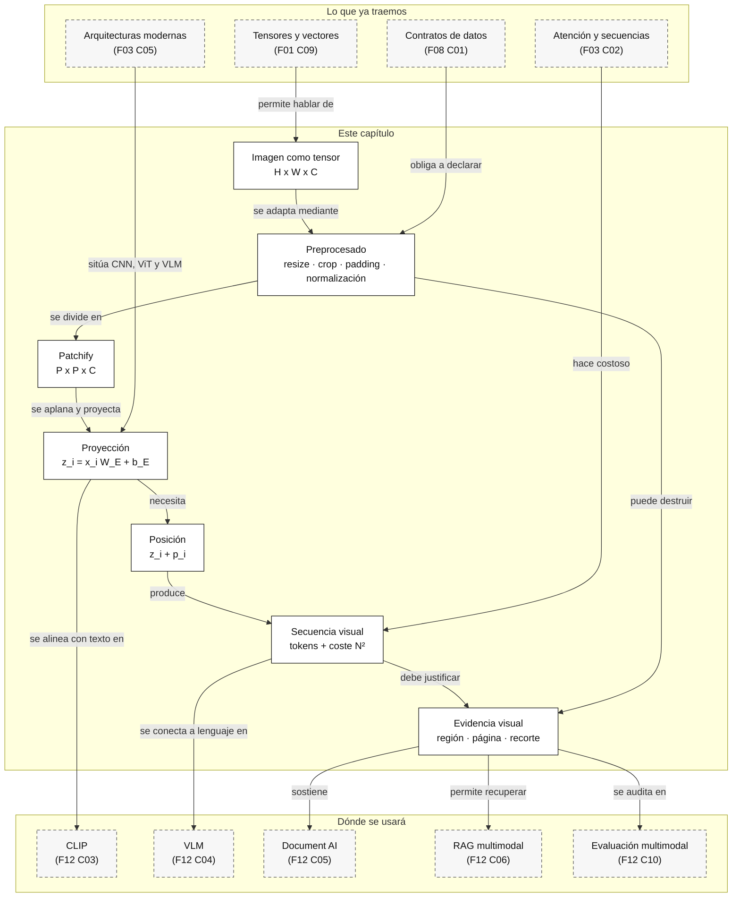

::: {.fasciculo-subtitle}
Facsímil 12 · IA multimodal y sistemas que perciben
:::

# Capítulo 02: De píxeles a patches: cómo una imagen se convierte en representación

## Qué deberías poder hacer al terminar

En el capítulo anterior pusimos orden en la palabra multimodal. Ahora bajamos un nivel. Una imagen no entra al modelo como “una imagen” en sentido humano. Entra como números. Esos números se recortan, se normalizan, se agrupan, se proyectan y acaban convertidos en representaciones que el modelo puede comparar o atender.

Al terminar este capítulo deberías poder hacer esto:

| Resultado de aprendizaje | Evidencia de que lo sabes hacer |
|---|---|
| Explicar una imagen como tensor. | Puedes describir `alto x ancho x canales` sin quedarte en “es una foto”. |
| Calcular cuántos patches produce una resolución. | Sabes estimar tokens visuales antes de enviar una captura enorme a un modelo. |
| Entender por qué el tamaño de patch afecta a detalle y coste. | Puedes justificar cuándo necesitas más resolución y cuándo solo estás encareciendo el sistema. |
| Distinguir CNN, ViT y encoder visual de un VLM. | No mezclas “visión” con una sola arquitectura. |
| Leer una decisión de preprocesado como ingeniería. | Ves resize, crop, padding, normalización y aspect ratio como decisiones con consecuencias. |
| Ejecutar un kit mínimo de patch tokenizer. | Descargas el laboratorio, generas un grid y explicas el informe. |

La frase central del capítulo es esta:

> Un modelo no “mira” una imagen: recibe una representación calculada a partir de píxeles, patches, posiciones y decisiones de preprocesado.

## La escena: una captura que parecía fácil

Imagina una captura de una aplicación interna. El usuario escribe: “No puedo aprobar el expediente”. La captura enseña un botón desactivado, una alerta pequeña en rojo y una tabla con una columna de importes. Para una persona, esa captura parece una sola cosa. Para el sistema, no.

Hay texto visible, regiones, colores, posición, tamaño de letra, iconos, layout, quizá datos personales y una resolución concreta. Si reducimos demasiado la imagen, la alerta se vuelve ilegible. Si cortamos mal, desaparece el botón. Si cambiamos la proporción, algunas relaciones espaciales se deforman. Si mandamos una resolución enorme, quizá pagamos un coste alto por detalles que no importaban.

Esto es lo que quiero que te lleves: la visión en IA no empieza en el modelo, empieza en la **representación de la imagen**.

Una factura plantea otro problema. El importe total puede ser grande y visible, pero el NIF, el número de factura o una condición en letra pequeña pueden ocupar pocos píxeles. En una foto de producto, en cambio, quizá no necesitamos leer texto pequeño: basta reconocer forma, color, categoría o similitud con catálogo. La misma arquitectura visual puede comportarse de forma muy distinta según la tarea.

## Volvemos al caso guía: la solicitud de beca

En el capítulo anterior definimos un caso guía: una solicitud de beca bloqueada con texto de usuario, captura de formulario, PDF de política y tabla de estados. En este capítulo miramos solo una pieza: la captura.

La decisión no es “mandar captura al modelo”. La decisión real es esta:

| Opción | Qué conserva | Qué cuesta | Cuándo tiene sentido |
|---|---|---|---|
| Captura completa | Todo el formulario, contexto y layout. | Muchos tokens visuales; más latencia. | Cuando no sabes dónde está la evidencia. |
| Recorte de alerta y botón | Texto del error y estado del envío. | Mucho menos coste; menos contexto. | Cuando la evidencia visual está localizada. |
| OCR de la captura | Texto visible y mensajes de error. | Puede perder posición o iconos. | Cuando el texto decide la respuesta. |
| Captura + tabla de estados | Estado visual y estado operativo. | Requiere fusionar fuentes. | Cuando la interfaz y backend pueden no coincidir. |

El error típico es mandar una captura enorme y esperar que el modelo “se apañe”. Un ingeniero debe preguntar primero: qué región decide, qué texto pequeño hay que conservar, qué metadatos sobran y qué hacemos si la captura no permite leer la evidencia.

## Lectura de ingeniería: resolución, coste y pérdida de información

Trabajar con imágenes en IA consiste en aceptar una tensión constante: cuanto más detalle conservas, más coste, latencia y memoria consumes; cuanto más reduces, más riesgo tienes de perder la pista que resolvía el caso. Una alerta pequeña, una cifra en una tabla o un icono de estado pueden ocupar muy pocos píxeles. Si el preprocesado los borra, el modelo ya no puede recuperarlos por mucho que el prompt sea excelente.

La decisión de tamaño no debería tomarse con una regla genérica. En una foto de producto, recortar el fondo puede ser positivo. En una captura de una interfaz, el contexto alrededor del botón puede explicar por qué está desactivado. En una factura, un recorte demasiado agresivo puede separar un importe de su cabecera. En una pantalla con datos personales, mandar la imagen completa puede ser innecesario y peligroso. El preprocesado es parte del producto, no una etapa invisible.

### La imagen no falla en abstracto: falla por una decisión anterior

Cuando un sistema visual se equivoca, muchas veces buscamos el fallo en el modelo. Pero el fallo puede haber nacido antes: una conversión de color, una compresión agresiva, un resize que deforma la proporción, un crop que corta la cabecera, un padding que desplaza el contenido, una normalización distinta de la usada en entrenamiento o una política de tiles que separa una celda de su etiqueta. Para ingeniería, esas decisiones son tan importantes como la arquitectura.

Imagina una captura de 1920 x 1080 donde el texto crítico ocupa 18 x 110 píxeles. Si reduces la imagen a 384 x 216, esa alerta puede quedar en una mancha. Si después divides en patches de 16 x 16, el mensaje quizá queda repartido entre pocos patches y mezclado con fondo. No es que el modelo “no entienda”; es que el dato que debía entender ya llegó degradado. Por eso una eval visual debe guardar no solo la imagen, sino también el pipeline de preprocesado.

### Patches como presupuesto, no solo como teoría

Los patches son una idea matemática, pero también son una unidad presupuestaria. Cada patch se convierte en una representación que compite por atención, memoria y coste. Si duplicas alto y ancho, puedes cuadruplicar el número de patches. Si la atención mira pares de tokens, el coste relacional crece todavía más rápido. La conclusión práctica es incómoda: más resolución no equivale a más precisión si la evidencia no está en esos píxeles extra.

Esto obliga a diseñar por tarea. En UI, quizá conviene detectar primero regiones semánticas: banner, formulario, botón, alerta, tabla. En documentos, quizá conviene pasar por OCR y layout antes de llamar a un VLM. En producto visual, quizá basta una imagen centrada y normalizada. En inspección industrial, quizá necesitas alta resolución local y no tanto contexto global. La misma palabra, “imagen”, esconde decisiones muy distintas.

### Qué debería medir un equipo

Una práctica profesional empieza con una pregunta pequeña: “¿qué píxeles sostienen la decisión?”. Si no puedes responderla, todavía no sabes si necesitas imagen completa, crop, OCR, layout, tabla estructurada o revisión humana. El modelo visual entra después de esa decisión, no antes.

Medirlo bien significa construir casos con distintos tamaños, crops y resoluciones. No basta con mirar si la respuesta parece correcta. Hay que comparar coste visual, latencia, pérdida de detalle, tasa de texto legible, errores por región y sensibilidad a cambios de aspect ratio. Si el sistema responde bien con captura completa pero falla con crop, quizá necesitaba contexto. Si responde igual con crop, quizá estabas pagando de más. Si responde distinto al cambiar `padding`, tienes una señal de fragilidad que conviene encontrar antes de producción.

En una entrega seria, yo esperaría ver un pequeño informe que diga: resolución original, transformación aplicada, número estimado de tokens visuales, región que sostiene la decisión, alternativa más barata probada y caso donde esa alternativa falla. Eso convierte “sube la imagen al modelo” en una decisión explicable.

## Una imagen es un tensor

Una imagen RGB de alto \(H\), ancho \(W\) y tres canales puede representarse como:

$$
X \in \mathbb{R}^{H \times W \times C}
$$

| Símbolo | Significado | Ejemplo |
|---|---|---|
| \(H\) | Alto de la imagen en píxeles. | 720 en una captura HD vertical parcial. |
| \(W\) | Ancho de la imagen en píxeles. | 1280 en una captura HD horizontal. |
| \(C\) | Número de canales. | 3 para RGB; 4 si incluye alpha; 1 si es escala de grises. |
| \(X_{h,w,c}\) | Valor numérico de un píxel y canal. | Intensidad de rojo en la posición `(h,w)`. |

En un archivo típico, un píxel RGB puede venir como enteros entre 0 y 255. Pero muchos modelos no trabajan directamente con esos enteros. Primero convierten los valores a flotantes, los escalan y los normalizan. Una normalización típica por canal se escribe así:

$$
x'_{h,w,c} = \frac{x_{h,w,c} - \mu_c}{\sigma_c}
$$

| Pieza | Qué significa | Por qué importa |
|---|---|---|
| \(x_{h,w,c}\) | Valor original de un canal en un píxel. | Es lo que viene del archivo después de leer la imagen. |
| \(\mu_c\) | Media esperada para ese canal. | Centra los valores según el entrenamiento o preprocesado esperado. |
| \(\sigma_c\) | Desviación típica esperada. | Ajusta la escala para que el modelo reciba valores comparables. |
| \(x'_{h,w,c}\) | Valor normalizado. | Es lo que realmente consume el encoder visual. |

Esto parece un detalle menor, pero no lo es. Si un modelo fue entrenado con un preprocesado concreto y tú le envías imágenes con otra escala, otra distribución de color o canales invertidos, puede parecer que el modelo “no entiende” cuando en realidad le estás hablando en un formato distinto.

## Antes del modelo: resize, crop, padding y canales

El preprocesado de imagen es una capa de ingeniería. No es una limpieza decorativa.

| Decisión | Qué hace | Riesgo si se hace mal |
|---|---|---|
| Resize | Cambia alto y ancho. | Puede borrar texto pequeño, iconos o detalles finos. |
| Crop | Recorta una región. | Puede eliminar evidencia importante fuera del centro. |
| Padding | Añade borde para conservar proporción. | Puede introducir zonas vacías que gastan tokens visuales. |
| Conversión de canales | Cambia RGB, BGR, escala de grises o alpha. | Puede desplazar colores o perder transparencia relevante. |
| Normalización | Cambia escala y distribución. | Puede degradar mucho si no coincide con el modelo. |
| Compresión | Reduce tamaño de archivo. | Puede crear artefactos justo donde está el texto pequeño. |

Para entenderlo con un caso real: si quieres leer un mensaje de error de una captura, el detalle fino importa. Si quieres clasificar si una imagen es “producto”, “ticket” o “documento”, quizá no. Una decisión que es correcta para clasificación puede ser mala para extracción de campos.

Por eso la primera pregunta no es “qué resolución acepta el modelo”. Es: **qué evidencia visual necesito conservar**.

### Detalles de producción que rompen la visión

En laboratorio solemos hablar de `PNG` o `JPG` como si fueran neutros. En producción no lo son.

| Detalle | Qué puede pasar | Qué haría antes de culpar al modelo |
|---|---|---|
| EXIF/orientación | Una foto puede estar rotada por metadatos aunque los píxeles parezcan otra cosa. | Normalizar orientación y registrar la transformación. |
| Color space | La misma imagen puede venir en perfiles distintos. | Convertir a un espacio esperado y probar casos reales. |
| Canal alpha | Una transparencia puede ocultar o cambiar texto y fondos. | Decidir si se compone sobre blanco/negro o se elimina. |
| Compresión JPEG | Texto pequeño y líneas finas pueden llenarse de artefactos. | Usar PNG para capturas y revisar compresión de subida. |
| DPI en PDFs | El DPI declarado puede no reflejar legibilidad real tras rasterizar. | Medir píxeles por página y tamaño de letra visible. |
| Capturas largas | Una pantalla móvil larga puede tener miles de tokens visuales. | Usar recortes, tiles o extracción por accesibilidad si existe. |
| Modo oscuro/claro | Cambia contraste, colores y detección visual. | Evaluar ambos modos si el producto los soporta. |

Estas cosas parecen aburridas hasta que un sistema falla solo con capturas de móvil, modo oscuro o PDFs escaneados. Ahí descubres que la “IA multimodal” dependía de una decisión de imagen que nadie documentó.

## De imagen a patches

Una forma influyente de procesar imágenes con Transformers es dividir la imagen en patches. Vision Transformer popularizó esta lectura: una imagen se parte en bloques de \(P \times P\), cada bloque se aplana y se proyecta a un vector de dimensión interna.^[Dosovitskiy, A. et al. (2021). An Image is Worth 16x16 Words: Transformers for Image Recognition at Scale. *International Conference on Learning Representations*. https://arxiv.org/abs/2010.11929. ViT formaliza una forma muy clara de tratar imágenes como secuencias de patches.] La idea recuerda a los tokens de texto del [facsímil 01, capítulo 09](/libro/fasciculo-01/#capitulo-09), pero con una diferencia importante: aquí cada “token” representa una región visual, no una palabra o subpalabra.

Si la imagen mide \(H \times W\) y el patch mide \(P \times P\), el número de patches, cuando todo divide exacto, es:

$$
N = \frac{H}{P} \cdot \frac{W}{P}
$$

Si \(H\) o \(W\) no son divisibles por \(P\), el sistema suele recortar, redimensionar o añadir padding. En una estimación conservadora con padding:

$$
N = \left\lceil \frac{H}{P} \right\rceil \cdot \left\lceil \frac{W}{P} \right\rceil
$$

Ejemplo con números:

| Caso | Resolución | Patch | Cálculo | Tokens visuales |
|---|---:|---:|---|---:|
| Imagen ViT clásica | \(224 \times 224\) | \(16\) | \(14 \cdot 14\) | 196 |
| Captura HD | \(1280 \times 720\) | \(16\) | \(80 \cdot 45\) | 3600 |
| Captura HD con patch mayor | \(1280 \times 720\) | \(32\) | \(40 \cdot 23\) con techo | 920 |
| Recorte de alerta | \(512 \times 320\) | \(16\) | \(32 \cdot 20\) | 640 |
| Documento escaneado alto | \(2339 \times 1654\) | \(16\) | \(147 \cdot 104\) con techo | 15288 |

La tabla ya enseña algo incómodo: subir resolución puede multiplicar muchísimo los tokens visuales. Y si después usamos atención donde cada token puede mirar a los demás, aparece el coste cuadrático.

## Por qué el coste visual crece tan rápido

En un Transformer, la atención completa entre \(N\) tokens tiene una matriz de relaciones \(N \times N\). A nivel de orden de magnitud:

$$
\text{coste de atención} \approx O(N^2 \cdot d)
$$

| Símbolo | Significado |
|---|---|
| \(N\) | Número de tokens visuales. |
| \(d\) | Dimensión interna de cada token. |
| \(N^2\) | Número de pares potenciales token-token. |

Esto no significa que todos los sistemas modernos usen exactamente la misma atención completa ni que todos paguen el mismo coste. Hay optimizaciones, compresión visual, pooling, atención por ventanas, selección de regiones y arquitecturas híbridas. Pero la intuición de ingeniería se mantiene: **más resolución no es gratis**.

Compara:

| Caso | Tokens | Pares \(N^2\) | Lectura práctica |
|---|---:|---:|---|
| \(224 \times 224\), patch 16 | 196 | 38.416 | Tamaño razonable para entender la arquitectura base. |
| \(1280 \times 720\), patch 16 | 3600 | 12.960.000 | Mucho más caro; quizá excesivo si solo quieres clasificar la imagen. |
| \(2339 \times 1654\), patch 16 | 15288 | 233.722.944 | Puede ser necesario para documentos, pero exige estrategia. |

Aquí hay una decisión profesional: si la tarea requiere leer texto pequeño, quizá necesitas más resolución, OCR o recortes por región. Si la tarea es buscar una imagen parecida en catálogo, quizá basta una representación más compacta.

### Mandar todo, recortar o dividir en tiles

Cuando una captura o documento es grande, hay tres estrategias habituales:

| Estrategia | Cómo funciona | Ventaja | Riesgo |
|---|---|---|---|
| Imagen completa | Una sola entrada visual con todo el contexto. | No pierdes regiones por una mala selección previa. | Coste alto y posible ruido visual. |
| Recorte por región | Mandas alerta, botón, tabla o bloque concreto. | Reduce tokens y mejora foco. | Si recortas mal, pierdes evidencia decisiva. |
| Tiling | Divides la imagen en piezas solapadas. | Mantiene detalle en documentos largos o capturas enormes. | Hay que recomponer evidencias y evitar duplicados. |

Ejemplo de fórmula: si una captura larga se divide en \(K\) tiles y cada tile produce \(N_t\) tokens visuales, una estimación de coste visual es:

$$
N_{\text{total}} \approx K \cdot N_t
$$

No es una ley universal, porque cada proveedor puede comprimir o seleccionar tokens de forma distinta. Es una fórmula de ingeniería para no olvidar que dividir una imagen tampoco es gratis. Puede reducir \(N^2\) por tile, pero añade coordinación, solape y evaluación por región.

## Del patch al token visual

Cada patch \(P \times P \times C\) se aplana en un vector. Su dimensión antes de proyectar es:

$$
d_{\text{patch}} = P^2 \cdot C
$$

Con RGB y patch \(16 \times 16\):

$$
d_{\text{patch}} = 16^2 \cdot 3 = 768
$$

Después, una matriz de proyección transforma ese vector al tamaño interno del modelo:

$$
z_i = x_i W_E + b_E
$$

| Símbolo | Significado | Ejemplo |
|---|---|---|
| \(x_i\) | Patch aplanado número \(i\). | Vector de 768 valores si \(P=16\) y \(C=3\). |
| \(W_E\) | Matriz de proyección. | Convierte el patch al espacio del modelo. |
| \(b_E\) | Sesgo aprendido. | Ajuste añadido a la proyección. |
| \(z_i\) | Token visual del patch. | Vector que ya puede entrar en la secuencia. |

Falta una pieza: posición. Si solo entrego una bolsa de patches, el modelo no sabe si un botón estaba arriba a la derecha o abajo a la izquierda. Por eso se añaden embeddings posicionales:

$$
\tilde{z}_i = z_i + p_i
$$

| Pieza | Qué aporta |
|---|---|
| \(z_i\) | Contenido visual del patch. |
| \(p_i\) | Posición del patch dentro de la imagen. |
| \(\tilde{z}_i\) | Token visual con contenido y localización. |

En lenguaje de proyecto: un patch no solo dice “hay algo rojo”; también debe conservar suficiente información para saber **dónde** estaba ese algo rojo.

<svg id="f12-c02-anatomia-patch-tokenizer" xmlns="http://www.w3.org/2000/svg" viewBox="0 0 1320 900" role="img" aria-label="Anatomía técnica de una imagen que se convierte en patches, tokens visuales y representación para un VLM">
  <rect width="1320" height="900" fill="#FFFFFF"/>
  <defs>
    <marker id="f12c02-arrow" markerWidth="10" markerHeight="10" refX="8" refY="3" orient="auto" markerUnits="strokeWidth">
      <path d="M0,0 L8,3 L0,6 Z" fill="#111111"/>
    </marker>
    <style>
      .title { font-family: Inter, Arial, sans-serif; fill: #111111; font-weight: 700; }
      .text { font-family: Inter, Arial, sans-serif; fill: #111111; }
      .muted { font-family: Inter, Arial, sans-serif; fill: #555555; }
      .tiny { font-family: Inter, Arial, sans-serif; fill: #666666; font-size: 12px; }
      .box { fill: #FFFFFF; stroke: #111111; stroke-width: 1.4; }
      .soft { fill: #F6F6F6; stroke: #222222; stroke-width: 1.1; }
      .dark { fill: #111111; stroke: #111111; }
    </style>
  </defs>

  <text x="62" y="64" font-size="28" class="title">Anatomía de un patch tokenizer visual</text>
  <text x="62" y="96" font-size="15" class="muted">Cada decisión anterior al modelo cambia detalle, coste y evidencia disponible.</text>

  <rect x="62" y="142" width="230" height="292" rx="12" class="box"/>
  <text x="177" y="174" text-anchor="middle" font-size="16" class="title">1 · Imagen</text>
  <text x="177" y="198" text-anchor="middle" class="tiny">X ∈ R^(H x W x C)</text>
  <rect x="106" y="226" width="142" height="142" rx="8" fill="#FAFAFA" stroke="#111111"/>
  <g stroke="#BBBBBB" stroke-width="1">
    <line x1="123.75" y1="226" x2="123.75" y2="368"/>
    <line x1="141.5" y1="226" x2="141.5" y2="368"/>
    <line x1="159.25" y1="226" x2="159.25" y2="368"/>
    <line x1="177" y1="226" x2="177" y2="368"/>
    <line x1="194.75" y1="226" x2="194.75" y2="368"/>
    <line x1="212.5" y1="226" x2="212.5" y2="368"/>
    <line x1="230.25" y1="226" x2="230.25" y2="368"/>
    <line x1="106" y1="243.75" x2="248" y2="243.75"/>
    <line x1="106" y1="261.5" x2="248" y2="261.5"/>
    <line x1="106" y1="279.25" x2="248" y2="279.25"/>
    <line x1="106" y1="297" x2="248" y2="297"/>
    <line x1="106" y1="314.75" x2="248" y2="314.75"/>
    <line x1="106" y1="332.5" x2="248" y2="332.5"/>
    <line x1="106" y1="350.25" x2="248" y2="350.25"/>
  </g>
  <rect x="106" y="226" width="142" height="35" fill="#111111" opacity="0.9"/>
  <rect x="124" y="290" width="96" height="22" fill="#E9E9E9" stroke="#111111"/>
  <rect x="124" y="322" width="78" height="12" fill="#D9D9D9"/>
  <rect x="124" y="344" width="104" height="12" fill="#D9D9D9"/>
  <text x="177" y="404" text-anchor="middle" font-size="12" class="muted">píxeles, canales, orientación</text>

  <line x1="292" y1="288" x2="350" y2="288" stroke="#111111" stroke-width="1.5" marker-end="url(#f12c02-arrow)"/>

  <rect x="350" y="142" width="228" height="292" rx="12" class="box"/>
  <text x="464" y="174" text-anchor="middle" font-size="16" class="title">2 · Preprocesado</text>
  <rect x="386" y="218" width="156" height="42" rx="8" class="soft"/>
  <text x="464" y="244" text-anchor="middle" font-size="13" class="text">resize / crop / padding</text>
  <rect x="386" y="282" width="156" height="42" rx="8" class="soft"/>
  <text x="464" y="308" text-anchor="middle" font-size="13" class="text">RGB → float</text>
  <rect x="386" y="346" width="156" height="42" rx="8" class="soft"/>
  <text x="464" y="372" text-anchor="middle" font-size="13" class="text">normalización por canal</text>
  <text x="464" y="406" text-anchor="middle" font-size="12" class="muted">aquí ya puedes perder evidencia</text>

  <line x1="578" y1="288" x2="636" y2="288" stroke="#111111" stroke-width="1.5" marker-end="url(#f12c02-arrow)"/>

  <rect x="636" y="142" width="252" height="292" rx="12" class="box"/>
  <text x="762" y="174" text-anchor="middle" font-size="16" class="title">3 · Patches</text>
  <text x="762" y="198" text-anchor="middle" class="tiny">N = ceil(H/P) · ceil(W/P)</text>
  <rect x="683" y="226" width="158" height="118" rx="8" fill="#FAFAFA" stroke="#111111"/>
  <g stroke="#111111" stroke-width="1.2">
    <line x1="722.5" y1="226" x2="722.5" y2="344"/>
    <line x1="762" y1="226" x2="762" y2="344"/>
    <line x1="801.5" y1="226" x2="801.5" y2="344"/>
    <line x1="683" y1="255.5" x2="841" y2="255.5"/>
    <line x1="683" y1="285" x2="841" y2="285"/>
    <line x1="683" y1="314.5" x2="841" y2="314.5"/>
  </g>
  <rect x="722.5" y="255.5" width="39.5" height="29.5" fill="#111111" opacity="0.88"/>
  <text x="762" y="380" text-anchor="middle" font-size="12" class="muted">cada bloque conserva una región</text>
  <text x="762" y="400" text-anchor="middle" font-size="12" class="muted">con detalle limitado por P</text>

  <line x1="888" y1="288" x2="946" y2="288" stroke="#111111" stroke-width="1.5" marker-end="url(#f12c02-arrow)"/>

  <rect x="946" y="142" width="312" height="292" rx="12" class="box"/>
  <text x="1102" y="174" text-anchor="middle" font-size="16" class="title">4 · Token visual</text>
  <rect x="982" y="220" width="106" height="48" rx="8" class="soft"/>
  <text x="1035" y="249" text-anchor="middle" font-size="13" class="text">flatten</text>
  <line x1="1088" y1="244" x2="1128" y2="244" stroke="#111111" marker-end="url(#f12c02-arrow)"/>
  <rect x="1128" y="220" width="94" height="48" rx="8" class="soft"/>
  <text x="1175" y="249" text-anchor="middle" font-size="13" class="text">W_E + b</text>
  <text x="1102" y="304" text-anchor="middle" font-size="13" class="text">z_i = x_i W_E + b_E</text>
  <text x="1102" y="334" text-anchor="middle" font-size="13" class="text">z_i + posición_i</text>
  <rect x="1006" y="362" width="192" height="32" rx="16" class="dark"/>
  <text x="1102" y="383" text-anchor="middle" font-size="12" fill="#FFFFFF" font-family="Inter, Arial, sans-serif">secuencia visual para el modelo</text>

  <rect x="96" y="520" width="1128" height="230" rx="14" fill="#FAFAFA" stroke="#111111" stroke-width="1.2"/>
  <text x="660" y="554" text-anchor="middle" font-size="17" class="title">Lectura de ingeniería: detalle, coste y evidencia</text>

  <rect x="132" y="594" width="238" height="96" rx="10" fill="#FFFFFF" stroke="#333333"/>
  <text x="251" y="622" text-anchor="middle" font-size="14" class="title">P pequeño</text>
  <text x="251" y="648" text-anchor="middle" font-size="12" class="muted">más tokens visuales</text>
  <text x="251" y="668" text-anchor="middle" font-size="12" class="muted">mejor detalle, más coste</text>

  <rect x="408" y="594" width="238" height="96" rx="10" fill="#FFFFFF" stroke="#333333"/>
  <text x="527" y="622" text-anchor="middle" font-size="14" class="title">Resolución alta</text>
  <text x="527" y="648" text-anchor="middle" font-size="12" class="muted">útil para texto pequeño</text>
  <text x="527" y="668" text-anchor="middle" font-size="12" class="muted">peligro: N² en atención</text>

  <rect x="684" y="594" width="238" height="96" rx="10" fill="#FFFFFF" stroke="#333333"/>
  <text x="803" y="622" text-anchor="middle" font-size="14" class="title">Aspect ratio</text>
  <text x="803" y="648" text-anchor="middle" font-size="12" class="muted">crop puede borrar pruebas</text>
  <text x="803" y="668" text-anchor="middle" font-size="12" class="muted">padding gasta contexto visual</text>

  <rect x="960" y="594" width="228" height="96" rx="10" fill="#FFFFFF" stroke="#333333"/>
  <text x="1074" y="622" text-anchor="middle" font-size="14" class="title">Evidencia</text>
  <text x="1074" y="648" text-anchor="middle" font-size="12" class="muted">región, página o patch</text>
  <text x="1074" y="668" text-anchor="middle" font-size="12" class="muted">sin evidencia no hay auditoría</text>

  <text x="660" y="728" text-anchor="middle" font-size="13" class="muted">Una captura, una factura y una foto de producto pueden requerir preprocesados distintos aunque usen el mismo encoder.</text>
  <text x="1252" y="858" text-anchor="end" font-size="11" fill="#888888" opacity="0.55">IA para gente curiosa / Facsímil 12 / Capítulo 02 / 686f6c61</text>
</svg>

## CNN, ViT y encoder visual no son lo mismo

Conviene separar tres ideas que a veces se mezclan:

| Familia | Cómo mira la imagen | Qué aporta | Cuidado |
|---|---|---|---|
| CNN | Usa filtros locales que se desplazan por la imagen. | Muy buena inductiva espacial: bordes, texturas, formas, jerarquías. | No es una secuencia de tokens visuales por defecto. |
| ViT | Divide en patches y usa atención sobre una secuencia visual. | Encaja muy bien con arquitecturas Transformer y tokens. | Necesita mucho dato o preentrenamiento fuerte para generalizar bien. |
| Encoder visual en un VLM | Convierte imagen en representaciones que luego se conectan con lenguaje. | Permite preguntar, describir, extraer o razonar con texto e imagen. | El conector y el preprocesado importan tanto como el encoder. |

Las CNN modernas no son antiguallas. AlexNet impulsó el salto práctico de deep learning visual en ImageNet.^[Krizhevsky, A., Sutskever, I. y Hinton, G. E. (2012). ImageNet Classification with Deep Convolutional Neural Networks. *Advances in Neural Information Processing Systems 25*, 1097-1105. https://papers.nips.cc/paper/4824-imagenet-classification-with-deep-convolutional-neural-networks.] ResNet mostró la potencia de conexiones residuales para entrenar redes profundas.^[He, K., Zhang, X., Ren, S. y Sun, J. (2016). Deep Residual Learning for Image Recognition. *Proceedings of the IEEE Conference on Computer Vision and Pattern Recognition*, 770-778. https://doi.org/10.1109/CVPR.2016.90.] Y la visión profunda como campo no desaparece porque usemos Transformers; se reorganiza.^[LeCun, Y., Bengio, Y. y Hinton, G. (2015). Deep learning. *Nature*, 521, 436-444. https://doi.org/10.1038/nature14539.]

ViT toma la idea del Transformer, originalmente formulada para secuencias con atención, y la lleva a imagen mediante patches.^[Vaswani, A. et al. (2017). Attention Is All You Need. *Advances in Neural Information Processing Systems 30*. https://arxiv.org/abs/1706.03762.] En un VLM, además, hay que conectar lo visual con lo lingüístico. A veces se usa un proyector simple, a veces un resampler, a veces atención cruzada, a veces tokens especiales. Eso lo abriremos en el [capítulo 04](/libro/fasciculo-12/#capitulo-04).

La pregunta de ingeniería no es “CNN o Transformer” como si fuera una religión. Es:

- ¿Necesito clasificación visual, extracción de evidencia, búsqueda, razonamiento o acción?
- ¿Tengo datos y evaluación del dominio?
- ¿Me importa texto pequeño, layout, relaciones espaciales o similitud semántica?
- ¿Qué coste de latencia y memoria puedo aceptar?
- ¿Necesito explicar regiones concretas o solo devolver una etiqueta?

## Tres ejemplos para entenderlo

### Captura de interfaz

Tarea: explicar por qué un botón no se puede pulsar.

La evidencia suele estar en elementos pequeños: texto de alerta, estado visual del botón, campos obligatorios, iconos y relación espacial. Si bajas resolución de forma agresiva, el modelo puede ver “un formulario” pero no leer la razón del bloqueo.

En este caso conviene:

| Decisión | Recomendación |
|---|---|
| Resolución | Mantener suficiente detalle o recortar regiones relevantes. |
| OCR | Puede ayudar si hay texto pequeño o labels. |
| Evidencia | Guardar región o descripción del elemento visual. |
| Salida | No solo “hay un error”, sino qué campo falta y dónde está. |

### Factura o documento

Tarea: extraer campos con evidencia.

Aquí el peligro es pensar que el documento es una imagen plana. Una factura tiene layout, tablas, importes, moneda, condiciones y páginas. A veces conviene OCR + layout + validación antes de pedirle al modelo que “entienda” todo.

En este caso conviene:

| Decisión | Recomendación |
|---|---|
| Preprocesado | Evitar perder texto pequeño y conservar páginas. |
| Representación | Combinar texto extraído, coordenadas y quizá imagen de página. |
| Validación | Recalcular totales y comprobar campos obligatorios. |
| Evidencia | Página, caja visual y valor extraído. |

### Foto de producto

Tarea: buscar productos parecidos por descripción o imagen.

Aquí quizá no necesitas leer texto. Necesitas una representación visual que acerque objetos similares y permita ranking. CLIP y modelos contrastivos de imagen-texto son especialmente relevantes para este tipo de problema.^[Radford, A. et al. (2021). Learning Transferable Visual Models From Natural Language Supervision. *Proceedings of the 38th International Conference on Machine Learning*, 8748-8763. https://arxiv.org/abs/2103.00020.]

En este caso conviene:

| Decisión | Recomendación |
|---|---|
| Encoder | Usar embeddings visuales o multimodales adecuados al catálogo. |
| Métrica | `Recall@k`, precisión por categoría, tasa de duplicados. |
| Metadatos | Color, talla, marca, disponibilidad, precio. |
| Riesgo | Sesgos de fondo, iluminación, ángulo y dataset de entrenamiento. |

## Qué se pierde al convertir una imagen

Cada representación comprime. Eso no es malo; es necesario. Pero conviene saber qué se sacrifica.

| Capa | Puede perder | Cómo se nota |
|---|---|---|
| Resize | Texto pequeño, bordes, símbolos finos. | El modelo inventa o no detecta mensajes críticos. |
| Crop | Contexto periférico. | Falta el botón, la columna o el aviso. |
| Patch grande | Detalle local. | Elementos pequeños quedan mezclados con fondo. |
| Patch pequeño | Coste y latencia. | El sistema se vuelve caro o lento. |
| Proyección | Información no útil para el entrenamiento. | La representación no separa bien tu caso real. |
| Alineación texto-imagen | Matices del dominio. | Una búsqueda “parecida” devuelve cosas visualmente cercanas pero incorrectas. |

La ingeniería visual consiste en elegir pérdidas aceptables. No existe representación gratis.

## Cómo lo miraría antes de producción

Antes de integrar visión en una aplicación, haría una tabla pequeña con casos reales. No demos por hecho que “el modelo ve”.

| Pregunta | Qué comprobaría |
|---|---|
| ¿La imagen trae evidencia que no está en texto? | Si no, quizá basta texto, RAG o consulta determinista. |
| ¿Qué detalle visual es crítico? | Texto pequeño, icono, color, forma, relación espacial, layout o tiempo. |
| ¿Qué preprocesado se aplica? | Resize, crop, padding, orientación, canales, normalización. |
| ¿Cuántos tokens visuales produce? | Estimación por resolución y patch size. |
| ¿Qué pasa con imágenes raras? | Capturas largas, PDFs escaneados, fotos borrosas, modo oscuro, idioma distinto. |
| ¿Qué evidencia guardo? | Región, patch, página, coordenadas o imagen recortada. |
| ¿Cómo fallo de forma segura? | Solicitar nueva imagen, escalar a humano, pedir recorte, usar OCR o bloquear decisión. |

La idea no es frenar el uso de modelos visuales. Es evitar que el primer error llegue en producción, con una captura real que nadie había probado.

## Dónde volverá a aparecer

Este capítulo prepara casi todo el facsímil:

| Capítulo futuro | Qué reutiliza de aquí |
|---|---|
| [Capítulo 03](/libro/fasciculo-12/#capitulo-03) | Los embeddings visuales se alinearán con embeddings de texto mediante aprendizaje contrastivo. |
| [Capítulo 04](/libro/fasciculo-12/#capitulo-04) | Los tokens visuales entrarán en un VLM mediante conectores o atención. |
| [Capítulo 05](/libro/fasciculo-12/#capitulo-05) | Document AI necesitará conservar layout, OCR, páginas y regiones. |
| [Capítulo 06](/libro/fasciculo-12/#capitulo-06) | RAG multimodal recuperará imágenes, páginas, tablas o recortes, no solo texto. |
| [Capítulo 10](/libro/fasciculo-12/#capitulo-10) | La evaluación medirá si la representación visual conserva la evidencia necesaria. |

También conecta con temas anteriores:

| Tema anterior | Conexión |
|---|---|
| [Tokens y embeddings](/libro/fasciculo-01/#capitulo-09) | Un token visual también es una representación vectorial, pero viene de una región de imagen. |
| [Atención](/libro/fasciculo-03/#capitulo-02) | La atención puede operar sobre secuencias visuales igual que sobre texto. |
| [Arquitecturas modernas](/libro/fasciculo-03/#capitulo-05) | ViT, VLM y modelos multimodales son extensiones naturales del mapa de arquitecturas. |
| [Evaluación](/libro/fasciculo-07/) | No basta evaluar la respuesta final; hay que evaluar si la evidencia visual sobrevivió al pipeline. |

## Dónde solía tropezar yo

| Tropiezo | Por qué es un problema | Antídoto |
|---|---|---|
| **Creer que más resolución siempre es mejor** | Puede disparar tokens, coste y latencia sin mejorar la tarea. | Calcula tokens visuales y prueba por slices. |
| **Olvidar el preprocesado** | El error puede nacer antes del modelo. | Documenta resize, crop, padding, canales y normalización. |
| **Tratar todos los casos visuales igual** | Captura, factura y foto de producto no necesitan la misma evidencia. | Diseña por tarea y evidencia, no por moda de modelo. |
| **No mirar texto pequeño** | Muchos fallos reales viven en alerts, notas, columnas o pies de página. | Evalúa con casos donde el detalle fino decide la respuesta. |
| **Confundir embedding visual con prueba** | Un vector cercano no demuestra que la salida sea correcta. | Guarda región, página o recorte y mide con casos etiquetados. |

## Manos a la obra

<!-- kit: labs/f12/c02-patch-tokenizer/ -->

El kit descargable del capítulo permite construir una versión mínima, sin depender de librerías pesadas, para que puedas ver el mecanismo: leer una imagen pequeña, dividirla en patches, calcular una proyección de juguete y estimar coste para resoluciones reales. El archivo `data/resolution_cases.json` ya trae comparaciones para captura completa, recorte de alerta, captura móvil larga y documento escaneado.

Ejecuta:

```bash
make run
make test
cat output/patch_report.md
```

Los archivos importantes son:

| Archivo | Qué contiene |
|---|---|
| `data/synthetic_ticket.ppm` | Imagen sintética pequeña que simula una captura con cabecera, formulario y alerta. |
| `data/resolution_cases.json` | Casos de resolución para comparar tokens visuales y pares de atención. |
| `contracts/patch_policy.json` | Política mínima: tamaño de patch, dimensión de proyección, normalización y límites. |
| `ops/inspect_patches.py` | Script que lee la imagen, divide en patches, calcula embeddings de juguete y exporta informe. |
| `output/patch_grid.svg` | Rejilla visual con firma del proyecto. |
| `output/patch_report.md` | Informe legible con tokens, pares de atención y decisión de ingeniería. |
| `tests/test_lab_contract.py` | Tests que comprueban que el ejercicio genera artefactos válidos. |

Qué deberías tocar:

1. Cambia `patch_size` en `contracts/patch_policy.json` de `2` a `4`.
2. Ejecuta otra vez `make run`.
3. Mira cómo cambian `visual_tokens` y `attention_pairs`.
4. Compara `captura_beca_larga_p16` con `captura_beca_region_alerta_p16`.
5. Añade un caso nuevo en `data/resolution_cases.json`, por ejemplo una captura de móvil con modo oscuro.
6. Explica si elegirías imagen completa, recorte por región, OCR o tiles.

La entrega buena no dice “funciona”. Dice:

| Evidencia | Qué espero ver |
|---|---|
| Informe | Comparación de tokens y coste antes/después. |
| Decisión | Por qué eliges patch pequeño, patch grande o recorte. |
| Riesgo | Qué detalle visual puedes perder. |
| Mitigación | OCR, crop por región, pedir mejor imagen, revisión humana o pipeline documental. |
| Coste | Cuántos tokens visuales y pares de atención estás aceptando. |

Esto es deliberadamente pequeño. Si entiendes este kit, luego un VLM deja de parecer magia: es un sistema más grande con la misma pregunta de fondo, qué representación visual estás entregando.

## Cómo encaja todo

El mapa del capítulo tiene tres niveles. A la izquierda está la herencia: tensores, embeddings, atención y contratos de datos. En el centro está la conversión visual que acabamos de estudiar. A la derecha están los sistemas que construiremos encima: CLIP, VLMs, Document AI, RAG multimodal y evaluación.



## Vocabulario aprendido

| Término | Definición |
|---|---|
| **Pixel** | Unidad mínima de una imagen raster, normalmente con valores por canal. |
| **Canal** | Componente de la señal visual, como rojo, verde, azul, alpha o profundidad. |
| **Tensor de imagen** | Matriz multidimensional que representa alto, ancho y canales. |
| **Normalización** | Transformación de valores de píxel a la escala esperada por el modelo. |
| **Patch** | Bloque de imagen que se convierte en unidad de entrada visual. |
| **Token visual** | Vector resultante de proyectar un patch, región o elemento visual. |
| **Proyección lineal** | Operación \(x_i W_E + b_E\) que transforma un patch a dimensión interna. |
| **Embedding posicional** | Vector que codifica dónde estaba el patch en la imagen. |
| **Aspect ratio** | Relación entre ancho y alto; deformarlo puede cambiar la evidencia. |
| **CNN** | Arquitectura visual basada en convoluciones y jerarquía espacial. |
| **ViT** | Vision Transformer: trata la imagen como secuencia de patches. |

## Antes de pasar página

Antes de avanzar, comprueba que puedes responder estas preguntas:

- [ ] ¿Puedo explicar por qué una imagen RGB es un tensor \(H \times W \times C\)?
- [ ] ¿Puedo calcular tokens visuales para una imagen de \(1280 \times 720\) con patch 16?
- [ ] ¿Puedo explicar por qué el coste de atención puede crecer con \(N^2\)?
- [ ] ¿Puedo decir qué se pierde al hacer resize, crop o patch grande?
- [ ] ¿Puedo distinguir CNN, ViT y encoder visual dentro de un VLM?
- [ ] ¿Puedo ejecutar el kit y defender una decisión de resolución o patch?
- [ ] ¿Puedo decir qué evidencia visual guardaría en una captura, factura o foto de producto?

## En resumen

| Idea | Qué deberías llevarte |
|---|---|
| Una imagen entra como números. | El modelo recibe tensores, no una percepción humana directa. |
| El preprocesado decide mucho. | Resize, crop, padding, canales y normalización pueden salvar o destruir evidencia. |
| Los patches convierten imagen en secuencia. | Cada bloque se aplana, se proyecta y recibe posición. |
| El detalle tiene precio. | Patch pequeño y resolución alta aumentan tokens visuales y coste. |
| CNN, ViT y VLM no son sinónimos. | Son piezas y familias distintas que conviene leer con precisión. |
| La evidencia manda. | Si una respuesta depende de una imagen, hay que poder señalar región, página o recorte. |

## Para saber más

Krizhevsky, A., Sutskever, I. y Hinton, G. E. (2012). ImageNet Classification with Deep Convolutional Neural Networks. *Advances in Neural Information Processing Systems 25*, 1097-1105. https://papers.nips.cc/paper/4824-imagenet-classification-with-deep-convolutional-neural-networks

LeCun, Y., Bengio, Y. y Hinton, G. (2015). Deep learning. *Nature*, 521, 436-444. https://doi.org/10.1038/nature14539

He, K., Zhang, X., Ren, S. y Sun, J. (2016). Deep Residual Learning for Image Recognition. *Proceedings of the IEEE Conference on Computer Vision and Pattern Recognition*, 770-778. https://doi.org/10.1109/CVPR.2016.90

Vaswani, A. et al. (2017). Attention Is All You Need. *Advances in Neural Information Processing Systems 30*. https://arxiv.org/abs/1706.03762

Dosovitskiy, A. et al. (2021). An Image is Worth 16x16 Words: Transformers for Image Recognition at Scale. *International Conference on Learning Representations*. https://arxiv.org/abs/2010.11929

Radford, A. et al. (2021). Learning Transferable Visual Models From Natural Language Supervision. *Proceedings of the 38th International Conference on Machine Learning*, 8748-8763. https://arxiv.org/abs/2103.00020

Baltrušaitis, T., Ahuja, C. y Morency, L.-P. (2019). Multimodal Machine Learning: A Survey and Taxonomy. *IEEE Transactions on Pattern Analysis and Machine Intelligence*, 41(2), 423-443. https://doi.org/10.1109/TPAMI.2018.2798607
