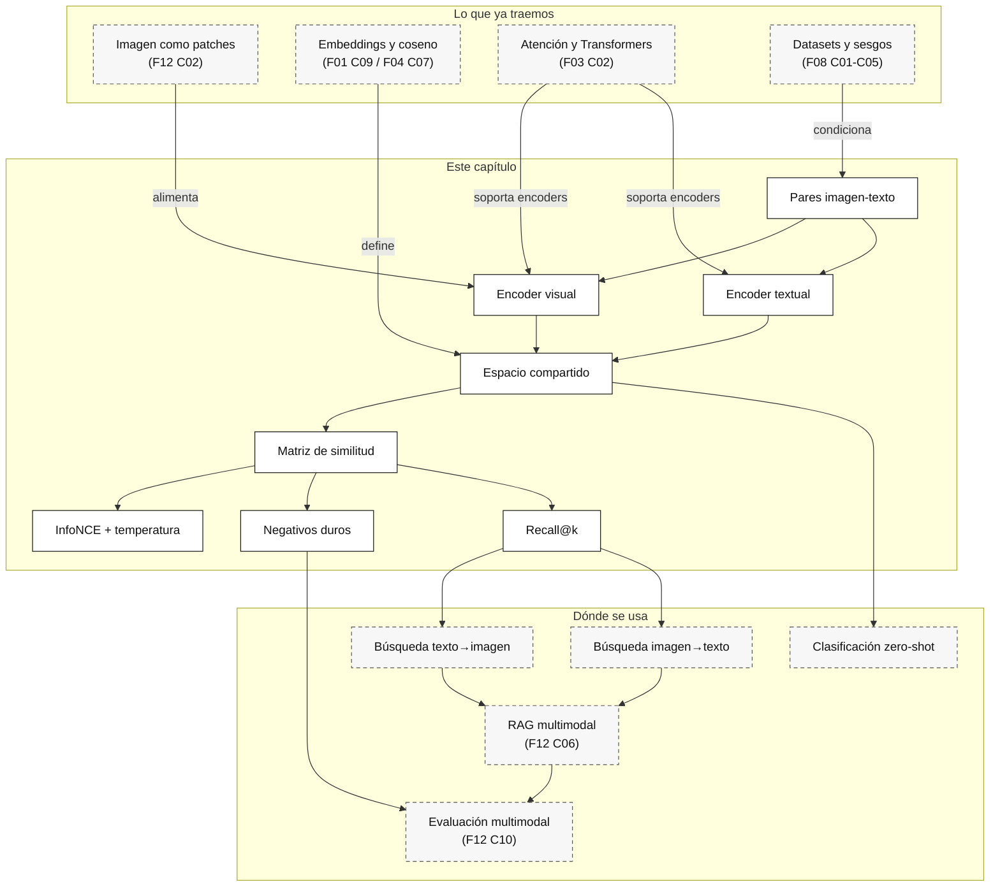

::: {.fasciculo-subtitle}
Facsímil 12 · IA multimodal y sistemas que perciben
:::

# Capítulo 03: CLIP y aprendizaje contrastivo: alinear texto e imagen

## Qué deberías poder hacer al terminar

En el capítulo anterior vimos cómo una imagen se convierte en patches y tokens visuales. Ahora damos el salto que permite muchas experiencias que parecen naturales: buscar una imagen con una frase, clasificar imágenes con nombres de clases escritos en lenguaje natural o encontrar productos parecidos sin entrenar un clasificador específico para cada etiqueta.

La idea central de CLIP es sencilla de decir y muy potente de usar: entrenar un encoder de imagen y un encoder de texto para que la imagen y su descripción queden cerca en el mismo espacio vectorial.^[Radford, A. et al. (2021). Learning Transferable Visual Models From Natural Language Supervision. *Proceedings of the 38th International Conference on Machine Learning*, 8748-8763. https://arxiv.org/abs/2103.00020. CLIP popularizó el entrenamiento contrastivo imagen-texto a gran escala y mostró un uso muy práctico de clasificación zero-shot.] Pero si lo dejamos en esa frase, suena a humo. Lo importante para ingeniería está en los pares, la matriz de similitud, la temperatura, los negativos y las métricas.

Al terminar este capítulo deberías poder hacer esto:

| Resultado de aprendizaje | Evidencia de que lo sabes hacer |
|---|---|
| Explicar un entrenamiento contrastivo imagen-texto. | Puedes dibujar imagen encoder, texto encoder, matriz de similitudes y diagonal positiva. |
| Calcular una similitud coseno. | Sabes comparar embeddings normalizados sin convertirlo en magia semántica. |
| Entender la temperatura en el softmax. | Puedes explicar por qué una distribución se vuelve más o menos agresiva. |
| Leer `Recall@k` en retrieval multimodal. | No confundes ranking bonito con evaluación seria. |
| Detectar negativos duros. | Sabes buscar casos parecidos que rompen el sistema antes de producción. |
| Ejecutar un kit de ranking. | Descargas el laboratorio, generas la matriz y justificas una decisión. |

La frase central del capítulo es esta:

> CLIP no aprende “la verdad” de una imagen. Aprende una geometría útil entre imágenes y textos, y esa geometría hay que evaluarla con casos reales.

## La escena: buscar una silla sin tener la etiqueta exacta

Imagina un catálogo interno con miles de productos. Alguien busca: “silla negra de oficina con ruedas y respaldo alto”. En una base de datos perfecta, tendríamos esa descripción exacta en metadatos. Pero la vida suele ser menos limpia: unas fichas dicen “silla ergonómica”, otras “asiento oficina”, otras tienen foto buena y texto pobre.

Un sistema imagen-texto permite hacer algo útil: codificar la frase como vector, codificar las imágenes como vectores y ordenar por similitud. Si funciona bien, la silla correcta aparece arriba aunque la etiqueta exacta no exista.

Ahora cambia el dominio. En soporte, quieres encontrar capturas parecidas: “botón desactivado por campo obligatorio”. En documentación, quieres localizar una factura con tabla de importes. En industria, quieres buscar un manómetro con aguja en zona alta. Son tareas distintas, pero comparten una idea: **comparar representaciones de modalidades distintas**.

La trampa es creer que una búsqueda que “parece” acertar ya sirve. Puede fallar por fondo visual, texto ambiguo, clases mal redactadas, dominios no vistos, sesgos del dataset o descripciones demasiado pobres. Por eso este capítulo insiste en medir.

## Volvemos al caso guía: recuperar casos parecidos

En la solicitud de beca bloqueada, CLIP o un modelo similar no debería decidir la resolución final. Sí puede ayudar a recuperar evidencias o casos parecidos:

| Consulta | Qué podría recuperar | Qué no debe decidir solo |
|---|---|---|
| “solicitud de beca bloqueada por documento pendiente” | Capturas parecidas de formularios bloqueados. | Si la política vigente permite enviar o no. |
| “documento de política de becas con fecha límite” | PDFs o páginas parecidas. | Si el expediente concreto cumple la cláusula. |
| “captura con botón desactivado y alerta roja” | Incidencias visualmente similares. | La causa operativa si la tabla de estados contradice la UI. |

El patrón útil es: retrieval primero, decisión después. El ranking trae candidatos. El sistema completo debe leer evidencia, validar estado, citar fuente y bloquear si hay conflicto.

## Lectura de ingeniería: CLIP como ranking, no como veredicto

CLIP y los modelos contrastivos son extraordinariamente útiles cuando el problema es encontrar candidatos. Esa palabra, “candidatos”, es la clave. Un ranking no es una decisión final. Si buscas “botón desactivado por documento pendiente” y recuperas cinco capturas parecidas, has reducido el espacio de búsqueda. Todavía no has demostrado que el caso actual tenga la misma causa, ni que la política sea la misma, ni que la persona pueda enviar la solicitud.

El aprendizaje contrastivo funciona porque empuja pares relacionados a estar cerca y pares no relacionados a estar lejos. Pero esa geometría hereda el mundo que vio durante entrenamiento: descripciones ruidosas, sesgos visuales, dominios sobrerrepresentados, textos incompletos y asociaciones que pueden no valer en tu producto. En un catálogo general puede funcionar muy bien. En documentos administrativos con formularios internos, quizá necesita evaluación privada y negativos duros diseñados a mano.

### Qué hace bien y qué no debes pedirle

Un modelo CLIP-like sirve muy bien para **recuperar**: dame imágenes parecidas a este texto, textos parecidos a esta imagen o candidatos visuales cercanos a una clase descrita en lenguaje natural. Ese uso encaja con catálogos, buscadores internos, deduplicación visual, clasificación inicial y routing de documentos. Pero no conviene tratarlo como un verificador final. La similitud no entiende permisos, reglas de negocio, vigencia legal, estado operativo ni consecuencias.

En el caso de beca, un ranking puede traer capturas similares a “formulario bloqueado por documento pendiente”. Eso es útil para encontrar patrones y ejemplos. Pero la causa real debe comprobarse en fuentes más fuertes: tabla de estados, política vigente y región concreta de la UI. Si el primer resultado del ranking muestra otra beca, otra convocatoria o una alerta visual parecida con una causa distinta, una decisión automática sería frágil.

### Los negativos duros son el examen de verdad

El aprendizaje contrastivo se ve bonito cuando los negativos son fáciles. “Gato” frente a “avión” separa bien. En ingeniería nos importan los negativos que se parecen demasiado: una factura con la misma plantilla pero moneda distinta, una captura con botón desactivado por otra razón, una página de política antigua, un producto visualmente parecido pero de categoría prohibida, una gráfica con la misma forma pero otro eje. Esos negativos duros revelan si el ranking distingue lo que el negocio necesita distinguir.

Por eso un dataset privado de evaluación no debería contener solo ejemplos correctos y errores obvios. Debe incluir confusiones esperables. En una práctica útil, el alumno debería poder abrir el reporte y decir: “el sistema recupera bien casos visualmente parecidos, pero confunde documentos administrativos con capturas de soporte cuando la descripción menciona beca; necesito metadatos o reranking”. Esa frase ya es ingeniería: identifica el fallo, no se limita a decir que “el modelo va regular”.

### Cómo se usa como componente

Un ingeniero debería leer cada resultado de CLIP como una hipótesis: “esto se parece a la consulta”. La siguiente capa debe comprobar si la evidencia real aguanta. Si recuperas una factura parecida, necesitas leer campos. Si recuperas una página de política, necesitas sección y versión. Si recuperas una captura de UI, necesitas región y estado. Si recuperas un vídeo o una imagen con texto, necesitas tratar ese texto como dato, no como instrucción.

La pregunta práctica no es “¿CLIP acierta?”. Es “¿el ranking trae lo que necesito antes de gastar en una llamada más cara o tomar una decisión sensible?”. Por eso en producción miramos Recall@k, casos difíciles, cobertura por dominio y ejemplos donde el primer resultado parece plausible pero lleva a una conclusión equivocada. También miramos coste de indexado, frecuencia de refresco, idioma de las consultas, plantillas de prompt para clases y qué filtros deterministas se aplican antes o después del ranking.

Un diseño razonable suele parecerse a esto: filtros duros por permisos y tipo de documento; ranking contrastivo para traer candidatos; reranking o extracción especializada para comprobar evidencia; decisión con reglas o modelo más caro; y registro de la fuente usada. CLIP no desaparece en ese flujo. Ocupa su sitio correcto.

## Qué problema resuelve CLIP

CLIP resuelve una forma de alineación: hacer que texto e imagen vivan en un espacio donde podamos compararlos. Esto encaja con la taxonomía de aprendizaje multimodal: representación, alineación y fusión son problemas distintos.^[Baltrušaitis, T., Ahuja, C. y Morency, L.-P. (2019). Multimodal Machine Learning: A Survey and Taxonomy. *IEEE Transactions on Pattern Analysis and Machine Intelligence*, 41(2), 423-443. https://doi.org/10.1109/TPAMI.2018.2798607.]

En un sistema CLIP-like hay dos encoders:

| Encoder | Entrada | Salida |
|---|---|---|
| Encoder visual | Imagen ya preprocesada: patches, CNN features o tokens visuales. | Vector de imagen. |
| Encoder textual | Texto tokenizado: descripción, clase o prompt. | Vector de texto. |

Después ambos vectores se comparan. Si una imagen y su texto corresponden, deberían estar cerca. Si no corresponden, deberían estar más lejos.

La consecuencia práctica es enorme:

| Uso | Qué permite |
|---|---|
| Búsqueda texto->imagen | “Muéstrame capturas con botón desactivado”. |
| Búsqueda imagen->texto | “Qué descripción encaja mejor con esta imagen”. |
| Clasificación zero-shot | Comparar una imagen contra textos de clases: “foto de factura”, “foto de producto”, “captura de app”. |
| Detección de duplicados aproximados | Agrupar imágenes semánticamente parecidas. |
| Filtrado previo para VLM | Recuperar candidatos antes de pedir razonamiento más caro. |

Pero CLIP no sustituye todo. No garantiza OCR preciso, no valida importes, no entiende permisos, no da evidencia espacial por sí solo y no convierte una búsqueda en una decisión de negocio. Es una pieza de representación y ranking.

## Qué no resuelve CLIP

Esta sección es importante porque CLIP se presta a demos muy vistosas. Si buscas “factura con total”, puede encontrar una imagen parecida. Eso no significa que haya leído el total ni que pueda aprobar una operación.

| Necesidad | Por qué CLIP no basta | Pieza que suele faltar |
|---|---|---|
| Leer texto pequeño | El embedding puede capturar semántica general sin OCR fiable. | OCR, VLM con lectura, recorte de región o parser documental. |
| Citar una región exacta | Un vector global no dice necesariamente qué patch justificó la salida. | Grounding, bounding boxes, evidencia por región. |
| Validar importes | La similitud visual no recalcula sumas ni impuestos. | Reglas, extracción estructurada y validación numérica. |
| Saber estado operativo | La imagen puede estar desactualizada. | Consulta a tabla, API o sistema fuente. |
| Autorizar una acción | Recuperar una captura parecida no da permiso. | Política, aprobación y trazas. |
| Explicar causalidad | Cercanía vectorial no demuestra causa. | Modelo de tarea, evidencia y revisión. |

En nuestro caso guía, CLIP puede recuperar capturas y políticas similares. La causa final de la beca bloqueada sale de combinar captura, PDF, tabla de estados y contrato de salida.

## El mecanismo: pares positivos y negativos

Supón un batch con \(B\) pares imagen-texto:

$$
\{(I_1, T_1), (I_2, T_2), \dots, (I_B, T_B)\}
$$

Cada imagen \(I_i\) tiene un texto positivo \(T_i\). Dentro del mismo batch, los otros textos funcionan como negativos para esa imagen. Es decir, para \(I_1\), el positivo es \(T_1\), y \(T_2, T_3, \dots, T_B\) son negativos.

El esquema mínimo es:

1. Codificar imágenes.
2. Codificar textos.
3. Normalizar vectores.
4. Calcular matriz de similitud.
5. Empujar la diagonal hacia arriba.
6. Empujar el resto hacia abajo.

No hace falta pensar todavía en millones de ejemplos. Con seis pares ya se entiende el mecanismo. La clave es que el modelo no recibe una clase cerrada como “silla”. Recibe muchos pares de imagen y texto y aprende a separar correspondencias.

## Similitud coseno

La similitud coseno compara dirección entre vectores:

$$
\operatorname{sim}(u,v)=\frac{u \cdot v}{\lVert u\rVert \lVert v\rVert}
$$

| Símbolo | Significado | En CLIP |
|---|---|---|
| \(u\) | Vector de una modalidad. | Embedding de imagen. |
| \(v\) | Vector de otra modalidad. | Embedding de texto. |
| \(u \cdot v\) | Producto escalar. | Aumenta si apuntan en direcciones parecidas. |
| \(\lVert u\rVert\), \(\lVert v\rVert\) | Normas de los vectores. | Evitan que gane solo el vector más grande. |

Cuando normalizamos embeddings, el producto escalar y el coseno quedan muy relacionados. En términos de ingeniería, esto hace que podamos indexar y rankear con operaciones vectoriales.

La matriz de similitudes para un batch de \(B\) pares es:

$$
S_{ij} = \operatorname{sim}(f_{\text{img}}(I_i), f_{\text{text}}(T_j))
$$

| Pieza | Qué significa |
|---|---|
| \(f_{\text{img}}\) | Encoder de imagen. |
| \(f_{\text{text}}\) | Encoder de texto. |
| \(S_{ij}\) | Similitud entre la imagen \(i\) y el texto \(j\). |
| Diagonal \(S_{ii}\) | Pares positivos del batch. |
| Fuera de diagonal | Negativos del batch. |

La diagonal debería ser alta. Las celdas altas fuera de diagonal son confusiones. Y esas confusiones son oro para evaluar.

<svg id="f12-c03-matriz-contrastiva" xmlns="http://www.w3.org/2000/svg" viewBox="0 0 1320 900" role="img" aria-label="Matriz contrastiva imagen texto con diagonal positiva y negativos duros">
  <rect width="1320" height="900" fill="#FFFFFF"/>
  <defs>
    <marker id="f12c03-arrow" markerWidth="10" markerHeight="10" refX="8" refY="3" orient="auto" markerUnits="strokeWidth">
      <path d="M0,0 L8,3 L0,6 Z" fill="#111111"/>
    </marker>
    <style>
      .title { font-family: Inter, Arial, sans-serif; fill: #111111; font-weight: 700; }
      .text { font-family: Inter, Arial, sans-serif; fill: #111111; }
      .muted { font-family: Inter, Arial, sans-serif; fill: #555555; }
      .tiny { font-family: Inter, Arial, sans-serif; fill: #666666; font-size: 12px; }
      .box { fill: #FFFFFF; stroke: #111111; stroke-width: 1.3; }
      .soft { fill: #F6F6F6; stroke: #222222; stroke-width: 1.1; }
    </style>
  </defs>

  <text x="62" y="62" font-size="28" class="title">Aprendizaje contrastivo imagen-texto</text>
  <text x="62" y="94" font-size="15" class="muted">La diagonal son pares positivos. Las celdas oscuras fuera de diagonal son negativos duros.</text>

  <rect x="62" y="140" width="235" height="250" rx="12" class="box"/>
  <text x="180" y="172" text-anchor="middle" font-size="16" class="title">Encoder visual</text>
  <rect x="96" y="212" width="70" height="54" rx="8" class="soft"/>
  <rect x="188" y="212" width="70" height="54" rx="8" class="soft"/>
  <rect x="96" y="292" width="70" height="54" rx="8" class="soft"/>
  <rect x="188" y="292" width="70" height="54" rx="8" class="soft"/>
  <text x="180" y="368" text-anchor="middle" class="tiny">imágenes → vectores normalizados</text>

  <rect x="62" y="468" width="235" height="250" rx="12" class="box"/>
  <text x="180" y="500" text-anchor="middle" font-size="16" class="title">Encoder textual</text>
  <rect x="96" y="540" width="162" height="34" rx="8" class="soft"/>
  <rect x="96" y="592" width="162" height="34" rx="8" class="soft"/>
  <rect x="96" y="644" width="162" height="34" rx="8" class="soft"/>
  <text x="180" y="700" text-anchor="middle" class="tiny">descripciones → vectores normalizados</text>

  <line x1="297" y1="268" x2="390" y2="344" stroke="#111111" stroke-width="1.4" marker-end="url(#f12c03-arrow)"/>
  <line x1="297" y1="592" x2="390" y2="486" stroke="#111111" stroke-width="1.4" marker-end="url(#f12c03-arrow)"/>

  <rect x="390" y="166" width="514" height="514" rx="14" fill="#FAFAFA" stroke="#111111" stroke-width="1.3"/>
  <text x="647" y="202" text-anchor="middle" font-size="17" class="title">Matriz S de similitud coseno</text>
  <text x="647" y="226" text-anchor="middle" class="tiny">S_ij = sim(imagen_i, texto_j)</text>

  <g transform="translate(500 274)">
    <rect x="0" y="0" width="64" height="64" fill="#111111" stroke="#111111"/>
    <rect x="64" y="0" width="64" height="64" fill="#E8E8E8" stroke="#CCCCCC"/>
    <rect x="128" y="0" width="64" height="64" fill="#DADADA" stroke="#CCCCCC"/>
    <rect x="192" y="0" width="64" height="64" fill="#EFEFEF" stroke="#CCCCCC"/>
    <rect x="256" y="0" width="64" height="64" fill="#F5F5F5" stroke="#CCCCCC"/>

    <rect x="0" y="64" width="64" height="64" fill="#EEEEEE" stroke="#CCCCCC"/>
    <rect x="64" y="64" width="64" height="64" fill="#111111" stroke="#111111"/>
    <rect x="128" y="64" width="64" height="64" fill="#777777" stroke="#111111"/>
    <rect x="192" y="64" width="64" height="64" fill="#E8E8E8" stroke="#CCCCCC"/>
    <rect x="256" y="64" width="64" height="64" fill="#B9B9B9" stroke="#111111"/>

    <rect x="0" y="128" width="64" height="64" fill="#EDEDED" stroke="#CCCCCC"/>
    <rect x="64" y="128" width="64" height="64" fill="#E9E9E9" stroke="#CCCCCC"/>
    <rect x="128" y="128" width="64" height="64" fill="#111111" stroke="#111111"/>
    <rect x="192" y="128" width="64" height="64" fill="#CFCFCF" stroke="#CCCCCC"/>
    <rect x="256" y="128" width="64" height="64" fill="#ECECEC" stroke="#CCCCCC"/>

    <rect x="0" y="192" width="64" height="64" fill="#F2F2F2" stroke="#CCCCCC"/>
    <rect x="64" y="192" width="64" height="64" fill="#E3E3E3" stroke="#CCCCCC"/>
    <rect x="128" y="192" width="64" height="64" fill="#D1D1D1" stroke="#CCCCCC"/>
    <rect x="192" y="192" width="64" height="64" fill="#111111" stroke="#111111"/>
    <rect x="256" y="192" width="64" height="64" fill="#D9D9D9" stroke="#CCCCCC"/>

    <rect x="0" y="256" width="64" height="64" fill="#E7E7E7" stroke="#CCCCCC"/>
    <rect x="64" y="256" width="64" height="64" fill="#BEBEBE" stroke="#111111"/>
    <rect x="128" y="256" width="64" height="64" fill="#EFEFEF" stroke="#CCCCCC"/>
    <rect x="192" y="256" width="64" height="64" fill="#D6D6D6" stroke="#CCCCCC"/>
    <rect x="256" y="256" width="64" height="64" fill="#111111" stroke="#111111"/>

    <text x="32" y="-16" text-anchor="middle" class="tiny">T1</text>
    <text x="96" y="-16" text-anchor="middle" class="tiny">T2</text>
    <text x="160" y="-16" text-anchor="middle" class="tiny">T3</text>
    <text x="224" y="-16" text-anchor="middle" class="tiny">T4</text>
    <text x="288" y="-16" text-anchor="middle" class="tiny">T5</text>
    <text x="-18" y="38" text-anchor="end" class="tiny">I1</text>
    <text x="-18" y="102" text-anchor="end" class="tiny">I2</text>
    <text x="-18" y="166" text-anchor="end" class="tiny">I3</text>
    <text x="-18" y="230" text-anchor="end" class="tiny">I4</text>
    <text x="-18" y="294" text-anchor="end" class="tiny">I5</text>
  </g>

  <line x1="904" y1="423" x2="990" y2="423" stroke="#111111" stroke-width="1.5" marker-end="url(#f12c03-arrow)"/>

  <rect x="990" y="166" width="268" height="514" rx="14" class="box"/>
  <text x="1124" y="202" text-anchor="middle" font-size="17" class="title">Entrenamiento y uso</text>
  <rect x="1024" y="246" width="200" height="58" rx="10" class="soft"/>
  <text x="1124" y="270" text-anchor="middle" font-size="13" class="text">softmax(S / τ)</text>
  <text x="1124" y="288" text-anchor="middle" class="tiny">temperatura controla confianza</text>
  <rect x="1024" y="336" width="200" height="58" rx="10" class="soft"/>
  <text x="1124" y="360" text-anchor="middle" font-size="13" class="text">InfoNCE simétrica</text>
  <text x="1124" y="378" text-anchor="middle" class="tiny">imagen→texto y texto→imagen</text>
  <rect x="1024" y="426" width="200" height="58" rx="10" class="soft"/>
  <text x="1124" y="450" text-anchor="middle" font-size="13" class="text">retrieval</text>
  <text x="1124" y="468" text-anchor="middle" class="tiny">rankear candidatos</text>
  <rect x="1024" y="516" width="200" height="58" rx="10" fill="#111111" stroke="#111111"/>
  <text x="1124" y="540" text-anchor="middle" font-size="13" fill="#FFFFFF" font-family="Inter, Arial, sans-serif">auditoría</text>
  <text x="1124" y="558" text-anchor="middle" font-size="12" fill="#DDDDDD" font-family="Inter, Arial, sans-serif">Recall@k + negativos duros</text>

  <rect x="390" y="742" width="868" height="70" rx="12" fill="#F7F7F7" stroke="#111111"/>
  <text x="824" y="770" text-anchor="middle" font-size="14" class="title">Lectura importante</text>
  <text x="824" y="794" text-anchor="middle" font-size="13" class="muted">Una celda oscura fuera de diagonal no es un fallo que esconder: es el caso que debes añadir al set de evaluación.</text>

  <text x="1252" y="858" text-anchor="end" font-size="11" fill="#888888" opacity="0.55">IA para gente curiosa / Facsímil 12 / Capítulo 03 / 686f6c61</text>
</svg>

## Temperatura y softmax

La similitud sola no basta para entrenar. Necesitamos convertir puntuaciones en una distribución de probabilidad. Para una imagen \(I_i\), comparamos contra todos los textos del batch y aplicamos softmax:

$$
P(T_j \mid I_i) =
\frac{\exp(S_{ij} / \tau)}
{\sum_{k=1}^{B} \exp(S_{ik} / \tau)}
$$

| Símbolo | Significado |
|---|---|
| \(S_{ij}\) | Similitud entre imagen \(i\) y texto \(j\). |
| \(B\) | Tamaño del batch. |
| \(\tau\) | Temperatura. |
| \(P(T_j \mid I_i)\) | Probabilidad asignada al texto \(j\) para la imagen \(i\). |

La temperatura \(\tau\) es muy importante:

| Temperatura | Efecto | Riesgo |
|---|---|---|
| Baja | Vuelve el softmax más concentrado: el top gana mucho. | Puede volverse demasiado confiado ante diferencias pequeñas. |
| Alta | Suaviza diferencias entre candidatos. | Puede separar peor positivos y negativos. |

En producción no solemos tocar la temperatura de un CLIP entrenado como si fuera un dial mágico, pero sí conviene entender el concepto porque reaparece en decodificación, clasificación, calibración y ranking. Es la misma idea general que vimos al hablar de parámetros de generación: una distribución puede ser más puntiaguda o más suave.

## Pérdida InfoNCE

La pérdida contrastiva busca que el positivo tenga más probabilidad que los negativos. Una forma de escribir la pérdida imagen->texto para un par \(i\) es:

$$
\mathcal{L}^{I \rightarrow T}_i =
-\log
\frac{\exp(S_{ii} / \tau)}
{\sum_{j=1}^{B} \exp(S_{ij} / \tau)}
$$

Y de forma simétrica, texto->imagen:

$$
\mathcal{L}^{T \rightarrow I}_i =
-\log
\frac{\exp(S_{ii} / \tau)}
{\sum_{j=1}^{B} \exp(S_{ji} / \tau)}
$$

La pérdida total suele promediar ambas direcciones:

$$
\mathcal{L} =
\frac{1}{2B}\sum_{i=1}^{B}
\left(
\mathcal{L}^{I \rightarrow T}_i +
\mathcal{L}^{T \rightarrow I}_i
\right)
$$

Esta familia de objetivos conecta con aprendizaje contrastivo y con ideas como InfoNCE, popularizadas en representación contrastiva.^[Oord, A. van den, Li, Y. y Vinyals, O. (2018). Representation Learning with Contrastive Predictive Coding. https://arxiv.org/abs/1807.03748. El trabajo formuló una pérdida contrastiva influyente para aprender representaciones separando positivos y negativos.]

No memorices la fórmula como si fuera decoración. Lee lo que obliga a hacer:

| Parte | Lectura práctica |
|---|---|
| Numerador \(\exp(S_{ii}/\tau)\) | Queremos subir el score del par correcto. |
| Denominador | Comparamos contra todos los candidatos del batch. |
| \(-\log\) | Penaliza mucho si el positivo recibe poca probabilidad. |
| Dirección simétrica | No basta imagen->texto; también queremos texto->imagen. |

## Qué son los negativos duros

Un negativo duro es un ejemplo incorrecto que se parece mucho al positivo. Para catálogo, puede ser una silla negra muy parecida pero sin ruedas. Para facturas, una pizarra con números puede parecerse visualmente a una tabla. Para soporte, dos capturas de formularios pueden compartir layout aunque el error sea distinto.

Los negativos duros son incómodos y necesarios. Si tu evaluación solo tiene casos fáciles, el sistema parecerá mejor de lo que es.

| Tipo de negativo | Ejemplo | Qué revela |
|---|---|---|
| Visualmente parecido | Dos productos casi iguales. | El embedding no separa atributos finos. |
| Textualmente parecido | “Factura con tabla” frente a “pizarra con columnas”. | El texto no contiene suficiente criterio. |
| Dominio parecido | Capturas de dos apps internas. | El modelo agrupa por estética, no por causa. |
| Fondo parecido | Fotos en el mismo entorno. | El dataset enseña correlaciones de fondo. |
| Clase incompleta | “Silla” cuando importa “silla con ruedas”. | La etiqueta es demasiado pobre. |

Si encuentras un negativo duro, no lo escondas. Añádelo al set de evaluación y decide si necesitas mejor texto, metadatos, filtros, OCR, reranking o revisión humana.

## Zero-shot: útil, pero no mágico

Una de las aportaciones prácticas de CLIP fue mostrar clasificación zero-shot con prompts de texto. En vez de entrenar un clasificador para cada clase, comparamos la imagen contra descripciones:

- “una foto de una factura”
- “una captura de una aplicación”
- “una foto de una silla de oficina”
- “un manómetro industrial”
- “una pizarra con planificación”

La clase con mayor similitud gana. Esto puede funcionar sorprendentemente bien, pero depende muchísimo de cómo escribas las clases, del dominio, del idioma, de la imagen y del dataset de entrenamiento.

| Decisión | Qué probaría |
|---|---|
| Redacción de clase | Comparar “factura” frente a “documento contable con tabla de importes”. |
| Idioma | Probar español, inglés o ambos si el modelo fue entrenado mayoritariamente en inglés. |
| Prompts plantilla | “una foto de ...”, “una captura de ...”, “un documento que contiene ...”. |
| Negativos explícitos | Añadir clases que suelen confundirse. |
| Métrica por slice | Ver si falla en capturas oscuras, documentos escaneados, productos parecidos o texto pequeño. |

Zero-shot no significa “sin evaluación”. Significa “sin entrenamiento específico para esa tarea”. La evaluación sigue siendo obligatoria.

## Datasets imagen-texto y ruido

CLIP se entrenó con pares imagen-texto a gran escala. El enfoque abrió una línea muy influyente: usar lenguaje natural como supervisión amplia para aprender representaciones visuales transferibles.^[Radford, A. et al. (2021). Learning Transferable Visual Models From Natural Language Supervision. *Proceedings of the 38th International Conference on Machine Learning*, 8748-8763. https://arxiv.org/abs/2103.00020.] Datasets abiertos como LAION-5B muestran la escala y los retos de construir colecciones masivas imagen-texto.^[Schuhmann, C. et al. (2022). LAION-5B: An Open Large-Scale Dataset for Training Next Generation Image-Text Models. *Advances in Neural Information Processing Systems 35*. https://arxiv.org/abs/2210.08402.]

Aquí conviene ser serio. Los pares web pueden ser ruidosos:

| Ruido | Ejemplo | Consecuencia |
|---|---|---|
| Texto incompleto | Imagen de producto con título genérico. | El modelo aprende señales vagas. |
| Texto incorrecto | Caption que no describe la imagen. | Se ensucia la alineación. |
| Sesgo de dominio | Muchas fotos de stock, pocas capturas internas. | Mal rendimiento en tu aplicación. |
| Idioma desigual | Mucho inglés, poco español técnico. | Prompts en español pueden requerir pruebas cuidadosas. |
| Correlaciones espurias | Fondo, marca de agua, estilo visual. | El ranking aprende atajos. |

Por eso no basta decir “uso CLIP”. Hay que decir qué modelo, qué datos, qué idioma, qué dominio, qué métrica y qué fallos aceptas.

## Cómo usarlo en un proyecto real

Un patrón razonable para una primera búsqueda multimodal:

1. Define la tarea: producto, documento, captura, incidencia, catálogo.
2. Crea un set pequeño de consultas reales.
3. Prepara imágenes reales o sintéticas representativas.
4. Calcula embeddings de imágenes.
5. Calcula embeddings de textos o consultas.
6. Rankea por similitud.
7. Mide `Recall@k`, errores y negativos duros.
8. Añade metadatos y filtros.
9. Decide si necesitas reranking, OCR, VLM o revisión humana.

Ejemplo para catálogo:

| Capa | Decisión |
|---|---|
| Imagen | Foto principal, fondo recortado, varias vistas si existen. |
| Texto | Nombre, descripción, atributos importantes. |
| Metadatos | Categoría, color, talla, disponibilidad, precio. |
| Ranking | Embedding multimodal + filtros de negocio. |
| Métrica | `Recall@10`, precisión por categoría, tasa de confusiones caras. |
| Revisión | Muestras de errores con negativos duros. |

Ejemplo para soporte:

| Capa | Decisión |
|---|---|
| Imagen | Captura de pantalla, recortes de alerta, modo claro/oscuro. |
| Texto | Descripción del usuario y etiquetas internas. |
| OCR | Extraer mensajes visibles si el texto pequeño decide. |
| Ranking | Recuperar incidencias parecidas. |
| Métrica | `Recall@5` de caso similar y utilidad para resolver. |
| Revisión | Confirmar antes de sugerir una acción irreversible. |

## Métricas que no deberías saltarte

`Recall@k` mide si el elemento correcto aparece entre los \(k\) primeros resultados:

$$
\operatorname{Recall@k} =
\frac{\text{consultas con positivo en top k}}{\text{número total de consultas}}
$$

| Métrica | Qué responde | Cuidado |
|---|---|---|
| `Recall@1` | ¿El primero suele ser el correcto? | Muy exigente; útil si el usuario ve solo una respuesta. |
| `Recall@5` | ¿El correcto aparece entre varias opciones? | Útil si hay interfaz de selección. |
| MRR | ¿A qué distancia aparece el positivo? | Penaliza que el positivo baje en ranking. |
| Margen positivo | ¿Cuánto separa el positivo del mejor negativo? | Margen bajo anticipa fragilidad. |
| Error por slice | ¿Dónde falla? | Es lo que descubre problemas de dominio, idioma o formato. |

No midas solo media global. Divide por categoría, idioma, resolución, fuente, tipo de imagen, presencia de texto, dominio y coste de error.

### Cuando `Recall@1 = 1.0` no basta

Un set pequeño puede dar `Recall@1 = 1.0` y aun así no estar listo. Mira el margen. Si el positivo gana por muy poco, una imagen real un poco borrosa, una descripción más corta o una clase nueva pueden romper el ranking.

| Señal | Lectura |
|---|---|
| Positivo top 1 con margen alto | Buen candidato, aunque hay que seguir midiendo por slices. |
| Positivo top 1 con margen bajo | Parece correcto, pero es frágil. Añade negativos duros. |
| Positivo en top 5 pero no top 1 | Puede servir si la interfaz muestra varias opciones. No sirve para decisión automática. |
| Negativo visualmente muy cercano | Necesitas atributos, metadatos, OCR, filtros o reranking. |
| Error concentrado en un dominio | El problema no es “CLIP”; es distribución de datos y tarea. |

En el laboratorio, al añadir `grant_form_blocked` y `grant_policy_pdf`, el sistema sigue pasando, pero el margen medio baja. Eso es bueno pedagógicamente: enseña que hacer el dataset más realista reduce la comodidad de la métrica y obliga a mirar errores.

## Dónde volverá a aparecer

Este capítulo es la bisagra entre representación visual y sistemas multimodales completos.

| Capítulo futuro | Qué hereda |
|---|---|
| [Capítulo 04](/libro/fasciculo-12/#capitulo-04) | Los VLMs conectan representación visual con generación de lenguaje, pero CLIP enseña la alineación básica. |
| [Capítulo 05](/libro/fasciculo-12/#capitulo-05) | Document AI puede usar embeddings, pero necesita evidencia por campo y layout. |
| [Capítulo 06](/libro/fasciculo-12/#capitulo-06) | RAG multimodal usa retrieval sobre texto, imágenes, páginas, tablas o regiones. |
| [Capítulo 10](/libro/fasciculo-12/#capitulo-10) | Las métricas de retrieval reaparecen en evaluación multimodal. |

Y conecta con facsímiles anteriores:

| Tema anterior | Conexión |
|---|---|
| [Embeddings](/libro/fasciculo-04/#capitulo-07) | Misma lógica vectorial, ahora cruzando modalidades. |
| [RAG](/libro/fasciculo-04/#capitulo-09) | Retrieval no siempre recupera texto; también puede recuperar imágenes o páginas. |
| [Datasets](/libro/fasciculo-08/#capitulo-01) | Los pares imagen-texto son datos de entrenamiento y evaluación con sesgos propios. |
| [Evaluación](/libro/fasciculo-07/) | Un ranking debe medirse con casos reales, no con ejemplos bonitos. |

## Dónde solía tropezar yo

| Tropiezo | Por qué es un problema | Antídoto |
|---|---|---|
| **Decir “CLIP entiende imágenes”** | Es una frase demasiado grande para una herramienta de representación. | Habla de embeddings, similitud, ranking y evaluación. |
| **No construir negativos duros** | El sistema parece perfecto con casos fáciles. | Añade confusiones realistas al dataset. |
| **Creer que zero-shot elimina el trabajo** | Solo elimina entrenamiento específico, no evaluación. | Mide prompts, clases, idioma y slices. |
| **Usar solo texto corto de clase** | “Factura” puede ser peor que una descripción operativa. | Redacta clases como criterios, no como etiquetas pobres. |
| **No combinar metadatos** | El vector puede traer productos parecidos pero no disponibles o incorrectos. | Usa filtros, reglas de negocio y reranking. |

## Manos a la obra

<!-- kit: labs/f12/c03-clip-ranking/ -->

El kit descargable del capítulo incluye pares imagen-texto sintéticos, una política de evaluación, un script que calcula matriz de similitud, pérdida InfoNCE, `Recall@k`, negativos duros y consultas externas. También incluye dos piezas del caso guía: `grant_form_blocked` y `grant_policy_pdf`, pensadas para que veas cómo una captura de beca puede confundirse con soporte visual o documentación administrativa.

Ejecuta:

```bash
make run
make test
cat output/clip_ranking_report.md
```

Los archivos importantes son:

| Archivo | Qué contiene |
|---|---|
| `data/catalog_pairs.json` | Pares imagen-texto con embeddings sintéticos y consultas externas. |
| `contracts/retrieval_policy.json` | Temperatura, umbrales de `Recall@1` y margen positivo mínimo. |
| `ops/run_contrastive_ranking.py` | Cálculo de similitud coseno, softmax, loss, ranking y errores. |
| `output/similarity_matrix.csv` | Matriz imagen-texto que deberías inspeccionar. |
| `output/retrieval_errors.csv` | Negativos duros o márgenes bajos. |
| `output/contrastive_matrix.svg` | Figura de la matriz con firma del proyecto. |
| `templates/entrega.md` | Plantilla para adaptar el ejercicio a tu caso. |

Qué deberías modificar:

1. Mira la fila de `grant_form_blocked` en `output/similarity_matrix.csv`.
2. Compara su margen con `ui_error` y `grant_policy_pdf`.
3. Añade un producto muy parecido a `black_chair`.
4. Cambia su descripción para que sea ambigua.
5. Ejecuta `make run`.
6. Mira si baja el margen positivo o aparece un negativo duro.
7. Escribe qué harías: más metadatos, mejor texto, filtro por categoría, reranking, OCR o revisión humana.

La práctica buena no termina diciendo “Recall@1 = 1.0”. Termina explicando qué confusión aparecería en un proyecto real y cómo la controlarías antes de que llegue al usuario.

## Cómo encaja todo

Este mapa tiene tres zonas. A la izquierda están las representaciones que ya conocemos. En el centro está el aprendizaje contrastivo: pares, encoders, matriz y pérdida. A la derecha están los usos: búsqueda, clasificación zero-shot, RAG multimodal y evaluación.



## Vocabulario aprendido

| Término | Definición |
|---|---|
| **Par positivo** | Imagen y texto que deberían quedar cerca en el espacio compartido. |
| **Negativo** | Candidato incorrecto que debería quedar lejos del positivo. |
| **Negativo duro** | Negativo muy parecido que revela una confusión importante. |
| **Espacio compartido** | Espacio vectorial donde se comparan embeddings de imagen y texto. |
| **Similitud coseno** | Métrica que compara dirección entre vectores normalizados. |
| **Temperatura** | Parámetro que controla la suavidad del softmax. |
| **InfoNCE** | Pérdida contrastiva que favorece positivos frente a negativos. |
| **Recall@k** | Métrica de recuperación: positivo dentro de los \(k\) primeros. |
| **Zero-shot** | Uso sin entrenamiento específico para esa tarea, normalmente con prompts de clase. |

## Antes de pasar página

Antes de avanzar, comprueba que puedes responder estas preguntas:

- [ ] ¿Puedo explicar qué representa una celda \(S_{ij}\) en la matriz imagen-texto?
- [ ] ¿Puedo decir por qué la diagonal debería ser alta?
- [ ] ¿Puedo explicar qué hace la temperatura en el softmax?
- [ ] ¿Puedo leer la pérdida InfoNCE sin repetir la fórmula de memoria?
- [ ] ¿Puedo diseñar tres negativos duros para un catálogo, soporte o documentos?
- [ ] ¿Puedo medir `Recall@k` y explicar qué significa para una interfaz real?
- [ ] ¿Puedo ejecutar el kit y justificar una mejora del ranking?

## En resumen

| Idea | Qué deberías llevarte |
|---|---|
| CLIP alinea modalidades. | Entrena embeddings de imagen y texto para que puedan compararse. |
| La matriz manda. | La diagonal son positivos; fuera de diagonal aparecen errores y negativos. |
| Temperatura no es decoración. | Controla cómo de concentrada es la distribución al entrenar. |
| `Recall@k` es obligatorio. | Un retrieval multimodal se evalúa por ranking, no por impresiones. |
| Zero-shot no elimina evaluación. | Solo evita entrenar un clasificador específico; los fallos siguen existiendo. |
| Los negativos duros son valiosos. | Son los casos que hacen que el sistema sea defendible. |

## Para saber más

Radford, A. et al. (2021). Learning Transferable Visual Models From Natural Language Supervision. *Proceedings of the 38th International Conference on Machine Learning*, 8748-8763. https://arxiv.org/abs/2103.00020

Oord, A. van den, Li, Y. y Vinyals, O. (2018). Representation Learning with Contrastive Predictive Coding. https://arxiv.org/abs/1807.03748

Schuhmann, C. et al. (2022). LAION-5B: An Open Large-Scale Dataset for Training Next Generation Image-Text Models. *Advances in Neural Information Processing Systems 35*. https://arxiv.org/abs/2210.08402

Dosovitskiy, A. et al. (2021). An Image is Worth 16x16 Words: Transformers for Image Recognition at Scale. *International Conference on Learning Representations*. https://arxiv.org/abs/2010.11929

Vaswani, A. et al. (2017). Attention Is All You Need. *Advances in Neural Information Processing Systems 30*. https://arxiv.org/abs/1706.03762

Baltrušaitis, T., Ahuja, C. y Morency, L.-P. (2019). Multimodal Machine Learning: A Survey and Taxonomy. *IEEE Transactions on Pattern Analysis and Machine Intelligence*, 41(2), 423-443. https://doi.org/10.1109/TPAMI.2018.2798607

LeCun, Y., Bengio, Y. y Hinton, G. (2015). Deep learning. *Nature*, 521, 436-444. https://doi.org/10.1038/nature14539
