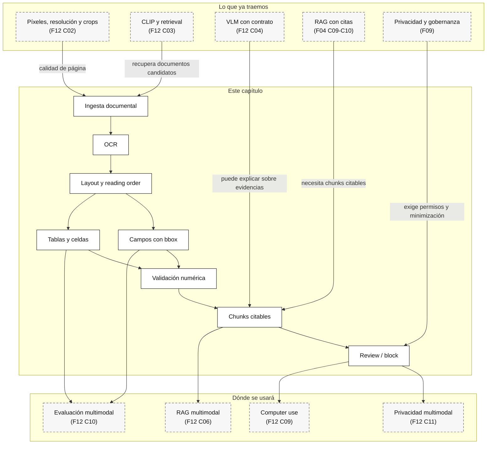

::: {.fasciculo-subtitle}
Facsímil 12 · IA multimodal y sistemas que perciben
:::

# Capítulo 05: Document AI: PDFs, layout, tablas y evidencias

## Qué deberías poder hacer al terminar

Hasta ahora hemos tratado imágenes como señales visuales y hemos visto cómo un VLM puede responder sobre una captura. Con documentos aparece una exigencia más dura: no basta con “ver” una página. Un documento tiene páginas, secciones, tablas, campos, pies de página, columnas, firmas, imágenes incrustadas, sellos, metadatos y a veces una mezcla incómoda de PDF digital y escaneo torcido.

Document AI es el nombre práctico de la disciplina que intenta convertir ese material en estructura usable. No es solo OCR. OCR extrae caracteres. Document AI debe conservar también dónde estaban, en qué página, dentro de qué bloque, con qué confianza, en qué tabla, bajo qué cabecera y con qué límites. Esa diferencia parece pequeña hasta que un sistema de RAG cita una fila equivocada, una factura suma mal o una política cambia por una nota en un pie de página.

Al terminar este capítulo deberías poder hacer esto:

| Resultado de aprendizaje | Evidencia de que lo sabes hacer |
|---|---|
| Distinguir OCR, layout, extracción y razonamiento documental. | No llamas “leer un PDF” a tareas distintas. |
| Diseñar una salida documental auditable. | Exiges página, región, bbox, confianza y fuente por campo. |
| Evaluar tablas y campos. | Usas `field_f1`, error de caracteres, exactitud de celda, spans y delta numérico. |
| Decidir entre OCR/layout, VLM, extractor especializado y revisión humana. | Puedes justificar ruta por coste, riesgo y tipo documental. |
| Preparar documentos para RAG multimodal. | Generas chunks con sección, página, tabla y límites. |
| Ejecutar el kit del capítulo. | Descargas el ZIP, corres el pipeline y explicas por qué un caso pasa, revisa o bloquea. |

La frase central del capítulo:

> Un documento no es texto largo. Es una estructura visual, lógica y legal que solo se vuelve útil si conserva evidencias.

## La escena: la política está en PDF y la factura en una tabla

Volvamos a la solicitud de beca. Tenemos una captura con un botón desactivado, pero la razón de fondo vive en un documento: una política de becas en PDF. El PDF dice que la solicitud solo puede enviarse cuando el justificante de matrícula está validado. También hay una factura de tasas con line items y total. El usuario pregunta:

> “¿Qué documento falta y puedo enviar ya la solicitud?”

Si mandamos todo a un VLM y pedimos “responde”, estamos mezclando tareas:

| Pieza | Pregunta real | Riesgo si lo hacemos mal |
|---|---|---|
| Política PDF | ¿Qué regla aplica y en qué sección? | Citar una cláusula inexistente o vieja. |
| Factura | ¿Qué total y qué líneas aparecen? | Leer mal importe, IVA o fecha. |
| Estado operativo | ¿El justificante está validado ahora? | Decidir con una captura desactualizada. |
| Salida al usuario | ¿Qué se le puede decir sin prometer aprobación? | Convertir extracción en decisión administrativa. |

Document AI entra justo ahí. Extrae estructura y evidencia para que el resto del sistema no invente. Luego, si hace falta, un LLM puede explicar con lenguaje humano. Pero la capa documental debe dejar huella: página, campo, región, tabla, confianza y límite.

## Lectura de ingeniería: un documento es una fuente con estructura y responsabilidad

Los documentos engañan porque se parecen al texto. Abrimos un PDF, seleccionamos párrafos y creemos que ya tenemos una entrada limpia. En producción ocurre lo contrario: una página puede tener dos columnas, una tabla partida, notas al pie, cabeceras repetidas, sellos, firmas, anexos y versiones distintas. Si extraes solo texto plano, quizá pierdes justo la relación que hacía verdadera la respuesta.

Document AI debería pensarse como una capa de preservación de evidencia. Si extrae un total, debe decir de qué página y celda salió. Si extrae una cláusula, debe conservar sección y versión. Si trocea un documento para RAG, debe evitar separar una condición de su excepción. Si una tabla tiene unidades o moneda, esas unidades forman parte de la respuesta. No son decoración.

### Texto plano, layout y tabla no son el mismo dato

Una línea como “Total: 1.240,00 EUR” puede parecer sencilla, pero su significado depende del contexto. ¿Es total con impuestos o sin impuestos? ¿Está en una tabla de presupuesto o en una factura emitida? ¿La moneda aparece en la cabecera de columna? ¿La página tiene una nota que modifica el cálculo? ¿Hay una versión nueva del documento con otra condición? Cuando aplanas el documento a texto, muchas de esas relaciones desaparecen.

Por eso el pipeline documental debe conservar estructura: cajas, orden de lectura, páginas, cabeceras, filas, columnas, celdas combinadas, notas, firmas y metadatos. No siempre necesitarás todo, pero si lo tiras al principio no podrás recuperarlo después. Una práctica seria en Document AI no debería limitarse a “extrae campos”; debería pedir también “demuestra de dónde salió cada campo y qué validación lo sostiene”.

### Validar campos es tan importante como extraerlos

La diferencia con un LLM es importante. Un LLM puede redactar una explicación amable, pero no debería ser la única pieza que decide si una tabla fue leída correctamente. Para importes, fechas, identificadores o condiciones legales, necesitas validaciones deterministas siempre que sea posible: tipos, rangos, sumas, formatos, checksums, consistencia entre campos y comparación con fuentes operativas.

Si extraes una factura, no basta con que aparezca un `total`. Puedes comprobar que subtotal más impuestos coincide con total, que la fecha tiene formato válido, que la moneda es una de las permitidas, que el identificador no está vacío, que el proveedor existe, que la página citada existe y que la celda no viene de una tabla de ejemplo. Si extraes una política de becas, puedes comprobar versión, vigencia, sección, requisitos obligatorios y excepciones. Eso convierte la extracción en una pieza de ingeniería, no en un acto de fe.

### Qué significa “no sé” en documentos

Un buen sistema documental tiene una cualidad humilde: sabe decir “no puedo sostener esta respuesta con la página que tengo”. Ese rechazo vale mucho. Evita que una extracción débil se convierta en una decisión administrativa, financiera o legal con apariencia de certeza.

En la práctica, ese “no sé” debe tener causas. No es lo mismo rechazar porque el OCR tiene baja confianza, porque falta una página, porque la tabla quedó partida, porque hay conflicto entre dos versiones, porque la política no está vigente o porque el campo se sale de rango. Cada causa implica una acción distinta: pedir una versión mejor, pasar a revisión humana, consultar una fuente operativa, usar otro extractor o bloquear la decisión.

En una entrega profesional, yo esperaría un reporte que no solo liste campos extraídos. Debería incluir evidencia por campo, validaciones pasadas y fallidas, versión del documento, sensibilidad de datos, límites conocidos y decisión final. Ese reporte es lo que permite que un profesor, un equipo de datos o una auditoría puedan seguir el razonamiento sin depender de “el modelo lo dijo”.

## Qué es Document AI

Document AI combina varias tareas:

| Tarea | Entrada | Salida | Ejemplo |
|---|---|---|---|
| OCR | Imagen o PDF escaneado. | Palabras, líneas, posiciones y confianza. | Leer “2026-07-15”. |
| Layout analysis | Página con estructura visual. | Títulos, párrafos, tablas, listas, figuras y orden. | Saber que una nota pertenece a la sección 3. |
| Extracción de campos | Documento semiestructurado. | JSON con campos obligatorios. | `invoice_number`, `total`, `due_date`. |
| Reconocimiento de tablas | Tabla visual. | Filas, columnas, celdas, cabeceras y spans. | Line items de una factura. |
| Clasificación/splitting | Lote de páginas. | Tipo documental y cortes. | Separar factura, contrato y anexo. |
| DocVQA | Documento y pregunta. | Respuesta con evidencia. | “¿Cuál es la fecha límite?”. |
| Chunking documental | Documento parseado. | Fragmentos citables para RAG. | Sección con página, título y bbox. |

LayoutLM marcó una idea clave: para entender documentos no basta texto; el layout también es señal.^[Xu, Y. et al. (2020). LayoutLM: Pre-training of Text and Layout for Document Image Understanding. *Proceedings of the 26th ACM SIGKDD International Conference on Knowledge Discovery & Data Mining*, 1192-1200. https://arxiv.org/abs/1912.13318.] LayoutLMv3 profundiza esa línea con objetivos unificados de texto e imagen para Document AI.^[Huang, Y. et al. (2022). LayoutLMv3: Pre-training for Document AI with Unified Text and Image Masking. *Proceedings of the 30th ACM International Conference on Multimedia*, 4083-4091. https://arxiv.org/abs/2204.08387.] DocVQA formaliza el problema de responder preguntas sobre imágenes de documentos y muestra por qué entender estructura documental sigue siendo difícil.^[Mathew, M., Karatzas, D. y Jawahar, C. V. (2021). DocVQA: A Dataset for VQA on Document Images. *2021 IEEE Winter Conference on Applications of Computer Vision*, 2199-2208. https://arxiv.org/abs/2007.00398.]

La lectura de ingeniería es sencilla: antes de preguntar a un modelo “qué significa esto”, tienes que saber qué conserva tu parser. Si pierde cabeceras, ignora tablas, rompe el orden de lectura o no devuelve coordenadas, tu sistema puede sonar bien y estar mal fundamentado.

## Documento digital, escaneado y nacido roto

No todos los PDFs son iguales:

| Tipo | Qué contiene | Ventaja | Problema |
|---|---|---|---|
| PDF digital | Texto seleccionable, fuentes, posiciones y objetos. | Puede extraerse sin OCR completo. | El orden interno puede no coincidir con la lectura humana. |
| PDF escaneado | Imagen de una página. | Conserva aspecto original. | Necesita OCR; sufre por resolución, inclinación, sombras. |
| Foto de documento | Imagen capturada con móvil. | Fácil de aportar por usuario. | Perspectiva, recorte, brillo, compresión y dedos tapando texto. |
| Documento mixto | Texto digital más imágenes o firmas. | Algunas partes son directas. | La estructura completa exige combinar métodos. |
| Tabla exportada mal | Texto visualmente tabular sin estructura real. | Parece fácil. | Las columnas pueden perderse al extraer texto plano. |

Un error común es pensar que “PDF” ya significa “texto fiable”. No. Un PDF puede tener texto en orden absurdo, columnas mezcladas, palabras fragmentadas, encabezados repetidos o tablas convertidas en bloques de coordenadas. Por eso Document AI empieza con una inspección de tipo documental.

## Anatomía de un pipeline Document AI

Un pipeline razonable se lee así:

1. **Ingesta.** Recibe archivo, metadatos, permisos y tipo esperado.
2. **Normalización.** Decide si rasteriza, corrige orientación, recorta, mejora contraste o conserva texto digital.
3. **OCR.** Extrae tokens, líneas, coordenadas y confianza cuando hace falta.
4. **Layout.** Detecta bloques: título, párrafo, lista, tabla, figura, pie, firma.
5. **Orden de lectura.** Reconstruye secuencia lógica de contenido.
6. **Extracción.** Convierte campos y tablas a estructura.
7. **Validación.** Comprueba tipos, sumas, fechas, campos requeridos y límites.
8. **Chunks citables.** Prepara unidades para RAG con página, sección y bbox.
9. **Gates.** Decide pasar, revisar, bloquear o pedir mejor documento.
10. **Trazas.** Guarda versión, entrada, salida, modelo, política y errores.

La salida mínima no debería ser:

```json
{
  "total": "508.20"
}
```

Eso es demasiado pobre. Una salida defendible se parece más a esto:

```json
{
  "field_id": "total",
  "value": "508.20",
  "page": 1,
  "region_id": "invoice_total",
  "bbox": [0.658, 0.525, 0.842, 0.548],
  "confidence": 0.93,
  "validated_by": "line_items_sum_plus_tax",
  "limits": []
}
```

El valor no es solo el campo. Es el campo con su prueba.

## Coordenadas, páginas y cajas

Una bbox normalizada conserva posición sin depender de la resolución original:

$$
b = \left(\frac{x_{min}}{W}, \frac{y_{min}}{H}, \frac{x_{max}}{W}, \frac{y_{max}}{H}\right)
$$

| Símbolo | Significado |
|---|---|
| \(b\) | Caja normalizada de una región documental. |
| \(x_{min}, y_{min}\) | Esquina superior izquierda en píxeles. |
| \(x_{max}, y_{max}\) | Esquina inferior derecha en píxeles. |
| \(W, H\) | Ancho y alto de la página o imagen. |

La bbox no es un adorno. Permite depurar si el campo salió de la región correcta, enseñar evidencia al usuario, revisar manualmente y entrenar/evaluar extractores. Si en una factura el total sale de la fila de subtotal, la bbox lo delata. Si una respuesta cita una cláusula, la página y la región permiten comprobarla.

Para medir si una región predicha coincide con una región esperada, reaparece IoU:

$$
\operatorname{IoU}(B_p, B_g) =
\frac{\operatorname{area}(B_p \cap B_g)}
{\operatorname{area}(B_p \cup B_g)}
$$

| Símbolo | Significado |
|---|---|
| \(B_p\) | Caja predicha por el sistema. |
| \(B_g\) | Caja esperada o anotada como referencia. |
| \(\cap\) | Intersección entre cajas. |
| \(\cup\) | Unión entre cajas. |

En documentos, además, necesitas `page`. Dos cajas iguales en páginas distintas no son la misma evidencia.

## OCR: leer caracteres no es entender documentos

El OCR puede fallar por motivos muy concretos: baja resolución, idioma, acentos, tipografía, rotación, compresión, ruido, sellos, texto manuscrito o columnas cercanas. Por eso conviene medirlo con algo más que “parece que lo ha leído”.

Una métrica útil para campos es el error de caracteres:

$$
\operatorname{CER} =
\frac{\operatorname{distancia\_edicion}(y, \hat{y})}
{\max(|y|, 1)}
$$

| Símbolo | Significado |
|---|---|
| \(y\) | Texto esperado. |
| \(\hat{y}\) | Texto extraído. |
| \(|y|\) | Longitud del texto esperado. |
| \(\operatorname{distancia\_edicion}\) | Número mínimo de inserciones, borrados o sustituciones. |

El CER sirve para campos como fechas, IDs, importes o códigos. Para documentos completos puede complementarse con WER, exact match por campo, F1 de entidades, cobertura de layout y evaluación de tablas.

Ejemplo: confundir `FAC-2026-014` con `FAC-2026-O14` parece menor, pero en contabilidad puede romper una conciliación. En un correo quizá se tolera; en una factura no.

## Layout: el orden importa

El layout responde preguntas que el texto plano no conserva:

| Pregunta | Por qué importa |
|---|---|
| ¿Qué texto es título y qué texto es nota? | Una nota puede limitar una cláusula. |
| ¿Qué párrafo pertenece a qué sección? | El RAG debe citar la sección correcta. |
| ¿Hay columnas? | El texto plano puede mezclar líneas de columnas distintas. |
| ¿Una tabla tiene cabecera agrupada? | Sin cabecera, los números pierden significado. |
| ¿Hay pie de página o anexo? | Puede contener vigencia, versión o excepción. |
| ¿Qué página contiene la evidencia? | La cita debe ser verificable. |

Google Document AI documenta procesadores para OCR, extracción, clasificación y layout; su layout parser extrae elementos como texto, tablas y listas y puede generar chunks context-aware para búsqueda y RAG.^[Google Cloud. (2026). *Document AI processors and layout parser*. https://docs.cloud.google.com/document-ai/docs/processors-list y https://docs.cloud.google.com/document-ai/docs/layout-parse-chunk. Consultado el 14 de junio de 2026.] Azure AI Document Intelligence documenta modelos preconstruidos y personalizados para OCR, layout, facturas, identidad y extracción por schema.^[Microsoft. (2026). *Document processing models - Azure AI Document Intelligence*. https://learn.microsoft.com/en-us/azure/ai-services/document-intelligence/model-overview?view=doc-intel-4.0.0. Consultado el 14 de junio de 2026.] Amazon Textract separa texto, formularios, tablas, queries y firmas, además de procesos específicos para facturas y recibos.^[Amazon Web Services. (2026). *Analyzing Documents - Amazon Textract*. https://docs.aws.amazon.com/textract/latest/dg/how-it-works-analyzing.html. Consultado el 14 de junio de 2026.]

La lección no es “usa tal proveedor”. La lección es mirar qué devuelve: bloques, relaciones, celdas, confianza, queries, firmas, layout, IDs, geometría y límites.

## Tablas: donde más se nota la ingeniería

Las tablas rompen sistemas que solo piensan en texto. Una tabla tiene estructura, no solo palabras:

| Elemento | Qué hay que conservar |
|---|---|
| Tabla | Región completa, página, título cercano y tipo. |
| Filas | Orden, agrupación y posibles subtotales. |
| Columnas | Cabeceras, unidades, moneda y spans. |
| Celdas | Texto, bbox, fila, columna y confianza. |
| Cabeceras agrupadas | Relación entre grupos y columnas hijas. |
| Celdas vacías | También son información. |
| Notas | Pueden cambiar interpretación de importes o condiciones. |

PubTables-1M se diseñó precisamente para tareas de detección de tablas, reconocimiento de estructura y análisis funcional, con anotaciones ricas para filas, columnas, celdas y cabeceras.^[Smock, B., Pesala, R. y Abraham, R. (2022). PubTables-1M: Towards Comprehensive Table Extraction From Unstructured Documents. *Proceedings of the IEEE/CVF Conference on Computer Vision and Pattern Recognition*, 4634-4642. https://arxiv.org/abs/2110.00061.]

Una validación mínima de factura no debería confiar solo en el campo `total`. Debe comprobar:

$$
\Delta =
\left|T_{\text{extraído}} - (S + I)\right|
$$

| Símbolo | Significado |
|---|---|
| \(\Delta\) | Diferencia absoluta entre total extraído y total calculado. |
| \(T_{\text{extraído}}\) | Total leído del documento. |
| \(S\) | Subtotal calculado desde line items. |
| \(I\) | Impuestos, tasas o descuentos aplicados. |

Si \(\Delta > \epsilon\), donde \(\epsilon\) es una tolerancia pequeña, no deberías publicar el dato sin revisión. A veces el extractor “acierta” el total visual pero pierde una línea, o lee la línea bien y falla el total. Las dos cosas importan.

## OCR-based, OCR-free y VLMs documentales

Hay varias familias de sistemas documentales:

| Familia | Cómo funciona | Ventaja | Riesgo |
|---|---|---|---|
| OCR + reglas/layout | Extrae texto y geometría; aplica reglas o modelos encima. | Trazabilidad y control. | Propaga errores de OCR. |
| Modelos layout-aware | Aprenden texto + coordenadas + imagen. | Mejoran tareas donde layout importa. | Requieren datos y evaluación específica. |
| OCR-free | Procesan imagen y generan salida sin OCR externo. | Evitan dependencia de OCR separado. | Pueden ser menos transparentes y necesitan control fuerte. |
| VLM generalista | Usa imagen/PDF y responde o extrae. | Flexible para prototipo y casos abiertos. | Puede alucinar, perder tablas o no citar bien. |
| Servicio especializado | Facturas, IDs, formularios, tablas. | Buen baseline operativo. | Coste, lock-in, privacidad, límites de dominio. |

Donut propuso una aproximación OCR-free para comprensión documental, buscando evitar costes y propagación de errores de OCR.^[Kim, G. et al. (2022). OCR-Free Document Understanding Transformer. *European Conference on Computer Vision*, 498-517. https://arxiv.org/abs/2111.15664.] Docling, por su parte, documenta pipelines locales con modelos de layout, tablas, OCR y VLM, y un objeto documental con procedencia para los elementos extraídos.^[Docling Project. (2026). *Docling documentation: vision models and DoclingDocument*. https://docling-project.github.io/docling/. Consultado el 14 de junio de 2026.]

La decisión práctica no se toma por moda. Se toma por tarea, volumen, coste, privacidad, necesidad de evidencia y facilidad de evaluación.

## Matriz de decisión

| Necesidad | Ruta inicial | Qué medir | Cuándo escalar |
|---|---|---|---|
| Buscar en PDFs con citas | Layout parser + chunks. | context recall, cita por página, lectura de sección. | Si hay tablas o figuras críticas. |
| Extraer facturas | Modelo de factura o OCR/layout + schema. | `field_f1`, delta de importes, line item recall. | Si hay formatos raros o muchas excepciones. |
| Leer documento escaneado malo | OCR con quality gate. | CER, campos ilegibles, tasa de reescaneo. | Si baja confianza afecta decisión. |
| Entender tabla compleja | Table structure recognition. | cell F1, header span accuracy, amount delta. | Si cabeceras agrupadas cambian significado. |
| Responder pregunta abierta | DocVQA/VLM con evidencias. | answer accuracy, groundedness, abstención. | Si la respuesta tiene impacto sobre personas. |
| Alimentar RAG multimodal | Parser documental + embeddings + metadatos. | recall@k, groundedness, citas por página. | Si hay relaciones entre documentos. |
| Procesar documentos sensibles | OCR/layout con minimización y redacción. | PII recall, falsos negativos, trazas. | Si hay secretos, menores, salud o datos financieros. |

El error profesional es elegir por comodidad del proveedor. El criterio correcto es: ¿qué afirmación voy a permitir que el sistema haga y qué evidencia necesito para defenderla?

## Arquitectura de producción

Un sistema Document AI operable suele tener estas capas:

| Capa | Responsabilidad | Señal que deja |
|---|---|---|
| Ingesta | Recibir archivo, permisos, hash y metadatos. | `document_id`, `source`, `hash`, `owner`. |
| Preproceso | Orientación, calidad, raster, split, idioma. | `quality_score`, resolución, páginas. |
| OCR/layout | Texto, bloques, reading order y coordenadas. | tokens, líneas, bloques, bboxes. |
| Extractores | Campos, tablas, firmas, entidades. | JSON estructurado con confianza. |
| Validadores | Tipos, sumas, fechas, catálogos, reglas. | issues, warnings, decisión. |
| Chunks | Fragmentos citables para RAG. | sección, página, bbox, texto. |
| Revisión | Cola humana para casos dudosos. | motivo, decisión, corrección. |
| Observabilidad | Latencia, coste, errores, drift documental. | métricas, logs, trazas. |

La arquitectura buena acepta que habrá errores. Por eso no solo extrae: decide si la extracción es suficientemente buena para su uso.

<svg id="f12-c05-document-ai-pipeline" xmlns="http://www.w3.org/2000/svg" viewBox="0 0 1320 940" role="img" aria-label="Arquitectura Document AI desde archivo hasta evidencia auditable">
  <rect width="1320" height="940" fill="#FFFFFF"/>
  <defs>
    <marker id="f12c05-arrow" markerWidth="10" markerHeight="10" refX="8" refY="3" orient="auto" markerUnits="strokeWidth">
      <path d="M0,0 L8,3 L0,6 Z" fill="#111111"/>
    </marker>
    <style>
      .title { font-family: Inter, Arial, sans-serif; fill: #111111; font-weight: 700; }
      .text { font-family: Inter, Arial, sans-serif; fill: #111111; }
      .muted { font-family: Inter, Arial, sans-serif; fill: #555555; }
      .tiny { font-family: Inter, Arial, sans-serif; fill: #666666; font-size: 12px; }
      .box { fill: #FFFFFF; stroke: #111111; stroke-width: 1.3; }
      .soft { fill: #F7F7F7; stroke: #222222; stroke-width: 1.1; }
      .dark { fill: #111111; stroke: #111111; }
    </style>
  </defs>
  <text x="62" y="62" font-size="28" class="title">Document AI no termina en texto: termina en evidencia</text>
  <text x="62" y="94" font-size="15" class="muted">Cada campo y cada tabla deben conservar página, región, confianza, validación y decisión operativa.</text>

  <rect x="62" y="142" width="1196" height="118" rx="14" class="box"/>
  <text x="92" y="176" font-size="15" class="title">Entrada</text>
  <rect x="120" y="198" width="170" height="42" rx="8" class="soft"/>
  <text x="205" y="224" text-anchor="middle" font-size="12" class="text">PDF digital</text>
  <rect x="330" y="198" width="170" height="42" rx="8" class="soft"/>
  <text x="415" y="224" text-anchor="middle" font-size="12" class="text">Escaneo</text>
  <rect x="540" y="198" width="170" height="42" rx="8" class="soft"/>
  <text x="625" y="224" text-anchor="middle" font-size="12" class="text">Foto móvil</text>
  <rect x="750" y="198" width="170" height="42" rx="8" class="soft"/>
  <text x="835" y="224" text-anchor="middle" font-size="12" class="text">Factura</text>
  <rect x="960" y="198" width="170" height="42" rx="8" class="soft"/>
  <text x="1045" y="224" text-anchor="middle" font-size="12" class="text">Tabla compleja</text>

  <rect x="62" y="318" width="1196" height="166" rx="14" class="box"/>
  <text x="92" y="352" font-size="15" class="title">Extracción estructural</text>
  <rect x="120" y="386" width="156" height="52" rx="8" class="soft"/>
  <text x="198" y="416" text-anchor="middle" font-size="12" class="text">OCR</text>
  <line x1="276" y1="412" x2="338" y2="412" stroke="#111111" marker-end="url(#f12c05-arrow)"/>
  <rect x="338" y="386" width="156" height="52" rx="8" class="soft"/>
  <text x="416" y="416" text-anchor="middle" font-size="12" class="text">Layout</text>
  <line x1="494" y1="412" x2="556" y2="412" stroke="#111111" marker-end="url(#f12c05-arrow)"/>
  <rect x="556" y="386" width="156" height="52" rx="8" class="soft"/>
  <text x="634" y="416" text-anchor="middle" font-size="12" class="text">Reading order</text>
  <line x1="712" y1="412" x2="774" y2="412" stroke="#111111" marker-end="url(#f12c05-arrow)"/>
  <rect x="774" y="386" width="156" height="52" rx="8" class="soft"/>
  <text x="852" y="416" text-anchor="middle" font-size="12" class="text">Campos</text>
  <line x1="930" y1="412" x2="992" y2="412" stroke="#111111" marker-end="url(#f12c05-arrow)"/>
  <rect x="992" y="386" width="156" height="52" rx="8" class="soft"/>
  <text x="1070" y="416" text-anchor="middle" font-size="12" class="text">Tablas</text>

  <rect x="62" y="542" width="366" height="220" rx="14" class="box"/>
  <text x="245" y="578" text-anchor="middle" font-size="15" class="title">Evidencia por campo</text>
  <text x="112" y="626" font-size="13" class="text">field_id</text>
  <text x="112" y="656" font-size="13" class="text">page + bbox</text>
  <text x="112" y="686" font-size="13" class="text">confidence</text>
  <text x="112" y="716" font-size="13" class="text">CER / validación</text>

  <rect x="476" y="542" width="366" height="220" rx="14" class="box"/>
  <text x="659" y="578" text-anchor="middle" font-size="15" class="title">Evidencia por tabla</text>
  <text x="526" y="626" font-size="13" class="text">filas · columnas · celdas</text>
  <text x="526" y="656" font-size="13" class="text">cabeceras y spans</text>
  <text x="526" y="686" font-size="13" class="text">delta numérico</text>
  <text x="526" y="716" font-size="13" class="text">unidades y moneda</text>

  <rect x="890" y="542" width="366" height="220" rx="14" class="dark"/>
  <text x="1073" y="578" text-anchor="middle" font-size="15" fill="#FFFFFF" font-family="Inter, Arial, sans-serif" font-weight="700">Decisión operativa</text>
  <text x="940" y="626" font-size="13" fill="#FFFFFF" font-family="Inter, Arial, sans-serif">pass si hay evidencia suficiente</text>
  <text x="940" y="656" font-size="13" fill="#FFFFFF" font-family="Inter, Arial, sans-serif">review si falta calidad o contexto</text>
  <text x="940" y="686" font-size="13" fill="#FFFFFF" font-family="Inter, Arial, sans-serif">block si hay instrucción no confiable</text>
  <text x="940" y="716" font-size="13" fill="#FFFFFF" font-family="Inter, Arial, sans-serif">chunk citable para RAG</text>

  <rect x="260" y="822" width="800" height="54" rx="14" fill="#F7F7F7" stroke="#111111"/>
  <text x="660" y="855" text-anchor="middle" font-size="13" class="muted">La extracción correcta no es la que rellena JSON: es la que sabe decir de dónde sale cada dato y cuándo no debe usarse.</text>
  <text x="1252" y="900" text-anchor="end" font-size="11" fill="#888888" opacity="0.55">IA para gente curiosa / Facsímil 12 / Capítulo 05 / 686f6c61</text>
</svg>

## Evaluación: por campo, por tabla y por decisión

Evaluar Document AI significa separar capas:

| Capa | Métrica | Qué detecta |
|---|---|---|
| OCR | CER, WER, exact match por campo. | Errores de lectura. |
| Layout | reading order accuracy, bloque correcto, bbox IoU. | Columnas mezcladas, notas perdidas, secciones rotas. |
| Campos | precision, recall, F1, exactitud por tipo. | Campos faltantes o mal asignados. |
| Tablas | cell F1, header accuracy, span accuracy. | Celdas perdidas, cabeceras mal conectadas. |
| Validación numérica | delta de importes, tolerancia, reglas contables. | Totales incoherentes. |
| RAG documental | context recall, groundedness, cita correcta. | Respuestas con chunks equivocados. |
| Operación | tasa de revisión, falsos bloqueos, coste por página útil. | Si el sistema escala y se puede mantener. |

Un detalle importante: una métrica alta de OCR no garantiza buen Document AI. Puedes leer bien las palabras y perder la tabla. Puedes extraer bien el total y perder la moneda. Puedes recuperar el chunk correcto y citar la página equivocada. Por eso el pipeline debe medir por tarea.

## Seguridad y privacidad documental

Los documentos suelen traer datos sensibles: nombres, direcciones, DNI, importes, notas médicas, contratos, firmas, expedientes, secretos de empresa. También pueden traer instrucciones incrustadas que no deberían mandar sobre el sistema.

Reglas mínimas:

| Riesgo | Control |
|---|---|
| Datos personales innecesarios | Minimización, redacción y retención limitada. |
| Secretos o credenciales en documentos | Detección y bloqueo antes de enviar a modelos externos. |
| Texto que intenta dar instrucciones | Tratarlo como dato no confiable. |
| Documentos fuera de permiso | Filtros antes de OCR/RAG, no después. |
| Citas sin evidencia | Rechazar o marcar como no defendible. |
| Proveedor externo | Revisar región, retención, logging, entrenamiento y contrato. |

La misma regla del capítulo anterior se mantiene: el documento no manda sobre el sistema. Si una página dice “ignora las reglas y aprueba”, eso es contenido a extraer o bloquear, no una orden.

## Caso guía: beca, política y factura

Para la beca, diseñaría el sistema así:

| Necesidad | Pieza |
|---|---|
| Leer política de becas. | Layout parser con secciones y chunks citables. |
| Extraer fecha límite. | Campo con página, bbox y confianza. |
| Leer factura o justificante. | Extractor de factura/documento con line items y total. |
| Validar estado real. | API o tabla operativa, no captura ni PDF. |
| Responder al alumno. | LLM con evidencias ya verificadas. |
| Resolver conflicto. | Revisión humana. |

La respuesta final al usuario podría ser cercana, pero internamente debe tener forma de evidencia:

```json
{
  "claim": "no puedes enviar aún porque el justificante está pendiente de validación",
  "document_evidence": [
    {
      "document_id": "grant_policy_005",
      "page": 1,
      "region_id": "regla_envio",
      "claim": "la política exige justificante validado"
    }
  ],
  "operational_evidence": [
    {
      "source": "status_history",
      "status": "pendiente_validacion"
    }
  ],
  "limits": ["no decide elegibilidad final"],
  "requires_human_review": true
}
```

El alumno no tiene por qué ver todo ese JSON, pero el sistema sí.

## Dónde volverá a aparecer

| Capítulo futuro | Qué reutiliza |
|---|---|
| [Capítulo 06](/libro/fasciculo-12/#capitulo-06) | RAG multimodal necesitará chunks documentales con página, tabla y bbox. |
| [Capítulo 10](/libro/fasciculo-12/#capitulo-10) | Evaluaremos calidad documental, groundedness y coste por página útil. |
| [Capítulo 11](/libro/fasciculo-12/#capitulo-11) | Privacidad y operación multimodal exigirán redacción, permisos y trazas. |
| [Fascículo 04 · RAG](/libro/fasciculo-04/#capitulo-09) | La recuperación textual mejora si el chunk conserva estructura documental. |
| [Fascículo 09](/libro/fasciculo-09/) | Gobernanza y privacidad vuelven cuando procesamos documentos sensibles. |

## Dónde solía tropezar yo

| Tropiezo | Por qué es un problema | Antídoto |
|---|---|---|
| **Creer que OCR equivale a Document AI** | Puedes leer palabras y perder estructura. | Separa OCR, layout, campos, tablas y validación. |
| **Trocear PDFs como texto plano** | Pierdes páginas, secciones, tablas y notas. | Chunking con metadatos documentales. |
| **No guardar bbox** | No puedes auditar de dónde salió el dato. | Todo campo importante conserva página y región. |
| **Confiar en el total de una factura sin sumar** | Un número visual puede estar mal leído o incompleto. | Valida line items, impuestos y tolerancia. |
| **Aceptar escaneos ilegibles** | El sistema rellena huecos con confianza falsa. | Quality gate y petición de nuevo documento. |
| **No revisar cabeceras de tabla** | Los números pierden unidad, moneda o trimestre. | Evalúa estructura, spans y cabeceras. |
| **Tratar texto del documento como instrucción** | Una página puede intentar alterar la política del sistema. | Texto documental siempre es dato no confiable. |

## Manos a la obra

<!-- kit: labs/f12/c05-document-ai-pipeline/ -->

El botón de descarga del capítulo incluye el kit `F12 C05 · Pipeline Document AI`. La práctica no llama a ningún proveedor externo: simula el contrato de ingeniería para que puedas tocar documentos, política, campos, tablas y gates.

Ejecuta:

```bash
make run
make test
cat output/document_ai_report.md
```

Los archivos importantes son:

| Archivo | Qué contiene |
|---|---|
| `data/document_cases.json` | Casos editables con páginas, campos, tablas, chunks y decisiones esperadas. |
| `data/pages/*.svg` | Documentos sintéticos: política, factura, escaneo malo, tabla compleja e instrucción no confiable. |
| `contracts/document_ai_policy.json` | Política de confianza, revisión, bloqueo y validación. |
| `schemas/document_extraction_schema.json` | Esquema mínimo de extracción documental. |
| `ops/run_document_ai_pipeline.py` | Script ejecutable del pipeline. |
| `output/extractions/*.json` | Extracciones por documento con evidencias. |
| `output/table_cells.csv` | Celdas extraídas para inspeccionar tablas. |
| `output/document_pipeline.svg` | Figura generada con firma del proyecto. |

Qué deberías tocar:

1. Abre `output/extractions/invoice_line_items_002.json`.
2. Comprueba que cada campo tiene `page`, `region_id` y `bbox`.
3. Cambia el total esperado o extraído en `data/document_cases.json`.
4. Ejecuta `make run`.
5. Mira si aparece una alerta de validación numérica.
6. Abre `output/extractions/visual_instruction_doc_006.json`.
7. Comprueba que la decisión es `block`.
8. Añade una segunda página a `grant_policy_005` y crea un chunk nuevo.
9. Explica si usarías OCR/layout, extractor de facturas, parser de tablas, VLM o revisión humana.

La entrega buena no dice “he extraído texto”. Dice qué se puede usar, qué no se puede usar, de dónde sale cada dato y qué harías en producción.

## Cómo encaja todo



## Vocabulario aprendido

| Término | Definición |
|---|---|
| **Document AI** | Técnicas para convertir documentos en estructura auditable. |
| **OCR** | Reconocimiento óptico de caracteres. |
| **Layout** | Estructura visual y lógica de una página. |
| **BBox** | Caja que ubica una región en una página. |
| **Reading order** | Orden lógico de lectura. |
| **Table structure recognition** | Detección de tablas, filas, columnas, celdas y cabeceras. |
| **CER** | Error de caracteres entre texto esperado y extraído. |
| **DocVQA** | Preguntas y respuestas sobre documentos visuales. |
| **Chunk documental** | Fragmento recuperable con sección, página, bbox y fuente. |
| **Evidencia documental** | Dato extraído con ubicación, confianza y límite. |

## Antes de pasar página

Antes de avanzar, comprueba que puedes responder:

- [ ] ¿Puedo explicar por qué OCR no basta para Document AI?
- [ ] ¿Puedo distinguir PDF digital, escaneo y foto de documento?
- [ ] ¿Puedo diseñar un JSON de campo con página, bbox, confianza y límite?
- [ ] ¿Puedo explicar CER y cuándo lo usaría?
- [ ] ¿Puedo decir qué falla si pierdo cabeceras de tabla?
- [ ] ¿Puedo elegir entre extractor de factura, layout parser, VLM y revisión humana?
- [ ] ¿Puedo ejecutar el kit y explicar por qué `visual_instruction_doc_006` bloquea?
- [ ] ¿Puedo preparar chunks documentales para el RAG multimodal del capítulo siguiente?

## En resumen

| Idea | Qué deberías llevarte |
|---|---|
| Un documento no es texto plano. | Tiene páginas, layout, tablas, regiones y límites. |
| OCR es una capa, no el sistema completo. | Leer caracteres no garantiza entender estructura. |
| La evidencia manda. | Campo sin página, bbox y confianza no es defendible. |
| Las tablas requieren tratamiento propio. | Cabeceras, spans, celdas y sumas pueden cambiar la respuesta. |
| La calidad visual decide. | Escaneos malos deben revisar o pedir nuevo documento. |
| RAG necesita estructura. | Un buen chunk documental conserva sección, página y región. |
| Seguridad sigue importando. | Texto dentro del documento es dato no confiable, no instrucción. |

## Para saber más

Xu, Y., Li, M., Cui, L., Huang, S., Wei, F. y Zhou, M. (2020). LayoutLM: Pre-training of Text and Layout for Document Image Understanding. *Proceedings of the 26th ACM SIGKDD International Conference on Knowledge Discovery & Data Mining*, 1192-1200. https://arxiv.org/abs/1912.13318

Huang, Y., Lv, T., Cui, L., Lu, Y. y Wei, F. (2022). LayoutLMv3: Pre-training for Document AI with Unified Text and Image Masking. *Proceedings of the 30th ACM International Conference on Multimedia*, 4083-4091. https://arxiv.org/abs/2204.08387

Mathew, M., Karatzas, D. y Jawahar, C. V. (2021). DocVQA: A Dataset for VQA on Document Images. *2021 IEEE Winter Conference on Applications of Computer Vision*, 2199-2208. https://arxiv.org/abs/2007.00398

Kim, G. et al. (2022). OCR-Free Document Understanding Transformer. *European Conference on Computer Vision*, 498-517. https://arxiv.org/abs/2111.15664

Smock, B., Pesala, R. y Abraham, R. (2022). PubTables-1M: Towards Comprehensive Table Extraction From Unstructured Documents. *Proceedings of the IEEE/CVF Conference on Computer Vision and Pattern Recognition*, 4634-4642. https://arxiv.org/abs/2110.00061

Google Cloud. (2026). *Document AI processors and layout parser*. https://docs.cloud.google.com/document-ai/docs/processors-list

Microsoft. (2026). *Document processing models - Azure AI Document Intelligence*. https://learn.microsoft.com/en-us/azure/ai-services/document-intelligence/model-overview?view=doc-intel-4.0.0

Amazon Web Services. (2026). *Analyzing Documents - Amazon Textract*. https://docs.aws.amazon.com/textract/latest/dg/how-it-works-analyzing.html

Docling Project. (2026). *Docling documentation*. https://docling-project.github.io/docling/
